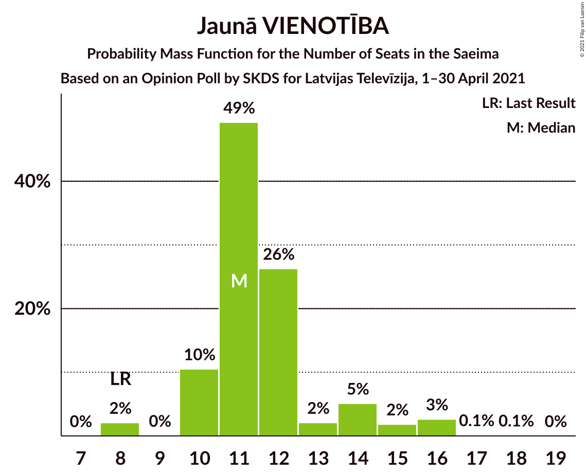
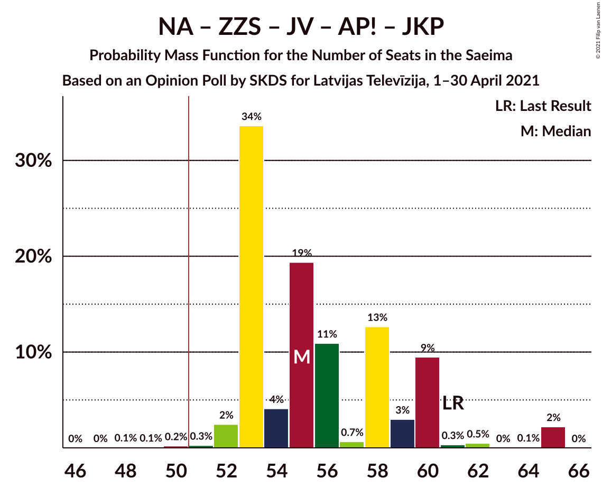
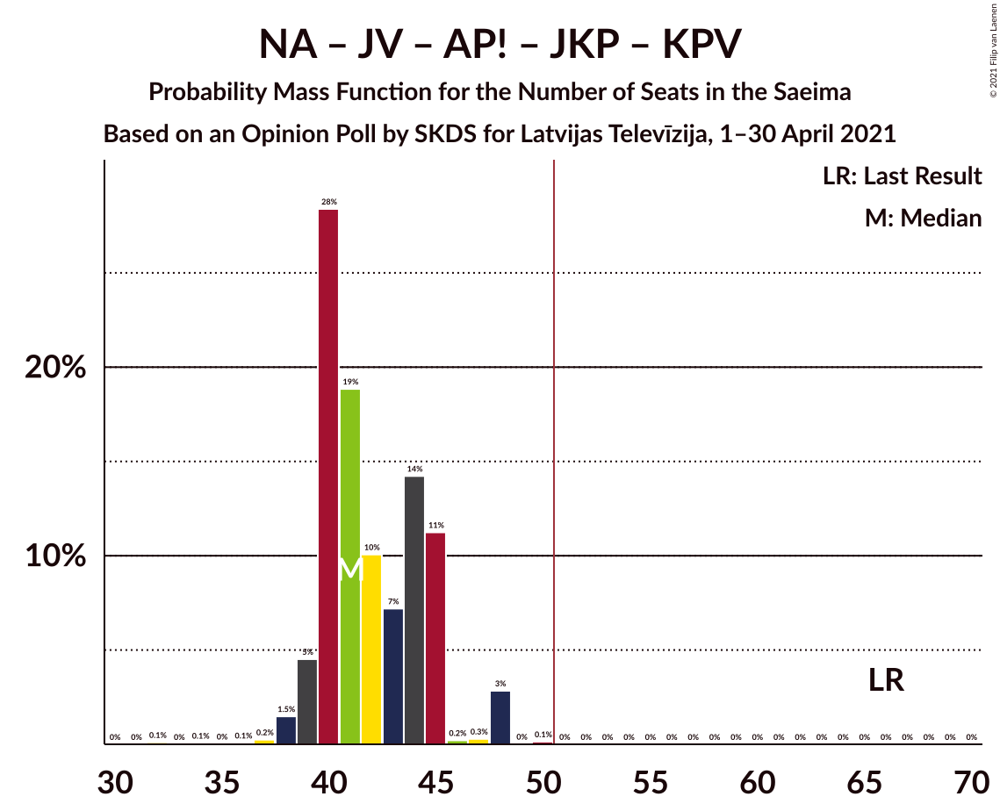
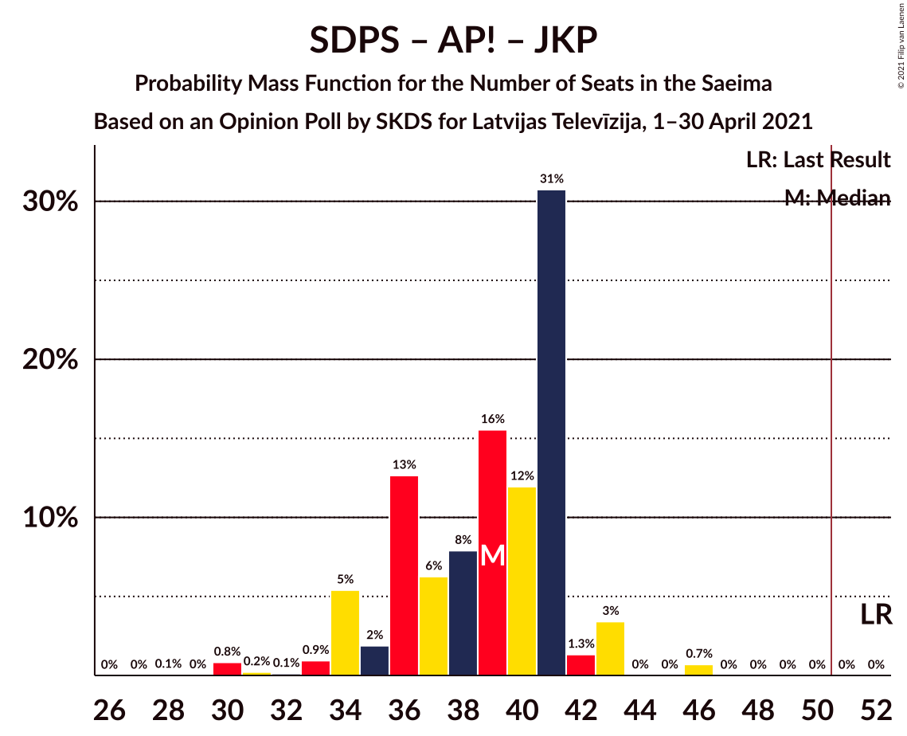
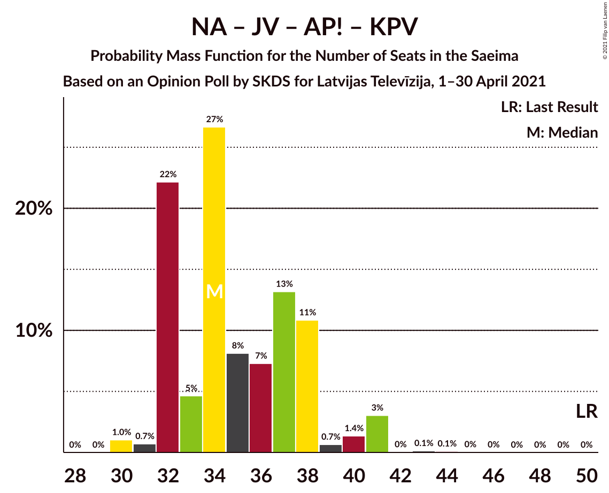
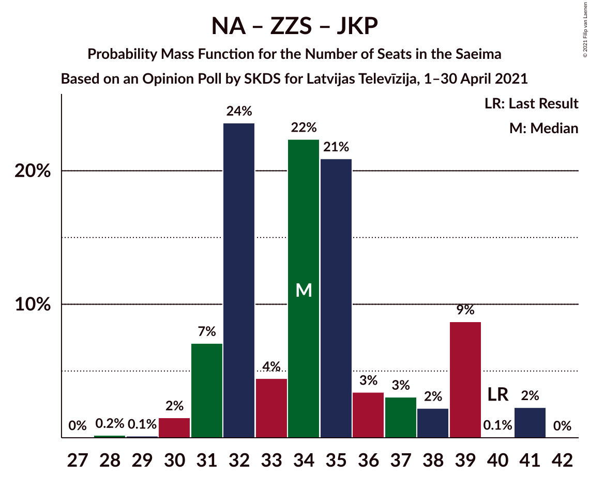
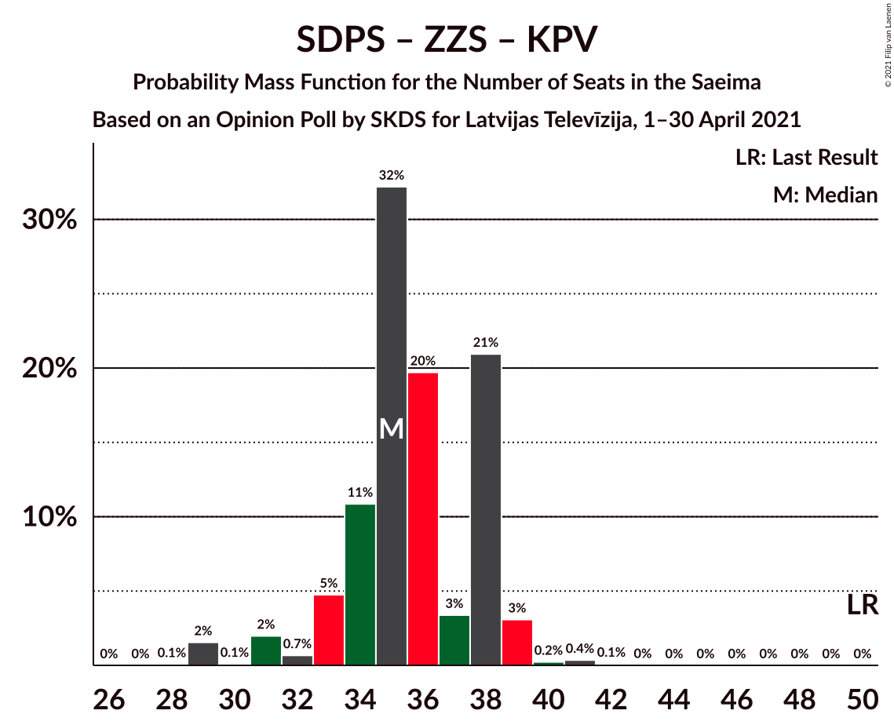
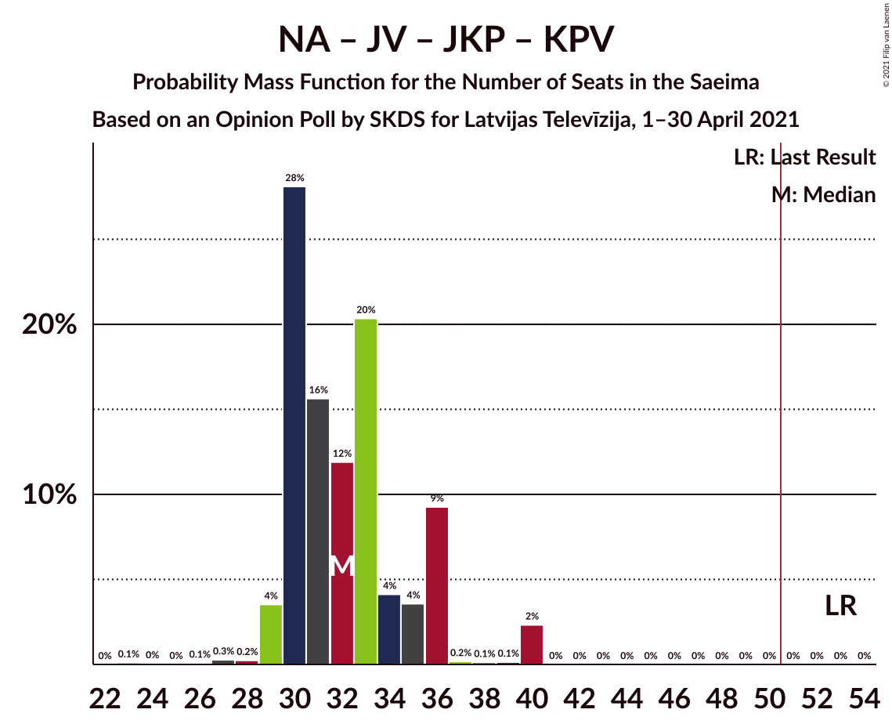
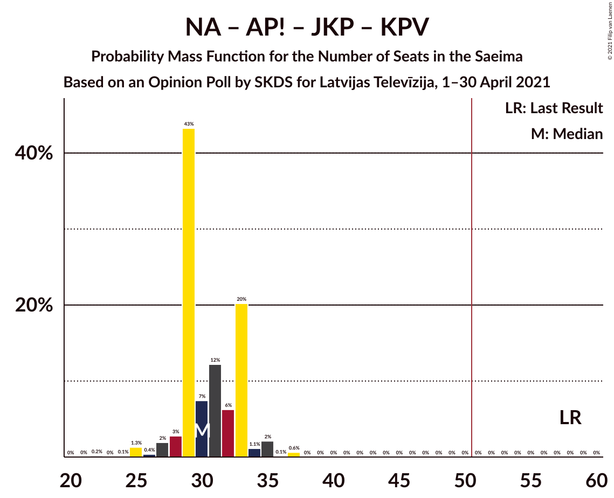
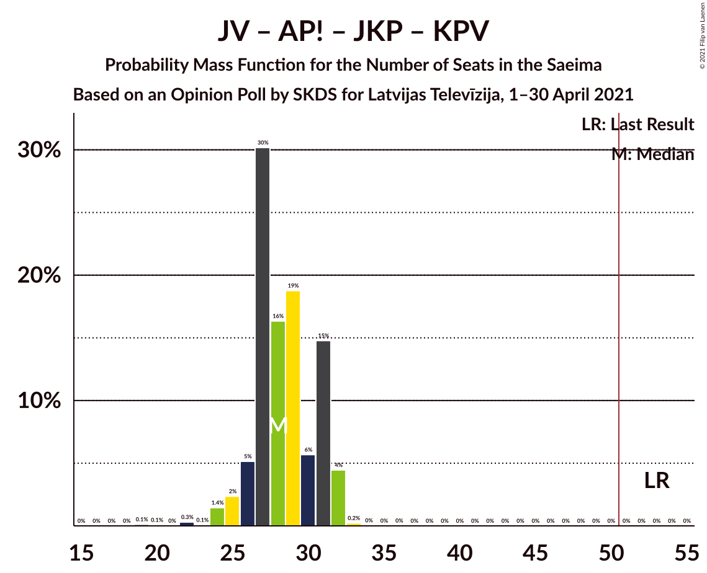

# Opinion Poll by SKDS for Latvijas Televīzija, 1–30 April 2021

<a href="#voting-intentions">Voting Intentions</a> | <a href="#seats">Seats</a> | <a href="#coalitions">Coalitions</a> | <a href="#technical-information">Technical Information</a>

## Voting Intentions

### Confidence Intervals

| Party | Last Result | Poll Result | 80% Confidence Interval | 90% Confidence Interval | 95% Confidence Interval | 99% Confidence Interval |
|:-----:|:-----------:|:-----------:|:-----------------------:|:-----------------------:|:-----------------------:|:-----------------------:|
| Sociāldemokrātiskā partija “Saskaņa” | 19.8% | 20.0% | 18.4–21.9% |17.9–22.5% |17.5–22.9% |16.7–23.8% |
| Nacionālā apvienība „Visu Latvijai!”–„Tēvzemei un Brīvībai/LNNK” | 11.0% | 13.4% | 12.0–15.1% |11.6–15.5% |11.3–15.9% |10.7–16.8% |
| Zaļo un Zemnieku savienība | 9.9% | 12.8% | 11.5–14.4% |11.1–14.9% |10.7–15.3% |10.1–16.1% |
| Jaunā VIENOTĪBA | 6.7% | 11.6% | 10.3–13.2% |10.0–13.6% |9.6–14.0% |9.0–14.8% |
| Attīstībai/Par! | 12.0% | 9.4% | 8.2–10.8% |7.8–11.2% |7.6–11.5% |7.0–12.3% |
| PROGRESĪVIE | 2.6% | 7.4% | 6.4–8.7% |6.1–9.1% |5.9–9.4% |5.4–10.1% |
| Latvijas Krievu savienība | 3.2% | 7.0% | 5.9–8.2% |5.7–8.6% |5.4–8.9% |5.0–9.5% |
| Likums un kārtība | 0.0% | 7.0% | 5.9–8.2% |5.7–8.6% |5.4–8.9% |5.0–9.5% |
| Jaunā konservatīvā partija | 13.6% | 6.5% | 5.5–7.7% |5.2–8.1% |5.0–8.4% |4.6–9.0% |
| Latvijas Reģionu Apvienība | 4.1% | 3.2% | 2.6–4.2% |2.4–4.5% |2.2–4.7% |2.0–5.2% |
| Politiskā partija „KPV LV” | 14.2% | 0.2% | 0.1–0.6% |0.1–0.8% |0.1–0.9% |0.0–1.1% |

*Note:* The poll result column reflects the actual value used in the calculations. Published results may vary slightly, and in addition be rounded to fewer digits.

## Seats

### Confidence Intervals

| Party | Last Result | Median | 80% Confidence Interval | 90% Confidence Interval | 95% Confidence Interval | 99% Confidence Interval |
|:-----:|:-----------:|:------:|:-----------------------:|:-----------------------:|:-----------------------:|:-----------------------:|
| <a href="#sociāldemokrātiskā-partija-“saskaņa”">Sociāldemokrātiskā partija “Saskaņa”</a> | 23 | 22 | 20–25 |19–25 |17–25 |17–26 |
| <a href="#nacionālā-apvienība-„visu-latvijai!”–„tēvzemei-un-brīvībai/lnnk”">Nacionālā apvienība „Visu Latvijai!”–„Tēvzemei un Brīvībai/LNNK”</a> | 13 | 13 | 12–17 |12–17 |12–17 |11–17 |
| <a href="#zaļo-un-zemnieku-savienība">Zaļo un Zemnieku savienība</a> | 11 | 14 | 12–15 |12–17 |11–17 |11–17 |
| <a href="#jaunā-vienotība">Jaunā VIENOTĪBA</a> | 8 | 11 | 10–13 |10–14 |10–16 |8–16 |
| <a href="#attīstībai/par!">Attīstībai/Par!</a> | 13 | 10 | 8–13 |8–13 |7–13 |7–14 |
| <a href="#progresīvie">PROGRESĪVIE</a> | 0 | 7 | 6–8 |6–8 |6–9 |5–9 |
| <a href="#latvijas-krievu-savienība">Latvijas Krievu savienība</a> | 0 | 8 | 5–8 |5–9 |5–10 |0–10 |
| <a href="#likums-un-kārtība">Likums un kārtība</a> | 0 | 7 | 6–10 |6–10 |5–10 |0–11 |
| <a href="#jaunā-konservatīvā-partija">Jaunā konservatīvā partija</a> | 16 | 7 | 6–9 |6–9 |6–9 |0–10 |
| <a href="#latvijas-reģionu-apvienība">Latvijas Reģionu Apvienība</a> | 0 | 0 | 0 |0 |0 |0–6 |
| <a href="#politiskā-partija-„kpv-lv”">Politiskā partija „KPV LV”</a> | 16 | 0 | 0 |0 |0 |0 |

### Sociāldemokrātiskā partija “Saskaņa”

*For a full overview of the results for this party, see the [Sociāldemokrātiskā partija “Saskaņa”](party-sociāldemokrātiskāpartija“saskaņa”.html) page.*

| Number of Seats | Probability | Accumulated | Special Marks |
|:---------------:|:-----------:|:-----------:|:-------------:|
| 17 | 3% | 100% |  |
| 18 | 2% | 97% |  |
| 19 | 5% | 96% |  |
| 20 | 12% | 91% |  |
| 21 | 21% | 79% |  |
| 22 | 28% | 58% | Median |
| 23 | 5% | 30% | Last Result |
| 24 | 0.6% | 24% |  |
| 25 | 22% | 24% |  |
| 26 | 1.5% | 2% |  |
| 27 | 0.5% | 0.5% |  |
| 28 | 0% | 0% |  |

### Nacionālā apvienība „Visu Latvijai!”–„Tēvzemei un Brīvībai/LNNK”

*For a full overview of the results for this party, see the [Nacionālā apvienība „Visu Latvijai!”–„Tēvzemei un Brīvībai/LNNK”](party-nacionālāapvienība„visulatvijai”–„tēvzemeiunbrīvībailnnk”.html) page.*

| Number of Seats | Probability | Accumulated | Special Marks |
|:---------------:|:-----------:|:-----------:|:-------------:|
| 11 | 0.8% | 100% |  |
| 12 | 23% | 99.2% |  |
| 13 | 47% | 76% | Last Result, Median |
| 14 | 7% | 29% |  |
| 15 | 6% | 23% |  |
| 16 | 5% | 16% |  |
| 17 | 11% | 11% |  |
| 18 | 0.1% | 0.1% |  |
| 19 | 0% | 0.1% |  |
| 20 | 0% | 0% |  |

### Zaļo un Zemnieku savienība

*For a full overview of the results for this party, see the [Zaļo un Zemnieku savienība](party-zaļounzemniekusavienība.html) page.*

| Number of Seats | Probability | Accumulated | Special Marks |
|:---------------:|:-----------:|:-----------:|:-------------:|
| 11 | 4% | 100% | Last Result |
| 12 | 11% | 96% |  |
| 13 | 32% | 85% |  |
| 14 | 35% | 53% | Median |
| 15 | 11% | 18% |  |
| 16 | 2% | 7% |  |
| 17 | 5% | 5% |  |
| 18 | 0% | 0.1% |  |
| 19 | 0.1% | 0.1% |  |
| 20 | 0.1% | 0.1% |  |
| 21 | 0% | 0% |  |

### Jaunā VIENOTĪBA

*For a full overview of the results for this party, see the [Jaunā VIENOTĪBA](party-jaunāvienotība.html) page.*

| Number of Seats | Probability | Accumulated | Special Marks |
|:---------------:|:-----------:|:-----------:|:-------------:|
| 8 | 2% | 100% | Last Result |
| 9 | 0% | 98% |  |
| 10 | 10% | 98% |  |
| 11 | 49% | 87% | Median |
| 12 | 26% | 38% |  |
| 13 | 2% | 12% |  |
| 14 | 5% | 10% |  |
| 15 | 2% | 5% |  |
| 16 | 3% | 3% |  |
| 17 | 0.1% | 0.2% |  |
| 18 | 0.1% | 0.1% |  |
| 19 | 0% | 0% |  |

### Attīstībai/Par!

*For a full overview of the results for this party, see the [Attīstībai/Par!](party-attīstībaipar.html) page.*

| Number of Seats | Probability | Accumulated | Special Marks |
|:---------------:|:-----------:|:-----------:|:-------------:|
| 7 | 3% | 100% |  |
| 8 | 25% | 97% |  |
| 9 | 22% | 73% |  |
| 10 | 26% | 50% | Median |
| 11 | 4% | 24% |  |
| 12 | 6% | 20% |  |
| 13 | 13% | 14% | Last Result |
| 14 | 2% | 2% |  |
| 15 | 0% | 0% |  |

### PROGRESĪVIE

*For a full overview of the results for this party, see the [PROGRESĪVIE](party-progresīvie.html) page.*

| Number of Seats | Probability | Accumulated | Special Marks |
|:---------------:|:-----------:|:-----------:|:-------------:|
| 0 | 0% | 100% | Last Result |
| 1 | 0% | 100% |  |
| 2 | 0% | 100% |  |
| 3 | 0% | 100% |  |
| 4 | 0% | 100% |  |
| 5 | 1.3% | 100% |  |
| 6 | 9% | 98.6% |  |
| 7 | 60% | 90% | Median |
| 8 | 25% | 30% |  |
| 9 | 5% | 5% |  |
| 10 | 0.1% | 0.3% |  |
| 11 | 0.2% | 0.2% |  |
| 12 | 0% | 0% |  |

### Latvijas Krievu savienība

*For a full overview of the results for this party, see the [Latvijas Krievu savienība](party-latvijaskrievusavienība.html) page.*

| Number of Seats | Probability | Accumulated | Special Marks |
|:---------------:|:-----------:|:-----------:|:-------------:|
| 0 | 1.0% | 100% | Last Result |
| 1 | 0% | 99.0% |  |
| 2 | 0% | 99.0% |  |
| 3 | 0% | 99.0% |  |
| 4 | 0% | 99.0% |  |
| 5 | 11% | 99.0% |  |
| 6 | 2% | 88% |  |
| 7 | 2% | 86% |  |
| 8 | 78% | 84% | Median |
| 9 | 1.0% | 6% |  |
| 10 | 5% | 5% |  |
| 11 | 0.1% | 0.1% |  |
| 12 | 0% | 0% |  |

### Likums un kārtība

*For a full overview of the results for this party, see the [Likums un kārtība](party-likumsunkārtība.html) page.*

| Number of Seats | Probability | Accumulated | Special Marks |
|:---------------:|:-----------:|:-----------:|:-------------:|
| 0 | 2% | 100% | Last Result |
| 1 | 0% | 98% |  |
| 2 | 0% | 98% |  |
| 3 | 0% | 98% |  |
| 4 | 0% | 98% |  |
| 5 | 1.2% | 98% |  |
| 6 | 23% | 96% |  |
| 7 | 37% | 74% | Median |
| 8 | 4% | 36% |  |
| 9 | 15% | 32% |  |
| 10 | 15% | 17% |  |
| 11 | 2% | 2% |  |
| 12 | 0% | 0% |  |

### Jaunā konservatīvā partija

*For a full overview of the results for this party, see the [Jaunā konservatīvā partija](party-jaunākonservatīvāpartija.html) page.*

| Number of Seats | Probability | Accumulated | Special Marks |
|:---------------:|:-----------:|:-----------:|:-------------:|
| 0 | 2% | 100% |  |
| 1 | 0% | 98% |  |
| 2 | 0% | 98% |  |
| 3 | 0% | 98% |  |
| 4 | 0% | 98% |  |
| 5 | 0% | 98% |  |
| 6 | 25% | 98% |  |
| 7 | 46% | 73% | Median |
| 8 | 9% | 26% |  |
| 9 | 16% | 17% |  |
| 10 | 1.2% | 1.3% |  |
| 11 | 0% | 0% |  |
| 12 | 0% | 0% |  |
| 13 | 0% | 0% |  |
| 14 | 0% | 0% |  |
| 15 | 0% | 0% |  |
| 16 | 0% | 0% | Last Result |

### Latvijas Reģionu Apvienība

*For a full overview of the results for this party, see the [Latvijas Reģionu Apvienība](party-latvijasreģionuapvienība.html) page.*

| Number of Seats | Probability | Accumulated | Special Marks |
|:---------------:|:-----------:|:-----------:|:-------------:|
| 0 | 98% | 100% | Last Result, Median |
| 1 | 0% | 2% |  |
| 2 | 0% | 2% |  |
| 3 | 0% | 2% |  |
| 4 | 0% | 2% |  |
| 5 | 0% | 2% |  |
| 6 | 2% | 2% |  |
| 7 | 0% | 0% |  |

### Politiskā partija „KPV LV”

*For a full overview of the results for this party, see the [Politiskā partija „KPV LV”](party-politiskāpartija„kpvlv”.html) page.*

| Number of Seats | Probability | Accumulated | Special Marks |
|:---------------:|:-----------:|:-----------:|:-------------:|
| 0 | 100% | 100% | Median |
| 1 | 0% | 0% |  |
| 2 | 0% | 0% |  |
| 3 | 0% | 0% |  |
| 4 | 0% | 0% |  |
| 5 | 0% | 0% |  |
| 6 | 0% | 0% |  |
| 7 | 0% | 0% |  |
| 8 | 0% | 0% |  |
| 9 | 0% | 0% |  |
| 10 | 0% | 0% |  |
| 11 | 0% | 0% |  |
| 12 | 0% | 0% |  |
| 13 | 0% | 0% |  |
| 14 | 0% | 0% |  |
| 15 | 0% | 0% |  |
| 16 | 0% | 0% | Last Result |

## Coalitions

### Confidence Intervals

| Coalition | Last Result | Median | Majority? | 80% Confidence Interval | 90% Confidence Interval | 95% Confidence Interval | 99% Confidence Interval |
|:---------:|:-----------:|:------:|:---------:|:-----------------------:|:-----------------------:|:-----------------------:|:-----------------------:|
| Nacionālā apvienība „Visu Latvijai!”–„Tēvzemei un Brīvībai/LNNK” – Zaļo un Zemnieku savienība – Jaunā VIENOTĪBA – Attīstībai/Par! – Jaunā konservatīvā partija | 61 | 55 | 99.6% | 53–60 | 53–60 | 52–62 | 51–65 |
| Nacionālā apvienība „Visu Latvijai!”–„Tēvzemei un Brīvībai/LNNK” – Zaļo un Zemnieku savienība – Jaunā VIENOTĪBA – Attīstībai/Par! | 45 | 47 | 28% | 45–53 | 45–53 | 45–56 | 45–58 |
| Nacionālā apvienība „Visu Latvijai!”–„Tēvzemei un Brīvībai/LNNK” – Zaļo un Zemnieku savienība – Jaunā VIENOTĪBA – Jaunā konservatīvā partija | 48 | 45 | 12% | 43–51 | 43–51 | 41–52 | 41–57 |
| Nacionālā apvienība „Visu Latvijai!”–„Tēvzemei un Brīvībai/LNNK” – Zaļo un Zemnieku savienība – Attīstībai/Par! – Jaunā konservatīvā partija | 53 | 43 | 0.1% | 42–48 | 41–48 | 40–49 | 39–49 |
| Nacionālā apvienība „Visu Latvijai!”–„Tēvzemei un Brīvībai/LNNK” – Jaunā VIENOTĪBA – Attīstībai/Par! – Jaunā konservatīvā partija | 50 | 41 | 0% | 40–45 | 39–45 | 39–48 | 37–48 |
| Nacionālā apvienība „Visu Latvijai!”–„Tēvzemei un Brīvībai/LNNK” – Jaunā VIENOTĪBA – Attīstībai/Par! – Jaunā konservatīvā partija – Politiskā partija „KPV LV” | 66 | 41 | 0% | 40–45 | 39–45 | 39–48 | 37–48 |
| Nacionālā apvienība „Visu Latvijai!”–„Tēvzemei un Brīvībai/LNNK” – Zaļo un Zemnieku savienība – Jaunā VIENOTĪBA | 32 | 38 | 0% | 37–44 | 36–45 | 35–47 | 35–50 |
| Sociāldemokrātiskā partija “Saskaņa” – Attīstībai/Par! – Jaunā konservatīvā partija | 52 | 39 | 0% | 36–41 | 34–42 | 34–43 | 30–46 |
| Nacionālā apvienība „Visu Latvijai!”–„Tēvzemei un Brīvībai/LNNK” – Zaļo un Zemnieku savienība – Attīstībai/Par! | 37 | 36 | 0% | 34–41 | 34–41 | 33–42 | 32–42 |
| Nacionālā apvienība „Visu Latvijai!”–„Tēvzemei un Brīvībai/LNNK” – Jaunā VIENOTĪBA – Attīstībai/Par! – Politiskā partija „KPV LV” | 50 | 34 | 0% | 32–38 | 32–39 | 32–41 | 30–41 |
| Nacionālā apvienība „Visu Latvijai!”–„Tēvzemei un Brīvībai/LNNK” – Zaļo un Zemnieku savienība – Jaunā konservatīvā partija | 40 | 34 | 0% | 32–39 | 31–39 | 31–39 | 30–41 |
| Sociāldemokrātiskā partija “Saskaņa” – Zaļo un Zemnieku savienība – Politiskā partija „KPV LV” | 50 | 35 | 0% | 34–38 | 33–38 | 31–39 | 29–40 |
| Nacionālā apvienība „Visu Latvijai!”–„Tēvzemei un Brīvībai/LNNK” – Jaunā VIENOTĪBA – Jaunā konservatīvā partija – Politiskā partija „KPV LV” | 53 | 32 | 0% | 30–36 | 30–36 | 29–38 | 27–40 |
| Sociāldemokrātiskā partija “Saskaņa” – Attīstībai/Par! | 36 | 32 | 0% | 29–35 | 27–35 | 27–36 | 24–39 |
| Nacionālā apvienība „Visu Latvijai!”–„Tēvzemei un Brīvībai/LNNK” – Attīstībai/Par! – Jaunā konservatīvā partija – Politiskā partija „KPV LV” | 58 | 30 | 0% | 29–33 | 28–33 | 27–35 | 25–37 |
| Jaunā VIENOTĪBA – Attīstībai/Par! – Jaunā konservatīvā partija – Politiskā partija „KPV LV” | 53 | 28 | 0% | 27–31 | 26–31 | 25–32 | 23–32 |
| Sociāldemokrātiskā partija “Saskaņa” – Politiskā partija „KPV LV” | 39 | 22 | 0% | 20–25 | 19–25 | 17–25 | 17–26 |

### Nacionālā apvienība „Visu Latvijai!”–„Tēvzemei un Brīvībai/LNNK” – Zaļo un Zemnieku savienība – Jaunā VIENOTĪBA – Attīstībai/Par! – Jaunā konservatīvā partija

| Number of Seats | Probability | Accumulated | Special Marks |
|:---------------:|:-----------:|:-----------:|:-------------:|
| 48 | 0.1% | 100% |  |
| 49 | 0.1% | 99.9% |  |
| 50 | 0.2% | 99.8% |  |
| 51 | 0.3% | 99.6% | Majority |
| 52 | 2% | 99.4% |  |
| 53 | 34% | 97% |  |
| 54 | 4% | 63% |  |
| 55 | 19% | 59% | Median |
| 56 | 11% | 40% |  |
| 57 | 0.7% | 29% |  |
| 58 | 13% | 28% |  |
| 59 | 3% | 16% |  |
| 60 | 9% | 13% |  |
| 61 | 0.3% | 3% | Last Result |
| 62 | 0.5% | 3% |  |
| 63 | 0% | 2% |  |
| 64 | 0.1% | 2% |  |
| 65 | 2% | 2% |  |
| 66 | 0% | 0% |  |

### Nacionālā apvienība „Visu Latvijai!”–„Tēvzemei un Brīvībai/LNNK” – Zaļo un Zemnieku savienība – Jaunā VIENOTĪBA – Attīstībai/Par!

| Number of Seats | Probability | Accumulated | Special Marks |
|:---------------:|:-----------:|:-----------:|:-------------:|
| 43 | 0% | 100% |  |
| 44 | 0.2% | 99.9% |  |
| 45 | 10% | 99.7% | Last Result |
| 46 | 17% | 90% |  |
| 47 | 29% | 73% |  |
| 48 | 5% | 44% | Median |
| 49 | 11% | 40% |  |
| 50 | 0.3% | 28% |  |
| 51 | 11% | 28% | Majority |
| 52 | 2% | 17% |  |
| 53 | 10% | 15% |  |
| 54 | 1.4% | 5% |  |
| 55 | 0.2% | 3% |  |
| 56 | 0.5% | 3% |  |
| 57 | 0% | 2% |  |
| 58 | 2% | 2% |  |
| 59 | 0.1% | 0.1% |  |
| 60 | 0% | 0% |  |

### Nacionālā apvienība „Visu Latvijai!”–„Tēvzemei un Brīvībai/LNNK” – Zaļo un Zemnieku savienība – Jaunā VIENOTĪBA – Jaunā konservatīvā partija

| Number of Seats | Probability | Accumulated | Special Marks |
|:---------------:|:-----------:|:-----------:|:-------------:|
| 39 | 0.1% | 100% |  |
| 40 | 0% | 99.9% |  |
| 41 | 3% | 99.9% |  |
| 42 | 0.5% | 96% |  |
| 43 | 22% | 96% |  |
| 44 | 11% | 74% |  |
| 45 | 23% | 63% | Median |
| 46 | 7% | 40% |  |
| 47 | 15% | 33% |  |
| 48 | 2% | 18% | Last Result |
| 49 | 3% | 16% |  |
| 50 | 0.3% | 13% |  |
| 51 | 9% | 12% | Majority |
| 52 | 1.5% | 4% |  |
| 53 | 0% | 2% |  |
| 54 | 0.1% | 2% |  |
| 55 | 0% | 2% |  |
| 56 | 0% | 2% |  |
| 57 | 2% | 2% |  |
| 58 | 0% | 0% |  |

### Nacionālā apvienība „Visu Latvijai!”–„Tēvzemei un Brīvībai/LNNK” – Zaļo un Zemnieku savienība – Attīstībai/Par! – Jaunā konservatīvā partija

| Number of Seats | Probability | Accumulated | Special Marks |
|:---------------:|:-----------:|:-----------:|:-------------:|
| 37 | 0.2% | 100% |  |
| 38 | 0.2% | 99.8% |  |
| 39 | 2% | 99.6% |  |
| 40 | 0.8% | 98% |  |
| 41 | 3% | 97% |  |
| 42 | 31% | 94% |  |
| 43 | 20% | 63% |  |
| 44 | 5% | 43% | Median |
| 45 | 9% | 38% |  |
| 46 | 3% | 29% |  |
| 47 | 12% | 26% |  |
| 48 | 11% | 15% |  |
| 49 | 3% | 3% |  |
| 50 | 0.1% | 0.2% |  |
| 51 | 0% | 0.1% | Majority |
| 52 | 0% | 0.1% |  |
| 53 | 0.1% | 0.1% | Last Result |
| 54 | 0% | 0% |  |

### Nacionālā apvienība „Visu Latvijai!”–„Tēvzemei un Brīvībai/LNNK” – Jaunā VIENOTĪBA – Attīstībai/Par! – Jaunā konservatīvā partija

| Number of Seats | Probability | Accumulated | Special Marks |
|:---------------:|:-----------:|:-----------:|:-------------:|
| 32 | 0.1% | 100% |  |
| 33 | 0% | 99.9% |  |
| 34 | 0.1% | 99.9% |  |
| 35 | 0% | 99.8% |  |
| 36 | 0.1% | 99.8% |  |
| 37 | 0.2% | 99.7% |  |
| 38 | 1.5% | 99.5% |  |
| 39 | 5% | 98% |  |
| 40 | 28% | 93% |  |
| 41 | 19% | 65% | Median |
| 42 | 10% | 46% |  |
| 43 | 7% | 36% |  |
| 44 | 14% | 29% |  |
| 45 | 11% | 15% |  |
| 46 | 0.2% | 4% |  |
| 47 | 0.3% | 3% |  |
| 48 | 3% | 3% |  |
| 49 | 0% | 0.2% |  |
| 50 | 0.1% | 0.1% | Last Result |
| 51 | 0% | 0% | Majority |

### Nacionālā apvienība „Visu Latvijai!”–„Tēvzemei un Brīvībai/LNNK” – Jaunā VIENOTĪBA – Attīstībai/Par! – Jaunā konservatīvā partija – Politiskā partija „KPV LV”

| Number of Seats | Probability | Accumulated | Special Marks |
|:---------------:|:-----------:|:-----------:|:-------------:|
| 32 | 0.1% | 100% |  |
| 33 | 0% | 99.9% |  |
| 34 | 0.1% | 99.9% |  |
| 35 | 0% | 99.8% |  |
| 36 | 0.1% | 99.8% |  |
| 37 | 0.2% | 99.7% |  |
| 38 | 1.5% | 99.5% |  |
| 39 | 5% | 98% |  |
| 40 | 28% | 93% |  |
| 41 | 19% | 65% | Median |
| 42 | 10% | 46% |  |
| 43 | 7% | 36% |  |
| 44 | 14% | 29% |  |
| 45 | 11% | 15% |  |
| 46 | 0.2% | 4% |  |
| 47 | 0.3% | 3% |  |
| 48 | 3% | 3% |  |
| 49 | 0% | 0.2% |  |
| 50 | 0.1% | 0.1% |  |
| 51 | 0% | 0% | Majority |
| 52 | 0% | 0% |  |
| 53 | 0% | 0% |  |
| 54 | 0% | 0% |  |
| 55 | 0% | 0% |  |
| 56 | 0% | 0% |  |
| 57 | 0% | 0% |  |
| 58 | 0% | 0% |  |
| 59 | 0% | 0% |  |
| 60 | 0% | 0% |  |
| 61 | 0% | 0% |  |
| 62 | 0% | 0% |  |
| 63 | 0% | 0% |  |
| 64 | 0% | 0% |  |
| 65 | 0% | 0% |  |
| 66 | 0% | 0% | Last Result |

### Nacionālā apvienība „Visu Latvijai!”–„Tēvzemei un Brīvībai/LNNK” – Zaļo un Zemnieku savienība – Jaunā VIENOTĪBA

| Number of Seats | Probability | Accumulated | Special Marks |
|:---------------:|:-----------:|:-----------:|:-------------:|
| 32 | 0% | 100% | Last Result |
| 33 | 0% | 100% |  |
| 34 | 0% | 100% |  |
| 35 | 3% | 100% |  |
| 36 | 5% | 97% |  |
| 37 | 37% | 92% |  |
| 38 | 28% | 55% | Median |
| 39 | 6% | 27% |  |
| 40 | 4% | 21% |  |
| 41 | 0.5% | 16% |  |
| 42 | 2% | 16% |  |
| 43 | 0.2% | 14% |  |
| 44 | 9% | 14% |  |
| 45 | 1.3% | 5% |  |
| 46 | 1.4% | 4% |  |
| 47 | 0.1% | 3% |  |
| 48 | 0.1% | 2% |  |
| 49 | 0.1% | 2% |  |
| 50 | 2% | 2% |  |
| 51 | 0% | 0% | Majority |

### Sociāldemokrātiskā partija “Saskaņa” – Attīstībai/Par! – Jaunā konservatīvā partija

| Number of Seats | Probability | Accumulated | Special Marks |
|:---------------:|:-----------:|:-----------:|:-------------:|
| 28 | 0.1% | 100% |  |
| 29 | 0% | 99.9% |  |
| 30 | 0.8% | 99.9% |  |
| 31 | 0.2% | 99.1% |  |
| 32 | 0.1% | 98.9% |  |
| 33 | 0.9% | 98.7% |  |
| 34 | 5% | 98% |  |
| 35 | 2% | 92% |  |
| 36 | 13% | 91% |  |
| 37 | 6% | 78% |  |
| 38 | 8% | 72% |  |
| 39 | 16% | 64% | Median |
| 40 | 12% | 48% |  |
| 41 | 31% | 36% |  |
| 42 | 1.3% | 5% |  |
| 43 | 3% | 4% |  |
| 44 | 0% | 0.7% |  |
| 45 | 0% | 0.7% |  |
| 46 | 0.7% | 0.7% |  |
| 47 | 0% | 0% |  |
| 48 | 0% | 0% |  |
| 49 | 0% | 0% |  |
| 50 | 0% | 0% |  |
| 51 | 0% | 0% | Majority |
| 52 | 0% | 0% | Last Result |

### Nacionālā apvienība „Visu Latvijai!”–„Tēvzemei un Brīvībai/LNNK” – Zaļo un Zemnieku savienība – Attīstībai/Par!

| Number of Seats | Probability | Accumulated | Special Marks |
|:---------------:|:-----------:|:-----------:|:-------------:|
| 31 | 0.1% | 100% |  |
| 32 | 0.9% | 99.9% |  |
| 33 | 2% | 99.0% |  |
| 34 | 20% | 97% |  |
| 35 | 6% | 77% |  |
| 36 | 26% | 71% |  |
| 37 | 9% | 45% | Last Result, Median |
| 38 | 7% | 36% |  |
| 39 | 2% | 29% |  |
| 40 | 11% | 26% |  |
| 41 | 12% | 15% |  |
| 42 | 3% | 3% |  |
| 43 | 0.1% | 0.3% |  |
| 44 | 0.1% | 0.2% |  |
| 45 | 0% | 0.1% |  |
| 46 | 0% | 0.1% |  |
| 47 | 0.1% | 0.1% |  |
| 48 | 0% | 0% |  |

### Nacionālā apvienība „Visu Latvijai!”–„Tēvzemei un Brīvībai/LNNK” – Jaunā VIENOTĪBA – Attīstībai/Par! – Politiskā partija „KPV LV”

| Number of Seats | Probability | Accumulated | Special Marks |
|:---------------:|:-----------:|:-----------:|:-------------:|
| 30 | 1.0% | 100% |  |
| 31 | 0.7% | 99.0% |  |
| 32 | 22% | 98% |  |
| 33 | 5% | 76% |  |
| 34 | 27% | 71% | Median |
| 35 | 8% | 45% |  |
| 36 | 7% | 37% |  |
| 37 | 13% | 29% |  |
| 38 | 11% | 16% |  |
| 39 | 0.7% | 5% |  |
| 40 | 1.4% | 5% |  |
| 41 | 3% | 3% |  |
| 42 | 0% | 0.3% |  |
| 43 | 0.1% | 0.3% |  |
| 44 | 0.1% | 0.2% |  |
| 45 | 0% | 0.1% |  |
| 46 | 0% | 0% |  |
| 47 | 0% | 0% |  |
| 48 | 0% | 0% |  |
| 49 | 0% | 0% |  |
| 50 | 0% | 0% | Last Result |

### Nacionālā apvienība „Visu Latvijai!”–„Tēvzemei un Brīvībai/LNNK” – Zaļo un Zemnieku savienība – Jaunā konservatīvā partija

| Number of Seats | Probability | Accumulated | Special Marks |
|:---------------:|:-----------:|:-----------:|:-------------:|
| 28 | 0.2% | 100% |  |
| 29 | 0.1% | 99.8% |  |
| 30 | 2% | 99.6% |  |
| 31 | 7% | 98% |  |
| 32 | 24% | 91% |  |
| 33 | 4% | 67% |  |
| 34 | 22% | 63% | Median |
| 35 | 21% | 41% |  |
| 36 | 3% | 20% |  |
| 37 | 3% | 16% |  |
| 38 | 2% | 13% |  |
| 39 | 9% | 11% |  |
| 40 | 0.1% | 2% | Last Result |
| 41 | 2% | 2% |  |
| 42 | 0% | 0% |  |

### Sociāldemokrātiskā partija “Saskaņa” – Zaļo un Zemnieku savienība – Politiskā partija „KPV LV”

| Number of Seats | Probability | Accumulated | Special Marks |
|:---------------:|:-----------:|:-----------:|:-------------:|
| 28 | 0.1% | 100% |  |
| 29 | 2% | 99.9% |  |
| 30 | 0.1% | 98% |  |
| 31 | 2% | 98% |  |
| 32 | 0.7% | 96% |  |
| 33 | 5% | 96% |  |
| 34 | 11% | 91% |  |
| 35 | 32% | 80% |  |
| 36 | 20% | 48% | Median |
| 37 | 3% | 28% |  |
| 38 | 21% | 25% |  |
| 39 | 3% | 4% |  |
| 40 | 0.2% | 0.7% |  |
| 41 | 0.4% | 0.5% |  |
| 42 | 0.1% | 0.1% |  |
| 43 | 0% | 0% |  |
| 44 | 0% | 0% |  |
| 45 | 0% | 0% |  |
| 46 | 0% | 0% |  |
| 47 | 0% | 0% |  |
| 48 | 0% | 0% |  |
| 49 | 0% | 0% |  |
| 50 | 0% | 0% | Last Result |

### Nacionālā apvienība „Visu Latvijai!”–„Tēvzemei un Brīvībai/LNNK” – Jaunā VIENOTĪBA – Jaunā konservatīvā partija – Politiskā partija „KPV LV”

| Number of Seats | Probability | Accumulated | Special Marks |
|:---------------:|:-----------:|:-----------:|:-------------:|
| 23 | 0.1% | 100% |  |
| 24 | 0% | 99.9% |  |
| 25 | 0% | 99.8% |  |
| 26 | 0.1% | 99.8% |  |
| 27 | 0.3% | 99.8% |  |
| 28 | 0.2% | 99.5% |  |
| 29 | 4% | 99.2% |  |
| 30 | 28% | 96% |  |
| 31 | 16% | 68% | Median |
| 32 | 12% | 52% |  |
| 33 | 20% | 40% |  |
| 34 | 4% | 20% |  |
| 35 | 4% | 16% |  |
| 36 | 9% | 12% |  |
| 37 | 0.2% | 3% |  |
| 38 | 0.1% | 3% |  |
| 39 | 0.1% | 2% |  |
| 40 | 2% | 2% |  |
| 41 | 0% | 0% |  |
| 42 | 0% | 0% |  |
| 43 | 0% | 0% |  |
| 44 | 0% | 0% |  |
| 45 | 0% | 0% |  |
| 46 | 0% | 0% |  |
| 47 | 0% | 0% |  |
| 48 | 0% | 0% |  |
| 49 | 0% | 0% |  |
| 50 | 0% | 0% |  |
| 51 | 0% | 0% | Majority |
| 52 | 0% | 0% |  |
| 53 | 0% | 0% | Last Result |

### Sociāldemokrātiskā partija “Saskaņa” – Attīstībai/Par!

| Number of Seats | Probability | Accumulated | Special Marks |
|:---------------:|:-----------:|:-----------:|:-------------:|
| 24 | 0.8% | 100% |  |
| 25 | 0.1% | 99.2% |  |
| 26 | 0.3% | 99.1% |  |
| 27 | 5% | 98.8% |  |
| 28 | 2% | 93% |  |
| 29 | 13% | 91% |  |
| 30 | 25% | 79% |  |
| 31 | 3% | 54% |  |
| 32 | 3% | 50% | Median |
| 33 | 8% | 47% |  |
| 34 | 15% | 39% |  |
| 35 | 21% | 24% |  |
| 36 | 2% | 3% | Last Result |
| 37 | 0% | 1.0% |  |
| 38 | 0.3% | 1.0% |  |
| 39 | 0.7% | 0.7% |  |
| 40 | 0% | 0% |  |

### Nacionālā apvienība „Visu Latvijai!”–„Tēvzemei un Brīvībai/LNNK” – Attīstībai/Par! – Jaunā konservatīvā partija – Politiskā partija „KPV LV”

| Number of Seats | Probability | Accumulated | Special Marks |
|:---------------:|:-----------:|:-----------:|:-------------:|
| 22 | 0.2% | 100% |  |
| 23 | 0% | 99.8% |  |
| 24 | 0.1% | 99.8% |  |
| 25 | 1.3% | 99.7% |  |
| 26 | 0.4% | 98% |  |
| 27 | 2% | 98% |  |
| 28 | 3% | 96% |  |
| 29 | 43% | 93% |  |
| 30 | 7% | 50% | Median |
| 31 | 12% | 43% |  |
| 32 | 6% | 30% |  |
| 33 | 20% | 24% |  |
| 34 | 1.1% | 4% |  |
| 35 | 2% | 3% |  |
| 36 | 0.1% | 0.7% |  |
| 37 | 0.6% | 0.6% |  |
| 38 | 0% | 0% |  |
| 39 | 0% | 0% |  |
| 40 | 0% | 0% |  |
| 41 | 0% | 0% |  |
| 42 | 0% | 0% |  |
| 43 | 0% | 0% |  |
| 44 | 0% | 0% |  |
| 45 | 0% | 0% |  |
| 46 | 0% | 0% |  |
| 47 | 0% | 0% |  |
| 48 | 0% | 0% |  |
| 49 | 0% | 0% |  |
| 50 | 0% | 0% |  |
| 51 | 0% | 0% | Majority |
| 52 | 0% | 0% |  |
| 53 | 0% | 0% |  |
| 54 | 0% | 0% |  |
| 55 | 0% | 0% |  |
| 56 | 0% | 0% |  |
| 57 | 0% | 0% |  |
| 58 | 0% | 0% | Last Result |

### Jaunā VIENOTĪBA – Attīstībai/Par! – Jaunā konservatīvā partija – Politiskā partija „KPV LV”

| Number of Seats | Probability | Accumulated | Special Marks |
|:---------------:|:-----------:|:-----------:|:-------------:|
| 19 | 0.1% | 100% |  |
| 20 | 0.1% | 99.9% |  |
| 21 | 0% | 99.8% |  |
| 22 | 0.3% | 99.8% |  |
| 23 | 0.1% | 99.5% |  |
| 24 | 1.4% | 99.4% |  |
| 25 | 2% | 98% |  |
| 26 | 5% | 96% |  |
| 27 | 30% | 90% |  |
| 28 | 16% | 60% | Median |
| 29 | 19% | 44% |  |
| 30 | 6% | 25% |  |
| 31 | 15% | 20% |  |
| 32 | 4% | 5% |  |
| 33 | 0.2% | 0.3% |  |
| 34 | 0% | 0.1% |  |
| 35 | 0% | 0% |  |
| 36 | 0% | 0% |  |
| 37 | 0% | 0% |  |
| 38 | 0% | 0% |  |
| 39 | 0% | 0% |  |
| 40 | 0% | 0% |  |
| 41 | 0% | 0% |  |
| 42 | 0% | 0% |  |
| 43 | 0% | 0% |  |
| 44 | 0% | 0% |  |
| 45 | 0% | 0% |  |
| 46 | 0% | 0% |  |
| 47 | 0% | 0% |  |
| 48 | 0% | 0% |  |
| 49 | 0% | 0% |  |
| 50 | 0% | 0% |  |
| 51 | 0% | 0% | Majority |
| 52 | 0% | 0% |  |
| 53 | 0% | 0% | Last Result |

### Sociāldemokrātiskā partija “Saskaņa” – Politiskā partija „KPV LV”

| Number of Seats | Probability | Accumulated | Special Marks |
|:---------------:|:-----------:|:-----------:|:-------------:|
| 17 | 3% | 100% |  |
| 18 | 2% | 97% |  |
| 19 | 5% | 96% |  |
| 20 | 12% | 91% |  |
| 21 | 21% | 79% |  |
| 22 | 28% | 58% | Median |
| 23 | 5% | 30% |  |
| 24 | 0.6% | 24% |  |
| 25 | 22% | 24% |  |
| 26 | 1.5% | 2% |  |
| 27 | 0.5% | 0.5% |  |
| 28 | 0% | 0% |  |
| 29 | 0% | 0% |  |
| 30 | 0% | 0% |  |
| 31 | 0% | 0% |  |
| 32 | 0% | 0% |  |
| 33 | 0% | 0% |  |
| 34 | 0% | 0% |  |
| 35 | 0% | 0% |  |
| 36 | 0% | 0% |  |
| 37 | 0% | 0% |  |
| 38 | 0% | 0% |  |
| 39 | 0% | 0% | Last Result |

## Technical Information

### Opinion Poll

+ **Polling firm:** SKDS
+ **Commissioner(s):** Latvijas Televīzija
+ **Fieldwork period:** 1–30 April 2021

### Calculations

+ **Sample size:** 833
+ **Simulations done:** 131,072
+ **Error estimate:** 3.90%

