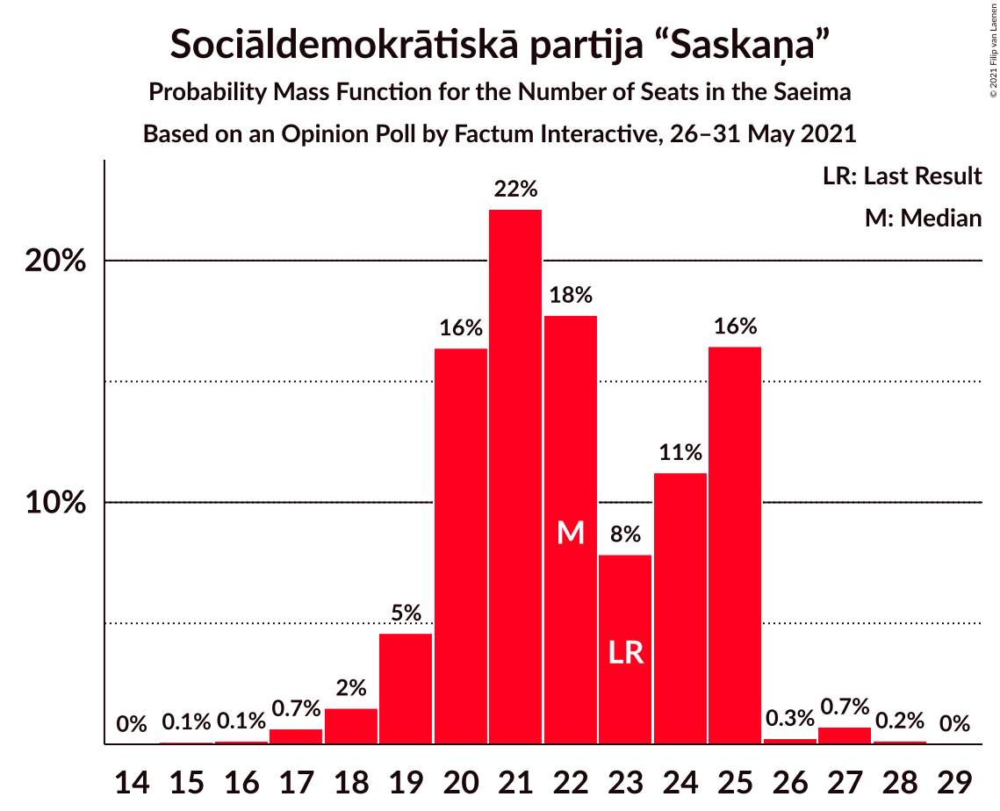
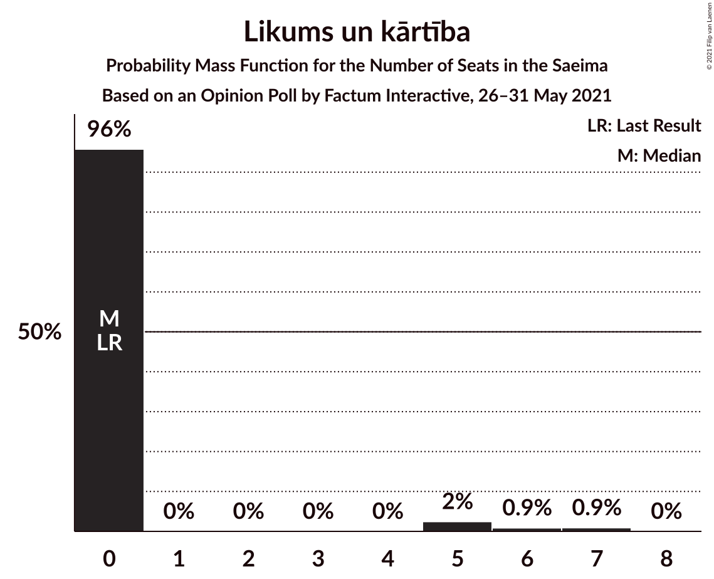
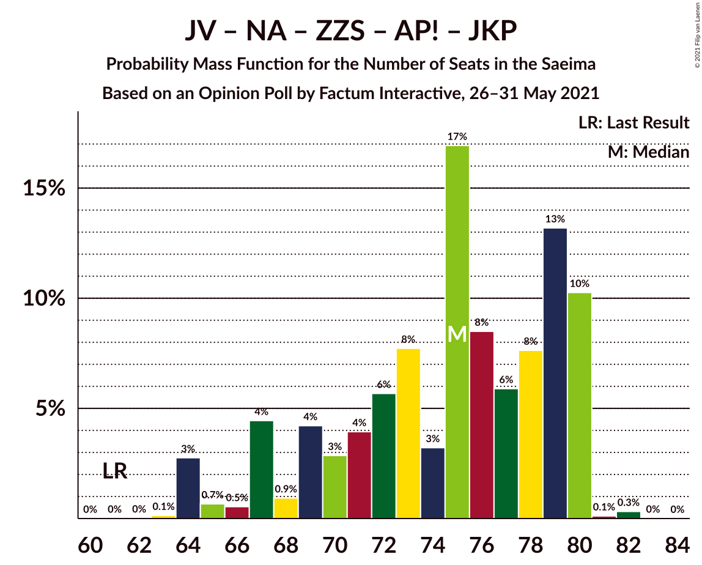
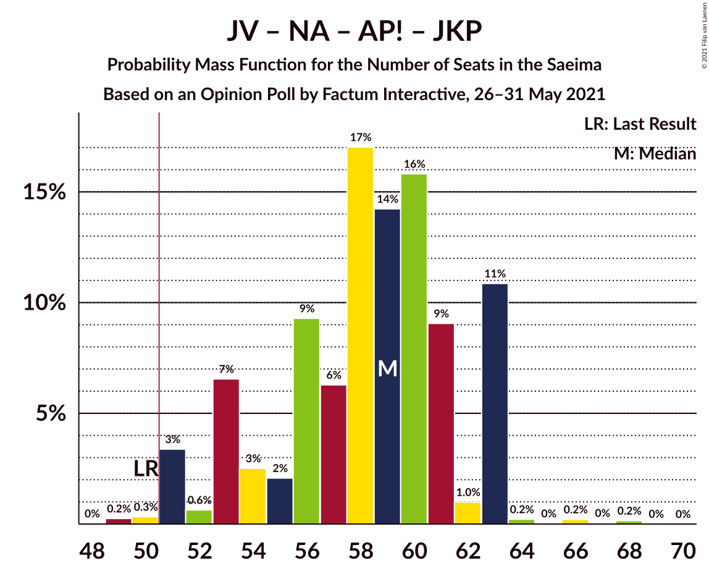
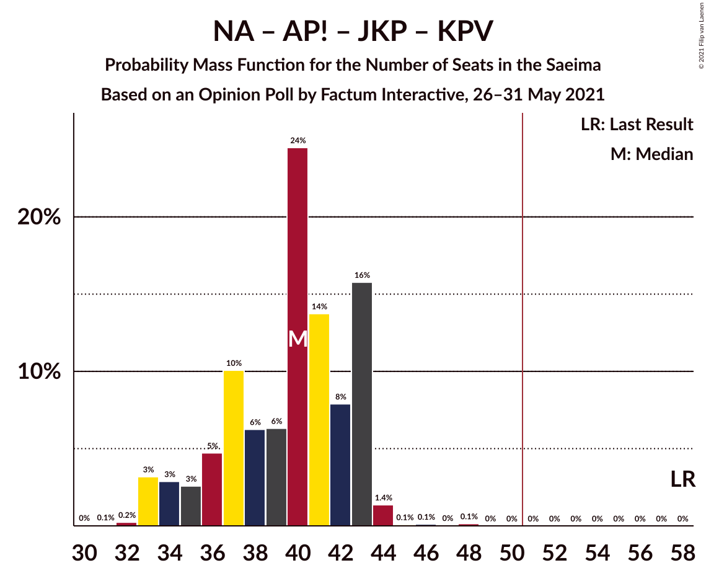

# Opinion Poll by Factum Interactive, 26–31 May 2021

<a href="#voting-intentions">Voting Intentions</a> | <a href="#seats">Seats</a> | <a href="#coalitions">Coalitions</a> | <a href="#technical-information">Technical Information</a>

## Voting Intentions

### Confidence Intervals

| Party | Last Result | Poll Result | 80% Confidence Interval | 90% Confidence Interval | 95% Confidence Interval | 99% Confidence Interval |
|:-----:|:-----------:|:-----------:|:-----------------------:|:-----------------------:|:-----------------------:|:-----------------------:|
| Sociāldemokrātiskā partija “Saskaņa” | 19.8% | 18.2% | 16.3–20.4% |15.7–21.0% |15.3–21.6% |14.4–22.7% |
| Jaunā VIENOTĪBA | 6.7% | 16.8% | 15.0–19.0% |14.4–19.6% |14.0–20.1% |13.2–21.2% |
| Nacionālā apvienība „Visu Latvijai!”–„Tēvzemei un Brīvībai/LNNK” | 11.0% | 14.1% | 12.3–16.1% |11.9–16.6% |11.5–17.1% |10.7–18.2% |
| Zaļo un Zemnieku savienība | 9.9% | 13.4% | 11.7–15.3% |11.2–15.9% |10.8–16.4% |10.1–17.4% |
| Attīstībai/Par! | 12.0% | 11.8% | 10.2–13.7% |9.8–14.2% |9.4–14.7% |8.7–15.7% |
| Jaunā konservatīvā partija | 13.6% | 8.3% | 7.0–10.0% |6.6–10.5% |6.3–10.9% |5.8–11.7% |
| PROGRESĪVIE | 2.6% | 4.9% | 3.9–6.2% |3.6–6.6% |3.4–7.0% |3.0–7.7% |
| Latvijas Krievu savienība | 3.2% | 4.0% | 3.1–5.3% |2.9–5.6% |2.7–5.9% |2.3–6.6% |
| Latvijas Reģionu Apvienība | 4.1% | 3.6% | 2.8–4.9% |2.6–5.2% |2.4–5.5% |2.1–6.2% |
| Likums un kārtība | 0.0% | 3.5% | 2.7–4.7% |2.4–5.0% |2.3–5.3% |1.9–5.9% |
| Politiskā partija „KPV LV” | 14.2% | 0.7% | 0.4–1.4% |0.3–1.6% |0.3–1.8% |0.2–2.2% |

*Note:* The poll result column reflects the actual value used in the calculations. Published results may vary slightly, and in addition be rounded to fewer digits.

## Seats

### Confidence Intervals

| Party | Last Result | Median | 80% Confidence Interval | 90% Confidence Interval | 95% Confidence Interval | 99% Confidence Interval |
|:-----:|:-----------:|:------:|:-----------------------:|:-----------------------:|:-----------------------:|:-----------------------:|
| <a href="#sociāldemokrātiskā-partija-“saskaņa”">Sociāldemokrātiskā partija “Saskaņa”</a> | 23 | 22 | 19–24 |19–24 |18–24 |17–27 |
| <a href="#jaunā-vienotība">Jaunā VIENOTĪBA</a> | 8 | 19 | 17–21 |17–22 |16–23 |14–24 |
| <a href="#nacionālā-apvienība-„visu-latvijai!”–„tēvzemei-un-brīvībai/lnnk”">Nacionālā apvienība „Visu Latvijai!”–„Tēvzemei un Brīvībai/LNNK”</a> | 13 | 16 | 14–19 |13–19 |13–20 |12–20 |
| <a href="#zaļo-un-zemnieku-savienība">Zaļo un Zemnieku savienība</a> | 11 | 17 | 13–19 |13–19 |12–19 |11–19 |
| <a href="#attīstībai/par!">Attīstībai/Par!</a> | 13 | 14 | 11–17 |11–17 |10–17 |9–17 |
| <a href="#jaunā-konservatīvā-partija">Jaunā konservatīvā partija</a> | 16 | 11 | 7–12 |7–12 |7–13 |7–13 |
| <a href="#progresīvie">PROGRESĪVIE</a> | 0 | 0 | 0–7 |0–7 |0–8 |0–8 |
| <a href="#latvijas-krievu-savienība">Latvijas Krievu savienība</a> | 0 | 0 | 0–6 |0–7 |0–8 |0–8 |
| <a href="#latvijas-reģionu-apvienība">Latvijas Reģionu Apvienība</a> | 0 | 0 | 0 |0–6 |0–6 |0–6 |
| <a href="#likums-un-kārtība">Likums un kārtība</a> | 0 | 0 | 0 |0 |0–5 |0–7 |
| <a href="#politiskā-partija-„kpv-lv”">Politiskā partija „KPV LV”</a> | 16 | 0 | 0 |0 |0 |0 |

### Sociāldemokrātiskā partija “Saskaņa”

*For a full overview of the results for this party, see the [Sociāldemokrātiskā partija “Saskaņa”](party-sociāldemokrātiskāpartija“saskaņa”.html) page.*

| Number of Seats | Probability | Accumulated | Special Marks |
|:---------------:|:-----------:|:-----------:|:-------------:|
| 15 | 0.1% | 100% |  |
| 16 | 0.1% | 99.9% |  |
| 17 | 0.7% | 99.7% |  |
| 18 | 2% | 99.1% |  |
| 19 | 7% | 97% |  |
| 20 | 10% | 90% |  |
| 21 | 25% | 80% |  |
| 22 | 26% | 55% | Median |
| 23 | 11% | 29% | Last Result |
| 24 | 15% | 18% |  |
| 25 | 0.5% | 2% |  |
| 26 | 0.3% | 2% |  |
| 27 | 1.2% | 1.5% |  |
| 28 | 0.2% | 0.2% |  |
| 29 | 0% | 0% |  |

### Jaunā VIENOTĪBA

*For a full overview of the results for this party, see the [Jaunā VIENOTĪBA](party-jaunāvienotība.html) page.*

| Number of Seats | Probability | Accumulated | Special Marks |
|:---------------:|:-----------:|:-----------:|:-------------:|
| 8 | 0% | 100% | Last Result |
| 9 | 0% | 100% |  |
| 10 | 0% | 100% |  |
| 11 | 0% | 100% |  |
| 12 | 0% | 100% |  |
| 13 | 0% | 100% |  |
| 14 | 0.5% | 99.9% |  |
| 15 | 0.6% | 99.5% |  |
| 16 | 2% | 98.9% |  |
| 17 | 16% | 97% |  |
| 18 | 23% | 81% |  |
| 19 | 41% | 58% | Median |
| 20 | 6% | 16% |  |
| 21 | 2% | 10% |  |
| 22 | 5% | 9% |  |
| 23 | 2% | 4% |  |
| 24 | 1.0% | 1.3% |  |
| 25 | 0.1% | 0.3% |  |
| 26 | 0.2% | 0.2% |  |
| 27 | 0% | 0% |  |

### Nacionālā apvienība „Visu Latvijai!”–„Tēvzemei un Brīvībai/LNNK”

*For a full overview of the results for this party, see the [Nacionālā apvienība „Visu Latvijai!”–„Tēvzemei un Brīvībai/LNNK”](party-nacionālāapvienība„visulatvijai”–„tēvzemeiunbrīvībailnnk”.html) page.*

| Number of Seats | Probability | Accumulated | Special Marks |
|:---------------:|:-----------:|:-----------:|:-------------:|
| 11 | 0.3% | 100% |  |
| 12 | 1.3% | 99.7% |  |
| 13 | 4% | 98% | Last Result |
| 14 | 26% | 94% |  |
| 15 | 15% | 69% |  |
| 16 | 16% | 54% | Median |
| 17 | 25% | 38% |  |
| 18 | 1.2% | 12% |  |
| 19 | 9% | 11% |  |
| 20 | 2% | 3% |  |
| 21 | 0.1% | 0.1% |  |
| 22 | 0% | 0.1% |  |
| 23 | 0% | 0% |  |

### Zaļo un Zemnieku savienība

*For a full overview of the results for this party, see the [Zaļo un Zemnieku savienība](party-zaļounzemniekusavienība.html) page.*

| Number of Seats | Probability | Accumulated | Special Marks |
|:---------------:|:-----------:|:-----------:|:-------------:|
| 11 | 1.4% | 100% | Last Result |
| 12 | 3% | 98.6% |  |
| 13 | 11% | 96% |  |
| 14 | 4% | 85% |  |
| 15 | 8% | 80% |  |
| 16 | 5% | 72% |  |
| 17 | 46% | 67% | Median |
| 18 | 9% | 21% |  |
| 19 | 11% | 12% |  |
| 20 | 0.1% | 0.5% |  |
| 21 | 0% | 0.4% |  |
| 22 | 0.4% | 0.4% |  |
| 23 | 0% | 0% |  |

### Attīstībai/Par!

*For a full overview of the results for this party, see the [Attīstībai/Par!](party-attīstībaipar.html) page.*

| Number of Seats | Probability | Accumulated | Special Marks |
|:---------------:|:-----------:|:-----------:|:-------------:|
| 9 | 1.2% | 100% |  |
| 10 | 3% | 98.8% |  |
| 11 | 16% | 96% |  |
| 12 | 9% | 80% |  |
| 13 | 2% | 71% | Last Result |
| 14 | 40% | 70% | Median |
| 15 | 11% | 29% |  |
| 16 | 4% | 18% |  |
| 17 | 14% | 14% |  |
| 18 | 0% | 0% |  |

### Jaunā konservatīvā partija

*For a full overview of the results for this party, see the [Jaunā konservatīvā partija](party-jaunākonservatīvāpartija.html) page.*

| Number of Seats | Probability | Accumulated | Special Marks |
|:---------------:|:-----------:|:-----------:|:-------------:|
| 6 | 0% | 100% |  |
| 7 | 17% | 99.9% |  |
| 8 | 5% | 83% |  |
| 9 | 18% | 78% |  |
| 10 | 7% | 60% |  |
| 11 | 31% | 52% | Median |
| 12 | 16% | 21% |  |
| 13 | 5% | 5% |  |
| 14 | 0.1% | 0.1% |  |
| 15 | 0% | 0% |  |
| 16 | 0% | 0% | Last Result |

### PROGRESĪVIE

*For a full overview of the results for this party, see the [PROGRESĪVIE](party-progresīvie.html) page.*

| Number of Seats | Probability | Accumulated | Special Marks |
|:---------------:|:-----------:|:-----------:|:-------------:|
| 0 | 68% | 100% | Last Result, Median |
| 1 | 0% | 32% |  |
| 2 | 0% | 32% |  |
| 3 | 0% | 32% |  |
| 4 | 0% | 32% |  |
| 5 | 0.2% | 32% |  |
| 6 | 8% | 31% |  |
| 7 | 19% | 24% |  |
| 8 | 4% | 5% |  |
| 9 | 0% | 0.1% |  |
| 10 | 0% | 0% |  |

### Latvijas Krievu savienība

*For a full overview of the results for this party, see the [Latvijas Krievu savienība](party-latvijaskrievusavienība.html) page.*

| Number of Seats | Probability | Accumulated | Special Marks |
|:---------------:|:-----------:|:-----------:|:-------------:|
| 0 | 87% | 100% | Last Result, Median |
| 1 | 0% | 13% |  |
| 2 | 0% | 13% |  |
| 3 | 0% | 13% |  |
| 4 | 0% | 13% |  |
| 5 | 2% | 13% |  |
| 6 | 1.4% | 11% |  |
| 7 | 7% | 10% |  |
| 8 | 3% | 3% |  |
| 9 | 0% | 0% |  |

### Latvijas Reģionu Apvienība

*For a full overview of the results for this party, see the [Latvijas Reģionu Apvienība](party-latvijasreģionuapvienība.html) page.*

| Number of Seats | Probability | Accumulated | Special Marks |
|:---------------:|:-----------:|:-----------:|:-------------:|
| 0 | 94% | 100% | Last Result, Median |
| 1 | 0% | 6% |  |
| 2 | 0% | 6% |  |
| 3 | 0% | 6% |  |
| 4 | 0% | 6% |  |
| 5 | 0% | 6% |  |
| 6 | 6% | 6% |  |
| 7 | 0.1% | 0.1% |  |
| 8 | 0% | 0% |  |

### Likums un kārtība

*For a full overview of the results for this party, see the [Likums un kārtība](party-likumsunkārtība.html) page.*

| Number of Seats | Probability | Accumulated | Special Marks |
|:---------------:|:-----------:|:-----------:|:-------------:|
| 0 | 97% | 100% | Last Result, Median |
| 1 | 0% | 3% |  |
| 2 | 0% | 3% |  |
| 3 | 0% | 3% |  |
| 4 | 0% | 3% |  |
| 5 | 0.4% | 3% |  |
| 6 | 1.2% | 2% |  |
| 7 | 1.3% | 1.3% |  |
| 8 | 0% | 0% |  |

### Politiskā partija „KPV LV”

*For a full overview of the results for this party, see the [Politiskā partija „KPV LV”](party-politiskāpartija„kpvlv”.html) page.*

| Number of Seats | Probability | Accumulated | Special Marks |
|:---------------:|:-----------:|:-----------:|:-------------:|
| 0 | 100% | 100% | Median |
| 1 | 0% | 0% |  |
| 2 | 0% | 0% |  |
| 3 | 0% | 0% |  |
| 4 | 0% | 0% |  |
| 5 | 0% | 0% |  |
| 6 | 0% | 0% |  |
| 7 | 0% | 0% |  |
| 8 | 0% | 0% |  |
| 9 | 0% | 0% |  |
| 10 | 0% | 0% |  |
| 11 | 0% | 0% |  |
| 12 | 0% | 0% |  |
| 13 | 0% | 0% |  |
| 14 | 0% | 0% |  |
| 15 | 0% | 0% |  |
| 16 | 0% | 0% | Last Result |

## Coalitions

### Confidence Intervals

| Coalition | Last Result | Median | Majority? | 80% Confidence Interval | 90% Confidence Interval | 95% Confidence Interval | 99% Confidence Interval |
|:---------:|:-----------:|:------:|:---------:|:-----------------------:|:-----------------------:|:-----------------------:|:-----------------------:|
| Jaunā VIENOTĪBA – Nacionālā apvienība „Visu Latvijai!”–„Tēvzemei un Brīvībai/LNNK” – Zaļo un Zemnieku savienība – Attīstībai/Par! – Jaunā konservatīvā partija | 61 | 76 | 100% | 69–79 | 64–80 | 64–80 | 64–82 |
| Jaunā VIENOTĪBA – Nacionālā apvienība „Visu Latvijai!”–„Tēvzemei un Brīvībai/LNNK” – Zaļo un Zemnieku savienība – Attīstībai/Par! | 45 | 66 | 100% | 59–68 | 57–68 | 57–69 | 56–73 |
| Jaunā VIENOTĪBA – Nacionālā apvienība „Visu Latvijai!”–„Tēvzemei un Brīvībai/LNNK” – Zaļo un Zemnieku savienība – Jaunā konservatīvā partija | 48 | 61 | 99.9% | 56–65 | 53–65 | 53–65 | 51–66 |
| Jaunā VIENOTĪBA – Nacionālā apvienība „Visu Latvijai!”–„Tēvzemei un Brīvībai/LNNK” – Attīstībai/Par! – Jaunā konservatīvā partija | 50 | 59 | 99.3% | 54–61 | 51–63 | 51–63 | 50–66 |
| Jaunā VIENOTĪBA – Nacionālā apvienība „Visu Latvijai!”–„Tēvzemei un Brīvībai/LNNK” – Attīstībai/Par! – Jaunā konservatīvā partija – Politiskā partija „KPV LV” | 66 | 59 | 99.3% | 54–61 | 51–63 | 51–63 | 50–66 |
| Nacionālā apvienība „Visu Latvijai!”–„Tēvzemei un Brīvībai/LNNK” – Zaļo un Zemnieku savienība – Attīstībai/Par! – Jaunā konservatīvā partija | 53 | 57 | 88% | 50–62 | 46–62 | 46–62 | 46–62 |
| Jaunā VIENOTĪBA – Nacionālā apvienība „Visu Latvijai!”–„Tēvzemei un Brīvībai/LNNK” – Zaļo un Zemnieku savienība | 32 | 51 | 55% | 47–54 | 46–54 | 45–55 | 43–57 |
| Jaunā VIENOTĪBA – Nacionālā apvienība „Visu Latvijai!”–„Tēvzemei un Brīvībai/LNNK” – Attīstībai/Par! – Politiskā partija „KPV LV” | 50 | 48 | 15% | 44–51 | 44–52 | 43–52 | 40–55 |
| Sociāldemokrātiskā partija “Saskaņa” – Attīstībai/Par! – Jaunā konservatīvā partija | 52 | 46 | 3% | 40–50 | 40–50 | 39–51 | 36–51 |
| Nacionālā apvienība „Visu Latvijai!”–„Tēvzemei un Brīvībai/LNNK” – Zaļo un Zemnieku savienība – Attīstībai/Par! | 37 | 47 | 0.7% | 41–50 | 39–50 | 39–50 | 38–52 |
| Jaunā VIENOTĪBA – Attīstībai/Par! – Jaunā konservatīvā partija – Politiskā partija „KPV LV” | 53 | 43 | 0.2% | 38–47 | 36–48 | 36–49 | 34–49 |
| Jaunā VIENOTĪBA – Nacionālā apvienība „Visu Latvijai!”–„Tēvzemei un Brīvībai/LNNK” – Jaunā konservatīvā partija – Politiskā partija „KPV LV” | 53 | 45 | 0.4% | 41–48 | 40–48 | 39–48 | 37–50 |
| Nacionālā apvienība „Visu Latvijai!”–„Tēvzemei un Brīvībai/LNNK” – Zaļo un Zemnieku savienība – Jaunā konservatīvā partija | 40 | 42 | 0% | 37–48 | 35–48 | 35–48 | 34–48 |
| Nacionālā apvienība „Visu Latvijai!”–„Tēvzemei un Brīvībai/LNNK” – Attīstībai/Par! – Jaunā konservatīvā partija – Politiskā partija „KPV LV” | 58 | 41 | 0% | 35–43 | 33–43 | 33–43 | 33–44 |
| Sociāldemokrātiskā partija “Saskaņa” – Zaļo un Zemnieku savienība – Politiskā partija „KPV LV” | 50 | 39 | 0% | 35–41 | 33–41 | 33–41 | 30–42 |
| Sociāldemokrātiskā partija “Saskaņa” – Attīstībai/Par! | 36 | 35 | 0% | 33–39 | 31–39 | 30–40 | 29–41 |
| Sociāldemokrātiskā partija “Saskaņa” – Politiskā partija „KPV LV” | 39 | 22 | 0% | 19–24 | 19–24 | 18–24 | 17–27 |

### Jaunā VIENOTĪBA – Nacionālā apvienība „Visu Latvijai!”–„Tēvzemei un Brīvībai/LNNK” – Zaļo un Zemnieku savienība – Attīstībai/Par! – Jaunā konservatīvā partija

| Number of Seats | Probability | Accumulated | Special Marks |
|:---------------:|:-----------:|:-----------:|:-------------:|
| 61 | 0% | 100% | Last Result |
| 62 | 0% | 100% |  |
| 63 | 0.2% | 100% |  |
| 64 | 6% | 99.7% |  |
| 65 | 0.7% | 94% |  |
| 66 | 0.3% | 93% |  |
| 67 | 0.6% | 93% |  |
| 68 | 1.3% | 93% |  |
| 69 | 2% | 91% |  |
| 70 | 4% | 89% |  |
| 71 | 2% | 85% |  |
| 72 | 10% | 84% |  |
| 73 | 12% | 73% |  |
| 74 | 4% | 61% |  |
| 75 | 2% | 56% |  |
| 76 | 13% | 54% |  |
| 77 | 9% | 42% | Median |
| 78 | 15% | 33% |  |
| 79 | 12% | 17% |  |
| 80 | 4% | 5% |  |
| 81 | 0.1% | 0.7% |  |
| 82 | 0.6% | 0.6% |  |
| 83 | 0% | 0% |  |

### Jaunā VIENOTĪBA – Nacionālā apvienība „Visu Latvijai!”–„Tēvzemei un Brīvībai/LNNK” – Zaļo un Zemnieku savienība – Attīstībai/Par!

| Number of Seats | Probability | Accumulated | Special Marks |
|:---------------:|:-----------:|:-----------:|:-------------:|
| 45 | 0% | 100% | Last Result |
| 46 | 0% | 100% |  |
| 47 | 0% | 100% |  |
| 48 | 0% | 100% |  |
| 49 | 0% | 100% |  |
| 50 | 0% | 100% |  |
| 51 | 0% | 100% | Majority |
| 52 | 0% | 100% |  |
| 53 | 0.2% | 100% |  |
| 54 | 0% | 99.8% |  |
| 55 | 0.1% | 99.7% |  |
| 56 | 0.4% | 99.6% |  |
| 57 | 6% | 99.2% |  |
| 58 | 0.9% | 93% |  |
| 59 | 5% | 92% |  |
| 60 | 1.1% | 87% |  |
| 61 | 3% | 86% |  |
| 62 | 3% | 83% |  |
| 63 | 13% | 81% |  |
| 64 | 4% | 68% |  |
| 65 | 12% | 64% |  |
| 66 | 11% | 52% | Median |
| 67 | 30% | 41% |  |
| 68 | 7% | 11% |  |
| 69 | 2% | 4% |  |
| 70 | 0.8% | 2% |  |
| 71 | 0.3% | 1.0% |  |
| 72 | 0.2% | 0.8% |  |
| 73 | 0.2% | 0.6% |  |
| 74 | 0.3% | 0.4% |  |
| 75 | 0.1% | 0.1% |  |
| 76 | 0% | 0% |  |

### Jaunā VIENOTĪBA – Nacionālā apvienība „Visu Latvijai!”–„Tēvzemei un Brīvībai/LNNK” – Zaļo un Zemnieku savienība – Jaunā konservatīvā partija

| Number of Seats | Probability | Accumulated | Special Marks |
|:---------------:|:-----------:|:-----------:|:-------------:|
| 48 | 0% | 100% | Last Result |
| 49 | 0% | 100% |  |
| 50 | 0% | 100% |  |
| 51 | 0.7% | 99.9% | Majority |
| 52 | 0.2% | 99.2% |  |
| 53 | 6% | 99.1% |  |
| 54 | 1.0% | 93% |  |
| 55 | 2% | 92% |  |
| 56 | 3% | 91% |  |
| 57 | 6% | 88% |  |
| 58 | 3% | 82% |  |
| 59 | 7% | 79% |  |
| 60 | 8% | 72% |  |
| 61 | 21% | 64% |  |
| 62 | 6% | 42% |  |
| 63 | 12% | 36% | Median |
| 64 | 2% | 25% |  |
| 65 | 23% | 23% |  |
| 66 | 0.1% | 0.5% |  |
| 67 | 0.1% | 0.4% |  |
| 68 | 0% | 0.4% |  |
| 69 | 0.3% | 0.3% |  |
| 70 | 0% | 0% |  |

### Jaunā VIENOTĪBA – Nacionālā apvienība „Visu Latvijai!”–„Tēvzemei un Brīvībai/LNNK” – Attīstībai/Par! – Jaunā konservatīvā partija

| Number of Seats | Probability | Accumulated | Special Marks |
|:---------------:|:-----------:|:-----------:|:-------------:|
| 49 | 0.4% | 100% |  |
| 50 | 0.2% | 99.5% | Last Result |
| 51 | 7% | 99.3% | Majority |
| 52 | 0.7% | 92% |  |
| 53 | 0.9% | 92% |  |
| 54 | 3% | 91% |  |
| 55 | 2% | 88% |  |
| 56 | 12% | 86% |  |
| 57 | 10% | 74% |  |
| 58 | 4% | 65% |  |
| 59 | 15% | 60% |  |
| 60 | 22% | 46% | Median |
| 61 | 16% | 23% |  |
| 62 | 0.9% | 7% |  |
| 63 | 5% | 6% |  |
| 64 | 0.3% | 0.8% |  |
| 65 | 0% | 0.5% |  |
| 66 | 0.4% | 0.5% |  |
| 67 | 0.1% | 0.1% |  |
| 68 | 0% | 0.1% |  |
| 69 | 0% | 0% |  |

### Jaunā VIENOTĪBA – Nacionālā apvienība „Visu Latvijai!”–„Tēvzemei un Brīvībai/LNNK” – Attīstībai/Par! – Jaunā konservatīvā partija – Politiskā partija „KPV LV”

| Number of Seats | Probability | Accumulated | Special Marks |
|:---------------:|:-----------:|:-----------:|:-------------:|
| 49 | 0.4% | 100% |  |
| 50 | 0.2% | 99.5% |  |
| 51 | 7% | 99.3% | Majority |
| 52 | 0.7% | 92% |  |
| 53 | 0.9% | 92% |  |
| 54 | 3% | 91% |  |
| 55 | 2% | 88% |  |
| 56 | 12% | 86% |  |
| 57 | 10% | 74% |  |
| 58 | 4% | 65% |  |
| 59 | 15% | 60% |  |
| 60 | 22% | 46% | Median |
| 61 | 16% | 23% |  |
| 62 | 0.9% | 7% |  |
| 63 | 5% | 6% |  |
| 64 | 0.3% | 0.8% |  |
| 65 | 0% | 0.5% |  |
| 66 | 0.4% | 0.5% | Last Result |
| 67 | 0.1% | 0.1% |  |
| 68 | 0% | 0.1% |  |
| 69 | 0% | 0% |  |

### Nacionālā apvienība „Visu Latvijai!”–„Tēvzemei un Brīvībai/LNNK” – Zaļo un Zemnieku savienība – Attīstībai/Par! – Jaunā konservatīvā partija

| Number of Seats | Probability | Accumulated | Special Marks |
|:---------------:|:-----------:|:-----------:|:-------------:|
| 43 | 0% | 100% |  |
| 44 | 0% | 99.9% |  |
| 45 | 0.1% | 99.9% |  |
| 46 | 5% | 99.9% |  |
| 47 | 0.5% | 94% |  |
| 48 | 1.3% | 94% |  |
| 49 | 0.7% | 93% |  |
| 50 | 3% | 92% |  |
| 51 | 2% | 88% | Majority |
| 52 | 5% | 86% |  |
| 53 | 6% | 82% | Last Result |
| 54 | 10% | 76% |  |
| 55 | 11% | 65% |  |
| 56 | 1.4% | 54% |  |
| 57 | 4% | 53% |  |
| 58 | 21% | 49% | Median |
| 59 | 16% | 28% |  |
| 60 | 0.6% | 12% |  |
| 61 | 0.1% | 12% |  |
| 62 | 11% | 11% |  |
| 63 | 0% | 0% |  |

### Jaunā VIENOTĪBA – Nacionālā apvienība „Visu Latvijai!”–„Tēvzemei un Brīvībai/LNNK” – Zaļo un Zemnieku savienība

| Number of Seats | Probability | Accumulated | Special Marks |
|:---------------:|:-----------:|:-----------:|:-------------:|
| 32 | 0% | 100% | Last Result |
| 33 | 0% | 100% |  |
| 34 | 0% | 100% |  |
| 35 | 0% | 100% |  |
| 36 | 0% | 100% |  |
| 37 | 0% | 100% |  |
| 38 | 0% | 100% |  |
| 39 | 0% | 100% |  |
| 40 | 0% | 100% |  |
| 41 | 0% | 100% |  |
| 42 | 0.1% | 99.9% |  |
| 43 | 0.5% | 99.9% |  |
| 44 | 2% | 99.4% |  |
| 45 | 0.9% | 98% |  |
| 46 | 7% | 97% |  |
| 47 | 4% | 90% |  |
| 48 | 4% | 86% |  |
| 49 | 6% | 83% |  |
| 50 | 21% | 76% |  |
| 51 | 10% | 55% | Majority |
| 52 | 9% | 45% | Median |
| 53 | 21% | 36% |  |
| 54 | 12% | 15% |  |
| 55 | 2% | 3% |  |
| 56 | 0.4% | 1.2% |  |
| 57 | 0.4% | 0.8% |  |
| 58 | 0.1% | 0.5% |  |
| 59 | 0% | 0.3% |  |
| 60 | 0% | 0.3% |  |
| 61 | 0.3% | 0.3% |  |
| 62 | 0% | 0% |  |

### Jaunā VIENOTĪBA – Nacionālā apvienība „Visu Latvijai!”–„Tēvzemei un Brīvībai/LNNK” – Attīstībai/Par! – Politiskā partija „KPV LV”

| Number of Seats | Probability | Accumulated | Special Marks |
|:---------------:|:-----------:|:-----------:|:-------------:|
| 40 | 0.5% | 100% |  |
| 41 | 0.5% | 99.5% |  |
| 42 | 1.1% | 99.0% |  |
| 43 | 3% | 98% |  |
| 44 | 7% | 95% |  |
| 45 | 1.3% | 88% |  |
| 46 | 6% | 87% |  |
| 47 | 3% | 81% |  |
| 48 | 29% | 78% |  |
| 49 | 15% | 49% | Median |
| 50 | 18% | 33% | Last Result |
| 51 | 10% | 15% | Majority |
| 52 | 4% | 5% |  |
| 53 | 0.8% | 2% |  |
| 54 | 0.4% | 1.1% |  |
| 55 | 0.3% | 0.8% |  |
| 56 | 0.2% | 0.5% |  |
| 57 | 0.2% | 0.3% |  |
| 58 | 0% | 0.1% |  |
| 59 | 0.1% | 0.1% |  |
| 60 | 0% | 0% |  |

### Sociāldemokrātiskā partija “Saskaņa” – Attīstībai/Par! – Jaunā konservatīvā partija

| Number of Seats | Probability | Accumulated | Special Marks |
|:---------------:|:-----------:|:-----------:|:-------------:|
| 35 | 0.1% | 100% |  |
| 36 | 0.5% | 99.9% |  |
| 37 | 0.1% | 99.4% |  |
| 38 | 1.2% | 99.3% |  |
| 39 | 2% | 98% |  |
| 40 | 9% | 96% |  |
| 41 | 2% | 86% |  |
| 42 | 3% | 85% |  |
| 43 | 13% | 82% |  |
| 44 | 4% | 69% |  |
| 45 | 6% | 65% |  |
| 46 | 14% | 59% |  |
| 47 | 18% | 45% | Median |
| 48 | 9% | 27% |  |
| 49 | 2% | 18% |  |
| 50 | 14% | 16% |  |
| 51 | 2% | 3% | Majority |
| 52 | 0.2% | 0.4% | Last Result |
| 53 | 0.3% | 0.3% |  |
| 54 | 0% | 0% |  |

### Nacionālā apvienība „Visu Latvijai!”–„Tēvzemei un Brīvībai/LNNK” – Zaļo un Zemnieku savienība – Attīstībai/Par!

| Number of Seats | Probability | Accumulated | Special Marks |
|:---------------:|:-----------:|:-----------:|:-------------:|
| 35 | 0% | 100% |  |
| 36 | 0.2% | 99.9% |  |
| 37 | 0.1% | 99.7% | Last Result |
| 38 | 1.1% | 99.6% |  |
| 39 | 6% | 98.5% |  |
| 40 | 1.2% | 93% |  |
| 41 | 2% | 92% |  |
| 42 | 4% | 90% |  |
| 43 | 8% | 85% |  |
| 44 | 9% | 77% |  |
| 45 | 6% | 69% |  |
| 46 | 9% | 63% |  |
| 47 | 17% | 54% | Median |
| 48 | 20% | 37% |  |
| 49 | 0.7% | 16% |  |
| 50 | 15% | 16% |  |
| 51 | 0.2% | 0.7% | Majority |
| 52 | 0.4% | 0.5% |  |
| 53 | 0.1% | 0.1% |  |
| 54 | 0% | 0% |  |

### Jaunā VIENOTĪBA – Attīstībai/Par! – Jaunā konservatīvā partija – Politiskā partija „KPV LV”

| Number of Seats | Probability | Accumulated | Special Marks |
|:---------------:|:-----------:|:-----------:|:-------------:|
| 32 | 0.1% | 100% |  |
| 33 | 0% | 99.9% |  |
| 34 | 0.5% | 99.9% |  |
| 35 | 0.4% | 99.4% |  |
| 36 | 6% | 99.0% |  |
| 37 | 1.2% | 93% |  |
| 38 | 2% | 92% |  |
| 39 | 0.7% | 89% |  |
| 40 | 19% | 89% |  |
| 41 | 12% | 70% |  |
| 42 | 6% | 57% |  |
| 43 | 17% | 52% |  |
| 44 | 10% | 34% | Median |
| 45 | 1.4% | 25% |  |
| 46 | 4% | 23% |  |
| 47 | 14% | 20% |  |
| 48 | 0.9% | 6% |  |
| 49 | 4% | 5% |  |
| 50 | 0.1% | 0.3% |  |
| 51 | 0% | 0.2% | Majority |
| 52 | 0.1% | 0.1% |  |
| 53 | 0% | 0% | Last Result |

### Jaunā VIENOTĪBA – Nacionālā apvienība „Visu Latvijai!”–„Tēvzemei un Brīvībai/LNNK” – Jaunā konservatīvā partija – Politiskā partija „KPV LV”

| Number of Seats | Probability | Accumulated | Special Marks |
|:---------------:|:-----------:|:-----------:|:-------------:|
| 36 | 0% | 100% |  |
| 37 | 0.5% | 99.9% |  |
| 38 | 1.0% | 99.4% |  |
| 39 | 3% | 98% |  |
| 40 | 6% | 96% |  |
| 41 | 1.4% | 90% |  |
| 42 | 8% | 89% |  |
| 43 | 7% | 81% |  |
| 44 | 20% | 74% |  |
| 45 | 13% | 53% |  |
| 46 | 22% | 40% | Median |
| 47 | 4% | 17% |  |
| 48 | 12% | 14% |  |
| 49 | 1.3% | 2% |  |
| 50 | 0.2% | 0.6% |  |
| 51 | 0.3% | 0.4% | Majority |
| 52 | 0.1% | 0.1% |  |
| 53 | 0% | 0% | Last Result |

### Nacionālā apvienība „Visu Latvijai!”–„Tēvzemei un Brīvībai/LNNK” – Zaļo un Zemnieku savienība – Jaunā konservatīvā partija

| Number of Seats | Probability | Accumulated | Special Marks |
|:---------------:|:-----------:|:-----------:|:-------------:|
| 32 | 0.3% | 100% |  |
| 33 | 0.1% | 99.7% |  |
| 34 | 1.2% | 99.6% |  |
| 35 | 6% | 98% |  |
| 36 | 2% | 92% |  |
| 37 | 2% | 90% |  |
| 38 | 6% | 88% |  |
| 39 | 5% | 83% |  |
| 40 | 4% | 78% | Last Result |
| 41 | 13% | 75% |  |
| 42 | 19% | 62% |  |
| 43 | 8% | 43% |  |
| 44 | 15% | 35% | Median |
| 45 | 0.6% | 20% |  |
| 46 | 0.6% | 19% |  |
| 47 | 7% | 19% |  |
| 48 | 11% | 11% |  |
| 49 | 0% | 0% |  |

### Nacionālā apvienība „Visu Latvijai!”–„Tēvzemei un Brīvībai/LNNK” – Attīstībai/Par! – Jaunā konservatīvā partija – Politiskā partija „KPV LV”

| Number of Seats | Probability | Accumulated | Special Marks |
|:---------------:|:-----------:|:-----------:|:-------------:|
| 30 | 0% | 100% |  |
| 31 | 0.1% | 99.9% |  |
| 32 | 0.2% | 99.8% |  |
| 33 | 6% | 99.7% |  |
| 34 | 2% | 94% |  |
| 35 | 3% | 92% |  |
| 36 | 3% | 89% |  |
| 37 | 15% | 85% |  |
| 38 | 5% | 70% |  |
| 39 | 4% | 65% |  |
| 40 | 6% | 60% |  |
| 41 | 25% | 54% | Median |
| 42 | 14% | 29% |  |
| 43 | 14% | 15% |  |
| 44 | 1.2% | 1.5% |  |
| 45 | 0.1% | 0.3% |  |
| 46 | 0.1% | 0.2% |  |
| 47 | 0.1% | 0.1% |  |
| 48 | 0% | 0.1% |  |
| 49 | 0% | 0% |  |
| 50 | 0% | 0% |  |
| 51 | 0% | 0% | Majority |
| 52 | 0% | 0% |  |
| 53 | 0% | 0% |  |
| 54 | 0% | 0% |  |
| 55 | 0% | 0% |  |
| 56 | 0% | 0% |  |
| 57 | 0% | 0% |  |
| 58 | 0% | 0% | Last Result |

### Sociāldemokrātiskā partija “Saskaņa” – Zaļo un Zemnieku savienība – Politiskā partija „KPV LV”

| Number of Seats | Probability | Accumulated | Special Marks |
|:---------------:|:-----------:|:-----------:|:-------------:|
| 27 | 0.1% | 100% |  |
| 28 | 0% | 99.9% |  |
| 29 | 0.2% | 99.9% |  |
| 30 | 0.3% | 99.7% |  |
| 31 | 0.4% | 99.4% |  |
| 32 | 0.2% | 99.0% |  |
| 33 | 4% | 98.8% |  |
| 34 | 1.3% | 94% |  |
| 35 | 11% | 93% |  |
| 36 | 5% | 82% |  |
| 37 | 20% | 77% |  |
| 38 | 5% | 58% |  |
| 39 | 17% | 52% | Median |
| 40 | 22% | 36% |  |
| 41 | 13% | 13% |  |
| 42 | 0.2% | 0.7% |  |
| 43 | 0.2% | 0.5% |  |
| 44 | 0% | 0.3% |  |
| 45 | 0.2% | 0.3% |  |
| 46 | 0% | 0.1% |  |
| 47 | 0% | 0% |  |
| 48 | 0% | 0% |  |
| 49 | 0% | 0% |  |
| 50 | 0% | 0% | Last Result |

### Sociāldemokrātiskā partija “Saskaņa” – Attīstībai/Par!

| Number of Seats | Probability | Accumulated | Special Marks |
|:---------------:|:-----------:|:-----------:|:-------------:|
| 27 | 0.1% | 100% |  |
| 28 | 0.2% | 99.9% |  |
| 29 | 1.1% | 99.7% |  |
| 30 | 2% | 98.6% |  |
| 31 | 2% | 97% |  |
| 32 | 4% | 94% |  |
| 33 | 15% | 91% |  |
| 34 | 7% | 76% |  |
| 35 | 28% | 69% |  |
| 36 | 6% | 41% | Last Result, Median |
| 37 | 11% | 36% |  |
| 38 | 7% | 24% |  |
| 39 | 14% | 17% |  |
| 40 | 1.4% | 3% |  |
| 41 | 1.4% | 2% |  |
| 42 | 0.3% | 0.3% |  |
| 43 | 0% | 0% |  |

### Sociāldemokrātiskā partija “Saskaņa” – Politiskā partija „KPV LV”

| Number of Seats | Probability | Accumulated | Special Marks |
|:---------------:|:-----------:|:-----------:|:-------------:|
| 15 | 0.1% | 100% |  |
| 16 | 0.1% | 99.9% |  |
| 17 | 0.7% | 99.7% |  |
| 18 | 2% | 99.1% |  |
| 19 | 7% | 97% |  |
| 20 | 10% | 90% |  |
| 21 | 25% | 80% |  |
| 22 | 26% | 55% | Median |
| 23 | 11% | 29% |  |
| 24 | 15% | 18% |  |
| 25 | 0.5% | 2% |  |
| 26 | 0.3% | 2% |  |
| 27 | 1.2% | 1.5% |  |
| 28 | 0.2% | 0.2% |  |
| 29 | 0% | 0% |  |
| 30 | 0% | 0% |  |
| 31 | 0% | 0% |  |
| 32 | 0% | 0% |  |
| 33 | 0% | 0% |  |
| 34 | 0% | 0% |  |
| 35 | 0% | 0% |  |
| 36 | 0% | 0% |  |
| 37 | 0% | 0% |  |
| 38 | 0% | 0% |  |
| 39 | 0% | 0% | Last Result |

## Technical Information

### Opinion Poll

+ **Polling firm:** Factum Interactive
+ **Commissioner(s):** —
+ **Fieldwork period:** 26–31 May 2021

### Calculations

+ **Sample size:** 576
+ **Simulations done:** 524,288
+ **Error estimate:** 3.41%

