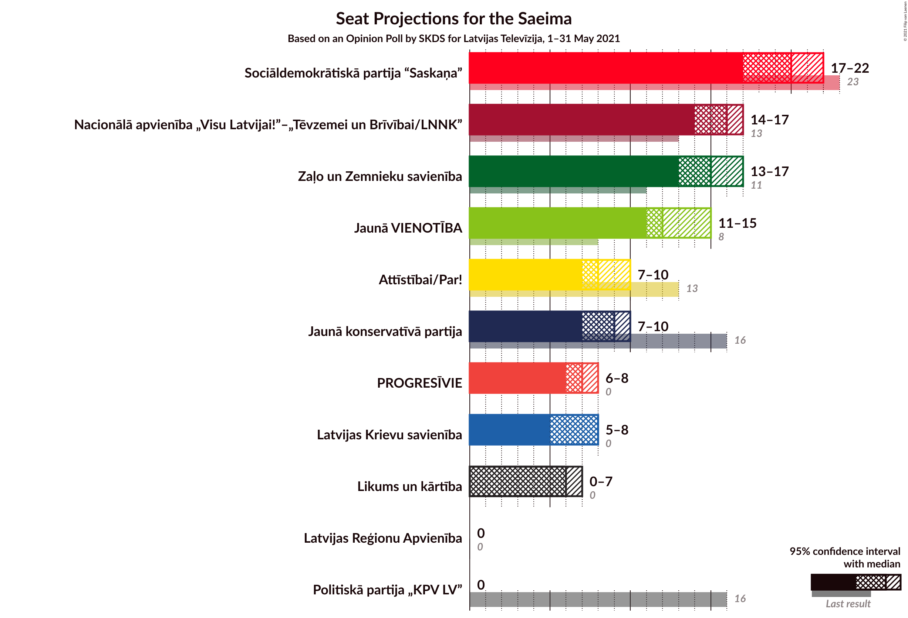
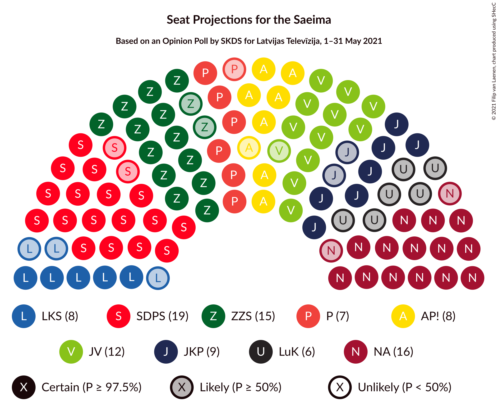
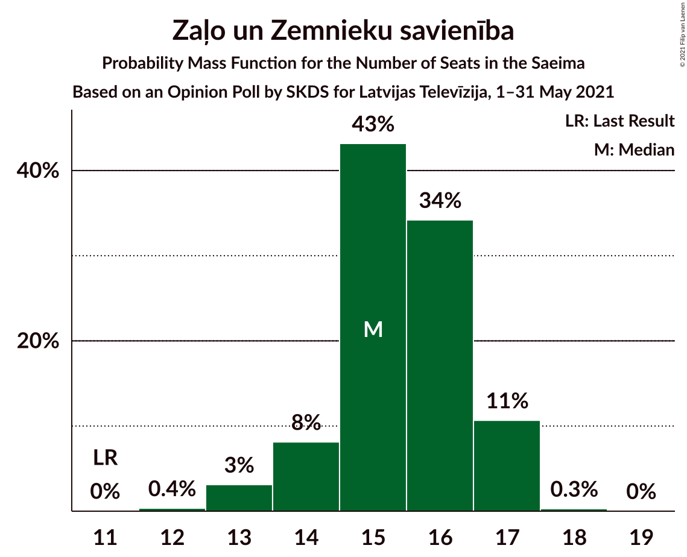
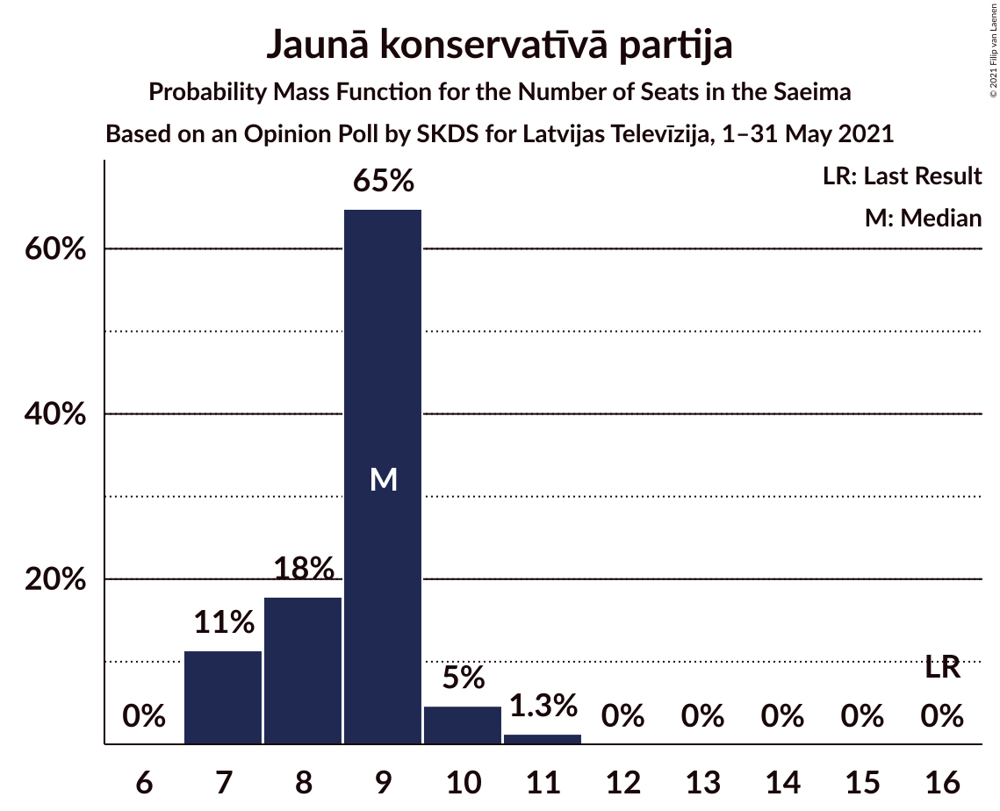
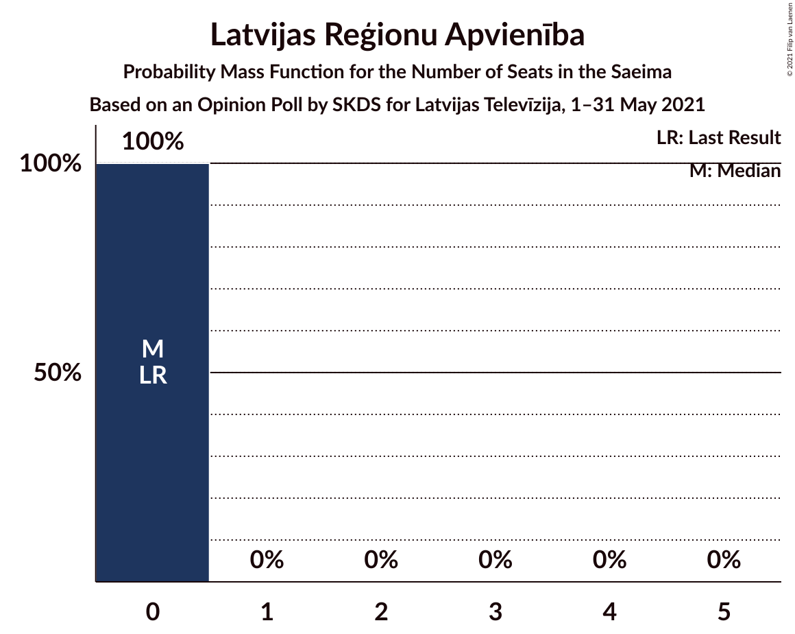
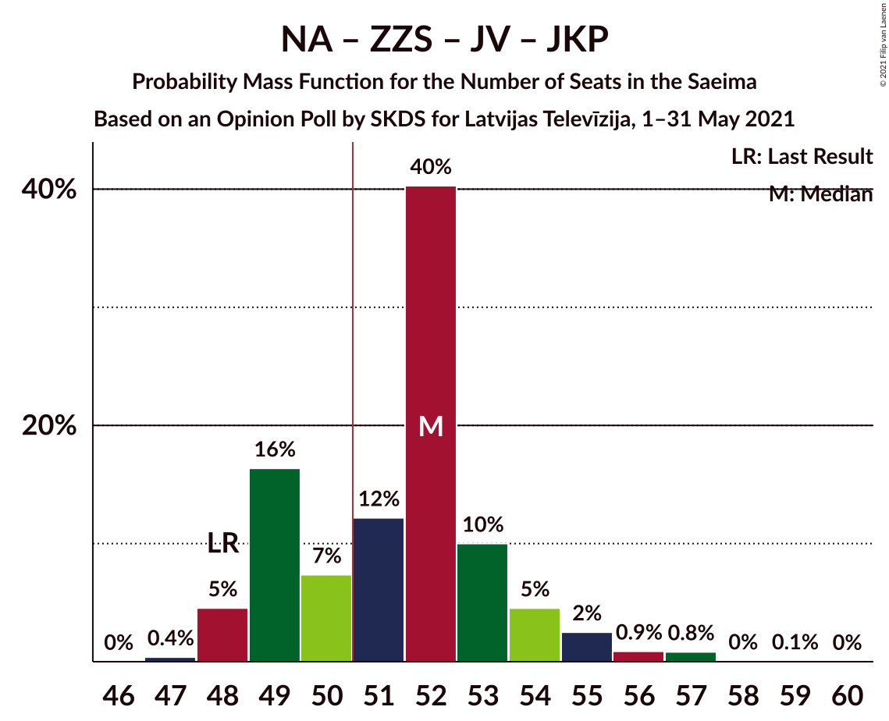
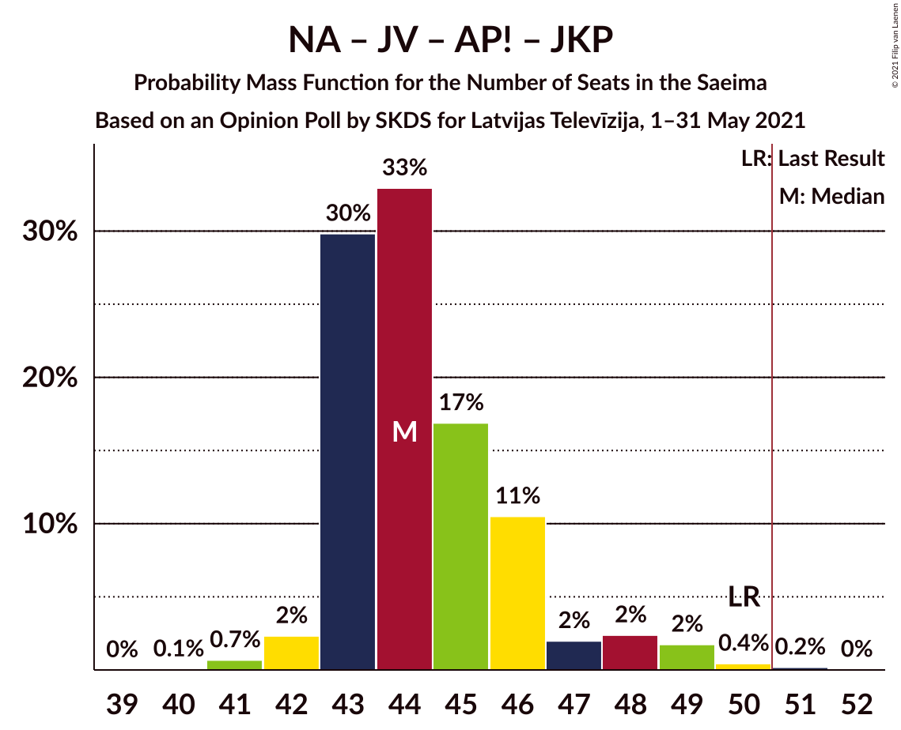
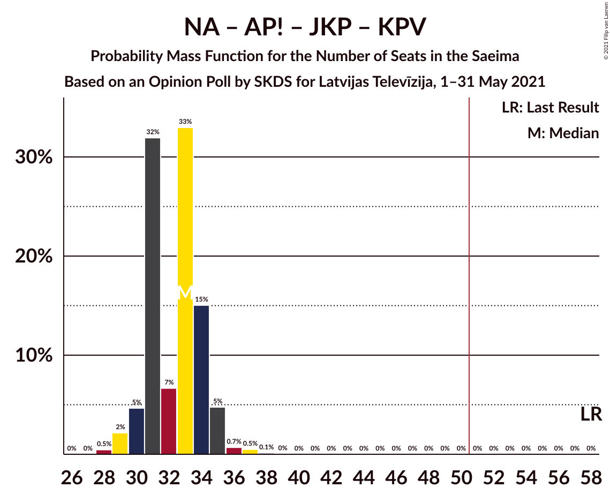

# Opinion Poll by SKDS for Latvijas Televīzija, 1–31 May 2021

<a href="#voting-intentions">Voting Intentions</a> | <a href="#seats">Seats</a> | <a href="#coalitions">Coalitions</a> | <a href="#technical-information">Technical Information</a>

## Voting Intentions

### Confidence Intervals

| Party | Last Result | Poll Result | 80% Confidence Interval | 90% Confidence Interval | 95% Confidence Interval | 99% Confidence Interval |
|:-----:|:-----------:|:-----------:|:-----------------------:|:-----------------------:|:-----------------------:|:-----------------------:|
| Sociāldemokrātiskā partija “Saskaņa” | 19.8% | 18.5% | 17.4–19.7% |17.1–20.1% |16.8–20.4% |16.2–21.0% |
| Nacionālā apvienība „Visu Latvijai!”–„Tēvzemei un Brīvībai/LNNK” | 11.0% | 14.3% | 13.3–15.4% |13.0–15.7% |12.8–16.0% |12.3–16.6% |
| Zaļo un Zemnieku savienība | 9.9% | 13.8% | 12.8–14.9% |12.5–15.2% |12.3–15.5% |11.8–16.0% |
| Jaunā VIENOTĪBA | 6.7% | 11.9% | 11.0–12.9% |10.7–13.2% |10.5–13.5% |10.1–14.0% |
| Attīstībai/Par! | 12.0% | 8.7% | 7.9–9.6% |7.7–9.9% |7.5–10.1% |7.1–10.5% |
| Jaunā konservatīvā partija | 13.6% | 8.4% | 7.6–9.3% |7.4–9.5% |7.2–9.7% |6.8–10.2% |
| PROGRESĪVIE | 2.6% | 6.7% | 6.0–7.5% |5.8–7.7% |5.6–7.9% |5.3–8.3% |
| Latvijas Krievu savienība | 3.2% | 6.4% | 5.7–7.2% |5.5–7.4% |5.3–7.6% |5.0–8.0% |
| Likums un kārtība | 0.0% | 5.8% | 5.1–6.6% |5.0–6.8% |4.8–7.0% |4.5–7.3% |
| Latvijas Reģionu Apvienība | 4.1% | 3.4% | 2.9–4.0% |2.8–4.2% |2.7–4.4% |2.5–4.7% |
| Politiskā partija „KPV LV” | 14.2% | 1.5% | 1.2–2.0% |1.1–2.1% |1.1–2.2% |0.9–2.5% |

*Note:* The poll result column reflects the actual value used in the calculations. Published results may vary slightly, and in addition be rounded to fewer digits.

## Seats

### Confidence Intervals

| Party | Last Result | Median | 80% Confidence Interval | 90% Confidence Interval | 95% Confidence Interval | 99% Confidence Interval |
|:-----:|:-----------:|:------:|:-----------------------:|:-----------------------:|:-----------------------:|:-----------------------:|
| <a href="#sociāldemokrātiskā-partija-“saskaņa”">Sociāldemokrātiskā partija “Saskaņa”</a> | 23 | 20 | 19–22 |18–22 |17–22 |17–24 |
| <a href="#nacionālā-apvienība-„visu-latvijai!”–„tēvzemei-un-brīvībai/lnnk”">Nacionālā apvienība „Visu Latvijai!”–„Tēvzemei un Brīvībai/LNNK”</a> | 13 | 16 | 14–17 |14–17 |14–17 |13–18 |
| <a href="#zaļo-un-zemnieku-savienība">Zaļo un Zemnieku savienība</a> | 11 | 15 | 14–17 |14–17 |13–17 |13–17 |
| <a href="#jaunā-vienotība">Jaunā VIENOTĪBA</a> | 8 | 12 | 11–14 |11–15 |11–15 |11–16 |
| <a href="#attīstībai/par!">Attīstībai/Par!</a> | 13 | 8 | 7–9 |7–10 |7–10 |7–10 |
| <a href="#jaunā-konservatīvā-partija">Jaunā konservatīvā partija</a> | 16 | 9 | 7–9 |7–10 |7–10 |7–11 |
| <a href="#progresīvie">PROGRESĪVIE</a> | 0 | 7 | 7 |7–8 |6–8 |0–8 |
| <a href="#latvijas-krievu-savienība">Latvijas Krievu savienība</a> | 0 | 8 | 7–8 |7–8 |5–8 |5–9 |
| <a href="#likums-un-kārtība">Likums un kārtība</a> | 0 | 6 | 5–7 |0–7 |0–7 |0–8 |
| <a href="#latvijas-reģionu-apvienība">Latvijas Reģionu Apvienība</a> | 0 | 0 | 0 |0 |0 |0 |
| <a href="#politiskā-partija-„kpv-lv”">Politiskā partija „KPV LV”</a> | 16 | 0 | 0 |0 |0 |0 |

### Sociāldemokrātiskā partija “Saskaņa”

*For a full overview of the results for this party, see the [Sociāldemokrātiskā partija “Saskaņa”](party-sociāldemokrātiskāpartija“saskaņa”.html) page.*

| Number of Seats | Probability | Accumulated | Special Marks |
|:---------------:|:-----------:|:-----------:|:-------------:|
| 17 | 3% | 100% |  |
| 18 | 6% | 97% |  |
| 19 | 39% | 91% |  |
| 20 | 18% | 53% | Median |
| 21 | 23% | 34% |  |
| 22 | 9% | 11% |  |
| 23 | 1.3% | 2% | Last Result |
| 24 | 0.7% | 0.7% |  |
| 25 | 0% | 0% |  |

### Nacionālā apvienība „Visu Latvijai!”–„Tēvzemei un Brīvībai/LNNK”

*For a full overview of the results for this party, see the [Nacionālā apvienība „Visu Latvijai!”–„Tēvzemei un Brīvībai/LNNK”](party-nacionālāapvienība„visulatvijai”–„tēvzemeiunbrīvībailnnk”.html) page.*

| Number of Seats | Probability | Accumulated | Special Marks |
|:---------------:|:-----------:|:-----------:|:-------------:|
| 13 | 1.0% | 100% | Last Result |
| 14 | 35% | 99.0% |  |
| 15 | 11% | 64% |  |
| 16 | 32% | 52% | Median |
| 17 | 19% | 20% |  |
| 18 | 0.6% | 0.6% |  |
| 19 | 0% | 0% |  |

### Zaļo un Zemnieku savienība

*For a full overview of the results for this party, see the [Zaļo un Zemnieku savienība](party-zaļounzemniekusavienība.html) page.*

| Number of Seats | Probability | Accumulated | Special Marks |
|:---------------:|:-----------:|:-----------:|:-------------:|
| 11 | 0% | 100% | Last Result |
| 12 | 0.4% | 100% |  |
| 13 | 3% | 99.6% |  |
| 14 | 8% | 96% |  |
| 15 | 43% | 88% | Median |
| 16 | 34% | 45% |  |
| 17 | 11% | 11% |  |
| 18 | 0.3% | 0.3% |  |
| 19 | 0% | 0% |  |

### Jaunā VIENOTĪBA

*For a full overview of the results for this party, see the [Jaunā VIENOTĪBA](party-jaunāvienotība.html) page.*

| Number of Seats | Probability | Accumulated | Special Marks |
|:---------------:|:-----------:|:-----------:|:-------------:|
| 8 | 0% | 100% | Last Result |
| 9 | 0% | 100% |  |
| 10 | 0.1% | 100% |  |
| 11 | 48% | 99.9% |  |
| 12 | 33% | 52% | Median |
| 13 | 4% | 20% |  |
| 14 | 8% | 16% |  |
| 15 | 7% | 7% |  |
| 16 | 0.7% | 0.7% |  |
| 17 | 0% | 0% |  |

### Attīstībai/Par!

*For a full overview of the results for this party, see the [Attīstībai/Par!](party-attīstībaipar.html) page.*

| Number of Seats | Probability | Accumulated | Special Marks |
|:---------------:|:-----------:|:-----------:|:-------------:|
| 7 | 14% | 100% |  |
| 8 | 51% | 86% | Median |
| 9 | 26% | 36% |  |
| 10 | 9% | 9% |  |
| 11 | 0.3% | 0.4% |  |
| 12 | 0% | 0.1% |  |
| 13 | 0.1% | 0.1% | Last Result |
| 14 | 0% | 0% |  |

### Jaunā konservatīvā partija

*For a full overview of the results for this party, see the [Jaunā konservatīvā partija](party-jaunākonservatīvāpartija.html) page.*

| Number of Seats | Probability | Accumulated | Special Marks |
|:---------------:|:-----------:|:-----------:|:-------------:|
| 7 | 11% | 100% |  |
| 8 | 18% | 89% |  |
| 9 | 65% | 71% | Median |
| 10 | 5% | 6% |  |
| 11 | 1.3% | 1.3% |  |
| 12 | 0% | 0% |  |
| 13 | 0% | 0% |  |
| 14 | 0% | 0% |  |
| 15 | 0% | 0% |  |
| 16 | 0% | 0% | Last Result |

### PROGRESĪVIE

*For a full overview of the results for this party, see the [PROGRESĪVIE](party-progresīvie.html) page.*

| Number of Seats | Probability | Accumulated | Special Marks |
|:---------------:|:-----------:|:-----------:|:-------------:|
| 0 | 0.5% | 100% | Last Result |
| 1 | 0% | 99.5% |  |
| 2 | 0% | 99.5% |  |
| 3 | 0% | 99.5% |  |
| 4 | 0% | 99.5% |  |
| 5 | 2% | 99.5% |  |
| 6 | 0.6% | 98% |  |
| 7 | 89% | 97% | Median |
| 8 | 8% | 8% |  |
| 9 | 0% | 0% |  |

### Latvijas Krievu savienība

*For a full overview of the results for this party, see the [Latvijas Krievu savienība](party-latvijaskrievusavienība.html) page.*

| Number of Seats | Probability | Accumulated | Special Marks |
|:---------------:|:-----------:|:-----------:|:-------------:|
| 0 | 0.3% | 100% | Last Result |
| 1 | 0% | 99.7% |  |
| 2 | 0% | 99.7% |  |
| 3 | 0% | 99.7% |  |
| 4 | 0% | 99.7% |  |
| 5 | 3% | 99.7% |  |
| 6 | 1.0% | 97% |  |
| 7 | 13% | 96% |  |
| 8 | 82% | 83% | Median |
| 9 | 0.6% | 0.6% |  |
| 10 | 0.1% | 0.1% |  |
| 11 | 0% | 0% |  |

### Likums un kārtība

*For a full overview of the results for this party, see the [Likums un kārtība](party-likumsunkārtība.html) page.*

| Number of Seats | Probability | Accumulated | Special Marks |
|:---------------:|:-----------:|:-----------:|:-------------:|
| 0 | 5% | 100% | Last Result |
| 1 | 0% | 95% |  |
| 2 | 0% | 95% |  |
| 3 | 0% | 95% |  |
| 4 | 0% | 95% |  |
| 5 | 17% | 95% |  |
| 6 | 68% | 78% | Median |
| 7 | 9% | 10% |  |
| 8 | 1.3% | 1.4% |  |
| 9 | 0.2% | 0.2% |  |
| 10 | 0% | 0% |  |

### Latvijas Reģionu Apvienība

*For a full overview of the results for this party, see the [Latvijas Reģionu Apvienība](party-latvijasreģionuapvienība.html) page.*

| Number of Seats | Probability | Accumulated | Special Marks |
|:---------------:|:-----------:|:-----------:|:-------------:|
| 0 | 100% | 100% | Last Result, Median |

### Politiskā partija „KPV LV”

*For a full overview of the results for this party, see the [Politiskā partija „KPV LV”](party-politiskāpartija„kpvlv”.html) page.*

| Number of Seats | Probability | Accumulated | Special Marks |
|:---------------:|:-----------:|:-----------:|:-------------:|
| 0 | 100% | 100% | Median |
| 1 | 0% | 0% |  |
| 2 | 0% | 0% |  |
| 3 | 0% | 0% |  |
| 4 | 0% | 0% |  |
| 5 | 0% | 0% |  |
| 6 | 0% | 0% |  |
| 7 | 0% | 0% |  |
| 8 | 0% | 0% |  |
| 9 | 0% | 0% |  |
| 10 | 0% | 0% |  |
| 11 | 0% | 0% |  |
| 12 | 0% | 0% |  |
| 13 | 0% | 0% |  |
| 14 | 0% | 0% |  |
| 15 | 0% | 0% |  |
| 16 | 0% | 0% | Last Result |

## Coalitions

### Confidence Intervals

| Coalition | Last Result | Median | Majority? | 80% Confidence Interval | 90% Confidence Interval | 95% Confidence Interval | 99% Confidence Interval |
|:---------:|:-----------:|:------:|:---------:|:-----------------------:|:-----------------------:|:-----------------------:|:-----------------------:|
| Nacionālā apvienība „Visu Latvijai!”–„Tēvzemei un Brīvībai/LNNK” – Zaļo un Zemnieku savienība – Jaunā VIENOTĪBA – Attīstībai/Par! – Jaunā konservatīvā partija | 61 | 60 | 100% | 58–61 | 57–63 | 57–64 | 56–66 |
| Nacionālā apvienība „Visu Latvijai!”–„Tēvzemei un Brīvībai/LNNK” – Zaļo un Zemnieku savienība – Jaunā VIENOTĪBA – Attīstībai/Par! | 45 | 51 | 64% | 50–53 | 49–54 | 48–55 | 47–56 |
| Nacionālā apvienība „Visu Latvijai!”–„Tēvzemei un Brīvībai/LNNK” – Zaļo un Zemnieku savienība – Jaunā VIENOTĪBA – Jaunā konservatīvā partija | 48 | 52 | 71% | 49–53 | 49–54 | 48–55 | 48–57 |
| Nacionālā apvienība „Visu Latvijai!”–„Tēvzemei un Brīvībai/LNNK” – Zaļo un Zemnieku savienība – Attīstībai/Par! – Jaunā konservatīvā partija | 53 | 48 | 3% | 45–49 | 45–50 | 44–51 | 43–53 |
| Nacionālā apvienība „Visu Latvijai!”–„Tēvzemei un Brīvībai/LNNK” – Jaunā VIENOTĪBA – Attīstībai/Par! – Jaunā konservatīvā partija | 50 | 44 | 0.2% | 43–46 | 43–47 | 42–48 | 41–50 |
| Nacionālā apvienība „Visu Latvijai!”–„Tēvzemei un Brīvībai/LNNK” – Jaunā VIENOTĪBA – Attīstībai/Par! – Jaunā konservatīvā partija – Politiskā partija „KPV LV” | 66 | 44 | 0.2% | 43–46 | 43–47 | 42–48 | 41–50 |
| Nacionālā apvienība „Visu Latvijai!”–„Tēvzemei un Brīvībai/LNNK” – Zaļo un Zemnieku savienība – Jaunā VIENOTĪBA | 32 | 43 | 0% | 41–45 | 41–46 | 40–46 | 39–47 |
| Nacionālā apvienība „Visu Latvijai!”–„Tēvzemei un Brīvībai/LNNK” – Zaļo un Zemnieku savienība – Jaunā konservatīvā partija | 40 | 40 | 0% | 37–41 | 36–42 | 36–43 | 34–43 |
| Nacionālā apvienība „Visu Latvijai!”–„Tēvzemei un Brīvībai/LNNK” – Zaļo un Zemnieku savienība – Attīstībai/Par! | 37 | 39 | 0% | 37–41 | 37–41 | 36–42 | 35–43 |
| Sociāldemokrātiskā partija “Saskaņa” – Attīstībai/Par! – Jaunā konservatīvā partija | 52 | 37 | 0% | 35–38 | 35–40 | 34–41 | 33–42 |
| Nacionālā apvienība „Visu Latvijai!”–„Tēvzemei un Brīvībai/LNNK” – Jaunā VIENOTĪBA – Jaunā konservatīvā partija – Politiskā partija „KPV LV” | 53 | 36 | 0% | 34–38 | 34–39 | 34–40 | 33–41 |
| Nacionālā apvienība „Visu Latvijai!”–„Tēvzemei un Brīvībai/LNNK” – Jaunā VIENOTĪBA – Attīstībai/Par! – Politiskā partija „KPV LV” | 50 | 35 | 0% | 34–38 | 34–39 | 33–39 | 32–41 |
| Sociāldemokrātiskā partija “Saskaņa” – Zaļo un Zemnieku savienība – Politiskā partija „KPV LV” | 50 | 35 | 0% | 34–37 | 34–38 | 32–39 | 32–39 |
| Nacionālā apvienība „Visu Latvijai!”–„Tēvzemei un Brīvībai/LNNK” – Attīstībai/Par! – Jaunā konservatīvā partija – Politiskā partija „KPV LV” | 58 | 33 | 0% | 31–34 | 30–35 | 29–35 | 29–37 |
| Jaunā VIENOTĪBA – Attīstībai/Par! – Jaunā konservatīvā partija – Politiskā partija „KPV LV” | 53 | 29 | 0% | 28–31 | 27–31 | 27–32 | 27–33 |
| Sociāldemokrātiskā partija “Saskaņa” – Attīstībai/Par! | 36 | 28 | 0% | 27–30 | 26–31 | 26–31 | 25–32 |
| Sociāldemokrātiskā partija “Saskaņa” – Politiskā partija „KPV LV” | 39 | 20 | 0% | 19–22 | 18–22 | 17–22 | 17–24 |

### Nacionālā apvienība „Visu Latvijai!”–„Tēvzemei un Brīvībai/LNNK” – Zaļo un Zemnieku savienība – Jaunā VIENOTĪBA – Attīstībai/Par! – Jaunā konservatīvā partija

| Number of Seats | Probability | Accumulated | Special Marks |
|:---------------:|:-----------:|:-----------:|:-------------:|
| 55 | 0.1% | 100% |  |
| 56 | 1.1% | 99.9% |  |
| 57 | 5% | 98.8% |  |
| 58 | 20% | 94% |  |
| 59 | 12% | 73% |  |
| 60 | 40% | 61% | Median |
| 61 | 12% | 21% | Last Result |
| 62 | 3% | 10% |  |
| 63 | 4% | 7% |  |
| 64 | 1.2% | 3% |  |
| 65 | 1.2% | 2% |  |
| 66 | 0.4% | 0.5% |  |
| 67 | 0% | 0.1% |  |
| 68 | 0% | 0.1% |  |
| 69 | 0% | 0% |  |

### Nacionālā apvienība „Visu Latvijai!”–„Tēvzemei un Brīvībai/LNNK” – Zaļo un Zemnieku savienība – Jaunā VIENOTĪBA – Attīstībai/Par!

| Number of Seats | Probability | Accumulated | Special Marks |
|:---------------:|:-----------:|:-----------:|:-------------:|
| 45 | 0% | 100% | Last Result |
| 46 | 0.1% | 100% |  |
| 47 | 2% | 99.9% |  |
| 48 | 1.3% | 98% |  |
| 49 | 4% | 97% |  |
| 50 | 29% | 93% |  |
| 51 | 39% | 64% | Median, Majority |
| 52 | 12% | 25% |  |
| 53 | 6% | 13% |  |
| 54 | 4% | 7% |  |
| 55 | 2% | 4% |  |
| 56 | 1.1% | 2% |  |
| 57 | 0.3% | 0.5% |  |
| 58 | 0.1% | 0.1% |  |
| 59 | 0.1% | 0.1% |  |
| 60 | 0% | 0% |  |

### Nacionālā apvienība „Visu Latvijai!”–„Tēvzemei un Brīvībai/LNNK” – Zaļo un Zemnieku savienība – Jaunā VIENOTĪBA – Jaunā konservatīvā partija

| Number of Seats | Probability | Accumulated | Special Marks |
|:---------------:|:-----------:|:-----------:|:-------------:|
| 47 | 0.4% | 100% |  |
| 48 | 5% | 99.6% | Last Result |
| 49 | 16% | 95% |  |
| 50 | 7% | 79% |  |
| 51 | 12% | 71% | Majority |
| 52 | 40% | 59% | Median |
| 53 | 10% | 19% |  |
| 54 | 5% | 9% |  |
| 55 | 2% | 4% |  |
| 56 | 0.9% | 2% |  |
| 57 | 0.8% | 0.9% |  |
| 58 | 0% | 0.1% |  |
| 59 | 0.1% | 0.1% |  |
| 60 | 0% | 0% |  |

### Nacionālā apvienība „Visu Latvijai!”–„Tēvzemei un Brīvībai/LNNK” – Zaļo un Zemnieku savienība – Attīstībai/Par! – Jaunā konservatīvā partija

| Number of Seats | Probability | Accumulated | Special Marks |
|:---------------:|:-----------:|:-----------:|:-------------:|
| 42 | 0.1% | 100% |  |
| 43 | 2% | 99.9% |  |
| 44 | 2% | 98% |  |
| 45 | 6% | 96% |  |
| 46 | 19% | 90% |  |
| 47 | 11% | 70% |  |
| 48 | 14% | 60% | Median |
| 49 | 36% | 46% |  |
| 50 | 7% | 10% |  |
| 51 | 1.3% | 3% | Majority |
| 52 | 1.4% | 2% |  |
| 53 | 0.4% | 0.6% | Last Result |
| 54 | 0.2% | 0.2% |  |
| 55 | 0% | 0% |  |

### Nacionālā apvienība „Visu Latvijai!”–„Tēvzemei un Brīvībai/LNNK” – Jaunā VIENOTĪBA – Attīstībai/Par! – Jaunā konservatīvā partija

| Number of Seats | Probability | Accumulated | Special Marks |
|:---------------:|:-----------:|:-----------:|:-------------:|
| 40 | 0.1% | 100% |  |
| 41 | 0.7% | 99.9% |  |
| 42 | 2% | 99.3% |  |
| 43 | 30% | 97% |  |
| 44 | 33% | 67% |  |
| 45 | 17% | 34% | Median |
| 46 | 11% | 17% |  |
| 47 | 2% | 7% |  |
| 48 | 2% | 5% |  |
| 49 | 2% | 2% |  |
| 50 | 0.4% | 0.7% | Last Result |
| 51 | 0.2% | 0.2% | Majority |
| 52 | 0% | 0% |  |

### Nacionālā apvienība „Visu Latvijai!”–„Tēvzemei un Brīvībai/LNNK” – Jaunā VIENOTĪBA – Attīstībai/Par! – Jaunā konservatīvā partija – Politiskā partija „KPV LV”

| Number of Seats | Probability | Accumulated | Special Marks |
|:---------------:|:-----------:|:-----------:|:-------------:|
| 40 | 0.1% | 100% |  |
| 41 | 0.7% | 99.9% |  |
| 42 | 2% | 99.3% |  |
| 43 | 30% | 97% |  |
| 44 | 33% | 67% |  |
| 45 | 17% | 34% | Median |
| 46 | 11% | 17% |  |
| 47 | 2% | 7% |  |
| 48 | 2% | 5% |  |
| 49 | 2% | 2% |  |
| 50 | 0.4% | 0.7% |  |
| 51 | 0.2% | 0.2% | Majority |
| 52 | 0% | 0% |  |
| 53 | 0% | 0% |  |
| 54 | 0% | 0% |  |
| 55 | 0% | 0% |  |
| 56 | 0% | 0% |  |
| 57 | 0% | 0% |  |
| 58 | 0% | 0% |  |
| 59 | 0% | 0% |  |
| 60 | 0% | 0% |  |
| 61 | 0% | 0% |  |
| 62 | 0% | 0% |  |
| 63 | 0% | 0% |  |
| 64 | 0% | 0% |  |
| 65 | 0% | 0% |  |
| 66 | 0% | 0% | Last Result |

### Nacionālā apvienība „Visu Latvijai!”–„Tēvzemei un Brīvībai/LNNK” – Zaļo un Zemnieku savienība – Jaunā VIENOTĪBA

| Number of Seats | Probability | Accumulated | Special Marks |
|:---------------:|:-----------:|:-----------:|:-------------:|
| 32 | 0% | 100% | Last Result |
| 33 | 0% | 100% |  |
| 34 | 0% | 100% |  |
| 35 | 0% | 100% |  |
| 36 | 0% | 100% |  |
| 37 | 0% | 100% |  |
| 38 | 0.3% | 100% |  |
| 39 | 2% | 99.7% |  |
| 40 | 2% | 98% |  |
| 41 | 21% | 96% |  |
| 42 | 14% | 75% |  |
| 43 | 40% | 61% | Median |
| 44 | 10% | 21% |  |
| 45 | 4% | 11% |  |
| 46 | 5% | 7% |  |
| 47 | 2% | 2% |  |
| 48 | 0.1% | 0.2% |  |
| 49 | 0% | 0.1% |  |
| 50 | 0.1% | 0.1% |  |
| 51 | 0% | 0% | Majority |

### Nacionālā apvienība „Visu Latvijai!”–„Tēvzemei un Brīvībai/LNNK” – Zaļo un Zemnieku savienība – Jaunā konservatīvā partija

| Number of Seats | Probability | Accumulated | Special Marks |
|:---------------:|:-----------:|:-----------:|:-------------:|
| 34 | 1.4% | 100% |  |
| 35 | 0.8% | 98.6% |  |
| 36 | 6% | 98% |  |
| 37 | 16% | 92% |  |
| 38 | 9% | 77% |  |
| 39 | 9% | 68% |  |
| 40 | 15% | 58% | Last Result, Median |
| 41 | 38% | 44% |  |
| 42 | 3% | 5% |  |
| 43 | 2% | 3% |  |
| 44 | 0.2% | 0.3% |  |
| 45 | 0.1% | 0.1% |  |
| 46 | 0% | 0% |  |

### Nacionālā apvienība „Visu Latvijai!”–„Tēvzemei un Brīvībai/LNNK” – Zaļo un Zemnieku savienība – Attīstībai/Par!

| Number of Seats | Probability | Accumulated | Special Marks |
|:---------------:|:-----------:|:-----------:|:-------------:|
| 35 | 0.9% | 100% |  |
| 36 | 4% | 99.1% |  |
| 37 | 5% | 95% | Last Result |
| 38 | 28% | 90% |  |
| 39 | 15% | 62% | Median |
| 40 | 37% | 47% |  |
| 41 | 7% | 10% |  |
| 42 | 2% | 3% |  |
| 43 | 0.8% | 1.2% |  |
| 44 | 0.4% | 0.4% |  |
| 45 | 0% | 0% |  |

### Sociāldemokrātiskā partija “Saskaņa” – Attīstībai/Par! – Jaunā konservatīvā partija

| Number of Seats | Probability | Accumulated | Special Marks |
|:---------------:|:-----------:|:-----------:|:-------------:|
| 33 | 2% | 100% |  |
| 34 | 3% | 98% |  |
| 35 | 6% | 95% |  |
| 36 | 36% | 89% |  |
| 37 | 17% | 52% | Median |
| 38 | 25% | 35% |  |
| 39 | 4% | 10% |  |
| 40 | 2% | 5% |  |
| 41 | 2% | 3% |  |
| 42 | 0.4% | 0.6% |  |
| 43 | 0.2% | 0.2% |  |
| 44 | 0% | 0% |  |
| 45 | 0% | 0% |  |
| 46 | 0% | 0% |  |
| 47 | 0% | 0% |  |
| 48 | 0% | 0% |  |
| 49 | 0% | 0% |  |
| 50 | 0% | 0% |  |
| 51 | 0% | 0% | Majority |
| 52 | 0% | 0% | Last Result |

### Nacionālā apvienība „Visu Latvijai!”–„Tēvzemei un Brīvībai/LNNK” – Jaunā VIENOTĪBA – Jaunā konservatīvā partija – Politiskā partija „KPV LV”

| Number of Seats | Probability | Accumulated | Special Marks |
|:---------------:|:-----------:|:-----------:|:-------------:|
| 32 | 0.1% | 100% |  |
| 33 | 1.1% | 99.9% |  |
| 34 | 19% | 98.9% |  |
| 35 | 17% | 80% |  |
| 36 | 33% | 63% |  |
| 37 | 16% | 30% | Median |
| 38 | 8% | 14% |  |
| 39 | 2% | 6% |  |
| 40 | 2% | 3% |  |
| 41 | 1.2% | 1.4% |  |
| 42 | 0.2% | 0.2% |  |
| 43 | 0% | 0% |  |
| 44 | 0% | 0% |  |
| 45 | 0% | 0% |  |
| 46 | 0% | 0% |  |
| 47 | 0% | 0% |  |
| 48 | 0% | 0% |  |
| 49 | 0% | 0% |  |
| 50 | 0% | 0% |  |
| 51 | 0% | 0% | Majority |
| 52 | 0% | 0% |  |
| 53 | 0% | 0% | Last Result |

### Nacionālā apvienība „Visu Latvijai!”–„Tēvzemei un Brīvībai/LNNK” – Jaunā VIENOTĪBA – Attīstībai/Par! – Politiskā partija „KPV LV”

| Number of Seats | Probability | Accumulated | Special Marks |
|:---------------:|:-----------:|:-----------:|:-------------:|
| 32 | 0.8% | 100% |  |
| 33 | 2% | 99.1% |  |
| 34 | 13% | 97% |  |
| 35 | 43% | 84% |  |
| 36 | 19% | 41% | Median |
| 37 | 9% | 21% |  |
| 38 | 6% | 12% |  |
| 39 | 4% | 6% |  |
| 40 | 1.1% | 2% |  |
| 41 | 0.6% | 0.9% |  |
| 42 | 0.3% | 0.3% |  |
| 43 | 0% | 0% |  |
| 44 | 0% | 0% |  |
| 45 | 0% | 0% |  |
| 46 | 0% | 0% |  |
| 47 | 0% | 0% |  |
| 48 | 0% | 0% |  |
| 49 | 0% | 0% |  |
| 50 | 0% | 0% | Last Result |

### Sociāldemokrātiskā partija “Saskaņa” – Zaļo un Zemnieku savienība – Politiskā partija „KPV LV”

| Number of Seats | Probability | Accumulated | Special Marks |
|:---------------:|:-----------:|:-----------:|:-------------:|
| 31 | 0.2% | 100% |  |
| 32 | 2% | 99.8% |  |
| 33 | 2% | 97% |  |
| 34 | 13% | 95% |  |
| 35 | 48% | 82% | Median |
| 36 | 22% | 34% |  |
| 37 | 6% | 12% |  |
| 38 | 3% | 6% |  |
| 39 | 3% | 3% |  |
| 40 | 0.3% | 0.4% |  |
| 41 | 0% | 0% |  |
| 42 | 0% | 0% |  |
| 43 | 0% | 0% |  |
| 44 | 0% | 0% |  |
| 45 | 0% | 0% |  |
| 46 | 0% | 0% |  |
| 47 | 0% | 0% |  |
| 48 | 0% | 0% |  |
| 49 | 0% | 0% |  |
| 50 | 0% | 0% | Last Result |

### Nacionālā apvienība „Visu Latvijai!”–„Tēvzemei un Brīvībai/LNNK” – Attīstībai/Par! – Jaunā konservatīvā partija – Politiskā partija „KPV LV”

| Number of Seats | Probability | Accumulated | Special Marks |
|:---------------:|:-----------:|:-----------:|:-------------:|
| 28 | 0.5% | 100% |  |
| 29 | 2% | 99.5% |  |
| 30 | 5% | 97% |  |
| 31 | 32% | 93% |  |
| 32 | 7% | 61% |  |
| 33 | 33% | 54% | Median |
| 34 | 15% | 21% |  |
| 35 | 5% | 6% |  |
| 36 | 0.7% | 1.4% |  |
| 37 | 0.5% | 0.7% |  |
| 38 | 0.1% | 0.2% |  |
| 39 | 0% | 0% |  |
| 40 | 0% | 0% |  |
| 41 | 0% | 0% |  |
| 42 | 0% | 0% |  |
| 43 | 0% | 0% |  |
| 44 | 0% | 0% |  |
| 45 | 0% | 0% |  |
| 46 | 0% | 0% |  |
| 47 | 0% | 0% |  |
| 48 | 0% | 0% |  |
| 49 | 0% | 0% |  |
| 50 | 0% | 0% |  |
| 51 | 0% | 0% | Majority |
| 52 | 0% | 0% |  |
| 53 | 0% | 0% |  |
| 54 | 0% | 0% |  |
| 55 | 0% | 0% |  |
| 56 | 0% | 0% |  |
| 57 | 0% | 0% |  |
| 58 | 0% | 0% | Last Result |

### Jaunā VIENOTĪBA – Attīstībai/Par! – Jaunā konservatīvā partija – Politiskā partija „KPV LV”

| Number of Seats | Probability | Accumulated | Special Marks |
|:---------------:|:-----------:|:-----------:|:-------------:|
| 26 | 0.4% | 100% |  |
| 27 | 8% | 99.6% |  |
| 28 | 33% | 91% |  |
| 29 | 34% | 58% | Median |
| 30 | 9% | 24% |  |
| 31 | 10% | 15% |  |
| 32 | 3% | 4% |  |
| 33 | 1.2% | 2% |  |
| 34 | 0.3% | 0.4% |  |
| 35 | 0.1% | 0.2% |  |
| 36 | 0% | 0% |  |
| 37 | 0% | 0% |  |
| 38 | 0% | 0% |  |
| 39 | 0% | 0% |  |
| 40 | 0% | 0% |  |
| 41 | 0% | 0% |  |
| 42 | 0% | 0% |  |
| 43 | 0% | 0% |  |
| 44 | 0% | 0% |  |
| 45 | 0% | 0% |  |
| 46 | 0% | 0% |  |
| 47 | 0% | 0% |  |
| 48 | 0% | 0% |  |
| 49 | 0% | 0% |  |
| 50 | 0% | 0% |  |
| 51 | 0% | 0% | Majority |
| 52 | 0% | 0% |  |
| 53 | 0% | 0% | Last Result |

### Sociāldemokrātiskā partija “Saskaņa” – Attīstībai/Par!

| Number of Seats | Probability | Accumulated | Special Marks |
|:---------------:|:-----------:|:-----------:|:-------------:|
| 24 | 0.1% | 100% |  |
| 25 | 1.5% | 99.9% |  |
| 26 | 7% | 98% |  |
| 27 | 38% | 91% |  |
| 28 | 15% | 53% | Median |
| 29 | 11% | 39% |  |
| 30 | 19% | 28% |  |
| 31 | 7% | 9% |  |
| 32 | 2% | 2% |  |
| 33 | 0.1% | 0.3% |  |
| 34 | 0.1% | 0.1% |  |
| 35 | 0% | 0% |  |
| 36 | 0% | 0% | Last Result |

### Sociāldemokrātiskā partija “Saskaņa” – Politiskā partija „KPV LV”

| Number of Seats | Probability | Accumulated | Special Marks |
|:---------------:|:-----------:|:-----------:|:-------------:|
| 17 | 3% | 100% |  |
| 18 | 6% | 97% |  |
| 19 | 39% | 91% |  |
| 20 | 18% | 53% | Median |
| 21 | 23% | 34% |  |
| 22 | 9% | 11% |  |
| 23 | 1.3% | 2% |  |
| 24 | 0.7% | 0.7% |  |
| 25 | 0% | 0% |  |
| 26 | 0% | 0% |  |
| 27 | 0% | 0% |  |
| 28 | 0% | 0% |  |
| 29 | 0% | 0% |  |
| 30 | 0% | 0% |  |
| 31 | 0% | 0% |  |
| 32 | 0% | 0% |  |
| 33 | 0% | 0% |  |
| 34 | 0% | 0% |  |
| 35 | 0% | 0% |  |
| 36 | 0% | 0% |  |
| 37 | 0% | 0% |  |
| 38 | 0% | 0% |  |
| 39 | 0% | 0% | Last Result |

## Technical Information

### Opinion Poll

+ **Polling firm:** SKDS
+ **Commissioner(s):** Latvijas Televīzija
+ **Fieldwork period:** 1–31 May 2021

### Calculations

+ **Sample size:** 1816
+ **Simulations done:** 1,048,576
+ **Error estimate:** 2.53%

