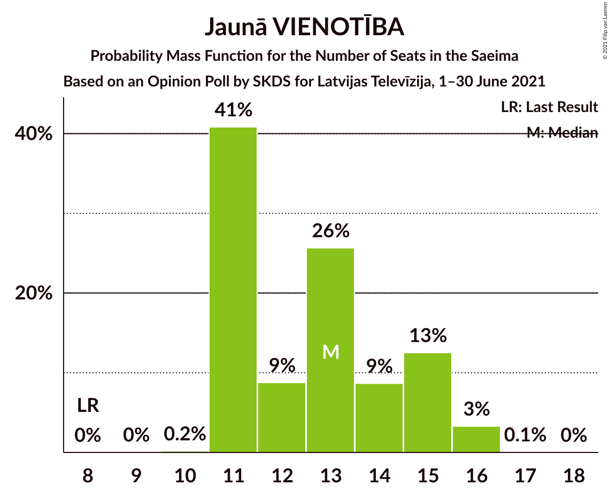
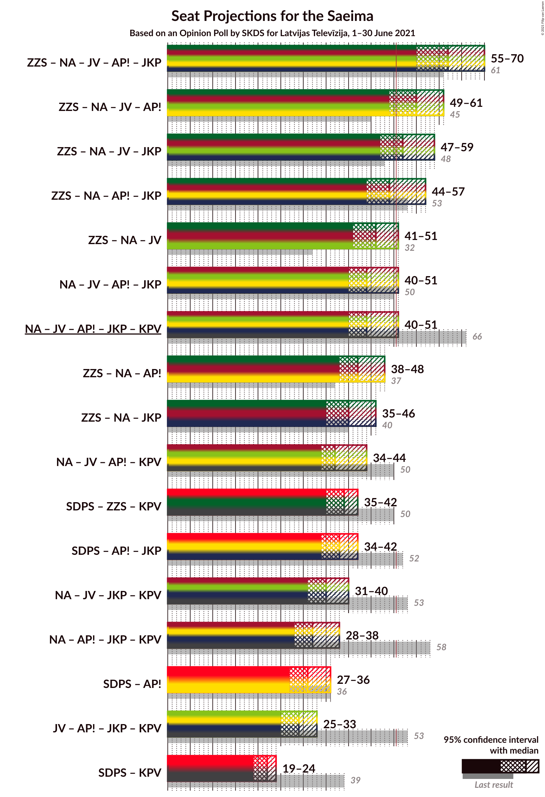

# Opinion Poll by SKDS for Latvijas Televīzija, 1–30 June 2021

<a href="#voting-intentions">Voting Intentions</a> | <a href="#seats">Seats</a> | <a href="#coalitions">Coalitions</a> | <a href="#technical-information">Technical Information</a>

## Voting Intentions

### Confidence Intervals

| Party | Last Result | Poll Result | 80% Confidence Interval | 90% Confidence Interval | 95% Confidence Interval | 99% Confidence Interval |
|:-----:|:-----------:|:-----------:|:-----------------------:|:-----------------------:|:-----------------------:|:-----------------------:|
| Sociāldemokrātiskā partija “Saskaņa” | 19.8% | 19.3% | 18.1–20.5% |17.8–20.9% |17.5–21.2% |17.0–21.8% |
| Zaļo un Zemnieku savienība | 9.9% | 14.9% | 13.9–16.0% |13.6–16.3% |13.3–16.6% |12.8–17.2% |
| Nacionālā apvienība „Visu Latvijai!”–„Tēvzemei un Brīvībai/LNNK” | 11.0% | 14.8% | 13.7–15.9% |13.5–16.2% |13.2–16.5% |12.7–17.1% |
| Jaunā VIENOTĪBA | 6.7% | 11.5% | 10.6–12.5% |10.3–12.8% |10.1–13.1% |9.7–13.6% |
| Attīstībai/Par! | 12.0% | 8.9% | 8.1–9.8% |7.9–10.1% |7.7–10.3% |7.3–10.8% |
| PROGRESĪVIE | 2.6% | 6.9% | 6.2–7.7% |6.0–8.0% |5.8–8.2% |5.5–8.6% |
| Jaunā konservatīvā partija | 13.6% | 6.0% | 5.3–6.8% |5.2–7.0% |5.0–7.2% |4.7–7.6% |
| Latvijas Krievu savienība | 3.2% | 5.3% | 4.7–6.1% |4.5–6.2% |4.3–6.4% |4.1–6.8% |
| Likums un kārtība | 0.0% | 5.3% | 4.7–6.1% |4.5–6.2% |4.3–6.4% |4.1–6.8% |
| Latvijas Reģionu Apvienība | 4.1% | 4.4% | 3.8–5.1% |3.7–5.3% |3.6–5.5% |3.3–5.8% |
| Politiskā partija „KPV LV” | 14.2% | 0.9% | 0.7–1.2% |0.6–1.4% |0.5–1.4% |0.5–1.6% |

*Note:* The poll result column reflects the actual value used in the calculations. Published results may vary slightly, and in addition be rounded to fewer digits.

## Seats

### Confidence Intervals

| Party | Last Result | Median | 80% Confidence Interval | 90% Confidence Interval | 95% Confidence Interval | 99% Confidence Interval |
|:-----:|:-----------:|:------:|:-----------------------:|:-----------------------:|:-----------------------:|:-----------------------:|
| <a href="#sociāldemokrātiskā-partija-“saskaņa”">Sociāldemokrātiskā partija “Saskaņa”</a> | 23 | 22 | 20–23 |20–24 |19–24 |18–26 |
| <a href="#zaļo-un-zemnieku-savienība">Zaļo un Zemnieku savienība</a> | 11 | 17 | 16–19 |15–19 |15–19 |14–20 |
| <a href="#nacionālā-apvienība-„visu-latvijai!”–„tēvzemei-un-brīvībai/lnnk”">Nacionālā apvienība „Visu Latvijai!”–„Tēvzemei un Brīvībai/LNNK”</a> | 13 | 16 | 14–17 |14–18 |14–18 |13–20 |
| <a href="#jaunā-vienotība">Jaunā VIENOTĪBA</a> | 8 | 13 | 11–15 |11–15 |11–16 |11–16 |
| <a href="#attīstībai/par!">Attīstībai/Par!</a> | 13 | 9 | 8–11 |7–11 |7–13 |7–14 |
| <a href="#progresīvie">PROGRESĪVIE</a> | 0 | 7 | 7–8 |7–8 |7–8 |6–9 |
| <a href="#jaunā-konservatīvā-partija">Jaunā konservatīvā partija</a> | 16 | 7 | 6–7 |6–8 |0–9 |0–9 |
| <a href="#latvijas-krievu-savienība">Latvijas Krievu savienība</a> | 0 | 7 | 0–8 |0–8 |0–8 |0–8 |
| <a href="#likums-un-kārtība">Likums un kārtība</a> | 0 | 5 | 0–7 |0–7 |0–7 |0–7 |
| <a href="#latvijas-reģionu-apvienība">Latvijas Reģionu Apvienība</a> | 0 | 0 | 0–6 |0–6 |0–6 |0–6 |
| <a href="#politiskā-partija-„kpv-lv”">Politiskā partija „KPV LV”</a> | 16 | 0 | 0 |0 |0 |0 |

### Sociāldemokrātiskā partija “Saskaņa”

*For a full overview of the results for this party, see the [Sociāldemokrātiskā partija “Saskaņa”](party-sociāldemokrātiskāpartija“saskaņa”.html) page.*

| Number of Seats | Probability | Accumulated | Special Marks |
|:---------------:|:-----------:|:-----------:|:-------------:|
| 17 | 0.4% | 100% |  |
| 18 | 0.4% | 99.6% |  |
| 19 | 3% | 99.2% |  |
| 20 | 23% | 96% |  |
| 21 | 20% | 73% |  |
| 22 | 26% | 53% | Median |
| 23 | 21% | 27% | Last Result |
| 24 | 5% | 7% |  |
| 25 | 1.4% | 2% |  |
| 26 | 0.4% | 0.5% |  |
| 27 | 0.1% | 0.1% |  |
| 28 | 0% | 0% |  |

### Zaļo un Zemnieku savienība

*For a full overview of the results for this party, see the [Zaļo un Zemnieku savienība](party-zaļounzemniekusavienība.html) page.*

| Number of Seats | Probability | Accumulated | Special Marks |
|:---------------:|:-----------:|:-----------:|:-------------:|
| 11 | 0% | 100% | Last Result |
| 12 | 0% | 100% |  |
| 13 | 0.2% | 100% |  |
| 14 | 0.9% | 99.8% |  |
| 15 | 4% | 98.9% |  |
| 16 | 25% | 94% |  |
| 17 | 40% | 70% | Median |
| 18 | 16% | 30% |  |
| 19 | 12% | 14% |  |
| 20 | 1.3% | 2% |  |
| 21 | 0.3% | 0.3% |  |
| 22 | 0.1% | 0.1% |  |
| 23 | 0% | 0% |  |

### Nacionālā apvienība „Visu Latvijai!”–„Tēvzemei un Brīvībai/LNNK”

*For a full overview of the results for this party, see the [Nacionālā apvienība „Visu Latvijai!”–„Tēvzemei un Brīvībai/LNNK”](party-nacionālāapvienība„visulatvijai”–„tēvzemeiunbrīvībailnnk”.html) page.*

| Number of Seats | Probability | Accumulated | Special Marks |
|:---------------:|:-----------:|:-----------:|:-------------:|
| 13 | 2% | 100% | Last Result |
| 14 | 28% | 98% |  |
| 15 | 6% | 70% |  |
| 16 | 25% | 64% | Median |
| 17 | 30% | 39% |  |
| 18 | 7% | 9% |  |
| 19 | 1.1% | 2% |  |
| 20 | 1.2% | 1.2% |  |
| 21 | 0% | 0% |  |

### Jaunā VIENOTĪBA

*For a full overview of the results for this party, see the [Jaunā VIENOTĪBA](party-jaunāvienotība.html) page.*

| Number of Seats | Probability | Accumulated | Special Marks |
|:---------------:|:-----------:|:-----------:|:-------------:|
| 8 | 0% | 100% | Last Result |
| 9 | 0% | 100% |  |
| 10 | 0.2% | 100% |  |
| 11 | 41% | 99.8% |  |
| 12 | 9% | 59% |  |
| 13 | 26% | 50% | Median |
| 14 | 9% | 25% |  |
| 15 | 13% | 16% |  |
| 16 | 3% | 3% |  |
| 17 | 0.1% | 0.1% |  |
| 18 | 0% | 0% |  |

### Attīstībai/Par!

*For a full overview of the results for this party, see the [Attīstībai/Par!](party-attīstībaipar.html) page.*

| Number of Seats | Probability | Accumulated | Special Marks |
|:---------------:|:-----------:|:-----------:|:-------------:|
| 7 | 9% | 100% |  |
| 8 | 11% | 91% |  |
| 9 | 33% | 80% | Median |
| 10 | 35% | 46% |  |
| 11 | 7% | 11% |  |
| 12 | 1.5% | 4% |  |
| 13 | 1.4% | 3% | Last Result |
| 14 | 1.3% | 1.3% |  |
| 15 | 0% | 0% |  |

### PROGRESĪVIE

*For a full overview of the results for this party, see the [PROGRESĪVIE](party-progresīvie.html) page.*

| Number of Seats | Probability | Accumulated | Special Marks |
|:---------------:|:-----------:|:-----------:|:-------------:|
| 0 | 0% | 100% | Last Result |
| 1 | 0% | 100% |  |
| 2 | 0% | 100% |  |
| 3 | 0% | 100% |  |
| 4 | 0% | 100% |  |
| 5 | 0.1% | 100% |  |
| 6 | 0.4% | 99.8% |  |
| 7 | 67% | 99.4% | Median |
| 8 | 31% | 33% |  |
| 9 | 2% | 2% |  |
| 10 | 0% | 0.1% |  |
| 11 | 0.1% | 0.1% |  |
| 12 | 0% | 0% |  |

### Jaunā konservatīvā partija

*For a full overview of the results for this party, see the [Jaunā konservatīvā partija](party-jaunākonservatīvāpartija.html) page.*

| Number of Seats | Probability | Accumulated | Special Marks |
|:---------------:|:-----------:|:-----------:|:-------------:|
| 0 | 3% | 100% |  |
| 1 | 0% | 97% |  |
| 2 | 0% | 97% |  |
| 3 | 0% | 97% |  |
| 4 | 0% | 97% |  |
| 5 | 0% | 97% |  |
| 6 | 16% | 97% |  |
| 7 | 75% | 81% | Median |
| 8 | 2% | 6% |  |
| 9 | 4% | 4% |  |
| 10 | 0% | 0% |  |
| 11 | 0% | 0% |  |
| 12 | 0% | 0% |  |
| 13 | 0% | 0% |  |
| 14 | 0% | 0% |  |
| 15 | 0% | 0% |  |
| 16 | 0% | 0% | Last Result |

### Latvijas Krievu savienība

*For a full overview of the results for this party, see the [Latvijas Krievu savienība](party-latvijaskrievusavienība.html) page.*

| Number of Seats | Probability | Accumulated | Special Marks |
|:---------------:|:-----------:|:-----------:|:-------------:|
| 0 | 33% | 100% | Last Result |
| 1 | 0% | 67% |  |
| 2 | 0% | 67% |  |
| 3 | 0% | 67% |  |
| 4 | 0% | 67% |  |
| 5 | 2% | 67% |  |
| 6 | 14% | 65% |  |
| 7 | 8% | 51% | Median |
| 8 | 42% | 42% |  |
| 9 | 0% | 0% |  |

### Likums un kārtība

*For a full overview of the results for this party, see the [Likums un kārtība](party-likumsunkārtība.html) page.*

| Number of Seats | Probability | Accumulated | Special Marks |
|:---------------:|:-----------:|:-----------:|:-------------:|
| 0 | 47% | 100% | Last Result |
| 1 | 0% | 53% |  |
| 2 | 0% | 53% |  |
| 3 | 0% | 53% |  |
| 4 | 0% | 53% |  |
| 5 | 12% | 53% | Median |
| 6 | 28% | 41% |  |
| 7 | 13% | 14% |  |
| 8 | 0.1% | 0.1% |  |
| 9 | 0% | 0% |  |

### Latvijas Reģionu Apvienība

*For a full overview of the results for this party, see the [Latvijas Reģionu Apvienība](party-latvijasreģionuapvienība.html) page.*

| Number of Seats | Probability | Accumulated | Special Marks |
|:---------------:|:-----------:|:-----------:|:-------------:|
| 0 | 77% | 100% | Last Result, Median |
| 1 | 0% | 23% |  |
| 2 | 0% | 23% |  |
| 3 | 0% | 23% |  |
| 4 | 0% | 23% |  |
| 5 | 0% | 23% |  |
| 6 | 23% | 23% |  |
| 7 | 0% | 0% |  |

### Politiskā partija „KPV LV”

*For a full overview of the results for this party, see the [Politiskā partija „KPV LV”](party-politiskāpartija„kpvlv”.html) page.*

| Number of Seats | Probability | Accumulated | Special Marks |
|:---------------:|:-----------:|:-----------:|:-------------:|
| 0 | 100% | 100% | Median |
| 1 | 0% | 0% |  |
| 2 | 0% | 0% |  |
| 3 | 0% | 0% |  |
| 4 | 0% | 0% |  |
| 5 | 0% | 0% |  |
| 6 | 0% | 0% |  |
| 7 | 0% | 0% |  |
| 8 | 0% | 0% |  |
| 9 | 0% | 0% |  |
| 10 | 0% | 0% |  |
| 11 | 0% | 0% |  |
| 12 | 0% | 0% |  |
| 13 | 0% | 0% |  |
| 14 | 0% | 0% |  |
| 15 | 0% | 0% |  |
| 16 | 0% | 0% | Last Result |

## Coalitions

### Confidence Intervals

| Coalition | Last Result | Median | Majority? | 80% Confidence Interval | 90% Confidence Interval | 95% Confidence Interval | 99% Confidence Interval |
|:---------:|:-----------:|:------:|:---------:|:-----------------------:|:-----------------------:|:-----------------------:|:-----------------------:|
| Zaļo un Zemnieku savienība – Nacionālā apvienība „Visu Latvijai!”–„Tēvzemei un Brīvībai/LNNK” – Jaunā VIENOTĪBA – Attīstībai/Par! – Jaunā konservatīvā partija | 61 | 62 | 100% | 58–65 | 58–68 | 55–70 | 53–70 |
| Zaļo un Zemnieku savienība – Nacionālā apvienība „Visu Latvijai!”–„Tēvzemei un Brīvībai/LNNK” – Jaunā VIENOTĪBA – Attīstībai/Par! | 45 | 55 | 97% | 52–59 | 51–61 | 49–61 | 47–63 |
| Zaļo un Zemnieku savienība – Nacionālā apvienība „Visu Latvijai!”–„Tēvzemei un Brīvībai/LNNK” – Jaunā VIENOTĪBA – Jaunā konservatīvā partija | 48 | 52 | 66% | 49–55 | 49–58 | 47–59 | 45–59 |
| Zaļo un Zemnieku savienība – Nacionālā apvienība „Visu Latvijai!”–„Tēvzemei un Brīvībai/LNNK” – Attīstībai/Par! – Jaunā konservatīvā partija | 53 | 49 | 30% | 46–52 | 45–55 | 44–57 | 42–57 |
| Zaļo un Zemnieku savienība – Nacionālā apvienība „Visu Latvijai!”–„Tēvzemei un Brīvībai/LNNK” – Jaunā VIENOTĪBA | 32 | 46 | 3% | 43–48 | 42–50 | 41–51 | 39–53 |
| Nacionālā apvienība „Visu Latvijai!”–„Tēvzemei un Brīvībai/LNNK” – Jaunā VIENOTĪBA – Attīstībai/Par! – Jaunā konservatīvā partija | 50 | 44 | 5% | 41–48 | 40–51 | 40–51 | 37–52 |
| Nacionālā apvienība „Visu Latvijai!”–„Tēvzemei un Brīvībai/LNNK” – Jaunā VIENOTĪBA – Attīstībai/Par! – Jaunā konservatīvā partija – Politiskā partija „KPV LV” | 66 | 44 | 5% | 41–48 | 40–51 | 40–51 | 37–52 |
| Zaļo un Zemnieku savienība – Nacionālā apvienība „Visu Latvijai!”–„Tēvzemei un Brīvībai/LNNK” – Attīstībai/Par! | 37 | 42 | 0.1% | 39–46 | 39–48 | 38–48 | 36–50 |
| Zaļo un Zemnieku savienība – Nacionālā apvienība „Visu Latvijai!”–„Tēvzemei un Brīvībai/LNNK” – Jaunā konservatīvā partija | 40 | 40 | 0% | 37–42 | 36–44 | 35–46 | 34–46 |
| Nacionālā apvienība „Visu Latvijai!”–„Tēvzemei un Brīvībai/LNNK” – Jaunā VIENOTĪBA – Attīstībai/Par! – Politiskā partija „KPV LV” | 50 | 37 | 0% | 35–41 | 34–42 | 34–44 | 32–45 |
| Sociāldemokrātiskā partija “Saskaņa” – Zaļo un Zemnieku savienība – Politiskā partija „KPV LV” | 50 | 39 | 0% | 36–41 | 36–42 | 35–42 | 34–45 |
| Sociāldemokrātiskā partija “Saskaņa” – Attīstībai/Par! – Jaunā konservatīvā partija | 52 | 38 | 0% | 34–40 | 34–42 | 34–42 | 32–44 |
| Nacionālā apvienība „Visu Latvijai!”–„Tēvzemei un Brīvībai/LNNK” – Jaunā VIENOTĪBA – Jaunā konservatīvā partija – Politiskā partija „KPV LV” | 53 | 35 | 0% | 32–38 | 31–40 | 31–40 | 28–42 |
| Nacionālā apvienība „Visu Latvijai!”–„Tēvzemei un Brīvībai/LNNK” – Attīstībai/Par! – Jaunā konservatīvā partija – Politiskā partija „KPV LV” | 58 | 32 | 0% | 29–34 | 29–37 | 28–38 | 26–38 |
| Sociāldemokrātiskā partija “Saskaņa” – Attīstībai/Par! | 36 | 31 | 0% | 28–33 | 27–34 | 27–36 | 27–37 |
| Jaunā VIENOTĪBA – Attīstībai/Par! – Jaunā konservatīvā partija – Politiskā partija „KPV LV” | 53 | 29 | 0% | 25–32 | 25–33 | 25–33 | 22–33 |
| Sociāldemokrātiskā partija “Saskaņa” – Politiskā partija „KPV LV” | 39 | 22 | 0% | 20–23 | 20–24 | 19–24 | 18–26 |

### Zaļo un Zemnieku savienība – Nacionālā apvienība „Visu Latvijai!”–„Tēvzemei un Brīvībai/LNNK” – Jaunā VIENOTĪBA – Attīstībai/Par! – Jaunā konservatīvā partija

| Number of Seats | Probability | Accumulated | Special Marks |
|:---------------:|:-----------:|:-----------:|:-------------:|
| 52 | 0.1% | 100% |  |
| 53 | 0.9% | 99.9% |  |
| 54 | 0.3% | 99.0% |  |
| 55 | 2% | 98.8% |  |
| 56 | 0.4% | 97% |  |
| 57 | 0.7% | 97% |  |
| 58 | 8% | 96% |  |
| 59 | 23% | 88% |  |
| 60 | 11% | 65% |  |
| 61 | 3% | 55% | Last Result |
| 62 | 13% | 52% | Median |
| 63 | 10% | 39% |  |
| 64 | 17% | 29% |  |
| 65 | 3% | 11% |  |
| 66 | 2% | 9% |  |
| 67 | 1.0% | 7% |  |
| 68 | 2% | 6% |  |
| 69 | 0.6% | 4% |  |
| 70 | 4% | 4% |  |
| 71 | 0.1% | 0.1% |  |
| 72 | 0% | 0% |  |

### Zaļo un Zemnieku savienība – Nacionālā apvienība „Visu Latvijai!”–„Tēvzemei un Brīvībai/LNNK” – Jaunā VIENOTĪBA – Attīstībai/Par!

| Number of Seats | Probability | Accumulated | Special Marks |
|:---------------:|:-----------:|:-----------:|:-------------:|
| 45 | 0% | 100% | Last Result |
| 46 | 0.2% | 100% |  |
| 47 | 0.7% | 99.8% |  |
| 48 | 0.8% | 99.2% |  |
| 49 | 1.1% | 98% |  |
| 50 | 0.4% | 97% |  |
| 51 | 2% | 97% | Majority |
| 52 | 28% | 95% |  |
| 53 | 7% | 67% |  |
| 54 | 7% | 60% |  |
| 55 | 13% | 53% | Median |
| 56 | 9% | 40% |  |
| 57 | 19% | 32% |  |
| 58 | 3% | 13% |  |
| 59 | 1.5% | 10% |  |
| 60 | 1.2% | 9% |  |
| 61 | 5% | 8% |  |
| 62 | 1.3% | 2% |  |
| 63 | 0.9% | 1.1% |  |
| 64 | 0.1% | 0.2% |  |
| 65 | 0% | 0.1% |  |
| 66 | 0% | 0% |  |

### Zaļo un Zemnieku savienība – Nacionālā apvienība „Visu Latvijai!”–„Tēvzemei un Brīvībai/LNNK” – Jaunā VIENOTĪBA – Jaunā konservatīvā partija

| Number of Seats | Probability | Accumulated | Special Marks |
|:---------------:|:-----------:|:-----------:|:-------------:|
| 43 | 0.1% | 100% |  |
| 44 | 0.1% | 99.9% |  |
| 45 | 0.8% | 99.9% |  |
| 46 | 1.5% | 99.1% |  |
| 47 | 1.0% | 98% |  |
| 48 | 0.6% | 97% | Last Result |
| 49 | 11% | 96% |  |
| 50 | 19% | 85% |  |
| 51 | 6% | 66% | Majority |
| 52 | 13% | 60% |  |
| 53 | 13% | 47% | Median |
| 54 | 21% | 35% |  |
| 55 | 5% | 13% |  |
| 56 | 2% | 8% |  |
| 57 | 2% | 7% |  |
| 58 | 1.0% | 5% |  |
| 59 | 4% | 4% |  |
| 60 | 0.5% | 0.5% |  |
| 61 | 0% | 0% |  |

### Zaļo un Zemnieku savienība – Nacionālā apvienība „Visu Latvijai!”–„Tēvzemei un Brīvībai/LNNK” – Attīstībai/Par! – Jaunā konservatīvā partija

| Number of Seats | Probability | Accumulated | Special Marks |
|:---------------:|:-----------:|:-----------:|:-------------:|
| 41 | 0.1% | 100% |  |
| 42 | 0.9% | 99.9% |  |
| 43 | 0.6% | 99.0% |  |
| 44 | 2% | 98% |  |
| 45 | 2% | 97% |  |
| 46 | 13% | 95% |  |
| 47 | 13% | 82% |  |
| 48 | 12% | 69% |  |
| 49 | 21% | 57% | Median |
| 50 | 5% | 35% |  |
| 51 | 16% | 30% | Majority |
| 52 | 5% | 14% |  |
| 53 | 2% | 9% | Last Result |
| 54 | 1.3% | 6% |  |
| 55 | 0.9% | 5% |  |
| 56 | 0.1% | 4% |  |
| 57 | 4% | 4% |  |
| 58 | 0.1% | 0.1% |  |
| 59 | 0% | 0% |  |

### Zaļo un Zemnieku savienība – Nacionālā apvienība „Visu Latvijai!”–„Tēvzemei un Brīvībai/LNNK” – Jaunā VIENOTĪBA

| Number of Seats | Probability | Accumulated | Special Marks |
|:---------------:|:-----------:|:-----------:|:-------------:|
| 32 | 0% | 100% | Last Result |
| 33 | 0% | 100% |  |
| 34 | 0% | 100% |  |
| 35 | 0% | 100% |  |
| 36 | 0% | 100% |  |
| 37 | 0% | 100% |  |
| 38 | 0% | 100% |  |
| 39 | 0.7% | 100% |  |
| 40 | 2% | 99.2% |  |
| 41 | 0.5% | 98% |  |
| 42 | 4% | 97% |  |
| 43 | 22% | 93% |  |
| 44 | 8% | 71% |  |
| 45 | 12% | 64% |  |
| 46 | 15% | 51% | Median |
| 47 | 23% | 36% |  |
| 48 | 4% | 13% |  |
| 49 | 2% | 10% |  |
| 50 | 5% | 8% |  |
| 51 | 1.3% | 3% | Majority |
| 52 | 1.0% | 2% |  |
| 53 | 0.5% | 0.6% |  |
| 54 | 0% | 0.1% |  |
| 55 | 0% | 0% |  |

### Nacionālā apvienība „Visu Latvijai!”–„Tēvzemei un Brīvībai/LNNK” – Jaunā VIENOTĪBA – Attīstībai/Par! – Jaunā konservatīvā partija

| Number of Seats | Probability | Accumulated | Special Marks |
|:---------------:|:-----------:|:-----------:|:-------------:|
| 35 | 0.1% | 100% |  |
| 36 | 0% | 99.9% |  |
| 37 | 0.5% | 99.9% |  |
| 38 | 0.3% | 99.4% |  |
| 39 | 1.1% | 99.1% |  |
| 40 | 7% | 98% |  |
| 41 | 2% | 91% |  |
| 42 | 11% | 89% |  |
| 43 | 28% | 78% |  |
| 44 | 6% | 50% |  |
| 45 | 10% | 44% | Median |
| 46 | 8% | 35% |  |
| 47 | 8% | 27% |  |
| 48 | 11% | 19% |  |
| 49 | 2% | 7% |  |
| 50 | 0.4% | 6% | Last Result |
| 51 | 4% | 5% | Majority |
| 52 | 0.9% | 1.0% |  |
| 53 | 0% | 0.1% |  |
| 54 | 0% | 0% |  |

### Nacionālā apvienība „Visu Latvijai!”–„Tēvzemei un Brīvībai/LNNK” – Jaunā VIENOTĪBA – Attīstībai/Par! – Jaunā konservatīvā partija – Politiskā partija „KPV LV”

| Number of Seats | Probability | Accumulated | Special Marks |
|:---------------:|:-----------:|:-----------:|:-------------:|
| 35 | 0.1% | 100% |  |
| 36 | 0% | 99.9% |  |
| 37 | 0.5% | 99.9% |  |
| 38 | 0.3% | 99.4% |  |
| 39 | 1.1% | 99.1% |  |
| 40 | 7% | 98% |  |
| 41 | 2% | 91% |  |
| 42 | 11% | 89% |  |
| 43 | 28% | 78% |  |
| 44 | 6% | 50% |  |
| 45 | 10% | 44% | Median |
| 46 | 8% | 35% |  |
| 47 | 8% | 27% |  |
| 48 | 11% | 19% |  |
| 49 | 2% | 7% |  |
| 50 | 0.4% | 6% |  |
| 51 | 4% | 5% | Majority |
| 52 | 0.9% | 1.0% |  |
| 53 | 0% | 0.1% |  |
| 54 | 0% | 0% |  |
| 55 | 0% | 0% |  |
| 56 | 0% | 0% |  |
| 57 | 0% | 0% |  |
| 58 | 0% | 0% |  |
| 59 | 0% | 0% |  |
| 60 | 0% | 0% |  |
| 61 | 0% | 0% |  |
| 62 | 0% | 0% |  |
| 63 | 0% | 0% |  |
| 64 | 0% | 0% |  |
| 65 | 0% | 0% |  |
| 66 | 0% | 0% | Last Result |

### Zaļo un Zemnieku savienība – Nacionālā apvienība „Visu Latvijai!”–„Tēvzemei un Brīvībai/LNNK” – Attīstībai/Par!

| Number of Seats | Probability | Accumulated | Special Marks |
|:---------------:|:-----------:|:-----------:|:-------------:|
| 35 | 0.2% | 100% |  |
| 36 | 0.8% | 99.8% |  |
| 37 | 1.0% | 99.0% | Last Result |
| 38 | 1.4% | 98% |  |
| 39 | 13% | 97% |  |
| 40 | 3% | 83% |  |
| 41 | 21% | 80% |  |
| 42 | 20% | 58% | Median |
| 43 | 6% | 38% |  |
| 44 | 16% | 32% |  |
| 45 | 5% | 16% |  |
| 46 | 4% | 11% |  |
| 47 | 2% | 7% |  |
| 48 | 4% | 6% |  |
| 49 | 0.8% | 2% |  |
| 50 | 0.8% | 0.9% |  |
| 51 | 0% | 0.1% | Majority |
| 52 | 0% | 0% |  |

### Zaļo un Zemnieku savienība – Nacionālā apvienība „Visu Latvijai!”–„Tēvzemei un Brīvībai/LNNK” – Jaunā konservatīvā partija

| Number of Seats | Probability | Accumulated | Special Marks |
|:---------------:|:-----------:|:-----------:|:-------------:|
| 32 | 0.1% | 100% |  |
| 33 | 0.1% | 99.9% |  |
| 34 | 1.0% | 99.8% |  |
| 35 | 2% | 98.8% |  |
| 36 | 2% | 97% |  |
| 37 | 15% | 95% |  |
| 38 | 14% | 79% |  |
| 39 | 15% | 66% |  |
| 40 | 11% | 50% | Last Result, Median |
| 41 | 18% | 39% |  |
| 42 | 11% | 21% |  |
| 43 | 4% | 10% |  |
| 44 | 2% | 6% |  |
| 45 | 0.5% | 4% |  |
| 46 | 3% | 3% |  |
| 47 | 0.1% | 0.1% |  |
| 48 | 0% | 0% |  |

### Nacionālā apvienība „Visu Latvijai!”–„Tēvzemei un Brīvībai/LNNK” – Jaunā VIENOTĪBA – Attīstībai/Par! – Politiskā partija „KPV LV”

| Number of Seats | Probability | Accumulated | Special Marks |
|:---------------:|:-----------:|:-----------:|:-------------:|
| 31 | 0.5% | 100% |  |
| 32 | 0.5% | 99.5% |  |
| 33 | 0.7% | 99.0% |  |
| 34 | 8% | 98% |  |
| 35 | 11% | 90% |  |
| 36 | 24% | 79% |  |
| 37 | 9% | 55% |  |
| 38 | 10% | 46% | Median |
| 39 | 6% | 36% |  |
| 40 | 10% | 30% |  |
| 41 | 11% | 20% |  |
| 42 | 5% | 9% |  |
| 43 | 0.4% | 4% |  |
| 44 | 2% | 3% |  |
| 45 | 1.1% | 2% |  |
| 46 | 0.3% | 0.4% |  |
| 47 | 0% | 0.1% |  |
| 48 | 0% | 0% |  |
| 49 | 0% | 0% |  |
| 50 | 0% | 0% | Last Result |

### Sociāldemokrātiskā partija “Saskaņa” – Zaļo un Zemnieku savienība – Politiskā partija „KPV LV”

| Number of Seats | Probability | Accumulated | Special Marks |
|:---------------:|:-----------:|:-----------:|:-------------:|
| 33 | 0.3% | 100% |  |
| 34 | 0.4% | 99.6% |  |
| 35 | 3% | 99.3% |  |
| 36 | 14% | 96% |  |
| 37 | 16% | 82% |  |
| 38 | 13% | 66% |  |
| 39 | 17% | 53% | Median |
| 40 | 12% | 37% |  |
| 41 | 19% | 24% |  |
| 42 | 3% | 5% |  |
| 43 | 0.6% | 2% |  |
| 44 | 0.8% | 1.4% |  |
| 45 | 0.5% | 0.5% |  |
| 46 | 0.1% | 0.1% |  |
| 47 | 0% | 0% |  |
| 48 | 0% | 0% |  |
| 49 | 0% | 0% |  |
| 50 | 0% | 0% | Last Result |

### Sociāldemokrātiskā partija “Saskaņa” – Attīstībai/Par! – Jaunā konservatīvā partija

| Number of Seats | Probability | Accumulated | Special Marks |
|:---------------:|:-----------:|:-----------:|:-------------:|
| 30 | 0.1% | 100% |  |
| 31 | 0.3% | 99.9% |  |
| 32 | 0.4% | 99.6% |  |
| 33 | 1.0% | 99.2% |  |
| 34 | 10% | 98% |  |
| 35 | 3% | 88% |  |
| 36 | 18% | 85% |  |
| 37 | 9% | 67% |  |
| 38 | 24% | 59% | Median |
| 39 | 13% | 34% |  |
| 40 | 14% | 22% |  |
| 41 | 2% | 8% |  |
| 42 | 4% | 6% |  |
| 43 | 0.8% | 2% |  |
| 44 | 1.0% | 1.3% |  |
| 45 | 0.2% | 0.3% |  |
| 46 | 0% | 0.1% |  |
| 47 | 0.1% | 0.1% |  |
| 48 | 0% | 0% |  |
| 49 | 0% | 0% |  |
| 50 | 0% | 0% |  |
| 51 | 0% | 0% | Majority |
| 52 | 0% | 0% | Last Result |

### Nacionālā apvienība „Visu Latvijai!”–„Tēvzemei un Brīvībai/LNNK” – Jaunā VIENOTĪBA – Jaunā konservatīvā partija – Politiskā partija „KPV LV”

| Number of Seats | Probability | Accumulated | Special Marks |
|:---------------:|:-----------:|:-----------:|:-------------:|
| 25 | 0.1% | 100% |  |
| 26 | 0% | 99.9% |  |
| 27 | 0% | 99.9% |  |
| 28 | 0.5% | 99.9% |  |
| 29 | 0.2% | 99.4% |  |
| 30 | 1.0% | 99.2% |  |
| 31 | 7% | 98% |  |
| 32 | 5% | 91% |  |
| 33 | 7% | 86% |  |
| 34 | 22% | 79% |  |
| 35 | 18% | 56% |  |
| 36 | 10% | 39% | Median |
| 37 | 9% | 29% |  |
| 38 | 13% | 20% |  |
| 39 | 2% | 7% |  |
| 40 | 4% | 6% |  |
| 41 | 0.9% | 2% |  |
| 42 | 0.8% | 0.8% |  |
| 43 | 0% | 0% |  |
| 44 | 0% | 0% |  |
| 45 | 0% | 0% |  |
| 46 | 0% | 0% |  |
| 47 | 0% | 0% |  |
| 48 | 0% | 0% |  |
| 49 | 0% | 0% |  |
| 50 | 0% | 0% |  |
| 51 | 0% | 0% | Majority |
| 52 | 0% | 0% |  |
| 53 | 0% | 0% | Last Result |

### Nacionālā apvienība „Visu Latvijai!”–„Tēvzemei un Brīvībai/LNNK” – Attīstībai/Par! – Jaunā konservatīvā partija – Politiskā partija „KPV LV”

| Number of Seats | Probability | Accumulated | Special Marks |
|:---------------:|:-----------:|:-----------:|:-------------:|
| 24 | 0.1% | 100% |  |
| 25 | 0.1% | 99.9% |  |
| 26 | 0.8% | 99.8% |  |
| 27 | 0.4% | 99.0% |  |
| 28 | 3% | 98.6% |  |
| 29 | 9% | 96% |  |
| 30 | 18% | 87% |  |
| 31 | 10% | 69% |  |
| 32 | 21% | 59% | Median |
| 33 | 17% | 38% |  |
| 34 | 12% | 21% |  |
| 35 | 3% | 10% |  |
| 36 | 1.1% | 7% |  |
| 37 | 2% | 6% |  |
| 38 | 4% | 4% |  |
| 39 | 0.1% | 0.2% |  |
| 40 | 0.1% | 0.1% |  |
| 41 | 0% | 0% |  |
| 42 | 0% | 0% |  |
| 43 | 0% | 0% |  |
| 44 | 0% | 0% |  |
| 45 | 0% | 0% |  |
| 46 | 0% | 0% |  |
| 47 | 0% | 0% |  |
| 48 | 0% | 0% |  |
| 49 | 0% | 0% |  |
| 50 | 0% | 0% |  |
| 51 | 0% | 0% | Majority |
| 52 | 0% | 0% |  |
| 53 | 0% | 0% |  |
| 54 | 0% | 0% |  |
| 55 | 0% | 0% |  |
| 56 | 0% | 0% |  |
| 57 | 0% | 0% |  |
| 58 | 0% | 0% | Last Result |

### Sociāldemokrātiskā partija “Saskaņa” – Attīstībai/Par!

| Number of Seats | Probability | Accumulated | Special Marks |
|:---------------:|:-----------:|:-----------:|:-------------:|
| 25 | 0.3% | 100% |  |
| 26 | 0.2% | 99.7% |  |
| 27 | 8% | 99.5% |  |
| 28 | 4% | 92% |  |
| 29 | 15% | 88% |  |
| 30 | 9% | 73% |  |
| 31 | 24% | 64% | Median |
| 32 | 16% | 40% |  |
| 33 | 17% | 24% |  |
| 34 | 3% | 6% |  |
| 35 | 0.7% | 3% |  |
| 36 | 1.1% | 3% | Last Result |
| 37 | 1.2% | 2% |  |
| 38 | 0.3% | 0.3% |  |
| 39 | 0% | 0% |  |

### Jaunā VIENOTĪBA – Attīstībai/Par! – Jaunā konservatīvā partija – Politiskā partija „KPV LV”

| Number of Seats | Probability | Accumulated | Special Marks |
|:---------------:|:-----------:|:-----------:|:-------------:|
| 19 | 0% | 100% |  |
| 20 | 0.2% | 99.9% |  |
| 21 | 0.2% | 99.8% |  |
| 22 | 0% | 99.5% |  |
| 23 | 0.1% | 99.5% |  |
| 24 | 1.3% | 99.4% |  |
| 25 | 8% | 98% |  |
| 26 | 11% | 90% |  |
| 27 | 12% | 79% |  |
| 28 | 10% | 67% |  |
| 29 | 27% | 57% | Median |
| 30 | 8% | 30% |  |
| 31 | 6% | 22% |  |
| 32 | 10% | 16% |  |
| 33 | 6% | 6% |  |
| 34 | 0.2% | 0.4% |  |
| 35 | 0.2% | 0.2% |  |
| 36 | 0% | 0% |  |
| 37 | 0% | 0% |  |
| 38 | 0% | 0% |  |
| 39 | 0% | 0% |  |
| 40 | 0% | 0% |  |
| 41 | 0% | 0% |  |
| 42 | 0% | 0% |  |
| 43 | 0% | 0% |  |
| 44 | 0% | 0% |  |
| 45 | 0% | 0% |  |
| 46 | 0% | 0% |  |
| 47 | 0% | 0% |  |
| 48 | 0% | 0% |  |
| 49 | 0% | 0% |  |
| 50 | 0% | 0% |  |
| 51 | 0% | 0% | Majority |
| 52 | 0% | 0% |  |
| 53 | 0% | 0% | Last Result |

### Sociāldemokrātiskā partija “Saskaņa” – Politiskā partija „KPV LV”

| Number of Seats | Probability | Accumulated | Special Marks |
|:---------------:|:-----------:|:-----------:|:-------------:|
| 17 | 0.4% | 100% |  |
| 18 | 0.4% | 99.6% |  |
| 19 | 3% | 99.2% |  |
| 20 | 23% | 96% |  |
| 21 | 20% | 73% |  |
| 22 | 26% | 53% | Median |
| 23 | 21% | 27% |  |
| 24 | 5% | 7% |  |
| 25 | 1.4% | 2% |  |
| 26 | 0.4% | 0.5% |  |
| 27 | 0.1% | 0.1% |  |
| 28 | 0% | 0% |  |
| 29 | 0% | 0% |  |
| 30 | 0% | 0% |  |
| 31 | 0% | 0% |  |
| 32 | 0% | 0% |  |
| 33 | 0% | 0% |  |
| 34 | 0% | 0% |  |
| 35 | 0% | 0% |  |
| 36 | 0% | 0% |  |
| 37 | 0% | 0% |  |
| 38 | 0% | 0% |  |
| 39 | 0% | 0% | Last Result |

## Technical Information

### Opinion Poll

+ **Polling firm:** SKDS
+ **Commissioner(s):** Latvijas Televīzija
+ **Fieldwork period:** 1–30 June 2021

### Calculations

+ **Sample size:** 1793
+ **Simulations done:** 1,048,576
+ **Error estimate:** 1.46%

