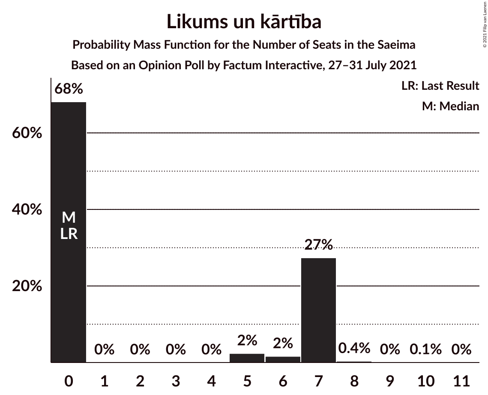
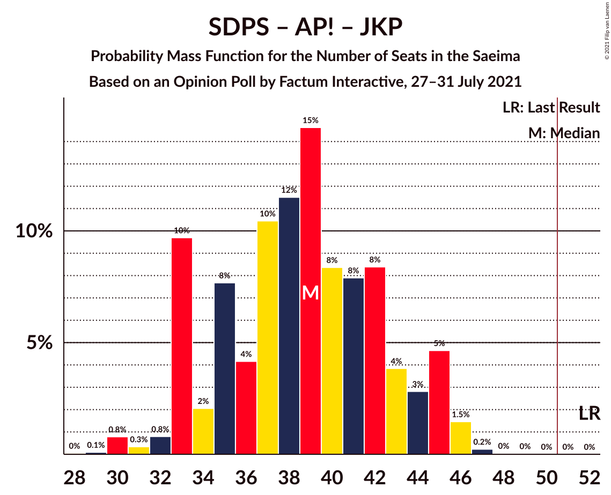

# Opinion Poll by Factum Interactive, 27–31 July 2021

<a href="#voting-intentions">Voting Intentions</a> | <a href="#seats">Seats</a> | <a href="#coalitions">Coalitions</a> | <a href="#technical-information">Technical Information</a>

## Voting Intentions

### Confidence Intervals

| Party | Last Result | Poll Result | 80% Confidence Interval | 90% Confidence Interval | 95% Confidence Interval | 99% Confidence Interval |
|:-----:|:-----------:|:-----------:|:-----------------------:|:-----------------------:|:-----------------------:|:-----------------------:|
| Jaunā VIENOTĪBA | 6.7% | 16.2% | 14.3–18.3% |13.8–18.9% |13.3–19.4% |12.5–20.5% |
| Sociāldemokrātiskā partija “Saskaņa” | 19.8% | 15.8% | 14.0–17.9% |13.4–18.5% |13.0–19.1% |12.2–20.1% |
| Nacionālā apvienība „Visu Latvijai!”–„Tēvzemei un Brīvībai/LNNK” | 11.0% | 14.4% | 12.6–16.4% |12.1–17.0% |11.7–17.5% |10.9–18.6% |
| Zaļo un Zemnieku savienība | 9.9% | 11.7% | 10.1–13.6% |9.6–14.1% |9.3–14.6% |8.6–15.6% |
| Attīstībai/Par! | 12.0% | 11.5% | 9.9–13.4% |9.5–13.9% |9.1–14.4% |8.4–15.4% |
| PROGRESĪVIE | 2.6% | 6.5% | 5.3–8.0% |5.0–8.4% |4.7–8.8% |4.2–9.6% |
| Jaunā konservatīvā partija | 13.6% | 5.7% | 4.7–7.2% |4.4–7.6% |4.1–8.0% |3.6–8.8% |
| Latvijas Reģionu Apvienība | 4.1% | 4.1% | 3.2–5.4% |3.0–5.8% |2.8–6.1% |2.4–6.8% |
| Likums un kārtība | 0.0% | 4.1% | 3.2–5.4% |3.0–5.8% |2.8–6.1% |2.4–6.8% |
| Latvijas Krievu savienība | 3.2% | 3.4% | 2.6–4.6% |2.4–5.0% |2.2–5.3% |1.9–5.9% |
| Politiskā partija „KPV LV” | 14.2% | 0.5% | 0.3–1.2% |0.2–1.4% |0.2–1.6% |0.1–2.0% |

*Note:* The poll result column reflects the actual value used in the calculations. Published results may vary slightly, and in addition be rounded to fewer digits.

## Seats

### Confidence Intervals

| Party | Last Result | Median | 80% Confidence Interval | 90% Confidence Interval | 95% Confidence Interval | 99% Confidence Interval |
|:-----:|:-----------:|:------:|:-----------------------:|:-----------------------:|:-----------------------:|:-----------------------:|
| <a href="#jaunā-vienotība">Jaunā VIENOTĪBA</a> | 8 | 19 | 17–22 |17–23 |16–24 |15–26 |
| <a href="#sociāldemokrātiskā-partija-“saskaņa”">Sociāldemokrātiskā partija “Saskaņa”</a> | 23 | 19 | 17–22 |16–23 |16–24 |15–24 |
| <a href="#nacionālā-apvienība-„visu-latvijai!”–„tēvzemei-un-brīvībai/lnnk”">Nacionālā apvienība „Visu Latvijai!”–„Tēvzemei un Brīvībai/LNNK”</a> | 13 | 17 | 14–20 |14–20 |13–21 |13–22 |
| <a href="#zaļo-un-zemnieku-savienība">Zaļo un Zemnieku savienība</a> | 11 | 14 | 12–17 |11–18 |11–18 |11–19 |
| <a href="#attīstībai/par!">Attīstībai/Par!</a> | 13 | 14 | 11–16 |10–16 |10–17 |10–17 |
| <a href="#progresīvie">PROGRESĪVIE</a> | 0 | 7 | 7–9 |0–9 |0–11 |0–11 |
| <a href="#jaunā-konservatīvā-partija">Jaunā konservatīvā partija</a> | 16 | 7 | 0–8 |0–9 |0–9 |0–9 |
| <a href="#latvijas-reģionu-apvienība">Latvijas Reģionu Apvienība</a> | 0 | 0 | 0–6 |0–6 |0–7 |0–7 |
| <a href="#likums-un-kārtība">Likums un kārtība</a> | 0 | 0 | 0–7 |0–7 |0–7 |0–7 |
| <a href="#latvijas-krievu-savienība">Latvijas Krievu savienība</a> | 0 | 0 | 0 |0 |0–7 |0–8 |
| <a href="#politiskā-partija-„kpv-lv”">Politiskā partija „KPV LV”</a> | 16 | 0 | 0 |0 |0 |0 |

### Jaunā VIENOTĪBA

*For a full overview of the results for this party, see the [Jaunā VIENOTĪBA](party-jaunāvienotība.html) page.*

| Number of Seats | Probability | Accumulated | Special Marks |
|:---------------:|:-----------:|:-----------:|:-------------:|
| 8 | 0% | 100% | Last Result |
| 9 | 0% | 100% |  |
| 10 | 0% | 100% |  |
| 11 | 0% | 100% |  |
| 12 | 0% | 100% |  |
| 13 | 0.1% | 99.9% |  |
| 14 | 0.2% | 99.9% |  |
| 15 | 1.0% | 99.7% |  |
| 16 | 4% | 98.6% |  |
| 17 | 18% | 95% |  |
| 18 | 20% | 77% |  |
| 19 | 16% | 57% | Median |
| 20 | 25% | 42% |  |
| 21 | 4% | 17% |  |
| 22 | 6% | 12% |  |
| 23 | 4% | 7% |  |
| 24 | 2% | 3% |  |
| 25 | 0.3% | 1.3% |  |
| 26 | 0.8% | 0.9% |  |
| 27 | 0% | 0.1% |  |
| 28 | 0% | 0% |  |

### Sociāldemokrātiskā partija “Saskaņa”

*For a full overview of the results for this party, see the [Sociāldemokrātiskā partija “Saskaņa”](party-sociāldemokrātiskāpartija“saskaņa”.html) page.*

| Number of Seats | Probability | Accumulated | Special Marks |
|:---------------:|:-----------:|:-----------:|:-------------:|
| 14 | 0.1% | 100% |  |
| 15 | 0.6% | 99.9% |  |
| 16 | 6% | 99.3% |  |
| 17 | 10% | 94% |  |
| 18 | 28% | 84% |  |
| 19 | 8% | 56% | Median |
| 20 | 19% | 48% |  |
| 21 | 11% | 29% |  |
| 22 | 9% | 18% |  |
| 23 | 5% | 9% | Last Result |
| 24 | 4% | 4% |  |
| 25 | 0.1% | 0.4% |  |
| 26 | 0.1% | 0.2% |  |
| 27 | 0.1% | 0.1% |  |
| 28 | 0% | 0.1% |  |
| 29 | 0% | 0% |  |

### Nacionālā apvienība „Visu Latvijai!”–„Tēvzemei un Brīvībai/LNNK”

*For a full overview of the results for this party, see the [Nacionālā apvienība „Visu Latvijai!”–„Tēvzemei un Brīvībai/LNNK”](party-nacionālāapvienība„visulatvijai”–„tēvzemeiunbrīvībailnnk”.html) page.*

| Number of Seats | Probability | Accumulated | Special Marks |
|:---------------:|:-----------:|:-----------:|:-------------:|
| 12 | 0.1% | 100% |  |
| 13 | 3% | 99.8% | Last Result |
| 14 | 11% | 97% |  |
| 15 | 6% | 86% |  |
| 16 | 26% | 80% |  |
| 17 | 17% | 54% | Median |
| 18 | 6% | 37% |  |
| 19 | 8% | 31% |  |
| 20 | 18% | 23% |  |
| 21 | 4% | 5% |  |
| 22 | 0.4% | 0.6% |  |
| 23 | 0.2% | 0.3% |  |
| 24 | 0.1% | 0.1% |  |
| 25 | 0% | 0% |  |

### Zaļo un Zemnieku savienība

*For a full overview of the results for this party, see the [Zaļo un Zemnieku savienība](party-zaļounzemniekusavienība.html) page.*

| Number of Seats | Probability | Accumulated | Special Marks |
|:---------------:|:-----------:|:-----------:|:-------------:|
| 10 | 0.1% | 100% |  |
| 11 | 5% | 99.9% | Last Result |
| 12 | 13% | 95% |  |
| 13 | 27% | 82% |  |
| 14 | 16% | 55% | Median |
| 15 | 11% | 39% |  |
| 16 | 11% | 28% |  |
| 17 | 9% | 17% |  |
| 18 | 8% | 8% |  |
| 19 | 0.1% | 0.5% |  |
| 20 | 0.1% | 0.4% |  |
| 21 | 0.3% | 0.3% |  |
| 22 | 0% | 0% |  |

### Attīstībai/Par!

*For a full overview of the results for this party, see the [Attīstībai/Par!](party-attīstībaipar.html) page.*

| Number of Seats | Probability | Accumulated | Special Marks |
|:---------------:|:-----------:|:-----------:|:-------------:|
| 9 | 0.1% | 100% |  |
| 10 | 9% | 99.9% |  |
| 11 | 5% | 91% |  |
| 12 | 12% | 86% |  |
| 13 | 9% | 74% | Last Result |
| 14 | 23% | 65% | Median |
| 15 | 27% | 42% |  |
| 16 | 10% | 15% |  |
| 17 | 4% | 4% |  |
| 18 | 0.2% | 0.3% |  |
| 19 | 0.1% | 0.1% |  |
| 20 | 0.1% | 0.1% |  |
| 21 | 0% | 0% |  |

### PROGRESĪVIE

*For a full overview of the results for this party, see the [PROGRESĪVIE](party-progresīvie.html) page.*

| Number of Seats | Probability | Accumulated | Special Marks |
|:---------------:|:-----------:|:-----------:|:-------------:|
| 0 | 6% | 100% | Last Result |
| 1 | 0% | 94% |  |
| 2 | 0% | 94% |  |
| 3 | 0% | 94% |  |
| 4 | 0% | 94% |  |
| 5 | 0.3% | 94% |  |
| 6 | 2% | 94% |  |
| 7 | 44% | 91% | Median |
| 8 | 34% | 47% |  |
| 9 | 8% | 13% |  |
| 10 | 1.3% | 5% |  |
| 11 | 3% | 3% |  |
| 12 | 0.2% | 0.3% |  |
| 13 | 0% | 0% |  |

### Jaunā konservatīvā partija

*For a full overview of the results for this party, see the [Jaunā konservatīvā partija](party-jaunākonservatīvāpartija.html) page.*

| Number of Seats | Probability | Accumulated | Special Marks |
|:---------------:|:-----------:|:-----------:|:-------------:|
| 0 | 26% | 100% |  |
| 1 | 0% | 74% |  |
| 2 | 0% | 74% |  |
| 3 | 0% | 74% |  |
| 4 | 0% | 74% |  |
| 5 | 0% | 74% |  |
| 6 | 0.4% | 74% |  |
| 7 | 58% | 73% | Median |
| 8 | 7% | 15% |  |
| 9 | 8% | 8% |  |
| 10 | 0.3% | 0.5% |  |
| 11 | 0.1% | 0.2% |  |
| 12 | 0.1% | 0.1% |  |
| 13 | 0% | 0% |  |
| 14 | 0% | 0% |  |
| 15 | 0% | 0% |  |
| 16 | 0% | 0% | Last Result |

### Latvijas Reģionu Apvienība

*For a full overview of the results for this party, see the [Latvijas Reģionu Apvienība](party-latvijasreģionuapvienība.html) page.*

| Number of Seats | Probability | Accumulated | Special Marks |
|:---------------:|:-----------:|:-----------:|:-------------:|
| 0 | 79% | 100% | Last Result, Median |
| 1 | 0% | 21% |  |
| 2 | 0% | 21% |  |
| 3 | 0% | 21% |  |
| 4 | 0% | 21% |  |
| 5 | 0% | 21% |  |
| 6 | 17% | 21% |  |
| 7 | 4% | 4% |  |
| 8 | 0.3% | 0.5% |  |
| 9 | 0.1% | 0.1% |  |
| 10 | 0% | 0% |  |

### Likums un kārtība

*For a full overview of the results for this party, see the [Likums un kārtība](party-likumsunkārtība.html) page.*

| Number of Seats | Probability | Accumulated | Special Marks |
|:---------------:|:-----------:|:-----------:|:-------------:|
| 0 | 68% | 100% | Last Result, Median |
| 1 | 0% | 32% |  |
| 2 | 0% | 32% |  |
| 3 | 0% | 32% |  |
| 4 | 0% | 32% |  |
| 5 | 2% | 32% |  |
| 6 | 2% | 29% |  |
| 7 | 27% | 28% |  |
| 8 | 0.4% | 0.5% |  |
| 9 | 0% | 0.1% |  |
| 10 | 0.1% | 0.1% |  |
| 11 | 0% | 0% |  |

### Latvijas Krievu savienība

*For a full overview of the results for this party, see the [Latvijas Krievu savienība](party-latvijaskrievusavienība.html) page.*

| Number of Seats | Probability | Accumulated | Special Marks |
|:---------------:|:-----------:|:-----------:|:-------------:|
| 0 | 97% | 100% | Last Result, Median |
| 1 | 0% | 3% |  |
| 2 | 0% | 3% |  |
| 3 | 0% | 3% |  |
| 4 | 0% | 3% |  |
| 5 | 0% | 3% |  |
| 6 | 0.2% | 3% |  |
| 7 | 0.7% | 3% |  |
| 8 | 2% | 2% |  |
| 9 | 0% | 0% |  |

### Politiskā partija „KPV LV”

*For a full overview of the results for this party, see the [Politiskā partija „KPV LV”](party-politiskāpartija„kpvlv”.html) page.*

| Number of Seats | Probability | Accumulated | Special Marks |
|:---------------:|:-----------:|:-----------:|:-------------:|
| 0 | 100% | 100% | Median |
| 1 | 0% | 0% |  |
| 2 | 0% | 0% |  |
| 3 | 0% | 0% |  |
| 4 | 0% | 0% |  |
| 5 | 0% | 0% |  |
| 6 | 0% | 0% |  |
| 7 | 0% | 0% |  |
| 8 | 0% | 0% |  |
| 9 | 0% | 0% |  |
| 10 | 0% | 0% |  |
| 11 | 0% | 0% |  |
| 12 | 0% | 0% |  |
| 13 | 0% | 0% |  |
| 14 | 0% | 0% |  |
| 15 | 0% | 0% |  |
| 16 | 0% | 0% | Last Result |

## Coalitions

### Confidence Intervals

| Coalition | Last Result | Median | Majority? | 80% Confidence Interval | 90% Confidence Interval | 95% Confidence Interval | 99% Confidence Interval |
|:---------:|:-----------:|:------:|:---------:|:-----------------------:|:-----------------------:|:-----------------------:|:-----------------------:|
| Jaunā VIENOTĪBA – Nacionālā apvienība „Visu Latvijai!”–„Tēvzemei un Brīvībai/LNNK” – Zaļo un Zemnieku savienība – Attīstībai/Par! – Jaunā konservatīvā partija | 61 | 69 | 100% | 66–74 | 64–76 | 62–77 | 61–79 |
| Jaunā VIENOTĪBA – Nacionālā apvienība „Visu Latvijai!”–„Tēvzemei un Brīvībai/LNNK” – Zaļo un Zemnieku savienība – Attīstībai/Par! | 45 | 64 | 100% | 59–70 | 58–71 | 57–72 | 54–76 |
| Jaunā VIENOTĪBA – Nacionālā apvienība „Visu Latvijai!”–„Tēvzemei un Brīvībai/LNNK” – Zaļo un Zemnieku savienība – Jaunā konservatīvā partija | 48 | 55 | 96% | 52–60 | 51–63 | 49–64 | 47–65 |
| Jaunā VIENOTĪBA – Nacionālā apvienība „Visu Latvijai!”–„Tēvzemei un Brīvībai/LNNK” – Attīstībai/Par! – Jaunā konservatīvā partija | 50 | 55 | 92% | 52–60 | 50–61 | 48–62 | 47–65 |
| Jaunā VIENOTĪBA – Nacionālā apvienība „Visu Latvijai!”–„Tēvzemei un Brīvībai/LNNK” – Attīstībai/Par! – Jaunā konservatīvā partija – Politiskā partija „KPV LV” | 66 | 55 | 92% | 52–60 | 50–61 | 48–62 | 47–65 |
| Nacionālā apvienība „Visu Latvijai!”–„Tēvzemei un Brīvībai/LNNK” – Zaļo un Zemnieku savienība – Attīstībai/Par! – Jaunā konservatīvā partija | 53 | 50 | 44% | 47–55 | 45–57 | 45–58 | 42–59 |
| Jaunā VIENOTĪBA – Nacionālā apvienība „Visu Latvijai!”–„Tēvzemei un Brīvībai/LNNK” – Zaļo un Zemnieku savienība | 32 | 51 | 50% | 46–56 | 45–56 | 44–57 | 41–60 |
| Jaunā VIENOTĪBA – Nacionālā apvienība „Visu Latvijai!”–„Tēvzemei un Brīvībai/LNNK” – Attīstībai/Par! – Politiskā partija „KPV LV” | 50 | 50 | 41% | 45–55 | 45–55 | 43–57 | 42–59 |
| Nacionālā apvienība „Visu Latvijai!”–„Tēvzemei un Brīvībai/LNNK” – Zaļo un Zemnieku savienība – Attīstībai/Par! | 37 | 45 | 6% | 41–49 | 39–51 | 38–52 | 38–54 |
| Jaunā VIENOTĪBA – Nacionālā apvienība „Visu Latvijai!”–„Tēvzemei un Brīvībai/LNNK” – Jaunā konservatīvā partija – Politiskā partija „KPV LV” | 53 | 41 | 0.2% | 38–46 | 36–47 | 35–48 | 33–50 |
| Sociāldemokrātiskā partija “Saskaņa” – Attīstībai/Par! – Jaunā konservatīvā partija | 52 | 39 | 0% | 33–43 | 33–45 | 33–45 | 30–46 |
| Jaunā VIENOTĪBA – Attīstībai/Par! – Jaunā konservatīvā partija – Politiskā partija „KPV LV” | 53 | 38 | 0% | 35–42 | 33–44 | 31–45 | 29–48 |
| Nacionālā apvienība „Visu Latvijai!”–„Tēvzemei un Brīvībai/LNNK” – Zaļo un Zemnieku savienība – Jaunā konservatīvā partija | 40 | 37 | 0% | 33–42 | 32–43 | 31–44 | 28–44 |
| Nacionālā apvienība „Visu Latvijai!”–„Tēvzemei un Brīvībai/LNNK” – Attīstībai/Par! – Jaunā konservatīvā partija – Politiskā partija „KPV LV” | 58 | 36 | 0% | 33–41 | 31–42 | 30–43 | 28–44 |
| Sociāldemokrātiskā partija “Saskaņa” – Zaļo un Zemnieku savienība – Politiskā partija „KPV LV” | 50 | 34 | 0% | 30–38 | 29–38 | 29–40 | 27–41 |
| Sociāldemokrātiskā partija “Saskaņa” – Attīstībai/Par! | 36 | 33 | 0% | 29–37 | 28–38 | 28–39 | 27–41 |
| Sociāldemokrātiskā partija “Saskaņa” – Politiskā partija „KPV LV” | 39 | 19 | 0% | 17–22 | 16–23 | 16–24 | 15–24 |

### Jaunā VIENOTĪBA – Nacionālā apvienība „Visu Latvijai!”–„Tēvzemei un Brīvībai/LNNK” – Zaļo un Zemnieku savienība – Attīstībai/Par! – Jaunā konservatīvā partija

| Number of Seats | Probability | Accumulated | Special Marks |
|:---------------:|:-----------:|:-----------:|:-------------:|
| 58 | 0.1% | 100% |  |
| 59 | 0.1% | 99.9% |  |
| 60 | 0.1% | 99.9% |  |
| 61 | 1.4% | 99.7% | Last Result |
| 62 | 1.4% | 98% |  |
| 63 | 1.1% | 97% |  |
| 64 | 3% | 96% |  |
| 65 | 2% | 93% |  |
| 66 | 10% | 91% |  |
| 67 | 2% | 81% |  |
| 68 | 28% | 79% |  |
| 69 | 5% | 51% |  |
| 70 | 7% | 46% |  |
| 71 | 9% | 39% | Median |
| 72 | 5% | 30% |  |
| 73 | 9% | 25% |  |
| 74 | 6% | 16% |  |
| 75 | 3% | 9% |  |
| 76 | 1.5% | 6% |  |
| 77 | 3% | 5% |  |
| 78 | 0.8% | 2% |  |
| 79 | 1.2% | 1.5% |  |
| 80 | 0.1% | 0.3% |  |
| 81 | 0.1% | 0.2% |  |
| 82 | 0.1% | 0.1% |  |
| 83 | 0.1% | 0.1% |  |
| 84 | 0% | 0% |  |

### Jaunā VIENOTĪBA – Nacionālā apvienība „Visu Latvijai!”–„Tēvzemei un Brīvībai/LNNK” – Zaļo un Zemnieku savienība – Attīstībai/Par!

| Number of Seats | Probability | Accumulated | Special Marks |
|:---------------:|:-----------:|:-----------:|:-------------:|
| 45 | 0% | 100% | Last Result |
| 46 | 0% | 100% |  |
| 47 | 0% | 100% |  |
| 48 | 0% | 100% |  |
| 49 | 0% | 100% |  |
| 50 | 0% | 100% |  |
| 51 | 0% | 100% | Majority |
| 52 | 0% | 100% |  |
| 53 | 0.1% | 99.9% |  |
| 54 | 0.6% | 99.9% |  |
| 55 | 1.4% | 99.3% |  |
| 56 | 0.3% | 98% |  |
| 57 | 2% | 98% |  |
| 58 | 2% | 96% |  |
| 59 | 9% | 94% |  |
| 60 | 3% | 86% |  |
| 61 | 18% | 83% |  |
| 62 | 6% | 65% |  |
| 63 | 5% | 59% |  |
| 64 | 6% | 54% | Median |
| 65 | 5% | 48% |  |
| 66 | 11% | 43% |  |
| 67 | 5% | 32% |  |
| 68 | 13% | 28% |  |
| 69 | 5% | 15% |  |
| 70 | 3% | 10% |  |
| 71 | 4% | 8% |  |
| 72 | 2% | 4% |  |
| 73 | 0.9% | 2% |  |
| 74 | 0.4% | 1.1% |  |
| 75 | 0.1% | 0.7% |  |
| 76 | 0.4% | 0.6% |  |
| 77 | 0% | 0.1% |  |
| 78 | 0% | 0.1% |  |
| 79 | 0.1% | 0.1% |  |
| 80 | 0% | 0% |  |

### Jaunā VIENOTĪBA – Nacionālā apvienība „Visu Latvijai!”–„Tēvzemei un Brīvībai/LNNK” – Zaļo un Zemnieku savienība – Jaunā konservatīvā partija

| Number of Seats | Probability | Accumulated | Special Marks |
|:---------------:|:-----------:|:-----------:|:-------------:|
| 45 | 0% | 100% |  |
| 46 | 0.1% | 99.9% |  |
| 47 | 1.0% | 99.8% |  |
| 48 | 1.2% | 98.8% | Last Result |
| 49 | 1.1% | 98% |  |
| 50 | 0.7% | 96% |  |
| 51 | 2% | 96% | Majority |
| 52 | 4% | 93% |  |
| 53 | 16% | 90% |  |
| 54 | 19% | 73% |  |
| 55 | 5% | 54% |  |
| 56 | 5% | 49% |  |
| 57 | 14% | 44% | Median |
| 58 | 9% | 30% |  |
| 59 | 5% | 21% |  |
| 60 | 7% | 17% |  |
| 61 | 0.7% | 10% |  |
| 62 | 3% | 9% |  |
| 63 | 3% | 6% |  |
| 64 | 3% | 3% |  |
| 65 | 0.2% | 0.5% |  |
| 66 | 0% | 0.3% |  |
| 67 | 0.2% | 0.3% |  |
| 68 | 0.1% | 0.1% |  |
| 69 | 0% | 0% |  |

### Jaunā VIENOTĪBA – Nacionālā apvienība „Visu Latvijai!”–„Tēvzemei un Brīvībai/LNNK” – Attīstībai/Par! – Jaunā konservatīvā partija

| Number of Seats | Probability | Accumulated | Special Marks |
|:---------------:|:-----------:|:-----------:|:-------------:|
| 42 | 0% | 100% |  |
| 43 | 0% | 99.9% |  |
| 44 | 0% | 99.9% |  |
| 45 | 0.1% | 99.9% |  |
| 46 | 0.2% | 99.9% |  |
| 47 | 0.5% | 99.7% |  |
| 48 | 2% | 99.2% |  |
| 49 | 2% | 97% |  |
| 50 | 3% | 95% | Last Result |
| 51 | 2% | 92% | Majority |
| 52 | 14% | 90% |  |
| 53 | 3% | 76% |  |
| 54 | 7% | 74% |  |
| 55 | 23% | 66% |  |
| 56 | 11% | 43% |  |
| 57 | 7% | 33% | Median |
| 58 | 6% | 26% |  |
| 59 | 5% | 19% |  |
| 60 | 6% | 14% |  |
| 61 | 5% | 8% |  |
| 62 | 2% | 3% |  |
| 63 | 0.5% | 2% |  |
| 64 | 0.2% | 1.2% |  |
| 65 | 0.9% | 1.0% |  |
| 66 | 0% | 0.1% |  |
| 67 | 0% | 0.1% |  |
| 68 | 0% | 0% |  |

### Jaunā VIENOTĪBA – Nacionālā apvienība „Visu Latvijai!”–„Tēvzemei un Brīvībai/LNNK” – Attīstībai/Par! – Jaunā konservatīvā partija – Politiskā partija „KPV LV”

| Number of Seats | Probability | Accumulated | Special Marks |
|:---------------:|:-----------:|:-----------:|:-------------:|
| 42 | 0% | 100% |  |
| 43 | 0% | 99.9% |  |
| 44 | 0% | 99.9% |  |
| 45 | 0.1% | 99.9% |  |
| 46 | 0.2% | 99.9% |  |
| 47 | 0.5% | 99.7% |  |
| 48 | 2% | 99.2% |  |
| 49 | 2% | 97% |  |
| 50 | 3% | 95% |  |
| 51 | 2% | 92% | Majority |
| 52 | 14% | 90% |  |
| 53 | 3% | 76% |  |
| 54 | 7% | 74% |  |
| 55 | 23% | 66% |  |
| 56 | 11% | 43% |  |
| 57 | 7% | 33% | Median |
| 58 | 6% | 26% |  |
| 59 | 5% | 19% |  |
| 60 | 6% | 14% |  |
| 61 | 5% | 8% |  |
| 62 | 2% | 3% |  |
| 63 | 0.5% | 2% |  |
| 64 | 0.2% | 1.2% |  |
| 65 | 0.9% | 1.0% |  |
| 66 | 0% | 0.1% | Last Result |
| 67 | 0% | 0.1% |  |
| 68 | 0% | 0% |  |

### Nacionālā apvienība „Visu Latvijai!”–„Tēvzemei un Brīvībai/LNNK” – Zaļo un Zemnieku savienība – Attīstībai/Par! – Jaunā konservatīvā partija

| Number of Seats | Probability | Accumulated | Special Marks |
|:---------------:|:-----------:|:-----------:|:-------------:|
| 39 | 0.1% | 100% |  |
| 40 | 0.1% | 99.9% |  |
| 41 | 0.2% | 99.7% |  |
| 42 | 0.3% | 99.5% |  |
| 43 | 0.3% | 99.2% |  |
| 44 | 1.1% | 98.9% |  |
| 45 | 3% | 98% |  |
| 46 | 4% | 95% |  |
| 47 | 3% | 91% |  |
| 48 | 19% | 87% |  |
| 49 | 18% | 69% |  |
| 50 | 7% | 51% |  |
| 51 | 7% | 44% | Majority |
| 52 | 7% | 37% | Median |
| 53 | 9% | 30% | Last Result |
| 54 | 4% | 20% |  |
| 55 | 7% | 17% |  |
| 56 | 3% | 9% |  |
| 57 | 4% | 7% |  |
| 58 | 2% | 3% |  |
| 59 | 0.4% | 0.7% |  |
| 60 | 0.1% | 0.2% |  |
| 61 | 0% | 0.1% |  |
| 62 | 0% | 0.1% |  |
| 63 | 0.1% | 0.1% |  |
| 64 | 0% | 0% |  |

### Jaunā VIENOTĪBA – Nacionālā apvienība „Visu Latvijai!”–„Tēvzemei un Brīvībai/LNNK” – Zaļo un Zemnieku savienība

| Number of Seats | Probability | Accumulated | Special Marks |
|:---------------:|:-----------:|:-----------:|:-------------:|
| 32 | 0% | 100% | Last Result |
| 33 | 0% | 100% |  |
| 34 | 0% | 100% |  |
| 35 | 0% | 100% |  |
| 36 | 0% | 100% |  |
| 37 | 0% | 100% |  |
| 38 | 0% | 100% |  |
| 39 | 0% | 100% |  |
| 40 | 0.1% | 99.9% |  |
| 41 | 0.7% | 99.8% |  |
| 42 | 0.4% | 99.2% |  |
| 43 | 0.4% | 98.8% |  |
| 44 | 1.1% | 98% |  |
| 45 | 2% | 97% |  |
| 46 | 7% | 95% |  |
| 47 | 17% | 88% |  |
| 48 | 7% | 71% |  |
| 49 | 4% | 64% |  |
| 50 | 10% | 60% | Median |
| 51 | 10% | 50% | Majority |
| 52 | 6% | 41% |  |
| 53 | 17% | 35% |  |
| 54 | 4% | 18% |  |
| 55 | 3% | 14% |  |
| 56 | 6% | 11% |  |
| 57 | 3% | 4% |  |
| 58 | 0.8% | 2% |  |
| 59 | 0.5% | 1.1% |  |
| 60 | 0.2% | 0.5% |  |
| 61 | 0.1% | 0.3% |  |
| 62 | 0.1% | 0.2% |  |
| 63 | 0% | 0.1% |  |
| 64 | 0.1% | 0.1% |  |
| 65 | 0% | 0% |  |

### Jaunā VIENOTĪBA – Nacionālā apvienība „Visu Latvijai!”–„Tēvzemei un Brīvībai/LNNK” – Attīstībai/Par! – Politiskā partija „KPV LV”

| Number of Seats | Probability | Accumulated | Special Marks |
|:---------------:|:-----------:|:-----------:|:-------------:|
| 40 | 0% | 100% |  |
| 41 | 0.3% | 99.9% |  |
| 42 | 2% | 99.7% |  |
| 43 | 0.8% | 98% |  |
| 44 | 1.4% | 97% |  |
| 45 | 13% | 96% |  |
| 46 | 2% | 83% |  |
| 47 | 7% | 81% |  |
| 48 | 14% | 74% |  |
| 49 | 9% | 60% |  |
| 50 | 10% | 51% | Last Result, Median |
| 51 | 5% | 41% | Majority |
| 52 | 7% | 36% |  |
| 53 | 6% | 30% |  |
| 54 | 5% | 24% |  |
| 55 | 14% | 19% |  |
| 56 | 2% | 5% |  |
| 57 | 1.2% | 3% |  |
| 58 | 1.0% | 2% |  |
| 59 | 0.6% | 0.8% |  |
| 60 | 0.1% | 0.2% |  |
| 61 | 0.1% | 0.2% |  |
| 62 | 0.1% | 0.1% |  |
| 63 | 0% | 0% |  |

### Nacionālā apvienība „Visu Latvijai!”–„Tēvzemei un Brīvībai/LNNK” – Zaļo un Zemnieku savienība – Attīstībai/Par!

| Number of Seats | Probability | Accumulated | Special Marks |
|:---------------:|:-----------:|:-----------:|:-------------:|
| 35 | 0.1% | 100% |  |
| 36 | 0.1% | 99.9% |  |
| 37 | 0.1% | 99.8% | Last Result |
| 38 | 3% | 99.6% |  |
| 39 | 2% | 97% |  |
| 40 | 1.4% | 95% |  |
| 41 | 7% | 93% |  |
| 42 | 17% | 86% |  |
| 43 | 6% | 70% |  |
| 44 | 9% | 64% |  |
| 45 | 8% | 54% | Median |
| 46 | 7% | 47% |  |
| 47 | 4% | 39% |  |
| 48 | 20% | 35% |  |
| 49 | 5% | 15% |  |
| 50 | 3% | 9% |  |
| 51 | 3% | 6% | Majority |
| 52 | 0.7% | 3% |  |
| 53 | 1.3% | 2% |  |
| 54 | 0.5% | 0.8% |  |
| 55 | 0.2% | 0.3% |  |
| 56 | 0.1% | 0.1% |  |
| 57 | 0% | 0% |  |

### Jaunā VIENOTĪBA – Nacionālā apvienība „Visu Latvijai!”–„Tēvzemei un Brīvībai/LNNK” – Jaunā konservatīvā partija – Politiskā partija „KPV LV”

| Number of Seats | Probability | Accumulated | Special Marks |
|:---------------:|:-----------:|:-----------:|:-------------:|
| 31 | 0.1% | 100% |  |
| 32 | 0.1% | 99.9% |  |
| 33 | 0.7% | 99.8% |  |
| 34 | 1.0% | 99.1% |  |
| 35 | 2% | 98% |  |
| 36 | 2% | 96% |  |
| 37 | 3% | 94% |  |
| 38 | 3% | 92% |  |
| 39 | 9% | 89% |  |
| 40 | 25% | 80% |  |
| 41 | 8% | 55% |  |
| 42 | 15% | 47% |  |
| 43 | 6% | 32% | Median |
| 44 | 5% | 27% |  |
| 45 | 7% | 22% |  |
| 46 | 5% | 14% |  |
| 47 | 7% | 10% |  |
| 48 | 0.8% | 3% |  |
| 49 | 0.5% | 2% |  |
| 50 | 1.3% | 2% |  |
| 51 | 0.1% | 0.2% | Majority |
| 52 | 0% | 0.1% |  |
| 53 | 0% | 0% | Last Result |

### Sociāldemokrātiskā partija “Saskaņa” – Attīstībai/Par! – Jaunā konservatīvā partija

| Number of Seats | Probability | Accumulated | Special Marks |
|:---------------:|:-----------:|:-----------:|:-------------:|
| 28 | 0% | 100% |  |
| 29 | 0.1% | 99.9% |  |
| 30 | 0.8% | 99.8% |  |
| 31 | 0.3% | 99.1% |  |
| 32 | 0.8% | 98.7% |  |
| 33 | 10% | 98% |  |
| 34 | 2% | 88% |  |
| 35 | 8% | 86% |  |
| 36 | 4% | 78% |  |
| 37 | 10% | 74% |  |
| 38 | 12% | 64% |  |
| 39 | 15% | 52% |  |
| 40 | 8% | 38% | Median |
| 41 | 8% | 29% |  |
| 42 | 8% | 21% |  |
| 43 | 4% | 13% |  |
| 44 | 3% | 9% |  |
| 45 | 5% | 6% |  |
| 46 | 1.5% | 2% |  |
| 47 | 0.2% | 0.3% |  |
| 48 | 0% | 0.1% |  |
| 49 | 0% | 0% |  |
| 50 | 0% | 0% |  |
| 51 | 0% | 0% | Majority |
| 52 | 0% | 0% | Last Result |

### Jaunā VIENOTĪBA – Attīstībai/Par! – Jaunā konservatīvā partija – Politiskā partija „KPV LV”

| Number of Seats | Probability | Accumulated | Special Marks |
|:---------------:|:-----------:|:-----------:|:-------------:|
| 28 | 0.4% | 100% |  |
| 29 | 0.3% | 99.6% |  |
| 30 | 0.7% | 99.3% |  |
| 31 | 1.1% | 98.6% |  |
| 32 | 1.0% | 97% |  |
| 33 | 2% | 96% |  |
| 34 | 2% | 94% |  |
| 35 | 12% | 92% |  |
| 36 | 16% | 79% |  |
| 37 | 8% | 63% |  |
| 38 | 11% | 55% |  |
| 39 | 4% | 45% |  |
| 40 | 10% | 41% | Median |
| 41 | 17% | 31% |  |
| 42 | 5% | 14% |  |
| 43 | 3% | 9% |  |
| 44 | 3% | 6% |  |
| 45 | 2% | 3% |  |
| 46 | 0.5% | 2% |  |
| 47 | 0.2% | 1.0% |  |
| 48 | 0.7% | 0.9% |  |
| 49 | 0.2% | 0.2% |  |
| 50 | 0% | 0% |  |
| 51 | 0% | 0% | Majority |
| 52 | 0% | 0% |  |
| 53 | 0% | 0% | Last Result |

### Nacionālā apvienība „Visu Latvijai!”–„Tēvzemei un Brīvībai/LNNK” – Zaļo un Zemnieku savienība – Jaunā konservatīvā partija

| Number of Seats | Probability | Accumulated | Special Marks |
|:---------------:|:-----------:|:-----------:|:-------------:|
| 26 | 0.1% | 100% |  |
| 27 | 0.1% | 99.9% |  |
| 28 | 0.4% | 99.8% |  |
| 29 | 0.4% | 99.4% |  |
| 30 | 1.3% | 99.0% |  |
| 31 | 2% | 98% |  |
| 32 | 5% | 96% |  |
| 33 | 11% | 91% |  |
| 34 | 12% | 80% |  |
| 35 | 8% | 68% |  |
| 36 | 4% | 60% |  |
| 37 | 17% | 56% |  |
| 38 | 7% | 39% | Median |
| 39 | 10% | 33% |  |
| 40 | 6% | 23% | Last Result |
| 41 | 6% | 16% |  |
| 42 | 4% | 10% |  |
| 43 | 2% | 6% |  |
| 44 | 3% | 4% |  |
| 45 | 0.2% | 0.5% |  |
| 46 | 0.2% | 0.3% |  |
| 47 | 0% | 0.1% |  |
| 48 | 0% | 0.1% |  |
| 49 | 0% | 0% |  |

### Nacionālā apvienība „Visu Latvijai!”–„Tēvzemei un Brīvībai/LNNK” – Attīstībai/Par! – Jaunā konservatīvā partija – Politiskā partija „KPV LV”

| Number of Seats | Probability | Accumulated | Special Marks |
|:---------------:|:-----------:|:-----------:|:-------------:|
| 24 | 0.1% | 100% |  |
| 25 | 0.1% | 99.9% |  |
| 26 | 0% | 99.8% |  |
| 27 | 0.3% | 99.8% |  |
| 28 | 0.3% | 99.5% |  |
| 29 | 0.6% | 99.3% |  |
| 30 | 2% | 98.6% |  |
| 31 | 5% | 97% |  |
| 32 | 2% | 92% |  |
| 33 | 8% | 90% |  |
| 34 | 4% | 82% |  |
| 35 | 25% | 77% |  |
| 36 | 9% | 53% |  |
| 37 | 11% | 44% |  |
| 38 | 9% | 33% | Median |
| 39 | 4% | 24% |  |
| 40 | 10% | 20% |  |
| 41 | 5% | 10% |  |
| 42 | 2% | 5% |  |
| 43 | 2% | 3% |  |
| 44 | 0.7% | 1.1% |  |
| 45 | 0.4% | 0.5% |  |
| 46 | 0% | 0.1% |  |
| 47 | 0% | 0% |  |
| 48 | 0% | 0% |  |
| 49 | 0% | 0% |  |
| 50 | 0% | 0% |  |
| 51 | 0% | 0% | Majority |
| 52 | 0% | 0% |  |
| 53 | 0% | 0% |  |
| 54 | 0% | 0% |  |
| 55 | 0% | 0% |  |
| 56 | 0% | 0% |  |
| 57 | 0% | 0% |  |
| 58 | 0% | 0% | Last Result |

### Sociāldemokrātiskā partija “Saskaņa” – Zaļo un Zemnieku savienība – Politiskā partija „KPV LV”

| Number of Seats | Probability | Accumulated | Special Marks |
|:---------------:|:-----------:|:-----------:|:-------------:|
| 26 | 0% | 100% |  |
| 27 | 0.6% | 99.9% |  |
| 28 | 2% | 99.3% |  |
| 29 | 3% | 98% |  |
| 30 | 11% | 95% |  |
| 31 | 16% | 84% |  |
| 32 | 5% | 68% |  |
| 33 | 9% | 63% | Median |
| 34 | 16% | 55% |  |
| 35 | 8% | 38% |  |
| 36 | 13% | 30% |  |
| 37 | 5% | 17% |  |
| 38 | 8% | 12% |  |
| 39 | 2% | 5% |  |
| 40 | 2% | 3% |  |
| 41 | 0.6% | 1.0% |  |
| 42 | 0.1% | 0.4% |  |
| 43 | 0.3% | 0.3% |  |
| 44 | 0% | 0% |  |
| 45 | 0% | 0% |  |
| 46 | 0% | 0% |  |
| 47 | 0% | 0% |  |
| 48 | 0% | 0% |  |
| 49 | 0% | 0% |  |
| 50 | 0% | 0% | Last Result |

### Sociāldemokrātiskā partija “Saskaņa” – Attīstībai/Par!

| Number of Seats | Probability | Accumulated | Special Marks |
|:---------------:|:-----------:|:-----------:|:-------------:|
| 26 | 0.2% | 100% |  |
| 27 | 2% | 99.8% |  |
| 28 | 5% | 98% |  |
| 29 | 5% | 93% |  |
| 30 | 6% | 88% |  |
| 31 | 9% | 82% |  |
| 32 | 15% | 73% |  |
| 33 | 17% | 58% | Median |
| 34 | 8% | 42% |  |
| 35 | 12% | 33% |  |
| 36 | 6% | 22% | Last Result |
| 37 | 8% | 16% |  |
| 38 | 5% | 8% |  |
| 39 | 2% | 3% |  |
| 40 | 0.6% | 1.2% |  |
| 41 | 0.5% | 0.6% |  |
| 42 | 0% | 0.1% |  |
| 43 | 0% | 0.1% |  |
| 44 | 0% | 0.1% |  |
| 45 | 0% | 0% |  |

### Sociāldemokrātiskā partija “Saskaņa” – Politiskā partija „KPV LV”

| Number of Seats | Probability | Accumulated | Special Marks |
|:---------------:|:-----------:|:-----------:|:-------------:|
| 14 | 0.1% | 100% |  |
| 15 | 0.6% | 99.9% |  |
| 16 | 6% | 99.3% |  |
| 17 | 10% | 94% |  |
| 18 | 28% | 84% |  |
| 19 | 8% | 56% | Median |
| 20 | 19% | 48% |  |
| 21 | 11% | 29% |  |
| 22 | 9% | 18% |  |
| 23 | 5% | 9% |  |
| 24 | 4% | 4% |  |
| 25 | 0.1% | 0.4% |  |
| 26 | 0.1% | 0.2% |  |
| 27 | 0.1% | 0.1% |  |
| 28 | 0% | 0.1% |  |
| 29 | 0% | 0% |  |
| 30 | 0% | 0% |  |
| 31 | 0% | 0% |  |
| 32 | 0% | 0% |  |
| 33 | 0% | 0% |  |
| 34 | 0% | 0% |  |
| 35 | 0% | 0% |  |
| 36 | 0% | 0% |  |
| 37 | 0% | 0% |  |
| 38 | 0% | 0% |  |
| 39 | 0% | 0% | Last Result |

## Technical Information

### Opinion Poll

+ **Polling firm:** Factum Interactive
+ **Commissioner(s):** —
+ **Fieldwork period:** 27–31 July 2021

### Calculations

+ **Sample size:** 557
+ **Simulations done:** 1,048,576
+ **Error estimate:** 2.91%

