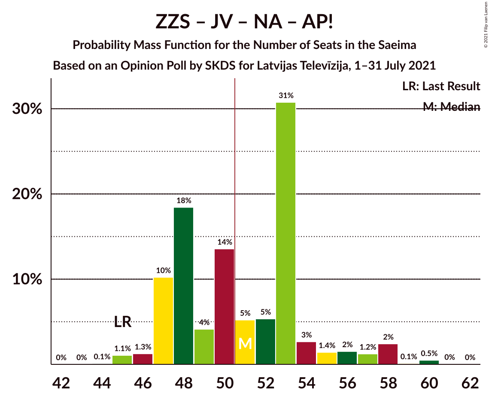
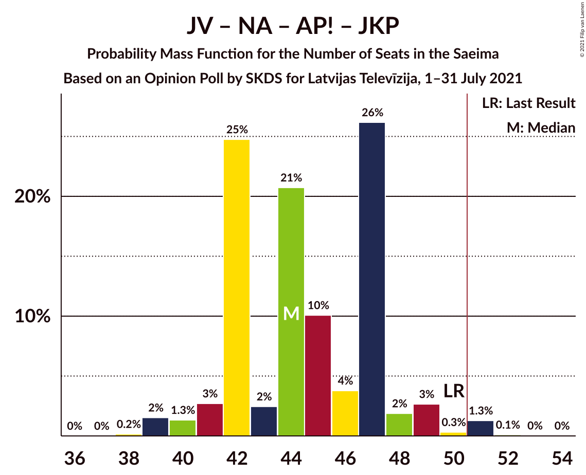

# Opinion Poll by SKDS for Latvijas Televīzija, 1–31 July 2021

<a href="#voting-intentions">Voting Intentions</a> | <a href="#seats">Seats</a> | <a href="#coalitions">Coalitions</a> | <a href="#technical-information">Technical Information</a>

## Voting Intentions

### Confidence Intervals

| Party | Last Result | Poll Result | 80% Confidence Interval | 90% Confidence Interval | 95% Confidence Interval | 99% Confidence Interval |
|:-----:|:-----------:|:-----------:|:-----------------------:|:-----------------------:|:-----------------------:|:-----------------------:|
| Sociāldemokrātiskā partija “Saskaņa” | 19.8% | 19.0% | 17.8–20.2% |17.5–20.6% |17.2–20.9% |16.7–21.5% |
| Zaļo un Zemnieku savienība | 9.9% | 12.9% | 11.9–13.9% |11.6–14.3% |11.4–14.5% |11.0–15.0% |
| Jaunā VIENOTĪBA | 6.7% | 12.8% | 11.9–13.9% |11.6–14.2% |11.4–14.5% |10.9–15.0% |
| Nacionālā apvienība „Visu Latvijai!”–„Tēvzemei un Brīvībai/LNNK” | 11.0% | 12.3% | 11.4–13.4% |11.1–13.7% |10.9–13.9% |10.4–14.4% |
| Attīstībai/Par! | 12.0% | 9.4% | 8.6–10.3% |8.3–10.6% |8.1–10.8% |7.7–11.3% |
| Jaunā konservatīvā partija | 13.6% | 6.7% | 6.0–7.5% |5.8–7.8% |5.7–8.0% |5.3–8.4% |
| Latvijas Reģionu Apvienība | 4.1% | 5.9% | 5.2–6.7% |5.0–6.9% |4.9–7.1% |4.6–7.5% |
| Latvijas Krievu savienība | 3.2% | 5.9% | 5.2–6.7% |5.0–6.9% |4.9–7.1% |4.6–7.5% |
| Likums un kārtība | 0.0% | 5.7% | 5.1–6.5% |4.9–6.7% |4.7–6.9% |4.4–7.3% |
| PROGRESĪVIE | 2.6% | 5.0% | 4.4–5.7% |4.2–5.9% |4.1–6.1% |3.8–6.5% |
| Politiskā partija „KPV LV” | 14.2% | 1.5% | 1.2–1.9% |1.1–2.1% |1.0–2.2% |0.9–2.4% |

*Note:* The poll result column reflects the actual value used in the calculations. Published results may vary slightly, and in addition be rounded to fewer digits.

## Seats

### Confidence Intervals

| Party | Last Result | Median | 80% Confidence Interval | 90% Confidence Interval | 95% Confidence Interval | 99% Confidence Interval |
|:-----:|:-----------:|:------:|:-----------------------:|:-----------------------:|:-----------------------:|:-----------------------:|
| <a href="#sociāldemokrātiskā-partija-“saskaņa”">Sociāldemokrātiskā partija “Saskaņa”</a> | 23 | 21 | 19–23 |19–23 |19–23 |17–24 |
| <a href="#zaļo-un-zemnieku-savienība">Zaļo un Zemnieku savienība</a> | 11 | 13 | 12–16 |12–16 |11–17 |11–17 |
| <a href="#jaunā-vienotība">Jaunā VIENOTĪBA</a> | 8 | 14 | 12–17 |11–17 |11–17 |11–17 |
| <a href="#nacionālā-apvienība-„visu-latvijai!”–„tēvzemei-un-brīvībai/lnnk”">Nacionālā apvienība „Visu Latvijai!”–„Tēvzemei un Brīvībai/LNNK”</a> | 13 | 14 | 13–14 |13–15 |12–15 |11–17 |
| <a href="#attīstībai/par!">Attīstībai/Par!</a> | 13 | 9 | 8–10 |7–11 |7–13 |7–14 |
| <a href="#jaunā-konservatīvā-partija">Jaunā konservatīvā partija</a> | 16 | 7 | 7–8 |7–9 |6–9 |6–10 |
| <a href="#latvijas-reģionu-apvienība">Latvijas Reģionu Apvienība</a> | 0 | 6 | 6 |0–7 |0–7 |0–7 |
| <a href="#latvijas-krievu-savienība">Latvijas Krievu savienība</a> | 0 | 8 | 7–8 |5–8 |0–8 |0–8 |
| <a href="#likums-un-kārtība">Likums un kārtība</a> | 0 | 6 | 5–6 |0–6 |0–7 |0–8 |
| <a href="#progresīvie">PROGRESĪVIE</a> | 0 | 0 | 0–7 |0–7 |0–7 |0–7 |
| <a href="#politiskā-partija-„kpv-lv”">Politiskā partija „KPV LV”</a> | 16 | 0 | 0 |0 |0 |0 |

### Sociāldemokrātiskā partija “Saskaņa”

*For a full overview of the results for this party, see the [Sociāldemokrātiskā partija “Saskaņa”](party-sociāldemokrātiskāpartija“saskaņa”.html) page.*

| Number of Seats | Probability | Accumulated | Special Marks |
|:---------------:|:-----------:|:-----------:|:-------------:|
| 17 | 0.6% | 100% |  |
| 18 | 0.5% | 99.4% |  |
| 19 | 12% | 98.9% |  |
| 20 | 27% | 87% |  |
| 21 | 32% | 60% | Median |
| 22 | 7% | 28% |  |
| 23 | 20% | 21% | Last Result |
| 24 | 0.5% | 0.8% |  |
| 25 | 0.2% | 0.3% |  |
| 26 | 0.1% | 0.1% |  |
| 27 | 0% | 0% |  |

### Zaļo un Zemnieku savienība

*For a full overview of the results for this party, see the [Zaļo un Zemnieku savienība](party-zaļounzemniekusavienība.html) page.*

| Number of Seats | Probability | Accumulated | Special Marks |
|:---------------:|:-----------:|:-----------:|:-------------:|
| 11 | 5% | 100% | Last Result |
| 12 | 10% | 95% |  |
| 13 | 55% | 85% | Median |
| 14 | 5% | 30% |  |
| 15 | 13% | 25% |  |
| 16 | 8% | 12% |  |
| 17 | 4% | 4% |  |
| 18 | 0% | 0% |  |

### Jaunā VIENOTĪBA

*For a full overview of the results for this party, see the [Jaunā VIENOTĪBA](party-jaunāvienotība.html) page.*

| Number of Seats | Probability | Accumulated | Special Marks |
|:---------------:|:-----------:|:-----------:|:-------------:|
| 8 | 0% | 100% | Last Result |
| 9 | 0% | 100% |  |
| 10 | 0% | 100% |  |
| 11 | 9% | 100% |  |
| 12 | 13% | 90% |  |
| 13 | 5% | 77% |  |
| 14 | 36% | 73% | Median |
| 15 | 4% | 37% |  |
| 16 | 9% | 33% |  |
| 17 | 24% | 24% |  |
| 18 | 0.2% | 0.2% |  |
| 19 | 0% | 0% |  |

### Nacionālā apvienība „Visu Latvijai!”–„Tēvzemei un Brīvībai/LNNK”

*For a full overview of the results for this party, see the [Nacionālā apvienība „Visu Latvijai!”–„Tēvzemei un Brīvībai/LNNK”](party-nacionālāapvienība„visulatvijai”–„tēvzemeiunbrīvībailnnk”.html) page.*

| Number of Seats | Probability | Accumulated | Special Marks |
|:---------------:|:-----------:|:-----------:|:-------------:|
| 11 | 2% | 100% |  |
| 12 | 3% | 98% |  |
| 13 | 24% | 95% | Last Result |
| 14 | 62% | 71% | Median |
| 15 | 7% | 9% |  |
| 16 | 2% | 2% |  |
| 17 | 0.6% | 0.6% |  |
| 18 | 0% | 0% |  |

### Attīstībai/Par!

*For a full overview of the results for this party, see the [Attīstībai/Par!](party-attīstībaipar.html) page.*

| Number of Seats | Probability | Accumulated | Special Marks |
|:---------------:|:-----------:|:-----------:|:-------------:|
| 7 | 7% | 100% |  |
| 8 | 3% | 93% |  |
| 9 | 59% | 90% | Median |
| 10 | 24% | 30% |  |
| 11 | 2% | 6% |  |
| 12 | 0.8% | 4% |  |
| 13 | 2% | 3% | Last Result |
| 14 | 0.7% | 0.7% |  |
| 15 | 0% | 0% |  |

### Jaunā konservatīvā partija

*For a full overview of the results for this party, see the [Jaunā konservatīvā partija](party-jaunākonservatīvāpartija.html) page.*

| Number of Seats | Probability | Accumulated | Special Marks |
|:---------------:|:-----------:|:-----------:|:-------------:|
| 0 | 0.1% | 100% |  |
| 1 | 0% | 99.9% |  |
| 2 | 0% | 99.9% |  |
| 3 | 0% | 99.9% |  |
| 4 | 0% | 99.9% |  |
| 5 | 0% | 99.9% |  |
| 6 | 4% | 99.9% |  |
| 7 | 81% | 96% | Median |
| 8 | 9% | 16% |  |
| 9 | 5% | 7% |  |
| 10 | 1.2% | 1.2% |  |
| 11 | 0% | 0% |  |
| 12 | 0% | 0% |  |
| 13 | 0% | 0% |  |
| 14 | 0% | 0% |  |
| 15 | 0% | 0% |  |
| 16 | 0% | 0% | Last Result |

### Latvijas Reģionu Apvienība

*For a full overview of the results for this party, see the [Latvijas Reģionu Apvienība](party-latvijasreģionuapvienība.html) page.*

| Number of Seats | Probability | Accumulated | Special Marks |
|:---------------:|:-----------:|:-----------:|:-------------:|
| 0 | 8% | 100% | Last Result |
| 1 | 0% | 92% |  |
| 2 | 0% | 92% |  |
| 3 | 0% | 92% |  |
| 4 | 0% | 92% |  |
| 5 | 0% | 92% |  |
| 6 | 82% | 92% | Median |
| 7 | 9% | 9% |  |
| 8 | 0.2% | 0.3% |  |
| 9 | 0.1% | 0.1% |  |
| 10 | 0% | 0% |  |

### Latvijas Krievu savienība

*For a full overview of the results for this party, see the [Latvijas Krievu savienība](party-latvijaskrievusavienība.html) page.*

| Number of Seats | Probability | Accumulated | Special Marks |
|:---------------:|:-----------:|:-----------:|:-------------:|
| 0 | 4% | 100% | Last Result |
| 1 | 0% | 96% |  |
| 2 | 0% | 96% |  |
| 3 | 0% | 96% |  |
| 4 | 0% | 96% |  |
| 5 | 2% | 96% |  |
| 6 | 3% | 95% |  |
| 7 | 21% | 92% |  |
| 8 | 70% | 70% | Median |
| 9 | 0.3% | 0.3% |  |
| 10 | 0% | 0% |  |

### Likums un kārtība

*For a full overview of the results for this party, see the [Likums un kārtība](party-likumsunkārtība.html) page.*

| Number of Seats | Probability | Accumulated | Special Marks |
|:---------------:|:-----------:|:-----------:|:-------------:|
| 0 | 5% | 100% | Last Result |
| 1 | 0% | 95% |  |
| 2 | 0% | 95% |  |
| 3 | 0% | 95% |  |
| 4 | 0% | 95% |  |
| 5 | 31% | 95% |  |
| 6 | 61% | 64% | Median |
| 7 | 3% | 3% |  |
| 8 | 0.2% | 0.5% |  |
| 9 | 0.2% | 0.4% |  |
| 10 | 0.2% | 0.2% |  |
| 11 | 0% | 0% |  |

### PROGRESĪVIE

*For a full overview of the results for this party, see the [PROGRESĪVIE](party-progresīvie.html) page.*

| Number of Seats | Probability | Accumulated | Special Marks |
|:---------------:|:-----------:|:-----------:|:-------------:|
| 0 | 56% | 100% | Last Result, Median |
| 1 | 0% | 44% |  |
| 2 | 0% | 44% |  |
| 3 | 0% | 44% |  |
| 4 | 0% | 44% |  |
| 5 | 20% | 44% |  |
| 6 | 12% | 24% |  |
| 7 | 12% | 12% |  |
| 8 | 0% | 0% |  |

### Politiskā partija „KPV LV”

*For a full overview of the results for this party, see the [Politiskā partija „KPV LV”](party-politiskāpartija„kpvlv”.html) page.*

| Number of Seats | Probability | Accumulated | Special Marks |
|:---------------:|:-----------:|:-----------:|:-------------:|
| 0 | 100% | 100% | Median |
| 1 | 0% | 0% |  |
| 2 | 0% | 0% |  |
| 3 | 0% | 0% |  |
| 4 | 0% | 0% |  |
| 5 | 0% | 0% |  |
| 6 | 0% | 0% |  |
| 7 | 0% | 0% |  |
| 8 | 0% | 0% |  |
| 9 | 0% | 0% |  |
| 10 | 0% | 0% |  |
| 11 | 0% | 0% |  |
| 12 | 0% | 0% |  |
| 13 | 0% | 0% |  |
| 14 | 0% | 0% |  |
| 15 | 0% | 0% |  |
| 16 | 0% | 0% | Last Result |

## Coalitions

### Confidence Intervals

| Coalition | Last Result | Median | Majority? | 80% Confidence Interval | 90% Confidence Interval | 95% Confidence Interval | 99% Confidence Interval |
|:---------:|:-----------:|:------:|:---------:|:-----------------------:|:-----------------------:|:-----------------------:|:-----------------------:|
| Zaļo un Zemnieku savienība – Jaunā VIENOTĪBA – Nacionālā apvienība „Visu Latvijai!”–„Tēvzemei un Brīvībai/LNNK” – Attīstībai/Par! – Jaunā konservatīvā partija | 61 | 58 | 100% | 54–61 | 54–64 | 53–65 | 52–66 |
| Zaļo un Zemnieku savienība – Jaunā VIENOTĪBA – Nacionālā apvienība „Visu Latvijai!”–„Tēvzemei un Brīvībai/LNNK” – Attīstībai/Par! | 45 | 51 | 51% | 47–53 | 47–56 | 47–58 | 45–60 |
| Zaļo un Zemnieku savienība – Jaunā VIENOTĪBA – Nacionālā apvienība „Visu Latvijai!”–„Tēvzemei un Brīvībai/LNNK” – Jaunā konservatīvā partija | 48 | 49 | 39% | 45–52 | 45–53 | 44–54 | 43–56 |
| Zaļo un Zemnieku savienība – Nacionālā apvienība „Visu Latvijai!”–„Tēvzemei un Brīvībai/LNNK” – Attīstībai/Par! – Jaunā konservatīvā partija | 53 | 43 | 0.4% | 41–47 | 40–49 | 40–50 | 38–50 |
| Jaunā VIENOTĪBA – Nacionālā apvienība „Visu Latvijai!”–„Tēvzemei un Brīvībai/LNNK” – Attīstībai/Par! – Jaunā konservatīvā partija | 50 | 44 | 1.4% | 42–47 | 41–48 | 40–49 | 39–51 |
| Jaunā VIENOTĪBA – Nacionālā apvienība „Visu Latvijai!”–„Tēvzemei un Brīvībai/LNNK” – Attīstībai/Par! – Jaunā konservatīvā partija – Politiskā partija „KPV LV” | 66 | 44 | 1.4% | 42–47 | 41–48 | 40–49 | 39–51 |
| Zaļo un Zemnieku savienība – Jaunā VIENOTĪBA – Nacionālā apvienība „Visu Latvijai!”–„Tēvzemei un Brīvībai/LNNK” | 32 | 41 | 0% | 38–44 | 38–45 | 37–47 | 36–48 |
| Sociāldemokrātiskā partija “Saskaņa” – Attīstībai/Par! – Jaunā konservatīvā partija | 52 | 37 | 0% | 35–39 | 34–41 | 34–42 | 33–43 |
| Jaunā VIENOTĪBA – Nacionālā apvienība „Visu Latvijai!”–„Tēvzemei un Brīvībai/LNNK” – Attīstībai/Par! – Politiskā partija „KPV LV” | 50 | 37 | 0% | 35–40 | 34–40 | 33–42 | 32–43 |
| Zaļo un Zemnieku savienība – Nacionālā apvienība „Visu Latvijai!”–„Tēvzemei un Brīvībai/LNNK” – Attīstībai/Par! | 37 | 36 | 0% | 33–39 | 33–41 | 33–42 | 32–44 |
| Jaunā VIENOTĪBA – Nacionālā apvienība „Visu Latvijai!”–„Tēvzemei un Brīvībai/LNNK” – Jaunā konservatīvā partija – Politiskā partija „KPV LV” | 53 | 35 | 0% | 32–38 | 32–38 | 31–39 | 29–40 |
| Zaļo un Zemnieku savienība – Nacionālā apvienība „Visu Latvijai!”–„Tēvzemei un Brīvībai/LNNK” – Jaunā konservatīvā partija | 40 | 34 | 0% | 33–37 | 32–38 | 31–39 | 29–40 |
| Sociāldemokrātiskā partija “Saskaņa” – Zaļo un Zemnieku savienība – Politiskā partija „KPV LV” | 50 | 34 | 0% | 32–37 | 32–38 | 31–39 | 29–40 |
| Jaunā VIENOTĪBA – Attīstībai/Par! – Jaunā konservatīvā partija – Politiskā partija „KPV LV” | 53 | 30 | 0% | 28–33 | 27–34 | 27–35 | 27–37 |
| Nacionālā apvienība „Visu Latvijai!”–„Tēvzemei un Brīvībai/LNNK” – Attīstībai/Par! – Jaunā konservatīvā partija – Politiskā partija „KPV LV” | 58 | 30 | 0% | 28–32 | 28–33 | 28–34 | 26–35 |
| Sociāldemokrātiskā partija “Saskaņa” – Attīstībai/Par! | 36 | 30 | 0% | 28–32 | 27–33 | 27–34 | 26–36 |
| Sociāldemokrātiskā partija “Saskaņa” – Politiskā partija „KPV LV” | 39 | 21 | 0% | 19–23 | 19–23 | 19–23 | 17–24 |

### Zaļo un Zemnieku savienība – Jaunā VIENOTĪBA – Nacionālā apvienība „Visu Latvijai!”–„Tēvzemei un Brīvībai/LNNK” – Attīstībai/Par! – Jaunā konservatīvā partija

| Number of Seats | Probability | Accumulated | Special Marks |
|:---------------:|:-----------:|:-----------:|:-------------:|
| 51 | 0.1% | 100% | Majority |
| 52 | 0.9% | 99.9% |  |
| 53 | 2% | 99.0% |  |
| 54 | 8% | 97% |  |
| 55 | 19% | 89% |  |
| 56 | 4% | 69% |  |
| 57 | 12% | 65% | Median |
| 58 | 4% | 53% |  |
| 59 | 5% | 49% |  |
| 60 | 31% | 44% |  |
| 61 | 3% | 13% | Last Result |
| 62 | 3% | 10% |  |
| 63 | 2% | 7% |  |
| 64 | 2% | 5% |  |
| 65 | 2% | 4% |  |
| 66 | 2% | 2% |  |
| 67 | 0% | 0.1% |  |
| 68 | 0% | 0.1% |  |
| 69 | 0.1% | 0.1% |  |
| 70 | 0% | 0% |  |

### Zaļo un Zemnieku savienība – Jaunā VIENOTĪBA – Nacionālā apvienība „Visu Latvijai!”–„Tēvzemei un Brīvībai/LNNK” – Attīstībai/Par!

| Number of Seats | Probability | Accumulated | Special Marks |
|:---------------:|:-----------:|:-----------:|:-------------:|
| 44 | 0.1% | 100% |  |
| 45 | 1.1% | 99.9% | Last Result |
| 46 | 1.3% | 98.8% |  |
| 47 | 10% | 98% |  |
| 48 | 18% | 87% |  |
| 49 | 4% | 69% |  |
| 50 | 14% | 65% | Median |
| 51 | 5% | 51% | Majority |
| 52 | 5% | 46% |  |
| 53 | 31% | 41% |  |
| 54 | 3% | 10% |  |
| 55 | 1.4% | 7% |  |
| 56 | 2% | 6% |  |
| 57 | 1.2% | 4% |  |
| 58 | 2% | 3% |  |
| 59 | 0.1% | 0.7% |  |
| 60 | 0.5% | 0.5% |  |
| 61 | 0% | 0.1% |  |
| 62 | 0% | 0% |  |

### Zaļo un Zemnieku savienība – Jaunā VIENOTĪBA – Nacionālā apvienība „Visu Latvijai!”–„Tēvzemei un Brīvībai/LNNK” – Jaunā konservatīvā partija

| Number of Seats | Probability | Accumulated | Special Marks |
|:---------------:|:-----------:|:-----------:|:-------------:|
| 42 | 0% | 100% |  |
| 43 | 2% | 99.9% |  |
| 44 | 2% | 98% |  |
| 45 | 13% | 96% |  |
| 46 | 10% | 84% |  |
| 47 | 10% | 74% |  |
| 48 | 11% | 64% | Last Result, Median |
| 49 | 5% | 52% |  |
| 50 | 8% | 47% |  |
| 51 | 27% | 39% | Majority |
| 52 | 4% | 12% |  |
| 53 | 4% | 7% |  |
| 54 | 1.1% | 4% |  |
| 55 | 2% | 2% |  |
| 56 | 0.3% | 0.5% |  |
| 57 | 0.2% | 0.2% |  |
| 58 | 0% | 0% |  |

### Zaļo un Zemnieku savienība – Nacionālā apvienība „Visu Latvijai!”–„Tēvzemei un Brīvībai/LNNK” – Attīstībai/Par! – Jaunā konservatīvā partija

| Number of Seats | Probability | Accumulated | Special Marks |
|:---------------:|:-----------:|:-----------:|:-------------:|
| 37 | 0.1% | 100% |  |
| 38 | 0.8% | 99.9% |  |
| 39 | 0.4% | 99.1% |  |
| 40 | 8% | 98.7% |  |
| 41 | 4% | 91% |  |
| 42 | 4% | 86% |  |
| 43 | 44% | 82% | Median |
| 44 | 11% | 38% |  |
| 45 | 7% | 28% |  |
| 46 | 9% | 21% |  |
| 47 | 4% | 12% |  |
| 48 | 3% | 8% |  |
| 49 | 2% | 5% |  |
| 50 | 3% | 3% |  |
| 51 | 0.2% | 0.4% | Majority |
| 52 | 0.2% | 0.2% |  |
| 53 | 0% | 0.1% | Last Result |
| 54 | 0% | 0% |  |

### Jaunā VIENOTĪBA – Nacionālā apvienība „Visu Latvijai!”–„Tēvzemei un Brīvībai/LNNK” – Attīstībai/Par! – Jaunā konservatīvā partija

| Number of Seats | Probability | Accumulated | Special Marks |
|:---------------:|:-----------:|:-----------:|:-------------:|
| 38 | 0.2% | 100% |  |
| 39 | 2% | 99.8% |  |
| 40 | 1.3% | 98% |  |
| 41 | 3% | 97% |  |
| 42 | 25% | 94% |  |
| 43 | 2% | 70% |  |
| 44 | 21% | 67% | Median |
| 45 | 10% | 46% |  |
| 46 | 4% | 36% |  |
| 47 | 26% | 32% |  |
| 48 | 2% | 6% |  |
| 49 | 3% | 4% |  |
| 50 | 0.3% | 2% | Last Result |
| 51 | 1.3% | 1.4% | Majority |
| 52 | 0.1% | 0.2% |  |
| 53 | 0% | 0.1% |  |
| 54 | 0% | 0% |  |

### Jaunā VIENOTĪBA – Nacionālā apvienība „Visu Latvijai!”–„Tēvzemei un Brīvībai/LNNK” – Attīstībai/Par! – Jaunā konservatīvā partija – Politiskā partija „KPV LV”

| Number of Seats | Probability | Accumulated | Special Marks |
|:---------------:|:-----------:|:-----------:|:-------------:|
| 38 | 0.2% | 100% |  |
| 39 | 2% | 99.8% |  |
| 40 | 1.3% | 98% |  |
| 41 | 3% | 97% |  |
| 42 | 25% | 94% |  |
| 43 | 2% | 70% |  |
| 44 | 21% | 67% | Median |
| 45 | 10% | 46% |  |
| 46 | 4% | 36% |  |
| 47 | 26% | 32% |  |
| 48 | 2% | 6% |  |
| 49 | 3% | 4% |  |
| 50 | 0.3% | 2% |  |
| 51 | 1.3% | 1.4% | Majority |
| 52 | 0.1% | 0.2% |  |
| 53 | 0% | 0.1% |  |
| 54 | 0% | 0% |  |
| 55 | 0% | 0% |  |
| 56 | 0% | 0% |  |
| 57 | 0% | 0% |  |
| 58 | 0% | 0% |  |
| 59 | 0% | 0% |  |
| 60 | 0% | 0% |  |
| 61 | 0% | 0% |  |
| 62 | 0% | 0% |  |
| 63 | 0% | 0% |  |
| 64 | 0% | 0% |  |
| 65 | 0% | 0% |  |
| 66 | 0% | 0% | Last Result |

### Zaļo un Zemnieku savienība – Jaunā VIENOTĪBA – Nacionālā apvienība „Visu Latvijai!”–„Tēvzemei un Brīvībai/LNNK”

| Number of Seats | Probability | Accumulated | Special Marks |
|:---------------:|:-----------:|:-----------:|:-------------:|
| 32 | 0% | 100% | Last Result |
| 33 | 0% | 100% |  |
| 34 | 0% | 100% |  |
| 35 | 0.1% | 100% |  |
| 36 | 2% | 99.9% |  |
| 37 | 2% | 98% |  |
| 38 | 14% | 96% |  |
| 39 | 8% | 82% |  |
| 40 | 12% | 74% |  |
| 41 | 13% | 63% | Median |
| 42 | 4% | 50% |  |
| 43 | 11% | 46% |  |
| 44 | 26% | 34% |  |
| 45 | 4% | 8% |  |
| 46 | 0.9% | 4% |  |
| 47 | 2% | 3% |  |
| 48 | 1.2% | 1.5% |  |
| 49 | 0.2% | 0.2% |  |
| 50 | 0% | 0.1% |  |
| 51 | 0% | 0% | Majority |

### Sociāldemokrātiskā partija “Saskaņa” – Attīstībai/Par! – Jaunā konservatīvā partija

| Number of Seats | Probability | Accumulated | Special Marks |
|:---------------:|:-----------:|:-----------:|:-------------:|
| 32 | 0.1% | 100% |  |
| 33 | 0.6% | 99.9% |  |
| 34 | 7% | 99.4% |  |
| 35 | 4% | 93% |  |
| 36 | 24% | 89% |  |
| 37 | 21% | 65% | Median |
| 38 | 16% | 44% |  |
| 39 | 18% | 28% |  |
| 40 | 3% | 10% |  |
| 41 | 3% | 7% |  |
| 42 | 2% | 3% |  |
| 43 | 0.6% | 1.0% |  |
| 44 | 0.2% | 0.4% |  |
| 45 | 0.1% | 0.1% |  |
| 46 | 0% | 0% |  |
| 47 | 0% | 0% |  |
| 48 | 0% | 0% |  |
| 49 | 0% | 0% |  |
| 50 | 0% | 0% |  |
| 51 | 0% | 0% | Majority |
| 52 | 0% | 0% | Last Result |

### Jaunā VIENOTĪBA – Nacionālā apvienība „Visu Latvijai!”–„Tēvzemei un Brīvībai/LNNK” – Attīstībai/Par! – Politiskā partija „KPV LV”

| Number of Seats | Probability | Accumulated | Special Marks |
|:---------------:|:-----------:|:-----------:|:-------------:|
| 31 | 0.1% | 100% |  |
| 32 | 2% | 99.9% |  |
| 33 | 2% | 98% |  |
| 34 | 2% | 97% |  |
| 35 | 24% | 94% |  |
| 36 | 8% | 70% |  |
| 37 | 19% | 63% | Median |
| 38 | 12% | 44% |  |
| 39 | 4% | 32% |  |
| 40 | 24% | 28% |  |
| 41 | 0.8% | 5% |  |
| 42 | 2% | 4% |  |
| 43 | 2% | 2% |  |
| 44 | 0% | 0.1% |  |
| 45 | 0.1% | 0.1% |  |
| 46 | 0% | 0% |  |
| 47 | 0% | 0% |  |
| 48 | 0% | 0% |  |
| 49 | 0% | 0% |  |
| 50 | 0% | 0% | Last Result |

### Zaļo un Zemnieku savienība – Nacionālā apvienība „Visu Latvijai!”–„Tēvzemei un Brīvībai/LNNK” – Attīstībai/Par!

| Number of Seats | Probability | Accumulated | Special Marks |
|:---------------:|:-----------:|:-----------:|:-------------:|
| 30 | 0.1% | 100% |  |
| 31 | 0.3% | 99.9% |  |
| 32 | 0.9% | 99.6% |  |
| 33 | 9% | 98.7% |  |
| 34 | 3% | 90% |  |
| 35 | 4% | 86% |  |
| 36 | 48% | 82% | Median |
| 37 | 11% | 34% | Last Result |
| 38 | 4% | 23% |  |
| 39 | 10% | 19% |  |
| 40 | 2% | 8% |  |
| 41 | 3% | 6% |  |
| 42 | 2% | 4% |  |
| 43 | 0.7% | 1.3% |  |
| 44 | 0.6% | 0.7% |  |
| 45 | 0.1% | 0.1% |  |
| 46 | 0% | 0% |  |

### Jaunā VIENOTĪBA – Nacionālā apvienība „Visu Latvijai!”–„Tēvzemei un Brīvībai/LNNK” – Jaunā konservatīvā partija – Politiskā partija „KPV LV”

| Number of Seats | Probability | Accumulated | Special Marks |
|:---------------:|:-----------:|:-----------:|:-------------:|
| 29 | 0.8% | 100% |  |
| 30 | 0.8% | 99.1% |  |
| 31 | 2% | 98% |  |
| 32 | 14% | 97% |  |
| 33 | 8% | 83% |  |
| 34 | 4% | 75% |  |
| 35 | 30% | 71% | Median |
| 36 | 7% | 40% |  |
| 37 | 3% | 33% |  |
| 38 | 27% | 30% |  |
| 39 | 2% | 3% |  |
| 40 | 0.4% | 0.6% |  |
| 41 | 0.1% | 0.2% |  |
| 42 | 0.1% | 0.1% |  |
| 43 | 0% | 0% |  |
| 44 | 0% | 0% |  |
| 45 | 0% | 0% |  |
| 46 | 0% | 0% |  |
| 47 | 0% | 0% |  |
| 48 | 0% | 0% |  |
| 49 | 0% | 0% |  |
| 50 | 0% | 0% |  |
| 51 | 0% | 0% | Majority |
| 52 | 0% | 0% |  |
| 53 | 0% | 0% | Last Result |

### Zaļo un Zemnieku savienība – Nacionālā apvienība „Visu Latvijai!”–„Tēvzemei un Brīvībai/LNNK” – Jaunā konservatīvā partija

| Number of Seats | Probability | Accumulated | Special Marks |
|:---------------:|:-----------:|:-----------:|:-------------:|
| 29 | 0.5% | 100% |  |
| 30 | 2% | 99.4% |  |
| 31 | 1.1% | 98% |  |
| 32 | 5% | 97% |  |
| 33 | 21% | 92% |  |
| 34 | 35% | 70% | Median |
| 35 | 9% | 35% |  |
| 36 | 11% | 26% |  |
| 37 | 8% | 15% |  |
| 38 | 4% | 8% |  |
| 39 | 2% | 4% |  |
| 40 | 2% | 2% | Last Result |
| 41 | 0.3% | 0.3% |  |
| 42 | 0% | 0% |  |

### Sociāldemokrātiskā partija “Saskaņa” – Zaļo un Zemnieku savienība – Politiskā partija „KPV LV”

| Number of Seats | Probability | Accumulated | Special Marks |
|:---------------:|:-----------:|:-----------:|:-------------:|
| 28 | 0.1% | 100% |  |
| 29 | 0.5% | 99.9% |  |
| 30 | 0.5% | 99.4% |  |
| 31 | 2% | 98.9% |  |
| 32 | 10% | 97% |  |
| 33 | 14% | 87% |  |
| 34 | 37% | 73% | Median |
| 35 | 6% | 36% |  |
| 36 | 18% | 30% |  |
| 37 | 3% | 12% |  |
| 38 | 4% | 8% |  |
| 39 | 3% | 4% |  |
| 40 | 1.2% | 1.4% |  |
| 41 | 0.1% | 0.3% |  |
| 42 | 0.1% | 0.1% |  |
| 43 | 0.1% | 0.1% |  |
| 44 | 0% | 0% |  |
| 45 | 0% | 0% |  |
| 46 | 0% | 0% |  |
| 47 | 0% | 0% |  |
| 48 | 0% | 0% |  |
| 49 | 0% | 0% |  |
| 50 | 0% | 0% | Last Result |

### Jaunā VIENOTĪBA – Attīstībai/Par! – Jaunā konservatīvā partija – Politiskā partija „KPV LV”

| Number of Seats | Probability | Accumulated | Special Marks |
|:---------------:|:-----------:|:-----------:|:-------------:|
| 25 | 0.1% | 100% |  |
| 26 | 0.2% | 99.9% |  |
| 27 | 6% | 99.7% |  |
| 28 | 12% | 94% |  |
| 29 | 13% | 82% |  |
| 30 | 20% | 69% | Median |
| 31 | 10% | 49% |  |
| 32 | 6% | 39% |  |
| 33 | 26% | 33% |  |
| 34 | 3% | 7% |  |
| 35 | 2% | 3% |  |
| 36 | 0.3% | 2% |  |
| 37 | 1.3% | 1.4% |  |
| 38 | 0.1% | 0.1% |  |
| 39 | 0.1% | 0.1% |  |
| 40 | 0% | 0% |  |
| 41 | 0% | 0% |  |
| 42 | 0% | 0% |  |
| 43 | 0% | 0% |  |
| 44 | 0% | 0% |  |
| 45 | 0% | 0% |  |
| 46 | 0% | 0% |  |
| 47 | 0% | 0% |  |
| 48 | 0% | 0% |  |
| 49 | 0% | 0% |  |
| 50 | 0% | 0% |  |
| 51 | 0% | 0% | Majority |
| 52 | 0% | 0% |  |
| 53 | 0% | 0% | Last Result |

### Nacionālā apvienība „Visu Latvijai!”–„Tēvzemei un Brīvībai/LNNK” – Attīstībai/Par! – Jaunā konservatīvā partija – Politiskā partija „KPV LV”

| Number of Seats | Probability | Accumulated | Special Marks |
|:---------------:|:-----------:|:-----------:|:-------------:|
| 25 | 0.1% | 100% |  |
| 26 | 0.7% | 99.9% |  |
| 27 | 1.4% | 99.2% |  |
| 28 | 9% | 98% |  |
| 29 | 8% | 89% |  |
| 30 | 53% | 81% | Median |
| 31 | 16% | 29% |  |
| 32 | 6% | 13% |  |
| 33 | 4% | 7% |  |
| 34 | 0.8% | 3% |  |
| 35 | 2% | 2% |  |
| 36 | 0.2% | 0.3% |  |
| 37 | 0.1% | 0.1% |  |
| 38 | 0% | 0% |  |
| 39 | 0% | 0% |  |
| 40 | 0% | 0% |  |
| 41 | 0% | 0% |  |
| 42 | 0% | 0% |  |
| 43 | 0% | 0% |  |
| 44 | 0% | 0% |  |
| 45 | 0% | 0% |  |
| 46 | 0% | 0% |  |
| 47 | 0% | 0% |  |
| 48 | 0% | 0% |  |
| 49 | 0% | 0% |  |
| 50 | 0% | 0% |  |
| 51 | 0% | 0% | Majority |
| 52 | 0% | 0% |  |
| 53 | 0% | 0% |  |
| 54 | 0% | 0% |  |
| 55 | 0% | 0% |  |
| 56 | 0% | 0% |  |
| 57 | 0% | 0% |  |
| 58 | 0% | 0% | Last Result |

### Sociāldemokrātiskā partija “Saskaņa” – Attīstībai/Par!

| Number of Seats | Probability | Accumulated | Special Marks |
|:---------------:|:-----------:|:-----------:|:-------------:|
| 26 | 0.6% | 100% |  |
| 27 | 7% | 99.4% |  |
| 28 | 5% | 93% |  |
| 29 | 25% | 88% |  |
| 30 | 22% | 63% | Median |
| 31 | 18% | 42% |  |
| 32 | 17% | 24% |  |
| 33 | 4% | 6% |  |
| 34 | 1.3% | 3% |  |
| 35 | 0.7% | 1.4% |  |
| 36 | 0.4% | 0.6% | Last Result |
| 37 | 0.2% | 0.2% |  |
| 38 | 0.1% | 0.1% |  |
| 39 | 0% | 0% |  |

### Sociāldemokrātiskā partija “Saskaņa” – Politiskā partija „KPV LV”

| Number of Seats | Probability | Accumulated | Special Marks |
|:---------------:|:-----------:|:-----------:|:-------------:|
| 17 | 0.6% | 100% |  |
| 18 | 0.5% | 99.4% |  |
| 19 | 12% | 98.9% |  |
| 20 | 27% | 87% |  |
| 21 | 32% | 60% | Median |
| 22 | 7% | 28% |  |
| 23 | 20% | 21% |  |
| 24 | 0.5% | 0.8% |  |
| 25 | 0.2% | 0.3% |  |
| 26 | 0.1% | 0.1% |  |
| 27 | 0% | 0% |  |
| 28 | 0% | 0% |  |
| 29 | 0% | 0% |  |
| 30 | 0% | 0% |  |
| 31 | 0% | 0% |  |
| 32 | 0% | 0% |  |
| 33 | 0% | 0% |  |
| 34 | 0% | 0% |  |
| 35 | 0% | 0% |  |
| 36 | 0% | 0% |  |
| 37 | 0% | 0% |  |
| 38 | 0% | 0% |  |
| 39 | 0% | 0% | Last Result |

## Technical Information

### Opinion Poll

+ **Polling firm:** SKDS
+ **Commissioner(s):** Latvijas Televīzija
+ **Fieldwork period:** 1–31 July 2021

### Calculations

+ **Sample size:** 1801
+ **Simulations done:** 1,048,576
+ **Error estimate:** 1.14%

