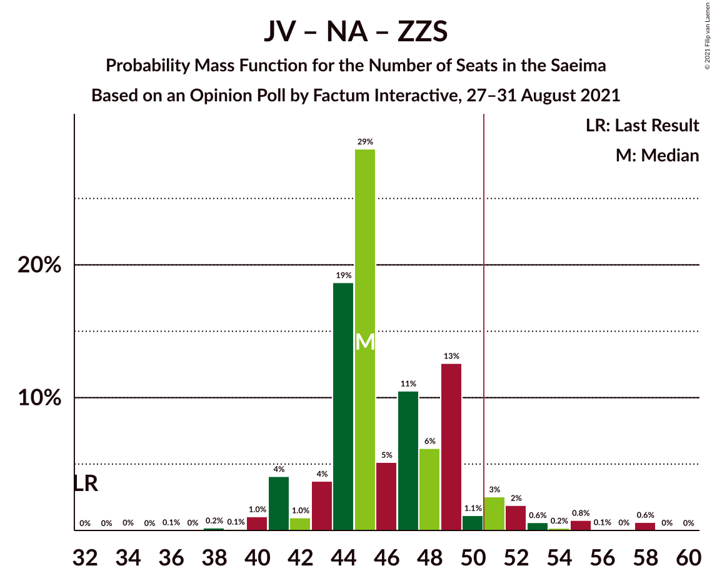
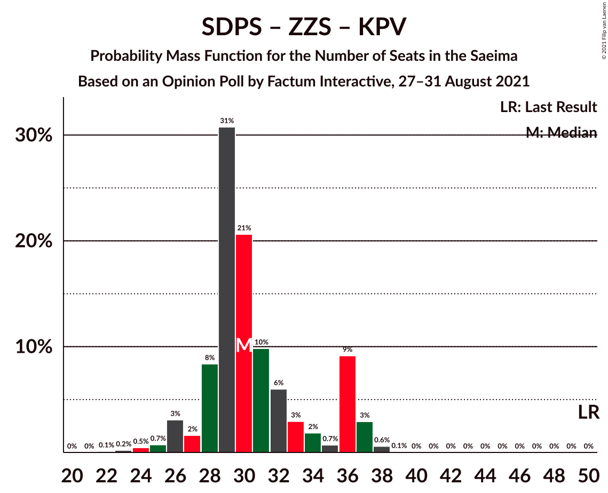

# Opinion Poll by Factum Interactive, 27–31 August 2021

<a href="#voting-intentions">Voting Intentions</a> | <a href="#seats">Seats</a> | <a href="#coalitions">Coalitions</a> | <a href="#technical-information">Technical Information</a>

## Voting Intentions

### Confidence Intervals

| Party | Last Result | Poll Result | 80% Confidence Interval | 90% Confidence Interval | 95% Confidence Interval | 99% Confidence Interval |
|:-----:|:-----------:|:-----------:|:-----------------------:|:-----------------------:|:-----------------------:|:-----------------------:|
| Jaunā VIENOTĪBA | 6.7% | 17.0% | 15.2–19.0% |14.6–19.6% |14.2–20.1% |13.4–21.2% |
| Sociāldemokrātiskā partija “Saskaņa” | 19.8% | 14.5% | 12.8–16.5% |12.4–17.1% |12.0–17.5% |11.2–18.5% |
| Attīstībai/Par! | 12.0% | 14.1% | 12.4–16.0% |11.9–16.5% |11.5–17.0% |10.8–18.0% |
| Nacionālā apvienība „Visu Latvijai!”–„Tēvzemei un Brīvībai/LNNK” | 11.0% | 11.6% | 10.1–13.4% |9.7–14.0% |9.3–14.4% |8.7–15.3% |
| Zaļo un Zemnieku savienība | 9.9% | 9.0% | 7.7–10.7% |7.3–11.2% |7.0–11.6% |6.4–12.4% |
| Jaunā konservatīvā partija | 13.6% | 6.1% | 5.1–7.6% |4.8–8.0% |4.5–8.3% |4.0–9.1% |
| PROGRESĪVIE | 2.6% | 5.7% | 4.6–7.0% |4.3–7.4% |4.1–7.8% |3.6–8.5% |
| Likums un kārtība | 0.0% | 5.2% | 4.2–6.5% |3.9–6.9% |3.7–7.2% |3.3–7.9% |
| Latvijas Reģionu Apvienība | 4.1% | 3.7% | 2.9–4.9% |2.7–5.2% |2.5–5.5% |2.1–6.1% |
| Latvija pirmajā vietā | 0.0% | 3.6% | 2.8–4.7% |2.5–5.0% |2.4–5.3% |2.0–5.9% |
| Latvijas Krievu savienība | 3.2% | 2.7% | 2.1–3.8% |1.9–4.1% |1.7–4.4% |1.4–4.9% |
| Politiskā partija „KPV LV” | 14.2% | 1.0% | 0.6–1.7% |0.5–1.9% |0.4–2.1% |0.3–2.5% |
| Republika | 0.0% | 1.0% | 0.6–1.7% |0.5–1.9% |0.4–2.1% |0.3–2.5% |

*Note:* The poll result column reflects the actual value used in the calculations. Published results may vary slightly, and in addition be rounded to fewer digits.

## Seats

### Confidence Intervals

| Party | Last Result | Median | 80% Confidence Interval | 90% Confidence Interval | 95% Confidence Interval | 99% Confidence Interval |
|:-----:|:-----------:|:------:|:-----------------------:|:-----------------------:|:-----------------------:|:-----------------------:|
| <a href="#jaunā-vienotība">Jaunā VIENOTĪBA</a> | 8 | 20 | 18–23 |18–24 |17–24 |16–27 |
| <a href="#sociāldemokrātiskā-partija-“saskaņa”">Sociāldemokrātiskā partija “Saskaņa”</a> | 23 | 18 | 16–23 |16–23 |16–26 |15–26 |
| <a href="#attīstībai/par!">Attīstībai/Par!</a> | 13 | 16 | 15–20 |14–20 |14–21 |13–22 |
| <a href="#nacionālā-apvienība-„visu-latvijai!”–„tēvzemei-un-brīvībai/lnnk”">Nacionālā apvienība „Visu Latvijai!”–„Tēvzemei un Brīvībai/LNNK”</a> | 13 | 14 | 11–16 |11–17 |11–17 |10–19 |
| <a href="#zaļo-un-zemnieku-savienība">Zaļo un Zemnieku savienība</a> | 11 | 11 | 10–14 |9–15 |9–16 |7–16 |
| <a href="#jaunā-konservatīvā-partija">Jaunā konservatīvā partija</a> | 16 | 7 | 7–10 |0–11 |0–11 |0–11 |
| <a href="#progresīvie">PROGRESĪVIE</a> | 0 | 7 | 0–8 |0–9 |0–9 |0–10 |
| <a href="#likums-un-kārtība">Likums un kārtība</a> | 0 | 7 | 0–7 |0–9 |0–10 |0–10 |
| <a href="#latvijas-reģionu-apvienība">Latvijas Reģionu Apvienība</a> | 0 | 0 | 0 |0–6 |0–6 |0–7 |
| <a href="#latvija-pirmajā-vietā">Latvija pirmajā vietā</a> | 0 | 0 | 0 |0–7 |0–7 |0–7 |
| <a href="#latvijas-krievu-savienība">Latvijas Krievu savienība</a> | 0 | 0 | 0 |0 |0 |0 |
| <a href="#politiskā-partija-„kpv-lv”">Politiskā partija „KPV LV”</a> | 16 | 0 | 0 |0 |0 |0 |
| <a href="#republika">Republika</a> | 0 | 0 | 0 |0 |0 |0 |

### Jaunā VIENOTĪBA

*For a full overview of the results for this party, see the [Jaunā VIENOTĪBA](party-jaunāvienotība.html) page.*

| Number of Seats | Probability | Accumulated | Special Marks |
|:---------------:|:-----------:|:-----------:|:-------------:|
| 8 | 0% | 100% | Last Result |
| 9 | 0% | 100% |  |
| 10 | 0% | 100% |  |
| 11 | 0% | 100% |  |
| 12 | 0% | 100% |  |
| 13 | 0% | 100% |  |
| 14 | 0.1% | 100% |  |
| 15 | 0% | 99.9% |  |
| 16 | 0.9% | 99.9% |  |
| 17 | 4% | 99.0% |  |
| 18 | 13% | 95% |  |
| 19 | 6% | 82% |  |
| 20 | 35% | 76% | Median |
| 21 | 15% | 41% |  |
| 22 | 7% | 26% |  |
| 23 | 14% | 20% |  |
| 24 | 4% | 6% |  |
| 25 | 0.7% | 2% |  |
| 26 | 0.3% | 1.4% |  |
| 27 | 0.7% | 1.1% |  |
| 28 | 0.3% | 0.4% |  |
| 29 | 0% | 0.1% |  |
| 30 | 0% | 0% |  |

### Sociāldemokrātiskā partija “Saskaņa”

*For a full overview of the results for this party, see the [Sociāldemokrātiskā partija “Saskaņa”](party-sociāldemokrātiskāpartija“saskaņa”.html) page.*

| Number of Seats | Probability | Accumulated | Special Marks |
|:---------------:|:-----------:|:-----------:|:-------------:|
| 15 | 2% | 100% |  |
| 16 | 9% | 98% |  |
| 17 | 8% | 89% |  |
| 18 | 44% | 81% | Median |
| 19 | 7% | 37% |  |
| 20 | 14% | 30% |  |
| 21 | 3% | 15% |  |
| 22 | 1.5% | 13% |  |
| 23 | 8% | 11% | Last Result |
| 24 | 0.8% | 4% |  |
| 25 | 0.1% | 3% |  |
| 26 | 3% | 3% |  |
| 27 | 0% | 0% |  |

### Attīstībai/Par!

*For a full overview of the results for this party, see the [Attīstībai/Par!](party-attīstībaipar.html) page.*

| Number of Seats | Probability | Accumulated | Special Marks |
|:---------------:|:-----------:|:-----------:|:-------------:|
| 10 | 0.1% | 100% |  |
| 11 | 0% | 99.9% |  |
| 12 | 0.1% | 99.9% |  |
| 13 | 0.5% | 99.8% | Last Result |
| 14 | 5% | 99.3% |  |
| 15 | 7% | 94% |  |
| 16 | 44% | 87% | Median |
| 17 | 23% | 43% |  |
| 18 | 5% | 20% |  |
| 19 | 4% | 15% |  |
| 20 | 8% | 12% |  |
| 21 | 2% | 3% |  |
| 22 | 1.5% | 2% |  |
| 23 | 0.1% | 0.2% |  |
| 24 | 0% | 0.1% |  |
| 25 | 0.1% | 0.1% |  |
| 26 | 0% | 0% |  |

### Nacionālā apvienība „Visu Latvijai!”–„Tēvzemei un Brīvībai/LNNK”

*For a full overview of the results for this party, see the [Nacionālā apvienība „Visu Latvijai!”–„Tēvzemei un Brīvībai/LNNK”](party-nacionālāapvienība„visulatvijai”–„tēvzemeiunbrīvībailnnk”.html) page.*

| Number of Seats | Probability | Accumulated | Special Marks |
|:---------------:|:-----------:|:-----------:|:-------------:|
| 9 | 0.2% | 100% |  |
| 10 | 0.8% | 99.8% |  |
| 11 | 12% | 99.1% |  |
| 12 | 4% | 87% |  |
| 13 | 17% | 83% | Last Result |
| 14 | 41% | 66% | Median |
| 15 | 10% | 25% |  |
| 16 | 9% | 15% |  |
| 17 | 5% | 6% |  |
| 18 | 0.5% | 1.3% |  |
| 19 | 0.5% | 0.8% |  |
| 20 | 0.1% | 0.3% |  |
| 21 | 0.2% | 0.2% |  |
| 22 | 0% | 0% |  |

### Zaļo un Zemnieku savienība

*For a full overview of the results for this party, see the [Zaļo un Zemnieku savienība](party-zaļounzemniekusavienība.html) page.*

| Number of Seats | Probability | Accumulated | Special Marks |
|:---------------:|:-----------:|:-----------:|:-------------:|
| 6 | 0.1% | 100% |  |
| 7 | 0.9% | 99.9% |  |
| 8 | 1.3% | 99.0% |  |
| 9 | 7% | 98% |  |
| 10 | 2% | 91% |  |
| 11 | 42% | 89% | Last Result, Median |
| 12 | 26% | 47% |  |
| 13 | 10% | 21% |  |
| 14 | 2% | 10% |  |
| 15 | 5% | 8% |  |
| 16 | 3% | 4% |  |
| 17 | 0.2% | 0.5% |  |
| 18 | 0.3% | 0.3% |  |
| 19 | 0% | 0% |  |

### Jaunā konservatīvā partija

*For a full overview of the results for this party, see the [Jaunā konservatīvā partija](party-jaunākonservatīvāpartija.html) page.*

| Number of Seats | Probability | Accumulated | Special Marks |
|:---------------:|:-----------:|:-----------:|:-------------:|
| 0 | 6% | 100% |  |
| 1 | 0% | 94% |  |
| 2 | 0% | 94% |  |
| 3 | 0% | 94% |  |
| 4 | 0% | 94% |  |
| 5 | 0% | 94% |  |
| 6 | 0% | 94% |  |
| 7 | 60% | 94% | Median |
| 8 | 6% | 35% |  |
| 9 | 18% | 28% |  |
| 10 | 1.4% | 11% |  |
| 11 | 9% | 9% |  |
| 12 | 0% | 0.4% |  |
| 13 | 0.3% | 0.3% |  |
| 14 | 0% | 0% |  |
| 15 | 0% | 0% |  |
| 16 | 0% | 0% | Last Result |

### PROGRESĪVIE

*For a full overview of the results for this party, see the [PROGRESĪVIE](party-progresīvie.html) page.*

| Number of Seats | Probability | Accumulated | Special Marks |
|:---------------:|:-----------:|:-----------:|:-------------:|
| 0 | 19% | 100% | Last Result |
| 1 | 0% | 81% |  |
| 2 | 0% | 81% |  |
| 3 | 0% | 81% |  |
| 4 | 0% | 81% |  |
| 5 | 0% | 81% |  |
| 6 | 0.6% | 81% |  |
| 7 | 57% | 81% | Median |
| 8 | 17% | 23% |  |
| 9 | 6% | 7% |  |
| 10 | 0.6% | 1.0% |  |
| 11 | 0.2% | 0.4% |  |
| 12 | 0.2% | 0.2% |  |
| 13 | 0% | 0% |  |

### Likums un kārtība

*For a full overview of the results for this party, see the [Likums un kārtība](party-likumsunkārtība.html) page.*

| Number of Seats | Probability | Accumulated | Special Marks |
|:---------------:|:-----------:|:-----------:|:-------------:|
| 0 | 46% | 100% | Last Result |
| 1 | 0% | 54% |  |
| 2 | 0% | 54% |  |
| 3 | 0% | 54% |  |
| 4 | 0% | 54% |  |
| 5 | 0.1% | 54% |  |
| 6 | 0.9% | 53% |  |
| 7 | 45% | 53% | Median |
| 8 | 2% | 8% |  |
| 9 | 3% | 6% |  |
| 10 | 3% | 3% |  |
| 11 | 0.2% | 0.3% |  |
| 12 | 0% | 0% |  |

### Latvijas Reģionu Apvienība

*For a full overview of the results for this party, see the [Latvijas Reģionu Apvienība](party-latvijasreģionuapvienība.html) page.*

| Number of Seats | Probability | Accumulated | Special Marks |
|:---------------:|:-----------:|:-----------:|:-------------:|
| 0 | 94% | 100% | Last Result, Median |
| 1 | 0% | 6% |  |
| 2 | 0% | 6% |  |
| 3 | 0% | 6% |  |
| 4 | 0% | 6% |  |
| 5 | 0% | 6% |  |
| 6 | 5% | 6% |  |
| 7 | 1.4% | 2% |  |
| 8 | 0.1% | 0.1% |  |
| 9 | 0% | 0% |  |

### Latvija pirmajā vietā

*For a full overview of the results for this party, see the [Latvija pirmajā vietā](party-latvijapirmajāvietā.html) page.*

| Number of Seats | Probability | Accumulated | Special Marks |
|:---------------:|:-----------:|:-----------:|:-------------:|
| 0 | 90% | 100% | Last Result, Median |
| 1 | 0% | 10% |  |
| 2 | 0% | 10% |  |
| 3 | 0% | 10% |  |
| 4 | 0% | 10% |  |
| 5 | 0.1% | 10% |  |
| 6 | 0.3% | 10% |  |
| 7 | 9% | 9% |  |
| 8 | 0% | 0.1% |  |
| 9 | 0% | 0% |  |

### Latvijas Krievu savienība

*For a full overview of the results for this party, see the [Latvijas Krievu savienība](party-latvijaskrievusavienība.html) page.*

| Number of Seats | Probability | Accumulated | Special Marks |
|:---------------:|:-----------:|:-----------:|:-------------:|
| 0 | 99.8% | 100% | Last Result, Median |
| 1 | 0% | 0.2% |  |
| 2 | 0% | 0.2% |  |
| 3 | 0% | 0.2% |  |
| 4 | 0% | 0.2% |  |
| 5 | 0% | 0.2% |  |
| 6 | 0.1% | 0.2% |  |
| 7 | 0% | 0.1% |  |
| 8 | 0.1% | 0.1% |  |
| 9 | 0% | 0% |  |

### Politiskā partija „KPV LV”

*For a full overview of the results for this party, see the [Politiskā partija „KPV LV”](party-politiskāpartija„kpvlv”.html) page.*

| Number of Seats | Probability | Accumulated | Special Marks |
|:---------------:|:-----------:|:-----------:|:-------------:|
| 0 | 100% | 100% | Median |
| 1 | 0% | 0% |  |
| 2 | 0% | 0% |  |
| 3 | 0% | 0% |  |
| 4 | 0% | 0% |  |
| 5 | 0% | 0% |  |
| 6 | 0% | 0% |  |
| 7 | 0% | 0% |  |
| 8 | 0% | 0% |  |
| 9 | 0% | 0% |  |
| 10 | 0% | 0% |  |
| 11 | 0% | 0% |  |
| 12 | 0% | 0% |  |
| 13 | 0% | 0% |  |
| 14 | 0% | 0% |  |
| 15 | 0% | 0% |  |
| 16 | 0% | 0% | Last Result |

### Republika

*For a full overview of the results for this party, see the [Republika](party-republika.html) page.*

| Number of Seats | Probability | Accumulated | Special Marks |
|:---------------:|:-----------:|:-----------:|:-------------:|
| 0 | 100% | 100% | Last Result, Median |

## Coalitions

### Confidence Intervals

| Coalition | Last Result | Median | Majority? | 80% Confidence Interval | 90% Confidence Interval | 95% Confidence Interval | 99% Confidence Interval |
|:---------:|:-----------:|:------:|:---------:|:-----------------------:|:-----------------------:|:-----------------------:|:-----------------------:|
| Jaunā VIENOTĪBA – Attīstībai/Par! – Nacionālā apvienība „Visu Latvijai!”–„Tēvzemei un Brīvībai/LNNK” – Zaļo un Zemnieku savienība – Jaunā konservatīvā partija | 61 | 69 | 100% | 67–75 | 64–75 | 63–77 | 61–80 |
| Jaunā VIENOTĪBA – Attīstībai/Par! – Nacionālā apvienība „Visu Latvijai!”–„Tēvzemei un Brīvībai/LNNK” – Zaļo un Zemnieku savienība | 45 | 62 | 99.9% | 60–67 | 57–68 | 57–71 | 55–74 |
| Jaunā VIENOTĪBA – Attīstībai/Par! – Nacionālā apvienība „Visu Latvijai!”–„Tēvzemei un Brīvībai/LNNK” – Jaunā konservatīvā partija | 50 | 57 | 98.8% | 55–63 | 54–64 | 52–65 | 50–67 |
| Jaunā VIENOTĪBA – Attīstībai/Par! – Nacionālā apvienība „Visu Latvijai!”–„Tēvzemei un Brīvībai/LNNK” – Jaunā konservatīvā partija – Politiskā partija „KPV LV” | 66 | 57 | 98.8% | 55–63 | 54–64 | 52–65 | 50–67 |
| Jaunā VIENOTĪBA – Nacionālā apvienība „Visu Latvijai!”–„Tēvzemei un Brīvībai/LNNK” – Zaļo un Zemnieku savienība – Jaunā konservatīvā partija | 48 | 53 | 88% | 50–58 | 48–59 | 46–60 | 45–62 |
| Jaunā VIENOTĪBA – Attīstībai/Par! – Nacionālā apvienība „Visu Latvijai!”–„Tēvzemei un Brīvībai/LNNK” – Politiskā partija „KPV LV” | 50 | 50 | 45% | 47–56 | 47–57 | 46–58 | 44–60 |
| Attīstībai/Par! – Nacionālā apvienība „Visu Latvijai!”–„Tēvzemei un Brīvībai/LNNK” – Zaļo un Zemnieku savienība – Jaunā konservatīvā partija | 53 | 49 | 39% | 46–54 | 45–54 | 43–55 | 41–59 |
| Jaunā VIENOTĪBA – Nacionālā apvienība „Visu Latvijai!”–„Tēvzemei un Brīvībai/LNNK” – Zaļo un Zemnieku savienība | 32 | 45 | 7% | 43–49 | 41–51 | 41–52 | 40–58 |
| Jaunā VIENOTĪBA – Attīstībai/Par! – Jaunā konservatīvā partija – Politiskā partija „KPV LV” | 53 | 43 | 9% | 41–49 | 40–52 | 38–52 | 35–54 |
| Sociāldemokrātiskā partija “Saskaņa” – Attīstībai/Par! – Jaunā konservatīvā partija | 52 | 42 | 3% | 39–49 | 38–49 | 36–52 | 31–52 |
| Attīstībai/Par! – Nacionālā apvienība „Visu Latvijai!”–„Tēvzemei un Brīvībai/LNNK” – Zaļo un Zemnieku savienība | 37 | 42 | 1.0% | 40–45 | 38–47 | 38–48 | 36–51 |
| Jaunā VIENOTĪBA – Nacionālā apvienība „Visu Latvijai!”–„Tēvzemei un Brīvībai/LNNK” – Jaunā konservatīvā partija – Politiskā partija „KPV LV” | 53 | 41 | 0.1% | 39–46 | 37–47 | 35–48 | 34–50 |
| Sociāldemokrātiskā partija “Saskaņa” – Attīstībai/Par! | 36 | 35 | 0% | 32–39 | 32–40 | 31–45 | 29–45 |
| Attīstībai/Par! – Nacionālā apvienība „Visu Latvijai!”–„Tēvzemei un Brīvībai/LNNK” – Jaunā konservatīvā partija – Politiskā partija „KPV LV” | 58 | 38 | 0% | 35–42 | 34–42 | 32–43 | 30–45 |
| Nacionālā apvienība „Visu Latvijai!”–„Tēvzemei un Brīvībai/LNNK” – Zaļo un Zemnieku savienība – Jaunā konservatīvā partija | 40 | 33 | 0% | 30–36 | 29–37 | 26–38 | 24–40 |
| Sociāldemokrātiskā partija “Saskaņa” – Zaļo un Zemnieku savienība – Politiskā partija „KPV LV” | 50 | 30 | 0% | 28–36 | 27–36 | 26–37 | 24–38 |
| Sociāldemokrātiskā partija “Saskaņa” – Politiskā partija „KPV LV” | 39 | 18 | 0% | 16–23 | 16–23 | 16–26 | 15–26 |

### Jaunā VIENOTĪBA – Attīstībai/Par! – Nacionālā apvienība „Visu Latvijai!”–„Tēvzemei un Brīvībai/LNNK” – Zaļo un Zemnieku savienība – Jaunā konservatīvā partija

| Number of Seats | Probability | Accumulated | Special Marks |
|:---------------:|:-----------:|:-----------:|:-------------:|
| 58 | 0% | 100% |  |
| 59 | 0% | 99.9% |  |
| 60 | 0% | 99.9% |  |
| 61 | 0.6% | 99.8% | Last Result |
| 62 | 0.9% | 99.3% |  |
| 63 | 2% | 98% |  |
| 64 | 3% | 97% |  |
| 65 | 2% | 93% |  |
| 66 | 1.1% | 91% |  |
| 67 | 5% | 90% |  |
| 68 | 27% | 85% | Median |
| 69 | 11% | 58% |  |
| 70 | 9% | 47% |  |
| 71 | 2% | 38% |  |
| 72 | 4% | 37% |  |
| 73 | 9% | 33% |  |
| 74 | 8% | 24% |  |
| 75 | 13% | 17% |  |
| 76 | 1.0% | 4% |  |
| 77 | 0.6% | 3% |  |
| 78 | 0.7% | 2% |  |
| 79 | 0.3% | 1.3% |  |
| 80 | 0.5% | 1.0% |  |
| 81 | 0.3% | 0.5% |  |
| 82 | 0.2% | 0.2% |  |
| 83 | 0% | 0% |  |

### Jaunā VIENOTĪBA – Attīstībai/Par! – Nacionālā apvienība „Visu Latvijai!”–„Tēvzemei un Brīvībai/LNNK” – Zaļo un Zemnieku savienība

| Number of Seats | Probability | Accumulated | Special Marks |
|:---------------:|:-----------:|:-----------:|:-------------:|
| 45 | 0% | 100% | Last Result |
| 46 | 0% | 100% |  |
| 47 | 0% | 100% |  |
| 48 | 0% | 100% |  |
| 49 | 0% | 100% |  |
| 50 | 0% | 100% |  |
| 51 | 0% | 99.9% | Majority |
| 52 | 0% | 99.9% |  |
| 53 | 0% | 99.9% |  |
| 54 | 0.2% | 99.9% |  |
| 55 | 1.0% | 99.6% |  |
| 56 | 1.1% | 98.7% |  |
| 57 | 3% | 98% |  |
| 58 | 2% | 94% |  |
| 59 | 1.1% | 93% |  |
| 60 | 14% | 92% |  |
| 61 | 27% | 78% | Median |
| 62 | 4% | 51% |  |
| 63 | 9% | 47% |  |
| 64 | 8% | 38% |  |
| 65 | 7% | 30% |  |
| 66 | 11% | 23% |  |
| 67 | 5% | 12% |  |
| 68 | 3% | 7% |  |
| 69 | 0.9% | 4% |  |
| 70 | 0.4% | 3% |  |
| 71 | 0.7% | 3% |  |
| 72 | 0.3% | 2% |  |
| 73 | 0.7% | 2% |  |
| 74 | 0.9% | 1.1% |  |
| 75 | 0.2% | 0.3% |  |
| 76 | 0% | 0.1% |  |
| 77 | 0% | 0.1% |  |
| 78 | 0% | 0% |  |

### Jaunā VIENOTĪBA – Attīstībai/Par! – Nacionālā apvienība „Visu Latvijai!”–„Tēvzemei un Brīvībai/LNNK” – Jaunā konservatīvā partija

| Number of Seats | Probability | Accumulated | Special Marks |
|:---------------:|:-----------:|:-----------:|:-------------:|
| 47 | 0% | 100% |  |
| 48 | 0.1% | 99.9% |  |
| 49 | 0.1% | 99.9% |  |
| 50 | 1.0% | 99.8% | Last Result |
| 51 | 1.1% | 98.8% | Majority |
| 52 | 1.0% | 98% |  |
| 53 | 0.7% | 97% |  |
| 54 | 3% | 96% |  |
| 55 | 9% | 93% |  |
| 56 | 9% | 83% |  |
| 57 | 29% | 74% | Median |
| 58 | 5% | 46% |  |
| 59 | 6% | 41% |  |
| 60 | 2% | 34% |  |
| 61 | 6% | 32% |  |
| 62 | 5% | 26% |  |
| 63 | 16% | 21% |  |
| 64 | 1.3% | 5% |  |
| 65 | 2% | 4% |  |
| 66 | 0.4% | 2% |  |
| 67 | 1.0% | 1.5% |  |
| 68 | 0.2% | 0.4% |  |
| 69 | 0.1% | 0.2% |  |
| 70 | 0.1% | 0.1% |  |
| 71 | 0% | 0% |  |

### Jaunā VIENOTĪBA – Attīstībai/Par! – Nacionālā apvienība „Visu Latvijai!”–„Tēvzemei un Brīvībai/LNNK” – Jaunā konservatīvā partija – Politiskā partija „KPV LV”

| Number of Seats | Probability | Accumulated | Special Marks |
|:---------------:|:-----------:|:-----------:|:-------------:|
| 47 | 0% | 100% |  |
| 48 | 0.1% | 99.9% |  |
| 49 | 0.1% | 99.9% |  |
| 50 | 1.0% | 99.8% |  |
| 51 | 1.1% | 98.8% | Majority |
| 52 | 1.0% | 98% |  |
| 53 | 0.7% | 97% |  |
| 54 | 3% | 96% |  |
| 55 | 9% | 93% |  |
| 56 | 9% | 83% |  |
| 57 | 29% | 74% | Median |
| 58 | 5% | 46% |  |
| 59 | 6% | 41% |  |
| 60 | 2% | 34% |  |
| 61 | 6% | 32% |  |
| 62 | 5% | 26% |  |
| 63 | 16% | 21% |  |
| 64 | 1.3% | 5% |  |
| 65 | 2% | 4% |  |
| 66 | 0.4% | 2% | Last Result |
| 67 | 1.0% | 1.5% |  |
| 68 | 0.2% | 0.4% |  |
| 69 | 0.1% | 0.2% |  |
| 70 | 0.1% | 0.1% |  |
| 71 | 0% | 0% |  |

### Jaunā VIENOTĪBA – Nacionālā apvienība „Visu Latvijai!”–„Tēvzemei un Brīvībai/LNNK” – Zaļo un Zemnieku savienība – Jaunā konservatīvā partija

| Number of Seats | Probability | Accumulated | Special Marks |
|:---------------:|:-----------:|:-----------:|:-------------:|
| 41 | 0.1% | 100% |  |
| 42 | 0% | 99.9% |  |
| 43 | 0.1% | 99.9% |  |
| 44 | 0.1% | 99.9% |  |
| 45 | 1.2% | 99.8% |  |
| 46 | 1.2% | 98.6% |  |
| 47 | 0.6% | 97% |  |
| 48 | 4% | 97% | Last Result |
| 49 | 1.4% | 92% |  |
| 50 | 3% | 91% |  |
| 51 | 5% | 88% | Majority |
| 52 | 26% | 83% | Median |
| 53 | 10% | 57% |  |
| 54 | 10% | 47% |  |
| 55 | 16% | 37% |  |
| 56 | 8% | 21% |  |
| 57 | 1.1% | 12% |  |
| 58 | 6% | 11% |  |
| 59 | 2% | 5% |  |
| 60 | 2% | 3% |  |
| 61 | 0.9% | 2% |  |
| 62 | 0.4% | 0.7% |  |
| 63 | 0% | 0.3% |  |
| 64 | 0.2% | 0.3% |  |
| 65 | 0% | 0% |  |

### Jaunā VIENOTĪBA – Attīstībai/Par! – Nacionālā apvienība „Visu Latvijai!”–„Tēvzemei un Brīvībai/LNNK” – Politiskā partija „KPV LV”

| Number of Seats | Probability | Accumulated | Special Marks |
|:---------------:|:-----------:|:-----------:|:-------------:|
| 41 | 0.1% | 100% |  |
| 42 | 0% | 99.9% |  |
| 43 | 0.2% | 99.9% |  |
| 44 | 1.0% | 99.7% |  |
| 45 | 0.9% | 98.7% |  |
| 46 | 0.7% | 98% |  |
| 47 | 8% | 97% |  |
| 48 | 11% | 89% |  |
| 49 | 4% | 78% |  |
| 50 | 29% | 74% | Last Result, Median |
| 51 | 7% | 45% | Majority |
| 52 | 11% | 38% |  |
| 53 | 4% | 27% |  |
| 54 | 12% | 24% |  |
| 55 | 1.2% | 12% |  |
| 56 | 5% | 11% |  |
| 57 | 3% | 6% |  |
| 58 | 2% | 4% |  |
| 59 | 0.6% | 2% |  |
| 60 | 1.3% | 2% |  |
| 61 | 0% | 0.4% |  |
| 62 | 0.1% | 0.4% |  |
| 63 | 0.2% | 0.3% |  |
| 64 | 0% | 0.1% |  |
| 65 | 0% | 0% |  |

### Attīstībai/Par! – Nacionālā apvienība „Visu Latvijai!”–„Tēvzemei un Brīvībai/LNNK” – Zaļo un Zemnieku savienība – Jaunā konservatīvā partija

| Number of Seats | Probability | Accumulated | Special Marks |
|:---------------:|:-----------:|:-----------:|:-------------:|
| 38 | 0% | 100% |  |
| 39 | 0.2% | 99.9% |  |
| 40 | 0.1% | 99.8% |  |
| 41 | 0.5% | 99.7% |  |
| 42 | 0.3% | 99.2% |  |
| 43 | 2% | 98.9% |  |
| 44 | 1.0% | 97% |  |
| 45 | 2% | 96% |  |
| 46 | 4% | 93% |  |
| 47 | 3% | 89% |  |
| 48 | 25% | 86% | Median |
| 49 | 10% | 60% |  |
| 50 | 11% | 50% |  |
| 51 | 12% | 39% | Majority |
| 52 | 10% | 26% |  |
| 53 | 5% | 17% | Last Result |
| 54 | 9% | 12% |  |
| 55 | 0.9% | 3% |  |
| 56 | 0.8% | 2% |  |
| 57 | 0.4% | 1.0% |  |
| 58 | 0.1% | 0.6% |  |
| 59 | 0.1% | 0.5% |  |
| 60 | 0.3% | 0.4% |  |
| 61 | 0% | 0.1% |  |
| 62 | 0% | 0% |  |

### Jaunā VIENOTĪBA – Nacionālā apvienība „Visu Latvijai!”–„Tēvzemei un Brīvībai/LNNK” – Zaļo un Zemnieku savienība

| Number of Seats | Probability | Accumulated | Special Marks |
|:---------------:|:-----------:|:-----------:|:-------------:|
| 32 | 0% | 100% | Last Result |
| 33 | 0% | 100% |  |
| 34 | 0% | 100% |  |
| 35 | 0% | 100% |  |
| 36 | 0.1% | 100% |  |
| 37 | 0% | 99.9% |  |
| 38 | 0.2% | 99.9% |  |
| 39 | 0.1% | 99.7% |  |
| 40 | 1.0% | 99.6% |  |
| 41 | 4% | 98.5% |  |
| 42 | 1.0% | 94% |  |
| 43 | 4% | 93% |  |
| 44 | 19% | 90% |  |
| 45 | 29% | 71% | Median |
| 46 | 5% | 42% |  |
| 47 | 11% | 37% |  |
| 48 | 6% | 27% |  |
| 49 | 13% | 21% |  |
| 50 | 1.1% | 8% |  |
| 51 | 3% | 7% | Majority |
| 52 | 2% | 4% |  |
| 53 | 0.6% | 2% |  |
| 54 | 0.2% | 2% |  |
| 55 | 0.8% | 2% |  |
| 56 | 0.1% | 0.8% |  |
| 57 | 0% | 0.7% |  |
| 58 | 0.6% | 0.7% |  |
| 59 | 0% | 0.1% |  |
| 60 | 0% | 0% |  |

### Jaunā VIENOTĪBA – Attīstībai/Par! – Jaunā konservatīvā partija – Politiskā partija „KPV LV”

| Number of Seats | Probability | Accumulated | Special Marks |
|:---------------:|:-----------:|:-----------:|:-------------:|
| 34 | 0% | 100% |  |
| 35 | 1.0% | 99.9% |  |
| 36 | 1.0% | 98.9% |  |
| 37 | 0.3% | 98% |  |
| 38 | 0.5% | 98% |  |
| 39 | 0.9% | 97% |  |
| 40 | 4% | 96% |  |
| 41 | 7% | 92% |  |
| 42 | 3% | 85% |  |
| 43 | 33% | 82% | Median |
| 44 | 12% | 50% |  |
| 45 | 6% | 38% |  |
| 46 | 4% | 33% |  |
| 47 | 5% | 29% |  |
| 48 | 5% | 24% |  |
| 49 | 9% | 19% |  |
| 50 | 1.1% | 10% |  |
| 51 | 0.7% | 9% | Majority |
| 52 | 7% | 8% |  |
| 53 | 0.4% | 1.0% | Last Result |
| 54 | 0.3% | 0.6% |  |
| 55 | 0% | 0.3% |  |
| 56 | 0.3% | 0.3% |  |
| 57 | 0% | 0% |  |

### Sociāldemokrātiskā partija “Saskaņa” – Attīstībai/Par! – Jaunā konservatīvā partija

| Number of Seats | Probability | Accumulated | Special Marks |
|:---------------:|:-----------:|:-----------:|:-------------:|
| 31 | 0.5% | 100% |  |
| 32 | 0% | 99.5% |  |
| 33 | 0.1% | 99.4% |  |
| 34 | 0.5% | 99.3% |  |
| 35 | 1.2% | 98.8% |  |
| 36 | 0.9% | 98% |  |
| 37 | 0.5% | 97% |  |
| 38 | 2% | 96% |  |
| 39 | 9% | 94% |  |
| 40 | 5% | 86% |  |
| 41 | 26% | 80% | Median |
| 42 | 9% | 54% |  |
| 43 | 5% | 45% |  |
| 44 | 12% | 40% |  |
| 45 | 2% | 27% |  |
| 46 | 4% | 25% |  |
| 47 | 3% | 22% |  |
| 48 | 7% | 19% |  |
| 49 | 7% | 11% |  |
| 50 | 0.6% | 4% |  |
| 51 | 0.7% | 3% | Majority |
| 52 | 3% | 3% | Last Result |
| 53 | 0% | 0.1% |  |
| 54 | 0.1% | 0.1% |  |
| 55 | 0% | 0% |  |

### Attīstībai/Par! – Nacionālā apvienība „Visu Latvijai!”–„Tēvzemei un Brīvībai/LNNK” – Zaļo un Zemnieku savienība

| Number of Seats | Probability | Accumulated | Special Marks |
|:---------------:|:-----------:|:-----------:|:-------------:|
| 32 | 0% | 100% |  |
| 33 | 0% | 99.9% |  |
| 34 | 0.1% | 99.9% |  |
| 35 | 0.2% | 99.8% |  |
| 36 | 1.2% | 99.6% |  |
| 37 | 0.6% | 98% | Last Result |
| 38 | 3% | 98% |  |
| 39 | 5% | 95% |  |
| 40 | 4% | 90% |  |
| 41 | 29% | 87% | Median |
| 42 | 16% | 58% |  |
| 43 | 21% | 41% |  |
| 44 | 5% | 21% |  |
| 45 | 7% | 16% |  |
| 46 | 4% | 9% |  |
| 47 | 3% | 5% |  |
| 48 | 0.8% | 3% |  |
| 49 | 0.4% | 2% |  |
| 50 | 0.4% | 1.4% |  |
| 51 | 0.6% | 1.0% | Majority |
| 52 | 0.1% | 0.4% |  |
| 53 | 0.3% | 0.3% |  |
| 54 | 0% | 0.1% |  |
| 55 | 0% | 0% |  |

### Jaunā VIENOTĪBA – Nacionālā apvienība „Visu Latvijai!”–„Tēvzemei un Brīvībai/LNNK” – Jaunā konservatīvā partija – Politiskā partija „KPV LV”

| Number of Seats | Probability | Accumulated | Special Marks |
|:---------------:|:-----------:|:-----------:|:-------------:|
| 31 | 0% | 100% |  |
| 32 | 0.1% | 99.9% |  |
| 33 | 0.1% | 99.9% |  |
| 34 | 1.2% | 99.8% |  |
| 35 | 2% | 98.6% |  |
| 36 | 0.5% | 97% |  |
| 37 | 1.4% | 96% |  |
| 38 | 3% | 95% |  |
| 39 | 9% | 91% |  |
| 40 | 12% | 82% |  |
| 41 | 25% | 70% | Median |
| 42 | 9% | 46% |  |
| 43 | 11% | 37% |  |
| 44 | 12% | 26% |  |
| 45 | 2% | 14% |  |
| 46 | 6% | 12% |  |
| 47 | 3% | 6% |  |
| 48 | 0.7% | 3% |  |
| 49 | 2% | 2% |  |
| 50 | 0.4% | 0.5% |  |
| 51 | 0% | 0.1% | Majority |
| 52 | 0% | 0% |  |
| 53 | 0% | 0% | Last Result |

### Sociāldemokrātiskā partija “Saskaņa” – Attīstībai/Par!

| Number of Seats | Probability | Accumulated | Special Marks |
|:---------------:|:-----------:|:-----------:|:-------------:|
| 28 | 0.1% | 100% |  |
| 29 | 0.8% | 99.9% |  |
| 30 | 0.9% | 99.1% |  |
| 31 | 2% | 98% |  |
| 32 | 8% | 96% |  |
| 33 | 8% | 88% |  |
| 34 | 28% | 80% | Median |
| 35 | 9% | 52% |  |
| 36 | 7% | 42% | Last Result |
| 37 | 9% | 35% |  |
| 38 | 12% | 26% |  |
| 39 | 8% | 14% |  |
| 40 | 2% | 7% |  |
| 41 | 0.8% | 5% |  |
| 42 | 0.7% | 4% |  |
| 43 | 0.2% | 3% |  |
| 44 | 0.5% | 3% |  |
| 45 | 3% | 3% |  |
| 46 | 0% | 0% |  |

### Attīstībai/Par! – Nacionālā apvienība „Visu Latvijai!”–„Tēvzemei un Brīvībai/LNNK” – Jaunā konservatīvā partija – Politiskā partija „KPV LV”

| Number of Seats | Probability | Accumulated | Special Marks |
|:---------------:|:-----------:|:-----------:|:-------------:|
| 28 | 0.1% | 100% |  |
| 29 | 0.1% | 99.9% |  |
| 30 | 1.1% | 99.8% |  |
| 31 | 0.4% | 98.7% |  |
| 32 | 1.4% | 98% |  |
| 33 | 2% | 97% |  |
| 34 | 5% | 95% |  |
| 35 | 3% | 91% |  |
| 36 | 7% | 88% |  |
| 37 | 30% | 81% | Median |
| 38 | 14% | 52% |  |
| 39 | 9% | 38% |  |
| 40 | 11% | 29% |  |
| 41 | 7% | 18% |  |
| 42 | 9% | 11% |  |
| 43 | 1.2% | 3% |  |
| 44 | 0.5% | 1.5% |  |
| 45 | 0.5% | 1.0% |  |
| 46 | 0.3% | 0.4% |  |
| 47 | 0% | 0.2% |  |
| 48 | 0% | 0.1% |  |
| 49 | 0.1% | 0.1% |  |
| 50 | 0% | 0% |  |
| 51 | 0% | 0% | Majority |
| 52 | 0% | 0% |  |
| 53 | 0% | 0% |  |
| 54 | 0% | 0% |  |
| 55 | 0% | 0% |  |
| 56 | 0% | 0% |  |
| 57 | 0% | 0% |  |
| 58 | 0% | 0% | Last Result |

### Nacionālā apvienība „Visu Latvijai!”–„Tēvzemei un Brīvībai/LNNK” – Zaļo un Zemnieku savienība – Jaunā konservatīvā partija

| Number of Seats | Probability | Accumulated | Special Marks |
|:---------------:|:-----------:|:-----------:|:-------------:|
| 23 | 0.2% | 100% |  |
| 24 | 0.3% | 99.8% |  |
| 25 | 2% | 99.5% |  |
| 26 | 0.8% | 98% |  |
| 27 | 0.2% | 97% |  |
| 28 | 2% | 97% |  |
| 29 | 2% | 95% |  |
| 30 | 4% | 93% |  |
| 31 | 4% | 89% |  |
| 32 | 31% | 85% | Median |
| 33 | 14% | 54% |  |
| 34 | 15% | 40% |  |
| 35 | 14% | 25% |  |
| 36 | 5% | 11% |  |
| 37 | 2% | 6% |  |
| 38 | 2% | 3% |  |
| 39 | 1.0% | 2% |  |
| 40 | 0.2% | 0.6% | Last Result |
| 41 | 0.1% | 0.4% |  |
| 42 | 0% | 0.3% |  |
| 43 | 0.2% | 0.2% |  |
| 44 | 0% | 0% |  |

### Sociāldemokrātiskā partija “Saskaņa” – Zaļo un Zemnieku savienība – Politiskā partija „KPV LV”

| Number of Seats | Probability | Accumulated | Special Marks |
|:---------------:|:-----------:|:-----------:|:-------------:|
| 22 | 0.1% | 100% |  |
| 23 | 0.2% | 99.9% |  |
| 24 | 0.5% | 99.7% |  |
| 25 | 0.7% | 99.2% |  |
| 26 | 3% | 98% |  |
| 27 | 2% | 95% |  |
| 28 | 8% | 94% |  |
| 29 | 31% | 85% | Median |
| 30 | 21% | 55% |  |
| 31 | 10% | 34% |  |
| 32 | 6% | 24% |  |
| 33 | 3% | 18% |  |
| 34 | 2% | 15% |  |
| 35 | 0.7% | 13% |  |
| 36 | 9% | 13% |  |
| 37 | 3% | 4% |  |
| 38 | 0.6% | 0.7% |  |
| 39 | 0.1% | 0.1% |  |
| 40 | 0% | 0% |  |
| 41 | 0% | 0% |  |
| 42 | 0% | 0% |  |
| 43 | 0% | 0% |  |
| 44 | 0% | 0% |  |
| 45 | 0% | 0% |  |
| 46 | 0% | 0% |  |
| 47 | 0% | 0% |  |
| 48 | 0% | 0% |  |
| 49 | 0% | 0% |  |
| 50 | 0% | 0% | Last Result |

### Sociāldemokrātiskā partija “Saskaņa” – Politiskā partija „KPV LV”

| Number of Seats | Probability | Accumulated | Special Marks |
|:---------------:|:-----------:|:-----------:|:-------------:|
| 15 | 2% | 100% |  |
| 16 | 9% | 98% |  |
| 17 | 8% | 89% |  |
| 18 | 44% | 81% | Median |
| 19 | 7% | 37% |  |
| 20 | 14% | 30% |  |
| 21 | 3% | 15% |  |
| 22 | 1.5% | 13% |  |
| 23 | 8% | 11% |  |
| 24 | 0.8% | 4% |  |
| 25 | 0.1% | 3% |  |
| 26 | 3% | 3% |  |
| 27 | 0% | 0% |  |
| 28 | 0% | 0% |  |
| 29 | 0% | 0% |  |
| 30 | 0% | 0% |  |
| 31 | 0% | 0% |  |
| 32 | 0% | 0% |  |
| 33 | 0% | 0% |  |
| 34 | 0% | 0% |  |
| 35 | 0% | 0% |  |
| 36 | 0% | 0% |  |
| 37 | 0% | 0% |  |
| 38 | 0% | 0% |  |
| 39 | 0% | 0% | Last Result |

## Technical Information

### Opinion Poll

+ **Polling firm:** Factum Interactive
+ **Commissioner(s):** —
+ **Fieldwork period:** 27–31 August 2021

### Calculations

+ **Sample size:** 619
+ **Simulations done:** 1,048,576
+ **Error estimate:** 3.23%

