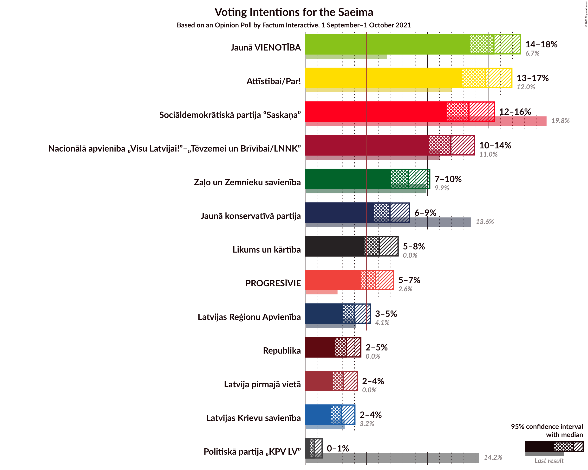
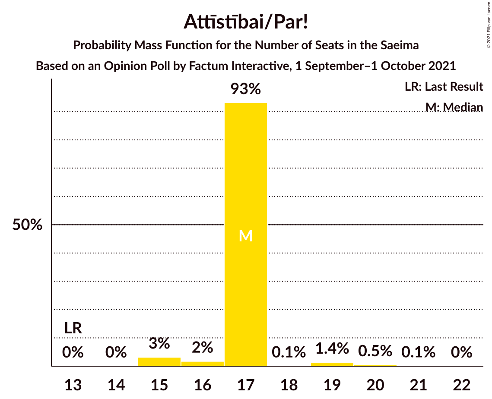
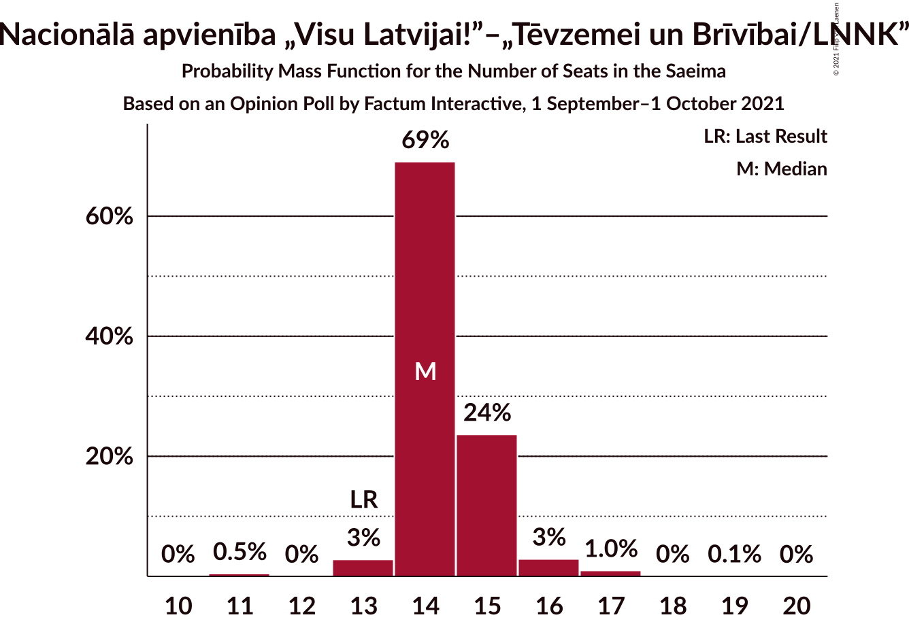
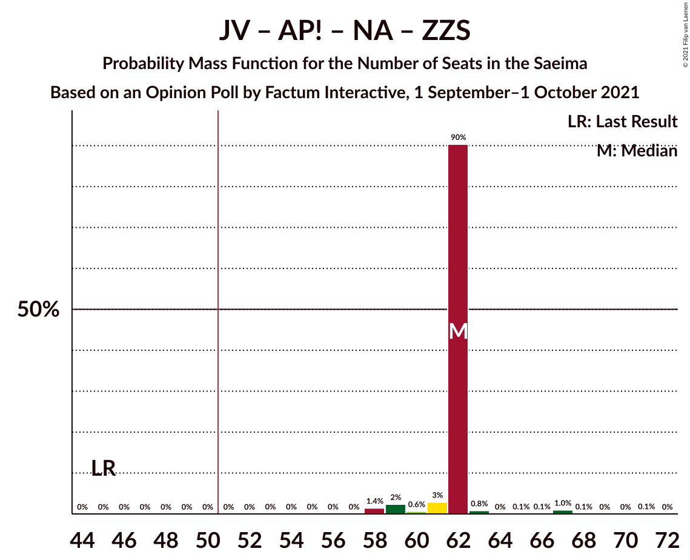
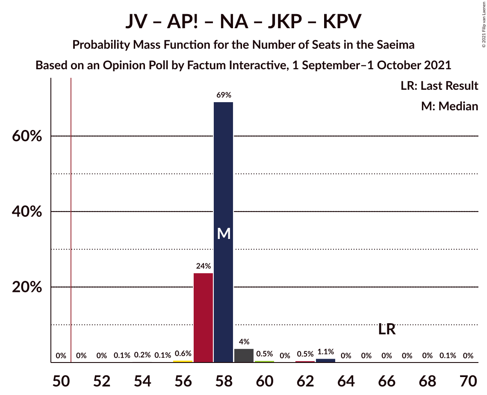
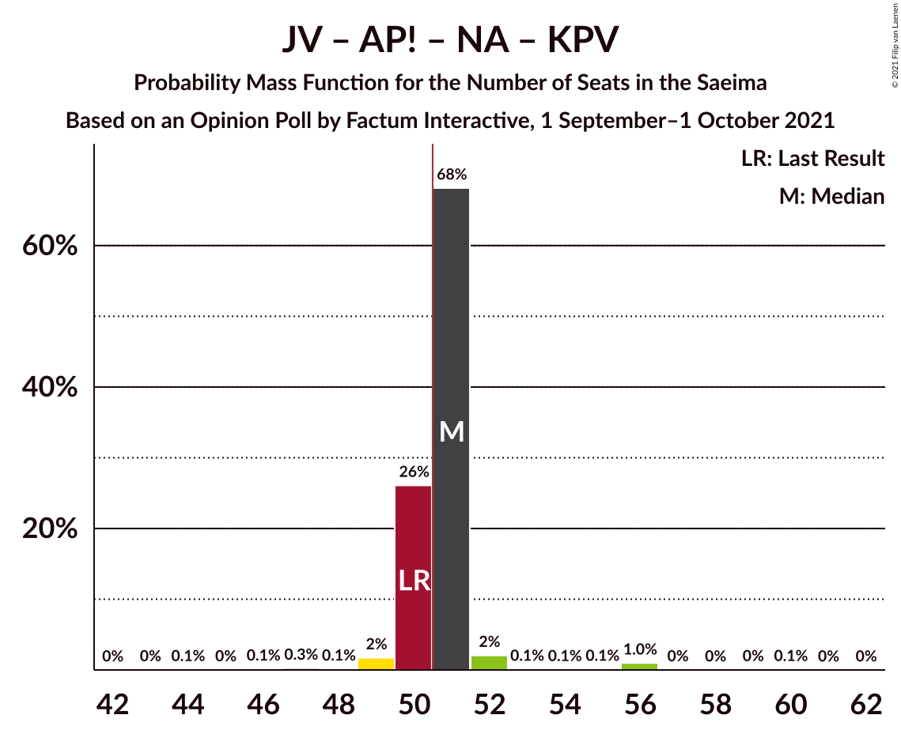
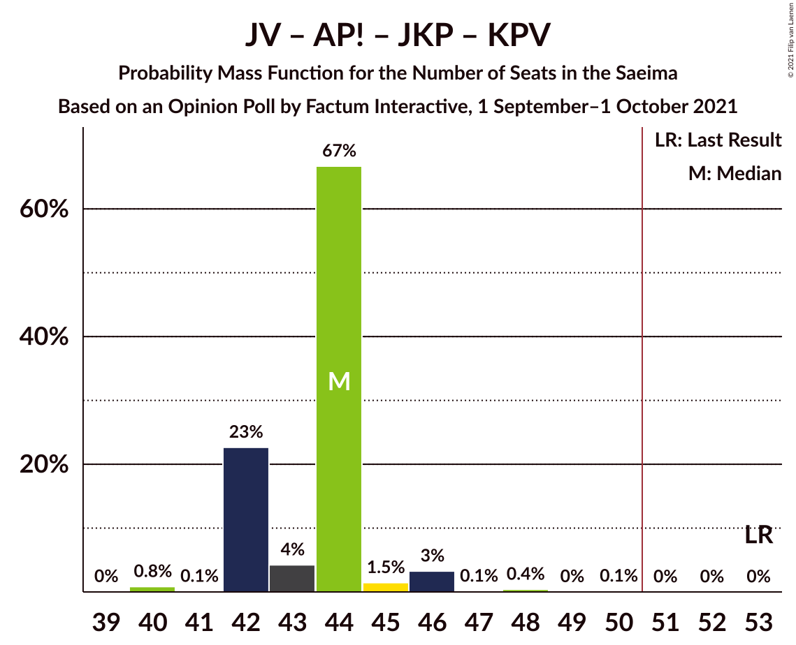
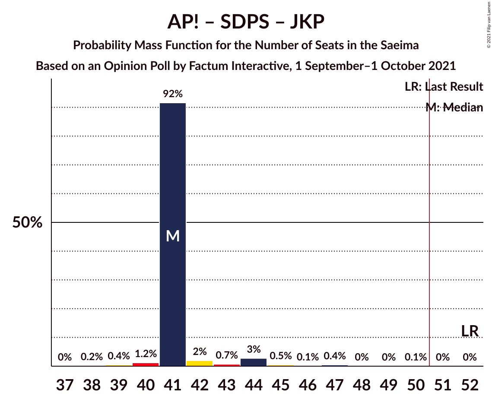
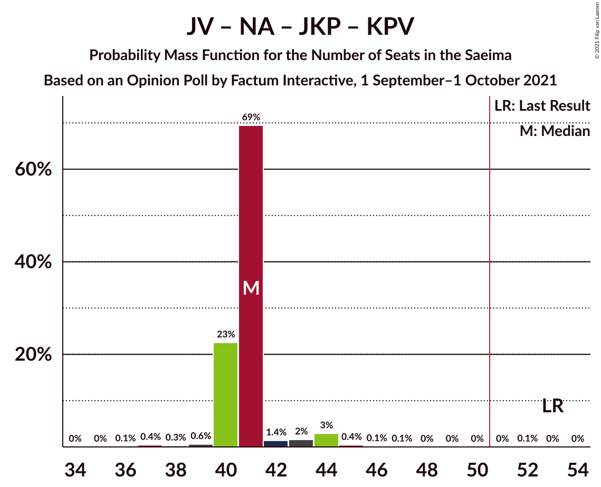

# Opinion Poll by Factum Interactive, 1 September–1 October 2021

<a href="#voting-intentions">Voting Intentions</a> | <a href="#seats">Seats</a> | <a href="#coalitions">Coalitions</a> | <a href="#technical-information">Technical Information</a>

## Voting Intentions

### Confidence Intervals

| Party | Last Result | Poll Result | 80% Confidence Interval | 90% Confidence Interval | 95% Confidence Interval | 99% Confidence Interval |
|:-----:|:-----------:|:-----------:|:-----------------------:|:-----------------------:|:-----------------------:|:-----------------------:|
| Jaunā VIENOTĪBA | 6.7% | 15.5% | 14.2–16.9% |13.8–17.3% |13.5–17.7% |12.9–18.4% |
| Attīstībai/Par! | 12.0% | 14.8% | 13.5–16.2% |13.2–16.6% |12.9–16.9% |12.3–17.6% |
| Sociāldemokrātiskā partija “Saskaņa” | 19.8% | 13.4% | 12.2–14.8% |11.9–15.2% |11.6–15.5% |11.0–16.2% |
| Nacionālā apvienība „Visu Latvijai!”–„Tēvzemei un Brīvībai/LNNK” | 11.0% | 11.9% | 10.7–13.2% |10.4–13.5% |10.2–13.9% |9.6–14.5% |
| Zaļo un Zemnieku savienība | 9.9% | 8.5% | 7.5–9.6% |7.2–9.9% |7.0–10.2% |6.6–10.8% |
| Jaunā konservatīvā partija | 13.6% | 6.9% | 6.1–8.0% |5.8–8.3% |5.6–8.5% |5.2–9.1% |
| Likums un kārtība | 0.0% | 6.1% | 5.3–7.1% |5.0–7.3% |4.8–7.6% |4.5–8.1% |
| PROGRESĪVIE | 2.6% | 5.7% | 4.9–6.7% |4.7–7.0% |4.5–7.2% |4.2–7.7% |
| Latvijas Reģionu Apvienība | 4.1% | 4.0% | 3.4–4.9% |3.2–5.1% |3.0–5.3% |2.7–5.7% |
| Latvijas Krievu savienība | 3.2% | 2.9% | 2.4–3.6% |2.2–3.9% |2.1–4.0% |1.8–4.4% |
| Politiskā partija „KPV LV” | 14.2% | 0.7% | 0.5–1.1% |0.4–1.2% |0.4–1.3% |0.3–1.6% |

*Note:* The poll result column reflects the actual value used in the calculations. Published results may vary slightly, and in addition be rounded to fewer digits.

## Seats

### Confidence Intervals

| Party | Last Result | Median | 80% Confidence Interval | 90% Confidence Interval | 95% Confidence Interval | 99% Confidence Interval |
|:-----:|:-----------:|:------:|:-----------------------:|:-----------------------:|:-----------------------:|:-----------------------:|
| <a href="#jaunā-vienotība">Jaunā VIENOTĪBA</a> | 8 | 19 | 17–20 |17–21 |16–23 |16–23 |
| <a href="#attīstībai/par!">Attīstībai/Par!</a> | 13 | 17 | 15–20 |15–20 |15–20 |14–21 |
| <a href="#sociāldemokrātiskā-partija-“saskaņa”">Sociāldemokrātiskā partija “Saskaņa”</a> | 23 | 17 | 16–19 |16–20 |16–20 |15–21 |
| <a href="#nacionālā-apvienība-„visu-latvijai!”–„tēvzemei-un-brīvībai/lnnk”">Nacionālā apvienība „Visu Latvijai!”–„Tēvzemei un Brīvībai/LNNK”</a> | 13 | 14 | 13–16 |13–16 |12–16 |11–17 |
| <a href="#zaļo-un-zemnieku-savienība">Zaļo un Zemnieku savienība</a> | 11 | 11 | 10–12 |9–12 |9–12 |7–13 |
| <a href="#jaunā-konservatīvā-partija">Jaunā konservatīvā partija</a> | 16 | 8 | 7–9 |7–9 |7–9 |7–11 |
| <a href="#likums-un-kārtība">Likums un kārtība</a> | 0 | 7 | 7–9 |6–10 |6–10 |0–10 |
| <a href="#progresīvie">PROGRESĪVIE</a> | 0 | 7 | 0–7 |0–8 |0–9 |0–9 |
| <a href="#latvijas-reģionu-apvienība">Latvijas Reģionu Apvienība</a> | 0 | 0 | 0 |0–6 |0–6 |0–6 |
| <a href="#latvijas-krievu-savienība">Latvijas Krievu savienība</a> | 0 | 0 | 0 |0 |0 |0 |
| <a href="#politiskā-partija-„kpv-lv”">Politiskā partija „KPV LV”</a> | 16 | 0 | 0 |0 |0 |0 |

### Jaunā VIENOTĪBA

*For a full overview of the results for this party, see the [Jaunā VIENOTĪBA](party-jaunāvienotība.html) page.*

| Number of Seats | Probability | Accumulated | Special Marks |
|:---------------:|:-----------:|:-----------:|:-------------:|
| 8 | 0% | 100% | Last Result |
| 9 | 0% | 100% |  |
| 10 | 0% | 100% |  |
| 11 | 0% | 100% |  |
| 12 | 0% | 100% |  |
| 13 | 0% | 100% |  |
| 14 | 0.1% | 100% |  |
| 15 | 0.3% | 99.9% |  |
| 16 | 2% | 99.6% |  |
| 17 | 10% | 97% |  |
| 18 | 29% | 88% |  |
| 19 | 31% | 59% | Median |
| 20 | 22% | 28% |  |
| 21 | 3% | 6% |  |
| 22 | 1.0% | 4% |  |
| 23 | 3% | 3% |  |
| 24 | 0.2% | 0.2% |  |
| 25 | 0% | 0% |  |

### Attīstībai/Par!

*For a full overview of the results for this party, see the [Attīstībai/Par!](party-attīstībaipar.html) page.*

| Number of Seats | Probability | Accumulated | Special Marks |
|:---------------:|:-----------:|:-----------:|:-------------:|
| 13 | 0% | 100% | Last Result |
| 14 | 0.6% | 100% |  |
| 15 | 10% | 99.4% |  |
| 16 | 23% | 89% |  |
| 17 | 41% | 66% | Median |
| 18 | 14% | 26% |  |
| 19 | 2% | 12% |  |
| 20 | 9% | 10% |  |
| 21 | 0.9% | 1.0% |  |
| 22 | 0.1% | 0.1% |  |
| 23 | 0% | 0% |  |

### Sociāldemokrātiskā partija “Saskaņa”

*For a full overview of the results for this party, see the [Sociāldemokrātiskā partija “Saskaņa”](party-sociāldemokrātiskāpartija“saskaņa”.html) page.*

| Number of Seats | Probability | Accumulated | Special Marks |
|:---------------:|:-----------:|:-----------:|:-------------:|
| 14 | 0.1% | 100% |  |
| 15 | 2% | 99.9% |  |
| 16 | 14% | 98% |  |
| 17 | 36% | 85% | Median |
| 18 | 37% | 48% |  |
| 19 | 4% | 11% |  |
| 20 | 7% | 8% |  |
| 21 | 0.5% | 0.8% |  |
| 22 | 0.2% | 0.2% |  |
| 23 | 0.1% | 0.1% | Last Result |
| 24 | 0% | 0% |  |

### Nacionālā apvienība „Visu Latvijai!”–„Tēvzemei un Brīvībai/LNNK”

*For a full overview of the results for this party, see the [Nacionālā apvienība „Visu Latvijai!”–„Tēvzemei un Brīvībai/LNNK”](party-nacionālāapvienība„visulatvijai”–„tēvzemeiunbrīvībailnnk”.html) page.*

| Number of Seats | Probability | Accumulated | Special Marks |
|:---------------:|:-----------:|:-----------:|:-------------:|
| 10 | 0.2% | 100% |  |
| 11 | 2% | 99.8% |  |
| 12 | 1.3% | 98% |  |
| 13 | 21% | 97% | Last Result |
| 14 | 58% | 76% | Median |
| 15 | 5% | 18% |  |
| 16 | 12% | 13% |  |
| 17 | 1.5% | 2% |  |
| 18 | 0% | 0.1% |  |
| 19 | 0% | 0% |  |

### Zaļo un Zemnieku savienība

*For a full overview of the results for this party, see the [Zaļo un Zemnieku savienība](party-zaļounzemniekusavienība.html) page.*

| Number of Seats | Probability | Accumulated | Special Marks |
|:---------------:|:-----------:|:-----------:|:-------------:|
| 7 | 0.7% | 100% |  |
| 8 | 2% | 99.3% |  |
| 9 | 7% | 98% |  |
| 10 | 15% | 91% |  |
| 11 | 60% | 75% | Last Result, Median |
| 12 | 14% | 15% |  |
| 13 | 0.8% | 0.9% |  |
| 14 | 0.1% | 0.2% |  |
| 15 | 0.1% | 0.1% |  |
| 16 | 0% | 0% |  |

### Jaunā konservatīvā partija

*For a full overview of the results for this party, see the [Jaunā konservatīvā partija](party-jaunākonservatīvāpartija.html) page.*

| Number of Seats | Probability | Accumulated | Special Marks |
|:---------------:|:-----------:|:-----------:|:-------------:|
| 0 | 0.2% | 100% |  |
| 1 | 0% | 99.8% |  |
| 2 | 0% | 99.8% |  |
| 3 | 0% | 99.8% |  |
| 4 | 0% | 99.8% |  |
| 5 | 0% | 99.8% |  |
| 6 | 0% | 99.8% |  |
| 7 | 41% | 99.8% |  |
| 8 | 13% | 59% | Median |
| 9 | 44% | 46% |  |
| 10 | 0.7% | 2% |  |
| 11 | 1.0% | 1.1% |  |
| 12 | 0.1% | 0.1% |  |
| 13 | 0% | 0% |  |
| 14 | 0% | 0% |  |
| 15 | 0% | 0% |  |
| 16 | 0% | 0% | Last Result |

### Likums un kārtība

*For a full overview of the results for this party, see the [Likums un kārtība](party-likumsunkārtība.html) page.*

| Number of Seats | Probability | Accumulated | Special Marks |
|:---------------:|:-----------:|:-----------:|:-------------:|
| 0 | 2% | 100% | Last Result |
| 1 | 0% | 98% |  |
| 2 | 0% | 98% |  |
| 3 | 0% | 98% |  |
| 4 | 0% | 98% |  |
| 5 | 0% | 98% |  |
| 6 | 3% | 98% |  |
| 7 | 63% | 95% | Median |
| 8 | 20% | 32% |  |
| 9 | 4% | 12% |  |
| 10 | 7% | 8% |  |
| 11 | 0.2% | 0.2% |  |
| 12 | 0% | 0% |  |

### PROGRESĪVIE

*For a full overview of the results for this party, see the [PROGRESĪVIE](party-progresīvie.html) page.*

| Number of Seats | Probability | Accumulated | Special Marks |
|:---------------:|:-----------:|:-----------:|:-------------:|
| 0 | 19% | 100% | Last Result |
| 1 | 0% | 81% |  |
| 2 | 0% | 81% |  |
| 3 | 0% | 81% |  |
| 4 | 0% | 81% |  |
| 5 | 0% | 81% |  |
| 6 | 3% | 81% |  |
| 7 | 69% | 78% | Median |
| 8 | 6% | 10% |  |
| 9 | 4% | 4% |  |
| 10 | 0.1% | 0.1% |  |
| 11 | 0% | 0% |  |

### Latvijas Reģionu Apvienība

*For a full overview of the results for this party, see the [Latvijas Reģionu Apvienība](party-latvijasreģionuapvienība.html) page.*

| Number of Seats | Probability | Accumulated | Special Marks |
|:---------------:|:-----------:|:-----------:|:-------------:|
| 0 | 91% | 100% | Last Result, Median |
| 1 | 0% | 9% |  |
| 2 | 0% | 9% |  |
| 3 | 0% | 9% |  |
| 4 | 0% | 9% |  |
| 5 | 0% | 9% |  |
| 6 | 9% | 9% |  |
| 7 | 0.1% | 0.1% |  |
| 8 | 0% | 0% |  |

### Latvijas Krievu savienība

*For a full overview of the results for this party, see the [Latvijas Krievu savienība](party-latvijaskrievusavienība.html) page.*

| Number of Seats | Probability | Accumulated | Special Marks |
|:---------------:|:-----------:|:-----------:|:-------------:|
| 0 | 100% | 100% | Last Result, Median |

### Politiskā partija „KPV LV”

*For a full overview of the results for this party, see the [Politiskā partija „KPV LV”](party-politiskāpartija„kpvlv”.html) page.*

| Number of Seats | Probability | Accumulated | Special Marks |
|:---------------:|:-----------:|:-----------:|:-------------:|
| 0 | 100% | 100% | Median |
| 1 | 0% | 0% |  |
| 2 | 0% | 0% |  |
| 3 | 0% | 0% |  |
| 4 | 0% | 0% |  |
| 5 | 0% | 0% |  |
| 6 | 0% | 0% |  |
| 7 | 0% | 0% |  |
| 8 | 0% | 0% |  |
| 9 | 0% | 0% |  |
| 10 | 0% | 0% |  |
| 11 | 0% | 0% |  |
| 12 | 0% | 0% |  |
| 13 | 0% | 0% |  |
| 14 | 0% | 0% |  |
| 15 | 0% | 0% |  |
| 16 | 0% | 0% | Last Result |

## Coalitions

### Confidence Intervals

| Coalition | Last Result | Median | Majority? | 80% Confidence Interval | 90% Confidence Interval | 95% Confidence Interval | 99% Confidence Interval |
|:---------:|:-----------:|:------:|:---------:|:-----------------------:|:-----------------------:|:-----------------------:|:-----------------------:|
| Jaunā VIENOTĪBA – Attīstībai/Par! – Nacionālā apvienība „Visu Latvijai!”–„Tēvzemei un Brīvībai/LNNK” – Zaļo un Zemnieku savienība – Jaunā konservatīvā partija | 61 | 69 | 100% | 66–74 | 64–74 | 64–74 | 63–76 |
| Jaunā VIENOTĪBA – Attīstībai/Par! – Nacionālā apvienība „Visu Latvijai!”–„Tēvzemei un Brīvībai/LNNK” – Zaļo un Zemnieku savienība | 45 | 61 | 100% | 58–65 | 56–65 | 56–65 | 55–68 |
| Jaunā VIENOTĪBA – Attīstībai/Par! – Nacionālā apvienība „Visu Latvijai!”–„Tēvzemei un Brīvībai/LNNK” – Jaunā konservatīvā partija | 50 | 58 | 100% | 55–63 | 54–63 | 54–63 | 53–65 |
| Jaunā VIENOTĪBA – Attīstībai/Par! – Nacionālā apvienība „Visu Latvijai!”–„Tēvzemei un Brīvībai/LNNK” – Jaunā konservatīvā partija – Politiskā partija „KPV LV” | 66 | 58 | 100% | 55–63 | 54–63 | 54–63 | 53–65 |
| Jaunā VIENOTĪBA – Nacionālā apvienība „Visu Latvijai!”–„Tēvzemei un Brīvībai/LNNK” – Zaļo un Zemnieku savienība – Jaunā konservatīvā partija | 48 | 52 | 75% | 49–54 | 49–56 | 48–57 | 46–59 |
| Attīstībai/Par! – Nacionālā apvienība „Visu Latvijai!”–„Tēvzemei un Brīvībai/LNNK” – Zaļo un Zemnieku savienība – Jaunā konservatīvā partija | 53 | 50 | 27% | 48–52 | 46–56 | 45–56 | 45–56 |
| Jaunā VIENOTĪBA – Attīstībai/Par! – Nacionālā apvienība „Visu Latvijai!”–„Tēvzemei un Brīvībai/LNNK” – Politiskā partija „KPV LV” | 50 | 50 | 45% | 47–54 | 47–54 | 45–54 | 45–57 |
| Jaunā VIENOTĪBA – Attīstībai/Par! – Jaunā konservatīvā partija – Politiskā partija „KPV LV” | 53 | 44 | 0.3% | 42–47 | 41–47 | 41–49 | 40–50 |
| Jaunā VIENOTĪBA – Nacionālā apvienība „Visu Latvijai!”–„Tēvzemei un Brīvībai/LNNK” – Zaļo un Zemnieku savienība | 32 | 44 | 0.6% | 41–46 | 40–47 | 40–48 | 38–51 |
| Attīstībai/Par! – Sociāldemokrātiskā partija “Saskaņa” – Jaunā konservatīvā partija | 52 | 42 | 0.1% | 41–46 | 40–47 | 39–47 | 38–48 |
| Attīstībai/Par! – Nacionālā apvienība „Visu Latvijai!”–„Tēvzemei un Brīvībai/LNNK” – Zaļo un Zemnieku savienība | 37 | 42 | 0% | 39–44 | 38–47 | 37–47 | 37–48 |
| Jaunā VIENOTĪBA – Nacionālā apvienība „Visu Latvijai!”–„Tēvzemei un Brīvībai/LNNK” – Jaunā konservatīvā partija – Politiskā partija „KPV LV” | 53 | 41 | 0% | 39–43 | 38–45 | 37–46 | 36–47 |
| Attīstībai/Par! – Nacionālā apvienība „Visu Latvijai!”–„Tēvzemei un Brīvībai/LNNK” – Jaunā konservatīvā partija – Politiskā partija „KPV LV” | 58 | 39 | 0% | 37–42 | 36–45 | 36–45 | 35–45 |
| Attīstībai/Par! – Sociāldemokrātiskā partija “Saskaņa” | 36 | 34 | 0% | 32–38 | 31–38 | 31–40 | 31–40 |
| Nacionālā apvienība „Visu Latvijai!”–„Tēvzemei un Brīvībai/LNNK” – Zaļo un Zemnieku savienība – Jaunā konservatīvā partija | 40 | 33 | 0% | 31–35 | 30–36 | 29–36 | 28–38 |
| Sociāldemokrātiskā partija “Saskaņa” – Zaļo un Zemnieku savienība – Politiskā partija „KPV LV” | 50 | 28 | 0% | 26–30 | 26–31 | 25–31 | 24–32 |
| Sociāldemokrātiskā partija “Saskaņa” – Politiskā partija „KPV LV” | 39 | 17 | 0% | 16–19 | 16–20 | 16–20 | 15–21 |

### Jaunā VIENOTĪBA – Attīstībai/Par! – Nacionālā apvienība „Visu Latvijai!”–„Tēvzemei un Brīvībai/LNNK” – Zaļo un Zemnieku savienība – Jaunā konservatīvā partija

| Number of Seats | Probability | Accumulated | Special Marks |
|:---------------:|:-----------:|:-----------:|:-------------:|
| 61 | 0% | 100% | Last Result |
| 62 | 0.2% | 100% |  |
| 63 | 1.1% | 99.7% |  |
| 64 | 6% | 98.7% |  |
| 65 | 1.1% | 93% |  |
| 66 | 4% | 92% |  |
| 67 | 12% | 88% |  |
| 68 | 25% | 75% |  |
| 69 | 21% | 51% | Median |
| 70 | 16% | 30% |  |
| 71 | 0.5% | 13% |  |
| 72 | 1.0% | 13% |  |
| 73 | 1.3% | 12% |  |
| 74 | 8% | 10% |  |
| 75 | 1.1% | 2% |  |
| 76 | 0.7% | 1.0% |  |
| 77 | 0% | 0.2% |  |
| 78 | 0.1% | 0.2% |  |
| 79 | 0% | 0.1% |  |
| 80 | 0% | 0.1% |  |
| 81 | 0% | 0.1% |  |
| 82 | 0% | 0.1% |  |
| 83 | 0% | 0% |  |

### Jaunā VIENOTĪBA – Attīstībai/Par! – Nacionālā apvienība „Visu Latvijai!”–„Tēvzemei un Brīvībai/LNNK” – Zaļo un Zemnieku savienība

| Number of Seats | Probability | Accumulated | Special Marks |
|:---------------:|:-----------:|:-----------:|:-------------:|
| 45 | 0% | 100% | Last Result |
| 46 | 0% | 100% |  |
| 47 | 0% | 100% |  |
| 48 | 0% | 100% |  |
| 49 | 0% | 100% |  |
| 50 | 0% | 100% |  |
| 51 | 0% | 100% | Majority |
| 52 | 0% | 100% |  |
| 53 | 0% | 100% |  |
| 54 | 0.2% | 100% |  |
| 55 | 2% | 99.8% |  |
| 56 | 5% | 98% |  |
| 57 | 3% | 93% |  |
| 58 | 4% | 90% |  |
| 59 | 18% | 86% |  |
| 60 | 13% | 68% |  |
| 61 | 19% | 55% | Median |
| 62 | 19% | 36% |  |
| 63 | 5% | 17% |  |
| 64 | 1.3% | 12% |  |
| 65 | 8% | 11% |  |
| 66 | 0.8% | 2% |  |
| 67 | 0.6% | 1.5% |  |
| 68 | 0.5% | 0.9% |  |
| 69 | 0.3% | 0.4% |  |
| 70 | 0% | 0.1% |  |
| 71 | 0% | 0.1% |  |
| 72 | 0% | 0.1% |  |
| 73 | 0% | 0% |  |

### Jaunā VIENOTĪBA – Attīstībai/Par! – Nacionālā apvienība „Visu Latvijai!”–„Tēvzemei un Brīvībai/LNNK” – Jaunā konservatīvā partija

| Number of Seats | Probability | Accumulated | Special Marks |
|:---------------:|:-----------:|:-----------:|:-------------:|
| 50 | 0% | 100% | Last Result |
| 51 | 0.2% | 100% | Majority |
| 52 | 0.2% | 99.8% |  |
| 53 | 0.9% | 99.6% |  |
| 54 | 4% | 98.7% |  |
| 55 | 8% | 95% |  |
| 56 | 9% | 86% |  |
| 57 | 22% | 77% |  |
| 58 | 25% | 55% | Median |
| 59 | 9% | 29% |  |
| 60 | 7% | 21% |  |
| 61 | 1.5% | 13% |  |
| 62 | 1.4% | 12% |  |
| 63 | 9% | 10% |  |
| 64 | 0.8% | 2% |  |
| 65 | 0.4% | 0.8% |  |
| 66 | 0.2% | 0.4% |  |
| 67 | 0.1% | 0.2% |  |
| 68 | 0.1% | 0.1% |  |
| 69 | 0% | 0% |  |

### Jaunā VIENOTĪBA – Attīstībai/Par! – Nacionālā apvienība „Visu Latvijai!”–„Tēvzemei un Brīvībai/LNNK” – Jaunā konservatīvā partija – Politiskā partija „KPV LV”

| Number of Seats | Probability | Accumulated | Special Marks |
|:---------------:|:-----------:|:-----------:|:-------------:|
| 51 | 0.2% | 100% | Majority |
| 52 | 0.2% | 99.8% |  |
| 53 | 0.9% | 99.6% |  |
| 54 | 4% | 98.7% |  |
| 55 | 8% | 95% |  |
| 56 | 9% | 86% |  |
| 57 | 22% | 77% |  |
| 58 | 25% | 55% | Median |
| 59 | 9% | 29% |  |
| 60 | 7% | 21% |  |
| 61 | 1.5% | 13% |  |
| 62 | 1.4% | 12% |  |
| 63 | 9% | 10% |  |
| 64 | 0.8% | 2% |  |
| 65 | 0.4% | 0.8% |  |
| 66 | 0.2% | 0.4% | Last Result |
| 67 | 0.1% | 0.2% |  |
| 68 | 0.1% | 0.1% |  |
| 69 | 0% | 0% |  |

### Jaunā VIENOTĪBA – Nacionālā apvienība „Visu Latvijai!”–„Tēvzemei un Brīvībai/LNNK” – Zaļo un Zemnieku savienība – Jaunā konservatīvā partija

| Number of Seats | Probability | Accumulated | Special Marks |
|:---------------:|:-----------:|:-----------:|:-------------:|
| 45 | 0.2% | 100% |  |
| 46 | 1.0% | 99.8% |  |
| 47 | 1.1% | 98.7% |  |
| 48 | 2% | 98% | Last Result |
| 49 | 8% | 96% |  |
| 50 | 14% | 88% |  |
| 51 | 20% | 75% | Majority |
| 52 | 25% | 54% | Median |
| 53 | 13% | 29% |  |
| 54 | 9% | 17% |  |
| 55 | 3% | 8% |  |
| 56 | 1.2% | 5% |  |
| 57 | 3% | 4% |  |
| 58 | 0.7% | 1.4% |  |
| 59 | 0.5% | 0.6% |  |
| 60 | 0.1% | 0.2% |  |
| 61 | 0% | 0% |  |

### Attīstībai/Par! – Nacionālā apvienība „Visu Latvijai!”–„Tēvzemei un Brīvībai/LNNK” – Zaļo un Zemnieku savienība – Jaunā konservatīvā partija

| Number of Seats | Probability | Accumulated | Special Marks |
|:---------------:|:-----------:|:-----------:|:-------------:|
| 43 | 0% | 100% |  |
| 44 | 0.3% | 99.9% |  |
| 45 | 3% | 99.7% |  |
| 46 | 2% | 96% |  |
| 47 | 4% | 94% |  |
| 48 | 11% | 90% |  |
| 49 | 16% | 79% |  |
| 50 | 36% | 63% | Median |
| 51 | 14% | 27% | Majority |
| 52 | 3% | 13% |  |
| 53 | 2% | 10% | Last Result |
| 54 | 1.2% | 8% |  |
| 55 | 0.5% | 7% |  |
| 56 | 6% | 6% |  |
| 57 | 0.1% | 0.2% |  |
| 58 | 0.1% | 0.1% |  |
| 59 | 0% | 0.1% |  |
| 60 | 0% | 0% |  |

### Jaunā VIENOTĪBA – Attīstībai/Par! – Nacionālā apvienība „Visu Latvijai!”–„Tēvzemei un Brīvībai/LNNK” – Politiskā partija „KPV LV”

| Number of Seats | Probability | Accumulated | Special Marks |
|:---------------:|:-----------:|:-----------:|:-------------:|
| 43 | 0.1% | 100% |  |
| 44 | 0.2% | 99.9% |  |
| 45 | 3% | 99.7% |  |
| 46 | 1.3% | 97% |  |
| 47 | 7% | 96% |  |
| 48 | 22% | 89% |  |
| 49 | 12% | 67% |  |
| 50 | 10% | 55% | Last Result, Median |
| 51 | 27% | 45% | Majority |
| 52 | 5% | 17% |  |
| 53 | 2% | 13% |  |
| 54 | 9% | 11% |  |
| 55 | 1.0% | 2% |  |
| 56 | 0.6% | 1.2% |  |
| 57 | 0.5% | 0.6% |  |
| 58 | 0.1% | 0.2% |  |
| 59 | 0% | 0.1% |  |
| 60 | 0% | 0% |  |

### Jaunā VIENOTĪBA – Attīstībai/Par! – Jaunā konservatīvā partija – Politiskā partija „KPV LV”

| Number of Seats | Probability | Accumulated | Special Marks |
|:---------------:|:-----------:|:-----------:|:-------------:|
| 37 | 0.1% | 100% |  |
| 38 | 0% | 99.9% |  |
| 39 | 0.1% | 99.9% |  |
| 40 | 2% | 99.7% |  |
| 41 | 8% | 98% |  |
| 42 | 13% | 90% |  |
| 43 | 21% | 78% |  |
| 44 | 26% | 56% | Median |
| 45 | 7% | 30% |  |
| 46 | 12% | 23% |  |
| 47 | 7% | 11% |  |
| 48 | 0.9% | 4% |  |
| 49 | 3% | 3% |  |
| 50 | 0.3% | 0.7% |  |
| 51 | 0.1% | 0.3% | Majority |
| 52 | 0.2% | 0.3% |  |
| 53 | 0% | 0% | Last Result |

### Jaunā VIENOTĪBA – Nacionālā apvienība „Visu Latvijai!”–„Tēvzemei un Brīvībai/LNNK” – Zaļo un Zemnieku savienība

| Number of Seats | Probability | Accumulated | Special Marks |
|:---------------:|:-----------:|:-----------:|:-------------:|
| 32 | 0% | 100% | Last Result |
| 33 | 0% | 100% |  |
| 34 | 0% | 100% |  |
| 35 | 0% | 100% |  |
| 36 | 0% | 100% |  |
| 37 | 0.1% | 100% |  |
| 38 | 0.6% | 99.9% |  |
| 39 | 1.3% | 99.3% |  |
| 40 | 3% | 98% |  |
| 41 | 7% | 95% |  |
| 42 | 7% | 87% |  |
| 43 | 23% | 80% |  |
| 44 | 31% | 58% | Median |
| 45 | 16% | 27% |  |
| 46 | 4% | 10% |  |
| 47 | 2% | 6% |  |
| 48 | 3% | 4% |  |
| 49 | 0.7% | 1.5% |  |
| 50 | 0.2% | 0.7% |  |
| 51 | 0.5% | 0.6% | Majority |
| 52 | 0.1% | 0.1% |  |
| 53 | 0% | 0% |  |

### Attīstībai/Par! – Sociāldemokrātiskā partija “Saskaņa” – Jaunā konservatīvā partija

| Number of Seats | Probability | Accumulated | Special Marks |
|:---------------:|:-----------:|:-----------:|:-------------:|
| 35 | 0.1% | 100% |  |
| 36 | 0% | 99.9% |  |
| 37 | 0.4% | 99.9% |  |
| 38 | 0.6% | 99.6% |  |
| 39 | 3% | 98.9% |  |
| 40 | 5% | 96% |  |
| 41 | 20% | 91% |  |
| 42 | 30% | 71% | Median |
| 43 | 17% | 40% |  |
| 44 | 6% | 23% |  |
| 45 | 3% | 17% |  |
| 46 | 4% | 14% |  |
| 47 | 8% | 10% |  |
| 48 | 1.3% | 2% |  |
| 49 | 0.2% | 0.3% |  |
| 50 | 0.1% | 0.1% |  |
| 51 | 0% | 0.1% | Majority |
| 52 | 0% | 0% | Last Result |

### Attīstībai/Par! – Nacionālā apvienība „Visu Latvijai!”–„Tēvzemei un Brīvībai/LNNK” – Zaļo un Zemnieku savienība

| Number of Seats | Probability | Accumulated | Special Marks |
|:---------------:|:-----------:|:-----------:|:-------------:|
| 36 | 0.2% | 100% |  |
| 37 | 3% | 99.8% | Last Result |
| 38 | 5% | 97% |  |
| 39 | 4% | 92% |  |
| 40 | 6% | 88% |  |
| 41 | 26% | 82% |  |
| 42 | 24% | 56% | Median |
| 43 | 18% | 32% |  |
| 44 | 4% | 14% |  |
| 45 | 3% | 10% |  |
| 46 | 1.0% | 7% |  |
| 47 | 6% | 6% |  |
| 48 | 0.5% | 0.8% |  |
| 49 | 0.1% | 0.2% |  |
| 50 | 0.1% | 0.1% |  |
| 51 | 0% | 0% | Majority |

### Jaunā VIENOTĪBA – Nacionālā apvienība „Visu Latvijai!”–„Tēvzemei un Brīvībai/LNNK” – Jaunā konservatīvā partija – Politiskā partija „KPV LV”

| Number of Seats | Probability | Accumulated | Special Marks |
|:---------------:|:-----------:|:-----------:|:-------------:|
| 34 | 0.1% | 100% |  |
| 35 | 0.1% | 99.9% |  |
| 36 | 0.4% | 99.8% |  |
| 37 | 2% | 99.4% |  |
| 38 | 6% | 97% |  |
| 39 | 10% | 91% |  |
| 40 | 27% | 81% |  |
| 41 | 23% | 54% | Median |
| 42 | 6% | 31% |  |
| 43 | 17% | 25% |  |
| 44 | 2% | 7% |  |
| 45 | 1.1% | 5% |  |
| 46 | 3% | 4% |  |
| 47 | 0.9% | 1.3% |  |
| 48 | 0.3% | 0.4% |  |
| 49 | 0.1% | 0.1% |  |
| 50 | 0% | 0% |  |
| 51 | 0% | 0% | Majority |
| 52 | 0% | 0% |  |
| 53 | 0% | 0% | Last Result |

### Attīstībai/Par! – Nacionālā apvienība „Visu Latvijai!”–„Tēvzemei un Brīvībai/LNNK” – Jaunā konservatīvā partija – Politiskā partija „KPV LV”

| Number of Seats | Probability | Accumulated | Special Marks |
|:---------------:|:-----------:|:-----------:|:-------------:|
| 33 | 0.1% | 100% |  |
| 34 | 0.3% | 99.9% |  |
| 35 | 1.0% | 99.6% |  |
| 36 | 4% | 98.6% |  |
| 37 | 12% | 95% |  |
| 38 | 19% | 83% |  |
| 39 | 33% | 64% | Median |
| 40 | 18% | 31% |  |
| 41 | 3% | 13% |  |
| 42 | 2% | 10% |  |
| 43 | 1.2% | 8% |  |
| 44 | 0.7% | 7% |  |
| 45 | 6% | 6% |  |
| 46 | 0.1% | 0.1% |  |
| 47 | 0% | 0.1% |  |
| 48 | 0% | 0% |  |
| 49 | 0% | 0% |  |
| 50 | 0% | 0% |  |
| 51 | 0% | 0% | Majority |
| 52 | 0% | 0% |  |
| 53 | 0% | 0% |  |
| 54 | 0% | 0% |  |
| 55 | 0% | 0% |  |
| 56 | 0% | 0% |  |
| 57 | 0% | 0% |  |
| 58 | 0% | 0% | Last Result |

### Attīstībai/Par! – Sociāldemokrātiskā partija “Saskaņa”

| Number of Seats | Probability | Accumulated | Special Marks |
|:---------------:|:-----------:|:-----------:|:-------------:|
| 29 | 0.3% | 100% |  |
| 30 | 0.1% | 99.7% |  |
| 31 | 5% | 99.6% |  |
| 32 | 6% | 95% |  |
| 33 | 13% | 89% |  |
| 34 | 30% | 76% | Median |
| 35 | 27% | 45% |  |
| 36 | 3% | 19% | Last Result |
| 37 | 5% | 15% |  |
| 38 | 7% | 11% |  |
| 39 | 0.6% | 3% |  |
| 40 | 3% | 3% |  |
| 41 | 0.2% | 0.2% |  |
| 42 | 0% | 0% |  |

### Nacionālā apvienība „Visu Latvijai!”–„Tēvzemei un Brīvībai/LNNK” – Zaļo un Zemnieku savienība – Jaunā konservatīvā partija

| Number of Seats | Probability | Accumulated | Special Marks |
|:---------------:|:-----------:|:-----------:|:-------------:|
| 27 | 0.2% | 100% |  |
| 28 | 0.3% | 99.8% |  |
| 29 | 3% | 99.4% |  |
| 30 | 4% | 97% |  |
| 31 | 11% | 93% |  |
| 32 | 30% | 82% |  |
| 33 | 11% | 52% | Median |
| 34 | 24% | 41% |  |
| 35 | 7% | 16% |  |
| 36 | 7% | 9% |  |
| 37 | 1.3% | 2% |  |
| 38 | 0.3% | 0.6% |  |
| 39 | 0.2% | 0.2% |  |
| 40 | 0% | 0.1% | Last Result |
| 41 | 0% | 0% |  |

### Sociāldemokrātiskā partija “Saskaņa” – Zaļo un Zemnieku savienība – Politiskā partija „KPV LV”

| Number of Seats | Probability | Accumulated | Special Marks |
|:---------------:|:-----------:|:-----------:|:-------------:|
| 22 | 0.1% | 100% |  |
| 23 | 0.3% | 99.9% |  |
| 24 | 0.5% | 99.6% |  |
| 25 | 4% | 99.1% |  |
| 26 | 9% | 96% |  |
| 27 | 9% | 87% |  |
| 28 | 31% | 78% | Median |
| 29 | 31% | 47% |  |
| 30 | 8% | 16% |  |
| 31 | 6% | 8% |  |
| 32 | 0.8% | 1.2% |  |
| 33 | 0.2% | 0.4% |  |
| 34 | 0.1% | 0.1% |  |
| 35 | 0% | 0% |  |
| 36 | 0% | 0% |  |
| 37 | 0% | 0% |  |
| 38 | 0% | 0% |  |
| 39 | 0% | 0% |  |
| 40 | 0% | 0% |  |
| 41 | 0% | 0% |  |
| 42 | 0% | 0% |  |
| 43 | 0% | 0% |  |
| 44 | 0% | 0% |  |
| 45 | 0% | 0% |  |
| 46 | 0% | 0% |  |
| 47 | 0% | 0% |  |
| 48 | 0% | 0% |  |
| 49 | 0% | 0% |  |
| 50 | 0% | 0% | Last Result |

### Sociāldemokrātiskā partija “Saskaņa” – Politiskā partija „KPV LV”

| Number of Seats | Probability | Accumulated | Special Marks |
|:---------------:|:-----------:|:-----------:|:-------------:|
| 14 | 0.1% | 100% |  |
| 15 | 2% | 99.9% |  |
| 16 | 14% | 98% |  |
| 17 | 36% | 85% | Median |
| 18 | 37% | 48% |  |
| 19 | 4% | 11% |  |
| 20 | 7% | 8% |  |
| 21 | 0.5% | 0.8% |  |
| 22 | 0.2% | 0.2% |  |
| 23 | 0.1% | 0.1% |  |
| 24 | 0% | 0% |  |
| 25 | 0% | 0% |  |
| 26 | 0% | 0% |  |
| 27 | 0% | 0% |  |
| 28 | 0% | 0% |  |
| 29 | 0% | 0% |  |
| 30 | 0% | 0% |  |
| 31 | 0% | 0% |  |
| 32 | 0% | 0% |  |
| 33 | 0% | 0% |  |
| 34 | 0% | 0% |  |
| 35 | 0% | 0% |  |
| 36 | 0% | 0% |  |
| 37 | 0% | 0% |  |
| 38 | 0% | 0% |  |
| 39 | 0% | 0% | Last Result |

## Technical Information

### Opinion Poll

+ **Polling firm:** Factum Interactive
+ **Commissioner(s):** —
+ **Fieldwork period:** 1 September–1 October 2021

### Calculations

+ **Sample size:** 1170
+ **Simulations done:** 1,048,576
+ **Error estimate:** 1.78%

