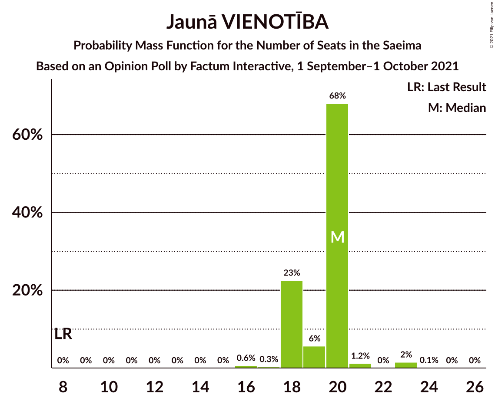
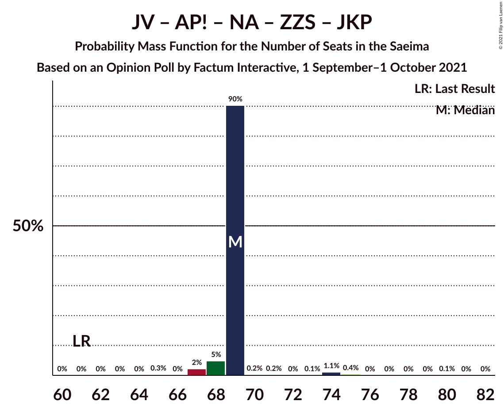
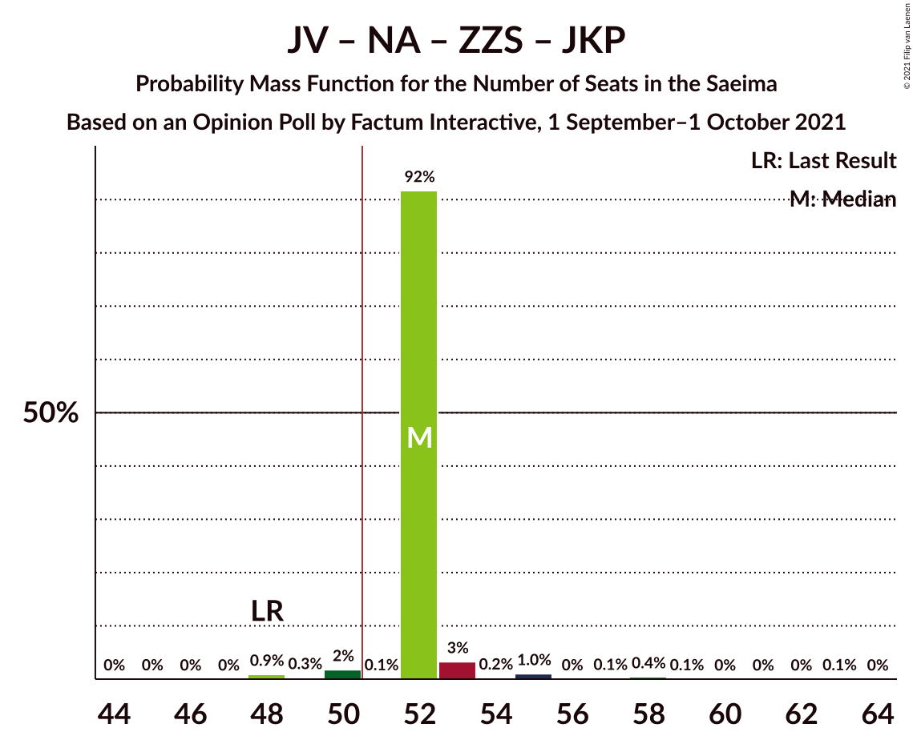
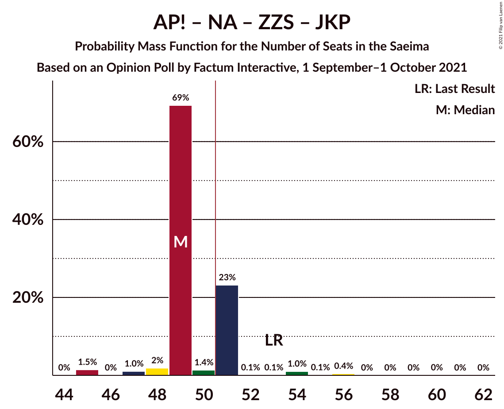
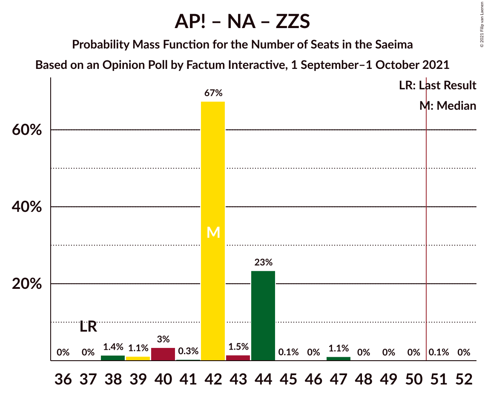
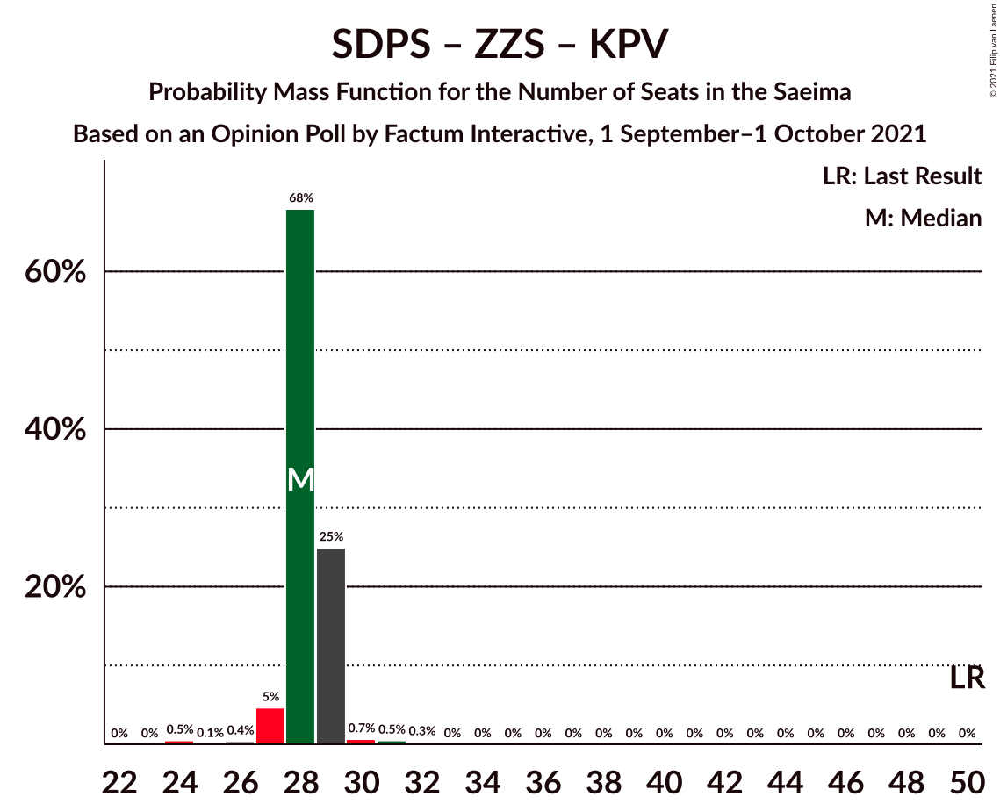

# Opinion Poll by Factum Interactive, 1 September–1 October 2021

<a href="#voting-intentions">Voting Intentions</a> | <a href="#seats">Seats</a> | <a href="#coalitions">Coalitions</a> | <a href="#technical-information">Technical Information</a>

## Voting Intentions

### Confidence Intervals

| Party | Last Result | Poll Result | 80% Confidence Interval | 90% Confidence Interval | 95% Confidence Interval | 99% Confidence Interval |
|:-----:|:-----------:|:-----------:|:-----------------------:|:-----------------------:|:-----------------------:|:-----------------------:|
| Jaunā VIENOTĪBA | 6.7% | 15.5% | 14.2–16.9% |13.8–17.3% |13.5–17.7% |12.9–18.4% |
| Attīstībai/Par! | 12.0% | 14.8% | 13.5–16.2% |13.2–16.6% |12.9–16.9% |12.3–17.6% |
| Sociāldemokrātiskā partija “Saskaņa” | 19.8% | 13.4% | 12.2–14.8% |11.9–15.2% |11.6–15.5% |11.0–16.2% |
| Nacionālā apvienība „Visu Latvijai!”–„Tēvzemei un Brīvībai/LNNK” | 11.0% | 11.9% | 10.7–13.2% |10.4–13.5% |10.2–13.9% |9.6–14.5% |
| Zaļo un Zemnieku savienība | 9.9% | 8.5% | 7.5–9.6% |7.2–9.9% |7.0–10.2% |6.6–10.8% |
| Jaunā konservatīvā partija | 13.6% | 6.9% | 6.1–8.0% |5.8–8.3% |5.6–8.5% |5.2–9.1% |
| Likums un kārtība | 0.0% | 6.1% | 5.3–7.1% |5.0–7.3% |4.8–7.6% |4.5–8.1% |
| PROGRESĪVIE | 2.6% | 5.7% | 4.9–6.7% |4.7–7.0% |4.5–7.2% |4.2–7.7% |
| Latvijas Reģionu Apvienība | 4.1% | 4.0% | 3.4–4.9% |3.2–5.1% |3.0–5.3% |2.7–5.7% |
| Republika | 0.0% | 3.3% | 2.7–4.1% |2.6–4.3% |2.4–4.5% |2.2–4.9% |
| Latvija pirmajā vietā | 0.0% | 3.1% | 2.5–3.8% |2.4–4.0% |2.2–4.2% |2.0–4.6% |
| Latvijas Krievu savienība | 3.2% | 2.9% | 2.4–3.6% |2.2–3.9% |2.1–4.0% |1.8–4.4% |
| Politiskā partija „KPV LV” | 14.2% | 0.7% | 0.5–1.1% |0.4–1.2% |0.4–1.3% |0.3–1.6% |

*Note:* The poll result column reflects the actual value used in the calculations. Published results may vary slightly, and in addition be rounded to fewer digits.

## Seats

### Confidence Intervals

| Party | Last Result | Median | 80% Confidence Interval | 90% Confidence Interval | 95% Confidence Interval | 99% Confidence Interval |
|:-----:|:-----------:|:------:|:-----------------------:|:-----------------------:|:-----------------------:|:-----------------------:|
| <a href="#jaunā-vienotība">Jaunā VIENOTĪBA</a> | 8 | 20 | 18–20 |18–20 |18–21 |16–23 |
| <a href="#attīstībai/par!">Attīstībai/Par!</a> | 13 | 17 | 17 |17 |15–17 |15–20 |
| <a href="#sociāldemokrātiskā-partija-“saskaņa”">Sociāldemokrātiskā partija “Saskaņa”</a> | 23 | 17 | 17 |17–18 |17–18 |15–19 |
| <a href="#nacionālā-apvienība-„visu-latvijai!”–„tēvzemei-un-brīvībai/lnnk”">Nacionālā apvienība „Visu Latvijai!”–„Tēvzemei un Brīvībai/LNNK”</a> | 13 | 14 | 14–15 |14–15 |13–16 |11–17 |
| <a href="#zaļo-un-zemnieku-savienība">Zaļo un Zemnieku savienība</a> | 11 | 11 | 11–12 |9–12 |9–12 |9–13 |
| <a href="#jaunā-konservatīvā-partija">Jaunā konservatīvā partija</a> | 16 | 7 | 7 |7 |7–9 |7–9 |
| <a href="#likums-un-kārtība">Likums un kārtība</a> | 0 | 7 | 7 |7 |7–8 |7–9 |
| <a href="#progresīvie">PROGRESĪVIE</a> | 0 | 7 | 7 |7 |7 |0–9 |
| <a href="#latvijas-reģionu-apvienība">Latvijas Reģionu Apvienība</a> | 0 | 0 | 0 |0 |0 |0 |
| <a href="#republika">Republika</a> | 0 | 0 | 0 |0 |0 |0 |
| <a href="#latvija-pirmajā-vietā">Latvija pirmajā vietā</a> | 0 | 0 | 0 |0 |0 |0 |
| <a href="#latvijas-krievu-savienība">Latvijas Krievu savienība</a> | 0 | 0 | 0 |0 |0 |0 |
| <a href="#politiskā-partija-„kpv-lv”">Politiskā partija „KPV LV”</a> | 16 | 0 | 0 |0 |0 |0 |

### Jaunā VIENOTĪBA

*For a full overview of the results for this party, see the [Jaunā VIENOTĪBA](party-jaunāvienotība.html) page.*

| Number of Seats | Probability | Accumulated | Special Marks |
|:---------------:|:-----------:|:-----------:|:-------------:|
| 8 | 0% | 100% | Last Result |
| 9 | 0% | 100% |  |
| 10 | 0% | 100% |  |
| 11 | 0% | 100% |  |
| 12 | 0% | 100% |  |
| 13 | 0% | 100% |  |
| 14 | 0% | 100% |  |
| 15 | 0% | 100% |  |
| 16 | 0.6% | 100% |  |
| 17 | 0.3% | 99.3% |  |
| 18 | 23% | 99.0% |  |
| 19 | 6% | 76% |  |
| 20 | 68% | 71% | Median |
| 21 | 1.2% | 3% |  |
| 22 | 0% | 2% |  |
| 23 | 2% | 2% |  |
| 24 | 0.1% | 0.1% |  |
| 25 | 0% | 0% |  |

### Attīstībai/Par!

*For a full overview of the results for this party, see the [Attīstībai/Par!](party-attīstībaipar.html) page.*

| Number of Seats | Probability | Accumulated | Special Marks |
|:---------------:|:-----------:|:-----------:|:-------------:|
| 13 | 0% | 100% | Last Result |
| 14 | 0% | 100% |  |
| 15 | 3% | 100% |  |
| 16 | 2% | 97% |  |
| 17 | 93% | 95% | Median |
| 18 | 0.1% | 2% |  |
| 19 | 1.4% | 2% |  |
| 20 | 0.5% | 0.6% |  |
| 21 | 0.1% | 0.1% |  |
| 22 | 0% | 0% |  |

### Sociāldemokrātiskā partija “Saskaņa”

*For a full overview of the results for this party, see the [Sociāldemokrātiskā partija “Saskaņa”](party-sociāldemokrātiskāpartija“saskaņa”.html) page.*

| Number of Seats | Probability | Accumulated | Special Marks |
|:---------------:|:-----------:|:-----------:|:-------------:|
| 15 | 0.6% | 100% |  |
| 16 | 0.3% | 99.4% |  |
| 17 | 91% | 99.1% | Median |
| 18 | 7% | 8% |  |
| 19 | 0.7% | 1.1% |  |
| 20 | 0.2% | 0.4% |  |
| 21 | 0.2% | 0.3% |  |
| 22 | 0% | 0% |  |
| 23 | 0% | 0% | Last Result |

### Nacionālā apvienība „Visu Latvijai!”–„Tēvzemei un Brīvībai/LNNK”

*For a full overview of the results for this party, see the [Nacionālā apvienība „Visu Latvijai!”–„Tēvzemei un Brīvībai/LNNK”](party-nacionālāapvienība„visulatvijai”–„tēvzemeiunbrīvībailnnk”.html) page.*

| Number of Seats | Probability | Accumulated | Special Marks |
|:---------------:|:-----------:|:-----------:|:-------------:|
| 11 | 0.5% | 100% |  |
| 12 | 0% | 99.5% |  |
| 13 | 3% | 99.5% | Last Result |
| 14 | 69% | 97% | Median |
| 15 | 24% | 28% |  |
| 16 | 3% | 4% |  |
| 17 | 1.0% | 1.1% |  |
| 18 | 0% | 0.1% |  |
| 19 | 0.1% | 0.1% |  |
| 20 | 0% | 0% |  |

### Zaļo un Zemnieku savienība

*For a full overview of the results for this party, see the [Zaļo un Zemnieku savienība](party-zaļounzemniekusavienība.html) page.*

| Number of Seats | Probability | Accumulated | Special Marks |
|:---------------:|:-----------:|:-----------:|:-------------:|
| 7 | 0.5% | 100% |  |
| 8 | 0% | 99.5% |  |
| 9 | 5% | 99.5% |  |
| 10 | 0% | 95% |  |
| 11 | 72% | 95% | Last Result, Median |
| 12 | 23% | 23% |  |
| 13 | 0.6% | 0.6% |  |
| 14 | 0% | 0% |  |

### Jaunā konservatīvā partija

*For a full overview of the results for this party, see the [Jaunā konservatīvā partija](party-jaunākonservatīvāpartija.html) page.*

| Number of Seats | Probability | Accumulated | Special Marks |
|:---------------:|:-----------:|:-----------:|:-------------:|
| 7 | 96% | 100% | Median |
| 8 | 0.6% | 4% |  |
| 9 | 3% | 4% |  |
| 10 | 0.1% | 0.5% |  |
| 11 | 0.1% | 0.4% |  |
| 12 | 0.4% | 0.4% |  |
| 13 | 0% | 0% |  |
| 14 | 0% | 0% |  |
| 15 | 0% | 0% |  |
| 16 | 0% | 0% | Last Result |

### Likums un kārtība

*For a full overview of the results for this party, see the [Likums un kārtība](party-likumsunkārtība.html) page.*

| Number of Seats | Probability | Accumulated | Special Marks |
|:---------------:|:-----------:|:-----------:|:-------------:|
| 0 | 0.3% | 100% | Last Result |
| 1 | 0% | 99.7% |  |
| 2 | 0% | 99.7% |  |
| 3 | 0% | 99.7% |  |
| 4 | 0% | 99.7% |  |
| 5 | 0% | 99.7% |  |
| 6 | 0% | 99.7% |  |
| 7 | 97% | 99.7% | Median |
| 8 | 2% | 3% |  |
| 9 | 0.6% | 0.7% |  |
| 10 | 0.1% | 0.2% |  |
| 11 | 0.1% | 0.1% |  |
| 12 | 0% | 0% |  |

### PROGRESĪVIE

*For a full overview of the results for this party, see the [PROGRESĪVIE](party-progresīvie.html) page.*

| Number of Seats | Probability | Accumulated | Special Marks |
|:---------------:|:-----------:|:-----------:|:-------------:|
| 0 | 2% | 100% | Last Result |
| 1 | 0% | 98% |  |
| 2 | 0% | 98% |  |
| 3 | 0% | 98% |  |
| 4 | 0% | 98% |  |
| 5 | 0% | 98% |  |
| 6 | 0.1% | 98% |  |
| 7 | 97% | 98% | Median |
| 8 | 0.2% | 0.8% |  |
| 9 | 0.6% | 0.6% |  |
| 10 | 0% | 0% |  |

### Latvijas Reģionu Apvienība

*For a full overview of the results for this party, see the [Latvijas Reģionu Apvienība](party-latvijasreģionuapvienība.html) page.*

| Number of Seats | Probability | Accumulated | Special Marks |
|:---------------:|:-----------:|:-----------:|:-------------:|
| 0 | 99.7% | 100% | Last Result, Median |
| 1 | 0% | 0.3% |  |
| 2 | 0% | 0.3% |  |
| 3 | 0% | 0.3% |  |
| 4 | 0% | 0.3% |  |
| 5 | 0% | 0.3% |  |
| 6 | 0.3% | 0.3% |  |
| 7 | 0% | 0% |  |

### Republika

*For a full overview of the results for this party, see the [Republika](party-republika.html) page.*

| Number of Seats | Probability | Accumulated | Special Marks |
|:---------------:|:-----------:|:-----------:|:-------------:|
| 0 | 100% | 100% | Last Result, Median |

### Latvija pirmajā vietā

*For a full overview of the results for this party, see the [Latvija pirmajā vietā](party-latvijapirmajāvietā.html) page.*

| Number of Seats | Probability | Accumulated | Special Marks |
|:---------------:|:-----------:|:-----------:|:-------------:|
| 0 | 100% | 100% | Last Result, Median |

### Latvijas Krievu savienība

*For a full overview of the results for this party, see the [Latvijas Krievu savienība](party-latvijaskrievusavienība.html) page.*

| Number of Seats | Probability | Accumulated | Special Marks |
|:---------------:|:-----------:|:-----------:|:-------------:|
| 0 | 100% | 100% | Last Result, Median |

### Politiskā partija „KPV LV”

*For a full overview of the results for this party, see the [Politiskā partija „KPV LV”](party-politiskāpartija„kpvlv”.html) page.*

| Number of Seats | Probability | Accumulated | Special Marks |
|:---------------:|:-----------:|:-----------:|:-------------:|
| 0 | 100% | 100% | Median |
| 1 | 0% | 0% |  |
| 2 | 0% | 0% |  |
| 3 | 0% | 0% |  |
| 4 | 0% | 0% |  |
| 5 | 0% | 0% |  |
| 6 | 0% | 0% |  |
| 7 | 0% | 0% |  |
| 8 | 0% | 0% |  |
| 9 | 0% | 0% |  |
| 10 | 0% | 0% |  |
| 11 | 0% | 0% |  |
| 12 | 0% | 0% |  |
| 13 | 0% | 0% |  |
| 14 | 0% | 0% |  |
| 15 | 0% | 0% |  |
| 16 | 0% | 0% | Last Result |

## Coalitions

### Confidence Intervals

| Coalition | Last Result | Median | Majority? | 80% Confidence Interval | 90% Confidence Interval | 95% Confidence Interval | 99% Confidence Interval |
|:---------:|:-----------:|:------:|:---------:|:-----------------------:|:-----------------------:|:-----------------------:|:-----------------------:|
| Jaunā VIENOTĪBA – Attīstībai/Par! – Nacionālā apvienība „Visu Latvijai!”–„Tēvzemei un Brīvībai/LNNK” – Zaļo un Zemnieku savienība – Jaunā konservatīvā partija | 61 | 69 | 100% | 69 | 68–69 | 67–69 | 67–75 |
| Jaunā VIENOTĪBA – Attīstībai/Par! – Nacionālā apvienība „Visu Latvijai!”–„Tēvzemei un Brīvībai/LNNK” – Zaļo un Zemnieku savienība | 45 | 62 | 100% | 62 | 61–62 | 59–62 | 58–67 |
| Jaunā VIENOTĪBA – Attīstībai/Par! – Nacionālā apvienība „Visu Latvijai!”–„Tēvzemei un Brīvībai/LNNK” – Jaunā konservatīvā partija | 50 | 58 | 100% | 57–58 | 57–59 | 57–59 | 55–63 |
| Jaunā VIENOTĪBA – Attīstībai/Par! – Nacionālā apvienība „Visu Latvijai!”–„Tēvzemei un Brīvībai/LNNK” – Jaunā konservatīvā partija – Politiskā partija „KPV LV” | 66 | 58 | 100% | 57–58 | 57–59 | 57–59 | 55–63 |
| Jaunā VIENOTĪBA – Nacionālā apvienība „Visu Latvijai!”–„Tēvzemei un Brīvībai/LNNK” – Zaļo un Zemnieku savienība – Jaunā konservatīvā partija | 48 | 52 | 97% | 52 | 52–53 | 50–53 | 48–58 |
| Jaunā VIENOTĪBA – Attīstībai/Par! – Nacionālā apvienība „Visu Latvijai!”–„Tēvzemei un Brīvībai/LNNK” – Politiskā partija „KPV LV” | 50 | 51 | 72% | 50–51 | 50–51 | 50–52 | 48–56 |
| Attīstībai/Par! – Nacionālā apvienība „Visu Latvijai!”–„Tēvzemei un Brīvībai/LNNK” – Zaļo un Zemnieku savienība – Jaunā konservatīvā partija | 53 | 49 | 25% | 49–51 | 49–51 | 47–51 | 45–56 |
| Jaunā VIENOTĪBA – Nacionālā apvienība „Visu Latvijai!”–„Tēvzemei un Brīvībai/LNNK” – Zaļo un Zemnieku savienība | 32 | 45 | 0.1% | 45 | 44–45 | 43–46 | 40–48 |
| Jaunā VIENOTĪBA – Attīstībai/Par! – Jaunā konservatīvā partija – Politiskā partija „KPV LV” | 53 | 44 | 0% | 42–44 | 42–45 | 42–46 | 40–48 |
| Attīstībai/Par! – Sociāldemokrātiskā partija “Saskaņa” – Jaunā konservatīvā partija | 52 | 41 | 0% | 41 | 41–42 | 41–44 | 39–47 |
| Jaunā VIENOTĪBA – Nacionālā apvienība „Visu Latvijai!”–„Tēvzemei un Brīvībai/LNNK” – Jaunā konservatīvā partija – Politiskā partija „KPV LV” | 53 | 41 | 0.1% | 40–41 | 40–43 | 40–44 | 37–45 |
| Attīstībai/Par! – Nacionālā apvienība „Visu Latvijai!”–„Tēvzemei un Brīvībai/LNNK” – Zaļo un Zemnieku savienība | 37 | 42 | 0.1% | 42–44 | 40–44 | 39–44 | 38–47 |
| Attīstībai/Par! – Nacionālā apvienība „Visu Latvijai!”–„Tēvzemei un Brīvībai/LNNK” – Jaunā konservatīvā partija – Politiskā partija „KPV LV” | 58 | 38 | 0% | 38–39 | 38–39 | 36–40 | 36–43 |
| Attīstībai/Par! – Sociāldemokrātiskā partija “Saskaņa” | 36 | 34 | 0% | 34 | 34 | 33–36 | 32–38 |
| Nacionālā apvienība „Visu Latvijai!”–„Tēvzemei un Brīvībai/LNNK” – Zaļo un Zemnieku savienība – Jaunā konservatīvā partija | 40 | 32 | 0% | 32–34 | 32–34 | 31–34 | 29–38 |
| Sociāldemokrātiskā partija “Saskaņa” – Zaļo un Zemnieku savienība – Politiskā partija „KPV LV” | 50 | 28 | 0% | 28–29 | 27–29 | 27–29 | 24–31 |
| Sociāldemokrātiskā partija “Saskaņa” – Politiskā partija „KPV LV” | 39 | 17 | 0% | 17 | 17–18 | 17–18 | 15–19 |

### Jaunā VIENOTĪBA – Attīstībai/Par! – Nacionālā apvienība „Visu Latvijai!”–„Tēvzemei un Brīvībai/LNNK” – Zaļo un Zemnieku savienība – Jaunā konservatīvā partija

| Number of Seats | Probability | Accumulated | Special Marks |
|:---------------:|:-----------:|:-----------:|:-------------:|
| 61 | 0% | 100% | Last Result |
| 62 | 0% | 99.9% |  |
| 63 | 0% | 99.9% |  |
| 64 | 0% | 99.9% |  |
| 65 | 0.3% | 99.8% |  |
| 66 | 0% | 99.5% |  |
| 67 | 2% | 99.5% |  |
| 68 | 5% | 97% |  |
| 69 | 90% | 92% | Median |
| 70 | 0.2% | 2% |  |
| 71 | 0.2% | 2% |  |
| 72 | 0% | 2% |  |
| 73 | 0.1% | 2% |  |
| 74 | 1.1% | 2% |  |
| 75 | 0.4% | 0.5% |  |
| 76 | 0% | 0.1% |  |
| 77 | 0% | 0.1% |  |
| 78 | 0% | 0.1% |  |
| 79 | 0% | 0.1% |  |
| 80 | 0.1% | 0.1% |  |
| 81 | 0% | 0% |  |

### Jaunā VIENOTĪBA – Attīstībai/Par! – Nacionālā apvienība „Visu Latvijai!”–„Tēvzemei un Brīvībai/LNNK” – Zaļo un Zemnieku savienība

| Number of Seats | Probability | Accumulated | Special Marks |
|:---------------:|:-----------:|:-----------:|:-------------:|
| 45 | 0% | 100% | Last Result |
| 46 | 0% | 100% |  |
| 47 | 0% | 100% |  |
| 48 | 0% | 100% |  |
| 49 | 0% | 100% |  |
| 50 | 0% | 100% |  |
| 51 | 0% | 100% | Majority |
| 52 | 0% | 100% |  |
| 53 | 0% | 100% |  |
| 54 | 0% | 100% |  |
| 55 | 0% | 99.9% |  |
| 56 | 0% | 99.9% |  |
| 57 | 0% | 99.8% |  |
| 58 | 1.4% | 99.8% |  |
| 59 | 2% | 98% |  |
| 60 | 0.6% | 96% |  |
| 61 | 3% | 95% |  |
| 62 | 90% | 92% | Median |
| 63 | 0.8% | 2% |  |
| 64 | 0% | 1.3% |  |
| 65 | 0.1% | 1.3% |  |
| 66 | 0.1% | 1.2% |  |
| 67 | 1.0% | 1.1% |  |
| 68 | 0.1% | 0.2% |  |
| 69 | 0% | 0.1% |  |
| 70 | 0% | 0.1% |  |
| 71 | 0.1% | 0.1% |  |
| 72 | 0% | 0% |  |

### Jaunā VIENOTĪBA – Attīstībai/Par! – Nacionālā apvienība „Visu Latvijai!”–„Tēvzemei un Brīvībai/LNNK” – Jaunā konservatīvā partija

| Number of Seats | Probability | Accumulated | Special Marks |
|:---------------:|:-----------:|:-----------:|:-------------:|
| 50 | 0% | 100% | Last Result |
| 51 | 0% | 100% | Majority |
| 52 | 0% | 99.9% |  |
| 53 | 0.1% | 99.9% |  |
| 54 | 0.2% | 99.8% |  |
| 55 | 0.1% | 99.6% |  |
| 56 | 0.6% | 99.4% |  |
| 57 | 24% | 98.8% |  |
| 58 | 69% | 75% | Median |
| 59 | 4% | 6% |  |
| 60 | 0.5% | 2% |  |
| 61 | 0% | 2% |  |
| 62 | 0.5% | 2% |  |
| 63 | 1.1% | 1.2% |  |
| 64 | 0% | 0.2% |  |
| 65 | 0% | 0.1% |  |
| 66 | 0% | 0.1% |  |
| 67 | 0% | 0.1% |  |
| 68 | 0% | 0.1% |  |
| 69 | 0.1% | 0.1% |  |
| 70 | 0% | 0% |  |

### Jaunā VIENOTĪBA – Attīstībai/Par! – Nacionālā apvienība „Visu Latvijai!”–„Tēvzemei un Brīvībai/LNNK” – Jaunā konservatīvā partija – Politiskā partija „KPV LV”

| Number of Seats | Probability | Accumulated | Special Marks |
|:---------------:|:-----------:|:-----------:|:-------------:|
| 51 | 0% | 100% | Majority |
| 52 | 0% | 99.9% |  |
| 53 | 0.1% | 99.9% |  |
| 54 | 0.2% | 99.8% |  |
| 55 | 0.1% | 99.6% |  |
| 56 | 0.6% | 99.4% |  |
| 57 | 24% | 98.8% |  |
| 58 | 69% | 75% | Median |
| 59 | 4% | 6% |  |
| 60 | 0.5% | 2% |  |
| 61 | 0% | 2% |  |
| 62 | 0.5% | 2% |  |
| 63 | 1.1% | 1.2% |  |
| 64 | 0% | 0.2% |  |
| 65 | 0% | 0.1% |  |
| 66 | 0% | 0.1% | Last Result |
| 67 | 0% | 0.1% |  |
| 68 | 0% | 0.1% |  |
| 69 | 0.1% | 0.1% |  |
| 70 | 0% | 0% |  |

### Jaunā VIENOTĪBA – Nacionālā apvienība „Visu Latvijai!”–„Tēvzemei un Brīvībai/LNNK” – Zaļo un Zemnieku savienība – Jaunā konservatīvā partija

| Number of Seats | Probability | Accumulated | Special Marks |
|:---------------:|:-----------:|:-----------:|:-------------:|
| 44 | 0% | 100% |  |
| 45 | 0% | 99.9% |  |
| 46 | 0% | 99.9% |  |
| 47 | 0% | 99.9% |  |
| 48 | 0.9% | 99.9% | Last Result |
| 49 | 0.3% | 99.0% |  |
| 50 | 2% | 98.7% |  |
| 51 | 0.1% | 97% | Majority |
| 52 | 92% | 97% | Median |
| 53 | 3% | 5% |  |
| 54 | 0.2% | 2% |  |
| 55 | 1.0% | 2% |  |
| 56 | 0% | 0.7% |  |
| 57 | 0.1% | 0.7% |  |
| 58 | 0.4% | 0.6% |  |
| 59 | 0.1% | 0.1% |  |
| 60 | 0% | 0.1% |  |
| 61 | 0% | 0.1% |  |
| 62 | 0% | 0.1% |  |
| 63 | 0.1% | 0.1% |  |
| 64 | 0% | 0% |  |

### Jaunā VIENOTĪBA – Attīstībai/Par! – Nacionālā apvienība „Visu Latvijai!”–„Tēvzemei un Brīvībai/LNNK” – Politiskā partija „KPV LV”

| Number of Seats | Probability | Accumulated | Special Marks |
|:---------------:|:-----------:|:-----------:|:-------------:|
| 44 | 0.1% | 100% |  |
| 45 | 0% | 99.9% |  |
| 46 | 0.1% | 99.9% |  |
| 47 | 0.3% | 99.8% |  |
| 48 | 0.1% | 99.5% |  |
| 49 | 2% | 99.4% |  |
| 50 | 26% | 98% | Last Result |
| 51 | 68% | 72% | Median, Majority |
| 52 | 2% | 3% |  |
| 53 | 0.1% | 1.4% |  |
| 54 | 0.1% | 1.3% |  |
| 55 | 0.1% | 1.2% |  |
| 56 | 1.0% | 1.1% |  |
| 57 | 0% | 0.1% |  |
| 58 | 0% | 0.1% |  |
| 59 | 0% | 0.1% |  |
| 60 | 0.1% | 0.1% |  |
| 61 | 0% | 0% |  |

### Attīstībai/Par! – Nacionālā apvienība „Visu Latvijai!”–„Tēvzemei un Brīvībai/LNNK” – Zaļo un Zemnieku savienība – Jaunā konservatīvā partija

| Number of Seats | Probability | Accumulated | Special Marks |
|:---------------:|:-----------:|:-----------:|:-------------:|
| 44 | 0% | 100% |  |
| 45 | 1.5% | 99.9% |  |
| 46 | 0% | 98% |  |
| 47 | 1.0% | 98% |  |
| 48 | 2% | 97% |  |
| 49 | 69% | 96% | Median |
| 50 | 1.4% | 26% |  |
| 51 | 23% | 25% | Majority |
| 52 | 0.1% | 2% |  |
| 53 | 0.1% | 2% | Last Result |
| 54 | 1.0% | 2% |  |
| 55 | 0.1% | 0.6% |  |
| 56 | 0.4% | 0.5% |  |
| 57 | 0% | 0.1% |  |
| 58 | 0% | 0.1% |  |
| 59 | 0% | 0.1% |  |
| 60 | 0% | 0.1% |  |
| 61 | 0% | 0% |  |

### Jaunā VIENOTĪBA – Nacionālā apvienība „Visu Latvijai!”–„Tēvzemei un Brīvībai/LNNK” – Zaļo un Zemnieku savienība

| Number of Seats | Probability | Accumulated | Special Marks |
|:---------------:|:-----------:|:-----------:|:-------------:|
| 32 | 0% | 100% | Last Result |
| 33 | 0% | 100% |  |
| 34 | 0% | 100% |  |
| 35 | 0% | 100% |  |
| 36 | 0% | 100% |  |
| 37 | 0% | 100% |  |
| 38 | 0% | 99.9% |  |
| 39 | 0% | 99.9% |  |
| 40 | 0.4% | 99.9% |  |
| 41 | 2% | 99.4% |  |
| 42 | 0.3% | 98% |  |
| 43 | 0.7% | 98% |  |
| 44 | 2% | 97% |  |
| 45 | 92% | 95% | Median |
| 46 | 2% | 3% |  |
| 47 | 0.1% | 1.3% |  |
| 48 | 1.0% | 1.2% |  |
| 49 | 0% | 0.2% |  |
| 50 | 0.1% | 0.2% |  |
| 51 | 0% | 0.1% | Majority |
| 52 | 0% | 0.1% |  |
| 53 | 0% | 0.1% |  |
| 54 | 0.1% | 0.1% |  |
| 55 | 0% | 0% |  |

### Jaunā VIENOTĪBA – Attīstībai/Par! – Jaunā konservatīvā partija – Politiskā partija „KPV LV”

| Number of Seats | Probability | Accumulated | Special Marks |
|:---------------:|:-----------:|:-----------:|:-------------:|
| 39 | 0% | 100% |  |
| 40 | 0.8% | 99.9% |  |
| 41 | 0.1% | 99.1% |  |
| 42 | 23% | 99.0% |  |
| 43 | 4% | 76% |  |
| 44 | 67% | 72% | Median |
| 45 | 1.5% | 5% |  |
| 46 | 3% | 4% |  |
| 47 | 0.1% | 0.7% |  |
| 48 | 0.4% | 0.6% |  |
| 49 | 0% | 0.2% |  |
| 50 | 0.1% | 0.1% |  |
| 51 | 0% | 0% | Majority |
| 52 | 0% | 0% |  |
| 53 | 0% | 0% | Last Result |

### Attīstībai/Par! – Sociāldemokrātiskā partija “Saskaņa” – Jaunā konservatīvā partija

| Number of Seats | Probability | Accumulated | Special Marks |
|:---------------:|:-----------:|:-----------:|:-------------:|
| 38 | 0.2% | 100% |  |
| 39 | 0.4% | 99.8% |  |
| 40 | 1.2% | 99.4% |  |
| 41 | 92% | 98% | Median |
| 42 | 2% | 7% |  |
| 43 | 0.7% | 5% |  |
| 44 | 3% | 4% |  |
| 45 | 0.5% | 1.1% |  |
| 46 | 0.1% | 0.6% |  |
| 47 | 0.4% | 0.5% |  |
| 48 | 0% | 0.1% |  |
| 49 | 0% | 0.1% |  |
| 50 | 0.1% | 0.1% |  |
| 51 | 0% | 0% | Majority |
| 52 | 0% | 0% | Last Result |

### Jaunā VIENOTĪBA – Nacionālā apvienība „Visu Latvijai!”–„Tēvzemei un Brīvībai/LNNK” – Jaunā konservatīvā partija – Politiskā partija „KPV LV”

| Number of Seats | Probability | Accumulated | Special Marks |
|:---------------:|:-----------:|:-----------:|:-------------:|
| 35 | 0% | 100% |  |
| 36 | 0.1% | 99.9% |  |
| 37 | 0.4% | 99.8% |  |
| 38 | 0.3% | 99.4% |  |
| 39 | 0.6% | 99.2% |  |
| 40 | 23% | 98.6% |  |
| 41 | 69% | 76% | Median |
| 42 | 1.4% | 7% |  |
| 43 | 2% | 5% |  |
| 44 | 3% | 4% |  |
| 45 | 0.4% | 0.7% |  |
| 46 | 0.1% | 0.3% |  |
| 47 | 0.1% | 0.1% |  |
| 48 | 0% | 0.1% |  |
| 49 | 0% | 0.1% |  |
| 50 | 0% | 0.1% |  |
| 51 | 0% | 0.1% | Majority |
| 52 | 0.1% | 0.1% |  |
| 53 | 0% | 0% | Last Result |

### Attīstībai/Par! – Nacionālā apvienība „Visu Latvijai!”–„Tēvzemei un Brīvībai/LNNK” – Zaļo un Zemnieku savienība

| Number of Seats | Probability | Accumulated | Special Marks |
|:---------------:|:-----------:|:-----------:|:-------------:|
| 36 | 0% | 100% |  |
| 37 | 0% | 99.9% | Last Result |
| 38 | 1.4% | 99.9% |  |
| 39 | 1.1% | 98% |  |
| 40 | 3% | 97% |  |
| 41 | 0.3% | 94% |  |
| 42 | 67% | 94% | Median |
| 43 | 1.5% | 26% |  |
| 44 | 23% | 25% |  |
| 45 | 0.1% | 1.2% |  |
| 46 | 0% | 1.2% |  |
| 47 | 1.1% | 1.1% |  |
| 48 | 0% | 0.1% |  |
| 49 | 0% | 0.1% |  |
| 50 | 0% | 0.1% |  |
| 51 | 0.1% | 0.1% | Majority |
| 52 | 0% | 0% |  |

### Attīstībai/Par! – Nacionālā apvienība „Visu Latvijai!”–„Tēvzemei un Brīvībai/LNNK” – Jaunā konservatīvā partija – Politiskā partija „KPV LV”

| Number of Seats | Probability | Accumulated | Special Marks |
|:---------------:|:-----------:|:-----------:|:-------------:|
| 34 | 0% | 100% |  |
| 35 | 0.2% | 99.9% |  |
| 36 | 2% | 99.8% |  |
| 37 | 0.3% | 97% |  |
| 38 | 67% | 97% | Median |
| 39 | 25% | 30% |  |
| 40 | 3% | 5% |  |
| 41 | 0.5% | 2% |  |
| 42 | 0% | 2% |  |
| 43 | 1.4% | 2% |  |
| 44 | 0.1% | 0.2% |  |
| 45 | 0.1% | 0.1% |  |
| 46 | 0% | 0.1% |  |
| 47 | 0% | 0.1% |  |
| 48 | 0.1% | 0.1% |  |
| 49 | 0% | 0% |  |
| 50 | 0% | 0% |  |
| 51 | 0% | 0% | Majority |
| 52 | 0% | 0% |  |
| 53 | 0% | 0% |  |
| 54 | 0% | 0% |  |
| 55 | 0% | 0% |  |
| 56 | 0% | 0% |  |
| 57 | 0% | 0% |  |
| 58 | 0% | 0% | Last Result |

### Attīstībai/Par! – Sociāldemokrātiskā partija “Saskaņa”

| Number of Seats | Probability | Accumulated | Special Marks |
|:---------------:|:-----------:|:-----------:|:-------------:|
| 31 | 0.2% | 100% |  |
| 32 | 0.6% | 99.8% |  |
| 33 | 3% | 99.2% |  |
| 34 | 92% | 96% | Median |
| 35 | 2% | 5% |  |
| 36 | 1.1% | 3% | Last Result |
| 37 | 1.3% | 2% |  |
| 38 | 0.5% | 0.6% |  |
| 39 | 0% | 0.1% |  |
| 40 | 0% | 0.1% |  |
| 41 | 0.1% | 0.1% |  |
| 42 | 0% | 0% |  |

### Nacionālā apvienība „Visu Latvijai!”–„Tēvzemei un Brīvībai/LNNK” – Zaļo un Zemnieku savienība – Jaunā konservatīvā partija

| Number of Seats | Probability | Accumulated | Special Marks |
|:---------------:|:-----------:|:-----------:|:-------------:|
| 27 | 0% | 100% |  |
| 28 | 0% | 99.9% |  |
| 29 | 2% | 99.9% |  |
| 30 | 0% | 98% |  |
| 31 | 1.2% | 98% |  |
| 32 | 68% | 96% | Median |
| 33 | 1.4% | 28% |  |
| 34 | 25% | 27% |  |
| 35 | 1.0% | 2% |  |
| 36 | 0.1% | 0.7% |  |
| 37 | 0% | 0.6% |  |
| 38 | 0.1% | 0.6% |  |
| 39 | 0.5% | 0.5% |  |
| 40 | 0% | 0% | Last Result |

### Sociāldemokrātiskā partija “Saskaņa” – Zaļo un Zemnieku savienība – Politiskā partija „KPV LV”

| Number of Seats | Probability | Accumulated | Special Marks |
|:---------------:|:-----------:|:-----------:|:-------------:|
| 24 | 0.5% | 100% |  |
| 25 | 0.1% | 99.5% |  |
| 26 | 0.4% | 99.4% |  |
| 27 | 5% | 99.0% |  |
| 28 | 68% | 94% | Median |
| 29 | 25% | 26% |  |
| 30 | 0.7% | 2% |  |
| 31 | 0.5% | 0.8% |  |
| 32 | 0.3% | 0.3% |  |
| 33 | 0% | 0.1% |  |
| 34 | 0% | 0% |  |
| 35 | 0% | 0% |  |
| 36 | 0% | 0% |  |
| 37 | 0% | 0% |  |
| 38 | 0% | 0% |  |
| 39 | 0% | 0% |  |
| 40 | 0% | 0% |  |
| 41 | 0% | 0% |  |
| 42 | 0% | 0% |  |
| 43 | 0% | 0% |  |
| 44 | 0% | 0% |  |
| 45 | 0% | 0% |  |
| 46 | 0% | 0% |  |
| 47 | 0% | 0% |  |
| 48 | 0% | 0% |  |
| 49 | 0% | 0% |  |
| 50 | 0% | 0% | Last Result |

### Sociāldemokrātiskā partija “Saskaņa” – Politiskā partija „KPV LV”

| Number of Seats | Probability | Accumulated | Special Marks |
|:---------------:|:-----------:|:-----------:|:-------------:|
| 15 | 0.6% | 100% |  |
| 16 | 0.3% | 99.4% |  |
| 17 | 91% | 99.1% | Median |
| 18 | 7% | 8% |  |
| 19 | 0.7% | 1.1% |  |
| 20 | 0.2% | 0.4% |  |
| 21 | 0.2% | 0.3% |  |
| 22 | 0% | 0% |  |
| 23 | 0% | 0% |  |
| 24 | 0% | 0% |  |
| 25 | 0% | 0% |  |
| 26 | 0% | 0% |  |
| 27 | 0% | 0% |  |
| 28 | 0% | 0% |  |
| 29 | 0% | 0% |  |
| 30 | 0% | 0% |  |
| 31 | 0% | 0% |  |
| 32 | 0% | 0% |  |
| 33 | 0% | 0% |  |
| 34 | 0% | 0% |  |
| 35 | 0% | 0% |  |
| 36 | 0% | 0% |  |
| 37 | 0% | 0% |  |
| 38 | 0% | 0% |  |
| 39 | 0% | 0% | Last Result |

## Technical Information

### Opinion Poll

+ **Polling firm:** Factum Interactive
+ **Commissioner(s):** —
+ **Fieldwork period:** 1 September–1 October 2021

### Calculations

+ **Sample size:** 1170
+ **Simulations done:** 131,072
+ **Error estimate:** 1.52%

