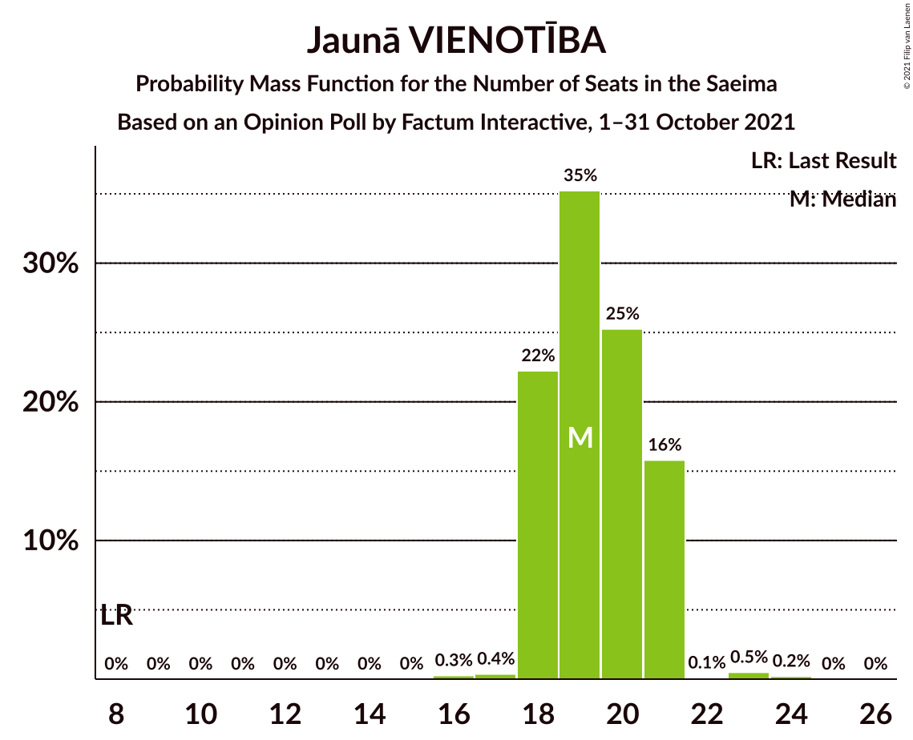
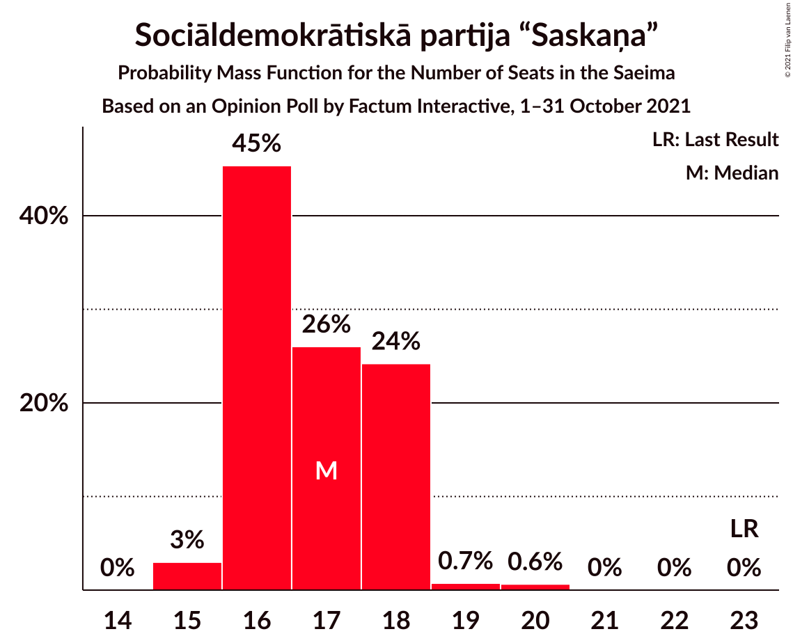
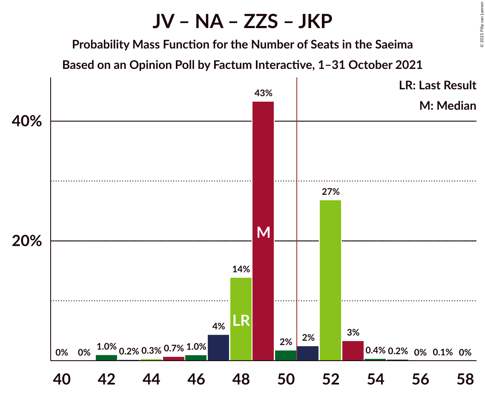

# Opinion Poll by Factum Interactive, 1–31 October 2021

<a href="#voting-intentions">Voting Intentions</a> | <a href="#seats">Seats</a> | <a href="#coalitions">Coalitions</a> | <a href="#technical-information">Technical Information</a>

## Voting Intentions

### Confidence Intervals

| Party | Last Result | Poll Result | 80% Confidence Interval | 90% Confidence Interval | 95% Confidence Interval | 99% Confidence Interval |
|:-----:|:-----------:|:-----------:|:-----------------------:|:-----------------------:|:-----------------------:|:-----------------------:|
| Jaunā VIENOTĪBA | 6.7% | 15.9% | 14.8–17.0% |14.5–17.3% |14.3–17.6% |13.8–18.2% |
| Attīstībai/Par! | 12.0% | 14.1% | 13.1–15.2% |12.8–15.5% |12.6–15.8% |12.1–16.3% |
| Sociāldemokrātiskā partija “Saskaņa” | 19.8% | 12.6% | 11.7–13.7% |11.4–13.9% |11.2–14.2% |10.7–14.7% |
| Nacionālā apvienība „Visu Latvijai!”–„Tēvzemei un Brīvībai/LNNK” | 11.0% | 11.8% | 10.9–12.8% |10.6–13.1% |10.4–13.4% |10.0–13.9% |
| Zaļo un Zemnieku savienība | 9.9% | 9.0% | 8.2–9.9% |8.0–10.1% |7.8–10.4% |7.4–10.8% |
| PROGRESĪVIE | 2.6% | 6.4% | 5.7–7.2% |5.5–7.4% |5.4–7.6% |5.1–8.0% |
| Likums un kārtība | 0.0% | 6.4% | 5.7–7.2% |5.5–7.4% |5.4–7.6% |5.1–8.0% |
| Jaunā konservatīvā partija | 13.6% | 5.1% | 4.5–5.8% |4.3–6.0% |4.2–6.2% |3.9–6.5% |
| Latvija pirmajā vietā | 0.0% | 4.5% | 3.9–5.2% |3.8–5.4% |3.6–5.5% |3.4–5.9% |
| Latvijas Reģionu Apvienība | 4.1% | 3.8% | 3.3–4.4% |3.1–4.6% |3.0–4.8% |2.8–5.1% |
| Latvijas Krievu savienība | 3.2% | 3.5% | 3.0–4.1% |2.9–4.3% |2.7–4.4% |2.5–4.7% |
| Republika | 0.0% | 2.2% | 1.8–2.7% |1.7–2.8% |1.6–3.0% |1.4–3.2% |
| Politiskā partija „KPV LV” | 14.2% | 0.6% | 0.4–0.9% |0.4–1.0% |0.3–1.1% |0.3–1.2% |

*Note:* The poll result column reflects the actual value used in the calculations. Published results may vary slightly, and in addition be rounded to fewer digits.

## Seats

### Confidence Intervals

| Party | Last Result | Median | 80% Confidence Interval | 90% Confidence Interval | 95% Confidence Interval | 99% Confidence Interval |
|:-----:|:-----------:|:------:|:-----------------------:|:-----------------------:|:-----------------------:|:-----------------------:|
| <a href="#jaunā-vienotība">Jaunā VIENOTĪBA</a> | 8 | 18 | 18–19 |18–19 |18–19 |17–20 |
| <a href="#attīstībai/par!">Attīstībai/Par!</a> | 13 | 16 | 16–17 |16–17 |16–17 |16–18 |
| <a href="#sociāldemokrātiskā-partija-“saskaņa”">Sociāldemokrātiskā partija “Saskaņa”</a> | 23 | 18 | 16–18 |15–18 |15–18 |15–18 |
| <a href="#nacionālā-apvienība-„visu-latvijai!”–„tēvzemei-un-brīvībai/lnnk”">Nacionālā apvienība „Visu Latvijai!”–„Tēvzemei un Brīvībai/LNNK”</a> | 13 | 15 | 14–15 |12–15 |12–15 |11–16 |
| <a href="#zaļo-un-zemnieku-savienība">Zaļo un Zemnieku savienība</a> | 11 | 12 | 12 |10–12 |10–12 |10–12 |
| <a href="#progresīvie">PROGRESĪVIE</a> | 0 | 7 | 7 |7–8 |6–8 |6–9 |
| <a href="#likums-un-kārtība">Likums un kārtība</a> | 0 | 7 | 7 |7 |7–9 |6–9 |
| <a href="#jaunā-konservatīvā-partija">Jaunā konservatīvā partija</a> | 16 | 7 | 7 |7 |7 |0–7 |
| <a href="#latvija-pirmajā-vietā">Latvija pirmajā vietā</a> | 0 | 0 | 0 |0–7 |0–7 |0–7 |
| <a href="#latvijas-reģionu-apvienība">Latvijas Reģionu Apvienība</a> | 0 | 0 | 0 |0 |0 |0 |
| <a href="#latvijas-krievu-savienība">Latvijas Krievu savienība</a> | 0 | 0 | 0 |0 |0 |0 |
| <a href="#republika">Republika</a> | 0 | 0 | 0 |0 |0 |0 |
| <a href="#politiskā-partija-„kpv-lv”">Politiskā partija „KPV LV”</a> | 16 | 0 | 0 |0 |0 |0 |

### Jaunā VIENOTĪBA

*For a full overview of the results for this party, see the [Jaunā VIENOTĪBA](party-jaunāvienotība.html) page.*

| Number of Seats | Probability | Accumulated | Special Marks |
|:---------------:|:-----------:|:-----------:|:-------------:|
| 8 | 0% | 100% | Last Result |
| 9 | 0% | 100% |  |
| 10 | 0% | 100% |  |
| 11 | 0% | 100% |  |
| 12 | 0% | 100% |  |
| 13 | 0% | 100% |  |
| 14 | 0% | 100% |  |
| 15 | 0% | 100% |  |
| 16 | 0% | 100% |  |
| 17 | 1.0% | 100% |  |
| 18 | 85% | 99.0% | Median |
| 19 | 12% | 14% |  |
| 20 | 2% | 2% |  |
| 21 | 0.1% | 0.2% |  |
| 22 | 0% | 0.1% |  |
| 23 | 0% | 0.1% |  |
| 24 | 0.1% | 0.1% |  |
| 25 | 0% | 0% |  |

### Attīstībai/Par!

*For a full overview of the results for this party, see the [Attīstībai/Par!](party-attīstībaipar.html) page.*

| Number of Seats | Probability | Accumulated | Special Marks |
|:---------------:|:-----------:|:-----------:|:-------------:|
| 13 | 0% | 100% | Last Result |
| 14 | 0% | 100% |  |
| 15 | 0.1% | 100% |  |
| 16 | 88% | 99.9% | Median |
| 17 | 11% | 12% |  |
| 18 | 0.4% | 0.5% |  |
| 19 | 0% | 0.1% |  |
| 20 | 0.1% | 0.1% |  |
| 21 | 0% | 0% |  |

### Sociāldemokrātiskā partija “Saskaņa”

*For a full overview of the results for this party, see the [Sociāldemokrātiskā partija “Saskaņa”](party-sociāldemokrātiskāpartija“saskaņa”.html) page.*

| Number of Seats | Probability | Accumulated | Special Marks |
|:---------------:|:-----------:|:-----------:|:-------------:|
| 15 | 5% | 100% |  |
| 16 | 6% | 95% |  |
| 17 | 4% | 88% |  |
| 18 | 84% | 85% | Median |
| 19 | 0% | 0.3% |  |
| 20 | 0.3% | 0.3% |  |
| 21 | 0% | 0% |  |
| 22 | 0% | 0% |  |
| 23 | 0% | 0% | Last Result |

### Nacionālā apvienība „Visu Latvijai!”–„Tēvzemei un Brīvībai/LNNK”

*For a full overview of the results for this party, see the [Nacionālā apvienība „Visu Latvijai!”–„Tēvzemei un Brīvībai/LNNK”](party-nacionālāapvienība„visulatvijai”–„tēvzemeiunbrīvībailnnk”.html) page.*

| Number of Seats | Probability | Accumulated | Special Marks |
|:---------------:|:-----------:|:-----------:|:-------------:|
| 10 | 0.2% | 100% |  |
| 11 | 0.4% | 99.8% |  |
| 12 | 5% | 99.4% |  |
| 13 | 4% | 95% | Last Result |
| 14 | 6% | 91% |  |
| 15 | 84% | 84% | Median |
| 16 | 0.6% | 0.7% |  |
| 17 | 0% | 0.1% |  |
| 18 | 0% | 0.1% |  |
| 19 | 0% | 0.1% |  |
| 20 | 0.1% | 0.1% |  |
| 21 | 0% | 0% |  |

### Zaļo un Zemnieku savienība

*For a full overview of the results for this party, see the [Zaļo un Zemnieku savienība](party-zaļounzemniekusavienība.html) page.*

| Number of Seats | Probability | Accumulated | Special Marks |
|:---------------:|:-----------:|:-----------:|:-------------:|
| 8 | 0% | 100% |  |
| 9 | 0% | 99.9% |  |
| 10 | 5% | 99.9% |  |
| 11 | 4% | 95% | Last Result |
| 12 | 90% | 91% | Median |
| 13 | 0.3% | 0.3% |  |
| 14 | 0% | 0% |  |

### PROGRESĪVIE

*For a full overview of the results for this party, see the [PROGRESĪVIE](party-progresīvie.html) page.*

| Number of Seats | Probability | Accumulated | Special Marks |
|:---------------:|:-----------:|:-----------:|:-------------:|
| 0 | 0.1% | 100% | Last Result |
| 1 | 0% | 99.9% |  |
| 2 | 0% | 99.9% |  |
| 3 | 0% | 99.9% |  |
| 4 | 0% | 99.9% |  |
| 5 | 0% | 99.9% |  |
| 6 | 4% | 99.9% |  |
| 7 | 86% | 95% | Median |
| 8 | 8% | 9% |  |
| 9 | 0.8% | 0.8% |  |
| 10 | 0% | 0.1% |  |
| 11 | 0.1% | 0.1% |  |
| 12 | 0% | 0% |  |

### Likums un kārtība

*For a full overview of the results for this party, see the [Likums un kārtība](party-likumsunkārtība.html) page.*

| Number of Seats | Probability | Accumulated | Special Marks |
|:---------------:|:-----------:|:-----------:|:-------------:|
| 0 | 0% | 100% | Last Result |
| 1 | 0% | 100% |  |
| 2 | 0% | 100% |  |
| 3 | 0% | 100% |  |
| 4 | 0% | 100% |  |
| 5 | 0% | 100% |  |
| 6 | 0.7% | 100% |  |
| 7 | 95% | 99.3% | Median |
| 8 | 0.6% | 4% |  |
| 9 | 3% | 4% |  |
| 10 | 0.1% | 0.2% |  |
| 11 | 0.2% | 0.2% |  |
| 12 | 0% | 0% |  |

### Jaunā konservatīvā partija

*For a full overview of the results for this party, see the [Jaunā konservatīvā partija](party-jaunākonservatīvāpartija.html) page.*

| Number of Seats | Probability | Accumulated | Special Marks |
|:---------------:|:-----------:|:-----------:|:-------------:|
| 0 | 0.8% | 100% |  |
| 1 | 0% | 99.2% |  |
| 2 | 0% | 99.2% |  |
| 3 | 0% | 99.2% |  |
| 4 | 0% | 99.2% |  |
| 5 | 0% | 99.2% |  |
| 6 | 0% | 99.2% |  |
| 7 | 98.8% | 99.2% | Median |
| 8 | 0.4% | 0.4% |  |
| 9 | 0% | 0% |  |
| 10 | 0% | 0% |  |
| 11 | 0% | 0% |  |
| 12 | 0% | 0% |  |
| 13 | 0% | 0% |  |
| 14 | 0% | 0% |  |
| 15 | 0% | 0% |  |
| 16 | 0% | 0% | Last Result |

### Latvija pirmajā vietā

*For a full overview of the results for this party, see the [Latvija pirmajā vietā](party-latvijapirmajāvietā.html) page.*

| Number of Seats | Probability | Accumulated | Special Marks |
|:---------------:|:-----------:|:-----------:|:-------------:|
| 0 | 94% | 100% | Last Result, Median |
| 1 | 0% | 6% |  |
| 2 | 0% | 6% |  |
| 3 | 0% | 6% |  |
| 4 | 0% | 6% |  |
| 5 | 0% | 6% |  |
| 6 | 0.3% | 6% |  |
| 7 | 6% | 6% |  |
| 8 | 0% | 0% |  |

### Latvijas Reģionu Apvienība

*For a full overview of the results for this party, see the [Latvijas Reģionu Apvienība](party-latvijasreģionuapvienība.html) page.*

| Number of Seats | Probability | Accumulated | Special Marks |
|:---------------:|:-----------:|:-----------:|:-------------:|
| 0 | 99.8% | 100% | Last Result, Median |
| 1 | 0% | 0.2% |  |
| 2 | 0% | 0.2% |  |
| 3 | 0% | 0.2% |  |
| 4 | 0% | 0.2% |  |
| 5 | 0% | 0.2% |  |
| 6 | 0.2% | 0.2% |  |
| 7 | 0% | 0% |  |

### Latvijas Krievu savienība

*For a full overview of the results for this party, see the [Latvijas Krievu savienība](party-latvijaskrievusavienība.html) page.*

| Number of Seats | Probability | Accumulated | Special Marks |
|:---------------:|:-----------:|:-----------:|:-------------:|
| 0 | 100% | 100% | Last Result, Median |

### Republika

*For a full overview of the results for this party, see the [Republika](party-republika.html) page.*

| Number of Seats | Probability | Accumulated | Special Marks |
|:---------------:|:-----------:|:-----------:|:-------------:|
| 0 | 100% | 100% | Last Result, Median |

### Politiskā partija „KPV LV”

*For a full overview of the results for this party, see the [Politiskā partija „KPV LV”](party-politiskāpartija„kpvlv”.html) page.*

| Number of Seats | Probability | Accumulated | Special Marks |
|:---------------:|:-----------:|:-----------:|:-------------:|
| 0 | 100% | 100% | Median |
| 1 | 0% | 0% |  |
| 2 | 0% | 0% |  |
| 3 | 0% | 0% |  |
| 4 | 0% | 0% |  |
| 5 | 0% | 0% |  |
| 6 | 0% | 0% |  |
| 7 | 0% | 0% |  |
| 8 | 0% | 0% |  |
| 9 | 0% | 0% |  |
| 10 | 0% | 0% |  |
| 11 | 0% | 0% |  |
| 12 | 0% | 0% |  |
| 13 | 0% | 0% |  |
| 14 | 0% | 0% |  |
| 15 | 0% | 0% |  |
| 16 | 0% | 0% | Last Result |

## Coalitions

### Confidence Intervals

| Coalition | Last Result | Median | Majority? | 80% Confidence Interval | 90% Confidence Interval | 95% Confidence Interval | 99% Confidence Interval |
|:---------:|:-----------:|:------:|:---------:|:-----------------------:|:-----------------------:|:-----------------------:|:-----------------------:|
| Jaunā VIENOTĪBA – Attīstībai/Par! – Nacionālā apvienība „Visu Latvijai!”–„Tēvzemei un Brīvībai/LNNK” – Zaļo un Zemnieku savienība – Jaunā konservatīvā partija | 61 | 68 | 100% | 68 | 65–69 | 65–69 | 62–70 |
| Jaunā VIENOTĪBA – Attīstībai/Par! – Nacionālā apvienība „Visu Latvijai!”–„Tēvzemei un Brīvībai/LNNK” – Zaļo un Zemnieku savienība | 45 | 61 | 100% | 61 | 58–62 | 58–62 | 57–63 |
| Jaunā VIENOTĪBA – Attīstībai/Par! – Nacionālā apvienība „Visu Latvijai!”–„Tēvzemei un Brīvībai/LNNK” – Jaunā konservatīvā partija | 50 | 56 | 99.5% | 56 | 55–57 | 55–57 | 50–58 |
| Jaunā VIENOTĪBA – Attīstībai/Par! – Nacionālā apvienība „Visu Latvijai!”–„Tēvzemei un Brīvībai/LNNK” – Jaunā konservatīvā partija – Politiskā partija „KPV LV” | 66 | 56 | 99.5% | 56 | 55–57 | 55–57 | 50–58 |
| Jaunā VIENOTĪBA – Nacionālā apvienība „Visu Latvijai!”–„Tēvzemei un Brīvībai/LNNK” – Zaļo un Zemnieku savienība – Jaunā konservatīvā partija | 48 | 52 | 90% | 51–52 | 48–52 | 48–52 | 45–53 |
| Jaunā VIENOTĪBA – Attīstībai/Par! – Nacionālā apvienība „Visu Latvijai!”–„Tēvzemei un Brīvībai/LNNK” – Politiskā partija „KPV LV” | 50 | 49 | 1.3% | 49 | 48–50 | 48–50 | 46–51 |
| Attīstībai/Par! – Nacionālā apvienība „Visu Latvijai!”–„Tēvzemei un Brīvībai/LNNK” – Zaļo un Zemnieku savienība – Jaunā konservatīvā partija | 53 | 50 | 0.5% | 49–50 | 46–50 | 46–50 | 44–51 |
| Jaunā VIENOTĪBA – Nacionālā apvienība „Visu Latvijai!”–„Tēvzemei un Brīvībai/LNNK” – Zaļo un Zemnieku savienība | 32 | 45 | 0.2% | 45 | 41–45 | 41–45 | 41–46 |
| Jaunā VIENOTĪBA – Attīstībai/Par! – Jaunā konservatīvā partija – Politiskā partija „KPV LV” | 53 | 41 | 0% | 41–43 | 41–43 | 41–43 | 37–44 |
| Attīstībai/Par! – Nacionālā apvienība „Visu Latvijai!”–„Tēvzemei un Brīvībai/LNNK” – Zaļo un Zemnieku savienība | 37 | 43 | 0% | 42–43 | 39–43 | 39–43 | 39–44 |
| Attīstībai/Par! – Sociāldemokrātiskā partija “Saskaņa” – Jaunā konservatīvā partija | 52 | 41 | 0% | 40–41 | 39–41 | 39–41 | 35–41 |
| Jaunā VIENOTĪBA – Nacionālā apvienība „Visu Latvijai!”–„Tēvzemei un Brīvībai/LNNK” – Jaunā konservatīvā partija – Politiskā partija „KPV LV” | 53 | 40 | 0% | 40 | 38–40 | 38–40 | 34–41 |
| Attīstībai/Par! – Nacionālā apvienība „Visu Latvijai!”–„Tēvzemei un Brīvībai/LNNK” – Jaunā konservatīvā partija – Politiskā partija „KPV LV” | 58 | 38 | 0% | 38 | 36–38 | 36–38 | 31–39 |
| Attīstībai/Par! – Sociāldemokrātiskā partija “Saskaņa” | 36 | 34 | 0% | 33–34 | 32–34 | 32–34 | 32–35 |
| Nacionālā apvienība „Visu Latvijai!”–„Tēvzemei un Brīvībai/LNNK” – Zaļo un Zemnieku savienība – Jaunā konservatīvā partija | 40 | 34 | 0% | 32–34 | 29–34 | 29–34 | 27–35 |
| Sociāldemokrātiskā partija “Saskaņa” – Zaļo un Zemnieku savienība – Politiskā partija „KPV LV” | 50 | 30 | 0% | 28–30 | 25–30 | 25–30 | 25–30 |
| Sociāldemokrātiskā partija “Saskaņa” – Politiskā partija „KPV LV” | 39 | 18 | 0% | 16–18 | 15–18 | 15–18 | 15–18 |

### Jaunā VIENOTĪBA – Attīstībai/Par! – Nacionālā apvienība „Visu Latvijai!”–„Tēvzemei un Brīvībai/LNNK” – Zaļo un Zemnieku savienība – Jaunā konservatīvā partija

| Number of Seats | Probability | Accumulated | Special Marks |
|:---------------:|:-----------:|:-----------:|:-------------:|
| 60 | 0.3% | 100% |  |
| 61 | 0.2% | 99.7% | Last Result |
| 62 | 0.1% | 99.6% |  |
| 63 | 0.3% | 99.5% |  |
| 64 | 0.3% | 99.2% |  |
| 65 | 5% | 98.9% |  |
| 66 | 3% | 94% |  |
| 67 | 0.2% | 91% |  |
| 68 | 85% | 91% | Median |
| 69 | 5% | 6% |  |
| 70 | 0.6% | 0.6% |  |
| 71 | 0% | 0% |  |

### Jaunā VIENOTĪBA – Attīstībai/Par! – Nacionālā apvienība „Visu Latvijai!”–„Tēvzemei un Brīvībai/LNNK” – Zaļo un Zemnieku savienība

| Number of Seats | Probability | Accumulated | Special Marks |
|:---------------:|:-----------:|:-----------:|:-------------:|
| 45 | 0% | 100% | Last Result |
| 46 | 0% | 100% |  |
| 47 | 0% | 100% |  |
| 48 | 0% | 100% |  |
| 49 | 0% | 100% |  |
| 50 | 0% | 100% |  |
| 51 | 0% | 100% | Majority |
| 52 | 0% | 100% |  |
| 53 | 0% | 100% |  |
| 54 | 0.2% | 100% |  |
| 55 | 0% | 99.8% |  |
| 56 | 0.3% | 99.8% |  |
| 57 | 0.1% | 99.5% |  |
| 58 | 5% | 99.4% |  |
| 59 | 3% | 94% |  |
| 60 | 0.5% | 91% |  |
| 61 | 85% | 91% | Median |
| 62 | 5% | 6% |  |
| 63 | 0.6% | 1.1% |  |
| 64 | 0.2% | 0.4% |  |
| 65 | 0% | 0.3% |  |
| 66 | 0% | 0.3% |  |
| 67 | 0% | 0.2% |  |
| 68 | 0.2% | 0.2% |  |
| 69 | 0% | 0% |  |

### Jaunā VIENOTĪBA – Attīstībai/Par! – Nacionālā apvienība „Visu Latvijai!”–„Tēvzemei un Brīvībai/LNNK” – Jaunā konservatīvā partija

| Number of Seats | Probability | Accumulated | Special Marks |
|:---------------:|:-----------:|:-----------:|:-------------:|
| 48 | 0.3% | 100% |  |
| 49 | 0% | 99.7% |  |
| 50 | 0.2% | 99.7% | Last Result |
| 51 | 0.1% | 99.5% | Majority |
| 52 | 0.1% | 99.4% |  |
| 53 | 0.4% | 99.3% |  |
| 54 | 0.1% | 98.9% |  |
| 55 | 8% | 98.7% |  |
| 56 | 85% | 91% | Median |
| 57 | 5% | 6% |  |
| 58 | 1.1% | 1.2% |  |
| 59 | 0% | 0.1% |  |
| 60 | 0% | 0% |  |

### Jaunā VIENOTĪBA – Attīstībai/Par! – Nacionālā apvienība „Visu Latvijai!”–„Tēvzemei un Brīvībai/LNNK” – Jaunā konservatīvā partija – Politiskā partija „KPV LV”

| Number of Seats | Probability | Accumulated | Special Marks |
|:---------------:|:-----------:|:-----------:|:-------------:|
| 48 | 0.3% | 100% |  |
| 49 | 0% | 99.7% |  |
| 50 | 0.2% | 99.7% |  |
| 51 | 0.1% | 99.5% | Majority |
| 52 | 0.1% | 99.4% |  |
| 53 | 0.4% | 99.3% |  |
| 54 | 0.1% | 98.9% |  |
| 55 | 8% | 98.7% |  |
| 56 | 85% | 91% | Median |
| 57 | 5% | 6% |  |
| 58 | 1.1% | 1.2% |  |
| 59 | 0% | 0.1% |  |
| 60 | 0% | 0% |  |
| 61 | 0% | 0% |  |
| 62 | 0% | 0% |  |
| 63 | 0% | 0% |  |
| 64 | 0% | 0% |  |
| 65 | 0% | 0% |  |
| 66 | 0% | 0% | Last Result |

### Jaunā VIENOTĪBA – Nacionālā apvienība „Visu Latvijai!”–„Tēvzemei un Brīvībai/LNNK” – Zaļo un Zemnieku savienība – Jaunā konservatīvā partija

| Number of Seats | Probability | Accumulated | Special Marks |
|:---------------:|:-----------:|:-----------:|:-------------:|
| 43 | 0.3% | 100% |  |
| 44 | 0% | 99.7% |  |
| 45 | 0.3% | 99.7% |  |
| 46 | 0.1% | 99.4% |  |
| 47 | 0.4% | 99.4% |  |
| 48 | 5% | 98.9% | Last Result |
| 49 | 0.1% | 94% |  |
| 50 | 3% | 94% |  |
| 51 | 0.3% | 90% | Majority |
| 52 | 89% | 90% | Median |
| 53 | 1.0% | 1.0% |  |
| 54 | 0% | 0% |  |

### Jaunā VIENOTĪBA – Attīstībai/Par! – Nacionālā apvienība „Visu Latvijai!”–„Tēvzemei un Brīvībai/LNNK” – Politiskā partija „KPV LV”

| Number of Seats | Probability | Accumulated | Special Marks |
|:---------------:|:-----------:|:-----------:|:-------------:|
| 43 | 0.2% | 100% |  |
| 44 | 0% | 99.8% |  |
| 45 | 0% | 99.8% |  |
| 46 | 0.4% | 99.8% |  |
| 47 | 0.1% | 99.5% |  |
| 48 | 8% | 99.3% |  |
| 49 | 85% | 91% | Median |
| 50 | 5% | 6% | Last Result |
| 51 | 0.9% | 1.3% | Majority |
| 52 | 0.1% | 0.4% |  |
| 53 | 0.1% | 0.3% |  |
| 54 | 0% | 0.2% |  |
| 55 | 0.1% | 0.2% |  |
| 56 | 0.1% | 0.1% |  |
| 57 | 0% | 0% |  |

### Attīstībai/Par! – Nacionālā apvienība „Visu Latvijai!”–„Tēvzemei un Brīvībai/LNNK” – Zaļo un Zemnieku savienība – Jaunā konservatīvā partija

| Number of Seats | Probability | Accumulated | Special Marks |
|:---------------:|:-----------:|:-----------:|:-------------:|
| 42 | 0.3% | 100% |  |
| 43 | 0.1% | 99.7% |  |
| 44 | 0.5% | 99.6% |  |
| 45 | 0.1% | 99.1% |  |
| 46 | 5% | 99.0% |  |
| 47 | 4% | 94% |  |
| 48 | 0.5% | 91% |  |
| 49 | 0.7% | 90% |  |
| 50 | 89% | 89% | Median |
| 51 | 0.5% | 0.5% | Majority |
| 52 | 0% | 0% |  |
| 53 | 0% | 0% | Last Result |

### Jaunā VIENOTĪBA – Nacionālā apvienība „Visu Latvijai!”–„Tēvzemei un Brīvībai/LNNK” – Zaļo un Zemnieku savienība

| Number of Seats | Probability | Accumulated | Special Marks |
|:---------------:|:-----------:|:-----------:|:-------------:|
| 32 | 0% | 100% | Last Result |
| 33 | 0% | 100% |  |
| 34 | 0% | 100% |  |
| 35 | 0% | 100% |  |
| 36 | 0% | 100% |  |
| 37 | 0% | 100% |  |
| 38 | 0.2% | 100% |  |
| 39 | 0% | 99.8% |  |
| 40 | 0.3% | 99.8% |  |
| 41 | 5% | 99.5% |  |
| 42 | 0.1% | 94% |  |
| 43 | 4% | 94% |  |
| 44 | 0.2% | 91% |  |
| 45 | 89% | 90% | Median |
| 46 | 0.6% | 1.1% |  |
| 47 | 0.2% | 0.4% |  |
| 48 | 0% | 0.2% |  |
| 49 | 0% | 0.2% |  |
| 50 | 0% | 0.2% |  |
| 51 | 0.2% | 0.2% | Majority |
| 52 | 0% | 0% |  |

### Jaunā VIENOTĪBA – Attīstībai/Par! – Jaunā konservatīvā partija – Politiskā partija „KPV LV”

| Number of Seats | Probability | Accumulated | Special Marks |
|:---------------:|:-----------:|:-----------:|:-------------:|
| 35 | 0.3% | 100% |  |
| 36 | 0.1% | 99.7% |  |
| 37 | 0.2% | 99.6% |  |
| 38 | 0% | 99.4% |  |
| 39 | 0% | 99.4% |  |
| 40 | 1.0% | 99.3% |  |
| 41 | 84% | 98% | Median |
| 42 | 4% | 15% |  |
| 43 | 9% | 11% |  |
| 44 | 1.1% | 2% |  |
| 45 | 0.4% | 0.4% |  |
| 46 | 0% | 0% |  |
| 47 | 0% | 0% |  |
| 48 | 0% | 0% |  |
| 49 | 0% | 0% |  |
| 50 | 0% | 0% |  |
| 51 | 0% | 0% | Majority |
| 52 | 0% | 0% |  |
| 53 | 0% | 0% | Last Result |

### Attīstībai/Par! – Nacionālā apvienība „Visu Latvijai!”–„Tēvzemei un Brīvībai/LNNK” – Zaļo un Zemnieku savienība

| Number of Seats | Probability | Accumulated | Special Marks |
|:---------------:|:-----------:|:-----------:|:-------------:|
| 37 | 0.3% | 100% | Last Result |
| 38 | 0.1% | 99.7% |  |
| 39 | 5% | 99.7% |  |
| 40 | 4% | 95% |  |
| 41 | 0.8% | 91% |  |
| 42 | 0.6% | 91% |  |
| 43 | 89% | 90% | Median |
| 44 | 0.8% | 1.0% |  |
| 45 | 0% | 0.2% |  |
| 46 | 0% | 0.1% |  |
| 47 | 0% | 0.1% |  |
| 48 | 0% | 0.1% |  |
| 49 | 0.1% | 0.1% |  |
| 50 | 0% | 0% |  |

### Attīstībai/Par! – Sociāldemokrātiskā partija “Saskaņa” – Jaunā konservatīvā partija

| Number of Seats | Probability | Accumulated | Special Marks |
|:---------------:|:-----------:|:-----------:|:-------------:|
| 34 | 0.2% | 100% |  |
| 35 | 0.3% | 99.8% |  |
| 36 | 0% | 99.4% |  |
| 37 | 0.2% | 99.4% |  |
| 38 | 0.1% | 99.2% |  |
| 39 | 6% | 99.1% |  |
| 40 | 8% | 93% |  |
| 41 | 85% | 85% | Median |
| 42 | 0% | 0.2% |  |
| 43 | 0% | 0.2% |  |
| 44 | 0.1% | 0.1% |  |
| 45 | 0% | 0% |  |
| 46 | 0% | 0% |  |
| 47 | 0% | 0% |  |
| 48 | 0% | 0% |  |
| 49 | 0% | 0% |  |
| 50 | 0% | 0% |  |
| 51 | 0% | 0% | Majority |
| 52 | 0% | 0% | Last Result |

### Jaunā VIENOTĪBA – Nacionālā apvienība „Visu Latvijai!”–„Tēvzemei un Brīvībai/LNNK” – Jaunā konservatīvā partija – Politiskā partija „KPV LV”

| Number of Seats | Probability | Accumulated | Special Marks |
|:---------------:|:-----------:|:-----------:|:-------------:|
| 31 | 0.3% | 100% |  |
| 32 | 0% | 99.7% |  |
| 33 | 0.1% | 99.7% |  |
| 34 | 0.3% | 99.6% |  |
| 35 | 0.1% | 99.3% |  |
| 36 | 0% | 99.2% |  |
| 37 | 0.5% | 99.2% |  |
| 38 | 6% | 98.8% |  |
| 39 | 3% | 93% |  |
| 40 | 89% | 90% | Median |
| 41 | 0.7% | 1.2% |  |
| 42 | 0.4% | 0.5% |  |
| 43 | 0.1% | 0.1% |  |
| 44 | 0% | 0% |  |
| 45 | 0% | 0% |  |
| 46 | 0% | 0% |  |
| 47 | 0% | 0% |  |
| 48 | 0% | 0% |  |
| 49 | 0% | 0% |  |
| 50 | 0% | 0% |  |
| 51 | 0% | 0% | Majority |
| 52 | 0% | 0% |  |
| 53 | 0% | 0% | Last Result |

### Attīstībai/Par! – Nacionālā apvienība „Visu Latvijai!”–„Tēvzemei un Brīvībai/LNNK” – Jaunā konservatīvā partija – Politiskā partija „KPV LV”

| Number of Seats | Probability | Accumulated | Special Marks |
|:---------------:|:-----------:|:-----------:|:-------------:|
| 30 | 0.3% | 100% |  |
| 31 | 0.2% | 99.7% |  |
| 32 | 0.1% | 99.5% |  |
| 33 | 0.3% | 99.3% |  |
| 34 | 0.1% | 99.1% |  |
| 35 | 0.1% | 99.0% |  |
| 36 | 8% | 98.9% |  |
| 37 | 0.8% | 91% |  |
| 38 | 89% | 90% | Median |
| 39 | 0.5% | 0.6% |  |
| 40 | 0.1% | 0.1% |  |
| 41 | 0% | 0% |  |
| 42 | 0% | 0% |  |
| 43 | 0% | 0% |  |
| 44 | 0% | 0% |  |
| 45 | 0% | 0% |  |
| 46 | 0% | 0% |  |
| 47 | 0% | 0% |  |
| 48 | 0% | 0% |  |
| 49 | 0% | 0% |  |
| 50 | 0% | 0% |  |
| 51 | 0% | 0% | Majority |
| 52 | 0% | 0% |  |
| 53 | 0% | 0% |  |
| 54 | 0% | 0% |  |
| 55 | 0% | 0% |  |
| 56 | 0% | 0% |  |
| 57 | 0% | 0% |  |
| 58 | 0% | 0% | Last Result |

### Attīstībai/Par! – Sociāldemokrātiskā partija “Saskaņa”

| Number of Seats | Probability | Accumulated | Special Marks |
|:---------------:|:-----------:|:-----------:|:-------------:|
| 31 | 0.1% | 100% |  |
| 32 | 6% | 99.9% |  |
| 33 | 9% | 94% |  |
| 34 | 85% | 85% | Median |
| 35 | 0.4% | 0.8% |  |
| 36 | 0.1% | 0.4% | Last Result |
| 37 | 0.3% | 0.3% |  |
| 38 | 0% | 0% |  |

### Nacionālā apvienība „Visu Latvijai!”–„Tēvzemei un Brīvībai/LNNK” – Zaļo un Zemnieku savienība – Jaunā konservatīvā partija

| Number of Seats | Probability | Accumulated | Special Marks |
|:---------------:|:-----------:|:-----------:|:-------------:|
| 25 | 0.3% | 100% |  |
| 26 | 0.1% | 99.7% |  |
| 27 | 0.3% | 99.6% |  |
| 28 | 0.3% | 99.3% |  |
| 29 | 5% | 99.0% |  |
| 30 | 1.2% | 94% |  |
| 31 | 3% | 93% |  |
| 32 | 0.4% | 90% |  |
| 33 | 6% | 90% |  |
| 34 | 84% | 84% | Median |
| 35 | 0.5% | 0.5% |  |
| 36 | 0% | 0% |  |
| 37 | 0% | 0% |  |
| 38 | 0% | 0% |  |
| 39 | 0% | 0% |  |
| 40 | 0% | 0% | Last Result |

### Sociāldemokrātiskā partija “Saskaņa” – Zaļo un Zemnieku savienība – Politiskā partija „KPV LV”

| Number of Seats | Probability | Accumulated | Special Marks |
|:---------------:|:-----------:|:-----------:|:-------------:|
| 25 | 5% | 100% |  |
| 26 | 0.1% | 95% |  |
| 27 | 0.4% | 95% |  |
| 28 | 10% | 94% |  |
| 29 | 0.4% | 85% |  |
| 30 | 84% | 84% | Median |
| 31 | 0.2% | 0.4% |  |
| 32 | 0% | 0.1% |  |
| 33 | 0.1% | 0.1% |  |
| 34 | 0% | 0% |  |
| 35 | 0% | 0% |  |
| 36 | 0% | 0% |  |
| 37 | 0% | 0% |  |
| 38 | 0% | 0% |  |
| 39 | 0% | 0% |  |
| 40 | 0% | 0% |  |
| 41 | 0% | 0% |  |
| 42 | 0% | 0% |  |
| 43 | 0% | 0% |  |
| 44 | 0% | 0% |  |
| 45 | 0% | 0% |  |
| 46 | 0% | 0% |  |
| 47 | 0% | 0% |  |
| 48 | 0% | 0% |  |
| 49 | 0% | 0% |  |
| 50 | 0% | 0% | Last Result |

### Sociāldemokrātiskā partija “Saskaņa” – Politiskā partija „KPV LV”

| Number of Seats | Probability | Accumulated | Special Marks |
|:---------------:|:-----------:|:-----------:|:-------------:|
| 15 | 5% | 100% |  |
| 16 | 6% | 95% |  |
| 17 | 4% | 88% |  |
| 18 | 84% | 85% | Median |
| 19 | 0% | 0.3% |  |
| 20 | 0.3% | 0.3% |  |
| 21 | 0% | 0% |  |
| 22 | 0% | 0% |  |
| 23 | 0% | 0% |  |
| 24 | 0% | 0% |  |
| 25 | 0% | 0% |  |
| 26 | 0% | 0% |  |
| 27 | 0% | 0% |  |
| 28 | 0% | 0% |  |
| 29 | 0% | 0% |  |
| 30 | 0% | 0% |  |
| 31 | 0% | 0% |  |
| 32 | 0% | 0% |  |
| 33 | 0% | 0% |  |
| 34 | 0% | 0% |  |
| 35 | 0% | 0% |  |
| 36 | 0% | 0% |  |
| 37 | 0% | 0% |  |
| 38 | 0% | 0% |  |
| 39 | 0% | 0% | Last Result |

## Technical Information

### Opinion Poll

+ **Polling firm:** Factum Interactive
+ **Commissioner(s):** —
+ **Fieldwork period:** 1–31 October 2021

### Calculations

+ **Sample size:** 1871
+ **Simulations done:** 131,072
+ **Error estimate:** 2.16%

