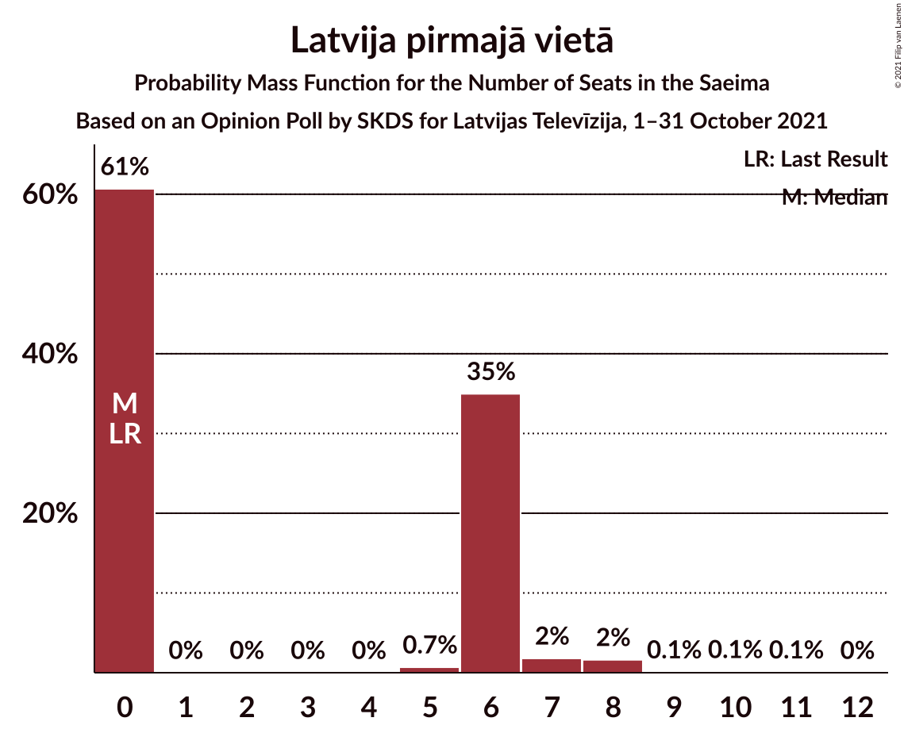
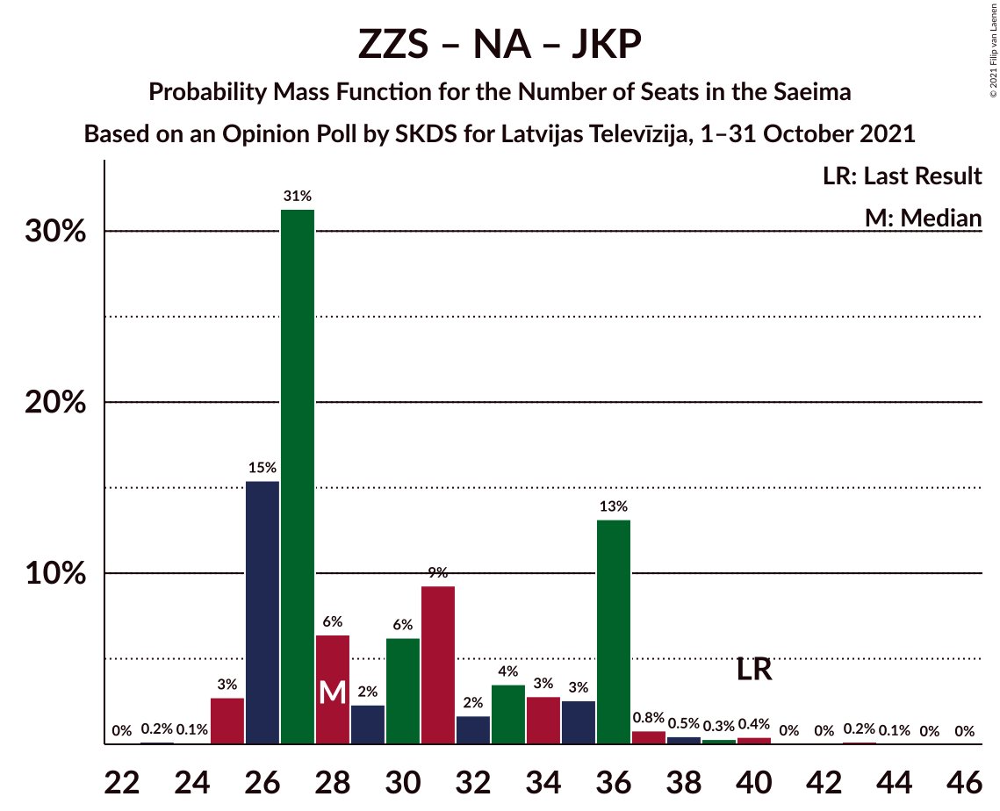

# Opinion Poll by SKDS for Latvijas Televīzija, 1–31 October 2021

<a href="#voting-intentions">Voting Intentions</a> | <a href="#seats">Seats</a> | <a href="#coalitions">Coalitions</a> | <a href="#technical-information">Technical Information</a>

## Voting Intentions

### Confidence Intervals

| Party | Last Result | Poll Result | 80% Confidence Interval | 90% Confidence Interval | 95% Confidence Interval | 99% Confidence Interval |
|:-----:|:-----------:|:-----------:|:-----------------------:|:-----------------------:|:-----------------------:|:-----------------------:|
| Sociāldemokrātiskā partija “Saskaņa” | 19.8% | 19.9% | 18.2–21.8% |17.8–22.3% |17.3–22.8% |16.6–23.7% |
| Zaļo un Zemnieku savienība | 9.9% | 12.8% | 11.5–14.4% |11.1–14.9% |10.7–15.3% |10.1–16.1% |
| Jaunā VIENOTĪBA | 6.7% | 12.8% | 11.5–14.4% |11.1–14.9% |10.7–15.3% |10.1–16.1% |
| Nacionālā apvienība „Visu Latvijai!”–„Tēvzemei un Brīvībai/LNNK” | 11.0% | 10.6% | 9.3–12.1% |8.9–12.5% |8.7–12.8% |8.1–13.6% |
| Attīstībai/Par! | 12.0% | 9.2% | 8.1–10.7% |7.7–11.1% |7.5–11.4% |6.9–12.1% |
| PROGRESĪVIE | 2.6% | 5.3% | 4.4–6.4% |4.2–6.7% |4.0–7.0% |3.6–7.6% |
| Latvijas Krievu savienība | 3.2% | 5.0% | 4.2–6.2% |3.9–6.5% |3.7–6.8% |3.4–7.3% |
| Jaunā konservatīvā partija | 13.6% | 4.9% | 4.1–6.0% |3.8–6.3% |3.6–6.6% |3.3–7.2% |
| Latvijas Reģionu Apvienība | 4.1% | 4.8% | 4.0–5.9% |3.7–6.2% |3.5–6.5% |3.2–7.0% |
| Latvija pirmajā vietā | 0.0% | 4.8% | 4.0–5.9% |3.7–6.2% |3.5–6.5% |3.2–7.0% |
| Likums un kārtība | 0.0% | 4.4% | 3.6–5.5% |3.4–5.8% |3.2–6.1% |2.9–6.6% |
| Republika | 0.0% | 2.4% | 1.8–3.2% |1.7–3.5% |1.6–3.7% |1.3–4.1% |
| Politiskā partija „KPV LV” | 14.2% | 1.8% | 1.3–2.5% |1.2–2.8% |1.1–3.0% |0.9–3.4% |

*Note:* The poll result column reflects the actual value used in the calculations. Published results may vary slightly, and in addition be rounded to fewer digits.

## Seats

### Confidence Intervals

| Party | Last Result | Median | 80% Confidence Interval | 90% Confidence Interval | 95% Confidence Interval | 99% Confidence Interval |
|:-----:|:-----------:|:------:|:-----------------------:|:-----------------------:|:-----------------------:|:-----------------------:|
| <a href="#sociāldemokrātiskā-partija-“saskaņa”">Sociāldemokrātiskā partija “Saskaņa”</a> | 23 | 25 | 20–26 |19–27 |19–28 |19–29 |
| <a href="#zaļo-un-zemnieku-savienība">Zaļo un Zemnieku savienība</a> | 11 | 13 | 11–18 |11–19 |11–20 |11–20 |
| <a href="#jaunā-vienotība">Jaunā VIENOTĪBA</a> | 8 | 16 | 14–17 |13–19 |12–19 |11–19 |
| <a href="#nacionālā-apvienība-„visu-latvijai!”–„tēvzemei-un-brīvībai/lnnk”">Nacionālā apvienība „Visu Latvijai!”–„Tēvzemei un Brīvībai/LNNK”</a> | 13 | 13 | 11–14 |11–15 |11–15 |10–17 |
| <a href="#attīstībai/par!">Attīstībai/Par!</a> | 13 | 10 | 9–13 |9–14 |9–14 |7–14 |
| <a href="#progresīvie">PROGRESĪVIE</a> | 0 | 7 | 0–7 |0–8 |0–8 |0–8 |
| <a href="#latvijas-krievu-savienība">Latvijas Krievu savienība</a> | 0 | 0 | 0–8 |0–8 |0–8 |0–10 |
| <a href="#jaunā-konservatīvā-partija">Jaunā konservatīvā partija</a> | 16 | 6 | 0–7 |0–7 |0–8 |0–9 |
| <a href="#latvijas-reģionu-apvienība">Latvijas Reģionu Apvienība</a> | 0 | 6 | 0–7 |0–7 |0–7 |0–8 |
| <a href="#latvija-pirmajā-vietā">Latvija pirmajā vietā</a> | 0 | 6 | 0–6 |0–6 |0–7 |0–7 |
| <a href="#likums-un-kārtība">Likums un kārtība</a> | 0 | 0 | 0–7 |0–7 |0–10 |0–10 |
| <a href="#republika">Republika</a> | 0 | 0 | 0 |0 |0 |0 |
| <a href="#politiskā-partija-„kpv-lv”">Politiskā partija „KPV LV”</a> | 16 | 0 | 0 |0 |0 |0 |

### Sociāldemokrātiskā partija “Saskaņa”

*For a full overview of the results for this party, see the [Sociāldemokrātiskā partija “Saskaņa”](party-sociāldemokrātiskāpartija“saskaņa”.html) page.*

| Number of Seats | Probability | Accumulated | Special Marks |
|:---------------:|:-----------:|:-----------:|:-------------:|
| 18 | 0.2% | 100% |  |
| 19 | 10% | 99.8% |  |
| 20 | 2% | 90% |  |
| 21 | 0.6% | 88% |  |
| 22 | 0.5% | 88% |  |
| 23 | 6% | 87% | Last Result |
| 24 | 4% | 81% |  |
| 25 | 48% | 77% | Median |
| 26 | 22% | 29% |  |
| 27 | 2% | 7% |  |
| 28 | 3% | 5% |  |
| 29 | 1.1% | 1.5% |  |
| 30 | 0.3% | 0.4% |  |
| 31 | 0% | 0.1% |  |
| 32 | 0.1% | 0.1% |  |
| 33 | 0% | 0% |  |

### Zaļo un Zemnieku savienība

*For a full overview of the results for this party, see the [Zaļo un Zemnieku savienība](party-zaļounzemniekusavienība.html) page.*

| Number of Seats | Probability | Accumulated | Special Marks |
|:---------------:|:-----------:|:-----------:|:-------------:|
| 11 | 39% | 100% | Last Result |
| 12 | 0.2% | 61% |  |
| 13 | 11% | 61% | Median |
| 14 | 3% | 50% |  |
| 15 | 8% | 47% |  |
| 16 | 2% | 39% |  |
| 17 | 27% | 38% |  |
| 18 | 4% | 11% |  |
| 19 | 4% | 6% |  |
| 20 | 2% | 3% |  |
| 21 | 0.2% | 0.2% |  |
| 22 | 0% | 0% |  |

### Jaunā VIENOTĪBA

*For a full overview of the results for this party, see the [Jaunā VIENOTĪBA](party-jaunāvienotība.html) page.*

| Number of Seats | Probability | Accumulated | Special Marks |
|:---------------:|:-----------:|:-----------:|:-------------:|
| 8 | 0% | 100% | Last Result |
| 9 | 0% | 100% |  |
| 10 | 0.1% | 100% |  |
| 11 | 2% | 99.9% |  |
| 12 | 0.9% | 98% |  |
| 13 | 2% | 97% |  |
| 14 | 6% | 94% |  |
| 15 | 10% | 88% |  |
| 16 | 61% | 78% | Median |
| 17 | 8% | 17% |  |
| 18 | 4% | 9% |  |
| 19 | 5% | 5% |  |
| 20 | 0.1% | 0.2% |  |
| 21 | 0.1% | 0.1% |  |
| 22 | 0% | 0% |  |

### Nacionālā apvienība „Visu Latvijai!”–„Tēvzemei un Brīvībai/LNNK”

*For a full overview of the results for this party, see the [Nacionālā apvienība „Visu Latvijai!”–„Tēvzemei un Brīvībai/LNNK”](party-nacionālāapvienība„visulatvijai”–„tēvzemeiunbrīvībailnnk”.html) page.*

| Number of Seats | Probability | Accumulated | Special Marks |
|:---------------:|:-----------:|:-----------:|:-------------:|
| 8 | 0.1% | 100% |  |
| 9 | 0.1% | 99.9% |  |
| 10 | 0.4% | 99.8% |  |
| 11 | 35% | 99.3% |  |
| 12 | 0.8% | 64% |  |
| 13 | 47% | 63% | Last Result, Median |
| 14 | 7% | 16% |  |
| 15 | 8% | 10% |  |
| 16 | 0.4% | 1.1% |  |
| 17 | 0.6% | 0.7% |  |
| 18 | 0% | 0.1% |  |
| 19 | 0% | 0.1% |  |
| 20 | 0.1% | 0.1% |  |
| 21 | 0% | 0% |  |

### Attīstībai/Par!

*For a full overview of the results for this party, see the [Attīstībai/Par!](party-attīstībaipar.html) page.*

| Number of Seats | Probability | Accumulated | Special Marks |
|:---------------:|:-----------:|:-----------:|:-------------:|
| 7 | 0.6% | 100% |  |
| 8 | 1.2% | 99.4% |  |
| 9 | 41% | 98% |  |
| 10 | 38% | 57% | Median |
| 11 | 4% | 19% |  |
| 12 | 2% | 16% |  |
| 13 | 6% | 14% | Last Result |
| 14 | 7% | 8% |  |
| 15 | 0.3% | 0.3% |  |
| 16 | 0.1% | 0.1% |  |
| 17 | 0% | 0% |  |

### PROGRESĪVIE

*For a full overview of the results for this party, see the [PROGRESĪVIE](party-progresīvie.html) page.*

| Number of Seats | Probability | Accumulated | Special Marks |
|:---------------:|:-----------:|:-----------:|:-------------:|
| 0 | 48% | 100% | Last Result |
| 1 | 0% | 52% |  |
| 2 | 0% | 52% |  |
| 3 | 0% | 52% |  |
| 4 | 0% | 52% |  |
| 5 | 0% | 52% |  |
| 6 | 0.4% | 52% |  |
| 7 | 43% | 51% | Median |
| 8 | 9% | 9% |  |
| 9 | 0% | 0% |  |

### Latvijas Krievu savienība

*For a full overview of the results for this party, see the [Latvijas Krievu savienība](party-latvijaskrievusavienība.html) page.*

| Number of Seats | Probability | Accumulated | Special Marks |
|:---------------:|:-----------:|:-----------:|:-------------:|
| 0 | 79% | 100% | Last Result, Median |
| 1 | 0% | 21% |  |
| 2 | 0% | 21% |  |
| 3 | 0% | 21% |  |
| 4 | 0% | 21% |  |
| 5 | 0% | 21% |  |
| 6 | 0.1% | 21% |  |
| 7 | 2% | 20% |  |
| 8 | 18% | 19% |  |
| 9 | 0% | 0.7% |  |
| 10 | 0.7% | 0.7% |  |
| 11 | 0% | 0% |  |

### Jaunā konservatīvā partija

*For a full overview of the results for this party, see the [Jaunā konservatīvā partija](party-jaunākonservatīvāpartija.html) page.*

| Number of Seats | Probability | Accumulated | Special Marks |
|:---------------:|:-----------:|:-----------:|:-------------:|
| 0 | 44% | 100% |  |
| 1 | 0% | 56% |  |
| 2 | 0% | 56% |  |
| 3 | 0% | 56% |  |
| 4 | 0% | 56% |  |
| 5 | 0% | 56% |  |
| 6 | 11% | 56% | Median |
| 7 | 42% | 45% |  |
| 8 | 1.0% | 3% |  |
| 9 | 2% | 2% |  |
| 10 | 0% | 0% |  |
| 11 | 0% | 0% |  |
| 12 | 0% | 0% |  |
| 13 | 0% | 0% |  |
| 14 | 0% | 0% |  |
| 15 | 0% | 0% |  |
| 16 | 0% | 0% | Last Result |

### Latvijas Reģionu Apvienība

*For a full overview of the results for this party, see the [Latvijas Reģionu Apvienība](party-latvijasreģionuapvienība.html) page.*

| Number of Seats | Probability | Accumulated | Special Marks |
|:---------------:|:-----------:|:-----------:|:-------------:|
| 0 | 13% | 100% | Last Result |
| 1 | 0% | 87% |  |
| 2 | 0% | 87% |  |
| 3 | 0% | 87% |  |
| 4 | 0% | 87% |  |
| 5 | 0% | 87% |  |
| 6 | 51% | 87% | Median |
| 7 | 35% | 35% |  |
| 8 | 0.5% | 0.6% |  |
| 9 | 0.1% | 0.1% |  |
| 10 | 0% | 0% |  |

### Latvija pirmajā vietā

*For a full overview of the results for this party, see the [Latvija pirmajā vietā](party-latvijapirmajāvietā.html) page.*

| Number of Seats | Probability | Accumulated | Special Marks |
|:---------------:|:-----------:|:-----------:|:-------------:|
| 0 | 24% | 100% | Last Result |
| 1 | 0% | 76% |  |
| 2 | 0% | 76% |  |
| 3 | 0% | 76% |  |
| 4 | 0% | 76% |  |
| 5 | 9% | 76% |  |
| 6 | 62% | 67% | Median |
| 7 | 4% | 4% |  |
| 8 | 0.1% | 0.5% |  |
| 9 | 0.3% | 0.4% |  |
| 10 | 0.2% | 0.2% |  |
| 11 | 0% | 0% |  |

### Likums un kārtība

*For a full overview of the results for this party, see the [Likums un kārtība](party-likumsunkārtība.html) page.*

| Number of Seats | Probability | Accumulated | Special Marks |
|:---------------:|:-----------:|:-----------:|:-------------:|
| 0 | 51% | 100% | Last Result, Median |
| 1 | 0% | 49% |  |
| 2 | 0% | 49% |  |
| 3 | 0% | 49% |  |
| 4 | 0% | 49% |  |
| 5 | 0.2% | 49% |  |
| 6 | 5% | 49% |  |
| 7 | 39% | 43% |  |
| 8 | 0% | 4% |  |
| 9 | 0% | 4% |  |
| 10 | 4% | 4% |  |
| 11 | 0% | 0% |  |

### Republika

*For a full overview of the results for this party, see the [Republika](party-republika.html) page.*

| Number of Seats | Probability | Accumulated | Special Marks |
|:---------------:|:-----------:|:-----------:|:-------------:|
| 0 | 100% | 100% | Last Result, Median |

### Politiskā partija „KPV LV”

*For a full overview of the results for this party, see the [Politiskā partija „KPV LV”](party-politiskāpartija„kpvlv”.html) page.*

| Number of Seats | Probability | Accumulated | Special Marks |
|:---------------:|:-----------:|:-----------:|:-------------:|
| 0 | 100% | 100% | Median |
| 1 | 0% | 0% |  |
| 2 | 0% | 0% |  |
| 3 | 0% | 0% |  |
| 4 | 0% | 0% |  |
| 5 | 0% | 0% |  |
| 6 | 0% | 0% |  |
| 7 | 0% | 0% |  |
| 8 | 0% | 0% |  |
| 9 | 0% | 0% |  |
| 10 | 0% | 0% |  |
| 11 | 0% | 0% |  |
| 12 | 0% | 0% |  |
| 13 | 0% | 0% |  |
| 14 | 0% | 0% |  |
| 15 | 0% | 0% |  |
| 16 | 0% | 0% | Last Result |

## Coalitions

### Confidence Intervals

| Coalition | Last Result | Median | Majority? | 80% Confidence Interval | 90% Confidence Interval | 95% Confidence Interval | 99% Confidence Interval |
|:---------:|:-----------:|:------:|:---------:|:-----------------------:|:-----------------------:|:-----------------------:|:-----------------------:|
| Jaunā VIENOTĪBA – Zaļo un Zemnieku savienība – Nacionālā apvienība „Visu Latvijai!”–„Tēvzemei un Brīvībai/LNNK” – Attīstībai/Par! – Jaunā konservatīvā partija | 61 | 56 | 98.8% | 54–62 | 54–62 | 53–65 | 49–68 |
| Jaunā VIENOTĪBA – Zaļo un Zemnieku savienība – Nacionālā apvienība „Visu Latvijai!”–„Tēvzemei un Brīvībai/LNNK” – Attīstībai/Par! | 45 | 50 | 50% | 49–61 | 49–62 | 49–62 | 44–62 |
| Jaunā VIENOTĪBA – Zaļo un Zemnieku savienība – Nacionālā apvienība „Visu Latvijai!”–„Tēvzemei un Brīvībai/LNNK” – Jaunā konservatīvā partija | 48 | 47 | 5% | 44–48 | 44–52 | 42–52 | 38–57 |
| Jaunā VIENOTĪBA – Zaļo un Zemnieku savienība – Nacionālā apvienība „Visu Latvijai!”–„Tēvzemei un Brīvībai/LNNK” | 32 | 40 | 3% | 39–48 | 39–48 | 39–52 | 36–52 |
| Zaļo un Zemnieku savienība – Nacionālā apvienība „Visu Latvijai!”–„Tēvzemei un Brīvībai/LNNK” – Attīstībai/Par! – Jaunā konservatīvā partija | 53 | 40 | 2% | 38–45 | 38–48 | 38–49 | 36–52 |
| Jaunā VIENOTĪBA – Nacionālā apvienība „Visu Latvijai!”–„Tēvzemei un Brīvībai/LNNK” – Attīstībai/Par! – Jaunā konservatīvā partija | 50 | 43 | 0.6% | 37–45 | 37–45 | 37–49 | 36–51 |
| Jaunā VIENOTĪBA – Nacionālā apvienība „Visu Latvijai!”–„Tēvzemei un Brīvībai/LNNK” – Attīstībai/Par! – Jaunā konservatīvā partija – Politiskā partija „KPV LV” | 66 | 43 | 0.6% | 37–45 | 37–45 | 37–49 | 36–51 |
| Zaļo un Zemnieku savienība – Nacionālā apvienība „Visu Latvijai!”–„Tēvzemei un Brīvībai/LNNK” – Attīstībai/Par! | 37 | 35 | 0% | 33–44 | 33–45 | 33–48 | 32–48 |
| Sociāldemokrātiskā partija “Saskaņa” – Zaļo un Zemnieku savienība – Politiskā partija „KPV LV” | 50 | 36 | 0% | 34–43 | 32–43 | 32–45 | 32–46 |
| Sociāldemokrātiskā partija “Saskaņa” – Attīstībai/Par! – Jaunā konservatīvā partija | 52 | 38 | 0% | 35–41 | 35–43 | 33–44 | 32–46 |
| Jaunā VIENOTĪBA – Nacionālā apvienība „Visu Latvijai!”–„Tēvzemei un Brīvībai/LNNK” – Attīstībai/Par! – Politiskā partija „KPV LV” | 50 | 38 | 0% | 36–43 | 36–43 | 36–43 | 33–46 |
| Sociāldemokrātiskā partija “Saskaņa” – Attīstībai/Par! | 36 | 34 | 0% | 30–38 | 29–38 | 29–39 | 29–43 |
| Zaļo un Zemnieku savienība – Nacionālā apvienība „Visu Latvijai!”–„Tēvzemei un Brīvībai/LNNK” – Jaunā konservatīvā partija | 40 | 31 | 0% | 28–34 | 28–35 | 28–38 | 25–39 |
| Jaunā VIENOTĪBA – Nacionālā apvienība „Visu Latvijai!”–„Tēvzemei un Brīvībai/LNNK” – Jaunā konservatīvā partija – Politiskā partija „KPV LV” | 53 | 32 | 0% | 27–36 | 27–36 | 27–36 | 25–40 |
| Jaunā VIENOTĪBA – Attīstībai/Par! – Jaunā konservatīvā partija – Politiskā partija „KPV LV” | 53 | 31 | 0% | 26–32 | 26–32 | 26–35 | 22–36 |
| Nacionālā apvienība „Visu Latvijai!”–„Tēvzemei un Brīvībai/LNNK” – Attīstībai/Par! – Jaunā konservatīvā partija – Politiskā partija „KPV LV” | 58 | 27 | 0% | 21–29 | 21–30 | 21–35 | 21–36 |
| Sociāldemokrātiskā partija “Saskaņa” – Politiskā partija „KPV LV” | 39 | 25 | 0% | 20–26 | 19–27 | 19–28 | 19–29 |

### Jaunā VIENOTĪBA – Zaļo un Zemnieku savienība – Nacionālā apvienība „Visu Latvijai!”–„Tēvzemei un Brīvībai/LNNK” – Attīstībai/Par! – Jaunā konservatīvā partija

| Number of Seats | Probability | Accumulated | Special Marks |
|:---------------:|:-----------:|:-----------:|:-------------:|
| 47 | 0.1% | 100% |  |
| 48 | 0% | 99.9% |  |
| 49 | 0.8% | 99.8% |  |
| 50 | 0.3% | 99.0% |  |
| 51 | 0.8% | 98.8% | Majority |
| 52 | 0.4% | 98% |  |
| 53 | 0.3% | 98% |  |
| 54 | 21% | 97% |  |
| 55 | 10% | 76% |  |
| 56 | 39% | 66% |  |
| 57 | 4% | 26% |  |
| 58 | 6% | 23% | Median |
| 59 | 0.7% | 17% |  |
| 60 | 0.6% | 16% |  |
| 61 | 4% | 15% | Last Result |
| 62 | 8% | 11% |  |
| 63 | 0.1% | 3% |  |
| 64 | 0.2% | 3% |  |
| 65 | 0.3% | 3% |  |
| 66 | 2% | 2% |  |
| 67 | 0% | 0.7% |  |
| 68 | 0.4% | 0.7% |  |
| 69 | 0.1% | 0.4% |  |
| 70 | 0.2% | 0.3% |  |
| 71 | 0.1% | 0.1% |  |
| 72 | 0% | 0% |  |

### Jaunā VIENOTĪBA – Zaļo un Zemnieku savienība – Nacionālā apvienība „Visu Latvijai!”–„Tēvzemei un Brīvībai/LNNK” – Attīstībai/Par!

| Number of Seats | Probability | Accumulated | Special Marks |
|:---------------:|:-----------:|:-----------:|:-------------:|
| 44 | 0.7% | 100% |  |
| 45 | 0% | 99.3% | Last Result |
| 46 | 0.2% | 99.3% |  |
| 47 | 0.1% | 99.1% |  |
| 48 | 0.3% | 99.0% |  |
| 49 | 49% | 98.7% |  |
| 50 | 0.2% | 50% |  |
| 51 | 2% | 50% | Majority |
| 52 | 1.0% | 48% | Median |
| 53 | 2% | 47% |  |
| 54 | 22% | 45% |  |
| 55 | 0.3% | 24% |  |
| 56 | 2% | 24% |  |
| 57 | 4% | 22% |  |
| 58 | 5% | 18% |  |
| 59 | 2% | 13% |  |
| 60 | 0.9% | 12% |  |
| 61 | 4% | 11% |  |
| 62 | 6% | 7% |  |
| 63 | 0.2% | 0.5% |  |
| 64 | 0.1% | 0.3% |  |
| 65 | 0% | 0.2% |  |
| 66 | 0.1% | 0.2% |  |
| 67 | 0% | 0.1% |  |
| 68 | 0.1% | 0.1% |  |
| 69 | 0% | 0% |  |

### Jaunā VIENOTĪBA – Zaļo un Zemnieku savienība – Nacionālā apvienība „Visu Latvijai!”–„Tēvzemei un Brīvībai/LNNK” – Jaunā konservatīvā partija

| Number of Seats | Probability | Accumulated | Special Marks |
|:---------------:|:-----------:|:-----------:|:-------------:|
| 33 | 0.1% | 100% |  |
| 34 | 0% | 99.9% |  |
| 35 | 0% | 99.9% |  |
| 36 | 0% | 99.9% |  |
| 37 | 0.2% | 99.9% |  |
| 38 | 0.8% | 99.7% |  |
| 39 | 0% | 98.8% |  |
| 40 | 0.1% | 98.8% |  |
| 41 | 0.6% | 98.8% |  |
| 42 | 1.2% | 98% |  |
| 43 | 1.4% | 97% |  |
| 44 | 21% | 96% |  |
| 45 | 10% | 74% |  |
| 46 | 3% | 64% |  |
| 47 | 39% | 61% |  |
| 48 | 13% | 22% | Last Result, Median |
| 49 | 4% | 10% |  |
| 50 | 0.5% | 6% |  |
| 51 | 0.2% | 5% | Majority |
| 52 | 4% | 5% |  |
| 53 | 0.3% | 2% |  |
| 54 | 0.1% | 1.3% |  |
| 55 | 0.6% | 1.2% |  |
| 56 | 0.1% | 0.6% |  |
| 57 | 0.1% | 0.5% |  |
| 58 | 0% | 0.4% |  |
| 59 | 0.3% | 0.4% |  |
| 60 | 0% | 0.1% |  |
| 61 | 0% | 0.1% |  |
| 62 | 0.1% | 0.1% |  |
| 63 | 0% | 0% |  |

### Jaunā VIENOTĪBA – Zaļo un Zemnieku savienība – Nacionālā apvienība „Visu Latvijai!”–„Tēvzemei un Brīvībai/LNNK”

| Number of Seats | Probability | Accumulated | Special Marks |
|:---------------:|:-----------:|:-----------:|:-------------:|
| 32 | 0% | 100% | Last Result |
| 33 | 0.1% | 100% |  |
| 34 | 0% | 99.9% |  |
| 35 | 0.2% | 99.9% |  |
| 36 | 0.5% | 99.7% |  |
| 37 | 0.4% | 99.2% |  |
| 38 | 0.9% | 98.8% |  |
| 39 | 9% | 98% |  |
| 40 | 40% | 89% |  |
| 41 | 0.9% | 49% |  |
| 42 | 3% | 48% | Median |
| 43 | 1.2% | 45% |  |
| 44 | 21% | 44% |  |
| 45 | 3% | 22% |  |
| 46 | 3% | 20% |  |
| 47 | 0.5% | 17% |  |
| 48 | 13% | 16% |  |
| 49 | 0.2% | 3% |  |
| 50 | 0.2% | 3% |  |
| 51 | 0.4% | 3% | Majority |
| 52 | 2% | 3% |  |
| 53 | 0% | 0.3% |  |
| 54 | 0.1% | 0.3% |  |
| 55 | 0.1% | 0.2% |  |
| 56 | 0.1% | 0.1% |  |
| 57 | 0.1% | 0.1% |  |
| 58 | 0% | 0% |  |

### Zaļo un Zemnieku savienība – Nacionālā apvienība „Visu Latvijai!”–„Tēvzemei un Brīvībai/LNNK” – Attīstībai/Par! – Jaunā konservatīvā partija

| Number of Seats | Probability | Accumulated | Special Marks |
|:---------------:|:-----------:|:-----------:|:-------------:|
| 33 | 0.1% | 100% |  |
| 34 | 0% | 99.9% |  |
| 35 | 0.3% | 99.9% |  |
| 36 | 0.4% | 99.6% |  |
| 37 | 0.1% | 99.2% |  |
| 38 | 22% | 99.1% |  |
| 39 | 8% | 77% |  |
| 40 | 48% | 69% |  |
| 41 | 0.9% | 21% |  |
| 42 | 3% | 20% | Median |
| 43 | 0.2% | 17% |  |
| 44 | 5% | 17% |  |
| 45 | 3% | 12% |  |
| 46 | 0.6% | 9% |  |
| 47 | 0.2% | 9% |  |
| 48 | 4% | 8% |  |
| 49 | 2% | 4% |  |
| 50 | 0% | 2% |  |
| 51 | 0.5% | 2% | Majority |
| 52 | 1.3% | 2% |  |
| 53 | 0.2% | 0.2% | Last Result |
| 54 | 0% | 0% |  |

### Jaunā VIENOTĪBA – Nacionālā apvienība „Visu Latvijai!”–„Tēvzemei un Brīvībai/LNNK” – Attīstībai/Par! – Jaunā konservatīvā partija

| Number of Seats | Probability | Accumulated | Special Marks |
|:---------------:|:-----------:|:-----------:|:-------------:|
| 34 | 0.1% | 100% |  |
| 35 | 0% | 99.9% |  |
| 36 | 0.8% | 99.8% |  |
| 37 | 22% | 99.0% |  |
| 38 | 0.4% | 77% |  |
| 39 | 0.4% | 77% |  |
| 40 | 4% | 76% |  |
| 41 | 1.4% | 72% |  |
| 42 | 12% | 70% |  |
| 43 | 14% | 58% |  |
| 44 | 1.3% | 45% |  |
| 45 | 38% | 43% | Median |
| 46 | 0.6% | 5% |  |
| 47 | 0.1% | 4% |  |
| 48 | 2% | 4% |  |
| 49 | 0.6% | 3% |  |
| 50 | 1.4% | 2% | Last Result |
| 51 | 0.3% | 0.6% | Majority |
| 52 | 0.1% | 0.3% |  |
| 53 | 0.2% | 0.2% |  |
| 54 | 0% | 0.1% |  |
| 55 | 0% | 0.1% |  |
| 56 | 0% | 0.1% |  |
| 57 | 0% | 0% |  |

### Jaunā VIENOTĪBA – Nacionālā apvienība „Visu Latvijai!”–„Tēvzemei un Brīvībai/LNNK” – Attīstībai/Par! – Jaunā konservatīvā partija – Politiskā partija „KPV LV”

| Number of Seats | Probability | Accumulated | Special Marks |
|:---------------:|:-----------:|:-----------:|:-------------:|
| 34 | 0.1% | 100% |  |
| 35 | 0% | 99.9% |  |
| 36 | 0.8% | 99.8% |  |
| 37 | 22% | 99.0% |  |
| 38 | 0.4% | 77% |  |
| 39 | 0.4% | 77% |  |
| 40 | 4% | 76% |  |
| 41 | 1.4% | 72% |  |
| 42 | 12% | 70% |  |
| 43 | 14% | 58% |  |
| 44 | 1.3% | 45% |  |
| 45 | 38% | 43% | Median |
| 46 | 0.6% | 5% |  |
| 47 | 0.1% | 4% |  |
| 48 | 2% | 4% |  |
| 49 | 0.6% | 3% |  |
| 50 | 1.4% | 2% |  |
| 51 | 0.3% | 0.6% | Majority |
| 52 | 0.1% | 0.3% |  |
| 53 | 0.2% | 0.2% |  |
| 54 | 0% | 0.1% |  |
| 55 | 0% | 0.1% |  |
| 56 | 0% | 0.1% |  |
| 57 | 0% | 0% |  |
| 58 | 0% | 0% |  |
| 59 | 0% | 0% |  |
| 60 | 0% | 0% |  |
| 61 | 0% | 0% |  |
| 62 | 0% | 0% |  |
| 63 | 0% | 0% |  |
| 64 | 0% | 0% |  |
| 65 | 0% | 0% |  |
| 66 | 0% | 0% | Last Result |

### Zaļo un Zemnieku savienība – Nacionālā apvienība „Visu Latvijai!”–„Tēvzemei un Brīvībai/LNNK” – Attīstībai/Par!

| Number of Seats | Probability | Accumulated | Special Marks |
|:---------------:|:-----------:|:-----------:|:-------------:|
| 29 | 0.1% | 100% |  |
| 30 | 0% | 99.9% |  |
| 31 | 0% | 99.9% |  |
| 32 | 0.6% | 99.9% |  |
| 33 | 38% | 99.3% |  |
| 34 | 9% | 61% |  |
| 35 | 2% | 52% |  |
| 36 | 1.1% | 50% | Median |
| 37 | 0.4% | 49% | Last Result |
| 38 | 22% | 48% |  |
| 39 | 8% | 26% |  |
| 40 | 2% | 18% |  |
| 41 | 1.5% | 17% |  |
| 42 | 2% | 15% |  |
| 43 | 0.4% | 13% |  |
| 44 | 4% | 13% |  |
| 45 | 4% | 9% |  |
| 46 | 0.6% | 5% |  |
| 47 | 0.2% | 4% |  |
| 48 | 4% | 4% |  |
| 49 | 0.1% | 0.1% |  |
| 50 | 0% | 0% |  |

### Sociāldemokrātiskā partija “Saskaņa” – Zaļo un Zemnieku savienība – Politiskā partija „KPV LV”

| Number of Seats | Probability | Accumulated | Special Marks |
|:---------------:|:-----------:|:-----------:|:-------------:|
| 29 | 0.1% | 100% |  |
| 30 | 0.1% | 99.9% |  |
| 31 | 0% | 99.8% |  |
| 32 | 9% | 99.8% |  |
| 33 | 0.5% | 91% |  |
| 34 | 0.7% | 90% |  |
| 35 | 0.1% | 89% |  |
| 36 | 39% | 89% |  |
| 37 | 2% | 50% |  |
| 38 | 2% | 48% | Median |
| 39 | 0.5% | 45% |  |
| 40 | 5% | 45% |  |
| 41 | 1.3% | 40% |  |
| 42 | 2% | 38% |  |
| 43 | 32% | 36% |  |
| 44 | 1.1% | 4% |  |
| 45 | 2% | 3% |  |
| 46 | 0.6% | 1.0% |  |
| 47 | 0.2% | 0.4% |  |
| 48 | 0% | 0.1% |  |
| 49 | 0% | 0.1% |  |
| 50 | 0.1% | 0.1% | Last Result |
| 51 | 0% | 0% | Majority |

### Sociāldemokrātiskā partija “Saskaņa” – Attīstībai/Par! – Jaunā konservatīvā partija

| Number of Seats | Probability | Accumulated | Special Marks |
|:---------------:|:-----------:|:-----------:|:-------------:|
| 29 | 0.1% | 100% |  |
| 30 | 0.2% | 99.9% |  |
| 31 | 0% | 99.6% |  |
| 32 | 0.4% | 99.6% |  |
| 33 | 3% | 99.2% |  |
| 34 | 0.1% | 96% |  |
| 35 | 14% | 96% |  |
| 36 | 22% | 82% |  |
| 37 | 1.4% | 60% |  |
| 38 | 9% | 58% |  |
| 39 | 2% | 49% |  |
| 40 | 2% | 47% |  |
| 41 | 40% | 45% | Median |
| 42 | 0.5% | 6% |  |
| 43 | 3% | 5% |  |
| 44 | 0.5% | 3% |  |
| 45 | 2% | 2% |  |
| 46 | 0.1% | 0.6% |  |
| 47 | 0.4% | 0.5% |  |
| 48 | 0% | 0.1% |  |
| 49 | 0% | 0% |  |
| 50 | 0% | 0% |  |
| 51 | 0% | 0% | Majority |
| 52 | 0% | 0% | Last Result |

### Jaunā VIENOTĪBA – Nacionālā apvienība „Visu Latvijai!”–„Tēvzemei un Brīvībai/LNNK” – Attīstībai/Par! – Politiskā partija „KPV LV”

| Number of Seats | Probability | Accumulated | Special Marks |
|:---------------:|:-----------:|:-----------:|:-------------:|
| 31 | 0.3% | 100% |  |
| 32 | 0.2% | 99.7% |  |
| 33 | 0.9% | 99.5% |  |
| 34 | 0.7% | 98.7% |  |
| 35 | 0.5% | 98% |  |
| 36 | 12% | 98% |  |
| 37 | 22% | 86% |  |
| 38 | 39% | 64% |  |
| 39 | 2% | 26% | Median |
| 40 | 3% | 24% |  |
| 41 | 2% | 21% |  |
| 42 | 3% | 19% |  |
| 43 | 14% | 16% |  |
| 44 | 1.1% | 2% |  |
| 45 | 0.2% | 1.0% |  |
| 46 | 0.6% | 0.9% |  |
| 47 | 0.1% | 0.2% |  |
| 48 | 0.1% | 0.1% |  |
| 49 | 0% | 0.1% |  |
| 50 | 0.1% | 0.1% | Last Result |
| 51 | 0% | 0% | Majority |

### Sociāldemokrātiskā partija “Saskaņa” – Attīstībai/Par!

| Number of Seats | Probability | Accumulated | Special Marks |
|:---------------:|:-----------:|:-----------:|:-------------:|
| 26 | 0.1% | 100% |  |
| 27 | 0.2% | 99.9% |  |
| 28 | 0% | 99.8% |  |
| 29 | 10% | 99.8% |  |
| 30 | 0.3% | 90% |  |
| 31 | 0.7% | 90% |  |
| 32 | 0.8% | 89% |  |
| 33 | 3% | 88% |  |
| 34 | 40% | 85% |  |
| 35 | 5% | 45% | Median |
| 36 | 25% | 41% | Last Result |
| 37 | 2% | 15% |  |
| 38 | 9% | 13% |  |
| 39 | 2% | 5% |  |
| 40 | 0.8% | 2% |  |
| 41 | 0.4% | 1.2% |  |
| 42 | 0.2% | 0.8% |  |
| 43 | 0.5% | 0.6% |  |
| 44 | 0% | 0.1% |  |
| 45 | 0% | 0.1% |  |
| 46 | 0% | 0.1% |  |
| 47 | 0% | 0% |  |

### Zaļo un Zemnieku savienība – Nacionālā apvienība „Visu Latvijai!”–„Tēvzemei un Brīvībai/LNNK” – Jaunā konservatīvā partija

| Number of Seats | Probability | Accumulated | Special Marks |
|:---------------:|:-----------:|:-----------:|:-------------:|
| 22 | 0.1% | 100% |  |
| 23 | 0.1% | 99.9% |  |
| 24 | 0.1% | 99.9% |  |
| 25 | 0.5% | 99.8% |  |
| 26 | 0.2% | 99.4% |  |
| 27 | 2% | 99.2% |  |
| 28 | 25% | 98% |  |
| 29 | 5% | 72% |  |
| 30 | 10% | 68% |  |
| 31 | 43% | 58% |  |
| 32 | 1.4% | 15% | Median |
| 33 | 1.4% | 13% |  |
| 34 | 5% | 12% |  |
| 35 | 3% | 7% |  |
| 36 | 2% | 5% |  |
| 37 | 0.4% | 3% |  |
| 38 | 2% | 3% |  |
| 39 | 0.2% | 0.7% |  |
| 40 | 0% | 0.4% | Last Result |
| 41 | 0% | 0.4% |  |
| 42 | 0.3% | 0.4% |  |
| 43 | 0% | 0% |  |

### Jaunā VIENOTĪBA – Nacionālā apvienība „Visu Latvijai!”–„Tēvzemei un Brīvībai/LNNK” – Jaunā konservatīvā partija – Politiskā partija „KPV LV”

| Number of Seats | Probability | Accumulated | Special Marks |
|:---------------:|:-----------:|:-----------:|:-------------:|
| 20 | 0.1% | 100% |  |
| 21 | 0% | 99.9% |  |
| 22 | 0% | 99.9% |  |
| 23 | 0.3% | 99.9% |  |
| 24 | 0% | 99.6% |  |
| 25 | 0.8% | 99.6% |  |
| 26 | 0.8% | 98.8% |  |
| 27 | 23% | 98% |  |
| 28 | 0.7% | 75% |  |
| 29 | 6% | 75% |  |
| 30 | 5% | 68% |  |
| 31 | 0.3% | 64% |  |
| 32 | 14% | 63% |  |
| 33 | 4% | 49% |  |
| 34 | 2% | 45% |  |
| 35 | 2% | 43% | Median |
| 36 | 39% | 41% |  |
| 37 | 0.1% | 1.5% |  |
| 38 | 0.6% | 1.4% |  |
| 39 | 0.1% | 0.8% |  |
| 40 | 0.2% | 0.7% |  |
| 41 | 0.1% | 0.5% |  |
| 42 | 0.4% | 0.4% |  |
| 43 | 0% | 0% |  |
| 44 | 0% | 0% |  |
| 45 | 0% | 0% |  |
| 46 | 0% | 0% |  |
| 47 | 0% | 0% |  |
| 48 | 0% | 0% |  |
| 49 | 0% | 0% |  |
| 50 | 0% | 0% |  |
| 51 | 0% | 0% | Majority |
| 52 | 0% | 0% |  |
| 53 | 0% | 0% | Last Result |

### Jaunā VIENOTĪBA – Attīstībai/Par! – Jaunā konservatīvā partija – Politiskā partija „KPV LV”

| Number of Seats | Probability | Accumulated | Special Marks |
|:---------------:|:-----------:|:-----------:|:-------------:|
| 22 | 0.8% | 100% |  |
| 23 | 0.1% | 99.2% |  |
| 24 | 0.4% | 99.1% |  |
| 25 | 1.0% | 98.7% |  |
| 26 | 22% | 98% |  |
| 27 | 4% | 76% |  |
| 28 | 6% | 72% |  |
| 29 | 7% | 66% |  |
| 30 | 5% | 60% |  |
| 31 | 10% | 54% |  |
| 32 | 40% | 44% | Median |
| 33 | 0.2% | 4% |  |
| 34 | 0.5% | 4% |  |
| 35 | 3% | 4% |  |
| 36 | 0.4% | 0.8% |  |
| 37 | 0.1% | 0.4% |  |
| 38 | 0% | 0.3% |  |
| 39 | 0.1% | 0.3% |  |
| 40 | 0.2% | 0.2% |  |
| 41 | 0% | 0.1% |  |
| 42 | 0% | 0.1% |  |
| 43 | 0% | 0% |  |
| 44 | 0% | 0% |  |
| 45 | 0% | 0% |  |
| 46 | 0% | 0% |  |
| 47 | 0% | 0% |  |
| 48 | 0% | 0% |  |
| 49 | 0% | 0% |  |
| 50 | 0% | 0% |  |
| 51 | 0% | 0% | Majority |
| 52 | 0% | 0% |  |
| 53 | 0% | 0% | Last Result |

### Nacionālā apvienība „Visu Latvijai!”–„Tēvzemei un Brīvībai/LNNK” – Attīstībai/Par! – Jaunā konservatīvā partija – Politiskā partija „KPV LV”

| Number of Seats | Probability | Accumulated | Special Marks |
|:---------------:|:-----------:|:-----------:|:-------------:|
| 19 | 0.3% | 100% |  |
| 20 | 0.1% | 99.7% |  |
| 21 | 21% | 99.6% |  |
| 22 | 2% | 78% |  |
| 23 | 0.3% | 76% |  |
| 24 | 4% | 76% |  |
| 25 | 4% | 71% |  |
| 26 | 6% | 67% |  |
| 27 | 13% | 62% |  |
| 28 | 1.0% | 48% |  |
| 29 | 42% | 47% | Median |
| 30 | 0.3% | 5% |  |
| 31 | 0.7% | 5% |  |
| 32 | 0.5% | 4% |  |
| 33 | 0% | 4% |  |
| 34 | 0.4% | 4% |  |
| 35 | 2% | 3% |  |
| 36 | 1.3% | 1.4% |  |
| 37 | 0.1% | 0.1% |  |
| 38 | 0% | 0% |  |
| 39 | 0% | 0% |  |
| 40 | 0% | 0% |  |
| 41 | 0% | 0% |  |
| 42 | 0% | 0% |  |
| 43 | 0% | 0% |  |
| 44 | 0% | 0% |  |
| 45 | 0% | 0% |  |
| 46 | 0% | 0% |  |
| 47 | 0% | 0% |  |
| 48 | 0% | 0% |  |
| 49 | 0% | 0% |  |
| 50 | 0% | 0% |  |
| 51 | 0% | 0% | Majority |
| 52 | 0% | 0% |  |
| 53 | 0% | 0% |  |
| 54 | 0% | 0% |  |
| 55 | 0% | 0% |  |
| 56 | 0% | 0% |  |
| 57 | 0% | 0% |  |
| 58 | 0% | 0% | Last Result |

### Sociāldemokrātiskā partija “Saskaņa” – Politiskā partija „KPV LV”

| Number of Seats | Probability | Accumulated | Special Marks |
|:---------------:|:-----------:|:-----------:|:-------------:|
| 18 | 0.2% | 100% |  |
| 19 | 10% | 99.8% |  |
| 20 | 2% | 90% |  |
| 21 | 0.6% | 88% |  |
| 22 | 0.5% | 88% |  |
| 23 | 6% | 87% |  |
| 24 | 4% | 81% |  |
| 25 | 48% | 77% | Median |
| 26 | 22% | 29% |  |
| 27 | 2% | 7% |  |
| 28 | 3% | 5% |  |
| 29 | 1.1% | 1.5% |  |
| 30 | 0.3% | 0.4% |  |
| 31 | 0% | 0.1% |  |
| 32 | 0.1% | 0.1% |  |
| 33 | 0% | 0% |  |
| 34 | 0% | 0% |  |
| 35 | 0% | 0% |  |
| 36 | 0% | 0% |  |
| 37 | 0% | 0% |  |
| 38 | 0% | 0% |  |
| 39 | 0% | 0% | Last Result |

## Technical Information

### Opinion Poll

+ **Polling firm:** SKDS
+ **Commissioner(s):** Latvijas Televīzija
+ **Fieldwork period:** 1–31 October 2021

### Calculations

+ **Sample size:** 833
+ **Simulations done:** 131,072
+ **Error estimate:** 2.50%

