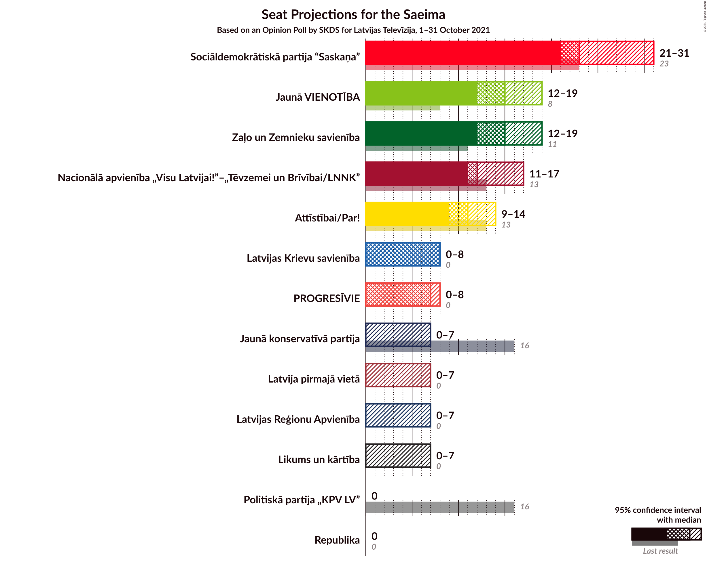
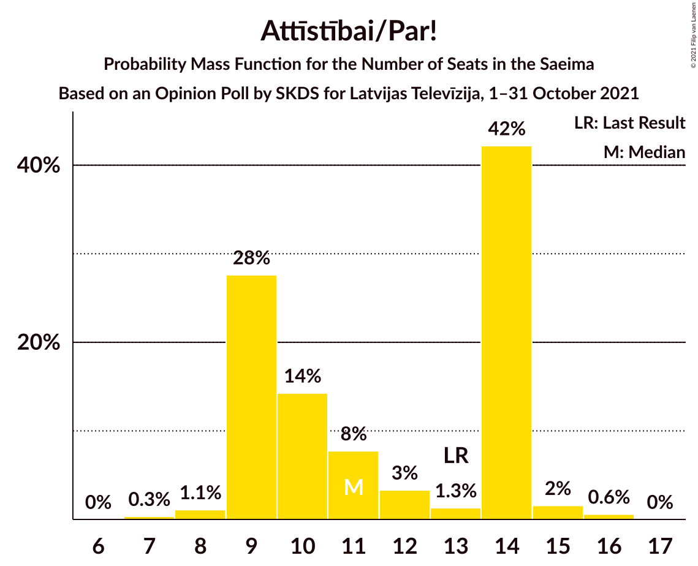
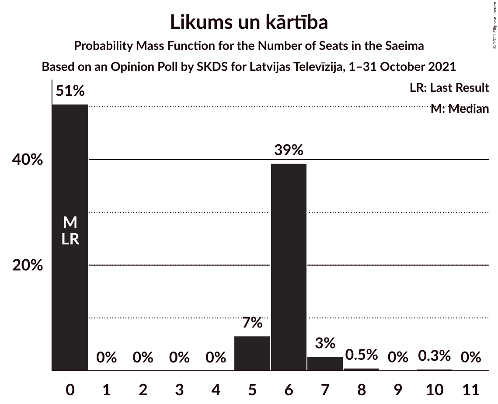
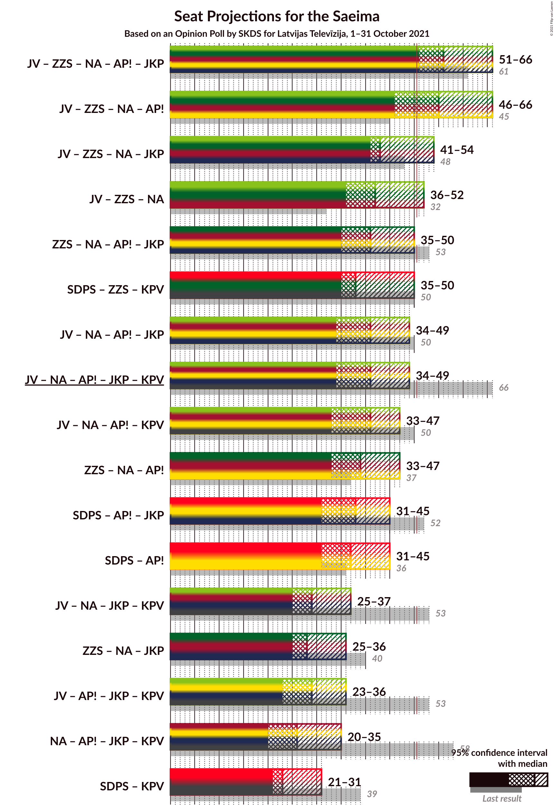
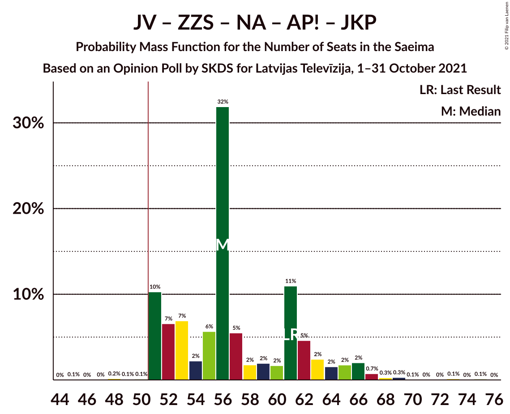
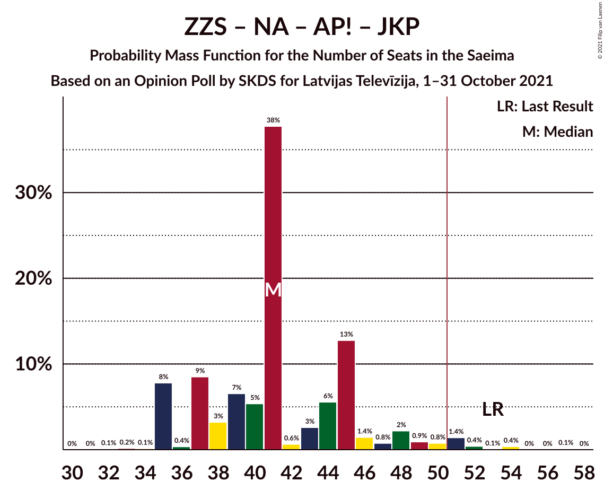
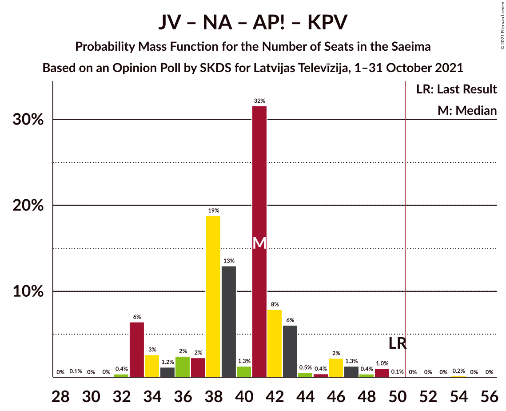
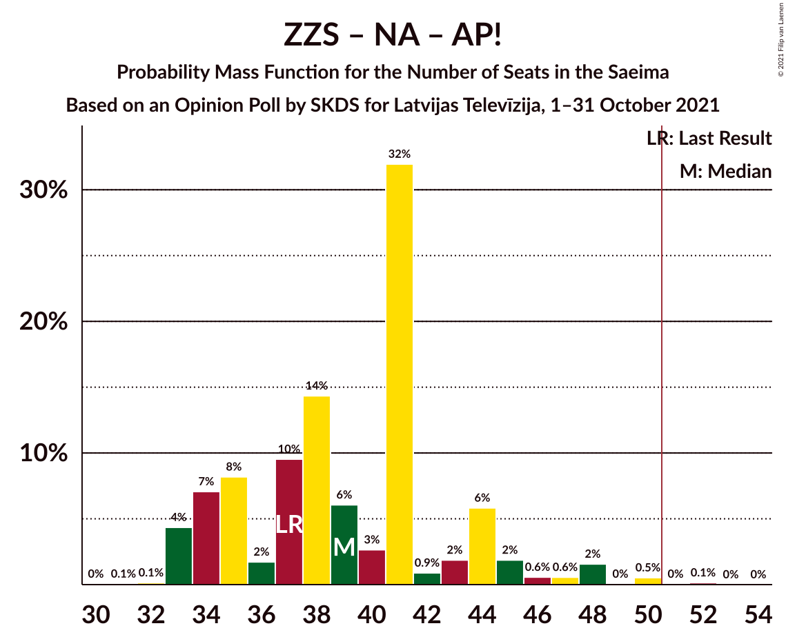

# Opinion Poll by SKDS for Latvijas Televīzija, 1–31 October 2021

<a href="#voting-intentions">Voting Intentions</a> | <a href="#seats">Seats</a> | <a href="#coalitions">Coalitions</a> | <a href="#technical-information">Technical Information</a>

## Voting Intentions

### Confidence Intervals

| Party | Last Result | Poll Result | 80% Confidence Interval | 90% Confidence Interval | 95% Confidence Interval | 99% Confidence Interval |
|:-----:|:-----------:|:-----------:|:-----------------------:|:-----------------------:|:-----------------------:|:-----------------------:|
| Sociāldemokrātiskā partija “Saskaņa” | 19.8% | 19.9% | 18.2–21.8% |17.8–22.3% |17.3–22.8% |16.6–23.7% |
| Zaļo un Zemnieku savienība | 9.9% | 12.8% | 11.5–14.4% |11.1–14.9% |10.7–15.3% |10.1–16.1% |
| Jaunā VIENOTĪBA | 6.7% | 12.8% | 11.5–14.4% |11.1–14.9% |10.7–15.3% |10.1–16.1% |
| Nacionālā apvienība „Visu Latvijai!”–„Tēvzemei un Brīvībai/LNNK” | 11.0% | 10.6% | 9.3–12.1% |8.9–12.5% |8.7–12.8% |8.1–13.6% |
| Attīstībai/Par! | 12.0% | 9.2% | 8.1–10.7% |7.7–11.1% |7.5–11.4% |6.9–12.1% |
| PROGRESĪVIE | 2.6% | 5.3% | 4.4–6.4% |4.2–6.7% |4.0–7.0% |3.6–7.6% |
| Latvijas Krievu savienība | 3.2% | 5.0% | 4.2–6.2% |3.9–6.5% |3.7–6.8% |3.4–7.3% |
| Jaunā konservatīvā partija | 13.6% | 4.9% | 4.1–6.0% |3.8–6.3% |3.6–6.6% |3.3–7.2% |
| Latvijas Reģionu Apvienība | 4.1% | 4.8% | 4.0–5.9% |3.7–6.2% |3.5–6.5% |3.2–7.0% |
| Latvija pirmajā vietā | 0.0% | 4.8% | 4.0–5.9% |3.7–6.2% |3.5–6.5% |3.2–7.0% |
| Likums un kārtība | 0.0% | 4.4% | 3.6–5.5% |3.4–5.8% |3.2–6.1% |2.9–6.6% |
| Republika | 0.0% | 2.4% | 1.8–3.2% |1.7–3.5% |1.6–3.7% |1.3–4.1% |
| Politiskā partija „KPV LV” | 14.2% | 1.8% | 1.3–2.5% |1.2–2.8% |1.1–3.0% |0.9–3.4% |

*Note:* The poll result column reflects the actual value used in the calculations. Published results may vary slightly, and in addition be rounded to fewer digits.

## Seats

### Confidence Intervals

| Party | Last Result | Median | 80% Confidence Interval | 90% Confidence Interval | 95% Confidence Interval | 99% Confidence Interval |
|:-----:|:-----------:|:------:|:-----------------------:|:-----------------------:|:-----------------------:|:-----------------------:|
| <a href="#sociāldemokrātiskā-partija-“saskaņa”">Sociāldemokrātiskā partija “Saskaņa”</a> | 23 | 23 | 22–29 |22–29 |21–31 |19–31 |
| <a href="#zaļo-un-zemnieku-savienība">Zaļo un Zemnieku savienība</a> | 11 | 15 | 13–17 |13–19 |12–19 |11–20 |
| <a href="#jaunā-vienotība">Jaunā VIENOTĪBA</a> | 8 | 15 | 14–18 |12–18 |12–19 |11–21 |
| <a href="#nacionālā-apvienība-„visu-latvijai!”–„tēvzemei-un-brīvībai/lnnk”">Nacionālā apvienība „Visu Latvijai!”–„Tēvzemei un Brīvībai/LNNK”</a> | 13 | 12 | 11–14 |11–15 |11–17 |10–17 |
| <a href="#attīstībai/par!">Attīstībai/Par!</a> | 13 | 11 | 9–14 |9–14 |9–14 |8–16 |
| <a href="#progresīvie">PROGRESĪVIE</a> | 0 | 7 | 0–7 |0–7 |0–8 |0–8 |
| <a href="#latvijas-krievu-savienība">Latvijas Krievu savienība</a> | 0 | 8 | 0–8 |0–8 |0–8 |0–10 |
| <a href="#jaunā-konservatīvā-partija">Jaunā konservatīvā partija</a> | 16 | 0 | 0–7 |0–7 |0–7 |0–9 |
| <a href="#latvijas-reģionu-apvienība">Latvijas Reģionu Apvienība</a> | 0 | 0 | 0–7 |0–7 |0–7 |0–8 |
| <a href="#latvija-pirmajā-vietā">Latvija pirmajā vietā</a> | 0 | 0 | 0–6 |0–6 |0–7 |0–8 |
| <a href="#likums-un-kārtība">Likums un kārtība</a> | 0 | 0 | 0–6 |0–6 |0–7 |0–8 |
| <a href="#republika">Republika</a> | 0 | 0 | 0 |0 |0 |0 |
| <a href="#politiskā-partija-„kpv-lv”">Politiskā partija „KPV LV”</a> | 16 | 0 | 0 |0 |0 |0 |

### Sociāldemokrātiskā partija “Saskaņa”

*For a full overview of the results for this party, see the [Sociāldemokrātiskā partija “Saskaņa”](party-sociāldemokrātiskāpartija“saskaņa”.html) page.*

| Number of Seats | Probability | Accumulated | Special Marks |
|:---------------:|:-----------:|:-----------:|:-------------:|
| 18 | 0.1% | 100% |  |
| 19 | 0.8% | 99.9% |  |
| 20 | 1.3% | 99.1% |  |
| 21 | 1.4% | 98% |  |
| 22 | 12% | 96% |  |
| 23 | 40% | 84% | Last Result, Median |
| 24 | 14% | 44% |  |
| 25 | 8% | 30% |  |
| 26 | 6% | 22% |  |
| 27 | 2% | 16% |  |
| 28 | 2% | 15% |  |
| 29 | 8% | 12% |  |
| 30 | 0.5% | 4% |  |
| 31 | 3% | 3% |  |
| 32 | 0.2% | 0.3% |  |
| 33 | 0.1% | 0.1% |  |
| 34 | 0% | 0% |  |

### Zaļo un Zemnieku savienība

*For a full overview of the results for this party, see the [Zaļo un Zemnieku savienība](party-zaļounzemniekusavienība.html) page.*

| Number of Seats | Probability | Accumulated | Special Marks |
|:---------------:|:-----------:|:-----------:|:-------------:|
| 11 | 2% | 100% | Last Result |
| 12 | 0.8% | 98% |  |
| 13 | 22% | 97% |  |
| 14 | 10% | 75% |  |
| 15 | 40% | 65% | Median |
| 16 | 6% | 25% |  |
| 17 | 10% | 19% |  |
| 18 | 3% | 9% |  |
| 19 | 4% | 6% |  |
| 20 | 2% | 2% |  |
| 21 | 0.1% | 0.3% |  |
| 22 | 0.1% | 0.2% |  |
| 23 | 0.1% | 0.1% |  |
| 24 | 0% | 0% |  |

### Jaunā VIENOTĪBA

*For a full overview of the results for this party, see the [Jaunā VIENOTĪBA](party-jaunāvienotība.html) page.*

| Number of Seats | Probability | Accumulated | Special Marks |
|:---------------:|:-----------:|:-----------:|:-------------:|
| 8 | 0% | 100% | Last Result |
| 9 | 0% | 100% |  |
| 10 | 0% | 100% |  |
| 11 | 0.8% | 100% |  |
| 12 | 8% | 99.2% |  |
| 13 | 1.0% | 92% |  |
| 14 | 9% | 91% |  |
| 15 | 36% | 81% | Median |
| 16 | 26% | 45% |  |
| 17 | 4% | 19% |  |
| 18 | 11% | 16% |  |
| 19 | 2% | 4% |  |
| 20 | 1.0% | 2% |  |
| 21 | 1.4% | 1.4% |  |
| 22 | 0% | 0% |  |

### Nacionālā apvienība „Visu Latvijai!”–„Tēvzemei un Brīvībai/LNNK”

*For a full overview of the results for this party, see the [Nacionālā apvienība „Visu Latvijai!”–„Tēvzemei un Brīvībai/LNNK”](party-nacionālāapvienība„visulatvijai”–„tēvzemeiunbrīvībailnnk”.html) page.*

| Number of Seats | Probability | Accumulated | Special Marks |
|:---------------:|:-----------:|:-----------:|:-------------:|
| 7 | 0.1% | 100% |  |
| 8 | 0% | 99.9% |  |
| 9 | 0.2% | 99.9% |  |
| 10 | 1.4% | 99.7% |  |
| 11 | 20% | 98% |  |
| 12 | 42% | 79% | Median |
| 13 | 14% | 37% | Last Result |
| 14 | 16% | 22% |  |
| 15 | 3% | 7% |  |
| 16 | 1.0% | 4% |  |
| 17 | 3% | 3% |  |
| 18 | 0.1% | 0.1% |  |
| 19 | 0% | 0% |  |

### Attīstībai/Par!

*For a full overview of the results for this party, see the [Attīstībai/Par!](party-attīstībaipar.html) page.*

| Number of Seats | Probability | Accumulated | Special Marks |
|:---------------:|:-----------:|:-----------:|:-------------:|
| 7 | 0.3% | 100% |  |
| 8 | 1.1% | 99.7% |  |
| 9 | 28% | 98.6% |  |
| 10 | 14% | 71% |  |
| 11 | 8% | 57% | Median |
| 12 | 3% | 49% |  |
| 13 | 1.3% | 46% | Last Result |
| 14 | 42% | 44% |  |
| 15 | 2% | 2% |  |
| 16 | 0.6% | 0.6% |  |
| 17 | 0% | 0% |  |

### PROGRESĪVIE

*For a full overview of the results for this party, see the [PROGRESĪVIE](party-progresīvie.html) page.*

| Number of Seats | Probability | Accumulated | Special Marks |
|:---------------:|:-----------:|:-----------:|:-------------:|
| 0 | 19% | 100% | Last Result |
| 1 | 0% | 81% |  |
| 2 | 0% | 81% |  |
| 3 | 0% | 81% |  |
| 4 | 0% | 81% |  |
| 5 | 0% | 81% |  |
| 6 | 3% | 81% |  |
| 7 | 75% | 79% | Median |
| 8 | 3% | 3% |  |
| 9 | 0.2% | 0.2% |  |
| 10 | 0% | 0% |  |

### Latvijas Krievu savienība

*For a full overview of the results for this party, see the [Latvijas Krievu savienība](party-latvijaskrievusavienība.html) page.*

| Number of Seats | Probability | Accumulated | Special Marks |
|:---------------:|:-----------:|:-----------:|:-------------:|
| 0 | 24% | 100% | Last Result |
| 1 | 0% | 76% |  |
| 2 | 0% | 76% |  |
| 3 | 0% | 76% |  |
| 4 | 0% | 76% |  |
| 5 | 0.1% | 76% |  |
| 6 | 2% | 76% |  |
| 7 | 20% | 74% |  |
| 8 | 52% | 55% | Median |
| 9 | 1.4% | 2% |  |
| 10 | 0.6% | 0.6% |  |
| 11 | 0% | 0% |  |

### Jaunā konservatīvā partija

*For a full overview of the results for this party, see the [Jaunā konservatīvā partija](party-jaunākonservatīvāpartija.html) page.*

| Number of Seats | Probability | Accumulated | Special Marks |
|:---------------:|:-----------:|:-----------:|:-------------:|
| 0 | 69% | 100% | Median |
| 1 | 0% | 31% |  |
| 2 | 0% | 31% |  |
| 3 | 0% | 31% |  |
| 4 | 0% | 31% |  |
| 5 | 0% | 31% |  |
| 6 | 3% | 31% |  |
| 7 | 26% | 27% |  |
| 8 | 0.5% | 1.3% |  |
| 9 | 0.6% | 0.8% |  |
| 10 | 0.1% | 0.1% |  |
| 11 | 0% | 0% |  |
| 12 | 0% | 0% |  |
| 13 | 0% | 0% |  |
| 14 | 0% | 0% |  |
| 15 | 0% | 0% |  |
| 16 | 0% | 0% | Last Result |

### Latvijas Reģionu Apvienība

*For a full overview of the results for this party, see the [Latvijas Reģionu Apvienība](party-latvijasreģionuapvienība.html) page.*

| Number of Seats | Probability | Accumulated | Special Marks |
|:---------------:|:-----------:|:-----------:|:-------------:|
| 0 | 69% | 100% | Last Result, Median |
| 1 | 0% | 31% |  |
| 2 | 0% | 31% |  |
| 3 | 0% | 31% |  |
| 4 | 0% | 31% |  |
| 5 | 0% | 31% |  |
| 6 | 19% | 31% |  |
| 7 | 11% | 12% |  |
| 8 | 0.7% | 0.9% |  |
| 9 | 0.1% | 0.2% |  |
| 10 | 0% | 0% |  |

### Latvija pirmajā vietā

*For a full overview of the results for this party, see the [Latvija pirmajā vietā](party-latvijapirmajāvietā.html) page.*

| Number of Seats | Probability | Accumulated | Special Marks |
|:---------------:|:-----------:|:-----------:|:-------------:|
| 0 | 61% | 100% | Last Result, Median |
| 1 | 0% | 39% |  |
| 2 | 0% | 39% |  |
| 3 | 0% | 39% |  |
| 4 | 0% | 39% |  |
| 5 | 0.7% | 39% |  |
| 6 | 35% | 39% |  |
| 7 | 2% | 4% |  |
| 8 | 2% | 2% |  |
| 9 | 0.1% | 0.2% |  |
| 10 | 0.1% | 0.2% |  |
| 11 | 0.1% | 0.1% |  |
| 12 | 0% | 0% |  |

### Likums un kārtība

*For a full overview of the results for this party, see the [Likums un kārtība](party-likumsunkārtība.html) page.*

| Number of Seats | Probability | Accumulated | Special Marks |
|:---------------:|:-----------:|:-----------:|:-------------:|
| 0 | 51% | 100% | Last Result, Median |
| 1 | 0% | 49% |  |
| 2 | 0% | 49% |  |
| 3 | 0% | 49% |  |
| 4 | 0% | 49% |  |
| 5 | 7% | 49% |  |
| 6 | 39% | 43% |  |
| 7 | 3% | 4% |  |
| 8 | 0.5% | 0.9% |  |
| 9 | 0% | 0.4% |  |
| 10 | 0.3% | 0.4% |  |
| 11 | 0% | 0% |  |

### Republika

*For a full overview of the results for this party, see the [Republika](party-republika.html) page.*

| Number of Seats | Probability | Accumulated | Special Marks |
|:---------------:|:-----------:|:-----------:|:-------------:|
| 0 | 100% | 100% | Last Result, Median |

### Politiskā partija „KPV LV”

*For a full overview of the results for this party, see the [Politiskā partija „KPV LV”](party-politiskāpartija„kpvlv”.html) page.*

| Number of Seats | Probability | Accumulated | Special Marks |
|:---------------:|:-----------:|:-----------:|:-------------:|
| 0 | 100% | 100% | Median |
| 1 | 0% | 0% |  |
| 2 | 0% | 0% |  |
| 3 | 0% | 0% |  |
| 4 | 0% | 0% |  |
| 5 | 0% | 0% |  |
| 6 | 0% | 0% |  |
| 7 | 0% | 0% |  |
| 8 | 0% | 0% |  |
| 9 | 0% | 0% |  |
| 10 | 0% | 0% |  |
| 11 | 0% | 0% |  |
| 12 | 0% | 0% |  |
| 13 | 0% | 0% |  |
| 14 | 0% | 0% |  |
| 15 | 0% | 0% |  |
| 16 | 0% | 0% | Last Result |

## Coalitions

### Confidence Intervals

| Coalition | Last Result | Median | Majority? | 80% Confidence Interval | 90% Confidence Interval | 95% Confidence Interval | 99% Confidence Interval |
|:---------:|:-----------:|:------:|:---------:|:-----------------------:|:-----------------------:|:-----------------------:|:-----------------------:|
| Jaunā VIENOTĪBA – Zaļo un Zemnieku savienība – Nacionālā apvienība „Visu Latvijai!”–„Tēvzemei un Brīvībai/LNNK” – Attīstībai/Par! – Jaunā konservatīvā partija | 61 | 56 | 99.5% | 51–62 | 51–65 | 51–66 | 50–69 |
| Jaunā VIENOTĪBA – Zaļo un Zemnieku savienība – Nacionālā apvienība „Visu Latvijai!”–„Tēvzemei un Brīvībai/LNNK” – Attīstībai/Par! | 45 | 55 | 89% | 49–60 | 46–63 | 46–66 | 46–67 |
| Jaunā VIENOTĪBA – Zaļo un Zemnieku savienība – Nacionālā apvienība „Visu Latvijai!”–„Tēvzemei un Brīvībai/LNNK” – Jaunā konservatīvā partija | 48 | 43 | 18% | 41–52 | 41–52 | 41–54 | 40–57 |
| Jaunā VIENOTĪBA – Zaļo un Zemnieku savienība – Nacionālā apvienība „Visu Latvijai!”–„Tēvzemei un Brīvībai/LNNK” | 32 | 42 | 5% | 40–48 | 36–50 | 36–52 | 36–54 |
| Zaļo un Zemnieku savienība – Nacionālā apvienība „Visu Latvijai!”–„Tēvzemei un Brīvībai/LNNK” – Attīstībai/Par! – Jaunā konservatīvā partija | 53 | 41 | 2% | 37–45 | 35–48 | 35–50 | 35–54 |
| Sociāldemokrātiskā partija “Saskaņa” – Zaļo un Zemnieku savienība – Politiskā partija „KPV LV” | 50 | 38 | 0.2% | 36–43 | 35–47 | 35–50 | 32–50 |
| Jaunā VIENOTĪBA – Nacionālā apvienība „Visu Latvijai!”–„Tēvzemei un Brīvībai/LNNK” – Attīstībai/Par! – Jaunā konservatīvā partija | 50 | 41 | 1.0% | 38–46 | 38–48 | 34–49 | 34–53 |
| Jaunā VIENOTĪBA – Nacionālā apvienība „Visu Latvijai!”–„Tēvzemei un Brīvībai/LNNK” – Attīstībai/Par! – Jaunā konservatīvā partija – Politiskā partija „KPV LV” | 66 | 41 | 1.0% | 38–46 | 38–48 | 34–49 | 34–53 |
| Jaunā VIENOTĪBA – Nacionālā apvienība „Visu Latvijai!”–„Tēvzemei un Brīvībai/LNNK” – Attīstībai/Par! – Politiskā partija „KPV LV” | 50 | 41 | 0.2% | 35–43 | 33–46 | 33–47 | 32–49 |
| Zaļo un Zemnieku savienība – Nacionālā apvienība „Visu Latvijai!”–„Tēvzemei un Brīvībai/LNNK” – Attīstībai/Par! | 37 | 39 | 0.2% | 34–44 | 34–45 | 33–47 | 33–50 |
| Sociāldemokrātiskā partija “Saskaņa” – Attīstībai/Par! – Jaunā konservatīvā partija | 52 | 38 | 0% | 32–43 | 32–45 | 31–45 | 30–48 |
| Sociāldemokrātiskā partija “Saskaņa” – Attīstībai/Par! | 36 | 37 | 0% | 32–40 | 32–43 | 31–45 | 29–45 |
| Jaunā VIENOTĪBA – Nacionālā apvienība „Visu Latvijai!”–„Tēvzemei un Brīvībai/LNNK” – Jaunā konservatīvā partija – Politiskā partija „KPV LV” | 53 | 29 | 0% | 27–37 | 27–37 | 25–37 | 24–40 |
| Zaļo un Zemnieku savienība – Nacionālā apvienība „Visu Latvijai!”–„Tēvzemei un Brīvībai/LNNK” – Jaunā konservatīvā partija | 40 | 28 | 0% | 26–36 | 26–36 | 25–36 | 25–40 |
| Jaunā VIENOTĪBA – Attīstībai/Par! – Jaunā konservatīvā partija – Politiskā partija „KPV LV” | 53 | 29 | 0% | 25–33 | 25–34 | 23–36 | 23–38 |
| Nacionālā apvienība „Visu Latvijai!”–„Tēvzemei un Brīvībai/LNNK” – Attīstībai/Par! – Jaunā konservatīvā partija – Politiskā partija „KPV LV” | 58 | 26 | 0% | 22–30 | 21–31 | 20–35 | 20–37 |
| Sociāldemokrātiskā partija “Saskaņa” – Politiskā partija „KPV LV” | 39 | 23 | 0% | 22–29 | 22–29 | 21–31 | 19–31 |

### Jaunā VIENOTĪBA – Zaļo un Zemnieku savienība – Nacionālā apvienība „Visu Latvijai!”–„Tēvzemei un Brīvībai/LNNK” – Attīstībai/Par! – Jaunā konservatīvā partija

| Number of Seats | Probability | Accumulated | Special Marks |
|:---------------:|:-----------:|:-----------:|:-------------:|
| 45 | 0.1% | 100% |  |
| 46 | 0% | 99.9% |  |
| 47 | 0% | 99.9% |  |
| 48 | 0.2% | 99.9% |  |
| 49 | 0.1% | 99.7% |  |
| 50 | 0.1% | 99.6% |  |
| 51 | 10% | 99.5% | Majority |
| 52 | 7% | 89% |  |
| 53 | 7% | 83% | Median |
| 54 | 2% | 76% |  |
| 55 | 6% | 73% |  |
| 56 | 32% | 68% |  |
| 57 | 5% | 36% |  |
| 58 | 2% | 30% |  |
| 59 | 2% | 29% |  |
| 60 | 2% | 27% |  |
| 61 | 11% | 25% | Last Result |
| 62 | 5% | 14% |  |
| 63 | 2% | 9% |  |
| 64 | 2% | 7% |  |
| 65 | 2% | 5% |  |
| 66 | 2% | 4% |  |
| 67 | 0.7% | 2% |  |
| 68 | 0.3% | 1.0% |  |
| 69 | 0.3% | 0.7% |  |
| 70 | 0.1% | 0.4% |  |
| 71 | 0% | 0.3% |  |
| 72 | 0% | 0.3% |  |
| 73 | 0.1% | 0.3% |  |
| 74 | 0% | 0.1% |  |
| 75 | 0.1% | 0.1% |  |
| 76 | 0% | 0% |  |

### Jaunā VIENOTĪBA – Zaļo un Zemnieku savienība – Nacionālā apvienība „Visu Latvijai!”–„Tēvzemei un Brīvībai/LNNK” – Attīstībai/Par!

| Number of Seats | Probability | Accumulated | Special Marks |
|:---------------:|:-----------:|:-----------:|:-------------:|
| 44 | 0.1% | 100% |  |
| 45 | 0.1% | 99.9% | Last Result |
| 46 | 6% | 99.8% |  |
| 47 | 0.7% | 93% |  |
| 48 | 0.5% | 93% |  |
| 49 | 3% | 92% |  |
| 50 | 0.5% | 89% |  |
| 51 | 12% | 89% | Majority |
| 52 | 8% | 77% |  |
| 53 | 2% | 69% | Median |
| 54 | 12% | 67% |  |
| 55 | 6% | 55% |  |
| 56 | 30% | 49% |  |
| 57 | 5% | 19% |  |
| 58 | 3% | 15% |  |
| 59 | 0.5% | 11% |  |
| 60 | 1.3% | 11% |  |
| 61 | 0.4% | 9% |  |
| 62 | 4% | 9% |  |
| 63 | 1.4% | 5% |  |
| 64 | 0.6% | 4% |  |
| 65 | 0.3% | 3% |  |
| 66 | 2% | 3% |  |
| 67 | 0.5% | 0.8% |  |
| 68 | 0% | 0.2% |  |
| 69 | 0% | 0.2% |  |
| 70 | 0% | 0.2% |  |
| 71 | 0% | 0.2% |  |
| 72 | 0% | 0.1% |  |
| 73 | 0.1% | 0.1% |  |
| 74 | 0% | 0% |  |

### Jaunā VIENOTĪBA – Zaļo un Zemnieku savienība – Nacionālā apvienība „Visu Latvijai!”–„Tēvzemei un Brīvībai/LNNK” – Jaunā konservatīvā partija

| Number of Seats | Probability | Accumulated | Special Marks |
|:---------------:|:-----------:|:-----------:|:-------------:|
| 35 | 0.1% | 100% |  |
| 36 | 0.1% | 99.9% |  |
| 37 | 0% | 99.9% |  |
| 38 | 0.2% | 99.8% |  |
| 39 | 0.1% | 99.6% |  |
| 40 | 0.2% | 99.6% |  |
| 41 | 11% | 99.4% |  |
| 42 | 38% | 88% | Median |
| 43 | 9% | 50% |  |
| 44 | 2% | 41% |  |
| 45 | 2% | 39% |  |
| 46 | 3% | 37% |  |
| 47 | 3% | 35% |  |
| 48 | 8% | 31% | Last Result |
| 49 | 3% | 24% |  |
| 50 | 2% | 21% |  |
| 51 | 2% | 18% | Majority |
| 52 | 12% | 16% |  |
| 53 | 2% | 5% |  |
| 54 | 2% | 3% |  |
| 55 | 0.3% | 1.1% |  |
| 56 | 0.2% | 0.7% |  |
| 57 | 0.2% | 0.6% |  |
| 58 | 0.1% | 0.4% |  |
| 59 | 0.1% | 0.3% |  |
| 60 | 0% | 0.2% |  |
| 61 | 0.1% | 0.2% |  |
| 62 | 0% | 0% |  |

### Jaunā VIENOTĪBA – Zaļo un Zemnieku savienība – Nacionālā apvienība „Visu Latvijai!”–„Tēvzemei un Brīvībai/LNNK”

| Number of Seats | Probability | Accumulated | Special Marks |
|:---------------:|:-----------:|:-----------:|:-------------:|
| 32 | 0% | 100% | Last Result |
| 33 | 0% | 100% |  |
| 34 | 0% | 100% |  |
| 35 | 0.1% | 100% |  |
| 36 | 6% | 99.9% |  |
| 37 | 0.7% | 94% |  |
| 38 | 0.6% | 93% |  |
| 39 | 0.7% | 92% |  |
| 40 | 3% | 92% |  |
| 41 | 12% | 88% |  |
| 42 | 41% | 77% | Median |
| 43 | 4% | 36% |  |
| 44 | 3% | 32% |  |
| 45 | 12% | 29% |  |
| 46 | 4% | 17% |  |
| 47 | 1.2% | 13% |  |
| 48 | 6% | 12% |  |
| 49 | 1.1% | 6% |  |
| 50 | 0.5% | 5% |  |
| 51 | 1.4% | 5% | Majority |
| 52 | 1.2% | 3% |  |
| 53 | 0.6% | 2% |  |
| 54 | 1.0% | 1.3% |  |
| 55 | 0.1% | 0.3% |  |
| 56 | 0% | 0.2% |  |
| 57 | 0.1% | 0.1% |  |
| 58 | 0% | 0% |  |

### Zaļo un Zemnieku savienība – Nacionālā apvienība „Visu Latvijai!”–„Tēvzemei un Brīvībai/LNNK” – Attīstībai/Par! – Jaunā konservatīvā partija

| Number of Seats | Probability | Accumulated | Special Marks |
|:---------------:|:-----------:|:-----------:|:-------------:|
| 32 | 0.1% | 100% |  |
| 33 | 0.2% | 99.9% |  |
| 34 | 0.1% | 99.7% |  |
| 35 | 8% | 99.6% |  |
| 36 | 0.4% | 92% |  |
| 37 | 9% | 91% |  |
| 38 | 3% | 83% | Median |
| 39 | 7% | 80% |  |
| 40 | 5% | 73% |  |
| 41 | 38% | 68% |  |
| 42 | 0.6% | 30% |  |
| 43 | 3% | 29% |  |
| 44 | 6% | 27% |  |
| 45 | 13% | 21% |  |
| 46 | 1.4% | 8% |  |
| 47 | 0.8% | 7% |  |
| 48 | 2% | 6% |  |
| 49 | 0.9% | 4% |  |
| 50 | 0.8% | 3% |  |
| 51 | 1.4% | 2% | Majority |
| 52 | 0.4% | 1.0% |  |
| 53 | 0.1% | 0.6% | Last Result |
| 54 | 0.4% | 0.5% |  |
| 55 | 0% | 0.1% |  |
| 56 | 0% | 0.1% |  |
| 57 | 0.1% | 0.1% |  |
| 58 | 0% | 0% |  |

### Sociāldemokrātiskā partija “Saskaņa” – Zaļo un Zemnieku savienība – Politiskā partija „KPV LV”

| Number of Seats | Probability | Accumulated | Special Marks |
|:---------------:|:-----------:|:-----------:|:-------------:|
| 32 | 0.5% | 100% |  |
| 33 | 0.2% | 99.4% |  |
| 34 | 0.2% | 99.2% |  |
| 35 | 7% | 99.0% |  |
| 36 | 12% | 92% |  |
| 37 | 4% | 81% |  |
| 38 | 35% | 76% | Median |
| 39 | 15% | 41% |  |
| 40 | 3% | 26% |  |
| 41 | 1.2% | 24% |  |
| 42 | 4% | 23% |  |
| 43 | 10% | 19% |  |
| 44 | 1.1% | 9% |  |
| 45 | 0.9% | 8% |  |
| 46 | 2% | 8% |  |
| 47 | 1.3% | 5% |  |
| 48 | 0.1% | 4% |  |
| 49 | 0.4% | 4% |  |
| 50 | 3% | 3% | Last Result |
| 51 | 0% | 0.2% | Majority |
| 52 | 0.1% | 0.1% |  |
| 53 | 0% | 0.1% |  |
| 54 | 0% | 0% |  |

### Jaunā VIENOTĪBA – Nacionālā apvienība „Visu Latvijai!”–„Tēvzemei un Brīvībai/LNNK” – Attīstībai/Par! – Jaunā konservatīvā partija

| Number of Seats | Probability | Accumulated | Special Marks |
|:---------------:|:-----------:|:-----------:|:-------------:|
| 32 | 0.2% | 100% |  |
| 33 | 0.1% | 99.8% |  |
| 34 | 2% | 99.7% |  |
| 35 | 0% | 97% |  |
| 36 | 0.4% | 97% |  |
| 37 | 2% | 97% |  |
| 38 | 14% | 95% | Median |
| 39 | 3% | 81% |  |
| 40 | 7% | 78% |  |
| 41 | 31% | 71% |  |
| 42 | 7% | 41% |  |
| 43 | 7% | 33% |  |
| 44 | 2% | 26% |  |
| 45 | 4% | 24% |  |
| 46 | 12% | 20% |  |
| 47 | 2% | 7% |  |
| 48 | 0.8% | 5% |  |
| 49 | 3% | 5% |  |
| 50 | 0.4% | 1.4% | Last Result |
| 51 | 0.2% | 1.0% | Majority |
| 52 | 0.3% | 0.8% |  |
| 53 | 0.2% | 0.6% |  |
| 54 | 0.2% | 0.4% |  |
| 55 | 0% | 0.2% |  |
| 56 | 0% | 0.1% |  |
| 57 | 0% | 0.1% |  |
| 58 | 0.1% | 0.1% |  |
| 59 | 0% | 0% |  |

### Jaunā VIENOTĪBA – Nacionālā apvienība „Visu Latvijai!”–„Tēvzemei un Brīvībai/LNNK” – Attīstībai/Par! – Jaunā konservatīvā partija – Politiskā partija „KPV LV”

| Number of Seats | Probability | Accumulated | Special Marks |
|:---------------:|:-----------:|:-----------:|:-------------:|
| 32 | 0.2% | 100% |  |
| 33 | 0.1% | 99.8% |  |
| 34 | 2% | 99.7% |  |
| 35 | 0% | 97% |  |
| 36 | 0.4% | 97% |  |
| 37 | 2% | 97% |  |
| 38 | 14% | 95% | Median |
| 39 | 3% | 81% |  |
| 40 | 7% | 78% |  |
| 41 | 31% | 71% |  |
| 42 | 7% | 41% |  |
| 43 | 7% | 33% |  |
| 44 | 2% | 26% |  |
| 45 | 4% | 24% |  |
| 46 | 12% | 20% |  |
| 47 | 2% | 7% |  |
| 48 | 0.8% | 5% |  |
| 49 | 3% | 5% |  |
| 50 | 0.4% | 1.4% |  |
| 51 | 0.2% | 1.0% | Majority |
| 52 | 0.3% | 0.8% |  |
| 53 | 0.2% | 0.6% |  |
| 54 | 0.2% | 0.4% |  |
| 55 | 0% | 0.2% |  |
| 56 | 0% | 0.1% |  |
| 57 | 0% | 0.1% |  |
| 58 | 0.1% | 0.1% |  |
| 59 | 0% | 0% |  |
| 60 | 0% | 0% |  |
| 61 | 0% | 0% |  |
| 62 | 0% | 0% |  |
| 63 | 0% | 0% |  |
| 64 | 0% | 0% |  |
| 65 | 0% | 0% |  |
| 66 | 0% | 0% | Last Result |

### Jaunā VIENOTĪBA – Nacionālā apvienība „Visu Latvijai!”–„Tēvzemei un Brīvībai/LNNK” – Attīstībai/Par! – Politiskā partija „KPV LV”

| Number of Seats | Probability | Accumulated | Special Marks |
|:---------------:|:-----------:|:-----------:|:-------------:|
| 29 | 0.1% | 100% |  |
| 30 | 0% | 99.9% |  |
| 31 | 0% | 99.9% |  |
| 32 | 0.4% | 99.9% |  |
| 33 | 6% | 99.5% |  |
| 34 | 3% | 93% |  |
| 35 | 1.2% | 90% |  |
| 36 | 2% | 89% |  |
| 37 | 2% | 87% |  |
| 38 | 19% | 85% | Median |
| 39 | 13% | 66% |  |
| 40 | 1.3% | 53% |  |
| 41 | 32% | 52% |  |
| 42 | 8% | 20% |  |
| 43 | 6% | 12% |  |
| 44 | 0.5% | 6% |  |
| 45 | 0.4% | 5% |  |
| 46 | 2% | 5% |  |
| 47 | 1.3% | 3% |  |
| 48 | 0.4% | 2% |  |
| 49 | 1.0% | 1.2% |  |
| 50 | 0.1% | 0.2% | Last Result |
| 51 | 0% | 0.2% | Majority |
| 52 | 0% | 0.2% |  |
| 53 | 0% | 0.2% |  |
| 54 | 0.2% | 0.2% |  |
| 55 | 0% | 0% |  |

### Zaļo un Zemnieku savienība – Nacionālā apvienība „Visu Latvijai!”–„Tēvzemei un Brīvībai/LNNK” – Attīstībai/Par!

| Number of Seats | Probability | Accumulated | Special Marks |
|:---------------:|:-----------:|:-----------:|:-------------:|
| 30 | 0% | 100% |  |
| 31 | 0.1% | 99.9% |  |
| 32 | 0.1% | 99.9% |  |
| 33 | 4% | 99.8% |  |
| 34 | 7% | 95% |  |
| 35 | 8% | 88% |  |
| 36 | 2% | 80% |  |
| 37 | 10% | 78% | Last Result |
| 38 | 14% | 69% | Median |
| 39 | 6% | 55% |  |
| 40 | 3% | 48% |  |
| 41 | 32% | 46% |  |
| 42 | 0.9% | 14% |  |
| 43 | 2% | 13% |  |
| 44 | 6% | 11% |  |
| 45 | 2% | 5% |  |
| 46 | 0.6% | 3% |  |
| 47 | 0.6% | 3% |  |
| 48 | 2% | 2% |  |
| 49 | 0% | 0.8% |  |
| 50 | 0.5% | 0.7% |  |
| 51 | 0% | 0.2% | Majority |
| 52 | 0.1% | 0.1% |  |
| 53 | 0% | 0% |  |

### Sociāldemokrātiskā partija “Saskaņa” – Attīstībai/Par! – Jaunā konservatīvā partija

| Number of Seats | Probability | Accumulated | Special Marks |
|:---------------:|:-----------:|:-----------:|:-------------:|
| 29 | 0.1% | 100% |  |
| 30 | 0.7% | 99.9% |  |
| 31 | 3% | 99.2% |  |
| 32 | 8% | 96% |  |
| 33 | 0.4% | 89% |  |
| 34 | 3% | 88% | Median |
| 35 | 3% | 85% |  |
| 36 | 3% | 82% |  |
| 37 | 29% | 79% |  |
| 38 | 5% | 50% |  |
| 39 | 11% | 45% |  |
| 40 | 17% | 34% |  |
| 41 | 4% | 17% |  |
| 42 | 2% | 13% |  |
| 43 | 3% | 11% |  |
| 44 | 2% | 8% |  |
| 45 | 4% | 6% |  |
| 46 | 0.4% | 2% |  |
| 47 | 0.6% | 1.2% |  |
| 48 | 0.3% | 0.6% |  |
| 49 | 0.1% | 0.2% |  |
| 50 | 0.1% | 0.1% |  |
| 51 | 0% | 0% | Majority |
| 52 | 0% | 0% | Last Result |

### Sociāldemokrātiskā partija “Saskaņa” – Attīstībai/Par!

| Number of Seats | Probability | Accumulated | Special Marks |
|:---------------:|:-----------:|:-----------:|:-------------:|
| 27 | 0.2% | 100% |  |
| 28 | 0.1% | 99.8% |  |
| 29 | 0.7% | 99.7% |  |
| 30 | 0.9% | 99.0% |  |
| 31 | 3% | 98% |  |
| 32 | 17% | 95% |  |
| 33 | 11% | 78% |  |
| 34 | 6% | 67% | Median |
| 35 | 3% | 61% |  |
| 36 | 5% | 58% | Last Result |
| 37 | 31% | 53% |  |
| 38 | 5% | 23% |  |
| 39 | 3% | 18% |  |
| 40 | 7% | 15% |  |
| 41 | 1.4% | 8% |  |
| 42 | 2% | 7% |  |
| 43 | 1.5% | 5% |  |
| 44 | 0.1% | 4% |  |
| 45 | 3% | 4% |  |
| 46 | 0% | 0.1% |  |
| 47 | 0.1% | 0.1% |  |
| 48 | 0% | 0% |  |

### Jaunā VIENOTĪBA – Nacionālā apvienība „Visu Latvijai!”–„Tēvzemei un Brīvībai/LNNK” – Jaunā konservatīvā partija – Politiskā partija „KPV LV”

| Number of Seats | Probability | Accumulated | Special Marks |
|:---------------:|:-----------:|:-----------:|:-------------:|
| 22 | 0.1% | 100% |  |
| 23 | 0.3% | 99.9% |  |
| 24 | 0.2% | 99.7% |  |
| 25 | 2% | 99.5% |  |
| 26 | 0.6% | 97% |  |
| 27 | 36% | 97% | Median |
| 28 | 5% | 61% |  |
| 29 | 15% | 56% |  |
| 30 | 9% | 40% |  |
| 31 | 2% | 32% |  |
| 32 | 3% | 30% |  |
| 33 | 4% | 27% |  |
| 34 | 3% | 23% |  |
| 35 | 4% | 19% |  |
| 36 | 3% | 16% |  |
| 37 | 10% | 13% |  |
| 38 | 0.8% | 2% |  |
| 39 | 0.3% | 1.3% |  |
| 40 | 0.7% | 1.1% |  |
| 41 | 0.1% | 0.4% |  |
| 42 | 0.1% | 0.3% |  |
| 43 | 0% | 0.2% |  |
| 44 | 0.2% | 0.2% |  |
| 45 | 0% | 0% |  |
| 46 | 0% | 0% |  |
| 47 | 0% | 0% |  |
| 48 | 0% | 0% |  |
| 49 | 0% | 0% |  |
| 50 | 0% | 0% |  |
| 51 | 0% | 0% | Majority |
| 52 | 0% | 0% |  |
| 53 | 0% | 0% | Last Result |

### Zaļo un Zemnieku savienība – Nacionālā apvienība „Visu Latvijai!”–„Tēvzemei un Brīvībai/LNNK” – Jaunā konservatīvā partija

| Number of Seats | Probability | Accumulated | Special Marks |
|:---------------:|:-----------:|:-----------:|:-------------:|
| 23 | 0.2% | 100% |  |
| 24 | 0.1% | 99.8% |  |
| 25 | 3% | 99.7% |  |
| 26 | 15% | 97% |  |
| 27 | 31% | 82% | Median |
| 28 | 6% | 50% |  |
| 29 | 2% | 44% |  |
| 30 | 6% | 42% |  |
| 31 | 9% | 35% |  |
| 32 | 2% | 26% |  |
| 33 | 4% | 24% |  |
| 34 | 3% | 21% |  |
| 35 | 3% | 18% |  |
| 36 | 13% | 15% |  |
| 37 | 0.8% | 2% |  |
| 38 | 0.5% | 1.5% |  |
| 39 | 0.3% | 1.0% |  |
| 40 | 0.4% | 0.7% | Last Result |
| 41 | 0% | 0.3% |  |
| 42 | 0% | 0.2% |  |
| 43 | 0.2% | 0.2% |  |
| 44 | 0.1% | 0.1% |  |
| 45 | 0% | 0% |  |

### Jaunā VIENOTĪBA – Attīstībai/Par! – Jaunā konservatīvā partija – Politiskā partija „KPV LV”

| Number of Seats | Probability | Accumulated | Special Marks |
|:---------------:|:-----------:|:-----------:|:-------------:|
| 21 | 0.3% | 100% |  |
| 22 | 0.2% | 99.7% |  |
| 23 | 3% | 99.5% |  |
| 24 | 2% | 97% |  |
| 25 | 8% | 95% |  |
| 26 | 8% | 87% | Median |
| 27 | 1.4% | 80% |  |
| 28 | 5% | 78% |  |
| 29 | 36% | 73% |  |
| 30 | 4% | 37% |  |
| 31 | 4% | 32% |  |
| 32 | 17% | 28% |  |
| 33 | 4% | 11% |  |
| 34 | 3% | 7% |  |
| 35 | 0.9% | 4% |  |
| 36 | 2% | 3% |  |
| 37 | 0.4% | 1.2% |  |
| 38 | 0.6% | 0.8% |  |
| 39 | 0% | 0.2% |  |
| 40 | 0.1% | 0.2% |  |
| 41 | 0.1% | 0.1% |  |
| 42 | 0% | 0% |  |
| 43 | 0% | 0% |  |
| 44 | 0% | 0% |  |
| 45 | 0% | 0% |  |
| 46 | 0% | 0% |  |
| 47 | 0% | 0% |  |
| 48 | 0% | 0% |  |
| 49 | 0% | 0% |  |
| 50 | 0% | 0% |  |
| 51 | 0% | 0% | Majority |
| 52 | 0% | 0% |  |
| 53 | 0% | 0% | Last Result |

### Nacionālā apvienība „Visu Latvijai!”–„Tēvzemei un Brīvībai/LNNK” – Attīstībai/Par! – Jaunā konservatīvā partija – Politiskā partija „KPV LV”

| Number of Seats | Probability | Accumulated | Special Marks |
|:---------------:|:-----------:|:-----------:|:-------------:|
| 19 | 0.1% | 100% |  |
| 20 | 3% | 99.8% |  |
| 21 | 3% | 97% |  |
| 22 | 8% | 94% |  |
| 23 | 9% | 86% | Median |
| 24 | 1.0% | 77% |  |
| 25 | 5% | 76% |  |
| 26 | 35% | 71% |  |
| 27 | 4% | 36% |  |
| 28 | 9% | 32% |  |
| 29 | 4% | 22% |  |
| 30 | 11% | 18% |  |
| 31 | 3% | 8% |  |
| 32 | 1.1% | 5% |  |
| 33 | 0.9% | 4% |  |
| 34 | 0.1% | 3% |  |
| 35 | 2% | 3% |  |
| 36 | 0.4% | 0.9% |  |
| 37 | 0.3% | 0.5% |  |
| 38 | 0.1% | 0.2% |  |
| 39 | 0% | 0.1% |  |
| 40 | 0.1% | 0.1% |  |
| 41 | 0% | 0% |  |
| 42 | 0% | 0% |  |
| 43 | 0% | 0% |  |
| 44 | 0% | 0% |  |
| 45 | 0% | 0% |  |
| 46 | 0% | 0% |  |
| 47 | 0% | 0% |  |
| 48 | 0% | 0% |  |
| 49 | 0% | 0% |  |
| 50 | 0% | 0% |  |
| 51 | 0% | 0% | Majority |
| 52 | 0% | 0% |  |
| 53 | 0% | 0% |  |
| 54 | 0% | 0% |  |
| 55 | 0% | 0% |  |
| 56 | 0% | 0% |  |
| 57 | 0% | 0% |  |
| 58 | 0% | 0% | Last Result |

### Sociāldemokrātiskā partija “Saskaņa” – Politiskā partija „KPV LV”

| Number of Seats | Probability | Accumulated | Special Marks |
|:---------------:|:-----------:|:-----------:|:-------------:|
| 18 | 0.1% | 100% |  |
| 19 | 0.8% | 99.9% |  |
| 20 | 1.3% | 99.1% |  |
| 21 | 1.4% | 98% |  |
| 22 | 12% | 96% |  |
| 23 | 40% | 84% | Median |
| 24 | 14% | 44% |  |
| 25 | 8% | 30% |  |
| 26 | 6% | 22% |  |
| 27 | 2% | 16% |  |
| 28 | 2% | 15% |  |
| 29 | 8% | 12% |  |
| 30 | 0.5% | 4% |  |
| 31 | 3% | 3% |  |
| 32 | 0.2% | 0.3% |  |
| 33 | 0.1% | 0.1% |  |
| 34 | 0% | 0% |  |
| 35 | 0% | 0% |  |
| 36 | 0% | 0% |  |
| 37 | 0% | 0% |  |
| 38 | 0% | 0% |  |
| 39 | 0% | 0% | Last Result |

## Technical Information

### Opinion Poll

+ **Polling firm:** SKDS
+ **Commissioner(s):** Latvijas Televīzija
+ **Fieldwork period:** 1–31 October 2021

### Calculations

+ **Sample size:** 833
+ **Simulations done:** 1,048,576
+ **Error estimate:** 2.58%

