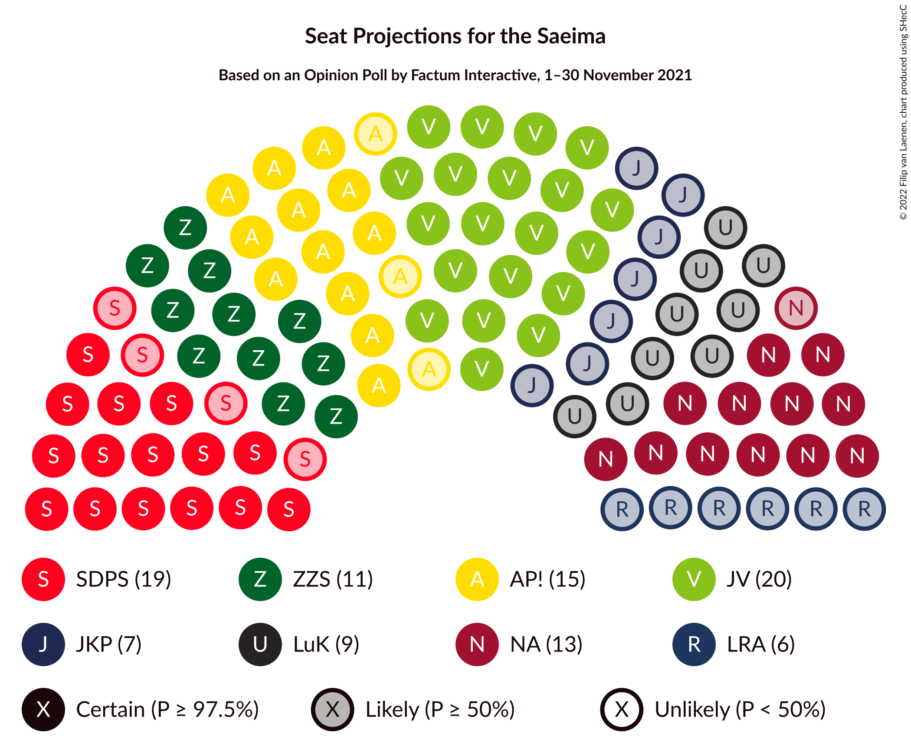

# Opinion Poll by Factum Interactive, 1–30 November 2021

<a href="#voting-intentions">Voting Intentions</a> | <a href="#seats">Seats</a> | <a href="#coalitions">Coalitions</a> | <a href="#technical-information">Technical Information</a>

## Voting Intentions

### Confidence Intervals

| Party | Last Result | Poll Result | 80% Confidence Interval | 90% Confidence Interval | 95% Confidence Interval | 99% Confidence Interval |
|:-----:|:-----------:|:-----------:|:-----------------------:|:-----------------------:|:-----------------------:|:-----------------------:|
| Jaunā VIENOTĪBA | 6.7% | 16.9% | 15.3–18.6% |14.9–19.1% |14.5–19.5% |13.8–20.4% |
| Sociāldemokrātiskā partija “Saskaņa” | 19.8% | 12.9% | 11.6–14.5% |11.2–15.0% |10.9–15.3% |10.2–16.1% |
| Attīstībai/Par! | 12.0% | 12.6% | 11.2–14.1% |10.9–14.6% |10.5–15.0% |9.9–15.7% |
| Nacionālā apvienība „Visu Latvijai!”–„Tēvzemei un Brīvībai/LNNK” | 11.0% | 11.4% | 10.2–12.9% |9.8–13.4% |9.5–13.7% |8.9–14.5% |
| Zaļo un Zemnieku savienība | 9.9% | 9.4% | 8.2–10.7% |7.9–11.1% |7.6–11.5% |7.1–12.2% |
| PROGRESĪVIE | 2.6% | 5.9% | 5.0–7.0% |4.7–7.4% |4.5–7.7% |4.1–8.3% |
| Jaunā konservatīvā partija | 13.6% | 5.5% | 4.7–6.7% |4.4–7.0% |4.2–7.3% |3.8–7.9% |
| Likums un kārtība | 0.0% | 5.4% | 4.6–6.6% |4.3–6.9% |4.1–7.1% |3.7–7.7% |
| Latvijas Reģionu Apvienība | 4.1% | 4.8% | 4.0–5.9% |3.8–6.2% |3.6–6.5% |3.2–7.0% |
| Latvija pirmajā vietā | N/A | 4.6% | 3.8–5.7% |3.6–6.0% |3.4–6.2% |3.1–6.8% |
| Latvijas Krievu savienība | 3.2% | 3.0% | 2.4–3.9% |2.2–4.1% |2.1–4.4% |1.8–4.8% |
| Republika | N/A | 2.0% | 1.5–2.7% |1.3–2.9% |1.2–3.1% |1.0–3.5% |
| Politiskā partija „KPV LV” | 14.2% | 0.8% | 0.5–1.4% |0.5–1.5% |0.4–1.7% |0.3–2.0% |

*Note:* The poll result column reflects the actual value used in the calculations. Published results may vary slightly, and in addition be rounded to fewer digits.

## Seats

### Confidence Intervals

| Party | Last Result | Median | 80% Confidence Interval | 90% Confidence Interval | 95% Confidence Interval | 99% Confidence Interval |
|:-----:|:-----------:|:------:|:-----------------------:|:-----------------------:|:-----------------------:|:-----------------------:|
| <a href="#jaunā-vienotība">Jaunā VIENOTĪBA</a> | 8 | 20 | 17–23 |17–25 |17–25 |16–26 |
| <a href="#sociāldemokrātiskā-partija-“saskaņa”">Sociāldemokrātiskā partija “Saskaņa”</a> | 23 | 16 | 16–19 |15–20 |15–21 |14–22 |
| <a href="#attīstībai/par!">Attīstībai/Par!</a> | 13 | 15 | 13–17 |13–17 |12–18 |11–20 |
| <a href="#nacionālā-apvienība-„visu-latvijai!”–„tēvzemei-un-brīvībai/lnnk”">Nacionālā apvienība „Visu Latvijai!”–„Tēvzemei un Brīvībai/LNNK”</a> | 13 | 14 | 10–17 |10–17 |10–17 |10–18 |
| <a href="#zaļo-un-zemnieku-savienība">Zaļo un Zemnieku savienība</a> | 11 | 12 | 11–14 |10–15 |8–15 |7–16 |
| <a href="#progresīvie">PROGRESĪVIE</a> | 0 | 7 | 0–9 |0–9 |0–9 |0–11 |
| <a href="#jaunā-konservatīvā-partija">Jaunā konservatīvā partija</a> | 16 | 7 | 0–8 |0–8 |0–9 |0–9 |
| <a href="#likums-un-kārtība">Likums un kārtība</a> | 0 | 7 | 0–9 |0–9 |0–9 |0–11 |
| <a href="#latvijas-reģionu-apvienība">Latvijas Reģionu Apvienība</a> | 0 | 0 | 0–6 |0–7 |0–7 |0–7 |
| <a href="#latvija-pirmajā-vietā">Latvija pirmajā vietā</a> | N/A | 0 | 0–7 |0–7 |0–7 |0–10 |
| <a href="#latvijas-krievu-savienība">Latvijas Krievu savienība</a> | 0 | 0 | 0 |0 |0 |0 |
| <a href="#republika">Republika</a> | N/A | 0 | 0 |0 |0 |0 |
| <a href="#politiskā-partija-„kpv-lv”">Politiskā partija „KPV LV”</a> | 16 | 0 | 0 |0 |0 |0 |

