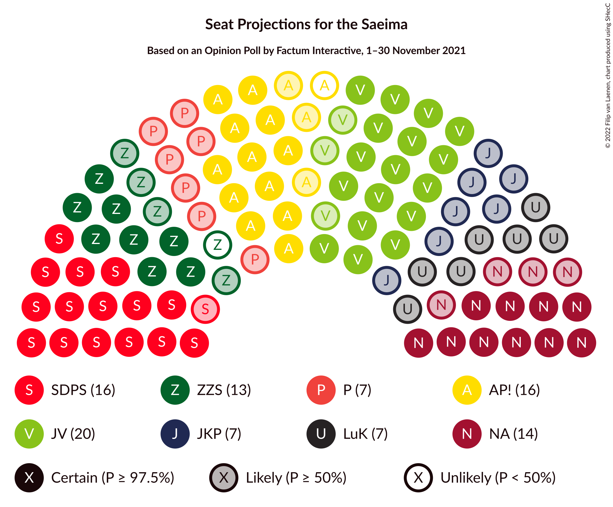

# Opinion Poll by Factum Interactive, 1–30 November 2021

<a href="#voting-intentions">Voting Intentions</a> | <a href="#seats">Seats</a> | <a href="#coalitions">Coalitions</a> | <a href="#technical-information">Technical Information</a>

## Voting Intentions

### Confidence Intervals

| Party | Last Result | Poll Result | 80% Confidence Interval | 90% Confidence Interval | 95% Confidence Interval | 99% Confidence Interval |
|:-----:|:-----------:|:-----------:|:-----------------------:|:-----------------------:|:-----------------------:|:-----------------------:|
| Jaunā VIENOTĪBA | 6.7% | 17.4% | 15.9–19.2% |15.4–19.7% |15.0–20.1% |14.3–21.0% |
| Sociāldemokrātiskā partija “Saskaņa” | 19.8% | 13.4% | 12.0–15.0% |11.6–15.4% |11.3–15.8% |10.7–16.6% |
| Attīstībai/Par! | 12.0% | 12.9% | 11.6–14.5% |11.2–15.0% |10.9–15.3% |10.2–16.1% |
| Nacionālā apvienība „Visu Latvijai!”–„Tēvzemei un Brīvībai/LNNK” | 11.0% | 11.8% | 10.5–13.3% |10.1–13.7% |9.8–14.1% |9.2–14.9% |
| Zaļo un Zemnieku savienība | 9.9% | 6.4% | 5.4–7.5% |5.1–7.9% |4.9–8.2% |4.5–8.8% |
| PROGRESĪVIE | 2.6% | 6.1% | 5.2–7.3% |4.9–7.6% |4.7–7.9% |4.3–8.5% |
| Jaunā konservatīvā partija | 13.6% | 5.7% | 4.8–6.8% |4.5–7.1% |4.3–7.4% |3.9–8.0% |
| Likums un kārtība | 0.0% | 5.5% | 4.7–6.7% |4.4–7.0% |4.2–7.3% |3.8–7.9% |
| Latvijas Reģionu Apvienība | 4.1% | 5.1% | 4.2–6.2% |4.0–6.5% |3.8–6.8% |3.4–7.3% |
| Latvija pirmajā vietā | N/A | 4.7% | 3.9–5.8% |3.7–6.1% |3.5–6.4% |3.2–6.9% |
| Latvijas Krievu savienība | 3.2% | 3.1% | 2.5–4.0% |2.3–4.3% |2.1–4.5% |1.9–5.0% |
| Republika | N/A | 2.1% | 1.6–2.9% |1.4–3.1% |1.3–3.3% |1.1–3.7% |
| Politiskā partija „KPV LV” | 14.2% | 0.8% | 0.5–1.4% |0.5–1.5% |0.4–1.7% |0.3–2.0% |

*Note:* The poll result column reflects the actual value used in the calculations. Published results may vary slightly, and in addition be rounded to fewer digits.

## Seats

### Confidence Intervals

| Party | Last Result | Median | 80% Confidence Interval | 90% Confidence Interval | 95% Confidence Interval | 99% Confidence Interval |
|:-----:|:-----------:|:------:|:-----------------------:|:-----------------------:|:-----------------------:|:-----------------------:|
| <a href="#jaunā-vienotība">Jaunā VIENOTĪBA</a> | 8 | 20 | 20–24 |18–25 |18–26 |16–28 |
| <a href="#sociāldemokrātiskā-partija-“saskaņa”">Sociāldemokrātiskā partija “Saskaņa”</a> | 23 | 17 | 15–19 |15–21 |15–21 |15–24 |
| <a href="#attīstībai/par!">Attīstībai/Par!</a> | 13 | 15 | 14–18 |13–20 |12–20 |10–21 |
| <a href="#nacionālā-apvienība-„visu-latvijai!”–„tēvzemei-un-brīvībai/lnnk”">Nacionālā apvienība „Visu Latvijai!”–„Tēvzemei un Brīvībai/LNNK”</a> | 13 | 14 | 13–16 |12–17 |11–18 |10–20 |
| <a href="#zaļo-un-zemnieku-savienība">Zaļo un Zemnieku savienība</a> | 11 | 7 | 7–11 |6–11 |0–11 |0–12 |
| <a href="#progresīvie">PROGRESĪVIE</a> | 0 | 7 | 6–9 |6–9 |0–10 |0–11 |
| <a href="#jaunā-konservatīvā-partija">Jaunā konservatīvā partija</a> | 16 | 7 | 0–8 |0–9 |0–9 |0–10 |
| <a href="#likums-un-kārtība">Likums un kārtība</a> | 0 | 7 | 0–8 |0–10 |0–10 |0–11 |
| <a href="#latvijas-reģionu-apvienība">Latvijas Reģionu Apvienība</a> | 0 | 0 | 0–7 |0–7 |0–7 |0–9 |
| <a href="#latvija-pirmajā-vietā">Latvija pirmajā vietā</a> | N/A | 0 | 0–7 |0–7 |0–7 |0–9 |
| <a href="#latvijas-krievu-savienība">Latvijas Krievu savienība</a> | 0 | 0 | 0 |0 |0 |0 |
| <a href="#republika">Republika</a> | N/A | 0 | 0 |0 |0 |0 |
| <a href="#politiskā-partija-„kpv-lv”">Politiskā partija „KPV LV”</a> | 16 | 0 | 0 |0 |0 |0 |

