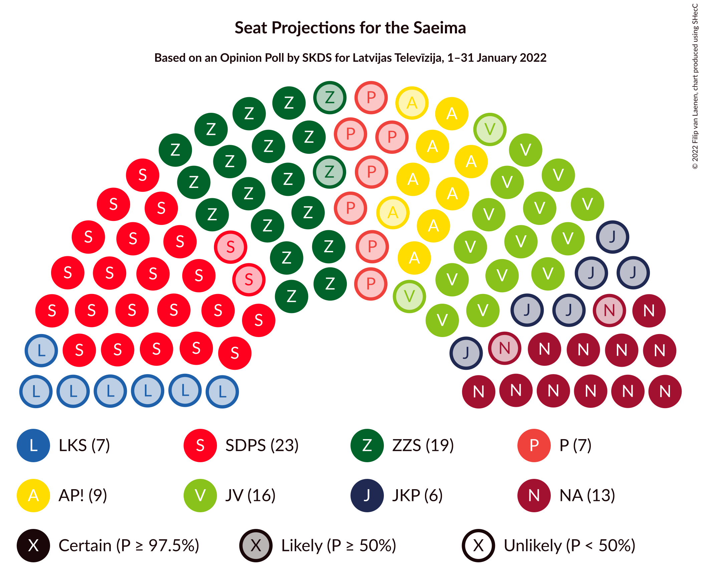

# Opinion Poll by SKDS for Latvijas Televīzija, 1–31 January 2022

<a href="#voting-intentions">Voting Intentions</a> | <a href="#seats">Seats</a> | <a href="#coalitions">Coalitions</a> | <a href="#technical-information">Technical Information</a>

## Voting Intentions

### Confidence Intervals

| Party | Last Result | Poll Result | 80% Confidence Interval | 90% Confidence Interval | 95% Confidence Interval | 99% Confidence Interval |
|:-----:|:-----------:|:-----------:|:-----------------------:|:-----------------------:|:-----------------------:|:-----------------------:|
| Sociāldemokrātiskā partija “Saskaņa” | 19.8% | 18.4% | 17.3–19.6% |16.9–20.0% |16.7–20.3% |16.1–20.9% |
| Zaļo un Zemnieku savienība | 9.9% | 14.3% | 13.3–15.4% |13.0–15.7% |12.8–16.0% |12.3–16.5% |
| Jaunā VIENOTĪBA | 6.7% | 13.1% | 12.1–14.1% |11.8–14.4% |11.6–14.7% |11.1–15.2% |
| Nacionālā apvienība „Visu Latvijai!”–„Tēvzemei un Brīvībai/LNNK” | 11.0% | 10.2% | 9.3–11.2% |9.1–11.4% |8.9–11.7% |8.5–12.2% |
| Attīstībai/Par! | 12.0% | 8.0% | 7.2–8.9% |7.0–9.1% |6.8–9.3% |6.5–9.8% |
| PROGRESĪVIE | 2.6% | 5.7% | 5.1–6.5% |4.9–6.7% |4.7–6.9% |4.4–7.3% |
| Latvijas Krievu savienība | 3.2% | 5.1% | 4.5–5.8% |4.3–6.0% |4.2–6.2% |3.9–6.6% |
| Jaunā konservatīvā partija | 13.6% | 4.9% | 4.3–5.6% |4.1–5.8% |4.0–6.0% |3.7–6.3% |
| Latvija pirmajā vietā | N/A | 4.7% | 4.1–5.4% |4.0–5.6% |3.8–5.8% |3.6–6.1% |
| Latvijas Reģionu Apvienība | 4.1% | 4.5% | 3.9–5.2% |3.7–5.4% |3.6–5.5% |3.4–5.9% |
| Likums un kārtība | 0.0% | 4.4% | 3.8–5.1% |3.7–5.3% |3.5–5.4% |3.3–5.8% |
| Republika | N/A | 2.6% | 2.2–3.2% |2.1–3.3% |2.0–3.5% |1.8–3.7% |

*Note:* The poll result column reflects the actual value used in the calculations. Published results may vary slightly, and in addition be rounded to fewer digits.

## Seats

### Confidence Intervals

| Party | Last Result | Median | 80% Confidence Interval | 90% Confidence Interval | 95% Confidence Interval | 99% Confidence Interval |
|:-----:|:-----------:|:------:|:-----------------------:|:-----------------------:|:-----------------------:|:-----------------------:|
| <a href="#sociāldemokrātiskā-partija-“saskaņa”">Sociāldemokrātiskā partija “Saskaņa”</a> | 23 | 23 | 21–27 |21–28 |21–28 |20–29 |
| <a href="#zaļo-un-zemnieku-savienība">Zaļo un Zemnieku savienība</a> | 11 | 19 | 17–23 |17–23 |17–23 |15–23 |
| <a href="#jaunā-vienotība">Jaunā VIENOTĪBA</a> | 8 | 16 | 15–18 |15–18 |14–19 |13–20 |
| <a href="#nacionālā-apvienība-„visu-latvijai!”–„tēvzemei-un-brīvībai/lnnk”">Nacionālā apvienība „Visu Latvijai!”–„Tēvzemei un Brīvībai/LNNK”</a> | 13 | 13 | 12–15 |12–15 |11–15 |11–17 |
| <a href="#attīstībai/par!">Attīstībai/Par!</a> | 13 | 9 | 7–11 |7–13 |7–13 |7–14 |
| <a href="#progresīvie">PROGRESĪVIE</a> | 0 | 7 | 7–8 |0–8 |0–8 |0–9 |
| <a href="#latvijas-krievu-savienība">Latvijas Krievu savienība</a> | 0 | 7 | 0–8 |0–8 |0–8 |0–8 |
| <a href="#jaunā-konservatīvā-partija">Jaunā konservatīvā partija</a> | 16 | 6 | 0–7 |0–7 |0–7 |0–7 |
| <a href="#latvija-pirmajā-vietā">Latvija pirmajā vietā</a> | N/A | 0 | 0–6 |0–6 |0–6 |0–7 |
| <a href="#latvijas-reģionu-apvienība">Latvijas Reģionu Apvienība</a> | 0 | 0 | 0 |0 |0–6 |0–7 |
| <a href="#likums-un-kārtība">Likums un kārtība</a> | 0 | 0 | 0 |0–6 |0–6 |0–7 |
| <a href="#republika">Republika</a> | N/A | 0 | 0 |0 |0 |0 |

