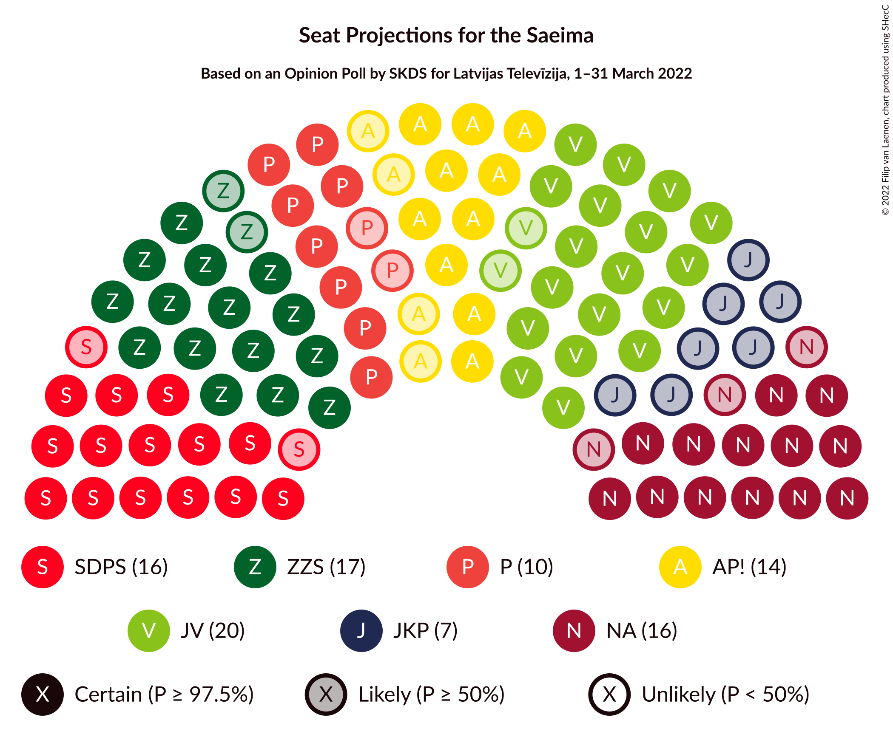

# Opinion Poll by SKDS for Latvijas Televīzija, 1–31 March 2022

<a href="#voting-intentions">Voting Intentions</a> | <a href="#seats">Seats</a> | <a href="#coalitions">Coalitions</a> | <a href="#technical-information">Technical Information</a>

## Voting Intentions

### Confidence Intervals

| Party | Last Result | Poll Result | 80% Confidence Interval | 90% Confidence Interval | 95% Confidence Interval | 99% Confidence Interval |
|:-----:|:-----------:|:-----------:|:-----------------------:|:-----------------------:|:-----------------------:|:-----------------------:|
| Jaunā VIENOTĪBA | 6.7% | 16.2% | 15.1–17.4% |14.8–17.7% |14.6–18.0% |14.1–18.5% |
| Zaļo un Zemnieku savienība | 9.9% | 13.2% | 12.2–14.3% |11.9–14.6% |11.7–14.8% |11.2–15.3% |
| Nacionālā apvienība „Visu Latvijai!”–„Tēvzemei un Brīvībai/LNNK” | 11.0% | 12.3% | 11.4–13.4% |11.1–13.6% |10.9–13.9% |10.4–14.4% |
| Sociāldemokrātiskā partija “Saskaņa” | 19.8% | 11.5% | 10.6–12.5% |10.3–12.8% |10.1–13.0% |9.7–13.5% |
| Attīstībai/Par! | 12.0% | 9.3% | 8.5–10.2% |8.2–10.5% |8.0–10.7% |7.7–11.2% |
| PROGRESĪVIE | 2.6% | 8.3% | 7.5–9.2% |7.3–9.4% |7.1–9.7% |6.8–10.1% |
| Latvijas Krievu savienība | 3.2% | 5.4% | 4.8–6.1% |4.6–6.3% |4.4–6.5% |4.1–6.9% |
| Jaunā konservatīvā partija | 13.6% | 5.3% | 4.6–6.0% |4.5–6.2% |4.3–6.4% |4.1–6.8% |
| Latvija pirmajā vietā | N/A | 4.3% | 3.7–5.0% |3.6–5.2% |3.4–5.3% |3.2–5.7% |
| Latvijas Reģionu Apvienība | 4.1% | 4.1% | 3.6–4.8% |3.4–5.0% |3.3–5.1% |3.0–5.5% |
| Likums un kārtība | 0.0% | 3.2% | 2.7–3.8% |2.6–3.9% |2.5–4.1% |2.3–4.4% |
| Republika | N/A | 1.7% | 1.4–2.2% |1.3–2.3% |1.2–2.4% |1.1–2.7% |
| Politiskā partija „KPV LV” | 14.2% | 0.5% | 0.3–0.8% |0.3–0.9% |0.3–0.9% |0.2–1.1% |

*Note:* The poll result column reflects the actual value used in the calculations. Published results may vary slightly, and in addition be rounded to fewer digits.

## Seats

### Confidence Intervals

| Party | Last Result | Median | 80% Confidence Interval | 90% Confidence Interval | 95% Confidence Interval | 99% Confidence Interval |
|:-----:|:-----------:|:------:|:-----------------------:|:-----------------------:|:-----------------------:|:-----------------------:|
| <a href="#jaunā-vienotība">Jaunā VIENOTĪBA</a> | 8 | 20 | 19–23 |19–24 |18–24 |17–26 |
| <a href="#zaļo-un-zemnieku-savienība">Zaļo un Zemnieku savienība</a> | 11 | 17 | 15–18 |15–18 |15–18 |14–19 |
| <a href="#nacionālā-apvienība-„visu-latvijai!”–„tēvzemei-un-brīvībai/lnnk”">Nacionālā apvienība „Visu Latvijai!”–„Tēvzemei un Brīvībai/LNNK”</a> | 13 | 16 | 14–17 |14–19 |13–19 |13–19 |
| <a href="#sociāldemokrātiskā-partija-“saskaņa”">Sociāldemokrātiskā partija “Saskaņa”</a> | 23 | 16 | 14–17 |14–17 |14–17 |13–18 |
| <a href="#attīstībai/par!">Attīstībai/Par!</a> | 13 | 14 | 10–14 |10–14 |10–14 |9–15 |
| <a href="#progresīvie">PROGRESĪVIE</a> | 0 | 10 | 8–11 |8–11 |8–11 |8–12 |
| <a href="#latvijas-krievu-savienība">Latvijas Krievu savienība</a> | 0 | 0 | 0–8 |0–8 |0–8 |0–9 |
| <a href="#jaunā-konservatīvā-partija">Jaunā konservatīvā partija</a> | 16 | 7 | 0–7 |0–7 |0–8 |0–8 |
| <a href="#latvija-pirmajā-vietā">Latvija pirmajā vietā</a> | N/A | 0 | 0 |0 |0–5 |0–6 |
| <a href="#latvijas-reģionu-apvienība">Latvijas Reģionu Apvienība</a> | 0 | 0 | 0 |0 |0 |0–6 |
| <a href="#likums-un-kārtība">Likums un kārtība</a> | 0 | 0 | 0 |0 |0 |0 |
| <a href="#republika">Republika</a> | N/A | 0 | 0 |0 |0 |0 |
| <a href="#politiskā-partija-„kpv-lv”">Politiskā partija „KPV LV”</a> | 16 | 0 | 0 |0 |0 |0 |

