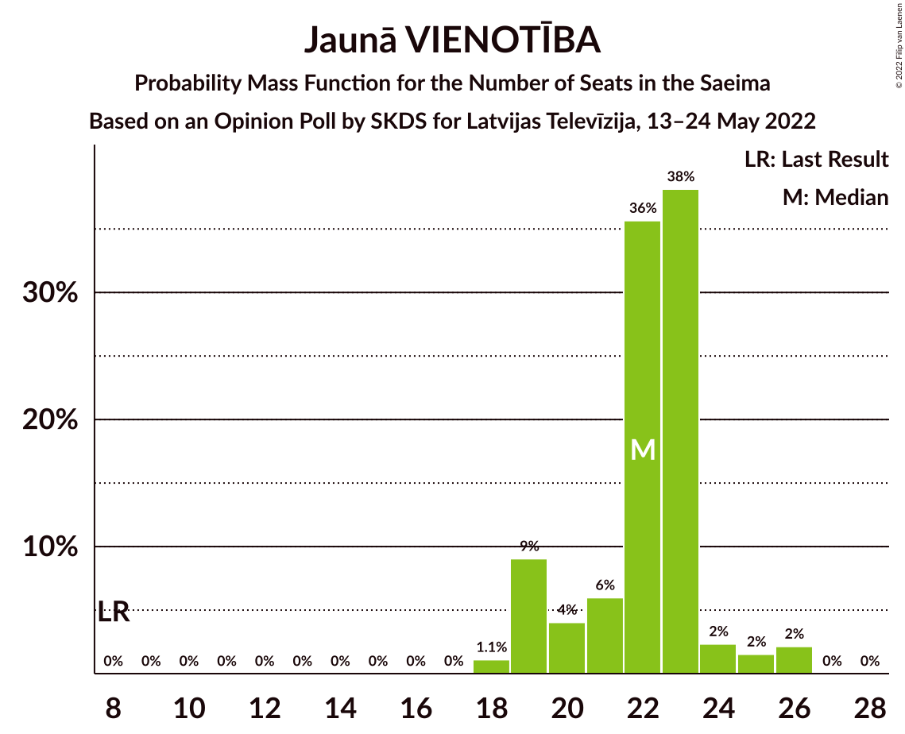
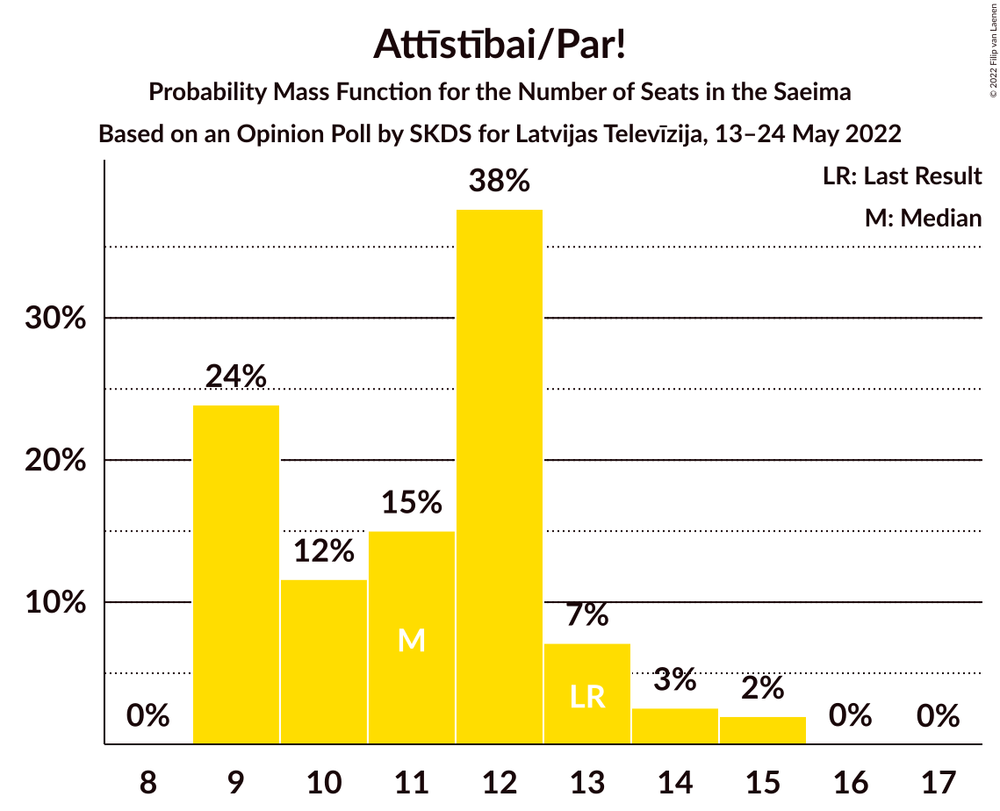
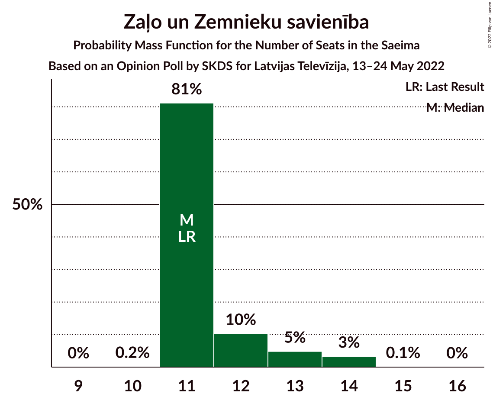
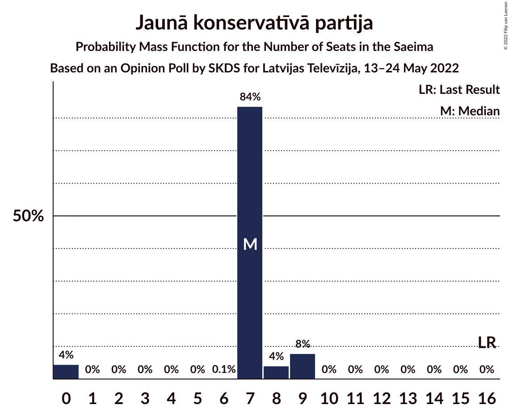
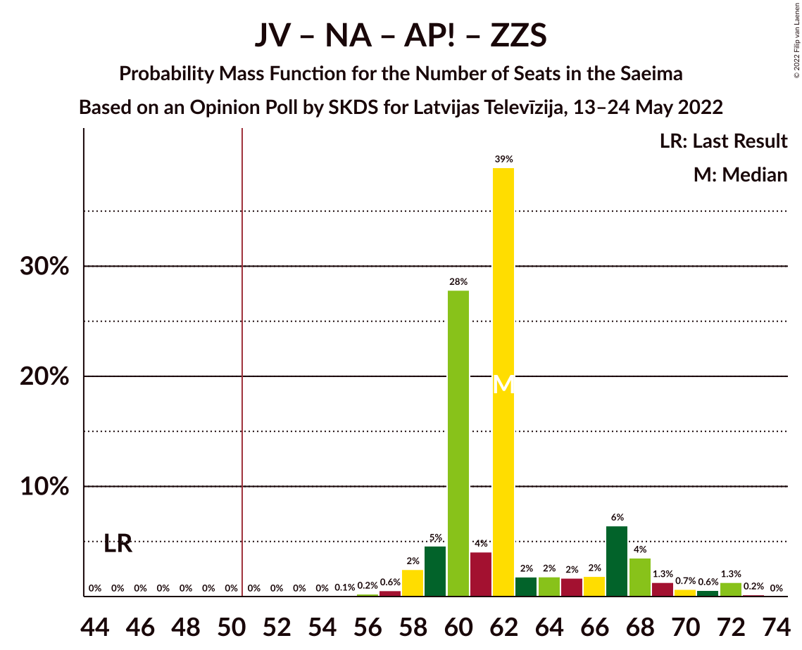
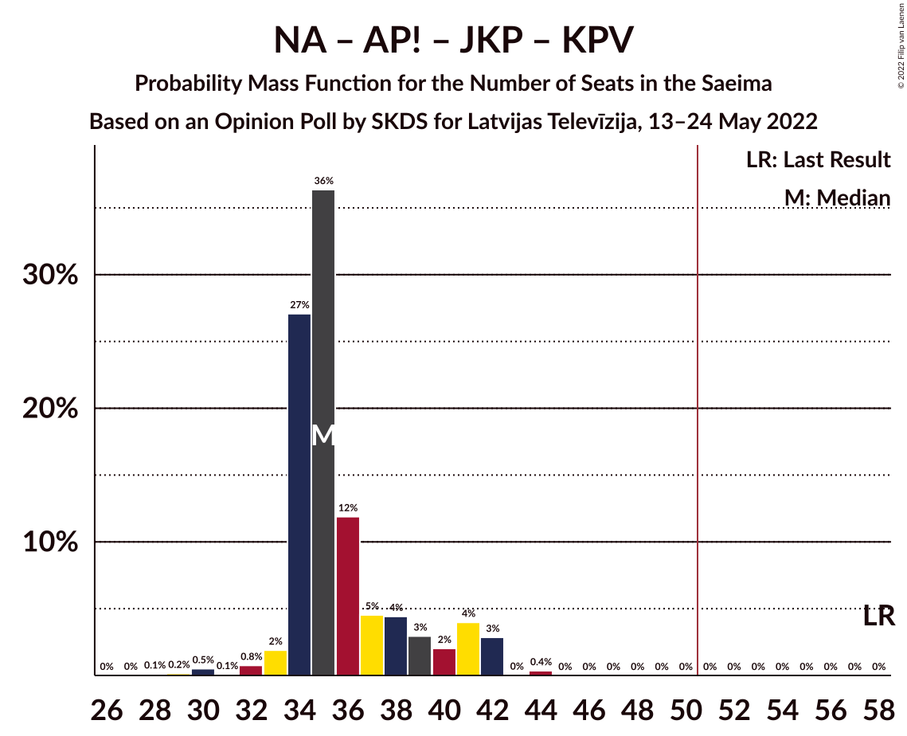

# Opinion Poll by SKDS for Latvijas Televīzija, 13–24 May 2022

<a href="#voting-intentions">Voting Intentions</a> | <a href="#seats">Seats</a> | <a href="#coalitions">Coalitions</a> | <a href="#technical-information">Technical Information</a>

## Voting Intentions

### Confidence Intervals

| Party | Last Result | Poll Result | 80% Confidence Interval | 90% Confidence Interval | 95% Confidence Interval | 99% Confidence Interval |
|:-----:|:-----------:|:-----------:|:-----------------------:|:-----------------------:|:-----------------------:|:-----------------------:|
| Jaunā VIENOTĪBA | 6.7% | 17.6% | 16.5–18.8% |16.2–19.2% |16.0–19.5% |15.4–20.1% |
| Nacionālā apvienība „Visu Latvijai!”–„Tēvzemei un Brīvībai/LNNK” | 11.0% | 15.2% | 14.2–16.4% |13.9–16.7% |13.6–16.9% |13.2–17.5% |
| Sociāldemokrātiskā partija “Saskaņa” | 19.8% | 11.8% | 10.9–12.8% |10.6–13.1% |10.4–13.4% |10.0–13.9% |
| Attīstībai/Par! | 12.0% | 9.6% | 8.7–10.5% |8.5–10.8% |8.3–11.0% |7.9–11.5% |
| Zaļo un Zemnieku savienība | 9.9% | 9.5% | 8.7–10.5% |8.5–10.7% |8.3–11.0% |7.9–11.4% |
| PROGRESĪVIE | 2.6% | 7.7% | 7.0–8.6% |6.8–8.8% |6.6–9.0% |6.2–9.5% |
| Jaunā konservatīvā partija | 13.6% | 5.9% | 5.2–6.7% |5.1–6.9% |4.9–7.1% |4.6–7.5% |
| Latvijas Reģionu Apvienība | 4.1% | 5.1% | 4.5–5.9% |4.3–6.1% |4.2–6.2% |3.9–6.6% |
| Latvijas Krievu savienība | 3.2% | 4.3% | 3.7–5.0% |3.6–5.2% |3.5–5.3% |3.2–5.7% |
| Stabilitātei! | 0.0% | 4.2% | 3.6–4.9% |3.5–5.0% |3.4–5.2% |3.1–5.6% |
| Latvija pirmajā vietā | 0.0% | 3.4% | 2.9–4.0% |2.8–4.2% |2.7–4.4% |2.5–4.7% |
| Likums un kārtība | 0.0% | 2.0% | 1.6–2.5% |1.5–2.6% |1.4–2.7% |1.3–3.0% |
| Republika | 0.0% | 1.8% | 1.5–2.3% |1.4–2.4% |1.3–2.5% |1.1–2.8% |
| Politiskā partija „KPV LV” | 14.2% | 0.7% | 0.5–1.1% |0.5–1.1% |0.4–1.2% |0.3–1.4% |

*Note:* The poll result column reflects the actual value used in the calculations. Published results may vary slightly, and in addition be rounded to fewer digits.

## Seats

### Confidence Intervals

| Party | Last Result | Median | 80% Confidence Interval | 90% Confidence Interval | 95% Confidence Interval | 99% Confidence Interval |
|:-----:|:-----------:|:------:|:-----------------------:|:-----------------------:|:-----------------------:|:-----------------------:|
| <a href="#jaunā-vienotība">Jaunā VIENOTĪBA</a> | 8 | 23 | 19–23 |19–24 |19–25 |19–25 |
| <a href="#nacionālā-apvienība-„visu-latvijai!”–„tēvzemei-un-brīvībai/lnnk”">Nacionālā apvienība „Visu Latvijai!”–„Tēvzemei un Brīvībai/LNNK”</a> | 13 | 16 | 16–19 |16–20 |16–23 |15–23 |
| <a href="#sociāldemokrātiskā-partija-“saskaņa”">Sociāldemokrātiskā partija “Saskaņa”</a> | 23 | 16 | 16 |15–17 |14–17 |14–19 |
| <a href="#attīstībai/par!">Attīstībai/Par!</a> | 13 | 12 | 11–13 |10–13 |10–14 |9–14 |
| <a href="#zaļo-un-zemnieku-savienība">Zaļo un Zemnieku savienība</a> | 11 | 11 | 11–12 |11–14 |11–14 |11–14 |
| <a href="#progresīvie">PROGRESĪVIE</a> | 0 | 9 | 8–9 |7–11 |7–11 |7–11 |
| <a href="#jaunā-konservatīvā-partija">Jaunā konservatīvā partija</a> | 16 | 7 | 7–8 |7–9 |0–9 |0–9 |
| <a href="#latvijas-reģionu-apvienība">Latvijas Reģionu Apvienība</a> | 0 | 6 | 0–6 |0–7 |0–7 |0–7 |
| <a href="#latvijas-krievu-savienība">Latvijas Krievu savienība</a> | 0 | 0 | 0 |0 |0 |0–8 |
| <a href="#stabilitātei!">Stabilitātei!</a> | 0 | 0 | 0–5 |0–5 |0–6 |0–6 |
| <a href="#latvija-pirmajā-vietā">Latvija pirmajā vietā</a> | 0 | 0 | 0 |0 |0 |0 |
| <a href="#likums-un-kārtība">Likums un kārtība</a> | 0 | 0 | 0 |0 |0 |0 |
| <a href="#republika">Republika</a> | 0 | 0 | 0 |0 |0 |0 |
| <a href="#politiskā-partija-„kpv-lv”">Politiskā partija „KPV LV”</a> | 16 | 0 | 0 |0 |0 |0 |

### Jaunā VIENOTĪBA

*For a full overview of the results for this party, see the [Jaunā VIENOTĪBA](party-jaunāvienotība.html) page.*

| Number of Seats | Probability | Accumulated | Special Marks |
|:---------------:|:-----------:|:-----------:|:-------------:|
| 8 | 0% | 100% | Last Result |
| 9 | 0% | 100% |  |
| 10 | 0% | 100% |  |
| 11 | 0% | 100% |  |
| 12 | 0% | 100% |  |
| 13 | 0% | 100% |  |
| 14 | 0% | 100% |  |
| 15 | 0% | 100% |  |
| 16 | 0% | 100% |  |
| 17 | 0% | 100% |  |
| 18 | 0.2% | 100% |  |
| 19 | 10% | 99.8% |  |
| 20 | 4% | 90% |  |
| 21 | 3% | 86% |  |
| 22 | 6% | 82% |  |
| 23 | 71% | 77% | Median |
| 24 | 2% | 5% |  |
| 25 | 3% | 3% |  |
| 26 | 0.2% | 0.2% |  |
| 27 | 0% | 0% |  |

### Nacionālā apvienība „Visu Latvijai!”–„Tēvzemei un Brīvībai/LNNK”

*For a full overview of the results for this party, see the [Nacionālā apvienība „Visu Latvijai!”–„Tēvzemei un Brīvībai/LNNK”](party-nacionālāapvienība„visulatvijai”–„tēvzemeiunbrīvībailnnk”.html) page.*

| Number of Seats | Probability | Accumulated | Special Marks |
|:---------------:|:-----------:|:-----------:|:-------------:|
| 13 | 0% | 100% | Last Result |
| 14 | 0.1% | 100% |  |
| 15 | 1.3% | 99.9% |  |
| 16 | 74% | 98.6% | Median |
| 17 | 4% | 24% |  |
| 18 | 3% | 21% |  |
| 19 | 11% | 18% |  |
| 20 | 3% | 7% |  |
| 21 | 0.8% | 4% |  |
| 22 | 0.4% | 3% |  |
| 23 | 3% | 3% |  |
| 24 | 0% | 0% |  |

### Sociāldemokrātiskā partija “Saskaņa”

*For a full overview of the results for this party, see the [Sociāldemokrātiskā partija “Saskaņa”](party-sociāldemokrātiskāpartija“saskaņa”.html) page.*

| Number of Seats | Probability | Accumulated | Special Marks |
|:---------------:|:-----------:|:-----------:|:-------------:|
| 13 | 0.1% | 100% |  |
| 14 | 5% | 99.8% |  |
| 15 | 4% | 95% |  |
| 16 | 85% | 91% | Median |
| 17 | 5% | 7% |  |
| 18 | 0.8% | 1.3% |  |
| 19 | 0.5% | 0.6% |  |
| 20 | 0.1% | 0.1% |  |
| 21 | 0% | 0% |  |
| 22 | 0% | 0% |  |
| 23 | 0% | 0% | Last Result |

### Attīstībai/Par!

*For a full overview of the results for this party, see the [Attīstībai/Par!](party-attīstībaipar.html) page.*

| Number of Seats | Probability | Accumulated | Special Marks |
|:---------------:|:-----------:|:-----------:|:-------------:|
| 9 | 0.9% | 100% |  |
| 10 | 6% | 99.1% |  |
| 11 | 10% | 93% |  |
| 12 | 70% | 83% | Median |
| 13 | 10% | 13% | Last Result |
| 14 | 3% | 3% |  |
| 15 | 0.4% | 0.5% |  |
| 16 | 0% | 0% |  |

### Zaļo un Zemnieku savienība

*For a full overview of the results for this party, see the [Zaļo un Zemnieku savienība](party-zaļounzemniekusavienība.html) page.*

| Number of Seats | Probability | Accumulated | Special Marks |
|:---------------:|:-----------:|:-----------:|:-------------:|
| 10 | 0.3% | 100% |  |
| 11 | 88% | 99.7% | Last Result, Median |
| 12 | 3% | 12% |  |
| 13 | 5% | 10% |  |
| 14 | 5% | 5% |  |
| 15 | 0.1% | 0.2% |  |
| 16 | 0% | 0.1% |  |
| 17 | 0% | 0% |  |

### PROGRESĪVIE

*For a full overview of the results for this party, see the [PROGRESĪVIE](party-progresīvie.html) page.*

| Number of Seats | Probability | Accumulated | Special Marks |
|:---------------:|:-----------:|:-----------:|:-------------:|
| 0 | 0% | 100% | Last Result |
| 1 | 0% | 100% |  |
| 2 | 0% | 100% |  |
| 3 | 0% | 100% |  |
| 4 | 0% | 100% |  |
| 5 | 0% | 100% |  |
| 6 | 0% | 100% |  |
| 7 | 7% | 100% |  |
| 8 | 15% | 93% |  |
| 9 | 70% | 79% | Median |
| 10 | 2% | 9% |  |
| 11 | 6% | 7% |  |
| 12 | 0.1% | 0.2% |  |
| 13 | 0.1% | 0.1% |  |
| 14 | 0% | 0% |  |

### Jaunā konservatīvā partija

*For a full overview of the results for this party, see the [Jaunā konservatīvā partija](party-jaunākonservatīvāpartija.html) page.*

| Number of Seats | Probability | Accumulated | Special Marks |
|:---------------:|:-----------:|:-----------:|:-------------:|
| 0 | 5% | 100% |  |
| 1 | 0% | 95% |  |
| 2 | 0% | 95% |  |
| 3 | 0% | 95% |  |
| 4 | 0% | 95% |  |
| 5 | 0% | 95% |  |
| 6 | 0.1% | 95% |  |
| 7 | 84% | 95% | Median |
| 8 | 3% | 11% |  |
| 9 | 7% | 7% |  |
| 10 | 0% | 0% |  |
| 11 | 0% | 0% |  |
| 12 | 0% | 0% |  |
| 13 | 0% | 0% |  |
| 14 | 0% | 0% |  |
| 15 | 0% | 0% |  |
| 16 | 0% | 0% | Last Result |

### Latvijas Reģionu Apvienība

*For a full overview of the results for this party, see the [Latvijas Reģionu Apvienība](party-latvijasreģionuapvienība.html) page.*

| Number of Seats | Probability | Accumulated | Special Marks |
|:---------------:|:-----------:|:-----------:|:-------------:|
| 0 | 14% | 100% | Last Result |
| 1 | 0% | 86% |  |
| 2 | 0% | 86% |  |
| 3 | 0% | 86% |  |
| 4 | 0% | 86% |  |
| 5 | 0% | 86% |  |
| 6 | 80% | 86% | Median |
| 7 | 5% | 6% |  |
| 8 | 0.1% | 0.1% |  |
| 9 | 0% | 0% |  |

### Latvijas Krievu savienība

*For a full overview of the results for this party, see the [Latvijas Krievu savienība](party-latvijaskrievusavienība.html) page.*

| Number of Seats | Probability | Accumulated | Special Marks |
|:---------------:|:-----------:|:-----------:|:-------------:|
| 0 | 98% | 100% | Last Result, Median |
| 1 | 0% | 2% |  |
| 2 | 0% | 2% |  |
| 3 | 0% | 2% |  |
| 4 | 0% | 2% |  |
| 5 | 0% | 2% |  |
| 6 | 0.9% | 2% |  |
| 7 | 0.6% | 1.2% |  |
| 8 | 0.6% | 0.6% |  |
| 9 | 0% | 0% |  |

### Stabilitātei!

*For a full overview of the results for this party, see the [Stabilitātei!](party-stabilitātei.html) page.*

| Number of Seats | Probability | Accumulated | Special Marks |
|:---------------:|:-----------:|:-----------:|:-------------:|
| 0 | 90% | 100% | Last Result, Median |
| 1 | 0% | 10% |  |
| 2 | 0% | 10% |  |
| 3 | 0% | 10% |  |
| 4 | 0% | 10% |  |
| 5 | 8% | 10% |  |
| 6 | 2% | 3% |  |
| 7 | 0.5% | 0.5% |  |
| 8 | 0% | 0% |  |

### Latvija pirmajā vietā

*For a full overview of the results for this party, see the [Latvija pirmajā vietā](party-latvijapirmajāvietā.html) page.*

| Number of Seats | Probability | Accumulated | Special Marks |
|:---------------:|:-----------:|:-----------:|:-------------:|
| 0 | 99.5% | 100% | Last Result, Median |
| 1 | 0% | 0.5% |  |
| 2 | 0% | 0.5% |  |
| 3 | 0% | 0.5% |  |
| 4 | 0% | 0.5% |  |
| 5 | 0% | 0.5% |  |
| 6 | 0.4% | 0.5% |  |
| 7 | 0% | 0% |  |

### Likums un kārtība

*For a full overview of the results for this party, see the [Likums un kārtība](party-likumsunkārtība.html) page.*

| Number of Seats | Probability | Accumulated | Special Marks |
|:---------------:|:-----------:|:-----------:|:-------------:|
| 0 | 100% | 100% | Last Result, Median |

### Republika

*For a full overview of the results for this party, see the [Republika](party-republika.html) page.*

| Number of Seats | Probability | Accumulated | Special Marks |
|:---------------:|:-----------:|:-----------:|:-------------:|
| 0 | 100% | 100% | Last Result, Median |

### Politiskā partija „KPV LV”

*For a full overview of the results for this party, see the [Politiskā partija „KPV LV”](party-politiskāpartija„kpvlv”.html) page.*

| Number of Seats | Probability | Accumulated | Special Marks |
|:---------------:|:-----------:|:-----------:|:-------------:|
| 0 | 100% | 100% | Median |
| 1 | 0% | 0% |  |
| 2 | 0% | 0% |  |
| 3 | 0% | 0% |  |
| 4 | 0% | 0% |  |
| 5 | 0% | 0% |  |
| 6 | 0% | 0% |  |
| 7 | 0% | 0% |  |
| 8 | 0% | 0% |  |
| 9 | 0% | 0% |  |
| 10 | 0% | 0% |  |
| 11 | 0% | 0% |  |
| 12 | 0% | 0% |  |
| 13 | 0% | 0% |  |
| 14 | 0% | 0% |  |
| 15 | 0% | 0% |  |
| 16 | 0% | 0% | Last Result |

## Coalitions

### Confidence Intervals

| Coalition | Last Result | Median | Majority? | 80% Confidence Interval | 90% Confidence Interval | 95% Confidence Interval | 99% Confidence Interval |
|:---------:|:-----------:|:------:|:---------:|:-----------------------:|:-----------------------:|:-----------------------:|:-----------------------:|
| Jaunā VIENOTĪBA – Nacionālā apvienība „Visu Latvijai!”–„Tēvzemei un Brīvībai/LNNK” – Attīstībai/Par! – Zaļo un Zemnieku savienība – Jaunā konservatīvā partija | 61 | 69 | 100% | 66–72 | 66–76 | 65–76 | 63–76 |
| Jaunā VIENOTĪBA – Nacionālā apvienība „Visu Latvijai!”–„Tēvzemei un Brīvībai/LNNK” – Attīstībai/Par! – Zaļo un Zemnieku savienība | 45 | 62 | 100% | 59–67 | 59–67 | 58–72 | 56–72 |
| Jaunā VIENOTĪBA – Nacionālā apvienība „Visu Latvijai!”–„Tēvzemei un Brīvībai/LNNK” – Zaļo un Zemnieku savienība – Jaunā konservatīvā partija | 48 | 57 | 99.9% | 55–59 | 53–64 | 53–65 | 52–65 |
| Jaunā VIENOTĪBA – Nacionālā apvienība „Visu Latvijai!”–„Tēvzemei un Brīvībai/LNNK” – Attīstībai/Par! – Jaunā konservatīvā partija | 50 | 58 | 99.7% | 55–61 | 55–62 | 54–62 | 53–63 |
| Jaunā VIENOTĪBA – Nacionālā apvienība „Visu Latvijai!”–„Tēvzemei un Brīvībai/LNNK” – Attīstībai/Par! – Jaunā konservatīvā partija – Politiskā partija „KPV LV” | 66 | 58 | 99.7% | 55–61 | 55–62 | 54–62 | 53–63 |
| Jaunā VIENOTĪBA – Nacionālā apvienība „Visu Latvijai!”–„Tēvzemei un Brīvībai/LNNK” – Attīstībai/Par! – Politiskā partija „KPV LV” | 50 | 51 | 84% | 48–53 | 48–54 | 47–61 | 46–61 |
| Jaunā VIENOTĪBA – Nacionālā apvienība „Visu Latvijai!”–„Tēvzemei un Brīvībai/LNNK” – Zaļo un Zemnieku savienība | 32 | 50 | 19% | 48–54 | 46–56 | 46–59 | 45–59 |
| Nacionālā apvienība „Visu Latvijai!”–„Tēvzemei un Brīvībai/LNNK” – Attīstībai/Par! – Zaļo un Zemnieku savienība – Jaunā konservatīvā partija | 53 | 46 | 10% | 46–51 | 45–53 | 44–53 | 41–54 |
| Jaunā VIENOTĪBA – Nacionālā apvienība „Visu Latvijai!”–„Tēvzemei un Brīvībai/LNNK” – Jaunā konservatīvā partija – Politiskā partija „KPV LV” | 53 | 46 | 6% | 44–48 | 42–51 | 42–51 | 41–51 |
| Nacionālā apvienība „Visu Latvijai!”–„Tēvzemei un Brīvībai/LNNK” – Attīstībai/Par! – Zaļo un Zemnieku savienība | 37 | 39 | 0% | 39–44 | 39–45 | 38–47 | 37–47 |
| Jaunā VIENOTĪBA – Attīstībai/Par! – Jaunā konservatīvā partija – Politiskā partija „KPV LV” | 53 | 42 | 0% | 38–42 | 37–43 | 36–43 | 33–44 |
| Nacionālā apvienība „Visu Latvijai!”–„Tēvzemei un Brīvībai/LNNK” – Zaļo un Zemnieku savienība – Jaunā konservatīvā partija | 40 | 34 | 0% | 34–38 | 34–42 | 33–42 | 30–42 |
| Nacionālā apvienība „Visu Latvijai!”–„Tēvzemei un Brīvībai/LNNK” – Attīstībai/Par! – Jaunā konservatīvā partija – Politiskā partija „KPV LV” | 58 | 35 | 0% | 35–38 | 34–39 | 32–41 | 30–41 |
| Sociāldemokrātiskā partija “Saskaņa” – Attīstībai/Par! – Jaunā konservatīvā partija | 52 | 35 | 0% | 33–36 | 31–36 | 30–37 | 27–40 |
| Sociāldemokrātiskā partija “Saskaņa” – Attīstībai/Par! | 36 | 28 | 0% | 27–29 | 26–29 | 25–30 | 23–33 |
| Sociāldemokrātiskā partija “Saskaņa” – Zaļo un Zemnieku savienība – Politiskā partija „KPV LV” | 50 | 27 | 0% | 27–28 | 26–29 | 25–30 | 25–32 |
| Sociāldemokrātiskā partija “Saskaņa” – Politiskā partija „KPV LV” | 39 | 16 | 0% | 16 | 15–17 | 14–17 | 14–19 |

### Jaunā VIENOTĪBA – Nacionālā apvienība „Visu Latvijai!”–„Tēvzemei un Brīvībai/LNNK” – Attīstībai/Par! – Zaļo un Zemnieku savienība – Jaunā konservatīvā partija

| Number of Seats | Probability | Accumulated | Special Marks |
|:---------------:|:-----------:|:-----------:|:-------------:|
| 61 | 0.3% | 100% | Last Result |
| 62 | 0.1% | 99.7% |  |
| 63 | 0.2% | 99.6% |  |
| 64 | 0.7% | 99.4% |  |
| 65 | 3% | 98.7% |  |
| 66 | 7% | 96% |  |
| 67 | 2% | 89% |  |
| 68 | 2% | 87% |  |
| 69 | 69% | 85% | Median |
| 70 | 2% | 16% |  |
| 71 | 2% | 14% |  |
| 72 | 4% | 12% |  |
| 73 | 0.9% | 8% |  |
| 74 | 0.8% | 7% |  |
| 75 | 0.7% | 6% |  |
| 76 | 5% | 5% |  |
| 77 | 0.1% | 0.1% |  |
| 78 | 0% | 0% |  |

### Jaunā VIENOTĪBA – Nacionālā apvienība „Visu Latvijai!”–„Tēvzemei un Brīvībai/LNNK” – Attīstībai/Par! – Zaļo un Zemnieku savienība

| Number of Seats | Probability | Accumulated | Special Marks |
|:---------------:|:-----------:|:-----------:|:-------------:|
| 45 | 0% | 100% | Last Result |
| 46 | 0% | 100% |  |
| 47 | 0% | 100% |  |
| 48 | 0% | 100% |  |
| 49 | 0% | 100% |  |
| 50 | 0% | 100% |  |
| 51 | 0% | 100% | Majority |
| 52 | 0% | 100% |  |
| 53 | 0% | 100% |  |
| 54 | 0% | 100% |  |
| 55 | 0% | 100% |  |
| 56 | 0.5% | 100% |  |
| 57 | 0.9% | 99.5% |  |
| 58 | 2% | 98.5% |  |
| 59 | 7% | 97% |  |
| 60 | 2% | 90% |  |
| 61 | 3% | 88% |  |
| 62 | 69% | 86% | Median |
| 63 | 1.2% | 16% |  |
| 64 | 2% | 15% |  |
| 65 | 2% | 13% |  |
| 66 | 1.3% | 11% |  |
| 67 | 7% | 10% |  |
| 68 | 0.2% | 3% |  |
| 69 | 0.3% | 3% |  |
| 70 | 0% | 3% |  |
| 71 | 0% | 3% |  |
| 72 | 3% | 3% |  |
| 73 | 0% | 0% |  |

### Jaunā VIENOTĪBA – Nacionālā apvienība „Visu Latvijai!”–„Tēvzemei un Brīvībai/LNNK” – Zaļo un Zemnieku savienība – Jaunā konservatīvā partija

| Number of Seats | Probability | Accumulated | Special Marks |
|:---------------:|:-----------:|:-----------:|:-------------:|
| 47 | 0.1% | 100% |  |
| 48 | 0.1% | 99.9% | Last Result |
| 49 | 0% | 99.9% |  |
| 50 | 0% | 99.9% |  |
| 51 | 0.3% | 99.9% | Majority |
| 52 | 0.6% | 99.6% |  |
| 53 | 6% | 99.0% |  |
| 54 | 1.1% | 93% |  |
| 55 | 3% | 92% |  |
| 56 | 2% | 89% |  |
| 57 | 68% | 87% | Median |
| 58 | 3% | 19% |  |
| 59 | 5% | 15% |  |
| 60 | 2% | 10% |  |
| 61 | 1.1% | 8% |  |
| 62 | 0.3% | 7% |  |
| 63 | 0.9% | 6% |  |
| 64 | 2% | 6% |  |
| 65 | 4% | 4% |  |
| 66 | 0% | 0.1% |  |
| 67 | 0% | 0% |  |

### Jaunā VIENOTĪBA – Nacionālā apvienība „Visu Latvijai!”–„Tēvzemei un Brīvībai/LNNK” – Attīstībai/Par! – Jaunā konservatīvā partija

| Number of Seats | Probability | Accumulated | Special Marks |
|:---------------:|:-----------:|:-----------:|:-------------:|
| 50 | 0.3% | 100% | Last Result |
| 51 | 0.1% | 99.7% | Majority |
| 52 | 0.1% | 99.6% |  |
| 53 | 1.0% | 99.5% |  |
| 54 | 3% | 98.5% |  |
| 55 | 7% | 95% |  |
| 56 | 1.3% | 88% |  |
| 57 | 3% | 87% |  |
| 58 | 70% | 84% | Median |
| 59 | 1.5% | 14% |  |
| 60 | 2% | 13% |  |
| 61 | 4% | 10% |  |
| 62 | 4% | 7% |  |
| 63 | 2% | 2% |  |
| 64 | 0.3% | 0.3% |  |
| 65 | 0% | 0% |  |

### Jaunā VIENOTĪBA – Nacionālā apvienība „Visu Latvijai!”–„Tēvzemei un Brīvībai/LNNK” – Attīstībai/Par! – Jaunā konservatīvā partija – Politiskā partija „KPV LV”

| Number of Seats | Probability | Accumulated | Special Marks |
|:---------------:|:-----------:|:-----------:|:-------------:|
| 50 | 0.3% | 100% |  |
| 51 | 0.1% | 99.7% | Majority |
| 52 | 0.1% | 99.6% |  |
| 53 | 1.0% | 99.5% |  |
| 54 | 3% | 98.5% |  |
| 55 | 7% | 95% |  |
| 56 | 1.3% | 88% |  |
| 57 | 3% | 87% |  |
| 58 | 70% | 84% | Median |
| 59 | 1.5% | 14% |  |
| 60 | 2% | 13% |  |
| 61 | 4% | 10% |  |
| 62 | 4% | 7% |  |
| 63 | 2% | 2% |  |
| 64 | 0.3% | 0.3% |  |
| 65 | 0% | 0% |  |
| 66 | 0% | 0% | Last Result |

### Jaunā VIENOTĪBA – Nacionālā apvienība „Visu Latvijai!”–„Tēvzemei un Brīvībai/LNNK” – Attīstībai/Par! – Politiskā partija „KPV LV”

| Number of Seats | Probability | Accumulated | Special Marks |
|:---------------:|:-----------:|:-----------:|:-------------:|
| 45 | 0.3% | 100% |  |
| 46 | 1.2% | 99.7% |  |
| 47 | 2% | 98% |  |
| 48 | 7% | 97% |  |
| 49 | 2% | 90% |  |
| 50 | 3% | 87% | Last Result |
| 51 | 69% | 84% | Median, Majority |
| 52 | 0.7% | 15% |  |
| 53 | 6% | 14% |  |
| 54 | 4% | 8% |  |
| 55 | 0.9% | 4% |  |
| 56 | 0.2% | 3% |  |
| 57 | 0% | 3% |  |
| 58 | 0.1% | 3% |  |
| 59 | 0% | 3% |  |
| 60 | 0% | 3% |  |
| 61 | 3% | 3% |  |
| 62 | 0% | 0% |  |

### Jaunā VIENOTĪBA – Nacionālā apvienība „Visu Latvijai!”–„Tēvzemei un Brīvībai/LNNK” – Zaļo un Zemnieku savienība

| Number of Seats | Probability | Accumulated | Special Marks |
|:---------------:|:-----------:|:-----------:|:-------------:|
| 32 | 0% | 100% | Last Result |
| 33 | 0% | 100% |  |
| 34 | 0% | 100% |  |
| 35 | 0% | 100% |  |
| 36 | 0% | 100% |  |
| 37 | 0% | 100% |  |
| 38 | 0% | 100% |  |
| 39 | 0% | 100% |  |
| 40 | 0% | 100% |  |
| 41 | 0% | 100% |  |
| 42 | 0% | 100% |  |
| 43 | 0% | 100% |  |
| 44 | 0% | 100% |  |
| 45 | 0.6% | 100% |  |
| 46 | 6% | 99.4% |  |
| 47 | 1.1% | 93% |  |
| 48 | 3% | 92% |  |
| 49 | 1.2% | 89% |  |
| 50 | 69% | 88% | Median |
| 51 | 4% | 19% | Majority |
| 52 | 2% | 15% |  |
| 53 | 3% | 14% |  |
| 54 | 1.1% | 11% |  |
| 55 | 2% | 10% |  |
| 56 | 5% | 8% |  |
| 57 | 0.1% | 3% |  |
| 58 | 0% | 3% |  |
| 59 | 3% | 3% |  |
| 60 | 0% | 0% |  |

### Nacionālā apvienība „Visu Latvijai!”–„Tēvzemei un Brīvībai/LNNK” – Attīstībai/Par! – Zaļo un Zemnieku savienība – Jaunā konservatīvā partija

| Number of Seats | Probability | Accumulated | Special Marks |
|:---------------:|:-----------:|:-----------:|:-------------:|
| 39 | 0.1% | 100% |  |
| 40 | 0.3% | 99.9% |  |
| 41 | 0.8% | 99.7% |  |
| 42 | 0.1% | 98.9% |  |
| 43 | 0.6% | 98.8% |  |
| 44 | 0.8% | 98% |  |
| 45 | 3% | 97% |  |
| 46 | 67% | 94% | Median |
| 47 | 11% | 27% |  |
| 48 | 3% | 16% |  |
| 49 | 2% | 13% |  |
| 50 | 1.0% | 11% |  |
| 51 | 3% | 10% | Majority |
| 52 | 0.7% | 7% |  |
| 53 | 5% | 7% | Last Result |
| 54 | 2% | 2% |  |
| 55 | 0.1% | 0.1% |  |
| 56 | 0% | 0% |  |

### Jaunā VIENOTĪBA – Nacionālā apvienība „Visu Latvijai!”–„Tēvzemei un Brīvībai/LNNK” – Jaunā konservatīvā partija – Politiskā partija „KPV LV”

| Number of Seats | Probability | Accumulated | Special Marks |
|:---------------:|:-----------:|:-----------:|:-------------:|
| 36 | 0.1% | 100% |  |
| 37 | 0.1% | 99.9% |  |
| 38 | 0% | 99.9% |  |
| 39 | 0% | 99.9% |  |
| 40 | 0.3% | 99.8% |  |
| 41 | 0.3% | 99.6% |  |
| 42 | 7% | 99.2% |  |
| 43 | 2% | 93% |  |
| 44 | 3% | 90% |  |
| 45 | 1.4% | 87% |  |
| 46 | 69% | 86% | Median |
| 47 | 4% | 17% |  |
| 48 | 5% | 13% |  |
| 49 | 2% | 8% |  |
| 50 | 0.1% | 6% |  |
| 51 | 6% | 6% | Majority |
| 52 | 0.2% | 0.2% |  |
| 53 | 0% | 0% | Last Result |

### Nacionālā apvienība „Visu Latvijai!”–„Tēvzemei un Brīvībai/LNNK” – Attīstībai/Par! – Zaļo un Zemnieku savienība

| Number of Seats | Probability | Accumulated | Special Marks |
|:---------------:|:-----------:|:-----------:|:-------------:|
| 36 | 0.4% | 100% |  |
| 37 | 0.9% | 99.5% | Last Result |
| 38 | 3% | 98.6% |  |
| 39 | 68% | 96% | Median |
| 40 | 9% | 28% |  |
| 41 | 3% | 19% |  |
| 42 | 3% | 16% |  |
| 43 | 0.5% | 13% |  |
| 44 | 7% | 13% |  |
| 45 | 3% | 6% |  |
| 46 | 0.7% | 3% |  |
| 47 | 3% | 3% |  |
| 48 | 0% | 0.1% |  |
| 49 | 0% | 0% |  |

### Jaunā VIENOTĪBA – Attīstībai/Par! – Jaunā konservatīvā partija – Politiskā partija „KPV LV”

| Number of Seats | Probability | Accumulated | Special Marks |
|:---------------:|:-----------:|:-----------:|:-------------:|
| 31 | 0.2% | 100% |  |
| 32 | 0% | 99.7% |  |
| 33 | 0.7% | 99.7% |  |
| 34 | 0.2% | 99.0% |  |
| 35 | 0.8% | 98.8% |  |
| 36 | 0.8% | 98% |  |
| 37 | 3% | 97% |  |
| 38 | 5% | 94% |  |
| 39 | 8% | 89% |  |
| 40 | 3% | 81% |  |
| 41 | 2% | 78% |  |
| 42 | 69% | 76% | Median |
| 43 | 6% | 7% |  |
| 44 | 0.7% | 0.9% |  |
| 45 | 0.1% | 0.3% |  |
| 46 | 0.2% | 0.2% |  |
| 47 | 0% | 0% |  |
| 48 | 0% | 0% |  |
| 49 | 0% | 0% |  |
| 50 | 0% | 0% |  |
| 51 | 0% | 0% | Majority |
| 52 | 0% | 0% |  |
| 53 | 0% | 0% | Last Result |

### Nacionālā apvienība „Visu Latvijai!”–„Tēvzemei un Brīvībai/LNNK” – Zaļo un Zemnieku savienība – Jaunā konservatīvā partija

| Number of Seats | Probability | Accumulated | Special Marks |
|:---------------:|:-----------:|:-----------:|:-------------:|
| 25 | 0.1% | 100% |  |
| 26 | 0% | 99.9% |  |
| 27 | 0% | 99.9% |  |
| 28 | 0.1% | 99.9% |  |
| 29 | 0% | 99.9% |  |
| 30 | 1.1% | 99.9% |  |
| 31 | 0.2% | 98.7% |  |
| 32 | 0.1% | 98.5% |  |
| 33 | 1.0% | 98% |  |
| 34 | 77% | 97% | Median |
| 35 | 2% | 20% |  |
| 36 | 2% | 18% |  |
| 37 | 3% | 16% |  |
| 38 | 3% | 13% |  |
| 39 | 2% | 10% |  |
| 40 | 2% | 8% | Last Result |
| 41 | 0.2% | 6% |  |
| 42 | 5% | 5% |  |
| 43 | 0% | 0% |  |

### Nacionālā apvienība „Visu Latvijai!”–„Tēvzemei un Brīvībai/LNNK” – Attīstībai/Par! – Jaunā konservatīvā partija – Politiskā partija „KPV LV”

| Number of Seats | Probability | Accumulated | Special Marks |
|:---------------:|:-----------:|:-----------:|:-------------:|
| 28 | 0.1% | 100% |  |
| 29 | 0.3% | 99.9% |  |
| 30 | 0.9% | 99.6% |  |
| 31 | 0.1% | 98.7% |  |
| 32 | 1.2% | 98.6% |  |
| 33 | 1.1% | 97% |  |
| 34 | 2% | 96% |  |
| 35 | 68% | 94% | Median |
| 36 | 12% | 26% |  |
| 37 | 4% | 15% |  |
| 38 | 2% | 11% |  |
| 39 | 5% | 9% |  |
| 40 | 2% | 4% |  |
| 41 | 2% | 3% |  |
| 42 | 0.4% | 0.4% |  |
| 43 | 0% | 0.1% |  |
| 44 | 0% | 0% |  |
| 45 | 0% | 0% |  |
| 46 | 0% | 0% |  |
| 47 | 0% | 0% |  |
| 48 | 0% | 0% |  |
| 49 | 0% | 0% |  |
| 50 | 0% | 0% |  |
| 51 | 0% | 0% | Majority |
| 52 | 0% | 0% |  |
| 53 | 0% | 0% |  |
| 54 | 0% | 0% |  |
| 55 | 0% | 0% |  |
| 56 | 0% | 0% |  |
| 57 | 0% | 0% |  |
| 58 | 0% | 0% | Last Result |

### Sociāldemokrātiskā partija “Saskaņa” – Attīstībai/Par! – Jaunā konservatīvā partija

| Number of Seats | Probability | Accumulated | Special Marks |
|:---------------:|:-----------:|:-----------:|:-------------:|
| 25 | 0.3% | 100% |  |
| 26 | 0% | 99.7% |  |
| 27 | 0.8% | 99.6% |  |
| 28 | 0.9% | 98.8% |  |
| 29 | 0.1% | 98% |  |
| 30 | 3% | 98% |  |
| 31 | 0.5% | 95% |  |
| 32 | 3% | 95% |  |
| 33 | 4% | 92% |  |
| 34 | 3% | 87% |  |
| 35 | 69% | 85% | Median |
| 36 | 11% | 16% |  |
| 37 | 3% | 5% |  |
| 38 | 0.9% | 2% |  |
| 39 | 0.2% | 1.0% |  |
| 40 | 0.8% | 0.9% |  |
| 41 | 0% | 0.1% |  |
| 42 | 0.1% | 0.1% |  |
| 43 | 0% | 0% |  |
| 44 | 0% | 0% |  |
| 45 | 0% | 0% |  |
| 46 | 0% | 0% |  |
| 47 | 0% | 0% |  |
| 48 | 0% | 0% |  |
| 49 | 0% | 0% |  |
| 50 | 0% | 0% |  |
| 51 | 0% | 0% | Majority |
| 52 | 0% | 0% | Last Result |

### Sociāldemokrātiskā partija “Saskaņa” – Attīstībai/Par!

| Number of Seats | Probability | Accumulated | Special Marks |
|:---------------:|:-----------:|:-----------:|:-------------:|
| 22 | 0.1% | 100% |  |
| 23 | 0.4% | 99.9% |  |
| 24 | 0.6% | 99.4% |  |
| 25 | 4% | 98.9% |  |
| 26 | 5% | 95% |  |
| 27 | 7% | 90% |  |
| 28 | 71% | 83% | Median |
| 29 | 7% | 12% |  |
| 30 | 3% | 5% |  |
| 31 | 1.1% | 2% |  |
| 32 | 0.1% | 0.7% |  |
| 33 | 0.6% | 0.6% |  |
| 34 | 0.1% | 0.1% |  |
| 35 | 0% | 0% |  |
| 36 | 0% | 0% | Last Result |

### Sociāldemokrātiskā partija “Saskaņa” – Zaļo un Zemnieku savienība – Politiskā partija „KPV LV”

| Number of Seats | Probability | Accumulated | Special Marks |
|:---------------:|:-----------:|:-----------:|:-------------:|
| 23 | 0% | 100% |  |
| 24 | 0.2% | 99.9% |  |
| 25 | 3% | 99.8% |  |
| 26 | 3% | 97% |  |
| 27 | 78% | 94% | Median |
| 28 | 7% | 16% |  |
| 29 | 4% | 9% |  |
| 30 | 4% | 5% |  |
| 31 | 0.2% | 0.7% |  |
| 32 | 0.5% | 0.5% |  |
| 33 | 0% | 0% |  |
| 34 | 0% | 0% |  |
| 35 | 0% | 0% |  |
| 36 | 0% | 0% |  |
| 37 | 0% | 0% |  |
| 38 | 0% | 0% |  |
| 39 | 0% | 0% |  |
| 40 | 0% | 0% |  |
| 41 | 0% | 0% |  |
| 42 | 0% | 0% |  |
| 43 | 0% | 0% |  |
| 44 | 0% | 0% |  |
| 45 | 0% | 0% |  |
| 46 | 0% | 0% |  |
| 47 | 0% | 0% |  |
| 48 | 0% | 0% |  |
| 49 | 0% | 0% |  |
| 50 | 0% | 0% | Last Result |

### Sociāldemokrātiskā partija “Saskaņa” – Politiskā partija „KPV LV”

| Number of Seats | Probability | Accumulated | Special Marks |
|:---------------:|:-----------:|:-----------:|:-------------:|
| 13 | 0.1% | 100% |  |
| 14 | 5% | 99.8% |  |
| 15 | 4% | 95% |  |
| 16 | 85% | 91% | Median |
| 17 | 5% | 7% |  |
| 18 | 0.8% | 1.3% |  |
| 19 | 0.5% | 0.6% |  |
| 20 | 0.1% | 0.1% |  |
| 21 | 0% | 0% |  |
| 22 | 0% | 0% |  |
| 23 | 0% | 0% |  |
| 24 | 0% | 0% |  |
| 25 | 0% | 0% |  |
| 26 | 0% | 0% |  |
| 27 | 0% | 0% |  |
| 28 | 0% | 0% |  |
| 29 | 0% | 0% |  |
| 30 | 0% | 0% |  |
| 31 | 0% | 0% |  |
| 32 | 0% | 0% |  |
| 33 | 0% | 0% |  |
| 34 | 0% | 0% |  |
| 35 | 0% | 0% |  |
| 36 | 0% | 0% |  |
| 37 | 0% | 0% |  |
| 38 | 0% | 0% |  |
| 39 | 0% | 0% | Last Result |

## Technical Information

### Opinion Poll

+ **Polling firm:** SKDS
+ **Commissioner(s):** Latvijas Televīzija
+ **Fieldwork period:** 13–24 May 2022

### Calculations

+ **Sample size:** 1814
+ **Simulations done:** 524,288
+ **Error estimate:** 1.74%

