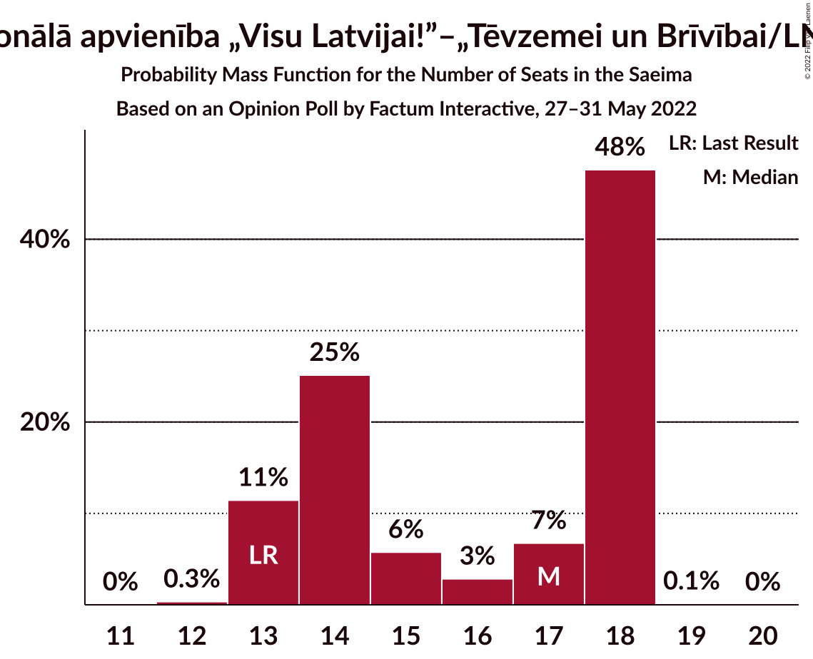
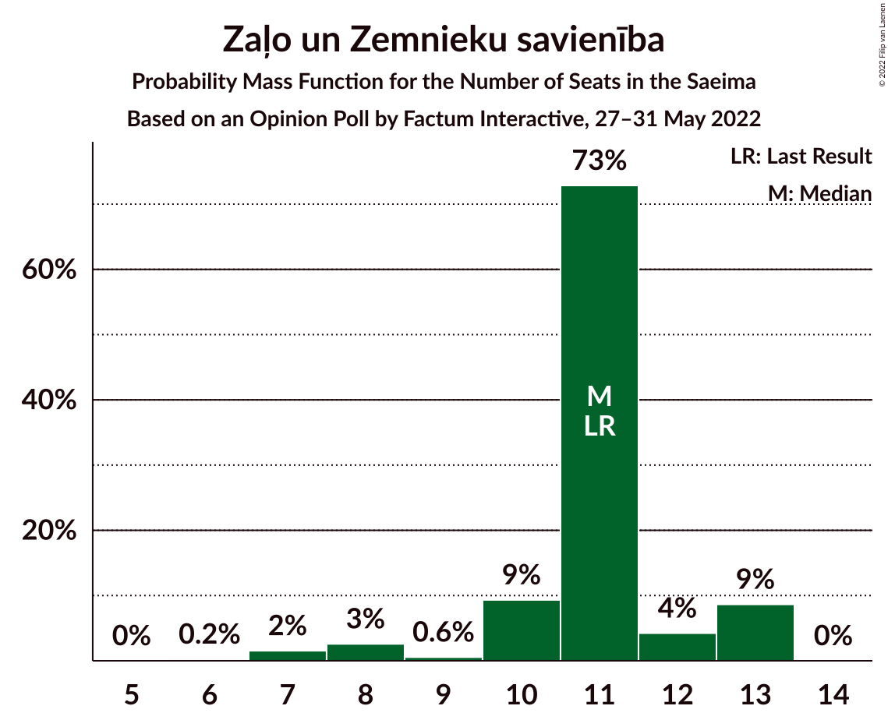
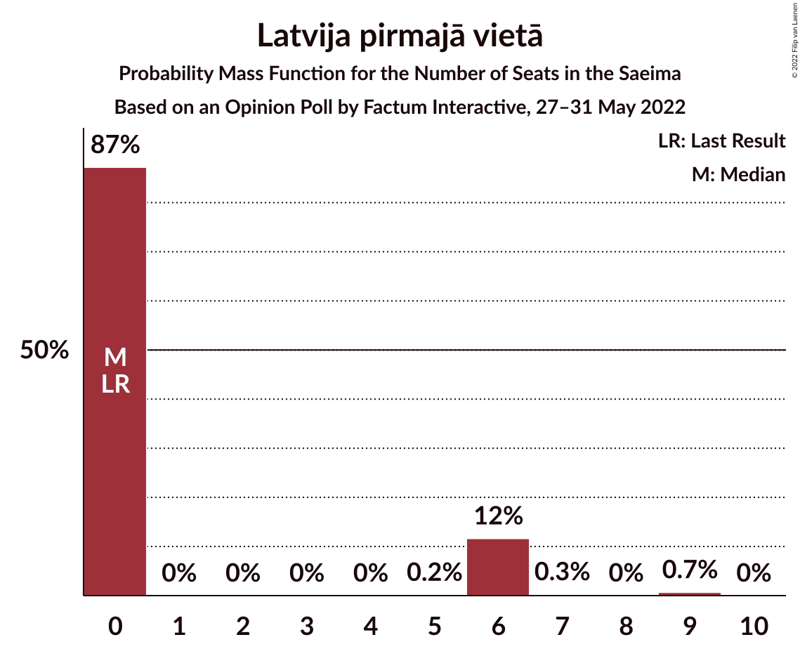
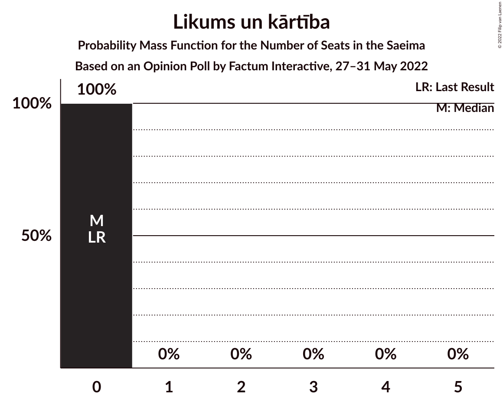
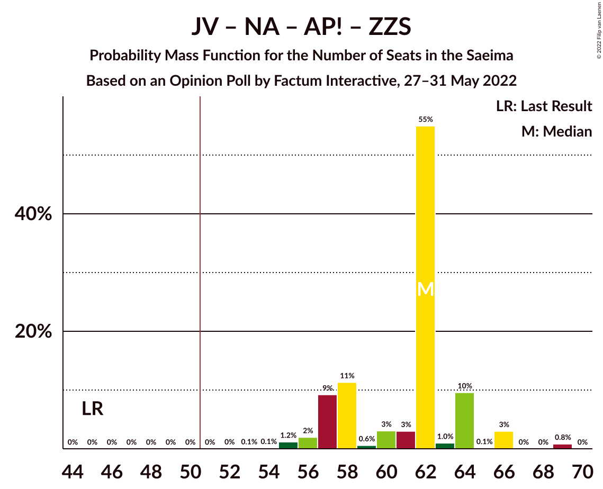
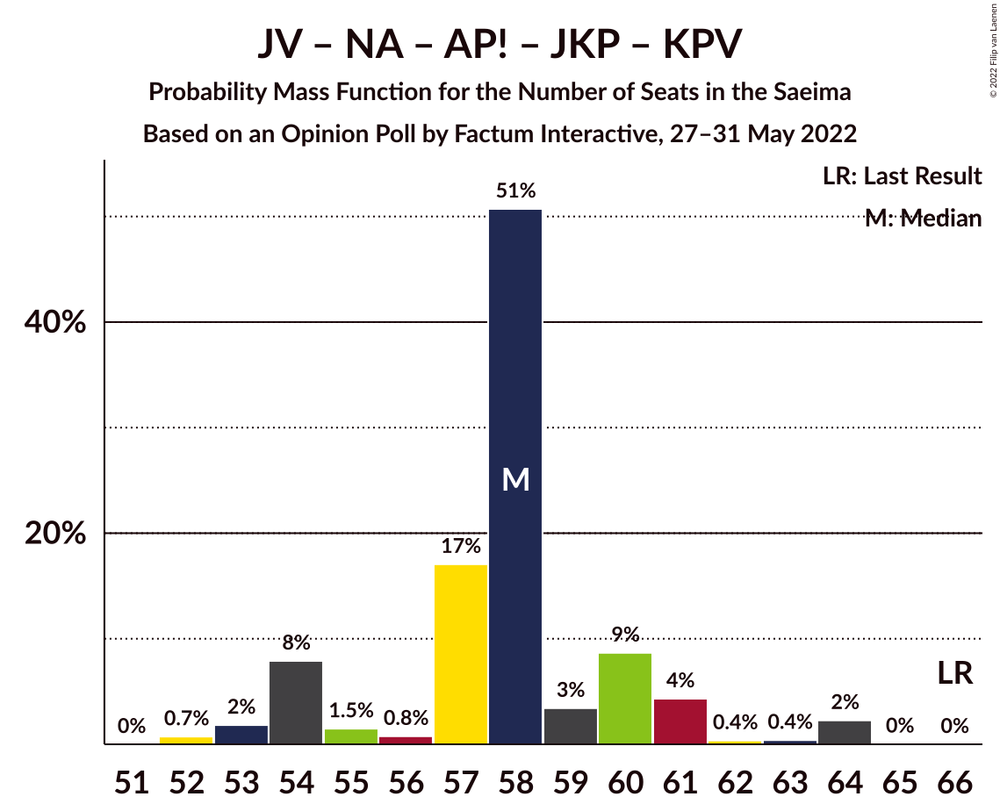
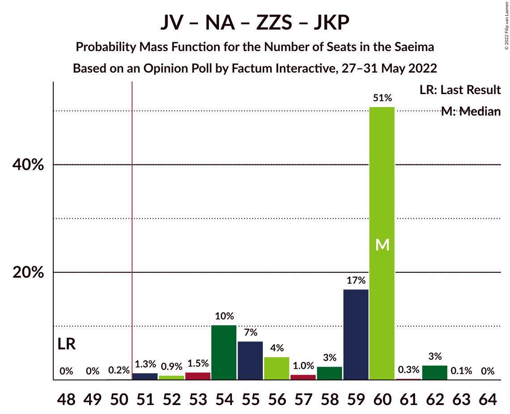
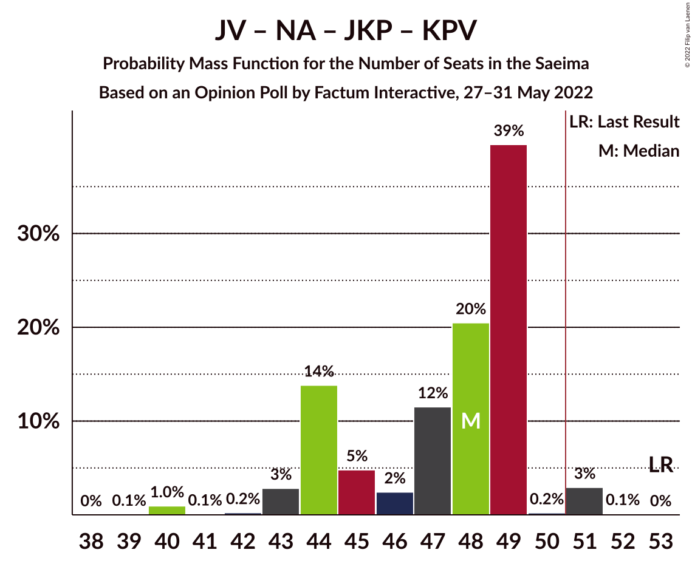

# Opinion Poll by Factum Interactive, 27–31 May 2022

<a href="#voting-intentions">Voting Intentions</a> | <a href="#seats">Seats</a> | <a href="#coalitions">Coalitions</a> | <a href="#technical-information">Technical Information</a>

## Voting Intentions

### Confidence Intervals

| Party | Last Result | Poll Result | 80% Confidence Interval | 90% Confidence Interval | 95% Confidence Interval | 99% Confidence Interval |
|:-----:|:-----------:|:-----------:|:-----------------------:|:-----------------------:|:-----------------------:|:-----------------------:|
| Jaunā VIENOTĪBA | 6.7% | 20.0% | 18.5–21.6% |18.1–22.0% |17.7–22.4% |17.0–23.2% |
| Nacionālā apvienība „Visu Latvijai!”–„Tēvzemei un Brīvībai/LNNK” | 11.0% | 12.8% | 11.6–14.2% |11.3–14.6% |11.0–14.9% |10.4–15.6% |
| Sociāldemokrātiskā partija “Saskaņa” | 19.8% | 10.6% | 9.5–11.9% |9.2–12.2% |8.9–12.6% |8.4–13.2% |
| Attīstībai/Par! | 12.0% | 10.2% | 9.1–11.4% |8.8–11.8% |8.5–12.1% |8.0–12.7% |
| Zaļo un Zemnieku savienība | 9.9% | 8.4% | 7.4–9.5% |7.1–9.9% |6.9–10.2% |6.4–10.7% |
| Latvijas Krievu savienība | 3.2% | 7.1% | 6.2–8.2% |6.0–8.5% |5.8–8.8% |5.4–9.3% |
| Jaunā konservatīvā partija | 13.6% | 6.9% | 6.0–7.9% |5.7–8.2% |5.5–8.5% |5.1–9.0% |
| PROGRESĪVIE | 2.6% | 6.9% | 6.0–7.9% |5.7–8.2% |5.5–8.5% |5.1–9.0% |
| Latvija pirmajā vietā | 0.0% | 4.6% | 3.9–5.5% |3.7–5.8% |3.6–6.0% |3.2–6.5% |
| Latvijas Reģionu Apvienība | 4.1% | 2.9% | 2.4–3.7% |2.2–3.9% |2.1–4.1% |1.9–4.5% |
| Likums un kārtība | 0.0% | 2.6% | 2.1–3.3% |1.9–3.5% |1.8–3.7% |1.6–4.1% |
| Republika | 0.0% | 1.9% | 1.4–2.5% |1.3–2.7% |1.2–2.9% |1.1–3.2% |
| Stabilitātei! | 0.0% | 1.9% | 1.4–2.5% |1.3–2.7% |1.2–2.9% |1.1–3.2% |
| Nacionālā Savienība Taisnīgums | 0.0% | 0.4% | 0.2–0.7% |0.2–0.8% |0.1–0.9% |0.1–1.1% |
| Politiskā partija „KPV LV” | 14.2% | 0.1% | 0.0–0.4% |0.0–0.4% |0.0–0.5% |0.0–0.7% |

*Note:* The poll result column reflects the actual value used in the calculations. Published results may vary slightly, and in addition be rounded to fewer digits.

## Seats

### Confidence Intervals

| Party | Last Result | Median | 80% Confidence Interval | 90% Confidence Interval | 95% Confidence Interval | 99% Confidence Interval |
|:-----:|:-----------:|:------:|:-----------------------:|:-----------------------:|:-----------------------:|:-----------------------:|
| <a href="#jaunā-vienotība">Jaunā VIENOTĪBA</a> | 8 | 24 | 21–24 |21–25 |20–27 |20–27 |
| <a href="#nacionālā-apvienība-„visu-latvijai!”–„tēvzemei-un-brīvībai/lnnk”">Nacionālā apvienība „Visu Latvijai!”–„Tēvzemei un Brīvībai/LNNK”</a> | 13 | 14 | 14–17 |13–17 |13–17 |13–17 |
| <a href="#sociāldemokrātiskā-partija-“saskaņa”">Sociāldemokrātiskā partija “Saskaņa”</a> | 23 | 14 | 13–14 |13–14 |13–14 |12–15 |
| <a href="#attīstībai/par!">Attīstībai/Par!</a> | 13 | 11 | 9–13 |9–14 |9–14 |9–15 |
| <a href="#zaļo-un-zemnieku-savienība">Zaļo un Zemnieku savienība</a> | 11 | 11 | 11–13 |10–13 |8–13 |8–13 |
| <a href="#latvijas-krievu-savienība">Latvijas Krievu savienība</a> | 0 | 10 | 8–10 |8–10 |8–10 |8–10 |
| <a href="#jaunā-konservatīvā-partija">Jaunā konservatīvā partija</a> | 16 | 9 | 6–10 |6–10 |6–10 |0–10 |
| <a href="#progresīvie">PROGRESĪVIE</a> | 0 | 8 | 7–9 |7–9 |7–10 |7–10 |
| <a href="#latvija-pirmajā-vietā">Latvija pirmajā vietā</a> | 0 | 0 | 0 |0–6 |0–6 |0–9 |
| <a href="#latvijas-reģionu-apvienība">Latvijas Reģionu Apvienība</a> | 0 | 0 | 0 |0 |0 |0 |
| <a href="#likums-un-kārtība">Likums un kārtība</a> | 0 | 0 | 0 |0 |0 |0 |
| <a href="#republika">Republika</a> | 0 | 0 | 0 |0 |0 |0 |
| <a href="#stabilitātei!">Stabilitātei!</a> | 0 | 0 | 0 |0 |0 |0 |
| <a href="#nacionālā-savienība-taisnīgums">Nacionālā Savienība Taisnīgums</a> | 0 | 0 | 0 |0 |0 |0 |
| <a href="#politiskā-partija-„kpv-lv”">Politiskā partija „KPV LV”</a> | 16 | 0 | 0 |0 |0 |0 |

### Jaunā VIENOTĪBA

*For a full overview of the results for this party, see the [Jaunā VIENOTĪBA](party-jaunāvienotība.html) page.*

| Number of Seats | Probability | Accumulated | Special Marks |
|:---------------:|:-----------:|:-----------:|:-------------:|
| 8 | 0% | 100% | Last Result |
| 9 | 0% | 100% |  |
| 10 | 0% | 100% |  |
| 11 | 0% | 100% |  |
| 12 | 0% | 100% |  |
| 13 | 0% | 100% |  |
| 14 | 0% | 100% |  |
| 15 | 0% | 100% |  |
| 16 | 0% | 100% |  |
| 17 | 0% | 100% |  |
| 18 | 0% | 100% |  |
| 19 | 0.3% | 100% |  |
| 20 | 4% | 99.7% |  |
| 21 | 16% | 96% |  |
| 22 | 6% | 80% |  |
| 23 | 0.5% | 74% |  |
| 24 | 64% | 74% | Median |
| 25 | 6% | 10% |  |
| 26 | 2% | 4% |  |
| 27 | 2% | 3% |  |
| 28 | 0% | 0% |  |

### Nacionālā apvienība „Visu Latvijai!”–„Tēvzemei un Brīvībai/LNNK”

*For a full overview of the results for this party, see the [Nacionālā apvienība „Visu Latvijai!”–„Tēvzemei un Brīvībai/LNNK”](party-nacionālāapvienība„visulatvijai”–„tēvzemeiunbrīvībailnnk”.html) page.*

| Number of Seats | Probability | Accumulated | Special Marks |
|:---------------:|:-----------:|:-----------:|:-------------:|
| 13 | 7% | 100% | Last Result |
| 14 | 65% | 93% | Median |
| 15 | 4% | 28% |  |
| 16 | 3% | 23% |  |
| 17 | 19% | 20% |  |
| 18 | 0.3% | 0.5% |  |
| 19 | 0.2% | 0.2% |  |
| 20 | 0% | 0% |  |

### Sociāldemokrātiskā partija “Saskaņa”

*For a full overview of the results for this party, see the [Sociāldemokrātiskā partija “Saskaņa”](party-sociāldemokrātiskāpartija“saskaņa”.html) page.*

| Number of Seats | Probability | Accumulated | Special Marks |
|:---------------:|:-----------:|:-----------:|:-------------:|
| 10 | 0.4% | 100% |  |
| 11 | 0% | 99.6% |  |
| 12 | 2% | 99.6% |  |
| 13 | 21% | 98% |  |
| 14 | 75% | 76% | Median |
| 15 | 2% | 2% |  |
| 16 | 0.1% | 0.1% |  |
| 17 | 0% | 0% |  |
| 18 | 0% | 0% |  |
| 19 | 0% | 0% |  |
| 20 | 0% | 0% |  |
| 21 | 0% | 0% |  |
| 22 | 0% | 0% |  |
| 23 | 0% | 0% | Last Result |

### Attīstībai/Par!

*For a full overview of the results for this party, see the [Attīstībai/Par!](party-attīstībaipar.html) page.*

| Number of Seats | Probability | Accumulated | Special Marks |
|:---------------:|:-----------:|:-----------:|:-------------:|
| 9 | 38% | 100% |  |
| 10 | 10% | 62% |  |
| 11 | 29% | 52% | Median |
| 12 | 0.5% | 23% |  |
| 13 | 17% | 23% | Last Result |
| 14 | 5% | 6% |  |
| 15 | 0.9% | 1.0% |  |
| 16 | 0.2% | 0.2% |  |
| 17 | 0% | 0% |  |

### Zaļo un Zemnieku savienība

*For a full overview of the results for this party, see the [Zaļo un Zemnieku savienība](party-zaļounzemniekusavienība.html) page.*

| Number of Seats | Probability | Accumulated | Special Marks |
|:---------------:|:-----------:|:-----------:|:-------------:|
| 6 | 0.1% | 100% |  |
| 7 | 0.2% | 99.9% |  |
| 8 | 4% | 99.7% |  |
| 9 | 0.3% | 95% |  |
| 10 | 4% | 95% |  |
| 11 | 60% | 91% | Last Result, Median |
| 12 | 3% | 32% |  |
| 13 | 28% | 28% |  |
| 14 | 0% | 0% |  |

### Latvijas Krievu savienība

*For a full overview of the results for this party, see the [Latvijas Krievu savienība](party-latvijaskrievusavienība.html) page.*

| Number of Seats | Probability | Accumulated | Special Marks |
|:---------------:|:-----------:|:-----------:|:-------------:|
| 0 | 0% | 100% | Last Result |
| 1 | 0% | 100% |  |
| 2 | 0% | 100% |  |
| 3 | 0% | 100% |  |
| 4 | 0% | 100% |  |
| 5 | 0.1% | 100% |  |
| 6 | 0% | 99.9% |  |
| 7 | 0.2% | 99.9% |  |
| 8 | 36% | 99.8% |  |
| 9 | 4% | 63% |  |
| 10 | 60% | 60% | Median |
| 11 | 0.2% | 0.2% |  |
| 12 | 0% | 0% |  |

### Jaunā konservatīvā partija

*For a full overview of the results for this party, see the [Jaunā konservatīvā partija](party-jaunākonservatīvāpartija.html) page.*

| Number of Seats | Probability | Accumulated | Special Marks |
|:---------------:|:-----------:|:-----------:|:-------------:|
| 0 | 2% | 100% |  |
| 1 | 0% | 98% |  |
| 2 | 0% | 98% |  |
| 3 | 0% | 98% |  |
| 4 | 0% | 98% |  |
| 5 | 0% | 98% |  |
| 6 | 16% | 98% |  |
| 7 | 10% | 82% |  |
| 8 | 3% | 72% |  |
| 9 | 33% | 70% | Median |
| 10 | 36% | 36% |  |
| 11 | 0.3% | 0.3% |  |
| 12 | 0% | 0% |  |
| 13 | 0% | 0% |  |
| 14 | 0% | 0% |  |
| 15 | 0% | 0% |  |
| 16 | 0% | 0% | Last Result |

### PROGRESĪVIE

*For a full overview of the results for this party, see the [PROGRESĪVIE](party-progresīvie.html) page.*

| Number of Seats | Probability | Accumulated | Special Marks |
|:---------------:|:-----------:|:-----------:|:-------------:|
| 0 | 0% | 100% | Last Result |
| 1 | 0% | 100% |  |
| 2 | 0% | 100% |  |
| 3 | 0% | 100% |  |
| 4 | 0% | 100% |  |
| 5 | 0% | 100% |  |
| 6 | 0% | 100% |  |
| 7 | 34% | 100% |  |
| 8 | 46% | 66% | Median |
| 9 | 16% | 20% |  |
| 10 | 4% | 4% |  |
| 11 | 0.2% | 0.2% |  |
| 12 | 0% | 0% |  |

### Latvija pirmajā vietā

*For a full overview of the results for this party, see the [Latvija pirmajā vietā](party-latvijapirmajāvietā.html) page.*

| Number of Seats | Probability | Accumulated | Special Marks |
|:---------------:|:-----------:|:-----------:|:-------------:|
| 0 | 92% | 100% | Last Result, Median |
| 1 | 0% | 8% |  |
| 2 | 0% | 8% |  |
| 3 | 0% | 8% |  |
| 4 | 0% | 8% |  |
| 5 | 0.1% | 8% |  |
| 6 | 5% | 8% |  |
| 7 | 0% | 2% |  |
| 8 | 0% | 2% |  |
| 9 | 2% | 2% |  |
| 10 | 0% | 0% |  |

### Latvijas Reģionu Apvienība

*For a full overview of the results for this party, see the [Latvijas Reģionu Apvienība](party-latvijasreģionuapvienība.html) page.*

| Number of Seats | Probability | Accumulated | Special Marks |
|:---------------:|:-----------:|:-----------:|:-------------:|
| 0 | 100% | 100% | Last Result, Median |

### Likums un kārtība

*For a full overview of the results for this party, see the [Likums un kārtība](party-likumsunkārtība.html) page.*

| Number of Seats | Probability | Accumulated | Special Marks |
|:---------------:|:-----------:|:-----------:|:-------------:|
| 0 | 100% | 100% | Last Result, Median |

### Republika

*For a full overview of the results for this party, see the [Republika](party-republika.html) page.*

| Number of Seats | Probability | Accumulated | Special Marks |
|:---------------:|:-----------:|:-----------:|:-------------:|
| 0 | 100% | 100% | Last Result, Median |

### Stabilitātei!

*For a full overview of the results for this party, see the [Stabilitātei!](party-stabilitātei.html) page.*

| Number of Seats | Probability | Accumulated | Special Marks |
|:---------------:|:-----------:|:-----------:|:-------------:|
| 0 | 100% | 100% | Last Result, Median |

### Nacionālā Savienība Taisnīgums

*For a full overview of the results for this party, see the [Nacionālā Savienība Taisnīgums](party-nacionālāsavienībataisnīgums.html) page.*

| Number of Seats | Probability | Accumulated | Special Marks |
|:---------------:|:-----------:|:-----------:|:-------------:|
| 0 | 100% | 100% | Last Result, Median |

### Politiskā partija „KPV LV”

*For a full overview of the results for this party, see the [Politiskā partija „KPV LV”](party-politiskāpartija„kpvlv”.html) page.*

| Number of Seats | Probability | Accumulated | Special Marks |
|:---------------:|:-----------:|:-----------:|:-------------:|
| 0 | 100% | 100% | Median |
| 1 | 0% | 0% |  |
| 2 | 0% | 0% |  |
| 3 | 0% | 0% |  |
| 4 | 0% | 0% |  |
| 5 | 0% | 0% |  |
| 6 | 0% | 0% |  |
| 7 | 0% | 0% |  |
| 8 | 0% | 0% |  |
| 9 | 0% | 0% |  |
| 10 | 0% | 0% |  |
| 11 | 0% | 0% |  |
| 12 | 0% | 0% |  |
| 13 | 0% | 0% |  |
| 14 | 0% | 0% |  |
| 15 | 0% | 0% |  |
| 16 | 0% | 0% | Last Result |

## Coalitions

### Confidence Intervals

| Coalition | Last Result | Median | Majority? | 80% Confidence Interval | 90% Confidence Interval | 95% Confidence Interval | 99% Confidence Interval |
|:---------:|:-----------:|:------:|:---------:|:-----------------------:|:-----------------------:|:-----------------------:|:-----------------------:|
| Jaunā VIENOTĪBA – Nacionālā apvienība „Visu Latvijai!”–„Tēvzemei un Brīvībai/LNNK” – Attīstībai/Par! – Zaļo un Zemnieku savienība – Jaunā konservatīvā partija | 61 | 68 | 100% | 66–71 | 65–71 | 63–71 | 62–72 |
| Jaunā VIENOTĪBA – Nacionālā apvienība „Visu Latvijai!”–„Tēvzemei un Brīvībai/LNNK” – Attīstībai/Par! – Zaļo un Zemnieku savienība | 45 | 61 | 100% | 58–62 | 56–62 | 56–65 | 55–66 |
| Jaunā VIENOTĪBA – Nacionālā apvienība „Visu Latvijai!”–„Tēvzemei un Brīvībai/LNNK” – Attīstībai/Par! – Jaunā konservatīvā partija | 50 | 57 | 100% | 57–58 | 54–59 | 53–60 | 52–61 |
| Jaunā VIENOTĪBA – Nacionālā apvienība „Visu Latvijai!”–„Tēvzemei un Brīvībai/LNNK” – Attīstībai/Par! – Jaunā konservatīvā partija – Politiskā partija „KPV LV” | 66 | 57 | 100% | 57–58 | 54–59 | 53–60 | 52–61 |
| Jaunā VIENOTĪBA – Nacionālā apvienība „Visu Latvijai!”–„Tēvzemei un Brīvībai/LNNK” – Zaļo un Zemnieku savienība – Jaunā konservatīvā partija | 48 | 59 | 99.7% | 55–60 | 53–60 | 52–60 | 52–60 |
| Jaunā VIENOTĪBA – Nacionālā apvienība „Visu Latvijai!”–„Tēvzemei un Brīvībai/LNNK” – Attīstībai/Par! – Politiskā partija „KPV LV” | 50 | 49 | 22% | 47–51 | 45–52 | 45–56 | 45–58 |
| Jaunā VIENOTĪBA – Nacionālā apvienība „Visu Latvijai!”–„Tēvzemei un Brīvībai/LNNK” – Zaļo un Zemnieku savienība | 32 | 49 | 35% | 47–51 | 46–51 | 46–52 | 45–52 |
| Jaunā VIENOTĪBA – Nacionālā apvienība „Visu Latvijai!”–„Tēvzemei un Brīvībai/LNNK” – Jaunā konservatīvā partija – Politiskā partija „KPV LV” | 53 | 47 | 0.2% | 44–48 | 44–48 | 43–48 | 43–50 |
| Nacionālā apvienība „Visu Latvijai!”–„Tēvzemei un Brīvībai/LNNK” – Attīstībai/Par! – Zaļo un Zemnieku savienība – Jaunā konservatīvā partija | 53 | 44 | 0.9% | 43–47 | 43–47 | 40–47 | 39–51 |
| Jaunā VIENOTĪBA – Attīstībai/Par! – Jaunā konservatīvā partija – Politiskā partija „KPV LV” | 53 | 43 | 0% | 40–44 | 40–44 | 39–46 | 36–48 |
| Nacionālā apvienība „Visu Latvijai!”–„Tēvzemei un Brīvībai/LNNK” – Attīstībai/Par! – Zaļo un Zemnieku savienība | 37 | 38 | 0% | 34–41 | 34–41 | 34–41 | 33–42 |
| Nacionālā apvienība „Visu Latvijai!”–„Tēvzemei un Brīvībai/LNNK” – Attīstībai/Par! – Jaunā konservatīvā partija – Politiskā partija „KPV LV” | 58 | 33 | 0% | 32–36 | 32–36 | 31–36 | 31–41 |
| Nacionālā apvienība „Visu Latvijai!”–„Tēvzemei un Brīvībai/LNNK” – Zaļo un Zemnieku savienība – Jaunā konservatīvā partija | 40 | 35 | 0% | 33–36 | 33–36 | 28–36 | 25–36 |
| Sociāldemokrātiskā partija “Saskaņa” – Attīstībai/Par! – Jaunā konservatīvā partija | 52 | 33 | 0% | 32–34 | 29–34 | 29–35 | 28–37 |
| Sociāldemokrātiskā partija “Saskaņa” – Attīstībai/Par! | 36 | 25 | 0% | 23–26 | 23–27 | 22–28 | 22–29 |
| Sociāldemokrātiskā partija “Saskaņa” – Zaļo un Zemnieku savienība – Politiskā partija „KPV LV” | 50 | 25 | 0% | 24–27 | 22–27 | 22–27 | 21–27 |
| Sociāldemokrātiskā partija “Saskaņa” – Politiskā partija „KPV LV” | 39 | 14 | 0% | 13–14 | 13–14 | 13–14 | 12–15 |

### Jaunā VIENOTĪBA – Nacionālā apvienība „Visu Latvijai!”–„Tēvzemei un Brīvībai/LNNK” – Attīstībai/Par! – Zaļo un Zemnieku savienība – Jaunā konservatīvā partija

| Number of Seats | Probability | Accumulated | Special Marks |
|:---------------:|:-----------:|:-----------:|:-------------:|
| 61 | 0.1% | 100% | Last Result |
| 62 | 2% | 99.9% |  |
| 63 | 0.2% | 98% |  |
| 64 | 0.1% | 97% |  |
| 65 | 5% | 97% |  |
| 66 | 3% | 92% |  |
| 67 | 1.0% | 90% |  |
| 68 | 56% | 89% |  |
| 69 | 0.8% | 32% | Median |
| 70 | 1.2% | 32% |  |
| 71 | 30% | 30% |  |
| 72 | 0.6% | 0.7% |  |
| 73 | 0.1% | 0.1% |  |
| 74 | 0% | 0% |  |

### Jaunā VIENOTĪBA – Nacionālā apvienība „Visu Latvijai!”–„Tēvzemei un Brīvībai/LNNK” – Attīstībai/Par! – Zaļo un Zemnieku savienība

| Number of Seats | Probability | Accumulated | Special Marks |
|:---------------:|:-----------:|:-----------:|:-------------:|
| 45 | 0% | 100% | Last Result |
| 46 | 0% | 100% |  |
| 47 | 0% | 100% |  |
| 48 | 0% | 100% |  |
| 49 | 0% | 100% |  |
| 50 | 0% | 100% |  |
| 51 | 0% | 100% | Majority |
| 52 | 0.1% | 100% |  |
| 53 | 0% | 99.9% |  |
| 54 | 0% | 99.8% |  |
| 55 | 2% | 99.8% |  |
| 56 | 3% | 98% |  |
| 57 | 2% | 95% |  |
| 58 | 35% | 92% |  |
| 59 | 0.8% | 57% |  |
| 60 | 2% | 56% | Median |
| 61 | 6% | 55% |  |
| 62 | 45% | 49% |  |
| 63 | 1.2% | 4% |  |
| 64 | 0% | 3% |  |
| 65 | 0.1% | 3% |  |
| 66 | 2% | 2% |  |
| 67 | 0% | 0% |  |

### Jaunā VIENOTĪBA – Nacionālā apvienība „Visu Latvijai!”–„Tēvzemei un Brīvībai/LNNK” – Attīstībai/Par! – Jaunā konservatīvā partija

| Number of Seats | Probability | Accumulated | Special Marks |
|:---------------:|:-----------:|:-----------:|:-------------:|
| 50 | 0% | 100% | Last Result |
| 51 | 0% | 100% | Majority |
| 52 | 2% | 100% |  |
| 53 | 2% | 98% |  |
| 54 | 3% | 95% |  |
| 55 | 1.2% | 93% |  |
| 56 | 0.1% | 91% |  |
| 57 | 55% | 91% |  |
| 58 | 32% | 37% | Median |
| 59 | 0.5% | 5% |  |
| 60 | 3% | 5% |  |
| 61 | 1.5% | 2% |  |
| 62 | 0% | 0.2% |  |
| 63 | 0% | 0.2% |  |
| 64 | 0.1% | 0.1% |  |
| 65 | 0% | 0% |  |

### Jaunā VIENOTĪBA – Nacionālā apvienība „Visu Latvijai!”–„Tēvzemei un Brīvībai/LNNK” – Attīstībai/Par! – Jaunā konservatīvā partija – Politiskā partija „KPV LV”

| Number of Seats | Probability | Accumulated | Special Marks |
|:---------------:|:-----------:|:-----------:|:-------------:|
| 52 | 2% | 100% |  |
| 53 | 2% | 98% |  |
| 54 | 3% | 95% |  |
| 55 | 1.2% | 93% |  |
| 56 | 0.1% | 91% |  |
| 57 | 55% | 91% |  |
| 58 | 32% | 37% | Median |
| 59 | 0.5% | 5% |  |
| 60 | 3% | 5% |  |
| 61 | 1.5% | 2% |  |
| 62 | 0% | 0.2% |  |
| 63 | 0% | 0.2% |  |
| 64 | 0.1% | 0.1% |  |
| 65 | 0% | 0% |  |
| 66 | 0% | 0% | Last Result |

### Jaunā VIENOTĪBA – Nacionālā apvienība „Visu Latvijai!”–„Tēvzemei un Brīvībai/LNNK” – Zaļo un Zemnieku savienība – Jaunā konservatīvā partija

| Number of Seats | Probability | Accumulated | Special Marks |
|:---------------:|:-----------:|:-----------:|:-------------:|
| 48 | 0% | 100% | Last Result |
| 49 | 0% | 100% |  |
| 50 | 0.3% | 100% |  |
| 51 | 0% | 99.7% | Majority |
| 52 | 3% | 99.7% |  |
| 53 | 2% | 97% |  |
| 54 | 2% | 95% |  |
| 55 | 21% | 93% |  |
| 56 | 1.3% | 72% |  |
| 57 | 1.1% | 71% |  |
| 58 | 4% | 70% | Median |
| 59 | 36% | 65% |  |
| 60 | 29% | 29% |  |
| 61 | 0.1% | 0.2% |  |
| 62 | 0.1% | 0.1% |  |
| 63 | 0% | 0% |  |

### Jaunā VIENOTĪBA – Nacionālā apvienība „Visu Latvijai!”–„Tēvzemei un Brīvībai/LNNK” – Attīstībai/Par! – Politiskā partija „KPV LV”

| Number of Seats | Probability | Accumulated | Special Marks |
|:---------------:|:-----------:|:-----------:|:-------------:|
| 45 | 7% | 100% |  |
| 46 | 0.2% | 93% |  |
| 47 | 35% | 93% |  |
| 48 | 1.5% | 57% |  |
| 49 | 29% | 56% | Median |
| 50 | 4% | 26% | Last Result |
| 51 | 16% | 22% | Majority |
| 52 | 2% | 7% |  |
| 53 | 2% | 5% |  |
| 54 | 0.1% | 3% |  |
| 55 | 0.1% | 3% |  |
| 56 | 0.1% | 3% |  |
| 57 | 0% | 2% |  |
| 58 | 2% | 2% |  |
| 59 | 0% | 0% |  |

### Jaunā VIENOTĪBA – Nacionālā apvienība „Visu Latvijai!”–„Tēvzemei un Brīvībai/LNNK” – Zaļo un Zemnieku savienība

| Number of Seats | Probability | Accumulated | Special Marks |
|:---------------:|:-----------:|:-----------:|:-------------:|
| 32 | 0% | 100% | Last Result |
| 33 | 0% | 100% |  |
| 34 | 0% | 100% |  |
| 35 | 0% | 100% |  |
| 36 | 0% | 100% |  |
| 37 | 0% | 100% |  |
| 38 | 0% | 100% |  |
| 39 | 0% | 100% |  |
| 40 | 0% | 100% |  |
| 41 | 0.1% | 100% |  |
| 42 | 0% | 99.8% |  |
| 43 | 0% | 99.8% |  |
| 44 | 0.2% | 99.8% |  |
| 45 | 0.3% | 99.6% |  |
| 46 | 5% | 99.3% |  |
| 47 | 5% | 94% |  |
| 48 | 0.1% | 89% |  |
| 49 | 51% | 89% | Median |
| 50 | 2% | 38% |  |
| 51 | 32% | 35% | Majority |
| 52 | 3% | 3% |  |
| 53 | 0.3% | 0.3% |  |
| 54 | 0% | 0% |  |

### Jaunā VIENOTĪBA – Nacionālā apvienība „Visu Latvijai!”–„Tēvzemei un Brīvībai/LNNK” – Jaunā konservatīvā partija – Politiskā partija „KPV LV”

| Number of Seats | Probability | Accumulated | Special Marks |
|:---------------:|:-----------:|:-----------:|:-------------:|
| 39 | 0.1% | 100% |  |
| 40 | 0% | 99.9% |  |
| 41 | 0% | 99.9% |  |
| 42 | 0% | 99.8% |  |
| 43 | 5% | 99.8% |  |
| 44 | 21% | 95% |  |
| 45 | 1.3% | 74% |  |
| 46 | 3% | 73% |  |
| 47 | 32% | 70% | Median |
| 48 | 36% | 37% |  |
| 49 | 0.6% | 1.2% |  |
| 50 | 0.4% | 0.5% |  |
| 51 | 0.1% | 0.2% | Majority |
| 52 | 0.1% | 0.1% |  |
| 53 | 0% | 0% | Last Result |

### Nacionālā apvienība „Visu Latvijai!”–„Tēvzemei un Brīvībai/LNNK” – Attīstībai/Par! – Zaļo un Zemnieku savienība – Jaunā konservatīvā partija

| Number of Seats | Probability | Accumulated | Special Marks |
|:---------------:|:-----------:|:-----------:|:-------------:|
| 39 | 2% | 100% |  |
| 40 | 0% | 98% |  |
| 41 | 0% | 97% |  |
| 42 | 2% | 97% |  |
| 43 | 11% | 95% |  |
| 44 | 36% | 84% |  |
| 45 | 1.3% | 48% | Median |
| 46 | 0.9% | 47% |  |
| 47 | 45% | 46% |  |
| 48 | 0.1% | 1.4% |  |
| 49 | 0.2% | 1.4% |  |
| 50 | 0.3% | 1.2% |  |
| 51 | 0.9% | 0.9% | Majority |
| 52 | 0% | 0% |  |
| 53 | 0% | 0% | Last Result |

### Jaunā VIENOTĪBA – Attīstībai/Par! – Jaunā konservatīvā partija – Politiskā partija „KPV LV”

| Number of Seats | Probability | Accumulated | Special Marks |
|:---------------:|:-----------:|:-----------:|:-------------:|
| 36 | 2% | 100% |  |
| 37 | 0% | 98% |  |
| 38 | 0.1% | 98% |  |
| 39 | 1.3% | 98% |  |
| 40 | 18% | 96% |  |
| 41 | 5% | 78% |  |
| 42 | 4% | 73% |  |
| 43 | 36% | 69% |  |
| 44 | 30% | 33% | Median |
| 45 | 0.9% | 4% |  |
| 46 | 2% | 3% |  |
| 47 | 0.5% | 1.1% |  |
| 48 | 0.6% | 0.6% |  |
| 49 | 0% | 0% |  |
| 50 | 0% | 0% |  |
| 51 | 0% | 0% | Majority |
| 52 | 0% | 0% |  |
| 53 | 0% | 0% | Last Result |

### Nacionālā apvienība „Visu Latvijai!”–„Tēvzemei un Brīvībai/LNNK” – Attīstībai/Par! – Zaļo un Zemnieku savienība

| Number of Seats | Probability | Accumulated | Special Marks |
|:---------------:|:-----------:|:-----------:|:-------------:|
| 33 | 0.7% | 100% |  |
| 34 | 38% | 99.2% |  |
| 35 | 4% | 61% |  |
| 36 | 6% | 57% | Median |
| 37 | 0.8% | 51% | Last Result |
| 38 | 30% | 50% |  |
| 39 | 3% | 20% |  |
| 40 | 0.7% | 17% |  |
| 41 | 16% | 17% |  |
| 42 | 0.9% | 1.0% |  |
| 43 | 0% | 0% |  |

### Nacionālā apvienība „Visu Latvijai!”–„Tēvzemei un Brīvībai/LNNK” – Attīstībai/Par! – Jaunā konservatīvā partija – Politiskā partija „KPV LV”

| Number of Seats | Probability | Accumulated | Special Marks |
|:---------------:|:-----------:|:-----------:|:-------------:|
| 31 | 5% | 100% |  |
| 32 | 9% | 95% |  |
| 33 | 36% | 86% |  |
| 34 | 29% | 50% | Median |
| 35 | 3% | 21% |  |
| 36 | 16% | 18% |  |
| 37 | 0.1% | 2% |  |
| 38 | 0.3% | 2% |  |
| 39 | 0.3% | 1.3% |  |
| 40 | 0.1% | 1.0% |  |
| 41 | 0.9% | 0.9% |  |
| 42 | 0% | 0% |  |
| 43 | 0% | 0% |  |
| 44 | 0% | 0% |  |
| 45 | 0% | 0% |  |
| 46 | 0% | 0% |  |
| 47 | 0% | 0% |  |
| 48 | 0% | 0% |  |
| 49 | 0% | 0% |  |
| 50 | 0% | 0% |  |
| 51 | 0% | 0% | Majority |
| 52 | 0% | 0% |  |
| 53 | 0% | 0% |  |
| 54 | 0% | 0% |  |
| 55 | 0% | 0% |  |
| 56 | 0% | 0% |  |
| 57 | 0% | 0% |  |
| 58 | 0% | 0% | Last Result |

### Nacionālā apvienība „Visu Latvijai!”–„Tēvzemei un Brīvībai/LNNK” – Zaļo un Zemnieku savienība – Jaunā konservatīvā partija

| Number of Seats | Probability | Accumulated | Special Marks |
|:---------------:|:-----------:|:-----------:|:-------------:|
| 25 | 2% | 100% |  |
| 26 | 0% | 98% |  |
| 27 | 0% | 98% |  |
| 28 | 0% | 98% |  |
| 29 | 2% | 97% |  |
| 30 | 0.2% | 96% |  |
| 31 | 0.3% | 96% |  |
| 32 | 0.1% | 95% |  |
| 33 | 12% | 95% |  |
| 34 | 17% | 83% | Median |
| 35 | 36% | 66% |  |
| 36 | 30% | 30% |  |
| 37 | 0.3% | 0.4% |  |
| 38 | 0% | 0% |  |
| 39 | 0% | 0% |  |
| 40 | 0% | 0% | Last Result |

### Sociāldemokrātiskā partija “Saskaņa” – Attīstībai/Par! – Jaunā konservatīvā partija

| Number of Seats | Probability | Accumulated | Special Marks |
|:---------------:|:-----------:|:-----------:|:-------------:|
| 28 | 2% | 100% |  |
| 29 | 3% | 98% |  |
| 30 | 0.1% | 95% |  |
| 31 | 4% | 95% |  |
| 32 | 22% | 91% |  |
| 33 | 36% | 69% |  |
| 34 | 29% | 33% | Median |
| 35 | 2% | 4% |  |
| 36 | 1.1% | 2% |  |
| 37 | 0.1% | 0.5% |  |
| 38 | 0.1% | 0.4% |  |
| 39 | 0.3% | 0.3% |  |
| 40 | 0% | 0% |  |
| 41 | 0% | 0% |  |
| 42 | 0% | 0% |  |
| 43 | 0% | 0% |  |
| 44 | 0% | 0% |  |
| 45 | 0% | 0% |  |
| 46 | 0% | 0% |  |
| 47 | 0% | 0% |  |
| 48 | 0% | 0% |  |
| 49 | 0% | 0% |  |
| 50 | 0% | 0% |  |
| 51 | 0% | 0% | Majority |
| 52 | 0% | 0% | Last Result |

### Sociāldemokrātiskā partija “Saskaņa” – Attīstībai/Par!

| Number of Seats | Probability | Accumulated | Special Marks |
|:---------------:|:-----------:|:-----------:|:-------------:|
| 21 | 0.1% | 100% |  |
| 22 | 3% | 99.9% |  |
| 23 | 38% | 97% |  |
| 24 | 6% | 59% |  |
| 25 | 30% | 52% | Median |
| 26 | 16% | 22% |  |
| 27 | 1.3% | 6% |  |
| 28 | 4% | 5% |  |
| 29 | 0.4% | 0.5% |  |
| 30 | 0% | 0.1% |  |
| 31 | 0.1% | 0.1% |  |
| 32 | 0% | 0% |  |
| 33 | 0% | 0% |  |
| 34 | 0% | 0% |  |
| 35 | 0% | 0% |  |
| 36 | 0% | 0% | Last Result |

### Sociāldemokrātiskā partija “Saskaņa” – Zaļo un Zemnieku savienība – Politiskā partija „KPV LV”

| Number of Seats | Probability | Accumulated | Special Marks |
|:---------------:|:-----------:|:-----------:|:-------------:|
| 19 | 0.1% | 100% |  |
| 20 | 0.3% | 99.9% |  |
| 21 | 0.2% | 99.6% |  |
| 22 | 5% | 99.4% |  |
| 23 | 4% | 94% |  |
| 24 | 19% | 90% |  |
| 25 | 40% | 72% | Median |
| 26 | 2% | 32% |  |
| 27 | 30% | 30% |  |
| 28 | 0.1% | 0.1% |  |
| 29 | 0% | 0% |  |
| 30 | 0% | 0% |  |
| 31 | 0% | 0% |  |
| 32 | 0% | 0% |  |
| 33 | 0% | 0% |  |
| 34 | 0% | 0% |  |
| 35 | 0% | 0% |  |
| 36 | 0% | 0% |  |
| 37 | 0% | 0% |  |
| 38 | 0% | 0% |  |
| 39 | 0% | 0% |  |
| 40 | 0% | 0% |  |
| 41 | 0% | 0% |  |
| 42 | 0% | 0% |  |
| 43 | 0% | 0% |  |
| 44 | 0% | 0% |  |
| 45 | 0% | 0% |  |
| 46 | 0% | 0% |  |
| 47 | 0% | 0% |  |
| 48 | 0% | 0% |  |
| 49 | 0% | 0% |  |
| 50 | 0% | 0% | Last Result |

### Sociāldemokrātiskā partija “Saskaņa” – Politiskā partija „KPV LV”

| Number of Seats | Probability | Accumulated | Special Marks |
|:---------------:|:-----------:|:-----------:|:-------------:|
| 10 | 0.4% | 100% |  |
| 11 | 0% | 99.6% |  |
| 12 | 2% | 99.6% |  |
| 13 | 21% | 98% |  |
| 14 | 75% | 76% | Median |
| 15 | 2% | 2% |  |
| 16 | 0.1% | 0.1% |  |
| 17 | 0% | 0% |  |
| 18 | 0% | 0% |  |
| 19 | 0% | 0% |  |
| 20 | 0% | 0% |  |
| 21 | 0% | 0% |  |
| 22 | 0% | 0% |  |
| 23 | 0% | 0% |  |
| 24 | 0% | 0% |  |
| 25 | 0% | 0% |  |
| 26 | 0% | 0% |  |
| 27 | 0% | 0% |  |
| 28 | 0% | 0% |  |
| 29 | 0% | 0% |  |
| 30 | 0% | 0% |  |
| 31 | 0% | 0% |  |
| 32 | 0% | 0% |  |
| 33 | 0% | 0% |  |
| 34 | 0% | 0% |  |
| 35 | 0% | 0% |  |
| 36 | 0% | 0% |  |
| 37 | 0% | 0% |  |
| 38 | 0% | 0% |  |
| 39 | 0% | 0% | Last Result |

## Technical Information

### Opinion Poll

+ **Polling firm:** Factum Interactive
+ **Commissioner(s):** —
+ **Fieldwork period:** 27–31 May 2022

### Calculations

+ **Sample size:** 1122
+ **Simulations done:** 262,144
+ **Error estimate:** 3.35%

