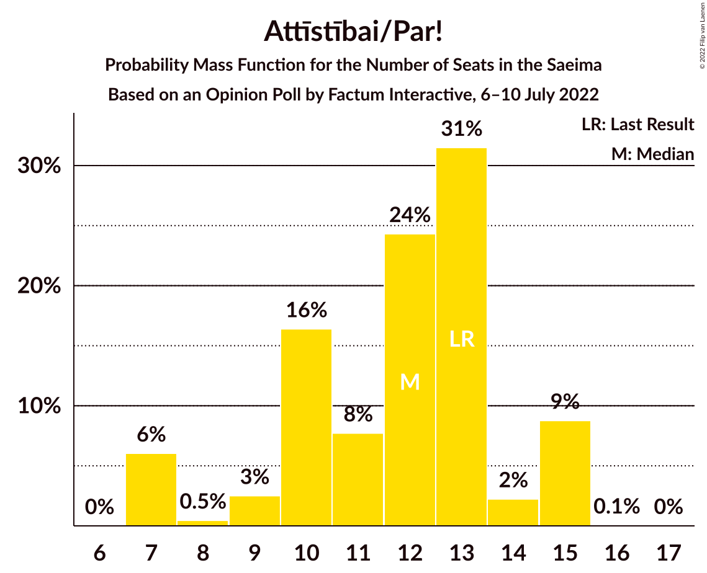

# Opinion Poll by Factum Interactive, 6–10 July 2022

<a href="#voting-intentions">Voting Intentions</a> | <a href="#seats">Seats</a> | <a href="#coalitions">Coalitions</a> | <a href="#technical-information">Technical Information</a>

## Voting Intentions

### Confidence Intervals

| Party | Last Result | Poll Result | 80% Confidence Interval | 90% Confidence Interval | 95% Confidence Interval | 99% Confidence Interval |
|:-----:|:-----------:|:-----------:|:-----------------------:|:-----------------------:|:-----------------------:|:-----------------------:|
| Jaunā VIENOTĪBA | 6.7% | 20.3% | 18.6–22.1% |18.1–22.6% |17.7–23.1% |16.9–24.0% |
| Nacionālā apvienība „Visu Latvijai!”–„Tēvzemei un Brīvībai/LNNK” | 11.0% | 12.2% | 10.9–13.8% |10.5–14.2% |10.2–14.6% |9.6–15.4% |
| Sociāldemokrātiskā partija “Saskaņa” | 19.8% | 10.6% | 9.3–12.1% |9.0–12.5% |8.7–12.8% |8.1–13.6% |
| Attīstībai/Par! | 12.0% | 9.0% | 7.8–10.3% |7.5–10.7% |7.2–11.1% |6.7–11.8% |
| Latvija pirmajā vietā | 0.0% | 7.5% | 6.4–8.7% |6.1–9.1% |5.9–9.4% |5.4–10.1% |
| PROGRESĪVIE | 2.6% | 6.8% | 5.8–8.0% |5.5–8.3% |5.3–8.6% |4.8–9.3% |
| Zaļo un Zemnieku savienība | 9.9% | 6.5% | 5.5–7.7% |5.3–8.1% |5.0–8.4% |4.6–9.0% |
| Jaunā konservatīvā partija | 13.6% | 6.2% | 5.2–7.4% |5.0–7.7% |4.7–8.0% |4.3–8.6% |
| Latvijas Krievu savienība | 3.2% | 5.5% | 4.6–6.6% |4.3–6.9% |4.1–7.2% |3.7–7.8% |
| Latvijas Reģionu Apvienība | 4.1% | 3.6% | 2.9–4.6% |2.7–4.8% |2.5–5.1% |2.3–5.6% |
| Stabilitātei! | 0.0% | 3.1% | 2.5–4.1% |2.3–4.3% |2.2–4.5% |1.9–5.0% |
| Republika | 0.0% | 2.4% | 1.9–3.3% |1.7–3.5% |1.6–3.7% |1.4–4.1% |
| Likums un kārtība | 0.0% | 2.2% | 1.7–3.0% |1.5–3.2% |1.4–3.4% |1.2–3.9% |
| Suverēnā vara | 0.0% | 0.9% | 0.6–1.5% |0.5–1.7% |0.5–1.8% |0.4–2.1% |
| Nacionālā Savienība Taisnīgums | 0.0% | 0.3% | 0.2–0.8% |0.2–0.9% |0.1–1.0% |0.1–1.3% |

*Note:* The poll result column reflects the actual value used in the calculations. Published results may vary slightly, and in addition be rounded to fewer digits.

## Seats

### Confidence Intervals

| Party | Last Result | Median | 80% Confidence Interval | 90% Confidence Interval | 95% Confidence Interval | 99% Confidence Interval |
|:-----:|:-----------:|:------:|:-----------------------:|:-----------------------:|:-----------------------:|:-----------------------:|
| <a href="#jaunā-vienotība">Jaunā VIENOTĪBA</a> | 8 | 25 | 22–26 |21–26 |20–27 |20–29 |
| <a href="#nacionālā-apvienība-„visu-latvijai!”–„tēvzemei-un-brīvībai/lnnk”">Nacionālā apvienība „Visu Latvijai!”–„Tēvzemei un Brīvībai/LNNK”</a> | 13 | 15 | 13–17 |13–17 |13–17 |12–19 |
| <a href="#sociāldemokrātiskā-partija-“saskaņa”">Sociāldemokrātiskā partija “Saskaņa”</a> | 23 | 14 | 13–16 |12–16 |12–16 |10–17 |
| <a href="#attīstībai/par!">Attīstībai/Par!</a> | 13 | 12 | 10–14 |7–15 |7–15 |7–15 |
| <a href="#latvija-pirmajā-vietā">Latvija pirmajā vietā</a> | 0 | 8 | 0–11 |0–11 |0–12 |0–12 |
| <a href="#progresīvie">PROGRESĪVIE</a> | 0 | 8 | 7–9 |7–11 |7–11 |0–11 |
| <a href="#zaļo-un-zemnieku-savienība">Zaļo un Zemnieku savienība</a> | 11 | 8 | 6–10 |0–11 |0–11 |0–11 |
| <a href="#jaunā-konservatīvā-partija">Jaunā konservatīvā partija</a> | 16 | 7 | 7–9 |0–9 |0–9 |0–9 |
| <a href="#latvijas-krievu-savienība">Latvijas Krievu savienība</a> | 0 | 0 | 0–8 |0–9 |0–9 |0–10 |
| <a href="#latvijas-reģionu-apvienība">Latvijas Reģionu Apvienība</a> | 0 | 0 | 0 |0 |0 |0–7 |
| <a href="#stabilitātei!">Stabilitātei!</a> | 0 | 0 | 0 |0 |0 |0–5 |
| <a href="#republika">Republika</a> | 0 | 0 | 0 |0 |0 |0 |
| <a href="#likums-un-kārtība">Likums un kārtība</a> | 0 | 0 | 0 |0 |0 |0 |
| <a href="#suverēnā-vara">Suverēnā vara</a> | 0 | 0 | 0 |0 |0 |0 |
| <a href="#nacionālā-savienība-taisnīgums">Nacionālā Savienība Taisnīgums</a> | 0 | 0 | 0 |0 |0 |0 |

### Jaunā VIENOTĪBA

*For a full overview of the results for this party, see the [Jaunā VIENOTĪBA](party-jaunāvienotība.html) page.*

| Number of Seats | Probability | Accumulated | Special Marks |
|:---------------:|:-----------:|:-----------:|:-------------:|
| 8 | 0% | 100% | Last Result |
| 9 | 0% | 100% |  |
| 10 | 0% | 100% |  |
| 11 | 0% | 100% |  |
| 12 | 0% | 100% |  |
| 13 | 0% | 100% |  |
| 14 | 0% | 100% |  |
| 15 | 0% | 100% |  |
| 16 | 0% | 100% |  |
| 17 | 0% | 100% |  |
| 18 | 0% | 100% |  |
| 19 | 0.5% | 100% |  |
| 20 | 3% | 99.5% |  |
| 21 | 3% | 97% |  |
| 22 | 9% | 94% |  |
| 23 | 5% | 85% |  |
| 24 | 28% | 80% |  |
| 25 | 5% | 52% | Median |
| 26 | 44% | 47% |  |
| 27 | 1.2% | 3% |  |
| 28 | 1.2% | 2% |  |
| 29 | 0.5% | 0.7% |  |
| 30 | 0.1% | 0.2% |  |
| 31 | 0% | 0.1% |  |
| 32 | 0% | 0.1% |  |
| 33 | 0% | 0.1% |  |
| 34 | 0% | 0% |  |

### Nacionālā apvienība „Visu Latvijai!”–„Tēvzemei un Brīvībai/LNNK”

*For a full overview of the results for this party, see the [Nacionālā apvienība „Visu Latvijai!”–„Tēvzemei un Brīvībai/LNNK”](party-nacionālāapvienība„visulatvijai”–„tēvzemeiunbrīvībailnnk”.html) page.*

| Number of Seats | Probability | Accumulated | Special Marks |
|:---------------:|:-----------:|:-----------:|:-------------:|
| 10 | 0.1% | 100% |  |
| 11 | 0.1% | 99.9% |  |
| 12 | 0.5% | 99.8% |  |
| 13 | 28% | 99.3% | Last Result |
| 14 | 5% | 71% |  |
| 15 | 30% | 66% | Median |
| 16 | 12% | 36% |  |
| 17 | 24% | 25% |  |
| 18 | 0.6% | 1.2% |  |
| 19 | 0.6% | 0.6% |  |
| 20 | 0% | 0% |  |

### Sociāldemokrātiskā partija “Saskaņa”

*For a full overview of the results for this party, see the [Sociāldemokrātiskā partija “Saskaņa”](party-sociāldemokrātiskāpartija“saskaņa”.html) page.*

| Number of Seats | Probability | Accumulated | Special Marks |
|:---------------:|:-----------:|:-----------:|:-------------:|
| 9 | 0.1% | 100% |  |
| 10 | 0.7% | 99.9% |  |
| 11 | 0.7% | 99.2% |  |
| 12 | 6% | 98% |  |
| 13 | 17% | 93% |  |
| 14 | 30% | 76% | Median |
| 15 | 32% | 46% |  |
| 16 | 14% | 15% |  |
| 17 | 0.5% | 0.6% |  |
| 18 | 0.1% | 0.1% |  |
| 19 | 0% | 0% |  |
| 20 | 0% | 0% |  |
| 21 | 0% | 0% |  |
| 22 | 0% | 0% |  |
| 23 | 0% | 0% | Last Result |

### Attīstībai/Par!

*For a full overview of the results for this party, see the [Attīstībai/Par!](party-attīstībaipar.html) page.*

| Number of Seats | Probability | Accumulated | Special Marks |
|:---------------:|:-----------:|:-----------:|:-------------:|
| 7 | 6% | 100% |  |
| 8 | 0.5% | 94% |  |
| 9 | 3% | 94% |  |
| 10 | 16% | 91% |  |
| 11 | 8% | 75% |  |
| 12 | 24% | 67% | Median |
| 13 | 31% | 43% | Last Result |
| 14 | 2% | 11% |  |
| 15 | 9% | 9% |  |
| 16 | 0.1% | 0.1% |  |
| 17 | 0% | 0% |  |

### Latvija pirmajā vietā

*For a full overview of the results for this party, see the [Latvija pirmajā vietā](party-latvijapirmajāvietā.html) page.*

| Number of Seats | Probability | Accumulated | Special Marks |
|:---------------:|:-----------:|:-----------:|:-------------:|
| 0 | 11% | 100% | Last Result |
| 1 | 0% | 89% |  |
| 2 | 0% | 89% |  |
| 3 | 0% | 89% |  |
| 4 | 0% | 89% |  |
| 5 | 0% | 89% |  |
| 6 | 6% | 89% |  |
| 7 | 23% | 83% |  |
| 8 | 12% | 61% | Median |
| 9 | 14% | 49% |  |
| 10 | 8% | 34% |  |
| 11 | 22% | 26% |  |
| 12 | 4% | 4% |  |
| 13 | 0% | 0.1% |  |
| 14 | 0% | 0% |  |

### PROGRESĪVIE

*For a full overview of the results for this party, see the [PROGRESĪVIE](party-progresīvie.html) page.*

| Number of Seats | Probability | Accumulated | Special Marks |
|:---------------:|:-----------:|:-----------:|:-------------:|
| 0 | 0.8% | 100% | Last Result |
| 1 | 0% | 99.2% |  |
| 2 | 0% | 99.2% |  |
| 3 | 0% | 99.2% |  |
| 4 | 0% | 99.2% |  |
| 5 | 0% | 99.2% |  |
| 6 | 0.2% | 99.2% |  |
| 7 | 21% | 99.1% |  |
| 8 | 40% | 78% | Median |
| 9 | 31% | 38% |  |
| 10 | 1.1% | 6% |  |
| 11 | 5% | 5% |  |
| 12 | 0.3% | 0.3% |  |
| 13 | 0% | 0% |  |

### Zaļo un Zemnieku savienība

*For a full overview of the results for this party, see the [Zaļo un Zemnieku savienība](party-zaļounzemniekusavienība.html) page.*

| Number of Seats | Probability | Accumulated | Special Marks |
|:---------------:|:-----------:|:-----------:|:-------------:|
| 0 | 6% | 100% |  |
| 1 | 0% | 94% |  |
| 2 | 0% | 94% |  |
| 3 | 0% | 94% |  |
| 4 | 0% | 94% |  |
| 5 | 0% | 94% |  |
| 6 | 15% | 94% |  |
| 7 | 25% | 79% |  |
| 8 | 20% | 54% | Median |
| 9 | 0.7% | 34% |  |
| 10 | 28% | 33% |  |
| 11 | 6% | 6% | Last Result |
| 12 | 0% | 0.1% |  |
| 13 | 0.1% | 0.1% |  |
| 14 | 0% | 0% |  |

### Jaunā konservatīvā partija

*For a full overview of the results for this party, see the [Jaunā konservatīvā partija](party-jaunākonservatīvāpartija.html) page.*

| Number of Seats | Probability | Accumulated | Special Marks |
|:---------------:|:-----------:|:-----------:|:-------------:|
| 0 | 6% | 100% |  |
| 1 | 0% | 94% |  |
| 2 | 0% | 94% |  |
| 3 | 0% | 94% |  |
| 4 | 0% | 94% |  |
| 5 | 0% | 94% |  |
| 6 | 0% | 94% |  |
| 7 | 46% | 94% | Median |
| 8 | 21% | 49% |  |
| 9 | 27% | 27% |  |
| 10 | 0.4% | 0.4% |  |
| 11 | 0% | 0.1% |  |
| 12 | 0% | 0% |  |
| 13 | 0% | 0% |  |
| 14 | 0% | 0% |  |
| 15 | 0% | 0% |  |
| 16 | 0% | 0% | Last Result |

### Latvijas Krievu savienība

*For a full overview of the results for this party, see the [Latvijas Krievu savienība](party-latvijaskrievusavienība.html) page.*

| Number of Seats | Probability | Accumulated | Special Marks |
|:---------------:|:-----------:|:-----------:|:-------------:|
| 0 | 64% | 100% | Last Result, Median |
| 1 | 0% | 36% |  |
| 2 | 0% | 36% |  |
| 3 | 0% | 36% |  |
| 4 | 0% | 36% |  |
| 5 | 0% | 36% |  |
| 6 | 0.5% | 36% |  |
| 7 | 7% | 35% |  |
| 8 | 21% | 28% |  |
| 9 | 6% | 7% |  |
| 10 | 0.8% | 0.8% |  |
| 11 | 0% | 0% |  |

### Latvijas Reģionu Apvienība

*For a full overview of the results for this party, see the [Latvijas Reģionu Apvienība](party-latvijasreģionuapvienība.html) page.*

| Number of Seats | Probability | Accumulated | Special Marks |
|:---------------:|:-----------:|:-----------:|:-------------:|
| 0 | 98% | 100% | Last Result, Median |
| 1 | 0% | 2% |  |
| 2 | 0% | 2% |  |
| 3 | 0% | 2% |  |
| 4 | 0% | 2% |  |
| 5 | 0% | 2% |  |
| 6 | 2% | 2% |  |
| 7 | 0.9% | 0.9% |  |
| 8 | 0% | 0% |  |

### Stabilitātei!

*For a full overview of the results for this party, see the [Stabilitātei!](party-stabilitātei.html) page.*

| Number of Seats | Probability | Accumulated | Special Marks |
|:---------------:|:-----------:|:-----------:|:-------------:|
| 0 | 99.3% | 100% | Last Result, Median |
| 1 | 0% | 0.7% |  |
| 2 | 0% | 0.7% |  |
| 3 | 0% | 0.7% |  |
| 4 | 0% | 0.7% |  |
| 5 | 0.6% | 0.7% |  |
| 6 | 0% | 0% |  |

### Republika

*For a full overview of the results for this party, see the [Republika](party-republika.html) page.*

| Number of Seats | Probability | Accumulated | Special Marks |
|:---------------:|:-----------:|:-----------:|:-------------:|
| 0 | 100% | 100% | Last Result, Median |

### Likums un kārtība

*For a full overview of the results for this party, see the [Likums un kārtība](party-likumsunkārtība.html) page.*

| Number of Seats | Probability | Accumulated | Special Marks |
|:---------------:|:-----------:|:-----------:|:-------------:|
| 0 | 100% | 100% | Last Result, Median |

### Suverēnā vara

*For a full overview of the results for this party, see the [Suverēnā vara](party-suverēnāvara.html) page.*

| Number of Seats | Probability | Accumulated | Special Marks |
|:---------------:|:-----------:|:-----------:|:-------------:|
| 0 | 100% | 100% | Last Result, Median |

### Nacionālā Savienība Taisnīgums

*For a full overview of the results for this party, see the [Nacionālā Savienība Taisnīgums](party-nacionālāsavienībataisnīgums.html) page.*

| Number of Seats | Probability | Accumulated | Special Marks |
|:---------------:|:-----------:|:-----------:|:-------------:|
| 0 | 100% | 100% | Last Result, Median |

## Coalitions

### Confidence Intervals

| Coalition | Last Result | Median | Majority? | 80% Confidence Interval | 90% Confidence Interval | 95% Confidence Interval | 99% Confidence Interval |
|:---------:|:-----------:|:------:|:---------:|:-----------------------:|:-----------------------:|:-----------------------:|:-----------------------:|
| Jaunā VIENOTĪBA – Nacionālā apvienība „Visu Latvijai!”–„Tēvzemei un Brīvībai/LNNK” – Attīstībai/Par! – Zaļo un Zemnieku savienība – Jaunā konservatīvā partija | 61 | 68 | 100% | 60–70 | 59–70 | 59–70 | 56–72 |
| Jaunā VIENOTĪBA – Nacionālā apvienība „Visu Latvijai!”–„Tēvzemei un Brīvībai/LNNK” – Attīstībai/Par! – Jaunā konservatīvā partija | 50 | 59 | 98.7% | 54–63 | 51–63 | 51–63 | 48–65 |
| Jaunā VIENOTĪBA – Nacionālā apvienība „Visu Latvijai!”–„Tēvzemei un Brīvībai/LNNK” – Attīstībai/Par! – Zaļo un Zemnieku savienība | 45 | 61 | 98% | 54–62 | 53–62 | 52–62 | 49–64 |
| Jaunā VIENOTĪBA – Nacionālā apvienība „Visu Latvijai!”–„Tēvzemei un Brīvībai/LNNK” – Zaļo un Zemnieku savienība – Jaunā konservatīvā partija | 48 | 56 | 85% | 49–59 | 47–59 | 46–59 | 45–62 |
| Jaunā VIENOTĪBA – Nacionālā apvienība „Visu Latvijai!”–„Tēvzemei un Brīvībai/LNNK” – Zaļo un Zemnieku savienība | 32 | 48 | 13% | 43–52 | 41–52 | 39–52 | 38–53 |
| Nacionālā apvienība „Visu Latvijai!”–„Tēvzemei un Brīvībai/LNNK” – Attīstībai/Par! – Zaļo un Zemnieku savienība – Jaunā konservatīvā partija | 53 | 43 | 0% | 38–46 | 34–46 | 33–46 | 33–46 |
| Nacionālā apvienība „Visu Latvijai!”–„Tēvzemei un Brīvībai/LNNK” – Attīstībai/Par! – Zaļo un Zemnieku savienība | 37 | 36 | 0% | 30–37 | 30–38 | 29–38 | 26–39 |
| Sociāldemokrātiskā partija “Saskaņa” – Attīstībai/Par! – Jaunā konservatīvā partija | 52 | 34 | 0% | 29–36 | 25–37 | 25–37 | 24–37 |
| Nacionālā apvienība „Visu Latvijai!”–„Tēvzemei un Brīvībai/LNNK” – Zaļo un Zemnieku savienība – Jaunā konservatīvā partija | 40 | 30 | 0% | 25–33 | 23–34 | 21–34 | 21–35 |
| Sociāldemokrātiskā partija “Saskaņa” – Attīstībai/Par! | 36 | 27 | 0% | 23–28 | 20–29 | 20–29 | 20–30 |

### Jaunā VIENOTĪBA – Nacionālā apvienība „Visu Latvijai!”–„Tēvzemei un Brīvībai/LNNK” – Attīstībai/Par! – Zaļo un Zemnieku savienība – Jaunā konservatīvā partija

| Number of Seats | Probability | Accumulated | Special Marks |
|:---------------:|:-----------:|:-----------:|:-------------:|
| 54 | 0.1% | 100% |  |
| 55 | 0.2% | 99.9% |  |
| 56 | 0.3% | 99.7% |  |
| 57 | 1.1% | 99.4% |  |
| 58 | 0.4% | 98% |  |
| 59 | 5% | 98% |  |
| 60 | 4% | 93% |  |
| 61 | 0.5% | 89% | Last Result |
| 62 | 6% | 88% |  |
| 63 | 6% | 83% |  |
| 64 | 0.9% | 77% |  |
| 65 | 7% | 76% |  |
| 66 | 8% | 69% |  |
| 67 | 0.8% | 61% | Median |
| 68 | 17% | 60% |  |
| 69 | 25% | 44% |  |
| 70 | 18% | 19% |  |
| 71 | 0.4% | 1.0% |  |
| 72 | 0.4% | 0.6% |  |
| 73 | 0.2% | 0.2% |  |
| 74 | 0% | 0% |  |

### Jaunā VIENOTĪBA – Nacionālā apvienība „Visu Latvijai!”–„Tēvzemei un Brīvībai/LNNK” – Attīstībai/Par! – Jaunā konservatīvā partija

| Number of Seats | Probability | Accumulated | Special Marks |
|:---------------:|:-----------:|:-----------:|:-------------:|
| 47 | 0.4% | 100% |  |
| 48 | 0.1% | 99.5% |  |
| 49 | 0.2% | 99.4% |  |
| 50 | 0.5% | 99.2% | Last Result |
| 51 | 5% | 98.7% | Majority |
| 52 | 0.9% | 94% |  |
| 53 | 2% | 93% |  |
| 54 | 2% | 91% |  |
| 55 | 6% | 88% |  |
| 56 | 1.0% | 82% |  |
| 57 | 1.2% | 81% |  |
| 58 | 24% | 80% |  |
| 59 | 12% | 55% | Median |
| 60 | 9% | 43% |  |
| 61 | 11% | 34% |  |
| 62 | 5% | 23% |  |
| 63 | 18% | 18% |  |
| 64 | 0% | 0.6% |  |
| 65 | 0.5% | 0.6% |  |
| 66 | 0.1% | 0.1% |  |
| 67 | 0% | 0% |  |

### Jaunā VIENOTĪBA – Nacionālā apvienība „Visu Latvijai!”–„Tēvzemei un Brīvībai/LNNK” – Attīstībai/Par! – Zaļo un Zemnieku savienība

| Number of Seats | Probability | Accumulated | Special Marks |
|:---------------:|:-----------:|:-----------:|:-------------:|
| 45 | 0% | 100% | Last Result |
| 46 | 0% | 100% |  |
| 47 | 0.1% | 100% |  |
| 48 | 0.2% | 99.9% |  |
| 49 | 0.4% | 99.7% |  |
| 50 | 1.0% | 99.3% |  |
| 51 | 0.4% | 98% | Majority |
| 52 | 1.0% | 98% |  |
| 53 | 4% | 97% |  |
| 54 | 10% | 93% |  |
| 55 | 0.9% | 83% |  |
| 56 | 3% | 82% |  |
| 57 | 1.2% | 79% |  |
| 58 | 12% | 78% |  |
| 59 | 5% | 66% |  |
| 60 | 5% | 61% | Median |
| 61 | 32% | 56% |  |
| 62 | 22% | 24% |  |
| 63 | 2% | 2% |  |
| 64 | 0.2% | 0.6% |  |
| 65 | 0.1% | 0.4% |  |
| 66 | 0% | 0.3% |  |
| 67 | 0.2% | 0.3% |  |
| 68 | 0.1% | 0.1% |  |
| 69 | 0.1% | 0.1% |  |
| 70 | 0% | 0% |  |

### Jaunā VIENOTĪBA – Nacionālā apvienība „Visu Latvijai!”–„Tēvzemei un Brīvībai/LNNK” – Zaļo un Zemnieku savienība – Jaunā konservatīvā partija

| Number of Seats | Probability | Accumulated | Special Marks |
|:---------------:|:-----------:|:-----------:|:-------------:|
| 42 | 0.1% | 100% |  |
| 43 | 0% | 99.9% |  |
| 44 | 0% | 99.9% |  |
| 45 | 0.5% | 99.9% |  |
| 46 | 2% | 99.3% |  |
| 47 | 4% | 97% |  |
| 48 | 2% | 93% | Last Result |
| 49 | 6% | 91% |  |
| 50 | 1.0% | 86% |  |
| 51 | 8% | 85% | Majority |
| 52 | 1.4% | 77% |  |
| 53 | 4% | 75% |  |
| 54 | 3% | 71% |  |
| 55 | 2% | 68% | Median |
| 56 | 29% | 66% |  |
| 57 | 25% | 37% |  |
| 58 | 0.7% | 13% |  |
| 59 | 10% | 12% |  |
| 60 | 0.7% | 2% |  |
| 61 | 0.4% | 0.9% |  |
| 62 | 0.4% | 0.6% |  |
| 63 | 0.2% | 0.2% |  |
| 64 | 0% | 0% |  |

### Jaunā VIENOTĪBA – Nacionālā apvienība „Visu Latvijai!”–„Tēvzemei un Brīvībai/LNNK” – Zaļo un Zemnieku savienība

| Number of Seats | Probability | Accumulated | Special Marks |
|:---------------:|:-----------:|:-----------:|:-------------:|
| 32 | 0% | 100% | Last Result |
| 33 | 0% | 100% |  |
| 34 | 0% | 100% |  |
| 35 | 0.1% | 100% |  |
| 36 | 0.1% | 99.9% |  |
| 37 | 0% | 99.8% |  |
| 38 | 0.5% | 99.8% |  |
| 39 | 2% | 99.3% |  |
| 40 | 0.4% | 97% |  |
| 41 | 6% | 97% |  |
| 42 | 0.9% | 91% |  |
| 43 | 9% | 90% |  |
| 44 | 0.4% | 81% |  |
| 45 | 3% | 81% |  |
| 46 | 5% | 78% |  |
| 47 | 10% | 73% |  |
| 48 | 18% | 62% | Median |
| 49 | 31% | 45% |  |
| 50 | 0.9% | 14% |  |
| 51 | 0.7% | 13% | Majority |
| 52 | 11% | 12% |  |
| 53 | 0.5% | 1.0% |  |
| 54 | 0.2% | 0.5% |  |
| 55 | 0.1% | 0.3% |  |
| 56 | 0% | 0.2% |  |
| 57 | 0.1% | 0.1% |  |
| 58 | 0% | 0.1% |  |
| 59 | 0% | 0% |  |

### Nacionālā apvienība „Visu Latvijai!”–„Tēvzemei un Brīvībai/LNNK” – Attīstībai/Par! – Zaļo un Zemnieku savienība – Jaunā konservatīvā partija

| Number of Seats | Probability | Accumulated | Special Marks |
|:---------------:|:-----------:|:-----------:|:-------------:|
| 28 | 0% | 100% |  |
| 29 | 0% | 99.9% |  |
| 30 | 0% | 99.9% |  |
| 31 | 0% | 99.9% |  |
| 32 | 0.1% | 99.8% |  |
| 33 | 4% | 99.7% |  |
| 34 | 0.8% | 95% |  |
| 35 | 0.8% | 94% |  |
| 36 | 0.8% | 94% |  |
| 37 | 0.9% | 93% |  |
| 38 | 6% | 92% |  |
| 39 | 14% | 86% |  |
| 40 | 3% | 72% |  |
| 41 | 0.2% | 70% |  |
| 42 | 13% | 69% | Median |
| 43 | 26% | 56% |  |
| 44 | 8% | 30% |  |
| 45 | 0.9% | 22% |  |
| 46 | 21% | 21% |  |
| 47 | 0.1% | 0.1% |  |
| 48 | 0% | 0% |  |
| 49 | 0% | 0% |  |
| 50 | 0% | 0% |  |
| 51 | 0% | 0% | Majority |
| 52 | 0% | 0% |  |
| 53 | 0% | 0% | Last Result |

### Nacionālā apvienība „Visu Latvijai!”–„Tēvzemei un Brīvībai/LNNK” – Attīstībai/Par! – Zaļo un Zemnieku savienība

| Number of Seats | Probability | Accumulated | Special Marks |
|:---------------:|:-----------:|:-----------:|:-------------:|
| 23 | 0% | 100% |  |
| 24 | 0% | 99.9% |  |
| 25 | 0% | 99.9% |  |
| 26 | 0.5% | 99.9% |  |
| 27 | 0.5% | 99.4% |  |
| 28 | 1.1% | 99.0% |  |
| 29 | 0.8% | 98% |  |
| 30 | 13% | 97% |  |
| 31 | 0.7% | 84% |  |
| 32 | 6% | 83% |  |
| 33 | 7% | 77% |  |
| 34 | 1.2% | 70% |  |
| 35 | 17% | 68% | Median |
| 36 | 29% | 51% |  |
| 37 | 16% | 22% | Last Result |
| 38 | 4% | 6% |  |
| 39 | 1.3% | 2% |  |
| 40 | 0.1% | 0.3% |  |
| 41 | 0% | 0.1% |  |
| 42 | 0.1% | 0.1% |  |
| 43 | 0% | 0% |  |

### Sociāldemokrātiskā partija “Saskaņa” – Attīstībai/Par! – Jaunā konservatīvā partija

| Number of Seats | Probability | Accumulated | Special Marks |
|:---------------:|:-----------:|:-----------:|:-------------:|
| 23 | 0.4% | 100% |  |
| 24 | 0.8% | 99.6% |  |
| 25 | 4% | 98.8% |  |
| 26 | 0.2% | 95% |  |
| 27 | 1.2% | 95% |  |
| 28 | 0.6% | 93% |  |
| 29 | 6% | 93% |  |
| 30 | 1.0% | 87% |  |
| 31 | 7% | 86% |  |
| 32 | 2% | 78% |  |
| 33 | 11% | 76% | Median |
| 34 | 21% | 65% |  |
| 35 | 15% | 44% |  |
| 36 | 20% | 29% |  |
| 37 | 9% | 9% |  |
| 38 | 0.1% | 0.4% |  |
| 39 | 0% | 0.2% |  |
| 40 | 0.2% | 0.2% |  |
| 41 | 0% | 0% |  |
| 42 | 0% | 0% |  |
| 43 | 0% | 0% |  |
| 44 | 0% | 0% |  |
| 45 | 0% | 0% |  |
| 46 | 0% | 0% |  |
| 47 | 0% | 0% |  |
| 48 | 0% | 0% |  |
| 49 | 0% | 0% |  |
| 50 | 0% | 0% |  |
| 51 | 0% | 0% | Majority |
| 52 | 0% | 0% | Last Result |

### Nacionālā apvienība „Visu Latvijai!”–„Tēvzemei un Brīvībai/LNNK” – Zaļo un Zemnieku savienība – Jaunā konservatīvā partija

| Number of Seats | Probability | Accumulated | Special Marks |
|:---------------:|:-----------:|:-----------:|:-------------:|
| 18 | 0% | 100% |  |
| 19 | 0.1% | 99.9% |  |
| 20 | 0.3% | 99.8% |  |
| 21 | 4% | 99.6% |  |
| 22 | 0.1% | 96% |  |
| 23 | 0.8% | 96% |  |
| 24 | 0.4% | 95% |  |
| 25 | 5% | 94% |  |
| 26 | 3% | 90% |  |
| 27 | 5% | 87% |  |
| 28 | 3% | 81% |  |
| 29 | 9% | 78% |  |
| 30 | 23% | 69% | Median |
| 31 | 2% | 45% |  |
| 32 | 11% | 43% |  |
| 33 | 27% | 32% |  |
| 34 | 4% | 5% |  |
| 35 | 0.9% | 1.0% |  |
| 36 | 0% | 0.1% |  |
| 37 | 0% | 0.1% |  |
| 38 | 0% | 0% |  |
| 39 | 0% | 0% |  |
| 40 | 0% | 0% | Last Result |

### Sociāldemokrātiskā partija “Saskaņa” – Attīstībai/Par!

| Number of Seats | Probability | Accumulated | Special Marks |
|:---------------:|:-----------:|:-----------:|:-------------:|
| 18 | 0.1% | 100% |  |
| 19 | 0.3% | 99.9% |  |
| 20 | 7% | 99.6% |  |
| 21 | 0.3% | 93% |  |
| 22 | 1.4% | 93% |  |
| 23 | 7% | 91% |  |
| 24 | 4% | 84% |  |
| 25 | 5% | 81% |  |
| 26 | 18% | 75% | Median |
| 27 | 32% | 58% |  |
| 28 | 16% | 26% |  |
| 29 | 8% | 9% |  |
| 30 | 1.2% | 1.4% |  |
| 31 | 0.2% | 0.2% |  |
| 32 | 0% | 0% |  |
| 33 | 0% | 0% |  |
| 34 | 0% | 0% |  |
| 35 | 0% | 0% |  |
| 36 | 0% | 0% | Last Result |

## Technical Information

### Opinion Poll

+ **Polling firm:** Factum Interactive
+ **Commissioner(s):** —
+ **Fieldwork period:** 6–10 July 2022

### Calculations

+ **Sample size:** 859
+ **Simulations done:** 1,048,576
+ **Error estimate:** 3.09%

