# Opinion Poll by Factum Interactive, 20–24 July 2022

<a href="#voting-intentions">Voting Intentions</a> | <a href="#seats">Seats</a> | <a href="#coalitions">Coalitions</a> | <a href="#technical-information">Technical Information</a>

## Voting Intentions

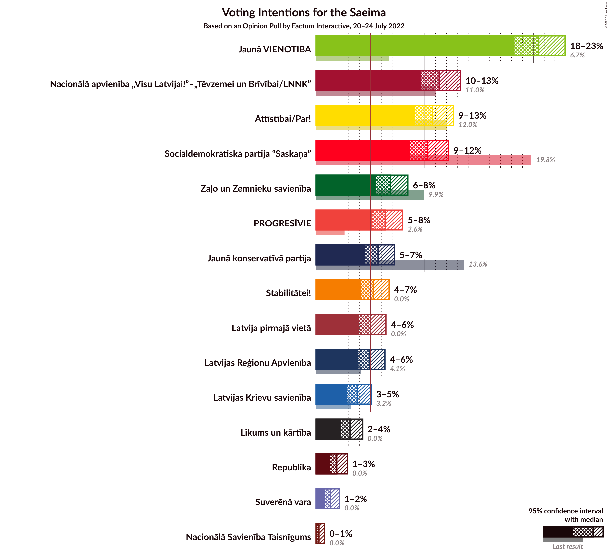

### Confidence Intervals

| Party | Last Result | Poll Result | 80% Confidence Interval | 90% Confidence Interval | 95% Confidence Interval | 99% Confidence Interval |
|:-----:|:-----------:|:-----------:|:-----------------------:|:-----------------------:|:-----------------------:|:-----------------------:|
| Jaunā VIENOTĪBA | 6.7% | 20.5% | 19.0–22.1% |18.6–22.5% |18.3–22.9% |17.6–23.7% |
| Nacionālā apvienība „Visu Latvijai!”–„Tēvzemei un Brīvībai/LNNK” | 11.0% | 11.3% | 10.2–12.6% |9.9–13.0% |9.6–13.3% |9.1–13.9% |
| Attīstībai/Par! | 12.0% | 10.7% | 9.6–12.0% |9.3–12.3% |9.1–12.7% |8.6–13.3% |
| Sociāldemokrātiskā partija “Saskaņa” | 19.8% | 10.3% | 9.2–11.5% |8.9–11.9% |8.7–12.2% |8.2–12.8% |
| Zaļo un Zemnieku savienība | 9.9% | 6.8% | 6.0–7.9% |5.7–8.2% |5.5–8.4% |5.1–9.0% |
| PROGRESĪVIE | 2.6% | 6.4% | 5.6–7.4% |5.3–7.7% |5.1–8.0% |4.8–8.5% |
| Jaunā konservatīvā partija | 13.6% | 5.7% | 4.9–6.7% |4.7–7.0% |4.5–7.2% |4.2–7.7% |
| Stabilitātei! | 0.0% | 5.3% | 4.5–6.2% |4.3–6.5% |4.1–6.7% |3.8–7.2% |
| Latvija pirmajā vietā | 0.0% | 5.0% | 4.3–5.9% |4.1–6.2% |3.9–6.4% |3.6–6.9% |
| Latvijas Reģionu Apvienība | 4.1% | 4.9% | 4.2–5.9% |4.0–6.1% |3.8–6.3% |3.5–6.8% |
| Latvijas Krievu savienība | 3.2% | 3.8% | 3.2–4.6% |3.0–4.9% |2.9–5.1% |2.6–5.5% |
| Likums un kārtība | 0.0% | 3.1% | 2.5–3.9% |2.4–4.1% |2.3–4.3% |2.0–4.7% |
| Republika | 0.0% | 1.9% | 1.5–2.5% |1.4–2.7% |1.2–2.9% |1.1–3.2% |
| Suverēnā vara | 0.0% | 1.3% | 1.0–1.8% |0.9–2.0% |0.8–2.1% |0.7–2.4% |
| Nacionālā Savienība Taisnīgums | 0.0% | 0.3% | 0.1–0.6% |0.1–0.7% |0.1–0.8% |0.0–0.9% |

*Note:* The poll result column reflects the actual value used in the calculations. Published results may vary slightly, and in addition be rounded to fewer digits.

## Seats

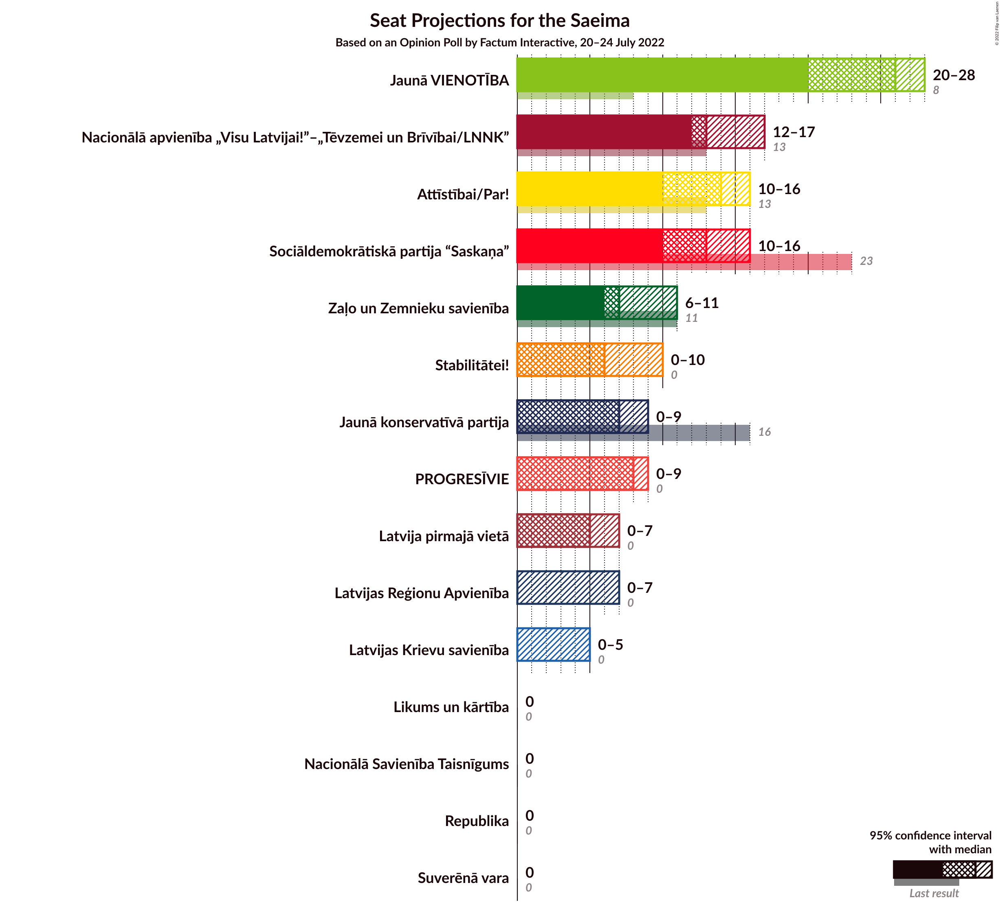

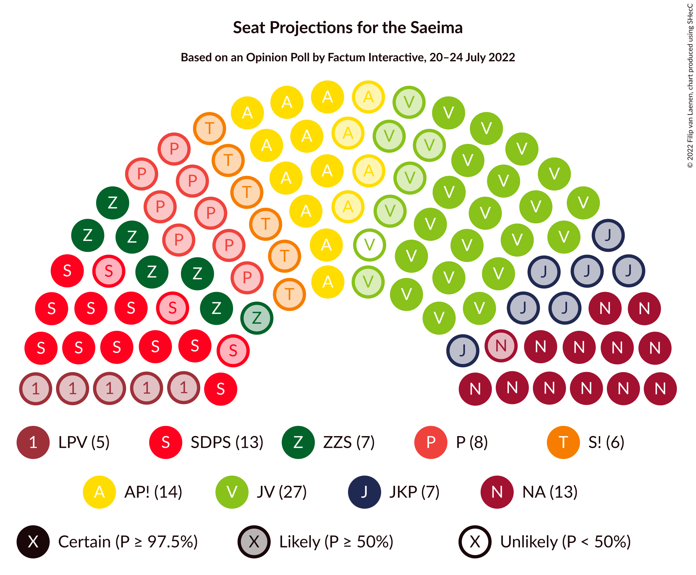

### Confidence Intervals

| Party | Last Result | Median | 80% Confidence Interval | 90% Confidence Interval | 95% Confidence Interval | 99% Confidence Interval |
|:-----:|:-----------:|:------:|:-----------------------:|:-----------------------:|:-----------------------:|:-----------------------:|
| <a href="#jaunā-vienotība">Jaunā VIENOTĪBA</a> | 8 | 26 | 20–27 |20–27 |20–28 |20–33 |
| <a href="#nacionālā-apvienība-„visu-latvijai!”–„tēvzemei-un-brīvībai/lnnk”">Nacionālā apvienība „Visu Latvijai!”–„Tēvzemei un Brīvībai/LNNK”</a> | 13 | 13 | 13–14 |13–15 |12–17 |12–18 |
| <a href="#attīstībai/par!">Attīstībai/Par!</a> | 13 | 14 | 14 |12–16 |10–16 |10–16 |
| <a href="#sociāldemokrātiskā-partija-“saskaņa”">Sociāldemokrātiskā partija “Saskaņa”</a> | 23 | 13 | 10–14 |10–15 |10–16 |10–17 |
| <a href="#zaļo-un-zemnieku-savienība">Zaļo un Zemnieku savienība</a> | 11 | 7 | 6–11 |6–11 |6–11 |6–11 |
| <a href="#progresīvie">PROGRESĪVIE</a> | 0 | 8 | 7–9 |7–9 |0–9 |0–10 |
| <a href="#jaunā-konservatīvā-partija">Jaunā konservatīvā partija</a> | 16 | 7 | 0–7 |0–8 |0–9 |0–9 |
| <a href="#stabilitātei!">Stabilitātei!</a> | 0 | 6 | 6–10 |0–10 |0–10 |0–10 |
| <a href="#latvija-pirmajā-vietā">Latvija pirmajā vietā</a> | 0 | 5 | 0–7 |0–7 |0–7 |0–8 |
| <a href="#latvijas-reģionu-apvienība">Latvijas Reģionu Apvienība</a> | 0 | 0 | 0–6 |0–6 |0–7 |0–7 |
| <a href="#latvijas-krievu-savienība">Latvijas Krievu savienība</a> | 0 | 0 | 0–5 |0–5 |0–5 |0–8 |
| <a href="#likums-un-kārtība">Likums un kārtība</a> | 0 | 0 | 0 |0 |0 |0–5 |
| <a href="#republika">Republika</a> | 0 | 0 | 0 |0 |0 |0 |
| <a href="#suverēnā-vara">Suverēnā vara</a> | 0 | 0 | 0 |0 |0 |0 |
| <a href="#nacionālā-savienība-taisnīgums">Nacionālā Savienība Taisnīgums</a> | 0 | 0 | 0 |0 |0 |0 |

### Jaunā VIENOTĪBA

*For a full overview of the results for this party, see the [Jaunā VIENOTĪBA](party-jaunāvienotība.html) page.*

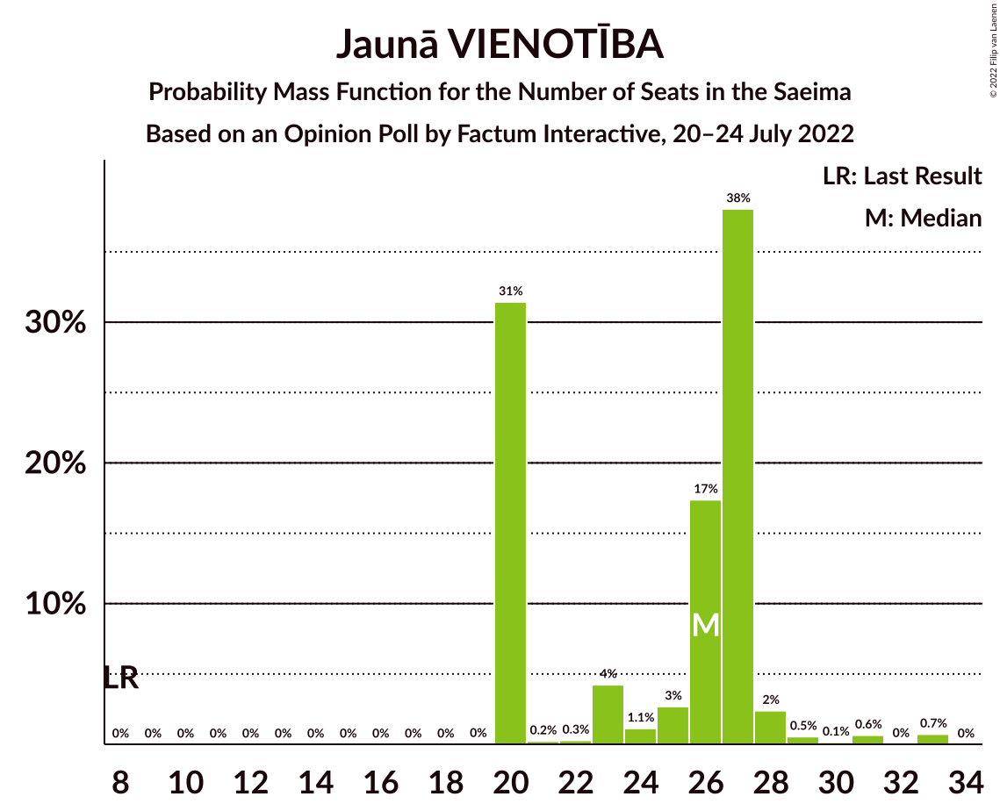

| Number of Seats | Probability | Accumulated | Special Marks |
|:---------------:|:-----------:|:-----------:|:-------------:|
| 8 | 0% | 100% | Last Result |
| 9 | 0% | 100% |  |
| 10 | 0% | 100% |  |
| 11 | 0% | 100% |  |
| 12 | 0% | 100% |  |
| 13 | 0% | 100% |  |
| 14 | 0% | 100% |  |
| 15 | 0% | 100% |  |
| 16 | 0% | 100% |  |
| 17 | 0% | 100% |  |
| 18 | 0% | 100% |  |
| 19 | 0% | 100% |  |
| 20 | 31% | 100% |  |
| 21 | 0.2% | 69% |  |
| 22 | 0.3% | 68% |  |
| 23 | 4% | 68% |  |
| 24 | 1.1% | 64% |  |
| 25 | 3% | 63% |  |
| 26 | 17% | 60% | Median |
| 27 | 38% | 43% |  |
| 28 | 2% | 5% |  |
| 29 | 0.5% | 2% |  |
| 30 | 0.1% | 2% |  |
| 31 | 0.6% | 1.4% |  |
| 32 | 0% | 0.8% |  |
| 33 | 0.7% | 0.8% |  |
| 34 | 0% | 0% |  |

### Nacionālā apvienība „Visu Latvijai!”–„Tēvzemei un Brīvībai/LNNK”

*For a full overview of the results for this party, see the [Nacionālā apvienība „Visu Latvijai!”–„Tēvzemei un Brīvībai/LNNK”](party-nacionālāapvienība„visulatvijai”–„tēvzemeiunbrīvībailnnk”.html) page.*

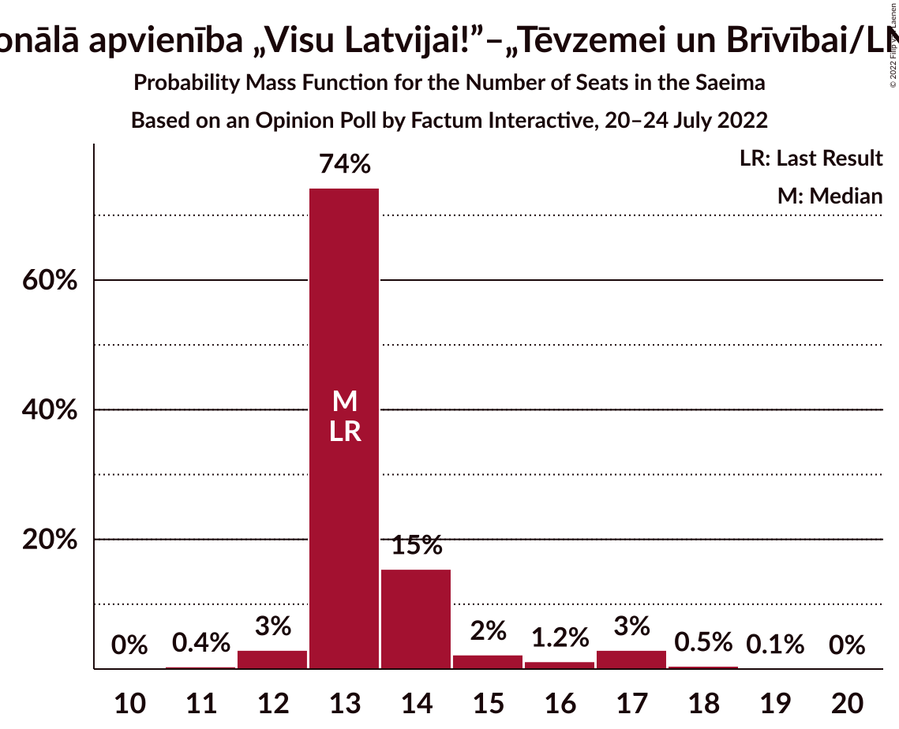

| Number of Seats | Probability | Accumulated | Special Marks |
|:---------------:|:-----------:|:-----------:|:-------------:|
| 11 | 0.4% | 100% |  |
| 12 | 3% | 99.6% |  |
| 13 | 74% | 97% | Last Result, Median |
| 14 | 15% | 22% |  |
| 15 | 2% | 7% |  |
| 16 | 1.2% | 5% |  |
| 17 | 3% | 4% |  |
| 18 | 0.5% | 0.6% |  |
| 19 | 0.1% | 0.1% |  |
| 20 | 0% | 0% |  |

### Attīstībai/Par!

*For a full overview of the results for this party, see the [Attīstībai/Par!](party-attīstībaipar.html) page.*

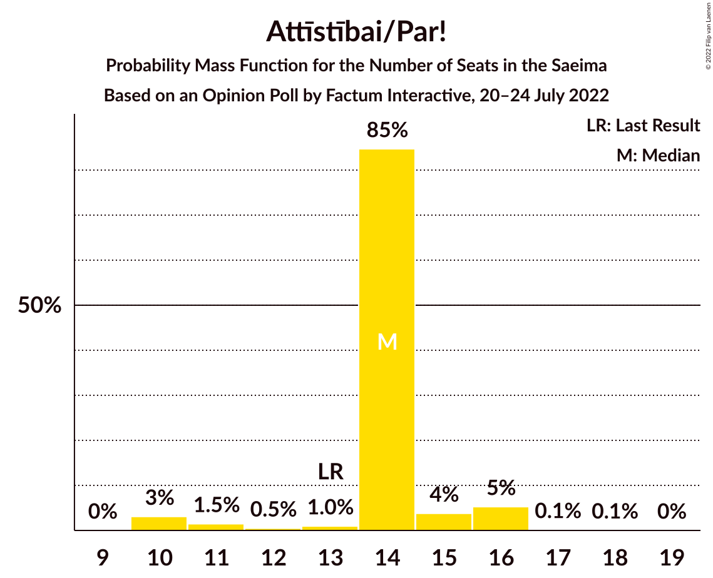

| Number of Seats | Probability | Accumulated | Special Marks |
|:---------------:|:-----------:|:-----------:|:-------------:|
| 10 | 3% | 100% |  |
| 11 | 1.5% | 97% |  |
| 12 | 0.5% | 95% |  |
| 13 | 1.0% | 95% | Last Result |
| 14 | 85% | 94% | Median |
| 15 | 4% | 9% |  |
| 16 | 5% | 5% |  |
| 17 | 0.1% | 0.2% |  |
| 18 | 0.1% | 0.1% |  |
| 19 | 0% | 0% |  |

### Sociāldemokrātiskā partija “Saskaņa”

*For a full overview of the results for this party, see the [Sociāldemokrātiskā partija “Saskaņa”](party-sociāldemokrātiskāpartija“saskaņa”.html) page.*

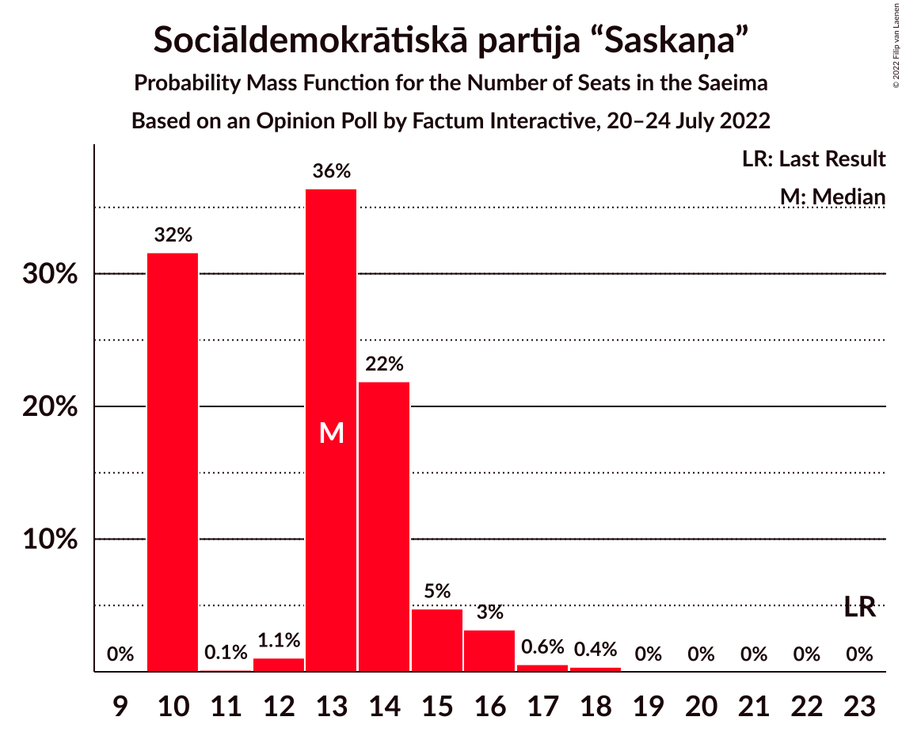

| Number of Seats | Probability | Accumulated | Special Marks |
|:---------------:|:-----------:|:-----------:|:-------------:|
| 10 | 32% | 100% |  |
| 11 | 0.1% | 68% |  |
| 12 | 1.1% | 68% |  |
| 13 | 36% | 67% | Median |
| 14 | 22% | 31% |  |
| 15 | 5% | 9% |  |
| 16 | 3% | 4% |  |
| 17 | 0.6% | 0.9% |  |
| 18 | 0.4% | 0.4% |  |
| 19 | 0% | 0% |  |
| 20 | 0% | 0% |  |
| 21 | 0% | 0% |  |
| 22 | 0% | 0% |  |
| 23 | 0% | 0% | Last Result |

### Zaļo un Zemnieku savienība

*For a full overview of the results for this party, see the [Zaļo un Zemnieku savienība](party-zaļounzemniekusavienība.html) page.*

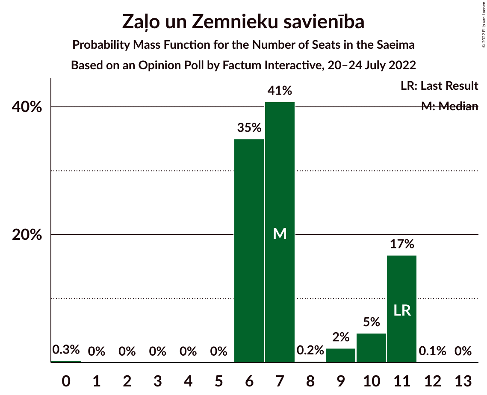

| Number of Seats | Probability | Accumulated | Special Marks |
|:---------------:|:-----------:|:-----------:|:-------------:|
| 0 | 0.3% | 100% |  |
| 1 | 0% | 99.7% |  |
| 2 | 0% | 99.7% |  |
| 3 | 0% | 99.7% |  |
| 4 | 0% | 99.7% |  |
| 5 | 0% | 99.7% |  |
| 6 | 35% | 99.7% |  |
| 7 | 41% | 65% | Median |
| 8 | 0.2% | 24% |  |
| 9 | 2% | 24% |  |
| 10 | 5% | 21% |  |
| 11 | 17% | 17% | Last Result |
| 12 | 0.1% | 0.1% |  |
| 13 | 0% | 0% |  |

### PROGRESĪVIE

*For a full overview of the results for this party, see the [PROGRESĪVIE](party-progresīvie.html) page.*

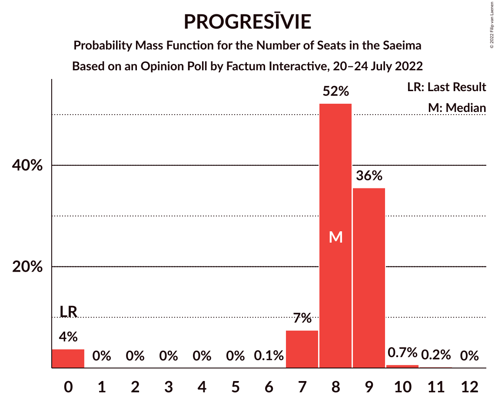

| Number of Seats | Probability | Accumulated | Special Marks |
|:---------------:|:-----------:|:-----------:|:-------------:|
| 0 | 4% | 100% | Last Result |
| 1 | 0% | 96% |  |
| 2 | 0% | 96% |  |
| 3 | 0% | 96% |  |
| 4 | 0% | 96% |  |
| 5 | 0% | 96% |  |
| 6 | 0.1% | 96% |  |
| 7 | 7% | 96% |  |
| 8 | 52% | 89% | Median |
| 9 | 36% | 36% |  |
| 10 | 0.7% | 0.9% |  |
| 11 | 0.2% | 0.2% |  |
| 12 | 0% | 0% |  |

### Jaunā konservatīvā partija

*For a full overview of the results for this party, see the [Jaunā konservatīvā partija](party-jaunākonservatīvāpartija.html) page.*

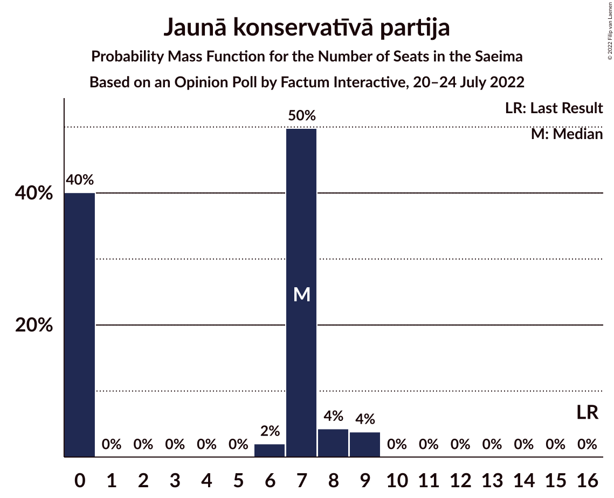

| Number of Seats | Probability | Accumulated | Special Marks |
|:---------------:|:-----------:|:-----------:|:-------------:|
| 0 | 40% | 100% |  |
| 1 | 0% | 60% |  |
| 2 | 0% | 60% |  |
| 3 | 0% | 60% |  |
| 4 | 0% | 60% |  |
| 5 | 0% | 60% |  |
| 6 | 2% | 60% |  |
| 7 | 50% | 58% | Median |
| 8 | 4% | 8% |  |
| 9 | 4% | 4% |  |
| 10 | 0% | 0% |  |
| 11 | 0% | 0% |  |
| 12 | 0% | 0% |  |
| 13 | 0% | 0% |  |
| 14 | 0% | 0% |  |
| 15 | 0% | 0% |  |
| 16 | 0% | 0% | Last Result |

### Stabilitātei!

*For a full overview of the results for this party, see the [Stabilitātei!](party-stabilitātei.html) page.*

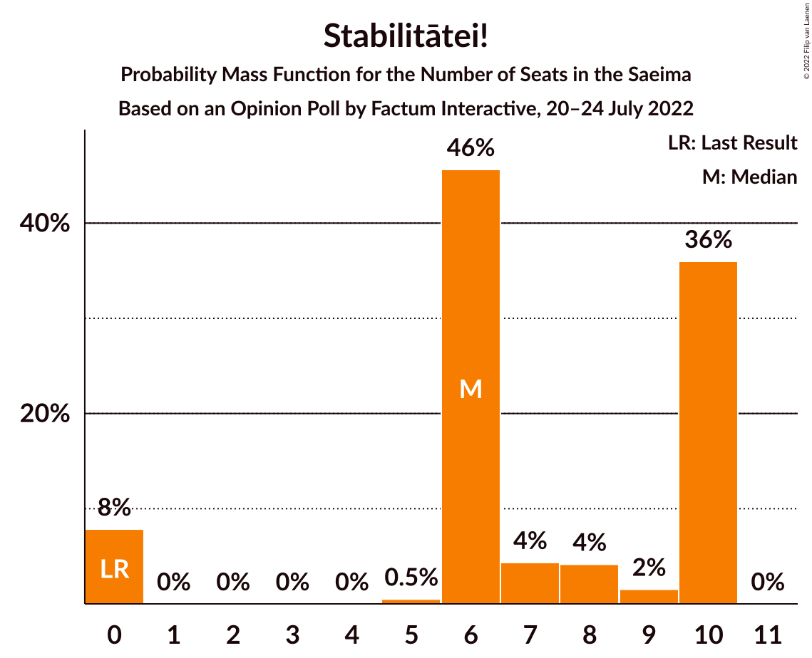

| Number of Seats | Probability | Accumulated | Special Marks |
|:---------------:|:-----------:|:-----------:|:-------------:|
| 0 | 8% | 100% | Last Result |
| 1 | 0% | 92% |  |
| 2 | 0% | 92% |  |
| 3 | 0% | 92% |  |
| 4 | 0% | 92% |  |
| 5 | 0.5% | 92% |  |
| 6 | 46% | 92% | Median |
| 7 | 4% | 46% |  |
| 8 | 4% | 42% |  |
| 9 | 2% | 38% |  |
| 10 | 36% | 36% |  |
| 11 | 0% | 0% |  |

### Latvija pirmajā vietā

*For a full overview of the results for this party, see the [Latvija pirmajā vietā](party-latvijapirmajāvietā.html) page.*

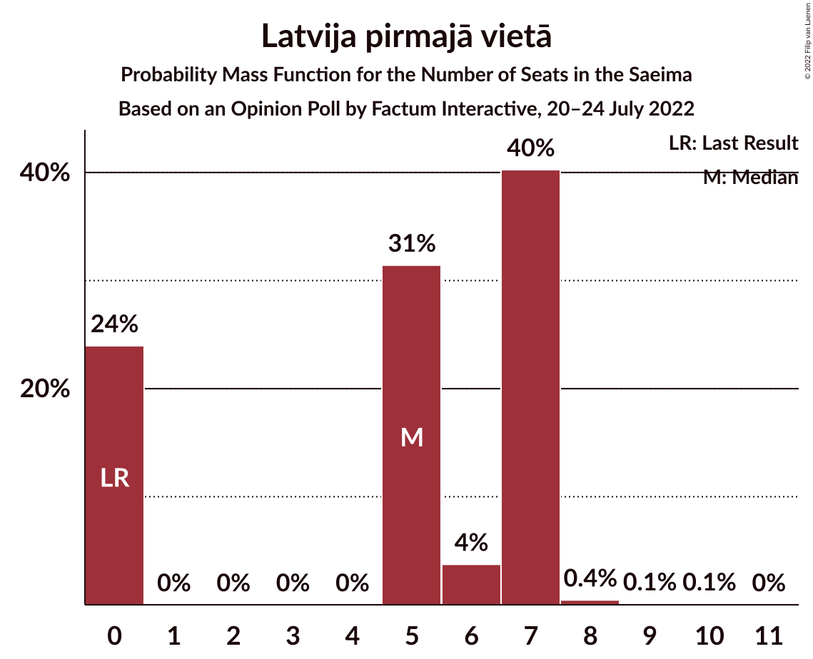

| Number of Seats | Probability | Accumulated | Special Marks |
|:---------------:|:-----------:|:-----------:|:-------------:|
| 0 | 24% | 100% | Last Result |
| 1 | 0% | 76% |  |
| 2 | 0% | 76% |  |
| 3 | 0% | 76% |  |
| 4 | 0% | 76% |  |
| 5 | 31% | 76% | Median |
| 6 | 4% | 45% |  |
| 7 | 40% | 41% |  |
| 8 | 0.4% | 0.6% |  |
| 9 | 0.1% | 0.2% |  |
| 10 | 0.1% | 0.1% |  |
| 11 | 0% | 0% |  |

### Latvijas Reģionu Apvienība

*For a full overview of the results for this party, see the [Latvijas Reģionu Apvienība](party-latvijasreģionuapvienība.html) page.*

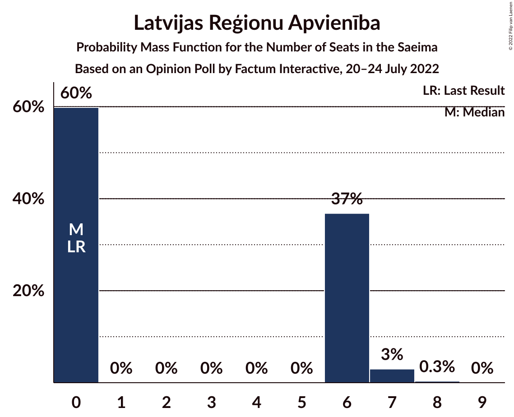

| Number of Seats | Probability | Accumulated | Special Marks |
|:---------------:|:-----------:|:-----------:|:-------------:|
| 0 | 60% | 100% | Last Result, Median |
| 1 | 0% | 40% |  |
| 2 | 0% | 40% |  |
| 3 | 0% | 40% |  |
| 4 | 0% | 40% |  |
| 5 | 0% | 40% |  |
| 6 | 37% | 40% |  |
| 7 | 3% | 3% |  |
| 8 | 0.3% | 0.4% |  |
| 9 | 0% | 0% |  |

### Latvijas Krievu savienība

*For a full overview of the results for this party, see the [Latvijas Krievu savienība](party-latvijaskrievusavienība.html) page.*

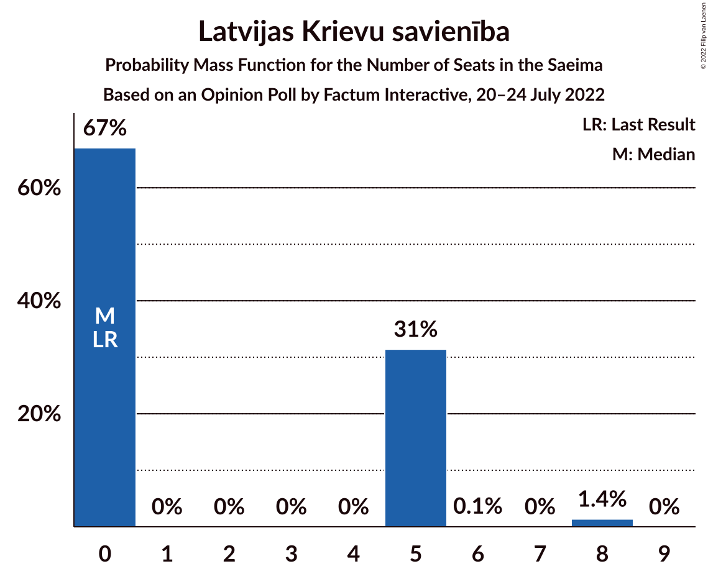

| Number of Seats | Probability | Accumulated | Special Marks |
|:---------------:|:-----------:|:-----------:|:-------------:|
| 0 | 67% | 100% | Last Result, Median |
| 1 | 0% | 33% |  |
| 2 | 0% | 33% |  |
| 3 | 0% | 33% |  |
| 4 | 0% | 33% |  |
| 5 | 31% | 33% |  |
| 6 | 0.1% | 2% |  |
| 7 | 0% | 1.4% |  |
| 8 | 1.4% | 1.4% |  |
| 9 | 0% | 0% |  |

### Likums un kārtība

*For a full overview of the results for this party, see the [Likums un kārtība](party-likumsunkārtība.html) page.*

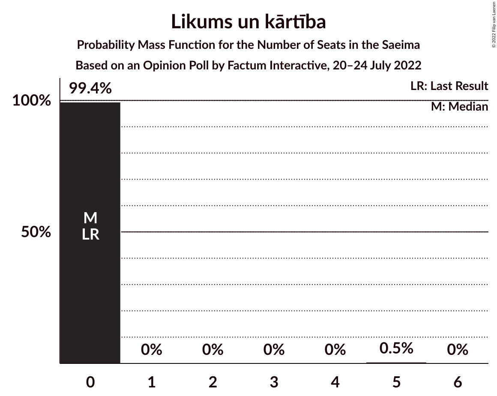

| Number of Seats | Probability | Accumulated | Special Marks |
|:---------------:|:-----------:|:-----------:|:-------------:|
| 0 | 99.4% | 100% | Last Result, Median |
| 1 | 0% | 0.6% |  |
| 2 | 0% | 0.6% |  |
| 3 | 0% | 0.6% |  |
| 4 | 0% | 0.6% |  |
| 5 | 0.5% | 0.6% |  |
| 6 | 0% | 0% |  |

### Republika

*For a full overview of the results for this party, see the [Republika](party-republika.html) page.*

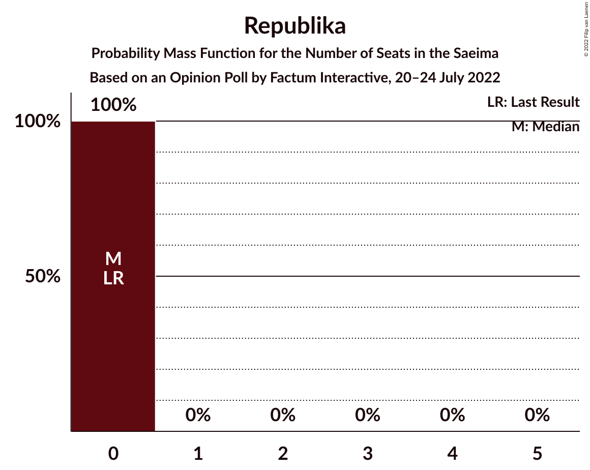

| Number of Seats | Probability | Accumulated | Special Marks |
|:---------------:|:-----------:|:-----------:|:-------------:|
| 0 | 100% | 100% | Last Result, Median |

### Suverēnā vara

*For a full overview of the results for this party, see the [Suverēnā vara](party-suverēnāvara.html) page.*

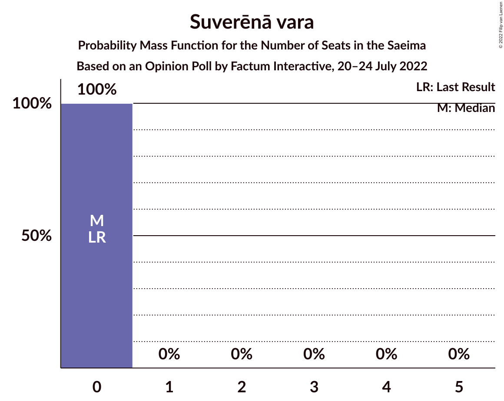

| Number of Seats | Probability | Accumulated | Special Marks |
|:---------------:|:-----------:|:-----------:|:-------------:|
| 0 | 100% | 100% | Last Result, Median |

### Nacionālā Savienība Taisnīgums

*For a full overview of the results for this party, see the [Nacionālā Savienība Taisnīgums](party-nacionālāsavienībataisnīgums.html) page.*

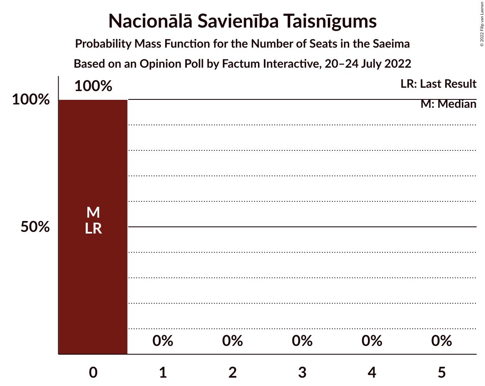

| Number of Seats | Probability | Accumulated | Special Marks |
|:---------------:|:-----------:|:-----------:|:-------------:|
| 0 | 100% | 100% | Last Result, Median |

## Coalitions

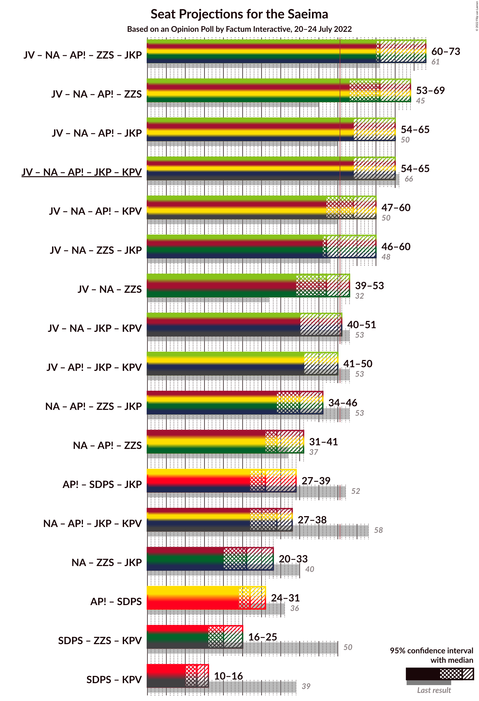

### Confidence Intervals

| Coalition | Last Result | Median | Majority? | 80% Confidence Interval | 90% Confidence Interval | 95% Confidence Interval | 99% Confidence Interval |
|:---------:|:-----------:|:------:|:---------:|:-----------------------:|:-----------------------:|:-----------------------:|:-----------------------:|
| Jaunā VIENOTĪBA – Nacionālā apvienība „Visu Latvijai!”–„Tēvzemei un Brīvībai/LNNK” – Attīstībai/Par! – Zaļo un Zemnieku savienība – Jaunā konservatīvā partija | 61 | 61 | 100% | 60–72 | 60–72 | 60–73 | 59–78 |
| Jaunā VIENOTĪBA – Nacionālā apvienība „Visu Latvijai!”–„Tēvzemei un Brīvībai/LNNK” – Attīstībai/Par! – Zaļo un Zemnieku savienība | 45 | 61 | 100% | 53–65 | 53–66 | 53–69 | 53–75 |
| Jaunā VIENOTĪBA – Nacionālā apvienība „Visu Latvijai!”–„Tēvzemei un Brīvībai/LNNK” – Attīstībai/Par! – Jaunā konservatīvā partija | 50 | 54 | 99.3% | 54–61 | 54–63 | 54–65 | 49–67 |
| Jaunā VIENOTĪBA – Nacionālā apvienība „Visu Latvijai!”–„Tēvzemei un Brīvībai/LNNK” – Zaļo un Zemnieku savienība – Jaunā konservatīvā partija | 48 | 47 | 29% | 46–58 | 46–58 | 46–60 | 46–62 |
| Jaunā VIENOTĪBA – Nacionālā apvienība „Visu Latvijai!”–„Tēvzemei un Brīvībai/LNNK” – Zaļo un Zemnieku savienība | 32 | 47 | 20% | 39–51 | 39–52 | 39–53 | 39–59 |
| Nacionālā apvienība „Visu Latvijai!”–„Tēvzemei un Brīvībai/LNNK” – Attīstībai/Par! – Zaļo un Zemnieku savienība – Jaunā konservatīvā partija | 53 | 40 | 0% | 34–46 | 34–46 | 34–46 | 34–49 |
| Nacionālā apvienība „Visu Latvijai!”–„Tēvzemei un Brīvībai/LNNK” – Attīstībai/Par! – Zaļo un Zemnieku savienība | 37 | 34 | 0% | 33–39 | 33–39 | 31–41 | 29–45 |
| Attīstībai/Par! – Sociāldemokrātiskā partija “Saskaņa” – Jaunā konservatīvā partija | 52 | 31 | 0% | 27–35 | 27–37 | 27–39 | 25–40 |
| Nacionālā apvienība „Visu Latvijai!”–„Tēvzemei un Brīvībai/LNNK” – Zaļo un Zemnieku savienība – Jaunā konservatīvā partija | 40 | 26 | 0% | 20–32 | 20–32 | 20–33 | 20–34 |
| Attīstībai/Par! – Sociāldemokrātiskā partija “Saskaņa” | 36 | 27 | 0% | 24–29 | 24–30 | 24–31 | 23–32 |

### Jaunā VIENOTĪBA – Nacionālā apvienība „Visu Latvijai!”–„Tēvzemei un Brīvībai/LNNK” – Attīstībai/Par! – Zaļo un Zemnieku savienība – Jaunā konservatīvā partija

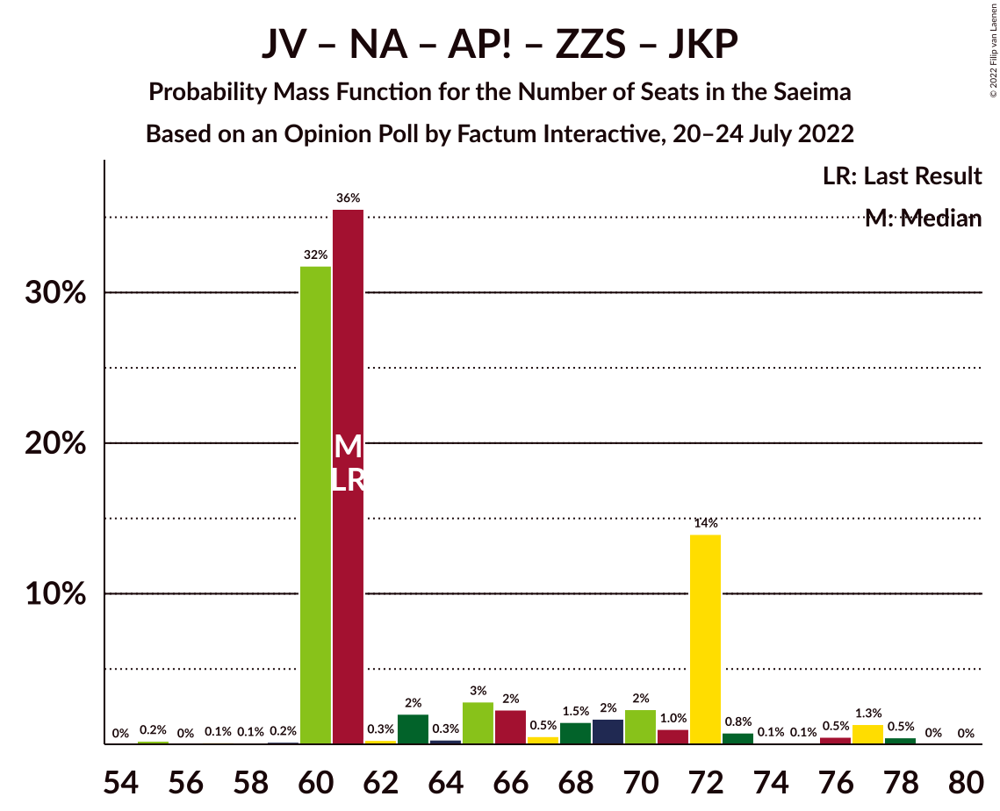

| Number of Seats | Probability | Accumulated | Special Marks |
|:---------------:|:-----------:|:-----------:|:-------------:|
| 55 | 0.2% | 100% |  |
| 56 | 0% | 99.8% |  |
| 57 | 0.1% | 99.8% |  |
| 58 | 0.1% | 99.6% |  |
| 59 | 0.2% | 99.5% |  |
| 60 | 32% | 99.4% |  |
| 61 | 36% | 68% | Last Result |
| 62 | 0.3% | 32% |  |
| 63 | 2% | 32% |  |
| 64 | 0.3% | 30% |  |
| 65 | 3% | 29% |  |
| 66 | 2% | 27% |  |
| 67 | 0.5% | 24% | Median |
| 68 | 1.5% | 24% |  |
| 69 | 2% | 22% |  |
| 70 | 2% | 21% |  |
| 71 | 1.0% | 18% |  |
| 72 | 14% | 17% |  |
| 73 | 0.8% | 3% |  |
| 74 | 0.1% | 2% |  |
| 75 | 0.1% | 2% |  |
| 76 | 0.5% | 2% |  |
| 77 | 1.3% | 2% |  |
| 78 | 0.5% | 0.5% |  |
| 79 | 0% | 0% |  |

### Jaunā VIENOTĪBA – Nacionālā apvienība „Visu Latvijai!”–„Tēvzemei un Brīvībai/LNNK” – Attīstībai/Par! – Zaļo un Zemnieku savienība

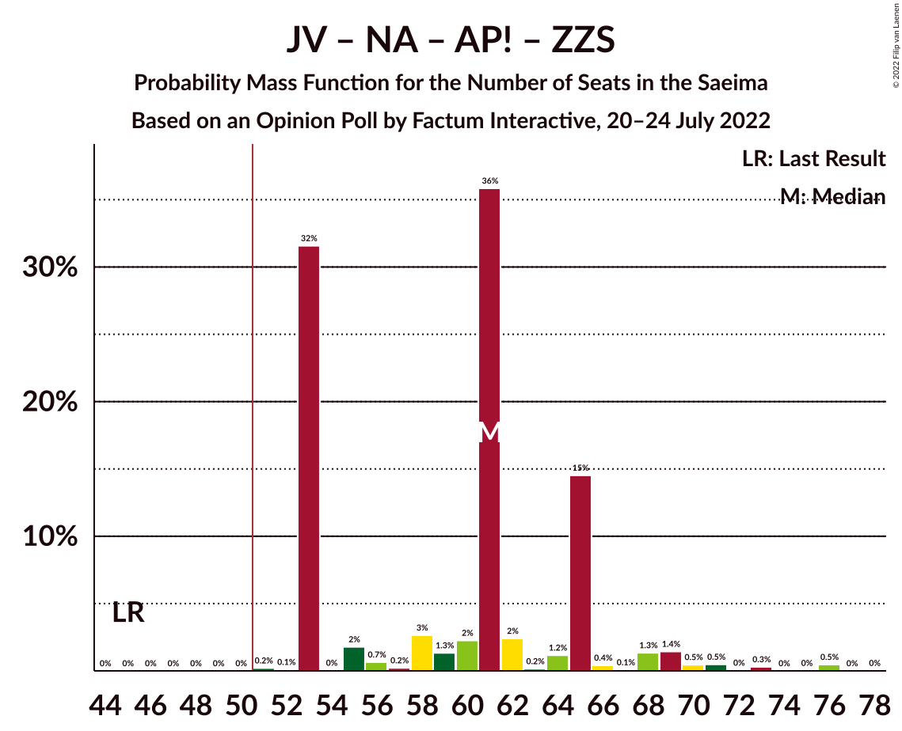

| Number of Seats | Probability | Accumulated | Special Marks |
|:---------------:|:-----------:|:-----------:|:-------------:|
| 45 | 0% | 100% | Last Result |
| 46 | 0% | 100% |  |
| 47 | 0% | 100% |  |
| 48 | 0% | 100% |  |
| 49 | 0% | 100% |  |
| 50 | 0% | 100% |  |
| 51 | 0.2% | 100% | Majority |
| 52 | 0.1% | 99.8% |  |
| 53 | 32% | 99.7% |  |
| 54 | 0% | 68% |  |
| 55 | 2% | 68% |  |
| 56 | 0.7% | 66% |  |
| 57 | 0.2% | 66% |  |
| 58 | 3% | 65% |  |
| 59 | 1.3% | 63% |  |
| 60 | 2% | 61% | Median |
| 61 | 36% | 59% |  |
| 62 | 2% | 23% |  |
| 63 | 0.2% | 21% |  |
| 64 | 1.2% | 21% |  |
| 65 | 15% | 20% |  |
| 66 | 0.4% | 5% |  |
| 67 | 0.1% | 5% |  |
| 68 | 1.3% | 5% |  |
| 69 | 1.4% | 3% |  |
| 70 | 0.5% | 2% |  |
| 71 | 0.5% | 1.3% |  |
| 72 | 0% | 0.9% |  |
| 73 | 0.3% | 0.8% |  |
| 74 | 0% | 0.5% |  |
| 75 | 0% | 0.5% |  |
| 76 | 0.5% | 0.5% |  |
| 77 | 0% | 0% |  |

### Jaunā VIENOTĪBA – Nacionālā apvienība „Visu Latvijai!”–„Tēvzemei un Brīvībai/LNNK” – Attīstībai/Par! – Jaunā konservatīvā partija

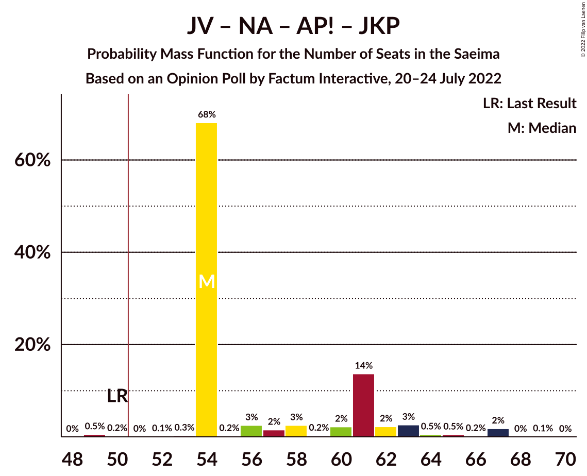

| Number of Seats | Probability | Accumulated | Special Marks |
|:---------------:|:-----------:|:-----------:|:-------------:|
| 49 | 0.5% | 100% |  |
| 50 | 0.2% | 99.4% | Last Result |
| 51 | 0% | 99.3% | Majority |
| 52 | 0.1% | 99.3% |  |
| 53 | 0.3% | 99.1% |  |
| 54 | 68% | 98.9% |  |
| 55 | 0.2% | 31% |  |
| 56 | 3% | 31% |  |
| 57 | 2% | 28% |  |
| 58 | 3% | 27% |  |
| 59 | 0.2% | 24% |  |
| 60 | 2% | 24% | Median |
| 61 | 14% | 22% |  |
| 62 | 2% | 8% |  |
| 63 | 3% | 6% |  |
| 64 | 0.5% | 3% |  |
| 65 | 0.5% | 3% |  |
| 66 | 0.2% | 2% |  |
| 67 | 2% | 2% |  |
| 68 | 0% | 0.1% |  |
| 69 | 0.1% | 0.1% |  |
| 70 | 0% | 0% |  |

### Jaunā VIENOTĪBA – Nacionālā apvienība „Visu Latvijai!”–„Tēvzemei un Brīvībai/LNNK” – Zaļo un Zemnieku savienība – Jaunā konservatīvā partija

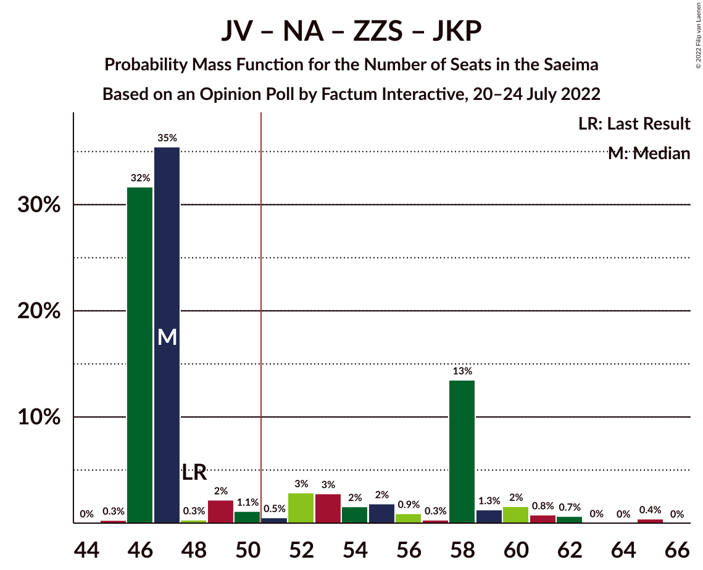

| Number of Seats | Probability | Accumulated | Special Marks |
|:---------------:|:-----------:|:-----------:|:-------------:|
| 45 | 0.3% | 100% |  |
| 46 | 32% | 99.7% |  |
| 47 | 35% | 68% |  |
| 48 | 0.3% | 33% | Last Result |
| 49 | 2% | 32% |  |
| 50 | 1.1% | 30% |  |
| 51 | 0.5% | 29% | Majority |
| 52 | 3% | 28% |  |
| 53 | 3% | 26% | Median |
| 54 | 2% | 23% |  |
| 55 | 2% | 21% |  |
| 56 | 0.9% | 19% |  |
| 57 | 0.3% | 19% |  |
| 58 | 13% | 18% |  |
| 59 | 1.3% | 5% |  |
| 60 | 2% | 3% |  |
| 61 | 0.8% | 2% |  |
| 62 | 0.7% | 1.1% |  |
| 63 | 0% | 0.4% |  |
| 64 | 0% | 0.4% |  |
| 65 | 0.4% | 0.4% |  |
| 66 | 0% | 0% |  |

### Jaunā VIENOTĪBA – Nacionālā apvienība „Visu Latvijai!”–„Tēvzemei un Brīvībai/LNNK” – Zaļo un Zemnieku savienība

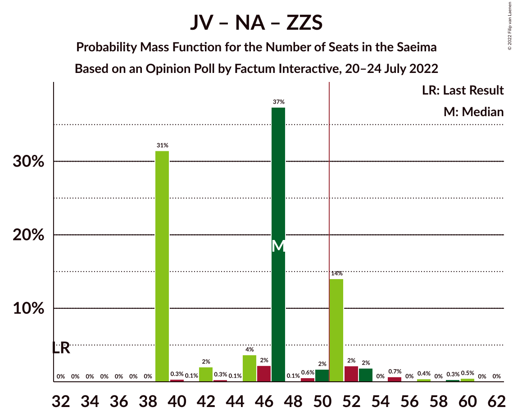

| Number of Seats | Probability | Accumulated | Special Marks |
|:---------------:|:-----------:|:-----------:|:-------------:|
| 32 | 0% | 100% | Last Result |
| 33 | 0% | 100% |  |
| 34 | 0% | 100% |  |
| 35 | 0% | 100% |  |
| 36 | 0% | 100% |  |
| 37 | 0% | 100% |  |
| 38 | 0% | 100% |  |
| 39 | 31% | 100% |  |
| 40 | 0.3% | 69% |  |
| 41 | 0.1% | 68% |  |
| 42 | 2% | 68% |  |
| 43 | 0.3% | 66% |  |
| 44 | 0.1% | 66% |  |
| 45 | 4% | 66% |  |
| 46 | 2% | 62% | Median |
| 47 | 37% | 60% |  |
| 48 | 0.1% | 22% |  |
| 49 | 0.6% | 22% |  |
| 50 | 2% | 22% |  |
| 51 | 14% | 20% | Majority |
| 52 | 2% | 6% |  |
| 53 | 2% | 4% |  |
| 54 | 0% | 2% |  |
| 55 | 0.7% | 2% |  |
| 56 | 0% | 1.3% |  |
| 57 | 0.4% | 1.2% |  |
| 58 | 0% | 0.8% |  |
| 59 | 0.3% | 0.8% |  |
| 60 | 0.5% | 0.5% |  |
| 61 | 0% | 0% |  |

### Nacionālā apvienība „Visu Latvijai!”–„Tēvzemei un Brīvībai/LNNK” – Attīstībai/Par! – Zaļo un Zemnieku savienība – Jaunā konservatīvā partija

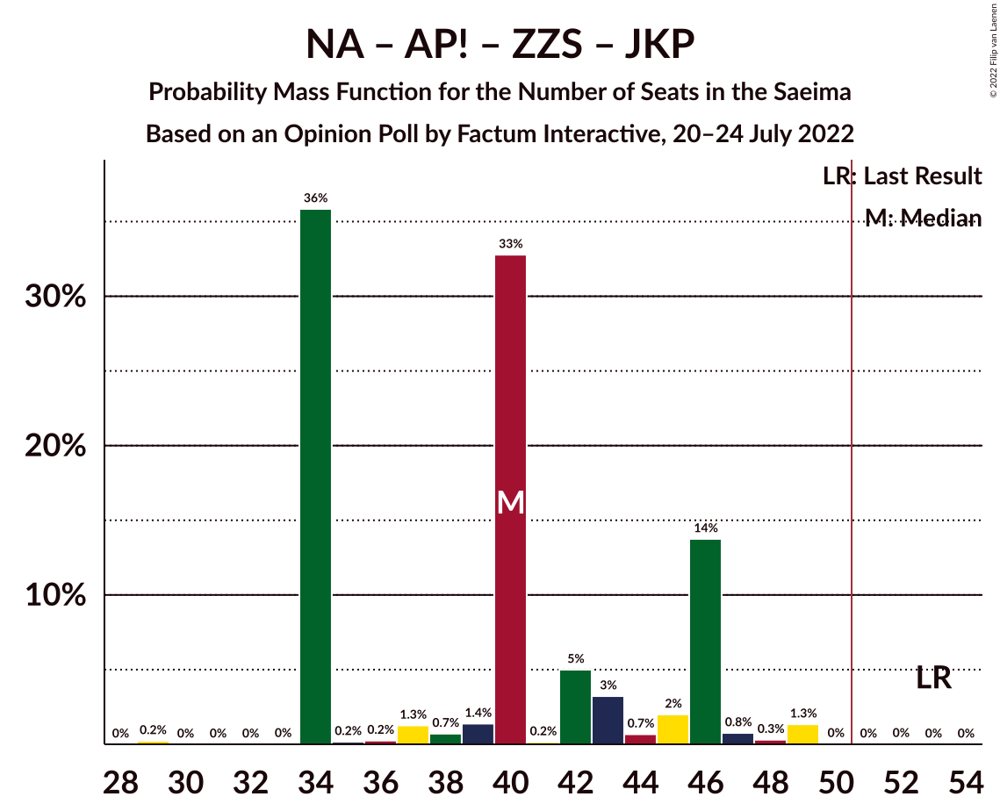

| Number of Seats | Probability | Accumulated | Special Marks |
|:---------------:|:-----------:|:-----------:|:-------------:|
| 29 | 0.2% | 100% |  |
| 30 | 0% | 99.8% |  |
| 31 | 0% | 99.8% |  |
| 32 | 0% | 99.8% |  |
| 33 | 0% | 99.8% |  |
| 34 | 36% | 99.7% |  |
| 35 | 0.2% | 64% |  |
| 36 | 0.2% | 64% |  |
| 37 | 1.3% | 63% |  |
| 38 | 0.7% | 62% |  |
| 39 | 1.4% | 61% |  |
| 40 | 33% | 60% |  |
| 41 | 0.2% | 27% | Median |
| 42 | 5% | 27% |  |
| 43 | 3% | 22% |  |
| 44 | 0.7% | 19% |  |
| 45 | 2% | 18% |  |
| 46 | 14% | 16% |  |
| 47 | 0.8% | 2% |  |
| 48 | 0.3% | 2% |  |
| 49 | 1.3% | 1.4% |  |
| 50 | 0% | 0.1% |  |
| 51 | 0% | 0% | Majority |
| 52 | 0% | 0% |  |
| 53 | 0% | 0% | Last Result |

### Nacionālā apvienība „Visu Latvijai!”–„Tēvzemei un Brīvībai/LNNK” – Attīstībai/Par! – Zaļo un Zemnieku savienība

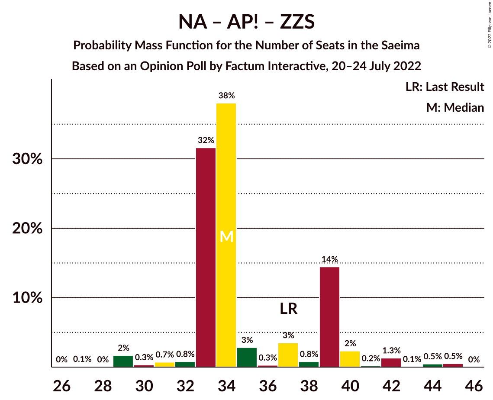

| Number of Seats | Probability | Accumulated | Special Marks |
|:---------------:|:-----------:|:-----------:|:-------------:|
| 27 | 0.1% | 100% |  |
| 28 | 0% | 99.9% |  |
| 29 | 2% | 99.9% |  |
| 30 | 0.3% | 98% |  |
| 31 | 0.7% | 98% |  |
| 32 | 0.8% | 97% |  |
| 33 | 32% | 96% |  |
| 34 | 38% | 65% | Median |
| 35 | 3% | 27% |  |
| 36 | 0.3% | 24% |  |
| 37 | 3% | 24% | Last Result |
| 38 | 0.8% | 20% |  |
| 39 | 14% | 19% |  |
| 40 | 2% | 5% |  |
| 41 | 0.2% | 3% |  |
| 42 | 1.3% | 2% |  |
| 43 | 0.1% | 1.0% |  |
| 44 | 0.5% | 1.0% |  |
| 45 | 0.5% | 0.5% |  |
| 46 | 0% | 0% |  |

### Attīstībai/Par! – Sociāldemokrātiskā partija “Saskaņa” – Jaunā konservatīvā partija

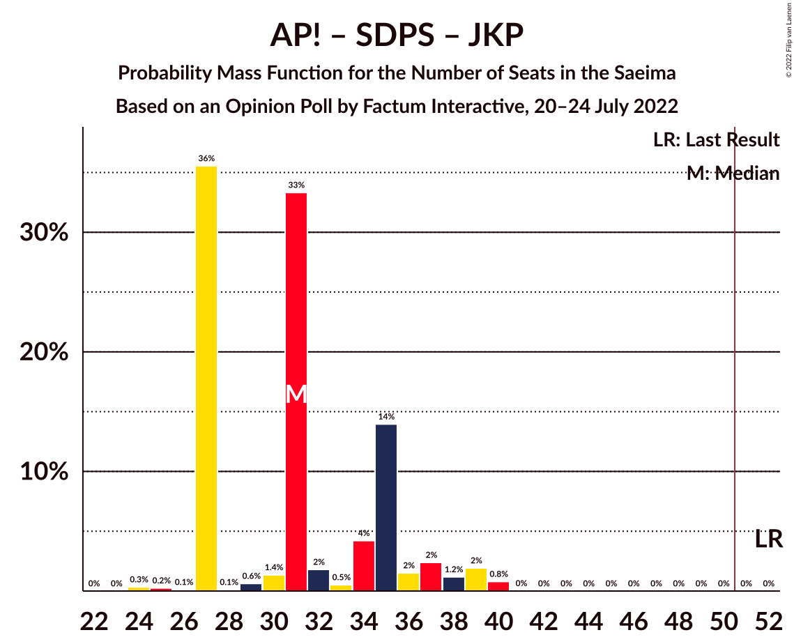

| Number of Seats | Probability | Accumulated | Special Marks |
|:---------------:|:-----------:|:-----------:|:-------------:|
| 24 | 0.3% | 100% |  |
| 25 | 0.2% | 99.7% |  |
| 26 | 0.1% | 99.4% |  |
| 27 | 36% | 99.3% |  |
| 28 | 0.1% | 64% |  |
| 29 | 0.6% | 64% |  |
| 30 | 1.4% | 63% |  |
| 31 | 33% | 62% |  |
| 32 | 2% | 28% |  |
| 33 | 0.5% | 27% |  |
| 34 | 4% | 26% | Median |
| 35 | 14% | 22% |  |
| 36 | 2% | 8% |  |
| 37 | 2% | 6% |  |
| 38 | 1.2% | 4% |  |
| 39 | 2% | 3% |  |
| 40 | 0.8% | 0.8% |  |
| 41 | 0% | 0% |  |
| 42 | 0% | 0% |  |
| 43 | 0% | 0% |  |
| 44 | 0% | 0% |  |
| 45 | 0% | 0% |  |
| 46 | 0% | 0% |  |
| 47 | 0% | 0% |  |
| 48 | 0% | 0% |  |
| 49 | 0% | 0% |  |
| 50 | 0% | 0% |  |
| 51 | 0% | 0% | Majority |
| 52 | 0% | 0% | Last Result |

### Nacionālā apvienība „Visu Latvijai!”–„Tēvzemei un Brīvībai/LNNK” – Zaļo un Zemnieku savienība – Jaunā konservatīvā partija

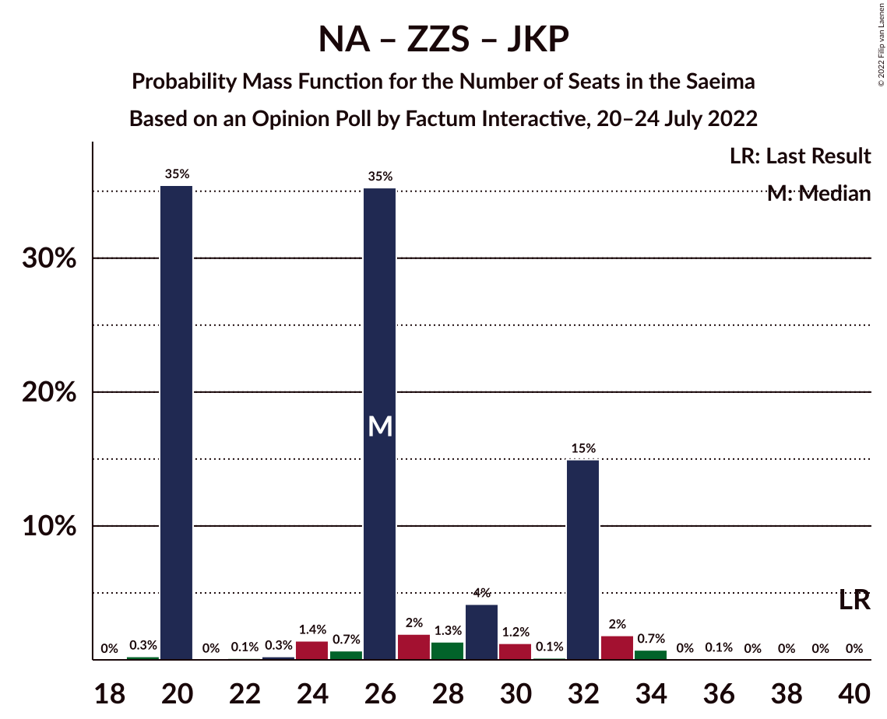

| Number of Seats | Probability | Accumulated | Special Marks |
|:---------------:|:-----------:|:-----------:|:-------------:|
| 19 | 0.3% | 100% |  |
| 20 | 35% | 99.7% |  |
| 21 | 0% | 64% |  |
| 22 | 0.1% | 64% |  |
| 23 | 0.3% | 64% |  |
| 24 | 1.4% | 64% |  |
| 25 | 0.7% | 62% |  |
| 26 | 35% | 62% |  |
| 27 | 2% | 27% | Median |
| 28 | 1.3% | 25% |  |
| 29 | 4% | 23% |  |
| 30 | 1.2% | 19% |  |
| 31 | 0.1% | 18% |  |
| 32 | 15% | 18% |  |
| 33 | 2% | 3% |  |
| 34 | 0.7% | 0.9% |  |
| 35 | 0% | 0.1% |  |
| 36 | 0.1% | 0.1% |  |
| 37 | 0% | 0% |  |
| 38 | 0% | 0% |  |
| 39 | 0% | 0% |  |
| 40 | 0% | 0% | Last Result |

### Attīstībai/Par! – Sociāldemokrātiskā partija “Saskaņa”

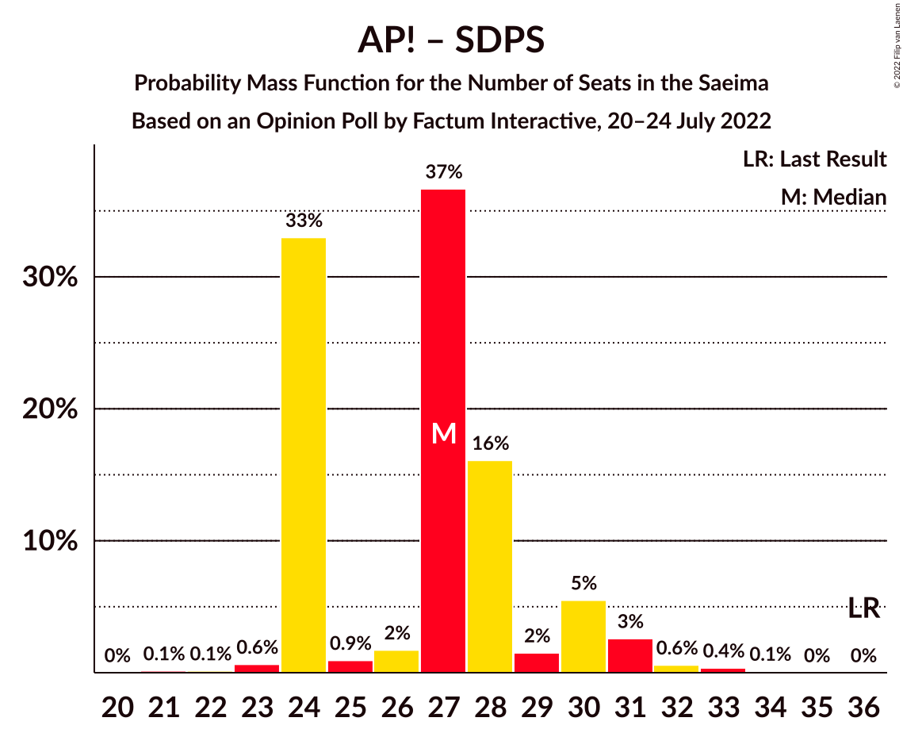

| Number of Seats | Probability | Accumulated | Special Marks |
|:---------------:|:-----------:|:-----------:|:-------------:|
| 21 | 0.1% | 100% |  |
| 22 | 0.1% | 99.8% |  |
| 23 | 0.6% | 99.7% |  |
| 24 | 33% | 99.1% |  |
| 25 | 0.9% | 66% |  |
| 26 | 2% | 65% |  |
| 27 | 37% | 63% | Median |
| 28 | 16% | 27% |  |
| 29 | 2% | 11% |  |
| 30 | 5% | 9% |  |
| 31 | 3% | 4% |  |
| 32 | 0.6% | 1.1% |  |
| 33 | 0.4% | 0.5% |  |
| 34 | 0.1% | 0.1% |  |
| 35 | 0% | 0% |  |
| 36 | 0% | 0% | Last Result |

## Technical Information

### Opinion Poll

+ **Polling firm:** Factum Interactive
+ **Commissioner(s):** —
+ **Fieldwork period:** 20–24 July 2022

### Calculations

+ **Sample size:** 1156
+ **Simulations done:** 1,048,576
+ **Error estimate:** 1.92%

