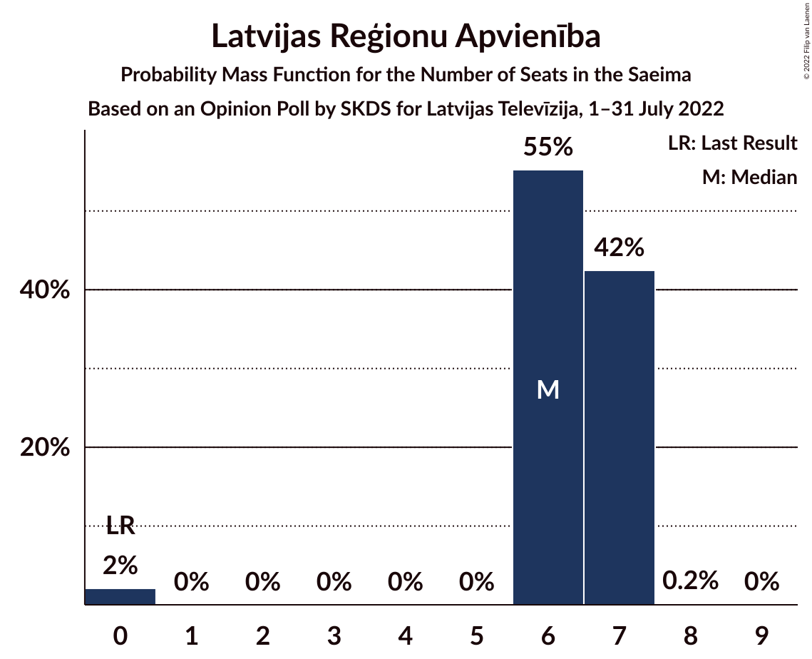
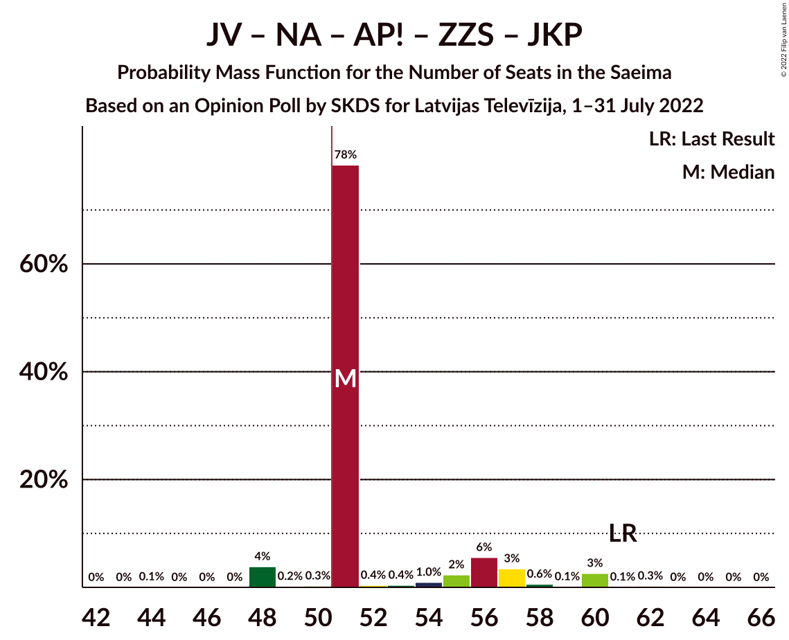

# Opinion Poll by SKDS for Latvijas Televīzija, 1–31 July 2022

<a href="#voting-intentions">Voting Intentions</a> | <a href="#seats">Seats</a> | <a href="#coalitions">Coalitions</a> | <a href="#technical-information">Technical Information</a>

## Voting Intentions

### Confidence Intervals

| Party | Last Result | Poll Result | 80% Confidence Interval | 90% Confidence Interval | 95% Confidence Interval | 99% Confidence Interval |
|:-----:|:-----------:|:-----------:|:-----------------------:|:-----------------------:|:-----------------------:|:-----------------------:|
| Jaunā VIENOTĪBA | 6.7% | 15.7% | 14.6–16.8% |14.3–17.1% |14.1–17.4% |13.6–18.0% |
| Nacionālā apvienība „Visu Latvijai!”–„Tēvzemei un Brīvībai/LNNK” | 11.0% | 13.3% | 12.3–14.4% |12.1–14.7% |11.8–15.0% |11.4–15.5% |
| Sociāldemokrātiskā partija “Saskaņa” | 19.8% | 10.8% | 9.9–11.8% |9.6–12.1% |9.4–12.3% |9.0–12.8% |
| Attīstībai/Par! | 12.0% | 9.0% | 8.2–9.9% |8.0–10.2% |7.8–10.4% |7.4–10.9% |
| PROGRESĪVIE | 2.6% | 8.1% | 7.3–9.0% |7.1–9.2% |6.9–9.4% |6.6–9.9% |
| Zaļo un Zemnieku savienība | 9.9% | 7.7% | 7.0–8.6% |6.7–8.8% |6.6–9.0% |6.2–9.4% |
| Latvijas Krievu savienība | 3.2% | 5.7% | 5.1–6.5% |4.9–6.7% |4.7–6.9% |4.5–7.3% |
| Latvijas Reģionu Apvienība | 4.1% | 5.6% | 5.0–6.4% |4.8–6.6% |4.6–6.8% |4.3–7.1% |
| Latvija pirmajā vietā | 0.0% | 5.4% | 4.8–6.1% |4.6–6.3% |4.4–6.5% |4.2–6.9% |
| Stabilitātei! | 0.0% | 5.4% | 4.8–6.1% |4.6–6.3% |4.4–6.5% |4.2–6.9% |
| Likums un kārtība | 0.0% | 4.5% | 3.9–5.2% |3.8–5.4% |3.6–5.6% |3.4–5.9% |
| Jaunā konservatīvā partija | 13.6% | 4.0% | 3.5–4.7% |3.3–4.9% |3.2–5.0% |3.0–5.4% |
| Republika | 0.0% | 2.4% | 2.0–3.0% |1.9–3.1% |1.8–3.2% |1.6–3.5% |
| Suverēnā vara | 0.0% | 1.9% | 1.6–2.4% |1.5–2.5% |1.4–2.7% |1.2–2.9% |

*Note:* The poll result column reflects the actual value used in the calculations. Published results may vary slightly, and in addition be rounded to fewer digits.

## Seats

### Confidence Intervals

| Party | Last Result | Median | 80% Confidence Interval | 90% Confidence Interval | 95% Confidence Interval | 99% Confidence Interval |
|:-----:|:-----------:|:------:|:-----------------------:|:-----------------------:|:-----------------------:|:-----------------------:|
| <a href="#jaunā-vienotība">Jaunā VIENOTĪBA</a> | 8 | 18 | 18 |18–19 |18–19 |15–21 |
| <a href="#nacionālā-apvienība-„visu-latvijai!”–„tēvzemei-un-brīvībai/lnnk”">Nacionālā apvienība „Visu Latvijai!”–„Tēvzemei un Brīvībai/LNNK”</a> | 13 | 17 | 17 |14–17 |13–18 |13–19 |
| <a href="#sociāldemokrātiskā-partija-“saskaņa”">Sociāldemokrātiskā partija “Saskaņa”</a> | 23 | 13 | 13–14 |12–14 |12–15 |12–15 |
| <a href="#attīstībai/par!">Attīstībai/Par!</a> | 13 | 9 | 9–10 |9–11 |9–13 |8–13 |
| <a href="#progresīvie">PROGRESĪVIE</a> | 0 | 8 | 8–10 |8–10 |8–11 |8–13 |
| <a href="#zaļo-un-zemnieku-savienība">Zaļo un Zemnieku savienība</a> | 11 | 7 | 7–11 |7–11 |7–11 |7–11 |
| <a href="#latvijas-krievu-savienība">Latvijas Krievu savienība</a> | 0 | 7 | 6–8 |6–8 |6–8 |0–8 |
| <a href="#latvijas-reģionu-apvienība">Latvijas Reģionu Apvienība</a> | 0 | 6 | 6–7 |6–7 |6–7 |0–7 |
| <a href="#latvija-pirmajā-vietā">Latvija pirmajā vietā</a> | 0 | 6 | 5–6 |0–6 |0–7 |0–7 |
| <a href="#stabilitātei!">Stabilitātei!</a> | 0 | 5 | 5–7 |0–7 |0–8 |0–8 |
| <a href="#likums-un-kārtība">Likums un kārtība</a> | 0 | 5 | 0–5 |0–5 |0–6 |0–6 |
| <a href="#jaunā-konservatīvā-partija">Jaunā konservatīvā partija</a> | 16 | 0 | 0 |0 |0 |0–6 |
| <a href="#republika">Republika</a> | 0 | 0 | 0 |0 |0 |0 |
| <a href="#suverēnā-vara">Suverēnā vara</a> | 0 | 0 | 0 |0 |0 |0 |

### Jaunā VIENOTĪBA

*For a full overview of the results for this party, see the [Jaunā VIENOTĪBA](party-jaunāvienotība.html) page.*

| Number of Seats | Probability | Accumulated | Special Marks |
|:---------------:|:-----------:|:-----------:|:-------------:|
| 8 | 0% | 100% | Last Result |
| 9 | 0% | 100% |  |
| 10 | 0% | 100% |  |
| 11 | 0% | 100% |  |
| 12 | 0% | 100% |  |
| 13 | 0% | 100% |  |
| 14 | 0% | 100% |  |
| 15 | 0.5% | 100% |  |
| 16 | 0.6% | 99.4% |  |
| 17 | 0.5% | 98.9% |  |
| 18 | 91% | 98% | Median |
| 19 | 6% | 7% |  |
| 20 | 0.3% | 1.2% |  |
| 21 | 0.7% | 0.9% |  |
| 22 | 0% | 0.1% |  |
| 23 | 0% | 0.1% |  |
| 24 | 0.1% | 0.1% |  |
| 25 | 0% | 0% |  |

### Nacionālā apvienība „Visu Latvijai!”–„Tēvzemei un Brīvībai/LNNK”

*For a full overview of the results for this party, see the [Nacionālā apvienība „Visu Latvijai!”–„Tēvzemei un Brīvībai/LNNK”](party-nacionālāapvienība„visulatvijai”–„tēvzemeiunbrīvībailnnk”.html) page.*

| Number of Seats | Probability | Accumulated | Special Marks |
|:---------------:|:-----------:|:-----------:|:-------------:|
| 13 | 5% | 100% | Last Result |
| 14 | 0.7% | 95% |  |
| 15 | 1.0% | 95% |  |
| 16 | 3% | 94% |  |
| 17 | 87% | 90% | Median |
| 18 | 2% | 3% |  |
| 19 | 0.5% | 0.5% |  |
| 20 | 0% | 0% |  |

### Sociāldemokrātiskā partija “Saskaņa”

*For a full overview of the results for this party, see the [Sociāldemokrātiskā partija “Saskaņa”](party-sociāldemokrātiskāpartija“saskaņa”.html) page.*

| Number of Seats | Probability | Accumulated | Special Marks |
|:---------------:|:-----------:|:-----------:|:-------------:|
| 10 | 0.4% | 100% |  |
| 11 | 0% | 99.6% |  |
| 12 | 6% | 99.6% |  |
| 13 | 82% | 94% | Median |
| 14 | 8% | 11% |  |
| 15 | 3% | 3% |  |
| 16 | 0.4% | 0.5% |  |
| 17 | 0% | 0% |  |
| 18 | 0% | 0% |  |
| 19 | 0% | 0% |  |
| 20 | 0% | 0% |  |
| 21 | 0% | 0% |  |
| 22 | 0% | 0% |  |
| 23 | 0% | 0% | Last Result |

### Attīstībai/Par!

*For a full overview of the results for this party, see the [Attīstībai/Par!](party-attīstībaipar.html) page.*

| Number of Seats | Probability | Accumulated | Special Marks |
|:---------------:|:-----------:|:-----------:|:-------------:|
| 7 | 0.2% | 100% |  |
| 8 | 0.6% | 99.8% |  |
| 9 | 85% | 99.2% | Median |
| 10 | 9% | 15% |  |
| 11 | 1.2% | 5% |  |
| 12 | 0.3% | 4% |  |
| 13 | 3% | 4% | Last Result |
| 14 | 0.3% | 0.4% |  |
| 15 | 0.1% | 0.1% |  |
| 16 | 0% | 0% |  |

### PROGRESĪVIE

*For a full overview of the results for this party, see the [PROGRESĪVIE](party-progresīvie.html) page.*

| Number of Seats | Probability | Accumulated | Special Marks |
|:---------------:|:-----------:|:-----------:|:-------------:|
| 0 | 0% | 100% | Last Result |
| 1 | 0% | 100% |  |
| 2 | 0% | 100% |  |
| 3 | 0% | 100% |  |
| 4 | 0% | 100% |  |
| 5 | 0% | 100% |  |
| 6 | 0% | 100% |  |
| 7 | 0.4% | 100% |  |
| 8 | 89% | 99.6% | Median |
| 9 | 0.8% | 11% |  |
| 10 | 7% | 10% |  |
| 11 | 2% | 3% |  |
| 12 | 0.7% | 1.3% |  |
| 13 | 0.6% | 0.6% |  |
| 14 | 0% | 0% |  |

### Zaļo un Zemnieku savienība

*For a full overview of the results for this party, see the [Zaļo un Zemnieku savienība](party-zaļounzemniekusavienība.html) page.*

| Number of Seats | Probability | Accumulated | Special Marks |
|:---------------:|:-----------:|:-----------:|:-------------:|
| 6 | 0.2% | 100% |  |
| 7 | 79% | 99.8% | Median |
| 8 | 4% | 20% |  |
| 9 | 0.7% | 16% |  |
| 10 | 2% | 16% |  |
| 11 | 14% | 14% | Last Result |
| 12 | 0.1% | 0.1% |  |
| 13 | 0% | 0% |  |

### Latvijas Krievu savienība

*For a full overview of the results for this party, see the [Latvijas Krievu savienība](party-latvijaskrievusavienība.html) page.*

| Number of Seats | Probability | Accumulated | Special Marks |
|:---------------:|:-----------:|:-----------:|:-------------:|
| 0 | 1.1% | 100% | Last Result |
| 1 | 0% | 98.9% |  |
| 2 | 0% | 98.9% |  |
| 3 | 0% | 98.9% |  |
| 4 | 0% | 98.9% |  |
| 5 | 0.1% | 98.9% |  |
| 6 | 48% | 98.8% |  |
| 7 | 9% | 50% | Median |
| 8 | 41% | 42% |  |
| 9 | 0.3% | 0.4% |  |
| 10 | 0.1% | 0.1% |  |
| 11 | 0% | 0% |  |

### Latvijas Reģionu Apvienība

*For a full overview of the results for this party, see the [Latvijas Reģionu Apvienība](party-latvijasreģionuapvienība.html) page.*

| Number of Seats | Probability | Accumulated | Special Marks |
|:---------------:|:-----------:|:-----------:|:-------------:|
| 0 | 2% | 100% | Last Result |
| 1 | 0% | 98% |  |
| 2 | 0% | 98% |  |
| 3 | 0% | 98% |  |
| 4 | 0% | 98% |  |
| 5 | 0% | 98% |  |
| 6 | 55% | 98% | Median |
| 7 | 42% | 43% |  |
| 8 | 0.2% | 0.2% |  |
| 9 | 0% | 0% |  |

### Latvija pirmajā vietā

*For a full overview of the results for this party, see the [Latvija pirmajā vietā](party-latvijapirmajāvietā.html) page.*

| Number of Seats | Probability | Accumulated | Special Marks |
|:---------------:|:-----------:|:-----------:|:-------------:|
| 0 | 8% | 100% | Last Result |
| 1 | 0% | 92% |  |
| 2 | 0% | 92% |  |
| 3 | 0% | 92% |  |
| 4 | 0% | 92% |  |
| 5 | 5% | 92% |  |
| 6 | 82% | 87% | Median |
| 7 | 4% | 5% |  |
| 8 | 0.3% | 0.3% |  |
| 9 | 0% | 0.1% |  |
| 10 | 0% | 0% |  |

### Stabilitātei!

*For a full overview of the results for this party, see the [Stabilitātei!](party-stabilitātei.html) page.*

| Number of Seats | Probability | Accumulated | Special Marks |
|:---------------:|:-----------:|:-----------:|:-------------:|
| 0 | 5% | 100% | Last Result |
| 1 | 0% | 95% |  |
| 2 | 0% | 95% |  |
| 3 | 0% | 95% |  |
| 4 | 0% | 95% |  |
| 5 | 56% | 95% | Median |
| 6 | 2% | 39% |  |
| 7 | 33% | 37% |  |
| 8 | 4% | 4% |  |
| 9 | 0.1% | 0.1% |  |
| 10 | 0% | 0% |  |

### Likums un kārtība

*For a full overview of the results for this party, see the [Likums un kārtība](party-likumsunkārtība.html) page.*

| Number of Seats | Probability | Accumulated | Special Marks |
|:---------------:|:-----------:|:-----------:|:-------------:|
| 0 | 49% | 100% | Last Result |
| 1 | 0% | 51% |  |
| 2 | 0% | 51% |  |
| 3 | 0% | 51% |  |
| 4 | 0% | 51% |  |
| 5 | 48% | 51% | Median |
| 6 | 3% | 3% |  |
| 7 | 0.1% | 0.1% |  |
| 8 | 0% | 0% |  |

### Jaunā konservatīvā partija

*For a full overview of the results for this party, see the [Jaunā konservatīvā partija](party-jaunākonservatīvāpartija.html) page.*

| Number of Seats | Probability | Accumulated | Special Marks |
|:---------------:|:-----------:|:-----------:|:-------------:|
| 0 | 99.0% | 100% | Median |
| 1 | 0% | 1.0% |  |
| 2 | 0% | 1.0% |  |
| 3 | 0% | 1.0% |  |
| 4 | 0% | 1.0% |  |
| 5 | 0% | 1.0% |  |
| 6 | 0.7% | 1.0% |  |
| 7 | 0.3% | 0.3% |  |
| 8 | 0% | 0% |  |
| 9 | 0% | 0% |  |
| 10 | 0% | 0% |  |
| 11 | 0% | 0% |  |
| 12 | 0% | 0% |  |
| 13 | 0% | 0% |  |
| 14 | 0% | 0% |  |
| 15 | 0% | 0% |  |
| 16 | 0% | 0% | Last Result |

### Republika

*For a full overview of the results for this party, see the [Republika](party-republika.html) page.*

| Number of Seats | Probability | Accumulated | Special Marks |
|:---------------:|:-----------:|:-----------:|:-------------:|
| 0 | 100% | 100% | Last Result, Median |

### Suverēnā vara

*For a full overview of the results for this party, see the [Suverēnā vara](party-suverēnāvara.html) page.*

| Number of Seats | Probability | Accumulated | Special Marks |
|:---------------:|:-----------:|:-----------:|:-------------:|
| 0 | 100% | 100% | Last Result, Median |

## Coalitions

### Confidence Intervals

| Coalition | Last Result | Median | Majority? | 80% Confidence Interval | 90% Confidence Interval | 95% Confidence Interval | 99% Confidence Interval |
|:---------:|:-----------:|:------:|:---------:|:-----------------------:|:-----------------------:|:-----------------------:|:-----------------------:|
| Jaunā VIENOTĪBA – Nacionālā apvienība „Visu Latvijai!”–„Tēvzemei un Brīvībai/LNNK” – Attīstībai/Par! – Zaļo un Zemnieku savienība – Jaunā konservatīvā partija | 61 | 51 | 95% | 51–56 | 51–57 | 48–60 | 48–60 |
| Jaunā VIENOTĪBA – Nacionālā apvienība „Visu Latvijai!”–„Tēvzemei un Brīvībai/LNNK” – Attīstībai/Par! – Zaļo un Zemnieku savienība | 45 | 51 | 95% | 51–56 | 51–57 | 48–60 | 48–60 |
| Jaunā VIENOTĪBA – Nacionālā apvienība „Visu Latvijai!”–„Tēvzemei un Brīvībai/LNNK” – Attīstībai/Par! – Jaunā konservatīvā partija | 50 | 44 | 0.6% | 44–45 | 43–46 | 40–49 | 40–51 |
| Jaunā VIENOTĪBA – Nacionālā apvienība „Visu Latvijai!”–„Tēvzemei un Brīvībai/LNNK” – Zaļo un Zemnieku savienība – Jaunā konservatīvā partija | 48 | 42 | 0.3% | 42–46 | 41–47 | 39–47 | 38–49 |
| Jaunā VIENOTĪBA – Nacionālā apvienība „Visu Latvijai!”–„Tēvzemei un Brīvībai/LNNK” – Zaļo un Zemnieku savienība | 32 | 42 | 0% | 42–46 | 40–47 | 39–47 | 38–49 |
| Nacionālā apvienība „Visu Latvijai!”–„Tēvzemei un Brīvībai/LNNK” – Attīstībai/Par! – Zaļo un Zemnieku savienība – Jaunā konservatīvā partija | 53 | 33 | 0% | 33–38 | 33–39 | 30–41 | 30–41 |
| Nacionālā apvienība „Visu Latvijai!”–„Tēvzemei un Brīvībai/LNNK” – Attīstībai/Par! – Zaļo un Zemnieku savienība | 37 | 33 | 0% | 33–38 | 33–39 | 30–41 | 30–41 |
| Nacionālā apvienība „Visu Latvijai!”–„Tēvzemei un Brīvībai/LNNK” – Zaļo un Zemnieku savienība – Jaunā konservatīvā partija | 40 | 24 | 0% | 24–28 | 24–28 | 21–29 | 21–31 |
| Sociāldemokrātiskā partija “Saskaņa” – Attīstībai/Par! – Jaunā konservatīvā partija | 52 | 22 | 0% | 22–23 | 22–25 | 22–28 | 22–30 |
| Sociāldemokrātiskā partija “Saskaņa” – Attīstībai/Par! | 36 | 22 | 0% | 22–23 | 22–25 | 22–28 | 21–28 |

### Jaunā VIENOTĪBA – Nacionālā apvienība „Visu Latvijai!”–„Tēvzemei un Brīvībai/LNNK” – Attīstībai/Par! – Zaļo un Zemnieku savienība – Jaunā konservatīvā partija

| Number of Seats | Probability | Accumulated | Special Marks |
|:---------------:|:-----------:|:-----------:|:-------------:|
| 44 | 0.1% | 100% |  |
| 45 | 0% | 99.9% |  |
| 46 | 0% | 99.9% |  |
| 47 | 0% | 99.8% |  |
| 48 | 4% | 99.8% |  |
| 49 | 0.2% | 96% |  |
| 50 | 0.3% | 96% |  |
| 51 | 78% | 95% | Median, Majority |
| 52 | 0.4% | 17% |  |
| 53 | 0.4% | 17% |  |
| 54 | 1.0% | 16% |  |
| 55 | 2% | 15% |  |
| 56 | 6% | 13% |  |
| 57 | 3% | 7% |  |
| 58 | 0.6% | 4% |  |
| 59 | 0.1% | 3% |  |
| 60 | 3% | 3% |  |
| 61 | 0.1% | 0.4% | Last Result |
| 62 | 0.3% | 0.4% |  |
| 63 | 0% | 0.1% |  |
| 64 | 0% | 0.1% |  |
| 65 | 0% | 0% |  |

### Jaunā VIENOTĪBA – Nacionālā apvienība „Visu Latvijai!”–„Tēvzemei un Brīvībai/LNNK” – Attīstībai/Par! – Zaļo un Zemnieku savienība

| Number of Seats | Probability | Accumulated | Special Marks |
|:---------------:|:-----------:|:-----------:|:-------------:|
| 44 | 0.2% | 100% |  |
| 45 | 0% | 99.8% | Last Result |
| 46 | 0% | 99.8% |  |
| 47 | 0% | 99.8% |  |
| 48 | 4% | 99.8% |  |
| 49 | 0.2% | 96% |  |
| 50 | 0.5% | 96% |  |
| 51 | 79% | 95% | Median, Majority |
| 52 | 0.4% | 16% |  |
| 53 | 0.5% | 16% |  |
| 54 | 1.0% | 16% |  |
| 55 | 3% | 15% |  |
| 56 | 5% | 12% |  |
| 57 | 3% | 7% |  |
| 58 | 0.6% | 3% |  |
| 59 | 0.1% | 3% |  |
| 60 | 3% | 3% |  |
| 61 | 0.1% | 0.2% |  |
| 62 | 0.1% | 0.1% |  |
| 63 | 0% | 0.1% |  |
| 64 | 0% | 0% |  |

### Jaunā VIENOTĪBA – Nacionālā apvienība „Visu Latvijai!”–„Tēvzemei un Brīvībai/LNNK” – Attīstībai/Par! – Jaunā konservatīvā partija

| Number of Seats | Probability | Accumulated | Special Marks |
|:---------------:|:-----------:|:-----------:|:-------------:|
| 37 | 0.1% | 100% |  |
| 38 | 0% | 99.9% |  |
| 39 | 0% | 99.9% |  |
| 40 | 4% | 99.8% |  |
| 41 | 0.6% | 96% |  |
| 42 | 0.2% | 96% |  |
| 43 | 0.6% | 95% |  |
| 44 | 81% | 95% | Median |
| 45 | 6% | 14% |  |
| 46 | 3% | 8% |  |
| 47 | 0.7% | 4% |  |
| 48 | 0.5% | 4% |  |
| 49 | 3% | 3% |  |
| 50 | 0.1% | 0.7% | Last Result |
| 51 | 0.5% | 0.6% | Majority |
| 52 | 0% | 0.1% |  |
| 53 | 0.1% | 0.1% |  |
| 54 | 0% | 0% |  |

### Jaunā VIENOTĪBA – Nacionālā apvienība „Visu Latvijai!”–„Tēvzemei un Brīvībai/LNNK” – Zaļo un Zemnieku savienība – Jaunā konservatīvā partija

| Number of Seats | Probability | Accumulated | Special Marks |
|:---------------:|:-----------:|:-----------:|:-------------:|
| 37 | 0.1% | 100% |  |
| 38 | 0.4% | 99.9% |  |
| 39 | 4% | 99.5% |  |
| 40 | 0.5% | 96% |  |
| 41 | 0.2% | 95% |  |
| 42 | 78% | 95% | Median |
| 43 | 0.6% | 17% |  |
| 44 | 0.9% | 16% |  |
| 45 | 2% | 15% |  |
| 46 | 7% | 13% |  |
| 47 | 5% | 6% |  |
| 48 | 0.3% | 1.4% | Last Result |
| 49 | 0.8% | 1.1% |  |
| 50 | 0% | 0.3% |  |
| 51 | 0% | 0.3% | Majority |
| 52 | 0% | 0.2% |  |
| 53 | 0.2% | 0.2% |  |
| 54 | 0% | 0% |  |

### Jaunā VIENOTĪBA – Nacionālā apvienība „Visu Latvijai!”–„Tēvzemei un Brīvībai/LNNK” – Zaļo un Zemnieku savienība

| Number of Seats | Probability | Accumulated | Special Marks |
|:---------------:|:-----------:|:-----------:|:-------------:|
| 32 | 0% | 100% | Last Result |
| 33 | 0% | 100% |  |
| 34 | 0% | 100% |  |
| 35 | 0% | 100% |  |
| 36 | 0% | 100% |  |
| 37 | 0.1% | 100% |  |
| 38 | 0.4% | 99.8% |  |
| 39 | 4% | 99.4% |  |
| 40 | 0.9% | 96% |  |
| 41 | 0.3% | 95% |  |
| 42 | 79% | 95% | Median |
| 43 | 0.6% | 16% |  |
| 44 | 0.9% | 15% |  |
| 45 | 2% | 14% |  |
| 46 | 7% | 13% |  |
| 47 | 5% | 6% |  |
| 48 | 0.1% | 0.9% |  |
| 49 | 0.7% | 0.8% |  |
| 50 | 0% | 0% |  |

### Nacionālā apvienība „Visu Latvijai!”–„Tēvzemei un Brīvībai/LNNK” – Attīstībai/Par! – Zaļo un Zemnieku savienība – Jaunā konservatīvā partija

| Number of Seats | Probability | Accumulated | Special Marks |
|:---------------:|:-----------:|:-----------:|:-------------:|
| 29 | 0.1% | 100% |  |
| 30 | 4% | 99.8% |  |
| 31 | 0.1% | 96% |  |
| 32 | 0.7% | 96% |  |
| 33 | 78% | 95% | Median |
| 34 | 0.4% | 17% |  |
| 35 | 2% | 17% |  |
| 36 | 2% | 15% |  |
| 37 | 0.4% | 13% |  |
| 38 | 5% | 12% |  |
| 39 | 4% | 7% |  |
| 40 | 0.4% | 4% |  |
| 41 | 3% | 3% |  |
| 42 | 0.2% | 0.5% |  |
| 43 | 0% | 0.3% |  |
| 44 | 0.2% | 0.2% |  |
| 45 | 0% | 0% |  |
| 46 | 0% | 0% |  |
| 47 | 0% | 0% |  |
| 48 | 0% | 0% |  |
| 49 | 0% | 0% |  |
| 50 | 0% | 0% |  |
| 51 | 0% | 0% | Majority |
| 52 | 0% | 0% |  |
| 53 | 0% | 0% | Last Result |

### Nacionālā apvienība „Visu Latvijai!”–„Tēvzemei un Brīvībai/LNNK” – Attīstībai/Par! – Zaļo un Zemnieku savienība

| Number of Seats | Probability | Accumulated | Special Marks |
|:---------------:|:-----------:|:-----------:|:-------------:|
| 29 | 0.2% | 100% |  |
| 30 | 4% | 99.8% |  |
| 31 | 0.1% | 96% |  |
| 32 | 0.7% | 96% |  |
| 33 | 78% | 95% | Median |
| 34 | 0.4% | 17% |  |
| 35 | 2% | 17% |  |
| 36 | 2% | 15% |  |
| 37 | 0.6% | 12% | Last Result |
| 38 | 5% | 12% |  |
| 39 | 3% | 6% |  |
| 40 | 0.4% | 3% |  |
| 41 | 2% | 3% |  |
| 42 | 0.1% | 0.2% |  |
| 43 | 0% | 0% |  |

### Nacionālā apvienība „Visu Latvijai!”–„Tēvzemei un Brīvībai/LNNK” – Zaļo un Zemnieku savienība – Jaunā konservatīvā partija

| Number of Seats | Probability | Accumulated | Special Marks |
|:---------------:|:-----------:|:-----------:|:-------------:|
| 20 | 0.4% | 100% |  |
| 21 | 4% | 99.6% |  |
| 22 | 0.4% | 96% |  |
| 23 | 0.5% | 96% |  |
| 24 | 79% | 95% | Median |
| 25 | 0.7% | 16% |  |
| 26 | 2% | 16% |  |
| 27 | 2% | 13% |  |
| 28 | 8% | 12% |  |
| 29 | 2% | 3% |  |
| 30 | 0.6% | 1.1% |  |
| 31 | 0% | 0.5% |  |
| 32 | 0.1% | 0.5% |  |
| 33 | 0.2% | 0.4% |  |
| 34 | 0% | 0.2% |  |
| 35 | 0.2% | 0.2% |  |
| 36 | 0% | 0% |  |
| 37 | 0% | 0% |  |
| 38 | 0% | 0% |  |
| 39 | 0% | 0% |  |
| 40 | 0% | 0% | Last Result |

### Sociāldemokrātiskā partija “Saskaņa” – Attīstībai/Par! – Jaunā konservatīvā partija

| Number of Seats | Probability | Accumulated | Special Marks |
|:---------------:|:-----------:|:-----------:|:-------------:|
| 20 | 0% | 100% |  |
| 21 | 0.2% | 99.9% |  |
| 22 | 87% | 99.7% | Median |
| 23 | 3% | 12% |  |
| 24 | 3% | 9% |  |
| 25 | 1.1% | 6% |  |
| 26 | 0.1% | 5% |  |
| 27 | 1.3% | 5% |  |
| 28 | 3% | 3% |  |
| 29 | 0.3% | 0.8% |  |
| 30 | 0.4% | 0.5% |  |
| 31 | 0.1% | 0.1% |  |
| 32 | 0% | 0% |  |
| 33 | 0% | 0% |  |
| 34 | 0% | 0% |  |
| 35 | 0% | 0% |  |
| 36 | 0% | 0% |  |
| 37 | 0% | 0% |  |
| 38 | 0% | 0% |  |
| 39 | 0% | 0% |  |
| 40 | 0% | 0% |  |
| 41 | 0% | 0% |  |
| 42 | 0% | 0% |  |
| 43 | 0% | 0% |  |
| 44 | 0% | 0% |  |
| 45 | 0% | 0% |  |
| 46 | 0% | 0% |  |
| 47 | 0% | 0% |  |
| 48 | 0% | 0% |  |
| 49 | 0% | 0% |  |
| 50 | 0% | 0% |  |
| 51 | 0% | 0% | Majority |
| 52 | 0% | 0% | Last Result |

### Sociāldemokrātiskā partija “Saskaņa” – Attīstībai/Par!

| Number of Seats | Probability | Accumulated | Special Marks |
|:---------------:|:-----------:|:-----------:|:-------------:|
| 20 | 0% | 100% |  |
| 21 | 0.6% | 99.9% |  |
| 22 | 88% | 99.3% | Median |
| 23 | 3% | 12% |  |
| 24 | 3% | 8% |  |
| 25 | 1.1% | 5% |  |
| 26 | 0.1% | 4% |  |
| 27 | 0.9% | 4% |  |
| 28 | 2% | 3% |  |
| 29 | 0.2% | 0.4% |  |
| 30 | 0.2% | 0.2% |  |
| 31 | 0% | 0% |  |
| 32 | 0% | 0% |  |
| 33 | 0% | 0% |  |
| 34 | 0% | 0% |  |
| 35 | 0% | 0% |  |
| 36 | 0% | 0% | Last Result |

## Technical Information

### Opinion Poll

+ **Polling firm:** SKDS
+ **Commissioner(s):** Latvijas Televīzija
+ **Fieldwork period:** 1–31 July 2022

### Calculations

+ **Sample size:** 1818
+ **Simulations done:** 1,048,576
+ **Error estimate:** 1.77%

