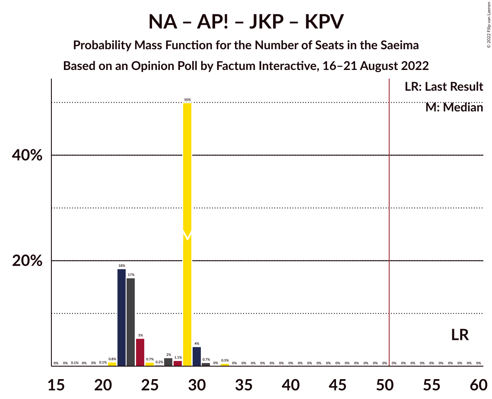

# Opinion Poll by Factum Interactive, 16–21 August 2022

<a href="#voting-intentions">Voting Intentions</a> | <a href="#seats">Seats</a> | <a href="#coalitions">Coalitions</a> | <a href="#technical-information">Technical Information</a>

## Voting Intentions

### Confidence Intervals

| Party | Last Result | Poll Result | 80% Confidence Interval | 90% Confidence Interval | 95% Confidence Interval | 99% Confidence Interval |
|:-----:|:-----------:|:-----------:|:-----------------------:|:-----------------------:|:-----------------------:|:-----------------------:|
| Jaunā VIENOTĪBA | 6.7% | 20.7% | 19.2–22.4% |18.8–22.9% |18.4–23.3% |17.7–24.1% |
| Nacionālā apvienība „Visu Latvijai!”–„Tēvzemei un Brīvībai/LNNK” | 11.0% | 10.8% | 9.7–12.1% |9.4–12.5% |9.1–12.8% |8.6–13.5% |
| Sociāldemokrātiskā partija “Saskaņa” | 19.8% | 9.2% | 8.2–10.5% |7.9–10.8% |7.7–11.1% |7.2–11.8% |
| Attīstībai/Par! | 12.0% | 8.8% | 7.8–10.0% |7.5–10.3% |7.2–10.6% |6.8–11.2% |
| Zaļo un Zemnieku savienība | 9.9% | 8.6% | 7.6–9.8% |7.3–10.1% |7.1–10.4% |6.6–11.0% |
| Latvijas Reģionu Apvienība | 4.1% | 8.4% | 7.4–9.6% |7.1–9.9% |6.9–10.2% |6.4–10.8% |
| PROGRESĪVIE | 2.6% | 7.5% | 6.5–8.6% |6.3–8.9% |6.0–9.2% |5.6–9.8% |
| Stabilitātei! | 0.0% | 6.6% | 5.7–7.7% |5.5–8.0% |5.3–8.3% |4.9–8.8% |
| Jaunā konservatīvā partija | 13.6% | 5.1% | 4.4–6.1% |4.1–6.4% |4.0–6.6% |3.6–7.1% |
| Latvija pirmajā vietā | 0.0% | 4.8% | 4.0–5.7% |3.8–6.0% |3.6–6.2% |3.3–6.7% |
| Latvijas Krievu savienība | 3.2% | 4.2% | 3.5–5.1% |3.3–5.3% |3.2–5.6% |2.9–6.1% |
| Likums un kārtība | 0.0% | 1.7% | 1.3–2.3% |1.2–2.5% |1.1–2.7% |0.9–3.0% |
| Republika | 0.0% | 1.2% | 0.9–1.8% |0.8–1.9% |0.7–2.1% |0.6–2.4% |
| Suverēnā vara | 0.0% | 1.1% | 0.8–1.7% |0.7–1.8% |0.6–2.0% |0.5–2.2% |
| Politiskā partija „KPV LV” | 14.2% | 0.4% | 0.2–0.7% |0.2–0.9% |0.1–1.0% |0.1–1.2% |

*Note:* The poll result column reflects the actual value used in the calculations. Published results may vary slightly, and in addition be rounded to fewer digits.

## Seats

### Confidence Intervals

| Party | Last Result | Median | 80% Confidence Interval | 90% Confidence Interval | 95% Confidence Interval | 99% Confidence Interval |
|:-----:|:-----------:|:------:|:-----------------------:|:-----------------------:|:-----------------------:|:-----------------------:|
| <a href="#jaunā-vienotība">Jaunā VIENOTĪBA</a> | 8 | 22 | 19–26 |19–26 |19–26 |19–27 |
| <a href="#nacionālā-apvienība-„visu-latvijai!”–„tēvzemei-un-brīvībai/lnnk”">Nacionālā apvienība „Visu Latvijai!”–„Tēvzemei un Brīvībai/LNNK”</a> | 13 | 13 | 13 |12–15 |11–15 |11–15 |
| <a href="#sociāldemokrātiskā-partija-“saskaņa”">Sociāldemokrātiskā partija “Saskaņa”</a> | 23 | 10 | 9–14 |9–14 |9–16 |9–16 |
| <a href="#attīstībai/par!">Attīstībai/Par!</a> | 13 | 9 | 9–10 |9–10 |9–10 |7–13 |
| <a href="#zaļo-un-zemnieku-savienība">Zaļo un Zemnieku savienība</a> | 11 | 11 | 10–11 |8–11 |8–11 |7–12 |
| <a href="#latvijas-reģionu-apvienība">Latvijas Reģionu Apvienība</a> | 0 | 11 | 8–11 |7–12 |7–12 |7–12 |
| <a href="#progresīvie">PROGRESĪVIE</a> | 0 | 8 | 8–10 |8–10 |7–10 |7–10 |
| <a href="#stabilitātei!">Stabilitātei!</a> | 0 | 8 | 7–10 |7–10 |6–10 |5–10 |
| <a href="#jaunā-konservatīvā-partija">Jaunā konservatīvā partija</a> | 16 | 7 | 0–7 |0–7 |0–7 |0–8 |
| <a href="#latvija-pirmajā-vietā">Latvija pirmajā vietā</a> | 0 | 0 | 0–7 |0–7 |0–7 |0–7 |
| <a href="#latvijas-krievu-savienība">Latvijas Krievu savienība</a> | 0 | 0 | 0 |0 |0 |0–8 |
| <a href="#likums-un-kārtība">Likums un kārtība</a> | 0 | 0 | 0 |0 |0 |0 |
| <a href="#republika">Republika</a> | 0 | 0 | 0 |0 |0 |0 |
| <a href="#suverēnā-vara">Suverēnā vara</a> | 0 | 0 | 0 |0 |0 |0 |
| <a href="#politiskā-partija-„kpv-lv”">Politiskā partija „KPV LV”</a> | 16 | 0 | 0 |0 |0 |0 |

### Jaunā VIENOTĪBA

*For a full overview of the results for this party, see the [Jaunā VIENOTĪBA](party-jaunāvienotība.html) page.*

| Number of Seats | Probability | Accumulated | Special Marks |
|:---------------:|:-----------:|:-----------:|:-------------:|
| 8 | 0% | 100% | Last Result |
| 9 | 0% | 100% |  |
| 10 | 0% | 100% |  |
| 11 | 0% | 100% |  |
| 12 | 0% | 100% |  |
| 13 | 0% | 100% |  |
| 14 | 0% | 100% |  |
| 15 | 0% | 100% |  |
| 16 | 0% | 100% |  |
| 17 | 0% | 100% |  |
| 18 | 0% | 100% |  |
| 19 | 11% | 100% |  |
| 20 | 1.4% | 89% |  |
| 21 | 3% | 87% |  |
| 22 | 46% | 84% | Median |
| 23 | 15% | 38% |  |
| 24 | 11% | 23% |  |
| 25 | 2% | 12% |  |
| 26 | 9% | 10% |  |
| 27 | 0.3% | 0.7% |  |
| 28 | 0.4% | 0.4% |  |
| 29 | 0% | 0% |  |

### Nacionālā apvienība „Visu Latvijai!”–„Tēvzemei un Brīvībai/LNNK”

*For a full overview of the results for this party, see the [Nacionālā apvienība „Visu Latvijai!”–„Tēvzemei un Brīvībai/LNNK”](party-nacionālāapvienība„visulatvijai”–„tēvzemeiunbrīvībailnnk”.html) page.*

| Number of Seats | Probability | Accumulated | Special Marks |
|:---------------:|:-----------:|:-----------:|:-------------:|
| 10 | 0.2% | 100% |  |
| 11 | 3% | 99.8% |  |
| 12 | 4% | 97% |  |
| 13 | 86% | 93% | Last Result, Median |
| 14 | 0.1% | 6% |  |
| 15 | 6% | 6% |  |
| 16 | 0.1% | 0.1% |  |
| 17 | 0% | 0% |  |

### Sociāldemokrātiskā partija “Saskaņa”

*For a full overview of the results for this party, see the [Sociāldemokrātiskā partija “Saskaņa”](party-sociāldemokrātiskāpartija“saskaņa”.html) page.*

| Number of Seats | Probability | Accumulated | Special Marks |
|:---------------:|:-----------:|:-----------:|:-------------:|
| 9 | 44% | 100% |  |
| 10 | 16% | 56% | Median |
| 11 | 3% | 40% |  |
| 12 | 3% | 36% |  |
| 13 | 8% | 33% |  |
| 14 | 20% | 25% |  |
| 15 | 0% | 5% |  |
| 16 | 5% | 5% |  |
| 17 | 0% | 0% |  |
| 18 | 0% | 0% |  |
| 19 | 0% | 0% |  |
| 20 | 0% | 0% |  |
| 21 | 0% | 0% |  |
| 22 | 0% | 0% |  |
| 23 | 0% | 0% | Last Result |

### Attīstībai/Par!

*For a full overview of the results for this party, see the [Attīstībai/Par!](party-attīstībaipar.html) page.*

| Number of Seats | Probability | Accumulated | Special Marks |
|:---------------:|:-----------:|:-----------:|:-------------:|
| 7 | 2% | 100% |  |
| 8 | 0.2% | 98% |  |
| 9 | 67% | 98% | Median |
| 10 | 29% | 31% |  |
| 11 | 0.5% | 2% |  |
| 12 | 1.1% | 2% |  |
| 13 | 0.1% | 0.5% | Last Result |
| 14 | 0.4% | 0.4% |  |
| 15 | 0.1% | 0.1% |  |
| 16 | 0% | 0% |  |

### Zaļo un Zemnieku savienība

*For a full overview of the results for this party, see the [Zaļo un Zemnieku savienība](party-zaļounzemniekusavienība.html) page.*

| Number of Seats | Probability | Accumulated | Special Marks |
|:---------------:|:-----------:|:-----------:|:-------------:|
| 6 | 0.3% | 100% |  |
| 7 | 0.8% | 99.7% |  |
| 8 | 8% | 98.9% |  |
| 9 | 0.1% | 91% |  |
| 10 | 3% | 91% |  |
| 11 | 87% | 88% | Last Result, Median |
| 12 | 0.9% | 1.1% |  |
| 13 | 0.2% | 0.2% |  |
| 14 | 0% | 0% |  |

### Latvijas Reģionu Apvienība

*For a full overview of the results for this party, see the [Latvijas Reģionu Apvienība](party-latvijasreģionuapvienība.html) page.*

| Number of Seats | Probability | Accumulated | Special Marks |
|:---------------:|:-----------:|:-----------:|:-------------:|
| 0 | 0% | 100% | Last Result |
| 1 | 0% | 100% |  |
| 2 | 0% | 100% |  |
| 3 | 0% | 100% |  |
| 4 | 0% | 100% |  |
| 5 | 0% | 100% |  |
| 6 | 0.2% | 100% |  |
| 7 | 5% | 99.8% |  |
| 8 | 7% | 94% |  |
| 9 | 2% | 88% |  |
| 10 | 24% | 86% |  |
| 11 | 55% | 62% | Median |
| 12 | 7% | 7% |  |
| 13 | 0.3% | 0.3% |  |
| 14 | 0% | 0% |  |

### PROGRESĪVIE

*For a full overview of the results for this party, see the [PROGRESĪVIE](party-progresīvie.html) page.*

| Number of Seats | Probability | Accumulated | Special Marks |
|:---------------:|:-----------:|:-----------:|:-------------:|
| 0 | 0% | 100% | Last Result |
| 1 | 0% | 100% |  |
| 2 | 0% | 100% |  |
| 3 | 0% | 100% |  |
| 4 | 0% | 100% |  |
| 5 | 0% | 100% |  |
| 6 | 0.1% | 100% |  |
| 7 | 4% | 99.9% |  |
| 8 | 74% | 96% | Median |
| 9 | 0.7% | 22% |  |
| 10 | 21% | 21% |  |
| 11 | 0.1% | 0.1% |  |
| 12 | 0% | 0% |  |

### Stabilitātei!

*For a full overview of the results for this party, see the [Stabilitātei!](party-stabilitātei.html) page.*

| Number of Seats | Probability | Accumulated | Special Marks |
|:---------------:|:-----------:|:-----------:|:-------------:|
| 0 | 0.1% | 100% | Last Result |
| 1 | 0% | 99.9% |  |
| 2 | 0% | 99.9% |  |
| 3 | 0% | 99.9% |  |
| 4 | 0% | 99.9% |  |
| 5 | 2% | 99.9% |  |
| 6 | 2% | 98% |  |
| 7 | 29% | 97% |  |
| 8 | 19% | 67% | Median |
| 9 | 3% | 48% |  |
| 10 | 46% | 46% |  |
| 11 | 0.1% | 0.1% |  |
| 12 | 0% | 0% |  |

### Jaunā konservatīvā partija

*For a full overview of the results for this party, see the [Jaunā konservatīvā partija](party-jaunākonservatīvāpartija.html) page.*

| Number of Seats | Probability | Accumulated | Special Marks |
|:---------------:|:-----------:|:-----------:|:-------------:|
| 0 | 43% | 100% |  |
| 1 | 0% | 57% |  |
| 2 | 0% | 57% |  |
| 3 | 0% | 57% |  |
| 4 | 0% | 57% |  |
| 5 | 0% | 57% |  |
| 6 | 4% | 57% |  |
| 7 | 53% | 54% | Median |
| 8 | 0.9% | 1.2% |  |
| 9 | 0.3% | 0.3% |  |
| 10 | 0% | 0% |  |
| 11 | 0% | 0% |  |
| 12 | 0% | 0% |  |
| 13 | 0% | 0% |  |
| 14 | 0% | 0% |  |
| 15 | 0% | 0% |  |
| 16 | 0% | 0% | Last Result |

### Latvija pirmajā vietā

*For a full overview of the results for this party, see the [Latvija pirmajā vietā](party-latvijapirmajāvietā.html) page.*

| Number of Seats | Probability | Accumulated | Special Marks |
|:---------------:|:-----------:|:-----------:|:-------------:|
| 0 | 68% | 100% | Last Result, Median |
| 1 | 0% | 32% |  |
| 2 | 0% | 32% |  |
| 3 | 0% | 32% |  |
| 4 | 0% | 32% |  |
| 5 | 1.0% | 32% |  |
| 6 | 20% | 31% |  |
| 7 | 12% | 12% |  |
| 8 | 0.2% | 0.2% |  |
| 9 | 0% | 0% |  |

### Latvijas Krievu savienība

*For a full overview of the results for this party, see the [Latvijas Krievu savienība](party-latvijaskrievusavienība.html) page.*

| Number of Seats | Probability | Accumulated | Special Marks |
|:---------------:|:-----------:|:-----------:|:-------------:|
| 0 | 98% | 100% | Last Result, Median |
| 1 | 0% | 2% |  |
| 2 | 0% | 2% |  |
| 3 | 0% | 2% |  |
| 4 | 0% | 2% |  |
| 5 | 0.4% | 2% |  |
| 6 | 0.1% | 2% |  |
| 7 | 0.5% | 1.4% |  |
| 8 | 0.9% | 0.9% |  |
| 9 | 0% | 0% |  |

### Likums un kārtība

*For a full overview of the results for this party, see the [Likums un kārtība](party-likumsunkārtība.html) page.*

| Number of Seats | Probability | Accumulated | Special Marks |
|:---------------:|:-----------:|:-----------:|:-------------:|
| 0 | 100% | 100% | Last Result, Median |

### Republika

*For a full overview of the results for this party, see the [Republika](party-republika.html) page.*

| Number of Seats | Probability | Accumulated | Special Marks |
|:---------------:|:-----------:|:-----------:|:-------------:|
| 0 | 100% | 100% | Last Result, Median |

### Suverēnā vara

*For a full overview of the results for this party, see the [Suverēnā vara](party-suverēnāvara.html) page.*

| Number of Seats | Probability | Accumulated | Special Marks |
|:---------------:|:-----------:|:-----------:|:-------------:|
| 0 | 100% | 100% | Last Result, Median |

### Politiskā partija „KPV LV”

*For a full overview of the results for this party, see the [Politiskā partija „KPV LV”](party-politiskāpartija„kpvlv”.html) page.*

| Number of Seats | Probability | Accumulated | Special Marks |
|:---------------:|:-----------:|:-----------:|:-------------:|
| 0 | 100% | 100% | Median |
| 1 | 0% | 0% |  |
| 2 | 0% | 0% |  |
| 3 | 0% | 0% |  |
| 4 | 0% | 0% |  |
| 5 | 0% | 0% |  |
| 6 | 0% | 0% |  |
| 7 | 0% | 0% |  |
| 8 | 0% | 0% |  |
| 9 | 0% | 0% |  |
| 10 | 0% | 0% |  |
| 11 | 0% | 0% |  |
| 12 | 0% | 0% |  |
| 13 | 0% | 0% |  |
| 14 | 0% | 0% |  |
| 15 | 0% | 0% |  |
| 16 | 0% | 0% | Last Result |

## Coalitions

### Confidence Intervals

| Coalition | Last Result | Median | Majority? | 80% Confidence Interval | 90% Confidence Interval | 95% Confidence Interval | 99% Confidence Interval |
|:---------:|:-----------:|:------:|:---------:|:-----------------------:|:-----------------------:|:-----------------------:|:-----------------------:|
| Jaunā VIENOTĪBA – Nacionālā apvienība „Visu Latvijai!”–„Tēvzemei un Brīvībai/LNNK” – Attīstībai/Par! – Zaļo un Zemnieku savienība – Jaunā konservatīvā partija | 61 | 62 | 100% | 52–62 | 52–64 | 52–64 | 52–66 |
| Jaunā VIENOTĪBA – Nacionālā apvienība „Visu Latvijai!”–„Tēvzemei un Brīvībai/LNNK” – Attīstībai/Par! – Zaļo un Zemnieku savienība | 45 | 55 | 99.1% | 52–58 | 52–59 | 52–59 | 49–61 |
| Jaunā VIENOTĪBA – Nacionālā apvienība „Visu Latvijai!”–„Tēvzemei un Brīvībai/LNNK” – Zaļo un Zemnieku savienība – Jaunā konservatīvā partija | 48 | 53 | 56% | 43–53 | 43–54 | 43–54 | 43–57 |
| Jaunā VIENOTĪBA – Nacionālā apvienība „Visu Latvijai!”–„Tēvzemei un Brīvībai/LNNK” – Attīstībai/Par! – Jaunā konservatīvā partija | 50 | 51 | 54% | 41–51 | 41–53 | 41–54 | 41–57 |
| Jaunā VIENOTĪBA – Nacionālā apvienība „Visu Latvijai!”–„Tēvzemei un Brīvībai/LNNK” – Attīstībai/Par! – Jaunā konservatīvā partija – Politiskā partija „KPV LV” | 66 | 51 | 54% | 41–51 | 41–53 | 41–54 | 41–57 |
| Jaunā VIENOTĪBA – Nacionālā apvienība „Visu Latvijai!”–„Tēvzemei un Brīvībai/LNNK” – Zaļo un Zemnieku savienība | 32 | 46 | 0.5% | 43–48 | 43–50 | 43–50 | 39–50 |
| Jaunā VIENOTĪBA – Nacionālā apvienība „Visu Latvijai!”–„Tēvzemei un Brīvībai/LNNK” – Attīstībai/Par! – Politiskā partija „KPV LV” | 50 | 44 | 0.6% | 41–48 | 41–48 | 41–49 | 41–51 |
| Jaunā VIENOTĪBA – Nacionālā apvienība „Visu Latvijai!”–„Tēvzemei un Brīvībai/LNNK” – Jaunā konservatīvā partija – Politiskā partija „KPV LV” | 53 | 42 | 0% | 32–42 | 32–43 | 32–45 | 32–47 |
| Jaunā VIENOTĪBA – Attīstībai/Par! – Jaunā konservatīvā partija – Politiskā partija „KPV LV” | 53 | 38 | 0% | 28–38 | 28–40 | 28–42 | 28–44 |
| Nacionālā apvienība „Visu Latvijai!”–„Tēvzemei un Brīvībai/LNNK” – Attīstībai/Par! – Zaļo un Zemnieku savienība – Jaunā konservatīvā partija | 53 | 40 | 0% | 33–40 | 30–40 | 30–41 | 30–42 |
| Nacionālā apvienība „Visu Latvijai!”–„Tēvzemei un Brīvībai/LNNK” – Attīstībai/Par! – Zaļo un Zemnieku savienība | 37 | 33 | 0% | 32–34 | 30–35 | 30–35 | 29–36 |
| Nacionālā apvienība „Visu Latvijai!”–„Tēvzemei un Brīvībai/LNNK” – Zaļo un Zemnieku savienība – Jaunā konservatīvā partija | 40 | 30 | 0% | 24–31 | 21–31 | 21–31 | 21–32 |
| Nacionālā apvienība „Visu Latvijai!”–„Tēvzemei un Brīvībai/LNNK” – Attīstībai/Par! – Jaunā konservatīvā partija – Politiskā partija „KPV LV” | 58 | 29 | 0% | 22–29 | 22–29 | 22–30 | 21–33 |
| Sociāldemokrātiskā partija “Saskaņa” – Attīstībai/Par! – Jaunā konservatīvā partija | 52 | 25 | 0% | 20–27 | 20–29 | 20–30 | 20–31 |
| Sociāldemokrātiskā partija “Saskaņa” – Zaļo un Zemnieku savienība – Politiskā partija „KPV LV” | 50 | 21 | 0% | 20–25 | 20–25 | 20–27 | 17–27 |
| Sociāldemokrātiskā partija “Saskaņa” – Attīstībai/Par! | 36 | 20 | 0% | 18–23 | 18–25 | 18–25 | 18–25 |
| Sociāldemokrātiskā partija “Saskaņa” – Politiskā partija „KPV LV” | 39 | 10 | 0% | 9–14 | 9–14 | 9–16 | 9–16 |

### Jaunā VIENOTĪBA – Nacionālā apvienība „Visu Latvijai!”–„Tēvzemei un Brīvībai/LNNK” – Attīstībai/Par! – Zaļo un Zemnieku savienība – Jaunā konservatīvā partija

| Number of Seats | Probability | Accumulated | Special Marks |
|:---------------:|:-----------:|:-----------:|:-------------:|
| 52 | 11% | 100% |  |
| 53 | 0.5% | 89% |  |
| 54 | 0.2% | 88% |  |
| 55 | 1.1% | 88% |  |
| 56 | 7% | 87% |  |
| 57 | 15% | 81% |  |
| 58 | 3% | 66% |  |
| 59 | 6% | 63% |  |
| 60 | 1.0% | 57% |  |
| 61 | 3% | 56% | Last Result |
| 62 | 44% | 53% | Median |
| 63 | 3% | 9% |  |
| 64 | 5% | 7% |  |
| 65 | 0.5% | 2% |  |
| 66 | 1.0% | 1.0% |  |
| 67 | 0.1% | 0.1% |  |
| 68 | 0% | 0% |  |

### Jaunā VIENOTĪBA – Nacionālā apvienība „Visu Latvijai!”–„Tēvzemei un Brīvībai/LNNK” – Attīstībai/Par! – Zaļo un Zemnieku savienība

| Number of Seats | Probability | Accumulated | Special Marks |
|:---------------:|:-----------:|:-----------:|:-------------:|
| 45 | 0% | 100% | Last Result |
| 46 | 0% | 100% |  |
| 47 | 0.1% | 100% |  |
| 48 | 0% | 99.9% |  |
| 49 | 0.8% | 99.9% |  |
| 50 | 0% | 99.1% |  |
| 51 | 0.4% | 99.1% | Majority |
| 52 | 12% | 98.7% |  |
| 53 | 0.9% | 87% |  |
| 54 | 2% | 86% |  |
| 55 | 44% | 84% | Median |
| 56 | 10% | 40% |  |
| 57 | 16% | 30% |  |
| 58 | 5% | 13% |  |
| 59 | 6% | 8% |  |
| 60 | 0.4% | 2% |  |
| 61 | 0.7% | 1.2% |  |
| 62 | 0% | 0.5% |  |
| 63 | 0.1% | 0.5% |  |
| 64 | 0.1% | 0.4% |  |
| 65 | 0% | 0.4% |  |
| 66 | 0.3% | 0.4% |  |
| 67 | 0% | 0% |  |

### Jaunā VIENOTĪBA – Nacionālā apvienība „Visu Latvijai!”–„Tēvzemei un Brīvībai/LNNK” – Zaļo un Zemnieku savienība – Jaunā konservatīvā partija

| Number of Seats | Probability | Accumulated | Special Marks |
|:---------------:|:-----------:|:-----------:|:-------------:|
| 43 | 12% | 100% |  |
| 44 | 0.2% | 88% |  |
| 45 | 1.1% | 88% |  |
| 46 | 0.2% | 87% |  |
| 47 | 21% | 87% |  |
| 48 | 3% | 66% | Last Result |
| 49 | 2% | 64% |  |
| 50 | 6% | 62% |  |
| 51 | 2% | 56% | Majority |
| 52 | 1.1% | 54% |  |
| 53 | 46% | 53% | Median |
| 54 | 4% | 6% |  |
| 55 | 0.4% | 2% |  |
| 56 | 0.8% | 2% |  |
| 57 | 1.2% | 1.2% |  |
| 58 | 0% | 0% |  |

### Jaunā VIENOTĪBA – Nacionālā apvienība „Visu Latvijai!”–„Tēvzemei un Brīvībai/LNNK” – Attīstībai/Par! – Jaunā konservatīvā partija

| Number of Seats | Probability | Accumulated | Special Marks |
|:---------------:|:-----------:|:-----------:|:-------------:|
| 41 | 11% | 100% |  |
| 42 | 0.5% | 89% |  |
| 43 | 0.2% | 89% |  |
| 44 | 0.3% | 88% |  |
| 45 | 0.1% | 88% |  |
| 46 | 15% | 88% |  |
| 47 | 3% | 73% |  |
| 48 | 13% | 70% |  |
| 49 | 0.6% | 57% |  |
| 50 | 3% | 57% | Last Result |
| 51 | 44% | 54% | Median, Majority |
| 52 | 3% | 10% |  |
| 53 | 3% | 7% |  |
| 54 | 2% | 4% |  |
| 55 | 0.6% | 2% |  |
| 56 | 1.2% | 2% |  |
| 57 | 0.5% | 0.5% |  |
| 58 | 0% | 0% |  |

### Jaunā VIENOTĪBA – Nacionālā apvienība „Visu Latvijai!”–„Tēvzemei un Brīvībai/LNNK” – Attīstībai/Par! – Jaunā konservatīvā partija – Politiskā partija „KPV LV”

| Number of Seats | Probability | Accumulated | Special Marks |
|:---------------:|:-----------:|:-----------:|:-------------:|
| 41 | 11% | 100% |  |
| 42 | 0.5% | 89% |  |
| 43 | 0.2% | 89% |  |
| 44 | 0.3% | 88% |  |
| 45 | 0.1% | 88% |  |
| 46 | 15% | 88% |  |
| 47 | 3% | 73% |  |
| 48 | 13% | 70% |  |
| 49 | 0.6% | 57% |  |
| 50 | 3% | 57% |  |
| 51 | 44% | 54% | Median, Majority |
| 52 | 3% | 10% |  |
| 53 | 3% | 7% |  |
| 54 | 2% | 4% |  |
| 55 | 0.6% | 2% |  |
| 56 | 1.2% | 2% |  |
| 57 | 0.5% | 0.5% |  |
| 58 | 0% | 0% |  |
| 59 | 0% | 0% |  |
| 60 | 0% | 0% |  |
| 61 | 0% | 0% |  |
| 62 | 0% | 0% |  |
| 63 | 0% | 0% |  |
| 64 | 0% | 0% |  |
| 65 | 0% | 0% |  |
| 66 | 0% | 0% | Last Result |

### Jaunā VIENOTĪBA – Nacionālā apvienība „Visu Latvijai!”–„Tēvzemei un Brīvībai/LNNK” – Zaļo un Zemnieku savienība

| Number of Seats | Probability | Accumulated | Special Marks |
|:---------------:|:-----------:|:-----------:|:-------------:|
| 32 | 0% | 100% | Last Result |
| 33 | 0% | 100% |  |
| 34 | 0% | 100% |  |
| 35 | 0% | 100% |  |
| 36 | 0% | 100% |  |
| 37 | 0% | 100% |  |
| 38 | 0% | 100% |  |
| 39 | 0.8% | 100% |  |
| 40 | 0% | 99.2% |  |
| 41 | 0.3% | 99.1% |  |
| 42 | 0.1% | 98.8% |  |
| 43 | 12% | 98.7% |  |
| 44 | 3% | 86% |  |
| 45 | 0.6% | 84% |  |
| 46 | 47% | 83% | Median |
| 47 | 21% | 36% |  |
| 48 | 5% | 14% |  |
| 49 | 2% | 9% |  |
| 50 | 7% | 7% |  |
| 51 | 0% | 0.5% | Majority |
| 52 | 0.3% | 0.4% |  |
| 53 | 0% | 0.1% |  |
| 54 | 0.1% | 0.1% |  |
| 55 | 0% | 0% |  |

### Jaunā VIENOTĪBA – Nacionālā apvienība „Visu Latvijai!”–„Tēvzemei un Brīvībai/LNNK” – Attīstībai/Par! – Politiskā partija „KPV LV”

| Number of Seats | Probability | Accumulated | Special Marks |
|:---------------:|:-----------:|:-----------:|:-------------:|
| 40 | 0.3% | 100% |  |
| 41 | 13% | 99.7% |  |
| 42 | 0.6% | 87% |  |
| 43 | 2% | 86% |  |
| 44 | 44% | 84% | Median |
| 45 | 3% | 40% |  |
| 46 | 15% | 37% |  |
| 47 | 6% | 22% |  |
| 48 | 13% | 16% |  |
| 49 | 2% | 3% |  |
| 50 | 0.7% | 1.3% | Last Result |
| 51 | 0.1% | 0.6% | Majority |
| 52 | 0.1% | 0.5% |  |
| 53 | 0.1% | 0.4% |  |
| 54 | 0% | 0.4% |  |
| 55 | 0.3% | 0.3% |  |
| 56 | 0% | 0% |  |

### Jaunā VIENOTĪBA – Nacionālā apvienība „Visu Latvijai!”–„Tēvzemei un Brīvībai/LNNK” – Jaunā konservatīvā partija – Politiskā partija „KPV LV”

| Number of Seats | Probability | Accumulated | Special Marks |
|:---------------:|:-----------:|:-----------:|:-------------:|
| 32 | 11% | 100% |  |
| 33 | 0.2% | 89% |  |
| 34 | 0.2% | 88% |  |
| 35 | 0.3% | 88% |  |
| 36 | 14% | 88% |  |
| 37 | 3% | 74% |  |
| 38 | 2% | 71% |  |
| 39 | 12% | 69% |  |
| 40 | 3% | 56% |  |
| 41 | 0.5% | 54% |  |
| 42 | 46% | 53% | Median |
| 43 | 3% | 7% |  |
| 44 | 0.5% | 4% |  |
| 45 | 1.0% | 3% |  |
| 46 | 1.3% | 2% |  |
| 47 | 1.1% | 1.1% |  |
| 48 | 0% | 0% |  |
| 49 | 0% | 0% |  |
| 50 | 0% | 0% |  |
| 51 | 0% | 0% | Majority |
| 52 | 0% | 0% |  |
| 53 | 0% | 0% | Last Result |

### Jaunā VIENOTĪBA – Attīstībai/Par! – Jaunā konservatīvā partija – Politiskā partija „KPV LV”

| Number of Seats | Probability | Accumulated | Special Marks |
|:---------------:|:-----------:|:-----------:|:-------------:|
| 28 | 11% | 100% |  |
| 29 | 0.3% | 89% |  |
| 30 | 0.1% | 89% |  |
| 31 | 0.6% | 89% |  |
| 32 | 0.2% | 88% |  |
| 33 | 19% | 88% |  |
| 34 | 2% | 69% |  |
| 35 | 7% | 67% |  |
| 36 | 3% | 60% |  |
| 37 | 1.3% | 57% |  |
| 38 | 46% | 56% | Median |
| 39 | 3% | 10% |  |
| 40 | 3% | 7% |  |
| 41 | 1.0% | 4% |  |
| 42 | 0.9% | 3% |  |
| 43 | 1.2% | 2% |  |
| 44 | 0.5% | 0.6% |  |
| 45 | 0.1% | 0.1% |  |
| 46 | 0% | 0% |  |
| 47 | 0% | 0% |  |
| 48 | 0% | 0% |  |
| 49 | 0% | 0% |  |
| 50 | 0% | 0% |  |
| 51 | 0% | 0% | Majority |
| 52 | 0% | 0% |  |
| 53 | 0% | 0% | Last Result |

### Nacionālā apvienība „Visu Latvijai!”–„Tēvzemei un Brīvībai/LNNK” – Attīstībai/Par! – Zaļo un Zemnieku savienība – Jaunā konservatīvā partija

| Number of Seats | Probability | Accumulated | Special Marks |
|:---------------:|:-----------:|:-----------:|:-------------:|
| 28 | 0.1% | 100% |  |
| 29 | 0% | 99.9% |  |
| 30 | 7% | 99.9% |  |
| 31 | 0.1% | 93% |  |
| 32 | 2% | 93% |  |
| 33 | 11% | 92% |  |
| 34 | 16% | 80% |  |
| 35 | 7% | 64% |  |
| 36 | 0.7% | 58% |  |
| 37 | 0.3% | 57% |  |
| 38 | 2% | 57% |  |
| 39 | 2% | 55% |  |
| 40 | 50% | 53% | Median |
| 41 | 2% | 3% |  |
| 42 | 0.7% | 0.7% |  |
| 43 | 0% | 0% |  |
| 44 | 0% | 0% |  |
| 45 | 0% | 0% |  |
| 46 | 0% | 0% |  |
| 47 | 0% | 0% |  |
| 48 | 0% | 0% |  |
| 49 | 0% | 0% |  |
| 50 | 0% | 0% |  |
| 51 | 0% | 0% | Majority |
| 52 | 0% | 0% |  |
| 53 | 0% | 0% | Last Result |

### Nacionālā apvienība „Visu Latvijai!”–„Tēvzemei un Brīvībai/LNNK” – Attīstībai/Par! – Zaļo un Zemnieku savienība

| Number of Seats | Probability | Accumulated | Special Marks |
|:---------------:|:-----------:|:-----------:|:-------------:|
| 25 | 0.1% | 100% |  |
| 26 | 0% | 99.9% |  |
| 27 | 0.1% | 99.9% |  |
| 28 | 0.1% | 99.9% |  |
| 29 | 1.0% | 99.8% |  |
| 30 | 7% | 98.8% |  |
| 31 | 2% | 92% |  |
| 32 | 4% | 90% |  |
| 33 | 59% | 86% | Median |
| 34 | 21% | 28% |  |
| 35 | 6% | 7% |  |
| 36 | 0.5% | 1.0% |  |
| 37 | 0% | 0.5% | Last Result |
| 38 | 0.4% | 0.4% |  |
| 39 | 0.1% | 0.1% |  |
| 40 | 0% | 0% |  |

### Nacionālā apvienība „Visu Latvijai!”–„Tēvzemei un Brīvībai/LNNK” – Zaļo un Zemnieku savienība – Jaunā konservatīvā partija

| Number of Seats | Probability | Accumulated | Special Marks |
|:---------------:|:-----------:|:-----------:|:-------------:|
| 20 | 0.1% | 100% |  |
| 21 | 7% | 99.9% |  |
| 22 | 2% | 93% |  |
| 23 | 0.7% | 92% |  |
| 24 | 28% | 91% |  |
| 25 | 2% | 63% |  |
| 26 | 5% | 62% |  |
| 27 | 0.3% | 57% |  |
| 28 | 1.4% | 56% |  |
| 29 | 1.1% | 55% |  |
| 30 | 6% | 54% |  |
| 31 | 46% | 48% | Median |
| 32 | 2% | 2% |  |
| 33 | 0.2% | 0.2% |  |
| 34 | 0% | 0% |  |
| 35 | 0% | 0% |  |
| 36 | 0% | 0% |  |
| 37 | 0% | 0% |  |
| 38 | 0% | 0% |  |
| 39 | 0% | 0% |  |
| 40 | 0% | 0% | Last Result |

### Nacionālā apvienība „Visu Latvijai!”–„Tēvzemei un Brīvībai/LNNK” – Attīstībai/Par! – Jaunā konservatīvā partija – Politiskā partija „KPV LV”

| Number of Seats | Probability | Accumulated | Special Marks |
|:---------------:|:-----------:|:-----------:|:-------------:|
| 17 | 0.1% | 100% |  |
| 18 | 0% | 99.9% |  |
| 19 | 0% | 99.9% |  |
| 20 | 0.1% | 99.9% |  |
| 21 | 0.8% | 99.8% |  |
| 22 | 18% | 99.0% |  |
| 23 | 17% | 81% |  |
| 24 | 5% | 64% |  |
| 25 | 0.7% | 59% |  |
| 26 | 0.2% | 58% |  |
| 27 | 2% | 58% |  |
| 28 | 1.1% | 56% |  |
| 29 | 50% | 55% | Median |
| 30 | 4% | 5% |  |
| 31 | 0.7% | 1.2% |  |
| 32 | 0% | 0.6% |  |
| 33 | 0.5% | 0.5% |  |
| 34 | 0% | 0% |  |
| 35 | 0% | 0% |  |
| 36 | 0% | 0% |  |
| 37 | 0% | 0% |  |
| 38 | 0% | 0% |  |
| 39 | 0% | 0% |  |
| 40 | 0% | 0% |  |
| 41 | 0% | 0% |  |
| 42 | 0% | 0% |  |
| 43 | 0% | 0% |  |
| 44 | 0% | 0% |  |
| 45 | 0% | 0% |  |
| 46 | 0% | 0% |  |
| 47 | 0% | 0% |  |
| 48 | 0% | 0% |  |
| 49 | 0% | 0% |  |
| 50 | 0% | 0% |  |
| 51 | 0% | 0% | Majority |
| 52 | 0% | 0% |  |
| 53 | 0% | 0% |  |
| 54 | 0% | 0% |  |
| 55 | 0% | 0% |  |
| 56 | 0% | 0% |  |
| 57 | 0% | 0% |  |
| 58 | 0% | 0% | Last Result |

### Sociāldemokrātiskā partija “Saskaņa” – Attīstībai/Par! – Jaunā konservatīvā partija

| Number of Seats | Probability | Accumulated | Special Marks |
|:---------------:|:-----------:|:-----------:|:-------------:|
| 19 | 0.1% | 100% |  |
| 20 | 14% | 99.9% |  |
| 21 | 0.3% | 86% |  |
| 22 | 0.6% | 85% |  |
| 23 | 19% | 85% |  |
| 24 | 3% | 66% |  |
| 25 | 49% | 63% |  |
| 26 | 0.2% | 13% | Median |
| 27 | 3% | 13% |  |
| 28 | 1.3% | 10% |  |
| 29 | 5% | 9% |  |
| 30 | 3% | 3% |  |
| 31 | 0.8% | 0.8% |  |
| 32 | 0% | 0% |  |
| 33 | 0% | 0% |  |
| 34 | 0% | 0% |  |
| 35 | 0% | 0% |  |
| 36 | 0% | 0% |  |
| 37 | 0% | 0% |  |
| 38 | 0% | 0% |  |
| 39 | 0% | 0% |  |
| 40 | 0% | 0% |  |
| 41 | 0% | 0% |  |
| 42 | 0% | 0% |  |
| 43 | 0% | 0% |  |
| 44 | 0% | 0% |  |
| 45 | 0% | 0% |  |
| 46 | 0% | 0% |  |
| 47 | 0% | 0% |  |
| 48 | 0% | 0% |  |
| 49 | 0% | 0% |  |
| 50 | 0% | 0% |  |
| 51 | 0% | 0% | Majority |
| 52 | 0% | 0% | Last Result |

### Sociāldemokrātiskā partija “Saskaņa” – Zaļo un Zemnieku savienība – Politiskā partija „KPV LV”

| Number of Seats | Probability | Accumulated | Special Marks |
|:---------------:|:-----------:|:-----------:|:-------------:|
| 16 | 0.1% | 100% |  |
| 17 | 0.7% | 99.9% |  |
| 18 | 0.1% | 99.2% |  |
| 19 | 2% | 99.2% |  |
| 20 | 45% | 98% |  |
| 21 | 15% | 53% | Median |
| 22 | 8% | 38% |  |
| 23 | 4% | 30% |  |
| 24 | 7% | 25% |  |
| 25 | 14% | 19% |  |
| 26 | 0.1% | 5% |  |
| 27 | 5% | 5% |  |
| 28 | 0% | 0% |  |
| 29 | 0% | 0% |  |
| 30 | 0% | 0% |  |
| 31 | 0% | 0% |  |
| 32 | 0% | 0% |  |
| 33 | 0% | 0% |  |
| 34 | 0% | 0% |  |
| 35 | 0% | 0% |  |
| 36 | 0% | 0% |  |
| 37 | 0% | 0% |  |
| 38 | 0% | 0% |  |
| 39 | 0% | 0% |  |
| 40 | 0% | 0% |  |
| 41 | 0% | 0% |  |
| 42 | 0% | 0% |  |
| 43 | 0% | 0% |  |
| 44 | 0% | 0% |  |
| 45 | 0% | 0% |  |
| 46 | 0% | 0% |  |
| 47 | 0% | 0% |  |
| 48 | 0% | 0% |  |
| 49 | 0% | 0% |  |
| 50 | 0% | 0% | Last Result |

### Sociāldemokrātiskā partija “Saskaņa” – Attīstībai/Par!

| Number of Seats | Probability | Accumulated | Special Marks |
|:---------------:|:-----------:|:-----------:|:-------------:|
| 17 | 0.1% | 100% |  |
| 18 | 44% | 99.9% |  |
| 19 | 0.4% | 56% | Median |
| 20 | 17% | 55% |  |
| 21 | 3% | 39% |  |
| 22 | 3% | 36% |  |
| 23 | 24% | 33% |  |
| 24 | 4% | 9% |  |
| 25 | 5% | 5% |  |
| 26 | 0.1% | 0.2% |  |
| 27 | 0% | 0.1% |  |
| 28 | 0% | 0% |  |
| 29 | 0% | 0% |  |
| 30 | 0% | 0% |  |
| 31 | 0% | 0% |  |
| 32 | 0% | 0% |  |
| 33 | 0% | 0% |  |
| 34 | 0% | 0% |  |
| 35 | 0% | 0% |  |
| 36 | 0% | 0% | Last Result |

### Sociāldemokrātiskā partija “Saskaņa” – Politiskā partija „KPV LV”

| Number of Seats | Probability | Accumulated | Special Marks |
|:---------------:|:-----------:|:-----------:|:-------------:|
| 9 | 44% | 100% |  |
| 10 | 16% | 56% | Median |
| 11 | 3% | 40% |  |
| 12 | 3% | 36% |  |
| 13 | 8% | 33% |  |
| 14 | 20% | 25% |  |
| 15 | 0% | 5% |  |
| 16 | 5% | 5% |  |
| 17 | 0% | 0% |  |
| 18 | 0% | 0% |  |
| 19 | 0% | 0% |  |
| 20 | 0% | 0% |  |
| 21 | 0% | 0% |  |
| 22 | 0% | 0% |  |
| 23 | 0% | 0% |  |
| 24 | 0% | 0% |  |
| 25 | 0% | 0% |  |
| 26 | 0% | 0% |  |
| 27 | 0% | 0% |  |
| 28 | 0% | 0% |  |
| 29 | 0% | 0% |  |
| 30 | 0% | 0% |  |
| 31 | 0% | 0% |  |
| 32 | 0% | 0% |  |
| 33 | 0% | 0% |  |
| 34 | 0% | 0% |  |
| 35 | 0% | 0% |  |
| 36 | 0% | 0% |  |
| 37 | 0% | 0% |  |
| 38 | 0% | 0% |  |
| 39 | 0% | 0% | Last Result |

## Technical Information

### Opinion Poll

+ **Polling firm:** Factum Interactive
+ **Commissioner(s):** —
+ **Fieldwork period:** 16–21 August 2022

### Calculations

+ **Sample size:** 1071
+ **Simulations done:** 1,048,576
+ **Error estimate:** 2.26%

