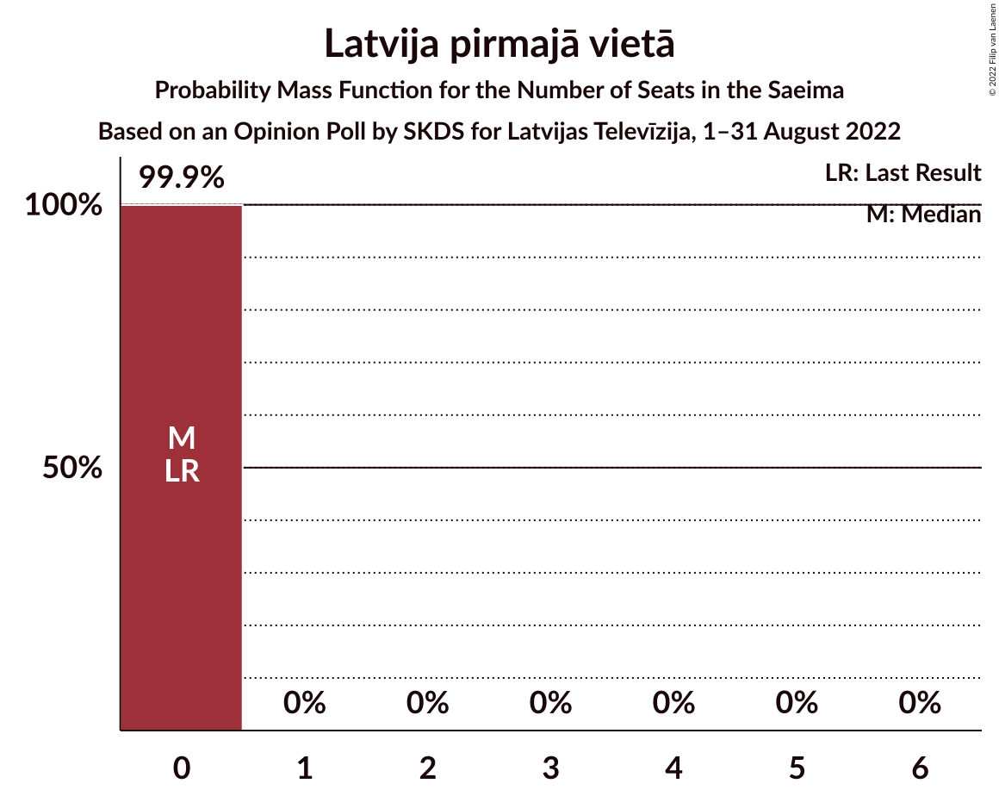
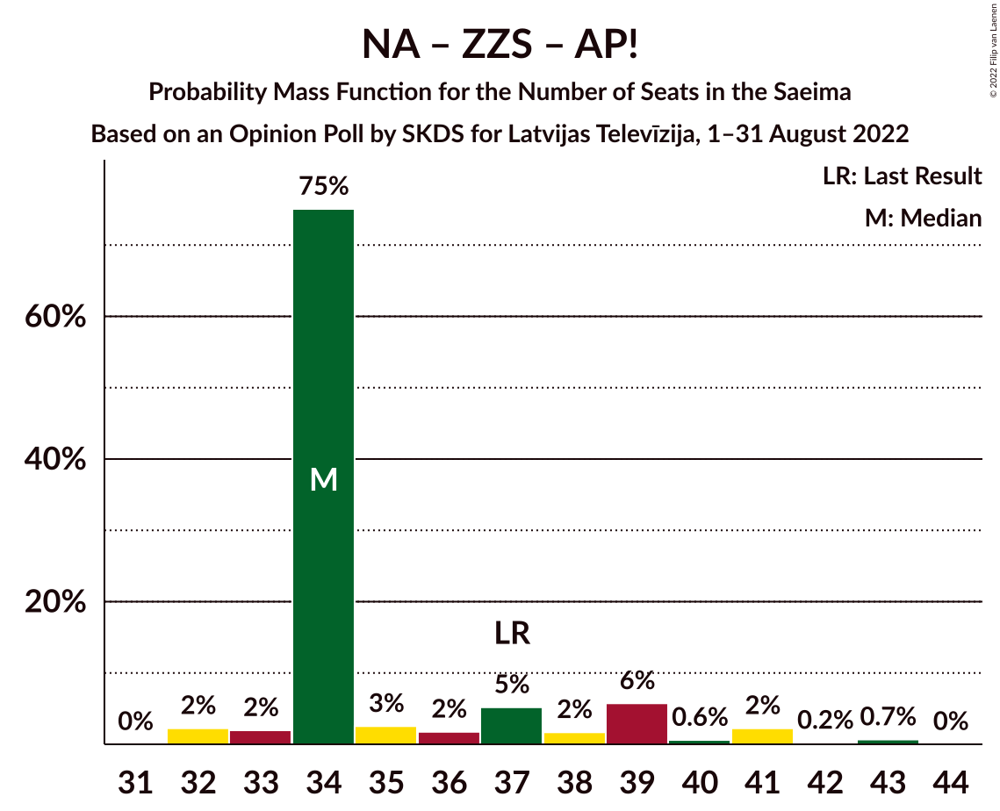

# Opinion Poll by SKDS for Latvijas Televīzija, 1–31 August 2022

<a href="#voting-intentions">Voting Intentions</a> | <a href="#seats">Seats</a> | <a href="#coalitions">Coalitions</a> | <a href="#technical-information">Technical Information</a>

## Voting Intentions

### Confidence Intervals

| Party | Last Result | Poll Result | 80% Confidence Interval | 90% Confidence Interval | 95% Confidence Interval | 99% Confidence Interval |
|:-----:|:-----------:|:-----------:|:-----------------------:|:-----------------------:|:-----------------------:|:-----------------------:|
| Jaunā VIENOTĪBA | 6.7% | 15.1% | 14.1–16.2% |13.8–16.5% |13.5–16.8% |13.1–17.4% |
| Nacionālā apvienība „Visu Latvijai!”–„Tēvzemei un Brīvībai/LNNK” | 11.0% | 12.6% | 11.7–13.7% |11.4–13.9% |11.2–14.2% |10.7–14.7% |
| Zaļo un Zemnieku savienība | 9.9% | 10.1% | 9.3–11.1% |9.0–11.4% |8.8–11.6% |8.4–12.1% |
| Sociāldemokrātiskā partija “Saskaņa” | 19.8% | 9.5% | 8.7–10.5% |8.5–10.7% |8.3–11.0% |7.9–11.4% |
| PROGRESĪVIE | 2.6% | 8.8% | 8.0–9.7% |7.8–10.0% |7.6–10.2% |7.2–10.7% |
| Attīstībai/Par! | 12.0% | 7.9% | 7.1–8.8% |6.9–9.0% |6.8–9.2% |6.4–9.6% |
| Latvijas Reģionu Apvienība | 4.1% | 7.8% | 7.0–8.7% |6.8–8.9% |6.6–9.1% |6.3–9.5% |
| Stabilitātei! | 0.0% | 5.5% | 4.9–6.3% |4.7–6.5% |4.6–6.7% |4.3–7.0% |
| Jaunā konservatīvā partija | 13.6% | 4.7% | 4.1–5.4% |4.0–5.6% |3.8–5.8% |3.6–6.1% |
| Latvijas Krievu savienība | 3.2% | 4.6% | 4.0–5.3% |3.9–5.5% |3.7–5.7% |3.5–6.0% |
| Likums un kārtība | 0.0% | 3.7% | 3.2–4.3% |3.0–4.5% |2.9–4.6% |2.7–5.0% |
| Latvija pirmajā vietā | 0.0% | 3.5% | 3.0–4.1% |2.9–4.3% |2.8–4.5% |2.5–4.8% |
| Suverēnā vara | 0.0% | 2.1% | 1.7–2.6% |1.6–2.8% |1.5–2.9% |1.4–3.1% |

*Note:* The poll result column reflects the actual value used in the calculations. Published results may vary slightly, and in addition be rounded to fewer digits.

## Seats

### Confidence Intervals

| Party | Last Result | Median | 80% Confidence Interval | 90% Confidence Interval | 95% Confidence Interval | 99% Confidence Interval |
|:-----:|:-----------:|:------:|:-----------------------:|:-----------------------:|:-----------------------:|:-----------------------:|
| <a href="#jaunā-vienotība">Jaunā VIENOTĪBA</a> | 8 | 17 | 17–19 |17–19 |17–20 |17–22 |
| <a href="#nacionālā-apvienība-„visu-latvijai!”–„tēvzemei-un-brīvībai/lnnk”">Nacionālā apvienība „Visu Latvijai!”–„Tēvzemei un Brīvībai/LNNK”</a> | 13 | 16 | 15–16 |14–17 |13–17 |13–17 |
| <a href="#zaļo-un-zemnieku-savienība">Zaļo un Zemnieku savienība</a> | 11 | 11 | 11–12 |11–13 |11–15 |11–17 |
| <a href="#sociāldemokrātiskā-partija-“saskaņa”">Sociāldemokrātiskā partija “Saskaņa”</a> | 23 | 14 | 13–14 |12–14 |11–14 |10–15 |
| <a href="#progresīvie">PROGRESĪVIE</a> | 0 | 11 | 9–11 |8–12 |8–12 |8–13 |
| <a href="#attīstībai/par!">Attīstībai/Par!</a> | 13 | 7 | 7–10 |7–10 |7–10 |7–13 |
| <a href="#latvijas-reģionu-apvienība">Latvijas Reģionu Apvienība</a> | 0 | 10 | 10 |9–11 |8–12 |7–12 |
| <a href="#stabilitātei!">Stabilitātei!</a> | 0 | 7 | 6–7 |5–7 |0–8 |0–9 |
| <a href="#jaunā-konservatīvā-partija">Jaunā konservatīvā partija</a> | 16 | 7 | 0–7 |0–7 |0–7 |0–7 |
| <a href="#latvijas-krievu-savienība">Latvijas Krievu savienība</a> | 0 | 0 | 0 |0–8 |0–8 |0–8 |
| <a href="#likums-un-kārtība">Likums un kārtība</a> | 0 | 0 | 0 |0 |0 |0 |
| <a href="#latvija-pirmajā-vietā">Latvija pirmajā vietā</a> | 0 | 0 | 0 |0 |0 |0 |
| <a href="#suverēnā-vara">Suverēnā vara</a> | 0 | 0 | 0 |0 |0 |0 |

### Jaunā VIENOTĪBA

*For a full overview of the results for this party, see the [Jaunā VIENOTĪBA](party-jaunāvienotība.html) page.*

| Number of Seats | Probability | Accumulated | Special Marks |
|:---------------:|:-----------:|:-----------:|:-------------:|
| 8 | 0% | 100% | Last Result |
| 9 | 0% | 100% |  |
| 10 | 0% | 100% |  |
| 11 | 0% | 100% |  |
| 12 | 0% | 100% |  |
| 13 | 0% | 100% |  |
| 14 | 0% | 100% |  |
| 15 | 0.1% | 100% |  |
| 16 | 0.3% | 99.9% |  |
| 17 | 75% | 99.6% | Median |
| 18 | 9% | 25% |  |
| 19 | 13% | 16% |  |
| 20 | 0.7% | 3% |  |
| 21 | 0.3% | 2% |  |
| 22 | 2% | 2% |  |
| 23 | 0.1% | 0.2% |  |
| 24 | 0.1% | 0.1% |  |
| 25 | 0% | 0% |  |

### Nacionālā apvienība „Visu Latvijai!”–„Tēvzemei un Brīvībai/LNNK”

*For a full overview of the results for this party, see the [Nacionālā apvienība „Visu Latvijai!”–„Tēvzemei un Brīvībai/LNNK”](party-nacionālāapvienība„visulatvijai”–„tēvzemeiunbrīvībailnnk”.html) page.*

| Number of Seats | Probability | Accumulated | Special Marks |
|:---------------:|:-----------:|:-----------:|:-------------:|
| 13 | 5% | 100% | Last Result |
| 14 | 5% | 95% |  |
| 15 | 4% | 91% |  |
| 16 | 79% | 87% | Median |
| 17 | 7% | 7% |  |
| 18 | 0.2% | 0.4% |  |
| 19 | 0.1% | 0.2% |  |
| 20 | 0.1% | 0.1% |  |
| 21 | 0% | 0% |  |

### Zaļo un Zemnieku savienība

*For a full overview of the results for this party, see the [Zaļo un Zemnieku savienība](party-zaļounzemniekusavienība.html) page.*

| Number of Seats | Probability | Accumulated | Special Marks |
|:---------------:|:-----------:|:-----------:|:-------------:|
| 11 | 84% | 100% | Last Result, Median |
| 12 | 9% | 16% |  |
| 13 | 2% | 7% |  |
| 14 | 0.3% | 5% |  |
| 15 | 2% | 4% |  |
| 16 | 2% | 2% |  |
| 17 | 0.6% | 0.6% |  |
| 18 | 0% | 0% |  |

### Sociāldemokrātiskā partija “Saskaņa”

*For a full overview of the results for this party, see the [Sociāldemokrātiskā partija “Saskaņa”](party-sociāldemokrātiskāpartija“saskaņa”.html) page.*

| Number of Seats | Probability | Accumulated | Special Marks |
|:---------------:|:-----------:|:-----------:|:-------------:|
| 10 | 2% | 100% |  |
| 11 | 2% | 98% |  |
| 12 | 6% | 96% |  |
| 13 | 8% | 90% |  |
| 14 | 80% | 83% | Median |
| 15 | 2% | 2% |  |
| 16 | 0.2% | 0.2% |  |
| 17 | 0% | 0% |  |
| 18 | 0% | 0% |  |
| 19 | 0% | 0% |  |
| 20 | 0% | 0% |  |
| 21 | 0% | 0% |  |
| 22 | 0% | 0% |  |
| 23 | 0% | 0% | Last Result |

### PROGRESĪVIE

*For a full overview of the results for this party, see the [PROGRESĪVIE](party-progresīvie.html) page.*

| Number of Seats | Probability | Accumulated | Special Marks |
|:---------------:|:-----------:|:-----------:|:-------------:|
| 0 | 0% | 100% | Last Result |
| 1 | 0% | 100% |  |
| 2 | 0% | 100% |  |
| 3 | 0% | 100% |  |
| 4 | 0% | 100% |  |
| 5 | 0% | 100% |  |
| 6 | 0% | 100% |  |
| 7 | 0% | 100% |  |
| 8 | 6% | 100% |  |
| 9 | 5% | 94% |  |
| 10 | 2% | 90% |  |
| 11 | 80% | 88% | Median |
| 12 | 5% | 7% |  |
| 13 | 1.4% | 2% |  |
| 14 | 0.3% | 0.3% |  |
| 15 | 0% | 0% |  |

### Attīstībai/Par!

*For a full overview of the results for this party, see the [Attīstībai/Par!](party-attīstībaipar.html) page.*

| Number of Seats | Probability | Accumulated | Special Marks |
|:---------------:|:-----------:|:-----------:|:-------------:|
| 7 | 74% | 100% | Median |
| 8 | 5% | 26% |  |
| 9 | 8% | 20% |  |
| 10 | 10% | 12% |  |
| 11 | 0.7% | 2% |  |
| 12 | 0.2% | 1.0% |  |
| 13 | 0.7% | 0.7% | Last Result |
| 14 | 0% | 0% |  |

### Latvijas Reģionu Apvienība

*For a full overview of the results for this party, see the [Latvijas Reģionu Apvienība](party-latvijasreģionuapvienība.html) page.*

| Number of Seats | Probability | Accumulated | Special Marks |
|:---------------:|:-----------:|:-----------:|:-------------:|
| 0 | 0% | 100% | Last Result |
| 1 | 0% | 100% |  |
| 2 | 0% | 100% |  |
| 3 | 0% | 100% |  |
| 4 | 0% | 100% |  |
| 5 | 0% | 100% |  |
| 6 | 0% | 100% |  |
| 7 | 1.2% | 100% |  |
| 8 | 3% | 98.8% |  |
| 9 | 5% | 96% |  |
| 10 | 84% | 91% | Median |
| 11 | 4% | 7% |  |
| 12 | 3% | 3% |  |
| 13 | 0% | 0% |  |

### Stabilitātei!

*For a full overview of the results for this party, see the [Stabilitātei!](party-stabilitātei.html) page.*

| Number of Seats | Probability | Accumulated | Special Marks |
|:---------------:|:-----------:|:-----------:|:-------------:|
| 0 | 4% | 100% | Last Result |
| 1 | 0% | 96% |  |
| 2 | 0% | 96% |  |
| 3 | 0% | 96% |  |
| 4 | 0% | 96% |  |
| 5 | 3% | 96% |  |
| 6 | 4% | 94% |  |
| 7 | 87% | 90% | Median |
| 8 | 1.4% | 3% |  |
| 9 | 1.5% | 2% |  |
| 10 | 0.3% | 0.3% |  |
| 11 | 0% | 0% |  |

### Jaunā konservatīvā partija

*For a full overview of the results for this party, see the [Jaunā konservatīvā partija](party-jaunākonservatīvāpartija.html) page.*

| Number of Seats | Probability | Accumulated | Special Marks |
|:---------------:|:-----------:|:-----------:|:-------------:|
| 0 | 16% | 100% |  |
| 1 | 0% | 84% |  |
| 2 | 0% | 84% |  |
| 3 | 0% | 84% |  |
| 4 | 0% | 84% |  |
| 5 | 0% | 84% |  |
| 6 | 2% | 84% |  |
| 7 | 82% | 82% | Median |
| 8 | 0.2% | 0.2% |  |
| 9 | 0% | 0% |  |
| 10 | 0% | 0% |  |
| 11 | 0% | 0% |  |
| 12 | 0% | 0% |  |
| 13 | 0% | 0% |  |
| 14 | 0% | 0% |  |
| 15 | 0% | 0% |  |
| 16 | 0% | 0% | Last Result |

### Latvijas Krievu savienība

*For a full overview of the results for this party, see the [Latvijas Krievu savienība](party-latvijaskrievusavienība.html) page.*

| Number of Seats | Probability | Accumulated | Special Marks |
|:---------------:|:-----------:|:-----------:|:-------------:|
| 0 | 91% | 100% | Last Result, Median |
| 1 | 0% | 9% |  |
| 2 | 0% | 9% |  |
| 3 | 0% | 9% |  |
| 4 | 0% | 9% |  |
| 5 | 0% | 9% |  |
| 6 | 0.2% | 9% |  |
| 7 | 1.2% | 9% |  |
| 8 | 8% | 8% |  |
| 9 | 0% | 0% |  |

### Likums un kārtība

*For a full overview of the results for this party, see the [Likums un kārtība](party-likumsunkārtība.html) page.*

| Number of Seats | Probability | Accumulated | Special Marks |
|:---------------:|:-----------:|:-----------:|:-------------:|
| 0 | 100% | 100% | Last Result, Median |

### Latvija pirmajā vietā

*For a full overview of the results for this party, see the [Latvija pirmajā vietā](party-latvijapirmajāvietā.html) page.*

| Number of Seats | Probability | Accumulated | Special Marks |
|:---------------:|:-----------:|:-----------:|:-------------:|
| 0 | 99.9% | 100% | Last Result, Median |
| 1 | 0% | 0.1% |  |
| 2 | 0% | 0.1% |  |
| 3 | 0% | 0.1% |  |
| 4 | 0% | 0.1% |  |
| 5 | 0% | 0.1% |  |
| 6 | 0% | 0% |  |

### Suverēnā vara

*For a full overview of the results for this party, see the [Suverēnā vara](party-suverēnāvara.html) page.*

| Number of Seats | Probability | Accumulated | Special Marks |
|:---------------:|:-----------:|:-----------:|:-------------:|
| 0 | 100% | 100% | Last Result, Median |

## Coalitions

### Confidence Intervals

| Coalition | Last Result | Median | Majority? | 80% Confidence Interval | 90% Confidence Interval | 95% Confidence Interval | 99% Confidence Interval |
|:---------:|:-----------:|:------:|:---------:|:-----------------------:|:-----------------------:|:-----------------------:|:-----------------------:|
| Jaunā VIENOTĪBA – Nacionālā apvienība „Visu Latvijai!”–„Tēvzemei un Brīvībai/LNNK” – Zaļo un Zemnieku savienība – Attīstībai/Par! – Jaunā konservatīvā partija | 61 | 58 | 100% | 58–59 | 56–61 | 55–62 | 54–64 |
| Jaunā VIENOTĪBA – Nacionālā apvienība „Visu Latvijai!”–„Tēvzemei un Brīvībai/LNNK” – Zaļo un Zemnieku savienība – Attīstībai/Par! | 45 | 51 | 99.7% | 51–57 | 51–59 | 51–61 | 51–61 |
| Jaunā VIENOTĪBA – Nacionālā apvienība „Visu Latvijai!”–„Tēvzemei un Brīvībai/LNNK” – Zaļo un Zemnieku savienība – Jaunā konservatīvā partija | 48 | 51 | 81% | 48–51 | 47–52 | 46–52 | 45–54 |
| Jaunā VIENOTĪBA – Nacionālā apvienība „Visu Latvijai!”–„Tēvzemei un Brīvībai/LNNK” – Zaļo un Zemnieku savienība | 32 | 44 | 3% | 44–47 | 43–49 | 43–51 | 42–52 |
| Jaunā VIENOTĪBA – Nacionālā apvienība „Visu Latvijai!”–„Tēvzemei un Brīvībai/LNNK” – Attīstībai/Par! – Jaunā konservatīvā partija | 50 | 47 | 2% | 46–47 | 43–48 | 43–50 | 41–52 |
| Nacionālā apvienība „Visu Latvijai!”–„Tēvzemei un Brīvībai/LNNK” – Zaļo un Zemnieku savienība – Attīstībai/Par! – Jaunā konservatīvā partija | 53 | 41 | 0% | 39–41 | 37–42 | 37–44 | 35–45 |
| Nacionālā apvienība „Visu Latvijai!”–„Tēvzemei un Brīvībai/LNNK” – Zaļo un Zemnieku savienība – Attīstībai/Par! | 37 | 34 | 0% | 34–38 | 34–39 | 33–41 | 32–43 |
| Nacionālā apvienība „Visu Latvijai!”–„Tēvzemei un Brīvībai/LNNK” – Zaļo un Zemnieku savienība – Jaunā konservatīvā partija | 40 | 34 | 0% | 29–34 | 29–34 | 27–34 | 26–35 |
| Sociāldemokrātiskā partija “Saskaņa” – Attīstībai/Par! – Jaunā konservatīvā partija | 52 | 28 | 0% | 24–28 | 23–28 | 21–29 | 21–31 |
| Sociāldemokrātiskā partija “Saskaņa” – Attīstībai/Par! | 36 | 21 | 0% | 21–23 | 21–24 | 19–24 | 18–27 |

### Jaunā VIENOTĪBA – Nacionālā apvienība „Visu Latvijai!”–„Tēvzemei un Brīvībai/LNNK” – Zaļo un Zemnieku savienība – Attīstībai/Par! – Jaunā konservatīvā partija

| Number of Seats | Probability | Accumulated | Special Marks |
|:---------------:|:-----------:|:-----------:|:-------------:|
| 51 | 0.1% | 100% | Majority |
| 52 | 0.1% | 99.9% |  |
| 53 | 0.2% | 99.8% |  |
| 54 | 1.2% | 99.5% |  |
| 55 | 3% | 98% |  |
| 56 | 1.2% | 95% |  |
| 57 | 3% | 94% |  |
| 58 | 78% | 91% | Median |
| 59 | 4% | 13% |  |
| 60 | 3% | 9% |  |
| 61 | 3% | 6% | Last Result |
| 62 | 2% | 3% |  |
| 63 | 0.7% | 1.3% |  |
| 64 | 0.1% | 0.5% |  |
| 65 | 0.4% | 0.5% |  |
| 66 | 0% | 0.1% |  |
| 67 | 0% | 0% |  |

### Jaunā VIENOTĪBA – Nacionālā apvienība „Visu Latvijai!”–„Tēvzemei un Brīvībai/LNNK” – Zaļo un Zemnieku savienība – Attīstībai/Par!

| Number of Seats | Probability | Accumulated | Special Marks |
|:---------------:|:-----------:|:-----------:|:-------------:|
| 45 | 0% | 100% | Last Result |
| 46 | 0% | 100% |  |
| 47 | 0% | 100% |  |
| 48 | 0% | 100% |  |
| 49 | 0% | 100% |  |
| 50 | 0.2% | 100% |  |
| 51 | 76% | 99.7% | Median, Majority |
| 52 | 2% | 23% |  |
| 53 | 2% | 21% |  |
| 54 | 2% | 19% |  |
| 55 | 5% | 17% |  |
| 56 | 2% | 12% |  |
| 57 | 0.6% | 11% |  |
| 58 | 5% | 10% |  |
| 59 | 2% | 5% |  |
| 60 | 1.0% | 3% |  |
| 61 | 2% | 3% |  |
| 62 | 0.1% | 0.3% |  |
| 63 | 0.1% | 0.2% |  |
| 64 | 0% | 0.1% |  |
| 65 | 0.1% | 0.1% |  |
| 66 | 0% | 0% |  |

### Jaunā VIENOTĪBA – Nacionālā apvienība „Visu Latvijai!”–„Tēvzemei un Brīvībai/LNNK” – Zaļo un Zemnieku savienība – Jaunā konservatīvā partija

| Number of Seats | Probability | Accumulated | Special Marks |
|:---------------:|:-----------:|:-----------:|:-------------:|
| 43 | 0.2% | 100% |  |
| 44 | 0.2% | 99.8% |  |
| 45 | 1.4% | 99.6% |  |
| 46 | 1.5% | 98% |  |
| 47 | 3% | 97% |  |
| 48 | 4% | 93% | Last Result |
| 49 | 5% | 89% |  |
| 50 | 4% | 85% |  |
| 51 | 75% | 81% | Median, Majority |
| 52 | 4% | 6% |  |
| 53 | 0.4% | 1.2% |  |
| 54 | 0.5% | 0.9% |  |
| 55 | 0.3% | 0.3% |  |
| 56 | 0% | 0.1% |  |
| 57 | 0% | 0% |  |

### Jaunā VIENOTĪBA – Nacionālā apvienība „Visu Latvijai!”–„Tēvzemei un Brīvībai/LNNK” – Zaļo un Zemnieku savienība

| Number of Seats | Probability | Accumulated | Special Marks |
|:---------------:|:-----------:|:-----------:|:-------------:|
| 32 | 0% | 100% | Last Result |
| 33 | 0% | 100% |  |
| 34 | 0% | 100% |  |
| 35 | 0% | 100% |  |
| 36 | 0% | 100% |  |
| 37 | 0% | 100% |  |
| 38 | 0% | 100% |  |
| 39 | 0% | 100% |  |
| 40 | 0% | 100% |  |
| 41 | 0% | 100% |  |
| 42 | 0.5% | 100% |  |
| 43 | 5% | 99.5% |  |
| 44 | 75% | 94% | Median |
| 45 | 4% | 19% |  |
| 46 | 2% | 15% |  |
| 47 | 4% | 13% |  |
| 48 | 4% | 9% |  |
| 49 | 2% | 5% |  |
| 50 | 0.4% | 3% |  |
| 51 | 0.8% | 3% | Majority |
| 52 | 2% | 2% |  |
| 53 | 0% | 0.2% |  |
| 54 | 0% | 0.1% |  |
| 55 | 0.1% | 0.1% |  |
| 56 | 0% | 0% |  |

### Jaunā VIENOTĪBA – Nacionālā apvienība „Visu Latvijai!”–„Tēvzemei un Brīvībai/LNNK” – Attīstībai/Par! – Jaunā konservatīvā partija

| Number of Seats | Probability | Accumulated | Special Marks |
|:---------------:|:-----------:|:-----------:|:-------------:|
| 40 | 0.2% | 100% |  |
| 41 | 0.6% | 99.8% |  |
| 42 | 1.3% | 99.1% |  |
| 43 | 4% | 98% |  |
| 44 | 1.4% | 93% |  |
| 45 | 1.0% | 92% |  |
| 46 | 8% | 91% |  |
| 47 | 75% | 83% | Median |
| 48 | 4% | 8% |  |
| 49 | 2% | 5% |  |
| 50 | 1.0% | 3% | Last Result |
| 51 | 2% | 2% | Majority |
| 52 | 0.3% | 0.5% |  |
| 53 | 0.1% | 0.2% |  |
| 54 | 0.1% | 0.1% |  |
| 55 | 0% | 0% |  |

### Nacionālā apvienība „Visu Latvijai!”–„Tēvzemei un Brīvībai/LNNK” – Zaļo un Zemnieku savienība – Attīstībai/Par! – Jaunā konservatīvā partija

| Number of Seats | Probability | Accumulated | Special Marks |
|:---------------:|:-----------:|:-----------:|:-------------:|
| 33 | 0.2% | 100% |  |
| 34 | 0.1% | 99.8% |  |
| 35 | 0.6% | 99.7% |  |
| 36 | 1.5% | 99.1% |  |
| 37 | 3% | 98% |  |
| 38 | 3% | 95% |  |
| 39 | 6% | 91% |  |
| 40 | 2% | 86% |  |
| 41 | 77% | 83% | Median |
| 42 | 2% | 6% |  |
| 43 | 0.9% | 4% |  |
| 44 | 2% | 3% |  |
| 45 | 0.4% | 0.6% |  |
| 46 | 0.1% | 0.2% |  |
| 47 | 0% | 0% |  |
| 48 | 0% | 0% |  |
| 49 | 0% | 0% |  |
| 50 | 0% | 0% |  |
| 51 | 0% | 0% | Majority |
| 52 | 0% | 0% |  |
| 53 | 0% | 0% | Last Result |

### Nacionālā apvienība „Visu Latvijai!”–„Tēvzemei un Brīvībai/LNNK” – Zaļo un Zemnieku savienība – Attīstībai/Par!

| Number of Seats | Probability | Accumulated | Special Marks |
|:---------------:|:-----------:|:-----------:|:-------------:|
| 32 | 2% | 100% |  |
| 33 | 2% | 98% |  |
| 34 | 75% | 96% | Median |
| 35 | 3% | 21% |  |
| 36 | 2% | 18% |  |
| 37 | 5% | 16% | Last Result |
| 38 | 2% | 11% |  |
| 39 | 6% | 10% |  |
| 40 | 0.6% | 4% |  |
| 41 | 2% | 3% |  |
| 42 | 0.2% | 0.9% |  |
| 43 | 0.7% | 0.7% |  |
| 44 | 0% | 0% |  |

### Nacionālā apvienība „Visu Latvijai!”–„Tēvzemei un Brīvībai/LNNK” – Zaļo un Zemnieku savienība – Jaunā konservatīvā partija

| Number of Seats | Probability | Accumulated | Special Marks |
|:---------------:|:-----------:|:-----------:|:-------------:|
| 25 | 0.3% | 100% |  |
| 26 | 0.2% | 99.7% |  |
| 27 | 2% | 99.5% |  |
| 28 | 2% | 97% |  |
| 29 | 6% | 95% |  |
| 30 | 5% | 89% |  |
| 31 | 3% | 84% |  |
| 32 | 2% | 81% |  |
| 33 | 2% | 79% |  |
| 34 | 76% | 77% | Median |
| 35 | 1.1% | 1.3% |  |
| 36 | 0.1% | 0.2% |  |
| 37 | 0% | 0.1% |  |
| 38 | 0% | 0% |  |
| 39 | 0% | 0% |  |
| 40 | 0% | 0% | Last Result |

### Sociāldemokrātiskā partija “Saskaņa” – Attīstībai/Par! – Jaunā konservatīvā partija

| Number of Seats | Probability | Accumulated | Special Marks |
|:---------------:|:-----------:|:-----------:|:-------------:|
| 19 | 0.1% | 100% |  |
| 20 | 0.4% | 99.9% |  |
| 21 | 2% | 99.6% |  |
| 22 | 2% | 97% |  |
| 23 | 5% | 95% |  |
| 24 | 7% | 90% |  |
| 25 | 0.7% | 83% |  |
| 26 | 1.1% | 83% |  |
| 27 | 1.1% | 82% |  |
| 28 | 76% | 81% | Median |
| 29 | 3% | 4% |  |
| 30 | 0.2% | 1.0% |  |
| 31 | 0.4% | 0.7% |  |
| 32 | 0.2% | 0.3% |  |
| 33 | 0% | 0.1% |  |
| 34 | 0% | 0.1% |  |
| 35 | 0.1% | 0.1% |  |
| 36 | 0% | 0% |  |
| 37 | 0% | 0% |  |
| 38 | 0% | 0% |  |
| 39 | 0% | 0% |  |
| 40 | 0% | 0% |  |
| 41 | 0% | 0% |  |
| 42 | 0% | 0% |  |
| 43 | 0% | 0% |  |
| 44 | 0% | 0% |  |
| 45 | 0% | 0% |  |
| 46 | 0% | 0% |  |
| 47 | 0% | 0% |  |
| 48 | 0% | 0% |  |
| 49 | 0% | 0% |  |
| 50 | 0% | 0% |  |
| 51 | 0% | 0% | Majority |
| 52 | 0% | 0% | Last Result |

### Sociāldemokrātiskā partija “Saskaņa” – Attīstībai/Par!

| Number of Seats | Probability | Accumulated | Special Marks |
|:---------------:|:-----------:|:-----------:|:-------------:|
| 17 | 0.1% | 100% |  |
| 18 | 2% | 99.9% |  |
| 19 | 1.1% | 98% |  |
| 20 | 0.8% | 97% |  |
| 21 | 78% | 96% | Median |
| 22 | 6% | 18% |  |
| 23 | 5% | 12% |  |
| 24 | 5% | 7% |  |
| 25 | 0.7% | 2% |  |
| 26 | 0.1% | 1.0% |  |
| 27 | 0.8% | 0.9% |  |
| 28 | 0.1% | 0.2% |  |
| 29 | 0% | 0% |  |
| 30 | 0% | 0% |  |
| 31 | 0% | 0% |  |
| 32 | 0% | 0% |  |
| 33 | 0% | 0% |  |
| 34 | 0% | 0% |  |
| 35 | 0% | 0% |  |
| 36 | 0% | 0% | Last Result |

## Technical Information

### Opinion Poll

+ **Polling firm:** SKDS
+ **Commissioner(s):** Latvijas Televīzija
+ **Fieldwork period:** 1–31 August 2022

### Calculations

+ **Sample size:** 1848
+ **Simulations done:** 1,048,576
+ **Error estimate:** 1.42%

