# Opinion Poll by Factum Interactive, 4–6 September 2022

<a href="#voting-intentions">Voting Intentions</a> | <a href="#seats">Seats</a> | <a href="#coalitions">Coalitions</a> | <a href="#technical-information">Technical Information</a>

## Voting Intentions

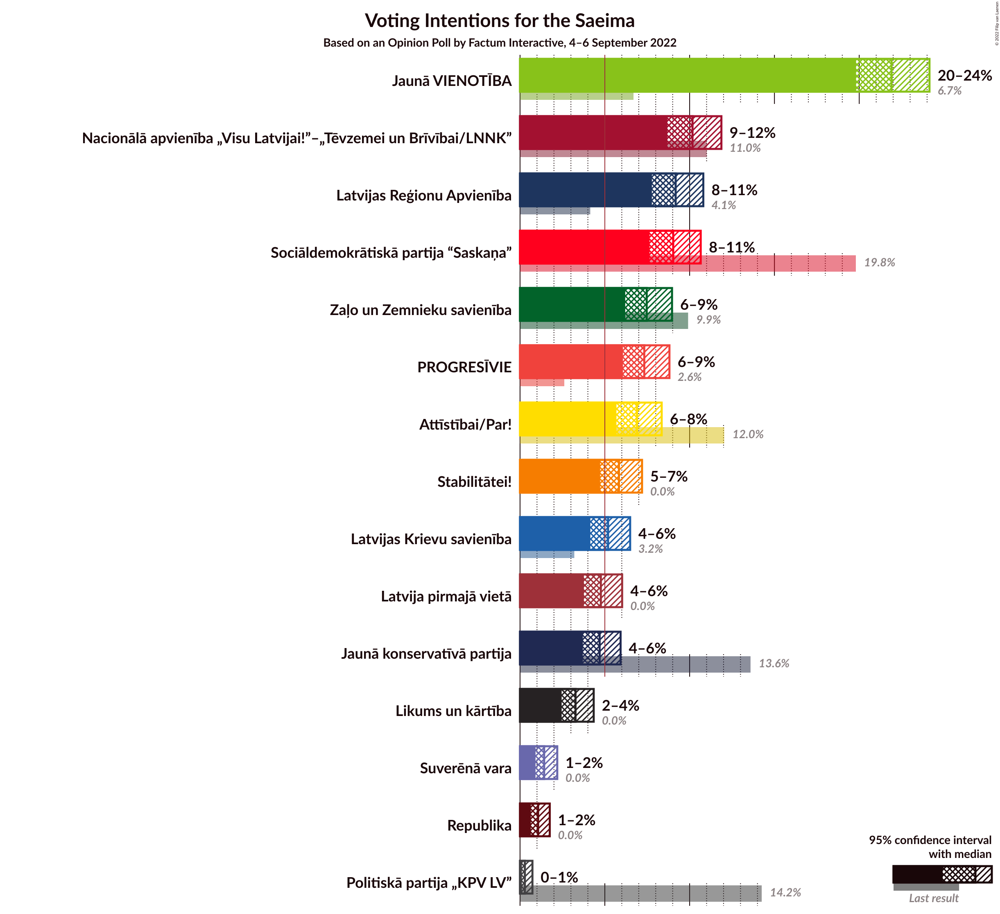

### Confidence Intervals

| Party | Last Result | Poll Result | 80% Confidence Interval | 90% Confidence Interval | 95% Confidence Interval | 99% Confidence Interval |
|:-----:|:-----------:|:-----------:|:-----------------------:|:-----------------------:|:-----------------------:|:-----------------------:|
| Jaunā VIENOTĪBA | 6.7% | 21.9% | 20.5–23.4% |20.1–23.8% |19.8–24.1% |19.2–24.9% |
| Nacionālā apvienība „Visu Latvijai!”–„Tēvzemei un Brīvībai/LNNK” | 11.0% | 10.2% | 9.2–11.3% |8.9–11.6% |8.7–11.9% |8.2–12.4% |
| Latvijas Reģionu Apvienība | 4.1% | 9.2% | 8.2–10.2% |8.0–10.5% |7.8–10.8% |7.3–11.3% |
| Sociāldemokrātiskā partija “Saskaņa” | 19.8% | 9.0% | 8.1–10.1% |7.9–10.4% |7.6–10.7% |7.2–11.2% |
| Zaļo un Zemnieku savienība | 9.9% | 7.5% | 6.6–8.4% |6.4–8.7% |6.2–9.0% |5.8–9.4% |
| PROGRESĪVIE | 2.6% | 7.3% | 6.5–8.3% |6.3–8.6% |6.1–8.8% |5.7–9.3% |
| Attīstībai/Par! | 12.0% | 6.9% | 6.1–7.8% |5.9–8.1% |5.7–8.4% |5.3–8.8% |
| Stabilitātei! | 0.0% | 5.8% | 5.1–6.7% |4.9–7.0% |4.7–7.2% |4.4–7.6% |
| Latvijas Krievu savienība | 3.2% | 5.2% | 4.5–6.0% |4.3–6.3% |4.1–6.5% |3.8–6.9% |
| Latvija pirmajā vietā | 0.0% | 4.8% | 4.1–5.6% |3.9–5.8% |3.8–6.0% |3.5–6.4% |
| Jaunā konservatīvā partija | 13.6% | 4.7% | 4.0–5.5% |3.9–5.7% |3.7–5.9% |3.4–6.3% |
| Likums un kārtība | 0.0% | 3.3% | 2.7–4.0% |2.6–4.2% |2.5–4.3% |2.2–4.7% |
| Suverēnā vara | 0.0% | 1.4% | 1.1–1.9% |1.0–2.1% |0.9–2.2% |0.8–2.5% |
| Republika | 0.0% | 1.1% | 0.8–1.5% |0.7–1.6% |0.6–1.8% |0.5–2.0% |
| Politiskā partija „KPV LV” | 14.2% | 0.3% | 0.2–0.6% |0.1–0.7% |0.1–0.7% |0.1–0.9% |

*Note:* The poll result column reflects the actual value used in the calculations. Published results may vary slightly, and in addition be rounded to fewer digits.

## Seats

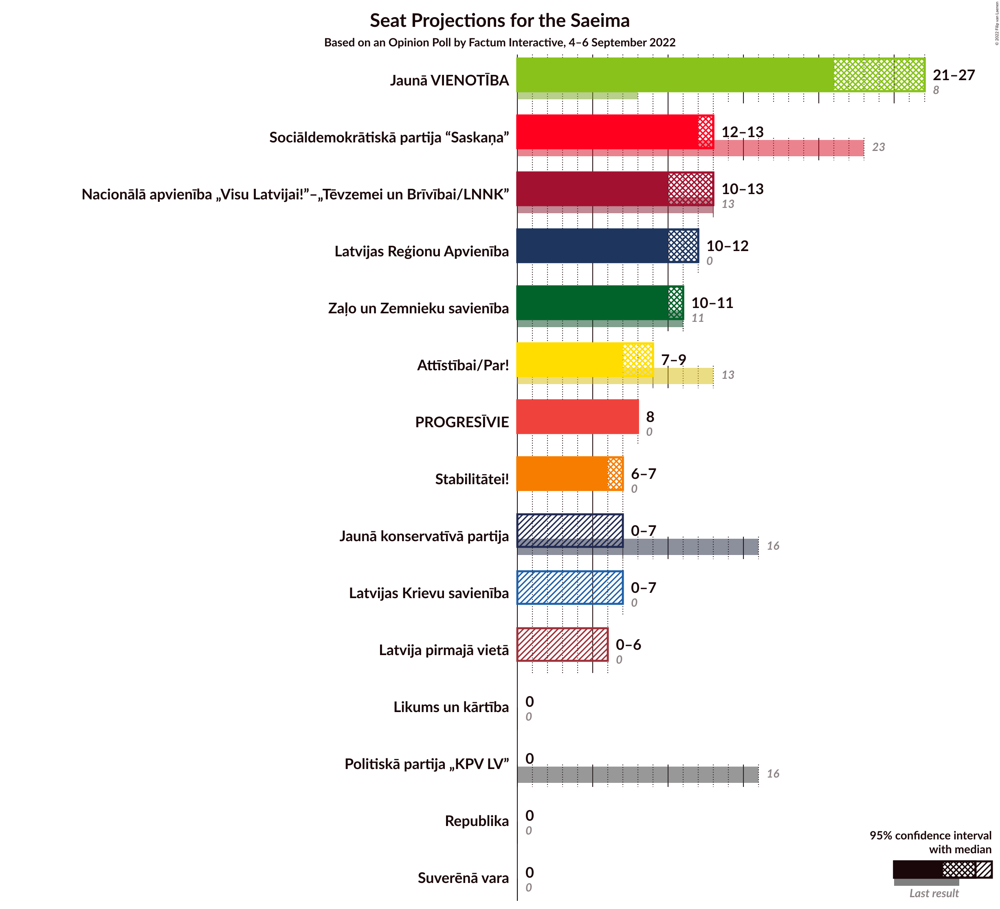

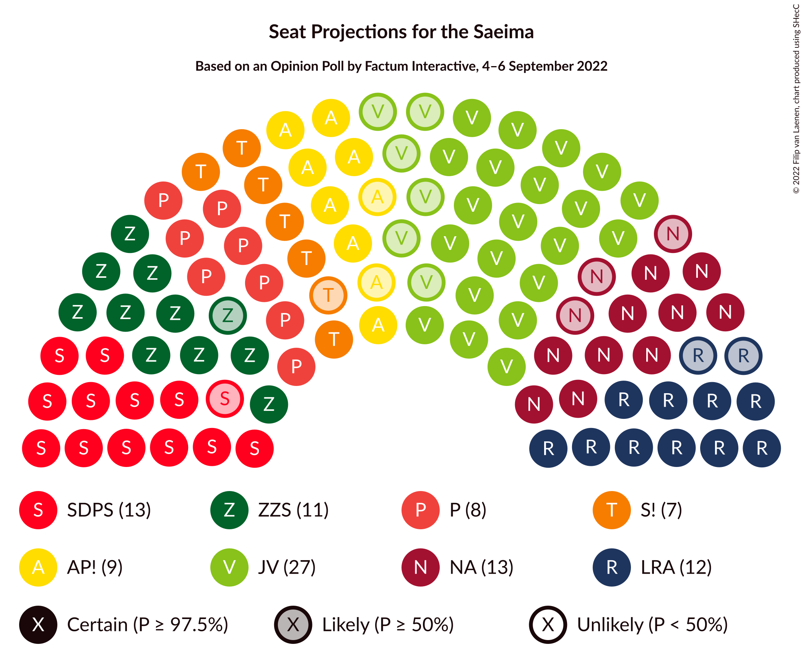

### Confidence Intervals

| Party | Last Result | Median | 80% Confidence Interval | 90% Confidence Interval | 95% Confidence Interval | 99% Confidence Interval |
|:-----:|:-----------:|:------:|:-----------------------:|:-----------------------:|:-----------------------:|:-----------------------:|
| <a href="#jaunā-vienotība">Jaunā VIENOTĪBA</a> | 8 | 27 | 27 |24–27 |21–27 |21–27 |
| <a href="#nacionālā-apvienība-„visu-latvijai!”–„tēvzemei-un-brīvībai/lnnk”">Nacionālā apvienība „Visu Latvijai!”–„Tēvzemei un Brīvībai/LNNK”</a> | 13 | 13 | 13 |11–13 |10–13 |10–13 |
| <a href="#latvijas-reģionu-apvienība">Latvijas Reģionu Apvienība</a> | 0 | 12 | 12 |11–12 |10–12 |9–13 |
| <a href="#sociāldemokrātiskā-partija-“saskaņa”">Sociāldemokrātiskā partija “Saskaņa”</a> | 23 | 13 | 13 |12–13 |12–13 |9–14 |
| <a href="#zaļo-un-zemnieku-savienība">Zaļo un Zemnieku savienība</a> | 11 | 11 | 11 |11 |10–11 |6–11 |
| <a href="#progresīvie">PROGRESĪVIE</a> | 0 | 8 | 8 |8 |8 |7–10 |
| <a href="#attīstībai/par!">Attīstībai/Par!</a> | 13 | 9 | 9 |7–9 |7–9 |7–9 |
| <a href="#stabilitātei!">Stabilitātei!</a> | 0 | 7 | 7 |7 |6–7 |0–9 |
| <a href="#latvijas-krievu-savienība">Latvijas Krievu savienība</a> | 0 | 0 | 0 |0 |0–7 |0–8 |
| <a href="#latvija-pirmajā-vietā">Latvija pirmajā vietā</a> | 0 | 0 | 0 |0 |0–6 |0–6 |
| <a href="#jaunā-konservatīvā-partija">Jaunā konservatīvā partija</a> | 16 | 0 | 0 |0–7 |0–7 |0–7 |
| <a href="#likums-un-kārtība">Likums un kārtība</a> | 0 | 0 | 0 |0 |0 |0 |
| <a href="#suverēnā-vara">Suverēnā vara</a> | 0 | 0 | 0 |0 |0 |0 |
| <a href="#republika">Republika</a> | 0 | 0 | 0 |0 |0 |0 |
| <a href="#politiskā-partija-„kpv-lv”">Politiskā partija „KPV LV”</a> | 16 | 0 | 0 |0 |0 |0 |

### Jaunā VIENOTĪBA

*For a full overview of the results for this party, see the [Jaunā VIENOTĪBA](party-jaunāvienotība.html) page.*

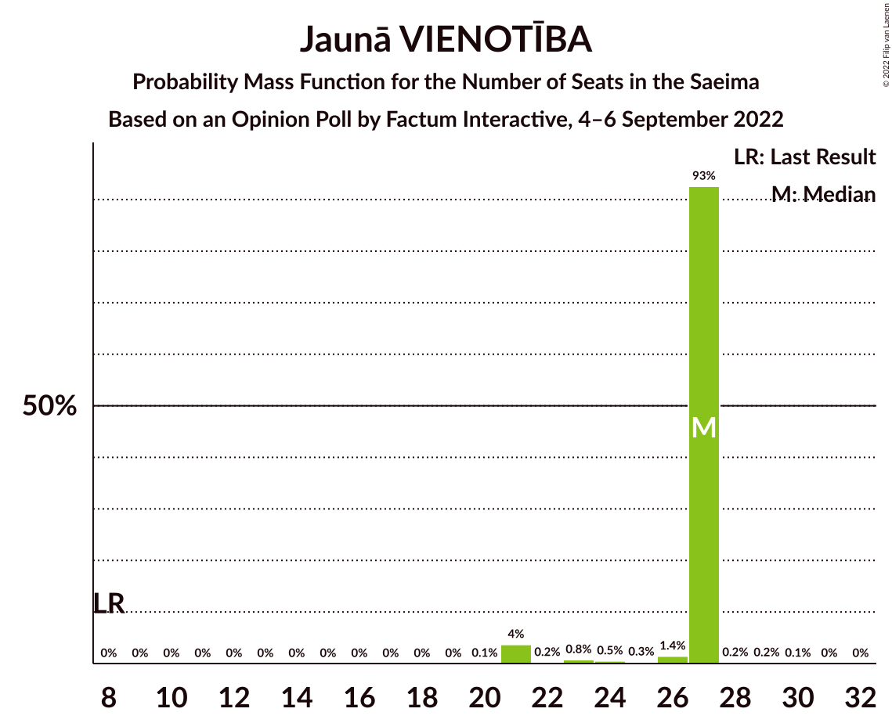

| Number of Seats | Probability | Accumulated | Special Marks |
|:---------------:|:-----------:|:-----------:|:-------------:|
| 8 | 0% | 100% | Last Result |
| 9 | 0% | 100% |  |
| 10 | 0% | 100% |  |
| 11 | 0% | 100% |  |
| 12 | 0% | 100% |  |
| 13 | 0% | 100% |  |
| 14 | 0% | 100% |  |
| 15 | 0% | 100% |  |
| 16 | 0% | 100% |  |
| 17 | 0% | 100% |  |
| 18 | 0% | 100% |  |
| 19 | 0% | 100% |  |
| 20 | 0.1% | 100% |  |
| 21 | 4% | 99.9% |  |
| 22 | 0.2% | 96% |  |
| 23 | 0.8% | 96% |  |
| 24 | 0.5% | 95% |  |
| 25 | 0.3% | 95% |  |
| 26 | 1.4% | 94% |  |
| 27 | 93% | 93% | Median |
| 28 | 0.2% | 0.4% |  |
| 29 | 0.2% | 0.2% |  |
| 30 | 0.1% | 0.1% |  |
| 31 | 0% | 0% |  |

### Nacionālā apvienība „Visu Latvijai!”–„Tēvzemei un Brīvībai/LNNK”

*For a full overview of the results for this party, see the [Nacionālā apvienība „Visu Latvijai!”–„Tēvzemei un Brīvībai/LNNK”](party-nacionālāapvienība„visulatvijai”–„tēvzemeiunbrīvībailnnk”.html) page.*

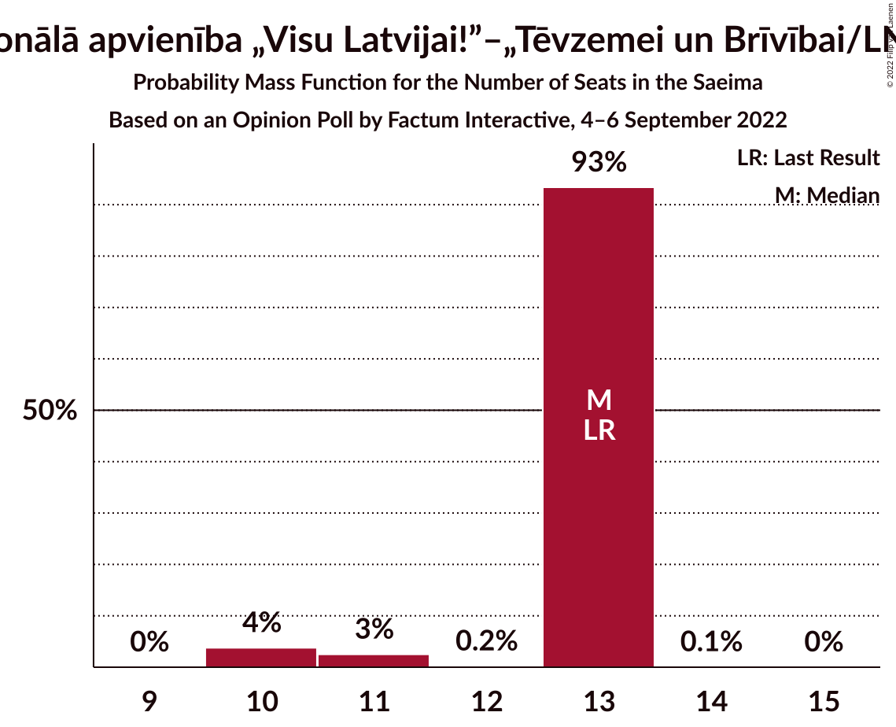

| Number of Seats | Probability | Accumulated | Special Marks |
|:---------------:|:-----------:|:-----------:|:-------------:|
| 10 | 4% | 100% |  |
| 11 | 3% | 96% |  |
| 12 | 0.2% | 94% |  |
| 13 | 93% | 93% | Last Result, Median |
| 14 | 0.1% | 0.1% |  |
| 15 | 0% | 0% |  |

### Latvijas Reģionu Apvienība

*For a full overview of the results for this party, see the [Latvijas Reģionu Apvienība](party-latvijasreģionuapvienība.html) page.*

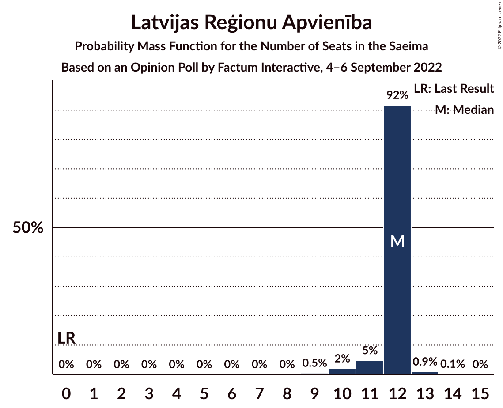

| Number of Seats | Probability | Accumulated | Special Marks |
|:---------------:|:-----------:|:-----------:|:-------------:|
| 0 | 0% | 100% | Last Result |
| 1 | 0% | 100% |  |
| 2 | 0% | 100% |  |
| 3 | 0% | 100% |  |
| 4 | 0% | 100% |  |
| 5 | 0% | 100% |  |
| 6 | 0% | 100% |  |
| 7 | 0% | 100% |  |
| 8 | 0% | 100% |  |
| 9 | 0.5% | 99.9% |  |
| 10 | 2% | 99.5% |  |
| 11 | 5% | 97% |  |
| 12 | 92% | 93% | Median |
| 13 | 0.9% | 1.0% |  |
| 14 | 0.1% | 0.1% |  |
| 15 | 0% | 0% |  |

### Sociāldemokrātiskā partija “Saskaņa”

*For a full overview of the results for this party, see the [Sociāldemokrātiskā partija “Saskaņa”](party-sociāldemokrātiskāpartija“saskaņa”.html) page.*

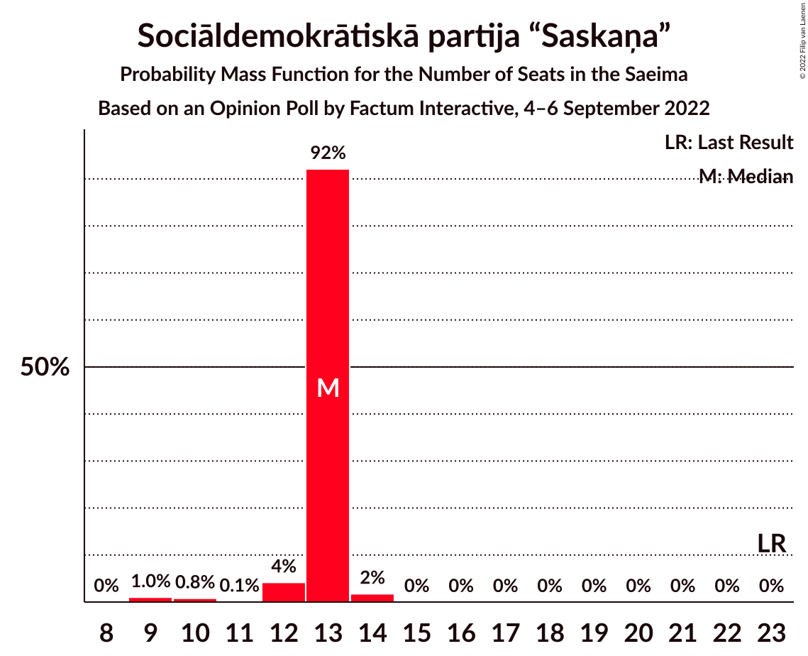

| Number of Seats | Probability | Accumulated | Special Marks |
|:---------------:|:-----------:|:-----------:|:-------------:|
| 8 | 0% | 100% |  |
| 9 | 1.0% | 99.9% |  |
| 10 | 0.8% | 98.9% |  |
| 11 | 0.1% | 98% |  |
| 12 | 4% | 98% |  |
| 13 | 92% | 94% | Median |
| 14 | 2% | 2% |  |
| 15 | 0% | 0% |  |
| 16 | 0% | 0% |  |
| 17 | 0% | 0% |  |
| 18 | 0% | 0% |  |
| 19 | 0% | 0% |  |
| 20 | 0% | 0% |  |
| 21 | 0% | 0% |  |
| 22 | 0% | 0% |  |
| 23 | 0% | 0% | Last Result |

### Zaļo un Zemnieku savienība

*For a full overview of the results for this party, see the [Zaļo un Zemnieku savienība](party-zaļounzemniekusavienība.html) page.*

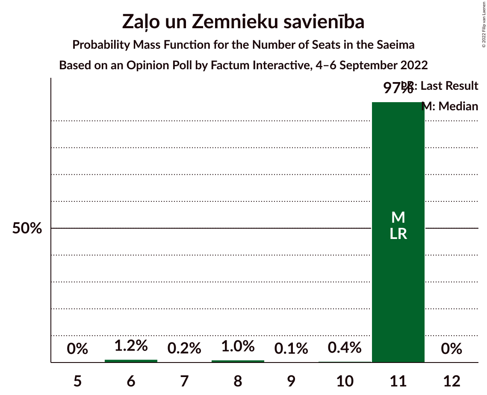

| Number of Seats | Probability | Accumulated | Special Marks |
|:---------------:|:-----------:|:-----------:|:-------------:|
| 6 | 1.2% | 100% |  |
| 7 | 0.2% | 98.8% |  |
| 8 | 1.0% | 98.6% |  |
| 9 | 0.1% | 98% |  |
| 10 | 0.4% | 98% |  |
| 11 | 97% | 97% | Last Result, Median |
| 12 | 0% | 0% |  |

### PROGRESĪVIE

*For a full overview of the results for this party, see the [PROGRESĪVIE](party-progresīvie.html) page.*

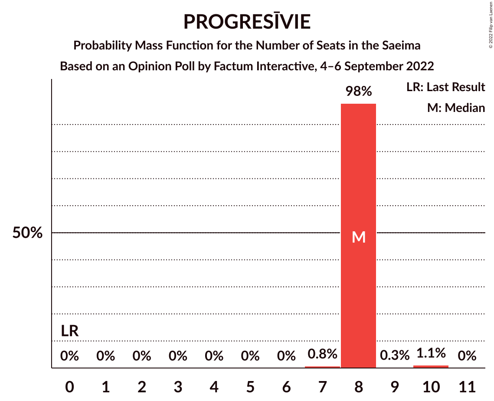

| Number of Seats | Probability | Accumulated | Special Marks |
|:---------------:|:-----------:|:-----------:|:-------------:|
| 0 | 0% | 100% | Last Result |
| 1 | 0% | 100% |  |
| 2 | 0% | 100% |  |
| 3 | 0% | 100% |  |
| 4 | 0% | 100% |  |
| 5 | 0% | 100% |  |
| 6 | 0% | 100% |  |
| 7 | 0.8% | 100% |  |
| 8 | 98% | 99.2% | Median |
| 9 | 0.3% | 1.4% |  |
| 10 | 1.1% | 1.1% |  |
| 11 | 0% | 0% |  |

### Attīstībai/Par!

*For a full overview of the results for this party, see the [Attīstībai/Par!](party-attīstībaipar.html) page.*

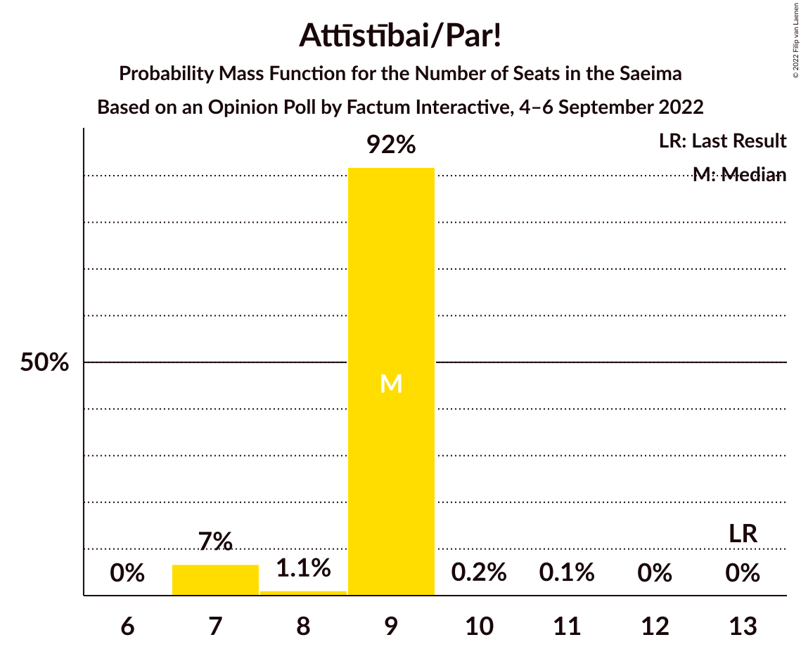

| Number of Seats | Probability | Accumulated | Special Marks |
|:---------------:|:-----------:|:-----------:|:-------------:|
| 7 | 7% | 100% |  |
| 8 | 1.1% | 93% |  |
| 9 | 92% | 92% | Median |
| 10 | 0.2% | 0.3% |  |
| 11 | 0.1% | 0.1% |  |
| 12 | 0% | 0% |  |
| 13 | 0% | 0% | Last Result |

### Stabilitātei!

*For a full overview of the results for this party, see the [Stabilitātei!](party-stabilitātei.html) page.*

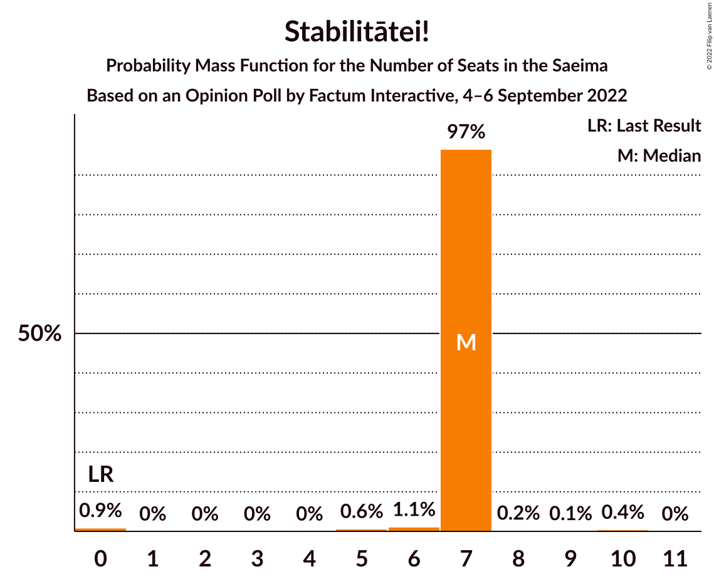

| Number of Seats | Probability | Accumulated | Special Marks |
|:---------------:|:-----------:|:-----------:|:-------------:|
| 0 | 0.9% | 100% | Last Result |
| 1 | 0% | 99.1% |  |
| 2 | 0% | 99.1% |  |
| 3 | 0% | 99.1% |  |
| 4 | 0% | 99.1% |  |
| 5 | 0.6% | 99.1% |  |
| 6 | 1.1% | 98% |  |
| 7 | 97% | 97% | Median |
| 8 | 0.2% | 0.8% |  |
| 9 | 0.1% | 0.5% |  |
| 10 | 0.4% | 0.4% |  |
| 11 | 0% | 0% |  |

### Latvijas Krievu savienība

*For a full overview of the results for this party, see the [Latvijas Krievu savienība](party-latvijaskrievusavienība.html) page.*

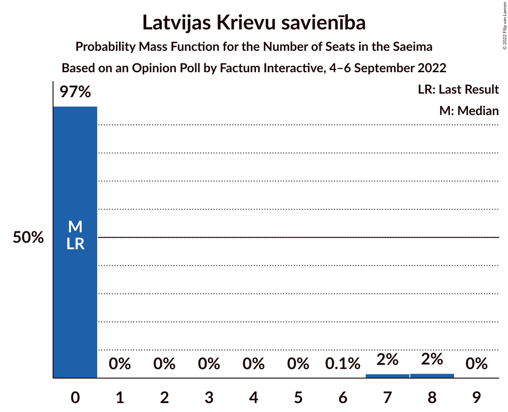

| Number of Seats | Probability | Accumulated | Special Marks |
|:---------------:|:-----------:|:-----------:|:-------------:|
| 0 | 97% | 100% | Last Result, Median |
| 1 | 0% | 3% |  |
| 2 | 0% | 3% |  |
| 3 | 0% | 3% |  |
| 4 | 0% | 3% |  |
| 5 | 0% | 3% |  |
| 6 | 0.1% | 3% |  |
| 7 | 2% | 3% |  |
| 8 | 2% | 2% |  |
| 9 | 0% | 0% |  |

### Latvija pirmajā vietā

*For a full overview of the results for this party, see the [Latvija pirmajā vietā](party-latvijapirmajāvietā.html) page.*

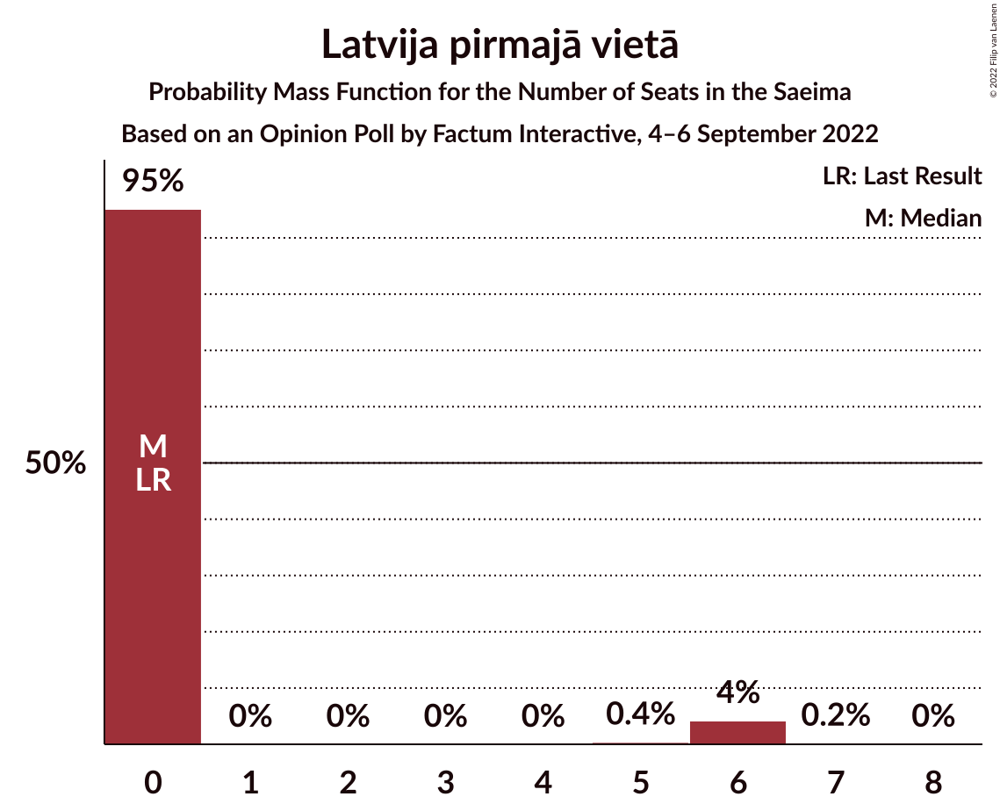

| Number of Seats | Probability | Accumulated | Special Marks |
|:---------------:|:-----------:|:-----------:|:-------------:|
| 0 | 95% | 100% | Last Result, Median |
| 1 | 0% | 5% |  |
| 2 | 0% | 5% |  |
| 3 | 0% | 5% |  |
| 4 | 0% | 5% |  |
| 5 | 0.4% | 5% |  |
| 6 | 4% | 4% |  |
| 7 | 0.2% | 0.2% |  |
| 8 | 0% | 0% |  |

### Jaunā konservatīvā partija

*For a full overview of the results for this party, see the [Jaunā konservatīvā partija](party-jaunākonservatīvāpartija.html) page.*

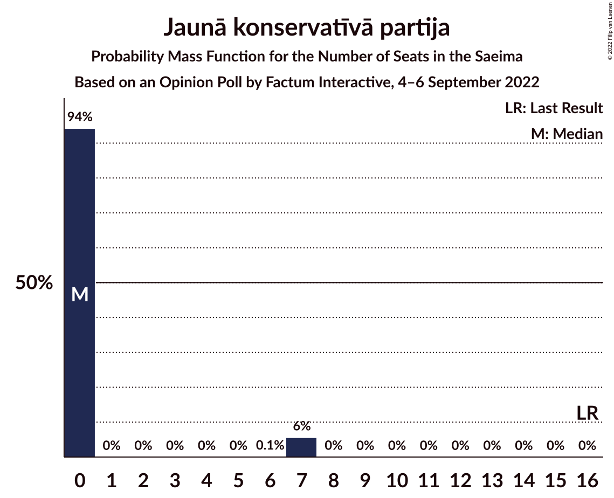

| Number of Seats | Probability | Accumulated | Special Marks |
|:---------------:|:-----------:|:-----------:|:-------------:|
| 0 | 94% | 100% | Median |
| 1 | 0% | 6% |  |
| 2 | 0% | 6% |  |
| 3 | 0% | 6% |  |
| 4 | 0% | 6% |  |
| 5 | 0% | 6% |  |
| 6 | 0.1% | 6% |  |
| 7 | 6% | 6% |  |
| 8 | 0% | 0% |  |
| 9 | 0% | 0% |  |
| 10 | 0% | 0% |  |
| 11 | 0% | 0% |  |
| 12 | 0% | 0% |  |
| 13 | 0% | 0% |  |
| 14 | 0% | 0% |  |
| 15 | 0% | 0% |  |
| 16 | 0% | 0% | Last Result |

### Likums un kārtība

*For a full overview of the results for this party, see the [Likums un kārtība](party-likumsunkārtība.html) page.*

| Number of Seats | Probability | Accumulated | Special Marks |
|:---------------:|:-----------:|:-----------:|:-------------:|
| 0 | 100% | 100% | Last Result, Median |

### Suverēnā vara

*For a full overview of the results for this party, see the [Suverēnā vara](party-suverēnāvara.html) page.*

| Number of Seats | Probability | Accumulated | Special Marks |
|:---------------:|:-----------:|:-----------:|:-------------:|
| 0 | 100% | 100% | Last Result, Median |

### Republika

*For a full overview of the results for this party, see the [Republika](party-republika.html) page.*

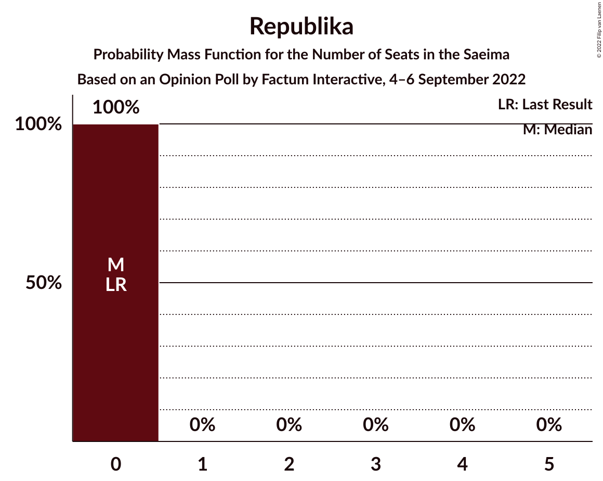

| Number of Seats | Probability | Accumulated | Special Marks |
|:---------------:|:-----------:|:-----------:|:-------------:|
| 0 | 100% | 100% | Last Result, Median |

### Politiskā partija „KPV LV”

*For a full overview of the results for this party, see the [Politiskā partija „KPV LV”](party-politiskāpartija„kpvlv”.html) page.*

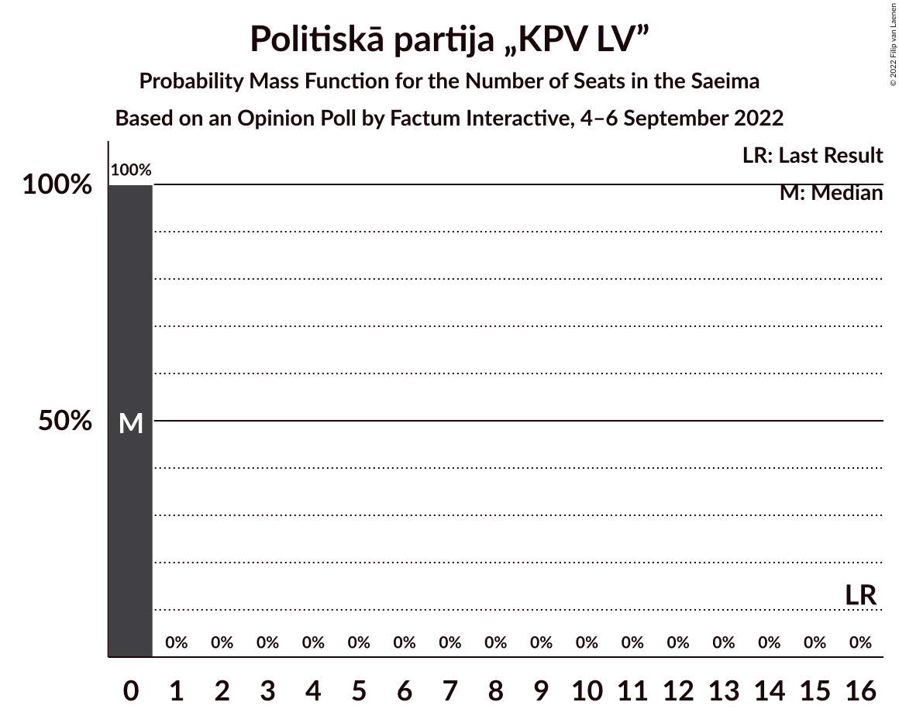

| Number of Seats | Probability | Accumulated | Special Marks |
|:---------------:|:-----------:|:-----------:|:-------------:|
| 0 | 100% | 100% | Median |
| 1 | 0% | 0% |  |
| 2 | 0% | 0% |  |
| 3 | 0% | 0% |  |
| 4 | 0% | 0% |  |
| 5 | 0% | 0% |  |
| 6 | 0% | 0% |  |
| 7 | 0% | 0% |  |
| 8 | 0% | 0% |  |
| 9 | 0% | 0% |  |
| 10 | 0% | 0% |  |
| 11 | 0% | 0% |  |
| 12 | 0% | 0% |  |
| 13 | 0% | 0% |  |
| 14 | 0% | 0% |  |
| 15 | 0% | 0% |  |
| 16 | 0% | 0% | Last Result |

## Coalitions

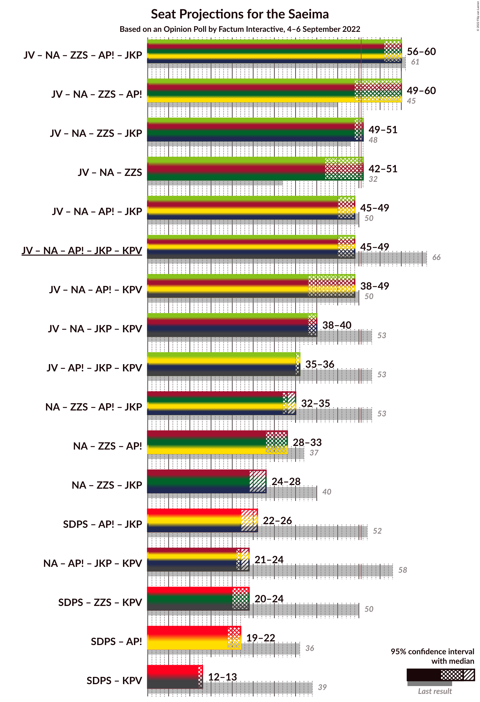

### Confidence Intervals

| Coalition | Last Result | Median | Majority? | 80% Confidence Interval | 90% Confidence Interval | 95% Confidence Interval | 99% Confidence Interval |
|:---------:|:-----------:|:------:|:---------:|:-----------------------:|:-----------------------:|:-----------------------:|:-----------------------:|
| Jaunā VIENOTĪBA – Nacionālā apvienība „Visu Latvijai!”–„Tēvzemei un Brīvībai/LNNK” – Zaļo un Zemnieku savienība – Attīstībai/Par! – Jaunā konservatīvā partija | 61 | 60 | 99.9% | 60 | 56–60 | 56–60 | 51–60 |
| Jaunā VIENOTĪBA – Nacionālā apvienība „Visu Latvijai!”–„Tēvzemei un Brīvībai/LNNK” – Zaļo un Zemnieku savienība – Attīstībai/Par! | 45 | 60 | 96% | 60 | 52–60 | 49–60 | 49–60 |
| Jaunā VIENOTĪBA – Nacionālā apvienība „Visu Latvijai!”–„Tēvzemei un Brīvībai/LNNK” – Zaļo un Zemnieku savienība – Jaunā konservatīvā partija | 48 | 51 | 93% | 51 | 49–51 | 49–51 | 43–52 |
| Jaunā VIENOTĪBA – Nacionālā apvienība „Visu Latvijai!”–„Tēvzemei un Brīvībai/LNNK” – Zaļo un Zemnieku savienība | 32 | 51 | 92% | 51 | 44–51 | 42–51 | 42–51 |
| Jaunā VIENOTĪBA – Nacionālā apvienība „Visu Latvijai!”–„Tēvzemei un Brīvībai/LNNK” – Attīstībai/Par! – Jaunā konservatīvā partija | 50 | 49 | 1.4% | 49 | 45–49 | 45–49 | 44–51 |
| Jaunā VIENOTĪBA – Nacionālā apvienība „Visu Latvijai!”–„Tēvzemei un Brīvībai/LNNK” – Attīstībai/Par! – Jaunā konservatīvā partija – Politiskā partija „KPV LV” | 66 | 49 | 1.4% | 49 | 45–49 | 45–49 | 44–51 |
| Jaunā VIENOTĪBA – Nacionālā apvienība „Visu Latvijai!”–„Tēvzemei un Brīvībai/LNNK” – Attīstībai/Par! – Politiskā partija „KPV LV” | 50 | 49 | 0.1% | 49 | 44–49 | 38–49 | 38–49 |
| Jaunā VIENOTĪBA – Nacionālā apvienība „Visu Latvijai!”–„Tēvzemei un Brīvībai/LNNK” – Jaunā konservatīvā partija – Politiskā partija „KPV LV” | 53 | 40 | 0% | 40 | 38–40 | 38–40 | 36–44 |
| Jaunā VIENOTĪBA – Attīstībai/Par! – Jaunā konservatīvā partija – Politiskā partija „KPV LV” | 53 | 36 | 0% | 36 | 35–36 | 35–36 | 32–40 |
| Nacionālā apvienība „Visu Latvijai!”–„Tēvzemei un Brīvībai/LNNK” – Zaļo un Zemnieku savienība – Attīstībai/Par! – Jaunā konservatīvā partija | 53 | 33 | 0% | 33 | 33 | 32–35 | 27–35 |
| Nacionālā apvienība „Visu Latvijai!”–„Tēvzemei un Brīvībai/LNNK” – Zaļo un Zemnieku savienība – Attīstībai/Par! | 37 | 33 | 0% | 33 | 28–33 | 28–33 | 26–33 |
| Nacionālā apvienība „Visu Latvijai!”–„Tēvzemei un Brīvībai/LNNK” – Zaļo un Zemnieku savienība – Jaunā konservatīvā partija | 40 | 24 | 0% | 24 | 24–26 | 24–28 | 19–28 |
| Sociāldemokrātiskā partija “Saskaņa” – Attīstībai/Par! – Jaunā konservatīvā partija | 52 | 22 | 0% | 22 | 22–23 | 22–26 | 19–27 |
| Nacionālā apvienība „Visu Latvijai!”–„Tēvzemei un Brīvībai/LNNK” – Attīstībai/Par! – Jaunā konservatīvā partija – Politiskā partija „KPV LV” | 58 | 22 | 0% | 22 | 22–24 | 21–24 | 18–27 |
| Sociāldemokrātiskā partija “Saskaņa” – Zaļo un Zemnieku savienība – Politiskā partija „KPV LV” | 50 | 24 | 0% | 24 | 23–24 | 20–24 | 17–25 |
| Sociāldemokrātiskā partija “Saskaņa” – Attīstībai/Par! | 36 | 22 | 0% | 22 | 19–22 | 19–22 | 16–22 |
| Sociāldemokrātiskā partija “Saskaņa” – Politiskā partija „KPV LV” | 39 | 13 | 0% | 13 | 12–13 | 12–13 | 9–14 |

### Jaunā VIENOTĪBA – Nacionālā apvienība „Visu Latvijai!”–„Tēvzemei un Brīvībai/LNNK” – Zaļo un Zemnieku savienība – Attīstībai/Par! – Jaunā konservatīvā partija

| Number of Seats | Probability | Accumulated | Special Marks |
|:---------------:|:-----------:|:-----------:|:-------------:|
| 50 | 0.1% | 100% |  |
| 51 | 0.4% | 99.9% | Majority |
| 52 | 0% | 99.5% |  |
| 53 | 0.1% | 99.4% |  |
| 54 | 0.1% | 99.3% |  |
| 55 | 0.6% | 99.2% |  |
| 56 | 5% | 98.6% |  |
| 57 | 0.1% | 94% |  |
| 58 | 0.5% | 94% |  |
| 59 | 1.1% | 93% |  |
| 60 | 91% | 92% | Median |
| 61 | 0.2% | 0.5% | Last Result |
| 62 | 0% | 0.3% |  |
| 63 | 0.1% | 0.2% |  |
| 64 | 0.1% | 0.2% |  |
| 65 | 0% | 0.1% |  |
| 66 | 0% | 0% |  |

### Jaunā VIENOTĪBA – Nacionālā apvienība „Visu Latvijai!”–„Tēvzemei un Brīvībai/LNNK” – Zaļo un Zemnieku savienība – Attīstībai/Par!

| Number of Seats | Probability | Accumulated | Special Marks |
|:---------------:|:-----------:|:-----------:|:-------------:|
| 45 | 0% | 100% | Last Result |
| 46 | 0% | 99.9% |  |
| 47 | 0% | 99.9% |  |
| 48 | 0% | 99.9% |  |
| 49 | 4% | 99.9% |  |
| 50 | 0.1% | 96% |  |
| 51 | 0.6% | 96% | Majority |
| 52 | 1.1% | 95% |  |
| 53 | 0.1% | 94% |  |
| 54 | 0.2% | 94% |  |
| 55 | 0.6% | 94% |  |
| 56 | 0.8% | 93% |  |
| 57 | 0.2% | 92% |  |
| 58 | 0.4% | 92% |  |
| 59 | 0% | 92% |  |
| 60 | 91% | 92% | Median |
| 61 | 0.2% | 0.2% |  |
| 62 | 0% | 0% |  |

### Jaunā VIENOTĪBA – Nacionālā apvienība „Visu Latvijai!”–„Tēvzemei un Brīvībai/LNNK” – Zaļo un Zemnieku savienība – Jaunā konservatīvā partija

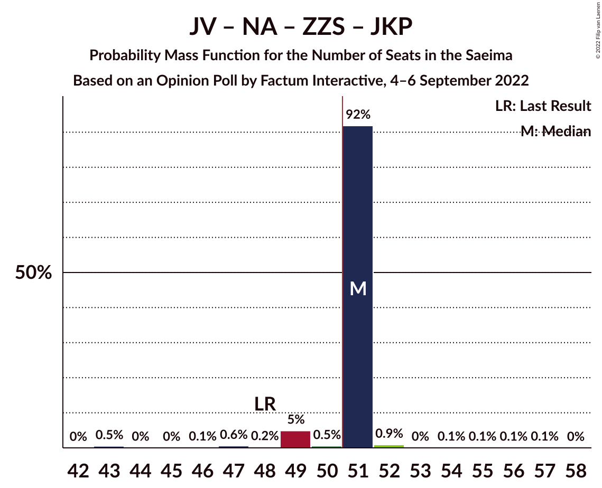

| Number of Seats | Probability | Accumulated | Special Marks |
|:---------------:|:-----------:|:-----------:|:-------------:|
| 43 | 0.5% | 100% |  |
| 44 | 0% | 99.5% |  |
| 45 | 0% | 99.4% |  |
| 46 | 0.1% | 99.4% |  |
| 47 | 0.6% | 99.3% |  |
| 48 | 0.2% | 98.7% | Last Result |
| 49 | 5% | 98.5% |  |
| 50 | 0.5% | 94% |  |
| 51 | 92% | 93% | Median, Majority |
| 52 | 0.9% | 1.2% |  |
| 53 | 0% | 0.3% |  |
| 54 | 0.1% | 0.3% |  |
| 55 | 0.1% | 0.2% |  |
| 56 | 0.1% | 0.2% |  |
| 57 | 0.1% | 0.1% |  |
| 58 | 0% | 0% |  |

### Jaunā VIENOTĪBA – Nacionālā apvienība „Visu Latvijai!”–„Tēvzemei un Brīvībai/LNNK” – Zaļo un Zemnieku savienība

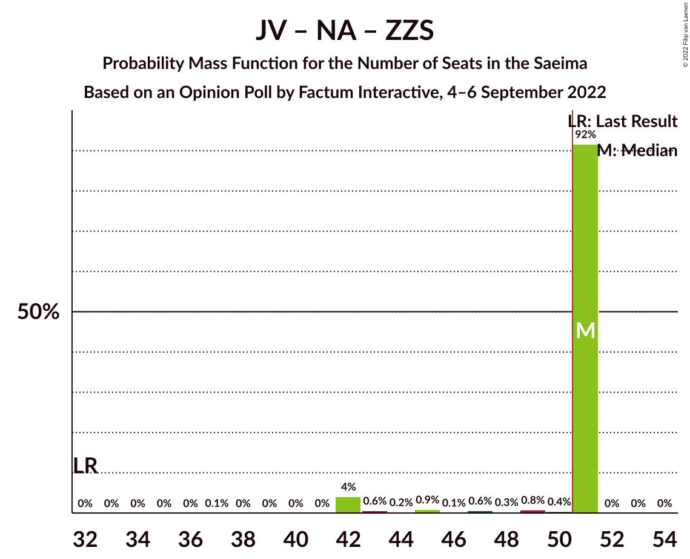

| Number of Seats | Probability | Accumulated | Special Marks |
|:---------------:|:-----------:|:-----------:|:-------------:|
| 32 | 0% | 100% | Last Result |
| 33 | 0% | 100% |  |
| 34 | 0% | 100% |  |
| 35 | 0% | 100% |  |
| 36 | 0% | 100% |  |
| 37 | 0.1% | 100% |  |
| 38 | 0% | 99.9% |  |
| 39 | 0% | 99.9% |  |
| 40 | 0% | 99.9% |  |
| 41 | 0% | 99.9% |  |
| 42 | 4% | 99.9% |  |
| 43 | 0.6% | 96% |  |
| 44 | 0.2% | 95% |  |
| 45 | 0.9% | 95% |  |
| 46 | 0.1% | 94% |  |
| 47 | 0.6% | 94% |  |
| 48 | 0.3% | 93% |  |
| 49 | 0.8% | 93% |  |
| 50 | 0.4% | 92% |  |
| 51 | 92% | 92% | Median, Majority |
| 52 | 0% | 0.1% |  |
| 53 | 0% | 0.1% |  |
| 54 | 0% | 0% |  |

### Jaunā VIENOTĪBA – Nacionālā apvienība „Visu Latvijai!”–„Tēvzemei un Brīvībai/LNNK” – Attīstībai/Par! – Jaunā konservatīvā partija

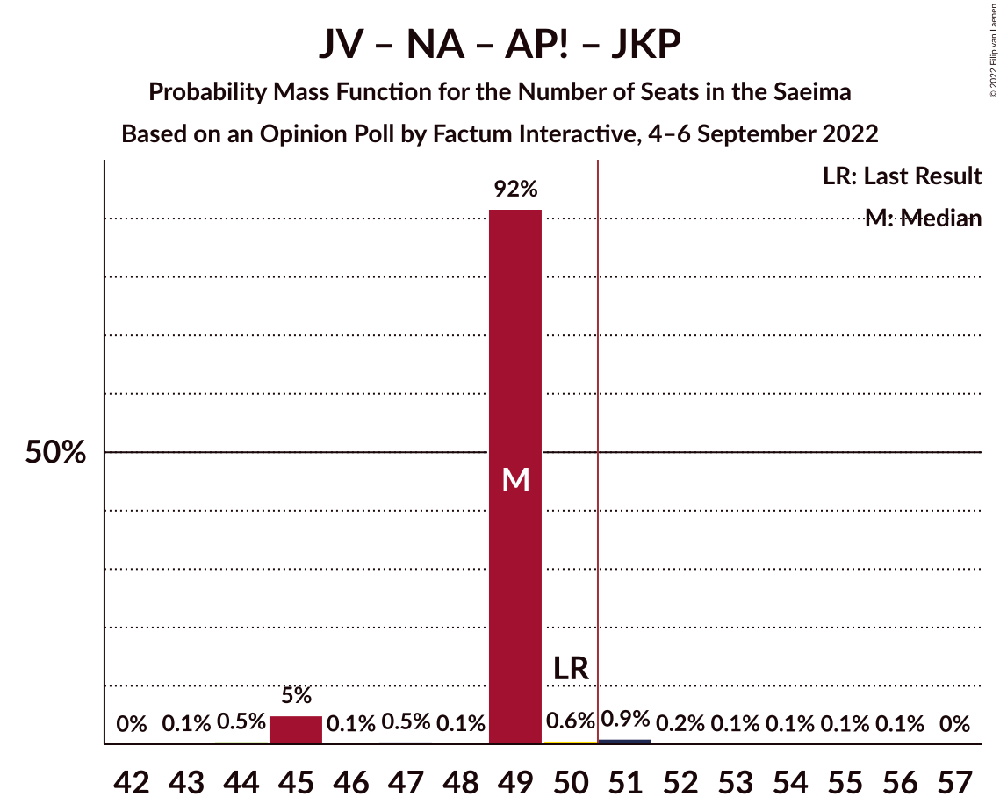

| Number of Seats | Probability | Accumulated | Special Marks |
|:---------------:|:-----------:|:-----------:|:-------------:|
| 42 | 0% | 100% |  |
| 43 | 0.1% | 99.9% |  |
| 44 | 0.5% | 99.8% |  |
| 45 | 5% | 99.3% |  |
| 46 | 0.1% | 94% |  |
| 47 | 0.5% | 94% |  |
| 48 | 0.1% | 94% |  |
| 49 | 92% | 94% | Median |
| 50 | 0.6% | 2% | Last Result |
| 51 | 0.9% | 1.4% | Majority |
| 52 | 0.2% | 0.5% |  |
| 53 | 0.1% | 0.3% |  |
| 54 | 0.1% | 0.2% |  |
| 55 | 0.1% | 0.2% |  |
| 56 | 0.1% | 0.1% |  |
| 57 | 0% | 0% |  |

### Jaunā VIENOTĪBA – Nacionālā apvienība „Visu Latvijai!”–„Tēvzemei un Brīvībai/LNNK” – Attīstībai/Par! – Jaunā konservatīvā partija – Politiskā partija „KPV LV”

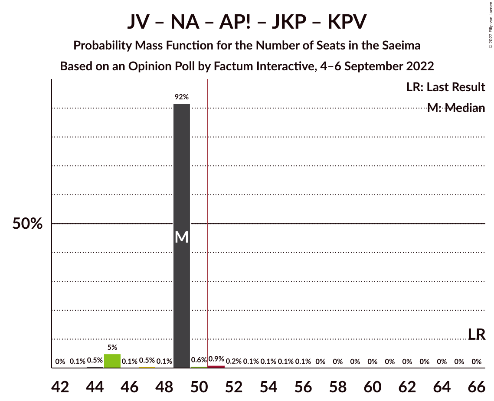

| Number of Seats | Probability | Accumulated | Special Marks |
|:---------------:|:-----------:|:-----------:|:-------------:|
| 42 | 0% | 100% |  |
| 43 | 0.1% | 99.9% |  |
| 44 | 0.5% | 99.8% |  |
| 45 | 5% | 99.3% |  |
| 46 | 0.1% | 94% |  |
| 47 | 0.5% | 94% |  |
| 48 | 0.1% | 94% |  |
| 49 | 92% | 94% | Median |
| 50 | 0.6% | 2% |  |
| 51 | 0.9% | 1.4% | Majority |
| 52 | 0.2% | 0.5% |  |
| 53 | 0.1% | 0.3% |  |
| 54 | 0.1% | 0.2% |  |
| 55 | 0.1% | 0.2% |  |
| 56 | 0.1% | 0.1% |  |
| 57 | 0% | 0% |  |
| 58 | 0% | 0% |  |
| 59 | 0% | 0% |  |
| 60 | 0% | 0% |  |
| 61 | 0% | 0% |  |
| 62 | 0% | 0% |  |
| 63 | 0% | 0% |  |
| 64 | 0% | 0% |  |
| 65 | 0% | 0% |  |
| 66 | 0% | 0% | Last Result |

### Jaunā VIENOTĪBA – Nacionālā apvienība „Visu Latvijai!”–„Tēvzemei un Brīvībai/LNNK” – Attīstībai/Par! – Politiskā partija „KPV LV”

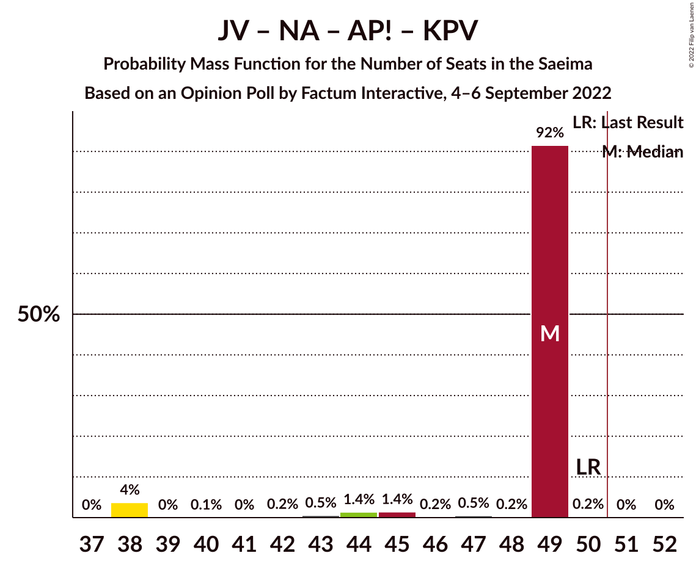

| Number of Seats | Probability | Accumulated | Special Marks |
|:---------------:|:-----------:|:-----------:|:-------------:|
| 38 | 4% | 100% |  |
| 39 | 0% | 96% |  |
| 40 | 0.1% | 96% |  |
| 41 | 0% | 96% |  |
| 42 | 0.2% | 96% |  |
| 43 | 0.5% | 96% |  |
| 44 | 1.4% | 95% |  |
| 45 | 1.4% | 94% |  |
| 46 | 0.2% | 93% |  |
| 47 | 0.5% | 92% |  |
| 48 | 0.2% | 92% |  |
| 49 | 92% | 92% | Median |
| 50 | 0.2% | 0.3% | Last Result |
| 51 | 0% | 0.1% | Majority |
| 52 | 0% | 0% |  |

### Jaunā VIENOTĪBA – Nacionālā apvienība „Visu Latvijai!”–„Tēvzemei un Brīvībai/LNNK” – Jaunā konservatīvā partija – Politiskā partija „KPV LV”

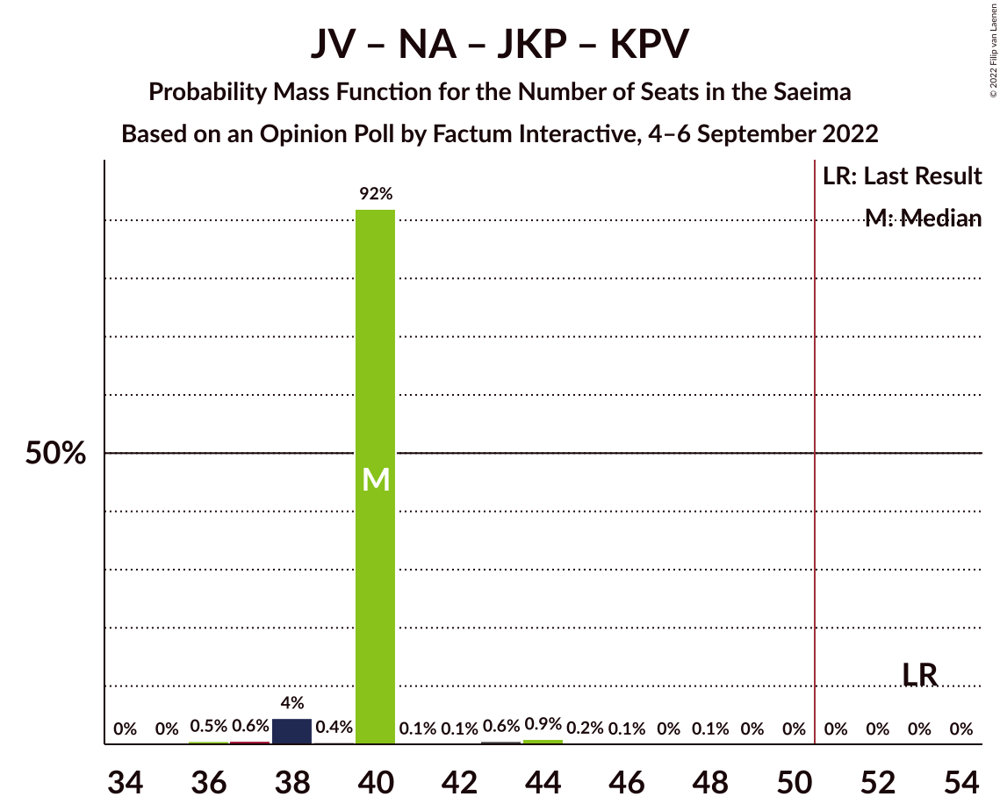

| Number of Seats | Probability | Accumulated | Special Marks |
|:---------------:|:-----------:|:-----------:|:-------------:|
| 35 | 0% | 100% |  |
| 36 | 0.5% | 99.9% |  |
| 37 | 0.6% | 99.4% |  |
| 38 | 4% | 98.8% |  |
| 39 | 0.4% | 94% |  |
| 40 | 92% | 94% | Median |
| 41 | 0.1% | 2% |  |
| 42 | 0.1% | 2% |  |
| 43 | 0.6% | 2% |  |
| 44 | 0.9% | 1.3% |  |
| 45 | 0.2% | 0.4% |  |
| 46 | 0.1% | 0.2% |  |
| 47 | 0% | 0.1% |  |
| 48 | 0.1% | 0.1% |  |
| 49 | 0% | 0% |  |
| 50 | 0% | 0% |  |
| 51 | 0% | 0% | Majority |
| 52 | 0% | 0% |  |
| 53 | 0% | 0% | Last Result |

### Jaunā VIENOTĪBA – Attīstībai/Par! – Jaunā konservatīvā partija – Politiskā partija „KPV LV”

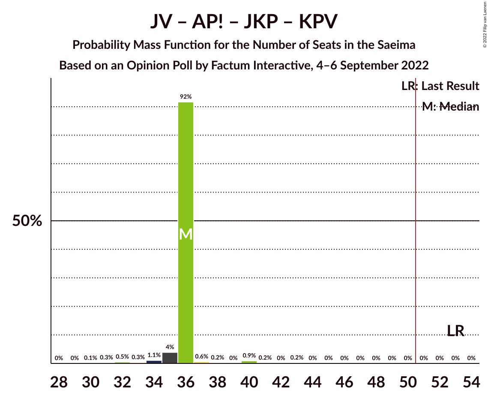

| Number of Seats | Probability | Accumulated | Special Marks |
|:---------------:|:-----------:|:-----------:|:-------------:|
| 30 | 0.1% | 100% |  |
| 31 | 0.3% | 99.9% |  |
| 32 | 0.5% | 99.6% |  |
| 33 | 0.3% | 99.1% |  |
| 34 | 1.1% | 98.8% |  |
| 35 | 4% | 98% |  |
| 36 | 92% | 94% | Median |
| 37 | 0.6% | 2% |  |
| 38 | 0.2% | 2% |  |
| 39 | 0% | 1.4% |  |
| 40 | 0.9% | 1.3% |  |
| 41 | 0.2% | 0.4% |  |
| 42 | 0% | 0.3% |  |
| 43 | 0.2% | 0.3% |  |
| 44 | 0% | 0.1% |  |
| 45 | 0% | 0% |  |
| 46 | 0% | 0% |  |
| 47 | 0% | 0% |  |
| 48 | 0% | 0% |  |
| 49 | 0% | 0% |  |
| 50 | 0% | 0% |  |
| 51 | 0% | 0% | Majority |
| 52 | 0% | 0% |  |
| 53 | 0% | 0% | Last Result |

### Nacionālā apvienība „Visu Latvijai!”–„Tēvzemei un Brīvībai/LNNK” – Zaļo un Zemnieku savienība – Attīstībai/Par! – Jaunā konservatīvā partija

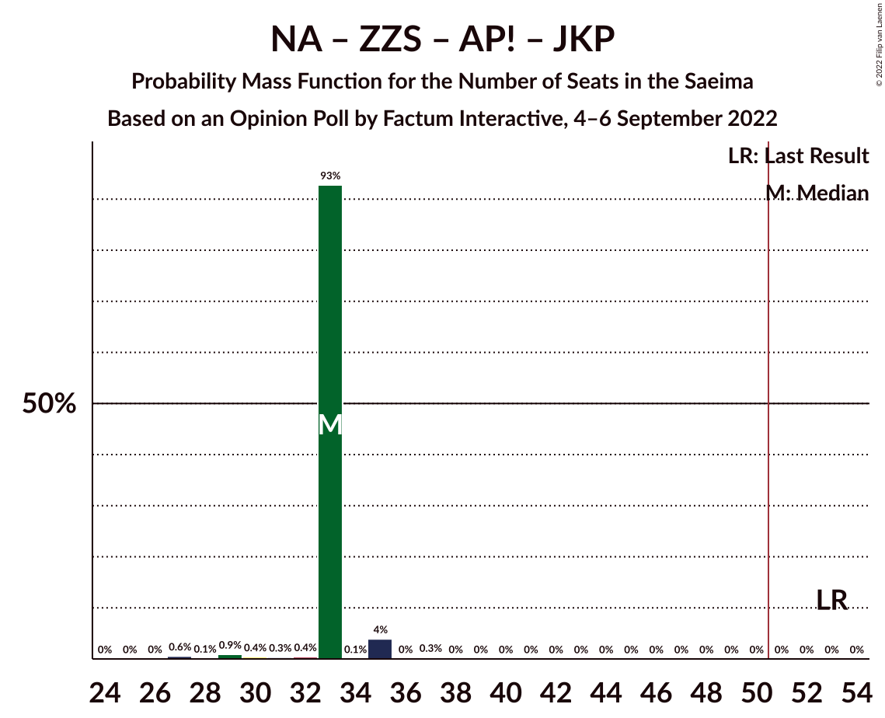

| Number of Seats | Probability | Accumulated | Special Marks |
|:---------------:|:-----------:|:-----------:|:-------------:|
| 25 | 0% | 100% |  |
| 26 | 0% | 99.9% |  |
| 27 | 0.6% | 99.9% |  |
| 28 | 0.1% | 99.3% |  |
| 29 | 0.9% | 99.2% |  |
| 30 | 0.4% | 98% |  |
| 31 | 0.3% | 98% |  |
| 32 | 0.4% | 98% |  |
| 33 | 93% | 97% | Median |
| 34 | 0.1% | 4% |  |
| 35 | 4% | 4% |  |
| 36 | 0% | 0.4% |  |
| 37 | 0.3% | 0.4% |  |
| 38 | 0% | 0.1% |  |
| 39 | 0% | 0.1% |  |
| 40 | 0% | 0% |  |
| 41 | 0% | 0% |  |
| 42 | 0% | 0% |  |
| 43 | 0% | 0% |  |
| 44 | 0% | 0% |  |
| 45 | 0% | 0% |  |
| 46 | 0% | 0% |  |
| 47 | 0% | 0% |  |
| 48 | 0% | 0% |  |
| 49 | 0% | 0% |  |
| 50 | 0% | 0% |  |
| 51 | 0% | 0% | Majority |
| 52 | 0% | 0% |  |
| 53 | 0% | 0% | Last Result |

### Nacionālā apvienība „Visu Latvijai!”–„Tēvzemei un Brīvībai/LNNK” – Zaļo un Zemnieku savienība – Attīstībai/Par!

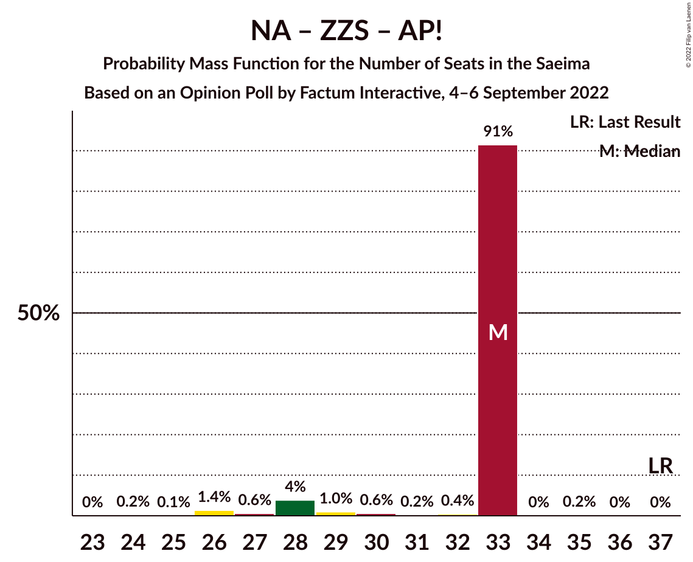

| Number of Seats | Probability | Accumulated | Special Marks |
|:---------------:|:-----------:|:-----------:|:-------------:|
| 24 | 0.2% | 100% |  |
| 25 | 0.1% | 99.8% |  |
| 26 | 1.4% | 99.7% |  |
| 27 | 0.6% | 98% |  |
| 28 | 4% | 98% |  |
| 29 | 1.0% | 94% |  |
| 30 | 0.6% | 93% |  |
| 31 | 0.2% | 92% |  |
| 32 | 0.4% | 92% |  |
| 33 | 91% | 92% | Median |
| 34 | 0% | 0.2% |  |
| 35 | 0.2% | 0.2% |  |
| 36 | 0% | 0% |  |
| 37 | 0% | 0% | Last Result |

### Nacionālā apvienība „Visu Latvijai!”–„Tēvzemei un Brīvībai/LNNK” – Zaļo un Zemnieku savienība – Jaunā konservatīvā partija

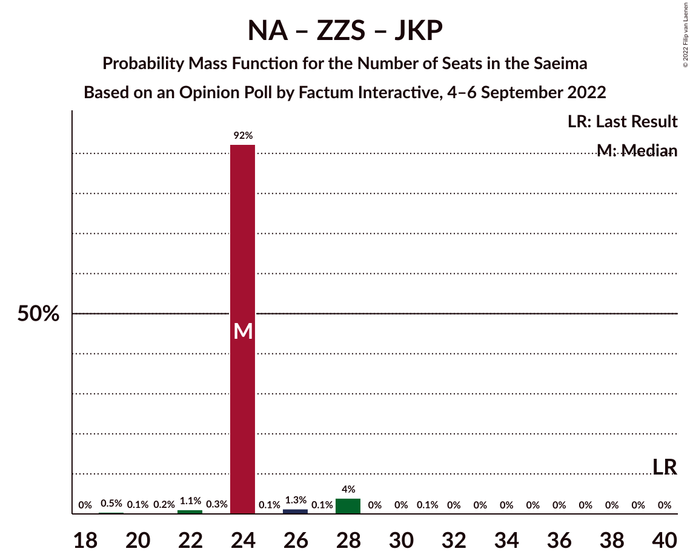

| Number of Seats | Probability | Accumulated | Special Marks |
|:---------------:|:-----------:|:-----------:|:-------------:|
| 18 | 0% | 100% |  |
| 19 | 0.5% | 99.9% |  |
| 20 | 0.1% | 99.5% |  |
| 21 | 0.2% | 99.3% |  |
| 22 | 1.1% | 99.2% |  |
| 23 | 0.3% | 98% |  |
| 24 | 92% | 98% | Median |
| 25 | 0.1% | 6% |  |
| 26 | 1.3% | 5% |  |
| 27 | 0.1% | 4% |  |
| 28 | 4% | 4% |  |
| 29 | 0% | 0.1% |  |
| 30 | 0% | 0.1% |  |
| 31 | 0.1% | 0.1% |  |
| 32 | 0% | 0% |  |
| 33 | 0% | 0% |  |
| 34 | 0% | 0% |  |
| 35 | 0% | 0% |  |
| 36 | 0% | 0% |  |
| 37 | 0% | 0% |  |
| 38 | 0% | 0% |  |
| 39 | 0% | 0% |  |
| 40 | 0% | 0% | Last Result |

### Sociāldemokrātiskā partija “Saskaņa” – Attīstībai/Par! – Jaunā konservatīvā partija

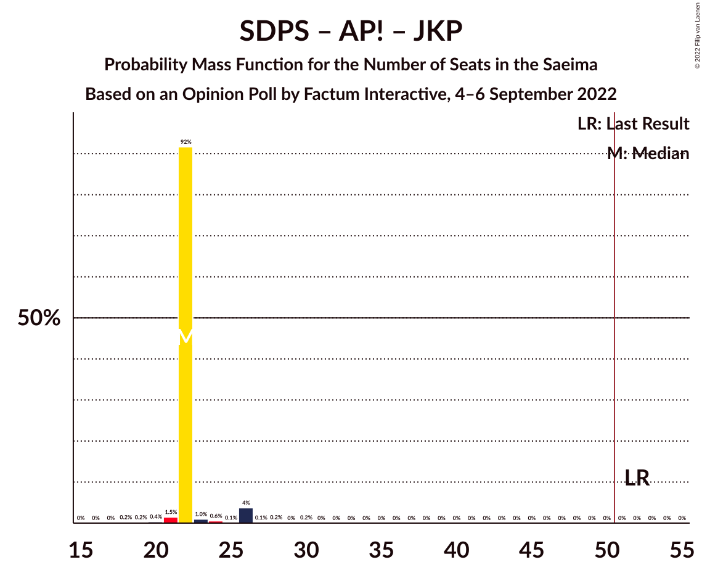

| Number of Seats | Probability | Accumulated | Special Marks |
|:---------------:|:-----------:|:-----------:|:-------------:|
| 15 | 0% | 100% |  |
| 16 | 0% | 99.9% |  |
| 17 | 0% | 99.9% |  |
| 18 | 0.2% | 99.9% |  |
| 19 | 0.2% | 99.6% |  |
| 20 | 0.4% | 99.4% |  |
| 21 | 1.5% | 99.1% |  |
| 22 | 92% | 98% | Median |
| 23 | 1.0% | 6% |  |
| 24 | 0.6% | 5% |  |
| 25 | 0.1% | 4% |  |
| 26 | 4% | 4% |  |
| 27 | 0.1% | 0.6% |  |
| 28 | 0.2% | 0.4% |  |
| 29 | 0% | 0.2% |  |
| 30 | 0.2% | 0.2% |  |
| 31 | 0% | 0% |  |
| 32 | 0% | 0% |  |
| 33 | 0% | 0% |  |
| 34 | 0% | 0% |  |
| 35 | 0% | 0% |  |
| 36 | 0% | 0% |  |
| 37 | 0% | 0% |  |
| 38 | 0% | 0% |  |
| 39 | 0% | 0% |  |
| 40 | 0% | 0% |  |
| 41 | 0% | 0% |  |
| 42 | 0% | 0% |  |
| 43 | 0% | 0% |  |
| 44 | 0% | 0% |  |
| 45 | 0% | 0% |  |
| 46 | 0% | 0% |  |
| 47 | 0% | 0% |  |
| 48 | 0% | 0% |  |
| 49 | 0% | 0% |  |
| 50 | 0% | 0% |  |
| 51 | 0% | 0% | Majority |
| 52 | 0% | 0% | Last Result |

### Nacionālā apvienība „Visu Latvijai!”–„Tēvzemei un Brīvībai/LNNK” – Attīstībai/Par! – Jaunā konservatīvā partija – Politiskā partija „KPV LV”

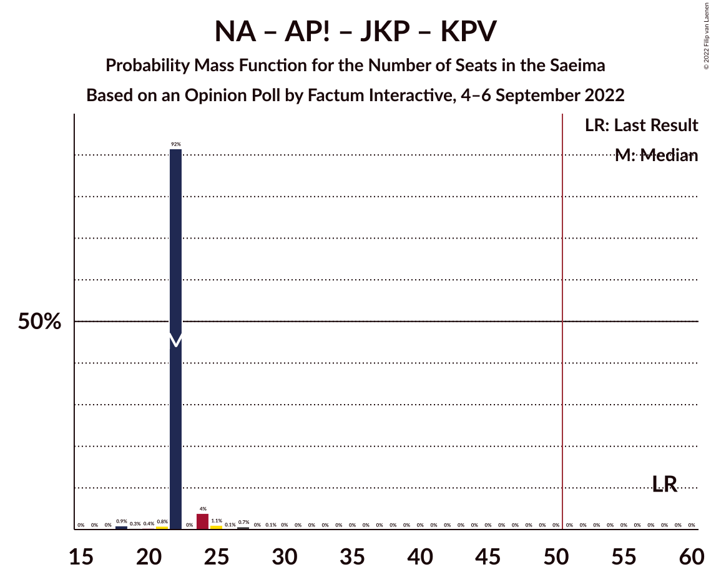

| Number of Seats | Probability | Accumulated | Special Marks |
|:---------------:|:-----------:|:-----------:|:-------------:|
| 17 | 0% | 100% |  |
| 18 | 0.9% | 99.9% |  |
| 19 | 0.3% | 99.0% |  |
| 20 | 0.4% | 98.7% |  |
| 21 | 0.8% | 98% |  |
| 22 | 92% | 97% | Median |
| 23 | 0% | 6% |  |
| 24 | 4% | 6% |  |
| 25 | 1.1% | 2% |  |
| 26 | 0.1% | 0.9% |  |
| 27 | 0.7% | 0.9% |  |
| 28 | 0% | 0.2% |  |
| 29 | 0.1% | 0.1% |  |
| 30 | 0% | 0.1% |  |
| 31 | 0% | 0% |  |
| 32 | 0% | 0% |  |
| 33 | 0% | 0% |  |
| 34 | 0% | 0% |  |
| 35 | 0% | 0% |  |
| 36 | 0% | 0% |  |
| 37 | 0% | 0% |  |
| 38 | 0% | 0% |  |
| 39 | 0% | 0% |  |
| 40 | 0% | 0% |  |
| 41 | 0% | 0% |  |
| 42 | 0% | 0% |  |
| 43 | 0% | 0% |  |
| 44 | 0% | 0% |  |
| 45 | 0% | 0% |  |
| 46 | 0% | 0% |  |
| 47 | 0% | 0% |  |
| 48 | 0% | 0% |  |
| 49 | 0% | 0% |  |
| 50 | 0% | 0% |  |
| 51 | 0% | 0% | Majority |
| 52 | 0% | 0% |  |
| 53 | 0% | 0% |  |
| 54 | 0% | 0% |  |
| 55 | 0% | 0% |  |
| 56 | 0% | 0% |  |
| 57 | 0% | 0% |  |
| 58 | 0% | 0% | Last Result |

### Sociāldemokrātiskā partija “Saskaņa” – Zaļo un Zemnieku savienība – Politiskā partija „KPV LV”

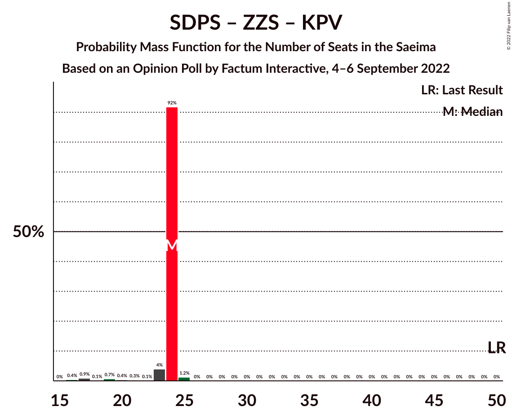

| Number of Seats | Probability | Accumulated | Special Marks |
|:---------------:|:-----------:|:-----------:|:-------------:|
| 16 | 0.4% | 100% |  |
| 17 | 0.9% | 99.5% |  |
| 18 | 0.1% | 98.6% |  |
| 19 | 0.7% | 98.5% |  |
| 20 | 0.4% | 98% |  |
| 21 | 0.3% | 97% |  |
| 22 | 0.1% | 97% |  |
| 23 | 4% | 97% |  |
| 24 | 92% | 93% | Median |
| 25 | 1.2% | 1.3% |  |
| 26 | 0% | 0% |  |
| 27 | 0% | 0% |  |
| 28 | 0% | 0% |  |
| 29 | 0% | 0% |  |
| 30 | 0% | 0% |  |
| 31 | 0% | 0% |  |
| 32 | 0% | 0% |  |
| 33 | 0% | 0% |  |
| 34 | 0% | 0% |  |
| 35 | 0% | 0% |  |
| 36 | 0% | 0% |  |
| 37 | 0% | 0% |  |
| 38 | 0% | 0% |  |
| 39 | 0% | 0% |  |
| 40 | 0% | 0% |  |
| 41 | 0% | 0% |  |
| 42 | 0% | 0% |  |
| 43 | 0% | 0% |  |
| 44 | 0% | 0% |  |
| 45 | 0% | 0% |  |
| 46 | 0% | 0% |  |
| 47 | 0% | 0% |  |
| 48 | 0% | 0% |  |
| 49 | 0% | 0% |  |
| 50 | 0% | 0% | Last Result |

### Sociāldemokrātiskā partija “Saskaņa” – Attīstībai/Par!

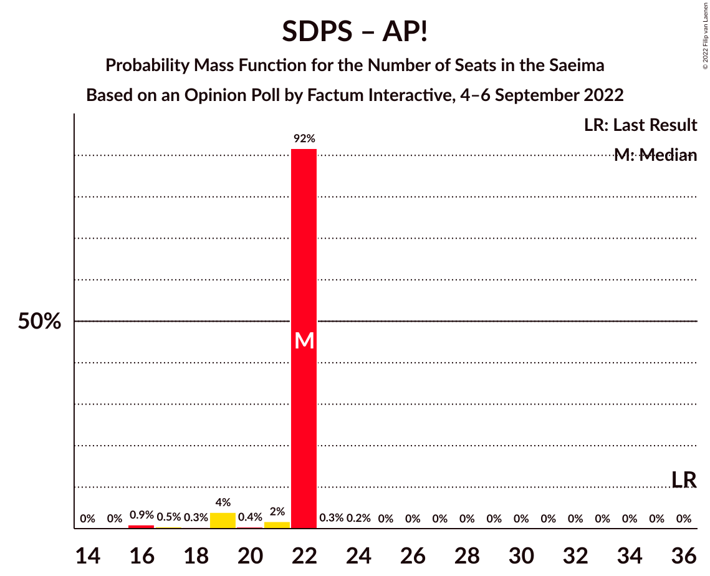

| Number of Seats | Probability | Accumulated | Special Marks |
|:---------------:|:-----------:|:-----------:|:-------------:|
| 15 | 0% | 100% |  |
| 16 | 0.9% | 99.9% |  |
| 17 | 0.5% | 99.0% |  |
| 18 | 0.3% | 98.5% |  |
| 19 | 4% | 98% |  |
| 20 | 0.4% | 94% |  |
| 21 | 2% | 94% |  |
| 22 | 92% | 92% | Median |
| 23 | 0.3% | 0.4% |  |
| 24 | 0.2% | 0.2% |  |
| 25 | 0% | 0% |  |
| 26 | 0% | 0% |  |
| 27 | 0% | 0% |  |
| 28 | 0% | 0% |  |
| 29 | 0% | 0% |  |
| 30 | 0% | 0% |  |
| 31 | 0% | 0% |  |
| 32 | 0% | 0% |  |
| 33 | 0% | 0% |  |
| 34 | 0% | 0% |  |
| 35 | 0% | 0% |  |
| 36 | 0% | 0% | Last Result |

### Sociāldemokrātiskā partija “Saskaņa” – Politiskā partija „KPV LV”

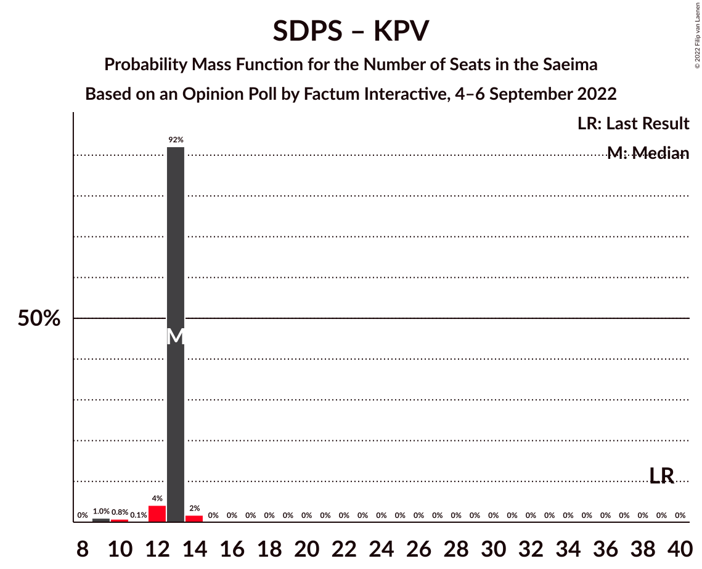

| Number of Seats | Probability | Accumulated | Special Marks |
|:---------------:|:-----------:|:-----------:|:-------------:|
| 8 | 0% | 100% |  |
| 9 | 1.0% | 99.9% |  |
| 10 | 0.8% | 98.9% |  |
| 11 | 0.1% | 98% |  |
| 12 | 4% | 98% |  |
| 13 | 92% | 94% | Median |
| 14 | 2% | 2% |  |
| 15 | 0% | 0% |  |
| 16 | 0% | 0% |  |
| 17 | 0% | 0% |  |
| 18 | 0% | 0% |  |
| 19 | 0% | 0% |  |
| 20 | 0% | 0% |  |
| 21 | 0% | 0% |  |
| 22 | 0% | 0% |  |
| 23 | 0% | 0% |  |
| 24 | 0% | 0% |  |
| 25 | 0% | 0% |  |
| 26 | 0% | 0% |  |
| 27 | 0% | 0% |  |
| 28 | 0% | 0% |  |
| 29 | 0% | 0% |  |
| 30 | 0% | 0% |  |
| 31 | 0% | 0% |  |
| 32 | 0% | 0% |  |
| 33 | 0% | 0% |  |
| 34 | 0% | 0% |  |
| 35 | 0% | 0% |  |
| 36 | 0% | 0% |  |
| 37 | 0% | 0% |  |
| 38 | 0% | 0% |  |
| 39 | 0% | 0% | Last Result |

## Technical Information

### Opinion Poll

+ **Polling firm:** Factum Interactive
+ **Commissioner(s):** —
+ **Fieldwork period:** 4–6 September 2022

### Calculations

+ **Sample size:** 1406
+ **Simulations done:** 1,048,576
+ **Error estimate:** 2.33%

