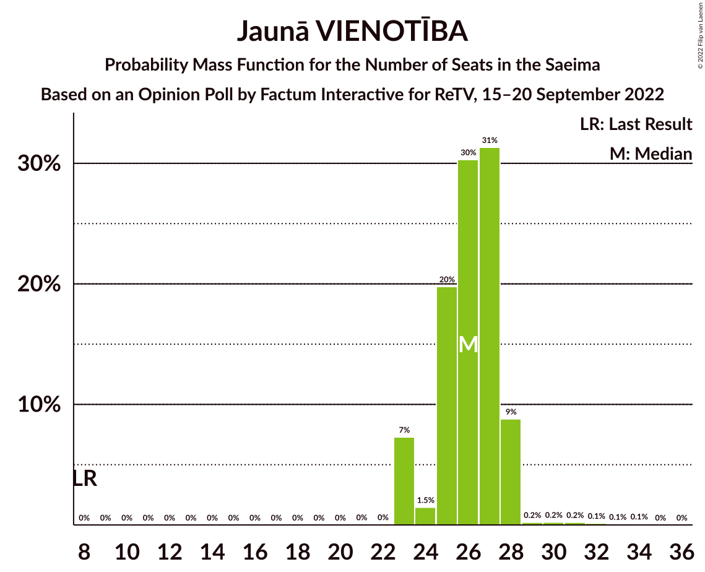
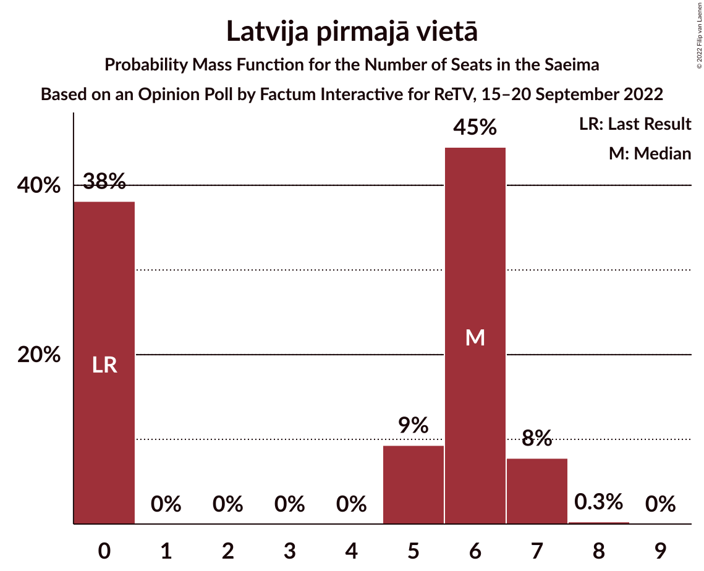
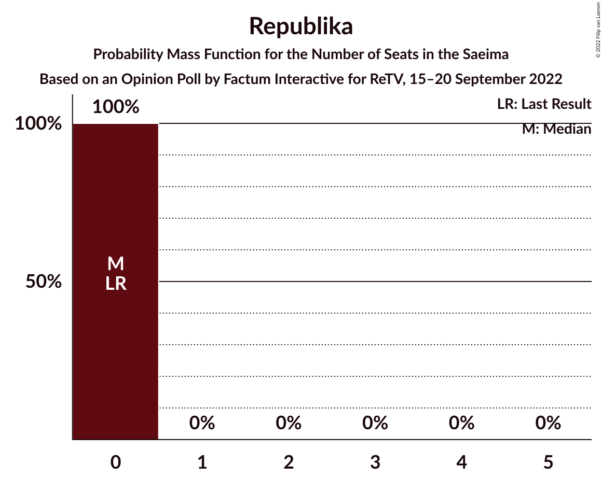
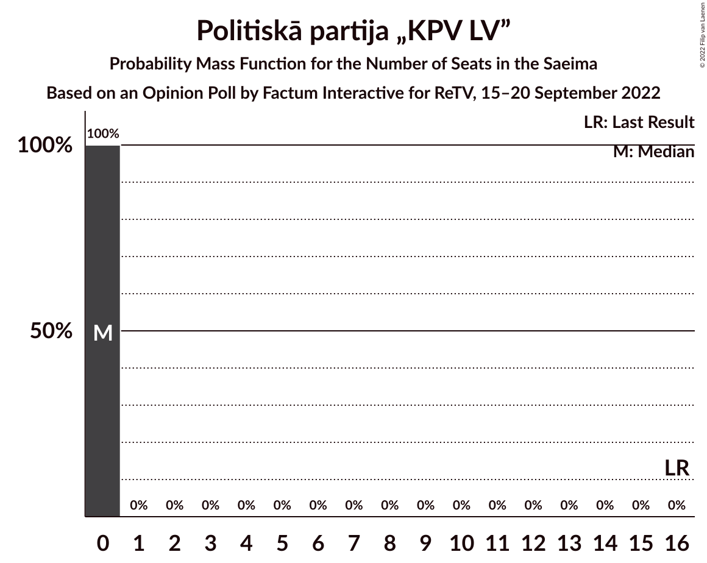

# Opinion Poll by Factum Interactive for ReTV, 15–20 September 2022

<a href="#voting-intentions">Voting Intentions</a> | <a href="#seats">Seats</a> | <a href="#coalitions">Coalitions</a> | <a href="#technical-information">Technical Information</a>

## Voting Intentions

### Confidence Intervals

| Party | Last Result | Poll Result | 80% Confidence Interval | 90% Confidence Interval | 95% Confidence Interval | 99% Confidence Interval |
|:-----:|:-----------:|:-----------:|:-----------------------:|:-----------------------:|:-----------------------:|:-----------------------:|
| Jaunā VIENOTĪBA | 6.7% | 22.6% | 21.5–23.8% |21.2–24.1% |20.9–24.4% |20.4–25.0% |
| Nacionālā apvienība „Visu Latvijai!”–„Tēvzemei un Brīvībai/LNNK” | 11.0% | 9.3% | 8.5–10.2% |8.3–10.4% |8.1–10.6% |7.8–11.0% |
| Latvijas Reģionu Apvienība | 4.1% | 9.0% | 8.3–9.9% |8.1–10.1% |7.9–10.3% |7.5–10.7% |
| PROGRESĪVIE | 2.6% | 8.8% | 8.0–9.6% |7.8–9.9% |7.7–10.1% |7.3–10.5% |
| Sociāldemokrātiskā partija “Saskaņa” | 19.8% | 8.0% | 7.3–8.8% |7.1–9.0% |6.9–9.2% |6.6–9.6% |
| Zaļo un Zemnieku savienība | 9.9% | 7.0% | 6.3–7.7% |6.1–8.0% |6.0–8.1% |5.7–8.5% |
| Attīstībai/Par! | 12.0% | 6.3% | 5.7–7.0% |5.5–7.2% |5.3–7.4% |5.1–7.8% |
| Stabilitātei! | 0.0% | 6.2% | 5.6–6.9% |5.4–7.1% |5.3–7.3% |5.0–7.7% |
| Latvija pirmajā vietā | 0.0% | 5.0% | 4.4–5.7% |4.3–5.8% |4.1–6.0% |3.9–6.3% |
| Latvijas Krievu savienība | 3.2% | 4.8% | 4.3–5.5% |4.1–5.6% |4.0–5.8% |3.7–6.1% |
| Jaunā konservatīvā partija | 13.6% | 4.6% | 4.1–5.3% |3.9–5.4% |3.8–5.6% |3.6–5.9% |
| Likums un kārtība | 0.0% | 4.0% | 3.5–4.6% |3.4–4.8% |3.3–4.9% |3.0–5.2% |
| Suverēnā vara | 0.0% | 1.4% | 1.1–1.8% |1.0–1.9% |1.0–2.0% |0.9–2.2% |
| Republika | 0.0% | 1.0% | 0.8–1.4% |0.7–1.5% |0.7–1.5% |0.6–1.7% |
| Politiskā partija „KPV LV” | 14.2% | 0.3% | 0.2–0.5% |0.1–0.5% |0.1–0.6% |0.1–0.7% |

*Note:* The poll result column reflects the actual value used in the calculations. Published results may vary slightly, and in addition be rounded to fewer digits.

## Seats

### Confidence Intervals

| Party | Last Result | Median | 80% Confidence Interval | 90% Confidence Interval | 95% Confidence Interval | 99% Confidence Interval |
|:-----:|:-----------:|:------:|:-----------------------:|:-----------------------:|:-----------------------:|:-----------------------:|
| <a href="#jaunā-vienotība">Jaunā VIENOTĪBA</a> | 8 | 26 | 25–27 |23–28 |23–28 |23–31 |
| <a href="#nacionālā-apvienība-„visu-latvijai!”–„tēvzemei-un-brīvībai/lnnk”">Nacionālā apvienība „Visu Latvijai!”–„Tēvzemei un Brīvībai/LNNK”</a> | 13 | 11 | 10–12 |10–12 |9–13 |9–13 |
| <a href="#latvijas-reģionu-apvienība">Latvijas Reģionu Apvienība</a> | 0 | 11 | 10–12 |9–13 |8–13 |7–13 |
| <a href="#progresīvie">PROGRESĪVIE</a> | 0 | 11 | 8–12 |8–12 |8–12 |8–14 |
| <a href="#sociāldemokrātiskā-partija-“saskaņa”">Sociāldemokrātiskā partija “Saskaņa”</a> | 23 | 10 | 9–12 |9–13 |8–13 |7–13 |
| <a href="#zaļo-un-zemnieku-savienība">Zaļo un Zemnieku savienība</a> | 11 | 9 | 6–11 |6–11 |6–11 |6–11 |
| <a href="#attīstībai/par!">Attīstībai/Par!</a> | 13 | 7 | 7–8 |7–9 |6–9 |6–10 |
| <a href="#stabilitātei!">Stabilitātei!</a> | 0 | 8 | 7–9 |5–9 |5–10 |0–10 |
| <a href="#latvija-pirmajā-vietā">Latvija pirmajā vietā</a> | 0 | 6 | 0–6 |0–7 |0–7 |0–7 |
| <a href="#latvijas-krievu-savienība">Latvijas Krievu savienība</a> | 0 | 0 | 0–8 |0–8 |0–8 |0–8 |
| <a href="#jaunā-konservatīvā-partija">Jaunā konservatīvā partija</a> | 16 | 0 | 0–7 |0–7 |0–7 |0–7 |
| <a href="#likums-un-kārtība">Likums un kārtība</a> | 0 | 0 | 0 |0–5 |0–5 |0–6 |
| <a href="#suverēnā-vara">Suverēnā vara</a> | 0 | 0 | 0 |0 |0 |0 |
| <a href="#republika">Republika</a> | 0 | 0 | 0 |0 |0 |0 |
| <a href="#politiskā-partija-„kpv-lv”">Politiskā partija „KPV LV”</a> | 16 | 0 | 0 |0 |0 |0 |

### Jaunā VIENOTĪBA

*For a full overview of the results for this party, see the [Jaunā VIENOTĪBA](party-jaunāvienotība.html) page.*

| Number of Seats | Probability | Accumulated | Special Marks |
|:---------------:|:-----------:|:-----------:|:-------------:|
| 8 | 0% | 100% | Last Result |
| 9 | 0% | 100% |  |
| 10 | 0% | 100% |  |
| 11 | 0% | 100% |  |
| 12 | 0% | 100% |  |
| 13 | 0% | 100% |  |
| 14 | 0% | 100% |  |
| 15 | 0% | 100% |  |
| 16 | 0% | 100% |  |
| 17 | 0% | 100% |  |
| 18 | 0% | 100% |  |
| 19 | 0% | 100% |  |
| 20 | 0% | 100% |  |
| 21 | 0% | 100% |  |
| 22 | 0% | 100% |  |
| 23 | 7% | 99.9% |  |
| 24 | 1.5% | 93% |  |
| 25 | 20% | 91% |  |
| 26 | 30% | 71% | Median |
| 27 | 31% | 41% |  |
| 28 | 9% | 10% |  |
| 29 | 0.2% | 1.0% |  |
| 30 | 0.2% | 0.8% |  |
| 31 | 0.2% | 0.5% |  |
| 32 | 0.1% | 0.3% |  |
| 33 | 0.1% | 0.2% |  |
| 34 | 0.1% | 0.1% |  |
| 35 | 0% | 0% |  |

### Nacionālā apvienība „Visu Latvijai!”–„Tēvzemei un Brīvībai/LNNK”

*For a full overview of the results for this party, see the [Nacionālā apvienība „Visu Latvijai!”–„Tēvzemei un Brīvībai/LNNK”](party-nacionālāapvienība„visulatvijai”–„tēvzemeiunbrīvībailnnk”.html) page.*

| Number of Seats | Probability | Accumulated | Special Marks |
|:---------------:|:-----------:|:-----------:|:-------------:|
| 7 | 0.4% | 100% |  |
| 8 | 0% | 99.6% |  |
| 9 | 2% | 99.6% |  |
| 10 | 19% | 97% |  |
| 11 | 28% | 78% | Median |
| 12 | 46% | 50% |  |
| 13 | 4% | 4% | Last Result |
| 14 | 0% | 0% |  |

### Latvijas Reģionu Apvienība

*For a full overview of the results for this party, see the [Latvijas Reģionu Apvienība](party-latvijasreģionuapvienība.html) page.*

| Number of Seats | Probability | Accumulated | Special Marks |
|:---------------:|:-----------:|:-----------:|:-------------:|
| 0 | 0% | 100% | Last Result |
| 1 | 0% | 100% |  |
| 2 | 0% | 100% |  |
| 3 | 0% | 100% |  |
| 4 | 0% | 100% |  |
| 5 | 0% | 100% |  |
| 6 | 0% | 100% |  |
| 7 | 0.8% | 100% |  |
| 8 | 2% | 99.2% |  |
| 9 | 6% | 97% |  |
| 10 | 26% | 91% |  |
| 11 | 42% | 65% | Median |
| 12 | 13% | 23% |  |
| 13 | 10% | 10% |  |
| 14 | 0.1% | 0.1% |  |
| 15 | 0% | 0% |  |

### PROGRESĪVIE

*For a full overview of the results for this party, see the [PROGRESĪVIE](party-progresīvie.html) page.*

| Number of Seats | Probability | Accumulated | Special Marks |
|:---------------:|:-----------:|:-----------:|:-------------:|
| 0 | 0% | 100% | Last Result |
| 1 | 0% | 100% |  |
| 2 | 0% | 100% |  |
| 3 | 0% | 100% |  |
| 4 | 0% | 100% |  |
| 5 | 0% | 100% |  |
| 6 | 0% | 100% |  |
| 7 | 0% | 100% |  |
| 8 | 16% | 100% |  |
| 9 | 6% | 84% |  |
| 10 | 23% | 78% |  |
| 11 | 42% | 55% | Median |
| 12 | 11% | 13% |  |
| 13 | 1.0% | 2% |  |
| 14 | 0.5% | 0.6% |  |
| 15 | 0% | 0% |  |

### Sociāldemokrātiskā partija “Saskaņa”

*For a full overview of the results for this party, see the [Sociāldemokrātiskā partija “Saskaņa”](party-sociāldemokrātiskāpartija“saskaņa”.html) page.*

| Number of Seats | Probability | Accumulated | Special Marks |
|:---------------:|:-----------:|:-----------:|:-------------:|
| 7 | 0.8% | 100% |  |
| 8 | 3% | 99.2% |  |
| 9 | 28% | 96% |  |
| 10 | 30% | 68% | Median |
| 11 | 25% | 38% |  |
| 12 | 4% | 13% |  |
| 13 | 8% | 9% |  |
| 14 | 0.1% | 0.1% |  |
| 15 | 0% | 0% |  |
| 16 | 0% | 0% |  |
| 17 | 0% | 0% |  |
| 18 | 0% | 0% |  |
| 19 | 0% | 0% |  |
| 20 | 0% | 0% |  |
| 21 | 0% | 0% |  |
| 22 | 0% | 0% |  |
| 23 | 0% | 0% | Last Result |

### Zaļo un Zemnieku savienība

*For a full overview of the results for this party, see the [Zaļo un Zemnieku savienība](party-zaļounzemniekusavienība.html) page.*

| Number of Seats | Probability | Accumulated | Special Marks |
|:---------------:|:-----------:|:-----------:|:-------------:|
| 6 | 19% | 100% |  |
| 7 | 11% | 81% |  |
| 8 | 19% | 70% |  |
| 9 | 4% | 50% | Median |
| 10 | 29% | 46% |  |
| 11 | 17% | 17% | Last Result |
| 12 | 0% | 0% |  |

### Attīstībai/Par!

*For a full overview of the results for this party, see the [Attīstībai/Par!](party-attīstībaipar.html) page.*

| Number of Seats | Probability | Accumulated | Special Marks |
|:---------------:|:-----------:|:-----------:|:-------------:|
| 0 | 0.2% | 100% |  |
| 1 | 0% | 99.8% |  |
| 2 | 0% | 99.8% |  |
| 3 | 0% | 99.8% |  |
| 4 | 0% | 99.8% |  |
| 5 | 0% | 99.8% |  |
| 6 | 4% | 99.8% |  |
| 7 | 61% | 95% | Median |
| 8 | 27% | 34% |  |
| 9 | 6% | 8% |  |
| 10 | 2% | 2% |  |
| 11 | 0% | 0% |  |
| 12 | 0% | 0% |  |
| 13 | 0% | 0% | Last Result |

### Stabilitātei!

*For a full overview of the results for this party, see the [Stabilitātei!](party-stabilitātei.html) page.*

| Number of Seats | Probability | Accumulated | Special Marks |
|:---------------:|:-----------:|:-----------:|:-------------:|
| 0 | 1.2% | 100% | Last Result |
| 1 | 0% | 98.8% |  |
| 2 | 0% | 98.8% |  |
| 3 | 0% | 98.8% |  |
| 4 | 0% | 98.8% |  |
| 5 | 5% | 98.8% |  |
| 6 | 1.0% | 94% |  |
| 7 | 32% | 93% |  |
| 8 | 44% | 61% | Median |
| 9 | 14% | 17% |  |
| 10 | 3% | 3% |  |
| 11 | 0% | 0.1% |  |
| 12 | 0% | 0% |  |

### Latvija pirmajā vietā

*For a full overview of the results for this party, see the [Latvija pirmajā vietā](party-latvijapirmajāvietā.html) page.*

| Number of Seats | Probability | Accumulated | Special Marks |
|:---------------:|:-----------:|:-----------:|:-------------:|
| 0 | 38% | 100% | Last Result |
| 1 | 0% | 62% |  |
| 2 | 0% | 62% |  |
| 3 | 0% | 62% |  |
| 4 | 0% | 62% |  |
| 5 | 9% | 62% |  |
| 6 | 45% | 53% | Median |
| 7 | 8% | 8% |  |
| 8 | 0.3% | 0.3% |  |
| 9 | 0% | 0% |  |

### Latvijas Krievu savienība

*For a full overview of the results for this party, see the [Latvijas Krievu savienība](party-latvijaskrievusavienība.html) page.*

| Number of Seats | Probability | Accumulated | Special Marks |
|:---------------:|:-----------:|:-----------:|:-------------:|
| 0 | 71% | 100% | Last Result, Median |
| 1 | 0% | 29% |  |
| 2 | 0% | 29% |  |
| 3 | 0% | 29% |  |
| 4 | 0% | 29% |  |
| 5 | 0.7% | 29% |  |
| 6 | 7% | 29% |  |
| 7 | 4% | 22% |  |
| 8 | 18% | 18% |  |
| 9 | 0% | 0% |  |

### Jaunā konservatīvā partija

*For a full overview of the results for this party, see the [Jaunā konservatīvā partija](party-jaunākonservatīvāpartija.html) page.*

| Number of Seats | Probability | Accumulated | Special Marks |
|:---------------:|:-----------:|:-----------:|:-------------:|
| 0 | 81% | 100% | Median |
| 1 | 0% | 19% |  |
| 2 | 0% | 19% |  |
| 3 | 0% | 19% |  |
| 4 | 0% | 19% |  |
| 5 | 0% | 19% |  |
| 6 | 6% | 19% |  |
| 7 | 12% | 12% |  |
| 8 | 0% | 0% |  |
| 9 | 0% | 0% |  |
| 10 | 0% | 0% |  |
| 11 | 0% | 0% |  |
| 12 | 0% | 0% |  |
| 13 | 0% | 0% |  |
| 14 | 0% | 0% |  |
| 15 | 0% | 0% |  |
| 16 | 0% | 0% | Last Result |

### Likums un kārtība

*For a full overview of the results for this party, see the [Likums un kārtība](party-likumsunkārtība.html) page.*

| Number of Seats | Probability | Accumulated | Special Marks |
|:---------------:|:-----------:|:-----------:|:-------------:|
| 0 | 91% | 100% | Last Result, Median |
| 1 | 0% | 9% |  |
| 2 | 0% | 9% |  |
| 3 | 0% | 9% |  |
| 4 | 0% | 9% |  |
| 5 | 8% | 9% |  |
| 6 | 0.5% | 0.6% |  |
| 7 | 0% | 0% |  |

### Suverēnā vara

*For a full overview of the results for this party, see the [Suverēnā vara](party-suverēnāvara.html) page.*

| Number of Seats | Probability | Accumulated | Special Marks |
|:---------------:|:-----------:|:-----------:|:-------------:|
| 0 | 100% | 100% | Last Result, Median |

### Republika

*For a full overview of the results for this party, see the [Republika](party-republika.html) page.*

| Number of Seats | Probability | Accumulated | Special Marks |
|:---------------:|:-----------:|:-----------:|:-------------:|
| 0 | 100% | 100% | Last Result, Median |

### Politiskā partija „KPV LV”

*For a full overview of the results for this party, see the [Politiskā partija „KPV LV”](party-politiskāpartija„kpvlv”.html) page.*

| Number of Seats | Probability | Accumulated | Special Marks |
|:---------------:|:-----------:|:-----------:|:-------------:|
| 0 | 100% | 100% | Median |
| 1 | 0% | 0% |  |
| 2 | 0% | 0% |  |
| 3 | 0% | 0% |  |
| 4 | 0% | 0% |  |
| 5 | 0% | 0% |  |
| 6 | 0% | 0% |  |
| 7 | 0% | 0% |  |
| 8 | 0% | 0% |  |
| 9 | 0% | 0% |  |
| 10 | 0% | 0% |  |
| 11 | 0% | 0% |  |
| 12 | 0% | 0% |  |
| 13 | 0% | 0% |  |
| 14 | 0% | 0% |  |
| 15 | 0% | 0% |  |
| 16 | 0% | 0% | Last Result |

## Coalitions

### Confidence Intervals

| Coalition | Last Result | Median | Majority? | 80% Confidence Interval | 90% Confidence Interval | 95% Confidence Interval | 99% Confidence Interval |
|:---------:|:-----------:|:------:|:---------:|:-----------------------:|:-----------------------:|:-----------------------:|:-----------------------:|
| Jaunā VIENOTĪBA – Nacionālā apvienība „Visu Latvijai!”–„Tēvzemei un Brīvībai/LNNK” – Zaļo un Zemnieku savienība – Attīstībai/Par! – Jaunā konservatīvā partija | 61 | 55 | 91% | 51–57 | 50–59 | 49–62 | 49–64 |
| Jaunā VIENOTĪBA – Nacionālā apvienība „Visu Latvijai!”–„Tēvzemei un Brīvībai/LNNK” – Zaļo un Zemnieku savienība – Attīstībai/Par! | 45 | 54 | 80% | 49–56 | 48–56 | 48–57 | 47–59 |
| Jaunā VIENOTĪBA – Nacionālā apvienība „Visu Latvijai!”–„Tēvzemei un Brīvībai/LNNK” – Zaļo un Zemnieku savienība – Jaunā konservatīvā partija | 48 | 47 | 9% | 44–49 | 43–53 | 42–54 | 42–55 |
| Jaunā VIENOTĪBA – Nacionālā apvienība „Visu Latvijai!”–„Tēvzemei un Brīvībai/LNNK” – Attīstībai/Par! – Jaunā konservatīvā partija | 50 | 46 | 5% | 44–48 | 43–50 | 43–53 | 40–56 |
| Jaunā VIENOTĪBA – Nacionālā apvienība „Visu Latvijai!”–„Tēvzemei un Brīvībai/LNNK” – Attīstībai/Par! – Jaunā konservatīvā partija – Politiskā partija „KPV LV” | 66 | 46 | 5% | 44–48 | 43–50 | 43–53 | 40–56 |
| Jaunā VIENOTĪBA – Nacionālā apvienība „Visu Latvijai!”–„Tēvzemei un Brīvībai/LNNK” – Zaļo un Zemnieku savienība | 32 | 47 | 0.8% | 42–48 | 41–48 | 41–49 | 40–52 |
| Jaunā VIENOTĪBA – Nacionālā apvienība „Visu Latvijai!”–„Tēvzemei un Brīvībai/LNNK” – Attīstībai/Par! – Politiskā partija „KPV LV” | 50 | 45 | 0.4% | 42–47 | 41–47 | 41–48 | 40–50 |
| Jaunā VIENOTĪBA – Nacionālā apvienība „Visu Latvijai!”–„Tēvzemei un Brīvībai/LNNK” – Jaunā konservatīvā partija – Politiskā partija „KPV LV” | 53 | 38 | 0.1% | 37–42 | 36–43 | 36–46 | 33–48 |
| Jaunā VIENOTĪBA – Attīstībai/Par! – Jaunā konservatīvā partija – Politiskā partija „KPV LV” | 53 | 35 | 0% | 32–38 | 32–39 | 32–41 | 31–45 |
| Nacionālā apvienība „Visu Latvijai!”–„Tēvzemei un Brīvībai/LNNK” – Zaļo un Zemnieku savienība – Attīstībai/Par! – Jaunā konservatīvā partija | 53 | 29 | 0% | 24–32 | 24–33 | 24–34 | 22–36 |
| Nacionālā apvienība „Visu Latvijai!”–„Tēvzemei un Brīvībai/LNNK” – Zaļo un Zemnieku savienība – Attīstībai/Par! | 37 | 28 | 0% | 24–29 | 24–29 | 24–30 | 21–32 |
| Nacionālā apvienība „Visu Latvijai!”–„Tēvzemei un Brīvībai/LNNK” – Zaļo un Zemnieku savienība – Jaunā konservatīvā partija | 40 | 21 | 0% | 17–25 | 17–27 | 17–27 | 15–28 |
| Nacionālā apvienība „Visu Latvijai!”–„Tēvzemei un Brīvībai/LNNK” – Attīstībai/Par! – Jaunā konservatīvā partija – Politiskā partija „KPV LV” | 58 | 19 | 0% | 18–25 | 17–25 | 16–27 | 16–28 |
| Sociāldemokrātiskā partija “Saskaņa” – Attīstībai/Par! – Jaunā konservatīvā partija | 52 | 18 | 0% | 17–23 | 17–23 | 15–24 | 15–26 |
| Sociāldemokrātiskā partija “Saskaņa” – Zaļo un Zemnieku savienība – Politiskā partija „KPV LV” | 50 | 19 | 0% | 16–22 | 16–23 | 14–23 | 14–23 |
| Sociāldemokrātiskā partija “Saskaņa” – Attīstībai/Par! | 36 | 17 | 0% | 16–20 | 16–21 | 15–21 | 14–21 |
| Sociāldemokrātiskā partija “Saskaņa” – Politiskā partija „KPV LV” | 39 | 10 | 0% | 9–12 | 9–13 | 8–13 | 7–13 |

### Jaunā VIENOTĪBA – Nacionālā apvienība „Visu Latvijai!”–„Tēvzemei un Brīvībai/LNNK” – Zaļo un Zemnieku savienība – Attīstībai/Par! – Jaunā konservatīvā partija

| Number of Seats | Probability | Accumulated | Special Marks |
|:---------------:|:-----------:|:-----------:|:-------------:|
| 47 | 0.4% | 100% |  |
| 48 | 0% | 99.6% |  |
| 49 | 3% | 99.6% |  |
| 50 | 5% | 97% |  |
| 51 | 2% | 91% | Majority |
| 52 | 6% | 89% |  |
| 53 | 0.5% | 83% | Median |
| 54 | 19% | 82% |  |
| 55 | 42% | 63% |  |
| 56 | 10% | 21% |  |
| 57 | 1.1% | 11% |  |
| 58 | 2% | 9% |  |
| 59 | 4% | 7% |  |
| 60 | 0.5% | 4% |  |
| 61 | 0.2% | 3% | Last Result |
| 62 | 2% | 3% |  |
| 63 | 0% | 1.1% |  |
| 64 | 1.0% | 1.1% |  |
| 65 | 0.1% | 0.1% |  |
| 66 | 0% | 0% |  |

### Jaunā VIENOTĪBA – Nacionālā apvienība „Visu Latvijai!”–„Tēvzemei un Brīvībai/LNNK” – Zaļo un Zemnieku savienība – Attīstībai/Par!

| Number of Seats | Probability | Accumulated | Special Marks |
|:---------------:|:-----------:|:-----------:|:-------------:|
| 45 | 0.2% | 100% | Last Result |
| 46 | 0.1% | 99.8% |  |
| 47 | 0.4% | 99.7% |  |
| 48 | 7% | 99.3% |  |
| 49 | 4% | 92% |  |
| 50 | 8% | 88% |  |
| 51 | 3% | 80% | Majority |
| 52 | 7% | 77% |  |
| 53 | 4% | 70% | Median |
| 54 | 19% | 67% |  |
| 55 | 36% | 47% |  |
| 56 | 8% | 11% |  |
| 57 | 2% | 4% |  |
| 58 | 1.0% | 2% |  |
| 59 | 0.3% | 0.8% |  |
| 60 | 0.2% | 0.5% |  |
| 61 | 0.2% | 0.3% |  |
| 62 | 0% | 0% |  |

### Jaunā VIENOTĪBA – Nacionālā apvienība „Visu Latvijai!”–„Tēvzemei un Brīvībai/LNNK” – Zaļo un Zemnieku savienība – Jaunā konservatīvā partija

| Number of Seats | Probability | Accumulated | Special Marks |
|:---------------:|:-----------:|:-----------:|:-------------:|
| 40 | 0.4% | 100% |  |
| 41 | 0% | 99.6% |  |
| 42 | 3% | 99.6% |  |
| 43 | 5% | 97% |  |
| 44 | 2% | 92% |  |
| 45 | 7% | 90% |  |
| 46 | 5% | 83% | Median |
| 47 | 41% | 77% |  |
| 48 | 22% | 37% | Last Result |
| 49 | 5% | 14% |  |
| 50 | 0.4% | 9% |  |
| 51 | 1.5% | 9% | Majority |
| 52 | 0.5% | 7% |  |
| 53 | 4% | 7% |  |
| 54 | 0.9% | 3% |  |
| 55 | 2% | 2% |  |
| 56 | 0% | 0.5% |  |
| 57 | 0.4% | 0.5% |  |
| 58 | 0% | 0% |  |

### Jaunā VIENOTĪBA – Nacionālā apvienība „Visu Latvijai!”–„Tēvzemei un Brīvībai/LNNK” – Attīstībai/Par! – Jaunā konservatīvā partija

| Number of Seats | Probability | Accumulated | Special Marks |
|:---------------:|:-----------:|:-----------:|:-------------:|
| 40 | 0.9% | 100% |  |
| 41 | 1.0% | 99.0% |  |
| 42 | 0.4% | 98% |  |
| 43 | 6% | 98% |  |
| 44 | 21% | 92% | Median |
| 45 | 20% | 70% |  |
| 46 | 11% | 50% |  |
| 47 | 20% | 40% |  |
| 48 | 11% | 20% |  |
| 49 | 1.5% | 9% |  |
| 50 | 3% | 8% | Last Result |
| 51 | 0.7% | 5% | Majority |
| 52 | 1.2% | 4% |  |
| 53 | 0.4% | 3% |  |
| 54 | 0.1% | 2% |  |
| 55 | 2% | 2% |  |
| 56 | 0.6% | 0.8% |  |
| 57 | 0% | 0.1% |  |
| 58 | 0% | 0.1% |  |
| 59 | 0.1% | 0.1% |  |
| 60 | 0% | 0% |  |

### Jaunā VIENOTĪBA – Nacionālā apvienība „Visu Latvijai!”–„Tēvzemei un Brīvībai/LNNK” – Attīstībai/Par! – Jaunā konservatīvā partija – Politiskā partija „KPV LV”

| Number of Seats | Probability | Accumulated | Special Marks |
|:---------------:|:-----------:|:-----------:|:-------------:|
| 40 | 0.9% | 100% |  |
| 41 | 1.0% | 99.0% |  |
| 42 | 0.4% | 98% |  |
| 43 | 6% | 98% |  |
| 44 | 21% | 92% | Median |
| 45 | 20% | 70% |  |
| 46 | 11% | 50% |  |
| 47 | 20% | 40% |  |
| 48 | 11% | 20% |  |
| 49 | 1.5% | 9% |  |
| 50 | 3% | 8% |  |
| 51 | 0.7% | 5% | Majority |
| 52 | 1.2% | 4% |  |
| 53 | 0.4% | 3% |  |
| 54 | 0.1% | 2% |  |
| 55 | 2% | 2% |  |
| 56 | 0.6% | 0.8% |  |
| 57 | 0% | 0.1% |  |
| 58 | 0% | 0.1% |  |
| 59 | 0.1% | 0.1% |  |
| 60 | 0% | 0% |  |
| 61 | 0% | 0% |  |
| 62 | 0% | 0% |  |
| 63 | 0% | 0% |  |
| 64 | 0% | 0% |  |
| 65 | 0% | 0% |  |
| 66 | 0% | 0% | Last Result |

### Jaunā VIENOTĪBA – Nacionālā apvienība „Visu Latvijai!”–„Tēvzemei un Brīvībai/LNNK” – Zaļo un Zemnieku savienība

| Number of Seats | Probability | Accumulated | Special Marks |
|:---------------:|:-----------:|:-----------:|:-------------:|
| 32 | 0% | 100% | Last Result |
| 33 | 0% | 100% |  |
| 34 | 0% | 100% |  |
| 35 | 0% | 100% |  |
| 36 | 0% | 100% |  |
| 37 | 0% | 100% |  |
| 38 | 0% | 100% |  |
| 39 | 0.2% | 99.9% |  |
| 40 | 0.4% | 99.8% |  |
| 41 | 7% | 99.4% |  |
| 42 | 4% | 92% |  |
| 43 | 8% | 88% |  |
| 44 | 3% | 81% |  |
| 45 | 7% | 78% |  |
| 46 | 6% | 70% | Median |
| 47 | 44% | 65% |  |
| 48 | 16% | 20% |  |
| 49 | 2% | 4% |  |
| 50 | 0.8% | 2% |  |
| 51 | 0.3% | 0.8% | Majority |
| 52 | 0.1% | 0.5% |  |
| 53 | 0.2% | 0.4% |  |
| 54 | 0.2% | 0.2% |  |
| 55 | 0% | 0% |  |

### Jaunā VIENOTĪBA – Nacionālā apvienība „Visu Latvijai!”–„Tēvzemei un Brīvībai/LNNK” – Attīstībai/Par! – Politiskā partija „KPV LV”

| Number of Seats | Probability | Accumulated | Special Marks |
|:---------------:|:-----------:|:-----------:|:-------------:|
| 38 | 0.1% | 100% |  |
| 39 | 0.2% | 99.9% |  |
| 40 | 1.0% | 99.7% |  |
| 41 | 8% | 98.7% |  |
| 42 | 4% | 90% |  |
| 43 | 7% | 87% |  |
| 44 | 24% | 80% | Median |
| 45 | 21% | 55% |  |
| 46 | 11% | 34% |  |
| 47 | 20% | 23% |  |
| 48 | 2% | 4% |  |
| 49 | 1.2% | 2% |  |
| 50 | 0.2% | 0.6% | Last Result |
| 51 | 0.1% | 0.4% | Majority |
| 52 | 0.2% | 0.4% |  |
| 53 | 0% | 0.1% |  |
| 54 | 0.1% | 0.1% |  |
| 55 | 0% | 0% |  |

### Jaunā VIENOTĪBA – Nacionālā apvienība „Visu Latvijai!”–„Tēvzemei un Brīvībai/LNNK” – Jaunā konservatīvā partija – Politiskā partija „KPV LV”

| Number of Seats | Probability | Accumulated | Special Marks |
|:---------------:|:-----------:|:-----------:|:-------------:|
| 33 | 0.9% | 100% |  |
| 34 | 1.0% | 99.1% |  |
| 35 | 0.3% | 98% |  |
| 36 | 7% | 98% |  |
| 37 | 33% | 90% | Median |
| 38 | 12% | 57% |  |
| 39 | 25% | 45% |  |
| 40 | 0.5% | 20% |  |
| 41 | 7% | 20% |  |
| 42 | 4% | 12% |  |
| 43 | 3% | 8% |  |
| 44 | 0.4% | 5% |  |
| 45 | 1.5% | 4% |  |
| 46 | 1.0% | 3% |  |
| 47 | 0.2% | 2% |  |
| 48 | 2% | 2% |  |
| 49 | 0% | 0.1% |  |
| 50 | 0% | 0.1% |  |
| 51 | 0.1% | 0.1% | Majority |
| 52 | 0% | 0% |  |
| 53 | 0% | 0% | Last Result |

### Jaunā VIENOTĪBA – Attīstībai/Par! – Jaunā konservatīvā partija – Politiskā partija „KPV LV”

| Number of Seats | Probability | Accumulated | Special Marks |
|:---------------:|:-----------:|:-----------:|:-------------:|
| 28 | 0.1% | 100% |  |
| 29 | 0% | 99.9% |  |
| 30 | 0.1% | 99.9% |  |
| 31 | 1.0% | 99.8% |  |
| 32 | 17% | 98.8% |  |
| 33 | 20% | 82% | Median |
| 34 | 4% | 63% |  |
| 35 | 37% | 59% |  |
| 36 | 2% | 22% |  |
| 37 | 8% | 20% |  |
| 38 | 7% | 12% |  |
| 39 | 0.6% | 5% |  |
| 40 | 0.7% | 4% |  |
| 41 | 1.2% | 4% |  |
| 42 | 2% | 2% |  |
| 43 | 0% | 0.8% |  |
| 44 | 0% | 0.8% |  |
| 45 | 0.6% | 0.7% |  |
| 46 | 0.1% | 0.1% |  |
| 47 | 0% | 0% |  |
| 48 | 0% | 0% |  |
| 49 | 0% | 0% |  |
| 50 | 0% | 0% |  |
| 51 | 0% | 0% | Majority |
| 52 | 0% | 0% |  |
| 53 | 0% | 0% | Last Result |

### Nacionālā apvienība „Visu Latvijai!”–„Tēvzemei un Brīvībai/LNNK” – Zaļo un Zemnieku savienība – Attīstībai/Par! – Jaunā konservatīvā partija

| Number of Seats | Probability | Accumulated | Special Marks |
|:---------------:|:-----------:|:-----------:|:-------------:|
| 21 | 0.4% | 100% |  |
| 22 | 0.6% | 99.6% |  |
| 23 | 0.5% | 99.0% |  |
| 24 | 12% | 98.5% |  |
| 25 | 1.5% | 86% |  |
| 26 | 1.3% | 85% |  |
| 27 | 4% | 83% | Median |
| 28 | 25% | 79% |  |
| 29 | 31% | 54% |  |
| 30 | 3% | 23% |  |
| 31 | 5% | 20% |  |
| 32 | 8% | 15% |  |
| 33 | 3% | 7% |  |
| 34 | 2% | 4% |  |
| 35 | 0.7% | 2% |  |
| 36 | 0.7% | 1.0% |  |
| 37 | 0% | 0.3% |  |
| 38 | 0.3% | 0.3% |  |
| 39 | 0% | 0% |  |
| 40 | 0% | 0% |  |
| 41 | 0% | 0% |  |
| 42 | 0% | 0% |  |
| 43 | 0% | 0% |  |
| 44 | 0% | 0% |  |
| 45 | 0% | 0% |  |
| 46 | 0% | 0% |  |
| 47 | 0% | 0% |  |
| 48 | 0% | 0% |  |
| 49 | 0% | 0% |  |
| 50 | 0% | 0% |  |
| 51 | 0% | 0% | Majority |
| 52 | 0% | 0% |  |
| 53 | 0% | 0% | Last Result |

### Nacionālā apvienība „Visu Latvijai!”–„Tēvzemei un Brīvībai/LNNK” – Zaļo un Zemnieku savienība – Attīstībai/Par!

| Number of Seats | Probability | Accumulated | Special Marks |
|:---------------:|:-----------:|:-----------:|:-------------:|
| 18 | 0.1% | 100% |  |
| 19 | 0% | 99.9% |  |
| 20 | 0% | 99.9% |  |
| 21 | 0.5% | 99.8% |  |
| 22 | 0.6% | 99.3% |  |
| 23 | 0.5% | 98.7% |  |
| 24 | 14% | 98% |  |
| 25 | 11% | 84% |  |
| 26 | 1.4% | 73% |  |
| 27 | 9% | 71% | Median |
| 28 | 26% | 62% |  |
| 29 | 31% | 36% |  |
| 30 | 3% | 5% |  |
| 31 | 1.3% | 2% |  |
| 32 | 0.9% | 0.9% |  |
| 33 | 0% | 0% |  |
| 34 | 0% | 0% |  |
| 35 | 0% | 0% |  |
| 36 | 0% | 0% |  |
| 37 | 0% | 0% | Last Result |

### Nacionālā apvienība „Visu Latvijai!”–„Tēvzemei un Brīvībai/LNNK” – Zaļo un Zemnieku savienība – Jaunā konservatīvā partija

| Number of Seats | Probability | Accumulated | Special Marks |
|:---------------:|:-----------:|:-----------:|:-------------:|
| 14 | 0.3% | 100% |  |
| 15 | 0.6% | 99.7% |  |
| 16 | 0.4% | 99.1% |  |
| 17 | 12% | 98.6% |  |
| 18 | 2% | 86% |  |
| 19 | 0.8% | 84% |  |
| 20 | 30% | 83% | Median |
| 21 | 10% | 54% |  |
| 22 | 23% | 44% |  |
| 23 | 3% | 21% |  |
| 24 | 4% | 18% |  |
| 25 | 8% | 14% |  |
| 26 | 0.8% | 7% |  |
| 27 | 5% | 6% |  |
| 28 | 0.7% | 1.0% |  |
| 29 | 0% | 0.4% |  |
| 30 | 0% | 0.4% |  |
| 31 | 0.3% | 0.3% |  |
| 32 | 0% | 0% |  |
| 33 | 0% | 0% |  |
| 34 | 0% | 0% |  |
| 35 | 0% | 0% |  |
| 36 | 0% | 0% |  |
| 37 | 0% | 0% |  |
| 38 | 0% | 0% |  |
| 39 | 0% | 0% |  |
| 40 | 0% | 0% | Last Result |

### Nacionālā apvienība „Visu Latvijai!”–„Tēvzemei un Brīvībai/LNNK” – Attīstībai/Par! – Jaunā konservatīvā partija – Politiskā partija „KPV LV”

| Number of Seats | Probability | Accumulated | Special Marks |
|:---------------:|:-----------:|:-----------:|:-------------:|
| 12 | 0% | 100% |  |
| 13 | 0% | 99.9% |  |
| 14 | 0.3% | 99.9% |  |
| 15 | 0% | 99.6% |  |
| 16 | 2% | 99.5% |  |
| 17 | 7% | 97% |  |
| 18 | 21% | 91% | Median |
| 19 | 26% | 70% |  |
| 20 | 24% | 44% |  |
| 21 | 0.8% | 20% |  |
| 22 | 3% | 19% |  |
| 23 | 0.1% | 16% |  |
| 24 | 0.8% | 16% |  |
| 25 | 12% | 15% |  |
| 26 | 0.3% | 3% |  |
| 27 | 2% | 3% |  |
| 28 | 0.8% | 0.8% |  |
| 29 | 0% | 0% |  |
| 30 | 0% | 0% |  |
| 31 | 0% | 0% |  |
| 32 | 0% | 0% |  |
| 33 | 0% | 0% |  |
| 34 | 0% | 0% |  |
| 35 | 0% | 0% |  |
| 36 | 0% | 0% |  |
| 37 | 0% | 0% |  |
| 38 | 0% | 0% |  |
| 39 | 0% | 0% |  |
| 40 | 0% | 0% |  |
| 41 | 0% | 0% |  |
| 42 | 0% | 0% |  |
| 43 | 0% | 0% |  |
| 44 | 0% | 0% |  |
| 45 | 0% | 0% |  |
| 46 | 0% | 0% |  |
| 47 | 0% | 0% |  |
| 48 | 0% | 0% |  |
| 49 | 0% | 0% |  |
| 50 | 0% | 0% |  |
| 51 | 0% | 0% | Majority |
| 52 | 0% | 0% |  |
| 53 | 0% | 0% |  |
| 54 | 0% | 0% |  |
| 55 | 0% | 0% |  |
| 56 | 0% | 0% |  |
| 57 | 0% | 0% |  |
| 58 | 0% | 0% | Last Result |

### Sociāldemokrātiskā partija “Saskaņa” – Attīstībai/Par! – Jaunā konservatīvā partija

| Number of Seats | Probability | Accumulated | Special Marks |
|:---------------:|:-----------:|:-----------:|:-------------:|
| 10 | 0.1% | 100% |  |
| 11 | 0% | 99.9% |  |
| 12 | 0% | 99.9% |  |
| 13 | 0% | 99.9% |  |
| 14 | 0.2% | 99.9% |  |
| 15 | 3% | 99.7% |  |
| 16 | 0.8% | 96% |  |
| 17 | 39% | 96% | Median |
| 18 | 15% | 57% |  |
| 19 | 8% | 42% |  |
| 20 | 10% | 34% |  |
| 21 | 6% | 24% |  |
| 22 | 4% | 18% |  |
| 23 | 10% | 15% |  |
| 24 | 2% | 4% |  |
| 25 | 0.8% | 2% |  |
| 26 | 0.9% | 1.0% |  |
| 27 | 0.1% | 0.1% |  |
| 28 | 0% | 0% |  |
| 29 | 0% | 0% |  |
| 30 | 0% | 0% |  |
| 31 | 0% | 0% |  |
| 32 | 0% | 0% |  |
| 33 | 0% | 0% |  |
| 34 | 0% | 0% |  |
| 35 | 0% | 0% |  |
| 36 | 0% | 0% |  |
| 37 | 0% | 0% |  |
| 38 | 0% | 0% |  |
| 39 | 0% | 0% |  |
| 40 | 0% | 0% |  |
| 41 | 0% | 0% |  |
| 42 | 0% | 0% |  |
| 43 | 0% | 0% |  |
| 44 | 0% | 0% |  |
| 45 | 0% | 0% |  |
| 46 | 0% | 0% |  |
| 47 | 0% | 0% |  |
| 48 | 0% | 0% |  |
| 49 | 0% | 0% |  |
| 50 | 0% | 0% |  |
| 51 | 0% | 0% | Majority |
| 52 | 0% | 0% | Last Result |

### Sociāldemokrātiskā partija “Saskaņa” – Zaļo un Zemnieku savienība – Politiskā partija „KPV LV”

| Number of Seats | Probability | Accumulated | Special Marks |
|:---------------:|:-----------:|:-----------:|:-------------:|
| 13 | 0.2% | 100% |  |
| 14 | 2% | 99.8% |  |
| 15 | 0.9% | 97% |  |
| 16 | 13% | 96% |  |
| 17 | 28% | 84% |  |
| 18 | 1.0% | 56% |  |
| 19 | 5% | 55% | Median |
| 20 | 22% | 50% |  |
| 21 | 14% | 28% |  |
| 22 | 7% | 14% |  |
| 23 | 7% | 7% |  |
| 24 | 0.1% | 0.1% |  |
| 25 | 0% | 0% |  |
| 26 | 0% | 0% |  |
| 27 | 0% | 0% |  |
| 28 | 0% | 0% |  |
| 29 | 0% | 0% |  |
| 30 | 0% | 0% |  |
| 31 | 0% | 0% |  |
| 32 | 0% | 0% |  |
| 33 | 0% | 0% |  |
| 34 | 0% | 0% |  |
| 35 | 0% | 0% |  |
| 36 | 0% | 0% |  |
| 37 | 0% | 0% |  |
| 38 | 0% | 0% |  |
| 39 | 0% | 0% |  |
| 40 | 0% | 0% |  |
| 41 | 0% | 0% |  |
| 42 | 0% | 0% |  |
| 43 | 0% | 0% |  |
| 44 | 0% | 0% |  |
| 45 | 0% | 0% |  |
| 46 | 0% | 0% |  |
| 47 | 0% | 0% |  |
| 48 | 0% | 0% |  |
| 49 | 0% | 0% |  |
| 50 | 0% | 0% | Last Result |

### Sociāldemokrātiskā partija “Saskaņa” – Attīstībai/Par!

| Number of Seats | Probability | Accumulated | Special Marks |
|:---------------:|:-----------:|:-----------:|:-------------:|
| 9 | 0.1% | 100% |  |
| 10 | 0.1% | 99.9% |  |
| 11 | 0% | 99.8% |  |
| 12 | 0% | 99.8% |  |
| 13 | 0% | 99.8% |  |
| 14 | 0.8% | 99.8% |  |
| 15 | 4% | 99.0% |  |
| 16 | 12% | 95% |  |
| 17 | 44% | 83% | Median |
| 18 | 16% | 40% |  |
| 19 | 9% | 24% |  |
| 20 | 10% | 15% |  |
| 21 | 5% | 5% |  |
| 22 | 0% | 0.1% |  |
| 23 | 0% | 0% |  |
| 24 | 0% | 0% |  |
| 25 | 0% | 0% |  |
| 26 | 0% | 0% |  |
| 27 | 0% | 0% |  |
| 28 | 0% | 0% |  |
| 29 | 0% | 0% |  |
| 30 | 0% | 0% |  |
| 31 | 0% | 0% |  |
| 32 | 0% | 0% |  |
| 33 | 0% | 0% |  |
| 34 | 0% | 0% |  |
| 35 | 0% | 0% |  |
| 36 | 0% | 0% | Last Result |

### Sociāldemokrātiskā partija “Saskaņa” – Politiskā partija „KPV LV”

| Number of Seats | Probability | Accumulated | Special Marks |
|:---------------:|:-----------:|:-----------:|:-------------:|
| 7 | 0.8% | 100% |  |
| 8 | 3% | 99.2% |  |
| 9 | 28% | 96% |  |
| 10 | 30% | 68% | Median |
| 11 | 25% | 38% |  |
| 12 | 4% | 13% |  |
| 13 | 8% | 9% |  |
| 14 | 0.1% | 0.1% |  |
| 15 | 0% | 0% |  |
| 16 | 0% | 0% |  |
| 17 | 0% | 0% |  |
| 18 | 0% | 0% |  |
| 19 | 0% | 0% |  |
| 20 | 0% | 0% |  |
| 21 | 0% | 0% |  |
| 22 | 0% | 0% |  |
| 23 | 0% | 0% |  |
| 24 | 0% | 0% |  |
| 25 | 0% | 0% |  |
| 26 | 0% | 0% |  |
| 27 | 0% | 0% |  |
| 28 | 0% | 0% |  |
| 29 | 0% | 0% |  |
| 30 | 0% | 0% |  |
| 31 | 0% | 0% |  |
| 32 | 0% | 0% |  |
| 33 | 0% | 0% |  |
| 34 | 0% | 0% |  |
| 35 | 0% | 0% |  |
| 36 | 0% | 0% |  |
| 37 | 0% | 0% |  |
| 38 | 0% | 0% |  |
| 39 | 0% | 0% | Last Result |

## Technical Information

### Opinion Poll

+ **Polling firm:** Factum Interactive
+ **Commissioner(s):** ReTV
+ **Fieldwork period:** 15–20 September 2022

### Calculations

+ **Sample size:** 2162
+ **Simulations done:** 1,048,576
+ **Error estimate:** 2.27%

