# Opinion Poll by SKDS for Latvijas Televīzija, 1–30 September 2022

<a href="#voting-intentions">Voting Intentions</a> | <a href="#seats">Seats</a> | <a href="#coalitions">Coalitions</a> | <a href="#technical-information">Technical Information</a>

## Voting Intentions

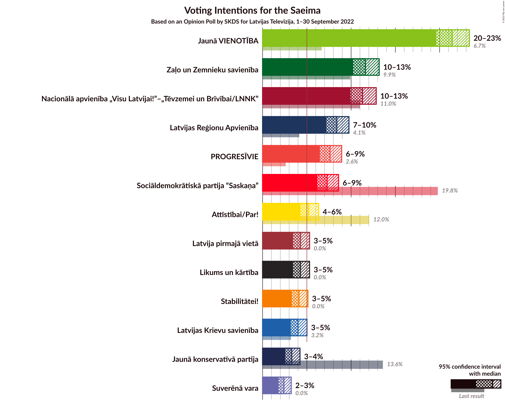

### Confidence Intervals

| Party | Last Result | Poll Result | 80% Confidence Interval | 90% Confidence Interval | 95% Confidence Interval | 99% Confidence Interval |
|:-----:|:-----------:|:-----------:|:-----------------------:|:-----------------------:|:-----------------------:|:-----------------------:|
| Jaunā VIENOTĪBA | 6.7% | 21.4% | 20.2–22.7% |19.9–23.1% |19.6–23.4% |19.0–24.0% |
| Zaļo un Zemnieku savienība | 9.9% | 11.6% | 10.7–12.6% |10.4–12.9% |10.2–13.2% |9.8–13.7% |
| Nacionālā apvienība „Visu Latvijai!”–„Tēvzemei un Brīvībai/LNNK” | 11.0% | 11.3% | 10.4–12.3% |10.1–12.6% |9.9–12.8% |9.5–13.3% |
| Latvijas Reģionu Apvienība | 4.1% | 8.4% | 7.6–9.3% |7.4–9.5% |7.2–9.8% |6.8–10.2% |
| PROGRESĪVIE | 2.6% | 7.6% | 6.9–8.5% |6.7–8.7% |6.5–8.9% |6.1–9.4% |
| Sociāldemokrātiskā partija “Saskaņa” | 19.8% | 7.3% | 6.6–8.1% |6.4–8.4% |6.2–8.6% |5.9–9.0% |
| Attīstībai/Par! | 12.0% | 5.2% | 4.6–5.9% |4.4–6.1% |4.3–6.3% |4.0–6.7% |
| Likums un kārtība | 0.0% | 4.3% | 3.7–5.0% |3.6–5.1% |3.4–5.3% |3.2–5.7% |
| Latvija pirmajā vietā | 0.0% | 4.3% | 3.7–5.0% |3.6–5.1% |3.4–5.3% |3.2–5.7% |
| Stabilitātei! | 0.0% | 4.1% | 3.6–4.8% |3.4–5.0% |3.3–5.1% |3.0–5.5% |
| Latvijas Krievu savienība | 3.2% | 4.0% | 3.5–4.7% |3.3–4.8% |3.2–5.0% |3.0–5.3% |
| Jaunā konservatīvā partija | 13.6% | 3.3% | 2.8–3.9% |2.7–4.1% |2.6–4.2% |2.3–4.5% |
| Suverēnā vara | 0.0% | 2.4% | 2.0–2.9% |1.9–3.1% |1.8–3.2% |1.6–3.5% |

*Note:* The poll result column reflects the actual value used in the calculations. Published results may vary slightly, and in addition be rounded to fewer digits.

## Seats

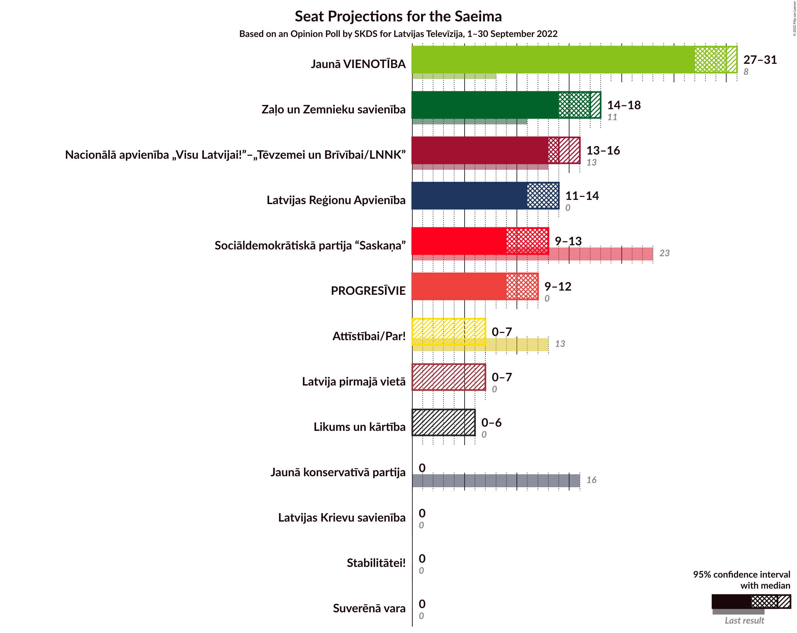

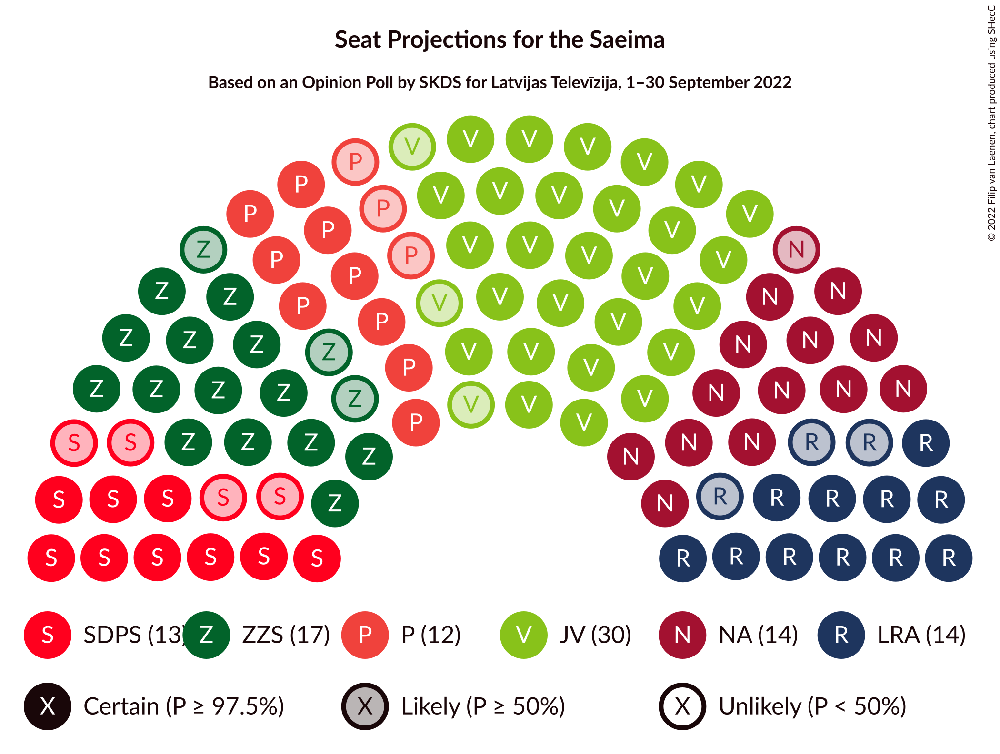

### Confidence Intervals

| Party | Last Result | Median | 80% Confidence Interval | 90% Confidence Interval | 95% Confidence Interval | 99% Confidence Interval |
|:-----:|:-----------:|:------:|:-----------------------:|:-----------------------:|:-----------------------:|:-----------------------:|
| <a href="#jaunā-vienotība">Jaunā VIENOTĪBA</a> | 8 | 30 | 28–30 |28–30 |27–31 |25–33 |
| <a href="#zaļo-un-zemnieku-savienība">Zaļo un Zemnieku savienība</a> | 11 | 17 | 15–17 |14–18 |14–18 |14–19 |
| <a href="#nacionālā-apvienība-„visu-latvijai!”–„tēvzemei-un-brīvībai/lnnk”">Nacionālā apvienība „Visu Latvijai!”–„Tēvzemei un Brīvībai/LNNK”</a> | 13 | 14 | 14 |14–15 |13–16 |13–17 |
| <a href="#latvijas-reģionu-apvienība">Latvijas Reģionu Apvienība</a> | 0 | 14 | 11–14 |11–14 |11–14 |9–14 |
| <a href="#progresīvie">PROGRESĪVIE</a> | 0 | 12 | 10–12 |9–12 |9–12 |8–12 |
| <a href="#sociāldemokrātiskā-partija-“saskaņa”">Sociāldemokrātiskā partija “Saskaņa”</a> | 23 | 13 | 11–13 |9–13 |9–13 |8–14 |
| <a href="#attīstībai/par!">Attīstībai/Par!</a> | 13 | 0 | 0–7 |0–7 |0–7 |0–8 |
| <a href="#likums-un-kārtība">Likums un kārtība</a> | 0 | 0 | 0 |0 |0–6 |0–7 |
| <a href="#latvija-pirmajā-vietā">Latvija pirmajā vietā</a> | 0 | 0 | 0 |0 |0–7 |0–8 |
| <a href="#stabilitātei!">Stabilitātei!</a> | 0 | 0 | 0 |0 |0 |0–7 |
| <a href="#latvijas-krievu-savienība">Latvijas Krievu savienība</a> | 0 | 0 | 0 |0 |0 |0–8 |
| <a href="#jaunā-konservatīvā-partija">Jaunā konservatīvā partija</a> | 16 | 0 | 0 |0 |0 |0 |
| <a href="#suverēnā-vara">Suverēnā vara</a> | 0 | 0 | 0 |0 |0 |0 |

### Jaunā VIENOTĪBA

*For a full overview of the results for this party, see the [Jaunā VIENOTĪBA](party-jaunāvienotība.html) page.*

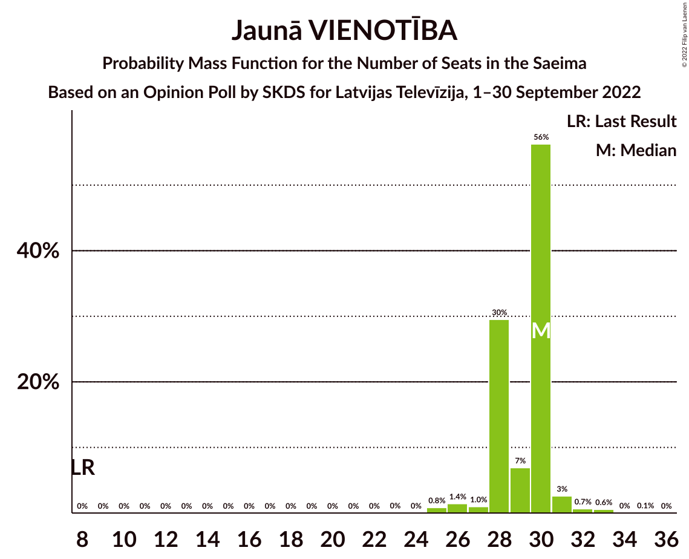

| Number of Seats | Probability | Accumulated | Special Marks |
|:---------------:|:-----------:|:-----------:|:-------------:|
| 8 | 0% | 100% | Last Result |
| 9 | 0% | 100% |  |
| 10 | 0% | 100% |  |
| 11 | 0% | 100% |  |
| 12 | 0% | 100% |  |
| 13 | 0% | 100% |  |
| 14 | 0% | 100% |  |
| 15 | 0% | 100% |  |
| 16 | 0% | 100% |  |
| 17 | 0% | 100% |  |
| 18 | 0% | 100% |  |
| 19 | 0% | 100% |  |
| 20 | 0% | 100% |  |
| 21 | 0% | 100% |  |
| 22 | 0% | 100% |  |
| 23 | 0% | 100% |  |
| 24 | 0% | 99.9% |  |
| 25 | 0.8% | 99.9% |  |
| 26 | 1.4% | 99.1% |  |
| 27 | 1.0% | 98% |  |
| 28 | 30% | 97% |  |
| 29 | 7% | 67% |  |
| 30 | 56% | 60% | Median |
| 31 | 3% | 4% |  |
| 32 | 0.7% | 1.3% |  |
| 33 | 0.6% | 0.7% |  |
| 34 | 0% | 0.1% |  |
| 35 | 0.1% | 0.1% |  |
| 36 | 0% | 0% |  |

### Zaļo un Zemnieku savienība

*For a full overview of the results for this party, see the [Zaļo un Zemnieku savienība](party-zaļounzemniekusavienība.html) page.*

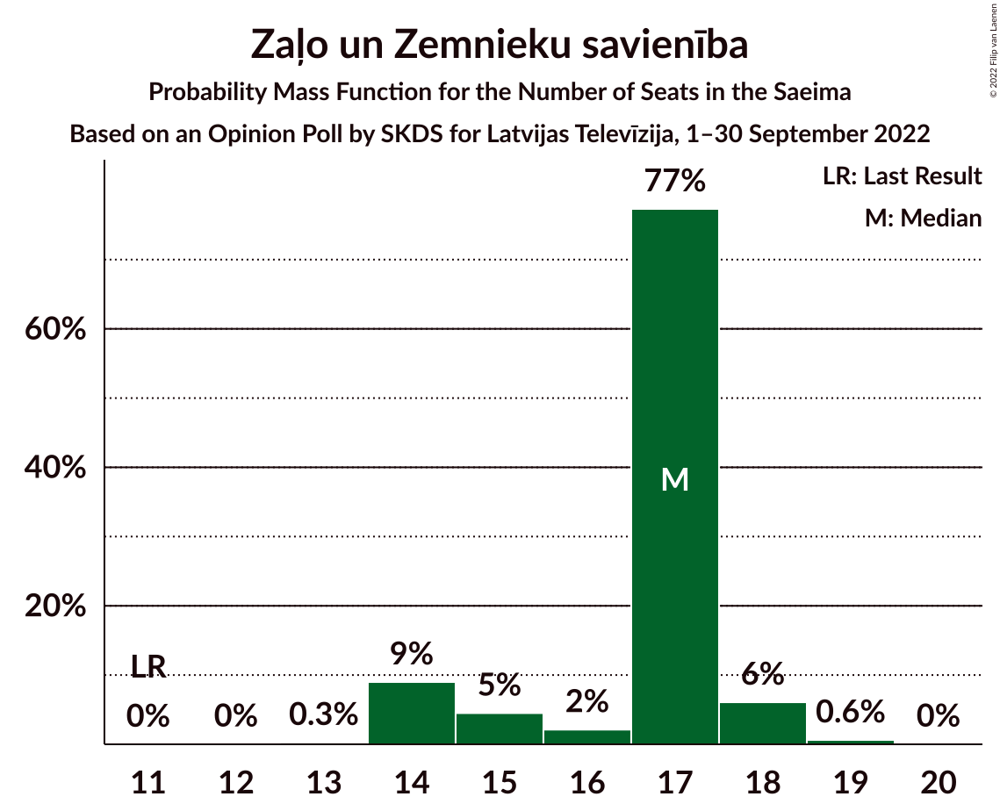

| Number of Seats | Probability | Accumulated | Special Marks |
|:---------------:|:-----------:|:-----------:|:-------------:|
| 11 | 0% | 100% | Last Result |
| 12 | 0% | 100% |  |
| 13 | 0.3% | 99.9% |  |
| 14 | 9% | 99.7% |  |
| 15 | 5% | 91% |  |
| 16 | 2% | 86% |  |
| 17 | 77% | 84% | Median |
| 18 | 6% | 7% |  |
| 19 | 0.6% | 0.7% |  |
| 20 | 0% | 0% |  |

### Nacionālā apvienība „Visu Latvijai!”–„Tēvzemei un Brīvībai/LNNK”

*For a full overview of the results for this party, see the [Nacionālā apvienība „Visu Latvijai!”–„Tēvzemei un Brīvībai/LNNK”](party-nacionālāapvienība„visulatvijai”–„tēvzemeiunbrīvībailnnk”.html) page.*

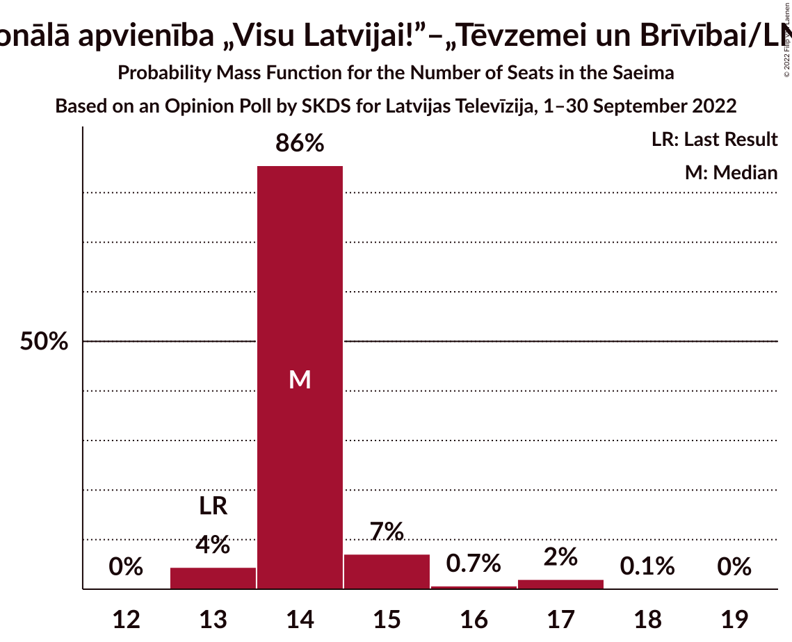

| Number of Seats | Probability | Accumulated | Special Marks |
|:---------------:|:-----------:|:-----------:|:-------------:|
| 13 | 4% | 100% | Last Result |
| 14 | 86% | 96% | Median |
| 15 | 7% | 10% |  |
| 16 | 0.7% | 3% |  |
| 17 | 2% | 2% |  |
| 18 | 0.1% | 0.2% |  |
| 19 | 0% | 0% |  |

### Latvijas Reģionu Apvienība

*For a full overview of the results for this party, see the [Latvijas Reģionu Apvienība](party-latvijasreģionuapvienība.html) page.*

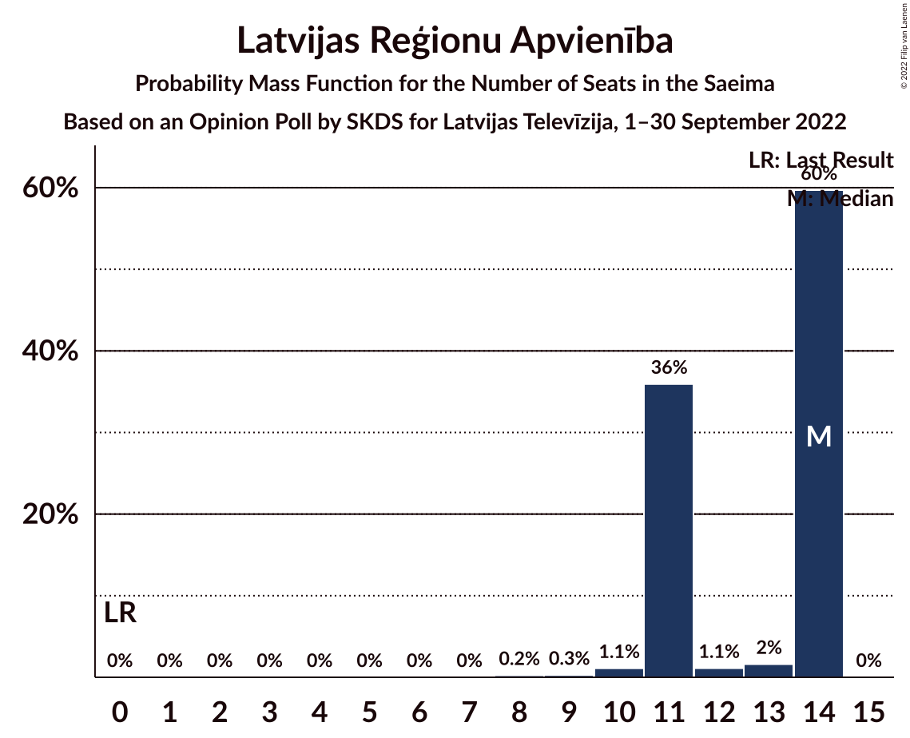

| Number of Seats | Probability | Accumulated | Special Marks |
|:---------------:|:-----------:|:-----------:|:-------------:|
| 0 | 0% | 100% | Last Result |
| 1 | 0% | 100% |  |
| 2 | 0% | 100% |  |
| 3 | 0% | 100% |  |
| 4 | 0% | 100% |  |
| 5 | 0% | 100% |  |
| 6 | 0% | 100% |  |
| 7 | 0% | 100% |  |
| 8 | 0.2% | 100% |  |
| 9 | 0.3% | 99.8% |  |
| 10 | 1.1% | 99.5% |  |
| 11 | 36% | 98% |  |
| 12 | 1.1% | 62% |  |
| 13 | 2% | 61% |  |
| 14 | 60% | 60% | Median |
| 15 | 0% | 0% |  |

### PROGRESĪVIE

*For a full overview of the results for this party, see the [PROGRESĪVIE](party-progresīvie.html) page.*

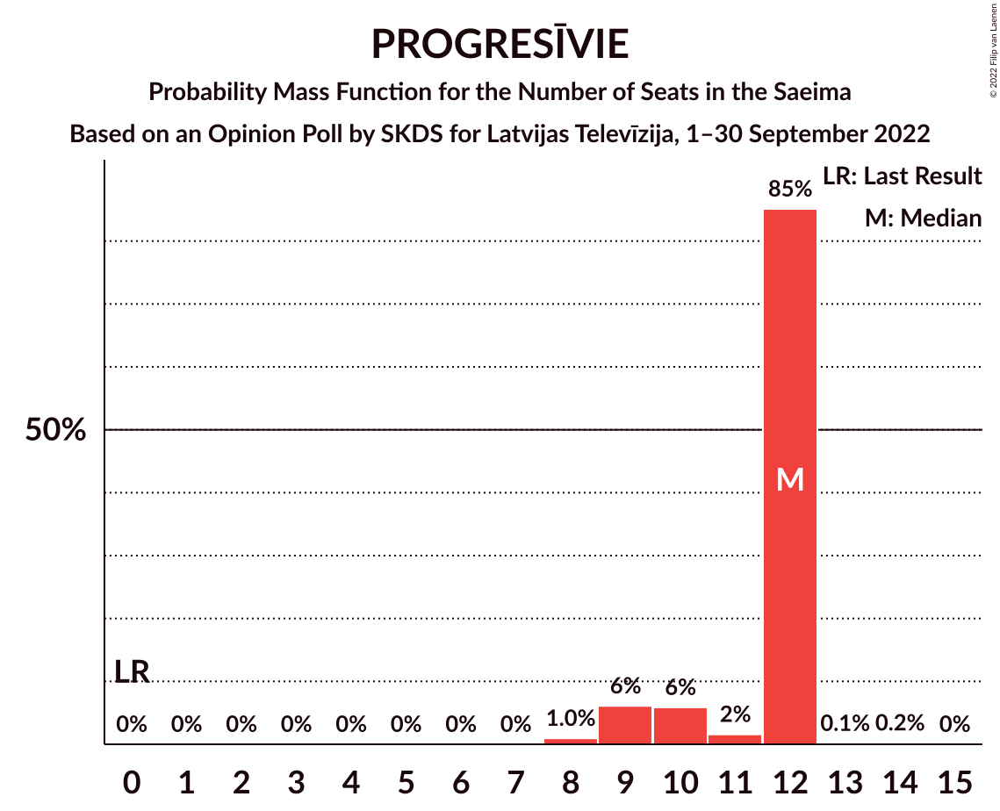

| Number of Seats | Probability | Accumulated | Special Marks |
|:---------------:|:-----------:|:-----------:|:-------------:|
| 0 | 0% | 100% | Last Result |
| 1 | 0% | 100% |  |
| 2 | 0% | 100% |  |
| 3 | 0% | 100% |  |
| 4 | 0% | 100% |  |
| 5 | 0% | 100% |  |
| 6 | 0% | 100% |  |
| 7 | 0% | 100% |  |
| 8 | 1.0% | 100% |  |
| 9 | 6% | 99.0% |  |
| 10 | 6% | 93% |  |
| 11 | 2% | 87% |  |
| 12 | 85% | 85% | Median |
| 13 | 0.1% | 0.4% |  |
| 14 | 0.2% | 0.2% |  |
| 15 | 0% | 0% |  |

### Sociāldemokrātiskā partija “Saskaņa”

*For a full overview of the results for this party, see the [Sociāldemokrātiskā partija “Saskaņa”](party-sociāldemokrātiskāpartija“saskaņa”.html) page.*

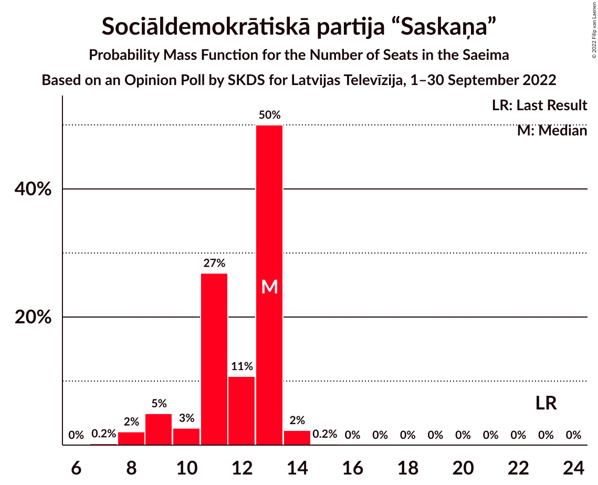

| Number of Seats | Probability | Accumulated | Special Marks |
|:---------------:|:-----------:|:-----------:|:-------------:|
| 7 | 0.2% | 100% |  |
| 8 | 2% | 99.8% |  |
| 9 | 5% | 98% |  |
| 10 | 3% | 93% |  |
| 11 | 27% | 90% |  |
| 12 | 11% | 63% |  |
| 13 | 50% | 52% | Median |
| 14 | 2% | 2% |  |
| 15 | 0.2% | 0.2% |  |
| 16 | 0% | 0% |  |
| 17 | 0% | 0% |  |
| 18 | 0% | 0% |  |
| 19 | 0% | 0% |  |
| 20 | 0% | 0% |  |
| 21 | 0% | 0% |  |
| 22 | 0% | 0% |  |
| 23 | 0% | 0% | Last Result |

### Attīstībai/Par!

*For a full overview of the results for this party, see the [Attīstībai/Par!](party-attīstībaipar.html) page.*

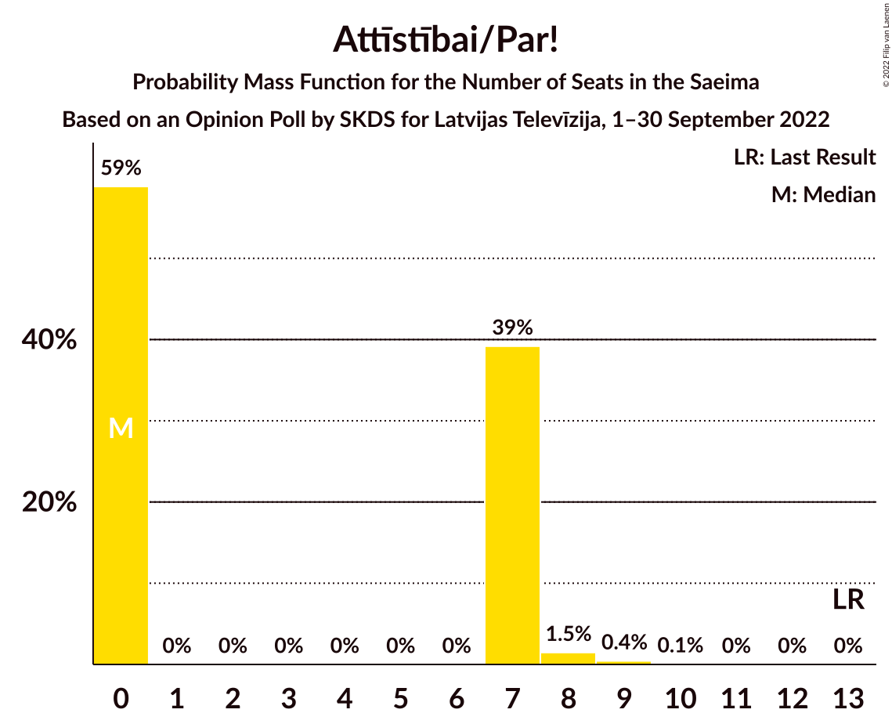

| Number of Seats | Probability | Accumulated | Special Marks |
|:---------------:|:-----------:|:-----------:|:-------------:|
| 0 | 59% | 100% | Median |
| 1 | 0% | 41% |  |
| 2 | 0% | 41% |  |
| 3 | 0% | 41% |  |
| 4 | 0% | 41% |  |
| 5 | 0% | 41% |  |
| 6 | 0% | 41% |  |
| 7 | 39% | 41% |  |
| 8 | 1.5% | 2% |  |
| 9 | 0.4% | 0.5% |  |
| 10 | 0.1% | 0.1% |  |
| 11 | 0% | 0% |  |
| 12 | 0% | 0% |  |
| 13 | 0% | 0% | Last Result |

### Likums un kārtība

*For a full overview of the results for this party, see the [Likums un kārtība](party-likumsunkārtība.html) page.*

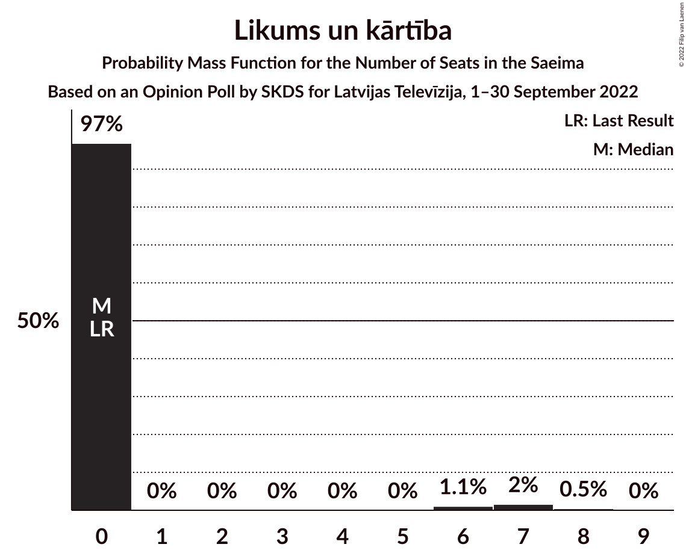

| Number of Seats | Probability | Accumulated | Special Marks |
|:---------------:|:-----------:|:-----------:|:-------------:|
| 0 | 97% | 100% | Last Result, Median |
| 1 | 0% | 3% |  |
| 2 | 0% | 3% |  |
| 3 | 0% | 3% |  |
| 4 | 0% | 3% |  |
| 5 | 0% | 3% |  |
| 6 | 1.1% | 3% |  |
| 7 | 2% | 2% |  |
| 8 | 0.5% | 0.5% |  |
| 9 | 0% | 0% |  |

### Latvija pirmajā vietā

*For a full overview of the results for this party, see the [Latvija pirmajā vietā](party-latvijapirmajāvietā.html) page.*

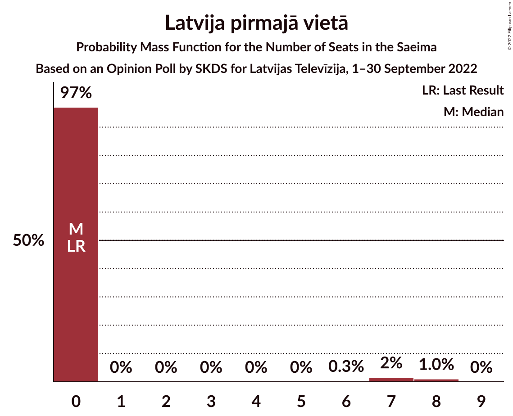

| Number of Seats | Probability | Accumulated | Special Marks |
|:---------------:|:-----------:|:-----------:|:-------------:|
| 0 | 97% | 100% | Last Result, Median |
| 1 | 0% | 3% |  |
| 2 | 0% | 3% |  |
| 3 | 0% | 3% |  |
| 4 | 0% | 3% |  |
| 5 | 0% | 3% |  |
| 6 | 0.3% | 3% |  |
| 7 | 2% | 3% |  |
| 8 | 1.0% | 1.0% |  |
| 9 | 0% | 0% |  |

### Stabilitātei!

*For a full overview of the results for this party, see the [Stabilitātei!](party-stabilitātei.html) page.*

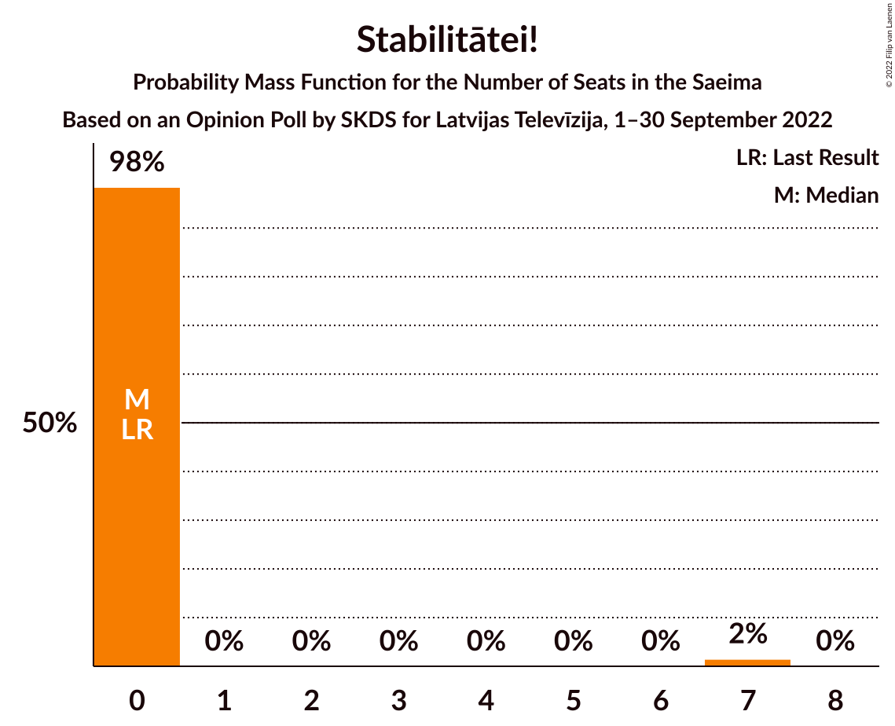

| Number of Seats | Probability | Accumulated | Special Marks |
|:---------------:|:-----------:|:-----------:|:-------------:|
| 0 | 98% | 100% | Last Result, Median |
| 1 | 0% | 2% |  |
| 2 | 0% | 2% |  |
| 3 | 0% | 2% |  |
| 4 | 0% | 2% |  |
| 5 | 0% | 2% |  |
| 6 | 0% | 2% |  |
| 7 | 2% | 2% |  |
| 8 | 0% | 0% |  |

### Latvijas Krievu savienība

*For a full overview of the results for this party, see the [Latvijas Krievu savienība](party-latvijaskrievusavienība.html) page.*

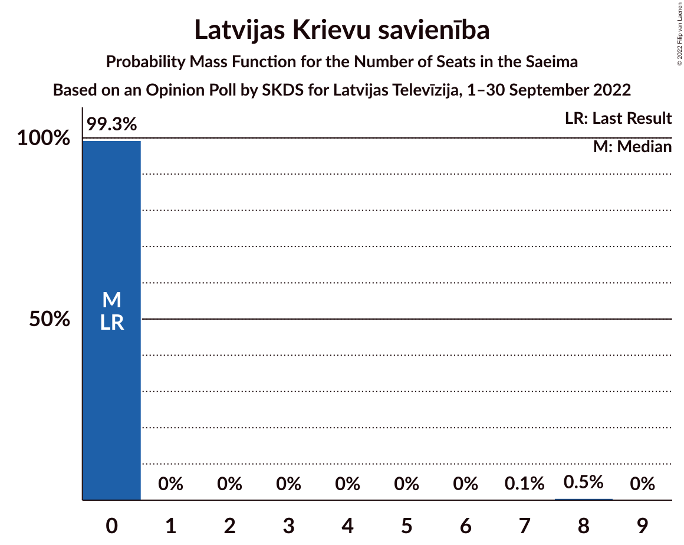

| Number of Seats | Probability | Accumulated | Special Marks |
|:---------------:|:-----------:|:-----------:|:-------------:|
| 0 | 99.3% | 100% | Last Result, Median |
| 1 | 0% | 0.7% |  |
| 2 | 0% | 0.7% |  |
| 3 | 0% | 0.7% |  |
| 4 | 0% | 0.7% |  |
| 5 | 0% | 0.7% |  |
| 6 | 0% | 0.7% |  |
| 7 | 0.1% | 0.7% |  |
| 8 | 0.5% | 0.5% |  |
| 9 | 0% | 0% |  |

### Jaunā konservatīvā partija

*For a full overview of the results for this party, see the [Jaunā konservatīvā partija](party-jaunākonservatīvāpartija.html) page.*

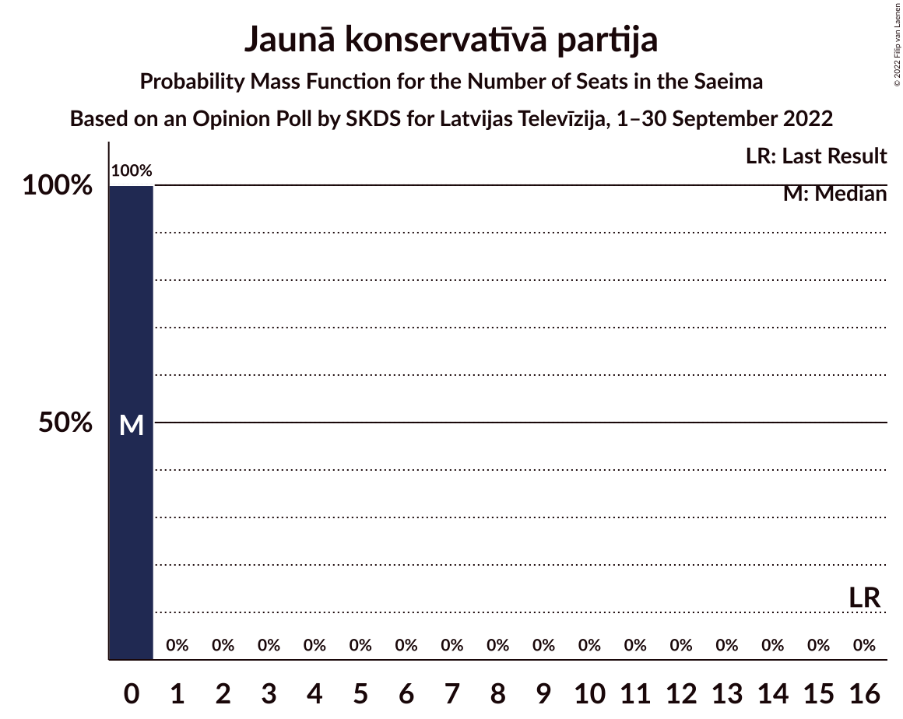

| Number of Seats | Probability | Accumulated | Special Marks |
|:---------------:|:-----------:|:-----------:|:-------------:|
| 0 | 100% | 100% | Median |
| 1 | 0% | 0% |  |
| 2 | 0% | 0% |  |
| 3 | 0% | 0% |  |
| 4 | 0% | 0% |  |
| 5 | 0% | 0% |  |
| 6 | 0% | 0% |  |
| 7 | 0% | 0% |  |
| 8 | 0% | 0% |  |
| 9 | 0% | 0% |  |
| 10 | 0% | 0% |  |
| 11 | 0% | 0% |  |
| 12 | 0% | 0% |  |
| 13 | 0% | 0% |  |
| 14 | 0% | 0% |  |
| 15 | 0% | 0% |  |
| 16 | 0% | 0% | Last Result |

### Suverēnā vara

*For a full overview of the results for this party, see the [Suverēnā vara](party-suverēnāvara.html) page.*

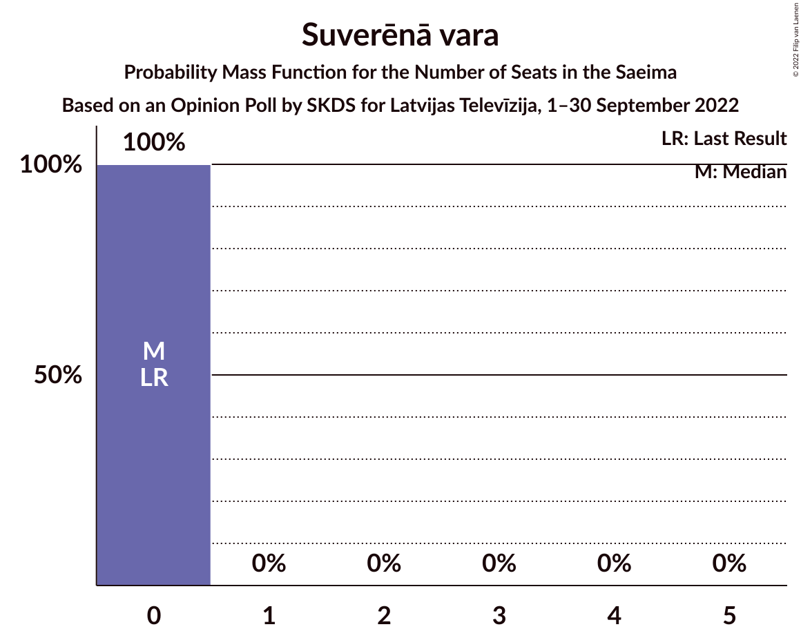

| Number of Seats | Probability | Accumulated | Special Marks |
|:---------------:|:-----------:|:-----------:|:-------------:|
| 0 | 100% | 100% | Last Result, Median |

## Coalitions

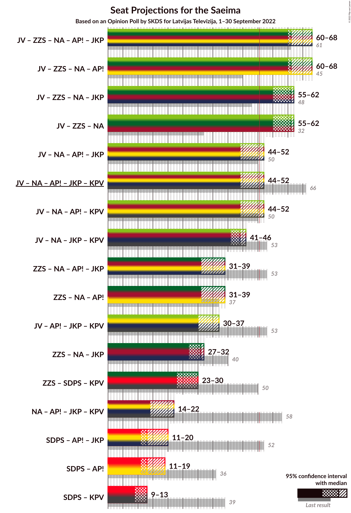

### Confidence Intervals

| Coalition | Last Result | Median | Majority? | 80% Confidence Interval | 90% Confidence Interval | 95% Confidence Interval | 99% Confidence Interval |
|:---------:|:-----------:|:------:|:---------:|:-----------------------:|:-----------------------:|:-----------------------:|:-----------------------:|
| Jaunā VIENOTĪBA – Zaļo un Zemnieku savienība – Nacionālā apvienība „Visu Latvijai!”–„Tēvzemei un Brīvībai/LNNK” – Attīstībai/Par! – Jaunā konservatīvā partija | 61 | 61 | 100% | 61–66 | 61–66 | 60–68 | 57–70 |
| Jaunā VIENOTĪBA – Zaļo un Zemnieku savienība – Nacionālā apvienība „Visu Latvijai!”–„Tēvzemei un Brīvībai/LNNK” – Attīstībai/Par! | 45 | 61 | 100% | 61–66 | 61–66 | 60–68 | 57–70 |
| Jaunā VIENOTĪBA – Zaļo un Zemnieku savienība – Nacionālā apvienība „Visu Latvijai!”–„Tēvzemei un Brīvībai/LNNK” – Jaunā konservatīvā partija | 48 | 61 | 100% | 58–61 | 56–62 | 55–62 | 52–66 |
| Jaunā VIENOTĪBA – Zaļo un Zemnieku savienība – Nacionālā apvienība „Visu Latvijai!”–„Tēvzemei un Brīvībai/LNNK” | 32 | 61 | 100% | 58–61 | 56–62 | 55–62 | 52–66 |
| Jaunā VIENOTĪBA – Nacionālā apvienība „Visu Latvijai!”–„Tēvzemei un Brīvībai/LNNK” – Attīstībai/Par! – Jaunā konservatīvā partija | 50 | 44 | 7% | 44–50 | 44–51 | 44–52 | 42–54 |
| Zaļo un Zemnieku savienība – Nacionālā apvienība „Visu Latvijai!”–„Tēvzemei un Brīvībai/LNNK” – Attīstībai/Par! – Jaunā konservatīvā partija | 53 | 31 | 0% | 31–38 | 31–38 | 31–39 | 28–41 |
| Zaļo un Zemnieku savienība – Nacionālā apvienība „Visu Latvijai!”–„Tēvzemei un Brīvībai/LNNK” – Attīstībai/Par! | 37 | 31 | 0% | 31–38 | 31–38 | 31–39 | 28–41 |
| Zaļo un Zemnieku savienība – Nacionālā apvienība „Visu Latvijai!”–„Tēvzemei un Brīvībai/LNNK” – Jaunā konservatīvā partija | 40 | 31 | 0% | 29–31 | 28–32 | 27–32 | 27–34 |
| Sociāldemokrātiskā partija “Saskaņa” – Attīstībai/Par! – Jaunā konservatīvā partija | 52 | 13 | 0% | 13–18 | 12–19 | 11–20 | 9–21 |
| Sociāldemokrātiskā partija “Saskaņa” – Attīstībai/Par! | 36 | 13 | 0% | 13–18 | 12–19 | 11–19 | 9–21 |

### Jaunā VIENOTĪBA – Zaļo un Zemnieku savienība – Nacionālā apvienība „Visu Latvijai!”–„Tēvzemei un Brīvībai/LNNK” – Attīstībai/Par! – Jaunā konservatīvā partija

| Number of Seats | Probability | Accumulated | Special Marks |
|:---------------:|:-----------:|:-----------:|:-------------:|
| 56 | 0.4% | 100% |  |
| 57 | 0.4% | 99.6% |  |
| 58 | 0.2% | 99.2% |  |
| 59 | 1.1% | 99.0% |  |
| 60 | 0.7% | 98% |  |
| 61 | 50% | 97% | Last Result, Median |
| 62 | 7% | 47% |  |
| 63 | 3% | 40% |  |
| 64 | 0.6% | 37% |  |
| 65 | 6% | 37% |  |
| 66 | 26% | 31% |  |
| 67 | 1.5% | 5% |  |
| 68 | 2% | 3% |  |
| 69 | 0.6% | 1.2% |  |
| 70 | 0.4% | 0.6% |  |
| 71 | 0.2% | 0.2% |  |
| 72 | 0% | 0.1% |  |
| 73 | 0% | 0% |  |

### Jaunā VIENOTĪBA – Zaļo un Zemnieku savienība – Nacionālā apvienība „Visu Latvijai!”–„Tēvzemei un Brīvībai/LNNK” – Attīstībai/Par!

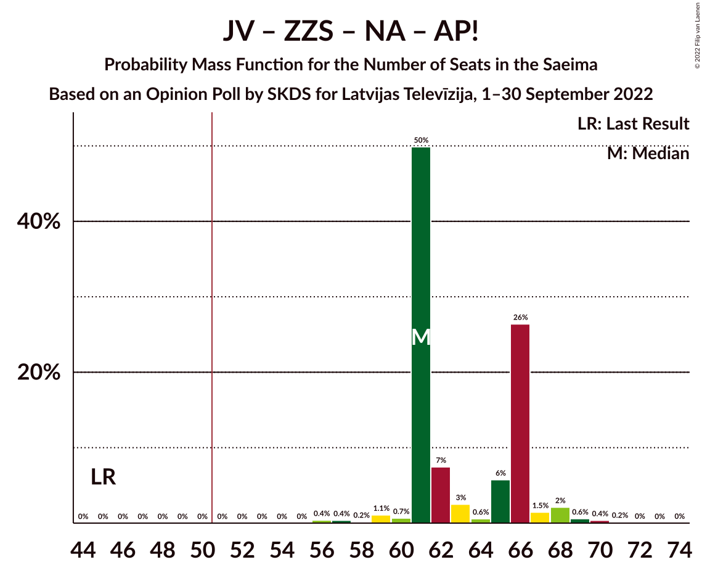

| Number of Seats | Probability | Accumulated | Special Marks |
|:---------------:|:-----------:|:-----------:|:-------------:|
| 45 | 0% | 100% | Last Result |
| 46 | 0% | 100% |  |
| 47 | 0% | 100% |  |
| 48 | 0% | 100% |  |
| 49 | 0% | 100% |  |
| 50 | 0% | 100% |  |
| 51 | 0% | 100% | Majority |
| 52 | 0% | 100% |  |
| 53 | 0% | 100% |  |
| 54 | 0% | 100% |  |
| 55 | 0% | 100% |  |
| 56 | 0.4% | 100% |  |
| 57 | 0.4% | 99.6% |  |
| 58 | 0.2% | 99.2% |  |
| 59 | 1.1% | 99.0% |  |
| 60 | 0.7% | 98% |  |
| 61 | 50% | 97% | Median |
| 62 | 7% | 47% |  |
| 63 | 3% | 40% |  |
| 64 | 0.6% | 37% |  |
| 65 | 6% | 37% |  |
| 66 | 26% | 31% |  |
| 67 | 1.5% | 5% |  |
| 68 | 2% | 3% |  |
| 69 | 0.6% | 1.2% |  |
| 70 | 0.4% | 0.6% |  |
| 71 | 0.2% | 0.2% |  |
| 72 | 0% | 0.1% |  |
| 73 | 0% | 0% |  |

### Jaunā VIENOTĪBA – Zaļo un Zemnieku savienība – Nacionālā apvienība „Visu Latvijai!”–„Tēvzemei un Brīvībai/LNNK” – Jaunā konservatīvā partija

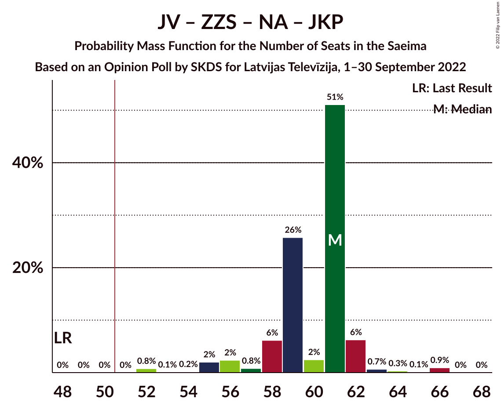

| Number of Seats | Probability | Accumulated | Special Marks |
|:---------------:|:-----------:|:-----------:|:-------------:|
| 48 | 0% | 100% | Last Result |
| 49 | 0% | 100% |  |
| 50 | 0% | 100% |  |
| 51 | 0% | 100% | Majority |
| 52 | 0.8% | 100% |  |
| 53 | 0.1% | 99.2% |  |
| 54 | 0.2% | 99.1% |  |
| 55 | 2% | 99.0% |  |
| 56 | 2% | 97% |  |
| 57 | 0.8% | 95% |  |
| 58 | 6% | 94% |  |
| 59 | 26% | 88% |  |
| 60 | 2% | 62% |  |
| 61 | 51% | 59% | Median |
| 62 | 6% | 8% |  |
| 63 | 0.7% | 2% |  |
| 64 | 0.3% | 1.4% |  |
| 65 | 0.1% | 1.1% |  |
| 66 | 0.9% | 1.0% |  |
| 67 | 0% | 0% |  |

### Jaunā VIENOTĪBA – Zaļo un Zemnieku savienība – Nacionālā apvienība „Visu Latvijai!”–„Tēvzemei un Brīvībai/LNNK”

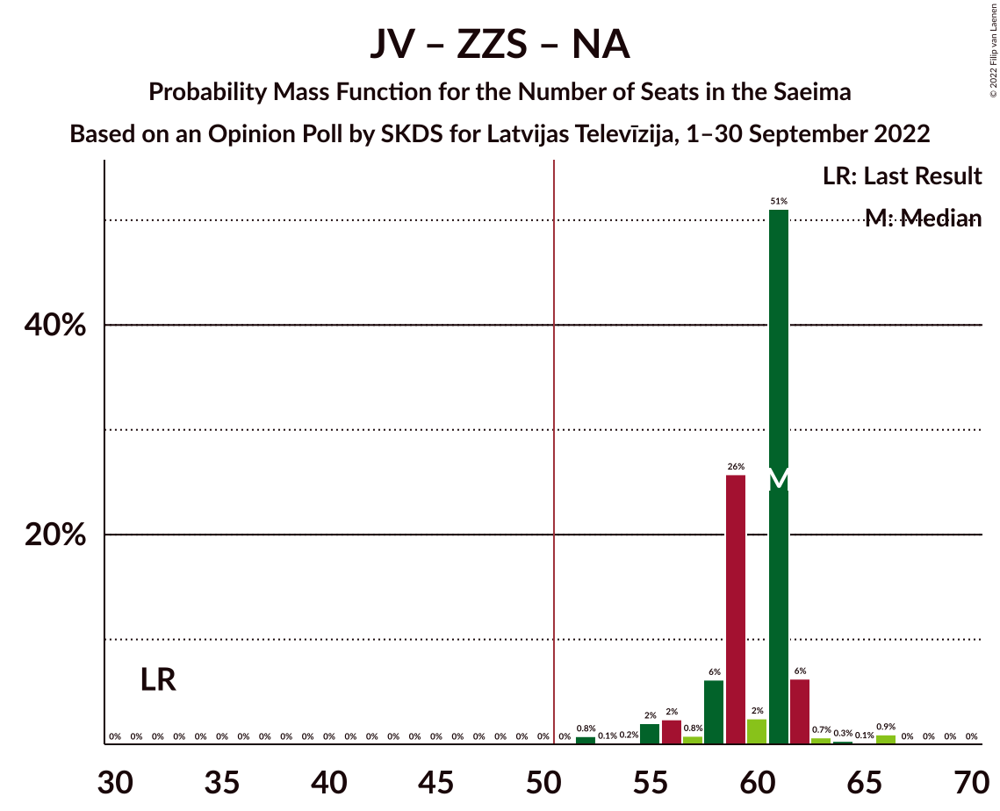

| Number of Seats | Probability | Accumulated | Special Marks |
|:---------------:|:-----------:|:-----------:|:-------------:|
| 32 | 0% | 100% | Last Result |
| 33 | 0% | 100% |  |
| 34 | 0% | 100% |  |
| 35 | 0% | 100% |  |
| 36 | 0% | 100% |  |
| 37 | 0% | 100% |  |
| 38 | 0% | 100% |  |
| 39 | 0% | 100% |  |
| 40 | 0% | 100% |  |
| 41 | 0% | 100% |  |
| 42 | 0% | 100% |  |
| 43 | 0% | 100% |  |
| 44 | 0% | 100% |  |
| 45 | 0% | 100% |  |
| 46 | 0% | 100% |  |
| 47 | 0% | 100% |  |
| 48 | 0% | 100% |  |
| 49 | 0% | 100% |  |
| 50 | 0% | 100% |  |
| 51 | 0% | 100% | Majority |
| 52 | 0.8% | 100% |  |
| 53 | 0.1% | 99.2% |  |
| 54 | 0.2% | 99.1% |  |
| 55 | 2% | 99.0% |  |
| 56 | 2% | 97% |  |
| 57 | 0.8% | 95% |  |
| 58 | 6% | 94% |  |
| 59 | 26% | 88% |  |
| 60 | 2% | 62% |  |
| 61 | 51% | 59% | Median |
| 62 | 6% | 8% |  |
| 63 | 0.7% | 2% |  |
| 64 | 0.3% | 1.4% |  |
| 65 | 0.1% | 1.1% |  |
| 66 | 0.9% | 1.0% |  |
| 67 | 0% | 0% |  |

### Jaunā VIENOTĪBA – Nacionālā apvienība „Visu Latvijai!”–„Tēvzemei un Brīvībai/LNNK” – Attīstībai/Par! – Jaunā konservatīvā partija

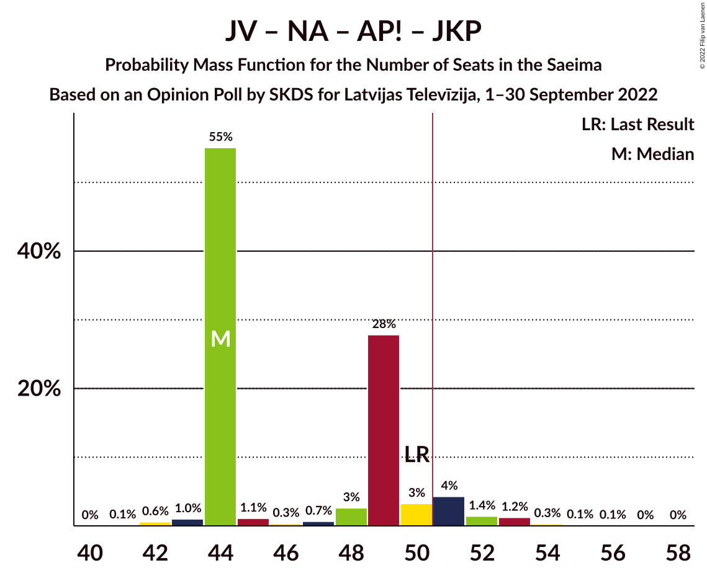

| Number of Seats | Probability | Accumulated | Special Marks |
|:---------------:|:-----------:|:-----------:|:-------------:|
| 41 | 0.1% | 100% |  |
| 42 | 0.6% | 99.9% |  |
| 43 | 1.0% | 99.3% |  |
| 44 | 55% | 98% | Median |
| 45 | 1.1% | 43% |  |
| 46 | 0.3% | 42% |  |
| 47 | 0.7% | 42% |  |
| 48 | 3% | 41% |  |
| 49 | 28% | 39% |  |
| 50 | 3% | 11% | Last Result |
| 51 | 4% | 7% | Majority |
| 52 | 1.4% | 3% |  |
| 53 | 1.2% | 2% |  |
| 54 | 0.3% | 0.5% |  |
| 55 | 0.1% | 0.2% |  |
| 56 | 0.1% | 0.1% |  |
| 57 | 0% | 0% |  |

### Zaļo un Zemnieku savienība – Nacionālā apvienība „Visu Latvijai!”–„Tēvzemei un Brīvībai/LNNK” – Attīstībai/Par! – Jaunā konservatīvā partija

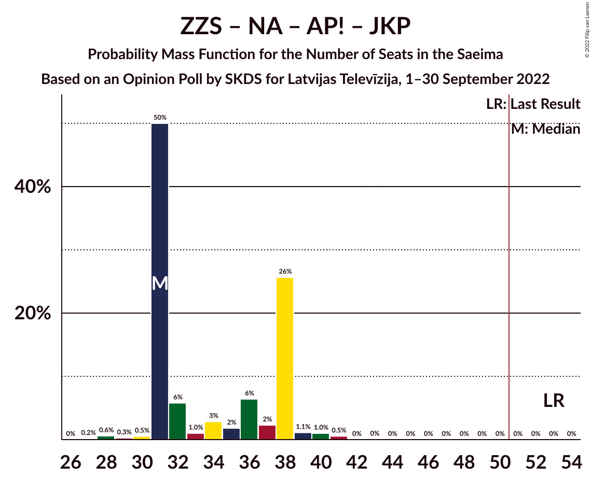

| Number of Seats | Probability | Accumulated | Special Marks |
|:---------------:|:-----------:|:-----------:|:-------------:|
| 27 | 0.2% | 100% |  |
| 28 | 0.6% | 99.8% |  |
| 29 | 0.3% | 99.3% |  |
| 30 | 0.5% | 99.0% |  |
| 31 | 50% | 98% | Median |
| 32 | 6% | 48% |  |
| 33 | 1.0% | 43% |  |
| 34 | 3% | 42% |  |
| 35 | 2% | 39% |  |
| 36 | 6% | 37% |  |
| 37 | 2% | 31% |  |
| 38 | 26% | 28% |  |
| 39 | 1.1% | 3% |  |
| 40 | 1.0% | 2% |  |
| 41 | 0.5% | 0.6% |  |
| 42 | 0% | 0.1% |  |
| 43 | 0% | 0% |  |
| 44 | 0% | 0% |  |
| 45 | 0% | 0% |  |
| 46 | 0% | 0% |  |
| 47 | 0% | 0% |  |
| 48 | 0% | 0% |  |
| 49 | 0% | 0% |  |
| 50 | 0% | 0% |  |
| 51 | 0% | 0% | Majority |
| 52 | 0% | 0% |  |
| 53 | 0% | 0% | Last Result |

### Zaļo un Zemnieku savienība – Nacionālā apvienība „Visu Latvijai!”–„Tēvzemei un Brīvībai/LNNK” – Attīstībai/Par!

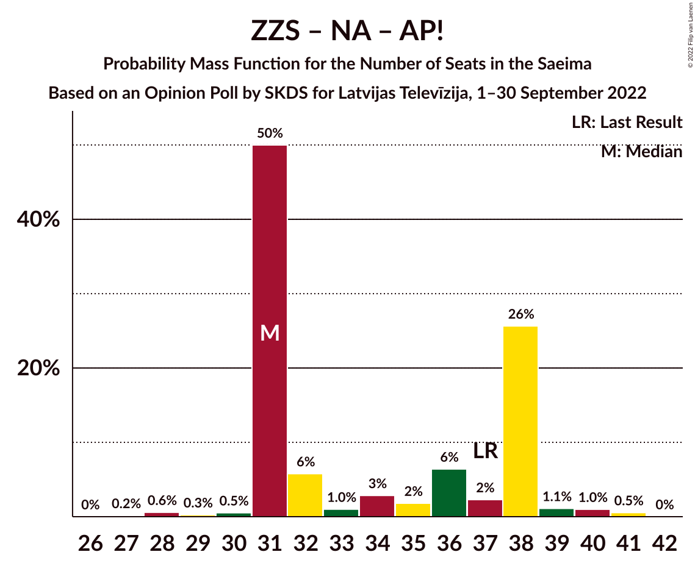

| Number of Seats | Probability | Accumulated | Special Marks |
|:---------------:|:-----------:|:-----------:|:-------------:|
| 27 | 0.2% | 100% |  |
| 28 | 0.6% | 99.8% |  |
| 29 | 0.3% | 99.3% |  |
| 30 | 0.5% | 99.0% |  |
| 31 | 50% | 98% | Median |
| 32 | 6% | 48% |  |
| 33 | 1.0% | 43% |  |
| 34 | 3% | 42% |  |
| 35 | 2% | 39% |  |
| 36 | 6% | 37% |  |
| 37 | 2% | 31% | Last Result |
| 38 | 26% | 28% |  |
| 39 | 1.1% | 3% |  |
| 40 | 1.0% | 2% |  |
| 41 | 0.5% | 0.6% |  |
| 42 | 0% | 0% |  |

### Zaļo un Zemnieku savienība – Nacionālā apvienība „Visu Latvijai!”–„Tēvzemei un Brīvībai/LNNK” – Jaunā konservatīvā partija

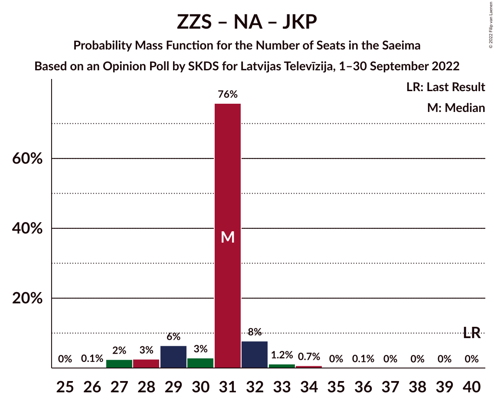

| Number of Seats | Probability | Accumulated | Special Marks |
|:---------------:|:-----------:|:-----------:|:-------------:|
| 26 | 0.1% | 100% |  |
| 27 | 2% | 99.8% |  |
| 28 | 3% | 97% |  |
| 29 | 6% | 95% |  |
| 30 | 3% | 88% |  |
| 31 | 76% | 86% | Median |
| 32 | 8% | 10% |  |
| 33 | 1.2% | 2% |  |
| 34 | 0.7% | 0.8% |  |
| 35 | 0% | 0.1% |  |
| 36 | 0.1% | 0.1% |  |
| 37 | 0% | 0% |  |
| 38 | 0% | 0% |  |
| 39 | 0% | 0% |  |
| 40 | 0% | 0% | Last Result |

### Sociāldemokrātiskā partija “Saskaņa” – Attīstībai/Par! – Jaunā konservatīvā partija

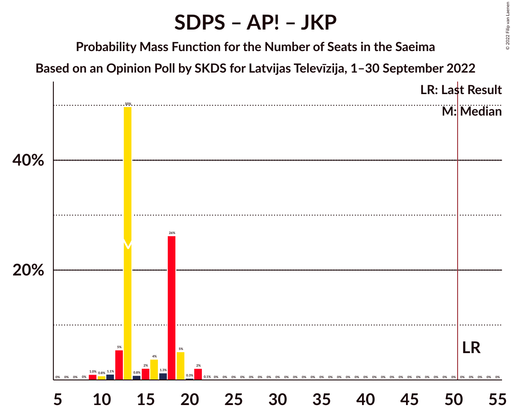

| Number of Seats | Probability | Accumulated | Special Marks |
|:---------------:|:-----------:|:-----------:|:-------------:|
| 9 | 1.0% | 100% |  |
| 10 | 0.8% | 98.9% |  |
| 11 | 1.1% | 98% |  |
| 12 | 5% | 97% |  |
| 13 | 50% | 92% | Median |
| 14 | 0.8% | 42% |  |
| 15 | 2% | 41% |  |
| 16 | 4% | 39% |  |
| 17 | 1.3% | 35% |  |
| 18 | 26% | 34% |  |
| 19 | 5% | 8% |  |
| 20 | 0.3% | 3% |  |
| 21 | 2% | 2% |  |
| 22 | 0.1% | 0.1% |  |
| 23 | 0% | 0% |  |
| 24 | 0% | 0% |  |
| 25 | 0% | 0% |  |
| 26 | 0% | 0% |  |
| 27 | 0% | 0% |  |
| 28 | 0% | 0% |  |
| 29 | 0% | 0% |  |
| 30 | 0% | 0% |  |
| 31 | 0% | 0% |  |
| 32 | 0% | 0% |  |
| 33 | 0% | 0% |  |
| 34 | 0% | 0% |  |
| 35 | 0% | 0% |  |
| 36 | 0% | 0% |  |
| 37 | 0% | 0% |  |
| 38 | 0% | 0% |  |
| 39 | 0% | 0% |  |
| 40 | 0% | 0% |  |
| 41 | 0% | 0% |  |
| 42 | 0% | 0% |  |
| 43 | 0% | 0% |  |
| 44 | 0% | 0% |  |
| 45 | 0% | 0% |  |
| 46 | 0% | 0% |  |
| 47 | 0% | 0% |  |
| 48 | 0% | 0% |  |
| 49 | 0% | 0% |  |
| 50 | 0% | 0% |  |
| 51 | 0% | 0% | Majority |
| 52 | 0% | 0% | Last Result |

### Sociāldemokrātiskā partija “Saskaņa” – Attīstībai/Par!

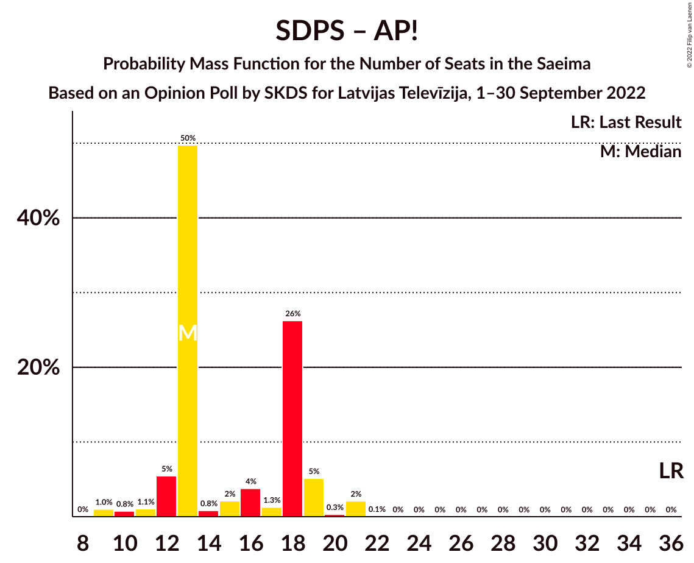

| Number of Seats | Probability | Accumulated | Special Marks |
|:---------------:|:-----------:|:-----------:|:-------------:|
| 9 | 1.0% | 100% |  |
| 10 | 0.8% | 98.9% |  |
| 11 | 1.1% | 98% |  |
| 12 | 5% | 97% |  |
| 13 | 50% | 92% | Median |
| 14 | 0.8% | 42% |  |
| 15 | 2% | 41% |  |
| 16 | 4% | 39% |  |
| 17 | 1.3% | 35% |  |
| 18 | 26% | 34% |  |
| 19 | 5% | 8% |  |
| 20 | 0.3% | 2% |  |
| 21 | 2% | 2% |  |
| 22 | 0.1% | 0.1% |  |
| 23 | 0% | 0% |  |
| 24 | 0% | 0% |  |
| 25 | 0% | 0% |  |
| 26 | 0% | 0% |  |
| 27 | 0% | 0% |  |
| 28 | 0% | 0% |  |
| 29 | 0% | 0% |  |
| 30 | 0% | 0% |  |
| 31 | 0% | 0% |  |
| 32 | 0% | 0% |  |
| 33 | 0% | 0% |  |
| 34 | 0% | 0% |  |
| 35 | 0% | 0% |  |
| 36 | 0% | 0% | Last Result |

## Technical Information

### Opinion Poll

+ **Polling firm:** SKDS
+ **Commissioner(s):** Latvijas Televīzija
+ **Fieldwork period:** 1–30 September 2022

### Calculations

+ **Sample size:** 1825
+ **Simulations done:** 1,048,576
+ **Error estimate:** 1.68%

