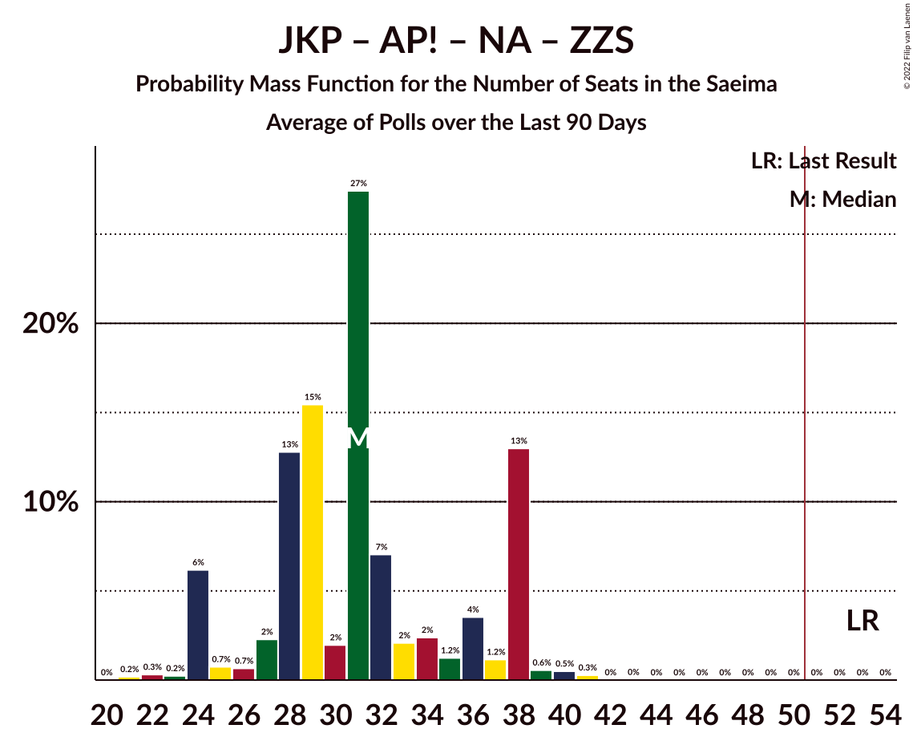

# Poll Average

<a href="#voting-intentions">Voting Intentions</a> | <a href="#seats">Seats</a> | <a href="#coalitions">Coalitions</a> | <a href="#technical-information">Technical Information</a>

## Summary

The table below lists the polls on which the average is based. They are the most recent polls (less than 90 days old) registered and analyzed so far.

| Period     | Polling firm/Commissioner(s) | SDPS | KPV | JKP | AP! | NA | ZZS | JV | LRA | LKS | P | NSL | VL | JS |
|:----------:|:----------------------------:|:--:|:--:|:--:|:--:|:--:|:--:|:--:|:--:|:--:|:--:|:--:|:--:|:--:|
| 6 October 2018 | General Election | 19.8%   23 | 14.2%   16 | 13.6%   16 | 12.0%   13 | 11.0%   13 | 9.9%   11 | 6.7%   8 | 4.1%   0 | 3.2%   0 | 2.6%   0 | 0.8%   0 | 0.0%   0 | 0.0%   0 |
| N/A | Poll Average | 17–22%   24 | 2–4%   0 | 11–15%   15 | 8–12%   11 | 10–14%   14 | 8–12%   11 | 14–18%   18 | 3–5%   0 | 3–5%   0 | 5–8%   7 | N/A   N/A | N/A   N/A | N/A   N/A |
| [21–24 November 2019](2019-11-24-Factum.html) | Factum | 17–22%   24 | 2–4%   0 | 11–15%   15 | 8–12%   11 | 10–14%   14 | 8–12%   11 | 14–18%   18 | 3–5%   0 | 3–5%   0 | 5–8%   7 | N/A   N/A | N/A   N/A | N/A   N/A |
| [2–12 November 2019](2019-11-12-SKDS.html) | SKDS   Latvijas Televīzija | N/A   N/A | N/A   N/A | N/A   N/A | N/A   N/A | N/A   N/A | N/A   N/A | N/A   N/A | N/A   N/A | N/A   N/A | N/A   N/A | N/A   N/A | N/A   N/A | N/A   N/A |
| 6 October 2018 | General Election | 19.8%   23 | 14.2%   16 | 13.6%   16 | 12.0%   13 | 11.0%   13 | 9.9%   11 | 6.7%   8 | 4.1%   0 | 3.2%   0 | 2.6%   0 | 0.8%   0 | 0.0%   0 | 0.0%   0 |

Only polls for which at least the sample size has been published are included in the table above.

**Legend:**
+ **Top half of each row:** Voting intentions (95% confidence interval)
+ **Bottom half of each row:** Seat projections for the Saeima (95% confidence interval)
+ **SDPS:** Sociāldemokrātiskā partija “Saskaņa”
+ **KPV:** Politiskā partija „KPV LV”
+ **JKP:** Jaunā konservatīvā partija
+ **AP!:** Attīstībai/Par!
+ **NA:** Nacionālā apvienība „Visu Latvijai!”–„Tēvzemei un Brīvībai/LNNK”
+ **ZZS:** Zaļo un Zemnieku savienība
+ **JV:** Jaunā VIENOTĪBA
+ **LRA:** Latvijas Reģionu Apvienība
+ **LKS:** Latvijas Krievu savienība
+ **P:** PROGRESĪVIE
+ **NSL:** No sirds Latvijai
+ **VL:** Vienoti Latvijai
+ **JS:** Jaunā Saskaņa
+ **N/A (single party):** Party not included the published results
+ **N/A (entire row):** Calculation for this opinion poll not started yet

## Voting Intentions

### Confidence Intervals

| Party | Last Result | Median | 80% Confidence Interval | 90% Confidence Interval | 95% Confidence Interval | 99% Confidence Interval |
|:-----:|:-----------:|:------:|:-----------------------:|:-----------------------:|:-----------------------:|:-----------------------:|
| <a href="#sociāldemokrātiskā-partija-“saskaņa”">Sociāldemokrātiskā partija “Saskaņa”</a> | 19.8% | 19.8% | 18.2–21.5% |17.8–22.0% | 17.4–22.4% | 16.7–23.3% |
| <a href="#politiskā-partija-„kpv-lv”">Politiskā partija „KPV LV”</a> | 14.2% | 3.1% | 2.4–3.8% |2.2–4.1% | 2.1–4.3% | 1.9–4.7% |
| <a href="#jaunā-konservatīvā-partija">Jaunā konservatīvā partija</a> | 13.6% | 12.9% | 11.5–14.3% |11.2–14.7% | 10.9–15.1% | 10.3–15.8% |
| <a href="#attīstībai/par!">Attīstībai/Par!</a> | 12.0% | 10.0% | 8.8–11.3% |8.5–11.7% | 8.2–12.0% | 7.7–12.7% |
| <a href="#nacionālā-apvienība-„visu-latvijai!”–„tēvzemei-un-brīvībai/lnnk”">Nacionālā apvienība „Visu Latvijai!”–„Tēvzemei un Brīvībai/LNNK”</a> | 11.0% | 12.0% | 10.7–13.3% |10.3–13.7% | 10.0–14.1% | 9.4–14.8% |
| <a href="#zaļo-un-zemnieku-savienība">Zaļo un Zemnieku savienība</a> | 9.9% | 10.0% | 8.8–11.3% |8.5–11.7% | 8.2–12.0% | 7.7–12.7% |
| <a href="#jaunā-vienotība">Jaunā VIENOTĪBA</a> | 6.7% | 15.9% | 14.4–17.4% |14.0–17.9% | 13.7–18.3% | 13.0–19.1% |
| <a href="#latvijas-reģionu-apvienība">Latvijas Reģionu Apvienība</a> | 4.1% | 4.0% | 3.2–4.9% |3.0–5.1% | 2.9–5.4% | 2.6–5.8% |
| <a href="#latvijas-krievu-savienība">Latvijas Krievu savienība</a> | 3.2% | 4.0% | 3.2–4.9% |3.0–5.1% | 2.9–5.4% | 2.6–5.8% |
| <a href="#progresīvie">PROGRESĪVIE</a> | 2.6% | 6.0% | 5.0–7.0% |4.8–7.3% | 4.6–7.6% | 4.2–8.1% |
| <a href="#no-sirds-latvijai">No sirds Latvijai</a> | 0.8% | N/A | N/A |N/A | N/A | N/A |
| <a href="#vienoti-latvijai">Vienoti Latvijai</a> | 0.0% | N/A | N/A |N/A | N/A | N/A |
| <a href="#jaunā-saskaņa">Jaunā Saskaņa</a> | 0.0% | N/A | N/A |N/A | N/A | N/A |

### Sociāldemokrātiskā partija “Saskaņa”

*For a full overview of the results for this party, see the [Sociāldemokrātiskā partija “Saskaņa”](party-sociāldemokrātiskāpartija“saskaņa”.html) page.*

| Voting Intentions | Probability | Accumulated | Special Marks |
|:-----------------:|:-----------:|:-----------:|:-------------:|
| 14.5–15.5% | 0% | 100% |  |
| 15.5–16.5% | 0.4% | 100% |  |
| 16.5–17.5% | 3% | 99.6% |  |
| 17.5–18.5% | 12% | 97% |  |
| 18.5–19.5% | 26% | 84% |  |
| 19.5–20.5% | 29% | 58% | Last Result, Median |
| 20.5–21.5% | 19% | 29% |  |
| 21.5–22.5% | 7% | 9% |  |
| 22.5–23.5% | 2% | 2% |  |
| 23.5–24.5% | 0.2% | 0.3% |  |
| 24.5–25.5% | 0% | 0% |  |

### Politiskā partija „KPV LV”

*For a full overview of the results for this party, see the [Politiskā partija „KPV LV”](party-politiskāpartija„kpvlv”.html) page.*

| Voting Intentions | Probability | Accumulated | Special Marks |
|:-----------------:|:-----------:|:-----------:|:-------------:|
| 0.5–1.5% | 0% | 100% |  |
| 1.5–2.5% | 16% | 100% |  |
| 2.5–3.5% | 64% | 84% | Median |
| 3.5–4.5% | 19% | 20% |  |
| 4.5–5.5% | 0.9% | 0.9% |  |
| 5.5–6.5% | 0% | 0% |  |
| 6.5–7.5% | 0% | 0% |  |
| 7.5–8.5% | 0% | 0% |  |
| 8.5–9.5% | 0% | 0% |  |
| 9.5–10.5% | 0% | 0% |  |
| 10.5–11.5% | 0% | 0% |  |
| 11.5–12.5% | 0% | 0% |  |
| 12.5–13.5% | 0% | 0% |  |
| 13.5–14.5% | 0% | 0% | Last Result |

### Jaunā konservatīvā partija

*For a full overview of the results for this party, see the [Jaunā konservatīvā partija](party-jaunākonservatīvāpartija.html) page.*

| Voting Intentions | Probability | Accumulated | Special Marks |
|:-----------------:|:-----------:|:-----------:|:-------------:|
| 8.5–9.5% | 0% | 100% |  |
| 9.5–10.5% | 1.0% | 100% |  |
| 10.5–11.5% | 9% | 98.9% |  |
| 11.5–12.5% | 27% | 90% |  |
| 12.5–13.5% | 35% | 63% | Median |
| 13.5–14.5% | 20% | 27% | Last Result |
| 14.5–15.5% | 6% | 7% |  |
| 15.5–16.5% | 0.9% | 1.0% |  |
| 16.5–17.5% | 0.1% | 0.1% |  |
| 17.5–18.5% | 0% | 0% |  |

### Attīstībai/Par!

*For a full overview of the results for this party, see the [Attīstībai/Par!](party-attīstībaipar.html) page.*

| Voting Intentions | Probability | Accumulated | Special Marks |
|:-----------------:|:-----------:|:-----------:|:-------------:|
| 5.5–6.5% | 0% | 100% |  |
| 6.5–7.5% | 0.3% | 100% |  |
| 7.5–8.5% | 6% | 99.7% |  |
| 8.5–9.5% | 26% | 94% |  |
| 9.5–10.5% | 39% | 68% | Median |
| 10.5–11.5% | 23% | 29% |  |
| 11.5–12.5% | 5% | 6% | Last Result |
| 12.5–13.5% | 0.6% | 0.7% |  |
| 13.5–14.5% | 0% | 0% |  |

### Nacionālā apvienība „Visu Latvijai!”–„Tēvzemei un Brīvībai/LNNK”

*For a full overview of the results for this party, see the [Nacionālā apvienība „Visu Latvijai!”–„Tēvzemei un Brīvībai/LNNK”](party-nacionālāapvienība„visulatvijai”–„tēvzemeiunbrīvībailnnk”.html) page.*

| Voting Intentions | Probability | Accumulated | Special Marks |
|:-----------------:|:-----------:|:-----------:|:-------------:|
| 7.5–8.5% | 0% | 100% |  |
| 8.5–9.5% | 0.7% | 100% |  |
| 9.5–10.5% | 7% | 99.3% |  |
| 10.5–11.5% | 27% | 92% | Last Result |
| 11.5–12.5% | 36% | 65% | Median |
| 12.5–13.5% | 22% | 29% |  |
| 13.5–14.5% | 6% | 7% |  |
| 14.5–15.5% | 0.9% | 0.9% |  |
| 15.5–16.5% | 0.1% | 0.1% |  |
| 16.5–17.5% | 0% | 0% |  |

### Zaļo un Zemnieku savienība

*For a full overview of the results for this party, see the [Zaļo un Zemnieku savienība](party-zaļounzemniekusavienība.html) page.*

| Voting Intentions | Probability | Accumulated | Special Marks |
|:-----------------:|:-----------:|:-----------:|:-------------:|
| 5.5–6.5% | 0% | 100% |  |
| 6.5–7.5% | 0.3% | 100% |  |
| 7.5–8.5% | 6% | 99.7% |  |
| 8.5–9.5% | 26% | 94% |  |
| 9.5–10.5% | 39% | 68% | Last Result, Median |
| 10.5–11.5% | 23% | 29% |  |
| 11.5–12.5% | 5% | 6% |  |
| 12.5–13.5% | 0.6% | 0.7% |  |
| 13.5–14.5% | 0% | 0% |  |

### Jaunā VIENOTĪBA

*For a full overview of the results for this party, see the [Jaunā VIENOTĪBA](party-jaunāvienotība.html) page.*

| Voting Intentions | Probability | Accumulated | Special Marks |
|:-----------------:|:-----------:|:-----------:|:-------------:|
| 6.5–7.5% | 0% | 100% | Last Result |
| 7.5–8.5% | 0% | 100% |  |
| 8.5–9.5% | 0% | 100% |  |
| 9.5–10.5% | 0% | 100% |  |
| 10.5–11.5% | 0% | 100% |  |
| 11.5–12.5% | 0.1% | 100% |  |
| 12.5–13.5% | 2% | 99.9% |  |
| 13.5–14.5% | 10% | 98% |  |
| 14.5–15.5% | 26% | 88% |  |
| 15.5–16.5% | 33% | 61% | Median |
| 16.5–17.5% | 20% | 29% |  |
| 17.5–18.5% | 7% | 8% |  |
| 18.5–19.5% | 1.3% | 1.5% |  |
| 19.5–20.5% | 0.1% | 0.2% |  |
| 20.5–21.5% | 0% | 0% |  |

### Latvijas Reģionu Apvienība

*For a full overview of the results for this party, see the [Latvijas Reģionu Apvienība](party-latvijasreģionuapvienība.html) page.*

| Voting Intentions | Probability | Accumulated | Special Marks |
|:-----------------:|:-----------:|:-----------:|:-------------:|
| 0.5–1.5% | 0% | 100% |  |
| 1.5–2.5% | 0.4% | 100% |  |
| 2.5–3.5% | 23% | 99.6% |  |
| 3.5–4.5% | 57% | 77% | Last Result, Median |
| 4.5–5.5% | 18% | 20% |  |
| 5.5–6.5% | 1.3% | 1.3% |  |
| 6.5–7.5% | 0% | 0% |  |

### Latvijas Krievu savienība

*For a full overview of the results for this party, see the [Latvijas Krievu savienība](party-latvijaskrievusavienība.html) page.*

| Voting Intentions | Probability | Accumulated | Special Marks |
|:-----------------:|:-----------:|:-----------:|:-------------:|
| 0.5–1.5% | 0% | 100% |  |
| 1.5–2.5% | 0.4% | 100% |  |
| 2.5–3.5% | 23% | 99.6% | Last Result |
| 3.5–4.5% | 57% | 77% | Median |
| 4.5–5.5% | 18% | 20% |  |
| 5.5–6.5% | 1.3% | 1.3% |  |
| 6.5–7.5% | 0% | 0% |  |

### PROGRESĪVIE

*For a full overview of the results for this party, see the [PROGRESĪVIE](party-progresīvie.html) page.*

| Voting Intentions | Probability | Accumulated | Special Marks |
|:-----------------:|:-----------:|:-----------:|:-------------:|
| 2.5–3.5% | 0% | 100% | Last Result |
| 3.5–4.5% | 2% | 100% |  |
| 4.5–5.5% | 27% | 98% |  |
| 5.5–6.5% | 49% | 71% | Median |
| 6.5–7.5% | 20% | 22% |  |
| 7.5–8.5% | 3% | 3% |  |
| 8.5–9.5% | 0.1% | 0.1% |  |
| 9.5–10.5% | 0% | 0% |  |

## Seats

### Confidence Intervals

| Party | Last Result | Median | 80% Confidence Interval | 90% Confidence Interval | 95% Confidence Interval | 99% Confidence Interval |
|:-----:|:-----------:|:------:|:-----------------------:|:-----------------------:|:-----------------------:|:-----------------------:|
| <a href="#sociāldemokrātiskā-partija-“saskaņa”">Sociāldemokrātiskā partija “Saskaņa”</a> | 23 | 24 | 24 |24 | 24 | 24–25 |
| <a href="#politiskā-partija-„kpv-lv”">Politiskā partija „KPV LV”</a> | 16 | 0 | 0 |0 | 0 | 0 |
| <a href="#jaunā-konservatīvā-partija">Jaunā konservatīvā partija</a> | 16 | 15 | 15 |15 | 15 | 14–15 |
| <a href="#attīstībai/par!">Attīstībai/Par!</a> | 13 | 11 | 11 |11 | 11 | 11 |
| <a href="#nacionālā-apvienība-„visu-latvijai!”–„tēvzemei-un-brīvībai/lnnk”">Nacionālā apvienība „Visu Latvijai!”–„Tēvzemei un Brīvībai/LNNK”</a> | 13 | 14 | 14 |14 | 14 | 14 |
| <a href="#zaļo-un-zemnieku-savienība">Zaļo un Zemnieku savienība</a> | 11 | 11 | 11 |11 | 11 | 11 |
| <a href="#jaunā-vienotība">Jaunā VIENOTĪBA</a> | 8 | 18 | 18 |18 | 18 | 18 |
| <a href="#latvijas-reģionu-apvienība">Latvijas Reģionu Apvienība</a> | 0 | 0 | 0 |0 | 0 | 0 |
| <a href="#latvijas-krievu-savienība">Latvijas Krievu savienība</a> | 0 | 0 | 0 |0 | 0 | 0 |
| <a href="#progresīvie">PROGRESĪVIE</a> | 0 | 7 | 7 |7 | 7 | 7 |
| <a href="#no-sirds-latvijai">No sirds Latvijai</a> | 0 | N/A | N/A |N/A | N/A | N/A |
| <a href="#vienoti-latvijai">Vienoti Latvijai</a> | 0 | N/A | N/A |N/A | N/A | N/A |
| <a href="#jaunā-saskaņa">Jaunā Saskaņa</a> | 0 | N/A | N/A |N/A | N/A | N/A |

### Sociāldemokrātiskā partija “Saskaņa”

*For a full overview of the results for this party, see the [Sociāldemokrātiskā partija “Saskaņa”](party-sociāldemokrātiskāpartija“saskaņa”.html) page.*

| Number of Seats | Probability | Accumulated | Special Marks |
|:---------------:|:-----------:|:-----------:|:-------------:|
| 23 | 0% | 100% | Last Result |
| 24 | 98% | 100% | Median |
| 25 | 2% | 2% |  |
| 26 | 0% | 0% |  |

### Politiskā partija „KPV LV”

*For a full overview of the results for this party, see the [Politiskā partija „KPV LV”](party-politiskāpartija„kpvlv”.html) page.*

| Number of Seats | Probability | Accumulated | Special Marks |
|:---------------:|:-----------:|:-----------:|:-------------:|
| 0 | 100% | 100% | Median |
| 1 | 0% | 0% |  |
| 2 | 0% | 0% |  |
| 3 | 0% | 0% |  |
| 4 | 0% | 0% |  |
| 5 | 0% | 0% |  |
| 6 | 0% | 0% |  |
| 7 | 0% | 0% |  |
| 8 | 0% | 0% |  |
| 9 | 0% | 0% |  |
| 10 | 0% | 0% |  |
| 11 | 0% | 0% |  |
| 12 | 0% | 0% |  |
| 13 | 0% | 0% |  |
| 14 | 0% | 0% |  |
| 15 | 0% | 0% |  |
| 16 | 0% | 0% | Last Result |

### Jaunā konservatīvā partija

*For a full overview of the results for this party, see the [Jaunā konservatīvā partija](party-jaunākonservatīvāpartija.html) page.*

| Number of Seats | Probability | Accumulated | Special Marks |
|:---------------:|:-----------:|:-----------:|:-------------:|
| 14 | 2% | 100% |  |
| 15 | 98% | 98% | Median |
| 16 | 0% | 0% | Last Result |

### Attīstībai/Par!

*For a full overview of the results for this party, see the [Attīstībai/Par!](party-attīstībaipar.html) page.*

| Number of Seats | Probability | Accumulated | Special Marks |
|:---------------:|:-----------:|:-----------:|:-------------:|
| 11 | 100% | 100% | Median |
| 12 | 0% | 0% |  |
| 13 | 0% | 0% | Last Result |

### Nacionālā apvienība „Visu Latvijai!”–„Tēvzemei un Brīvībai/LNNK”

*For a full overview of the results for this party, see the [Nacionālā apvienība „Visu Latvijai!”–„Tēvzemei un Brīvībai/LNNK”](party-nacionālāapvienība„visulatvijai”–„tēvzemeiunbrīvībailnnk”.html) page.*

| Number of Seats | Probability | Accumulated | Special Marks |
|:---------------:|:-----------:|:-----------:|:-------------:|
| 13 | 0% | 100% | Last Result |
| 14 | 100% | 100% | Median |

### Zaļo un Zemnieku savienība

*For a full overview of the results for this party, see the [Zaļo un Zemnieku savienība](party-zaļounzemniekusavienība.html) page.*

| Number of Seats | Probability | Accumulated | Special Marks |
|:---------------:|:-----------:|:-----------:|:-------------:|
| 11 | 100% | 100% | Last Result, Median |

### Jaunā VIENOTĪBA

*For a full overview of the results for this party, see the [Jaunā VIENOTĪBA](party-jaunāvienotība.html) page.*

| Number of Seats | Probability | Accumulated | Special Marks |
|:---------------:|:-----------:|:-----------:|:-------------:|
| 8 | 0% | 100% | Last Result |
| 9 | 0% | 100% |  |
| 10 | 0% | 100% |  |
| 11 | 0% | 100% |  |
| 12 | 0% | 100% |  |
| 13 | 0% | 100% |  |
| 14 | 0% | 100% |  |
| 15 | 0% | 100% |  |
| 16 | 0% | 100% |  |
| 17 | 0% | 100% |  |
| 18 | 100% | 100% | Median |

### Latvijas Reģionu Apvienība

*For a full overview of the results for this party, see the [Latvijas Reģionu Apvienība](party-latvijasreģionuapvienība.html) page.*

| Number of Seats | Probability | Accumulated | Special Marks |
|:---------------:|:-----------:|:-----------:|:-------------:|
| 0 | 100% | 100% | Last Result, Median |

### Latvijas Krievu savienība

*For a full overview of the results for this party, see the [Latvijas Krievu savienība](party-latvijaskrievusavienība.html) page.*

| Number of Seats | Probability | Accumulated | Special Marks |
|:---------------:|:-----------:|:-----------:|:-------------:|
| 0 | 100% | 100% | Last Result, Median |

### PROGRESĪVIE

*For a full overview of the results for this party, see the [PROGRESĪVIE](party-progresīvie.html) page.*

| Number of Seats | Probability | Accumulated | Special Marks |
|:---------------:|:-----------:|:-----------:|:-------------:|
| 0 | 0% | 100% | Last Result |
| 1 | 0% | 100% |  |
| 2 | 0% | 100% |  |
| 3 | 0% | 100% |  |
| 4 | 0% | 100% |  |
| 5 | 0% | 100% |  |
| 6 | 0% | 100% |  |
| 7 | 100% | 100% | Median |

## Coalitions

### Confidence Intervals

| Coalition | Last Result | Median | Majority? | 80% Confidence Interval | 90% Confidence Interval | 95% Confidence Interval | 99% Confidence Interval |
|:---------:|:-----------:|:------:|:---------:|:-----------------------:|:-----------------------:|:-----------------------:|:-----------------------:|
| Jaunā konservatīvā partija – Attīstībai/Par! – Nacionālā apvienība „Visu Latvijai!”–„Tēvzemei un Brīvībai/LNNK” – Zaļo un Zemnieku savienība – Jaunā VIENOTĪBA | 61 | 69 | 100% | 69 | 69 | 69 | 68–69 |
| Jaunā konservatīvā partija – Attīstībai/Par! – Nacionālā apvienība „Visu Latvijai!”–„Tēvzemei un Brīvībai/LNNK” – Jaunā VIENOTĪBA | 50 | 58 | 100% | 58 | 58 | 58 | 57–58 |
| Politiskā partija „KPV LV” – Jaunā konservatīvā partija – Attīstībai/Par! – Nacionālā apvienība „Visu Latvijai!”–„Tēvzemei un Brīvībai/LNNK” – Jaunā VIENOTĪBA | 66 | 58 | 100% | 58 | 58 | 58 | 57–58 |
| Jaunā konservatīvā partija – Nacionālā apvienība „Visu Latvijai!”–„Tēvzemei un Brīvībai/LNNK” – Zaļo un Zemnieku savienība – Jaunā VIENOTĪBA | 48 | 58 | 100% | 58 | 58 | 58 | 57–58 |
| Attīstībai/Par! – Nacionālā apvienība „Visu Latvijai!”–„Tēvzemei un Brīvībai/LNNK” – Zaļo un Zemnieku savienība – Jaunā VIENOTĪBA | 45 | 54 | 100% | 54 | 54 | 54 | 54 |
| Jaunā konservatīvā partija – Attīstībai/Par! – Nacionālā apvienība „Visu Latvijai!”–„Tēvzemei un Brīvībai/LNNK” – Zaļo un Zemnieku savienība | 53 | 51 | 98% | 51 | 51 | 51 | 50–51 |
| Sociāldemokrātiskā partija “Saskaņa” – Jaunā konservatīvā partija – Attīstībai/Par! | 52 | 50 | 0% | 50 | 50 | 50 | 50 |
| Politiskā partija „KPV LV” – Jaunā konservatīvā partija – Nacionālā apvienība „Visu Latvijai!”–„Tēvzemei un Brīvībai/LNNK” – Jaunā VIENOTĪBA | 53 | 47 | 0% | 47 | 47 | 47 | 46–47 |
| Politiskā partija „KPV LV” – Jaunā konservatīvā partija – Attīstībai/Par! – Jaunā VIENOTĪBA | 53 | 44 | 0% | 44 | 44 | 44 | 43–44 |
| Politiskā partija „KPV LV” – Attīstībai/Par! – Nacionālā apvienība „Visu Latvijai!”–„Tēvzemei un Brīvībai/LNNK” – Jaunā VIENOTĪBA | 50 | 43 | 0% | 43 | 43 | 43 | 43 |
| Nacionālā apvienība „Visu Latvijai!”–„Tēvzemei un Brīvībai/LNNK” – Zaļo un Zemnieku savienība – Jaunā VIENOTĪBA | 32 | 43 | 0% | 43 | 43 | 43 | 43 |
| Politiskā partija „KPV LV” – Jaunā konservatīvā partija – Attīstībai/Par! – Nacionālā apvienība „Visu Latvijai!”–„Tēvzemei un Brīvībai/LNNK” | 58 | 40 | 0% | 40 | 40 | 40 | 39–40 |
| Jaunā konservatīvā partija – Nacionālā apvienība „Visu Latvijai!”–„Tēvzemei un Brīvībai/LNNK” – Zaļo un Zemnieku savienība | 40 | 40 | 0% | 40 | 40 | 40 | 39–40 |
| Attīstībai/Par! – Nacionālā apvienība „Visu Latvijai!”–„Tēvzemei un Brīvībai/LNNK” – Zaļo un Zemnieku savienība | 37 | 36 | 0% | 36 | 36 | 36 | 36 |
| Sociāldemokrātiskā partija “Saskaņa” – Attīstībai/Par! | 36 | 35 | 0% | 35 | 35 | 35 | 35–36 |
| Sociāldemokrātiskā partija “Saskaņa” – Politiskā partija „KPV LV” – Zaļo un Zemnieku savienība | 50 | 35 | 0% | 35 | 35 | 35 | 35–36 |
| Sociāldemokrātiskā partija “Saskaņa” – Politiskā partija „KPV LV” | 39 | 24 | 0% | 24 | 24 | 24 | 24–25 |

### Jaunā konservatīvā partija – Attīstībai/Par! – Nacionālā apvienība „Visu Latvijai!”–„Tēvzemei un Brīvībai/LNNK” – Zaļo un Zemnieku savienība – Jaunā VIENOTĪBA

| Number of Seats | Probability | Accumulated | Special Marks |
|:---------------:|:-----------:|:-----------:|:-------------:|
| 61 | 0% | 100% | Last Result |
| 62 | 0% | 100% |  |
| 63 | 0% | 100% |  |
| 64 | 0% | 100% |  |
| 65 | 0% | 100% |  |
| 66 | 0% | 100% |  |
| 67 | 0% | 100% |  |
| 68 | 2% | 100% |  |
| 69 | 98% | 98% | Median |
| 70 | 0% | 0% |  |

### Jaunā konservatīvā partija – Attīstībai/Par! – Nacionālā apvienība „Visu Latvijai!”–„Tēvzemei un Brīvībai/LNNK” – Jaunā VIENOTĪBA

| Number of Seats | Probability | Accumulated | Special Marks |
|:---------------:|:-----------:|:-----------:|:-------------:|
| 50 | 0% | 100% | Last Result |
| 51 | 0% | 100% | Majority |
| 52 | 0% | 100% |  |
| 53 | 0% | 100% |  |
| 54 | 0% | 100% |  |
| 55 | 0% | 100% |  |
| 56 | 0% | 100% |  |
| 57 | 2% | 100% |  |
| 58 | 98% | 98% | Median |
| 59 | 0% | 0% |  |

### Politiskā partija „KPV LV” – Jaunā konservatīvā partija – Attīstībai/Par! – Nacionālā apvienība „Visu Latvijai!”–„Tēvzemei un Brīvībai/LNNK” – Jaunā VIENOTĪBA

| Number of Seats | Probability | Accumulated | Special Marks |
|:---------------:|:-----------:|:-----------:|:-------------:|
| 57 | 2% | 100% |  |
| 58 | 98% | 98% | Median |
| 59 | 0% | 0% |  |
| 60 | 0% | 0% |  |
| 61 | 0% | 0% |  |
| 62 | 0% | 0% |  |
| 63 | 0% | 0% |  |
| 64 | 0% | 0% |  |
| 65 | 0% | 0% |  |
| 66 | 0% | 0% | Last Result |

### Jaunā konservatīvā partija – Nacionālā apvienība „Visu Latvijai!”–„Tēvzemei un Brīvībai/LNNK” – Zaļo un Zemnieku savienība – Jaunā VIENOTĪBA

| Number of Seats | Probability | Accumulated | Special Marks |
|:---------------:|:-----------:|:-----------:|:-------------:|
| 48 | 0% | 100% | Last Result |
| 49 | 0% | 100% |  |
| 50 | 0% | 100% |  |
| 51 | 0% | 100% | Majority |
| 52 | 0% | 100% |  |
| 53 | 0% | 100% |  |
| 54 | 0% | 100% |  |
| 55 | 0% | 100% |  |
| 56 | 0% | 100% |  |
| 57 | 2% | 100% |  |
| 58 | 98% | 98% | Median |
| 59 | 0% | 0% |  |

### Attīstībai/Par! – Nacionālā apvienība „Visu Latvijai!”–„Tēvzemei un Brīvībai/LNNK” – Zaļo un Zemnieku savienība – Jaunā VIENOTĪBA

| Number of Seats | Probability | Accumulated | Special Marks |
|:---------------:|:-----------:|:-----------:|:-------------:|
| 45 | 0% | 100% | Last Result |
| 46 | 0% | 100% |  |
| 47 | 0% | 100% |  |
| 48 | 0% | 100% |  |
| 49 | 0% | 100% |  |
| 50 | 0% | 100% |  |
| 51 | 0% | 100% | Majority |
| 52 | 0% | 100% |  |
| 53 | 0% | 100% |  |
| 54 | 100% | 100% | Median |

### Jaunā konservatīvā partija – Attīstībai/Par! – Nacionālā apvienība „Visu Latvijai!”–„Tēvzemei un Brīvībai/LNNK” – Zaļo un Zemnieku savienība

| Number of Seats | Probability | Accumulated | Special Marks |
|:---------------:|:-----------:|:-----------:|:-------------:|
| 50 | 2% | 100% |  |
| 51 | 98% | 98% | Median, Majority |
| 52 | 0% | 0% |  |
| 53 | 0% | 0% | Last Result |

### Sociāldemokrātiskā partija “Saskaņa” – Jaunā konservatīvā partija – Attīstībai/Par!

| Number of Seats | Probability | Accumulated | Special Marks |
|:---------------:|:-----------:|:-----------:|:-------------:|
| 50 | 100% | 100% | Median |
| 51 | 0% | 0% | Majority |
| 52 | 0% | 0% | Last Result |

### Politiskā partija „KPV LV” – Jaunā konservatīvā partija – Nacionālā apvienība „Visu Latvijai!”–„Tēvzemei un Brīvībai/LNNK” – Jaunā VIENOTĪBA

| Number of Seats | Probability | Accumulated | Special Marks |
|:---------------:|:-----------:|:-----------:|:-------------:|
| 46 | 2% | 100% |  |
| 47 | 98% | 98% | Median |
| 48 | 0% | 0% |  |
| 49 | 0% | 0% |  |
| 50 | 0% | 0% |  |
| 51 | 0% | 0% | Majority |
| 52 | 0% | 0% |  |
| 53 | 0% | 0% | Last Result |

### Politiskā partija „KPV LV” – Jaunā konservatīvā partija – Attīstībai/Par! – Jaunā VIENOTĪBA

| Number of Seats | Probability | Accumulated | Special Marks |
|:---------------:|:-----------:|:-----------:|:-------------:|
| 43 | 2% | 100% |  |
| 44 | 98% | 98% | Median |
| 45 | 0% | 0% |  |
| 46 | 0% | 0% |  |
| 47 | 0% | 0% |  |
| 48 | 0% | 0% |  |
| 49 | 0% | 0% |  |
| 50 | 0% | 0% |  |
| 51 | 0% | 0% | Majority |
| 52 | 0% | 0% |  |
| 53 | 0% | 0% | Last Result |

### Politiskā partija „KPV LV” – Attīstībai/Par! – Nacionālā apvienība „Visu Latvijai!”–„Tēvzemei un Brīvībai/LNNK” – Jaunā VIENOTĪBA

| Number of Seats | Probability | Accumulated | Special Marks |
|:---------------:|:-----------:|:-----------:|:-------------:|
| 43 | 100% | 100% | Median |
| 44 | 0% | 0% |  |
| 45 | 0% | 0% |  |
| 46 | 0% | 0% |  |
| 47 | 0% | 0% |  |
| 48 | 0% | 0% |  |
| 49 | 0% | 0% |  |
| 50 | 0% | 0% | Last Result |

### Nacionālā apvienība „Visu Latvijai!”–„Tēvzemei un Brīvībai/LNNK” – Zaļo un Zemnieku savienība – Jaunā VIENOTĪBA

| Number of Seats | Probability | Accumulated | Special Marks |
|:---------------:|:-----------:|:-----------:|:-------------:|
| 32 | 0% | 100% | Last Result |
| 33 | 0% | 100% |  |
| 34 | 0% | 100% |  |
| 35 | 0% | 100% |  |
| 36 | 0% | 100% |  |
| 37 | 0% | 100% |  |
| 38 | 0% | 100% |  |
| 39 | 0% | 100% |  |
| 40 | 0% | 100% |  |
| 41 | 0% | 100% |  |
| 42 | 0% | 100% |  |
| 43 | 100% | 100% | Median |

### Politiskā partija „KPV LV” – Jaunā konservatīvā partija – Attīstībai/Par! – Nacionālā apvienība „Visu Latvijai!”–„Tēvzemei un Brīvībai/LNNK”

| Number of Seats | Probability | Accumulated | Special Marks |
|:---------------:|:-----------:|:-----------:|:-------------:|
| 39 | 2% | 100% |  |
| 40 | 98% | 98% | Median |
| 41 | 0% | 0% |  |
| 42 | 0% | 0% |  |
| 43 | 0% | 0% |  |
| 44 | 0% | 0% |  |
| 45 | 0% | 0% |  |
| 46 | 0% | 0% |  |
| 47 | 0% | 0% |  |
| 48 | 0% | 0% |  |
| 49 | 0% | 0% |  |
| 50 | 0% | 0% |  |
| 51 | 0% | 0% | Majority |
| 52 | 0% | 0% |  |
| 53 | 0% | 0% |  |
| 54 | 0% | 0% |  |
| 55 | 0% | 0% |  |
| 56 | 0% | 0% |  |
| 57 | 0% | 0% |  |
| 58 | 0% | 0% | Last Result |

### Jaunā konservatīvā partija – Nacionālā apvienība „Visu Latvijai!”–„Tēvzemei un Brīvībai/LNNK” – Zaļo un Zemnieku savienība

| Number of Seats | Probability | Accumulated | Special Marks |
|:---------------:|:-----------:|:-----------:|:-------------:|
| 39 | 2% | 100% |  |
| 40 | 98% | 98% | Last Result, Median |
| 41 | 0% | 0% |  |

### Attīstībai/Par! – Nacionālā apvienība „Visu Latvijai!”–„Tēvzemei un Brīvībai/LNNK” – Zaļo un Zemnieku savienība

| Number of Seats | Probability | Accumulated | Special Marks |
|:---------------:|:-----------:|:-----------:|:-------------:|
| 36 | 100% | 100% | Median |
| 37 | 0% | 0% | Last Result |

### Sociāldemokrātiskā partija “Saskaņa” – Attīstībai/Par!

| Number of Seats | Probability | Accumulated | Special Marks |
|:---------------:|:-----------:|:-----------:|:-------------:|
| 35 | 98% | 100% | Median |
| 36 | 2% | 2% | Last Result |
| 37 | 0% | 0% |  |

### Sociāldemokrātiskā partija “Saskaņa” – Politiskā partija „KPV LV” – Zaļo un Zemnieku savienība

| Number of Seats | Probability | Accumulated | Special Marks |
|:---------------:|:-----------:|:-----------:|:-------------:|
| 35 | 98% | 100% | Median |
| 36 | 2% | 2% |  |
| 37 | 0% | 0% |  |
| 38 | 0% | 0% |  |
| 39 | 0% | 0% |  |
| 40 | 0% | 0% |  |
| 41 | 0% | 0% |  |
| 42 | 0% | 0% |  |
| 43 | 0% | 0% |  |
| 44 | 0% | 0% |  |
| 45 | 0% | 0% |  |
| 46 | 0% | 0% |  |
| 47 | 0% | 0% |  |
| 48 | 0% | 0% |  |
| 49 | 0% | 0% |  |
| 50 | 0% | 0% | Last Result |

### Sociāldemokrātiskā partija “Saskaņa” – Politiskā partija „KPV LV”

| Number of Seats | Probability | Accumulated | Special Marks |
|:---------------:|:-----------:|:-----------:|:-------------:|
| 24 | 98% | 100% | Median |
| 25 | 2% | 2% |  |
| 26 | 0% | 0% |  |
| 27 | 0% | 0% |  |
| 28 | 0% | 0% |  |
| 29 | 0% | 0% |  |
| 30 | 0% | 0% |  |
| 31 | 0% | 0% |  |
| 32 | 0% | 0% |  |
| 33 | 0% | 0% |  |
| 34 | 0% | 0% |  |
| 35 | 0% | 0% |  |
| 36 | 0% | 0% |  |
| 37 | 0% | 0% |  |
| 38 | 0% | 0% |  |
| 39 | 0% | 0% | Last Result |

## Technical Information

+ **Number of polls included in this average:** 2
+ **Lowest number of simulations done in a poll included in this average:** 0
+ **Total number of simulations done in the polls included in this average:** 32
+ **Error estimate:** 4.08%
