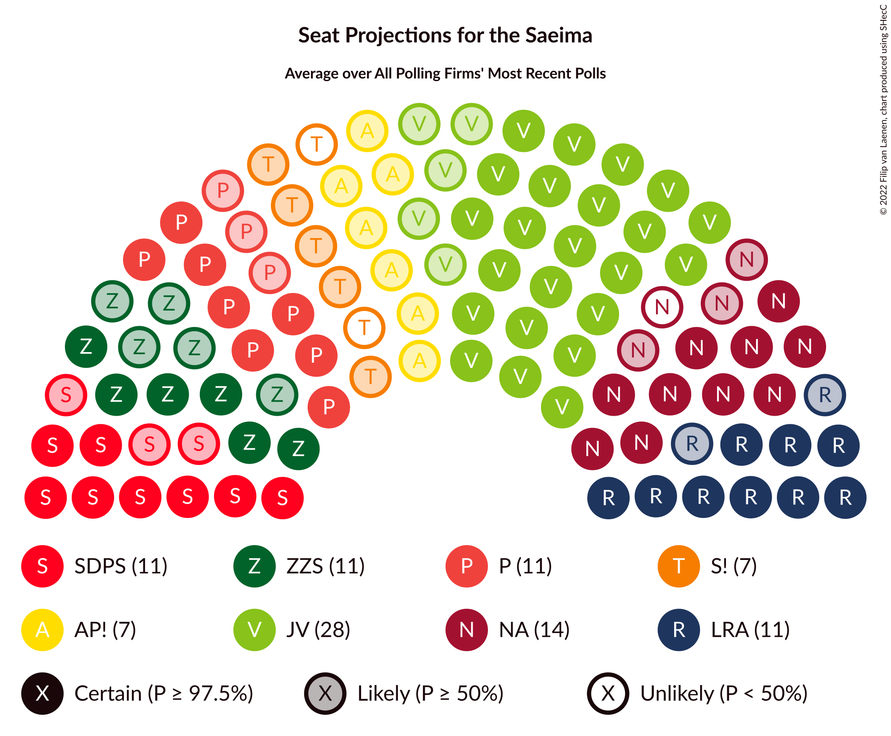
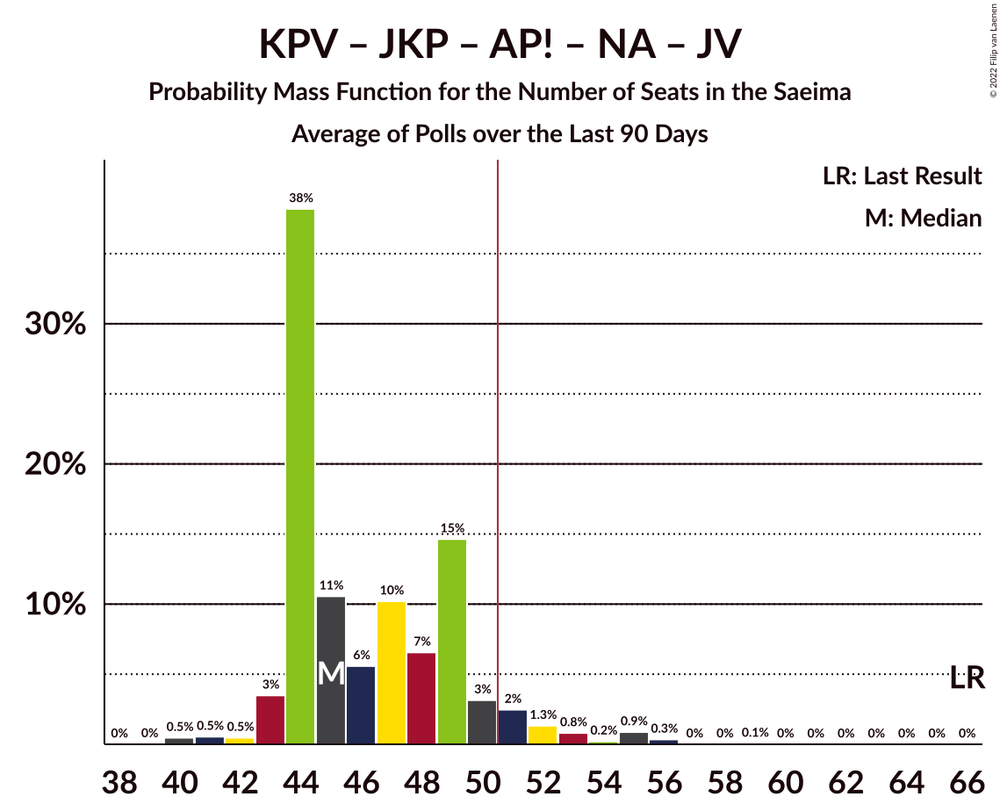

# Poll Average

<a href="#voting-intentions">Voting Intentions</a> | <a href="#seats">Seats</a> | <a href="#coalitions">Coalitions</a> | <a href="#technical-information">Technical Information</a>

## Summary

The table below lists the polls on which the average is based. They are the most recent polls (less than 90 days old) registered and analyzed so far.

| Period     | Polling firm/Commissioner(s) | SDPS | KPV | JKP | AP! | NA | ZZS | JV | LRA | LKS | P | NSL | VL | JS | LuK |
|:----------:|:----------------------------:|:--:|:--:|:--:|:--:|:--:|:--:|:--:|:--:|:--:|:--:|:--:|:--:|:--:|:--:|
| 6 October 2018 | General Election | 19.8%   23 | 14.2%   16 | 13.6%   16 | 12.0%   13 | 11.0%   13 | 9.9%   11 | 6.7%   8 | 4.1%   0 | 3.2%   0 | 2.6%   0 | 0.8%   0 | 0.0%   0 | 0.0%   0 | 0.0%   0 |
| N/A | Poll Average | 8–21%   18–39 | 0–2%   0 | 3–10%   0–12 | 4–14%   0–20 | 5–16%   0–22 | 6–16%   13–37 | 5–19%   11–25 | 2–5%   0 | 1–7%   0–8 | 2–8%   0–8 | N/A   N/A | N/A   N/A | N/A   N/A | 2–7%   0–7 |
| [1–31 May 2021](2021-05-31-SKDS.html) | SKDS   Latvijas Televīzija | 17–20%   17–22 | 1–2%   0 | 7–10%   7–10 | 7–10%   7–10 | 13–16%   14–17 | 12–15%   13–17 | 10–13%   11–15 | 3–4%   0 | 5–8%   5–8 | 6–8%   6–8 | N/A   N/A | N/A   N/A | N/A   N/A | 5–7%   0–7 |
| [26–31 May 2021](2021-05-31-FactumInteractive.html) | Factum Interactive | 15–22%   18–24 | 0–2%   0 | 6–11%   7–13 | 9–15%   10–17 | 11–17%   13–20 | 11–16%   12–19 | 14–20%   16–23 | 2–6%   0–6 | 3–6%   0–8 | 3–7%   0–8 | N/A   N/A | N/A   N/A | N/A   N/A | 2–5%   0–5 |
| [9–19 April 2021](2021-04-19-LatvijasFakti.html) | Latvijas Fakti | 8–11%   21–39 | 1–2%   0 | 3–5%   0 | 4–7%   0–20 | 5–8%   0–28 | 6–9%   17–37 | 5–8%   0–26 | 1–3%   0 | 1–3%   0 | 2–4%   0 | N/A   N/A | N/A   N/A | N/A   N/A | 2–4%   0 |
| 6 October 2018 | General Election | 19.8%   23 | 14.2%   16 | 13.6%   16 | 12.0%   13 | 11.0%   13 | 9.9%   11 | 6.7%   8 | 4.1%   0 | 3.2%   0 | 2.6%   0 | 0.8%   0 | 0.0%   0 | 0.0%   0 | 0.0%   0 |

Only polls for which at least the sample size has been published are included in the table above.

**Legend:**
+ **Top half of each row:** Voting intentions (95% confidence interval)
+ **Bottom half of each row:** Seat projections for the Saeima (95% confidence interval)
+ **SDPS:** Sociāldemokrātiskā partija “Saskaņa”
+ **KPV:** Politiskā partija „KPV LV”
+ **JKP:** Jaunā konservatīvā partija
+ **AP!:** Attīstībai/Par!
+ **NA:** Nacionālā apvienība „Visu Latvijai!”–„Tēvzemei un Brīvībai/LNNK”
+ **ZZS:** Zaļo un Zemnieku savienība
+ **JV:** Jaunā VIENOTĪBA
+ **LRA:** Latvijas Reģionu Apvienība
+ **LKS:** Latvijas Krievu savienība
+ **P:** PROGRESĪVIE
+ **NSL:** No sirds Latvijai
+ **VL:** Vienoti Latvijai
+ **JS:** Jaunā Saskaņa
+ **LuK:** Likums un kārtība
+ **N/A (single party):** Party not included the published results
+ **N/A (entire row):** Calculation for this opinion poll not started yet

## Voting Intentions

### Confidence Intervals

| Party | Last Result | Median | 80% Confidence Interval | 90% Confidence Interval | 95% Confidence Interval | 99% Confidence Interval |
|:-----:|:-----------:|:------:|:-----------------------:|:-----------------------:|:-----------------------:|:-----------------------:|
| <a href="#sociāldemokrātiskā-partija-“saskaņa”">Sociāldemokrātiskā partija “Saskaņa”</a> | 19.8% | 17.6% | 8.8–19.7% |8.3–20.2% | 8.0–20.8% | 7.4–22.0% |
| <a href="#politiskā-partija-„kpv-lv”">Politiskā partija „KPV LV”</a> | 14.2% | 1.2% | 0.6–1.8% |0.5–2.0% | 0.4–2.1% | 0.3–2.4% |
| <a href="#jaunā-konservatīvā-partija">Jaunā konservatīvā partija</a> | 13.6% | 7.9% | 3.5–9.4% |3.2–9.8% | 2.9–10.2% | 2.6–11.2% |
| <a href="#attīstībai/par!">Attīstībai/Par!</a> | 12.0% | 8.7% | 5.0–12.6% |4.6–13.3% | 4.4–13.9% | 3.9–15.0% |
| <a href="#nacionālā-apvienība-„visu-latvijai!”–„tēvzemei-un-brīvībai/lnnk”">Nacionālā apvienība „Visu Latvijai!”–„Tēvzemei un Brīvībai/LNNK”</a> | 11.0% | 13.5% | 5.8–15.4% |5.5–15.9% | 5.2–16.4% | 4.7–17.5% |
| <a href="#zaļo-un-zemnieku-savienība">Zaļo un Zemnieku savienība</a> | 9.9% | 13.0% | 6.9–14.8% |6.5–15.3% | 6.2–15.7% | 5.7–16.7% |
| <a href="#jaunā-vienotība">Jaunā VIENOTĪBA</a> | 6.7% | 11.9% | 5.8–17.7% |5.5–18.6% | 5.2–19.2% | 4.7–20.5% |
| <a href="#latvijas-reģionu-apvienība">Latvijas Reģionu Apvienība</a> | 4.1% | 3.2% | 2.0–4.3% |1.8–4.7% | 1.7–5.0% | 1.4–5.7% |
| <a href="#latvijas-krievu-savienība">Latvijas Krievu savienība</a> | 3.2% | 4.1% | 1.6–6.7% |1.5–7.0% | 1.3–7.3% | 1.1–7.8% |
| <a href="#progresīvie">PROGRESĪVIE</a> | 2.6% | 5.0% | 2.4–7.0% |2.2–7.3% | 2.0–7.6% | 1.7–8.1% |
| <a href="#no-sirds-latvijai">No sirds Latvijai</a> | 0.8% | N/A | N/A |N/A | N/A | N/A |
| <a href="#vienoti-latvijai">Vienoti Latvijai</a> | 0.0% | N/A | N/A |N/A | N/A | N/A |
| <a href="#jaunā-saskaņa">Jaunā Saskaņa</a> | 0.0% | N/A | N/A |N/A | N/A | N/A |
| <a href="#likums-un-kārtība">Likums un kārtība</a> | 0.0% | 3.7% | 2.4–6.1% |2.2–6.4% | 2.1–6.6% | 1.8–7.1% |

### Sociāldemokrātiskā partija “Saskaņa”

*For a full overview of the results for this party, see the [Sociāldemokrātiskā partija “Saskaņa”](party-sociāldemokrātiskāpartija“saskaņa”.html) page.*

| Voting Intentions | Probability | Accumulated | Special Marks |
|:-----------------:|:-----------:|:-----------:|:-------------:|
| 5.5–6.5% | 0% | 100% |  |
| 6.5–7.5% | 0.8% | 100% |  |
| 7.5–8.5% | 7% | 99.2% |  |
| 8.5–9.5% | 14% | 93% |  |
| 9.5–10.5% | 9% | 79% |  |
| 10.5–11.5% | 2% | 69% |  |
| 11.5–12.5% | 0.3% | 67% |  |
| 12.5–13.5% | 0% | 67% |  |
| 13.5–14.5% | 0.2% | 67% |  |
| 14.5–15.5% | 1.0% | 66% |  |
| 15.5–16.5% | 4% | 65% |  |
| 16.5–17.5% | 10% | 62% |  |
| 17.5–18.5% | 21% | 52% | Median |
| 18.5–19.5% | 19% | 31% |  |
| 19.5–20.5% | 8% | 12% | Last Result |
| 20.5–21.5% | 3% | 3% |  |
| 21.5–22.5% | 0.7% | 0.9% |  |
| 22.5–23.5% | 0.2% | 0.2% |  |
| 23.5–24.5% | 0% | 0% |  |

### Politiskā partija „KPV LV”

*For a full overview of the results for this party, see the [Politiskā partija „KPV LV”](party-politiskāpartija„kpvlv”.html) page.*

| Voting Intentions | Probability | Accumulated | Special Marks |
|:-----------------:|:-----------:|:-----------:|:-------------:|
| 0.0–0.5% | 7% | 100% |  |
| 0.5–1.5% | 68% | 93% | Median |
| 1.5–2.5% | 24% | 24% |  |
| 2.5–3.5% | 0.1% | 0.1% |  |
| 3.5–4.5% | 0% | 0% |  |
| 4.5–5.5% | 0% | 0% |  |
| 5.5–6.5% | 0% | 0% |  |
| 6.5–7.5% | 0% | 0% |  |
| 7.5–8.5% | 0% | 0% |  |
| 8.5–9.5% | 0% | 0% |  |
| 9.5–10.5% | 0% | 0% |  |
| 10.5–11.5% | 0% | 0% |  |
| 11.5–12.5% | 0% | 0% |  |
| 12.5–13.5% | 0% | 0% |  |
| 13.5–14.5% | 0% | 0% | Last Result |

### Jaunā konservatīvā partija

*For a full overview of the results for this party, see the [Jaunā konservatīvā partija](party-jaunākonservatīvāpartija.html) page.*

| Voting Intentions | Probability | Accumulated | Special Marks |
|:-----------------:|:-----------:|:-----------:|:-------------:|
| 0.5–1.5% | 0% | 100% |  |
| 1.5–2.5% | 0.4% | 100% |  |
| 2.5–3.5% | 12% | 99.6% |  |
| 3.5–4.5% | 18% | 88% |  |
| 4.5–5.5% | 3% | 70% |  |
| 5.5–6.5% | 1.4% | 67% |  |
| 6.5–7.5% | 9% | 65% |  |
| 7.5–8.5% | 28% | 57% | Median |
| 8.5–9.5% | 22% | 29% |  |
| 9.5–10.5% | 6% | 7% |  |
| 10.5–11.5% | 1.2% | 1.5% |  |
| 11.5–12.5% | 0.2% | 0.2% |  |
| 12.5–13.5% | 0% | 0% |  |
| 13.5–14.5% | 0% | 0% | Last Result |

### Attīstībai/Par!

*For a full overview of the results for this party, see the [Attīstībai/Par!](party-attīstībaipar.html) page.*

| Voting Intentions | Probability | Accumulated | Special Marks |
|:-----------------:|:-----------:|:-----------:|:-------------:|
| 2.5–3.5% | 0.1% | 100% |  |
| 3.5–4.5% | 4% | 99.9% |  |
| 4.5–5.5% | 16% | 96% |  |
| 5.5–6.5% | 11% | 80% |  |
| 6.5–7.5% | 3% | 68% |  |
| 7.5–8.5% | 12% | 66% |  |
| 8.5–9.5% | 17% | 53% | Median |
| 9.5–10.5% | 8% | 36% |  |
| 10.5–11.5% | 8% | 28% |  |
| 11.5–12.5% | 9% | 20% | Last Result |
| 12.5–13.5% | 7% | 11% |  |
| 13.5–14.5% | 3% | 4% |  |
| 14.5–15.5% | 0.8% | 1.0% |  |
| 15.5–16.5% | 0.2% | 0.2% |  |
| 16.5–17.5% | 0% | 0% |  |

### Nacionālā apvienība „Visu Latvijai!”–„Tēvzemei un Brīvībai/LNNK”

*For a full overview of the results for this party, see the [Nacionālā apvienība „Visu Latvijai!”–„Tēvzemei un Brīvībai/LNNK”](party-nacionālāapvienība„visulatvijai”–„tēvzemeiunbrīvībailnnk”.html) page.*

| Voting Intentions | Probability | Accumulated | Special Marks |
|:-----------------:|:-----------:|:-----------:|:-------------:|
| 2.5–3.5% | 0% | 100% |  |
| 3.5–4.5% | 0.3% | 100% |  |
| 4.5–5.5% | 6% | 99.7% |  |
| 5.5–6.5% | 16% | 94% |  |
| 6.5–7.5% | 10% | 78% |  |
| 7.5–8.5% | 2% | 68% |  |
| 8.5–9.5% | 0.1% | 67% |  |
| 9.5–10.5% | 0.1% | 67% |  |
| 10.5–11.5% | 0.9% | 67% | Last Result |
| 11.5–12.5% | 4% | 66% |  |
| 12.5–13.5% | 12% | 62% |  |
| 13.5–14.5% | 24% | 50% | Median |
| 14.5–15.5% | 18% | 26% |  |
| 15.5–16.5% | 6% | 8% |  |
| 16.5–17.5% | 2% | 2% |  |
| 17.5–18.5% | 0.4% | 0.5% |  |
| 18.5–19.5% | 0.1% | 0.1% |  |
| 19.5–20.5% | 0% | 0% |  |

### Zaļo un Zemnieku savienība

*For a full overview of the results for this party, see the [Zaļo un Zemnieku savienība](party-zaļounzemniekusavienība.html) page.*

| Voting Intentions | Probability | Accumulated | Special Marks |
|:-----------------:|:-----------:|:-----------:|:-------------:|
| 3.5–4.5% | 0% | 100% |  |
| 4.5–5.5% | 0.3% | 100% |  |
| 5.5–6.5% | 5% | 99.7% |  |
| 6.5–7.5% | 15% | 95% |  |
| 7.5–8.5% | 11% | 80% |  |
| 8.5–9.5% | 2% | 69% |  |
| 9.5–10.5% | 0.6% | 67% | Last Result |
| 10.5–11.5% | 2% | 66% |  |
| 11.5–12.5% | 7% | 64% |  |
| 12.5–13.5% | 19% | 56% | Median |
| 13.5–14.5% | 23% | 37% |  |
| 14.5–15.5% | 11% | 14% |  |
| 15.5–16.5% | 3% | 3% |  |
| 16.5–17.5% | 0.6% | 0.7% |  |
| 17.5–18.5% | 0.1% | 0.1% |  |
| 18.5–19.5% | 0% | 0% |  |

### Jaunā VIENOTĪBA

*For a full overview of the results for this party, see the [Jaunā VIENOTĪBA](party-jaunāvienotība.html) page.*

| Voting Intentions | Probability | Accumulated | Special Marks |
|:-----------------:|:-----------:|:-----------:|:-------------:|
| 2.5–3.5% | 0% | 100% |  |
| 3.5–4.5% | 0.3% | 100% |  |
| 4.5–5.5% | 6% | 99.7% |  |
| 5.5–6.5% | 16% | 94% |  |
| 6.5–7.5% | 10% | 78% | Last Result |
| 7.5–8.5% | 2% | 68% |  |
| 8.5–9.5% | 0.1% | 67% |  |
| 9.5–10.5% | 1.0% | 67% |  |
| 10.5–11.5% | 9% | 66% |  |
| 11.5–12.5% | 16% | 56% | Median |
| 12.5–13.5% | 7% | 40% |  |
| 13.5–14.5% | 2% | 34% |  |
| 14.5–15.5% | 4% | 31% |  |
| 15.5–16.5% | 7% | 27% |  |
| 16.5–17.5% | 8% | 20% |  |
| 17.5–18.5% | 6% | 12% |  |
| 18.5–19.5% | 3% | 5% |  |
| 19.5–20.5% | 1.3% | 2% |  |
| 20.5–21.5% | 0.4% | 0.5% |  |
| 21.5–22.5% | 0.1% | 0.1% |  |
| 22.5–23.5% | 0% | 0% |  |

### Latvijas Reģionu Apvienība

*For a full overview of the results for this party, see the [Latvijas Reģionu Apvienība](party-latvijasreģionuapvienība.html) page.*

| Voting Intentions | Probability | Accumulated | Special Marks |
|:-----------------:|:-----------:|:-----------:|:-------------:|
| 0.0–0.5% | 0% | 100% |  |
| 0.5–1.5% | 2% | 100% |  |
| 1.5–2.5% | 24% | 98% |  |
| 2.5–3.5% | 40% | 74% | Median |
| 3.5–4.5% | 28% | 34% | Last Result |
| 4.5–5.5% | 5% | 6% |  |
| 5.5–6.5% | 0.7% | 0.8% |  |
| 6.5–7.5% | 0.1% | 0.1% |  |
| 7.5–8.5% | 0% | 0% |  |

### Latvijas Krievu savienība

*For a full overview of the results for this party, see the [Latvijas Krievu savienība](party-latvijaskrievusavienība.html) page.*

| Voting Intentions | Probability | Accumulated | Special Marks |
|:-----------------:|:-----------:|:-----------:|:-------------:|
| 0.0–0.5% | 0% | 100% |  |
| 0.5–1.5% | 7% | 100% |  |
| 1.5–2.5% | 24% | 93% |  |
| 2.5–3.5% | 10% | 69% | Last Result |
| 3.5–4.5% | 15% | 59% | Median |
| 4.5–5.5% | 10% | 43% |  |
| 5.5–6.5% | 20% | 33% |  |
| 6.5–7.5% | 13% | 14% |  |
| 7.5–8.5% | 1.0% | 1.1% |  |
| 8.5–9.5% | 0% | 0% |  |

### PROGRESĪVIE

*For a full overview of the results for this party, see the [PROGRESĪVIE](party-progresīvie.html) page.*

| Voting Intentions | Probability | Accumulated | Special Marks |
|:-----------------:|:-----------:|:-----------:|:-------------:|
| 0.0–0.5% | 0% | 100% |  |
| 0.5–1.5% | 0.2% | 100% |  |
| 1.5–2.5% | 14% | 99.8% |  |
| 2.5–3.5% | 19% | 86% | Last Result |
| 3.5–4.5% | 11% | 67% |  |
| 4.5–5.5% | 14% | 56% | Median |
| 5.5–6.5% | 20% | 42% |  |
| 6.5–7.5% | 19% | 22% |  |
| 7.5–8.5% | 3% | 3% |  |
| 8.5–9.5% | 0.1% | 0.1% |  |
| 9.5–10.5% | 0% | 0% |  |

### Likums un kārtība

*For a full overview of the results for this party, see the [Likums un kārtība](party-likumsunkārtība.html) page.*

| Voting Intentions | Probability | Accumulated | Special Marks |
|:-----------------:|:-----------:|:-----------:|:-------------:|
| 0.0–0.5% | 0% | 100% | Last Result |
| 0.5–1.5% | 0.1% | 100% |  |
| 1.5–2.5% | 13% | 99.9% |  |
| 2.5–3.5% | 33% | 86% |  |
| 3.5–4.5% | 16% | 53% | Median |
| 4.5–5.5% | 14% | 37% |  |
| 5.5–6.5% | 20% | 23% |  |
| 6.5–7.5% | 3% | 3% |  |
| 7.5–8.5% | 0.1% | 0.1% |  |
| 8.5–9.5% | 0% | 0% |  |

## Seats

### Confidence Intervals

| Party | Last Result | Median | 80% Confidence Interval | 90% Confidence Interval | 95% Confidence Interval | 99% Confidence Interval |
|:-----:|:-----------:|:------:|:-----------------------:|:-----------------------:|:-----------------------:|:-----------------------:|
| <a href="#sociāldemokrātiskā-partija-“saskaņa”">Sociāldemokrātiskā partija “Saskaņa”</a> | 23 | 22 | 19–33 |19–37 | 18–39 | 17–39 |
| <a href="#politiskā-partija-„kpv-lv”">Politiskā partija „KPV LV”</a> | 16 | 0 | 0 |0 | 0 | 0 |
| <a href="#jaunā-konservatīvā-partija">Jaunā konservatīvā partija</a> | 16 | 9 | 0–11 |0–12 | 0–12 | 0–13 |
| <a href="#attīstībai/par!">Attīstībai/Par!</a> | 13 | 11 | 0–17 |0–18 | 0–20 | 0–20 |
| <a href="#nacionālā-apvienība-„visu-latvijai!”–„tēvzemei-un-brīvībai/lnnk”">Nacionālā apvienība „Visu Latvijai!”–„Tēvzemei un Brīvībai/LNNK”</a> | 13 | 16 | 14–20 |12–21 | 0–22 | 0–33 |
| <a href="#zaļo-un-zemnieku-savienība">Zaļo un Zemnieku savienība</a> | 11 | 17 | 14–24 |13–32 | 13–37 | 11–37 |
| <a href="#jaunā-vienotība">Jaunā VIENOTĪBA</a> | 8 | 17 | 11–24 |11–24 | 11–25 | 0–26 |
| <a href="#latvijas-reģionu-apvienība">Latvijas Reģionu Apvienība</a> | 0 | 0 | 0 |0 | 0 | 0–6 |
| <a href="#latvijas-krievu-savienība">Latvijas Krievu savienība</a> | 0 | 0 | 0–8 |0–8 | 0–8 | 0–8 |
| <a href="#progresīvie">PROGRESĪVIE</a> | 0 | 0 | 0–7 |0–7 | 0–8 | 0–8 |
| <a href="#no-sirds-latvijai">No sirds Latvijai</a> | 0 | N/A | N/A |N/A | N/A | N/A |
| <a href="#vienoti-latvijai">Vienoti Latvijai</a> | 0 | N/A | N/A |N/A | N/A | N/A |
| <a href="#jaunā-saskaņa">Jaunā Saskaņa</a> | 0 | N/A | N/A |N/A | N/A | N/A |
| <a href="#likums-un-kārtība">Likums un kārtība</a> | 0 | 0 | 0–6 |0–6 | 0–7 | 0–7 |

### Sociāldemokrātiskā partija “Saskaņa”

*For a full overview of the results for this party, see the [Sociāldemokrātiskā partija “Saskaņa”](party-sociāldemokrātiskāpartija“saskaņa”.html) page.*

| Number of Seats | Probability | Accumulated | Special Marks |
|:---------------:|:-----------:|:-----------:|:-------------:|
| 16 | 0% | 100% |  |
| 17 | 1.1% | 99.9% |  |
| 18 | 3% | 98.8% |  |
| 19 | 15% | 96% |  |
| 20 | 9% | 81% |  |
| 21 | 19% | 71% |  |
| 22 | 12% | 52% | Median |
| 23 | 8% | 40% | Last Result |
| 24 | 6% | 32% |  |
| 25 | 3% | 26% |  |
| 26 | 0.3% | 24% |  |
| 27 | 3% | 23% |  |
| 28 | 2% | 20% |  |
| 29 | 4% | 19% |  |
| 30 | 4% | 15% |  |
| 31 | 0.2% | 11% |  |
| 32 | 0.8% | 11% |  |
| 33 | 3% | 10% |  |
| 34 | 0.8% | 7% |  |
| 35 | 0.8% | 6% |  |
| 36 | 0.1% | 5% |  |
| 37 | 0.6% | 5% |  |
| 38 | 0.1% | 5% |  |
| 39 | 4% | 5% |  |
| 40 | 0% | 0.2% |  |
| 41 | 0% | 0.2% |  |
| 42 | 0% | 0.1% |  |
| 43 | 0% | 0.1% |  |
| 44 | 0.1% | 0.1% |  |
| 45 | 0% | 0.1% |  |
| 46 | 0% | 0.1% |  |
| 47 | 0% | 0.1% |  |
| 48 | 0% | 0.1% |  |
| 49 | 0% | 0.1% |  |
| 50 | 0% | 0.1% |  |
| 51 | 0% | 0.1% | Majority |
| 52 | 0% | 0.1% |  |
| 53 | 0% | 0.1% |  |
| 54 | 0% | 0.1% |  |
| 55 | 0% | 0.1% |  |
| 56 | 0% | 0.1% |  |
| 57 | 0% | 0.1% |  |
| 58 | 0% | 0% |  |

### Politiskā partija „KPV LV”

*For a full overview of the results for this party, see the [Politiskā partija „KPV LV”](party-politiskāpartija„kpvlv”.html) page.*

| Number of Seats | Probability | Accumulated | Special Marks |
|:---------------:|:-----------:|:-----------:|:-------------:|
| 0 | 100% | 100% | Median |
| 1 | 0% | 0% |  |
| 2 | 0% | 0% |  |
| 3 | 0% | 0% |  |
| 4 | 0% | 0% |  |
| 5 | 0% | 0% |  |
| 6 | 0% | 0% |  |
| 7 | 0% | 0% |  |
| 8 | 0% | 0% |  |
| 9 | 0% | 0% |  |
| 10 | 0% | 0% |  |
| 11 | 0% | 0% |  |
| 12 | 0% | 0% |  |
| 13 | 0% | 0% |  |
| 14 | 0% | 0% |  |
| 15 | 0% | 0% |  |
| 16 | 0% | 0% | Last Result |

### Jaunā konservatīvā partija

*For a full overview of the results for this party, see the [Jaunā konservatīvā partija](party-jaunākonservatīvāpartija.html) page.*

| Number of Seats | Probability | Accumulated | Special Marks |
|:---------------:|:-----------:|:-----------:|:-------------:|
| 0 | 33% | 100% |  |
| 1 | 0% | 67% |  |
| 2 | 0% | 67% |  |
| 3 | 0% | 67% |  |
| 4 | 0% | 67% |  |
| 5 | 0% | 67% |  |
| 6 | 0% | 67% |  |
| 7 | 9% | 67% |  |
| 8 | 8% | 58% |  |
| 9 | 28% | 50% | Median |
| 10 | 4% | 22% |  |
| 11 | 11% | 19% |  |
| 12 | 6% | 8% |  |
| 13 | 2% | 2% |  |
| 14 | 0.1% | 0.2% |  |
| 15 | 0% | 0.1% |  |
| 16 | 0% | 0.1% | Last Result |
| 17 | 0.1% | 0.1% |  |
| 18 | 0% | 0% |  |

### Attīstībai/Par!

*For a full overview of the results for this party, see the [Attīstībai/Par!](party-attīstībaipar.html) page.*

| Number of Seats | Probability | Accumulated | Special Marks |
|:---------------:|:-----------:|:-----------:|:-------------:|
| 0 | 14% | 100% |  |
| 1 | 0% | 86% |  |
| 2 | 0% | 86% |  |
| 3 | 0% | 86% |  |
| 4 | 0% | 86% |  |
| 5 | 0% | 86% |  |
| 6 | 0% | 86% |  |
| 7 | 5% | 86% |  |
| 8 | 17% | 82% |  |
| 9 | 9% | 65% |  |
| 10 | 4% | 56% |  |
| 11 | 5% | 52% | Median |
| 12 | 3% | 46% |  |
| 13 | 0.6% | 43% | Last Result |
| 14 | 13% | 43% |  |
| 15 | 6% | 29% |  |
| 16 | 2% | 23% |  |
| 17 | 13% | 21% |  |
| 18 | 3% | 7% |  |
| 19 | 0.3% | 4% |  |
| 20 | 4% | 4% |  |
| 21 | 0.2% | 0.3% |  |
| 22 | 0% | 0.1% |  |
| 23 | 0% | 0.1% |  |
| 24 | 0% | 0% |  |

### Nacionālā apvienība „Visu Latvijai!”–„Tēvzemei un Brīvībai/LNNK”

*For a full overview of the results for this party, see the [Nacionālā apvienība „Visu Latvijai!”–„Tēvzemei un Brīvībai/LNNK”](party-nacionālāapvienība„visulatvijai”–„tēvzemeiunbrīvībailnnk”.html) page.*

| Number of Seats | Probability | Accumulated | Special Marks |
|:---------------:|:-----------:|:-----------:|:-------------:|
| 0 | 5% | 100% |  |
| 1 | 0% | 95% |  |
| 2 | 0% | 95% |  |
| 3 | 0% | 95% |  |
| 4 | 0% | 95% |  |
| 5 | 0% | 95% |  |
| 6 | 0% | 95% |  |
| 7 | 0% | 95% |  |
| 8 | 0% | 95% |  |
| 9 | 0% | 95% |  |
| 10 | 0% | 95% |  |
| 11 | 0.1% | 95% |  |
| 12 | 0.4% | 95% |  |
| 13 | 2% | 95% | Last Result |
| 14 | 21% | 93% |  |
| 15 | 10% | 72% |  |
| 16 | 18% | 62% | Median |
| 17 | 17% | 44% |  |
| 18 | 0.8% | 27% |  |
| 19 | 5% | 26% |  |
| 20 | 14% | 21% |  |
| 21 | 4% | 7% |  |
| 22 | 1.1% | 3% |  |
| 23 | 0.1% | 2% |  |
| 24 | 0.4% | 2% |  |
| 25 | 0% | 2% |  |
| 26 | 0.7% | 2% |  |
| 27 | 0.1% | 1.0% |  |
| 28 | 0.1% | 0.8% |  |
| 29 | 0% | 0.7% |  |
| 30 | 0% | 0.7% |  |
| 31 | 0% | 0.7% |  |
| 32 | 0% | 0.7% |  |
| 33 | 0.7% | 0.7% |  |
| 34 | 0% | 0% |  |

### Zaļo un Zemnieku savienība

*For a full overview of the results for this party, see the [Zaļo un Zemnieku savienība](party-zaļounzemniekusavienība.html) page.*

| Number of Seats | Probability | Accumulated | Special Marks |
|:---------------:|:-----------:|:-----------:|:-------------:|
| 0 | 0.1% | 100% |  |
| 1 | 0% | 99.9% |  |
| 2 | 0% | 99.9% |  |
| 3 | 0% | 99.9% |  |
| 4 | 0% | 99.9% |  |
| 5 | 0% | 99.9% |  |
| 6 | 0% | 99.9% |  |
| 7 | 0% | 99.9% |  |
| 8 | 0% | 99.9% |  |
| 9 | 0% | 99.9% |  |
| 10 | 0% | 99.9% |  |
| 11 | 0.5% | 99.9% | Last Result |
| 12 | 1.0% | 99.5% |  |
| 13 | 5% | 98% |  |
| 14 | 4% | 94% |  |
| 15 | 17% | 89% |  |
| 16 | 13% | 72% |  |
| 17 | 22% | 59% | Median |
| 18 | 4% | 37% |  |
| 19 | 4% | 33% |  |
| 20 | 6% | 29% |  |
| 21 | 2% | 24% |  |
| 22 | 7% | 22% |  |
| 23 | 0.7% | 15% |  |
| 24 | 6% | 14% |  |
| 25 | 0.8% | 9% |  |
| 26 | 0.8% | 8% |  |
| 27 | 1.3% | 7% |  |
| 28 | 0.2% | 6% |  |
| 29 | 0% | 6% |  |
| 30 | 0.6% | 6% |  |
| 31 | 0% | 5% |  |
| 32 | 0.7% | 5% |  |
| 33 | 0% | 5% |  |
| 34 | 0% | 4% |  |
| 35 | 0% | 4% |  |
| 36 | 0% | 4% |  |
| 37 | 4% | 4% |  |
| 38 | 0% | 0.1% |  |
| 39 | 0% | 0.1% |  |
| 40 | 0% | 0.1% |  |
| 41 | 0% | 0.1% |  |
| 42 | 0% | 0.1% |  |
| 43 | 0% | 0.1% |  |
| 44 | 0% | 0% |  |

### Jaunā VIENOTĪBA

*For a full overview of the results for this party, see the [Jaunā VIENOTĪBA](party-jaunāvienotība.html) page.*

| Number of Seats | Probability | Accumulated | Special Marks |
|:---------------:|:-----------:|:-----------:|:-------------:|
| 0 | 1.1% | 100% |  |
| 1 | 0% | 98.9% |  |
| 2 | 0% | 98.9% |  |
| 3 | 0% | 98.9% |  |
| 4 | 0% | 98.9% |  |
| 5 | 0% | 98.9% |  |
| 6 | 0% | 98.9% |  |
| 7 | 0% | 98.9% |  |
| 8 | 0% | 98.9% | Last Result |
| 9 | 0% | 98.9% |  |
| 10 | 0% | 98.9% |  |
| 11 | 16% | 98.8% |  |
| 12 | 11% | 83% |  |
| 13 | 1.4% | 72% |  |
| 14 | 3% | 71% |  |
| 15 | 3% | 67% |  |
| 16 | 11% | 64% |  |
| 17 | 7% | 53% | Median |
| 18 | 11% | 46% |  |
| 19 | 15% | 35% |  |
| 20 | 6% | 20% |  |
| 21 | 0.6% | 14% |  |
| 22 | 2% | 13% |  |
| 23 | 0.9% | 11% |  |
| 24 | 7% | 10% |  |
| 25 | 0.6% | 3% |  |
| 26 | 2% | 2% |  |
| 27 | 0% | 0.2% |  |
| 28 | 0% | 0.2% |  |
| 29 | 0.1% | 0.2% |  |
| 30 | 0.1% | 0.1% |  |
| 31 | 0% | 0% |  |

### Latvijas Reģionu Apvienība

*For a full overview of the results for this party, see the [Latvijas Reģionu Apvienība](party-latvijasreģionuapvienība.html) page.*

| Number of Seats | Probability | Accumulated | Special Marks |
|:---------------:|:-----------:|:-----------:|:-------------:|
| 0 | 98% | 100% | Last Result, Median |
| 1 | 0% | 2% |  |
| 2 | 0% | 2% |  |
| 3 | 0% | 2% |  |
| 4 | 0% | 2% |  |
| 5 | 0% | 2% |  |
| 6 | 2% | 2% |  |
| 7 | 0% | 0% |  |

### Latvijas Krievu savienība

*For a full overview of the results for this party, see the [Latvijas Krievu savienība](party-latvijaskrievusavienība.html) page.*

| Number of Seats | Probability | Accumulated | Special Marks |
|:---------------:|:-----------:|:-----------:|:-------------:|
| 0 | 62% | 100% | Last Result, Median |
| 1 | 0% | 38% |  |
| 2 | 0% | 38% |  |
| 3 | 0% | 38% |  |
| 4 | 0% | 38% |  |
| 5 | 2% | 38% |  |
| 6 | 0.8% | 36% |  |
| 7 | 7% | 35% |  |
| 8 | 28% | 29% |  |
| 9 | 0.2% | 0.2% |  |
| 10 | 0% | 0% |  |

### PROGRESĪVIE

*For a full overview of the results for this party, see the [PROGRESĪVIE](party-progresīvie.html) page.*

| Number of Seats | Probability | Accumulated | Special Marks |
|:---------------:|:-----------:|:-----------:|:-------------:|
| 0 | 56% | 100% | Last Result, Median |
| 1 | 0% | 44% |  |
| 2 | 0% | 44% |  |
| 3 | 0% | 44% |  |
| 4 | 0% | 44% |  |
| 5 | 0.7% | 44% |  |
| 6 | 3% | 43% |  |
| 7 | 36% | 40% |  |
| 8 | 4% | 4% |  |
| 9 | 0% | 0% |  |

### No sirds Latvijai

*For a full overview of the results for this party, see the [No sirds Latvijai](party-nosirdslatvijai.html) page.*

### Vienoti Latvijai

*For a full overview of the results for this party, see the [Vienoti Latvijai](party-vienotilatvijai.html) page.*

### Jaunā Saskaņa

*For a full overview of the results for this party, see the [Jaunā Saskaņa](party-jaunāsaskaņa.html) page.*

### Likums un kārtība

*For a full overview of the results for this party, see the [Likums un kārtība](party-likumsunkārtība.html) page.*

| Number of Seats | Probability | Accumulated | Special Marks |
|:---------------:|:-----------:|:-----------:|:-------------:|
| 0 | 67% | 100% | Last Result, Median |
| 1 | 0% | 33% |  |
| 2 | 0% | 33% |  |
| 3 | 0% | 33% |  |
| 4 | 0% | 33% |  |
| 5 | 6% | 33% |  |
| 6 | 23% | 27% |  |
| 7 | 3% | 4% |  |
| 8 | 0.4% | 0.5% |  |
| 9 | 0.1% | 0.1% |  |
| 10 | 0% | 0% |  |

## Coalitions

### Confidence Intervals

| Coalition | Last Result | Median | Majority? | 80% Confidence Interval | 90% Confidence Interval | 95% Confidence Interval | 99% Confidence Interval |
|:---------:|:-----------:|:------:|:---------:|:-----------------------:|:-----------------------:|:-----------------------:|:-----------------------:|
| Jaunā konservatīvā partija – Attīstībai/Par! – Nacionālā apvienība „Visu Latvijai!”–„Tēvzemei un Brīvībai/LNNK” – Zaļo un Zemnieku savienība – Jaunā VIENOTĪBA | 61 | 70 | 99.9% | 59–78 | 58–79 | 58–79 | 56–80 |
| Attīstībai/Par! – Nacionālā apvienība „Visu Latvijai!”–„Tēvzemei un Brīvībai/LNNK” – Zaļo un Zemnieku savienība – Jaunā VIENOTĪBA | 45 | 64 | 88% | 50–73 | 50–77 | 50–79 | 47–79 |
| Sociāldemokrātiskā partija “Saskaņa” – Politiskā partija „KPV LV” – Zaļo un Zemnieku savienība | 50 | 39 | 16% | 35–55 | 34–67 | 33–76 | 32–76 |
| Jaunā konservatīvā partija – Nacionālā apvienība „Visu Latvijai!”–„Tēvzemei un Brīvībai/LNNK” – Zaļo un Zemnieku savienība – Jaunā VIENOTĪBA | 48 | 57 | 90% | 51–65 | 49–67 | 49–70 | 48–71 |
| Nacionālā apvienība „Visu Latvijai!”–„Tēvzemei un Brīvībai/LNNK” – Zaļo un Zemnieku savienība – Jaunā VIENOTĪBA | 32 | 51 | 51% | 42–62 | 41–67 | 41–70 | 39–71 |
| Jaunā konservatīvā partija – Attīstībai/Par! – Nacionālā apvienība „Visu Latvijai!”–„Tēvzemei un Brīvībai/LNNK” – Zaļo un Zemnieku savienība | 53 | 52 | 51% | 44–59 | 41–62 | 37–62 | 37–65 |
| Attīstībai/Par! – Nacionālā apvienība „Visu Latvijai!”–„Tēvzemei un Brīvībai/LNNK” – Zaļo un Zemnieku savienība | 37 | 44 | 21% | 38–59 | 37–59 | 37–61 | 36–65 |
| Jaunā konservatīvā partija – Attīstībai/Par! – Nacionālā apvienība „Visu Latvijai!”–„Tēvzemei un Brīvībai/LNNK” – Jaunā VIENOTĪBA | 50 | 50 | 50% | 43–60 | 33–61 | 24–61 | 24–63 |
| Politiskā partija „KPV LV” – Jaunā konservatīvā partija – Attīstībai/Par! – Nacionālā apvienība „Visu Latvijai!”–„Tēvzemei un Brīvībai/LNNK” – Jaunā VIENOTĪBA | 66 | 50 | 50% | 43–60 | 33–61 | 24–61 | 24–63 |
| Politiskā partija „KPV LV” – Attīstībai/Par! – Nacionālā apvienība „Visu Latvijai!”–„Tēvzemei un Brīvībai/LNNK” – Jaunā VIENOTĪBA | 50 | 46 | 21% | 34–54 | 33–55 | 24–57 | 24–57 |
| Jaunā konservatīvā partija – Nacionālā apvienība „Visu Latvijai!”–„Tēvzemei un Brīvībai/LNNK” – Zaļo un Zemnieku savienība | 40 | 41 | 2% | 37–45 | 35–48 | 35–50 | 33–65 |
| Sociāldemokrātiskā partija “Saskaņa” – Jaunā konservatīvā partija – Attīstībai/Par! | 52 | 40 | 1.1% | 35–48 | 33–50 | 30–50 | 29–51 |
| Politiskā partija „KPV LV” – Jaunā konservatīvā partija – Nacionālā apvienība „Visu Latvijai!”–„Tēvzemei un Brīvībai/LNNK” – Jaunā VIENOTĪBA | 53 | 38 | 0.2% | 33–46 | 31–47 | 24–48 | 24–49 |
| Sociāldemokrātiskā partija “Saskaņa” – Attīstībai/Par! | 36 | 34 | 0.2% | 27–44 | 27–47 | 26–47 | 25–49 |
| Politiskā partija „KPV LV” – Jaunā konservatīvā partija – Attīstībai/Par! – Jaunā VIENOTĪBA | 53 | 33 | 0.1% | 24–44 | 24–47 | 19–47 | 0–49 |
| Politiskā partija „KPV LV” – Jaunā konservatīvā partija – Attīstībai/Par! – Nacionālā apvienība „Visu Latvijai!”–„Tēvzemei un Brīvībai/LNNK” | 58 | 34 | 0% | 21–42 | 20–43 | 0–43 | 0–44 |
| Sociāldemokrātiskā partija “Saskaņa” – Politiskā partija „KPV LV” | 39 | 22 | 0.1% | 19–33 | 19–37 | 18–39 | 17–39 |

### Jaunā konservatīvā partija – Attīstībai/Par! – Nacionālā apvienība „Visu Latvijai!”–„Tēvzemei un Brīvībai/LNNK” – Zaļo un Zemnieku savienība – Jaunā VIENOTĪBA

| Number of Seats | Probability | Accumulated | Special Marks |
|:---------------:|:-----------:|:-----------:|:-------------:|
| 43 | 0% | 100% |  |
| 44 | 0% | 99.9% |  |
| 45 | 0% | 99.9% |  |
| 46 | 0% | 99.9% |  |
| 47 | 0% | 99.9% |  |
| 48 | 0% | 99.9% |  |
| 49 | 0% | 99.9% |  |
| 50 | 0% | 99.9% |  |
| 51 | 0% | 99.9% | Majority |
| 52 | 0% | 99.9% |  |
| 53 | 0% | 99.9% |  |
| 54 | 0% | 99.9% |  |
| 55 | 0% | 99.9% |  |
| 56 | 0.4% | 99.9% |  |
| 57 | 2% | 99.5% |  |
| 58 | 7% | 98% |  |
| 59 | 4% | 91% |  |
| 60 | 13% | 87% |  |
| 61 | 8% | 74% | Last Result |
| 62 | 1.3% | 65% |  |
| 63 | 2% | 64% |  |
| 64 | 2% | 62% |  |
| 65 | 1.4% | 60% |  |
| 66 | 1.0% | 58% |  |
| 67 | 3% | 57% |  |
| 68 | 1.2% | 54% |  |
| 69 | 0.8% | 53% |  |
| 70 | 5% | 52% | Median |
| 71 | 4% | 47% |  |
| 72 | 5% | 42% |  |
| 73 | 7% | 37% |  |
| 74 | 2% | 31% |  |
| 75 | 3% | 29% |  |
| 76 | 4% | 26% |  |
| 77 | 7% | 21% |  |
| 78 | 5% | 15% |  |
| 79 | 7% | 9% |  |
| 80 | 1.4% | 2% |  |
| 81 | 0% | 0.2% |  |
| 82 | 0.2% | 0.2% |  |
| 83 | 0% | 0% |  |

### Attīstībai/Par! – Nacionālā apvienība „Visu Latvijai!”–„Tēvzemei un Brīvībai/LNNK” – Zaļo un Zemnieku savienība – Jaunā VIENOTĪBA

| Number of Seats | Probability | Accumulated | Special Marks |
|:---------------:|:-----------:|:-----------:|:-------------:|
| 43 | 0% | 100% |  |
| 44 | 0% | 99.9% |  |
| 45 | 0% | 99.9% | Last Result |
| 46 | 0% | 99.9% |  |
| 47 | 0.6% | 99.9% |  |
| 48 | 0.4% | 99.4% |  |
| 49 | 1.3% | 98.9% |  |
| 50 | 10% | 98% |  |
| 51 | 13% | 88% | Majority |
| 52 | 4% | 75% |  |
| 53 | 2% | 71% |  |
| 54 | 1.3% | 69% |  |
| 55 | 0.8% | 68% |  |
| 56 | 0.6% | 67% |  |
| 57 | 2% | 66% |  |
| 58 | 0.3% | 64% |  |
| 59 | 2% | 64% |  |
| 60 | 0.4% | 62% |  |
| 61 | 5% | 62% | Median |
| 62 | 1.1% | 56% |  |
| 63 | 5% | 55% |  |
| 64 | 1.4% | 51% |  |
| 65 | 5% | 49% |  |
| 66 | 4% | 44% |  |
| 67 | 14% | 40% |  |
| 68 | 3% | 26% |  |
| 69 | 1.0% | 23% |  |
| 70 | 4% | 22% |  |
| 71 | 4% | 18% |  |
| 72 | 2% | 14% |  |
| 73 | 3% | 13% |  |
| 74 | 0.3% | 10% |  |
| 75 | 2% | 10% |  |
| 76 | 0.2% | 7% |  |
| 77 | 4% | 7% |  |
| 78 | 0.4% | 3% |  |
| 79 | 3% | 3% |  |
| 80 | 0% | 0% |  |

### Sociāldemokrātiskā partija “Saskaņa” – Politiskā partija „KPV LV” – Zaļo un Zemnieku savienība

| Number of Seats | Probability | Accumulated | Special Marks |
|:---------------:|:-----------:|:-----------:|:-------------:|
| 29 | 0.1% | 100% |  |
| 30 | 0.1% | 99.9% |  |
| 31 | 0.2% | 99.8% |  |
| 32 | 0.8% | 99.6% |  |
| 33 | 2% | 98.7% |  |
| 34 | 5% | 97% |  |
| 35 | 20% | 92% |  |
| 36 | 9% | 72% |  |
| 37 | 9% | 63% |  |
| 38 | 3% | 54% |  |
| 39 | 6% | 52% | Median |
| 40 | 8% | 45% |  |
| 41 | 4% | 38% |  |
| 42 | 0.1% | 33% |  |
| 43 | 3% | 33% |  |
| 44 | 0.2% | 30% |  |
| 45 | 3% | 30% |  |
| 46 | 4% | 27% |  |
| 47 | 5% | 23% |  |
| 48 | 0.3% | 18% |  |
| 49 | 0.9% | 18% |  |
| 50 | 1.3% | 17% | Last Result |
| 51 | 0.1% | 16% | Majority |
| 52 | 0.1% | 16% |  |
| 53 | 1.2% | 16% |  |
| 54 | 4% | 14% |  |
| 55 | 3% | 11% |  |
| 56 | 0% | 7% |  |
| 57 | 0% | 7% |  |
| 58 | 0.7% | 7% |  |
| 59 | 0% | 7% |  |
| 60 | 0.6% | 7% |  |
| 61 | 0% | 6% |  |
| 62 | 0.7% | 6% |  |
| 63 | 0% | 5% |  |
| 64 | 0% | 5% |  |
| 65 | 0% | 5% |  |
| 66 | 0% | 5% |  |
| 67 | 0.7% | 5% |  |
| 68 | 0% | 5% |  |
| 69 | 0% | 5% |  |
| 70 | 0% | 5% |  |
| 71 | 0% | 5% |  |
| 72 | 0.1% | 5% |  |
| 73 | 0% | 4% |  |
| 74 | 0% | 4% |  |
| 75 | 0% | 4% |  |
| 76 | 4% | 4% |  |
| 77 | 0% | 0.1% |  |
| 78 | 0% | 0.1% |  |
| 79 | 0% | 0.1% |  |
| 80 | 0% | 0.1% |  |
| 81 | 0% | 0.1% |  |
| 82 | 0% | 0.1% |  |
| 83 | 0% | 0.1% |  |
| 84 | 0% | 0.1% |  |
| 85 | 0% | 0.1% |  |
| 86 | 0% | 0.1% |  |
| 87 | 0% | 0.1% |  |
| 88 | 0% | 0.1% |  |
| 89 | 0% | 0.1% |  |
| 90 | 0% | 0.1% |  |
| 91 | 0% | 0.1% |  |
| 92 | 0% | 0.1% |  |
| 93 | 0% | 0.1% |  |
| 94 | 0% | 0.1% |  |
| 95 | 0% | 0.1% |  |
| 96 | 0% | 0.1% |  |
| 97 | 0% | 0.1% |  |
| 98 | 0% | 0.1% |  |
| 99 | 0% | 0.1% |  |
| 100 | 0.1% | 0.1% |  |

### Jaunā konservatīvā partija – Nacionālā apvienība „Visu Latvijai!”–„Tēvzemei un Brīvībai/LNNK” – Zaļo un Zemnieku savienība – Jaunā VIENOTĪBA

| Number of Seats | Probability | Accumulated | Special Marks |
|:---------------:|:-----------:|:-----------:|:-------------:|
| 43 | 0.1% | 100% |  |
| 44 | 0.1% | 99.9% |  |
| 45 | 0% | 99.9% |  |
| 46 | 0% | 99.9% |  |
| 47 | 0.1% | 99.9% |  |
| 48 | 2% | 99.7% | Last Result |
| 49 | 5% | 98% |  |
| 50 | 3% | 93% |  |
| 51 | 4% | 90% | Majority |
| 52 | 14% | 86% |  |
| 53 | 11% | 72% |  |
| 54 | 2% | 61% |  |
| 55 | 4% | 59% |  |
| 56 | 2% | 55% |  |
| 57 | 3% | 53% |  |
| 58 | 2% | 50% |  |
| 59 | 3% | 48% | Median |
| 60 | 6% | 45% |  |
| 61 | 12% | 39% |  |
| 62 | 5% | 27% |  |
| 63 | 4% | 22% |  |
| 64 | 1.2% | 17% |  |
| 65 | 8% | 16% |  |
| 66 | 0.8% | 8% |  |
| 67 | 3% | 7% |  |
| 68 | 0.7% | 4% |  |
| 69 | 0.1% | 3% |  |
| 70 | 2% | 3% |  |
| 71 | 0.7% | 0.8% |  |
| 72 | 0.1% | 0.1% |  |
| 73 | 0.1% | 0.1% |  |
| 74 | 0% | 0% |  |

### Nacionālā apvienība „Visu Latvijai!”–„Tēvzemei un Brīvībai/LNNK” – Zaļo un Zemnieku savienība – Jaunā VIENOTĪBA

| Number of Seats | Probability | Accumulated | Special Marks |
|:---------------:|:-----------:|:-----------:|:-------------:|
| 32 | 0% | 100% | Last Result |
| 33 | 0% | 100% |  |
| 34 | 0% | 100% |  |
| 35 | 0% | 100% |  |
| 36 | 0% | 100% |  |
| 37 | 0% | 100% |  |
| 38 | 0.1% | 100% |  |
| 39 | 0.5% | 99.9% |  |
| 40 | 0.8% | 99.4% |  |
| 41 | 7% | 98.6% |  |
| 42 | 5% | 92% |  |
| 43 | 13% | 87% |  |
| 44 | 4% | 73% |  |
| 45 | 2% | 70% |  |
| 46 | 4% | 68% |  |
| 47 | 2% | 64% |  |
| 48 | 1.3% | 62% |  |
| 49 | 2% | 61% |  |
| 50 | 7% | 58% | Median |
| 51 | 3% | 51% | Majority |
| 52 | 4% | 48% |  |
| 53 | 13% | 44% |  |
| 54 | 4% | 31% |  |
| 55 | 3% | 27% |  |
| 56 | 1.0% | 24% |  |
| 57 | 1.0% | 23% |  |
| 58 | 1.0% | 22% |  |
| 59 | 0.4% | 21% |  |
| 60 | 4% | 21% |  |
| 61 | 5% | 17% |  |
| 62 | 3% | 12% |  |
| 63 | 0.6% | 9% |  |
| 64 | 0.1% | 8% |  |
| 65 | 0.8% | 8% |  |
| 66 | 0.7% | 7% |  |
| 67 | 3% | 7% |  |
| 68 | 0.6% | 4% |  |
| 69 | 0% | 3% |  |
| 70 | 2% | 3% |  |
| 71 | 0.7% | 0.7% |  |
| 72 | 0% | 0.1% |  |
| 73 | 0% | 0.1% |  |
| 74 | 0% | 0% |  |

### Jaunā konservatīvā partija – Attīstībai/Par! – Nacionālā apvienība „Visu Latvijai!”–„Tēvzemei un Brīvībai/LNNK” – Zaļo un Zemnieku savienība

| Number of Seats | Probability | Accumulated | Special Marks |
|:---------------:|:-----------:|:-----------:|:-------------:|
| 36 | 0% | 100% |  |
| 37 | 4% | 99.9% |  |
| 38 | 0% | 96% |  |
| 39 | 0% | 96% |  |
| 40 | 0% | 96% |  |
| 41 | 0.8% | 96% |  |
| 42 | 0.2% | 95% |  |
| 43 | 4% | 95% |  |
| 44 | 3% | 91% |  |
| 45 | 3% | 88% |  |
| 46 | 8% | 86% |  |
| 47 | 4% | 77% |  |
| 48 | 5% | 73% |  |
| 49 | 13% | 68% |  |
| 50 | 4% | 55% |  |
| 51 | 1.2% | 51% | Majority |
| 52 | 5% | 50% |  |
| 53 | 2% | 45% | Last Result, Median |
| 54 | 4% | 43% |  |
| 55 | 8% | 40% |  |
| 56 | 0.7% | 32% |  |
| 57 | 3% | 31% |  |
| 58 | 8% | 28% |  |
| 59 | 11% | 20% |  |
| 60 | 0.2% | 9% |  |
| 61 | 4% | 9% |  |
| 62 | 4% | 5% |  |
| 63 | 0% | 1.4% |  |
| 64 | 0% | 1.4% |  |
| 65 | 1.2% | 1.4% |  |
| 66 | 0% | 0.2% |  |
| 67 | 0% | 0.2% |  |
| 68 | 0% | 0.2% |  |
| 69 | 0.1% | 0.2% |  |
| 70 | 0% | 0.1% |  |
| 71 | 0% | 0.1% |  |
| 72 | 0.1% | 0.1% |  |
| 73 | 0% | 0% |  |

### Attīstībai/Par! – Nacionālā apvienība „Visu Latvijai!”–„Tēvzemei un Brīvībai/LNNK” – Zaļo un Zemnieku savienība

| Number of Seats | Probability | Accumulated | Special Marks |
|:---------------:|:-----------:|:-----------:|:-------------:|
| 35 | 0.3% | 100% |  |
| 36 | 1.4% | 99.6% |  |
| 37 | 6% | 98% | Last Result |
| 38 | 10% | 92% |  |
| 39 | 7% | 82% |  |
| 40 | 13% | 76% |  |
| 41 | 4% | 63% |  |
| 42 | 2% | 59% |  |
| 43 | 6% | 57% |  |
| 44 | 5% | 51% | Median |
| 45 | 2% | 46% |  |
| 46 | 3% | 43% |  |
| 47 | 6% | 40% |  |
| 48 | 7% | 34% |  |
| 49 | 0.8% | 28% |  |
| 50 | 6% | 27% |  |
| 51 | 0.1% | 21% | Majority |
| 52 | 3% | 21% |  |
| 53 | 0.5% | 18% |  |
| 54 | 0.1% | 17% |  |
| 55 | 4% | 17% |  |
| 56 | 0.2% | 13% |  |
| 57 | 2% | 13% |  |
| 58 | 1.0% | 11% |  |
| 59 | 5% | 10% |  |
| 60 | 0% | 5% |  |
| 61 | 4% | 5% |  |
| 62 | 0% | 0.9% |  |
| 63 | 0% | 0.9% |  |
| 64 | 0% | 0.9% |  |
| 65 | 0.7% | 0.8% |  |
| 66 | 0% | 0.2% |  |
| 67 | 0% | 0.1% |  |
| 68 | 0% | 0.1% |  |
| 69 | 0.1% | 0.1% |  |
| 70 | 0% | 0% |  |

### Jaunā konservatīvā partija – Attīstībai/Par! – Nacionālā apvienība „Visu Latvijai!”–„Tēvzemei un Brīvībai/LNNK” – Jaunā VIENOTĪBA

| Number of Seats | Probability | Accumulated | Special Marks |
|:---------------:|:-----------:|:-----------:|:-------------:|
| 0 | 0.1% | 100% |  |
| 1 | 0% | 99.9% |  |
| 2 | 0% | 99.9% |  |
| 3 | 0% | 99.9% |  |
| 4 | 0% | 99.9% |  |
| 5 | 0% | 99.9% |  |
| 6 | 0% | 99.9% |  |
| 7 | 0% | 99.9% |  |
| 8 | 0% | 99.9% |  |
| 9 | 0% | 99.9% |  |
| 10 | 0% | 99.9% |  |
| 11 | 0% | 99.9% |  |
| 12 | 0% | 99.9% |  |
| 13 | 0% | 99.9% |  |
| 14 | 0% | 99.9% |  |
| 15 | 0% | 99.9% |  |
| 16 | 0% | 99.9% |  |
| 17 | 0% | 99.9% |  |
| 18 | 0% | 99.9% |  |
| 19 | 0% | 99.9% |  |
| 20 | 0% | 99.9% |  |
| 21 | 0% | 99.9% |  |
| 22 | 0% | 99.9% |  |
| 23 | 0% | 99.9% |  |
| 24 | 4% | 99.9% |  |
| 25 | 0% | 96% |  |
| 26 | 0% | 96% |  |
| 27 | 0% | 96% |  |
| 28 | 0.1% | 96% |  |
| 29 | 0% | 95% |  |
| 30 | 0% | 95% |  |
| 31 | 0% | 95% |  |
| 32 | 0% | 95% |  |
| 33 | 0.7% | 95% |  |
| 34 | 0% | 95% |  |
| 35 | 0% | 95% |  |
| 36 | 0% | 95% |  |
| 37 | 0% | 95% |  |
| 38 | 0.7% | 95% |  |
| 39 | 0% | 94% |  |
| 40 | 0.6% | 94% |  |
| 41 | 0.3% | 93% |  |
| 42 | 1.5% | 93% |  |
| 43 | 10% | 92% |  |
| 44 | 11% | 82% |  |
| 45 | 9% | 71% |  |
| 46 | 7% | 62% |  |
| 47 | 2% | 55% |  |
| 48 | 0.9% | 53% |  |
| 49 | 0.8% | 52% |  |
| 50 | 2% | 51% | Last Result |
| 51 | 3% | 50% | Majority |
| 52 | 0.5% | 46% |  |
| 53 | 5% | 46% | Median |
| 54 | 5% | 40% |  |
| 55 | 3% | 36% |  |
| 56 | 4% | 32% |  |
| 57 | 7% | 28% |  |
| 58 | 1.4% | 22% |  |
| 59 | 5% | 20% |  |
| 60 | 7% | 15% |  |
| 61 | 5% | 8% |  |
| 62 | 0.3% | 2% |  |
| 63 | 2% | 2% |  |
| 64 | 0.1% | 0.3% |  |
| 65 | 0% | 0.2% |  |
| 66 | 0.1% | 0.2% |  |
| 67 | 0% | 0.1% |  |
| 68 | 0% | 0.1% |  |
| 69 | 0% | 0% |  |

### Politiskā partija „KPV LV” – Jaunā konservatīvā partija – Attīstībai/Par! – Nacionālā apvienība „Visu Latvijai!”–„Tēvzemei un Brīvībai/LNNK” – Jaunā VIENOTĪBA

| Number of Seats | Probability | Accumulated | Special Marks |
|:---------------:|:-----------:|:-----------:|:-------------:|
| 0 | 0.1% | 100% |  |
| 1 | 0% | 99.9% |  |
| 2 | 0% | 99.9% |  |
| 3 | 0% | 99.9% |  |
| 4 | 0% | 99.9% |  |
| 5 | 0% | 99.9% |  |
| 6 | 0% | 99.9% |  |
| 7 | 0% | 99.9% |  |
| 8 | 0% | 99.9% |  |
| 9 | 0% | 99.9% |  |
| 10 | 0% | 99.9% |  |
| 11 | 0% | 99.9% |  |
| 12 | 0% | 99.9% |  |
| 13 | 0% | 99.9% |  |
| 14 | 0% | 99.9% |  |
| 15 | 0% | 99.9% |  |
| 16 | 0% | 99.9% |  |
| 17 | 0% | 99.9% |  |
| 18 | 0% | 99.9% |  |
| 19 | 0% | 99.9% |  |
| 20 | 0% | 99.9% |  |
| 21 | 0% | 99.9% |  |
| 22 | 0% | 99.9% |  |
| 23 | 0% | 99.9% |  |
| 24 | 4% | 99.9% |  |
| 25 | 0% | 96% |  |
| 26 | 0% | 96% |  |
| 27 | 0% | 96% |  |
| 28 | 0.1% | 96% |  |
| 29 | 0% | 95% |  |
| 30 | 0% | 95% |  |
| 31 | 0% | 95% |  |
| 32 | 0% | 95% |  |
| 33 | 0.7% | 95% |  |
| 34 | 0% | 95% |  |
| 35 | 0% | 95% |  |
| 36 | 0% | 95% |  |
| 37 | 0% | 95% |  |
| 38 | 0.7% | 95% |  |
| 39 | 0% | 94% |  |
| 40 | 0.6% | 94% |  |
| 41 | 0.3% | 93% |  |
| 42 | 1.5% | 93% |  |
| 43 | 10% | 92% |  |
| 44 | 11% | 82% |  |
| 45 | 9% | 71% |  |
| 46 | 7% | 62% |  |
| 47 | 2% | 55% |  |
| 48 | 0.9% | 53% |  |
| 49 | 0.8% | 52% |  |
| 50 | 2% | 51% |  |
| 51 | 3% | 50% | Majority |
| 52 | 0.5% | 46% |  |
| 53 | 5% | 46% | Median |
| 54 | 5% | 40% |  |
| 55 | 3% | 36% |  |
| 56 | 4% | 32% |  |
| 57 | 7% | 28% |  |
| 58 | 1.4% | 22% |  |
| 59 | 5% | 20% |  |
| 60 | 7% | 15% |  |
| 61 | 5% | 8% |  |
| 62 | 0.3% | 2% |  |
| 63 | 2% | 2% |  |
| 64 | 0.1% | 0.3% |  |
| 65 | 0% | 0.2% |  |
| 66 | 0.1% | 0.2% | Last Result |
| 67 | 0% | 0.1% |  |
| 68 | 0% | 0.1% |  |
| 69 | 0% | 0% |  |

### Politiskā partija „KPV LV” – Attīstībai/Par! – Nacionālā apvienība „Visu Latvijai!”–„Tēvzemei un Brīvībai/LNNK” – Jaunā VIENOTĪBA

| Number of Seats | Probability | Accumulated | Special Marks |
|:---------------:|:-----------:|:-----------:|:-------------:|
| 0 | 0.1% | 100% |  |
| 1 | 0% | 99.9% |  |
| 2 | 0% | 99.9% |  |
| 3 | 0% | 99.9% |  |
| 4 | 0% | 99.9% |  |
| 5 | 0% | 99.9% |  |
| 6 | 0% | 99.9% |  |
| 7 | 0% | 99.9% |  |
| 8 | 0% | 99.9% |  |
| 9 | 0% | 99.9% |  |
| 10 | 0% | 99.9% |  |
| 11 | 0% | 99.9% |  |
| 12 | 0% | 99.9% |  |
| 13 | 0% | 99.9% |  |
| 14 | 0% | 99.9% |  |
| 15 | 0% | 99.9% |  |
| 16 | 0% | 99.9% |  |
| 17 | 0% | 99.9% |  |
| 18 | 0% | 99.9% |  |
| 19 | 0% | 99.9% |  |
| 20 | 0% | 99.9% |  |
| 21 | 0% | 99.9% |  |
| 22 | 0% | 99.9% |  |
| 23 | 0% | 99.9% |  |
| 24 | 4% | 99.9% |  |
| 25 | 0% | 96% |  |
| 26 | 0% | 96% |  |
| 27 | 0% | 96% |  |
| 28 | 0.1% | 96% |  |
| 29 | 0% | 95% |  |
| 30 | 0% | 95% |  |
| 31 | 0% | 95% |  |
| 32 | 0.3% | 95% |  |
| 33 | 1.5% | 95% |  |
| 34 | 4% | 94% |  |
| 35 | 14% | 89% |  |
| 36 | 6% | 75% |  |
| 37 | 3% | 68% |  |
| 38 | 3% | 65% |  |
| 39 | 1.4% | 62% |  |
| 40 | 1.1% | 61% |  |
| 41 | 0.4% | 60% |  |
| 42 | 1.1% | 60% |  |
| 43 | 1.0% | 58% |  |
| 44 | 2% | 58% | Median |
| 45 | 4% | 55% |  |
| 46 | 6% | 51% |  |
| 47 | 2% | 45% |  |
| 48 | 10% | 43% |  |
| 49 | 5% | 33% |  |
| 50 | 7% | 28% | Last Result |
| 51 | 4% | 21% | Majority |
| 52 | 1.4% | 17% |  |
| 53 | 5% | 15% |  |
| 54 | 4% | 10% |  |
| 55 | 3% | 6% |  |
| 56 | 0.2% | 3% |  |
| 57 | 3% | 3% |  |
| 58 | 0% | 0.1% |  |
| 59 | 0.1% | 0.1% |  |
| 60 | 0% | 0.1% |  |
| 61 | 0% | 0.1% |  |
| 62 | 0% | 0.1% |  |
| 63 | 0% | 0.1% |  |
| 64 | 0% | 0% |  |

### Jaunā konservatīvā partija – Nacionālā apvienība „Visu Latvijai!”–„Tēvzemei un Brīvībai/LNNK” – Zaļo un Zemnieku savienība

| Number of Seats | Probability | Accumulated | Special Marks |
|:---------------:|:-----------:|:-----------:|:-------------:|
| 25 | 0% | 100% |  |
| 26 | 0% | 99.9% |  |
| 27 | 0% | 99.9% |  |
| 28 | 0% | 99.9% |  |
| 29 | 0% | 99.9% |  |
| 30 | 0% | 99.9% |  |
| 31 | 0% | 99.9% |  |
| 32 | 0.1% | 99.9% |  |
| 33 | 0.3% | 99.7% |  |
| 34 | 1.1% | 99.4% |  |
| 35 | 3% | 98% |  |
| 36 | 3% | 95% |  |
| 37 | 15% | 92% |  |
| 38 | 5% | 77% |  |
| 39 | 8% | 72% |  |
| 40 | 6% | 64% | Last Result |
| 41 | 18% | 57% |  |
| 42 | 11% | 39% | Median |
| 43 | 7% | 29% |  |
| 44 | 11% | 21% |  |
| 45 | 0.5% | 10% |  |
| 46 | 0.3% | 10% |  |
| 47 | 3% | 10% |  |
| 48 | 4% | 7% |  |
| 49 | 0.4% | 3% |  |
| 50 | 1.3% | 3% |  |
| 51 | 0% | 2% | Majority |
| 52 | 0.6% | 2% |  |
| 53 | 0% | 1.0% |  |
| 54 | 0% | 0.9% |  |
| 55 | 0% | 0.9% |  |
| 56 | 0.1% | 0.9% |  |
| 57 | 0% | 0.8% |  |
| 58 | 0% | 0.8% |  |
| 59 | 0% | 0.8% |  |
| 60 | 0% | 0.8% |  |
| 61 | 0% | 0.8% |  |
| 62 | 0% | 0.7% |  |
| 63 | 0% | 0.7% |  |
| 64 | 0% | 0.7% |  |
| 65 | 0.7% | 0.7% |  |
| 66 | 0% | 0.1% |  |
| 67 | 0% | 0.1% |  |
| 68 | 0% | 0.1% |  |
| 69 | 0% | 0.1% |  |
| 70 | 0% | 0.1% |  |
| 71 | 0% | 0.1% |  |
| 72 | 0% | 0% |  |

### Sociāldemokrātiskā partija “Saskaņa” – Jaunā konservatīvā partija – Attīstībai/Par!

| Number of Seats | Probability | Accumulated | Special Marks |
|:---------------:|:-----------:|:-----------:|:-------------:|
| 27 | 0% | 100% |  |
| 28 | 0% | 99.9% |  |
| 29 | 0.7% | 99.9% |  |
| 30 | 2% | 99.3% |  |
| 31 | 0% | 97% |  |
| 32 | 0.6% | 97% |  |
| 33 | 4% | 96% |  |
| 34 | 2% | 93% |  |
| 35 | 3% | 91% |  |
| 36 | 12% | 88% |  |
| 37 | 6% | 76% |  |
| 38 | 12% | 69% |  |
| 39 | 7% | 57% |  |
| 40 | 8% | 50% |  |
| 41 | 2% | 43% |  |
| 42 | 2% | 41% | Median |
| 43 | 5% | 39% |  |
| 44 | 2% | 34% |  |
| 45 | 4% | 31% |  |
| 46 | 5% | 27% |  |
| 47 | 12% | 22% |  |
| 48 | 4% | 10% |  |
| 49 | 0.8% | 7% |  |
| 50 | 5% | 6% |  |
| 51 | 0.7% | 1.1% | Majority |
| 52 | 0.1% | 0.3% | Last Result |
| 53 | 0.1% | 0.3% |  |
| 54 | 0% | 0.2% |  |
| 55 | 0% | 0.1% |  |
| 56 | 0.1% | 0.1% |  |
| 57 | 0.1% | 0.1% |  |
| 58 | 0% | 0% |  |

### Politiskā partija „KPV LV” – Jaunā konservatīvā partija – Nacionālā apvienība „Visu Latvijai!”–„Tēvzemei un Brīvībai/LNNK” – Jaunā VIENOTĪBA

| Number of Seats | Probability | Accumulated | Special Marks |
|:---------------:|:-----------:|:-----------:|:-------------:|
| 0 | 0.1% | 100% |  |
| 1 | 0% | 99.9% |  |
| 2 | 0% | 99.9% |  |
| 3 | 0% | 99.9% |  |
| 4 | 0% | 99.9% |  |
| 5 | 0% | 99.9% |  |
| 6 | 0% | 99.9% |  |
| 7 | 0% | 99.9% |  |
| 8 | 0% | 99.9% |  |
| 9 | 0% | 99.9% |  |
| 10 | 0% | 99.9% |  |
| 11 | 0% | 99.9% |  |
| 12 | 0% | 99.9% |  |
| 13 | 0% | 99.9% |  |
| 14 | 0% | 99.9% |  |
| 15 | 0% | 99.9% |  |
| 16 | 0% | 99.9% |  |
| 17 | 0% | 99.9% |  |
| 18 | 0% | 99.9% |  |
| 19 | 0% | 99.9% |  |
| 20 | 0% | 99.9% |  |
| 21 | 0% | 99.9% |  |
| 22 | 0.1% | 99.8% |  |
| 23 | 0% | 99.8% |  |
| 24 | 4% | 99.8% |  |
| 25 | 0% | 95% |  |
| 26 | 0% | 95% |  |
| 27 | 0.1% | 95% |  |
| 28 | 0.1% | 95% |  |
| 29 | 0% | 95% |  |
| 30 | 0.1% | 95% |  |
| 31 | 2% | 95% |  |
| 32 | 0.1% | 93% |  |
| 33 | 4% | 93% |  |
| 34 | 6% | 90% |  |
| 35 | 8% | 83% |  |
| 36 | 19% | 75% |  |
| 37 | 6% | 57% |  |
| 38 | 4% | 50% |  |
| 39 | 2% | 46% |  |
| 40 | 6% | 44% |  |
| 41 | 0.9% | 38% |  |
| 42 | 4% | 38% | Median |
| 43 | 2% | 34% |  |
| 44 | 7% | 31% |  |
| 45 | 8% | 24% |  |
| 46 | 10% | 17% |  |
| 47 | 2% | 6% |  |
| 48 | 4% | 5% |  |
| 49 | 0.5% | 0.8% |  |
| 50 | 0.1% | 0.3% |  |
| 51 | 0.1% | 0.2% | Majority |
| 52 | 0% | 0.1% |  |
| 53 | 0% | 0% | Last Result |

### Sociāldemokrātiskā partija “Saskaņa” – Attīstībai/Par!

| Number of Seats | Probability | Accumulated | Special Marks |
|:---------------:|:-----------:|:-----------:|:-------------:|
| 25 | 0.5% | 100% |  |
| 26 | 2% | 99.5% |  |
| 27 | 13% | 97% |  |
| 28 | 5% | 84% |  |
| 29 | 5% | 79% |  |
| 30 | 9% | 75% |  |
| 31 | 3% | 66% |  |
| 32 | 2% | 62% |  |
| 33 | 8% | 60% | Median |
| 34 | 3% | 52% |  |
| 35 | 10% | 49% |  |
| 36 | 3% | 39% | Last Result |
| 37 | 4% | 36% |  |
| 38 | 5% | 32% |  |
| 39 | 9% | 27% |  |
| 40 | 4% | 17% |  |
| 41 | 0.8% | 13% |  |
| 42 | 1.0% | 12% |  |
| 43 | 0.9% | 11% |  |
| 44 | 0.9% | 10% |  |
| 45 | 2% | 9% |  |
| 46 | 0.3% | 7% |  |
| 47 | 6% | 6% |  |
| 48 | 0.3% | 0.9% |  |
| 49 | 0.2% | 0.5% |  |
| 50 | 0.1% | 0.3% |  |
| 51 | 0% | 0.2% | Majority |
| 52 | 0% | 0.2% |  |
| 53 | 0% | 0.1% |  |
| 54 | 0% | 0.1% |  |
| 55 | 0% | 0.1% |  |
| 56 | 0.1% | 0.1% |  |
| 57 | 0.1% | 0.1% |  |
| 58 | 0% | 0% |  |

### Politiskā partija „KPV LV” – Jaunā konservatīvā partija – Attīstībai/Par! – Jaunā VIENOTĪBA

| Number of Seats | Probability | Accumulated | Special Marks |
|:---------------:|:-----------:|:-----------:|:-------------:|
| 0 | 0.9% | 100% |  |
| 1 | 0% | 99.1% |  |
| 2 | 0% | 99.1% |  |
| 3 | 0% | 99.1% |  |
| 4 | 0% | 99.1% |  |
| 5 | 0% | 99.1% |  |
| 6 | 0% | 99.1% |  |
| 7 | 0% | 99.1% |  |
| 8 | 0% | 99.1% |  |
| 9 | 0% | 99.1% |  |
| 10 | 0% | 99.1% |  |
| 11 | 0% | 99.1% |  |
| 12 | 0% | 99.1% |  |
| 13 | 0% | 99.1% |  |
| 14 | 0% | 99.1% |  |
| 15 | 0% | 99.1% |  |
| 16 | 0% | 99.1% |  |
| 17 | 0.1% | 99.1% |  |
| 18 | 1.1% | 99.1% |  |
| 19 | 0.8% | 98% |  |
| 20 | 0.8% | 97% |  |
| 21 | 0% | 96% |  |
| 22 | 0.3% | 96% |  |
| 23 | 0% | 96% |  |
| 24 | 7% | 96% |  |
| 25 | 0.6% | 89% |  |
| 26 | 2% | 88% |  |
| 27 | 3% | 86% |  |
| 28 | 11% | 83% |  |
| 29 | 11% | 72% |  |
| 30 | 4% | 61% |  |
| 31 | 4% | 57% |  |
| 32 | 1.0% | 53% |  |
| 33 | 5% | 52% |  |
| 34 | 4% | 48% |  |
| 35 | 3% | 44% |  |
| 36 | 6% | 41% |  |
| 37 | 4% | 35% | Median |
| 38 | 0.8% | 31% |  |
| 39 | 0.4% | 31% |  |
| 40 | 6% | 30% |  |
| 41 | 5% | 24% |  |
| 42 | 2% | 19% |  |
| 43 | 6% | 17% |  |
| 44 | 3% | 12% |  |
| 45 | 0.5% | 8% |  |
| 46 | 1.2% | 8% |  |
| 47 | 5% | 7% |  |
| 48 | 0.3% | 2% |  |
| 49 | 1.5% | 2% |  |
| 50 | 0% | 0.1% |  |
| 51 | 0% | 0.1% | Majority |
| 52 | 0% | 0% |  |
| 53 | 0% | 0% | Last Result |

### Politiskā partija „KPV LV” – Jaunā konservatīvā partija – Attīstībai/Par! – Nacionālā apvienība „Visu Latvijai!”–„Tēvzemei un Brīvībai/LNNK”

| Number of Seats | Probability | Accumulated | Special Marks |
|:---------------:|:-----------:|:-----------:|:-------------:|
| 0 | 4% | 100% |  |
| 1 | 0% | 96% |  |
| 2 | 0% | 96% |  |
| 3 | 0% | 96% |  |
| 4 | 0% | 96% |  |
| 5 | 0% | 96% |  |
| 6 | 0% | 96% |  |
| 7 | 0% | 96% |  |
| 8 | 0% | 96% |  |
| 9 | 0% | 96% |  |
| 10 | 0% | 96% |  |
| 11 | 0% | 96% |  |
| 12 | 0% | 96% |  |
| 13 | 0% | 96% |  |
| 14 | 0% | 96% |  |
| 15 | 0% | 96% |  |
| 16 | 0% | 96% |  |
| 17 | 0% | 96% |  |
| 18 | 0.1% | 96% |  |
| 19 | 0.1% | 95% |  |
| 20 | 3% | 95% |  |
| 21 | 3% | 93% |  |
| 22 | 1.0% | 89% |  |
| 23 | 0.1% | 88% |  |
| 24 | 0.4% | 88% |  |
| 25 | 0% | 88% |  |
| 26 | 0.7% | 88% |  |
| 27 | 0% | 87% |  |
| 28 | 0.2% | 87% |  |
| 29 | 0.7% | 87% |  |
| 30 | 2% | 86% |  |
| 31 | 12% | 84% |  |
| 32 | 4% | 71% |  |
| 33 | 14% | 68% |  |
| 34 | 6% | 54% |  |
| 35 | 3% | 48% |  |
| 36 | 2% | 45% | Median |
| 37 | 14% | 43% |  |
| 38 | 5% | 30% |  |
| 39 | 4% | 25% |  |
| 40 | 2% | 21% |  |
| 41 | 8% | 19% |  |
| 42 | 5% | 11% |  |
| 43 | 5% | 6% |  |
| 44 | 0.4% | 0.7% |  |
| 45 | 0% | 0.3% |  |
| 46 | 0.2% | 0.3% |  |
| 47 | 0% | 0.1% |  |
| 48 | 0% | 0% |  |
| 49 | 0% | 0% |  |
| 50 | 0% | 0% |  |
| 51 | 0% | 0% | Majority |
| 52 | 0% | 0% |  |
| 53 | 0% | 0% |  |
| 54 | 0% | 0% |  |
| 55 | 0% | 0% |  |
| 56 | 0% | 0% |  |
| 57 | 0% | 0% |  |
| 58 | 0% | 0% | Last Result |

### Sociāldemokrātiskā partija “Saskaņa” – Politiskā partija „KPV LV”

| Number of Seats | Probability | Accumulated | Special Marks |
|:---------------:|:-----------:|:-----------:|:-------------:|
| 16 | 0% | 100% |  |
| 17 | 1.1% | 99.9% |  |
| 18 | 3% | 98.8% |  |
| 19 | 15% | 96% |  |
| 20 | 9% | 81% |  |
| 21 | 19% | 71% |  |
| 22 | 12% | 52% | Median |
| 23 | 8% | 40% |  |
| 24 | 6% | 32% |  |
| 25 | 3% | 26% |  |
| 26 | 0.3% | 24% |  |
| 27 | 3% | 23% |  |
| 28 | 2% | 20% |  |
| 29 | 4% | 19% |  |
| 30 | 4% | 15% |  |
| 31 | 0.2% | 11% |  |
| 32 | 0.8% | 11% |  |
| 33 | 3% | 10% |  |
| 34 | 0.8% | 7% |  |
| 35 | 0.8% | 6% |  |
| 36 | 0.1% | 5% |  |
| 37 | 0.6% | 5% |  |
| 38 | 0.1% | 5% |  |
| 39 | 4% | 5% | Last Result |
| 40 | 0% | 0.2% |  |
| 41 | 0% | 0.2% |  |
| 42 | 0% | 0.1% |  |
| 43 | 0% | 0.1% |  |
| 44 | 0.1% | 0.1% |  |
| 45 | 0% | 0.1% |  |
| 46 | 0% | 0.1% |  |
| 47 | 0% | 0.1% |  |
| 48 | 0% | 0.1% |  |
| 49 | 0% | 0.1% |  |
| 50 | 0% | 0.1% |  |
| 51 | 0% | 0.1% | Majority |
| 52 | 0% | 0.1% |  |
| 53 | 0% | 0.1% |  |
| 54 | 0% | 0.1% |  |
| 55 | 0% | 0.1% |  |
| 56 | 0% | 0.1% |  |
| 57 | 0% | 0.1% |  |
| 58 | 0% | 0% |  |

## Technical Information

+ **Number of polls included in this average:** 3
+ **Lowest number of simulations done in a poll included in this average:** 131,072
+ **Total number of simulations done in the polls included in this average:** 1,703,936
+ **Error estimate:** 3.41%
