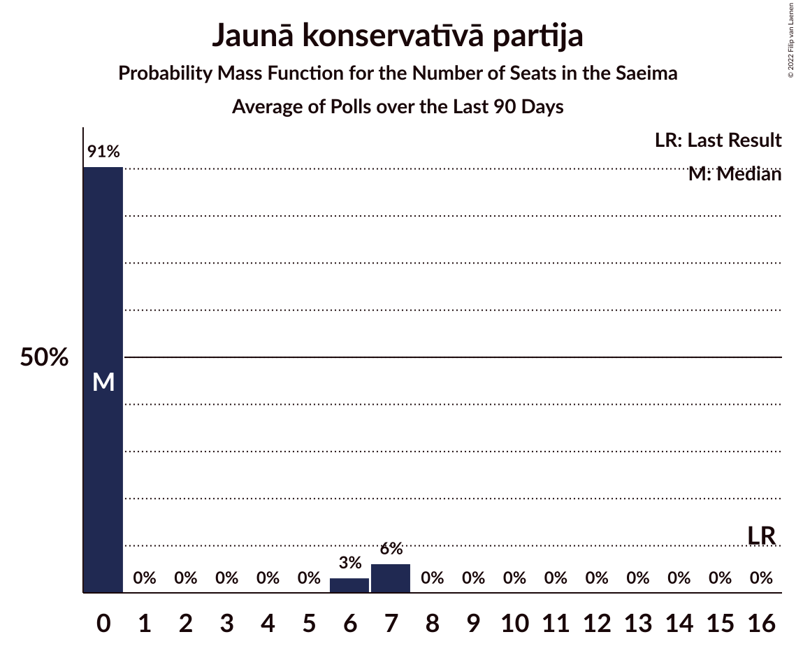

# Poll Average

<a href="#voting-intentions">Voting Intentions</a> | <a href="#seats">Seats</a> | <a href="#coalitions">Coalitions</a> | <a href="#technical-information">Technical Information</a>

## Summary

The table below lists the polls on which the average is based. They are the most recent polls (less than 90 days old) registered and analyzed so far.

| Period     | Polling firm/Commissioner(s) | SDPS | KPV | JKP | AP! | NA | ZZS | JV | LRA | LKS | P | NSL | VL | JS |
|:----------:|:----------------------------:|:--:|:--:|:--:|:--:|:--:|:--:|:--:|:--:|:--:|:--:|:--:|:--:|:--:|
| 6 October 2018 | General Election | 19.8%   23 | 14.2%   16 | 13.6%   16 | 12.0%   13 | 11.0%   13 | 9.9%   11 | 6.7%   8 | 4.1%   0 | 3.2%   0 | 2.6%   0 | 0.8%   0 | 0.0%   0 | 0.0%   0 |
| N/A | Poll Average | 18–23%   20–28 | 2–7%   0–7 | 8–15%   8–17 | 8–12%   9–14 | 10–18%   11–20 | 8–16%   10–17 | 10–18%   11–20 | 3–6%   0–7 | 3–5%   0–6 | 3–7%   0–7 | N/A   N/A | N/A   N/A | N/A   N/A |
| [21–24 November 2019](2019-11-24-Factum.html) | Factum | 17–22%   20–28 | 2–4%   0 | 11–15%   12–18 | 8–12%   9–14 | 10–14%   11–17 | 8–12%   10–14 | 14–18%   16–20 | 3–5%   0–6 | 3–5%   0–6 | 5–8%   0–8 | N/A   N/A | N/A   N/A | N/A   N/A |
| [2–12 November 2019](2019-11-12-SKDS.html) | SKDS   Latvijas Televīzija | 18–23%   21–27 | 4–7%   0–7 | 8–12%   8–13 | 8–12%   9–13 | 14–19%   15–20 | 12–16%   13–17 | 10–14%   11–17 | 4–7%   0–7 | 3–5%   0 | 3–5%   0–7 | N/A   N/A | N/A   N/A | N/A   N/A |
| 6 October 2018 | General Election | 19.8%   23 | 14.2%   16 | 13.6%   16 | 12.0%   13 | 11.0%   13 | 9.9%   11 | 6.7%   8 | 4.1%   0 | 3.2%   0 | 2.6%   0 | 0.8%   0 | 0.0%   0 | 0.0%   0 |

Only polls for which at least the sample size has been published are included in the table above.

**Legend:**
+ **Top half of each row:** Voting intentions (95% confidence interval)
+ **Bottom half of each row:** Seat projections for the Saeima (95% confidence interval)
+ **SDPS:** Sociāldemokrātiskā partija “Saskaņa”
+ **KPV:** Politiskā partija „KPV LV”
+ **JKP:** Jaunā konservatīvā partija
+ **AP!:** Attīstībai/Par!
+ **NA:** Nacionālā apvienība „Visu Latvijai!”–„Tēvzemei un Brīvībai/LNNK”
+ **ZZS:** Zaļo un Zemnieku savienība
+ **JV:** Jaunā VIENOTĪBA
+ **LRA:** Latvijas Reģionu Apvienība
+ **LKS:** Latvijas Krievu savienība
+ **P:** PROGRESĪVIE
+ **NSL:** No sirds Latvijai
+ **VL:** Vienoti Latvijai
+ **JS:** Jaunā Saskaņa
+ **N/A (single party):** Party not included the published results
+ **N/A (entire row):** Calculation for this opinion poll not started yet

## Voting Intentions

### Confidence Intervals

| Party | Last Result | Median | 80% Confidence Interval | 90% Confidence Interval | 95% Confidence Interval | 99% Confidence Interval |
|:-----:|:-----------:|:------:|:-----------------------:|:-----------------------:|:-----------------------:|:-----------------------:|
| <a href="#sociāldemokrātiskā-partija-“saskaņa”">Sociāldemokrātiskā partija “Saskaņa”</a> | 19.8% | 20.1% | 18.4–21.9% |18.0–22.4% | 17.6–22.9% | 16.8–23.8% |
| <a href="#politiskā-partija-„kpv-lv”">Politiskā partija „KPV LV”</a> | 14.2% | 4.2% | 2.6–6.2% |2.4–6.5% | 2.2–6.9% | 1.9–7.5% |
| <a href="#jaunā-konservatīvā-partija">Jaunā konservatīvā partija</a> | 13.6% | 11.4% | 9.1–13.8% |8.7–14.3% | 8.3–14.7% | 7.7–15.5% |
| <a href="#attīstībai/par!">Attīstībai/Par!</a> | 12.0% | 10.1% | 8.9–11.4% |8.6–11.8% | 8.3–12.2% | 7.8–12.9% |
| <a href="#nacionālā-apvienība-„visu-latvijai!”–„tēvzemei-un-brīvībai/lnnk”">Nacionālā apvienība „Visu Latvijai!”–„Tēvzemei un Brīvībai/LNNK”</a> | 11.0% | 13.9% | 11.1–17.1% |10.7–17.6% | 10.3–18.1% | 9.7–19.0% |
| <a href="#zaļo-un-zemnieku-savienība">Zaļo un Zemnieku savienība</a> | 9.9% | 11.8% | 9.2–14.7% |8.8–15.3% | 8.5–15.7% | 7.9–16.6% |
| <a href="#jaunā-vienotība">Jaunā VIENOTĪBA</a> | 6.7% | 13.9% | 10.9–16.9% |10.5–17.4% | 10.1–17.9% | 9.5–18.7% |
| <a href="#latvijas-reģionu-apvienība">Latvijas Reģionu Apvienība</a> | 4.1% | 4.5% | 3.5–5.8% |3.2–6.2% | 3.0–6.5% | 2.7–7.1% |
| <a href="#latvijas-krievu-savienība">Latvijas Krievu savienība</a> | 3.2% | 3.8% | 3.1–4.7% |2.9–5.0% | 2.7–5.2% | 2.4–5.7% |
| <a href="#progresīvie">PROGRESĪVIE</a> | 2.6% | 4.9% | 3.4–6.6% |3.1–7.0% | 2.9–7.3% | 2.6–7.9% |
| <a href="#no-sirds-latvijai">No sirds Latvijai</a> | 0.8% | N/A | N/A |N/A | N/A | N/A |
| <a href="#vienoti-latvijai">Vienoti Latvijai</a> | 0.0% | N/A | N/A |N/A | N/A | N/A |
| <a href="#jaunā-saskaņa">Jaunā Saskaņa</a> | 0.0% | N/A | N/A |N/A | N/A | N/A |

### Sociāldemokrātiskā partija “Saskaņa”

*For a full overview of the results for this party, see the [Sociāldemokrātiskā partija “Saskaņa”](party-sociāldemokrātiskāpartija“saskaņa”.html) page.*

| Voting Intentions | Probability | Accumulated | Special Marks |
|:-----------------:|:-----------:|:-----------:|:-------------:|
| 14.5–15.5% | 0% | 100% |  |
| 15.5–16.5% | 0.2% | 100% |  |
| 16.5–17.5% | 2% | 99.7% |  |
| 17.5–18.5% | 9% | 98% |  |
| 18.5–19.5% | 22% | 88% |  |
| 19.5–20.5% | 29% | 66% | Last Result, Median |
| 20.5–21.5% | 23% | 37% |  |
| 21.5–22.5% | 11% | 15% |  |
| 22.5–23.5% | 3% | 4% |  |
| 23.5–24.5% | 0.7% | 0.8% |  |
| 24.5–25.5% | 0.1% | 0.1% |  |
| 25.5–26.5% | 0% | 0% |  |

### Politiskā partija „KPV LV”

*For a full overview of the results for this party, see the [Politiskā partija „KPV LV”](party-politiskāpartija„kpvlv”.html) page.*

| Voting Intentions | Probability | Accumulated | Special Marks |
|:-----------------:|:-----------:|:-----------:|:-------------:|
| 0.5–1.5% | 0% | 100% |  |
| 1.5–2.5% | 8% | 100% |  |
| 2.5–3.5% | 32% | 92% |  |
| 3.5–4.5% | 14% | 60% | Median |
| 4.5–5.5% | 22% | 46% |  |
| 5.5–6.5% | 19% | 24% |  |
| 6.5–7.5% | 4% | 5% |  |
| 7.5–8.5% | 0.4% | 0.4% |  |
| 8.5–9.5% | 0% | 0% |  |
| 9.5–10.5% | 0% | 0% |  |
| 10.5–11.5% | 0% | 0% |  |
| 11.5–12.5% | 0% | 0% |  |
| 12.5–13.5% | 0% | 0% |  |
| 13.5–14.5% | 0% | 0% | Last Result |

### Jaunā konservatīvā partija

*For a full overview of the results for this party, see the [Jaunā konservatīvā partija](party-jaunākonservatīvāpartija.html) page.*

| Voting Intentions | Probability | Accumulated | Special Marks |
|:-----------------:|:-----------:|:-----------:|:-------------:|
| 5.5–6.5% | 0% | 100% |  |
| 6.5–7.5% | 0.3% | 100% |  |
| 7.5–8.5% | 4% | 99.7% |  |
| 8.5–9.5% | 14% | 96% |  |
| 9.5–10.5% | 19% | 82% |  |
| 10.5–11.5% | 15% | 63% | Median |
| 11.5–12.5% | 16% | 48% |  |
| 12.5–13.5% | 18% | 32% |  |
| 13.5–14.5% | 10% | 14% | Last Result |
| 14.5–15.5% | 3% | 3% |  |
| 15.5–16.5% | 0.4% | 0.5% |  |
| 16.5–17.5% | 0% | 0% |  |

### Attīstībai/Par!

*For a full overview of the results for this party, see the [Attīstībai/Par!](party-attīstībaipar.html) page.*

| Voting Intentions | Probability | Accumulated | Special Marks |
|:-----------------:|:-----------:|:-----------:|:-------------:|
| 5.5–6.5% | 0% | 100% |  |
| 6.5–7.5% | 0.2% | 100% |  |
| 7.5–8.5% | 5% | 99.8% |  |
| 8.5–9.5% | 24% | 95% |  |
| 9.5–10.5% | 38% | 72% | Median |
| 10.5–11.5% | 25% | 33% |  |
| 11.5–12.5% | 7% | 8% | Last Result |
| 12.5–13.5% | 1.1% | 1.2% |  |
| 13.5–14.5% | 0.1% | 0.1% |  |
| 14.5–15.5% | 0% | 0% |  |

### Nacionālā apvienība „Visu Latvijai!”–„Tēvzemei un Brīvībai/LNNK”

*For a full overview of the results for this party, see the [Nacionālā apvienība „Visu Latvijai!”–„Tēvzemei un Brīvībai/LNNK”](party-nacionālāapvienība„visulatvijai”–„tēvzemeiunbrīvībailnnk”.html) page.*

| Voting Intentions | Probability | Accumulated | Special Marks |
|:-----------------:|:-----------:|:-----------:|:-------------:|
| 7.5–8.5% | 0% | 100% |  |
| 8.5–9.5% | 0.3% | 100% |  |
| 9.5–10.5% | 4% | 99.6% |  |
| 10.5–11.5% | 13% | 96% | Last Result |
| 11.5–12.5% | 18% | 83% |  |
| 12.5–13.5% | 12% | 64% |  |
| 13.5–14.5% | 8% | 53% | Median |
| 14.5–15.5% | 12% | 45% |  |
| 15.5–16.5% | 16% | 32% |  |
| 16.5–17.5% | 11% | 16% |  |
| 17.5–18.5% | 4% | 6% |  |
| 18.5–19.5% | 1.0% | 1.2% |  |
| 19.5–20.5% | 0.1% | 0.2% |  |
| 20.5–21.5% | 0% | 0% |  |

### Zaļo un Zemnieku savienība

*For a full overview of the results for this party, see the [Zaļo un Zemnieku savienība](party-zaļounzemniekusavienība.html) page.*

| Voting Intentions | Probability | Accumulated | Special Marks |
|:-----------------:|:-----------:|:-----------:|:-------------:|
| 5.5–6.5% | 0% | 100% |  |
| 6.5–7.5% | 0.1% | 100% |  |
| 7.5–8.5% | 3% | 99.9% |  |
| 8.5–9.5% | 13% | 97% |  |
| 9.5–10.5% | 20% | 84% | Last Result |
| 10.5–11.5% | 12% | 64% |  |
| 11.5–12.5% | 9% | 52% | Median |
| 12.5–13.5% | 15% | 43% |  |
| 13.5–14.5% | 16% | 28% |  |
| 14.5–15.5% | 9% | 12% |  |
| 15.5–16.5% | 3% | 3% |  |
| 16.5–17.5% | 0.5% | 0.5% |  |
| 17.5–18.5% | 0.1% | 0.1% |  |
| 18.5–19.5% | 0% | 0% |  |

### Jaunā VIENOTĪBA

*For a full overview of the results for this party, see the [Jaunā VIENOTĪBA](party-jaunāvienotība.html) page.*

| Voting Intentions | Probability | Accumulated | Special Marks |
|:-----------------:|:-----------:|:-----------:|:-------------:|
| 6.5–7.5% | 0% | 100% | Last Result |
| 7.5–8.5% | 0% | 100% |  |
| 8.5–9.5% | 0.6% | 100% |  |
| 9.5–10.5% | 5% | 99.3% |  |
| 10.5–11.5% | 14% | 94% |  |
| 11.5–12.5% | 17% | 80% |  |
| 12.5–13.5% | 11% | 63% |  |
| 13.5–14.5% | 8% | 52% | Median |
| 14.5–15.5% | 14% | 44% |  |
| 15.5–16.5% | 16% | 31% |  |
| 16.5–17.5% | 10% | 14% |  |
| 17.5–18.5% | 3% | 4% |  |
| 18.5–19.5% | 0.7% | 0.7% |  |
| 19.5–20.5% | 0.1% | 0.1% |  |
| 20.5–21.5% | 0% | 0% |  |

### Latvijas Reģionu Apvienība

*For a full overview of the results for this party, see the [Latvijas Reģionu Apvienība](party-latvijasreģionuapvienība.html) page.*

| Voting Intentions | Probability | Accumulated | Special Marks |
|:-----------------:|:-----------:|:-----------:|:-------------:|
| 0.5–1.5% | 0% | 100% |  |
| 1.5–2.5% | 0.2% | 100% |  |
| 2.5–3.5% | 12% | 99.8% |  |
| 3.5–4.5% | 38% | 88% | Last Result |
| 4.5–5.5% | 34% | 50% | Median |
| 5.5–6.5% | 14% | 16% |  |
| 6.5–7.5% | 2% | 2% |  |
| 7.5–8.5% | 0.1% | 0.1% |  |
| 8.5–9.5% | 0% | 0% |  |

### Latvijas Krievu savienība

*For a full overview of the results for this party, see the [Latvijas Krievu savienība](party-latvijaskrievusavienība.html) page.*

| Voting Intentions | Probability | Accumulated | Special Marks |
|:-----------------:|:-----------:|:-----------:|:-------------:|
| 0.5–1.5% | 0% | 100% |  |
| 1.5–2.5% | 1.3% | 100% |  |
| 2.5–3.5% | 31% | 98.7% | Last Result |
| 3.5–4.5% | 53% | 68% | Median |
| 4.5–5.5% | 14% | 15% |  |
| 5.5–6.5% | 0.9% | 0.9% |  |
| 6.5–7.5% | 0% | 0% |  |

### PROGRESĪVIE

*For a full overview of the results for this party, see the [PROGRESĪVIE](party-progresīvie.html) page.*

| Voting Intentions | Probability | Accumulated | Special Marks |
|:-----------------:|:-----------:|:-----------:|:-------------:|
| 0.5–1.5% | 0% | 100% |  |
| 1.5–2.5% | 0.4% | 100% |  |
| 2.5–3.5% | 14% | 99.6% | Last Result |
| 3.5–4.5% | 28% | 86% |  |
| 4.5–5.5% | 21% | 58% | Median |
| 5.5–6.5% | 25% | 36% |  |
| 6.5–7.5% | 10% | 11% |  |
| 7.5–8.5% | 1.3% | 1.3% |  |
| 8.5–9.5% | 0.1% | 0.1% |  |
| 9.5–10.5% | 0% | 0% |  |

## Seats

### Confidence Intervals

| Party | Last Result | Median | 80% Confidence Interval | 90% Confidence Interval | 95% Confidence Interval | 99% Confidence Interval |
|:-----:|:-----------:|:------:|:-----------------------:|:-----------------------:|:-----------------------:|:-----------------------:|
| <a href="#sociāldemokrātiskā-partija-“saskaņa”">Sociāldemokrātiskā partija “Saskaņa”</a> | 23 | 23 | 21–26 |21–28 | 20–28 | 19–29 |
| <a href="#politiskā-partija-„kpv-lv”">Politiskā partija „KPV LV”</a> | 16 | 0 | 0–6 |0–6 | 0–7 | 0–7 |
| <a href="#jaunā-konservatīvā-partija">Jaunā konservatīvā partija</a> | 16 | 13 | 10–16 |8–16 | 8–17 | 8–20 |
| <a href="#attīstībai/par!">Attīstībai/Par!</a> | 13 | 10 | 10–13 |10–14 | 9–14 | 7–16 |
| <a href="#nacionālā-apvienība-„visu-latvijai!”–„tēvzemei-un-brīvībai/lnnk”">Nacionālā apvienība „Visu Latvijai!”–„Tēvzemei un Brīvībai/LNNK”</a> | 13 | 16 | 12–19 |12–20 | 11–20 | 11–20 |
| <a href="#zaļo-un-zemnieku-savienība">Zaļo un Zemnieku savienība</a> | 11 | 14 | 11–16 |11–16 | 10–17 | 10–18 |
| <a href="#jaunā-vienotība">Jaunā VIENOTĪBA</a> | 8 | 17 | 12–19 |11–20 | 11–20 | 11–21 |
| <a href="#latvijas-reģionu-apvienība">Latvijas Reģionu Apvienība</a> | 0 | 0 | 0–6 |0–6 | 0–7 | 0–7 |
| <a href="#latvijas-krievu-savienība">Latvijas Krievu savienība</a> | 0 | 0 | 0–6 |0–6 | 0–6 | 0–7 |
| <a href="#progresīvie">PROGRESĪVIE</a> | 0 | 0 | 0–7 |0–7 | 0–7 | 0–8 |
| <a href="#no-sirds-latvijai">No sirds Latvijai</a> | 0 | N/A | N/A |N/A | N/A | N/A |
| <a href="#vienoti-latvijai">Vienoti Latvijai</a> | 0 | N/A | N/A |N/A | N/A | N/A |
| <a href="#jaunā-saskaņa">Jaunā Saskaņa</a> | 0 | N/A | N/A |N/A | N/A | N/A |

### Sociāldemokrātiskā partija “Saskaņa”

*For a full overview of the results for this party, see the [Sociāldemokrātiskā partija “Saskaņa”](party-sociāldemokrātiskāpartija“saskaņa”.html) page.*

| Number of Seats | Probability | Accumulated | Special Marks |
|:---------------:|:-----------:|:-----------:|:-------------:|
| 17 | 0.1% | 100% |  |
| 18 | 0.2% | 99.9% |  |
| 19 | 1.0% | 99.7% |  |
| 20 | 2% | 98.7% |  |
| 21 | 22% | 97% |  |
| 22 | 16% | 75% |  |
| 23 | 9% | 59% | Last Result, Median |
| 24 | 28% | 50% |  |
| 25 | 7% | 22% |  |
| 26 | 8% | 15% |  |
| 27 | 2% | 7% |  |
| 28 | 4% | 5% |  |
| 29 | 0.7% | 0.8% |  |
| 30 | 0.1% | 0.1% |  |
| 31 | 0% | 0% |  |

### Politiskā partija „KPV LV”

*For a full overview of the results for this party, see the [Politiskā partija „KPV LV”](party-politiskāpartija„kpvlv”.html) page.*

| Number of Seats | Probability | Accumulated | Special Marks |
|:---------------:|:-----------:|:-----------:|:-------------:|
| 0 | 62% | 100% | Median |
| 1 | 0% | 38% |  |
| 2 | 0% | 38% |  |
| 3 | 0% | 38% |  |
| 4 | 0% | 38% |  |
| 5 | 24% | 38% |  |
| 6 | 10% | 14% |  |
| 7 | 4% | 4% |  |
| 8 | 0.1% | 0.4% |  |
| 9 | 0.1% | 0.3% |  |
| 10 | 0.2% | 0.2% |  |
| 11 | 0% | 0% |  |
| 12 | 0% | 0% |  |
| 13 | 0% | 0% |  |
| 14 | 0% | 0% |  |
| 15 | 0% | 0% |  |
| 16 | 0% | 0% | Last Result |

### Jaunā konservatīvā partija

*For a full overview of the results for this party, see the [Jaunā konservatīvā partija](party-jaunākonservatīvāpartija.html) page.*

| Number of Seats | Probability | Accumulated | Special Marks |
|:---------------:|:-----------:|:-----------:|:-------------:|
| 8 | 6% | 100% |  |
| 9 | 2% | 94% |  |
| 10 | 2% | 92% |  |
| 11 | 9% | 90% |  |
| 12 | 24% | 81% |  |
| 13 | 41% | 58% | Median |
| 14 | 3% | 16% |  |
| 15 | 3% | 13% |  |
| 16 | 7% | 10% | Last Result |
| 17 | 1.4% | 3% |  |
| 18 | 0.4% | 2% |  |
| 19 | 0.3% | 1.2% |  |
| 20 | 0.9% | 0.9% |  |
| 21 | 0% | 0% |  |

### Attīstībai/Par!

*For a full overview of the results for this party, see the [Attīstībai/Par!](party-attīstībaipar.html) page.*

| Number of Seats | Probability | Accumulated | Special Marks |
|:---------------:|:-----------:|:-----------:|:-------------:|
| 7 | 0.7% | 100% |  |
| 8 | 1.1% | 99.3% |  |
| 9 | 2% | 98% |  |
| 10 | 48% | 96% | Median |
| 11 | 21% | 48% |  |
| 12 | 9% | 27% |  |
| 13 | 10% | 18% | Last Result |
| 14 | 7% | 8% |  |
| 15 | 0.3% | 1.1% |  |
| 16 | 0.8% | 0.8% |  |
| 17 | 0% | 0% |  |

### Nacionālā apvienība „Visu Latvijai!”–„Tēvzemei un Brīvībai/LNNK”

*For a full overview of the results for this party, see the [Nacionālā apvienība „Visu Latvijai!”–„Tēvzemei un Brīvībai/LNNK”](party-nacionālāapvienība„visulatvijai”–„tēvzemeiunbrīvībailnnk”.html) page.*

| Number of Seats | Probability | Accumulated | Special Marks |
|:---------------:|:-----------:|:-----------:|:-------------:|
| 10 | 0.1% | 100% |  |
| 11 | 3% | 99.9% |  |
| 12 | 18% | 97% |  |
| 13 | 8% | 79% | Last Result |
| 14 | 13% | 71% |  |
| 15 | 5% | 58% |  |
| 16 | 31% | 53% | Median |
| 17 | 9% | 21% |  |
| 18 | 2% | 12% |  |
| 19 | 1.4% | 10% |  |
| 20 | 9% | 9% |  |
| 21 | 0.2% | 0.3% |  |
| 22 | 0% | 0% |  |

### Zaļo un Zemnieku savienība

*For a full overview of the results for this party, see the [Zaļo un Zemnieku savienība](party-zaļounzemniekusavienība.html) page.*

| Number of Seats | Probability | Accumulated | Special Marks |
|:---------------:|:-----------:|:-----------:|:-------------:|
| 8 | 0.1% | 100% |  |
| 9 | 0.2% | 99.9% |  |
| 10 | 3% | 99.7% |  |
| 11 | 38% | 97% | Last Result |
| 12 | 3% | 59% |  |
| 13 | 6% | 56% |  |
| 14 | 11% | 50% | Median |
| 15 | 12% | 40% |  |
| 16 | 24% | 27% |  |
| 17 | 3% | 4% |  |
| 18 | 0.6% | 0.9% |  |
| 19 | 0.2% | 0.2% |  |
| 20 | 0.1% | 0.1% |  |
| 21 | 0% | 0% |  |

### Jaunā VIENOTĪBA

*For a full overview of the results for this party, see the [Jaunā VIENOTĪBA](party-jaunāvienotība.html) page.*

| Number of Seats | Probability | Accumulated | Special Marks |
|:---------------:|:-----------:|:-----------:|:-------------:|
| 8 | 0% | 100% | Last Result |
| 9 | 0% | 100% |  |
| 10 | 0.2% | 100% |  |
| 11 | 5% | 99.7% |  |
| 12 | 5% | 94% |  |
| 13 | 4% | 90% |  |
| 14 | 22% | 86% |  |
| 15 | 9% | 64% |  |
| 16 | 4% | 55% |  |
| 17 | 14% | 51% | Median |
| 18 | 26% | 37% |  |
| 19 | 5% | 11% |  |
| 20 | 6% | 6% |  |
| 21 | 0.4% | 0.5% |  |
| 22 | 0% | 0.1% |  |
| 23 | 0.1% | 0.1% |  |
| 24 | 0% | 0% |  |

### Latvijas Reģionu Apvienība

*For a full overview of the results for this party, see the [Latvijas Reģionu Apvienība](party-latvijasreģionuapvienība.html) page.*

| Number of Seats | Probability | Accumulated | Special Marks |
|:---------------:|:-----------:|:-----------:|:-------------:|
| 0 | 57% | 100% | Last Result, Median |
| 1 | 0% | 43% |  |
| 2 | 0% | 43% |  |
| 3 | 0% | 43% |  |
| 4 | 0% | 43% |  |
| 5 | 0% | 43% |  |
| 6 | 39% | 43% |  |
| 7 | 4% | 4% |  |
| 8 | 0% | 0.3% |  |
| 9 | 0.3% | 0.3% |  |
| 10 | 0% | 0% |  |

### Latvijas Krievu savienība

*For a full overview of the results for this party, see the [Latvijas Krievu savienība](party-latvijaskrievusavienība.html) page.*

| Number of Seats | Probability | Accumulated | Special Marks |
|:---------------:|:-----------:|:-----------:|:-------------:|
| 0 | 85% | 100% | Last Result, Median |
| 1 | 0% | 15% |  |
| 2 | 0% | 15% |  |
| 3 | 0% | 15% |  |
| 4 | 0% | 15% |  |
| 5 | 0.9% | 15% |  |
| 6 | 13% | 14% |  |
| 7 | 1.0% | 1.1% |  |
| 8 | 0.2% | 0.2% |  |
| 9 | 0% | 0% |  |

### PROGRESĪVIE

*For a full overview of the results for this party, see the [PROGRESĪVIE](party-progresīvie.html) page.*

| Number of Seats | Probability | Accumulated | Special Marks |
|:---------------:|:-----------:|:-----------:|:-------------:|
| 0 | 55% | 100% | Last Result, Median |
| 1 | 0% | 45% |  |
| 2 | 0% | 45% |  |
| 3 | 0% | 45% |  |
| 4 | 0% | 45% |  |
| 5 | 0.2% | 45% |  |
| 6 | 6% | 45% |  |
| 7 | 37% | 39% |  |
| 8 | 2% | 2% |  |
| 9 | 0.1% | 0.2% |  |
| 10 | 0.1% | 0.1% |  |
| 11 | 0% | 0% |  |

## Coalitions

### Confidence Intervals

| Coalition | Last Result | Median | Majority? | 80% Confidence Interval | 90% Confidence Interval | 95% Confidence Interval | 99% Confidence Interval |
|:---------:|:-----------:|:------:|:---------:|:-----------------------:|:-----------------------:|:-----------------------:|:-----------------------:|
| Jaunā konservatīvā partija – Attīstībai/Par! – Nacionālā apvienība „Visu Latvijai!”–„Tēvzemei un Brīvībai/LNNK” – Zaļo un Zemnieku savienība – Jaunā VIENOTĪBA | 61 | 68 | 100% | 63–75 | 63–76 | 62–76 | 60–77 |
| Politiskā partija „KPV LV” – Jaunā konservatīvā partija – Attīstībai/Par! – Nacionālā apvienība „Visu Latvijai!”–„Tēvzemei un Brīvībai/LNNK” – Jaunā VIENOTĪBA | 66 | 57 | 97% | 52–61 | 52–62 | 50–65 | 49–65 |
| Jaunā konservatīvā partija – Attīstībai/Par! – Nacionālā apvienība „Visu Latvijai!”–„Tēvzemei un Brīvībai/LNNK” – Jaunā VIENOTĪBA | 50 | 54 | 87% | 50–61 | 49–61 | 47–65 | 45–65 |
| Jaunā konservatīvā partija – Nacionālā apvienība „Visu Latvijai!”–„Tēvzemei un Brīvībai/LNNK” – Zaļo un Zemnieku savienība – Jaunā VIENOTĪBA | 48 | 57 | 99.6% | 53–62 | 53–63 | 52–63 | 51–64 |
| Attīstībai/Par! – Nacionālā apvienība „Visu Latvijai!”–„Tēvzemei un Brīvībai/LNNK” – Zaļo un Zemnieku savienība – Jaunā VIENOTĪBA | 45 | 56 | 91% | 51–60 | 50–63 | 50–63 | 49–64 |
| Jaunā konservatīvā partija – Attīstībai/Par! – Nacionālā apvienība „Visu Latvijai!”–„Tēvzemei un Brīvībai/LNNK” – Zaļo un Zemnieku savienība | 53 | 52 | 67% | 47–57 | 46–61 | 46–61 | 46–61 |
| Sociāldemokrātiskā partija “Saskaņa” – Jaunā konservatīvā partija – Attīstībai/Par! | 52 | 46 | 12% | 43–51 | 43–55 | 41–55 | 39–57 |
| Politiskā partija „KPV LV” – Jaunā konservatīvā partija – Nacionālā apvienība „Visu Latvijai!”–„Tēvzemei un Brīvībai/LNNK” – Jaunā VIENOTĪBA | 53 | 46 | 5% | 42–50 | 41–50 | 39–51 | 38–53 |
| Politiskā partija „KPV LV” – Attīstībai/Par! – Nacionālā apvienība „Visu Latvijai!”–„Tēvzemei un Brīvībai/LNNK” – Jaunā VIENOTĪBA | 50 | 45 | 7% | 40–48 | 39–51 | 38–51 | 37–52 |
| Nacionālā apvienība „Visu Latvijai!”–„Tēvzemei un Brīvībai/LNNK” – Zaļo un Zemnieku savienība – Jaunā VIENOTĪBA | 32 | 45 | 2% | 41–48 | 40–50 | 40–50 | 39–52 |
| Jaunā konservatīvā partija – Nacionālā apvienība „Visu Latvijai!”–„Tēvzemei un Brīvībai/LNNK” – Zaļo un Zemnieku savienība | 40 | 41 | 0.1% | 36–45 | 36–48 | 36–48 | 35–48 |
| Politiskā partija „KPV LV” – Jaunā konservatīvā partija – Attīstībai/Par! – Jaunā VIENOTĪBA | 53 | 41 | 0.3% | 37–46 | 36–47 | 33–48 | 33–50 |
| Attīstībai/Par! – Nacionālā apvienība „Visu Latvijai!”–„Tēvzemei un Brīvībai/LNNK” – Zaļo un Zemnieku savienība | 37 | 40 | 0.1% | 34–45 | 33–48 | 33–48 | 32–49 |
| Politiskā partija „KPV LV” – Jaunā konservatīvā partija – Attīstībai/Par! – Nacionālā apvienība „Visu Latvijai!”–„Tēvzemei un Brīvībai/LNNK” | 58 | 41 | 0% | 36–46 | 35–46 | 35–47 | 34–49 |
| Sociāldemokrātiskā partija “Saskaņa” – Politiskā partija „KPV LV” – Zaļo un Zemnieku savienība | 50 | 39 | 0.1% | 33–44 | 33–47 | 32–47 | 30–49 |
| Sociāldemokrātiskā partija “Saskaņa” – Attīstībai/Par! | 36 | 34 | 0% | 31–37 | 31–39 | 30–39 | 29–43 |
| Sociāldemokrātiskā partija “Saskaņa” – Politiskā partija „KPV LV” | 39 | 25 | 0% | 22–30 | 21–32 | 21–32 | 19–34 |

### Jaunā konservatīvā partija – Attīstībai/Par! – Nacionālā apvienība „Visu Latvijai!”–„Tēvzemei un Brīvībai/LNNK” – Zaļo un Zemnieku savienība – Jaunā VIENOTĪBA

| Number of Seats | Probability | Accumulated | Special Marks |
|:---------------:|:-----------:|:-----------:|:-------------:|
| 58 | 0.1% | 100% |  |
| 59 | 0% | 99.9% |  |
| 60 | 0.6% | 99.9% |  |
| 61 | 0.2% | 99.3% | Last Result |
| 62 | 4% | 99.1% |  |
| 63 | 8% | 96% |  |
| 64 | 3% | 87% |  |
| 65 | 18% | 84% |  |
| 66 | 4% | 66% |  |
| 67 | 5% | 62% |  |
| 68 | 20% | 57% |  |
| 69 | 8% | 37% |  |
| 70 | 9% | 29% | Median |
| 71 | 3% | 20% |  |
| 72 | 5% | 17% |  |
| 73 | 0.5% | 11% |  |
| 74 | 0.6% | 11% |  |
| 75 | 1.5% | 10% |  |
| 76 | 8% | 9% |  |
| 77 | 0.1% | 0.6% |  |
| 78 | 0.1% | 0.5% |  |
| 79 | 0.4% | 0.4% |  |
| 80 | 0% | 0% |  |

### Politiskā partija „KPV LV” – Jaunā konservatīvā partija – Attīstībai/Par! – Nacionālā apvienība „Visu Latvijai!”–„Tēvzemei un Brīvībai/LNNK” – Jaunā VIENOTĪBA

| Number of Seats | Probability | Accumulated | Special Marks |
|:---------------:|:-----------:|:-----------:|:-------------:|
| 47 | 0.2% | 100% |  |
| 48 | 0% | 99.8% |  |
| 49 | 1.5% | 99.8% |  |
| 50 | 1.2% | 98% |  |
| 51 | 2% | 97% | Majority |
| 52 | 7% | 95% |  |
| 53 | 4% | 88% |  |
| 54 | 16% | 84% |  |
| 55 | 6% | 68% |  |
| 56 | 8% | 62% | Median |
| 57 | 20% | 54% |  |
| 58 | 8% | 33% |  |
| 59 | 2% | 26% |  |
| 60 | 2% | 24% |  |
| 61 | 12% | 22% |  |
| 62 | 5% | 9% |  |
| 63 | 1.4% | 4% |  |
| 64 | 0.1% | 3% |  |
| 65 | 2% | 3% |  |
| 66 | 0.2% | 0.4% | Last Result |
| 67 | 0.1% | 0.3% |  |
| 68 | 0.2% | 0.2% |  |
| 69 | 0% | 0% |  |

### Jaunā konservatīvā partija – Attīstībai/Par! – Nacionālā apvienība „Visu Latvijai!”–„Tēvzemei un Brīvībai/LNNK” – Jaunā VIENOTĪBA

| Number of Seats | Probability | Accumulated | Special Marks |
|:---------------:|:-----------:|:-----------:|:-------------:|
| 45 | 0.6% | 100% |  |
| 46 | 0.1% | 99.4% |  |
| 47 | 3% | 99.3% |  |
| 48 | 0.3% | 96% |  |
| 49 | 5% | 95% |  |
| 50 | 4% | 91% | Last Result |
| 51 | 4% | 87% | Majority |
| 52 | 25% | 83% |  |
| 53 | 1.3% | 58% |  |
| 54 | 14% | 57% |  |
| 55 | 4% | 43% |  |
| 56 | 13% | 39% | Median |
| 57 | 2% | 26% |  |
| 58 | 5% | 24% |  |
| 59 | 2% | 19% |  |
| 60 | 2% | 17% |  |
| 61 | 12% | 15% |  |
| 62 | 0.1% | 3% |  |
| 63 | 0.4% | 3% |  |
| 64 | 0% | 3% |  |
| 65 | 2% | 3% |  |
| 66 | 0.2% | 0.4% |  |
| 67 | 0.1% | 0.3% |  |
| 68 | 0.2% | 0.2% |  |
| 69 | 0% | 0% |  |

### Jaunā konservatīvā partija – Nacionālā apvienība „Visu Latvijai!”–„Tēvzemei un Brīvībai/LNNK” – Zaļo un Zemnieku savienība – Jaunā VIENOTĪBA

| Number of Seats | Probability | Accumulated | Special Marks |
|:---------------:|:-----------:|:-----------:|:-------------:|
| 48 | 0.1% | 100% | Last Result |
| 49 | 0.1% | 99.9% |  |
| 50 | 0.3% | 99.8% |  |
| 51 | 0.3% | 99.6% | Majority |
| 52 | 4% | 99.3% |  |
| 53 | 9% | 95% |  |
| 54 | 16% | 86% |  |
| 55 | 7% | 70% |  |
| 56 | 8% | 64% |  |
| 57 | 7% | 56% |  |
| 58 | 27% | 50% |  |
| 59 | 2% | 23% |  |
| 60 | 6% | 21% | Median |
| 61 | 4% | 15% |  |
| 62 | 2% | 11% |  |
| 63 | 8% | 9% |  |
| 64 | 0.8% | 1.2% |  |
| 65 | 0.4% | 0.5% |  |
| 66 | 0% | 0.1% |  |
| 67 | 0% | 0% |  |

### Attīstībai/Par! – Nacionālā apvienība „Visu Latvijai!”–„Tēvzemei un Brīvībai/LNNK” – Zaļo un Zemnieku savienība – Jaunā VIENOTĪBA

| Number of Seats | Probability | Accumulated | Special Marks |
|:---------------:|:-----------:|:-----------:|:-------------:|
| 45 | 0% | 100% | Last Result |
| 46 | 0% | 100% |  |
| 47 | 0% | 100% |  |
| 48 | 0.3% | 100% |  |
| 49 | 0.4% | 99.7% |  |
| 50 | 8% | 99.3% |  |
| 51 | 4% | 91% | Majority |
| 52 | 16% | 88% |  |
| 53 | 4% | 71% |  |
| 54 | 8% | 68% |  |
| 55 | 5% | 60% |  |
| 56 | 28% | 55% |  |
| 57 | 7% | 27% | Median |
| 58 | 4% | 20% |  |
| 59 | 6% | 17% |  |
| 60 | 1.4% | 11% |  |
| 61 | 0.5% | 9% |  |
| 62 | 0.8% | 9% |  |
| 63 | 7% | 8% |  |
| 64 | 0.8% | 1.1% |  |
| 65 | 0.2% | 0.4% |  |
| 66 | 0.1% | 0.2% |  |
| 67 | 0% | 0% |  |

### Jaunā konservatīvā partija – Attīstībai/Par! – Nacionālā apvienība „Visu Latvijai!”–„Tēvzemei un Brīvībai/LNNK” – Zaļo un Zemnieku savienība

| Number of Seats | Probability | Accumulated | Special Marks |
|:---------------:|:-----------:|:-----------:|:-------------:|
| 44 | 0.1% | 100% |  |
| 45 | 0.2% | 99.8% |  |
| 46 | 8% | 99.6% |  |
| 47 | 14% | 92% |  |
| 48 | 1.0% | 78% |  |
| 49 | 4% | 77% |  |
| 50 | 7% | 74% |  |
| 51 | 9% | 67% | Majority |
| 52 | 9% | 57% |  |
| 53 | 12% | 49% | Last Result, Median |
| 54 | 21% | 37% |  |
| 55 | 2% | 16% |  |
| 56 | 3% | 13% |  |
| 57 | 1.0% | 11% |  |
| 58 | 2% | 10% |  |
| 59 | 0.7% | 8% |  |
| 60 | 1.0% | 7% |  |
| 61 | 6% | 6% |  |
| 62 | 0% | 0.1% |  |
| 63 | 0.1% | 0.1% |  |
| 64 | 0% | 0% |  |

### Sociāldemokrātiskā partija “Saskaņa” – Jaunā konservatīvā partija – Attīstībai/Par!

| Number of Seats | Probability | Accumulated | Special Marks |
|:---------------:|:-----------:|:-----------:|:-------------:|
| 38 | 0% | 100% |  |
| 39 | 0.8% | 99.9% |  |
| 40 | 0.3% | 99.2% |  |
| 41 | 3% | 98.9% |  |
| 42 | 0.8% | 96% |  |
| 43 | 20% | 95% |  |
| 44 | 4% | 75% |  |
| 45 | 2% | 70% |  |
| 46 | 18% | 68% | Median |
| 47 | 14% | 50% |  |
| 48 | 7% | 36% |  |
| 49 | 4% | 29% |  |
| 50 | 13% | 25% |  |
| 51 | 3% | 12% | Majority |
| 52 | 1.2% | 9% | Last Result |
| 53 | 1.2% | 8% |  |
| 54 | 1.2% | 7% |  |
| 55 | 4% | 6% |  |
| 56 | 0.1% | 2% |  |
| 57 | 2% | 2% |  |
| 58 | 0% | 0% |  |

### Politiskā partija „KPV LV” – Jaunā konservatīvā partija – Nacionālā apvienība „Visu Latvijai!”–„Tēvzemei un Brīvībai/LNNK” – Jaunā VIENOTĪBA

| Number of Seats | Probability | Accumulated | Special Marks |
|:---------------:|:-----------:|:-----------:|:-------------:|
| 38 | 1.1% | 100% |  |
| 39 | 1.5% | 98.9% |  |
| 40 | 0.4% | 97% |  |
| 41 | 2% | 97% |  |
| 42 | 8% | 95% |  |
| 43 | 18% | 87% |  |
| 44 | 5% | 69% |  |
| 45 | 8% | 63% |  |
| 46 | 7% | 56% | Median |
| 47 | 23% | 48% |  |
| 48 | 10% | 26% |  |
| 49 | 2% | 16% |  |
| 50 | 9% | 14% |  |
| 51 | 2% | 5% | Majority |
| 52 | 0.7% | 2% |  |
| 53 | 2% | 2% | Last Result |
| 54 | 0% | 0.1% |  |
| 55 | 0.1% | 0.1% |  |
| 56 | 0% | 0% |  |

### Politiskā partija „KPV LV” – Attīstībai/Par! – Nacionālā apvienība „Visu Latvijai!”–„Tēvzemei un Brīvībai/LNNK” – Jaunā VIENOTĪBA

| Number of Seats | Probability | Accumulated | Special Marks |
|:---------------:|:-----------:|:-----------:|:-------------:|
| 37 | 2% | 100% |  |
| 38 | 2% | 98% |  |
| 39 | 6% | 96% |  |
| 40 | 2% | 90% |  |
| 41 | 15% | 88% |  |
| 42 | 9% | 73% |  |
| 43 | 5% | 64% | Median |
| 44 | 4% | 59% |  |
| 45 | 29% | 54% |  |
| 46 | 5% | 25% |  |
| 47 | 4% | 20% |  |
| 48 | 7% | 17% |  |
| 49 | 2% | 9% |  |
| 50 | 0.6% | 8% | Last Result |
| 51 | 6% | 7% | Majority |
| 52 | 1.1% | 1.2% |  |
| 53 | 0% | 0.1% |  |
| 54 | 0% | 0% |  |

### Nacionālā apvienība „Visu Latvijai!”–„Tēvzemei un Brīvībai/LNNK” – Zaļo un Zemnieku savienība – Jaunā VIENOTĪBA

| Number of Seats | Probability | Accumulated | Special Marks |
|:---------------:|:-----------:|:-----------:|:-------------:|
| 32 | 0% | 100% | Last Result |
| 33 | 0% | 100% |  |
| 34 | 0% | 100% |  |
| 35 | 0% | 100% |  |
| 36 | 0% | 100% |  |
| 37 | 0% | 100% |  |
| 38 | 0.2% | 100% |  |
| 39 | 0.4% | 99.7% |  |
| 40 | 8% | 99.3% |  |
| 41 | 17% | 91% |  |
| 42 | 6% | 74% |  |
| 43 | 7% | 68% |  |
| 44 | 9% | 60% |  |
| 45 | 9% | 51% |  |
| 46 | 21% | 43% |  |
| 47 | 10% | 21% | Median |
| 48 | 1.3% | 11% |  |
| 49 | 1.1% | 10% |  |
| 50 | 7% | 9% |  |
| 51 | 0.7% | 2% | Majority |
| 52 | 1.2% | 1.2% |  |
| 53 | 0% | 0% |  |

### Jaunā konservatīvā partija – Nacionālā apvienība „Visu Latvijai!”–„Tēvzemei un Brīvībai/LNNK” – Zaļo un Zemnieku savienība

| Number of Seats | Probability | Accumulated | Special Marks |
|:---------------:|:-----------:|:-----------:|:-------------:|
| 34 | 0.2% | 100% |  |
| 35 | 0.4% | 99.8% |  |
| 36 | 19% | 99.4% |  |
| 37 | 4% | 80% |  |
| 38 | 6% | 76% |  |
| 39 | 4% | 71% |  |
| 40 | 11% | 67% | Last Result |
| 41 | 13% | 57% |  |
| 42 | 5% | 43% |  |
| 43 | 6% | 39% | Median |
| 44 | 21% | 33% |  |
| 45 | 3% | 12% |  |
| 46 | 0.4% | 10% |  |
| 47 | 1.5% | 9% |  |
| 48 | 7% | 8% |  |
| 49 | 0.1% | 0.5% |  |
| 50 | 0.3% | 0.4% |  |
| 51 | 0% | 0.1% | Majority |
| 52 | 0% | 0% |  |

### Politiskā partija „KPV LV” – Jaunā konservatīvā partija – Attīstībai/Par! – Jaunā VIENOTĪBA

| Number of Seats | Probability | Accumulated | Special Marks |
|:---------------:|:-----------:|:-----------:|:-------------:|
| 30 | 0.2% | 100% |  |
| 31 | 0% | 99.8% |  |
| 32 | 0.1% | 99.8% |  |
| 33 | 2% | 99.6% |  |
| 34 | 1.4% | 97% |  |
| 35 | 0.6% | 96% |  |
| 36 | 4% | 96% |  |
| 37 | 3% | 91% |  |
| 38 | 1.2% | 89% |  |
| 39 | 4% | 87% |  |
| 40 | 7% | 83% | Median |
| 41 | 30% | 76% |  |
| 42 | 18% | 46% |  |
| 43 | 6% | 27% |  |
| 44 | 2% | 21% |  |
| 45 | 2% | 19% |  |
| 46 | 8% | 17% |  |
| 47 | 6% | 9% |  |
| 48 | 1.1% | 3% |  |
| 49 | 1.4% | 2% |  |
| 50 | 0.4% | 0.8% |  |
| 51 | 0% | 0.3% | Majority |
| 52 | 0% | 0.3% |  |
| 53 | 0.3% | 0.3% | Last Result |
| 54 | 0% | 0% |  |

### Attīstībai/Par! – Nacionālā apvienība „Visu Latvijai!”–„Tēvzemei un Brīvībai/LNNK” – Zaļo un Zemnieku savienība

| Number of Seats | Probability | Accumulated | Special Marks |
|:---------------:|:-----------:|:-----------:|:-------------:|
| 30 | 0.1% | 100% |  |
| 31 | 0.2% | 99.9% |  |
| 32 | 0.6% | 99.7% |  |
| 33 | 8% | 99.2% |  |
| 34 | 14% | 91% |  |
| 35 | 2% | 77% |  |
| 36 | 10% | 75% |  |
| 37 | 4% | 66% | Last Result |
| 38 | 4% | 62% |  |
| 39 | 5% | 58% |  |
| 40 | 5% | 53% | Median |
| 41 | 1.1% | 48% |  |
| 42 | 30% | 47% |  |
| 43 | 5% | 17% |  |
| 44 | 2% | 12% |  |
| 45 | 2% | 10% |  |
| 46 | 0.8% | 9% |  |
| 47 | 0.6% | 8% |  |
| 48 | 6% | 7% |  |
| 49 | 1.0% | 1.2% |  |
| 50 | 0.1% | 0.1% |  |
| 51 | 0% | 0.1% | Majority |
| 52 | 0% | 0% |  |

### Politiskā partija „KPV LV” – Jaunā konservatīvā partija – Attīstībai/Par! – Nacionālā apvienība „Visu Latvijai!”–„Tēvzemei un Brīvībai/LNNK”

| Number of Seats | Probability | Accumulated | Special Marks |
|:---------------:|:-----------:|:-----------:|:-------------:|
| 32 | 0.1% | 100% |  |
| 33 | 0.3% | 99.9% |  |
| 34 | 2% | 99.6% |  |
| 35 | 4% | 98% |  |
| 36 | 16% | 94% |  |
| 37 | 2% | 78% |  |
| 38 | 8% | 76% |  |
| 39 | 6% | 68% | Median |
| 40 | 6% | 62% |  |
| 41 | 11% | 56% |  |
| 42 | 2% | 45% |  |
| 43 | 22% | 43% |  |
| 44 | 3% | 21% |  |
| 45 | 8% | 19% |  |
| 46 | 7% | 10% |  |
| 47 | 1.1% | 3% |  |
| 48 | 2% | 2% |  |
| 49 | 0.4% | 0.7% |  |
| 50 | 0.3% | 0.3% |  |
| 51 | 0% | 0% | Majority |
| 52 | 0% | 0% |  |
| 53 | 0% | 0% |  |
| 54 | 0% | 0% |  |
| 55 | 0% | 0% |  |
| 56 | 0% | 0% |  |
| 57 | 0% | 0% |  |
| 58 | 0% | 0% | Last Result |

### Sociāldemokrātiskā partija “Saskaņa” – Politiskā partija „KPV LV” – Zaļo un Zemnieku savienība

| Number of Seats | Probability | Accumulated | Special Marks |
|:---------------:|:-----------:|:-----------:|:-------------:|
| 29 | 0.1% | 100% |  |
| 30 | 0.5% | 99.9% |  |
| 31 | 0.9% | 99.4% |  |
| 32 | 2% | 98.6% |  |
| 33 | 16% | 96% |  |
| 34 | 2% | 80% |  |
| 35 | 9% | 78% |  |
| 36 | 5% | 68% |  |
| 37 | 9% | 64% | Median |
| 38 | 2% | 55% |  |
| 39 | 11% | 52% |  |
| 40 | 1.1% | 41% |  |
| 41 | 0.7% | 40% |  |
| 42 | 20% | 39% |  |
| 43 | 2% | 19% |  |
| 44 | 10% | 17% |  |
| 45 | 1.1% | 8% |  |
| 46 | 0.5% | 6% |  |
| 47 | 4% | 6% |  |
| 48 | 0.1% | 2% |  |
| 49 | 2% | 2% |  |
| 50 | 0% | 0.1% | Last Result |
| 51 | 0% | 0.1% | Majority |
| 52 | 0.1% | 0.1% |  |
| 53 | 0% | 0% |  |

### Sociāldemokrātiskā partija “Saskaņa” – Attīstībai/Par!

| Number of Seats | Probability | Accumulated | Special Marks |
|:---------------:|:-----------:|:-----------:|:-------------:|
| 28 | 0.1% | 100% |  |
| 29 | 1.1% | 99.8% |  |
| 30 | 2% | 98.8% |  |
| 31 | 20% | 97% |  |
| 32 | 1.3% | 77% |  |
| 33 | 22% | 76% | Median |
| 34 | 12% | 54% |  |
| 35 | 6% | 42% |  |
| 36 | 13% | 36% | Last Result |
| 37 | 15% | 24% |  |
| 38 | 3% | 9% |  |
| 39 | 4% | 6% |  |
| 40 | 0.9% | 2% |  |
| 41 | 0% | 1.2% |  |
| 42 | 0.6% | 1.2% |  |
| 43 | 0.5% | 0.6% |  |
| 44 | 0.1% | 0.1% |  |
| 45 | 0% | 0% |  |

### Sociāldemokrātiskā partija “Saskaņa” – Politiskā partija „KPV LV”

| Number of Seats | Probability | Accumulated | Special Marks |
|:---------------:|:-----------:|:-----------:|:-------------:|
| 17 | 0.1% | 100% |  |
| 18 | 0% | 99.9% |  |
| 19 | 0.8% | 99.8% |  |
| 20 | 2% | 99.1% |  |
| 21 | 3% | 98% |  |
| 22 | 15% | 95% |  |
| 23 | 6% | 79% | Median |
| 24 | 21% | 74% |  |
| 25 | 4% | 52% |  |
| 26 | 23% | 48% |  |
| 27 | 0.7% | 25% |  |
| 28 | 8% | 24% |  |
| 29 | 2% | 16% |  |
| 30 | 8% | 14% |  |
| 31 | 1.1% | 6% |  |
| 32 | 3% | 5% |  |
| 33 | 0% | 2% |  |
| 34 | 2% | 2% |  |
| 35 | 0.1% | 0.1% |  |
| 36 | 0% | 0% |  |
| 37 | 0% | 0% |  |
| 38 | 0% | 0% |  |
| 39 | 0% | 0% | Last Result |

## Technical Information

+ **Number of polls included in this average:** 2
+ **Lowest number of simulations done in a poll included in this average:** 131,072
+ **Total number of simulations done in the polls included in this average:** 262,144
+ **Error estimate:** 2.26%
