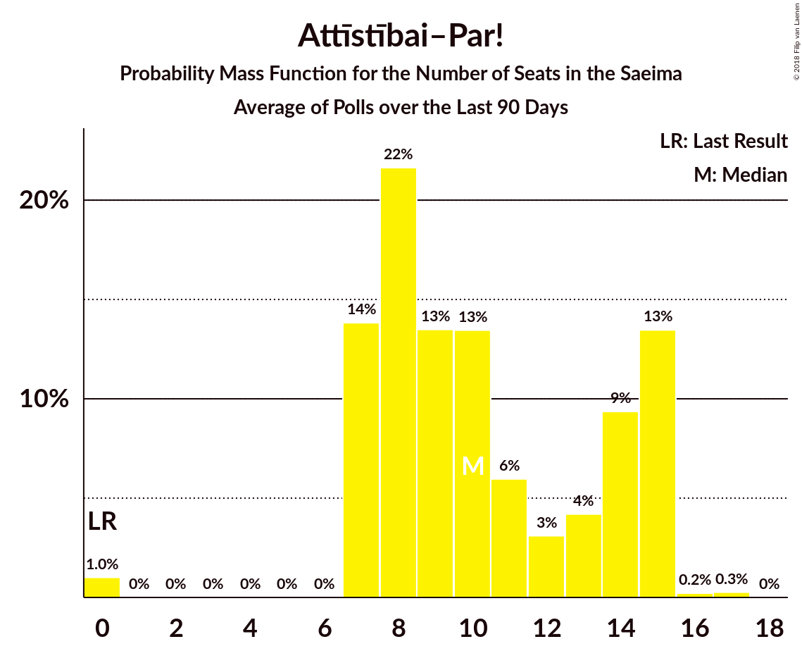
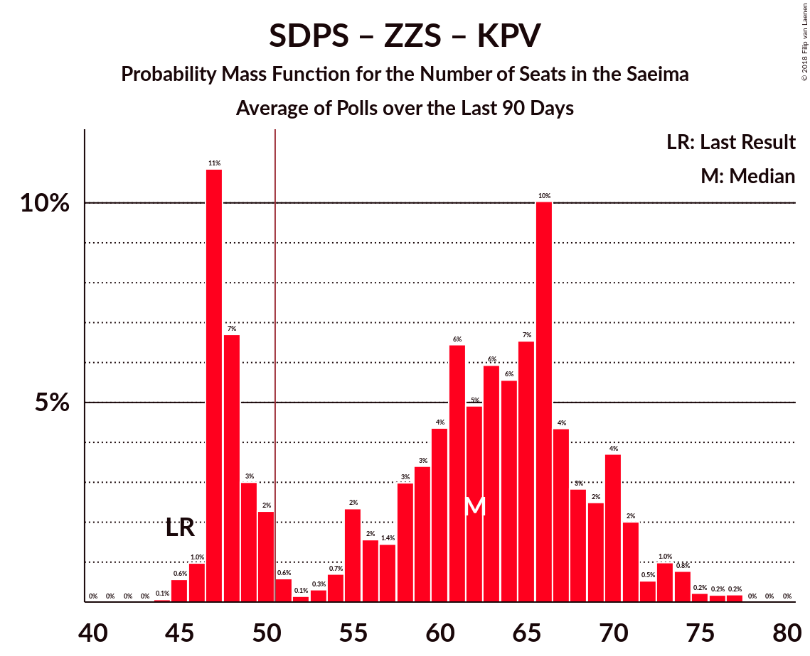

# Poll Average

<a href="#voting-intentions">Voting Intentions</a> | <a href="#seats">Seats</a> | <a href="#coalitions">Coalitions</a> | <a href="#technical-information">Technical Information</a>

## Summary

The table below lists the polls on which the average is based. They are the most recent polls (less than 90 days old) registered and analyzed so far.

| Period     | Polling firm/Commissioner(s) | SDPS | JV | ZZS | NA | NSL | LRA | LKS | VL | LA | JKP | KPV | PAR | AP! | P |
|:----------:|:----------------------------:|:--:|:--:|:--:|:--:|:--:|:--:|:--:|:--:|:--:|:--:|:--:|:--:|:--:|:--:|
| 4 October 2014 | General Election | 23.0%   24 | 21.9%   23 | 19.5%   21 | 16.6%   17 | 6.8%   7 | 6.7%   8 | 1.6%   0 | 1.2%   0 | 0.9%   0 | 0.7%   0 | 0.0%   0 | 0.0%   0 | 0.9%   0 | 0.0%   0 |
| N/A | Poll Average | 18–30%   23–38 | 4–10%   0–12 | 11–20%   15–25 | 6–13%   7–18 | 0–4%   0 | 0–5%   0 | 0–5%   0 | N/A   N/A | N/A   N/A | 7–17%   8–21 | 9–18%   11–23 | N/A   N/A | 6–12%   0 | N/A   N/A |
| [17–23 September 2018](2018-09-23-FACTUM.html) | FACTUM | 18–21%   23–26 | 8–10%   10–13 | 11–14%   15–17 | 11–14%   13–18 | N/A   N/A | 2–4%   0 | 2–3%   0 | N/A   N/A | N/A   N/A | 15–18%   19–22 | 10–12%   12–15 | N/A   N/A | 10–12%   0 | N/A   N/A |
| [8–18 September 2018](2018-09-18-SKDS.html) | SKDS   Latvijas Televīzija | 24–32%   31–41 | 5–8%   0–11 | 13–18%   16–25 | 9–14%   11–18 | 1–4%   0 | 2–5%   0–7 | 2–4%   0 | N/A   N/A | N/A   N/A | 6–11%   8–14 | 8–13%   9–15 | N/A   N/A | 6–11%   0 | N/A   N/A |
| [10–14 September 2018](2018-09-14-Norstat.html) | Norstat | 19–28%   24–36 | 3–9%   0–11 | 11–20%   16–27 | 6–13%   7–17 | N/A   N/A | 1–5%   0 | 2–6%   0–7 | N/A   N/A | N/A   N/A | 7–14%   9–18 | 10–18%   12–23 | N/A   N/A | 5–11%   0 | N/A   N/A |
| [8 August–12 September 2018](2018-09-12-KantarTNS.html) | Kantar TNS   Delfi | 23–30%   27–36 | 4–8%   0–9 | 15–20%   19–25 | 6–10%   6–12 | 0–1%   0 | 0–2%   0 | 0–2%   0 | N/A   N/A | N/A   N/A | 7–12%   9–15 | 14–19%   16–24 | N/A   N/A | 5–9%   0 | N/A   N/A |
| 4 October 2014 | General Election | 23.0%   24 | 21.9%   23 | 19.5%   21 | 16.6%   17 | 6.8%   7 | 6.7%   8 | 1.6%   0 | 1.2%   0 | 0.9%   0 | 0.7%   0 | 0.0%   0 | 0.0%   0 | 0.9%   0 | 0.0%   0 |

Only polls for which at least the sample size has been published are included in the table above.

**Legend:**
+ **Top half of each row:** Voting intentions (95% confidence interval)
+ **Bottom half of each row:** Seat projections for the Saeima (95% confidence interval)
+ **SDPS:** Sociāldemokrātiskā Partija “Saskaņa”
+ **JV:** Vienotība
+ **ZZS:** Zaļo un Zemnieku savienība
+ **NA:** Nacionālā apvienība „Visu Latvijai!”–„Tēvzemei un Brīvībai/LNNK”
+ **NSL:** No sirds Latvijai
+ **LRA:** Latvijas Reģionu apvienība
+ **LKS:** Latvijas Krievu savienība
+ **VL:** Vienoti Latvijai
+ **LA:** Latvijas attīstībai
+ **JKP:** Jaunā konservatīvā partija
+ **KPV:** KPV LV
+ **PAR:** Kustība Par!
+ **AP!:** Attīstībai–Par!
+ **P:** Progresīvie
+ **N/A (single party):** Party not included the published results
+ **N/A (entire row):** Calculation for this opinion poll not started yet

## Voting Intentions

### Confidence Intervals

| Party | Last Result | Median | 80% Confidence Interval | 90% Confidence Interval | 95% Confidence Interval | 99% Confidence Interval |
|:-----:|:-----------:|:------:|:-----------------------:|:-----------------------:|:-----------------------:|:-----------------------:|
| <a href="#sociāldemokrātiskā-partija-“saskaņa”">Sociāldemokrātiskā Partija “Saskaņa”</a> | 23.0% | 24.9% | 18.9–28.8% |18.5–29.6% | 18.1–30.4% | 17.5–31.7% |
| <a href="#vienotība">Vienotība</a> | 21.9% | 6.4% | 4.8–9.3% |4.4–9.6% | 4.0–9.9% | 3.4–10.4% |
| <a href="#zaļo-un-zemnieku-savienība">Zaļo un Zemnieku savienība</a> | 19.5% | 15.1% | 11.9–18.2% |11.5–18.9% | 11.2–19.5% | 10.7–20.8% |
| <a href="#nacionālā-apvienība-„visu-latvijai!”–„tēvzemei-un-brīvībai/lnnk”">Nacionālā apvienība „Visu Latvijai!”–„Tēvzemei un Brīvībai/LNNK”</a> | 16.6% | 10.5% | 7.2–12.7% |6.7–13.1% | 6.3–13.4% | 5.6–14.3% |
| <a href="#no-sirds-latvijai">No sirds Latvijai</a> | 6.8% | 1.5% | 0.4–3.1% |0.4–3.4% | 0.3–3.7% | 0.2–4.3% |
| <a href="#latvijas-reģionu-apvienība">Latvijas Reģionu apvienība</a> | 6.7% | 2.9% | 0.7–4.1% |0.6–4.5% | 0.5–4.9% | 0.3–5.6% |
| <a href="#latvijas-krievu-savienība">Latvijas Krievu savienība</a> | 1.6% | 2.2% | 0.7–3.9% |0.6–4.4% | 0.5–5.0% | 0.3–6.0% |
| <a href="#vienoti-latvijai">Vienoti Latvijai</a> | 1.2% | N/A | N/A |N/A | N/A | N/A |
| <a href="#latvijas-attīstībai">Latvijas attīstībai</a> | 0.9% | N/A | N/A |N/A | N/A | N/A |
| <a href="#attīstībai–par!">Attīstībai–Par!</a> | 0.9% | 8.3% | 6.3–11.4% |5.9–11.7% | 5.6–12.0% | 4.9–12.6% |
| <a href="#jaunā-konservatīvā-partija">Jaunā konservatīvā partija</a> | 0.7% | 10.0% | 7.8–16.4% |7.4–16.8% | 7.0–17.2% | 6.3–17.8% |
| <a href="#kpv-lv">KPV LV</a> | 0.0% | 11.9% | 9.7–17.0% |9.1–17.8% | 8.6–18.4% | 7.8–19.6% |
| <a href="#kustība-par!">Kustība Par!</a> | 0.0% | N/A | N/A |N/A | N/A | N/A |
| <a href="#progresīvie">Progresīvie</a> | 0.0% | N/A | N/A |N/A | N/A | N/A |

### Sociāldemokrātiskā Partija “Saskaņa”

*For a full overview of the results for this party, see the [Sociāldemokrātiskā Partija “Saskaņa”](party-sociāldemokrātiskāpartija“saskaņa”.html) page.*

| Voting Intentions | Probability | Accumulated | Special Marks |
|:-----------------:|:-----------:|:-----------:|:-------------:|
| 15.5–16.5% | 0% | 100% |  |
| 16.5–17.5% | 0.6% | 99.9% |  |
| 17.5–18.5% | 5% | 99.4% |  |
| 18.5–19.5% | 12% | 94% |  |
| 19.5–20.5% | 9% | 82% |  |
| 20.5–21.5% | 4% | 73% |  |
| 21.5–22.5% | 4% | 69% |  |
| 22.5–23.5% | 5% | 65% | Last Result |
| 23.5–24.5% | 7% | 60% |  |
| 24.5–25.5% | 9% | 53% | Median |
| 25.5–26.5% | 11% | 44% |  |
| 26.5–27.5% | 11% | 32% |  |
| 27.5–28.5% | 9% | 21% |  |
| 28.5–29.5% | 6% | 12% |  |
| 29.5–30.5% | 3% | 5% |  |
| 30.5–31.5% | 1.4% | 2% |  |
| 31.5–32.5% | 0.5% | 0.6% |  |
| 32.5–33.5% | 0.1% | 0.2% |  |
| 33.5–34.5% | 0% | 0% |  |

### Vienotība

*For a full overview of the results for this party, see the [Vienotība](party-vienotība.html) page.*

| Voting Intentions | Probability | Accumulated | Special Marks |
|:-----------------:|:-----------:|:-----------:|:-------------:|
| 1.5–2.5% | 0% | 100% |  |
| 2.5–3.5% | 0.8% | 100% |  |
| 3.5–4.5% | 6% | 99.2% |  |
| 4.5–5.5% | 21% | 93% |  |
| 5.5–6.5% | 26% | 72% | Median |
| 6.5–7.5% | 15% | 46% |  |
| 7.5–8.5% | 9% | 31% |  |
| 8.5–9.5% | 16% | 22% |  |
| 9.5–10.5% | 6% | 6% |  |
| 10.5–11.5% | 0.3% | 0.3% |  |
| 11.5–12.5% | 0% | 0% |  |
| 12.5–13.5% | 0% | 0% |  |
| 13.5–14.5% | 0% | 0% |  |
| 14.5–15.5% | 0% | 0% |  |
| 15.5–16.5% | 0% | 0% |  |
| 16.5–17.5% | 0% | 0% |  |
| 17.5–18.5% | 0% | 0% |  |
| 18.5–19.5% | 0% | 0% |  |
| 19.5–20.5% | 0% | 0% |  |
| 20.5–21.5% | 0% | 0% |  |
| 21.5–22.5% | 0% | 0% | Last Result |

### Zaļo un Zemnieku savienība

*For a full overview of the results for this party, see the [Zaļo un Zemnieku savienība](party-zaļounzemniekusavienība.html) page.*

| Voting Intentions | Probability | Accumulated | Special Marks |
|:-----------------:|:-----------:|:-----------:|:-------------:|
| 8.5–9.5% | 0% | 100% |  |
| 9.5–10.5% | 0.3% | 100% |  |
| 10.5–11.5% | 5% | 99.7% |  |
| 11.5–12.5% | 15% | 95% |  |
| 12.5–13.5% | 12% | 79% |  |
| 13.5–14.5% | 10% | 68% |  |
| 14.5–15.5% | 13% | 58% | Median |
| 15.5–16.5% | 15% | 44% |  |
| 16.5–17.5% | 13% | 29% |  |
| 17.5–18.5% | 9% | 16% |  |
| 18.5–19.5% | 5% | 7% |  |
| 19.5–20.5% | 2% | 2% | Last Result |
| 20.5–21.5% | 0.5% | 0.7% |  |
| 21.5–22.5% | 0.1% | 0.2% |  |
| 22.5–23.5% | 0% | 0% |  |

### Nacionālā apvienība „Visu Latvijai!”–„Tēvzemei un Brīvībai/LNNK”

*For a full overview of the results for this party, see the [Nacionālā apvienība „Visu Latvijai!”–„Tēvzemei un Brīvībai/LNNK”](party-nacionālāapvienība„visulatvijai”–„tēvzemeiunbrīvībailnnk”.html) page.*

| Voting Intentions | Probability | Accumulated | Special Marks |
|:-----------------:|:-----------:|:-----------:|:-------------:|
| 3.5–4.5% | 0% | 100% |  |
| 4.5–5.5% | 0.4% | 100% |  |
| 5.5–6.5% | 4% | 99.6% |  |
| 6.5–7.5% | 11% | 96% |  |
| 7.5–8.5% | 14% | 85% |  |
| 8.5–9.5% | 12% | 72% |  |
| 9.5–10.5% | 11% | 60% | Median |
| 10.5–11.5% | 15% | 49% |  |
| 11.5–12.5% | 21% | 33% |  |
| 12.5–13.5% | 10% | 12% |  |
| 13.5–14.5% | 2% | 2% |  |
| 14.5–15.5% | 0.2% | 0.3% |  |
| 15.5–16.5% | 0% | 0% |  |
| 16.5–17.5% | 0% | 0% | Last Result |

### No sirds Latvijai

*For a full overview of the results for this party, see the [No sirds Latvijai](party-nosirdslatvijai.html) page.*

| Voting Intentions | Probability | Accumulated | Special Marks |
|:-----------------:|:-----------:|:-----------:|:-------------:|
| 0.0–0.5% | 16% | 100% |  |
| 0.5–1.5% | 35% | 84% | Median |
| 1.5–2.5% | 25% | 49% |  |
| 2.5–3.5% | 21% | 25% |  |
| 3.5–4.5% | 3% | 4% |  |
| 4.5–5.5% | 0.2% | 0.2% |  |
| 5.5–6.5% | 0% | 0% |  |
| 6.5–7.5% | 0% | 0% | Last Result |

### Latvijas Reģionu apvienība

*For a full overview of the results for this party, see the [Latvijas Reģionu apvienība](party-latvijasreģionuapvienība.html) page.*

| Voting Intentions | Probability | Accumulated | Special Marks |
|:-----------------:|:-----------:|:-----------:|:-------------:|
| 0.0–0.5% | 4% | 100% |  |
| 0.5–1.5% | 21% | 96% |  |
| 1.5–2.5% | 13% | 74% |  |
| 2.5–3.5% | 40% | 61% | Median |
| 3.5–4.5% | 17% | 21% |  |
| 4.5–5.5% | 4% | 5% |  |
| 5.5–6.5% | 0.5% | 0.6% |  |
| 6.5–7.5% | 0% | 0.1% | Last Result |
| 7.5–8.5% | 0% | 0% |  |

### Latvijas Krievu savienība

*For a full overview of the results for this party, see the [Latvijas Krievu savienība](party-latvijaskrievusavienība.html) page.*

| Voting Intentions | Probability | Accumulated | Special Marks |
|:-----------------:|:-----------:|:-----------:|:-------------:|
| 0.0–0.5% | 4% | 100% |  |
| 0.5–1.5% | 21% | 96% |  |
| 1.5–2.5% | 36% | 75% | Last Result, Median |
| 2.5–3.5% | 23% | 39% |  |
| 3.5–4.5% | 11% | 15% |  |
| 4.5–5.5% | 3% | 4% |  |
| 5.5–6.5% | 0.9% | 1.1% |  |
| 6.5–7.5% | 0.2% | 0.2% |  |
| 7.5–8.5% | 0% | 0% |  |

### Attīstībai–Par!

*For a full overview of the results for this party, see the [Attīstībai–Par!](party-attīstībai–par.html) page.*

| Voting Intentions | Probability | Accumulated | Special Marks |
|:-----------------:|:-----------:|:-----------:|:-------------:|
| 0.5–1.5% | 0% | 100% | Last Result |
| 1.5–2.5% | 0% | 100% |  |
| 2.5–3.5% | 0% | 100% |  |
| 3.5–4.5% | 0.2% | 100% |  |
| 4.5–5.5% | 2% | 99.8% |  |
| 5.5–6.5% | 11% | 98% |  |
| 6.5–7.5% | 21% | 87% |  |
| 7.5–8.5% | 21% | 66% | Median |
| 8.5–9.5% | 13% | 45% |  |
| 9.5–10.5% | 9% | 32% |  |
| 10.5–11.5% | 16% | 23% |  |
| 11.5–12.5% | 7% | 7% |  |
| 12.5–13.5% | 0.6% | 0.6% |  |
| 13.5–14.5% | 0% | 0% |  |

### Jaunā konservatīvā partija

*For a full overview of the results for this party, see the [Jaunā konservatīvā partija](party-jaunākonservatīvāpartija.html) page.*

| Voting Intentions | Probability | Accumulated | Special Marks |
|:-----------------:|:-----------:|:-----------:|:-------------:|
| 0.5–1.5% | 0% | 100% | Last Result |
| 1.5–2.5% | 0% | 100% |  |
| 2.5–3.5% | 0% | 100% |  |
| 3.5–4.5% | 0% | 100% |  |
| 4.5–5.5% | 0.1% | 100% |  |
| 5.5–6.5% | 0.9% | 99.9% |  |
| 6.5–7.5% | 6% | 99.0% |  |
| 7.5–8.5% | 15% | 93% |  |
| 8.5–9.5% | 20% | 78% |  |
| 9.5–10.5% | 16% | 58% | Median |
| 10.5–11.5% | 9% | 42% |  |
| 11.5–12.5% | 4% | 33% |  |
| 12.5–13.5% | 2% | 28% |  |
| 13.5–14.5% | 1.2% | 26% |  |
| 14.5–15.5% | 5% | 25% |  |
| 15.5–16.5% | 12% | 20% |  |
| 16.5–17.5% | 7% | 8% |  |
| 17.5–18.5% | 1.0% | 1.0% |  |
| 18.5–19.5% | 0% | 0% |  |

### KPV LV

*For a full overview of the results for this party, see the [KPV LV](party-kpvlv.html) page.*

| Voting Intentions | Probability | Accumulated | Special Marks |
|:-----------------:|:-----------:|:-----------:|:-------------:|
| 0.0–0.5% | 0% | 100% | Last Result |
| 0.5–1.5% | 0% | 100% |  |
| 1.5–2.5% | 0% | 100% |  |
| 2.5–3.5% | 0% | 100% |  |
| 3.5–4.5% | 0% | 100% |  |
| 4.5–5.5% | 0% | 100% |  |
| 5.5–6.5% | 0% | 100% |  |
| 6.5–7.5% | 0.3% | 100% |  |
| 7.5–8.5% | 2% | 99.7% |  |
| 8.5–9.5% | 6% | 98% |  |
| 9.5–10.5% | 13% | 92% |  |
| 10.5–11.5% | 22% | 78% |  |
| 11.5–12.5% | 13% | 56% | Median |
| 12.5–13.5% | 6% | 43% |  |
| 13.5–14.5% | 6% | 37% |  |
| 14.5–15.5% | 8% | 31% |  |
| 15.5–16.5% | 9% | 23% |  |
| 16.5–17.5% | 7% | 14% |  |
| 17.5–18.5% | 4% | 6% |  |
| 18.5–19.5% | 2% | 2% |  |
| 19.5–20.5% | 0.4% | 0.5% |  |
| 20.5–21.5% | 0.1% | 0.1% |  |
| 21.5–22.5% | 0% | 0% |  |

## Seats

### Confidence Intervals

| Party | Last Result | Median | 80% Confidence Interval | 90% Confidence Interval | 95% Confidence Interval | 99% Confidence Interval |
|:-----:|:-----------:|:------:|:-----------------------:|:-----------------------:|:-----------------------:|:-----------------------:|
| <a href="#sociāldemokrātiskā-partija-“saskaņa”">Sociāldemokrātiskā Partija “Saskaņa”</a> | 24 | 31 | 25–35 |24–37 | 23–38 | 22–41 |
| <a href="#vienotība">Vienotība</a> | 23 | 8 | 0–11 |0–11 | 0–12 | 0–13 |
| <a href="#zaļo-un-zemnieku-savienība">Zaļo un Zemnieku savienība</a> | 21 | 20 | 16–24 |15–24 | 15–25 | 15–27 |
| <a href="#nacionālā-apvienība-„visu-latvijai!”–„tēvzemei-un-brīvībai/lnnk”">Nacionālā apvienība „Visu Latvijai!”–„Tēvzemei un Brīvībai/LNNK”</a> | 17 | 13 | 9–15 |7–16 | 7–18 | 6–18 |
| <a href="#no-sirds-latvijai">No sirds Latvijai</a> | 7 | 0 | 0 |0 | 0 | 0 |
| <a href="#latvijas-reģionu-apvienība">Latvijas Reģionu apvienība</a> | 8 | 0 | 0 |0 | 0 | 0–7 |
| <a href="#latvijas-krievu-savienība">Latvijas Krievu savienība</a> | 0 | 0 | 0 |0 | 0 | 0–7 |
| <a href="#vienoti-latvijai">Vienoti Latvijai</a> | 0 | N/A | N/A |N/A | N/A | N/A |
| <a href="#latvijas-attīstībai">Latvijas attīstībai</a> | 0 | N/A | N/A |N/A | N/A | N/A |
| <a href="#attīstībai–par!">Attīstībai–Par!</a> | 0 | 0 | 0 |0 | 0 | 0 |
| <a href="#jaunā-konservatīvā-partija">Jaunā konservatīvā partija</a> | 0 | 13 | 9–21 |9–21 | 8–21 | 8–22 |
| <a href="#kpv-lv">KPV LV</a> | 0 | 15 | 12–21 |11–22 | 11–23 | 9–24 |
| <a href="#kustība-par!">Kustība Par!</a> | 0 | N/A | N/A |N/A | N/A | N/A |
| <a href="#progresīvie">Progresīvie</a> | 0 | N/A | N/A |N/A | N/A | N/A |

### Sociāldemokrātiskā Partija “Saskaņa”

*For a full overview of the results for this party, see the [Sociāldemokrātiskā Partija “Saskaņa”](party-sociāldemokrātiskāpartija“saskaņa”.html) page.*

| Number of Seats | Probability | Accumulated | Special Marks |
|:---------------:|:-----------:|:-----------:|:-------------:|
| 21 | 0.2% | 100% |  |
| 22 | 0.3% | 99.8% |  |
| 23 | 4% | 99.4% |  |
| 24 | 6% | 96% | Last Result |
| 25 | 5% | 90% |  |
| 26 | 14% | 85% |  |
| 27 | 3% | 71% |  |
| 28 | 4% | 68% |  |
| 29 | 8% | 64% |  |
| 30 | 4% | 56% |  |
| 31 | 11% | 53% | Median |
| 32 | 10% | 42% |  |
| 33 | 10% | 32% |  |
| 34 | 10% | 22% |  |
| 35 | 3% | 12% |  |
| 36 | 3% | 9% |  |
| 37 | 4% | 6% |  |
| 38 | 2% | 3% |  |
| 39 | 0.2% | 0.9% |  |
| 40 | 0% | 0.7% |  |
| 41 | 0.6% | 0.7% |  |
| 42 | 0% | 0% |  |

### Vienotība

*For a full overview of the results for this party, see the [Vienotība](party-vienotība.html) page.*

| Number of Seats | Probability | Accumulated | Special Marks |
|:---------------:|:-----------:|:-----------:|:-------------:|
| 0 | 18% | 100% |  |
| 1 | 0% | 82% |  |
| 2 | 0% | 82% |  |
| 3 | 0% | 82% |  |
| 4 | 0% | 82% |  |
| 5 | 0% | 82% |  |
| 6 | 0% | 82% |  |
| 7 | 22% | 82% |  |
| 8 | 27% | 61% | Median |
| 9 | 4% | 34% |  |
| 10 | 18% | 30% |  |
| 11 | 9% | 13% |  |
| 12 | 2% | 4% |  |
| 13 | 2% | 2% |  |
| 14 | 0.1% | 0.1% |  |
| 15 | 0% | 0% |  |
| 16 | 0% | 0% |  |
| 17 | 0% | 0% |  |
| 18 | 0% | 0% |  |
| 19 | 0% | 0% |  |
| 20 | 0% | 0% |  |
| 21 | 0% | 0% |  |
| 22 | 0% | 0% |  |
| 23 | 0% | 0% | Last Result |

### Zaļo un Zemnieku savienība

*For a full overview of the results for this party, see the [Zaļo un Zemnieku savienība](party-zaļounzemniekusavienība.html) page.*

| Number of Seats | Probability | Accumulated | Special Marks |
|:---------------:|:-----------:|:-----------:|:-------------:|
| 14 | 0.4% | 100% |  |
| 15 | 5% | 99.6% |  |
| 16 | 18% | 94% |  |
| 17 | 7% | 76% |  |
| 18 | 3% | 69% |  |
| 19 | 6% | 66% |  |
| 20 | 11% | 60% | Median |
| 21 | 13% | 49% | Last Result |
| 22 | 10% | 37% |  |
| 23 | 13% | 26% |  |
| 24 | 9% | 14% |  |
| 25 | 3% | 4% |  |
| 26 | 0.7% | 2% |  |
| 27 | 0.5% | 1.0% |  |
| 28 | 0.3% | 0.5% |  |
| 29 | 0.1% | 0.2% |  |
| 30 | 0.1% | 0.1% |  |
| 31 | 0% | 0% |  |

### Nacionālā apvienība „Visu Latvijai!”–„Tēvzemei un Brīvībai/LNNK”

*For a full overview of the results for this party, see the [Nacionālā apvienība „Visu Latvijai!”–„Tēvzemei un Brīvībai/LNNK”](party-nacionālāapvienība„visulatvijai”–„tēvzemeiunbrīvībailnnk”.html) page.*

| Number of Seats | Probability | Accumulated | Special Marks |
|:---------------:|:-----------:|:-----------:|:-------------:|
| 0 | 0.1% | 100% |  |
| 1 | 0% | 99.9% |  |
| 2 | 0% | 99.9% |  |
| 3 | 0% | 99.9% |  |
| 4 | 0% | 99.9% |  |
| 5 | 0% | 99.9% |  |
| 6 | 2% | 99.9% |  |
| 7 | 5% | 98% |  |
| 8 | 3% | 93% |  |
| 9 | 8% | 91% |  |
| 10 | 4% | 83% |  |
| 11 | 13% | 79% |  |
| 12 | 7% | 66% |  |
| 13 | 11% | 59% | Median |
| 14 | 25% | 48% |  |
| 15 | 16% | 23% |  |
| 16 | 2% | 7% |  |
| 17 | 2% | 5% | Last Result |
| 18 | 3% | 3% |  |
| 19 | 0.1% | 0.2% |  |
| 20 | 0.1% | 0.1% |  |
| 21 | 0% | 0% |  |

### No sirds Latvijai

*For a full overview of the results for this party, see the [No sirds Latvijai](party-nosirdslatvijai.html) page.*

| Number of Seats | Probability | Accumulated | Special Marks |
|:---------------:|:-----------:|:-----------:|:-------------:|
| 0 | 100% | 100% | Median |
| 1 | 0% | 0% |  |
| 2 | 0% | 0% |  |
| 3 | 0% | 0% |  |
| 4 | 0% | 0% |  |
| 5 | 0% | 0% |  |
| 6 | 0% | 0% |  |
| 7 | 0% | 0% | Last Result |

### Latvijas Reģionu apvienība

*For a full overview of the results for this party, see the [Latvijas Reģionu apvienība](party-latvijasreģionuapvienība.html) page.*

| Number of Seats | Probability | Accumulated | Special Marks |
|:---------------:|:-----------:|:-----------:|:-------------:|
| 0 | 98.8% | 100% | Median |
| 1 | 0% | 1.2% |  |
| 2 | 0% | 1.2% |  |
| 3 | 0% | 1.2% |  |
| 4 | 0% | 1.2% |  |
| 5 | 0% | 1.2% |  |
| 6 | 0.1% | 1.2% |  |
| 7 | 1.0% | 1.2% |  |
| 8 | 0.1% | 0.2% | Last Result |
| 9 | 0.1% | 0.1% |  |
| 10 | 0% | 0% |  |

### Latvijas Krievu savienība

*For a full overview of the results for this party, see the [Latvijas Krievu savienība](party-latvijaskrievusavienība.html) page.*

| Number of Seats | Probability | Accumulated | Special Marks |
|:---------------:|:-----------:|:-----------:|:-------------:|
| 0 | 98% | 100% | Last Result, Median |
| 1 | 0% | 2% |  |
| 2 | 0% | 2% |  |
| 3 | 0% | 2% |  |
| 4 | 0% | 2% |  |
| 5 | 0% | 2% |  |
| 6 | 0.2% | 2% |  |
| 7 | 1.3% | 2% |  |
| 8 | 0.2% | 0.2% |  |
| 9 | 0% | 0.1% |  |
| 10 | 0% | 0% |  |

### Attīstībai–Par!

*For a full overview of the results for this party, see the [Attīstībai–Par!](party-attīstībai–par.html) page.*

| Number of Seats | Probability | Accumulated | Special Marks |
|:---------------:|:-----------:|:-----------:|:-------------:|
| 0 | 100% | 100% | Last Result, Median |

### Jaunā konservatīvā partija

*For a full overview of the results for this party, see the [Jaunā konservatīvā partija](party-jaunākonservatīvāpartija.html) page.*

| Number of Seats | Probability | Accumulated | Special Marks |
|:---------------:|:-----------:|:-----------:|:-------------:|
| 0 | 0% | 100% | Last Result |
| 1 | 0% | 100% |  |
| 2 | 0% | 100% |  |
| 3 | 0% | 100% |  |
| 4 | 0% | 100% |  |
| 5 | 0% | 100% |  |
| 6 | 0% | 100% |  |
| 7 | 0.3% | 100% |  |
| 8 | 3% | 99.7% |  |
| 9 | 8% | 97% |  |
| 10 | 13% | 88% |  |
| 11 | 10% | 75% |  |
| 12 | 14% | 65% |  |
| 13 | 8% | 51% | Median |
| 14 | 6% | 43% |  |
| 15 | 8% | 37% |  |
| 16 | 1.2% | 29% |  |
| 17 | 1.3% | 28% |  |
| 18 | 1.2% | 26% |  |
| 19 | 3% | 25% |  |
| 20 | 11% | 22% |  |
| 21 | 8% | 11% |  |
| 22 | 2% | 2% |  |
| 23 | 0.1% | 0.1% |  |
| 24 | 0% | 0% |  |

### KPV LV

*For a full overview of the results for this party, see the [KPV LV](party-kpvlv.html) page.*

| Number of Seats | Probability | Accumulated | Special Marks |
|:---------------:|:-----------:|:-----------:|:-------------:|
| 0 | 0% | 100% | Last Result |
| 1 | 0% | 100% |  |
| 2 | 0% | 100% |  |
| 3 | 0% | 100% |  |
| 4 | 0% | 100% |  |
| 5 | 0% | 100% |  |
| 6 | 0% | 100% |  |
| 7 | 0% | 100% |  |
| 8 | 0% | 100% |  |
| 9 | 1.2% | 100% |  |
| 10 | 1.1% | 98.8% |  |
| 11 | 4% | 98% |  |
| 12 | 4% | 94% |  |
| 13 | 11% | 90% |  |
| 14 | 22% | 79% |  |
| 15 | 13% | 57% | Median |
| 16 | 6% | 44% |  |
| 17 | 5% | 38% |  |
| 18 | 11% | 33% |  |
| 19 | 7% | 22% |  |
| 20 | 4% | 15% |  |
| 21 | 4% | 11% |  |
| 22 | 3% | 7% |  |
| 23 | 2% | 4% |  |
| 24 | 2% | 2% |  |
| 25 | 0.2% | 0.3% |  |
| 26 | 0.1% | 0.1% |  |
| 27 | 0% | 0% |  |

## Coalitions

### Confidence Intervals

| Coalition | Last Result | Median | Majority? | 80% Confidence Interval | 90% Confidence Interval | 95% Confidence Interval | 99% Confidence Interval |
|:---------:|:-----------:|:------:|:---------:|:-----------------------:|:-----------------------:|:-----------------------:|:-----------------------:|
| Sociāldemokrātiskā Partija “Saskaņa” – Zaļo un Zemnieku savienība – KPV LV | 45 | 68 | 99.9% | 55–75 | 54–77 | 53–78 | 51–81 |
| Vienotība – Zaļo un Zemnieku savienība – Nacionālā apvienība „Visu Latvijai!”–„Tēvzemei un Brīvībai/LNNK” – Attīstībai–Par! – Jaunā konservatīvā partija | 61 | 53 | 71% | 47–61 | 46–62 | 43–63 | 41–64 |
| Vienotība – Zaļo un Zemnieku savienība – Nacionālā apvienība „Visu Latvijai!”–„Tēvzemei un Brīvībai/LNNK” – Jaunā konservatīvā partija | 61 | 53 | 71% | 47–61 | 46–62 | 43–63 | 41–64 |
| Sociāldemokrātiskā Partija “Saskaņa” – KPV LV | 24 | 47 | 20% | 39–52 | 38–54 | 37–57 | 36–58 |
| Zaļo un Zemnieku savienība – Nacionālā apvienība „Visu Latvijai!”–„Tēvzemei un Brīvībai/LNNK” – Attīstībai–Par! – Jaunā konservatīvā partija | 38 | 46 | 14% | 41–51 | 40–52 | 39–53 | 37–55 |
| Zaļo un Zemnieku savienība – Nacionālā apvienība „Visu Latvijai!”–„Tēvzemei un Brīvībai/LNNK” – Jaunā konservatīvā partija | 38 | 46 | 14% | 41–51 | 40–52 | 39–53 | 37–55 |
| Sociāldemokrātiskā Partija “Saskaņa” – Attīstībai–Par! – Jaunā konservatīvā partija | 24 | 44 | 2% | 41–48 | 39–49 | 39–50 | 36–53 |
| Vienotība – Nacionālā apvienība „Visu Latvijai!”–„Tēvzemei un Brīvībai/LNNK” – Attīstībai–Par! – Jaunā konservatīvā partija | 40 | 32 | 0% | 25–45 | 23–46 | 22–47 | 19–49 |
| Vienotība – Zaļo un Zemnieku savienība – Nacionālā apvienība „Visu Latvijai!”–„Tēvzemei un Brīvībai/LNNK” – Attīstībai–Par! | 61 | 40 | 0% | 35–44 | 32–44 | 32–45 | 29–47 |
| Vienotība – Zaļo un Zemnieku savienība – Nacionālā apvienība „Visu Latvijai!”–„Tēvzemei un Brīvībai/LNNK” | 61 | 40 | 0% | 35–44 | 32–44 | 32–45 | 29–47 |
| Zaļo un Zemnieku savienība – Nacionālā apvienība „Visu Latvijai!”–„Tēvzemei un Brīvībai/LNNK” – Attīstībai–Par! | 38 | 32 | 0% | 29–36 | 29–38 | 28–39 | 26–41 |
| Sociāldemokrātiskā Partija “Saskaņa” – Attīstībai–Par! | 24 | 31 | 0% | 25–35 | 24–37 | 23–38 | 22–41 |

### Sociāldemokrātiskā Partija “Saskaņa” – Zaļo un Zemnieku savienība – KPV LV

| Number of Seats | Probability | Accumulated | Special Marks |
|:---------------:|:-----------:|:-----------:|:-------------:|
| 45 | 0% | 100% | Last Result |
| 46 | 0% | 100% |  |
| 47 | 0% | 100% |  |
| 48 | 0% | 100% |  |
| 49 | 0% | 100% |  |
| 50 | 0.1% | 100% |  |
| 51 | 0.5% | 99.9% | Majority |
| 52 | 1.1% | 99.4% |  |
| 53 | 2% | 98% |  |
| 54 | 5% | 96% |  |
| 55 | 6% | 91% |  |
| 56 | 10% | 85% |  |
| 57 | 0.2% | 75% |  |
| 58 | 0.1% | 75% |  |
| 59 | 0.4% | 75% |  |
| 60 | 0.4% | 74% |  |
| 61 | 0.6% | 74% |  |
| 62 | 2% | 73% |  |
| 63 | 2% | 72% |  |
| 64 | 2% | 70% |  |
| 65 | 6% | 67% |  |
| 66 | 3% | 62% | Median |
| 67 | 3% | 59% |  |
| 68 | 11% | 57% |  |
| 69 | 9% | 46% |  |
| 70 | 9% | 36% |  |
| 71 | 4% | 28% |  |
| 72 | 2% | 24% |  |
| 73 | 7% | 22% |  |
| 74 | 4% | 15% |  |
| 75 | 4% | 11% |  |
| 76 | 2% | 7% |  |
| 77 | 2% | 5% |  |
| 78 | 2% | 4% |  |
| 79 | 0.5% | 2% |  |
| 80 | 0.4% | 1.1% |  |
| 81 | 0.2% | 0.7% |  |
| 82 | 0.1% | 0.5% |  |
| 83 | 0.3% | 0.4% |  |
| 84 | 0% | 0% |  |

### Vienotība – Zaļo un Zemnieku savienība – Nacionālā apvienība „Visu Latvijai!”–„Tēvzemei un Brīvībai/LNNK” – Attīstībai–Par! – Jaunā konservatīvā partija

| Number of Seats | Probability | Accumulated | Special Marks |
|:---------------:|:-----------:|:-----------:|:-------------:|
| 40 | 0.1% | 100% |  |
| 41 | 0.4% | 99.8% |  |
| 42 | 0.2% | 99.4% |  |
| 43 | 2% | 99.2% |  |
| 44 | 0.8% | 97% |  |
| 45 | 1.1% | 97% |  |
| 46 | 2% | 95% |  |
| 47 | 4% | 93% |  |
| 48 | 5% | 89% |  |
| 49 | 6% | 84% |  |
| 50 | 8% | 79% |  |
| 51 | 7% | 71% | Majority |
| 52 | 4% | 64% |  |
| 53 | 18% | 60% |  |
| 54 | 5% | 42% | Median |
| 55 | 5% | 37% |  |
| 56 | 3% | 32% |  |
| 57 | 2% | 29% |  |
| 58 | 1.0% | 27% |  |
| 59 | 0.8% | 26% |  |
| 60 | 11% | 25% |  |
| 61 | 7% | 14% | Last Result |
| 62 | 3% | 7% |  |
| 63 | 3% | 5% |  |
| 64 | 1.0% | 1.4% |  |
| 65 | 0.2% | 0.4% |  |
| 66 | 0.2% | 0.2% |  |
| 67 | 0% | 0% |  |

### Vienotība – Zaļo un Zemnieku savienība – Nacionālā apvienība „Visu Latvijai!”–„Tēvzemei un Brīvībai/LNNK” – Jaunā konservatīvā partija

| Number of Seats | Probability | Accumulated | Special Marks |
|:---------------:|:-----------:|:-----------:|:-------------:|
| 40 | 0.1% | 100% |  |
| 41 | 0.4% | 99.8% |  |
| 42 | 0.2% | 99.4% |  |
| 43 | 2% | 99.2% |  |
| 44 | 0.8% | 97% |  |
| 45 | 1.1% | 97% |  |
| 46 | 2% | 95% |  |
| 47 | 4% | 93% |  |
| 48 | 5% | 89% |  |
| 49 | 6% | 84% |  |
| 50 | 8% | 79% |  |
| 51 | 7% | 71% | Majority |
| 52 | 4% | 64% |  |
| 53 | 18% | 60% |  |
| 54 | 5% | 42% | Median |
| 55 | 5% | 37% |  |
| 56 | 3% | 32% |  |
| 57 | 2% | 29% |  |
| 58 | 1.0% | 27% |  |
| 59 | 0.8% | 26% |  |
| 60 | 11% | 25% |  |
| 61 | 7% | 14% | Last Result |
| 62 | 3% | 7% |  |
| 63 | 3% | 5% |  |
| 64 | 1.0% | 1.4% |  |
| 65 | 0.2% | 0.4% |  |
| 66 | 0.2% | 0.2% |  |
| 67 | 0% | 0% |  |

### Sociāldemokrātiskā Partija “Saskaņa” – KPV LV

| Number of Seats | Probability | Accumulated | Special Marks |
|:---------------:|:-----------:|:-----------:|:-------------:|
| 24 | 0% | 100% | Last Result |
| 25 | 0% | 100% |  |
| 26 | 0% | 100% |  |
| 27 | 0% | 100% |  |
| 28 | 0% | 100% |  |
| 29 | 0% | 100% |  |
| 30 | 0% | 100% |  |
| 31 | 0% | 100% |  |
| 32 | 0% | 100% |  |
| 33 | 0% | 100% |  |
| 34 | 0.2% | 100% |  |
| 35 | 0.2% | 99.8% |  |
| 36 | 1.0% | 99.6% |  |
| 37 | 3% | 98.6% |  |
| 38 | 3% | 95% |  |
| 39 | 7% | 93% |  |
| 40 | 11% | 86% |  |
| 41 | 1.0% | 74% |  |
| 42 | 1.4% | 73% |  |
| 43 | 2% | 72% |  |
| 44 | 3% | 70% |  |
| 45 | 6% | 67% |  |
| 46 | 6% | 62% | Median |
| 47 | 18% | 56% |  |
| 48 | 4% | 38% |  |
| 49 | 7% | 34% |  |
| 50 | 7% | 27% |  |
| 51 | 5% | 20% | Majority |
| 52 | 5% | 14% |  |
| 53 | 3% | 9% |  |
| 54 | 2% | 6% |  |
| 55 | 1.0% | 4% |  |
| 56 | 0.5% | 3% |  |
| 57 | 2% | 3% |  |
| 58 | 0.2% | 0.7% |  |
| 59 | 0.4% | 0.5% |  |
| 60 | 0.1% | 0.1% |  |
| 61 | 0% | 0% |  |

### Zaļo un Zemnieku savienība – Nacionālā apvienība „Visu Latvijai!”–„Tēvzemei un Brīvībai/LNNK” – Attīstībai–Par! – Jaunā konservatīvā partija

| Number of Seats | Probability | Accumulated | Special Marks |
|:---------------:|:-----------:|:-----------:|:-------------:|
| 35 | 0% | 100% |  |
| 36 | 0.2% | 99.9% |  |
| 37 | 0.4% | 99.8% |  |
| 38 | 0.5% | 99.3% | Last Result |
| 39 | 2% | 98.8% |  |
| 40 | 3% | 97% |  |
| 41 | 5% | 95% |  |
| 42 | 5% | 90% |  |
| 43 | 8% | 85% |  |
| 44 | 7% | 77% |  |
| 45 | 14% | 70% |  |
| 46 | 8% | 56% | Median |
| 47 | 5% | 48% |  |
| 48 | 9% | 43% |  |
| 49 | 3% | 34% |  |
| 50 | 16% | 31% |  |
| 51 | 6% | 14% | Majority |
| 52 | 5% | 9% |  |
| 53 | 2% | 4% |  |
| 54 | 0.9% | 2% |  |
| 55 | 0.6% | 0.9% |  |
| 56 | 0.2% | 0.4% |  |
| 57 | 0.1% | 0.2% |  |
| 58 | 0% | 0% |  |

### Zaļo un Zemnieku savienība – Nacionālā apvienība „Visu Latvijai!”–„Tēvzemei un Brīvībai/LNNK” – Jaunā konservatīvā partija

| Number of Seats | Probability | Accumulated | Special Marks |
|:---------------:|:-----------:|:-----------:|:-------------:|
| 35 | 0% | 100% |  |
| 36 | 0.2% | 99.9% |  |
| 37 | 0.4% | 99.8% |  |
| 38 | 0.5% | 99.3% | Last Result |
| 39 | 2% | 98.8% |  |
| 40 | 3% | 97% |  |
| 41 | 5% | 95% |  |
| 42 | 5% | 90% |  |
| 43 | 8% | 85% |  |
| 44 | 7% | 77% |  |
| 45 | 14% | 70% |  |
| 46 | 8% | 56% | Median |
| 47 | 5% | 48% |  |
| 48 | 9% | 43% |  |
| 49 | 3% | 34% |  |
| 50 | 16% | 31% |  |
| 51 | 6% | 14% | Majority |
| 52 | 5% | 9% |  |
| 53 | 2% | 4% |  |
| 54 | 0.9% | 2% |  |
| 55 | 0.6% | 0.9% |  |
| 56 | 0.2% | 0.4% |  |
| 57 | 0.1% | 0.2% |  |
| 58 | 0% | 0% |  |

### Sociāldemokrātiskā Partija “Saskaņa” – Attīstībai–Par! – Jaunā konservatīvā partija

| Number of Seats | Probability | Accumulated | Special Marks |
|:---------------:|:-----------:|:-----------:|:-------------:|
| 24 | 0% | 100% | Last Result |
| 25 | 0% | 100% |  |
| 26 | 0% | 100% |  |
| 27 | 0% | 100% |  |
| 28 | 0% | 100% |  |
| 29 | 0% | 100% |  |
| 30 | 0% | 100% |  |
| 31 | 0% | 100% |  |
| 32 | 0% | 100% |  |
| 33 | 0.1% | 100% |  |
| 34 | 0.1% | 99.9% |  |
| 35 | 0.2% | 99.8% |  |
| 36 | 0.3% | 99.6% |  |
| 37 | 0.4% | 99.3% |  |
| 38 | 1.3% | 98.8% |  |
| 39 | 3% | 98% |  |
| 40 | 4% | 95% |  |
| 41 | 9% | 91% |  |
| 42 | 11% | 82% |  |
| 43 | 14% | 71% |  |
| 44 | 13% | 57% | Median |
| 45 | 8% | 44% |  |
| 46 | 21% | 36% |  |
| 47 | 4% | 15% |  |
| 48 | 5% | 11% |  |
| 49 | 2% | 6% |  |
| 50 | 2% | 4% |  |
| 51 | 0.9% | 2% | Majority |
| 52 | 0.2% | 1.3% |  |
| 53 | 0.9% | 1.1% |  |
| 54 | 0.1% | 0.1% |  |
| 55 | 0% | 0% |  |

### Vienotība – Nacionālā apvienība „Visu Latvijai!”–„Tēvzemei un Brīvībai/LNNK” – Attīstībai–Par! – Jaunā konservatīvā partija

| Number of Seats | Probability | Accumulated | Special Marks |
|:---------------:|:-----------:|:-----------:|:-------------:|
| 17 | 0.3% | 100% |  |
| 18 | 0.1% | 99.6% |  |
| 19 | 0.2% | 99.5% |  |
| 20 | 0.4% | 99.3% |  |
| 21 | 0.6% | 98.8% |  |
| 22 | 2% | 98% |  |
| 23 | 2% | 96% |  |
| 24 | 2% | 94% |  |
| 25 | 4% | 92% |  |
| 26 | 4% | 88% |  |
| 27 | 7% | 85% |  |
| 28 | 2% | 77% |  |
| 29 | 4% | 75% |  |
| 30 | 9% | 71% |  |
| 31 | 10% | 62% |  |
| 32 | 11% | 53% |  |
| 33 | 3% | 42% |  |
| 34 | 3% | 39% | Median |
| 35 | 5% | 36% |  |
| 36 | 2% | 31% |  |
| 37 | 2% | 28% |  |
| 38 | 1.1% | 27% |  |
| 39 | 0.4% | 26% |  |
| 40 | 0.2% | 25% | Last Result |
| 41 | 0.1% | 25% |  |
| 42 | 0% | 25% |  |
| 43 | 0.1% | 25% |  |
| 44 | 10% | 25% |  |
| 45 | 6% | 15% |  |
| 46 | 5% | 9% |  |
| 47 | 2% | 4% |  |
| 48 | 1.1% | 2% |  |
| 49 | 0.5% | 0.6% |  |
| 50 | 0.1% | 0.1% |  |
| 51 | 0% | 0% | Majority |

### Vienotība – Zaļo un Zemnieku savienība – Nacionālā apvienība „Visu Latvijai!”–„Tēvzemei un Brīvībai/LNNK” – Attīstībai–Par!

| Number of Seats | Probability | Accumulated | Special Marks |
|:---------------:|:-----------:|:-----------:|:-------------:|
| 27 | 0.1% | 100% |  |
| 28 | 0.1% | 99.9% |  |
| 29 | 0.6% | 99.8% |  |
| 30 | 0.6% | 99.2% |  |
| 31 | 0.8% | 98.6% |  |
| 32 | 3% | 98% |  |
| 33 | 1.1% | 95% |  |
| 34 | 3% | 94% |  |
| 35 | 3% | 90% |  |
| 36 | 5% | 87% |  |
| 37 | 7% | 82% |  |
| 38 | 6% | 75% |  |
| 39 | 7% | 70% |  |
| 40 | 22% | 63% |  |
| 41 | 9% | 41% | Median |
| 42 | 9% | 32% |  |
| 43 | 8% | 23% |  |
| 44 | 11% | 16% |  |
| 45 | 3% | 5% |  |
| 46 | 0.8% | 2% |  |
| 47 | 0.5% | 0.9% |  |
| 48 | 0.3% | 0.4% |  |
| 49 | 0.1% | 0.1% |  |
| 50 | 0% | 0% |  |
| 51 | 0% | 0% | Majority |
| 52 | 0% | 0% |  |
| 53 | 0% | 0% |  |
| 54 | 0% | 0% |  |
| 55 | 0% | 0% |  |
| 56 | 0% | 0% |  |
| 57 | 0% | 0% |  |
| 58 | 0% | 0% |  |
| 59 | 0% | 0% |  |
| 60 | 0% | 0% |  |
| 61 | 0% | 0% | Last Result |

### Vienotība – Zaļo un Zemnieku savienība – Nacionālā apvienība „Visu Latvijai!”–„Tēvzemei un Brīvībai/LNNK”

| Number of Seats | Probability | Accumulated | Special Marks |
|:---------------:|:-----------:|:-----------:|:-------------:|
| 27 | 0.1% | 100% |  |
| 28 | 0.1% | 99.9% |  |
| 29 | 0.6% | 99.8% |  |
| 30 | 0.6% | 99.2% |  |
| 31 | 0.8% | 98.6% |  |
| 32 | 3% | 98% |  |
| 33 | 1.1% | 95% |  |
| 34 | 3% | 94% |  |
| 35 | 3% | 90% |  |
| 36 | 5% | 87% |  |
| 37 | 7% | 82% |  |
| 38 | 6% | 75% |  |
| 39 | 7% | 70% |  |
| 40 | 22% | 63% |  |
| 41 | 9% | 41% | Median |
| 42 | 9% | 32% |  |
| 43 | 8% | 23% |  |
| 44 | 11% | 16% |  |
| 45 | 3% | 5% |  |
| 46 | 0.8% | 2% |  |
| 47 | 0.5% | 0.9% |  |
| 48 | 0.3% | 0.4% |  |
| 49 | 0.1% | 0.1% |  |
| 50 | 0% | 0% |  |
| 51 | 0% | 0% | Majority |
| 52 | 0% | 0% |  |
| 53 | 0% | 0% |  |
| 54 | 0% | 0% |  |
| 55 | 0% | 0% |  |
| 56 | 0% | 0% |  |
| 57 | 0% | 0% |  |
| 58 | 0% | 0% |  |
| 59 | 0% | 0% |  |
| 60 | 0% | 0% |  |
| 61 | 0% | 0% | Last Result |

### Zaļo un Zemnieku savienība – Nacionālā apvienība „Visu Latvijai!”–„Tēvzemei un Brīvībai/LNNK” – Attīstībai–Par!

| Number of Seats | Probability | Accumulated | Special Marks |
|:---------------:|:-----------:|:-----------:|:-------------:|
| 23 | 0% | 100% |  |
| 24 | 0.1% | 99.9% |  |
| 25 | 0.2% | 99.9% |  |
| 26 | 0.8% | 99.7% |  |
| 27 | 1.0% | 98.8% |  |
| 28 | 2% | 98% |  |
| 29 | 11% | 96% |  |
| 30 | 20% | 85% |  |
| 31 | 11% | 65% |  |
| 32 | 8% | 54% |  |
| 33 | 6% | 46% | Median |
| 34 | 10% | 40% |  |
| 35 | 10% | 30% |  |
| 36 | 12% | 20% |  |
| 37 | 3% | 8% |  |
| 38 | 2% | 6% | Last Result |
| 39 | 2% | 4% |  |
| 40 | 1.4% | 2% |  |
| 41 | 0.5% | 0.7% |  |
| 42 | 0.1% | 0.2% |  |
| 43 | 0% | 0% |  |

### Sociāldemokrātiskā Partija “Saskaņa” – Attīstībai–Par!

| Number of Seats | Probability | Accumulated | Special Marks |
|:---------------:|:-----------:|:-----------:|:-------------:|
| 21 | 0.2% | 100% |  |
| 22 | 0.3% | 99.8% |  |
| 23 | 4% | 99.4% |  |
| 24 | 6% | 96% | Last Result |
| 25 | 5% | 90% |  |
| 26 | 14% | 85% |  |
| 27 | 3% | 71% |  |
| 28 | 4% | 68% |  |
| 29 | 8% | 64% |  |
| 30 | 4% | 56% |  |
| 31 | 11% | 53% | Median |
| 32 | 10% | 42% |  |
| 33 | 10% | 32% |  |
| 34 | 10% | 22% |  |
| 35 | 3% | 12% |  |
| 36 | 3% | 9% |  |
| 37 | 4% | 6% |  |
| 38 | 2% | 3% |  |
| 39 | 0.2% | 0.9% |  |
| 40 | 0% | 0.7% |  |
| 41 | 0.6% | 0.7% |  |
| 42 | 0% | 0% |  |

## Technical Information

+ **Number of polls included in this average:** 4
+ **Lowest number of simulations done in a poll included in this average:** 131,072
+ **Total number of simulations done in the polls included in this average:** 2,490,368
+ **Error estimate:** 3.19%
