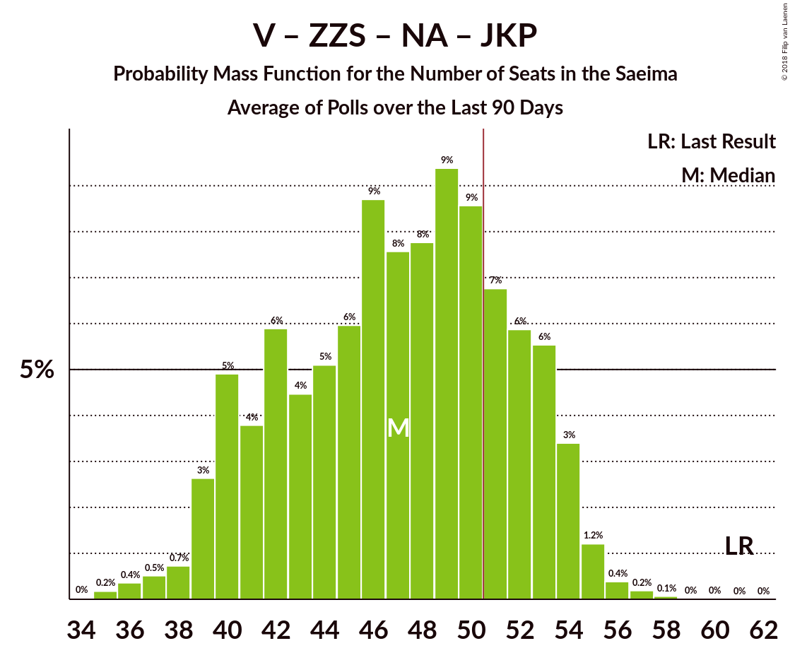

# Poll Average

<a href="#voting-intentions">Voting Intentions</a> | <a href="#seats">Seats</a> | <a href="#coalitions">Coalitions</a> | <a href="#technical-information">Technical Information</a>

## Summary

The table below lists the polls on which the average is based. They are the most recent polls (less than 90 days old) registered and analyzed so far.

| Period     | Polling firm/Commissioner(s) | SDPS | V | ZZS | NA | NSL | LRA | LKS | VL | LA | JKP | KPV | PAR |
|:----------:|:----------------------------:|:--:|:--:|:--:|:--:|:--:|:--:|:--:|:--:|:--:|:--:|:--:|:--:|
| 4 October 2014 | General Election | 23.0%   24 | 21.9%   23 | 19.5%   21 | 16.6%   17 | 6.8%   7 | 6.7%   8 | 1.6%   0 | 1.2%   0 | 0.9%   0 | 0.7%   0 | 0.0%   0 | 0.0%   0 |
| N/A | Poll Average | 22–36%   25–41 | 6–10%   7–11 | 8–21%   9–25 | 8–13%   8–15 | 2–4%   0 | 2–6%   0–7 | 1–3%   0 | N/A   N/A | N/A   N/A | 3–16%   0–19 | 10–14%   11–16 | 4–12%   0–13 |
| [27 August–2 September 2018](2018-09-02-FACTUM.html) | FACTUM | 22–26%   24–29 | 6–8%   7–9 | 8–10%   9–12 | 11–14%   12–15 | N/A   N/A | 2–4%   0 | 1–3%   0 | N/A   N/A | N/A   N/A | 13–17%   15–19 | 11–14%   12–15 | 10–13%   10–14 |
| [1–23 August 2018](2018-08-23-SKDS.html) | SKDS   Latvijas Televīzija | 29–37%   32–42 | 6–10%   7–12 | 15–21%   17–26 | 7–12%   7–15 | 2–4%   0 | 3–6%   0–7 | 1–3%   0 | N/A   N/A | N/A   N/A | 3–6%   0–7 | 9–14%   10–17 | 3–7%   0–8 |
| 4 October 2014 | General Election | 23.0%   24 | 21.9%   23 | 19.5%   21 | 16.6%   17 | 6.8%   7 | 6.7%   8 | 1.6%   0 | 1.2%   0 | 0.9%   0 | 0.7%   0 | 0.0%   0 | 0.0%   0 |

Only polls for which at least the sample size has been published are included in the table above.

**Legend:**
+ **Top half of each row:** Voting intentions (95% confidence interval)
+ **Bottom half of each row:** Seat projections for the Saeima (95% confidence interval)
+ **SDPS:** Sociāldemokrātiskā Partija “Saskaņa”
+ **V:** Vienotība
+ **ZZS:** Zaļo un Zemnieku savienība
+ **NA:** Nacionālā apvienība „Visu Latvijai!”–„Tēvzemei un Brīvībai/LNNK”
+ **NSL:** No sirds Latvijai
+ **LRA:** Latvijas Reģionu apvienība
+ **LKS:** Latvijas Krievu savienība
+ **VL:** Vienoti Latvijai
+ **LA:** Latvijas attīstībai
+ **JKP:** Jaunā konservatīvā partija
+ **KPV:** Kam pieder valsts?
+ **PAR:** Kustība Par!
+ **N/A (single party):** Party not included the published results
+ **N/A (entire row):** Calculation for this opinion poll not started yet

## Voting Intentions

### Confidence Intervals

| Party | Last Result | Median | 80% Confidence Interval | 90% Confidence Interval | 95% Confidence Interval | 99% Confidence Interval |
|:-----:|:-----------:|:------:|:-----------------------:|:-----------------------:|:-----------------------:|:-----------------------:|
| <a href="#sociāldemokrātiskā-partija-“saskaņa”">Sociāldemokrātiskā Partija “Saskaņa”</a> | 23.0% | 27.2% | 23.2–34.8% |22.8–35.7% | 22.5–36.5% | 21.8–37.8% |
| <a href="#vienotība">Vienotība</a> | 21.9% | 7.4% | 6.4–8.9% |6.1–9.5% | 6.0–9.9% | 5.5–10.8% |
| <a href="#zaļo-un-zemnieku-savienība">Zaļo un Zemnieku savienība</a> | 19.5% | 12.0% | 8.5–19.2% |8.2–19.9% | 8.0–20.6% | 7.6–21.7% |
| <a href="#nacionālā-apvienība-„visu-latvijai!”–„tēvzemei-un-brīvībai/lnnk”">Nacionālā apvienība „Visu Latvijai!”–„Tēvzemei un Brīvībai/LNNK”</a> | 16.6% | 11.1% | 8.5–12.7% |8.0–13.0% | 7.6–13.3% | 6.9–13.9% |
| <a href="#no-sirds-latvijai">No sirds Latvijai</a> | 6.8% | 2.8% | 2.0–3.8% |1.9–4.1% | 1.7–4.4% | 1.4–5.0% |
| <a href="#latvijas-reģionu-apvienība">Latvijas Reģionu apvienība</a> | 6.7% | 3.5% | 2.7–5.3% |2.5–5.7% | 2.4–6.1% | 2.2–6.8% |
| <a href="#latvijas-krievu-savienība">Latvijas Krievu savienība</a> | 1.6% | 2.0% | 1.5–2.6% |1.3–2.9% | 1.2–3.1% | 0.9–3.6% |
| <a href="#vienoti-latvijai">Vienoti Latvijai</a> | 1.2% | N/A | N/A |N/A | N/A | N/A |
| <a href="#latvijas-attīstībai">Latvijas attīstībai</a> | 0.9% | N/A | N/A |N/A | N/A | N/A |
| <a href="#jaunā-konservatīvā-partija">Jaunā konservatīvā partija</a> | 0.7% | 10.9% | 3.9–15.7% |3.5–16.1% | 3.3–16.4% | 2.8–17.0% |
| <a href="#kam-pieder-valsts?">Kam pieder valsts?</a> | 0.0% | 11.9% | 10.5–13.2% |10.1–13.6% | 9.6–14.1% | 8.9–15.0% |
| <a href="#kustība-par!">Kustība Par!</a> | 0.0% | 8.7% | 4.2–11.7% |3.8–12.0% | 3.6–12.3% | 3.1–12.8% |

### Sociāldemokrātiskā Partija “Saskaņa”

*For a full overview of the results for this party, see the [Sociāldemokrātiskā Partija “Saskaņa”](party-sociāldemokrātiskāpartija“saskaņa”.html) page.*

| Voting Intentions | Probability | Accumulated | Special Marks |
|:-----------------:|:-----------:|:-----------:|:-------------:|
| 19.5–20.5% | 0% | 100% |  |
| 20.5–21.5% | 0.2% | 100% |  |
| 21.5–22.5% | 3% | 99.8% |  |
| 22.5–23.5% | 12% | 97% | Last Result |
| 23.5–24.5% | 20% | 85% |  |
| 24.5–25.5% | 12% | 65% |  |
| 25.5–26.5% | 3% | 53% |  |
| 26.5–27.5% | 0.3% | 50% | Median |
| 27.5–28.5% | 0.3% | 50% |  |
| 28.5–29.5% | 1.0% | 50% |  |
| 29.5–30.5% | 3% | 49% |  |
| 30.5–31.5% | 6% | 46% |  |
| 31.5–32.5% | 9% | 40% |  |
| 32.5–33.5% | 10% | 32% |  |
| 33.5–34.5% | 9% | 21% |  |
| 34.5–35.5% | 6% | 12% |  |
| 35.5–36.5% | 4% | 6% |  |
| 36.5–37.5% | 2% | 2% |  |
| 37.5–38.5% | 0.5% | 0.7% |  |
| 38.5–39.5% | 0.1% | 0.2% |  |
| 39.5–40.5% | 0% | 0% |  |

### Vienotība

*For a full overview of the results for this party, see the [Vienotība](party-vienotība.html) page.*

| Voting Intentions | Probability | Accumulated | Special Marks |
|:-----------------:|:-----------:|:-----------:|:-------------:|
| 3.5–4.5% | 0% | 100% |  |
| 4.5–5.5% | 0.6% | 100% |  |
| 5.5–6.5% | 14% | 99.4% |  |
| 6.5–7.5% | 43% | 85% | Median |
| 7.5–8.5% | 27% | 42% |  |
| 8.5–9.5% | 11% | 15% |  |
| 9.5–10.5% | 4% | 4% |  |
| 10.5–11.5% | 0.7% | 0.8% |  |
| 11.5–12.5% | 0.1% | 0.1% |  |
| 12.5–13.5% | 0% | 0% |  |
| 13.5–14.5% | 0% | 0% |  |
| 14.5–15.5% | 0% | 0% |  |
| 15.5–16.5% | 0% | 0% |  |
| 16.5–17.5% | 0% | 0% |  |
| 17.5–18.5% | 0% | 0% |  |
| 18.5–19.5% | 0% | 0% |  |
| 19.5–20.5% | 0% | 0% |  |
| 20.5–21.5% | 0% | 0% |  |
| 21.5–22.5% | 0% | 0% | Last Result |

### Zaļo un Zemnieku savienība

*For a full overview of the results for this party, see the [Zaļo un Zemnieku savienība](party-zaļounzemniekusavienība.html) page.*

| Voting Intentions | Probability | Accumulated | Special Marks |
|:-----------------:|:-----------:|:-----------:|:-------------:|
| 5.5–6.5% | 0% | 100% |  |
| 6.5–7.5% | 0.4% | 100% |  |
| 7.5–8.5% | 11% | 99.5% |  |
| 8.5–9.5% | 28% | 88% |  |
| 9.5–10.5% | 10% | 60% |  |
| 10.5–11.5% | 0.6% | 51% |  |
| 11.5–12.5% | 0% | 50% | Median |
| 12.5–13.5% | 0.1% | 50% |  |
| 13.5–14.5% | 0.6% | 50% |  |
| 14.5–15.5% | 3% | 49% |  |
| 15.5–16.5% | 7% | 47% |  |
| 16.5–17.5% | 11% | 40% |  |
| 17.5–18.5% | 12% | 29% |  |
| 18.5–19.5% | 9% | 17% |  |
| 19.5–20.5% | 5% | 7% | Last Result |
| 20.5–21.5% | 2% | 3% |  |
| 21.5–22.5% | 0.5% | 0.6% |  |
| 22.5–23.5% | 0.1% | 0.1% |  |
| 23.5–24.5% | 0% | 0% |  |

### Nacionālā apvienība „Visu Latvijai!”–„Tēvzemei un Brīvībai/LNNK”

*For a full overview of the results for this party, see the [Nacionālā apvienība „Visu Latvijai!”–„Tēvzemei un Brīvībai/LNNK”](party-nacionālāapvienība„visulatvijai”–„tēvzemeiunbrīvībailnnk”.html) page.*

| Voting Intentions | Probability | Accumulated | Special Marks |
|:-----------------:|:-----------:|:-----------:|:-------------:|
| 4.5–5.5% | 0% | 100% |  |
| 5.5–6.5% | 0.2% | 100% |  |
| 6.5–7.5% | 2% | 99.8% |  |
| 7.5–8.5% | 8% | 98% |  |
| 8.5–9.5% | 16% | 89% |  |
| 9.5–10.5% | 15% | 74% |  |
| 10.5–11.5% | 19% | 59% | Median |
| 11.5–12.5% | 27% | 40% |  |
| 12.5–13.5% | 12% | 13% |  |
| 13.5–14.5% | 1.2% | 1.3% |  |
| 14.5–15.5% | 0% | 0% |  |
| 15.5–16.5% | 0% | 0% |  |
| 16.5–17.5% | 0% | 0% | Last Result |

### No sirds Latvijai

*For a full overview of the results for this party, see the [No sirds Latvijai](party-nosirdslatvijai.html) page.*

| Voting Intentions | Probability | Accumulated | Special Marks |
|:-----------------:|:-----------:|:-----------:|:-------------:|
| 0.0–0.5% | 0% | 100% |  |
| 0.5–1.5% | 1.2% | 100% |  |
| 1.5–2.5% | 31% | 98.8% |  |
| 2.5–3.5% | 51% | 67% | Median |
| 3.5–4.5% | 15% | 17% |  |
| 4.5–5.5% | 2% | 2% |  |
| 5.5–6.5% | 0.1% | 0.1% |  |
| 6.5–7.5% | 0% | 0% | Last Result |

### Latvijas Reģionu apvienība

*For a full overview of the results for this party, see the [Latvijas Reģionu apvienība](party-latvijasreģionuapvienība.html) page.*

| Voting Intentions | Probability | Accumulated | Special Marks |
|:-----------------:|:-----------:|:-----------:|:-------------:|
| 0.5–1.5% | 0% | 100% |  |
| 1.5–2.5% | 5% | 100% |  |
| 2.5–3.5% | 45% | 95% |  |
| 3.5–4.5% | 25% | 49% | Median |
| 4.5–5.5% | 18% | 25% |  |
| 5.5–6.5% | 6% | 7% |  |
| 6.5–7.5% | 0.9% | 1.0% | Last Result |
| 7.5–8.5% | 0.1% | 0.1% |  |
| 8.5–9.5% | 0% | 0% |  |

### Latvijas Krievu savienība

*For a full overview of the results for this party, see the [Latvijas Krievu savienība](party-latvijaskrievusavienība.html) page.*

| Voting Intentions | Probability | Accumulated | Special Marks |
|:-----------------:|:-----------:|:-----------:|:-------------:|
| 0.0–0.5% | 0% | 100% |  |
| 0.5–1.5% | 13% | 100% |  |
| 1.5–2.5% | 74% | 87% | Last Result, Median |
| 2.5–3.5% | 12% | 13% |  |
| 3.5–4.5% | 0.6% | 0.6% |  |
| 4.5–5.5% | 0% | 0% |  |

### Jaunā konservatīvā partija

*For a full overview of the results for this party, see the [Jaunā konservatīvā partija](party-jaunākonservatīvāpartija.html) page.*

| Voting Intentions | Probability | Accumulated | Special Marks |
|:-----------------:|:-----------:|:-----------:|:-------------:|
| 0.5–1.5% | 0% | 100% | Last Result |
| 1.5–2.5% | 0.1% | 100% |  |
| 2.5–3.5% | 5% | 99.9% |  |
| 3.5–4.5% | 20% | 95% |  |
| 4.5–5.5% | 18% | 75% |  |
| 5.5–6.5% | 6% | 57% |  |
| 6.5–7.5% | 0.9% | 51% |  |
| 7.5–8.5% | 0.1% | 50% |  |
| 8.5–9.5% | 0% | 50% |  |
| 9.5–10.5% | 0% | 50% |  |
| 10.5–11.5% | 0% | 50% | Median |
| 11.5–12.5% | 0% | 50% |  |
| 12.5–13.5% | 2% | 50% |  |
| 13.5–14.5% | 13% | 48% |  |
| 14.5–15.5% | 23% | 36% |  |
| 15.5–16.5% | 11% | 13% |  |
| 16.5–17.5% | 2% | 2% |  |
| 17.5–18.5% | 0.1% | 0.1% |  |
| 18.5–19.5% | 0% | 0% |  |

### Kam pieder valsts?

*For a full overview of the results for this party, see the [Kam pieder valsts?](party-kampiedervalsts.html) page.*

| Voting Intentions | Probability | Accumulated | Special Marks |
|:-----------------:|:-----------:|:-----------:|:-------------:|
| 0.0–0.5% | 0% | 100% | Last Result |
| 0.5–1.5% | 0% | 100% |  |
| 1.5–2.5% | 0% | 100% |  |
| 2.5–3.5% | 0% | 100% |  |
| 3.5–4.5% | 0% | 100% |  |
| 4.5–5.5% | 0% | 100% |  |
| 5.5–6.5% | 0% | 100% |  |
| 6.5–7.5% | 0% | 100% |  |
| 7.5–8.5% | 0.2% | 100% |  |
| 8.5–9.5% | 2% | 99.8% |  |
| 9.5–10.5% | 8% | 98% |  |
| 10.5–11.5% | 25% | 90% |  |
| 11.5–12.5% | 39% | 65% | Median |
| 12.5–13.5% | 20% | 26% |  |
| 13.5–14.5% | 5% | 6% |  |
| 14.5–15.5% | 0.9% | 1.1% |  |
| 15.5–16.5% | 0.2% | 0.2% |  |
| 16.5–17.5% | 0% | 0% |  |

### Kustība Par!

*For a full overview of the results for this party, see the [Kustība Par!](party-kustībapar.html) page.*

| Voting Intentions | Probability | Accumulated | Special Marks |
|:-----------------:|:-----------:|:-----------:|:-------------:|
| 0.0–0.5% | 0% | 100% | Last Result |
| 0.5–1.5% | 0% | 100% |  |
| 1.5–2.5% | 0% | 100% |  |
| 2.5–3.5% | 2% | 100% |  |
| 3.5–4.5% | 15% | 98% |  |
| 4.5–5.5% | 21% | 82% |  |
| 5.5–6.5% | 10% | 62% |  |
| 6.5–7.5% | 2% | 52% |  |
| 7.5–8.5% | 0.2% | 50% |  |
| 8.5–9.5% | 0.8% | 50% | Median |
| 9.5–10.5% | 11% | 49% |  |
| 10.5–11.5% | 26% | 38% |  |
| 11.5–12.5% | 11% | 12% |  |
| 12.5–13.5% | 1.1% | 1.1% |  |
| 13.5–14.5% | 0% | 0% |  |

## Seats

### Confidence Intervals

| Party | Last Result | Median | 80% Confidence Interval | 90% Confidence Interval | 95% Confidence Interval | 99% Confidence Interval |
|:-----:|:-----------:|:------:|:-----------------------:|:-----------------------:|:-----------------------:|:-----------------------:|
| <a href="#sociāldemokrātiskā-partija-“saskaņa”">Sociāldemokrātiskā Partija “Saskaņa”</a> | 24 | 29 | 26–39 |25–40 | 25–41 | 24–43 |
| <a href="#vienotība">Vienotība</a> | 23 | 8 | 7–11 |7–11 | 7–11 | 7–13 |
| <a href="#zaļo-un-zemnieku-savienība">Zaļo un Zemnieku savienība</a> | 21 | 15 | 10–24 |9–24 | 9–25 | 8–27 |
| <a href="#nacionālā-apvienība-„visu-latvijai!”–„tēvzemei-un-brīvībai/lnnk”">Nacionālā apvienība „Visu Latvijai!”–„Tēvzemei un Brīvībai/LNNK”</a> | 17 | 13 | 10–14 |9–15 | 8–15 | 7–16 |
| <a href="#no-sirds-latvijai">No sirds Latvijai</a> | 7 | 0 | 0 |0 | 0 | 0 |
| <a href="#latvijas-reģionu-apvienība">Latvijas Reģionu apvienība</a> | 8 | 0 | 0–6 |0–7 | 0–7 | 0–8 |
| <a href="#latvijas-krievu-savienība">Latvijas Krievu savienība</a> | 0 | 0 | 0 |0 | 0 | 0 |
| <a href="#vienoti-latvijai">Vienoti Latvijai</a> | 0 | N/A | N/A |N/A | N/A | N/A |
| <a href="#latvijas-attīstībai">Latvijas attīstībai</a> | 0 | N/A | N/A |N/A | N/A | N/A |
| <a href="#jaunā-konservatīvā-partija">Jaunā konservatīvā partija</a> | 0 | 13 | 0–17 |0–18 | 0–19 | 0–20 |
| <a href="#kam-pieder-valsts?">Kam pieder valsts?</a> | 0 | 14 | 12–15 |11–15 | 11–16 | 9–17 |
| <a href="#kustība-par!">Kustība Par!</a> | 0 | 10 | 0–13 |0–13 | 0–13 | 0–14 |

### Sociāldemokrātiskā Partija “Saskaņa”

*For a full overview of the results for this party, see the [Sociāldemokrātiskā Partija “Saskaņa”](party-sociāldemokrātiskāpartija“saskaņa”.html) page.*

| Number of Seats | Probability | Accumulated | Special Marks |
|:---------------:|:-----------:|:-----------:|:-------------:|
| 23 | 0.1% | 100% |  |
| 24 | 1.3% | 99.9% | Last Result |
| 25 | 6% | 98.5% |  |
| 26 | 22% | 93% |  |
| 27 | 9% | 71% |  |
| 28 | 6% | 62% |  |
| 29 | 6% | 56% | Median |
| 30 | 0.2% | 50% |  |
| 31 | 0.3% | 50% |  |
| 32 | 0.8% | 49% |  |
| 33 | 1.1% | 49% |  |
| 34 | 3% | 48% |  |
| 35 | 4% | 45% |  |
| 36 | 4% | 41% |  |
| 37 | 14% | 37% |  |
| 38 | 12% | 23% |  |
| 39 | 3% | 11% |  |
| 40 | 4% | 8% |  |
| 41 | 2% | 4% |  |
| 42 | 0.7% | 2% |  |
| 43 | 0.9% | 1.2% |  |
| 44 | 0.1% | 0.3% |  |
| 45 | 0.1% | 0.2% |  |
| 46 | 0.1% | 0.1% |  |
| 47 | 0% | 0% |  |

### Vienotība

*For a full overview of the results for this party, see the [Vienotība](party-vienotība.html) page.*

| Number of Seats | Probability | Accumulated | Special Marks |
|:---------------:|:-----------:|:-----------:|:-------------:|
| 0 | 0.1% | 100% |  |
| 1 | 0% | 99.9% |  |
| 2 | 0% | 99.9% |  |
| 3 | 0% | 99.9% |  |
| 4 | 0% | 99.9% |  |
| 5 | 0% | 99.9% |  |
| 6 | 0% | 99.9% |  |
| 7 | 28% | 99.9% |  |
| 8 | 43% | 72% | Median |
| 9 | 6% | 29% |  |
| 10 | 10% | 23% |  |
| 11 | 11% | 13% |  |
| 12 | 1.2% | 2% |  |
| 13 | 0.4% | 0.5% |  |
| 14 | 0.1% | 0.1% |  |
| 15 | 0% | 0% |  |
| 16 | 0% | 0% |  |
| 17 | 0% | 0% |  |
| 18 | 0% | 0% |  |
| 19 | 0% | 0% |  |
| 20 | 0% | 0% |  |
| 21 | 0% | 0% |  |
| 22 | 0% | 0% |  |
| 23 | 0% | 0% | Last Result |

### Zaļo un Zemnieku savienība

*For a full overview of the results for this party, see the [Zaļo un Zemnieku savienība](party-zaļounzemniekusavienība.html) page.*

| Number of Seats | Probability | Accumulated | Special Marks |
|:---------------:|:-----------:|:-----------:|:-------------:|
| 8 | 0.6% | 100% |  |
| 9 | 8% | 99.4% |  |
| 10 | 13% | 91% |  |
| 11 | 26% | 78% |  |
| 12 | 1.1% | 52% |  |
| 13 | 0.4% | 51% |  |
| 14 | 0.2% | 50% |  |
| 15 | 0% | 50% | Median |
| 16 | 0.4% | 50% |  |
| 17 | 2% | 50% |  |
| 18 | 1.0% | 47% |  |
| 19 | 8% | 46% |  |
| 20 | 4% | 38% |  |
| 21 | 4% | 34% | Last Result |
| 22 | 3% | 30% |  |
| 23 | 12% | 26% |  |
| 24 | 11% | 14% |  |
| 25 | 1.5% | 3% |  |
| 26 | 0.8% | 1.4% |  |
| 27 | 0.5% | 0.6% |  |
| 28 | 0.1% | 0.1% |  |
| 29 | 0% | 0% |  |

### Nacionālā apvienība „Visu Latvijai!”–„Tēvzemei un Brīvībai/LNNK”

*For a full overview of the results for this party, see the [Nacionālā apvienība „Visu Latvijai!”–„Tēvzemei un Brīvībai/LNNK”](party-nacionālāapvienība„visulatvijai”–„tēvzemeiunbrīvībailnnk”.html) page.*

| Number of Seats | Probability | Accumulated | Special Marks |
|:---------------:|:-----------:|:-----------:|:-------------:|
| 6 | 0.1% | 100% |  |
| 7 | 1.5% | 99.9% |  |
| 8 | 2% | 98% |  |
| 9 | 3% | 97% |  |
| 10 | 7% | 93% |  |
| 11 | 18% | 86% |  |
| 12 | 14% | 68% |  |
| 13 | 28% | 54% | Median |
| 14 | 18% | 26% |  |
| 15 | 7% | 8% |  |
| 16 | 0.4% | 0.5% |  |
| 17 | 0.1% | 0.1% | Last Result |
| 18 | 0% | 0% |  |

### No sirds Latvijai

*For a full overview of the results for this party, see the [No sirds Latvijai](party-nosirdslatvijai.html) page.*

| Number of Seats | Probability | Accumulated | Special Marks |
|:---------------:|:-----------:|:-----------:|:-------------:|
| 0 | 99.7% | 100% | Median |
| 1 | 0% | 0.3% |  |
| 2 | 0% | 0.3% |  |
| 3 | 0% | 0.3% |  |
| 4 | 0% | 0.3% |  |
| 5 | 0% | 0.3% |  |
| 6 | 0.2% | 0.3% |  |
| 7 | 0.1% | 0.1% | Last Result |
| 8 | 0% | 0% |  |

### Latvijas Reģionu apvienība

*For a full overview of the results for this party, see the [Latvijas Reģionu apvienība](party-latvijasreģionuapvienība.html) page.*

| Number of Seats | Probability | Accumulated | Special Marks |
|:---------------:|:-----------:|:-----------:|:-------------:|
| 0 | 89% | 100% | Median |
| 1 | 0% | 11% |  |
| 2 | 0% | 11% |  |
| 3 | 0% | 11% |  |
| 4 | 0% | 11% |  |
| 5 | 0% | 11% |  |
| 6 | 5% | 11% |  |
| 7 | 6% | 6% |  |
| 8 | 0.5% | 0.8% | Last Result |
| 9 | 0.3% | 0.3% |  |
| 10 | 0% | 0% |  |

### Latvijas Krievu savienība

*For a full overview of the results for this party, see the [Latvijas Krievu savienība](party-latvijaskrievusavienība.html) page.*

| Number of Seats | Probability | Accumulated | Special Marks |
|:---------------:|:-----------:|:-----------:|:-------------:|
| 0 | 100% | 100% | Last Result, Median |

### Jaunā konservatīvā partija

*For a full overview of the results for this party, see the [Jaunā konservatīvā partija](party-jaunākonservatīvāpartija.html) page.*

| Number of Seats | Probability | Accumulated | Special Marks |
|:---------------:|:-----------:|:-----------:|:-------------:|
| 0 | 38% | 100% | Last Result |
| 1 | 0% | 62% |  |
| 2 | 0% | 62% |  |
| 3 | 0% | 62% |  |
| 4 | 0% | 62% |  |
| 5 | 0% | 62% |  |
| 6 | 0.5% | 62% |  |
| 7 | 11% | 61% |  |
| 8 | 0.4% | 50% |  |
| 9 | 0% | 50% |  |
| 10 | 0% | 50% |  |
| 11 | 0% | 50% |  |
| 12 | 0% | 50% |  |
| 13 | 0% | 50% | Median |
| 14 | 0.2% | 50% |  |
| 15 | 7% | 50% |  |
| 16 | 25% | 43% |  |
| 17 | 8% | 18% |  |
| 18 | 6% | 9% |  |
| 19 | 3% | 3% |  |
| 20 | 0.5% | 0.5% |  |
| 21 | 0% | 0% |  |

### Kam pieder valsts?

*For a full overview of the results for this party, see the [Kam pieder valsts?](party-kampiedervalsts.html) page.*

| Number of Seats | Probability | Accumulated | Special Marks |
|:---------------:|:-----------:|:-----------:|:-------------:|
| 0 | 0% | 100% | Last Result |
| 1 | 0% | 100% |  |
| 2 | 0% | 100% |  |
| 3 | 0% | 100% |  |
| 4 | 0% | 100% |  |
| 5 | 0% | 100% |  |
| 6 | 0% | 100% |  |
| 7 | 0% | 100% |  |
| 8 | 0% | 100% |  |
| 9 | 0.8% | 100% |  |
| 10 | 1.1% | 99.2% |  |
| 11 | 5% | 98% |  |
| 12 | 7% | 93% |  |
| 13 | 35% | 86% |  |
| 14 | 23% | 51% | Median |
| 15 | 24% | 28% |  |
| 16 | 2% | 4% |  |
| 17 | 2% | 2% |  |
| 18 | 0.1% | 0.2% |  |
| 19 | 0% | 0.1% |  |
| 20 | 0% | 0% |  |

### Kustība Par!

*For a full overview of the results for this party, see the [Kustība Par!](party-kustībapar.html) page.*

| Number of Seats | Probability | Accumulated | Special Marks |
|:---------------:|:-----------:|:-----------:|:-------------:|
| 0 | 26% | 100% | Last Result |
| 1 | 0% | 74% |  |
| 2 | 0% | 74% |  |
| 3 | 0% | 74% |  |
| 4 | 0% | 74% |  |
| 5 | 0% | 74% |  |
| 6 | 0% | 74% |  |
| 7 | 23% | 74% |  |
| 8 | 1.3% | 51% |  |
| 9 | 0% | 50% |  |
| 10 | 2% | 50% | Median |
| 11 | 4% | 48% |  |
| 12 | 29% | 44% |  |
| 13 | 13% | 15% |  |
| 14 | 2% | 2% |  |
| 15 | 0.4% | 0.4% |  |
| 16 | 0.1% | 0.1% |  |
| 17 | 0% | 0% |  |

## Coalitions

### Confidence Intervals

| Coalition | Last Result | Median | Majority? | 80% Confidence Interval | 90% Confidence Interval | 95% Confidence Interval | 99% Confidence Interval |
|:---------:|:-----------:|:------:|:---------:|:-----------------------:|:-----------------------:|:-----------------------:|:-----------------------:|
| Vienotība – Zaļo un Zemnieku savienība – Nacionālā apvienība „Visu Latvijai!”–„Tēvzemei un Brīvībai/LNNK” – Jaunā konservatīvā partija – Kustība Par! | 61 | 56 | 56% | 45–61 | 43–62 | 42–62 | 39–63 |
| Zaļo un Zemnieku savienība – Nacionālā apvienība „Visu Latvijai!”–„Tēvzemei un Brīvībai/LNNK” – Jaunā konservatīvā partija – Kustība Par! | 38 | 48 | 43% | 36–54 | 34–54 | 32–55 | 30–55 |
| Vienotība – Zaļo un Zemnieku savienība – Nacionālā apvienība „Visu Latvijai!”–„Tēvzemei un Brīvībai/LNNK” – Jaunā konservatīvā partija | 61 | 47 | 3% | 40–49 | 40–50 | 39–51 | 36–53 |
| Vienotība – Zaļo un Zemnieku savienība – Nacionālā apvienība „Visu Latvijai!”–„Tēvzemei un Brīvībai/LNNK” – Kustība Par! | 61 | 44 | 2% | 41–48 | 40–49 | 39–50 | 37–53 |
| Vienotība – Zaļo un Zemnieku savienība – Nacionālā apvienība „Visu Latvijai!”–„Tēvzemei un Brīvībai/LNNK” | 61 | 35 | 0.1% | 30–46 | 30–48 | 29–48 | 28–49 |
| Zaļo un Zemnieku savienība – Nacionālā apvienība „Visu Latvijai!”–„Tēvzemei un Brīvībai/LNNK” – Jaunā konservatīvā partija | 38 | 38 | 0% | 32–41 | 29–42 | 29–43 | 27–44 |
| Zaļo un Zemnieku savienība – Nacionālā apvienība „Visu Latvijai!”–„Tēvzemei un Brīvībai/LNNK” – Kustība Par! | 38 | 36 | 0% | 33–40 | 32–41 | 31–41 | 28–43 |

### Vienotība – Zaļo un Zemnieku savienība – Nacionālā apvienība „Visu Latvijai!”–„Tēvzemei un Brīvībai/LNNK” – Jaunā konservatīvā partija – Kustība Par!

| Number of Seats | Probability | Accumulated | Special Marks |
|:---------------:|:-----------:|:-----------:|:-------------:|
| 38 | 0.1% | 100% |  |
| 39 | 0.4% | 99.8% |  |
| 40 | 1.0% | 99.4% |  |
| 41 | 0.6% | 98% |  |
| 42 | 2% | 98% |  |
| 43 | 2% | 96% |  |
| 44 | 3% | 94% |  |
| 45 | 2% | 91% |  |
| 46 | 2% | 89% |  |
| 47 | 10% | 86% |  |
| 48 | 11% | 76% |  |
| 49 | 6% | 65% |  |
| 50 | 2% | 58% |  |
| 51 | 2% | 56% | Majority |
| 52 | 0.9% | 54% |  |
| 53 | 2% | 53% |  |
| 54 | 0.6% | 51% |  |
| 55 | 0.3% | 51% |  |
| 56 | 0.7% | 50% |  |
| 57 | 0.8% | 50% |  |
| 58 | 6% | 49% |  |
| 59 | 7% | 42% | Median |
| 60 | 18% | 35% |  |
| 61 | 12% | 18% | Last Result |
| 62 | 4% | 6% |  |
| 63 | 1.1% | 1.3% |  |
| 64 | 0.2% | 0.2% |  |
| 65 | 0% | 0% |  |

### Zaļo un Zemnieku savienība – Nacionālā apvienība „Visu Latvijai!”–„Tēvzemei un Brīvībai/LNNK” – Jaunā konservatīvā partija – Kustība Par!

| Number of Seats | Probability | Accumulated | Special Marks |
|:---------------:|:-----------:|:-----------:|:-------------:|
| 28 | 0% | 100% |  |
| 29 | 0.1% | 99.9% |  |
| 30 | 0.5% | 99.9% |  |
| 31 | 0.6% | 99.4% |  |
| 32 | 1.4% | 98.8% |  |
| 33 | 0.9% | 97% |  |
| 34 | 3% | 96% |  |
| 35 | 2% | 94% |  |
| 36 | 7% | 91% |  |
| 37 | 9% | 84% |  |
| 38 | 4% | 76% | Last Result |
| 39 | 3% | 71% |  |
| 40 | 5% | 68% |  |
| 41 | 7% | 63% |  |
| 42 | 3% | 57% |  |
| 43 | 1.1% | 54% |  |
| 44 | 2% | 53% |  |
| 45 | 0.4% | 51% |  |
| 46 | 0.5% | 51% |  |
| 47 | 0.2% | 50% |  |
| 48 | 0.1% | 50% |  |
| 49 | 1.0% | 50% |  |
| 50 | 5% | 49% |  |
| 51 | 6% | 43% | Median, Majority |
| 52 | 12% | 37% |  |
| 53 | 13% | 25% |  |
| 54 | 9% | 12% |  |
| 55 | 3% | 3% |  |
| 56 | 0.2% | 0.3% |  |
| 57 | 0.1% | 0.1% |  |
| 58 | 0% | 0% |  |

### Vienotība – Zaļo un Zemnieku savienība – Nacionālā apvienība „Visu Latvijai!”–„Tēvzemei un Brīvībai/LNNK” – Jaunā konservatīvā partija

| Number of Seats | Probability | Accumulated | Special Marks |
|:---------------:|:-----------:|:-----------:|:-------------:|
| 35 | 0.3% | 100% |  |
| 36 | 0.4% | 99.7% |  |
| 37 | 0.6% | 99.3% |  |
| 38 | 0.8% | 98.7% |  |
| 39 | 1.1% | 98% |  |
| 40 | 8% | 97% |  |
| 41 | 5% | 89% |  |
| 42 | 6% | 84% |  |
| 43 | 3% | 78% |  |
| 44 | 5% | 75% |  |
| 45 | 3% | 70% |  |
| 46 | 9% | 67% |  |
| 47 | 12% | 58% |  |
| 48 | 30% | 46% |  |
| 49 | 10% | 16% | Median |
| 50 | 3% | 6% |  |
| 51 | 1.1% | 3% | Majority |
| 52 | 0.3% | 2% |  |
| 53 | 1.0% | 1.2% |  |
| 54 | 0.1% | 0.1% |  |
| 55 | 0% | 0% |  |
| 56 | 0% | 0% |  |
| 57 | 0% | 0% |  |
| 58 | 0% | 0% |  |
| 59 | 0% | 0% |  |
| 60 | 0% | 0% |  |
| 61 | 0% | 0% | Last Result |

### Vienotība – Zaļo un Zemnieku savienība – Nacionālā apvienība „Visu Latvijai!”–„Tēvzemei un Brīvībai/LNNK” – Kustība Par!

| Number of Seats | Probability | Accumulated | Special Marks |
|:---------------:|:-----------:|:-----------:|:-------------:|
| 35 | 0.1% | 100% |  |
| 36 | 0.3% | 99.9% |  |
| 37 | 0.3% | 99.6% |  |
| 38 | 0.6% | 99.3% |  |
| 39 | 1.3% | 98.7% |  |
| 40 | 3% | 97% |  |
| 41 | 6% | 95% |  |
| 42 | 11% | 89% |  |
| 43 | 13% | 78% |  |
| 44 | 20% | 64% |  |
| 45 | 9% | 44% |  |
| 46 | 7% | 35% | Median |
| 47 | 11% | 28% |  |
| 48 | 9% | 17% |  |
| 49 | 5% | 8% |  |
| 50 | 0.9% | 3% |  |
| 51 | 1.1% | 2% | Majority |
| 52 | 0.5% | 1.1% |  |
| 53 | 0.4% | 0.6% |  |
| 54 | 0.1% | 0.3% |  |
| 55 | 0.1% | 0.1% |  |
| 56 | 0% | 0% |  |
| 57 | 0% | 0% |  |
| 58 | 0% | 0% |  |
| 59 | 0% | 0% |  |
| 60 | 0% | 0% |  |
| 61 | 0% | 0% | Last Result |

### Vienotība – Zaļo un Zemnieku savienība – Nacionālā apvienība „Visu Latvijai!”–„Tēvzemei un Brīvībai/LNNK”

| Number of Seats | Probability | Accumulated | Special Marks |
|:---------------:|:-----------:|:-----------:|:-------------:|
| 28 | 1.1% | 100% |  |
| 29 | 2% | 98.9% |  |
| 30 | 8% | 97% |  |
| 31 | 16% | 89% |  |
| 32 | 15% | 73% |  |
| 33 | 6% | 58% |  |
| 34 | 2% | 52% |  |
| 35 | 1.3% | 50% |  |
| 36 | 2% | 49% | Median |
| 37 | 1.3% | 47% |  |
| 38 | 1.5% | 46% |  |
| 39 | 3% | 44% |  |
| 40 | 8% | 41% |  |
| 41 | 8% | 33% |  |
| 42 | 6% | 25% |  |
| 43 | 2% | 19% |  |
| 44 | 4% | 17% |  |
| 45 | 2% | 13% |  |
| 46 | 2% | 12% |  |
| 47 | 4% | 9% |  |
| 48 | 4% | 5% |  |
| 49 | 0.9% | 1.4% |  |
| 50 | 0.3% | 0.5% |  |
| 51 | 0.1% | 0.1% | Majority |
| 52 | 0% | 0% |  |
| 53 | 0% | 0% |  |
| 54 | 0% | 0% |  |
| 55 | 0% | 0% |  |
| 56 | 0% | 0% |  |
| 57 | 0% | 0% |  |
| 58 | 0% | 0% |  |
| 59 | 0% | 0% |  |
| 60 | 0% | 0% |  |
| 61 | 0% | 0% | Last Result |

### Zaļo un Zemnieku savienība – Nacionālā apvienība „Visu Latvijai!”–„Tēvzemei un Brīvībai/LNNK” – Jaunā konservatīvā partija

| Number of Seats | Probability | Accumulated | Special Marks |
|:---------------:|:-----------:|:-----------:|:-------------:|
| 26 | 0.1% | 100% |  |
| 27 | 0.4% | 99.9% |  |
| 28 | 0.6% | 99.5% |  |
| 29 | 4% | 98.9% |  |
| 30 | 2% | 94% |  |
| 31 | 2% | 92% |  |
| 32 | 4% | 91% |  |
| 33 | 5% | 87% |  |
| 34 | 7% | 82% |  |
| 35 | 4% | 75% |  |
| 36 | 4% | 71% |  |
| 37 | 9% | 68% |  |
| 38 | 9% | 58% | Last Result |
| 39 | 8% | 50% |  |
| 40 | 15% | 42% |  |
| 41 | 17% | 27% | Median |
| 42 | 6% | 9% |  |
| 43 | 2% | 3% |  |
| 44 | 1.2% | 1.3% |  |
| 45 | 0.1% | 0.1% |  |
| 46 | 0% | 0% |  |

### Zaļo un Zemnieku savienība – Nacionālā apvienība „Visu Latvijai!”–„Tēvzemei un Brīvībai/LNNK” – Kustība Par!

| Number of Seats | Probability | Accumulated | Special Marks |
|:---------------:|:-----------:|:-----------:|:-------------:|
| 25 | 0.1% | 100% |  |
| 26 | 0.2% | 99.9% |  |
| 27 | 0.1% | 99.7% |  |
| 28 | 0.5% | 99.6% |  |
| 29 | 0.4% | 99.1% |  |
| 30 | 0.9% | 98.7% |  |
| 31 | 2% | 98% |  |
| 32 | 2% | 96% |  |
| 33 | 4% | 94% |  |
| 34 | 12% | 90% |  |
| 35 | 14% | 78% |  |
| 36 | 19% | 64% |  |
| 37 | 21% | 46% |  |
| 38 | 8% | 24% | Last Result, Median |
| 39 | 6% | 17% |  |
| 40 | 4% | 10% |  |
| 41 | 4% | 6% |  |
| 42 | 1.0% | 2% |  |
| 43 | 0.5% | 0.9% |  |
| 44 | 0.2% | 0.5% |  |
| 45 | 0.2% | 0.2% |  |
| 46 | 0% | 0% |  |

## Technical Information

