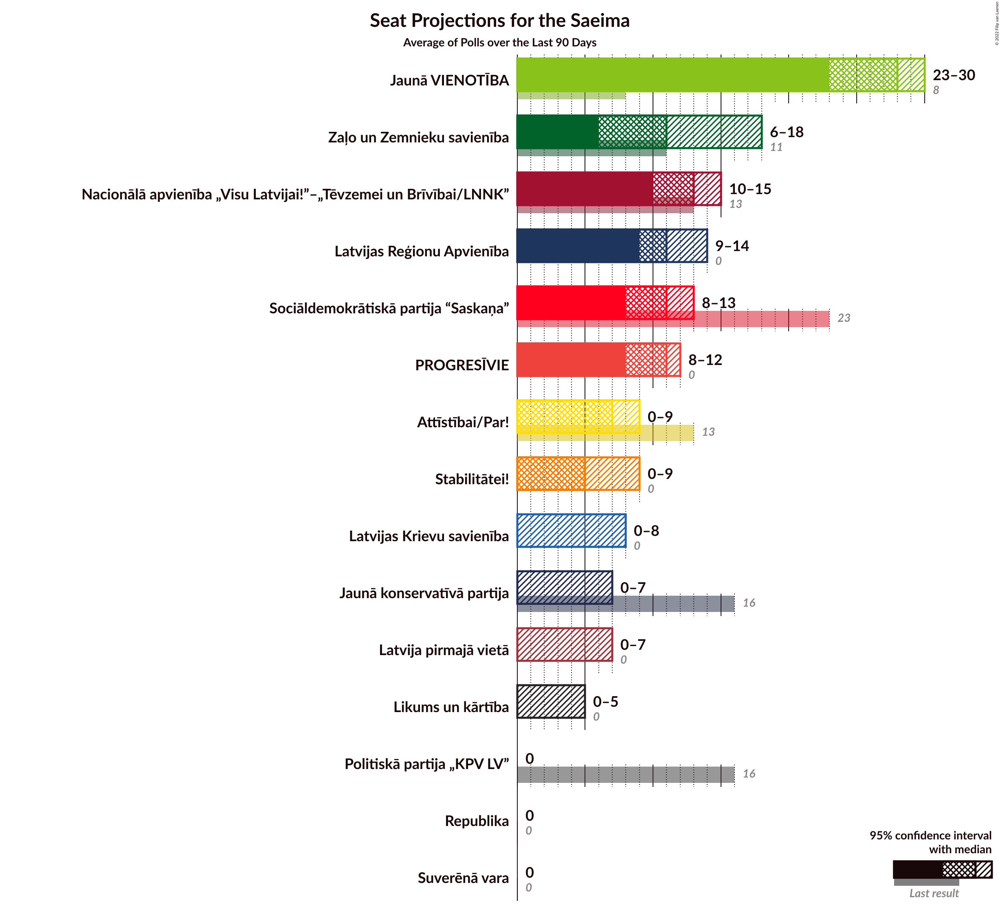
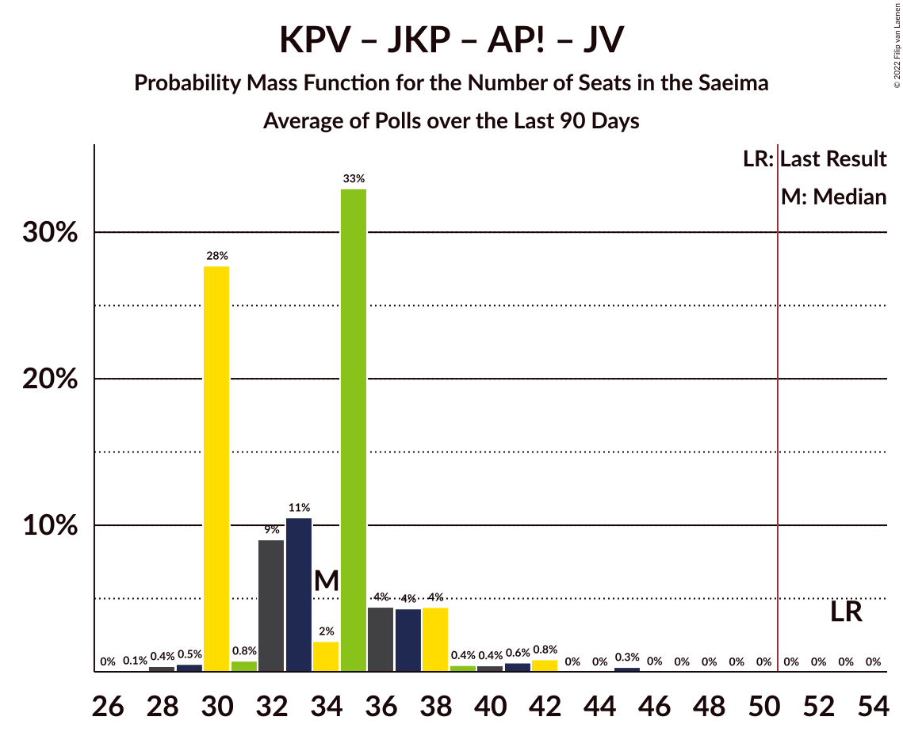

# Poll Average

<a href="#voting-intentions">Voting Intentions</a> | <a href="#seats">Seats</a> | <a href="#coalitions">Coalitions</a> | <a href="#technical-information">Technical Information</a>

## Summary

The table below lists the polls on which the average is based. They are the most recent polls (less than 90 days old) registered and analyzed so far.

| Period     | Polling firm/Commissioner(s) | SDPS | KPV | JKP | AP! | NA | ZZS | JV | LRA | LKS | P | NSL | VL | JS |
|:----------:|:----------------------------:|:--:|:--:|:--:|:--:|:--:|:--:|:--:|:--:|:--:|:--:|:--:|:--:|:--:|
| 6 October 2018 | General Election | 19.8%   23 | 14.2%   16 | 13.6%   16 | 12.0%   13 | 11.0%   13 | 9.9%   11 | 6.7%   8 | 4.1%   0 | 3.2%   0 | 2.6%   0 | 0.8%   0 | 0.0%   0 | 0.0%   0 |
| N/A | Poll Average | 12–22%   16–25 | 2–4%   0 | 7–13%   9–13 | 12–16%   12–17 | 10–14%   10–16 | 12–18%   13–20 | 8–14%   8–17 | 2–6%   0–7 | 3–6%   0–8 | 5–9%   0–11 | N/A   N/A | N/A   N/A | N/A   N/A |
| [1–17 December 2020](2020-12-17-Factum.html) | Factum | 12–15%   15–18 | 2–3%   0 | 7–9%   8–11 | 12–15%   14–17 | 12–15%   14–16 | 12–15%   15–18 | 12–15%   15–17 | 2–4%   0 | 3–5%   0–6 | 7–9%   8–11 | N/A   N/A | N/A   N/A | N/A   N/A |
| [9–20 October 2020](2020-10-20-SKDS.html) | SKDS   Latvijas Televīzija | 17–22%   18–26 | 2–5%   0 | 9–13%   9–14 | 11–16%   11–17 | 9–13%   10–14 | 13–18%   12–22 | 8–12%   8–12 | 4–7%   0–7 | 4–7%   0–8 | 4–8%   0–8 | N/A   N/A | N/A   N/A | N/A   N/A |
| 6 October 2018 | General Election | 19.8%   23 | 14.2%   16 | 13.6%   16 | 12.0%   13 | 11.0%   13 | 9.9%   11 | 6.7%   8 | 4.1%   0 | 3.2%   0 | 2.6%   0 | 0.8%   0 | 0.0%   0 | 0.0%   0 |

Only polls for which at least the sample size has been published are included in the table above.

**Legend:**
+ **Top half of each row:** Voting intentions (95% confidence interval)
+ **Bottom half of each row:** Seat projections for the Saeima (95% confidence interval)
+ **SDPS:** Sociāldemokrātiskā partija “Saskaņa”
+ **KPV:** Politiskā partija „KPV LV”
+ **JKP:** Jaunā konservatīvā partija
+ **AP!:** Attīstībai/Par!
+ **NA:** Nacionālā apvienība „Visu Latvijai!”–„Tēvzemei un Brīvībai/LNNK”
+ **ZZS:** Zaļo un Zemnieku savienība
+ **JV:** Jaunā VIENOTĪBA
+ **LRA:** Latvijas Reģionu Apvienība
+ **LKS:** Latvijas Krievu savienība
+ **P:** PROGRESĪVIE
+ **NSL:** No sirds Latvijai
+ **VL:** Vienoti Latvijai
+ **JS:** Jaunā Saskaņa
+ **N/A (single party):** Party not included the published results
+ **N/A (entire row):** Calculation for this opinion poll not started yet

## Voting Intentions

### Confidence Intervals

| Party | Last Result | Median | 80% Confidence Interval | 90% Confidence Interval | 95% Confidence Interval | 99% Confidence Interval |
|:-----:|:-----------:|:------:|:-----------------------:|:-----------------------:|:-----------------------:|:-----------------------:|
| <a href="#sociāldemokrātiskā-partija-“saskaņa”">Sociāldemokrātiskā partija “Saskaņa”</a> | 19.8% | 15.6% | 12.6–20.9% |12.3–21.5% | 12.0–22.0% | 11.6–23.0% |
| <a href="#politiskā-partija-„kpv-lv”">Politiskā partija „KPV LV”</a> | 14.2% | 2.5% | 1.8–3.8% |1.7–4.2% | 1.6–4.4% | 1.5–4.9% |
| <a href="#jaunā-konservatīvā-partija">Jaunā konservatīvā partija</a> | 13.6% | 9.3% | 7.7–12.2% |7.4–12.7% | 7.2–13.1% | 6.9–13.9% |
| <a href="#attīstībai/par!">Attīstībai/Par!</a> | 12.0% | 13.3% | 12.3–14.7% |12.0–15.2% | 11.7–15.6% | 11.1–16.5% |
| <a href="#nacionālā-apvienība-„visu-latvijai!”–„tēvzemei-un-brīvībai/lnnk”">Nacionālā apvienība „Visu Latvijai!”–„Tēvzemei un Brīvībai/LNNK”</a> | 11.0% | 12.4% | 10.4–13.8% |10.0–14.1% | 9.6–14.3% | 9.0–14.8% |
| <a href="#zaļo-un-zemnieku-savienība">Zaļo un Zemnieku savienība</a> | 9.9% | 14.1% | 12.6–16.7% |12.3–17.2% | 12.0–17.7% | 11.6–18.6% |
| <a href="#jaunā-vienotība">Jaunā VIENOTĪBA</a> | 6.7% | 11.7% | 8.7–13.7% |8.3–14.0% | 8.0–14.3% | 7.4–14.8% |
| <a href="#latvijas-reģionu-apvienība">Latvijas Reģionu Apvienība</a> | 4.1% | 3.8% | 2.8–5.9% |2.6–6.2% | 2.5–6.5% | 2.3–7.1% |
| <a href="#latvijas-krievu-savienība">Latvijas Krievu savienība</a> | 3.2% | 4.4% | 3.7–5.6% |3.5–6.0% | 3.4–6.3% | 3.2–6.9% |
| <a href="#progresīvie">PROGRESĪVIE</a> | 2.6% | 7.3% | 5.3–8.6% |4.9–8.8% | 4.7–9.1% | 4.2–9.5% |
| <a href="#no-sirds-latvijai">No sirds Latvijai</a> | 0.8% | N/A | N/A |N/A | N/A | N/A |
| <a href="#vienoti-latvijai">Vienoti Latvijai</a> | 0.0% | N/A | N/A |N/A | N/A | N/A |
| <a href="#jaunā-saskaņa">Jaunā Saskaņa</a> | 0.0% | N/A | N/A |N/A | N/A | N/A |

### Sociāldemokrātiskā partija “Saskaņa”

*For a full overview of the results for this party, see the [Sociāldemokrātiskā partija “Saskaņa”](party-sociāldemokrātiskāpartija“saskaņa”.html) page.*

| Voting Intentions | Probability | Accumulated | Special Marks |
|:-----------------:|:-----------:|:-----------:|:-------------:|
| 9.5–10.5% | 0% | 100% |  |
| 10.5–11.5% | 0.4% | 100% |  |
| 11.5–12.5% | 9% | 99.6% |  |
| 12.5–13.5% | 27% | 91% |  |
| 13.5–14.5% | 13% | 64% |  |
| 14.5–15.5% | 1.2% | 51% |  |
| 15.5–16.5% | 0.3% | 50% | Median |
| 16.5–17.5% | 2% | 50% |  |
| 17.5–18.5% | 6% | 48% |  |
| 18.5–19.5% | 13% | 41% |  |
| 19.5–20.5% | 14% | 29% | Last Result |
| 20.5–21.5% | 10% | 14% |  |
| 21.5–22.5% | 4% | 5% |  |
| 22.5–23.5% | 1.0% | 1.1% |  |
| 23.5–24.5% | 0.2% | 0.2% |  |
| 24.5–25.5% | 0% | 0% |  |

### Politiskā partija „KPV LV”

*For a full overview of the results for this party, see the [Politiskā partija „KPV LV”](party-politiskāpartija„kpvlv”.html) page.*

| Voting Intentions | Probability | Accumulated | Special Marks |
|:-----------------:|:-----------:|:-----------:|:-------------:|
| 0.0–0.5% | 0% | 100% |  |
| 0.5–1.5% | 1.5% | 100% |  |
| 1.5–2.5% | 50% | 98.5% |  |
| 2.5–3.5% | 31% | 49% | Median |
| 3.5–4.5% | 16% | 18% |  |
| 4.5–5.5% | 2% | 2% |  |
| 5.5–6.5% | 0% | 0% |  |
| 6.5–7.5% | 0% | 0% |  |
| 7.5–8.5% | 0% | 0% |  |
| 8.5–9.5% | 0% | 0% |  |
| 9.5–10.5% | 0% | 0% |  |
| 10.5–11.5% | 0% | 0% |  |
| 11.5–12.5% | 0% | 0% |  |
| 12.5–13.5% | 0% | 0% |  |
| 13.5–14.5% | 0% | 0% | Last Result |

### Jaunā konservatīvā partija

*For a full overview of the results for this party, see the [Jaunā konservatīvā partija](party-jaunākonservatīvāpartija.html) page.*

| Voting Intentions | Probability | Accumulated | Special Marks |
|:-----------------:|:-----------:|:-----------:|:-------------:|
| 5.5–6.5% | 0.1% | 100% |  |
| 6.5–7.5% | 7% | 99.9% |  |
| 7.5–8.5% | 32% | 93% |  |
| 8.5–9.5% | 13% | 61% | Median |
| 9.5–10.5% | 10% | 48% |  |
| 10.5–11.5% | 18% | 38% |  |
| 11.5–12.5% | 14% | 20% |  |
| 12.5–13.5% | 5% | 6% |  |
| 13.5–14.5% | 1.0% | 1.1% | Last Result |
| 14.5–15.5% | 0.1% | 0.1% |  |
| 15.5–16.5% | 0% | 0% |  |

### Attīstībai/Par!

*For a full overview of the results for this party, see the [Attīstībai/Par!](party-attīstībaipar.html) page.*

| Voting Intentions | Probability | Accumulated | Special Marks |
|:-----------------:|:-----------:|:-----------:|:-------------:|
| 8.5–9.5% | 0% | 100% |  |
| 9.5–10.5% | 0.1% | 100% |  |
| 10.5–11.5% | 2% | 99.9% |  |
| 11.5–12.5% | 16% | 98% | Last Result |
| 12.5–13.5% | 42% | 83% | Median |
| 13.5–14.5% | 29% | 41% |  |
| 14.5–15.5% | 9% | 12% |  |
| 15.5–16.5% | 2% | 3% |  |
| 16.5–17.5% | 0.4% | 0.4% |  |
| 17.5–18.5% | 0% | 0% |  |

### Nacionālā apvienība „Visu Latvijai!”–„Tēvzemei un Brīvībai/LNNK”

*For a full overview of the results for this party, see the [Nacionālā apvienība „Visu Latvijai!”–„Tēvzemei un Brīvībai/LNNK”](party-nacionālāapvienība„visulatvijai”–„tēvzemeiunbrīvībailnnk”.html) page.*

| Voting Intentions | Probability | Accumulated | Special Marks |
|:-----------------:|:-----------:|:-----------:|:-------------:|
| 6.5–7.5% | 0% | 100% |  |
| 7.5–8.5% | 0.1% | 100% |  |
| 8.5–9.5% | 2% | 99.9% |  |
| 9.5–10.5% | 10% | 98% |  |
| 10.5–11.5% | 18% | 88% | Last Result |
| 11.5–12.5% | 23% | 70% | Median |
| 12.5–13.5% | 32% | 47% |  |
| 13.5–14.5% | 14% | 15% |  |
| 14.5–15.5% | 1.3% | 1.3% |  |
| 15.5–16.5% | 0% | 0% |  |

### Zaļo un Zemnieku savienība

*For a full overview of the results for this party, see the [Zaļo un Zemnieku savienība](party-zaļounzemniekusavienība.html) page.*

| Voting Intentions | Probability | Accumulated | Special Marks |
|:-----------------:|:-----------:|:-----------:|:-------------:|
| 9.5–10.5% | 0% | 100% | Last Result |
| 10.5–11.5% | 0.4% | 100% |  |
| 11.5–12.5% | 9% | 99.6% |  |
| 12.5–13.5% | 28% | 91% |  |
| 13.5–14.5% | 20% | 62% | Median |
| 14.5–15.5% | 15% | 42% |  |
| 15.5–16.5% | 15% | 27% |  |
| 16.5–17.5% | 8% | 12% |  |
| 17.5–18.5% | 3% | 3% |  |
| 18.5–19.5% | 0.5% | 0.6% |  |
| 19.5–20.5% | 0.1% | 0.1% |  |
| 20.5–21.5% | 0% | 0% |  |

### Jaunā VIENOTĪBA

*For a full overview of the results for this party, see the [Jaunā VIENOTĪBA](party-jaunāvienotība.html) page.*

| Voting Intentions | Probability | Accumulated | Special Marks |
|:-----------------:|:-----------:|:-----------:|:-------------:|
| 5.5–6.5% | 0% | 100% |  |
| 6.5–7.5% | 0.8% | 100% | Last Result |
| 7.5–8.5% | 7% | 99.2% |  |
| 8.5–9.5% | 18% | 92% |  |
| 9.5–10.5% | 16% | 74% |  |
| 10.5–11.5% | 7% | 57% |  |
| 11.5–12.5% | 10% | 51% | Median |
| 12.5–13.5% | 27% | 41% |  |
| 13.5–14.5% | 13% | 14% |  |
| 14.5–15.5% | 1.2% | 1.2% |  |
| 15.5–16.5% | 0% | 0% |  |

### Latvijas Reģionu Apvienība

*For a full overview of the results for this party, see the [Latvijas Reģionu Apvienība](party-latvijasreģionuapvienība.html) page.*

| Voting Intentions | Probability | Accumulated | Special Marks |
|:-----------------:|:-----------:|:-----------:|:-------------:|
| 0.5–1.5% | 0% | 100% |  |
| 1.5–2.5% | 3% | 100% |  |
| 2.5–3.5% | 43% | 97% |  |
| 3.5–4.5% | 12% | 54% | Last Result, Median |
| 4.5–5.5% | 24% | 41% |  |
| 5.5–6.5% | 14% | 17% |  |
| 6.5–7.5% | 2% | 2% |  |
| 7.5–8.5% | 0.1% | 0.1% |  |
| 8.5–9.5% | 0% | 0% |  |

### Latvijas Krievu savienība

*For a full overview of the results for this party, see the [Latvijas Krievu savienība](party-latvijaskrievusavienība.html) page.*

| Voting Intentions | Probability | Accumulated | Special Marks |
|:-----------------:|:-----------:|:-----------:|:-------------:|
| 1.5–2.5% | 0% | 100% |  |
| 2.5–3.5% | 5% | 100% | Last Result |
| 3.5–4.5% | 52% | 95% | Median |
| 4.5–5.5% | 31% | 43% |  |
| 5.5–6.5% | 11% | 12% |  |
| 6.5–7.5% | 1.2% | 1.3% |  |
| 7.5–8.5% | 0.1% | 0.1% |  |
| 8.5–9.5% | 0% | 0% |  |

### PROGRESĪVIE

*For a full overview of the results for this party, see the [PROGRESĪVIE](party-progresīvie.html) page.*

| Voting Intentions | Probability | Accumulated | Special Marks |
|:-----------------:|:-----------:|:-----------:|:-------------:|
| 2.5–3.5% | 0% | 100% | Last Result |
| 3.5–4.5% | 2% | 100% |  |
| 4.5–5.5% | 15% | 98% |  |
| 5.5–6.5% | 23% | 84% |  |
| 6.5–7.5% | 16% | 61% | Median |
| 7.5–8.5% | 33% | 44% |  |
| 8.5–9.5% | 11% | 11% |  |
| 9.5–10.5% | 0.3% | 0.3% |  |
| 10.5–11.5% | 0% | 0% |  |

## Seats

### Confidence Intervals

| Party | Last Result | Median | 80% Confidence Interval | 90% Confidence Interval | 95% Confidence Interval | 99% Confidence Interval |
|:-----:|:-----------:|:------:|:-----------------------:|:-----------------------:|:-----------------------:|:-----------------------:|
| <a href="#sociāldemokrātiskā-partija-“saskaņa”">Sociāldemokrātiskā partija “Saskaņa”</a> | 23 | 18 | 16–24 |16–24 | 16–25 | 14–27 |
| <a href="#politiskā-partija-„kpv-lv”">Politiskā partija „KPV LV”</a> | 16 | 0 | 0 |0 | 0 | 0 |
| <a href="#jaunā-konservatīvā-partija">Jaunā konservatīvā partija</a> | 16 | 10 | 9–13 |9–13 | 9–13 | 8–14 |
| <a href="#attīstībai/par!">Attīstībai/Par!</a> | 13 | 16 | 14–17 |13–17 | 12–17 | 10–17 |
| <a href="#nacionālā-apvienība-„visu-latvijai!”–„tēvzemei-un-brīvībai/lnnk”">Nacionālā apvienība „Visu Latvijai!”–„Tēvzemei un Brīvībai/LNNK”</a> | 13 | 14 | 11–16 |11–16 | 10–16 | 10–16 |
| <a href="#zaļo-un-zemnieku-savienība">Zaļo un Zemnieku savienība</a> | 11 | 17 | 16–18 |14–19 | 13–20 | 12–22 |
| <a href="#jaunā-vienotība">Jaunā VIENOTĪBA</a> | 8 | 14 | 9–17 |8–17 | 8–17 | 8–18 |
| <a href="#latvijas-reģionu-apvienība">Latvijas Reģionu Apvienība</a> | 0 | 0 | 0–6 |0–6 | 0–7 | 0–7 |
| <a href="#latvijas-krievu-savienība">Latvijas Krievu savienība</a> | 0 | 0 | 0–6 |0–7 | 0–8 | 0–8 |
| <a href="#progresīvie">PROGRESĪVIE</a> | 0 | 8 | 0–11 |0–11 | 0–11 | 0–11 |
| <a href="#no-sirds-latvijai">No sirds Latvijai</a> | 0 | N/A | N/A |N/A | N/A | N/A |
| <a href="#vienoti-latvijai">Vienoti Latvijai</a> | 0 | N/A | N/A |N/A | N/A | N/A |
| <a href="#jaunā-saskaņa">Jaunā Saskaņa</a> | 0 | N/A | N/A |N/A | N/A | N/A |

### Sociāldemokrātiskā partija “Saskaņa”

*For a full overview of the results for this party, see the [Sociāldemokrātiskā partija “Saskaņa”](party-sociāldemokrātiskāpartija“saskaņa”.html) page.*

| Number of Seats | Probability | Accumulated | Special Marks |
|:---------------:|:-----------:|:-----------:|:-------------:|
| 14 | 0.7% | 100% |  |
| 15 | 1.1% | 99.3% |  |
| 16 | 17% | 98% |  |
| 17 | 11% | 82% |  |
| 18 | 23% | 71% | Median |
| 19 | 3% | 48% |  |
| 20 | 2% | 45% |  |
| 21 | 9% | 43% |  |
| 22 | 7% | 34% |  |
| 23 | 7% | 27% | Last Result |
| 24 | 16% | 20% |  |
| 25 | 2% | 4% |  |
| 26 | 0.9% | 2% |  |
| 27 | 0.9% | 1.0% |  |
| 28 | 0.1% | 0.1% |  |
| 29 | 0% | 0% |  |

### Politiskā partija „KPV LV”

*For a full overview of the results for this party, see the [Politiskā partija „KPV LV”](party-politiskāpartija„kpvlv”.html) page.*

| Number of Seats | Probability | Accumulated | Special Marks |
|:---------------:|:-----------:|:-----------:|:-------------:|
| 0 | 99.6% | 100% | Median |
| 1 | 0% | 0.4% |  |
| 2 | 0% | 0.4% |  |
| 3 | 0% | 0.4% |  |
| 4 | 0% | 0.4% |  |
| 5 | 0.4% | 0.4% |  |
| 6 | 0% | 0% |  |
| 7 | 0% | 0% |  |
| 8 | 0% | 0% |  |
| 9 | 0% | 0% |  |
| 10 | 0% | 0% |  |
| 11 | 0% | 0% |  |
| 12 | 0% | 0% |  |
| 13 | 0% | 0% |  |
| 14 | 0% | 0% |  |
| 15 | 0% | 0% |  |
| 16 | 0% | 0% | Last Result |

### Jaunā konservatīvā partija

*For a full overview of the results for this party, see the [Jaunā konservatīvā partija](party-jaunākonservatīvāpartija.html) page.*

| Number of Seats | Probability | Accumulated | Special Marks |
|:---------------:|:-----------:|:-----------:|:-------------:|
| 7 | 0.2% | 100% |  |
| 8 | 1.5% | 99.8% |  |
| 9 | 44% | 98% |  |
| 10 | 8% | 54% | Median |
| 11 | 19% | 46% |  |
| 12 | 4% | 27% |  |
| 13 | 21% | 23% |  |
| 14 | 2% | 2% |  |
| 15 | 0.3% | 0.4% |  |
| 16 | 0.1% | 0.1% | Last Result |
| 17 | 0% | 0% |  |

### Attīstībai/Par!

*For a full overview of the results for this party, see the [Attīstībai/Par!](party-attīstībaipar.html) page.*

| Number of Seats | Probability | Accumulated | Special Marks |
|:---------------:|:-----------:|:-----------:|:-------------:|
| 9 | 0.1% | 100% |  |
| 10 | 0.7% | 99.9% |  |
| 11 | 0.4% | 99.1% |  |
| 12 | 2% | 98.7% |  |
| 13 | 2% | 97% | Last Result |
| 14 | 13% | 95% |  |
| 15 | 27% | 82% |  |
| 16 | 35% | 55% | Median |
| 17 | 19% | 20% |  |
| 18 | 0.1% | 0.2% |  |
| 19 | 0% | 0.1% |  |
| 20 | 0% | 0% |  |

### Nacionālā apvienība „Visu Latvijai!”–„Tēvzemei un Brīvībai/LNNK”

*For a full overview of the results for this party, see the [Nacionālā apvienība „Visu Latvijai!”–„Tēvzemei un Brīvībai/LNNK”](party-nacionālāapvienība„visulatvijai”–„tēvzemeiunbrīvībailnnk”.html) page.*

| Number of Seats | Probability | Accumulated | Special Marks |
|:---------------:|:-----------:|:-----------:|:-------------:|
| 9 | 0.4% | 100% |  |
| 10 | 3% | 99.6% |  |
| 11 | 12% | 96% |  |
| 12 | 16% | 84% |  |
| 13 | 11% | 68% | Last Result |
| 14 | 16% | 57% | Median |
| 15 | 2% | 42% |  |
| 16 | 39% | 39% |  |
| 17 | 0.1% | 0.2% |  |
| 18 | 0% | 0% |  |

### Zaļo un Zemnieku savienība

*For a full overview of the results for this party, see the [Zaļo un Zemnieku savienība](party-zaļounzemniekusavienība.html) page.*

| Number of Seats | Probability | Accumulated | Special Marks |
|:---------------:|:-----------:|:-----------:|:-------------:|
| 11 | 0% | 100% | Last Result |
| 12 | 1.3% | 100% |  |
| 13 | 2% | 98.7% |  |
| 14 | 2% | 97% |  |
| 15 | 3% | 94% |  |
| 16 | 31% | 91% |  |
| 17 | 24% | 60% | Median |
| 18 | 28% | 36% |  |
| 19 | 5% | 9% |  |
| 20 | 0.6% | 3% |  |
| 21 | 1.0% | 2% |  |
| 22 | 1.5% | 2% |  |
| 23 | 0% | 0% |  |

### Jaunā VIENOTĪBA

*For a full overview of the results for this party, see the [Jaunā VIENOTĪBA](party-jaunāvienotība.html) page.*

| Number of Seats | Probability | Accumulated | Special Marks |
|:---------------:|:-----------:|:-----------:|:-------------:|
| 7 | 0.2% | 100% |  |
| 8 | 7% | 99.8% | Last Result |
| 9 | 5% | 92% |  |
| 10 | 3% | 87% |  |
| 11 | 32% | 84% |  |
| 12 | 2% | 52% |  |
| 13 | 0.3% | 51% |  |
| 14 | 1.0% | 50% | Median |
| 15 | 8% | 49% |  |
| 16 | 24% | 42% |  |
| 17 | 17% | 17% |  |
| 18 | 0.6% | 0.6% |  |
| 19 | 0% | 0% |  |

### Latvijas Reģionu Apvienība

*For a full overview of the results for this party, see the [Latvijas Reģionu Apvienība](party-latvijasreģionuapvienība.html) page.*

| Number of Seats | Probability | Accumulated | Special Marks |
|:---------------:|:-----------:|:-----------:|:-------------:|
| 0 | 77% | 100% | Last Result, Median |
| 1 | 0% | 23% |  |
| 2 | 0% | 23% |  |
| 3 | 0% | 23% |  |
| 4 | 0% | 23% |  |
| 5 | 0% | 23% |  |
| 6 | 20% | 23% |  |
| 7 | 3% | 3% |  |
| 8 | 0.1% | 0.1% |  |
| 9 | 0% | 0% |  |

### Latvijas Krievu savienība

*For a full overview of the results for this party, see the [Latvijas Krievu savienība](party-latvijaskrievusavienība.html) page.*

| Number of Seats | Probability | Accumulated | Special Marks |
|:---------------:|:-----------:|:-----------:|:-------------:|
| 0 | 77% | 100% | Last Result, Median |
| 1 | 0% | 23% |  |
| 2 | 0% | 23% |  |
| 3 | 0% | 23% |  |
| 4 | 0.1% | 23% |  |
| 5 | 10% | 23% |  |
| 6 | 6% | 13% |  |
| 7 | 4% | 8% |  |
| 8 | 3% | 3% |  |
| 9 | 0% | 0% |  |

### PROGRESĪVIE

*For a full overview of the results for this party, see the [PROGRESĪVIE](party-progresīvie.html) page.*

| Number of Seats | Probability | Accumulated | Special Marks |
|:---------------:|:-----------:|:-----------:|:-------------:|
| 0 | 10% | 100% | Last Result |
| 1 | 0% | 90% |  |
| 2 | 0% | 90% |  |
| 3 | 0% | 90% |  |
| 4 | 0% | 90% |  |
| 5 | 3% | 90% |  |
| 6 | 6% | 87% |  |
| 7 | 29% | 81% |  |
| 8 | 8% | 52% | Median |
| 9 | 28% | 44% |  |
| 10 | 6% | 17% |  |
| 11 | 11% | 11% |  |
| 12 | 0% | 0% |  |

### No sirds Latvijai

*For a full overview of the results for this party, see the [No sirds Latvijai](party-nosirdslatvijai.html) page.*

### Vienoti Latvijai

*For a full overview of the results for this party, see the [Vienoti Latvijai](party-vienotilatvijai.html) page.*

### Jaunā Saskaņa

*For a full overview of the results for this party, see the [Jaunā Saskaņa](party-jaunāsaskaņa.html) page.*

## Coalitions

### Confidence Intervals

| Coalition | Last Result | Median | Majority? | 80% Confidence Interval | 90% Confidence Interval | 95% Confidence Interval | 99% Confidence Interval |
|:---------:|:-----------:|:------:|:---------:|:-----------------------:|:-----------------------:|:-----------------------:|:-----------------------:|
| Jaunā konservatīvā partija – Attīstībai/Par! – Nacionālā apvienība „Visu Latvijai!”–„Tēvzemei un Brīvībai/LNNK” – Zaļo un Zemnieku savienība – Jaunā VIENOTĪBA | 61 | 71 | 100% | 64–75 | 62–75 | 60–75 | 58–76 |
| Attīstībai/Par! – Nacionālā apvienība „Visu Latvijai!”–„Tēvzemei un Brīvībai/LNNK” – Zaļo un Zemnieku savienība – Jaunā VIENOTĪBA | 45 | 61 | 93% | 52–66 | 50–66 | 48–66 | 45–67 |
| Jaunā konservatīvā partija – Attīstībai/Par! – Nacionālā apvienība „Visu Latvijai!”–„Tēvzemei un Brīvībai/LNNK” – Zaļo un Zemnieku savienība | 53 | 57 | 98% | 54–58 | 52–59 | 51–61 | 50–65 |
| Jaunā konservatīvā partija – Nacionālā apvienība „Visu Latvijai!”–„Tēvzemei un Brīvībai/LNNK” – Zaļo un Zemnieku savienība – Jaunā VIENOTĪBA | 48 | 56 | 83% | 49–59 | 48–59 | 47–60 | 44–60 |
| Jaunā konservatīvā partija – Attīstībai/Par! – Nacionālā apvienība „Visu Latvijai!”–„Tēvzemei un Brīvībai/LNNK” – Jaunā VIENOTĪBA | 50 | 54 | 74% | 48–57 | 46–58 | 45–58 | 42–58 |
| Politiskā partija „KPV LV” – Jaunā konservatīvā partija – Attīstībai/Par! – Nacionālā apvienība „Visu Latvijai!”–„Tēvzemei un Brīvībai/LNNK” – Jaunā VIENOTĪBA | 66 | 54 | 75% | 48–57 | 46–58 | 45–58 | 42–58 |
| Sociāldemokrātiskā partija “Saskaņa” – Jaunā konservatīvā partija – Attīstībai/Par! | 52 | 44 | 25% | 40–52 | 40–52 | 40–54 | 38–55 |
| Nacionālā apvienība „Visu Latvijai!”–„Tēvzemei un Brīvībai/LNNK” – Zaļo un Zemnieku savienība – Jaunā VIENOTĪBA | 32 | 46 | 4% | 37–50 | 36–50 | 35–51 | 33–51 |
| Attīstībai/Par! – Nacionālā apvienība „Visu Latvijai!”–„Tēvzemei un Brīvībai/LNNK” – Zaļo un Zemnieku savienība | 37 | 47 | 1.1% | 42–49 | 40–49 | 39–50 | 37–52 |
| Politiskā partija „KPV LV” – Attīstībai/Par! – Nacionālā apvienība „Visu Latvijai!”–„Tēvzemei un Brīvībai/LNNK” – Jaunā VIENOTĪBA | 50 | 44 | 0.2% | 35–48 | 35–49 | 33–49 | 30–49 |
| Jaunā konservatīvā partija – Nacionālā apvienība „Visu Latvijai!”–„Tēvzemei un Brīvībai/LNNK” – Zaļo un Zemnieku savienība | 40 | 41 | 0% | 40–43 | 38–43 | 37–46 | 36–48 |
| Sociāldemokrātiskā partija “Saskaņa” – Politiskā partija „KPV LV” – Zaļo un Zemnieku savienība | 50 | 35 | 0% | 33–42 | 33–42 | 32–44 | 30–46 |
| Politiskā partija „KPV LV” – Jaunā konservatīvā partija – Attīstībai/Par! – Nacionālā apvienība „Visu Latvijai!”–„Tēvzemei un Brīvībai/LNNK” | 58 | 40 | 0% | 38–41 | 37–42 | 35–43 | 33–44 |
| Politiskā partija „KPV LV” – Jaunā konservatīvā partija – Attīstībai/Par! – Jaunā VIENOTĪBA | 53 | 40 | 0% | 35–42 | 35–42 | 34–42 | 31–43 |
| Politiskā partija „KPV LV” – Jaunā konservatīvā partija – Nacionālā apvienība „Visu Latvijai!”–„Tēvzemei un Brīvībai/LNNK” – Jaunā VIENOTĪBA | 53 | 39 | 0% | 33–42 | 32–42 | 31–42 | 29–43 |
| Sociāldemokrātiskā partija “Saskaņa” – Attīstībai/Par! | 36 | 34 | 0% | 31–41 | 31–41 | 31–41 | 29–42 |
| Sociāldemokrātiskā partija “Saskaņa” – Politiskā partija „KPV LV” | 39 | 18 | 0% | 16–24 | 16–24 | 16–25 | 14–27 |

### Jaunā konservatīvā partija – Attīstībai/Par! – Nacionālā apvienība „Visu Latvijai!”–„Tēvzemei un Brīvībai/LNNK” – Zaļo un Zemnieku savienība – Jaunā VIENOTĪBA

| Number of Seats | Probability | Accumulated | Special Marks |
|:---------------:|:-----------:|:-----------:|:-------------:|
| 57 | 0.2% | 100% |  |
| 58 | 0.9% | 99.8% |  |
| 59 | 0.7% | 98.9% |  |
| 60 | 1.2% | 98% |  |
| 61 | 0.9% | 97% | Last Result |
| 62 | 2% | 96% |  |
| 63 | 3% | 94% |  |
| 64 | 4% | 91% |  |
| 65 | 5% | 87% |  |
| 66 | 3% | 82% |  |
| 67 | 4% | 79% |  |
| 68 | 5% | 75% |  |
| 69 | 14% | 70% |  |
| 70 | 4% | 56% |  |
| 71 | 3% | 52% | Median |
| 72 | 7% | 49% |  |
| 73 | 23% | 42% |  |
| 74 | 6% | 19% |  |
| 75 | 12% | 13% |  |
| 76 | 1.0% | 1.0% |  |
| 77 | 0% | 0% |  |

### Attīstībai/Par! – Nacionālā apvienība „Visu Latvijai!”–„Tēvzemei un Brīvībai/LNNK” – Zaļo un Zemnieku savienība – Jaunā VIENOTĪBA

| Number of Seats | Probability | Accumulated | Special Marks |
|:---------------:|:-----------:|:-----------:|:-------------:|
| 45 | 0.5% | 100% | Last Result |
| 46 | 0.5% | 99.5% |  |
| 47 | 0.7% | 99.0% |  |
| 48 | 1.4% | 98% |  |
| 49 | 1.2% | 97% |  |
| 50 | 3% | 96% |  |
| 51 | 1.5% | 93% | Majority |
| 52 | 5% | 92% |  |
| 53 | 4% | 86% |  |
| 54 | 2% | 82% |  |
| 55 | 6% | 80% |  |
| 56 | 2% | 74% |  |
| 57 | 3% | 71% |  |
| 58 | 14% | 68% |  |
| 59 | 2% | 54% |  |
| 60 | 1.3% | 52% |  |
| 61 | 1.1% | 51% | Median |
| 62 | 5% | 49% |  |
| 63 | 8% | 44% |  |
| 64 | 19% | 36% |  |
| 65 | 4% | 16% |  |
| 66 | 11% | 12% |  |
| 67 | 0.9% | 0.9% |  |
| 68 | 0% | 0% |  |

### Jaunā konservatīvā partija – Attīstībai/Par! – Nacionālā apvienība „Visu Latvijai!”–„Tēvzemei un Brīvībai/LNNK” – Zaļo un Zemnieku savienība

| Number of Seats | Probability | Accumulated | Special Marks |
|:---------------:|:-----------:|:-----------:|:-------------:|
| 48 | 0.2% | 100% |  |
| 49 | 0.3% | 99.8% |  |
| 50 | 2% | 99.5% |  |
| 51 | 2% | 98% | Majority |
| 52 | 3% | 96% |  |
| 53 | 2% | 93% | Last Result |
| 54 | 3% | 91% |  |
| 55 | 7% | 88% |  |
| 56 | 11% | 81% |  |
| 57 | 29% | 69% | Median |
| 58 | 31% | 40% |  |
| 59 | 6% | 9% |  |
| 60 | 0.8% | 4% |  |
| 61 | 1.3% | 3% |  |
| 62 | 0.3% | 2% |  |
| 63 | 0.4% | 1.4% |  |
| 64 | 0.1% | 1.0% |  |
| 65 | 0.9% | 1.0% |  |
| 66 | 0% | 0% |  |

### Jaunā konservatīvā partija – Nacionālā apvienība „Visu Latvijai!”–„Tēvzemei un Brīvībai/LNNK” – Zaļo un Zemnieku savienība – Jaunā VIENOTĪBA

| Number of Seats | Probability | Accumulated | Special Marks |
|:---------------:|:-----------:|:-----------:|:-------------:|
| 43 | 0.2% | 100% |  |
| 44 | 0.4% | 99.8% |  |
| 45 | 0.7% | 99.4% |  |
| 46 | 1.2% | 98.7% |  |
| 47 | 1.1% | 98% |  |
| 48 | 3% | 96% | Last Result |
| 49 | 6% | 93% |  |
| 50 | 4% | 87% |  |
| 51 | 3% | 83% | Majority |
| 52 | 17% | 80% |  |
| 53 | 3% | 64% |  |
| 54 | 7% | 61% |  |
| 55 | 2% | 53% | Median |
| 56 | 4% | 52% |  |
| 57 | 24% | 48% |  |
| 58 | 10% | 24% |  |
| 59 | 10% | 14% |  |
| 60 | 4% | 4% |  |
| 61 | 0.1% | 0.1% |  |
| 62 | 0% | 0% |  |

### Jaunā konservatīvā partija – Attīstībai/Par! – Nacionālā apvienība „Visu Latvijai!”–„Tēvzemei un Brīvībai/LNNK” – Jaunā VIENOTĪBA

| Number of Seats | Probability | Accumulated | Special Marks |
|:---------------:|:-----------:|:-----------:|:-------------:|
| 41 | 0.3% | 100% |  |
| 42 | 0.2% | 99.6% |  |
| 43 | 0.9% | 99.5% |  |
| 44 | 0.5% | 98.5% |  |
| 45 | 2% | 98% |  |
| 46 | 2% | 97% |  |
| 47 | 3% | 94% |  |
| 48 | 9% | 92% |  |
| 49 | 3% | 82% |  |
| 50 | 5% | 79% | Last Result |
| 51 | 15% | 74% | Majority |
| 52 | 7% | 60% |  |
| 53 | 1.2% | 53% |  |
| 54 | 2% | 52% | Median |
| 55 | 5% | 49% |  |
| 56 | 15% | 44% |  |
| 57 | 20% | 28% |  |
| 58 | 8% | 8% |  |
| 59 | 0.2% | 0.5% |  |
| 60 | 0.2% | 0.3% |  |
| 61 | 0.1% | 0.1% |  |
| 62 | 0% | 0% |  |

### Politiskā partija „KPV LV” – Jaunā konservatīvā partija – Attīstībai/Par! – Nacionālā apvienība „Visu Latvijai!”–„Tēvzemei un Brīvībai/LNNK” – Jaunā VIENOTĪBA

| Number of Seats | Probability | Accumulated | Special Marks |
|:---------------:|:-----------:|:-----------:|:-------------:|
| 41 | 0.3% | 100% |  |
| 42 | 0.2% | 99.7% |  |
| 43 | 0.9% | 99.5% |  |
| 44 | 0.5% | 98.6% |  |
| 45 | 2% | 98% |  |
| 46 | 2% | 97% |  |
| 47 | 3% | 94% |  |
| 48 | 9% | 92% |  |
| 49 | 3% | 83% |  |
| 50 | 4% | 79% |  |
| 51 | 15% | 75% | Majority |
| 52 | 7% | 60% |  |
| 53 | 1.2% | 53% |  |
| 54 | 2% | 52% | Median |
| 55 | 6% | 49% |  |
| 56 | 15% | 44% |  |
| 57 | 20% | 28% |  |
| 58 | 8% | 8% |  |
| 59 | 0.2% | 0.5% |  |
| 60 | 0.2% | 0.3% |  |
| 61 | 0.1% | 0.1% |  |
| 62 | 0% | 0% |  |
| 63 | 0% | 0% |  |
| 64 | 0% | 0% |  |
| 65 | 0% | 0% |  |
| 66 | 0% | 0% | Last Result |

### Sociāldemokrātiskā partija “Saskaņa” – Jaunā konservatīvā partija – Attīstībai/Par!

| Number of Seats | Probability | Accumulated | Special Marks |
|:---------------:|:-----------:|:-----------:|:-------------:|
| 38 | 0.7% | 100% |  |
| 39 | 1.4% | 99.2% |  |
| 40 | 8% | 98% |  |
| 41 | 9% | 90% |  |
| 42 | 13% | 80% |  |
| 43 | 14% | 67% |  |
| 44 | 5% | 53% | Median |
| 45 | 3% | 48% |  |
| 46 | 4% | 44% |  |
| 47 | 2% | 40% |  |
| 48 | 7% | 38% |  |
| 49 | 2% | 31% |  |
| 50 | 3% | 29% |  |
| 51 | 6% | 25% | Majority |
| 52 | 15% | 20% | Last Result |
| 53 | 1.3% | 5% |  |
| 54 | 2% | 3% |  |
| 55 | 1.2% | 1.3% |  |
| 56 | 0% | 0.1% |  |
| 57 | 0% | 0.1% |  |
| 58 | 0% | 0.1% |  |
| 59 | 0% | 0% |  |

### Nacionālā apvienība „Visu Latvijai!”–„Tēvzemei un Brīvībai/LNNK” – Zaļo un Zemnieku savienība – Jaunā VIENOTĪBA

| Number of Seats | Probability | Accumulated | Special Marks |
|:---------------:|:-----------:|:-----------:|:-------------:|
| 32 | 0.5% | 100% | Last Result |
| 33 | 0.5% | 99.5% |  |
| 34 | 1.1% | 99.0% |  |
| 35 | 2% | 98% |  |
| 36 | 4% | 96% |  |
| 37 | 3% | 91% |  |
| 38 | 3% | 88% |  |
| 39 | 5% | 85% |  |
| 40 | 4% | 80% |  |
| 41 | 18% | 76% |  |
| 42 | 2% | 58% |  |
| 43 | 4% | 56% |  |
| 44 | 0.7% | 52% |  |
| 45 | 1.1% | 51% | Median |
| 46 | 2% | 50% |  |
| 47 | 9% | 48% |  |
| 48 | 18% | 39% |  |
| 49 | 8% | 21% |  |
| 50 | 9% | 13% |  |
| 51 | 4% | 4% | Majority |
| 52 | 0.1% | 0.1% |  |
| 53 | 0% | 0% |  |

### Attīstībai/Par! – Nacionālā apvienība „Visu Latvijai!”–„Tēvzemei un Brīvībai/LNNK” – Zaļo un Zemnieku savienība

| Number of Seats | Probability | Accumulated | Special Marks |
|:---------------:|:-----------:|:-----------:|:-------------:|
| 36 | 0.1% | 100% |  |
| 37 | 1.2% | 99.9% | Last Result |
| 38 | 0.7% | 98.7% |  |
| 39 | 3% | 98% |  |
| 40 | 2% | 95% |  |
| 41 | 2% | 93% |  |
| 42 | 3% | 91% |  |
| 43 | 2% | 89% |  |
| 44 | 11% | 86% |  |
| 45 | 3% | 75% |  |
| 46 | 7% | 72% |  |
| 47 | 23% | 65% | Median |
| 48 | 25% | 41% |  |
| 49 | 13% | 16% |  |
| 50 | 2% | 3% |  |
| 51 | 0.5% | 1.1% | Majority |
| 52 | 0.4% | 0.5% |  |
| 53 | 0.1% | 0.1% |  |
| 54 | 0% | 0% |  |

### Politiskā partija „KPV LV” – Attīstībai/Par! – Nacionālā apvienība „Visu Latvijai!”–„Tēvzemei un Brīvībai/LNNK” – Jaunā VIENOTĪBA

| Number of Seats | Probability | Accumulated | Special Marks |
|:---------------:|:-----------:|:-----------:|:-------------:|
| 29 | 0.1% | 100% |  |
| 30 | 0.7% | 99.9% |  |
| 31 | 0.2% | 99.2% |  |
| 32 | 1.0% | 99.0% |  |
| 33 | 0.7% | 98% |  |
| 34 | 2% | 97% |  |
| 35 | 6% | 95% |  |
| 36 | 5% | 89% |  |
| 37 | 6% | 85% |  |
| 38 | 5% | 79% |  |
| 39 | 6% | 74% |  |
| 40 | 14% | 68% |  |
| 41 | 2% | 54% |  |
| 42 | 1.4% | 52% |  |
| 43 | 0.1% | 50% |  |
| 44 | 1.0% | 50% | Median |
| 45 | 2% | 49% |  |
| 46 | 7% | 47% |  |
| 47 | 16% | 40% |  |
| 48 | 16% | 24% |  |
| 49 | 8% | 8% |  |
| 50 | 0.3% | 0.5% | Last Result |
| 51 | 0.2% | 0.2% | Majority |
| 52 | 0% | 0% |  |

### Jaunā konservatīvā partija – Nacionālā apvienība „Visu Latvijai!”–„Tēvzemei un Brīvībai/LNNK” – Zaļo un Zemnieku savienība

| Number of Seats | Probability | Accumulated | Special Marks |
|:---------------:|:-----------:|:-----------:|:-------------:|
| 34 | 0.2% | 100% |  |
| 35 | 0.2% | 99.8% |  |
| 36 | 1.4% | 99.6% |  |
| 37 | 2% | 98% |  |
| 38 | 2% | 96% |  |
| 39 | 4% | 95% |  |
| 40 | 9% | 91% | Last Result |
| 41 | 42% | 81% | Median |
| 42 | 22% | 39% |  |
| 43 | 13% | 17% |  |
| 44 | 1.2% | 4% |  |
| 45 | 0.7% | 3% |  |
| 46 | 0.8% | 3% |  |
| 47 | 0.4% | 2% |  |
| 48 | 0.9% | 1.4% |  |
| 49 | 0.4% | 0.5% |  |
| 50 | 0% | 0% |  |

### Sociāldemokrātiskā partija “Saskaņa” – Politiskā partija „KPV LV” – Zaļo un Zemnieku savienība

| Number of Seats | Probability | Accumulated | Special Marks |
|:---------------:|:-----------:|:-----------:|:-------------:|
| 29 | 0.2% | 100% |  |
| 30 | 0.6% | 99.8% |  |
| 31 | 1.4% | 99.2% |  |
| 32 | 1.2% | 98% |  |
| 33 | 13% | 97% |  |
| 34 | 30% | 84% |  |
| 35 | 9% | 53% | Median |
| 36 | 2% | 45% |  |
| 37 | 6% | 42% |  |
| 38 | 4% | 36% |  |
| 39 | 5% | 32% |  |
| 40 | 4% | 27% |  |
| 41 | 3% | 23% |  |
| 42 | 16% | 20% |  |
| 43 | 0.3% | 4% |  |
| 44 | 2% | 4% |  |
| 45 | 0.8% | 2% |  |
| 46 | 1.2% | 2% |  |
| 47 | 0.1% | 0.4% |  |
| 48 | 0.3% | 0.4% |  |
| 49 | 0% | 0.1% |  |
| 50 | 0% | 0% | Last Result |

### Politiskā partija „KPV LV” – Jaunā konservatīvā partija – Attīstībai/Par! – Nacionālā apvienība „Visu Latvijai!”–„Tēvzemei un Brīvībai/LNNK”

| Number of Seats | Probability | Accumulated | Special Marks |
|:---------------:|:-----------:|:-----------:|:-------------:|
| 32 | 0.1% | 100% |  |
| 33 | 0.5% | 99.9% |  |
| 34 | 0.8% | 99.4% |  |
| 35 | 1.4% | 98.6% |  |
| 36 | 2% | 97% |  |
| 37 | 5% | 96% |  |
| 38 | 9% | 91% |  |
| 39 | 10% | 82% |  |
| 40 | 33% | 71% | Median |
| 41 | 29% | 38% |  |
| 42 | 5% | 8% |  |
| 43 | 2% | 4% |  |
| 44 | 1.1% | 1.3% |  |
| 45 | 0.1% | 0.2% |  |
| 46 | 0% | 0.1% |  |
| 47 | 0% | 0% |  |
| 48 | 0% | 0% |  |
| 49 | 0% | 0% |  |
| 50 | 0% | 0% |  |
| 51 | 0% | 0% | Majority |
| 52 | 0% | 0% |  |
| 53 | 0% | 0% |  |
| 54 | 0% | 0% |  |
| 55 | 0% | 0% |  |
| 56 | 0% | 0% |  |
| 57 | 0% | 0% |  |
| 58 | 0% | 0% | Last Result |

### Politiskā partija „KPV LV” – Jaunā konservatīvā partija – Attīstībai/Par! – Jaunā VIENOTĪBA

| Number of Seats | Probability | Accumulated | Special Marks |
|:---------------:|:-----------:|:-----------:|:-------------:|
| 30 | 0.1% | 100% |  |
| 31 | 1.0% | 99.9% |  |
| 32 | 0.5% | 98.9% |  |
| 33 | 0.7% | 98% |  |
| 34 | 2% | 98% |  |
| 35 | 6% | 95% |  |
| 36 | 5% | 89% |  |
| 37 | 6% | 85% |  |
| 38 | 8% | 79% |  |
| 39 | 17% | 71% |  |
| 40 | 16% | 54% | Median |
| 41 | 24% | 38% |  |
| 42 | 12% | 14% |  |
| 43 | 2% | 2% |  |
| 44 | 0.2% | 0.3% |  |
| 45 | 0.1% | 0.1% |  |
| 46 | 0% | 0% |  |
| 47 | 0% | 0% |  |
| 48 | 0% | 0% |  |
| 49 | 0% | 0% |  |
| 50 | 0% | 0% |  |
| 51 | 0% | 0% | Majority |
| 52 | 0% | 0% |  |
| 53 | 0% | 0% | Last Result |

### Politiskā partija „KPV LV” – Jaunā konservatīvā partija – Nacionālā apvienība „Visu Latvijai!”–„Tēvzemei un Brīvībai/LNNK” – Jaunā VIENOTĪBA

| Number of Seats | Probability | Accumulated | Special Marks |
|:---------------:|:-----------:|:-----------:|:-------------:|
| 27 | 0.4% | 100% |  |
| 28 | 0.1% | 99.6% |  |
| 29 | 0.6% | 99.5% |  |
| 30 | 1.4% | 98.9% |  |
| 31 | 1.4% | 98% |  |
| 32 | 4% | 96% |  |
| 33 | 7% | 92% |  |
| 34 | 16% | 85% |  |
| 35 | 8% | 70% |  |
| 36 | 3% | 62% |  |
| 37 | 3% | 59% |  |
| 38 | 6% | 56% | Median |
| 39 | 5% | 51% |  |
| 40 | 5% | 45% |  |
| 41 | 28% | 40% |  |
| 42 | 11% | 12% |  |
| 43 | 0.5% | 0.6% |  |
| 44 | 0.1% | 0.1% |  |
| 45 | 0% | 0% |  |
| 46 | 0% | 0% |  |
| 47 | 0% | 0% |  |
| 48 | 0% | 0% |  |
| 49 | 0% | 0% |  |
| 50 | 0% | 0% |  |
| 51 | 0% | 0% | Majority |
| 52 | 0% | 0% |  |
| 53 | 0% | 0% | Last Result |

### Sociāldemokrātiskā partija “Saskaņa” – Attīstībai/Par!

| Number of Seats | Probability | Accumulated | Special Marks |
|:---------------:|:-----------:|:-----------:|:-------------:|
| 28 | 0.1% | 100% |  |
| 29 | 0.7% | 99.9% |  |
| 30 | 1.5% | 99.2% |  |
| 31 | 8% | 98% |  |
| 32 | 13% | 89% |  |
| 33 | 16% | 76% |  |
| 34 | 17% | 60% | Median |
| 35 | 6% | 43% |  |
| 36 | 4% | 37% | Last Result |
| 37 | 5% | 33% |  |
| 38 | 5% | 28% |  |
| 39 | 5% | 22% |  |
| 40 | 2% | 17% |  |
| 41 | 13% | 15% |  |
| 42 | 2% | 2% |  |
| 43 | 0.1% | 0.1% |  |
| 44 | 0% | 0.1% |  |
| 45 | 0% | 0.1% |  |
| 46 | 0% | 0% |  |

### Sociāldemokrātiskā partija “Saskaņa” – Politiskā partija „KPV LV”

| Number of Seats | Probability | Accumulated | Special Marks |
|:---------------:|:-----------:|:-----------:|:-------------:|
| 14 | 0.7% | 100% |  |
| 15 | 1.1% | 99.3% |  |
| 16 | 17% | 98% |  |
| 17 | 11% | 82% |  |
| 18 | 23% | 71% | Median |
| 19 | 3% | 48% |  |
| 20 | 2% | 45% |  |
| 21 | 9% | 43% |  |
| 22 | 7% | 34% |  |
| 23 | 7% | 27% |  |
| 24 | 16% | 20% |  |
| 25 | 2% | 4% |  |
| 26 | 1.0% | 2% |  |
| 27 | 1.0% | 1.2% |  |
| 28 | 0.1% | 0.2% |  |
| 29 | 0% | 0.1% |  |
| 30 | 0.1% | 0.1% |  |
| 31 | 0% | 0% |  |
| 32 | 0% | 0% |  |
| 33 | 0% | 0% |  |
| 34 | 0% | 0% |  |
| 35 | 0% | 0% |  |
| 36 | 0% | 0% |  |
| 37 | 0% | 0% |  |
| 38 | 0% | 0% |  |
| 39 | 0% | 0% | Last Result |

## Technical Information

+ **Number of polls included in this average:** 2
+ **Lowest number of simulations done in a poll included in this average:** 1,048,576
+ **Total number of simulations done in the polls included in this average:** 2,097,152
+ **Error estimate:** 3.78%
