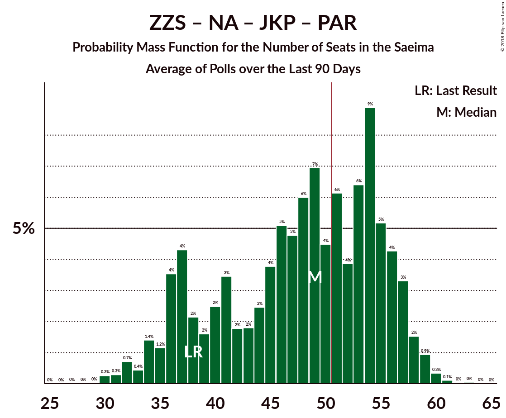

# Poll Average

<a href="#voting-intentions">Voting Intentions</a> | <a href="#seats">Seats</a> | <a href="#coalitions">Coalitions</a> | <a href="#technical-information">Technical Information</a>

## Summary

The table below lists the polls on which the average is based. They are the most recent polls (less than 90 days old) registered and analyzed so far.

| Period     | Polling firm/Commissioner(s) | SDPS | V | ZZS | NA | NSL | LRA | LKS | VL | LA | JKP | KPV | PAR |
|:----------:|:----------------------------:|:--:|:--:|:--:|:--:|:--:|:--:|:--:|:--:|:--:|:--:|:--:|:--:|
| 4 October 2014 | General Election | 23.0%   24 | 21.9%   23 | 19.5%   21 | 16.6%   17 | 6.8%   7 | 6.7%   8 | 1.6%   0 | 1.2%   0 | 0.9%   0 | 0.7%   0 | 0.0%   0 | 0.0%   0 |
| N/A | Poll Average | 19–36%   22–40 | 4–10%   0–12 | 8–20%   10–25 | 7–16%   7–18 | 2–4%   0 | 2–6%   0–7 | 1–5%   0 | N/A   N/A | N/A   N/A | 3–16%   0–19 | 10–17%   11–19 | 4–11%   0–12 |
| [10–14 September 2018](2018-09-14-Norstat.html) | Norstat | 19–28%   22–33 | 3–9%   0–10 | 11–20%   14–24 | 6–13%   6–15 | N/A   N/A | 1–5%   0 | 2–6%   0–7 | N/A   N/A | N/A   N/A | 7–14%   8–16 | 10–18%   11–20 | 5–11%   0–13 |
| [31 August–9 September 2018](2018-09-09-FACTUM.html) | FACTUM | 19–23%   21–26 | 8–11%   8–12 | 8–11%   8–12 | 12–16%   13–18 | N/A   N/A | 3–5%   0–7 | 2–4%   0 | N/A   N/A | N/A   N/A | 13–17%   15–20 | 11–15%   12–17 | 8–11%   8–12 |
| [1–23 August 2018](2018-08-23-SKDS.html) | SKDS   Latvijas Televīzija | 29–37%   32–42 | 6–10%   7–12 | 15–21%   17–26 | 7–12%   7–15 | 2–4%   0 | 3–6%   0–7 | 1–3%   0 | N/A   N/A | N/A   N/A | 3–6%   0–7 | 9–14%   10–17 | 3–7%   0–8 |
| 4 October 2014 | General Election | 23.0%   24 | 21.9%   23 | 19.5%   21 | 16.6%   17 | 6.8%   7 | 6.7%   8 | 1.6%   0 | 1.2%   0 | 0.9%   0 | 0.7%   0 | 0.0%   0 | 0.0%   0 |

Only polls for which at least the sample size has been published are included in the table above.

**Legend:**
+ **Top half of each row:** Voting intentions (95% confidence interval)
+ **Bottom half of each row:** Seat projections for the Saeima (95% confidence interval)
+ **SDPS:** Sociāldemokrātiskā Partija “Saskaņa”
+ **V:** Vienotība
+ **ZZS:** Zaļo un Zemnieku savienība
+ **NA:** Nacionālā apvienība „Visu Latvijai!”–„Tēvzemei un Brīvībai/LNNK”
+ **NSL:** No sirds Latvijai
+ **LRA:** Latvijas Reģionu apvienība
+ **LKS:** Latvijas Krievu savienība
+ **VL:** Vienoti Latvijai
+ **LA:** Latvijas attīstībai
+ **JKP:** Jaunā konservatīvā partija
+ **KPV:** Kam pieder valsts?
+ **PAR:** Kustība Par!
+ **N/A (single party):** Party not included the published results
+ **N/A (entire row):** Calculation for this opinion poll not started yet

## Voting Intentions

### Confidence Intervals

| Party | Last Result | Median | 80% Confidence Interval | 90% Confidence Interval | 95% Confidence Interval | 99% Confidence Interval |
|:-----:|:-----------:|:------:|:-----------------------:|:-----------------------:|:-----------------------:|:-----------------------:|
| <a href="#sociāldemokrātiskā-partija-“saskaņa”">Sociāldemokrātiskā Partija “Saskaņa”</a> | 23.0% | 23.4% | 20.1–34.2% |19.6–35.2% | 19.1–36.0% | 18.0–37.5% |
| <a href="#vienotība">Vienotība</a> | 21.9% | 7.9% | 5.1–9.7% |4.5–10.1% | 4.0–10.4% | 3.3–11.1% |
| <a href="#zaļo-un-zemnieku-savienība">Zaļo un Zemnieku savienība</a> | 19.5% | 15.1% | 8.6–18.9% |8.2–19.7% | 7.9–20.4% | 7.4–21.6% |
| <a href="#nacionālā-apvienība-„visu-latvijai!”–„tēvzemei-un-brīvībai/lnnk”">Nacionālā apvienība „Visu Latvijai!”–„Tēvzemei un Brīvībai/LNNK”</a> | 16.6% | 10.4% | 8.0–14.6% |7.4–15.1% | 6.9–15.5% | 6.0–16.2% |
| <a href="#no-sirds-latvijai">No sirds Latvijai</a> | 6.8% | 2.8% | 2.0–3.8% |1.9–4.1% | 1.7–4.4% | 1.4–5.0% |
| <a href="#latvijas-reģionu-apvienība">Latvijas Reģionu apvienība</a> | 6.7% | 3.9% | 2.2–5.2% |1.8–5.6% | 1.5–5.9% | 1.1–6.7% |
| <a href="#latvijas-krievu-savienība">Latvijas Krievu savienība</a> | 1.6% | 2.8% | 1.7–4.1% |1.4–4.6% | 1.3–5.1% | 1.0–6.2% |
| <a href="#vienoti-latvijai">Vienoti Latvijai</a> | 1.2% | N/A | N/A |N/A | N/A | N/A |
| <a href="#latvijas-attīstībai">Latvijas attīstībai</a> | 0.9% | N/A | N/A |N/A | N/A | N/A |
| <a href="#jaunā-konservatīvā-partija">Jaunā konservatīvā partija</a> | 0.7% | 10.4% | 4.1–15.6% |3.7–16.1% | 3.4–16.5% | 2.9–17.3% |
| <a href="#kam-pieder-valsts?">Kam pieder valsts?</a> | 0.0% | 12.7% | 10.7–14.9% |10.2–15.7% | 9.7–16.6% | 8.9–18.3% |
| <a href="#kustība-par!">Kustība Par!</a> | 0.0% | 7.7% | 4.4–9.8% |4.0–10.3% | 3.7–10.7% | 3.2–11.9% |

### Sociāldemokrātiskā Partija “Saskaņa”

*For a full overview of the results for this party, see the [Sociāldemokrātiskā Partija “Saskaņa”](party-sociāldemokrātiskāpartija“saskaņa”.html) page.*

| Voting Intentions | Probability | Accumulated | Special Marks |
|:-----------------:|:-----------:|:-----------:|:-------------:|
| 15.5–16.5% | 0% | 100% |  |
| 16.5–17.5% | 0.2% | 99.9% |  |
| 17.5–18.5% | 0.9% | 99.7% |  |
| 18.5–19.5% | 4% | 98.9% |  |
| 19.5–20.5% | 10% | 95% |  |
| 20.5–21.5% | 15% | 85% |  |
| 21.5–22.5% | 13% | 70% |  |
| 22.5–23.5% | 8% | 57% | Last Result, Median |
| 23.5–24.5% | 6% | 49% |  |
| 24.5–25.5% | 4% | 44% |  |
| 25.5–26.5% | 3% | 40% |  |
| 26.5–27.5% | 2% | 37% |  |
| 27.5–28.5% | 1.1% | 35% |  |
| 28.5–29.5% | 1.1% | 34% |  |
| 29.5–30.5% | 2% | 33% |  |
| 30.5–31.5% | 4% | 31% |  |
| 31.5–32.5% | 6% | 27% |  |
| 32.5–33.5% | 7% | 21% |  |
| 33.5–34.5% | 6% | 14% |  |
| 34.5–35.5% | 4% | 8% |  |
| 35.5–36.5% | 2% | 4% |  |
| 36.5–37.5% | 1.0% | 1.5% |  |
| 37.5–38.5% | 0.3% | 0.5% |  |
| 38.5–39.5% | 0.1% | 0.1% |  |
| 39.5–40.5% | 0% | 0% |  |

### Vienotība

*For a full overview of the results for this party, see the [Vienotība](party-vienotība.html) page.*

| Voting Intentions | Probability | Accumulated | Special Marks |
|:-----------------:|:-----------:|:-----------:|:-------------:|
| 1.5–2.5% | 0% | 100% |  |
| 2.5–3.5% | 0.9% | 100% |  |
| 3.5–4.5% | 4% | 99.1% |  |
| 4.5–5.5% | 9% | 95% |  |
| 5.5–6.5% | 12% | 86% |  |
| 6.5–7.5% | 16% | 74% |  |
| 7.5–8.5% | 23% | 58% | Median |
| 8.5–9.5% | 24% | 36% |  |
| 9.5–10.5% | 10% | 12% |  |
| 10.5–11.5% | 2% | 2% |  |
| 11.5–12.5% | 0.1% | 0.1% |  |
| 12.5–13.5% | 0% | 0% |  |
| 13.5–14.5% | 0% | 0% |  |
| 14.5–15.5% | 0% | 0% |  |
| 15.5–16.5% | 0% | 0% |  |
| 16.5–17.5% | 0% | 0% |  |
| 17.5–18.5% | 0% | 0% |  |
| 18.5–19.5% | 0% | 0% |  |
| 19.5–20.5% | 0% | 0% |  |
| 20.5–21.5% | 0% | 0% |  |
| 21.5–22.5% | 0% | 0% | Last Result |

### Zaļo un Zemnieku savienība

*For a full overview of the results for this party, see the [Zaļo un Zemnieku savienība](party-zaļounzemniekusavienība.html) page.*

| Voting Intentions | Probability | Accumulated | Special Marks |
|:-----------------:|:-----------:|:-----------:|:-------------:|
| 5.5–6.5% | 0% | 100% |  |
| 6.5–7.5% | 0.8% | 100% |  |
| 7.5–8.5% | 8% | 99.1% |  |
| 8.5–9.5% | 16% | 91% |  |
| 9.5–10.5% | 7% | 75% |  |
| 10.5–11.5% | 2% | 68% |  |
| 11.5–12.5% | 2% | 66% |  |
| 12.5–13.5% | 4% | 64% |  |
| 13.5–14.5% | 6% | 60% |  |
| 14.5–15.5% | 8% | 54% | Median |
| 15.5–16.5% | 10% | 46% |  |
| 16.5–17.5% | 12% | 36% |  |
| 17.5–18.5% | 11% | 24% |  |
| 18.5–19.5% | 8% | 13% |  |
| 19.5–20.5% | 4% | 6% | Last Result |
| 20.5–21.5% | 1.5% | 2% |  |
| 21.5–22.5% | 0.4% | 0.5% |  |
| 22.5–23.5% | 0.1% | 0.1% |  |
| 23.5–24.5% | 0% | 0% |  |

### Nacionālā apvienība „Visu Latvijai!”–„Tēvzemei un Brīvībai/LNNK”

*For a full overview of the results for this party, see the [Nacionālā apvienība „Visu Latvijai!”–„Tēvzemei un Brīvībai/LNNK”](party-nacionālāapvienība„visulatvijai”–„tēvzemeiunbrīvībailnnk”.html) page.*

| Voting Intentions | Probability | Accumulated | Special Marks |
|:-----------------:|:-----------:|:-----------:|:-------------:|
| 3.5–4.5% | 0% | 100% |  |
| 4.5–5.5% | 0.2% | 100% |  |
| 5.5–6.5% | 1.2% | 99.8% |  |
| 6.5–7.5% | 5% | 98.6% |  |
| 7.5–8.5% | 12% | 94% |  |
| 8.5–9.5% | 18% | 82% |  |
| 9.5–10.5% | 16% | 64% | Median |
| 10.5–11.5% | 9% | 48% |  |
| 11.5–12.5% | 5% | 39% |  |
| 12.5–13.5% | 10% | 33% |  |
| 13.5–14.5% | 14% | 24% |  |
| 14.5–15.5% | 8% | 10% |  |
| 15.5–16.5% | 2% | 2% |  |
| 16.5–17.5% | 0.2% | 0.2% | Last Result |
| 17.5–18.5% | 0% | 0% |  |

### No sirds Latvijai

*For a full overview of the results for this party, see the [No sirds Latvijai](party-nosirdslatvijai.html) page.*

| Voting Intentions | Probability | Accumulated | Special Marks |
|:-----------------:|:-----------:|:-----------:|:-------------:|
| 0.0–0.5% | 0% | 100% |  |
| 0.5–1.5% | 1.2% | 100% |  |
| 1.5–2.5% | 31% | 98.8% |  |
| 2.5–3.5% | 51% | 67% | Median |
| 3.5–4.5% | 15% | 17% |  |
| 4.5–5.5% | 2% | 2% |  |
| 5.5–6.5% | 0.1% | 0.1% |  |
| 6.5–7.5% | 0% | 0% | Last Result |

### Latvijas Reģionu apvienība

*For a full overview of the results for this party, see the [Latvijas Reģionu apvienība](party-latvijasreģionuapvienība.html) page.*

| Voting Intentions | Probability | Accumulated | Special Marks |
|:-----------------:|:-----------:|:-----------:|:-------------:|
| 0.0–0.5% | 0% | 100% |  |
| 0.5–1.5% | 3% | 100% |  |
| 1.5–2.5% | 12% | 97% |  |
| 2.5–3.5% | 21% | 85% |  |
| 3.5–4.5% | 40% | 64% | Median |
| 4.5–5.5% | 20% | 25% |  |
| 5.5–6.5% | 4% | 5% |  |
| 6.5–7.5% | 0.6% | 0.7% | Last Result |
| 7.5–8.5% | 0.1% | 0.1% |  |
| 8.5–9.5% | 0% | 0% |  |

### Latvijas Krievu savienība

*For a full overview of the results for this party, see the [Latvijas Krievu savienība](party-latvijaskrievusavienība.html) page.*

| Voting Intentions | Probability | Accumulated | Special Marks |
|:-----------------:|:-----------:|:-----------:|:-------------:|
| 0.0–0.5% | 0% | 100% |  |
| 0.5–1.5% | 7% | 100% |  |
| 1.5–2.5% | 30% | 93% | Last Result |
| 2.5–3.5% | 42% | 62% | Median |
| 3.5–4.5% | 15% | 21% |  |
| 4.5–5.5% | 4% | 5% |  |
| 5.5–6.5% | 1.1% | 1.4% |  |
| 6.5–7.5% | 0.2% | 0.3% |  |
| 7.5–8.5% | 0% | 0% |  |
| 8.5–9.5% | 0% | 0% |  |

### Jaunā konservatīvā partija

*For a full overview of the results for this party, see the [Jaunā konservatīvā partija](party-jaunākonservatīvāpartija.html) page.*

| Voting Intentions | Probability | Accumulated | Special Marks |
|:-----------------:|:-----------:|:-----------:|:-------------:|
| 0.5–1.5% | 0% | 100% | Last Result |
| 1.5–2.5% | 0.1% | 100% |  |
| 2.5–3.5% | 3% | 99.9% |  |
| 3.5–4.5% | 13% | 96% |  |
| 4.5–5.5% | 12% | 83% |  |
| 5.5–6.5% | 4% | 71% |  |
| 6.5–7.5% | 2% | 67% |  |
| 7.5–8.5% | 3% | 65% |  |
| 8.5–9.5% | 6% | 62% |  |
| 9.5–10.5% | 7% | 56% | Median |
| 10.5–11.5% | 7% | 49% |  |
| 11.5–12.5% | 5% | 42% |  |
| 12.5–13.5% | 4% | 37% |  |
| 13.5–14.5% | 9% | 33% |  |
| 14.5–15.5% | 13% | 24% |  |
| 15.5–16.5% | 8% | 10% |  |
| 16.5–17.5% | 2% | 2% |  |
| 17.5–18.5% | 0.3% | 0.3% |  |
| 18.5–19.5% | 0% | 0% |  |

### Kam pieder valsts?

*For a full overview of the results for this party, see the [Kam pieder valsts?](party-kampiedervalsts.html) page.*

| Voting Intentions | Probability | Accumulated | Special Marks |
|:-----------------:|:-----------:|:-----------:|:-------------:|
| 0.0–0.5% | 0% | 100% | Last Result |
| 0.5–1.5% | 0% | 100% |  |
| 1.5–2.5% | 0% | 100% |  |
| 2.5–3.5% | 0% | 100% |  |
| 3.5–4.5% | 0% | 100% |  |
| 4.5–5.5% | 0% | 100% |  |
| 5.5–6.5% | 0% | 100% |  |
| 6.5–7.5% | 0% | 100% |  |
| 7.5–8.5% | 0.2% | 100% |  |
| 8.5–9.5% | 2% | 99.8% |  |
| 9.5–10.5% | 6% | 98% |  |
| 10.5–11.5% | 14% | 92% |  |
| 11.5–12.5% | 23% | 78% |  |
| 12.5–13.5% | 26% | 55% | Median |
| 13.5–14.5% | 16% | 29% |  |
| 14.5–15.5% | 7% | 13% |  |
| 15.5–16.5% | 3% | 6% |  |
| 16.5–17.5% | 2% | 3% |  |
| 17.5–18.5% | 0.7% | 1.1% |  |
| 18.5–19.5% | 0.3% | 0.4% |  |
| 19.5–20.5% | 0.1% | 0.1% |  |
| 20.5–21.5% | 0% | 0% |  |

### Kustība Par!

*For a full overview of the results for this party, see the [Kustība Par!](party-kustībapar.html) page.*

| Voting Intentions | Probability | Accumulated | Special Marks |
|:-----------------:|:-----------:|:-----------:|:-------------:|
| 0.0–0.5% | 0% | 100% | Last Result |
| 0.5–1.5% | 0% | 100% |  |
| 1.5–2.5% | 0% | 100% |  |
| 2.5–3.5% | 2% | 100% |  |
| 3.5–4.5% | 10% | 98% |  |
| 4.5–5.5% | 15% | 88% |  |
| 5.5–6.5% | 11% | 73% |  |
| 6.5–7.5% | 10% | 62% |  |
| 7.5–8.5% | 17% | 52% | Median |
| 8.5–9.5% | 22% | 36% |  |
| 9.5–10.5% | 11% | 14% |  |
| 10.5–11.5% | 3% | 3% |  |
| 11.5–12.5% | 0.6% | 0.8% |  |
| 12.5–13.5% | 0.2% | 0.2% |  |
| 13.5–14.5% | 0% | 0% |  |

## Seats

### Confidence Intervals

| Party | Last Result | Median | 80% Confidence Interval | 90% Confidence Interval | 95% Confidence Interval | 99% Confidence Interval |
|:-----:|:-----------:|:------:|:-----------------------:|:-----------------------:|:-----------------------:|:-----------------------:|
| <a href="#sociāldemokrātiskā-partija-“saskaņa”">Sociāldemokrātiskā Partija “Saskaņa”</a> | 24 | 27 | 23–38 |22–40 | 22–40 | 20–43 |
| <a href="#vienotība">Vienotība</a> | 23 | 8 | 7–11 |0–11 | 0–12 | 0–13 |
| <a href="#zaļo-un-zemnieku-savienība">Zaļo un Zemnieku savienība</a> | 21 | 18 | 11–24 |10–24 | 10–25 | 8–27 |
| <a href="#nacionālā-apvienība-„visu-latvijai!”–„tēvzemei-un-brīvībai/lnnk”">Nacionālā apvienība „Visu Latvijai!”–„Tēvzemei un Brīvībai/LNNK”</a> | 17 | 13 | 9–16 |8–17 | 7–18 | 6–18 |
| <a href="#no-sirds-latvijai">No sirds Latvijai</a> | 7 | 0 | 0 |0 | 0 | 0 |
| <a href="#latvijas-reģionu-apvienība">Latvijas Reģionu apvienība</a> | 8 | 0 | 0 |0–7 | 0–7 | 0–8 |
| <a href="#latvijas-krievu-savienība">Latvijas Krievu savienība</a> | 0 | 0 | 0 |0 | 0 | 0–7 |
| <a href="#vienoti-latvijai">Vienoti Latvijai</a> | 0 | N/A | N/A |N/A | N/A | N/A |
| <a href="#latvijas-attīstībai">Latvijas attīstībai</a> | 0 | N/A | N/A |N/A | N/A | N/A |
| <a href="#jaunā-konservatīvā-partija">Jaunā konservatīvā partija</a> | 0 | 12 | 0–17 |0–18 | 0–19 | 0–20 |
| <a href="#kam-pieder-valsts?">Kam pieder valsts?</a> | 0 | 15 | 12–17 |11–18 | 11–19 | 9–22 |
| <a href="#kustība-par!">Kustība Par!</a> | 0 | 9 | 0–11 |0–12 | 0–12 | 0–14 |

### Sociāldemokrātiskā Partija “Saskaņa”

*For a full overview of the results for this party, see the [Sociāldemokrātiskā Partija “Saskaņa”](party-sociāldemokrātiskāpartija“saskaņa”.html) page.*

| Number of Seats | Probability | Accumulated | Special Marks |
|:---------------:|:-----------:|:-----------:|:-------------:|
| 19 | 0.1% | 100% |  |
| 20 | 0.7% | 99.9% |  |
| 21 | 2% | 99.3% |  |
| 22 | 8% | 98% |  |
| 23 | 7% | 90% |  |
| 24 | 17% | 84% | Last Result |
| 25 | 5% | 67% |  |
| 26 | 9% | 62% |  |
| 27 | 8% | 53% | Median |
| 28 | 3% | 46% |  |
| 29 | 3% | 43% |  |
| 30 | 2% | 40% |  |
| 31 | 3% | 38% |  |
| 32 | 2% | 35% |  |
| 33 | 1.3% | 34% |  |
| 34 | 2% | 32% |  |
| 35 | 3% | 30% |  |
| 36 | 3% | 27% |  |
| 37 | 10% | 25% |  |
| 38 | 8% | 15% |  |
| 39 | 2% | 7% |  |
| 40 | 3% | 5% |  |
| 41 | 1.2% | 2% |  |
| 42 | 0.5% | 1.3% |  |
| 43 | 0.6% | 0.8% |  |
| 44 | 0% | 0.2% |  |
| 45 | 0% | 0.1% |  |
| 46 | 0.1% | 0.1% |  |
| 47 | 0% | 0% |  |

### Vienotība

*For a full overview of the results for this party, see the [Vienotība](party-vienotība.html) page.*

| Number of Seats | Probability | Accumulated | Special Marks |
|:---------------:|:-----------:|:-----------:|:-------------:|
| 0 | 9% | 100% |  |
| 1 | 0% | 91% |  |
| 2 | 0% | 91% |  |
| 3 | 0% | 91% |  |
| 4 | 0% | 91% |  |
| 5 | 0% | 91% |  |
| 6 | 0% | 91% |  |
| 7 | 20% | 91% |  |
| 8 | 22% | 71% | Median |
| 9 | 9% | 49% |  |
| 10 | 27% | 40% |  |
| 11 | 10% | 14% |  |
| 12 | 3% | 4% |  |
| 13 | 0.4% | 0.6% |  |
| 14 | 0.1% | 0.1% |  |
| 15 | 0% | 0% |  |
| 16 | 0% | 0% |  |
| 17 | 0% | 0% |  |
| 18 | 0% | 0% |  |
| 19 | 0% | 0% |  |
| 20 | 0% | 0% |  |
| 21 | 0% | 0% |  |
| 22 | 0% | 0% |  |
| 23 | 0% | 0% | Last Result |

### Zaļo un Zemnieku savienība

*For a full overview of the results for this party, see the [Zaļo un Zemnieku savienība](party-zaļounzemniekusavienība.html) page.*

| Number of Seats | Probability | Accumulated | Special Marks |
|:---------------:|:-----------:|:-----------:|:-------------:|
| 7 | 0.1% | 100% |  |
| 8 | 0.8% | 99.9% |  |
| 9 | 0.7% | 99.1% |  |
| 10 | 5% | 98% |  |
| 11 | 26% | 94% |  |
| 12 | 0.4% | 68% |  |
| 13 | 0.3% | 67% |  |
| 14 | 1.0% | 67% |  |
| 15 | 3% | 66% |  |
| 16 | 3% | 63% |  |
| 17 | 8% | 60% |  |
| 18 | 4% | 52% | Median |
| 19 | 8% | 48% |  |
| 20 | 9% | 40% |  |
| 21 | 7% | 31% | Last Result |
| 22 | 4% | 24% |  |
| 23 | 9% | 20% |  |
| 24 | 9% | 11% |  |
| 25 | 1.5% | 3% |  |
| 26 | 0.6% | 1.1% |  |
| 27 | 0.4% | 0.5% |  |
| 28 | 0.1% | 0.1% |  |
| 29 | 0% | 0% |  |

### Nacionālā apvienība „Visu Latvijai!”–„Tēvzemei un Brīvībai/LNNK”

*For a full overview of the results for this party, see the [Nacionālā apvienība „Visu Latvijai!”–„Tēvzemei un Brīvībai/LNNK”](party-nacionālāapvienība„visulatvijai”–„tēvzemeiunbrīvībailnnk”.html) page.*

| Number of Seats | Probability | Accumulated | Special Marks |
|:---------------:|:-----------:|:-----------:|:-------------:|
| 6 | 1.3% | 100% |  |
| 7 | 2% | 98.7% |  |
| 8 | 3% | 97% |  |
| 9 | 8% | 94% |  |
| 10 | 10% | 86% |  |
| 11 | 15% | 77% |  |
| 12 | 12% | 62% |  |
| 13 | 10% | 50% | Median |
| 14 | 13% | 40% |  |
| 15 | 8% | 28% |  |
| 16 | 12% | 20% |  |
| 17 | 4% | 8% | Last Result |
| 18 | 4% | 4% |  |
| 19 | 0% | 0% |  |

### No sirds Latvijai

*For a full overview of the results for this party, see the [No sirds Latvijai](party-nosirdslatvijai.html) page.*

| Number of Seats | Probability | Accumulated | Special Marks |
|:---------------:|:-----------:|:-----------:|:-------------:|
| 0 | 99.7% | 100% | Median |
| 1 | 0% | 0.3% |  |
| 2 | 0% | 0.3% |  |
| 3 | 0% | 0.3% |  |
| 4 | 0% | 0.3% |  |
| 5 | 0% | 0.3% |  |
| 6 | 0.2% | 0.3% |  |
| 7 | 0.1% | 0.1% | Last Result |
| 8 | 0% | 0% |  |

### Latvijas Reģionu apvienība

*For a full overview of the results for this party, see the [Latvijas Reģionu apvienība](party-latvijasreģionuapvienība.html) page.*

| Number of Seats | Probability | Accumulated | Special Marks |
|:---------------:|:-----------:|:-----------:|:-------------:|
| 0 | 91% | 100% | Median |
| 1 | 0% | 9% |  |
| 2 | 0% | 9% |  |
| 3 | 0% | 9% |  |
| 4 | 0% | 9% |  |
| 5 | 0% | 9% |  |
| 6 | 3% | 9% |  |
| 7 | 5% | 6% |  |
| 8 | 0.4% | 0.6% | Last Result |
| 9 | 0.2% | 0.2% |  |
| 10 | 0% | 0% |  |

### Latvijas Krievu savienība

*For a full overview of the results for this party, see the [Latvijas Krievu savienība](party-latvijaskrievusavienība.html) page.*

| Number of Seats | Probability | Accumulated | Special Marks |
|:---------------:|:-----------:|:-----------:|:-------------:|
| 0 | 98% | 100% | Last Result, Median |
| 1 | 0% | 2% |  |
| 2 | 0% | 2% |  |
| 3 | 0% | 2% |  |
| 4 | 0% | 2% |  |
| 5 | 0% | 2% |  |
| 6 | 0.6% | 2% |  |
| 7 | 2% | 2% |  |
| 8 | 0.1% | 0.1% |  |
| 9 | 0% | 0% |  |

### Jaunā konservatīvā partija

*For a full overview of the results for this party, see the [Jaunā konservatīvā partija](party-jaunākonservatīvāpartija.html) page.*

| Number of Seats | Probability | Accumulated | Special Marks |
|:---------------:|:-----------:|:-----------:|:-------------:|
| 0 | 25% | 100% | Last Result |
| 1 | 0% | 75% |  |
| 2 | 0% | 75% |  |
| 3 | 0% | 75% |  |
| 4 | 0% | 75% |  |
| 5 | 0% | 75% |  |
| 6 | 0.3% | 75% |  |
| 7 | 7% | 74% |  |
| 8 | 3% | 67% |  |
| 9 | 1.0% | 64% |  |
| 10 | 4% | 63% |  |
| 11 | 4% | 59% |  |
| 12 | 5% | 54% | Median |
| 13 | 7% | 50% |  |
| 14 | 3% | 43% |  |
| 15 | 25% | 39% |  |
| 16 | 4% | 15% |  |
| 17 | 4% | 11% |  |
| 18 | 3% | 7% |  |
| 19 | 2% | 4% |  |
| 20 | 1.5% | 2% |  |
| 21 | 0.1% | 0.1% |  |
| 22 | 0% | 0% |  |

### Kam pieder valsts?

*For a full overview of the results for this party, see the [Kam pieder valsts?](party-kampiedervalsts.html) page.*

| Number of Seats | Probability | Accumulated | Special Marks |
|:---------------:|:-----------:|:-----------:|:-------------:|
| 0 | 0% | 100% | Last Result |
| 1 | 0% | 100% |  |
| 2 | 0% | 100% |  |
| 3 | 0% | 100% |  |
| 4 | 0% | 100% |  |
| 5 | 0% | 100% |  |
| 6 | 0% | 100% |  |
| 7 | 0% | 100% |  |
| 8 | 0% | 100% |  |
| 9 | 0.6% | 100% |  |
| 10 | 1.2% | 99.4% |  |
| 11 | 4% | 98% |  |
| 12 | 6% | 94% |  |
| 13 | 12% | 88% |  |
| 14 | 20% | 76% |  |
| 15 | 35% | 56% | Median |
| 16 | 11% | 22% |  |
| 17 | 5% | 11% |  |
| 18 | 3% | 6% |  |
| 19 | 2% | 3% |  |
| 20 | 0.8% | 2% |  |
| 21 | 0.3% | 0.8% |  |
| 22 | 0.2% | 0.5% |  |
| 23 | 0.2% | 0.3% |  |
| 24 | 0% | 0% |  |

### Kustība Par!

*For a full overview of the results for this party, see the [Kustība Par!](party-kustībapar.html) page.*

| Number of Seats | Probability | Accumulated | Special Marks |
|:---------------:|:-----------:|:-----------:|:-------------:|
| 0 | 18% | 100% | Last Result |
| 1 | 0% | 82% |  |
| 2 | 0% | 82% |  |
| 3 | 0% | 82% |  |
| 4 | 0% | 82% |  |
| 5 | 0% | 82% |  |
| 6 | 0% | 82% |  |
| 7 | 22% | 82% |  |
| 8 | 9% | 60% |  |
| 9 | 19% | 51% | Median |
| 10 | 20% | 33% |  |
| 11 | 6% | 12% |  |
| 12 | 4% | 6% |  |
| 13 | 1.3% | 2% |  |
| 14 | 0.3% | 0.7% |  |
| 15 | 0.3% | 0.4% |  |
| 16 | 0.1% | 0.1% |  |
| 17 | 0% | 0% |  |

## Coalitions

### Confidence Intervals

| Coalition | Last Result | Median | Majority? | 80% Confidence Interval | 90% Confidence Interval | 95% Confidence Interval | 99% Confidence Interval |
|:---------:|:-----------:|:------:|:---------:|:-----------------------:|:-----------------------:|:-----------------------:|:-----------------------:|
| Vienotība – Zaļo un Zemnieku savienība – Nacionālā apvienība „Visu Latvijai!”–„Tēvzemei un Brīvībai/LNNK” – Jaunā konservatīvā partija – Kustība Par! | 61 | 57 | 69% | 47–63 | 44–64 | 42–64 | 40–66 |
| Zaļo un Zemnieku savienība – Nacionālā apvienība „Visu Latvijai!”–„Tēvzemei un Brīvībai/LNNK” – Jaunā konservatīvā partija – Kustība Par! | 38 | 50 | 48% | 36–55 | 35–56 | 34–58 | 31–60 |
| Vienotība – Zaļo un Zemnieku savienība – Nacionālā apvienība „Visu Latvijai!”–„Tēvzemei un Brīvībai/LNNK” – Jaunā konservatīvā partija | 61 | 48 | 37% | 41–54 | 40–54 | 39–55 | 36–57 |
| Vienotība – Nacionālā apvienība „Visu Latvijai!”–„Tēvzemei un Brīvībai/LNNK” – Jaunā konservatīvā partija – Kustība Par! | 40 | 38 | 18% | 24–52 | 21–53 | 20–54 | 19–55 |
| Vienotība – Zaļo un Zemnieku savienība – Nacionālā apvienība „Visu Latvijai!”–„Tēvzemei un Brīvībai/LNNK” – Kustība Par! | 61 | 46 | 3% | 41–49 | 39–49 | 38–51 | 36–53 |
| Vienotība – Zaļo un Zemnieku savienība – Nacionālā apvienība „Visu Latvijai!”–„Tēvzemei un Brīvībai/LNNK” | 61 | 37 | 0.1% | 33–44 | 31–47 | 30–48 | 27–49 |
| Zaļo un Zemnieku savienība – Nacionālā apvienība „Visu Latvijai!”–„Tēvzemei un Brīvībai/LNNK” – Jaunā konservatīvā partija | 38 | 41 | 0.4% | 33–45 | 30–47 | 29–48 | 28–50 |
| Zaļo un Zemnieku savienība – Nacionālā apvienība „Visu Latvijai!”–„Tēvzemei un Brīvībai/LNNK” – Kustība Par! | 38 | 37 | 0% | 34–42 | 32–43 | 31–44 | 28–46 |

### Vienotība – Zaļo un Zemnieku savienība – Nacionālā apvienība „Visu Latvijai!”–„Tēvzemei un Brīvībai/LNNK” – Jaunā konservatīvā partija – Kustība Par!

| Number of Seats | Probability | Accumulated | Special Marks |
|:---------------:|:-----------:|:-----------:|:-------------:|
| 38 | 0.1% | 100% |  |
| 39 | 0.3% | 99.9% |  |
| 40 | 0.7% | 99.6% |  |
| 41 | 0.4% | 98.9% |  |
| 42 | 1.3% | 98.5% |  |
| 43 | 1.1% | 97% |  |
| 44 | 2% | 96% |  |
| 45 | 2% | 94% |  |
| 46 | 2% | 92% |  |
| 47 | 7% | 91% |  |
| 48 | 8% | 83% |  |
| 49 | 5% | 76% |  |
| 50 | 2% | 71% |  |
| 51 | 2% | 69% | Majority |
| 52 | 2% | 67% |  |
| 53 | 3% | 66% |  |
| 54 | 4% | 62% |  |
| 55 | 3% | 59% |  |
| 56 | 5% | 56% |  |
| 57 | 4% | 51% |  |
| 58 | 6% | 47% |  |
| 59 | 3% | 41% |  |
| 60 | 5% | 38% | Median |
| 61 | 15% | 32% | Last Result |
| 62 | 5% | 18% |  |
| 63 | 6% | 13% |  |
| 64 | 5% | 7% |  |
| 65 | 1.4% | 2% |  |
| 66 | 0.6% | 0.7% |  |
| 67 | 0.1% | 0.1% |  |
| 68 | 0% | 0% |  |

### Zaļo un Zemnieku savienība – Nacionālā apvienība „Visu Latvijai!”–„Tēvzemei un Brīvībai/LNNK” – Jaunā konservatīvā partija – Kustība Par!

| Number of Seats | Probability | Accumulated | Special Marks |
|:---------------:|:-----------:|:-----------:|:-------------:|
| 29 | 0% | 100% |  |
| 30 | 0.3% | 99.9% |  |
| 31 | 0.4% | 99.6% |  |
| 32 | 0.9% | 99.2% |  |
| 33 | 0.6% | 98% |  |
| 34 | 2% | 98% |  |
| 35 | 2% | 96% |  |
| 36 | 5% | 94% |  |
| 37 | 6% | 90% |  |
| 38 | 3% | 84% | Last Result |
| 39 | 2% | 81% |  |
| 40 | 3% | 79% |  |
| 41 | 4% | 76% |  |
| 42 | 2% | 71% |  |
| 43 | 0.9% | 69% |  |
| 44 | 2% | 68% |  |
| 45 | 2% | 66% |  |
| 46 | 2% | 65% |  |
| 47 | 3% | 63% |  |
| 48 | 4% | 60% |  |
| 49 | 3% | 56% |  |
| 50 | 6% | 54% |  |
| 51 | 16% | 48% | Majority |
| 52 | 7% | 31% | Median |
| 53 | 7% | 24% |  |
| 54 | 6% | 17% |  |
| 55 | 4% | 11% |  |
| 56 | 2% | 7% |  |
| 57 | 2% | 4% |  |
| 58 | 0.9% | 3% |  |
| 59 | 1.0% | 2% |  |
| 60 | 0.4% | 0.7% |  |
| 61 | 0.1% | 0.3% |  |
| 62 | 0% | 0.1% |  |
| 63 | 0.1% | 0.1% |  |
| 64 | 0% | 0% |  |

### Vienotība – Zaļo un Zemnieku savienība – Nacionālā apvienība „Visu Latvijai!”–„Tēvzemei un Brīvībai/LNNK” – Jaunā konservatīvā partija

| Number of Seats | Probability | Accumulated | Special Marks |
|:---------------:|:-----------:|:-----------:|:-------------:|
| 35 | 0.2% | 100% |  |
| 36 | 0.3% | 99.8% |  |
| 37 | 0.6% | 99.4% |  |
| 38 | 0.7% | 98.8% |  |
| 39 | 1.2% | 98% |  |
| 40 | 5% | 97% |  |
| 41 | 4% | 92% |  |
| 42 | 5% | 87% |  |
| 43 | 3% | 83% |  |
| 44 | 5% | 79% |  |
| 45 | 5% | 74% |  |
| 46 | 6% | 69% |  |
| 47 | 8% | 63% |  |
| 48 | 7% | 56% |  |
| 49 | 5% | 49% |  |
| 50 | 7% | 43% |  |
| 51 | 9% | 37% | Median, Majority |
| 52 | 11% | 28% |  |
| 53 | 6% | 17% |  |
| 54 | 7% | 11% |  |
| 55 | 2% | 4% |  |
| 56 | 0.8% | 2% |  |
| 57 | 0.8% | 0.9% |  |
| 58 | 0.1% | 0.1% |  |
| 59 | 0% | 0% |  |
| 60 | 0% | 0% |  |
| 61 | 0% | 0% | Last Result |

### Vienotība – Nacionālā apvienība „Visu Latvijai!”–„Tēvzemei un Brīvībai/LNNK” – Jaunā konservatīvā partija – Kustība Par!

| Number of Seats | Probability | Accumulated | Special Marks |
|:---------------:|:-----------:|:-----------:|:-------------:|
| 16 | 0.2% | 100% |  |
| 17 | 0.1% | 99.8% |  |
| 18 | 0.2% | 99.7% |  |
| 19 | 2% | 99.5% |  |
| 20 | 1.5% | 98% |  |
| 21 | 1.3% | 96% |  |
| 22 | 1.0% | 95% |  |
| 23 | 1.1% | 94% |  |
| 24 | 7% | 93% |  |
| 25 | 3% | 86% |  |
| 26 | 5% | 83% |  |
| 27 | 1.4% | 78% |  |
| 28 | 5% | 76% |  |
| 29 | 1.3% | 72% |  |
| 30 | 2% | 70% |  |
| 31 | 1.2% | 69% |  |
| 32 | 2% | 67% |  |
| 33 | 2% | 65% |  |
| 34 | 1.2% | 63% |  |
| 35 | 2% | 62% |  |
| 36 | 3% | 60% |  |
| 37 | 5% | 57% |  |
| 38 | 4% | 52% |  |
| 39 | 4% | 48% |  |
| 40 | 3% | 44% | Last Result |
| 41 | 3% | 41% |  |
| 42 | 2% | 38% | Median |
| 43 | 1.2% | 36% |  |
| 44 | 0.8% | 35% |  |
| 45 | 0.6% | 34% |  |
| 46 | 0.8% | 34% |  |
| 47 | 0.5% | 33% |  |
| 48 | 0.8% | 32% |  |
| 49 | 2% | 32% |  |
| 50 | 12% | 30% |  |
| 51 | 5% | 18% | Majority |
| 52 | 5% | 13% |  |
| 53 | 5% | 7% |  |
| 54 | 2% | 3% |  |
| 55 | 0.7% | 1.0% |  |
| 56 | 0.2% | 0.3% |  |
| 57 | 0% | 0.1% |  |
| 58 | 0% | 0% |  |

### Vienotība – Zaļo un Zemnieku savienība – Nacionālā apvienība „Visu Latvijai!”–„Tēvzemei un Brīvībai/LNNK” – Kustība Par!

| Number of Seats | Probability | Accumulated | Special Marks |
|:---------------:|:-----------:|:-----------:|:-------------:|
| 31 | 0% | 100% |  |
| 32 | 0% | 99.9% |  |
| 33 | 0% | 99.9% |  |
| 34 | 0.1% | 99.9% |  |
| 35 | 0.2% | 99.8% |  |
| 36 | 0.5% | 99.5% |  |
| 37 | 0.7% | 99.0% |  |
| 38 | 1.4% | 98% |  |
| 39 | 2% | 97% |  |
| 40 | 3% | 95% |  |
| 41 | 4% | 92% |  |
| 42 | 5% | 88% |  |
| 43 | 8% | 83% |  |
| 44 | 10% | 75% |  |
| 45 | 10% | 65% |  |
| 46 | 19% | 55% |  |
| 47 | 13% | 37% |  |
| 48 | 10% | 23% | Median |
| 49 | 8% | 13% |  |
| 50 | 2% | 5% |  |
| 51 | 1.2% | 3% | Majority |
| 52 | 0.6% | 2% |  |
| 53 | 0.5% | 0.9% |  |
| 54 | 0.2% | 0.3% |  |
| 55 | 0.1% | 0.2% |  |
| 56 | 0% | 0.1% |  |
| 57 | 0% | 0% |  |
| 58 | 0% | 0% |  |
| 59 | 0% | 0% |  |
| 60 | 0% | 0% |  |
| 61 | 0% | 0% | Last Result |

### Vienotība – Zaļo un Zemnieku savienība – Nacionālā apvienība „Visu Latvijai!”–„Tēvzemei un Brīvībai/LNNK”

| Number of Seats | Probability | Accumulated | Special Marks |
|:---------------:|:-----------:|:-----------:|:-------------:|
| 24 | 0.1% | 100% |  |
| 25 | 0.1% | 99.9% |  |
| 26 | 0.2% | 99.8% |  |
| 27 | 0.3% | 99.6% |  |
| 28 | 0.7% | 99.3% |  |
| 29 | 1.1% | 98.7% |  |
| 30 | 1.4% | 98% |  |
| 31 | 2% | 96% |  |
| 32 | 3% | 94% |  |
| 33 | 4% | 91% |  |
| 34 | 7% | 87% |  |
| 35 | 9% | 79% |  |
| 36 | 11% | 71% |  |
| 37 | 13% | 60% |  |
| 38 | 6% | 47% |  |
| 39 | 9% | 41% | Median |
| 40 | 9% | 33% |  |
| 41 | 6% | 24% |  |
| 42 | 5% | 18% |  |
| 43 | 2% | 14% |  |
| 44 | 3% | 12% |  |
| 45 | 1.3% | 9% |  |
| 46 | 2% | 8% |  |
| 47 | 3% | 6% |  |
| 48 | 3% | 4% |  |
| 49 | 0.6% | 0.9% |  |
| 50 | 0.2% | 0.3% |  |
| 51 | 0.1% | 0.1% | Majority |
| 52 | 0% | 0% |  |
| 53 | 0% | 0% |  |
| 54 | 0% | 0% |  |
| 55 | 0% | 0% |  |
| 56 | 0% | 0% |  |
| 57 | 0% | 0% |  |
| 58 | 0% | 0% |  |
| 59 | 0% | 0% |  |
| 60 | 0% | 0% |  |
| 61 | 0% | 0% | Last Result |

### Zaļo un Zemnieku savienība – Nacionālā apvienība „Visu Latvijai!”–„Tēvzemei un Brīvībai/LNNK” – Jaunā konservatīvā partija

| Number of Seats | Probability | Accumulated | Special Marks |
|:---------------:|:-----------:|:-----------:|:-------------:|
| 26 | 0.1% | 100% |  |
| 27 | 0.3% | 99.9% |  |
| 28 | 0.4% | 99.7% |  |
| 29 | 3% | 99.3% |  |
| 30 | 1.4% | 96% |  |
| 31 | 1.1% | 95% |  |
| 32 | 3% | 94% |  |
| 33 | 3% | 91% |  |
| 34 | 5% | 88% |  |
| 35 | 3% | 83% |  |
| 36 | 3% | 80% |  |
| 37 | 8% | 77% |  |
| 38 | 5% | 69% | Last Result |
| 39 | 5% | 64% |  |
| 40 | 6% | 59% |  |
| 41 | 10% | 53% |  |
| 42 | 11% | 43% |  |
| 43 | 10% | 32% | Median |
| 44 | 10% | 22% |  |
| 45 | 5% | 13% |  |
| 46 | 2% | 7% |  |
| 47 | 3% | 5% |  |
| 48 | 0.8% | 3% |  |
| 49 | 1.1% | 2% |  |
| 50 | 0.4% | 0.8% |  |
| 51 | 0.2% | 0.4% | Majority |
| 52 | 0.1% | 0.2% |  |
| 53 | 0.1% | 0.1% |  |
| 54 | 0% | 0.1% |  |
| 55 | 0% | 0% |  |

### Zaļo un Zemnieku savienība – Nacionālā apvienība „Visu Latvijai!”–„Tēvzemei un Brīvībai/LNNK” – Kustība Par!

| Number of Seats | Probability | Accumulated | Special Marks |
|:---------------:|:-----------:|:-----------:|:-------------:|
| 25 | 0% | 100% |  |
| 26 | 0.2% | 99.9% |  |
| 27 | 0.1% | 99.8% |  |
| 28 | 0.4% | 99.7% |  |
| 29 | 0.4% | 99.3% |  |
| 30 | 0.8% | 98.9% |  |
| 31 | 2% | 98% |  |
| 32 | 2% | 96% |  |
| 33 | 3% | 94% |  |
| 34 | 7% | 90% |  |
| 35 | 10% | 83% |  |
| 36 | 20% | 73% |  |
| 37 | 14% | 53% |  |
| 38 | 10% | 39% | Last Result |
| 39 | 8% | 29% |  |
| 40 | 5% | 21% | Median |
| 41 | 5% | 16% |  |
| 42 | 4% | 11% |  |
| 43 | 3% | 7% |  |
| 44 | 1.1% | 3% |  |
| 45 | 0.9% | 2% |  |
| 46 | 0.9% | 1.4% |  |
| 47 | 0.2% | 0.5% |  |
| 48 | 0.1% | 0.3% |  |
| 49 | 0.1% | 0.2% |  |
| 50 | 0% | 0.1% |  |
| 51 | 0% | 0% | Majority |

## Technical Information

+ **Number of polls included in this average:** 3
+ **Lowest number of simulations done in a poll included in this average:** 1,048,576
+ **Total number of simulations done in the polls included in this average:** 3,145,728
+ **Error estimate:** 3.81%
