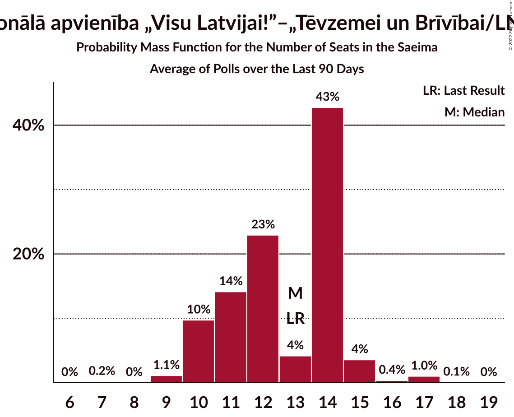
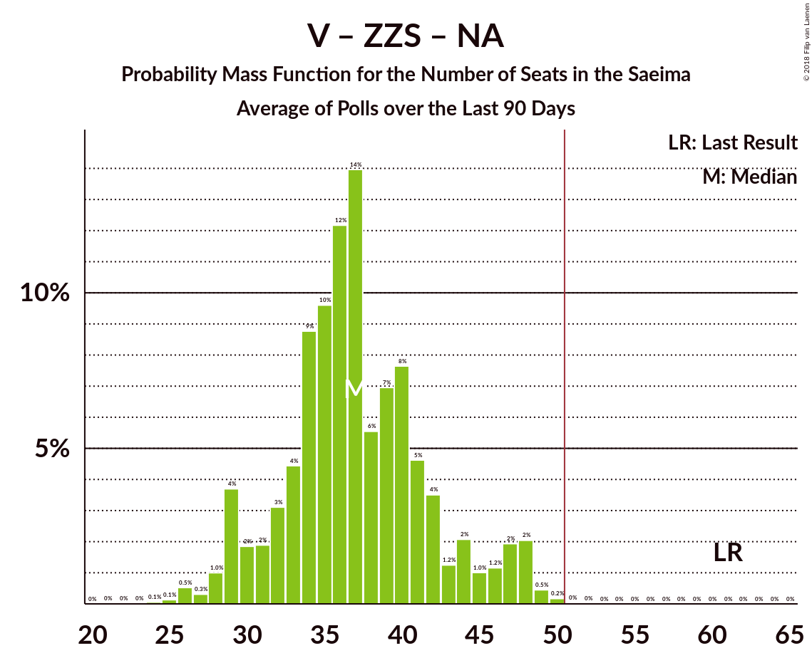

# Poll Average

<a href="#voting-intentions">Voting Intentions</a> | <a href="#seats">Seats</a> | <a href="#coalitions">Coalitions</a> | <a href="#technical-information">Technical Information</a>

## Summary

The table below lists the polls on which the average is based. They are the most recent polls (less than 90 days old) registered and analyzed so far.

| Period     | Polling firm/Commissioner(s) | SDPS | V | ZZS | NA | NSL | LRA | LKS | VL | LA | JKP | KPV | PAR |
|:----------:|:----------------------------:|:--:|:--:|:--:|:--:|:--:|:--:|:--:|:--:|:--:|:--:|:--:|:--:|
| 4 October 2014 | General Election | 23.0%   24 | 21.9%   23 | 19.5%   21 | 16.6%   17 | 6.8%   7 | 6.7%   8 | 1.6%   0 | 1.2%   0 | 0.9%   0 | 0.7%   0 | 0.0%   0 | 0.0%   0 |
| N/A | Poll Average | 19–36%   22–40 | 4–10%   0–12 | 8–20%   10–24 | 6–15%   6–18 | 0–4%   0 | 0–6%   0–7 | 0–5%   0 | N/A   N/A | N/A   N/A | 4–16%   0–19 | 10–18%   11–22 | 4–10%   0–12 |
| [10–14 September 2018](2018-09-14-Norstat.html) | Norstat | 19–28%   22–33 | 3–9%   0–10 | 11–20%   14–24 | 6–13%   6–15 | N/A   N/A | 1–5%   0 | 2–6%   0–7 | N/A   N/A | N/A   N/A | 7–14%   8–16 | 10–18%   11–20 | 5–11%   0–13 |
| [8 August–12 September 2018](2018-09-12-KantarTNS.html) | Kantar TNS   Delfi | 23–30%   26–34 | 4–8%   0–8 | 15–20%   17–24 | 6–10%   6–12 | 0–1%   0 | 0–2%   0 | 0–2%   0 | N/A   N/A | N/A   N/A | 7–12%   8–13 | 14–19%   15–23 | 5–9%   7–10 |
| [31 August–9 September 2018](2018-09-09-FACTUM.html) | FACTUM | 19–23%   21–26 | 8–11%   8–12 | 8–11%   8–12 | 12–16%   13–18 | N/A   N/A | 3–5%   0–7 | 2–4%   0 | N/A   N/A | N/A   N/A | 13–17%   15–20 | 11–15%   12–17 | 8–11%   8–12 |
| [1–23 August 2018](2018-08-23-SKDS.html) | SKDS   Latvijas Televīzija | 29–37%   32–42 | 6–10%   7–12 | 15–21%   17–26 | 7–12%   7–15 | 2–4%   0 | 3–6%   0–7 | 1–3%   0 | N/A   N/A | N/A   N/A | 3–6%   0–7 | 9–14%   10–17 | 3–7%   0–8 |
| 4 October 2014 | General Election | 23.0%   24 | 21.9%   23 | 19.5%   21 | 16.6%   17 | 6.8%   7 | 6.7%   8 | 1.6%   0 | 1.2%   0 | 0.9%   0 | 0.7%   0 | 0.0%   0 | 0.0%   0 |

Only polls for which at least the sample size has been published are included in the table above.

**Legend:**
+ **Top half of each row:** Voting intentions (95% confidence interval)
+ **Bottom half of each row:** Seat projections for the Saeima (95% confidence interval)
+ **SDPS:** Sociāldemokrātiskā Partija “Saskaņa”
+ **V:** Vienotība
+ **ZZS:** Zaļo un Zemnieku savienība
+ **NA:** Nacionālā apvienība „Visu Latvijai!”–„Tēvzemei un Brīvībai/LNNK”
+ **NSL:** No sirds Latvijai
+ **LRA:** Latvijas Reģionu apvienība
+ **LKS:** Latvijas Krievu savienība
+ **VL:** Vienoti Latvijai
+ **LA:** Latvijas attīstībai
+ **JKP:** Jaunā konservatīvā partija
+ **KPV:** Kam pieder valsts?
+ **PAR:** Kustība Par!
+ **N/A (single party):** Party not included the published results
+ **N/A (entire row):** Calculation for this opinion poll not started yet

## Voting Intentions

### Confidence Intervals

| Party | Last Result | Median | 80% Confidence Interval | 90% Confidence Interval | 95% Confidence Interval | 99% Confidence Interval |
|:-----:|:-----------:|:------:|:-----------------------:|:-----------------------:|:-----------------------:|:-----------------------:|
| <a href="#sociāldemokrātiskā-partija-“saskaņa”">Sociāldemokrātiskā Partija “Saskaņa”</a> | 23.0% | 25.0% | 20.4–33.7% |19.8–34.8% | 19.3–35.7% | 18.2–37.3% |
| <a href="#vienotība">Vienotība</a> | 21.9% | 7.2% | 4.8–9.5% |4.4–9.9% | 4.1–10.3% | 3.4–11.0% |
| <a href="#zaļo-un-zemnieku-savienība">Zaļo un Zemnieku savienība</a> | 19.5% | 16.1% | 8.8–19.0% |8.4–19.7% | 8.0–20.3% | 7.5–21.5% |
| <a href="#nacionālā-apvienība-„visu-latvijai!”–„tēvzemei-un-brīvībai/lnnk”">Nacionālā apvienība „Visu Latvijai!”–„Tēvzemei un Brīvībai/LNNK”</a> | 16.6% | 9.5% | 7.2–14.3% |6.7–14.9% | 6.3–15.3% | 5.6–16.1% |
| <a href="#no-sirds-latvijai">No sirds Latvijai</a> | 6.8% | 1.6% | 0.4–3.5% |0.4–3.8% | 0.3–4.1% | 0.2–4.7% |
| <a href="#latvijas-reģionu-apvienība">Latvijas Reģionu apvienība</a> | 6.7% | 3.5% | 0.7–5.0% |0.6–5.4% | 0.5–5.8% | 0.3–6.6% |
| <a href="#latvijas-krievu-savienība">Latvijas Krievu savienība</a> | 1.6% | 2.4% | 0.7–3.9% |0.6–4.4% | 0.5–4.9% | 0.3–6.0% |
| <a href="#vienoti-latvijai">Vienoti Latvijai</a> | 1.2% | N/A | N/A |N/A | N/A | N/A |
| <a href="#latvijas-attīstībai">Latvijas attīstībai</a> | 0.9% | N/A | N/A |N/A | N/A | N/A |
| <a href="#jaunā-konservatīvā-partija">Jaunā konservatīvā partija</a> | 0.7% | 9.8% | 4.3–15.3% |3.9–15.9% | 3.5–16.3% | 3.0–17.2% |
| <a href="#kam-pieder-valsts?">Kam pieder valsts?</a> | 0.0% | 13.4% | 11.0–17.0% |10.4–17.8% | 9.9–18.4% | 9.0–19.6% |
| <a href="#kustība-par!">Kustība Par!</a> | 0.0% | 7.4% | 4.6–9.6% |4.2–10.1% | 3.8–10.5% | 3.3–11.7% |

### Sociāldemokrātiskā Partija “Saskaņa”

*For a full overview of the results for this party, see the [Sociāldemokrātiskā Partija “Saskaņa”](party-sociāldemokrātiskāpartija“saskaņa”.html) page.*

| Voting Intentions | Probability | Accumulated | Special Marks |
|:-----------------:|:-----------:|:-----------:|:-------------:|
| 15.5–16.5% | 0% | 100% |  |
| 16.5–17.5% | 0.1% | 100% |  |
| 17.5–18.5% | 0.7% | 99.8% |  |
| 18.5–19.5% | 3% | 99.2% |  |
| 19.5–20.5% | 8% | 96% |  |
| 20.5–21.5% | 11% | 89% |  |
| 21.5–22.5% | 10% | 77% |  |
| 22.5–23.5% | 7% | 68% | Last Result |
| 23.5–24.5% | 7% | 61% |  |
| 24.5–25.5% | 8% | 54% | Median |
| 25.5–26.5% | 8% | 46% |  |
| 26.5–27.5% | 6% | 38% |  |
| 27.5–28.5% | 4% | 32% |  |
| 28.5–29.5% | 2% | 28% |  |
| 29.5–30.5% | 2% | 25% |  |
| 30.5–31.5% | 3% | 23% |  |
| 31.5–32.5% | 4% | 20% |  |
| 32.5–33.5% | 5% | 16% |  |
| 33.5–34.5% | 5% | 11% |  |
| 34.5–35.5% | 3% | 6% |  |
| 35.5–36.5% | 2% | 3% |  |
| 36.5–37.5% | 0.8% | 1.1% |  |
| 37.5–38.5% | 0.3% | 0.4% |  |
| 38.5–39.5% | 0.1% | 0.1% |  |
| 39.5–40.5% | 0% | 0% |  |

### Vienotība

*For a full overview of the results for this party, see the [Vienotība](party-vienotība.html) page.*

| Voting Intentions | Probability | Accumulated | Special Marks |
|:-----------------:|:-----------:|:-----------:|:-------------:|
| 1.5–2.5% | 0% | 100% |  |
| 2.5–3.5% | 0.8% | 100% |  |
| 3.5–4.5% | 6% | 99.2% |  |
| 4.5–5.5% | 16% | 94% |  |
| 5.5–6.5% | 18% | 78% |  |
| 6.5–7.5% | 15% | 59% | Median |
| 7.5–8.5% | 18% | 44% |  |
| 8.5–9.5% | 18% | 27% |  |
| 9.5–10.5% | 7% | 9% |  |
| 10.5–11.5% | 1.2% | 1.3% |  |
| 11.5–12.5% | 0.1% | 0.1% |  |
| 12.5–13.5% | 0% | 0% |  |
| 13.5–14.5% | 0% | 0% |  |
| 14.5–15.5% | 0% | 0% |  |
| 15.5–16.5% | 0% | 0% |  |
| 16.5–17.5% | 0% | 0% |  |
| 17.5–18.5% | 0% | 0% |  |
| 18.5–19.5% | 0% | 0% |  |
| 19.5–20.5% | 0% | 0% |  |
| 20.5–21.5% | 0% | 0% |  |
| 21.5–22.5% | 0% | 0% | Last Result |

### Zaļo un Zemnieku savienība

*For a full overview of the results for this party, see the [Zaļo un Zemnieku savienība](party-zaļounzemniekusavienība.html) page.*

| Voting Intentions | Probability | Accumulated | Special Marks |
|:-----------------:|:-----------:|:-----------:|:-------------:|
| 5.5–6.5% | 0% | 100% |  |
| 6.5–7.5% | 0.6% | 100% |  |
| 7.5–8.5% | 6% | 99.4% |  |
| 8.5–9.5% | 12% | 93% |  |
| 9.5–10.5% | 6% | 81% |  |
| 10.5–11.5% | 1.4% | 76% |  |
| 11.5–12.5% | 2% | 74% |  |
| 12.5–13.5% | 3% | 73% |  |
| 13.5–14.5% | 5% | 70% |  |
| 14.5–15.5% | 8% | 65% |  |
| 15.5–16.5% | 12% | 57% | Median |
| 16.5–17.5% | 15% | 44% |  |
| 17.5–18.5% | 14% | 29% |  |
| 18.5–19.5% | 9% | 15% |  |
| 19.5–20.5% | 4% | 6% | Last Result |
| 20.5–21.5% | 1.4% | 2% |  |
| 21.5–22.5% | 0.4% | 0.5% |  |
| 22.5–23.5% | 0.1% | 0.1% |  |
| 23.5–24.5% | 0% | 0% |  |

### Nacionālā apvienība „Visu Latvijai!”–„Tēvzemei un Brīvībai/LNNK”

*For a full overview of the results for this party, see the [Nacionālā apvienība „Visu Latvijai!”–„Tēvzemei un Brīvībai/LNNK”](party-nacionālāapvienība„visulatvijai”–„tēvzemeiunbrīvībailnnk”.html) page.*

| Voting Intentions | Probability | Accumulated | Special Marks |
|:-----------------:|:-----------:|:-----------:|:-------------:|
| 3.5–4.5% | 0% | 100% |  |
| 4.5–5.5% | 0.4% | 100% |  |
| 5.5–6.5% | 4% | 99.6% |  |
| 6.5–7.5% | 12% | 96% |  |
| 7.5–8.5% | 18% | 84% |  |
| 8.5–9.5% | 18% | 67% |  |
| 9.5–10.5% | 13% | 49% | Median |
| 10.5–11.5% | 7% | 36% |  |
| 11.5–12.5% | 4% | 29% |  |
| 12.5–13.5% | 7% | 25% |  |
| 13.5–14.5% | 10% | 18% |  |
| 14.5–15.5% | 6% | 8% |  |
| 15.5–16.5% | 1.5% | 2% |  |
| 16.5–17.5% | 0.2% | 0.2% | Last Result |
| 17.5–18.5% | 0% | 0% |  |

### No sirds Latvijai

*For a full overview of the results for this party, see the [No sirds Latvijai](party-nosirdslatvijai.html) page.*

| Voting Intentions | Probability | Accumulated | Special Marks |
|:-----------------:|:-----------:|:-----------:|:-------------:|
| 0.0–0.5% | 16% | 100% |  |
| 0.5–1.5% | 33% | 84% |  |
| 1.5–2.5% | 17% | 50% | Median |
| 2.5–3.5% | 25% | 34% |  |
| 3.5–4.5% | 8% | 8% |  |
| 4.5–5.5% | 0.8% | 0.8% |  |
| 5.5–6.5% | 0% | 0% |  |
| 6.5–7.5% | 0% | 0% | Last Result |

### Latvijas Reģionu apvienība

*For a full overview of the results for this party, see the [Latvijas Reģionu apvienība](party-latvijasreģionuapvienība.html) page.*

| Voting Intentions | Probability | Accumulated | Special Marks |
|:-----------------:|:-----------:|:-----------:|:-------------:|
| 0.0–0.5% | 4% | 100% |  |
| 0.5–1.5% | 21% | 96% |  |
| 1.5–2.5% | 10% | 74% |  |
| 2.5–3.5% | 15% | 64% | Median |
| 3.5–4.5% | 30% | 48% |  |
| 4.5–5.5% | 15% | 19% |  |
| 5.5–6.5% | 3% | 4% |  |
| 6.5–7.5% | 0.5% | 0.5% | Last Result |
| 7.5–8.5% | 0% | 0% |  |

### Latvijas Krievu savienība

*For a full overview of the results for this party, see the [Latvijas Krievu savienība](party-latvijaskrievusavienība.html) page.*

| Voting Intentions | Probability | Accumulated | Special Marks |
|:-----------------:|:-----------:|:-----------:|:-------------:|
| 0.0–0.5% | 4% | 100% |  |
| 0.5–1.5% | 25% | 96% |  |
| 1.5–2.5% | 24% | 71% | Last Result, Median |
| 2.5–3.5% | 31% | 47% |  |
| 3.5–4.5% | 11% | 15% |  |
| 4.5–5.5% | 3% | 4% |  |
| 5.5–6.5% | 0.8% | 1.0% |  |
| 6.5–7.5% | 0.2% | 0.2% |  |
| 7.5–8.5% | 0% | 0% |  |

### Jaunā konservatīvā partija

*For a full overview of the results for this party, see the [Jaunā konservatīvā partija](party-jaunākonservatīvāpartija.html) page.*

| Voting Intentions | Probability | Accumulated | Special Marks |
|:-----------------:|:-----------:|:-----------:|:-------------:|
| 0.5–1.5% | 0% | 100% | Last Result |
| 1.5–2.5% | 0.1% | 100% |  |
| 2.5–3.5% | 3% | 99.9% |  |
| 3.5–4.5% | 10% | 97% |  |
| 4.5–5.5% | 9% | 87% |  |
| 5.5–6.5% | 3% | 78% |  |
| 6.5–7.5% | 2% | 75% |  |
| 7.5–8.5% | 7% | 73% |  |
| 8.5–9.5% | 13% | 66% |  |
| 9.5–10.5% | 13% | 53% | Median |
| 10.5–11.5% | 8% | 41% |  |
| 11.5–12.5% | 4% | 32% |  |
| 12.5–13.5% | 3% | 28% |  |
| 13.5–14.5% | 7% | 25% |  |
| 14.5–15.5% | 10% | 18% |  |
| 15.5–16.5% | 6% | 8% |  |
| 16.5–17.5% | 2% | 2% |  |
| 17.5–18.5% | 0.2% | 0.2% |  |
| 18.5–19.5% | 0% | 0% |  |

### Kam pieder valsts?

*For a full overview of the results for this party, see the [Kam pieder valsts?](party-kampiedervalsts.html) page.*

| Voting Intentions | Probability | Accumulated | Special Marks |
|:-----------------:|:-----------:|:-----------:|:-------------:|
| 0.0–0.5% | 0% | 100% | Last Result |
| 0.5–1.5% | 0% | 100% |  |
| 1.5–2.5% | 0% | 100% |  |
| 2.5–3.5% | 0% | 100% |  |
| 3.5–4.5% | 0% | 100% |  |
| 4.5–5.5% | 0% | 100% |  |
| 5.5–6.5% | 0% | 100% |  |
| 6.5–7.5% | 0% | 100% |  |
| 7.5–8.5% | 0.2% | 100% |  |
| 8.5–9.5% | 1.3% | 99.8% |  |
| 9.5–10.5% | 5% | 98.5% |  |
| 10.5–11.5% | 10% | 94% |  |
| 11.5–12.5% | 17% | 84% |  |
| 12.5–13.5% | 20% | 66% | Median |
| 13.5–14.5% | 14% | 46% |  |
| 14.5–15.5% | 10% | 32% |  |
| 15.5–16.5% | 9% | 23% |  |
| 16.5–17.5% | 7% | 14% |  |
| 17.5–18.5% | 4% | 6% |  |
| 18.5–19.5% | 2% | 2% |  |
| 19.5–20.5% | 0.4% | 0.5% |  |
| 20.5–21.5% | 0.1% | 0.1% |  |
| 21.5–22.5% | 0% | 0% |  |

### Kustība Par!

*For a full overview of the results for this party, see the [Kustība Par!](party-kustībapar.html) page.*

| Voting Intentions | Probability | Accumulated | Special Marks |
|:-----------------:|:-----------:|:-----------:|:-------------:|
| 0.0–0.5% | 0% | 100% | Last Result |
| 0.5–1.5% | 0% | 100% |  |
| 1.5–2.5% | 0% | 100% |  |
| 2.5–3.5% | 1.2% | 100% |  |
| 3.5–4.5% | 8% | 98.8% |  |
| 4.5–5.5% | 12% | 91% |  |
| 5.5–6.5% | 14% | 79% |  |
| 6.5–7.5% | 17% | 64% | Median |
| 7.5–8.5% | 19% | 48% |  |
| 8.5–9.5% | 18% | 29% |  |
| 9.5–10.5% | 8% | 11% |  |
| 10.5–11.5% | 2% | 2% |  |
| 11.5–12.5% | 0.4% | 0.6% |  |
| 12.5–13.5% | 0.1% | 0.1% |  |
| 13.5–14.5% | 0% | 0% |  |

## Seats

### Confidence Intervals

| Party | Last Result | Median | 80% Confidence Interval | 90% Confidence Interval | 95% Confidence Interval | 99% Confidence Interval |
|:-----:|:-----------:|:------:|:-----------------------:|:-----------------------:|:-----------------------:|:-----------------------:|
| <a href="#sociāldemokrātiskā-partija-“saskaņa”">Sociāldemokrātiskā Partija “Saskaņa”</a> | 24 | 28 | 23–38 |22–39 | 22–40 | 20–43 |
| <a href="#vienotība">Vienotība</a> | 23 | 8 | 0–11 |0–11 | 0–12 | 0–12 |
| <a href="#zaļo-un-zemnieku-savienība">Zaļo un Zemnieku savienība</a> | 21 | 20 | 11–23 |11–24 | 10–24 | 8–26 |
| <a href="#nacionālā-apvienība-„visu-latvijai!”–„tēvzemei-un-brīvībai/lnnk”">Nacionālā apvienība „Visu Latvijai!”–„Tēvzemei un Brīvībai/LNNK”</a> | 17 | 11 | 7–16 |7–17 | 6–18 | 6–18 |
| <a href="#no-sirds-latvijai">No sirds Latvijai</a> | 7 | 0 | 0 |0 | 0 | 0 |
| <a href="#latvijas-reģionu-apvienība">Latvijas Reģionu apvienība</a> | 8 | 0 | 0 |0–6 | 0–7 | 0–7 |
| <a href="#latvijas-krievu-savienība">Latvijas Krievu savienība</a> | 0 | 0 | 0 |0 | 0 | 0–7 |
| <a href="#vienoti-latvijai">Vienoti Latvijai</a> | 0 | N/A | N/A |N/A | N/A | N/A |
| <a href="#latvijas-attīstībai">Latvijas attīstībai</a> | 0 | N/A | N/A |N/A | N/A | N/A |
| <a href="#jaunā-konservatīvā-partija">Jaunā konservatīvā partija</a> | 0 | 12 | 0–16 |0–18 | 0–19 | 0–20 |
| <a href="#kam-pieder-valsts?">Kam pieder valsts?</a> | 0 | 15 | 13–19 |12–19 | 11–22 | 10–23 |
| <a href="#kustība-par!">Kustība Par!</a> | 0 | 8 | 0–10 |0–11 | 0–12 | 0–14 |

### Sociāldemokrātiskā Partija “Saskaņa”

*For a full overview of the results for this party, see the [Sociāldemokrātiskā Partija “Saskaņa”](party-sociāldemokrātiskāpartija“saskaņa”.html) page.*

| Number of Seats | Probability | Accumulated | Special Marks |
|:---------------:|:-----------:|:-----------:|:-------------:|
| 19 | 0% | 100% |  |
| 20 | 0.5% | 99.9% |  |
| 21 | 1.1% | 99.5% |  |
| 22 | 6% | 98% |  |
| 23 | 5% | 93% |  |
| 24 | 13% | 88% | Last Result |
| 25 | 4% | 75% |  |
| 26 | 7% | 71% |  |
| 27 | 12% | 64% |  |
| 28 | 7% | 52% | Median |
| 29 | 4% | 45% |  |
| 30 | 5% | 41% |  |
| 31 | 5% | 36% |  |
| 32 | 3% | 31% |  |
| 33 | 3% | 28% |  |
| 34 | 2% | 25% |  |
| 35 | 2% | 23% |  |
| 36 | 2% | 21% |  |
| 37 | 7% | 19% |  |
| 38 | 6% | 11% |  |
| 39 | 1.3% | 5% |  |
| 40 | 2% | 4% |  |
| 41 | 0.9% | 2% |  |
| 42 | 0.3% | 0.9% |  |
| 43 | 0.5% | 0.6% |  |
| 44 | 0% | 0.1% |  |
| 45 | 0% | 0.1% |  |
| 46 | 0% | 0.1% |  |
| 47 | 0% | 0% |  |

### Vienotība

*For a full overview of the results for this party, see the [Vienotība](party-vienotība.html) page.*

| Number of Seats | Probability | Accumulated | Special Marks |
|:---------------:|:-----------:|:-----------:|:-------------:|
| 0 | 13% | 100% |  |
| 1 | 0% | 87% |  |
| 2 | 0% | 87% |  |
| 3 | 0% | 87% |  |
| 4 | 0% | 87% |  |
| 5 | 0% | 87% |  |
| 6 | 0% | 87% |  |
| 7 | 31% | 87% |  |
| 8 | 19% | 56% | Median |
| 9 | 7% | 37% |  |
| 10 | 20% | 30% |  |
| 11 | 7% | 10% |  |
| 12 | 3% | 3% |  |
| 13 | 0.3% | 0.4% |  |
| 14 | 0.1% | 0.1% |  |
| 15 | 0% | 0% |  |
| 16 | 0% | 0% |  |
| 17 | 0% | 0% |  |
| 18 | 0% | 0% |  |
| 19 | 0% | 0% |  |
| 20 | 0% | 0% |  |
| 21 | 0% | 0% |  |
| 22 | 0% | 0% |  |
| 23 | 0% | 0% | Last Result |

### Zaļo un Zemnieku savienība

*For a full overview of the results for this party, see the [Zaļo un Zemnieku savienība](party-zaļounzemniekusavienība.html) page.*

| Number of Seats | Probability | Accumulated | Special Marks |
|:---------------:|:-----------:|:-----------:|:-------------:|
| 7 | 0.1% | 100% |  |
| 8 | 0.6% | 99.9% |  |
| 9 | 0.5% | 99.3% |  |
| 10 | 4% | 98.8% |  |
| 11 | 19% | 95% |  |
| 12 | 0.3% | 76% |  |
| 13 | 0.2% | 75% |  |
| 14 | 0.8% | 75% |  |
| 15 | 2% | 74% |  |
| 16 | 2% | 72% |  |
| 17 | 8% | 70% |  |
| 18 | 4% | 62% |  |
| 19 | 7% | 58% |  |
| 20 | 17% | 50% | Median |
| 21 | 7% | 33% | Last Result |
| 22 | 8% | 27% |  |
| 23 | 9% | 19% |  |
| 24 | 7% | 10% |  |
| 25 | 1.2% | 2% |  |
| 26 | 0.5% | 0.9% |  |
| 27 | 0.3% | 0.4% |  |
| 28 | 0.1% | 0.1% |  |
| 29 | 0% | 0% |  |

### Nacionālā apvienība „Visu Latvijai!”–„Tēvzemei un Brīvībai/LNNK”

*For a full overview of the results for this party, see the [Nacionālā apvienība „Visu Latvijai!”–„Tēvzemei un Brīvībai/LNNK”](party-nacionālāapvienība„visulatvijai”–„tēvzemeiunbrīvībailnnk”.html) page.*

| Number of Seats | Probability | Accumulated | Special Marks |
|:---------------:|:-----------:|:-----------:|:-------------:|
| 0 | 0.1% | 100% |  |
| 1 | 0% | 99.9% |  |
| 2 | 0% | 99.9% |  |
| 3 | 0% | 99.9% |  |
| 4 | 0% | 99.9% |  |
| 5 | 0% | 99.9% |  |
| 6 | 4% | 99.9% |  |
| 7 | 7% | 96% |  |
| 8 | 6% | 88% |  |
| 9 | 11% | 83% |  |
| 10 | 13% | 71% |  |
| 11 | 11% | 59% | Median |
| 12 | 9% | 47% |  |
| 13 | 7% | 38% |  |
| 14 | 9% | 30% |  |
| 15 | 6% | 21% |  |
| 16 | 9% | 15% |  |
| 17 | 3% | 6% | Last Result |
| 18 | 3% | 3% |  |
| 19 | 0% | 0% |  |

### No sirds Latvijai

*For a full overview of the results for this party, see the [No sirds Latvijai](party-nosirdslatvijai.html) page.*

| Number of Seats | Probability | Accumulated | Special Marks |
|:---------------:|:-----------:|:-----------:|:-------------:|
| 0 | 99.9% | 100% | Median |
| 1 | 0% | 0.1% |  |
| 2 | 0% | 0.1% |  |
| 3 | 0% | 0.1% |  |
| 4 | 0% | 0.1% |  |
| 5 | 0% | 0.1% |  |
| 6 | 0.1% | 0.1% |  |
| 7 | 0% | 0% | Last Result |

### Latvijas Reģionu apvienība

*For a full overview of the results for this party, see the [Latvijas Reģionu apvienība](party-latvijasreģionuapvienība.html) page.*

| Number of Seats | Probability | Accumulated | Special Marks |
|:---------------:|:-----------:|:-----------:|:-------------:|
| 0 | 93% | 100% | Median |
| 1 | 0% | 7% |  |
| 2 | 0% | 7% |  |
| 3 | 0% | 7% |  |
| 4 | 0% | 7% |  |
| 5 | 0% | 7% |  |
| 6 | 2% | 7% |  |
| 7 | 4% | 4% |  |
| 8 | 0.3% | 0.4% | Last Result |
| 9 | 0.1% | 0.1% |  |
| 10 | 0% | 0% |  |

### Latvijas Krievu savienība

*For a full overview of the results for this party, see the [Latvijas Krievu savienība](party-latvijaskrievusavienība.html) page.*

| Number of Seats | Probability | Accumulated | Special Marks |
|:---------------:|:-----------:|:-----------:|:-------------:|
| 0 | 98% | 100% | Last Result, Median |
| 1 | 0% | 2% |  |
| 2 | 0% | 2% |  |
| 3 | 0% | 2% |  |
| 4 | 0% | 2% |  |
| 5 | 0% | 2% |  |
| 6 | 0.4% | 2% |  |
| 7 | 1.3% | 1.4% |  |
| 8 | 0.1% | 0.1% |  |
| 9 | 0% | 0% |  |

### Jaunā konservatīvā partija

*For a full overview of the results for this party, see the [Jaunā konservatīvā partija](party-jaunākonservatīvāpartija.html) page.*

| Number of Seats | Probability | Accumulated | Special Marks |
|:---------------:|:-----------:|:-----------:|:-------------:|
| 0 | 19% | 100% | Last Result |
| 1 | 0% | 81% |  |
| 2 | 0% | 81% |  |
| 3 | 0% | 81% |  |
| 4 | 0% | 81% |  |
| 5 | 0% | 81% |  |
| 6 | 0.3% | 81% |  |
| 7 | 6% | 81% |  |
| 8 | 5% | 75% |  |
| 9 | 3% | 70% |  |
| 10 | 10% | 68% |  |
| 11 | 5% | 58% |  |
| 12 | 11% | 52% | Median |
| 13 | 9% | 41% |  |
| 14 | 3% | 32% |  |
| 15 | 19% | 30% |  |
| 16 | 3% | 11% |  |
| 17 | 3% | 8% |  |
| 18 | 2% | 5% |  |
| 19 | 2% | 3% |  |
| 20 | 1.1% | 1.2% |  |
| 21 | 0% | 0.1% |  |
| 22 | 0% | 0% |  |

### Kam pieder valsts?

*For a full overview of the results for this party, see the [Kam pieder valsts?](party-kampiedervalsts.html) page.*

| Number of Seats | Probability | Accumulated | Special Marks |
|:---------------:|:-----------:|:-----------:|:-------------:|
| 0 | 0% | 100% | Last Result |
| 1 | 0% | 100% |  |
| 2 | 0% | 100% |  |
| 3 | 0% | 100% |  |
| 4 | 0% | 100% |  |
| 5 | 0% | 100% |  |
| 6 | 0% | 100% |  |
| 7 | 0% | 100% |  |
| 8 | 0% | 100% |  |
| 9 | 0.5% | 100% |  |
| 10 | 0.9% | 99.5% |  |
| 11 | 3% | 98.6% |  |
| 12 | 4% | 96% |  |
| 13 | 9% | 91% |  |
| 14 | 15% | 82% |  |
| 15 | 27% | 67% | Median |
| 16 | 11% | 41% |  |
| 17 | 12% | 29% |  |
| 18 | 7% | 17% |  |
| 19 | 5% | 10% |  |
| 20 | 1.4% | 5% |  |
| 21 | 0.8% | 3% |  |
| 22 | 0.9% | 3% |  |
| 23 | 2% | 2% |  |
| 24 | 0.2% | 0.2% |  |
| 25 | 0% | 0% |  |

### Kustība Par!

*For a full overview of the results for this party, see the [Kustība Par!](party-kustībapar.html) page.*

| Number of Seats | Probability | Accumulated | Special Marks |
|:---------------:|:-----------:|:-----------:|:-------------:|
| 0 | 14% | 100% | Last Result |
| 1 | 0% | 86% |  |
| 2 | 0% | 86% |  |
| 3 | 0% | 86% |  |
| 4 | 0% | 86% |  |
| 5 | 0% | 86% |  |
| 6 | 0% | 86% |  |
| 7 | 31% | 86% |  |
| 8 | 11% | 55% | Median |
| 9 | 16% | 44% |  |
| 10 | 19% | 28% |  |
| 11 | 5% | 10% |  |
| 12 | 3% | 5% |  |
| 13 | 1.0% | 2% |  |
| 14 | 0.2% | 0.5% |  |
| 15 | 0.2% | 0.3% |  |
| 16 | 0% | 0.1% |  |
| 17 | 0% | 0% |  |

## Coalitions

### Confidence Intervals

| Coalition | Last Result | Median | Majority? | 80% Confidence Interval | 90% Confidence Interval | 95% Confidence Interval | 99% Confidence Interval |
|:---------:|:-----------:|:------:|:---------:|:-----------------------:|:-----------------------:|:-----------------------:|:-----------------------:|
| Vienotība – Zaļo un Zemnieku savienība – Nacionālā apvienība „Visu Latvijai!”–„Tēvzemei un Brīvībai/LNNK” – Jaunā konservatīvā partija – Kustība Par! | 61 | 55 | 71% | 47–62 | 45–64 | 43–64 | 40–66 |
| Zaļo un Zemnieku savienība – Nacionālā apvienība „Visu Latvijai!”–„Tēvzemei un Brīvībai/LNNK” – Jaunā konservatīvā partija – Kustība Par! | 38 | 49 | 38% | 37–54 | 36–55 | 34–57 | 31–59 |
| Vienotība – Zaļo un Zemnieku savienība – Nacionālā apvienība „Visu Latvijai!”–„Tēvzemei un Brīvībai/LNNK” – Jaunā konservatīvā partija | 61 | 47 | 28% | 41–53 | 40–54 | 39–55 | 36–57 |
| Vienotība – Nacionālā apvienība „Visu Latvijai!”–„Tēvzemei un Brīvībai/LNNK” – Jaunā konservatīvā partija – Kustība Par! | 40 | 36 | 13% | 24–51 | 23–53 | 20–53 | 19–55 |
| Vienotība – Zaļo un Zemnieku savienība – Nacionālā apvienība „Visu Latvijai!”–„Tēvzemei un Brīvībai/LNNK” – Kustība Par! | 61 | 45 | 2% | 40–48 | 38–49 | 36–50 | 35–53 |
| Vienotība – Zaļo un Zemnieku savienība – Nacionālā apvienība „Visu Latvijai!”–„Tēvzemei un Brīvībai/LNNK” | 61 | 37 | 0.1% | 32–43 | 29–46 | 29–48 | 26–49 |
| Zaļo un Zemnieku savienība – Nacionālā apvienība „Visu Latvijai!”–„Tēvzemei un Brīvībai/LNNK” – Jaunā konservatīvā partija | 38 | 40 | 0.3% | 34–45 | 32–46 | 29–47 | 28–50 |
| Zaļo un Zemnieku savienība – Nacionālā apvienība „Visu Latvijai!”–„Tēvzemei un Brīvībai/LNNK” – Kustība Par! | 38 | 37 | 0% | 34–41 | 32–43 | 31–44 | 28–46 |

### Vienotība – Zaļo un Zemnieku savienība – Nacionālā apvienība „Visu Latvijai!”–„Tēvzemei un Brīvībai/LNNK” – Jaunā konservatīvā partija – Kustība Par!

| Number of Seats | Probability | Accumulated | Special Marks |
|:---------------:|:-----------:|:-----------:|:-------------:|
| 38 | 0.1% | 100% |  |
| 39 | 0.2% | 99.9% |  |
| 40 | 0.5% | 99.7% |  |
| 41 | 0.3% | 99.2% |  |
| 42 | 1.0% | 98.9% |  |
| 43 | 0.9% | 98% |  |
| 44 | 2% | 97% |  |
| 45 | 1.3% | 95% |  |
| 46 | 3% | 94% |  |
| 47 | 6% | 91% |  |
| 48 | 6% | 85% |  |
| 49 | 4% | 79% |  |
| 50 | 4% | 75% |  |
| 51 | 3% | 71% | Majority |
| 52 | 4% | 68% |  |
| 53 | 6% | 65% |  |
| 54 | 5% | 58% |  |
| 55 | 5% | 53% |  |
| 56 | 9% | 48% |  |
| 57 | 3% | 39% |  |
| 58 | 5% | 36% |  |
| 59 | 2% | 31% | Median |
| 60 | 4% | 28% |  |
| 61 | 11% | 24% | Last Result |
| 62 | 4% | 13% |  |
| 63 | 4% | 10% |  |
| 64 | 4% | 6% |  |
| 65 | 1.1% | 2% |  |
| 66 | 0.4% | 0.5% |  |
| 67 | 0.1% | 0.1% |  |
| 68 | 0% | 0% |  |

### Zaļo un Zemnieku savienība – Nacionālā apvienība „Visu Latvijai!”–„Tēvzemei un Brīvībai/LNNK” – Jaunā konservatīvā partija – Kustība Par!

| Number of Seats | Probability | Accumulated | Special Marks |
|:---------------:|:-----------:|:-----------:|:-------------:|
| 29 | 0% | 100% |  |
| 30 | 0.3% | 99.9% |  |
| 31 | 0.3% | 99.7% |  |
| 32 | 0.7% | 99.4% |  |
| 33 | 0.4% | 98.7% |  |
| 34 | 1.4% | 98% |  |
| 35 | 1.2% | 97% |  |
| 36 | 4% | 96% |  |
| 37 | 4% | 92% |  |
| 38 | 2% | 88% | Last Result |
| 39 | 2% | 86% |  |
| 40 | 2% | 84% |  |
| 41 | 3% | 82% |  |
| 42 | 2% | 78% |  |
| 43 | 2% | 76% |  |
| 44 | 2% | 75% |  |
| 45 | 4% | 72% |  |
| 46 | 5% | 68% |  |
| 47 | 5% | 63% |  |
| 48 | 6% | 58% |  |
| 49 | 8% | 52% |  |
| 50 | 6% | 44% |  |
| 51 | 13% | 38% | Median, Majority |
| 52 | 6% | 25% |  |
| 53 | 6% | 19% |  |
| 54 | 5% | 13% |  |
| 55 | 3% | 8% |  |
| 56 | 2% | 5% |  |
| 57 | 1.2% | 3% |  |
| 58 | 0.7% | 2% |  |
| 59 | 0.8% | 1.3% |  |
| 60 | 0.3% | 0.5% |  |
| 61 | 0.1% | 0.2% |  |
| 62 | 0% | 0.1% |  |
| 63 | 0% | 0.1% |  |
| 64 | 0% | 0% |  |

### Vienotība – Zaļo un Zemnieku savienība – Nacionālā apvienība „Visu Latvijai!”–„Tēvzemei un Brīvībai/LNNK” – Jaunā konservatīvā partija

| Number of Seats | Probability | Accumulated | Special Marks |
|:---------------:|:-----------:|:-----------:|:-------------:|
| 35 | 0.2% | 100% |  |
| 36 | 0.4% | 99.8% |  |
| 37 | 0.5% | 99.4% |  |
| 38 | 0.7% | 98.9% |  |
| 39 | 3% | 98% |  |
| 40 | 5% | 96% |  |
| 41 | 4% | 91% |  |
| 42 | 6% | 87% |  |
| 43 | 4% | 81% |  |
| 44 | 5% | 76% |  |
| 45 | 6% | 71% |  |
| 46 | 9% | 65% |  |
| 47 | 8% | 57% |  |
| 48 | 8% | 49% |  |
| 49 | 8% | 41% |  |
| 50 | 5% | 33% |  |
| 51 | 7% | 28% | Median, Majority |
| 52 | 8% | 21% |  |
| 53 | 5% | 13% |  |
| 54 | 5% | 8% |  |
| 55 | 2% | 3% |  |
| 56 | 0.6% | 1.3% |  |
| 57 | 0.6% | 0.7% |  |
| 58 | 0.1% | 0.1% |  |
| 59 | 0% | 0% |  |
| 60 | 0% | 0% |  |
| 61 | 0% | 0% | Last Result |

### Vienotība – Nacionālā apvienība „Visu Latvijai!”–„Tēvzemei un Brīvībai/LNNK” – Jaunā konservatīvā partija – Kustība Par!

| Number of Seats | Probability | Accumulated | Special Marks |
|:---------------:|:-----------:|:-----------:|:-------------:|
| 16 | 0.1% | 100% |  |
| 17 | 0% | 99.8% |  |
| 18 | 0.2% | 99.8% |  |
| 19 | 1.4% | 99.6% |  |
| 20 | 1.1% | 98% |  |
| 21 | 1.0% | 97% |  |
| 22 | 0.7% | 96% |  |
| 23 | 0.8% | 95% |  |
| 24 | 5% | 94% |  |
| 25 | 3% | 89% |  |
| 26 | 5% | 86% |  |
| 27 | 1.4% | 81% |  |
| 28 | 4% | 80% |  |
| 29 | 2% | 76% |  |
| 30 | 5% | 74% |  |
| 31 | 3% | 69% |  |
| 32 | 4% | 66% |  |
| 33 | 5% | 62% |  |
| 34 | 2% | 57% |  |
| 35 | 4% | 55% |  |
| 36 | 7% | 51% |  |
| 37 | 4% | 44% |  |
| 38 | 3% | 39% |  |
| 39 | 3% | 36% | Median |
| 40 | 2% | 33% | Last Result |
| 41 | 3% | 31% |  |
| 42 | 1.3% | 29% |  |
| 43 | 0.9% | 27% |  |
| 44 | 0.6% | 26% |  |
| 45 | 0.5% | 26% |  |
| 46 | 0.6% | 25% |  |
| 47 | 0.4% | 25% |  |
| 48 | 0.6% | 24% |  |
| 49 | 1.1% | 24% |  |
| 50 | 9% | 23% |  |
| 51 | 4% | 13% | Majority |
| 52 | 4% | 9% |  |
| 53 | 4% | 5% |  |
| 54 | 1.1% | 2% |  |
| 55 | 0.5% | 0.8% |  |
| 56 | 0.2% | 0.2% |  |
| 57 | 0% | 0% |  |

### Vienotība – Zaļo un Zemnieku savienība – Nacionālā apvienība „Visu Latvijai!”–„Tēvzemei un Brīvībai/LNNK” – Kustība Par!

| Number of Seats | Probability | Accumulated | Special Marks |
|:---------------:|:-----------:|:-----------:|:-------------:|
| 32 | 0% | 100% |  |
| 33 | 0.1% | 99.9% |  |
| 34 | 0.2% | 99.8% |  |
| 35 | 0.6% | 99.6% |  |
| 36 | 2% | 99.0% |  |
| 37 | 2% | 97% |  |
| 38 | 2% | 95% |  |
| 39 | 3% | 94% |  |
| 40 | 4% | 91% |  |
| 41 | 6% | 88% |  |
| 42 | 6% | 82% |  |
| 43 | 9% | 76% |  |
| 44 | 14% | 67% |  |
| 45 | 10% | 53% |  |
| 46 | 15% | 43% |  |
| 47 | 10% | 28% | Median |
| 48 | 8% | 18% |  |
| 49 | 6% | 10% |  |
| 50 | 1.4% | 3% |  |
| 51 | 0.9% | 2% | Majority |
| 52 | 0.5% | 1.1% |  |
| 53 | 0.4% | 0.7% |  |
| 54 | 0.1% | 0.3% |  |
| 55 | 0.1% | 0.1% |  |
| 56 | 0% | 0% |  |
| 57 | 0% | 0% |  |
| 58 | 0% | 0% |  |
| 59 | 0% | 0% |  |
| 60 | 0% | 0% |  |
| 61 | 0% | 0% | Last Result |

### Vienotība – Zaļo un Zemnieku savienība – Nacionālā apvienība „Visu Latvijai!”–„Tēvzemei un Brīvībai/LNNK”

| Number of Seats | Probability | Accumulated | Special Marks |
|:---------------:|:-----------:|:-----------:|:-------------:|
| 24 | 0.1% | 100% |  |
| 25 | 0.1% | 99.9% |  |
| 26 | 0.5% | 99.8% |  |
| 27 | 0.3% | 99.3% |  |
| 28 | 1.0% | 98.9% |  |
| 29 | 4% | 98% |  |
| 30 | 2% | 94% |  |
| 31 | 2% | 92% |  |
| 32 | 4% | 90% |  |
| 33 | 5% | 87% |  |
| 34 | 9% | 82% |  |
| 35 | 9% | 73% |  |
| 36 | 13% | 65% |  |
| 37 | 15% | 52% |  |
| 38 | 5% | 37% |  |
| 39 | 7% | 32% | Median |
| 40 | 7% | 25% |  |
| 41 | 5% | 18% |  |
| 42 | 3% | 14% |  |
| 43 | 1.2% | 10% |  |
| 44 | 2% | 9% |  |
| 45 | 1.0% | 7% |  |
| 46 | 1.2% | 6% |  |
| 47 | 2% | 5% |  |
| 48 | 2% | 3% |  |
| 49 | 0.5% | 0.7% |  |
| 50 | 0.2% | 0.2% |  |
| 51 | 0% | 0.1% | Majority |
| 52 | 0% | 0% |  |
| 53 | 0% | 0% |  |
| 54 | 0% | 0% |  |
| 55 | 0% | 0% |  |
| 56 | 0% | 0% |  |
| 57 | 0% | 0% |  |
| 58 | 0% | 0% |  |
| 59 | 0% | 0% |  |
| 60 | 0% | 0% |  |
| 61 | 0% | 0% | Last Result |

### Zaļo un Zemnieku savienība – Nacionālā apvienība „Visu Latvijai!”–„Tēvzemei un Brīvībai/LNNK” – Jaunā konservatīvā partija

| Number of Seats | Probability | Accumulated | Special Marks |
|:---------------:|:-----------:|:-----------:|:-------------:|
| 27 | 0.2% | 100% |  |
| 28 | 0.3% | 99.7% |  |
| 29 | 2% | 99.5% |  |
| 30 | 1.1% | 97% |  |
| 31 | 0.8% | 96% |  |
| 32 | 2% | 95% |  |
| 33 | 3% | 93% |  |
| 34 | 4% | 91% |  |
| 35 | 3% | 87% |  |
| 36 | 4% | 84% |  |
| 37 | 7% | 79% |  |
| 38 | 7% | 72% | Last Result |
| 39 | 8% | 65% |  |
| 40 | 7% | 57% |  |
| 41 | 10% | 50% |  |
| 42 | 14% | 40% |  |
| 43 | 8% | 26% | Median |
| 44 | 8% | 18% |  |
| 45 | 5% | 10% |  |
| 46 | 2% | 6% |  |
| 47 | 2% | 4% |  |
| 48 | 0.6% | 2% |  |
| 49 | 0.8% | 1.4% |  |
| 50 | 0.3% | 0.6% |  |
| 51 | 0.2% | 0.3% | Majority |
| 52 | 0.1% | 0.2% |  |
| 53 | 0% | 0.1% |  |
| 54 | 0% | 0.1% |  |
| 55 | 0% | 0% |  |

### Zaļo un Zemnieku savienība – Nacionālā apvienība „Visu Latvijai!”–„Tēvzemei un Brīvībai/LNNK” – Kustība Par!

| Number of Seats | Probability | Accumulated | Special Marks |
|:---------------:|:-----------:|:-----------:|:-------------:|
| 26 | 0.1% | 100% |  |
| 27 | 0.1% | 99.8% |  |
| 28 | 0.3% | 99.7% |  |
| 29 | 0.3% | 99.4% |  |
| 30 | 0.6% | 99.1% |  |
| 31 | 2% | 98% |  |
| 32 | 2% | 97% |  |
| 33 | 4% | 95% |  |
| 34 | 7% | 90% |  |
| 35 | 10% | 84% |  |
| 36 | 20% | 74% |  |
| 37 | 18% | 54% |  |
| 38 | 11% | 36% | Last Result |
| 39 | 8% | 26% | Median |
| 40 | 5% | 18% |  |
| 41 | 4% | 13% |  |
| 42 | 3% | 9% |  |
| 43 | 3% | 5% |  |
| 44 | 0.9% | 3% |  |
| 45 | 0.7% | 2% |  |
| 46 | 0.7% | 1.1% |  |
| 47 | 0.1% | 0.4% |  |
| 48 | 0.1% | 0.2% |  |
| 49 | 0.1% | 0.1% |  |
| 50 | 0% | 0% |  |

## Technical Information

+ **Number of polls included in this average:** 4
+ **Lowest number of simulations done in a poll included in this average:** 1,048,576
+ **Total number of simulations done in the polls included in this average:** 4,194,304
+ **Error estimate:** 3.81%
