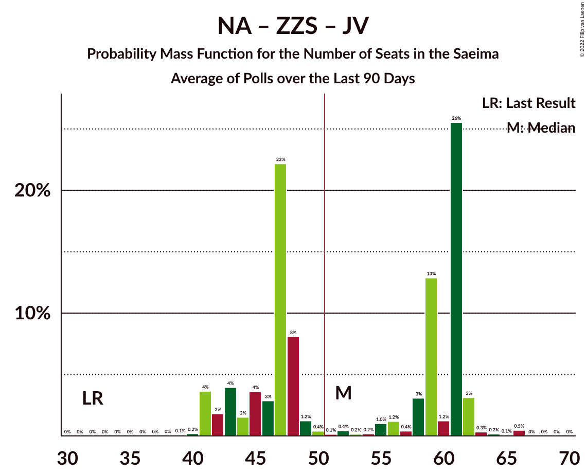
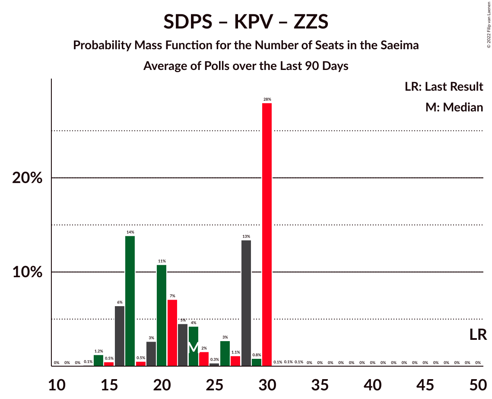

# Poll Average

<a href="#voting-intentions">Voting Intentions</a> | <a href="#seats">Seats</a> | <a href="#coalitions">Coalitions</a> | <a href="#technical-information">Technical Information</a>

## Summary

The table below lists the polls on which the average is based. They are the most recent polls (less than 90 days old) registered and analyzed so far.

| Period     | Polling firm/Commissioner(s) | SDPS | KPV | JKP | AP! | NA | ZZS | JV | LRA | LKS | P | NSL | VL | JS | LuK | LPV | R |
|:----------:|:----------------------------:|:--:|:--:|:--:|:--:|:--:|:--:|:--:|:--:|:--:|:--:|:--:|:--:|:--:|:--:|:--:|:--:|
| 6 October 2018 | General Election | 19.8%   23 | 14.2%   16 | 13.6%   16 | 12.0%   13 | 11.0%   13 | 9.9%   11 | 6.7%   8 | 4.1%   0 | 3.2%   0 | 2.6%   0 | 0.8%   0 | 0.0%   0 | 0.0%   0 | 0.0%   0 | 0.0%   0 | 0.0%   0 |
| N/A | Poll Average | 12–24%   16–27 | 0–1%   0 | 4–8%   0–9 | 8–17%   7–20 | 10–14%   11–16 | 7–15%   9–17 | 10–17%   11–21 | 3–6%   0–7 | 2–7%   0–8 | 5–8%   0–8 | N/A   N/A | N/A   N/A | N/A   N/A | 4–7%   0–10 | N/A   N/A | N/A   N/A |
| [1 September–1 October 2021](2021-10-01-FactumInteractive.html) | Factum Interactive | 12–16%   16–20 | 0–1%   0 | 6–9%   7–9 | 13–17%   15–20 | 10–14%   12–16 | 7–10%   9–12 | 14–18%   16–23 | 3–5%   0–6 | 2–4%   0 | 5–7%   0–9 | N/A   N/A | N/A   N/A | N/A   N/A | 5–8%   6–10 | N/A   N/A | N/A   N/A |
| [1–31 August 2021](2021-08-31-SKDS.html) | SKDS   Latvijas Televīzija | 20–25%   21–28 | 0–2%   0 | 4–7%   0–7 | 7–11%   7–12 | 11–15%   11–17 | 11–15%   11–18 | 10–14%   11–16 | 4–7%   0–7 | 5–7%   0–8 | 5–8%   5–8 | N/A   N/A | N/A   N/A | N/A   N/A | 4–7%   0–8 | N/A   N/A | N/A   N/A |
| 6 October 2018 | General Election | 19.8%   23 | 14.2%   16 | 13.6%   16 | 12.0%   13 | 11.0%   13 | 9.9%   11 | 6.7%   8 | 4.1%   0 | 3.2%   0 | 2.6%   0 | 0.8%   0 | 0.0%   0 | 0.0%   0 | 0.0%   0 | 0.0%   0 | 0.0%   0 |

Only polls for which at least the sample size has been published are included in the table above.

**Legend:**
+ **Top half of each row:** Voting intentions (95% confidence interval)
+ **Bottom half of each row:** Seat projections for the Saeima (95% confidence interval)
+ **SDPS:** Sociāldemokrātiskā partija “Saskaņa”
+ **KPV:** Politiskā partija „KPV LV”
+ **JKP:** Jaunā konservatīvā partija
+ **AP!:** Attīstībai/Par!
+ **NA:** Nacionālā apvienība „Visu Latvijai!”–„Tēvzemei un Brīvībai/LNNK”
+ **ZZS:** Zaļo un Zemnieku savienība
+ **JV:** Jaunā VIENOTĪBA
+ **LRA:** Latvijas Reģionu Apvienība
+ **LKS:** Latvijas Krievu savienība
+ **P:** PROGRESĪVIE
+ **NSL:** No sirds Latvijai
+ **VL:** Vienoti Latvijai
+ **JS:** Jaunā Saskaņa
+ **LuK:** Likums un kārtība
+ **LPV:** Latvija pirmajā vietā
+ **R:** Republika
+ **N/A (single party):** Party not included the published results
+ **N/A (entire row):** Calculation for this opinion poll not started yet

## Voting Intentions

### Confidence Intervals

| Party | Last Result | Median | 80% Confidence Interval | 90% Confidence Interval | 95% Confidence Interval | 99% Confidence Interval |
|:-----:|:-----------:|:------:|:-----------------------:|:-----------------------:|:-----------------------:|:-----------------------:|
| <a href="#sociāldemokrātiskā-partija-“saskaņa”">Sociāldemokrātiskā partija “Saskaņa”</a> | 19.8% | 17.5% | 12.6–23.2% |12.2–23.8% | 11.9–24.3% | 11.3–25.2% |
| <a href="#politiskā-partija-„kpv-lv”">Politiskā partija „KPV LV”</a> | 14.2% | 0.8% | 0.5–1.2% |0.4–1.3% | 0.4–1.4% | 0.3–1.7% |
| <a href="#jaunā-konservatīvā-partija">Jaunā konservatīvā partija</a> | 13.6% | 6.3% | 5.0–7.6% |4.7–8.0% | 4.5–8.3% | 4.0–8.8% |
| <a href="#attīstībai/par!">Attīstībai/Par!</a> | 12.0% | 11.9% | 8.2–15.7% |7.8–16.2% | 7.5–16.6% | 7.0–17.4% |
| <a href="#nacionālā-apvienība-„visu-latvijai!”–„tēvzemei-un-brīvībai/lnnk”">Nacionālā apvienība „Visu Latvijai!”–„Tēvzemei un Brīvībai/LNNK”</a> | 11.0% | 12.2% | 11.0–13.6% |10.6–14.0% | 10.3–14.4% | 9.8–15.1% |
| <a href="#zaļo-un-zemnieku-savienība">Zaļo un Zemnieku savienība</a> | 9.9% | 10.6% | 7.8–13.8% |7.5–14.3% | 7.2–14.7% | 6.7–15.5% |
| <a href="#jaunā-vienotība">Jaunā VIENOTĪBA</a> | 6.7% | 13.7% | 11.1–16.4% |10.6–16.9% | 10.3–17.3% | 9.7–18.1% |
| <a href="#latvijas-reģionu-apvienība">Latvijas Reģionu Apvienība</a> | 4.1% | 4.5% | 3.6–5.7% |3.4–6.0% | 3.2–6.3% | 2.9–6.8% |
| <a href="#latvijas-krievu-savienība">Latvijas Krievu savienība</a> | 3.2% | 4.3% | 2.6–6.5% |2.4–6.8% | 2.2–7.1% | 1.9–7.7% |
| <a href="#progresīvie">PROGRESĪVIE</a> | 2.6% | 6.0% | 5.1–7.1% |4.9–7.4% | 4.7–7.7% | 4.3–8.2% |
| <a href="#no-sirds-latvijai">No sirds Latvijai</a> | 0.8% | N/A | N/A |N/A | N/A | N/A |
| <a href="#vienoti-latvijai">Vienoti Latvijai</a> | 0.0% | N/A | N/A |N/A | N/A | N/A |
| <a href="#jaunā-saskaņa">Jaunā Saskaņa</a> | 0.0% | N/A | N/A |N/A | N/A | N/A |
| <a href="#likums-un-kārtība">Likums un kārtība</a> | 0.0% | 5.9% | 5.0–6.9% |4.7–7.2% | 4.5–7.4% | 4.1–7.9% |
| <a href="#latvija-pirmajā-vietā">Latvija pirmajā vietā</a> | 0.0% | N/A | N/A |N/A | N/A | N/A |
| <a href="#republika">Republika</a> | 0.0% | N/A | N/A |N/A | N/A | N/A |

### Sociāldemokrātiskā partija “Saskaņa”

*For a full overview of the results for this party, see the [Sociāldemokrātiskā partija “Saskaņa”](party-sociāldemokrātiskāpartija“saskaņa”.html) page.*

| Voting Intentions | Probability | Accumulated | Special Marks |
|:-----------------:|:-----------:|:-----------:|:-------------:|
| 9.5–10.5% | 0% | 100% |  |
| 10.5–11.5% | 1.1% | 100% |  |
| 11.5–12.5% | 8% | 98.9% |  |
| 12.5–13.5% | 18% | 91% |  |
| 13.5–14.5% | 16% | 73% |  |
| 14.5–15.5% | 6% | 57% |  |
| 15.5–16.5% | 1.0% | 51% |  |
| 16.5–17.5% | 0.1% | 50% |  |
| 17.5–18.5% | 0.1% | 50% | Median |
| 18.5–19.5% | 0.9% | 50% |  |
| 19.5–20.5% | 4% | 49% | Last Result |
| 20.5–21.5% | 11% | 45% |  |
| 21.5–22.5% | 15% | 33% |  |
| 22.5–23.5% | 11% | 18% |  |
| 23.5–24.5% | 5% | 7% |  |
| 24.5–25.5% | 1.3% | 2% |  |
| 25.5–26.5% | 0.2% | 0.2% |  |
| 26.5–27.5% | 0% | 0% |  |

### Politiskā partija „KPV LV”

*For a full overview of the results for this party, see the [Politiskā partija „KPV LV”](party-politiskāpartija„kpvlv”.html) page.*

| Voting Intentions | Probability | Accumulated | Special Marks |
|:-----------------:|:-----------:|:-----------:|:-------------:|
| 0.0–0.5% | 16% | 100% |  |
| 0.5–1.5% | 83% | 84% | Median |
| 1.5–2.5% | 1.3% | 1.3% |  |
| 2.5–3.5% | 0% | 0% |  |
| 3.5–4.5% | 0% | 0% |  |
| 4.5–5.5% | 0% | 0% |  |
| 5.5–6.5% | 0% | 0% |  |
| 6.5–7.5% | 0% | 0% |  |
| 7.5–8.5% | 0% | 0% |  |
| 8.5–9.5% | 0% | 0% |  |
| 9.5–10.5% | 0% | 0% |  |
| 10.5–11.5% | 0% | 0% |  |
| 11.5–12.5% | 0% | 0% |  |
| 12.5–13.5% | 0% | 0% |  |
| 13.5–14.5% | 0% | 0% | Last Result |

### Jaunā konservatīvā partija

*For a full overview of the results for this party, see the [Jaunā konservatīvā partija](party-jaunākonservatīvāpartija.html) page.*

| Voting Intentions | Probability | Accumulated | Special Marks |
|:-----------------:|:-----------:|:-----------:|:-------------:|
| 2.5–3.5% | 0% | 100% |  |
| 3.5–4.5% | 3% | 100% |  |
| 4.5–5.5% | 23% | 97% |  |
| 5.5–6.5% | 34% | 74% | Median |
| 6.5–7.5% | 29% | 40% |  |
| 7.5–8.5% | 10% | 12% |  |
| 8.5–9.5% | 1.1% | 1.2% |  |
| 9.5–10.5% | 0% | 0% |  |
| 10.5–11.5% | 0% | 0% |  |
| 11.5–12.5% | 0% | 0% |  |
| 12.5–13.5% | 0% | 0% |  |
| 13.5–14.5% | 0% | 0% | Last Result |

### Attīstībai/Par!

*For a full overview of the results for this party, see the [Attīstībai/Par!](party-attīstībaipar.html) page.*

| Voting Intentions | Probability | Accumulated | Special Marks |
|:-----------------:|:-----------:|:-----------:|:-------------:|
| 4.5–5.5% | 0% | 100% |  |
| 5.5–6.5% | 0.1% | 100% |  |
| 6.5–7.5% | 2% | 99.9% |  |
| 7.5–8.5% | 14% | 97% |  |
| 8.5–9.5% | 21% | 83% |  |
| 9.5–10.5% | 10% | 62% |  |
| 10.5–11.5% | 2% | 52% |  |
| 11.5–12.5% | 0.7% | 50% | Last Result, Median |
| 12.5–13.5% | 5% | 49% |  |
| 13.5–14.5% | 15% | 45% |  |
| 14.5–15.5% | 18% | 30% |  |
| 15.5–16.5% | 10% | 12% |  |
| 16.5–17.5% | 2% | 3% |  |
| 17.5–18.5% | 0.3% | 0.3% |  |
| 18.5–19.5% | 0% | 0% |  |

### Nacionālā apvienība „Visu Latvijai!”–„Tēvzemei un Brīvībai/LNNK”

*For a full overview of the results for this party, see the [Nacionālā apvienība „Visu Latvijai!”–„Tēvzemei un Brīvībai/LNNK”](party-nacionālāapvienība„visulatvijai”–„tēvzemeiunbrīvībailnnk”.html) page.*

| Voting Intentions | Probability | Accumulated | Special Marks |
|:-----------------:|:-----------:|:-----------:|:-------------:|
| 7.5–8.5% | 0% | 100% |  |
| 8.5–9.5% | 0.2% | 100% |  |
| 9.5–10.5% | 4% | 99.8% |  |
| 10.5–11.5% | 21% | 96% | Last Result |
| 11.5–12.5% | 36% | 75% | Median |
| 12.5–13.5% | 27% | 39% |  |
| 13.5–14.5% | 9% | 11% |  |
| 14.5–15.5% | 2% | 2% |  |
| 15.5–16.5% | 0.2% | 0.2% |  |
| 16.5–17.5% | 0% | 0% |  |

### Zaļo un Zemnieku savienība

*For a full overview of the results for this party, see the [Zaļo un Zemnieku savienība](party-zaļounzemniekusavienība.html) page.*

| Voting Intentions | Probability | Accumulated | Special Marks |
|:-----------------:|:-----------:|:-----------:|:-------------:|
| 4.5–5.5% | 0% | 100% |  |
| 5.5–6.5% | 0.2% | 100% |  |
| 6.5–7.5% | 5% | 99.8% |  |
| 7.5–8.5% | 21% | 95% |  |
| 8.5–9.5% | 19% | 74% |  |
| 9.5–10.5% | 5% | 55% | Last Result |
| 10.5–11.5% | 4% | 50% | Median |
| 11.5–12.5% | 13% | 46% |  |
| 12.5–13.5% | 18% | 33% |  |
| 13.5–14.5% | 11% | 14% |  |
| 14.5–15.5% | 3% | 3% |  |
| 15.5–16.5% | 0.4% | 0.5% |  |
| 16.5–17.5% | 0% | 0% |  |

### Jaunā VIENOTĪBA

*For a full overview of the results for this party, see the [Jaunā VIENOTĪBA](party-jaunāvienotība.html) page.*

| Voting Intentions | Probability | Accumulated | Special Marks |
|:-----------------:|:-----------:|:-----------:|:-------------:|
| 6.5–7.5% | 0% | 100% | Last Result |
| 7.5–8.5% | 0% | 100% |  |
| 8.5–9.5% | 0.3% | 100% |  |
| 9.5–10.5% | 4% | 99.7% |  |
| 10.5–11.5% | 14% | 96% |  |
| 11.5–12.5% | 19% | 82% |  |
| 12.5–13.5% | 12% | 63% |  |
| 13.5–14.5% | 10% | 51% | Median |
| 14.5–15.5% | 17% | 41% |  |
| 15.5–16.5% | 16% | 24% |  |
| 16.5–17.5% | 7% | 8% |  |
| 17.5–18.5% | 1.4% | 2% |  |
| 18.5–19.5% | 0.1% | 0.2% |  |
| 19.5–20.5% | 0% | 0% |  |

### Latvijas Reģionu Apvienība

*For a full overview of the results for this party, see the [Latvijas Reģionu Apvienība](party-latvijasreģionuapvienība.html) page.*

| Voting Intentions | Probability | Accumulated | Special Marks |
|:-----------------:|:-----------:|:-----------:|:-------------:|
| 1.5–2.5% | 0.1% | 100% |  |
| 2.5–3.5% | 9% | 99.9% |  |
| 3.5–4.5% | 42% | 91% | Last Result |
| 4.5–5.5% | 37% | 49% | Median |
| 5.5–6.5% | 12% | 13% |  |
| 6.5–7.5% | 1.1% | 1.1% |  |
| 7.5–8.5% | 0% | 0% |  |

### Latvijas Krievu savienība

*For a full overview of the results for this party, see the [Latvijas Krievu savienība](party-latvijaskrievusavienība.html) page.*

| Voting Intentions | Probability | Accumulated | Special Marks |
|:-----------------:|:-----------:|:-----------:|:-------------:|
| 0.5–1.5% | 0% | 100% |  |
| 1.5–2.5% | 9% | 100% |  |
| 2.5–3.5% | 34% | 91% | Last Result |
| 3.5–4.5% | 8% | 56% | Median |
| 4.5–5.5% | 16% | 49% |  |
| 5.5–6.5% | 24% | 33% |  |
| 6.5–7.5% | 8% | 9% |  |
| 7.5–8.5% | 0.7% | 0.8% |  |
| 8.5–9.5% | 0% | 0% |  |

### PROGRESĪVIE

*For a full overview of the results for this party, see the [PROGRESĪVIE](party-progresīvie.html) page.*

| Voting Intentions | Probability | Accumulated | Special Marks |
|:-----------------:|:-----------:|:-----------:|:-------------:|
| 2.5–3.5% | 0% | 100% | Last Result |
| 3.5–4.5% | 2% | 100% |  |
| 4.5–5.5% | 24% | 98% |  |
| 5.5–6.5% | 49% | 74% | Median |
| 6.5–7.5% | 22% | 26% |  |
| 7.5–8.5% | 3% | 4% |  |
| 8.5–9.5% | 0.2% | 0.2% |  |
| 9.5–10.5% | 0% | 0% |  |

### Likums un kārtība

*For a full overview of the results for this party, see the [Likums un kārtība](party-likumsunkārtība.html) page.*

| Voting Intentions | Probability | Accumulated | Special Marks |
|:-----------------:|:-----------:|:-----------:|:-------------:|
| 0.0–0.5% | 0% | 100% | Last Result |
| 0.5–1.5% | 0% | 100% |  |
| 1.5–2.5% | 0% | 100% |  |
| 2.5–3.5% | 0% | 100% |  |
| 3.5–4.5% | 3% | 100% |  |
| 4.5–5.5% | 29% | 97% |  |
| 5.5–6.5% | 49% | 68% | Median |
| 6.5–7.5% | 17% | 19% |  |
| 7.5–8.5% | 2% | 2% |  |
| 8.5–9.5% | 0.1% | 0.1% |  |
| 9.5–10.5% | 0% | 0% |  |

## Seats

### Confidence Intervals

| Party | Last Result | Median | 80% Confidence Interval | 90% Confidence Interval | 95% Confidence Interval | 99% Confidence Interval |
|:-----:|:-----------:|:------:|:-----------------------:|:-----------------------:|:-----------------------:|:-----------------------:|
| <a href="#sociāldemokrātiskā-partija-“saskaņa”">Sociāldemokrātiskā partija “Saskaņa”</a> | 23 | 20 | 17–27 |16–27 | 16–27 | 15–29 |
| <a href="#politiskā-partija-„kpv-lv”">Politiskā partija „KPV LV”</a> | 16 | 0 | 0 |0 | 0 | 0 |
| <a href="#jaunā-konservatīvā-partija">Jaunā konservatīvā partija</a> | 16 | 7 | 0–9 |0–9 | 0–9 | 0–11 |
| <a href="#attīstībai/par!">Attīstībai/Par!</a> | 13 | 14 | 7–18 |7–20 | 7–20 | 7–21 |
| <a href="#nacionālā-apvienība-„visu-latvijai!”–„tēvzemei-un-brīvībai/lnnk”">Nacionālā apvienība „Visu Latvijai!”–„Tēvzemei un Brīvībai/LNNK”</a> | 13 | 14 | 13–16 |11–16 | 11–16 | 11–17 |
| <a href="#zaļo-un-zemnieku-savienība">Zaļo un Zemnieku savienība</a> | 11 | 12 | 10–16 |10–16 | 9–17 | 8–18 |
| <a href="#jaunā-vienotība">Jaunā VIENOTĪBA</a> | 8 | 16 | 11–20 |11–20 | 11–21 | 11–23 |
| <a href="#latvijas-reģionu-apvienība">Latvijas Reģionu Apvienība</a> | 0 | 0 | 0–6 |0–6 | 0–7 | 0–7 |
| <a href="#latvijas-krievu-savienība">Latvijas Krievu savienība</a> | 0 | 0 | 0–8 |0–8 | 0–8 | 0–9 |
| <a href="#progresīvie">PROGRESĪVIE</a> | 0 | 7 | 0–7 |0–8 | 0–8 | 0–9 |
| <a href="#no-sirds-latvijai">No sirds Latvijai</a> | 0 | N/A | N/A |N/A | N/A | N/A |
| <a href="#vienoti-latvijai">Vienoti Latvijai</a> | 0 | N/A | N/A |N/A | N/A | N/A |
| <a href="#jaunā-saskaņa">Jaunā Saskaņa</a> | 0 | N/A | N/A |N/A | N/A | N/A |
| <a href="#likums-un-kārtība">Likums un kārtība</a> | 0 | 7 | 5–8 |0–9 | 0–10 | 0–10 |
| <a href="#latvija-pirmajā-vietā">Latvija pirmajā vietā</a> | 0 | N/A | N/A |N/A | N/A | N/A |
| <a href="#republika">Republika</a> | 0 | N/A | N/A |N/A | N/A | N/A |

### Sociāldemokrātiskā partija “Saskaņa”

*For a full overview of the results for this party, see the [Sociāldemokrātiskā partija “Saskaņa”](party-sociāldemokrātiskāpartija“saskaņa”.html) page.*

| Number of Seats | Probability | Accumulated | Special Marks |
|:---------------:|:-----------:|:-----------:|:-------------:|
| 15 | 0.9% | 100% |  |
| 16 | 7% | 99.1% |  |
| 17 | 18% | 92% |  |
| 18 | 18% | 74% |  |
| 19 | 2% | 56% |  |
| 20 | 4% | 54% | Median |
| 21 | 2% | 50% |  |
| 22 | 5% | 48% |  |
| 23 | 15% | 43% | Last Result |
| 24 | 3% | 28% |  |
| 25 | 4% | 25% |  |
| 26 | 7% | 21% |  |
| 27 | 13% | 14% |  |
| 28 | 0.9% | 2% |  |
| 29 | 0.4% | 0.8% |  |
| 30 | 0.3% | 0.3% |  |
| 31 | 0% | 0% |  |

### Politiskā partija „KPV LV”

*For a full overview of the results for this party, see the [Politiskā partija „KPV LV”](party-politiskāpartija„kpvlv”.html) page.*

| Number of Seats | Probability | Accumulated | Special Marks |
|:---------------:|:-----------:|:-----------:|:-------------:|
| 0 | 100% | 100% | Median |
| 1 | 0% | 0% |  |
| 2 | 0% | 0% |  |
| 3 | 0% | 0% |  |
| 4 | 0% | 0% |  |
| 5 | 0% | 0% |  |
| 6 | 0% | 0% |  |
| 7 | 0% | 0% |  |
| 8 | 0% | 0% |  |
| 9 | 0% | 0% |  |
| 10 | 0% | 0% |  |
| 11 | 0% | 0% |  |
| 12 | 0% | 0% |  |
| 13 | 0% | 0% |  |
| 14 | 0% | 0% |  |
| 15 | 0% | 0% |  |
| 16 | 0% | 0% | Last Result |

### Jaunā konservatīvā partija

*For a full overview of the results for this party, see the [Jaunā konservatīvā partija](party-jaunākonservatīvāpartija.html) page.*

| Number of Seats | Probability | Accumulated | Special Marks |
|:---------------:|:-----------:|:-----------:|:-------------:|
| 0 | 17% | 100% |  |
| 1 | 0% | 83% |  |
| 2 | 0% | 83% |  |
| 3 | 0% | 83% |  |
| 4 | 0% | 83% |  |
| 5 | 0% | 83% |  |
| 6 | 9% | 83% |  |
| 7 | 44% | 74% | Median |
| 8 | 7% | 30% |  |
| 9 | 22% | 23% |  |
| 10 | 0.3% | 0.9% |  |
| 11 | 0.5% | 0.6% |  |
| 12 | 0.1% | 0.1% |  |
| 13 | 0% | 0% |  |
| 14 | 0% | 0% |  |
| 15 | 0% | 0% |  |
| 16 | 0% | 0% | Last Result |

### Attīstībai/Par!

*For a full overview of the results for this party, see the [Attīstībai/Par!](party-attīstībaipar.html) page.*

| Number of Seats | Probability | Accumulated | Special Marks |
|:---------------:|:-----------:|:-----------:|:-------------:|
| 7 | 11% | 100% |  |
| 8 | 11% | 89% |  |
| 9 | 11% | 77% |  |
| 10 | 13% | 66% |  |
| 11 | 2% | 53% |  |
| 12 | 0.7% | 52% |  |
| 13 | 0.3% | 51% | Last Result |
| 14 | 1.1% | 51% | Median |
| 15 | 5% | 50% |  |
| 16 | 11% | 45% |  |
| 17 | 20% | 33% |  |
| 18 | 7% | 13% |  |
| 19 | 0.8% | 6% |  |
| 20 | 5% | 5% |  |
| 21 | 0.5% | 0.5% |  |
| 22 | 0% | 0.1% |  |
| 23 | 0% | 0% |  |

### Nacionālā apvienība „Visu Latvijai!”–„Tēvzemei un Brīvībai/LNNK”

*For a full overview of the results for this party, see the [Nacionālā apvienība „Visu Latvijai!”–„Tēvzemei un Brīvībai/LNNK”](party-nacionālāapvienība„visulatvijai”–„tēvzemeiunbrīvībailnnk”.html) page.*

| Number of Seats | Probability | Accumulated | Special Marks |
|:---------------:|:-----------:|:-----------:|:-------------:|
| 10 | 0.1% | 100% |  |
| 11 | 6% | 99.9% |  |
| 12 | 4% | 94% |  |
| 13 | 22% | 90% | Last Result |
| 14 | 50% | 68% | Median |
| 15 | 8% | 19% |  |
| 16 | 8% | 10% |  |
| 17 | 2% | 2% |  |
| 18 | 0.1% | 0.2% |  |
| 19 | 0.1% | 0.1% |  |
| 20 | 0% | 0% |  |

### Zaļo un Zemnieku savienība

*For a full overview of the results for this party, see the [Zaļo un Zemnieku savienība](party-zaļounzemniekusavienība.html) page.*

| Number of Seats | Probability | Accumulated | Special Marks |
|:---------------:|:-----------:|:-----------:|:-------------:|
| 7 | 0.3% | 100% |  |
| 8 | 0.8% | 99.7% |  |
| 9 | 4% | 98.9% |  |
| 10 | 8% | 95% |  |
| 11 | 32% | 88% | Last Result |
| 12 | 10% | 56% | Median |
| 13 | 14% | 46% |  |
| 14 | 4% | 32% |  |
| 15 | 17% | 28% |  |
| 16 | 7% | 11% |  |
| 17 | 3% | 4% |  |
| 18 | 1.4% | 2% |  |
| 19 | 0.2% | 0.2% |  |
| 20 | 0% | 0% |  |

### Jaunā VIENOTĪBA

*For a full overview of the results for this party, see the [Jaunā VIENOTĪBA](party-jaunāvienotība.html) page.*

| Number of Seats | Probability | Accumulated | Special Marks |
|:---------------:|:-----------:|:-----------:|:-------------:|
| 8 | 0% | 100% | Last Result |
| 9 | 0% | 100% |  |
| 10 | 0.4% | 100% |  |
| 11 | 14% | 99.6% |  |
| 12 | 2% | 85% |  |
| 13 | 15% | 83% |  |
| 14 | 3% | 68% |  |
| 15 | 12% | 65% |  |
| 16 | 3% | 53% | Median |
| 17 | 6% | 50% |  |
| 18 | 14% | 44% |  |
| 19 | 15% | 29% |  |
| 20 | 11% | 14% |  |
| 21 | 1.3% | 3% |  |
| 22 | 0.5% | 2% |  |
| 23 | 1.3% | 1.4% |  |
| 24 | 0.1% | 0.1% |  |
| 25 | 0% | 0% |  |

### Latvijas Reģionu Apvienība

*For a full overview of the results for this party, see the [Latvijas Reģionu Apvienība](party-latvijasreģionuapvienība.html) page.*

| Number of Seats | Probability | Accumulated | Special Marks |
|:---------------:|:-----------:|:-----------:|:-------------:|
| 0 | 62% | 100% | Last Result, Median |
| 1 | 0% | 38% |  |
| 2 | 0% | 38% |  |
| 3 | 0% | 38% |  |
| 4 | 0% | 38% |  |
| 5 | 0% | 38% |  |
| 6 | 34% | 38% |  |
| 7 | 4% | 4% |  |
| 8 | 0.1% | 0.1% |  |
| 9 | 0% | 0% |  |

### Latvijas Krievu savienība

*For a full overview of the results for this party, see the [Latvijas Krievu savienība](party-latvijaskrievusavienība.html) page.*

| Number of Seats | Probability | Accumulated | Special Marks |
|:---------------:|:-----------:|:-----------:|:-------------:|
| 0 | 63% | 100% | Last Result, Median |
| 1 | 0% | 37% |  |
| 2 | 0% | 37% |  |
| 3 | 0% | 37% |  |
| 4 | 0% | 37% |  |
| 5 | 7% | 37% |  |
| 6 | 5% | 30% |  |
| 7 | 7% | 25% |  |
| 8 | 17% | 18% |  |
| 9 | 0.4% | 0.5% |  |
| 10 | 0.1% | 0.1% |  |
| 11 | 0% | 0% |  |

### PROGRESĪVIE

*For a full overview of the results for this party, see the [PROGRESĪVIE](party-progresīvie.html) page.*

| Number of Seats | Probability | Accumulated | Special Marks |
|:---------------:|:-----------:|:-----------:|:-------------:|
| 0 | 11% | 100% | Last Result |
| 1 | 0% | 89% |  |
| 2 | 0% | 89% |  |
| 3 | 0% | 89% |  |
| 4 | 0% | 89% |  |
| 5 | 8% | 89% |  |
| 6 | 3% | 82% |  |
| 7 | 69% | 79% | Median |
| 8 | 7% | 9% |  |
| 9 | 2% | 2% |  |
| 10 | 0% | 0.1% |  |
| 11 | 0% | 0% |  |

### No sirds Latvijai

*For a full overview of the results for this party, see the [No sirds Latvijai](party-nosirdslatvijai.html) page.*

### Vienoti Latvijai

*For a full overview of the results for this party, see the [Vienoti Latvijai](party-vienotilatvijai.html) page.*

### Jaunā Saskaņa

*For a full overview of the results for this party, see the [Jaunā Saskaņa](party-jaunāsaskaņa.html) page.*

### Likums un kārtība

*For a full overview of the results for this party, see the [Likums un kārtība](party-likumsunkārtība.html) page.*

| Number of Seats | Probability | Accumulated | Special Marks |
|:---------------:|:-----------:|:-----------:|:-------------:|
| 0 | 9% | 100% | Last Result |
| 1 | 0% | 91% |  |
| 2 | 0% | 91% |  |
| 3 | 0% | 91% |  |
| 4 | 0.1% | 91% |  |
| 5 | 5% | 91% |  |
| 6 | 33% | 86% |  |
| 7 | 35% | 53% | Median |
| 8 | 11% | 19% |  |
| 9 | 3% | 7% |  |
| 10 | 4% | 4% |  |
| 11 | 0.1% | 0.1% |  |
| 12 | 0% | 0% |  |

### Latvija pirmajā vietā

*For a full overview of the results for this party, see the [Latvija pirmajā vietā](party-latvijapirmajāvietā.html) page.*

### Republika

*For a full overview of the results for this party, see the [Republika](party-republika.html) page.*

## Coalitions

### Confidence Intervals

| Coalition | Last Result | Median | Majority? | 80% Confidence Interval | 90% Confidence Interval | 95% Confidence Interval | 99% Confidence Interval |
|:---------:|:-----------:|:------:|:---------:|:-----------------------:|:-----------------------:|:-----------------------:|:-----------------------:|
| Jaunā konservatīvā partija – Attīstībai/Par! – Nacionālā apvienība „Visu Latvijai!”–„Tēvzemei un Brīvībai/LNNK” – Zaļo un Zemnieku savienība – Jaunā VIENOTĪBA | 61 | 63 | 96% | 52–70 | 51–74 | 49–74 | 47–75 |
| Attīstībai/Par! – Nacionālā apvienība „Visu Latvijai!”–„Tēvzemei un Brīvībai/LNNK” – Zaļo un Zemnieku savienība – Jaunā VIENOTĪBA | 45 | 56 | 74% | 46–62 | 46–65 | 45–65 | 43–67 |
| Jaunā konservatīvā partija – Attīstībai/Par! – Nacionālā apvienība „Visu Latvijai!”–„Tēvzemei un Brīvībai/LNNK” – Jaunā VIENOTĪBA | 50 | 51 | 50% | 38–60 | 37–63 | 36–63 | 34–64 |
| Politiskā partija „KPV LV” – Jaunā konservatīvā partija – Attīstībai/Par! – Nacionālā apvienība „Visu Latvijai!”–„Tēvzemei un Brīvībai/LNNK” – Jaunā VIENOTĪBA | 66 | 51 | 50% | 38–60 | 37–63 | 36–63 | 34–64 |
| Jaunā konservatīvā partija – Nacionālā apvienība „Visu Latvijai!”–„Tēvzemei un Brīvībai/LNNK” – Zaļo un Zemnieku savienība – Jaunā VIENOTĪBA | 48 | 49 | 41% | 44–53 | 42–54 | 41–56 | 39–58 |
| Jaunā konservatīvā partija – Attīstībai/Par! – Nacionālā apvienība „Visu Latvijai!”–„Tēvzemei un Brīvībai/LNNK” – Zaļo un Zemnieku savienība | 53 | 47 | 13% | 39–51 | 37–52 | 36–56 | 35–56 |
| Politiskā partija „KPV LV” – Attīstībai/Par! – Nacionālā apvienība „Visu Latvijai!”–„Tēvzemei un Brīvībai/LNNK” – Jaunā VIENOTĪBA | 50 | 45 | 22% | 33–51 | 31–54 | 31–54 | 30–56 |
| Nacionālā apvienība „Visu Latvijai!”–„Tēvzemei un Brīvībai/LNNK” – Zaļo un Zemnieku savienība – Jaunā VIENOTĪBA | 32 | 43 | 0.3% | 39–45 | 38–46 | 37–48 | 35–49 |
| Attīstībai/Par! – Nacionālā apvienība „Visu Latvijai!”–„Tēvzemei un Brīvībai/LNNK” – Zaļo un Zemnieku savienība | 37 | 39 | 0% | 34–43 | 33–45 | 33–47 | 32–47 |
| Sociāldemokrātiskā partija “Saskaņa” – Jaunā konservatīvā partija – Attīstībai/Par! | 52 | 41 | 0% | 37–44 | 35–46 | 32–47 | 30–48 |
| Politiskā partija „KPV LV” – Jaunā konservatīvā partija – Attīstībai/Par! – Jaunā VIENOTĪBA | 53 | 37 | 0.2% | 25–46 | 24–47 | 21–47 | 19–49 |
| Politiskā partija „KPV LV” – Jaunā konservatīvā partija – Nacionālā apvienība „Visu Latvijai!”–„Tēvzemei un Brīvībai/LNNK” – Jaunā VIENOTĪBA | 53 | 37 | 0% | 29–43 | 29–43 | 28–45 | 25–47 |
| Politiskā partija „KPV LV” – Jaunā konservatīvā partija – Attīstībai/Par! – Nacionālā apvienība „Visu Latvijai!”–„Tēvzemei un Brīvībai/LNNK” | 58 | 34 | 0% | 24–40 | 23–42 | 23–45 | 22–45 |
| Sociāldemokrātiskā partija “Saskaņa” – Politiskā partija „KPV LV” – Zaļo un Zemnieku savienība | 50 | 32 | 0% | 27–42 | 26–42 | 26–43 | 25–45 |
| Sociāldemokrātiskā partija “Saskaņa” – Attīstībai/Par! | 36 | 34 | 0% | 31–37 | 30–38 | 30–39 | 28–40 |
| Jaunā konservatīvā partija – Nacionālā apvienība „Visu Latvijai!”–„Tēvzemei un Brīvībai/LNNK” – Zaļo un Zemnieku savienība | 40 | 33 | 0% | 29–36 | 28–36 | 27–38 | 27–40 |
| Sociāldemokrātiskā partija “Saskaņa” – Politiskā partija „KPV LV” | 39 | 20 | 0% | 17–27 | 16–27 | 16–27 | 15–29 |

### Jaunā konservatīvā partija – Attīstībai/Par! – Nacionālā apvienība „Visu Latvijai!”–„Tēvzemei un Brīvībai/LNNK” – Zaļo un Zemnieku savienība – Jaunā VIENOTĪBA

| Number of Seats | Probability | Accumulated | Special Marks |
|:---------------:|:-----------:|:-----------:|:-------------:|
| 46 | 0% | 100% |  |
| 47 | 1.1% | 99.9% |  |
| 48 | 0.2% | 98.8% |  |
| 49 | 1.2% | 98.6% |  |
| 50 | 1.5% | 97% |  |
| 51 | 3% | 96% | Majority |
| 52 | 4% | 93% |  |
| 53 | 8% | 89% |  |
| 54 | 12% | 81% |  |
| 55 | 4% | 69% |  |
| 56 | 3% | 64% |  |
| 57 | 1.5% | 61% |  |
| 58 | 5% | 60% |  |
| 59 | 0.9% | 54% |  |
| 60 | 1.3% | 53% |  |
| 61 | 1.0% | 52% | Last Result |
| 62 | 0.5% | 51% |  |
| 63 | 1.2% | 51% | Median |
| 64 | 3% | 50% |  |
| 65 | 0.6% | 47% |  |
| 66 | 2% | 46% |  |
| 67 | 6% | 44% |  |
| 68 | 12% | 38% |  |
| 69 | 11% | 25% |  |
| 70 | 8% | 15% |  |
| 71 | 0.2% | 7% |  |
| 72 | 0.5% | 6% |  |
| 73 | 0.7% | 6% |  |
| 74 | 4% | 5% |  |
| 75 | 0.6% | 1.0% |  |
| 76 | 0.4% | 0.5% |  |
| 77 | 0% | 0.1% |  |
| 78 | 0.1% | 0.1% |  |
| 79 | 0% | 0% |  |

### Attīstībai/Par! – Nacionālā apvienība „Visu Latvijai!”–„Tēvzemei un Brīvībai/LNNK” – Zaļo un Zemnieku savienība – Jaunā VIENOTĪBA

| Number of Seats | Probability | Accumulated | Special Marks |
|:---------------:|:-----------:|:-----------:|:-------------:|
| 42 | 0.1% | 100% |  |
| 43 | 1.0% | 99.9% |  |
| 44 | 1.1% | 98.9% |  |
| 45 | 2% | 98% | Last Result |
| 46 | 8% | 96% |  |
| 47 | 4% | 88% |  |
| 48 | 2% | 84% |  |
| 49 | 4% | 82% |  |
| 50 | 3% | 77% |  |
| 51 | 7% | 74% | Majority |
| 52 | 3% | 67% |  |
| 53 | 1.4% | 64% |  |
| 54 | 10% | 63% |  |
| 55 | 2% | 52% |  |
| 56 | 3% | 51% | Median |
| 57 | 2% | 48% |  |
| 58 | 2% | 46% |  |
| 59 | 9% | 44% |  |
| 60 | 6% | 34% |  |
| 61 | 9% | 28% |  |
| 62 | 10% | 18% |  |
| 63 | 3% | 9% |  |
| 64 | 0.7% | 6% |  |
| 65 | 4% | 5% |  |
| 66 | 0.4% | 1.2% |  |
| 67 | 0.3% | 0.7% |  |
| 68 | 0.3% | 0.4% |  |
| 69 | 0.1% | 0.2% |  |
| 70 | 0% | 0% |  |

### Jaunā konservatīvā partija – Attīstībai/Par! – Nacionālā apvienība „Visu Latvijai!”–„Tēvzemei un Brīvībai/LNNK” – Jaunā VIENOTĪBA

| Number of Seats | Probability | Accumulated | Special Marks |
|:---------------:|:-----------:|:-----------:|:-------------:|
| 31 | 0.1% | 100% |  |
| 32 | 0.1% | 99.9% |  |
| 33 | 0.2% | 99.9% |  |
| 34 | 0.3% | 99.7% |  |
| 35 | 1.1% | 99.4% |  |
| 36 | 2% | 98% |  |
| 37 | 2% | 96% |  |
| 38 | 8% | 94% |  |
| 39 | 11% | 86% |  |
| 40 | 8% | 75% |  |
| 41 | 4% | 67% |  |
| 42 | 6% | 64% |  |
| 43 | 3% | 58% |  |
| 44 | 2% | 55% |  |
| 45 | 2% | 53% |  |
| 46 | 0.4% | 51% |  |
| 47 | 0.3% | 51% |  |
| 48 | 0.4% | 51% |  |
| 49 | 0.2% | 50% |  |
| 50 | 0% | 50% | Last Result |
| 51 | 0.1% | 50% | Median, Majority |
| 52 | 0.1% | 50% |  |
| 53 | 0.5% | 50% |  |
| 54 | 2% | 49% |  |
| 55 | 4% | 47% |  |
| 56 | 5% | 43% |  |
| 57 | 11% | 39% |  |
| 58 | 13% | 27% |  |
| 59 | 4% | 15% |  |
| 60 | 4% | 10% |  |
| 61 | 0.7% | 7% |  |
| 62 | 0.7% | 6% |  |
| 63 | 4% | 5% |  |
| 64 | 0.4% | 0.8% |  |
| 65 | 0.2% | 0.4% |  |
| 66 | 0.1% | 0.2% |  |
| 67 | 0.1% | 0.1% |  |
| 68 | 0% | 0% |  |

### Politiskā partija „KPV LV” – Jaunā konservatīvā partija – Attīstībai/Par! – Nacionālā apvienība „Visu Latvijai!”–„Tēvzemei un Brīvībai/LNNK” – Jaunā VIENOTĪBA

| Number of Seats | Probability | Accumulated | Special Marks |
|:---------------:|:-----------:|:-----------:|:-------------:|
| 31 | 0.1% | 100% |  |
| 32 | 0.1% | 99.9% |  |
| 33 | 0.2% | 99.9% |  |
| 34 | 0.3% | 99.7% |  |
| 35 | 1.1% | 99.4% |  |
| 36 | 2% | 98% |  |
| 37 | 2% | 96% |  |
| 38 | 8% | 94% |  |
| 39 | 11% | 86% |  |
| 40 | 8% | 75% |  |
| 41 | 4% | 67% |  |
| 42 | 6% | 64% |  |
| 43 | 3% | 58% |  |
| 44 | 2% | 55% |  |
| 45 | 2% | 53% |  |
| 46 | 0.4% | 51% |  |
| 47 | 0.3% | 51% |  |
| 48 | 0.4% | 51% |  |
| 49 | 0.2% | 50% |  |
| 50 | 0% | 50% |  |
| 51 | 0.1% | 50% | Median, Majority |
| 52 | 0.1% | 50% |  |
| 53 | 0.5% | 50% |  |
| 54 | 2% | 49% |  |
| 55 | 4% | 47% |  |
| 56 | 5% | 43% |  |
| 57 | 11% | 39% |  |
| 58 | 13% | 27% |  |
| 59 | 4% | 15% |  |
| 60 | 4% | 10% |  |
| 61 | 0.7% | 7% |  |
| 62 | 0.7% | 6% |  |
| 63 | 4% | 5% |  |
| 64 | 0.4% | 0.8% |  |
| 65 | 0.2% | 0.4% |  |
| 66 | 0.1% | 0.2% | Last Result |
| 67 | 0.1% | 0.1% |  |
| 68 | 0% | 0% |  |

### Jaunā konservatīvā partija – Nacionālā apvienība „Visu Latvijai!”–„Tēvzemei un Brīvībai/LNNK” – Zaļo un Zemnieku savienība – Jaunā VIENOTĪBA

| Number of Seats | Probability | Accumulated | Special Marks |
|:---------------:|:-----------:|:-----------:|:-------------:|
| 36 | 0% | 100% |  |
| 37 | 0.1% | 99.9% |  |
| 38 | 0.1% | 99.9% |  |
| 39 | 1.2% | 99.7% |  |
| 40 | 0.3% | 98.6% |  |
| 41 | 1.2% | 98% |  |
| 42 | 3% | 97% |  |
| 43 | 1.4% | 94% |  |
| 44 | 12% | 93% |  |
| 45 | 7% | 81% |  |
| 46 | 10% | 74% |  |
| 47 | 4% | 64% |  |
| 48 | 3% | 60% | Last Result |
| 49 | 7% | 57% | Median |
| 50 | 9% | 50% |  |
| 51 | 12% | 41% | Majority |
| 52 | 13% | 28% |  |
| 53 | 7% | 15% |  |
| 54 | 5% | 9% |  |
| 55 | 1.5% | 4% |  |
| 56 | 0.6% | 3% |  |
| 57 | 1.4% | 2% |  |
| 58 | 0.4% | 0.7% |  |
| 59 | 0.2% | 0.3% |  |
| 60 | 0.1% | 0.1% |  |
| 61 | 0% | 0% |  |

### Jaunā konservatīvā partija – Attīstībai/Par! – Nacionālā apvienība „Visu Latvijai!”–„Tēvzemei un Brīvībai/LNNK” – Zaļo un Zemnieku savienība

| Number of Seats | Probability | Accumulated | Special Marks |
|:---------------:|:-----------:|:-----------:|:-------------:|
| 34 | 0% | 100% |  |
| 35 | 2% | 99.9% |  |
| 36 | 2% | 98% |  |
| 37 | 1.4% | 96% |  |
| 38 | 2% | 95% |  |
| 39 | 10% | 93% |  |
| 40 | 8% | 83% |  |
| 41 | 3% | 75% |  |
| 42 | 4% | 72% |  |
| 43 | 5% | 68% |  |
| 44 | 4% | 63% |  |
| 45 | 6% | 59% |  |
| 46 | 3% | 53% |  |
| 47 | 4% | 51% | Median |
| 48 | 6% | 47% |  |
| 49 | 8% | 41% |  |
| 50 | 19% | 32% |  |
| 51 | 7% | 13% | Majority |
| 52 | 2% | 7% |  |
| 53 | 0.8% | 5% | Last Result |
| 54 | 0.6% | 4% |  |
| 55 | 0.3% | 3% |  |
| 56 | 3% | 3% |  |
| 57 | 0% | 0.1% |  |
| 58 | 0% | 0.1% |  |
| 59 | 0% | 0% |  |

### Politiskā partija „KPV LV” – Attīstībai/Par! – Nacionālā apvienība „Visu Latvijai!”–„Tēvzemei un Brīvībai/LNNK” – Jaunā VIENOTĪBA

| Number of Seats | Probability | Accumulated | Special Marks |
|:---------------:|:-----------:|:-----------:|:-------------:|
| 29 | 0.1% | 100% |  |
| 30 | 0.8% | 99.9% |  |
| 31 | 5% | 99.1% |  |
| 32 | 3% | 94% |  |
| 33 | 6% | 91% |  |
| 34 | 5% | 85% |  |
| 35 | 6% | 80% |  |
| 36 | 4% | 74% |  |
| 37 | 4% | 70% |  |
| 38 | 5% | 67% |  |
| 39 | 9% | 62% |  |
| 40 | 1.2% | 53% |  |
| 41 | 0.5% | 51% |  |
| 42 | 0.6% | 51% |  |
| 43 | 0.1% | 50% |  |
| 44 | 0.2% | 50% | Median |
| 45 | 2% | 50% |  |
| 46 | 0.7% | 48% |  |
| 47 | 3% | 48% |  |
| 48 | 11% | 44% |  |
| 49 | 6% | 33% |  |
| 50 | 5% | 28% | Last Result |
| 51 | 14% | 22% | Majority |
| 52 | 2% | 9% |  |
| 53 | 1.0% | 6% |  |
| 54 | 4% | 5% |  |
| 55 | 0.5% | 1.1% |  |
| 56 | 0.3% | 0.6% |  |
| 57 | 0.2% | 0.3% |  |
| 58 | 0% | 0.1% |  |
| 59 | 0% | 0% |  |

### Nacionālā apvienība „Visu Latvijai!”–„Tēvzemei un Brīvībai/LNNK” – Zaļo un Zemnieku savienība – Jaunā VIENOTĪBA

| Number of Seats | Probability | Accumulated | Special Marks |
|:---------------:|:-----------:|:-----------:|:-------------:|
| 32 | 0% | 100% | Last Result |
| 33 | 0% | 100% |  |
| 34 | 0.1% | 100% |  |
| 35 | 0.7% | 99.9% |  |
| 36 | 1.3% | 99.1% |  |
| 37 | 1.3% | 98% |  |
| 38 | 5% | 96% |  |
| 39 | 12% | 91% |  |
| 40 | 5% | 79% |  |
| 41 | 7% | 75% |  |
| 42 | 9% | 68% | Median |
| 43 | 14% | 59% |  |
| 44 | 28% | 45% |  |
| 45 | 10% | 17% |  |
| 46 | 3% | 7% |  |
| 47 | 1.4% | 4% |  |
| 48 | 2% | 3% |  |
| 49 | 0.7% | 1.1% |  |
| 50 | 0.1% | 0.5% |  |
| 51 | 0.3% | 0.3% | Majority |
| 52 | 0.1% | 0.1% |  |
| 53 | 0% | 0% |  |

### Attīstībai/Par! – Nacionālā apvienība „Visu Latvijai!”–„Tēvzemei un Brīvībai/LNNK” – Zaļo un Zemnieku savienība

| Number of Seats | Probability | Accumulated | Special Marks |
|:---------------:|:-----------:|:-----------:|:-------------:|
| 30 | 0.1% | 100% |  |
| 31 | 0.2% | 99.9% |  |
| 32 | 1.2% | 99.7% |  |
| 33 | 8% | 98.5% |  |
| 34 | 2% | 90% |  |
| 35 | 4% | 89% |  |
| 36 | 7% | 85% |  |
| 37 | 6% | 77% | Last Result |
| 38 | 8% | 71% |  |
| 39 | 13% | 63% |  |
| 40 | 5% | 50% | Median |
| 41 | 15% | 45% |  |
| 42 | 12% | 30% |  |
| 43 | 10% | 18% |  |
| 44 | 3% | 8% |  |
| 45 | 1.4% | 5% |  |
| 46 | 0.5% | 4% |  |
| 47 | 3% | 3% |  |
| 48 | 0.3% | 0.4% |  |
| 49 | 0.1% | 0.1% |  |
| 50 | 0% | 0.1% |  |
| 51 | 0% | 0% | Majority |

### Sociāldemokrātiskā partija “Saskaņa” – Jaunā konservatīvā partija – Attīstībai/Par!

| Number of Seats | Probability | Accumulated | Special Marks |
|:---------------:|:-----------:|:-----------:|:-------------:|
| 30 | 0.5% | 100% |  |
| 31 | 1.4% | 99.5% |  |
| 32 | 0.9% | 98% |  |
| 33 | 0.5% | 97% |  |
| 34 | 0.3% | 97% |  |
| 35 | 5% | 96% |  |
| 36 | 1.3% | 92% |  |
| 37 | 18% | 90% |  |
| 38 | 5% | 72% |  |
| 39 | 7% | 67% |  |
| 40 | 6% | 60% |  |
| 41 | 12% | 54% | Median |
| 42 | 19% | 42% |  |
| 43 | 10% | 23% |  |
| 44 | 4% | 13% |  |
| 45 | 2% | 9% |  |
| 46 | 2% | 7% |  |
| 47 | 4% | 5% |  |
| 48 | 0.7% | 0.9% |  |
| 49 | 0.1% | 0.2% |  |
| 50 | 0% | 0.1% |  |
| 51 | 0% | 0% | Majority |
| 52 | 0% | 0% | Last Result |

### Politiskā partija „KPV LV” – Jaunā konservatīvā partija – Attīstībai/Par! – Jaunā VIENOTĪBA

| Number of Seats | Probability | Accumulated | Special Marks |
|:---------------:|:-----------:|:-----------:|:-------------:|
| 18 | 0.1% | 100% |  |
| 19 | 0.7% | 99.9% |  |
| 20 | 2% | 99.2% |  |
| 21 | 0.3% | 98% |  |
| 22 | 0.8% | 97% |  |
| 23 | 1.3% | 96% |  |
| 24 | 3% | 95% |  |
| 25 | 12% | 92% |  |
| 26 | 4% | 80% |  |
| 27 | 14% | 76% |  |
| 28 | 3% | 63% |  |
| 29 | 5% | 60% |  |
| 30 | 3% | 55% |  |
| 31 | 1.0% | 52% |  |
| 32 | 0.6% | 51% |  |
| 33 | 0.3% | 51% |  |
| 34 | 0.4% | 51% |  |
| 35 | 0.1% | 50% |  |
| 36 | 0% | 50% |  |
| 37 | 0.1% | 50% | Median |
| 38 | 0% | 50% |  |
| 39 | 0.1% | 50% |  |
| 40 | 1.0% | 50% |  |
| 41 | 4% | 49% |  |
| 42 | 6% | 45% |  |
| 43 | 11% | 39% |  |
| 44 | 13% | 28% |  |
| 45 | 3% | 15% |  |
| 46 | 6% | 12% |  |
| 47 | 4% | 6% |  |
| 48 | 0.5% | 2% |  |
| 49 | 1.4% | 2% |  |
| 50 | 0.2% | 0.3% |  |
| 51 | 0% | 0.2% | Majority |
| 52 | 0.1% | 0.1% |  |
| 53 | 0% | 0% | Last Result |

### Politiskā partija „KPV LV” – Jaunā konservatīvā partija – Nacionālā apvienība „Visu Latvijai!”–„Tēvzemei un Brīvībai/LNNK” – Jaunā VIENOTĪBA

| Number of Seats | Probability | Accumulated | Special Marks |
|:---------------:|:-----------:|:-----------:|:-------------:|
| 23 | 0.2% | 100% |  |
| 24 | 0.2% | 99.8% |  |
| 25 | 0.3% | 99.6% |  |
| 26 | 0.2% | 99.3% |  |
| 27 | 1.4% | 99.1% |  |
| 28 | 2% | 98% |  |
| 29 | 13% | 96% |  |
| 30 | 2% | 83% |  |
| 31 | 7% | 81% |  |
| 32 | 9% | 74% |  |
| 33 | 7% | 64% |  |
| 34 | 4% | 57% |  |
| 35 | 0.9% | 53% |  |
| 36 | 1.0% | 52% |  |
| 37 | 2% | 51% | Median |
| 38 | 4% | 50% |  |
| 39 | 6% | 46% |  |
| 40 | 14% | 40% |  |
| 41 | 11% | 27% |  |
| 42 | 3% | 15% |  |
| 43 | 9% | 12% |  |
| 44 | 1.1% | 4% |  |
| 45 | 0.5% | 3% |  |
| 46 | 1.4% | 2% |  |
| 47 | 0.4% | 0.6% |  |
| 48 | 0.1% | 0.2% |  |
| 49 | 0% | 0.1% |  |
| 50 | 0% | 0% |  |
| 51 | 0% | 0% | Majority |
| 52 | 0% | 0% |  |
| 53 | 0% | 0% | Last Result |

### Politiskā partija „KPV LV” – Jaunā konservatīvā partija – Attīstībai/Par! – Nacionālā apvienība „Visu Latvijai!”–„Tēvzemei un Brīvībai/LNNK”

| Number of Seats | Probability | Accumulated | Special Marks |
|:---------------:|:-----------:|:-----------:|:-------------:|
| 20 | 0.1% | 100% |  |
| 21 | 0.2% | 99.9% |  |
| 22 | 1.4% | 99.7% |  |
| 23 | 4% | 98% |  |
| 24 | 9% | 94% |  |
| 25 | 6% | 85% |  |
| 26 | 2% | 79% |  |
| 27 | 6% | 77% |  |
| 28 | 4% | 71% |  |
| 29 | 8% | 68% |  |
| 30 | 4% | 60% |  |
| 31 | 2% | 56% |  |
| 32 | 2% | 54% |  |
| 33 | 0.9% | 51% |  |
| 34 | 0.4% | 50% |  |
| 35 | 0.6% | 50% | Median |
| 36 | 2% | 49% |  |
| 37 | 6% | 47% |  |
| 38 | 9% | 42% |  |
| 39 | 17% | 32% |  |
| 40 | 9% | 15% |  |
| 41 | 1.3% | 6% |  |
| 42 | 1.0% | 5% |  |
| 43 | 0.6% | 4% |  |
| 44 | 0.3% | 3% |  |
| 45 | 3% | 3% |  |
| 46 | 0% | 0.1% |  |
| 47 | 0% | 0% |  |
| 48 | 0% | 0% |  |
| 49 | 0% | 0% |  |
| 50 | 0% | 0% |  |
| 51 | 0% | 0% | Majority |
| 52 | 0% | 0% |  |
| 53 | 0% | 0% |  |
| 54 | 0% | 0% |  |
| 55 | 0% | 0% |  |
| 56 | 0% | 0% |  |
| 57 | 0% | 0% |  |
| 58 | 0% | 0% | Last Result |

### Sociāldemokrātiskā partija “Saskaņa” – Politiskā partija „KPV LV” – Zaļo un Zemnieku savienība

| Number of Seats | Probability | Accumulated | Special Marks |
|:---------------:|:-----------:|:-----------:|:-------------:|
| 23 | 0.2% | 100% |  |
| 24 | 0.3% | 99.8% |  |
| 25 | 2% | 99.5% |  |
| 26 | 4% | 98% |  |
| 27 | 4% | 93% |  |
| 28 | 16% | 89% |  |
| 29 | 15% | 73% |  |
| 30 | 4% | 58% |  |
| 31 | 3% | 54% |  |
| 32 | 0.6% | 51% | Median |
| 33 | 0.3% | 50% |  |
| 34 | 1.3% | 50% |  |
| 35 | 5% | 48% |  |
| 36 | 4% | 43% |  |
| 37 | 3% | 39% |  |
| 38 | 7% | 36% |  |
| 39 | 7% | 29% |  |
| 40 | 4% | 22% |  |
| 41 | 4% | 17% |  |
| 42 | 10% | 13% |  |
| 43 | 2% | 3% |  |
| 44 | 0.5% | 1.1% |  |
| 45 | 0.3% | 0.7% |  |
| 46 | 0.2% | 0.4% |  |
| 47 | 0% | 0.3% |  |
| 48 | 0.2% | 0.2% |  |
| 49 | 0% | 0% |  |
| 50 | 0% | 0% | Last Result |

### Sociāldemokrātiskā partija “Saskaņa” – Attīstībai/Par!

| Number of Seats | Probability | Accumulated | Special Marks |
|:---------------:|:-----------:|:-----------:|:-------------:|
| 27 | 0.1% | 100% |  |
| 28 | 1.0% | 99.9% |  |
| 29 | 0.6% | 98.9% |  |
| 30 | 8% | 98% |  |
| 31 | 8% | 90% |  |
| 32 | 11% | 82% |  |
| 33 | 9% | 71% |  |
| 34 | 18% | 62% | Median |
| 35 | 21% | 44% |  |
| 36 | 4% | 23% | Last Result |
| 37 | 12% | 18% |  |
| 38 | 4% | 7% |  |
| 39 | 0.5% | 3% |  |
| 40 | 2% | 2% |  |
| 41 | 0.2% | 0.4% |  |
| 42 | 0.1% | 0.3% |  |
| 43 | 0% | 0.2% |  |
| 44 | 0.2% | 0.2% |  |
| 45 | 0% | 0% |  |

### Jaunā konservatīvā partija – Nacionālā apvienība „Visu Latvijai!”–„Tēvzemei un Brīvībai/LNNK” – Zaļo un Zemnieku savienība

| Number of Seats | Probability | Accumulated | Special Marks |
|:---------------:|:-----------:|:-----------:|:-------------:|
| 25 | 0.1% | 100% |  |
| 26 | 0.2% | 99.9% |  |
| 27 | 4% | 99.7% |  |
| 28 | 2% | 96% |  |
| 29 | 10% | 94% |  |
| 30 | 4% | 84% |  |
| 31 | 7% | 80% |  |
| 32 | 17% | 73% |  |
| 33 | 16% | 56% | Median |
| 34 | 19% | 40% |  |
| 35 | 8% | 21% |  |
| 36 | 9% | 14% |  |
| 37 | 1.5% | 5% |  |
| 38 | 1.1% | 3% |  |
| 39 | 1.4% | 2% |  |
| 40 | 0.4% | 0.6% | Last Result |
| 41 | 0.2% | 0.2% |  |
| 42 | 0% | 0% |  |

### Sociāldemokrātiskā partija “Saskaņa” – Politiskā partija „KPV LV”

| Number of Seats | Probability | Accumulated | Special Marks |
|:---------------:|:-----------:|:-----------:|:-------------:|
| 15 | 0.9% | 100% |  |
| 16 | 7% | 99.1% |  |
| 17 | 18% | 92% |  |
| 18 | 18% | 74% |  |
| 19 | 2% | 56% |  |
| 20 | 4% | 54% | Median |
| 21 | 2% | 50% |  |
| 22 | 5% | 48% |  |
| 23 | 15% | 43% |  |
| 24 | 3% | 28% |  |
| 25 | 4% | 25% |  |
| 26 | 7% | 21% |  |
| 27 | 13% | 14% |  |
| 28 | 0.9% | 2% |  |
| 29 | 0.4% | 0.8% |  |
| 30 | 0.3% | 0.3% |  |
| 31 | 0% | 0% |  |
| 32 | 0% | 0% |  |
| 33 | 0% | 0% |  |
| 34 | 0% | 0% |  |
| 35 | 0% | 0% |  |
| 36 | 0% | 0% |  |
| 37 | 0% | 0% |  |
| 38 | 0% | 0% |  |
| 39 | 0% | 0% | Last Result |

## Technical Information

+ **Number of polls included in this average:** 2
+ **Lowest number of simulations done in a poll included in this average:** 1,048,576
+ **Total number of simulations done in the polls included in this average:** 2,097,152
+ **Error estimate:** 2.36%
