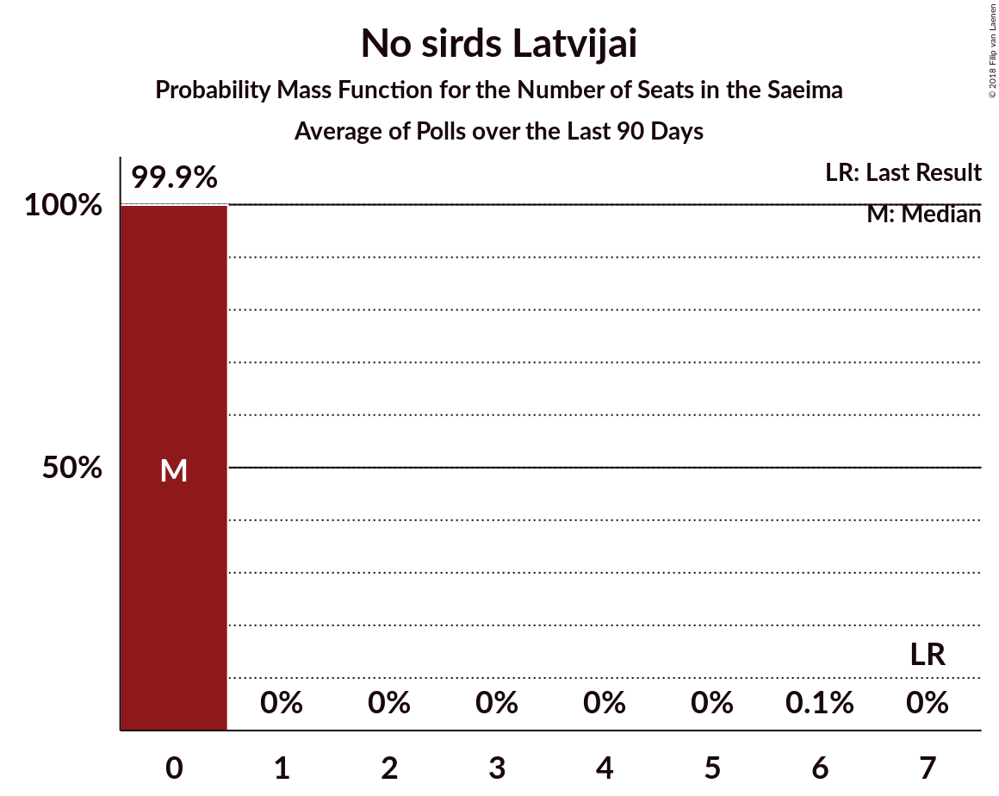

# Poll Average

<a href="#voting-intentions">Voting Intentions</a> | <a href="#seats">Seats</a> | <a href="#coalitions">Coalitions</a> | <a href="#technical-information">Technical Information</a>

## Summary

The table below lists the polls on which the average is based. They are the most recent polls (less than 90 days old) registered and analyzed so far.

| Period     | Polling firm/Commissioner(s) | SDPS | KPV | JKP | AP! | NA | ZZS | JV | LRA | LKS | P | NSL | VL | JS |
|:----------:|:----------------------------:|:--:|:--:|:--:|:--:|:--:|:--:|:--:|:--:|:--:|:--:|:--:|:--:|:--:|
| 6 October 2018 | General Election | 19.8%   23 | 14.2%   16 | 13.6%   16 | 12.0%   13 | 11.0%   13 | 9.9%   11 | 6.7%   8 | 4.1%   0 | 3.2%   0 | 2.6%   0 | 0.8%   0 | 0.0%   0 | 0.0%   0 |
| N/A | Poll Average | 13–24%   17–28 | 1–4%   0 | 7–11%   7–13 | 12–19%   14–22 | 8–16%   8–17 | 8–21%   11–23 | 10–18%   11–20 | 2–8%   0–9 | 2–6%   0–8 | 2–7%   0–8 | N/A   N/A | N/A   N/A | N/A   N/A |
| [1–24 August 2020](2020-08-24-Factum.html) | Factum | 13–18%   16–23 | 1–3%   0 | 7–12%   8–14 | 14–19%   16–22 | 11–16%   13–18 | 8–13%   10–16 | 13–18%   16–22 | 2–5%   0 | 3–6%   0–8 | 4–7%   0–8 | N/A   N/A | N/A   N/A | N/A   N/A |
| [7–20 August 2020](2020-08-20-SKDS.html) | SKDS   Latvijas Televīzija | 19–24%   22–28 | 2–5%   0 | 6–10%   7–11 | 12–16%   14–17 | 7–11%   7–13 | 17–22%   17–24 | 10–14%   11–16 | 5–9%   6–9 | 2–4%   0 | 2–4%   0 | N/A   N/A | N/A   N/A | N/A   N/A |
| 6 October 2018 | General Election | 19.8%   23 | 14.2%   16 | 13.6%   16 | 12.0%   13 | 11.0%   13 | 9.9%   11 | 6.7%   8 | 4.1%   0 | 3.2%   0 | 2.6%   0 | 0.8%   0 | 0.0%   0 | 0.0%   0 |

Only polls for which at least the sample size has been published are included in the table above.

**Legend:**
+ **Top half of each row:** Voting intentions (95% confidence interval)
+ **Bottom half of each row:** Seat projections for the Saeima (95% confidence interval)
+ **SDPS:** Sociāldemokrātiskā partija “Saskaņa”
+ **KPV:** Politiskā partija „KPV LV”
+ **JKP:** Jaunā konservatīvā partija
+ **AP!:** Attīstībai/Par!
+ **NA:** Nacionālā apvienība „Visu Latvijai!”–„Tēvzemei un Brīvībai/LNNK”
+ **ZZS:** Zaļo un Zemnieku savienība
+ **JV:** Jaunā VIENOTĪBA
+ **LRA:** Latvijas Reģionu Apvienība
+ **LKS:** Latvijas Krievu savienība
+ **P:** PROGRESĪVIE
+ **NSL:** No sirds Latvijai
+ **VL:** Vienoti Latvijai
+ **JS:** Jaunā Saskaņa
+ **N/A (single party):** Party not included the published results
+ **N/A (entire row):** Calculation for this opinion poll not started yet

## Voting Intentions

### Confidence Intervals

| Party | Last Result | Median | 80% Confidence Interval | 90% Confidence Interval | 95% Confidence Interval | 99% Confidence Interval |
|:-----:|:-----------:|:------:|:-----------------------:|:-----------------------:|:-----------------------:|:-----------------------:|
| <a href="#sociāldemokrātiskā-partija-“saskaņa”">Sociāldemokrātiskā partija “Saskaņa”</a> | 19.8% | 18.7% | 14.1–22.9% |13.5–23.5% | 13.1–24.0% | 12.2–25.0% |
| <a href="#politiskā-partija-„kpv-lv”">Politiskā partija „KPV LV”</a> | 14.2% | 2.8% | 1.7–3.9% |1.5–4.2% | 1.3–4.5% | 1.1–5.0% |
| <a href="#jaunā-konservatīvā-partija">Jaunā konservatīvā partija</a> | 13.6% | 8.6% | 7.3–10.2% |7.0–10.8% | 6.7–11.2% | 6.2–12.1% |
| <a href="#attīstībai/par!">Attīstībai/Par!</a> | 12.0% | 14.9% | 12.9–17.5% |12.4–18.2% | 12.0–18.7% | 11.3–19.8% |
| <a href="#nacionālā-apvienība-„visu-latvijai!”–„tēvzemei-un-brīvībai/lnnk”">Nacionālā apvienība „Visu Latvijai!”–„Tēvzemei un Brīvībai/LNNK”</a> | 11.0% | 11.1% | 8.5–14.4% |8.1–15.1% | 7.8–15.6% | 7.2–16.6% |
| <a href="#zaļo-un-zemnieku-savienība">Zaļo un Zemnieku savienība</a> | 9.9% | 14.8% | 9.2–20.2% |8.7–20.8% | 8.3–21.3% | 7.6–22.2% |
| <a href="#jaunā-vienotība">Jaunā VIENOTĪBA</a> | 6.7% | 13.3% | 10.8–16.5% |10.4–17.2% | 10.0–17.7% | 9.4–18.8% |
| <a href="#latvijas-reģionu-apvienība">Latvijas Reģionu Apvienība</a> | 4.1% | 5.0% | 2.5–7.6% |2.3–8.0% | 2.1–8.3% | 1.7–9.0% |
| <a href="#latvijas-krievu-savienība">Latvijas Krievu savienība</a> | 3.2% | 3.4% | 2.3–4.9% |2.1–5.3% | 1.9–5.6% | 1.7–6.3% |
| <a href="#progresīvie">PROGRESĪVIE</a> | 2.6% | 3.6% | 2.1–5.9% |1.9–6.3% | 1.7–6.7% | 1.5–7.4% |
| <a href="#no-sirds-latvijai">No sirds Latvijai</a> | 0.8% | N/A | N/A |N/A | N/A | N/A |
| <a href="#vienoti-latvijai">Vienoti Latvijai</a> | 0.0% | N/A | N/A |N/A | N/A | N/A |
| <a href="#jaunā-saskaņa">Jaunā Saskaņa</a> | 0.0% | N/A | N/A |N/A | N/A | N/A |

### Sociāldemokrātiskā partija “Saskaņa”

*For a full overview of the results for this party, see the [Sociāldemokrātiskā partija “Saskaņa”](party-sociāldemokrātiskāpartija“saskaņa”.html) page.*

| Voting Intentions | Probability | Accumulated | Special Marks |
|:-----------------:|:-----------:|:-----------:|:-------------:|
| 9.5–10.5% | 0% | 100% |  |
| 10.5–11.5% | 0.1% | 100% |  |
| 11.5–12.5% | 0.9% | 99.9% |  |
| 12.5–13.5% | 4% | 99.0% |  |
| 13.5–14.5% | 10% | 95% |  |
| 14.5–15.5% | 14% | 85% |  |
| 15.5–16.5% | 12% | 72% |  |
| 16.5–17.5% | 7% | 60% |  |
| 17.5–18.5% | 3% | 53% |  |
| 18.5–19.5% | 3% | 50% | Median |
| 19.5–20.5% | 7% | 47% | Last Result |
| 20.5–21.5% | 13% | 40% |  |
| 21.5–22.5% | 14% | 27% |  |
| 22.5–23.5% | 9% | 13% |  |
| 23.5–24.5% | 4% | 5% |  |
| 24.5–25.5% | 0.9% | 1.1% |  |
| 25.5–26.5% | 0.2% | 0.2% |  |
| 26.5–27.5% | 0% | 0% |  |

### Politiskā partija „KPV LV”

*For a full overview of the results for this party, see the [Politiskā partija „KPV LV”](party-politiskāpartija„kpvlv”.html) page.*

| Voting Intentions | Probability | Accumulated | Special Marks |
|:-----------------:|:-----------:|:-----------:|:-------------:|
| 0.0–0.5% | 0% | 100% |  |
| 0.5–1.5% | 6% | 100% |  |
| 1.5–2.5% | 34% | 94% |  |
| 2.5–3.5% | 38% | 60% | Median |
| 3.5–4.5% | 19% | 21% |  |
| 4.5–5.5% | 2% | 2% |  |
| 5.5–6.5% | 0.1% | 0.1% |  |
| 6.5–7.5% | 0% | 0% |  |
| 7.5–8.5% | 0% | 0% |  |
| 8.5–9.5% | 0% | 0% |  |
| 9.5–10.5% | 0% | 0% |  |
| 10.5–11.5% | 0% | 0% |  |
| 11.5–12.5% | 0% | 0% |  |
| 12.5–13.5% | 0% | 0% |  |
| 13.5–14.5% | 0% | 0% | Last Result |

### Jaunā konservatīvā partija

*For a full overview of the results for this party, see the [Jaunā konservatīvā partija](party-jaunākonservatīvāpartija.html) page.*

| Voting Intentions | Probability | Accumulated | Special Marks |
|:-----------------:|:-----------:|:-----------:|:-------------:|
| 4.5–5.5% | 0% | 100% |  |
| 5.5–6.5% | 2% | 100% |  |
| 6.5–7.5% | 13% | 98% |  |
| 7.5–8.5% | 32% | 85% |  |
| 8.5–9.5% | 30% | 53% | Median |
| 9.5–10.5% | 16% | 22% |  |
| 10.5–11.5% | 5% | 7% |  |
| 11.5–12.5% | 1.2% | 1.4% |  |
| 12.5–13.5% | 0.2% | 0.2% |  |
| 13.5–14.5% | 0% | 0% | Last Result |

### Attīstībai/Par!

*For a full overview of the results for this party, see the [Attīstībai/Par!](party-attīstībaipar.html) page.*

| Voting Intentions | Probability | Accumulated | Special Marks |
|:-----------------:|:-----------:|:-----------:|:-------------:|
| 9.5–10.5% | 0.1% | 100% |  |
| 10.5–11.5% | 0.9% | 99.9% |  |
| 11.5–12.5% | 5% | 99.1% | Last Result |
| 12.5–13.5% | 15% | 94% |  |
| 13.5–14.5% | 21% | 79% |  |
| 14.5–15.5% | 20% | 57% | Median |
| 15.5–16.5% | 17% | 38% |  |
| 16.5–17.5% | 12% | 21% |  |
| 17.5–18.5% | 6% | 10% |  |
| 18.5–19.5% | 2% | 3% |  |
| 19.5–20.5% | 0.6% | 0.8% |  |
| 20.5–21.5% | 0.1% | 0.1% |  |
| 21.5–22.5% | 0% | 0% |  |

### Nacionālā apvienība „Visu Latvijai!”–„Tēvzemei un Brīvībai/LNNK”

*For a full overview of the results for this party, see the [Nacionālā apvienība „Visu Latvijai!”–„Tēvzemei un Brīvībai/LNNK”](party-nacionālāapvienība„visulatvijai”–„tēvzemeiunbrīvībailnnk”.html) page.*

| Voting Intentions | Probability | Accumulated | Special Marks |
|:-----------------:|:-----------:|:-----------:|:-------------:|
| 5.5–6.5% | 0% | 100% |  |
| 6.5–7.5% | 1.3% | 100% |  |
| 7.5–8.5% | 10% | 98.6% |  |
| 8.5–9.5% | 20% | 89% |  |
| 9.5–10.5% | 15% | 69% |  |
| 10.5–11.5% | 8% | 54% | Last Result, Median |
| 11.5–12.5% | 11% | 46% |  |
| 12.5–13.5% | 15% | 35% |  |
| 13.5–14.5% | 12% | 21% |  |
| 14.5–15.5% | 6% | 9% |  |
| 15.5–16.5% | 2% | 3% |  |
| 16.5–17.5% | 0.5% | 0.5% |  |
| 17.5–18.5% | 0.1% | 0.1% |  |
| 18.5–19.5% | 0% | 0% |  |

### Zaļo un Zemnieku savienība

*For a full overview of the results for this party, see the [Zaļo un Zemnieku savienība](party-zaļounzemniekusavienība.html) page.*

| Voting Intentions | Probability | Accumulated | Special Marks |
|:-----------------:|:-----------:|:-----------:|:-------------:|
| 5.5–6.5% | 0% | 100% |  |
| 6.5–7.5% | 0.4% | 100% |  |
| 7.5–8.5% | 4% | 99.5% |  |
| 8.5–9.5% | 12% | 96% |  |
| 9.5–10.5% | 16% | 84% | Last Result |
| 10.5–11.5% | 12% | 68% |  |
| 11.5–12.5% | 5% | 56% |  |
| 12.5–13.5% | 1.2% | 51% |  |
| 13.5–14.5% | 0.2% | 50% |  |
| 14.5–15.5% | 0.1% | 50% | Median |
| 15.5–16.5% | 1.1% | 50% |  |
| 16.5–17.5% | 5% | 49% |  |
| 17.5–18.5% | 12% | 44% |  |
| 18.5–19.5% | 15% | 32% |  |
| 19.5–20.5% | 11% | 17% |  |
| 20.5–21.5% | 5% | 7% |  |
| 21.5–22.5% | 1.3% | 2% |  |
| 22.5–23.5% | 0.2% | 0.3% |  |
| 23.5–24.5% | 0% | 0% |  |

### Jaunā VIENOTĪBA

*For a full overview of the results for this party, see the [Jaunā VIENOTĪBA](party-jaunāvienotība.html) page.*

| Voting Intentions | Probability | Accumulated | Special Marks |
|:-----------------:|:-----------:|:-----------:|:-------------:|
| 6.5–7.5% | 0% | 100% | Last Result |
| 7.5–8.5% | 0% | 100% |  |
| 8.5–9.5% | 0.8% | 100% |  |
| 9.5–10.5% | 6% | 99.2% |  |
| 10.5–11.5% | 16% | 94% |  |
| 11.5–12.5% | 18% | 78% |  |
| 12.5–13.5% | 13% | 60% | Median |
| 13.5–14.5% | 12% | 47% |  |
| 14.5–15.5% | 14% | 35% |  |
| 15.5–16.5% | 12% | 22% |  |
| 16.5–17.5% | 7% | 10% |  |
| 17.5–18.5% | 2% | 3% |  |
| 18.5–19.5% | 0.6% | 0.8% |  |
| 19.5–20.5% | 0.1% | 0.1% |  |
| 20.5–21.5% | 0% | 0% |  |

### Latvijas Reģionu Apvienība

*For a full overview of the results for this party, see the [Latvijas Reģionu Apvienība](party-latvijasreģionuapvienība.html) page.*

| Voting Intentions | Probability | Accumulated | Special Marks |
|:-----------------:|:-----------:|:-----------:|:-------------:|
| 0.0–0.5% | 0% | 100% |  |
| 0.5–1.5% | 0.1% | 100% |  |
| 1.5–2.5% | 10% | 99.9% |  |
| 2.5–3.5% | 27% | 90% |  |
| 3.5–4.5% | 11% | 63% | Last Result |
| 4.5–5.5% | 4% | 51% | Median |
| 5.5–6.5% | 16% | 48% |  |
| 6.5–7.5% | 21% | 32% |  |
| 7.5–8.5% | 9% | 10% |  |
| 8.5–9.5% | 1.4% | 1.4% |  |
| 9.5–10.5% | 0.1% | 0.1% |  |
| 10.5–11.5% | 0% | 0% |  |

### Latvijas Krievu savienība

*For a full overview of the results for this party, see the [Latvijas Krievu savienība](party-latvijaskrievusavienība.html) page.*

| Voting Intentions | Probability | Accumulated | Special Marks |
|:-----------------:|:-----------:|:-----------:|:-------------:|
| 0.0–0.5% | 0% | 100% |  |
| 0.5–1.5% | 0.2% | 100% |  |
| 1.5–2.5% | 18% | 99.8% |  |
| 2.5–3.5% | 38% | 82% | Last Result, Median |
| 3.5–4.5% | 28% | 44% |  |
| 4.5–5.5% | 13% | 16% |  |
| 5.5–6.5% | 3% | 3% |  |
| 6.5–7.5% | 0.2% | 0.2% |  |
| 7.5–8.5% | 0% | 0% |  |

### PROGRESĪVIE

*For a full overview of the results for this party, see the [PROGRESĪVIE](party-progresīvie.html) page.*

| Voting Intentions | Probability | Accumulated | Special Marks |
|:-----------------:|:-----------:|:-----------:|:-------------:|
| 0.0–0.5% | 0% | 100% |  |
| 0.5–1.5% | 0.8% | 100% |  |
| 1.5–2.5% | 25% | 99.2% |  |
| 2.5–3.5% | 23% | 74% | Last Result |
| 3.5–4.5% | 13% | 51% | Median |
| 4.5–5.5% | 22% | 37% |  |
| 5.5–6.5% | 13% | 16% |  |
| 6.5–7.5% | 3% | 3% |  |
| 7.5–8.5% | 0.3% | 0.3% |  |
| 8.5–9.5% | 0% | 0% |  |

## Seats

### Confidence Intervals

| Party | Last Result | Median | 80% Confidence Interval | 90% Confidence Interval | 95% Confidence Interval | 99% Confidence Interval |
|:-----:|:-----------:|:------:|:-----------------------:|:-----------------------:|:-----------------------:|:-----------------------:|
| <a href="#sociāldemokrātiskā-partija-“saskaņa”">Sociāldemokrātiskā partija “Saskaņa”</a> | 23 | 23 | 18–26 |17–27 | 17–28 | 16–29 |
| <a href="#politiskā-partija-„kpv-lv”">Politiskā partija „KPV LV”</a> | 16 | 0 | 0 |0 | 0 | 0–5 |
| <a href="#jaunā-konservatīvā-partija">Jaunā konservatīvā partija</a> | 16 | 9 | 8–13 |7–13 | 7–13 | 7–15 |
| <a href="#attīstībai/par!">Attīstībai/Par!</a> | 13 | 17 | 15–21 |14–22 | 14–22 | 13–23 |
| <a href="#nacionālā-apvienība-„visu-latvijai!”–„tēvzemei-un-brīvībai/lnnk”">Nacionālā apvienība „Visu Latvijai!”–„Tēvzemei un Brīvībai/LNNK”</a> | 13 | 13 | 10–17 |9–17 | 8–17 | 7–20 |
| <a href="#zaļo-un-zemnieku-savienība">Zaļo un Zemnieku savienība</a> | 11 | 17 | 12–22 |11–22 | 11–23 | 10–24 |
| <a href="#jaunā-vienotība">Jaunā VIENOTĪBA</a> | 8 | 16 | 11–20 |11–20 | 11–20 | 11–23 |
| <a href="#latvijas-reģionu-apvienība">Latvijas Reģionu Apvienība</a> | 0 | 0 | 0–7 |0–8 | 0–9 | 0–10 |
| <a href="#latvijas-krievu-savienība">Latvijas Krievu savienība</a> | 0 | 0 | 0 |0–6 | 0–8 | 0–8 |
| <a href="#progresīvie">PROGRESĪVIE</a> | 0 | 0 | 0–7 |0–7 | 0–8 | 0–9 |
| <a href="#no-sirds-latvijai">No sirds Latvijai</a> | 0 | N/A | N/A |N/A | N/A | N/A |
| <a href="#vienoti-latvijai">Vienoti Latvijai</a> | 0 | N/A | N/A |N/A | N/A | N/A |
| <a href="#jaunā-saskaņa">Jaunā Saskaņa</a> | 0 | N/A | N/A |N/A | N/A | N/A |

### Sociāldemokrātiskā partija “Saskaņa”

*For a full overview of the results for this party, see the [Sociāldemokrātiskā partija “Saskaņa”](party-sociāldemokrātiskāpartija“saskaņa”.html) page.*

| Number of Seats | Probability | Accumulated | Special Marks |
|:---------------:|:-----------:|:-----------:|:-------------:|
| 14 | 0% | 100% |  |
| 15 | 0.3% | 99.9% |  |
| 16 | 1.5% | 99.7% |  |
| 17 | 4% | 98% |  |
| 18 | 18% | 94% |  |
| 19 | 3% | 76% |  |
| 20 | 5% | 73% |  |
| 21 | 13% | 68% |  |
| 22 | 5% | 56% |  |
| 23 | 6% | 51% | Last Result, Median |
| 24 | 29% | 45% |  |
| 25 | 5% | 17% |  |
| 26 | 4% | 12% |  |
| 27 | 5% | 8% |  |
| 28 | 2% | 3% |  |
| 29 | 1.0% | 1.0% |  |
| 30 | 0% | 0% |  |

### Politiskā partija „KPV LV”

*For a full overview of the results for this party, see the [Politiskā partija „KPV LV”](party-politiskāpartija„kpvlv”.html) page.*

| Number of Seats | Probability | Accumulated | Special Marks |
|:---------------:|:-----------:|:-----------:|:-------------:|
| 0 | 99.4% | 100% | Median |
| 1 | 0% | 0.6% |  |
| 2 | 0% | 0.6% |  |
| 3 | 0% | 0.6% |  |
| 4 | 0% | 0.6% |  |
| 5 | 0.6% | 0.6% |  |
| 6 | 0% | 0% |  |
| 7 | 0% | 0% |  |
| 8 | 0% | 0% |  |
| 9 | 0% | 0% |  |
| 10 | 0% | 0% |  |
| 11 | 0% | 0% |  |
| 12 | 0% | 0% |  |
| 13 | 0% | 0% |  |
| 14 | 0% | 0% |  |
| 15 | 0% | 0% |  |
| 16 | 0% | 0% | Last Result |

### Jaunā konservatīvā partija

*For a full overview of the results for this party, see the [Jaunā konservatīvā partija](party-jaunākonservatīvāpartija.html) page.*

| Number of Seats | Probability | Accumulated | Special Marks |
|:---------------:|:-----------:|:-----------:|:-------------:|
| 6 | 0.1% | 100% |  |
| 7 | 6% | 99.9% |  |
| 8 | 17% | 94% |  |
| 9 | 33% | 77% | Median |
| 10 | 7% | 44% |  |
| 11 | 16% | 37% |  |
| 12 | 9% | 21% |  |
| 13 | 10% | 12% |  |
| 14 | 0.7% | 1.4% |  |
| 15 | 0.6% | 0.7% |  |
| 16 | 0.1% | 0.1% | Last Result |
| 17 | 0% | 0% |  |

### Attīstībai/Par!

*For a full overview of the results for this party, see the [Attīstībai/Par!](party-attīstībaipar.html) page.*

| Number of Seats | Probability | Accumulated | Special Marks |
|:---------------:|:-----------:|:-----------:|:-------------:|
| 12 | 0.2% | 100% |  |
| 13 | 0.8% | 99.8% | Last Result |
| 14 | 5% | 99.0% |  |
| 15 | 28% | 94% |  |
| 16 | 14% | 66% |  |
| 17 | 21% | 51% | Median |
| 18 | 4% | 30% |  |
| 19 | 3% | 26% |  |
| 20 | 10% | 23% |  |
| 21 | 7% | 13% |  |
| 22 | 5% | 6% |  |
| 23 | 0.9% | 1.1% |  |
| 24 | 0.2% | 0.2% |  |
| 25 | 0% | 0% |  |

### Nacionālā apvienība „Visu Latvijai!”–„Tēvzemei un Brīvībai/LNNK”

*For a full overview of the results for this party, see the [Nacionālā apvienība „Visu Latvijai!”–„Tēvzemei un Brīvībai/LNNK”](party-nacionālāapvienība„visulatvijai”–„tēvzemeiunbrīvībailnnk”.html) page.*

| Number of Seats | Probability | Accumulated | Special Marks |
|:---------------:|:-----------:|:-----------:|:-------------:|
| 6 | 0.4% | 100% |  |
| 7 | 1.2% | 99.6% |  |
| 8 | 2% | 98% |  |
| 9 | 3% | 96% |  |
| 10 | 19% | 93% |  |
| 11 | 19% | 74% |  |
| 12 | 3% | 55% |  |
| 13 | 6% | 52% | Last Result, Median |
| 14 | 25% | 46% |  |
| 15 | 2% | 22% |  |
| 16 | 9% | 20% |  |
| 17 | 10% | 12% |  |
| 18 | 1.1% | 2% |  |
| 19 | 0.2% | 0.8% |  |
| 20 | 0.4% | 0.6% |  |
| 21 | 0.3% | 0.3% |  |
| 22 | 0% | 0% |  |

### Zaļo un Zemnieku savienība

*For a full overview of the results for this party, see the [Zaļo un Zemnieku savienība](party-zaļounzemniekusavienība.html) page.*

| Number of Seats | Probability | Accumulated | Special Marks |
|:---------------:|:-----------:|:-----------:|:-------------:|
| 7 | 0% | 100% |  |
| 8 | 0% | 99.9% |  |
| 9 | 0.2% | 99.9% |  |
| 10 | 1.5% | 99.7% |  |
| 11 | 6% | 98% | Last Result |
| 12 | 22% | 92% |  |
| 13 | 12% | 70% |  |
| 14 | 5% | 58% |  |
| 15 | 0.8% | 53% |  |
| 16 | 1.2% | 52% |  |
| 17 | 2% | 51% | Median |
| 18 | 2% | 49% |  |
| 19 | 2% | 47% |  |
| 20 | 5% | 44% |  |
| 21 | 5% | 40% |  |
| 22 | 30% | 35% |  |
| 23 | 2% | 5% |  |
| 24 | 2% | 2% |  |
| 25 | 0.3% | 0.4% |  |
| 26 | 0% | 0.1% |  |
| 27 | 0% | 0% |  |

### Jaunā VIENOTĪBA

*For a full overview of the results for this party, see the [Jaunā VIENOTĪBA](party-jaunāvienotība.html) page.*

| Number of Seats | Probability | Accumulated | Special Marks |
|:---------------:|:-----------:|:-----------:|:-------------:|
| 8 | 0% | 100% | Last Result |
| 9 | 0% | 100% |  |
| 10 | 0.1% | 100% |  |
| 11 | 13% | 99.9% |  |
| 12 | 14% | 87% |  |
| 13 | 12% | 73% |  |
| 14 | 4% | 60% |  |
| 15 | 6% | 57% |  |
| 16 | 5% | 51% | Median |
| 17 | 8% | 46% |  |
| 18 | 14% | 38% |  |
| 19 | 11% | 23% |  |
| 20 | 9% | 12% |  |
| 21 | 1.0% | 2% |  |
| 22 | 0.3% | 1.5% |  |
| 23 | 0.9% | 1.2% |  |
| 24 | 0.2% | 0.2% |  |
| 25 | 0% | 0% |  |

### Latvijas Reģionu Apvienība

*For a full overview of the results for this party, see the [Latvijas Reģionu Apvienība](party-latvijasreģionuapvienība.html) page.*

| Number of Seats | Probability | Accumulated | Special Marks |
|:---------------:|:-----------:|:-----------:|:-------------:|
| 0 | 50% | 100% | Last Result, Median |
| 1 | 0% | 50% |  |
| 2 | 0% | 50% |  |
| 3 | 0% | 50% |  |
| 4 | 0% | 50% |  |
| 5 | 0% | 50% |  |
| 6 | 13% | 50% |  |
| 7 | 30% | 37% |  |
| 8 | 3% | 7% |  |
| 9 | 3% | 3% |  |
| 10 | 0.6% | 0.8% |  |
| 11 | 0.1% | 0.1% |  |
| 12 | 0% | 0% |  |

### Latvijas Krievu savienība

*For a full overview of the results for this party, see the [Latvijas Krievu savienība](party-latvijaskrievusavienība.html) page.*

| Number of Seats | Probability | Accumulated | Special Marks |
|:---------------:|:-----------:|:-----------:|:-------------:|
| 0 | 95% | 100% | Last Result, Median |
| 1 | 0% | 5% |  |
| 2 | 0% | 5% |  |
| 3 | 0% | 5% |  |
| 4 | 0% | 5% |  |
| 5 | 0% | 5% |  |
| 6 | 0.4% | 5% |  |
| 7 | 2% | 5% |  |
| 8 | 3% | 3% |  |
| 9 | 0% | 0% |  |

### PROGRESĪVIE

*For a full overview of the results for this party, see the [PROGRESĪVIE](party-progresīvie.html) page.*

| Number of Seats | Probability | Accumulated | Special Marks |
|:---------------:|:-----------:|:-----------:|:-------------:|
| 0 | 72% | 100% | Last Result, Median |
| 1 | 0% | 28% |  |
| 2 | 0% | 28% |  |
| 3 | 0% | 28% |  |
| 4 | 0% | 28% |  |
| 5 | 0.2% | 28% |  |
| 6 | 5% | 27% |  |
| 7 | 18% | 22% |  |
| 8 | 3% | 4% |  |
| 9 | 1.1% | 1.1% |  |
| 10 | 0% | 0% |  |

### No sirds Latvijai

*For a full overview of the results for this party, see the [No sirds Latvijai](party-nosirdslatvijai.html) page.*

### Vienoti Latvijai

*For a full overview of the results for this party, see the [Vienoti Latvijai](party-vienotilatvijai.html) page.*

### Jaunā Saskaņa

*For a full overview of the results for this party, see the [Jaunā Saskaņa](party-jaunāsaskaņa.html) page.*

## Coalitions

### Confidence Intervals

| Coalition | Last Result | Median | Majority? | 80% Confidence Interval | 90% Confidence Interval | 95% Confidence Interval | 99% Confidence Interval |
|:---------:|:-----------:|:------:|:---------:|:-----------------------:|:-----------------------:|:-----------------------:|:-----------------------:|
| Jaunā konservatīvā partija – Attīstībai/Par! – Nacionālā apvienība „Visu Latvijai!”–„Tēvzemei un Brīvībai/LNNK” – Zaļo un Zemnieku savienība – Jaunā VIENOTĪBA | 61 | 70 | 100% | 67–80 | 66–82 | 65–82 | 64–83 |
| Attīstībai/Par! – Nacionālā apvienība „Visu Latvijai!”–„Tēvzemei un Brīvībai/LNNK” – Zaļo un Zemnieku savienība – Jaunā VIENOTĪBA | 45 | 61 | 100% | 58–68 | 57–70 | 56–70 | 54–72 |
| Jaunā konservatīvā partija – Attīstībai/Par! – Nacionālā apvienība „Visu Latvijai!”–„Tēvzemei un Brīvībai/LNNK” – Jaunā VIENOTĪBA | 50 | 54 | 52% | 46–67 | 45–68 | 44–69 | 43–71 |
| Politiskā partija „KPV LV” – Jaunā konservatīvā partija – Attīstībai/Par! – Nacionālā apvienība „Visu Latvijai!”–„Tēvzemei un Brīvībai/LNNK” – Jaunā VIENOTĪBA | 66 | 54 | 52% | 46–67 | 45–68 | 44–69 | 43–71 |
| Jaunā konservatīvā partija – Attīstībai/Par! – Nacionālā apvienība „Visu Latvijai!”–„Tēvzemei un Brīvībai/LNNK” – Zaļo un Zemnieku savienība | 53 | 56 | 99.5% | 54–61 | 53–62 | 52–62 | 51–64 |
| Jaunā konservatīvā partija – Nacionālā apvienība „Visu Latvijai!”–„Tēvzemei un Brīvībai/LNNK” – Zaļo un Zemnieku savienība – Jaunā VIENOTĪBA | 48 | 54 | 96% | 52–60 | 51–62 | 50–62 | 48–65 |
| Politiskā partija „KPV LV” – Attīstībai/Par! – Nacionālā apvienība „Visu Latvijai!”–„Tēvzemei un Brīvībai/LNNK” – Jaunā VIENOTĪBA | 50 | 45 | 30% | 37–55 | 36–57 | 36–58 | 34–60 |
| Sociāldemokrātiskā partija “Saskaņa” – Jaunā konservatīvā partija – Attīstībai/Par! | 52 | 49 | 22% | 46–53 | 45–54 | 44–54 | 42–56 |
| Politiskā partija „KPV LV” – Jaunā konservatīvā partija – Attīstībai/Par! – Jaunā VIENOTĪBA | 53 | 41 | 14% | 35–51 | 35–52 | 34–53 | 33–55 |
| Attīstībai/Par! – Nacionālā apvienība „Visu Latvijai!”–„Tēvzemei un Brīvībai/LNNK” – Zaļo un Zemnieku savienība | 37 | 48 | 4% | 43–50 | 42–50 | 42–51 | 40–53 |
| Nacionālā apvienība „Visu Latvijai!”–„Tēvzemei un Brīvībai/LNNK” – Zaļo un Zemnieku savienība – Jaunā VIENOTĪBA | 32 | 45 | 2% | 42–48 | 41–50 | 41–50 | 39–53 |
| Politiskā partija „KPV LV” – Jaunā konservatīvā partija – Attīstībai/Par! – Nacionālā apvienība „Visu Latvijai!”–„Tēvzemei un Brīvībai/LNNK” | 58 | 39 | 1.2% | 33–48 | 32–50 | 32–50 | 31–52 |
| Politiskā partija „KPV LV” – Jaunā konservatīvā partija – Nacionālā apvienība „Visu Latvijai!”–„Tēvzemei un Brīvībai/LNNK” – Jaunā VIENOTĪBA | 53 | 37 | 1.3% | 31–47 | 29–48 | 29–49 | 28–51 |
| Sociāldemokrātiskā partija “Saskaņa” – Politiskā partija „KPV LV” – Zaļo un Zemnieku savienība | 50 | 40 | 0.4% | 30–48 | 29–48 | 28–49 | 27–50 |
| Jaunā konservatīvā partija – Nacionālā apvienība „Visu Latvijai!”–„Tēvzemei un Brīvībai/LNNK” – Zaļo un Zemnieku savienība | 40 | 40 | 0% | 36–42 | 35–43 | 35–44 | 33–46 |
| Sociāldemokrātiskā partija “Saskaņa” – Attīstībai/Par! | 36 | 39 | 0% | 35–42 | 35–43 | 34–43 | 33–46 |
| Sociāldemokrātiskā partija “Saskaņa” – Politiskā partija „KPV LV” | 39 | 23 | 0% | 18–26 | 17–27 | 17–28 | 16–29 |

### Jaunā konservatīvā partija – Attīstībai/Par! – Nacionālā apvienība „Visu Latvijai!”–„Tēvzemei un Brīvībai/LNNK” – Zaļo un Zemnieku savienība – Jaunā VIENOTĪBA

| Number of Seats | Probability | Accumulated | Special Marks |
|:---------------:|:-----------:|:-----------:|:-------------:|
| 61 | 0% | 100% | Last Result |
| 62 | 0.1% | 100% |  |
| 63 | 0.2% | 99.9% |  |
| 64 | 1.3% | 99.7% |  |
| 65 | 2% | 98% |  |
| 66 | 5% | 97% |  |
| 67 | 6% | 92% |  |
| 68 | 5% | 86% |  |
| 69 | 22% | 81% |  |
| 70 | 10% | 59% |  |
| 71 | 2% | 49% |  |
| 72 | 8% | 47% | Median |
| 73 | 3% | 39% |  |
| 74 | 5% | 36% |  |
| 75 | 7% | 32% |  |
| 76 | 6% | 25% |  |
| 77 | 1.5% | 19% |  |
| 78 | 3% | 18% |  |
| 79 | 4% | 15% |  |
| 80 | 3% | 10% |  |
| 81 | 1.1% | 7% |  |
| 82 | 5% | 6% |  |
| 83 | 0.4% | 0.6% |  |
| 84 | 0.2% | 0.2% |  |
| 85 | 0% | 0% |  |

### Attīstībai/Par! – Nacionālā apvienība „Visu Latvijai!”–„Tēvzemei un Brīvībai/LNNK” – Zaļo un Zemnieku savienība – Jaunā VIENOTĪBA

| Number of Seats | Probability | Accumulated | Special Marks |
|:---------------:|:-----------:|:-----------:|:-------------:|
| 45 | 0% | 100% | Last Result |
| 46 | 0% | 100% |  |
| 47 | 0% | 100% |  |
| 48 | 0% | 100% |  |
| 49 | 0% | 100% |  |
| 50 | 0% | 100% |  |
| 51 | 0% | 100% | Majority |
| 52 | 0% | 100% |  |
| 53 | 0.1% | 100% |  |
| 54 | 0.5% | 99.9% |  |
| 55 | 0.8% | 99.4% |  |
| 56 | 3% | 98.6% |  |
| 57 | 3% | 95% |  |
| 58 | 4% | 92% |  |
| 59 | 7% | 87% |  |
| 60 | 15% | 81% |  |
| 61 | 22% | 66% |  |
| 62 | 8% | 44% |  |
| 63 | 6% | 36% | Median |
| 64 | 2% | 29% |  |
| 65 | 3% | 28% |  |
| 66 | 6% | 25% |  |
| 67 | 8% | 19% |  |
| 68 | 2% | 11% |  |
| 69 | 2% | 8% |  |
| 70 | 4% | 6% |  |
| 71 | 1.2% | 2% |  |
| 72 | 0.9% | 1.2% |  |
| 73 | 0.3% | 0.3% |  |
| 74 | 0.1% | 0.1% |  |
| 75 | 0% | 0% |  |

### Jaunā konservatīvā partija – Attīstībai/Par! – Nacionālā apvienība „Visu Latvijai!”–„Tēvzemei un Brīvībai/LNNK” – Jaunā VIENOTĪBA

| Number of Seats | Probability | Accumulated | Special Marks |
|:---------------:|:-----------:|:-----------:|:-------------:|
| 41 | 0% | 100% |  |
| 42 | 0.4% | 99.9% |  |
| 43 | 0.5% | 99.6% |  |
| 44 | 3% | 99.1% |  |
| 45 | 5% | 96% |  |
| 46 | 8% | 92% |  |
| 47 | 18% | 83% |  |
| 48 | 8% | 65% |  |
| 49 | 4% | 57% |  |
| 50 | 1.4% | 53% | Last Result |
| 51 | 1.1% | 52% | Majority |
| 52 | 0.4% | 51% |  |
| 53 | 0.4% | 50% |  |
| 54 | 0.1% | 50% |  |
| 55 | 0.2% | 50% | Median |
| 56 | 0.3% | 50% |  |
| 57 | 0.7% | 49% |  |
| 58 | 2% | 49% |  |
| 59 | 1.4% | 46% |  |
| 60 | 7% | 45% |  |
| 61 | 5% | 38% |  |
| 62 | 4% | 33% |  |
| 63 | 6% | 29% |  |
| 64 | 6% | 23% |  |
| 65 | 4% | 17% |  |
| 66 | 2% | 14% |  |
| 67 | 3% | 12% |  |
| 68 | 4% | 9% |  |
| 69 | 3% | 5% |  |
| 70 | 1.0% | 2% |  |
| 71 | 0.5% | 0.6% |  |
| 72 | 0.1% | 0.1% |  |
| 73 | 0% | 0% |  |

### Politiskā partija „KPV LV” – Jaunā konservatīvā partija – Attīstībai/Par! – Nacionālā apvienība „Visu Latvijai!”–„Tēvzemei un Brīvībai/LNNK” – Jaunā VIENOTĪBA

| Number of Seats | Probability | Accumulated | Special Marks |
|:---------------:|:-----------:|:-----------:|:-------------:|
| 41 | 0% | 100% |  |
| 42 | 0.4% | 99.9% |  |
| 43 | 0.4% | 99.6% |  |
| 44 | 3% | 99.2% |  |
| 45 | 5% | 96% |  |
| 46 | 8% | 92% |  |
| 47 | 18% | 84% |  |
| 48 | 8% | 66% |  |
| 49 | 4% | 58% |  |
| 50 | 2% | 54% |  |
| 51 | 1.3% | 52% | Majority |
| 52 | 0.4% | 51% |  |
| 53 | 0.4% | 50% |  |
| 54 | 0.1% | 50% |  |
| 55 | 0.2% | 50% | Median |
| 56 | 0.3% | 50% |  |
| 57 | 0.7% | 49% |  |
| 58 | 2% | 49% |  |
| 59 | 1.4% | 47% |  |
| 60 | 7% | 45% |  |
| 61 | 5% | 38% |  |
| 62 | 4% | 33% |  |
| 63 | 6% | 29% |  |
| 64 | 6% | 23% |  |
| 65 | 4% | 17% |  |
| 66 | 2% | 14% | Last Result |
| 67 | 3% | 12% |  |
| 68 | 4% | 9% |  |
| 69 | 3% | 5% |  |
| 70 | 1.0% | 2% |  |
| 71 | 0.5% | 0.6% |  |
| 72 | 0.1% | 0.1% |  |
| 73 | 0% | 0% |  |

### Jaunā konservatīvā partija – Attīstībai/Par! – Nacionālā apvienība „Visu Latvijai!”–„Tēvzemei un Brīvībai/LNNK” – Zaļo un Zemnieku savienība

| Number of Seats | Probability | Accumulated | Special Marks |
|:---------------:|:-----------:|:-----------:|:-------------:|
| 48 | 0% | 100% |  |
| 49 | 0.2% | 99.9% |  |
| 50 | 0.3% | 99.8% |  |
| 51 | 1.5% | 99.5% | Majority |
| 52 | 3% | 98% |  |
| 53 | 5% | 95% | Last Result |
| 54 | 16% | 91% |  |
| 55 | 11% | 75% |  |
| 56 | 16% | 64% | Median |
| 57 | 19% | 49% |  |
| 58 | 7% | 30% |  |
| 59 | 7% | 22% |  |
| 60 | 3% | 16% |  |
| 61 | 3% | 13% |  |
| 62 | 8% | 10% |  |
| 63 | 1.1% | 2% |  |
| 64 | 0.5% | 0.7% |  |
| 65 | 0.2% | 0.3% |  |
| 66 | 0% | 0% |  |

### Jaunā konservatīvā partija – Nacionālā apvienība „Visu Latvijai!”–„Tēvzemei un Brīvībai/LNNK” – Zaļo un Zemnieku savienība – Jaunā VIENOTĪBA

| Number of Seats | Probability | Accumulated | Special Marks |
|:---------------:|:-----------:|:-----------:|:-------------:|
| 47 | 0.2% | 100% |  |
| 48 | 0.5% | 99.8% | Last Result |
| 49 | 1.5% | 99.3% |  |
| 50 | 2% | 98% |  |
| 51 | 5% | 96% | Majority |
| 52 | 7% | 90% |  |
| 53 | 16% | 83% |  |
| 54 | 20% | 67% |  |
| 55 | 13% | 47% | Median |
| 56 | 4% | 34% |  |
| 57 | 7% | 29% |  |
| 58 | 7% | 22% |  |
| 59 | 4% | 15% |  |
| 60 | 3% | 10% |  |
| 61 | 1.4% | 7% |  |
| 62 | 4% | 6% |  |
| 63 | 0.9% | 2% |  |
| 64 | 0.3% | 0.9% |  |
| 65 | 0.5% | 0.5% |  |
| 66 | 0% | 0.1% |  |
| 67 | 0% | 0% |  |

### Politiskā partija „KPV LV” – Attīstībai/Par! – Nacionālā apvienība „Visu Latvijai!”–„Tēvzemei un Brīvībai/LNNK” – Jaunā VIENOTĪBA

| Number of Seats | Probability | Accumulated | Special Marks |
|:---------------:|:-----------:|:-----------:|:-------------:|
| 32 | 0.1% | 100% |  |
| 33 | 0.2% | 99.9% |  |
| 34 | 1.3% | 99.6% |  |
| 35 | 0.8% | 98% |  |
| 36 | 3% | 98% |  |
| 37 | 9% | 95% |  |
| 38 | 11% | 86% |  |
| 39 | 14% | 75% |  |
| 40 | 6% | 61% |  |
| 41 | 2% | 54% |  |
| 42 | 1.3% | 52% |  |
| 43 | 0.6% | 51% |  |
| 44 | 0.5% | 51% |  |
| 45 | 0.4% | 50% |  |
| 46 | 1.0% | 50% | Median |
| 47 | 1.5% | 49% |  |
| 48 | 2% | 47% |  |
| 49 | 7% | 45% |  |
| 50 | 8% | 38% | Last Result |
| 51 | 3% | 30% | Majority |
| 52 | 1.5% | 27% |  |
| 53 | 5% | 26% |  |
| 54 | 6% | 21% |  |
| 55 | 7% | 15% |  |
| 56 | 3% | 8% |  |
| 57 | 2% | 5% |  |
| 58 | 1.3% | 3% |  |
| 59 | 0.6% | 1.5% |  |
| 60 | 0.7% | 0.9% |  |
| 61 | 0.1% | 0.1% |  |
| 62 | 0% | 0% |  |

### Sociāldemokrātiskā partija “Saskaņa” – Jaunā konservatīvā partija – Attīstībai/Par!

| Number of Seats | Probability | Accumulated | Special Marks |
|:---------------:|:-----------:|:-----------:|:-------------:|
| 40 | 0.1% | 100% |  |
| 41 | 0.1% | 99.9% |  |
| 42 | 0.8% | 99.8% |  |
| 43 | 0.5% | 98.9% |  |
| 44 | 1.4% | 98% |  |
| 45 | 3% | 97% |  |
| 46 | 8% | 94% |  |
| 47 | 8% | 87% |  |
| 48 | 27% | 78% |  |
| 49 | 16% | 51% | Median |
| 50 | 13% | 35% |  |
| 51 | 6% | 22% | Majority |
| 52 | 5% | 16% | Last Result |
| 53 | 5% | 11% |  |
| 54 | 4% | 6% |  |
| 55 | 1.5% | 2% |  |
| 56 | 0.6% | 0.8% |  |
| 57 | 0.1% | 0.2% |  |
| 58 | 0% | 0% |  |

### Politiskā partija „KPV LV” – Jaunā konservatīvā partija – Attīstībai/Par! – Jaunā VIENOTĪBA

| Number of Seats | Probability | Accumulated | Special Marks |
|:---------------:|:-----------:|:-----------:|:-------------:|
| 32 | 0.1% | 100% |  |
| 33 | 2% | 99.9% |  |
| 34 | 2% | 98% |  |
| 35 | 9% | 96% |  |
| 36 | 12% | 88% |  |
| 37 | 12% | 75% |  |
| 38 | 6% | 63% |  |
| 39 | 4% | 57% |  |
| 40 | 2% | 53% |  |
| 41 | 1.4% | 51% |  |
| 42 | 0.9% | 50% | Median |
| 43 | 2% | 49% |  |
| 44 | 1.4% | 47% |  |
| 45 | 4% | 46% |  |
| 46 | 8% | 42% |  |
| 47 | 5% | 34% |  |
| 48 | 5% | 30% |  |
| 49 | 6% | 25% |  |
| 50 | 6% | 19% |  |
| 51 | 5% | 14% | Majority |
| 52 | 6% | 9% |  |
| 53 | 1.5% | 3% | Last Result |
| 54 | 1.0% | 2% |  |
| 55 | 0.5% | 0.6% |  |
| 56 | 0.1% | 0.1% |  |
| 57 | 0% | 0.1% |  |
| 58 | 0% | 0.1% |  |
| 59 | 0% | 0% |  |

### Attīstībai/Par! – Nacionālā apvienība „Visu Latvijai!”–„Tēvzemei un Brīvībai/LNNK” – Zaļo un Zemnieku savienība

| Number of Seats | Probability | Accumulated | Special Marks |
|:---------------:|:-----------:|:-----------:|:-------------:|
| 37 | 0% | 100% | Last Result |
| 38 | 0% | 100% |  |
| 39 | 0.2% | 99.9% |  |
| 40 | 0.4% | 99.8% |  |
| 41 | 1.4% | 99.3% |  |
| 42 | 3% | 98% |  |
| 43 | 10% | 95% |  |
| 44 | 6% | 84% |  |
| 45 | 11% | 78% |  |
| 46 | 7% | 67% |  |
| 47 | 10% | 60% | Median |
| 48 | 24% | 50% |  |
| 49 | 11% | 26% |  |
| 50 | 11% | 15% |  |
| 51 | 3% | 4% | Majority |
| 52 | 1.0% | 2% |  |
| 53 | 0.5% | 0.7% |  |
| 54 | 0.1% | 0.2% |  |
| 55 | 0% | 0% |  |

### Nacionālā apvienība „Visu Latvijai!”–„Tēvzemei un Brīvībai/LNNK” – Zaļo un Zemnieku savienība – Jaunā VIENOTĪBA

| Number of Seats | Probability | Accumulated | Special Marks |
|:---------------:|:-----------:|:-----------:|:-------------:|
| 32 | 0% | 100% | Last Result |
| 33 | 0% | 100% |  |
| 34 | 0% | 100% |  |
| 35 | 0% | 100% |  |
| 36 | 0% | 100% |  |
| 37 | 0% | 100% |  |
| 38 | 0.1% | 99.9% |  |
| 39 | 0.8% | 99.8% |  |
| 40 | 1.5% | 99.1% |  |
| 41 | 4% | 98% |  |
| 42 | 5% | 94% |  |
| 43 | 7% | 89% |  |
| 44 | 17% | 82% |  |
| 45 | 27% | 66% |  |
| 46 | 18% | 38% | Median |
| 47 | 8% | 21% |  |
| 48 | 4% | 13% |  |
| 49 | 3% | 9% |  |
| 50 | 5% | 7% |  |
| 51 | 0.6% | 2% | Majority |
| 52 | 0.9% | 2% |  |
| 53 | 0.4% | 0.6% |  |
| 54 | 0.1% | 0.2% |  |
| 55 | 0% | 0.1% |  |
| 56 | 0% | 0% |  |

### Politiskā partija „KPV LV” – Jaunā konservatīvā partija – Attīstībai/Par! – Nacionālā apvienība „Visu Latvijai!”–„Tēvzemei un Brīvībai/LNNK”

| Number of Seats | Probability | Accumulated | Special Marks |
|:---------------:|:-----------:|:-----------:|:-------------:|
| 29 | 0% | 100% |  |
| 30 | 0.2% | 99.9% |  |
| 31 | 1.3% | 99.7% |  |
| 32 | 4% | 98% |  |
| 33 | 6% | 94% |  |
| 34 | 18% | 89% |  |
| 35 | 11% | 71% |  |
| 36 | 4% | 60% |  |
| 37 | 4% | 56% |  |
| 38 | 2% | 52% |  |
| 39 | 1.1% | 51% | Median |
| 40 | 2% | 49% |  |
| 41 | 2% | 48% |  |
| 42 | 9% | 46% |  |
| 43 | 4% | 37% |  |
| 44 | 8% | 34% |  |
| 45 | 6% | 26% |  |
| 46 | 5% | 20% |  |
| 47 | 4% | 15% |  |
| 48 | 3% | 11% |  |
| 49 | 3% | 8% |  |
| 50 | 4% | 5% |  |
| 51 | 0.7% | 1.2% | Majority |
| 52 | 0.5% | 0.5% |  |
| 53 | 0% | 0.1% |  |
| 54 | 0% | 0% |  |
| 55 | 0% | 0% |  |
| 56 | 0% | 0% |  |
| 57 | 0% | 0% |  |
| 58 | 0% | 0% | Last Result |

### Politiskā partija „KPV LV” – Jaunā konservatīvā partija – Nacionālā apvienība „Visu Latvijai!”–„Tēvzemei un Brīvībai/LNNK” – Jaunā VIENOTĪBA

| Number of Seats | Probability | Accumulated | Special Marks |
|:---------------:|:-----------:|:-----------:|:-------------:|
| 26 | 0% | 100% |  |
| 27 | 0.3% | 99.9% |  |
| 28 | 1.1% | 99.6% |  |
| 29 | 4% | 98% |  |
| 30 | 4% | 95% |  |
| 31 | 14% | 90% |  |
| 32 | 14% | 76% |  |
| 33 | 4% | 62% |  |
| 34 | 5% | 58% |  |
| 35 | 1.4% | 53% |  |
| 36 | 1.1% | 52% |  |
| 37 | 0.7% | 51% |  |
| 38 | 0.3% | 50% | Median |
| 39 | 0.6% | 50% |  |
| 40 | 0.9% | 49% |  |
| 41 | 3% | 48% |  |
| 42 | 8% | 45% |  |
| 43 | 7% | 38% |  |
| 44 | 10% | 31% |  |
| 45 | 4% | 21% |  |
| 46 | 4% | 17% |  |
| 47 | 6% | 14% |  |
| 48 | 4% | 8% |  |
| 49 | 2% | 4% |  |
| 50 | 0.7% | 2% |  |
| 51 | 0.8% | 1.3% | Majority |
| 52 | 0.3% | 0.5% |  |
| 53 | 0.1% | 0.2% | Last Result |
| 54 | 0.1% | 0.1% |  |
| 55 | 0% | 0% |  |

### Sociāldemokrātiskā partija “Saskaņa” – Politiskā partija „KPV LV” – Zaļo un Zemnieku savienība

| Number of Seats | Probability | Accumulated | Special Marks |
|:---------------:|:-----------:|:-----------:|:-------------:|
| 25 | 0.1% | 100% |  |
| 26 | 0.2% | 99.9% |  |
| 27 | 1.2% | 99.7% |  |
| 28 | 2% | 98.5% |  |
| 29 | 3% | 97% |  |
| 30 | 8% | 94% |  |
| 31 | 9% | 86% |  |
| 32 | 6% | 76% |  |
| 33 | 10% | 70% |  |
| 34 | 3% | 60% |  |
| 35 | 4% | 57% |  |
| 36 | 2% | 53% |  |
| 37 | 0.7% | 52% |  |
| 38 | 0.7% | 51% |  |
| 39 | 0.2% | 50% |  |
| 40 | 0.2% | 50% | Median |
| 41 | 0.9% | 50% |  |
| 42 | 0.5% | 49% |  |
| 43 | 2% | 48% |  |
| 44 | 4% | 47% |  |
| 45 | 4% | 42% |  |
| 46 | 22% | 38% |  |
| 47 | 6% | 16% |  |
| 48 | 7% | 10% |  |
| 49 | 3% | 4% |  |
| 50 | 0.5% | 1.0% | Last Result |
| 51 | 0.3% | 0.4% | Majority |
| 52 | 0.1% | 0.1% |  |
| 53 | 0% | 0% |  |

### Jaunā konservatīvā partija – Nacionālā apvienība „Visu Latvijai!”–„Tēvzemei un Brīvībai/LNNK” – Zaļo un Zemnieku savienība

| Number of Seats | Probability | Accumulated | Special Marks |
|:---------------:|:-----------:|:-----------:|:-------------:|
| 31 | 0.1% | 100% |  |
| 32 | 0.1% | 99.9% |  |
| 33 | 0.4% | 99.8% |  |
| 34 | 0.8% | 99.4% |  |
| 35 | 4% | 98.6% |  |
| 36 | 5% | 94% |  |
| 37 | 10% | 89% |  |
| 38 | 10% | 79% |  |
| 39 | 16% | 68% | Median |
| 40 | 16% | 53% | Last Result |
| 41 | 10% | 36% |  |
| 42 | 19% | 26% |  |
| 43 | 4% | 7% |  |
| 44 | 2% | 3% |  |
| 45 | 0.5% | 1.0% |  |
| 46 | 0.2% | 0.5% |  |
| 47 | 0.3% | 0.3% |  |
| 48 | 0% | 0% |  |

### Sociāldemokrātiskā partija “Saskaņa” – Attīstībai/Par!

| Number of Seats | Probability | Accumulated | Special Marks |
|:---------------:|:-----------:|:-----------:|:-------------:|
| 31 | 0.1% | 100% |  |
| 32 | 0.3% | 99.8% |  |
| 33 | 1.5% | 99.5% |  |
| 34 | 2% | 98% |  |
| 35 | 6% | 96% |  |
| 36 | 4% | 90% | Last Result |
| 37 | 5% | 86% |  |
| 38 | 13% | 81% |  |
| 39 | 24% | 67% |  |
| 40 | 17% | 44% | Median |
| 41 | 12% | 27% |  |
| 42 | 9% | 15% |  |
| 43 | 4% | 6% |  |
| 44 | 1.1% | 2% |  |
| 45 | 0.8% | 1.3% |  |
| 46 | 0.4% | 0.5% |  |
| 47 | 0.1% | 0.1% |  |
| 48 | 0% | 0% |  |

### Sociāldemokrātiskā partija “Saskaņa” – Politiskā partija „KPV LV”

| Number of Seats | Probability | Accumulated | Special Marks |
|:---------------:|:-----------:|:-----------:|:-------------:|
| 14 | 0% | 100% |  |
| 15 | 0.3% | 99.9% |  |
| 16 | 1.5% | 99.7% |  |
| 17 | 4% | 98% |  |
| 18 | 18% | 94% |  |
| 19 | 3% | 76% |  |
| 20 | 5% | 73% |  |
| 21 | 12% | 68% |  |
| 22 | 4% | 56% |  |
| 23 | 6% | 51% | Median |
| 24 | 28% | 45% |  |
| 25 | 5% | 17% |  |
| 26 | 4% | 12% |  |
| 27 | 5% | 8% |  |
| 28 | 2% | 3% |  |
| 29 | 1.3% | 1.4% |  |
| 30 | 0.1% | 0.1% |  |
| 31 | 0.1% | 0.1% |  |
| 32 | 0% | 0% |  |
| 33 | 0% | 0% |  |
| 34 | 0% | 0% |  |
| 35 | 0% | 0% |  |
| 36 | 0% | 0% |  |
| 37 | 0% | 0% |  |
| 38 | 0% | 0% |  |
| 39 | 0% | 0% | Last Result |

## Technical Information

+ **Number of polls included in this average:** 2
+ **Lowest number of simulations done in a poll included in this average:** 1,048,576
+ **Total number of simulations done in the polls included in this average:** 2,097,152
+ **Error estimate:** 2.15%
