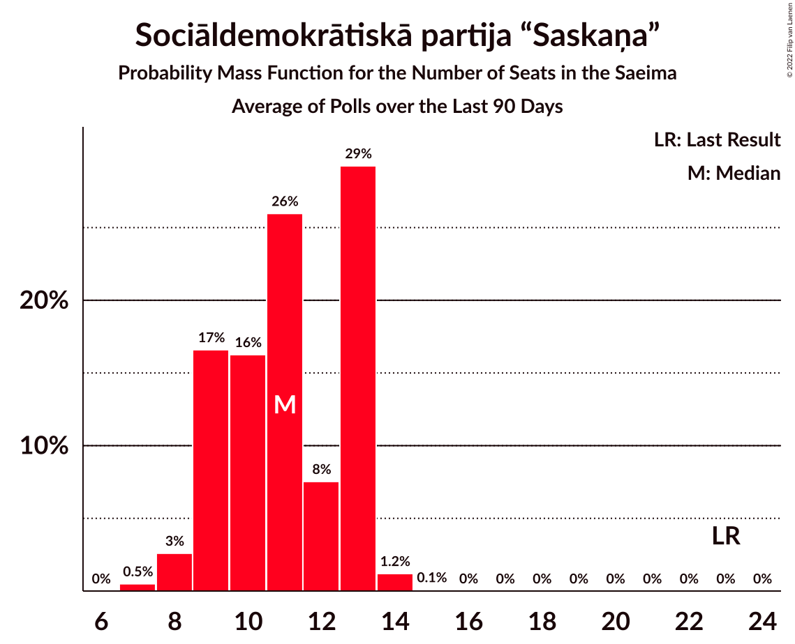
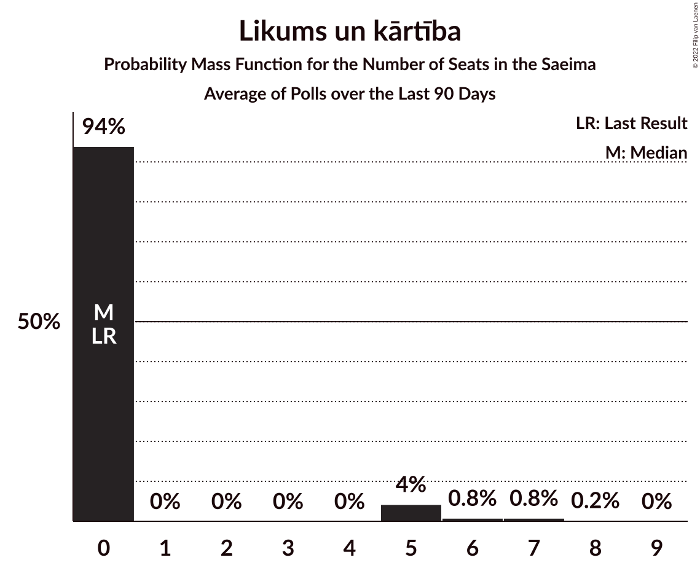
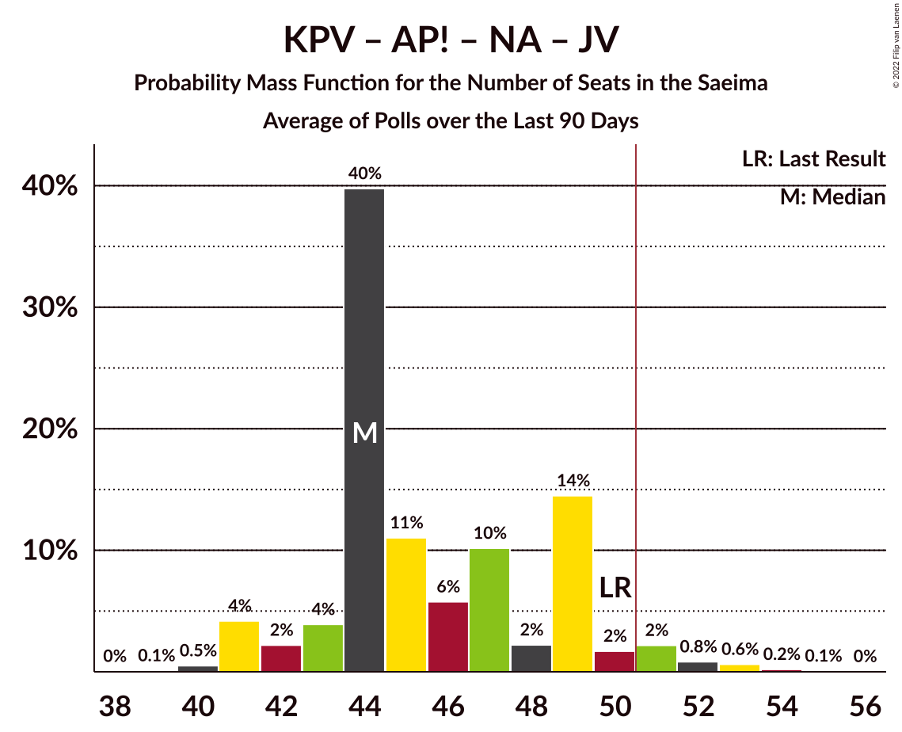

# Poll Average

<a href="#voting-intentions">Voting Intentions</a> | <a href="#seats">Seats</a> | <a href="#coalitions">Coalitions</a> | <a href="#technical-information">Technical Information</a>

## Summary

The table below lists the polls on which the average is based. They are the most recent polls (less than 90 days old) registered and analyzed so far.

| Period     | Polling firm/Commissioner(s) | SDPS | KPV | JKP | AP! | NA | ZZS | JV | LRA | LKS | P | NSL | VL | JS | LuK | LPV | R | S! | NST | SV |
|:----------:|:----------------------------:|:--:|:--:|:--:|:--:|:--:|:--:|:--:|:--:|:--:|:--:|:--:|:--:|:--:|:--:|:--:|:--:|:--:|:--:|:--:|
| 6 October 2018 | General Election | 19.8%   23 | 14.2%   16 | 13.6%   16 | 12.0%   13 | 11.0%   13 | 9.9%   11 | 6.7%   8 | 4.1%   0 | 3.2%   0 | 2.6%   0 | 0.8%   0 | 0.0%   0 | 0.0%   0 | 0.0%   0 | 0.0%   0 | 0.0%   0 | 0.0%   0 | 0.0%   0 | 0.0%   0 |
| N/A | Poll Average | 9–12%   10–15 | N/A   N/A | 3–7%   0–8 | 8–12%   9–16 | 10–15%   13–17 | 6–9%   6–11 | 14–22%   18–27 | 4–7%   0–7 | 3–7%   0–8 | 5–9%   7–10 | N/A   N/A | N/A   N/A | N/A   N/A | 2–5%   0–5 | 4–6%   0–7 | 1–3%   0 | 4–7%   0–10 | 0–1%   0 | 1–3%   0 |
| [1–31 July 2022](2022-07-31-SKDS.html) | SKDS   Latvijas Televīzija | 9–12%   12–15 | N/A   N/A | 3–5%   0 | 8–10%   9–13 | 12–15%   13–18 | 7–9%   7–11 | 14–17%   18–19 | 5–7%   6–7 | 5–7%   6–8 | 7–9%   8–11 | N/A   N/A | N/A   N/A | N/A   N/A | 4–6%   0–6 | 4–7%   0–7 | 2–3%   0 | 4–7%   0–8 | N/A   N/A | 1–3%   0 |
| [20–24 July 2022](2022-07-24-FactumInteractive.html) | Factum Interactive | 9–12%   10–16 | N/A   N/A | 5–7%   0–9 | 9–13%   10–16 | 10–13%   12–17 | 6–8%   6–11 | 18–23%   20–28 | 4–6%   0–7 | 3–5%   0–5 | 5–8%   0–9 | N/A   N/A | N/A   N/A | N/A   N/A | 2–4%   0 | 4–6%   0–7 | 1–3%   0 | 4–7%   0–10 | 0–1%   0 | 1–2%   0 |
| 6 October 2018 | General Election | 19.8%   23 | 14.2%   16 | 13.6%   16 | 12.0%   13 | 11.0%   13 | 9.9%   11 | 6.7%   8 | 4.1%   0 | 3.2%   0 | 2.6%   0 | 0.8%   0 | 0.0%   0 | 0.0%   0 | 0.0%   0 | 0.0%   0 | 0.0%   0 | 0.0%   0 | 0.0%   0 | 0.0%   0 |

Only polls for which at least the sample size has been published are included in the table above.

**Legend:**
+ **Top half of each row:** Voting intentions (95% confidence interval)
+ **Bottom half of each row:** Seat projections for the Saeima (95% confidence interval)
+ **SDPS:** Sociāldemokrātiskā partija “Saskaņa”
+ **KPV:** Politiskā partija „KPV LV”
+ **JKP:** Jaunā konservatīvā partija
+ **AP!:** Attīstībai/Par!
+ **NA:** Nacionālā apvienība „Visu Latvijai!”–„Tēvzemei un Brīvībai/LNNK”
+ **ZZS:** Zaļo un Zemnieku savienība
+ **JV:** Jaunā VIENOTĪBA
+ **LRA:** Latvijas Reģionu Apvienība
+ **LKS:** Latvijas Krievu savienība
+ **P:** PROGRESĪVIE
+ **NSL:** No sirds Latvijai
+ **VL:** Vienoti Latvijai
+ **JS:** Jaunā Saskaņa
+ **LuK:** Likums un kārtība
+ **LPV:** Latvija pirmajā vietā
+ **R:** Republika
+ **S!:** Stabilitātei!
+ **NST:** Nacionālā Savienība Taisnīgums
+ **SV:** Suverēnā vara
+ **N/A (single party):** Party not included the published results
+ **N/A (entire row):** Calculation for this opinion poll not started yet

## Voting Intentions

### Confidence Intervals

| Party | Last Result | Median | 80% Confidence Interval | 90% Confidence Interval | 95% Confidence Interval | 99% Confidence Interval |
|:-----:|:-----------:|:------:|:-----------------------:|:-----------------------:|:-----------------------:|:-----------------------:|
| <a href="#sociāldemokrātiskā-partija-“saskaņa”">Sociāldemokrātiskā partija “Saskaņa”</a> | 19.8% | 10.6% | 9.5–11.7% |9.2–12.0% | 8.9–12.2% | 8.4–12.8% |
| <a href="#politiskā-partija-„kpv-lv”">Politiskā partija „KPV LV”</a> | 14.2% | N/A | N/A |N/A | N/A | N/A |
| <a href="#jaunā-konservatīvā-partija">Jaunā konservatīvā partija</a> | 13.6% | 4.8% | 3.7–6.3% |3.5–6.7% | 3.3–7.0% | 3.1–7.5% |
| <a href="#attīstībai/par!">Attīstībai/Par!</a> | 12.0% | 9.8% | 8.5–11.6% |8.2–12.0% | 8.0–12.3% | 7.6–13.0% |
| <a href="#nacionālā-apvienība-„visu-latvijai!”–„tēvzemei-un-brīvībai/lnnk”">Nacionālā apvienība „Visu Latvijai!”–„Tēvzemei un Brīvībai/LNNK”</a> | 11.0% | 12.5% | 10.6–14.0% |10.2–14.4% | 9.9–14.7% | 9.3–15.3% |
| <a href="#zaļo-un-zemnieku-savienība">Zaļo un Zemnieku savienība</a> | 9.9% | 7.4% | 6.3–8.3% |6.0–8.6% | 5.7–8.8% | 5.3–9.3% |
| <a href="#jaunā-vienotība">Jaunā VIENOTĪBA</a> | 6.7% | 17.8% | 15.0–21.5% |14.6–22.1% | 14.3–22.5% | 13.8–23.4% |
| <a href="#latvijas-reģionu-apvienība">Latvijas Reģionu Apvienība</a> | 4.1% | 5.3% | 4.4–6.2% |4.2–6.4% | 4.0–6.6% | 3.6–7.0% |
| <a href="#latvijas-krievu-savienība">Latvijas Krievu savienība</a> | 3.2% | 4.9% | 3.4–6.2% |3.2–6.5% | 3.0–6.7% | 2.7–7.1% |
| <a href="#progresīvie">PROGRESĪVIE</a> | 2.6% | 7.4% | 5.9–8.7% |5.6–9.0% | 5.3–9.2% | 4.9–9.7% |
| <a href="#no-sirds-latvijai">No sirds Latvijai</a> | 0.8% | N/A | N/A |N/A | N/A | N/A |
| <a href="#vienoti-latvijai">Vienoti Latvijai</a> | 0.0% | N/A | N/A |N/A | N/A | N/A |
| <a href="#jaunā-saskaņa">Jaunā Saskaņa</a> | 0.0% | N/A | N/A |N/A | N/A | N/A |
| <a href="#likums-un-kārtība">Likums un kārtība</a> | 0.0% | 3.9% | 2.8–5.0% |2.6–5.2% | 2.4–5.4% | 2.1–5.8% |
| <a href="#latvija-pirmajā-vietā">Latvija pirmajā vietā</a> | 0.0% | 5.3% | 4.5–6.1% |4.3–6.3% | 4.1–6.5% | 3.7–6.9% |
| <a href="#republika">Republika</a> | 0.0% | 2.2% | 1.6–2.8% |1.5–3.0% | 1.4–3.1% | 1.2–3.4% |
| <a href="#stabilitātei!">Stabilitātei!</a> | 0.0% | 5.4% | 4.6–6.2% |4.4–6.4% | 4.3–6.6% | 3.9–7.1% |
| <a href="#nacionālā-savienība-taisnīgums">Nacionālā Savienība Taisnīgums</a> | 0.0% | 0.3% | 0.1–0.6% |0.1–0.7% | 0.1–0.8% | 0.1–0.9% |
| <a href="#suverēnā-vara">Suverēnā vara</a> | 0.0% | 1.7% | 1.1–2.3% |1.0–2.4% | 0.9–2.6% | 0.7–2.8% |

### Sociāldemokrātiskā partija “Saskaņa”

*For a full overview of the results for this party, see the [Sociāldemokrātiskā partija “Saskaņa”](party-sociāldemokrātiskāpartija“saskaņa”.html) page.*

| Voting Intentions | Probability | Accumulated | Special Marks |
|:-----------------:|:-----------:|:-----------:|:-------------:|
| 6.5–7.5% | 0% | 100% |  |
| 7.5–8.5% | 0.9% | 100% |  |
| 8.5–9.5% | 10% | 99.1% |  |
| 9.5–10.5% | 36% | 89% |  |
| 10.5–11.5% | 40% | 53% | Median |
| 11.5–12.5% | 12% | 13% |  |
| 12.5–13.5% | 1.0% | 1.1% |  |
| 13.5–14.5% | 0% | 0% |  |
| 14.5–15.5% | 0% | 0% |  |
| 15.5–16.5% | 0% | 0% |  |
| 16.5–17.5% | 0% | 0% |  |
| 17.5–18.5% | 0% | 0% |  |
| 18.5–19.5% | 0% | 0% |  |
| 19.5–20.5% | 0% | 0% | Last Result |

### Jaunā konservatīvā partija

*For a full overview of the results for this party, see the [Jaunā konservatīvā partija](party-jaunākonservatīvāpartija.html) page.*

| Voting Intentions | Probability | Accumulated | Special Marks |
|:-----------------:|:-----------:|:-----------:|:-------------:|
| 1.5–2.5% | 0% | 100% |  |
| 2.5–3.5% | 7% | 100% |  |
| 3.5–4.5% | 38% | 93% |  |
| 4.5–5.5% | 25% | 56% | Median |
| 5.5–6.5% | 25% | 31% |  |
| 6.5–7.5% | 6% | 7% |  |
| 7.5–8.5% | 0.4% | 0.4% |  |
| 8.5–9.5% | 0% | 0% |  |
| 9.5–10.5% | 0% | 0% |  |
| 10.5–11.5% | 0% | 0% |  |
| 11.5–12.5% | 0% | 0% |  |
| 12.5–13.5% | 0% | 0% |  |
| 13.5–14.5% | 0% | 0% | Last Result |

### Attīstībai/Par!

*For a full overview of the results for this party, see the [Attīstībai/Par!](party-attīstībaipar.html) page.*

| Voting Intentions | Probability | Accumulated | Special Marks |
|:-----------------:|:-----------:|:-----------:|:-------------:|
| 5.5–6.5% | 0% | 100% |  |
| 6.5–7.5% | 0.4% | 100% |  |
| 7.5–8.5% | 11% | 99.5% |  |
| 8.5–9.5% | 31% | 89% |  |
| 9.5–10.5% | 27% | 57% | Median |
| 10.5–11.5% | 21% | 31% |  |
| 11.5–12.5% | 8% | 10% | Last Result |
| 12.5–13.5% | 1.5% | 2% |  |
| 13.5–14.5% | 0.1% | 0.1% |  |
| 14.5–15.5% | 0% | 0% |  |

### Nacionālā apvienība „Visu Latvijai!”–„Tēvzemei un Brīvībai/LNNK”

*For a full overview of the results for this party, see the [Nacionālā apvienība „Visu Latvijai!”–„Tēvzemei un Brīvībai/LNNK”](party-nacionālāapvienība„visulatvijai”–„tēvzemeiunbrīvībailnnk”.html) page.*

| Voting Intentions | Probability | Accumulated | Special Marks |
|:-----------------:|:-----------:|:-----------:|:-------------:|
| 7.5–8.5% | 0% | 100% |  |
| 8.5–9.5% | 1.0% | 100% |  |
| 9.5–10.5% | 8% | 99.0% |  |
| 10.5–11.5% | 20% | 91% | Last Result |
| 11.5–12.5% | 23% | 71% | Median |
| 12.5–13.5% | 27% | 48% |  |
| 13.5–14.5% | 17% | 20% |  |
| 14.5–15.5% | 3% | 3% |  |
| 15.5–16.5% | 0.2% | 0.2% |  |
| 16.5–17.5% | 0% | 0% |  |

### Zaļo un Zemnieku savienība

*For a full overview of the results for this party, see the [Zaļo un Zemnieku savienība](party-zaļounzemniekusavienība.html) page.*

| Voting Intentions | Probability | Accumulated | Special Marks |
|:-----------------:|:-----------:|:-----------:|:-------------:|
| 3.5–4.5% | 0% | 100% |  |
| 4.5–5.5% | 1.4% | 100% |  |
| 5.5–6.5% | 16% | 98.6% |  |
| 6.5–7.5% | 42% | 82% | Median |
| 7.5–8.5% | 35% | 41% |  |
| 8.5–9.5% | 6% | 6% |  |
| 9.5–10.5% | 0.2% | 0.2% | Last Result |
| 10.5–11.5% | 0% | 0% |  |

### Jaunā VIENOTĪBA

*For a full overview of the results for this party, see the [Jaunā VIENOTĪBA](party-jaunāvienotība.html) page.*

| Voting Intentions | Probability | Accumulated | Special Marks |
|:-----------------:|:-----------:|:-----------:|:-------------:|
| 6.5–7.5% | 0% | 100% | Last Result |
| 7.5–8.5% | 0% | 100% |  |
| 8.5–9.5% | 0% | 100% |  |
| 9.5–10.5% | 0% | 100% |  |
| 10.5–11.5% | 0% | 100% |  |
| 11.5–12.5% | 0% | 100% |  |
| 12.5–13.5% | 0.2% | 100% |  |
| 13.5–14.5% | 4% | 99.8% |  |
| 14.5–15.5% | 17% | 96% |  |
| 15.5–16.5% | 21% | 79% |  |
| 16.5–17.5% | 7% | 58% |  |
| 17.5–18.5% | 3% | 51% | Median |
| 18.5–19.5% | 8% | 48% |  |
| 19.5–20.5% | 15% | 40% |  |
| 20.5–21.5% | 15% | 25% |  |
| 21.5–22.5% | 8% | 10% |  |
| 22.5–23.5% | 2% | 2% |  |
| 23.5–24.5% | 0.3% | 0.4% |  |
| 24.5–25.5% | 0% | 0% |  |

### Latvijas Reģionu Apvienība

*For a full overview of the results for this party, see the [Latvijas Reģionu Apvienība](party-latvijasreģionuapvienība.html) page.*

| Voting Intentions | Probability | Accumulated | Special Marks |
|:-----------------:|:-----------:|:-----------:|:-------------:|
| 1.5–2.5% | 0% | 100% |  |
| 2.5–3.5% | 0.3% | 100% |  |
| 3.5–4.5% | 13% | 99.7% | Last Result |
| 4.5–5.5% | 49% | 87% | Median |
| 5.5–6.5% | 35% | 38% |  |
| 6.5–7.5% | 3% | 3% |  |
| 7.5–8.5% | 0% | 0% |  |
| 8.5–9.5% | 0% | 0% |  |

### Latvijas Krievu savienība

*For a full overview of the results for this party, see the [Latvijas Krievu savienība](party-latvijaskrievusavienība.html) page.*

| Voting Intentions | Probability | Accumulated | Special Marks |
|:-----------------:|:-----------:|:-----------:|:-------------:|
| 0.5–1.5% | 0% | 100% |  |
| 1.5–2.5% | 0.2% | 100% |  |
| 2.5–3.5% | 14% | 99.8% | Last Result |
| 3.5–4.5% | 30% | 86% |  |
| 4.5–5.5% | 23% | 56% | Median |
| 5.5–6.5% | 29% | 33% |  |
| 6.5–7.5% | 4% | 4% |  |
| 7.5–8.5% | 0.1% | 0.1% |  |
| 8.5–9.5% | 0% | 0% |  |

### PROGRESĪVIE

*For a full overview of the results for this party, see the [PROGRESĪVIE](party-progresīvie.html) page.*

| Voting Intentions | Probability | Accumulated | Special Marks |
|:-----------------:|:-----------:|:-----------:|:-------------:|
| 2.5–3.5% | 0% | 100% | Last Result |
| 3.5–4.5% | 0.1% | 100% |  |
| 4.5–5.5% | 5% | 99.9% |  |
| 5.5–6.5% | 23% | 95% |  |
| 6.5–7.5% | 27% | 72% | Median |
| 7.5–8.5% | 32% | 45% |  |
| 8.5–9.5% | 12% | 13% |  |
| 9.5–10.5% | 0.8% | 0.8% |  |
| 10.5–11.5% | 0% | 0% |  |

### Likums un kārtība

*For a full overview of the results for this party, see the [Likums un kārtība](party-likumsunkārtība.html) page.*

| Voting Intentions | Probability | Accumulated | Special Marks |
|:-----------------:|:-----------:|:-----------:|:-------------:|
| 0.0–0.5% | 0% | 100% | Last Result |
| 0.5–1.5% | 0% | 100% |  |
| 1.5–2.5% | 5% | 100% |  |
| 2.5–3.5% | 34% | 95% |  |
| 3.5–4.5% | 36% | 61% | Median |
| 4.5–5.5% | 24% | 25% |  |
| 5.5–6.5% | 1.3% | 1.3% |  |
| 6.5–7.5% | 0% | 0% |  |

### Latvija pirmajā vietā

*For a full overview of the results for this party, see the [Latvija pirmajā vietā](party-latvijapirmajāvietā.html) page.*

| Voting Intentions | Probability | Accumulated | Special Marks |
|:-----------------:|:-----------:|:-----------:|:-------------:|
| 0.0–0.5% | 0% | 100% | Last Result |
| 0.5–1.5% | 0% | 100% |  |
| 1.5–2.5% | 0% | 100% |  |
| 2.5–3.5% | 0.2% | 100% |  |
| 3.5–4.5% | 12% | 99.8% |  |
| 4.5–5.5% | 55% | 88% | Median |
| 5.5–6.5% | 30% | 32% |  |
| 6.5–7.5% | 2% | 2% |  |
| 7.5–8.5% | 0% | 0% |  |

### Republika

*For a full overview of the results for this party, see the [Republika](party-republika.html) page.*

| Voting Intentions | Probability | Accumulated | Special Marks |
|:-----------------:|:-----------:|:-----------:|:-------------:|
| 0.0–0.5% | 0% | 100% | Last Result |
| 0.5–1.5% | 7% | 100% |  |
| 1.5–2.5% | 68% | 93% | Median |
| 2.5–3.5% | 25% | 25% |  |
| 3.5–4.5% | 0.2% | 0.2% |  |
| 4.5–5.5% | 0% | 0% |  |

### Stabilitātei!

*For a full overview of the results for this party, see the [Stabilitātei!](party-stabilitātei.html) page.*

| Voting Intentions | Probability | Accumulated | Special Marks |
|:-----------------:|:-----------:|:-----------:|:-------------:|
| 0.0–0.5% | 0% | 100% | Last Result |
| 0.5–1.5% | 0% | 100% |  |
| 1.5–2.5% | 0% | 100% |  |
| 2.5–3.5% | 0.1% | 100% |  |
| 3.5–4.5% | 8% | 99.9% |  |
| 4.5–5.5% | 53% | 92% | Median |
| 5.5–6.5% | 36% | 39% |  |
| 6.5–7.5% | 3% | 3% |  |
| 7.5–8.5% | 0.1% | 0.1% |  |
| 8.5–9.5% | 0% | 0% |  |

### Suverēnā vara

*For a full overview of the results for this party, see the [Suverēnā vara](party-suverēnāvara.html) page.*

| Voting Intentions | Probability | Accumulated | Special Marks |
|:-----------------:|:-----------:|:-----------:|:-------------:|
| 0.0–0.5% | 0% | 100% | Last Result |
| 0.5–1.5% | 40% | 100% |  |
| 1.5–2.5% | 57% | 60% | Median |
| 2.5–3.5% | 3% | 3% |  |
| 3.5–4.5% | 0% | 0% |  |

### Nacionālā Savienība Taisnīgums

*For a full overview of the results for this party, see the [Nacionālā Savienība Taisnīgums](party-nacionālāsavienībataisnīgums.html) page.*

| Voting Intentions | Probability | Accumulated | Special Marks |
|:-----------------:|:-----------:|:-----------:|:-------------:|
| 0.0–0.5% | 88% | 100% | Last Result, Median |
| 0.5–1.5% | 12% | 12% |  |
| 1.5–2.5% | 0% | 0% |  |

## Seats

### Confidence Intervals

| Party | Last Result | Median | 80% Confidence Interval | 90% Confidence Interval | 95% Confidence Interval | 99% Confidence Interval |
|:-----:|:-----------:|:------:|:-----------------------:|:-----------------------:|:-----------------------:|:-----------------------:|
| <a href="#sociāldemokrātiskā-partija-“saskaņa”">Sociāldemokrātiskā partija “Saskaņa”</a> | 23 | 13 | 10–14 |10–15 | 10–15 | 10–16 |
| <a href="#politiskā-partija-„kpv-lv”">Politiskā partija „KPV LV”</a> | 16 | N/A | N/A |N/A | N/A | N/A |
| <a href="#jaunā-konservatīvā-partija">Jaunā konservatīvā partija</a> | 16 | 0 | 0–7 |0–7 | 0–8 | 0–9 |
| <a href="#attīstībai/par!">Attīstībai/Par!</a> | 13 | 11 | 9–14 |9–14 | 9–16 | 9–16 |
| <a href="#nacionālā-apvienība-„visu-latvijai!”–„tēvzemei-un-brīvībai/lnnk”">Nacionālā apvienība „Visu Latvijai!”–„Tēvzemei un Brīvībai/LNNK”</a> | 13 | 15 | 13–17 |13–17 | 13–17 | 12–18 |
| <a href="#zaļo-un-zemnieku-savienība">Zaļo un Zemnieku savienība</a> | 11 | 7 | 6–11 |6–11 | 6–11 | 6–11 |
| <a href="#jaunā-vienotība">Jaunā VIENOTĪBA</a> | 8 | 20 | 18–27 |18–27 | 18–27 | 16–31 |
| <a href="#latvijas-reģionu-apvienība">Latvijas Reģionu Apvienība</a> | 0 | 6 | 0–7 |0–7 | 0–7 | 0–7 |
| <a href="#latvijas-krievu-savienība">Latvijas Krievu savienība</a> | 0 | 6 | 0–8 |0–8 | 0–8 | 0–8 |
| <a href="#progresīvie">PROGRESĪVIE</a> | 0 | 8 | 8–9 |7–10 | 7–10 | 0–12 |
| <a href="#no-sirds-latvijai">No sirds Latvijai</a> | 0 | N/A | N/A |N/A | N/A | N/A |
| <a href="#vienoti-latvijai">Vienoti Latvijai</a> | 0 | N/A | N/A |N/A | N/A | N/A |
| <a href="#jaunā-saskaņa">Jaunā Saskaņa</a> | 0 | N/A | N/A |N/A | N/A | N/A |
| <a href="#likums-un-kārtība">Likums un kārtība</a> | 0 | 0 | 0–5 |0–5 | 0–5 | 0–6 |
| <a href="#latvija-pirmajā-vietā">Latvija pirmajā vietā</a> | 0 | 6 | 0–7 |0–7 | 0–7 | 0–7 |
| <a href="#republika">Republika</a> | 0 | 0 | 0 |0 | 0 | 0 |
| <a href="#stabilitātei!">Stabilitātei!</a> | 0 | 6 | 5–10 |0–10 | 0–10 | 0–10 |
| <a href="#nacionālā-savienība-taisnīgums">Nacionālā Savienība Taisnīgums</a> | 0 | 0 | 0 |0 | 0 | 0 |
| <a href="#suverēnā-vara">Suverēnā vara</a> | 0 | 0 | 0 |0 | 0 | 0 |

### Sociāldemokrātiskā partija “Saskaņa”

*For a full overview of the results for this party, see the [Sociāldemokrātiskā partija “Saskaņa”](party-sociāldemokrātiskāpartija“saskaņa”.html) page.*

| Number of Seats | Probability | Accumulated | Special Marks |
|:---------------:|:-----------:|:-----------:|:-------------:|
| 10 | 16% | 100% |  |
| 11 | 0.1% | 84% |  |
| 12 | 3% | 84% |  |
| 13 | 59% | 80% | Median |
| 14 | 15% | 21% |  |
| 15 | 4% | 6% |  |
| 16 | 2% | 2% |  |
| 17 | 0.3% | 0.5% |  |
| 18 | 0.2% | 0.2% |  |
| 19 | 0% | 0% |  |
| 20 | 0% | 0% |  |
| 21 | 0% | 0% |  |
| 22 | 0% | 0% |  |
| 23 | 0% | 0% | Last Result |

### Politiskā partija „KPV LV”

*For a full overview of the results for this party, see the [Politiskā partija „KPV LV”](party-politiskāpartija„kpvlv”.html) page.*

### Jaunā konservatīvā partija

*For a full overview of the results for this party, see the [Jaunā konservatīvā partija](party-jaunākonservatīvāpartija.html) page.*

| Number of Seats | Probability | Accumulated | Special Marks |
|:---------------:|:-----------:|:-----------:|:-------------:|
| 0 | 70% | 100% | Median |
| 1 | 0% | 30% |  |
| 2 | 0% | 30% |  |
| 3 | 0% | 30% |  |
| 4 | 0% | 30% |  |
| 5 | 0% | 30% |  |
| 6 | 1.4% | 30% |  |
| 7 | 25% | 29% |  |
| 8 | 2% | 4% |  |
| 9 | 2% | 2% |  |
| 10 | 0% | 0% |  |
| 11 | 0% | 0% |  |
| 12 | 0% | 0% |  |
| 13 | 0% | 0% |  |
| 14 | 0% | 0% |  |
| 15 | 0% | 0% |  |
| 16 | 0% | 0% | Last Result |

### Attīstībai/Par!

*For a full overview of the results for this party, see the [Attīstībai/Par!](party-attīstībaipar.html) page.*

| Number of Seats | Probability | Accumulated | Special Marks |
|:---------------:|:-----------:|:-----------:|:-------------:|
| 7 | 0.1% | 100% |  |
| 8 | 0.3% | 99.9% |  |
| 9 | 42% | 99.6% |  |
| 10 | 6% | 57% |  |
| 11 | 1.3% | 51% | Median |
| 12 | 0.4% | 50% |  |
| 13 | 2% | 49% | Last Result |
| 14 | 43% | 47% |  |
| 15 | 2% | 5% |  |
| 16 | 3% | 3% |  |
| 17 | 0.1% | 0.1% |  |
| 18 | 0% | 0% |  |

### Nacionālā apvienība „Visu Latvijai!”–„Tēvzemei un Brīvībai/LNNK”

*For a full overview of the results for this party, see the [Nacionālā apvienība „Visu Latvijai!”–„Tēvzemei un Brīvībai/LNNK”](party-nacionālāapvienība„visulatvijai”–„tēvzemeiunbrīvībailnnk”.html) page.*

| Number of Seats | Probability | Accumulated | Special Marks |
|:---------------:|:-----------:|:-----------:|:-------------:|
| 11 | 0.2% | 100% |  |
| 12 | 1.5% | 99.8% |  |
| 13 | 39% | 98% | Last Result |
| 14 | 8% | 59% |  |
| 15 | 2% | 51% | Median |
| 16 | 2% | 49% |  |
| 17 | 45% | 47% |  |
| 18 | 1.5% | 2% |  |
| 19 | 0.3% | 0.3% |  |
| 20 | 0% | 0% |  |

### Zaļo un Zemnieku savienība

*For a full overview of the results for this party, see the [Zaļo un Zemnieku savienība](party-zaļounzemniekusavienība.html) page.*

| Number of Seats | Probability | Accumulated | Special Marks |
|:---------------:|:-----------:|:-----------:|:-------------:|
| 0 | 0.1% | 100% |  |
| 1 | 0% | 99.9% |  |
| 2 | 0% | 99.9% |  |
| 3 | 0% | 99.9% |  |
| 4 | 0% | 99.9% |  |
| 5 | 0% | 99.9% |  |
| 6 | 18% | 99.9% |  |
| 7 | 60% | 82% | Median |
| 8 | 2% | 22% |  |
| 9 | 1.5% | 20% |  |
| 10 | 3% | 19% |  |
| 11 | 15% | 15% | Last Result |
| 12 | 0.1% | 0.1% |  |
| 13 | 0% | 0% |  |

### Jaunā VIENOTĪBA

*For a full overview of the results for this party, see the [Jaunā VIENOTĪBA](party-jaunāvienotība.html) page.*

| Number of Seats | Probability | Accumulated | Special Marks |
|:---------------:|:-----------:|:-----------:|:-------------:|
| 8 | 0% | 100% | Last Result |
| 9 | 0% | 100% |  |
| 10 | 0% | 100% |  |
| 11 | 0% | 100% |  |
| 12 | 0% | 100% |  |
| 13 | 0% | 100% |  |
| 14 | 0% | 100% |  |
| 15 | 0.3% | 100% |  |
| 16 | 0.3% | 99.7% |  |
| 17 | 0.3% | 99.4% |  |
| 18 | 46% | 99.2% |  |
| 19 | 3% | 54% |  |
| 20 | 16% | 51% | Median |
| 21 | 0.5% | 35% |  |
| 22 | 0.2% | 34% |  |
| 23 | 2% | 34% |  |
| 24 | 0.6% | 32% |  |
| 25 | 1.3% | 31% |  |
| 26 | 9% | 30% |  |
| 27 | 19% | 21% |  |
| 28 | 1.2% | 2% |  |
| 29 | 0.3% | 1.1% |  |
| 30 | 0.1% | 0.8% |  |
| 31 | 0.3% | 0.7% |  |
| 32 | 0% | 0.4% |  |
| 33 | 0.4% | 0.4% |  |
| 34 | 0% | 0% |  |

### Latvijas Reģionu Apvienība

*For a full overview of the results for this party, see the [Latvijas Reģionu Apvienība](party-latvijasreģionuapvienība.html) page.*

| Number of Seats | Probability | Accumulated | Special Marks |
|:---------------:|:-----------:|:-----------:|:-------------:|
| 0 | 31% | 100% | Last Result |
| 1 | 0% | 69% |  |
| 2 | 0% | 69% |  |
| 3 | 0% | 69% |  |
| 4 | 0% | 69% |  |
| 5 | 0% | 69% |  |
| 6 | 46% | 69% | Median |
| 7 | 23% | 23% |  |
| 8 | 0.3% | 0.3% |  |
| 9 | 0% | 0% |  |

### Latvijas Krievu savienība

*For a full overview of the results for this party, see the [Latvijas Krievu savienība](party-latvijaskrievusavienība.html) page.*

| Number of Seats | Probability | Accumulated | Special Marks |
|:---------------:|:-----------:|:-----------:|:-------------:|
| 0 | 34% | 100% | Last Result |
| 1 | 0% | 66% |  |
| 2 | 0% | 66% |  |
| 3 | 0% | 66% |  |
| 4 | 0% | 66% |  |
| 5 | 16% | 66% |  |
| 6 | 24% | 50% | Median |
| 7 | 5% | 26% |  |
| 8 | 21% | 21% |  |
| 9 | 0.2% | 0.2% |  |
| 10 | 0% | 0% |  |

### PROGRESĪVIE

*For a full overview of the results for this party, see the [PROGRESĪVIE](party-progresīvie.html) page.*

| Number of Seats | Probability | Accumulated | Special Marks |
|:---------------:|:-----------:|:-----------:|:-------------:|
| 0 | 2% | 100% | Last Result |
| 1 | 0% | 98% |  |
| 2 | 0% | 98% |  |
| 3 | 0% | 98% |  |
| 4 | 0% | 98% |  |
| 5 | 0% | 98% |  |
| 6 | 0% | 98% |  |
| 7 | 4% | 98% |  |
| 8 | 70% | 94% | Median |
| 9 | 18% | 24% |  |
| 10 | 4% | 6% |  |
| 11 | 1.2% | 2% |  |
| 12 | 0.4% | 0.6% |  |
| 13 | 0.3% | 0.3% |  |
| 14 | 0% | 0% |  |

### No sirds Latvijai

*For a full overview of the results for this party, see the [No sirds Latvijai](party-nosirdslatvijai.html) page.*

### Vienoti Latvijai

*For a full overview of the results for this party, see the [Vienoti Latvijai](party-vienotilatvijai.html) page.*

### Jaunā Saskaņa

*For a full overview of the results for this party, see the [Jaunā Saskaņa](party-jaunāsaskaņa.html) page.*

### Likums un kārtība

*For a full overview of the results for this party, see the [Likums un kārtība](party-likumsunkārtība.html) page.*

| Number of Seats | Probability | Accumulated | Special Marks |
|:---------------:|:-----------:|:-----------:|:-------------:|
| 0 | 74% | 100% | Last Result, Median |
| 1 | 0% | 26% |  |
| 2 | 0% | 26% |  |
| 3 | 0% | 26% |  |
| 4 | 0% | 26% |  |
| 5 | 24% | 26% |  |
| 6 | 1.4% | 1.5% |  |
| 7 | 0.1% | 0.1% |  |
| 8 | 0% | 0% |  |

### Latvija pirmajā vietā

*For a full overview of the results for this party, see the [Latvija pirmajā vietā](party-latvijapirmajāvietā.html) page.*

| Number of Seats | Probability | Accumulated | Special Marks |
|:---------------:|:-----------:|:-----------:|:-------------:|
| 0 | 16% | 100% | Last Result |
| 1 | 0% | 84% |  |
| 2 | 0% | 84% |  |
| 3 | 0% | 84% |  |
| 4 | 0% | 84% |  |
| 5 | 18% | 84% |  |
| 6 | 43% | 66% | Median |
| 7 | 22% | 23% |  |
| 8 | 0.3% | 0.5% |  |
| 9 | 0.1% | 0.1% |  |
| 10 | 0% | 0% |  |

### Republika

*For a full overview of the results for this party, see the [Republika](party-republika.html) page.*

| Number of Seats | Probability | Accumulated | Special Marks |
|:---------------:|:-----------:|:-----------:|:-------------:|
| 0 | 100% | 100% | Last Result, Median |

### Stabilitātei!

*For a full overview of the results for this party, see the [Stabilitātei!](party-stabilitātei.html) page.*

| Number of Seats | Probability | Accumulated | Special Marks |
|:---------------:|:-----------:|:-----------:|:-------------:|
| 0 | 6% | 100% | Last Result |
| 1 | 0% | 94% |  |
| 2 | 0% | 94% |  |
| 3 | 0% | 94% |  |
| 4 | 0% | 94% |  |
| 5 | 28% | 94% |  |
| 6 | 24% | 65% | Median |
| 7 | 19% | 42% |  |
| 8 | 4% | 23% |  |
| 9 | 0.8% | 19% |  |
| 10 | 18% | 18% |  |
| 11 | 0% | 0% |  |

### Nacionālā Savienība Taisnīgums

*For a full overview of the results for this party, see the [Nacionālā Savienība Taisnīgums](party-nacionālāsavienībataisnīgums.html) page.*

| Number of Seats | Probability | Accumulated | Special Marks |
|:---------------:|:-----------:|:-----------:|:-------------:|
| 0 | 100% | 100% | Last Result, Median |

### Suverēnā vara

*For a full overview of the results for this party, see the [Suverēnā vara](party-suverēnāvara.html) page.*

| Number of Seats | Probability | Accumulated | Special Marks |
|:---------------:|:-----------:|:-----------:|:-------------:|
| 0 | 100% | 100% | Last Result, Median |

## Coalitions

### Confidence Intervals

| Coalition | Last Result | Median | Majority? | 80% Confidence Interval | 90% Confidence Interval | 95% Confidence Interval | 99% Confidence Interval |
|:---------:|:-----------:|:------:|:---------:|:-----------------------:|:-----------------------:|:-----------------------:|:-----------------------:|
| Jaunā konservatīvā partija – Attīstībai/Par! – Nacionālā apvienība „Visu Latvijai!”–„Tēvzemei un Brīvībai/LNNK” – Zaļo un Zemnieku savienība – Jaunā VIENOTĪBA | 61 | 60 | 98% | 51–70 | 51–72 | 51–72 | 48–77 |
| Attīstībai/Par! – Nacionālā apvienība „Visu Latvijai!”–„Tēvzemei un Brīvībai/LNNK” – Zaļo un Zemnieku savienība – Jaunā VIENOTĪBA | 45 | 53 | 98% | 51–64 | 51–65 | 51–66 | 48–71 |
| Jaunā konservatīvā partija – Attīstībai/Par! – Nacionālā apvienība „Visu Latvijai!”–„Tēvzemei un Brīvībai/LNNK” – Jaunā VIENOTĪBA | 50 | 50 | 50% | 44–61 | 44–61 | 43–63 | 40–67 |
| Politiskā partija „KPV LV” – Jaunā konservatīvā partija – Attīstībai/Par! – Nacionālā apvienība „Visu Latvijai!”–„Tēvzemei un Brīvībai/LNNK” – Jaunā VIENOTĪBA | 66 | 50 | 50% | 44–61 | 44–61 | 43–63 | 40–67 |
| Jaunā konservatīvā partija – Nacionālā apvienība „Visu Latvijai!”–„Tēvzemei un Brīvībai/LNNK” – Zaļo un Zemnieku savienība – Jaunā VIENOTĪBA | 48 | 46 | 15% | 42–55 | 42–58 | 41–58 | 39–62 |
| Politiskā partija „KPV LV” – Attīstībai/Par! – Nacionālā apvienība „Visu Latvijai!”–„Tēvzemei un Brīvībai/LNNK” – Jaunā VIENOTĪBA | 50 | 47 | 32% | 44–54 | 44–54 | 42–57 | 40–60 |
| Nacionālā apvienība „Visu Latvijai!”–„Tēvzemei un Brīvībai/LNNK” – Zaļo un Zemnieku savienība – Jaunā VIENOTĪBA | 32 | 42 | 10% | 39–51 | 39–51 | 39–52 | 39–57 |
| Politiskā partija „KPV LV” – Jaunā konservatīvā partija – Nacionālā apvienība „Visu Latvijai!”–„Tēvzemei un Brīvībai/LNNK” – Jaunā VIENOTĪBA | 53 | 39 | 2% | 35–47 | 35–47 | 33–49 | 31–53 |
| Politiskā partija „KPV LV” – Jaunā konservatīvā partija – Attīstībai/Par! – Jaunā VIENOTĪBA | 53 | 36 | 1.2% | 27–47 | 27–47 | 27–48 | 27–53 |
| Jaunā konservatīvā partija – Attīstībai/Par! – Nacionālā apvienība „Visu Latvijai!”–„Tēvzemei un Brīvībai/LNNK” – Zaļo un Zemnieku savienība | 53 | 34 | 0% | 33–43 | 33–46 | 32–46 | 30–49 |
| Attīstībai/Par! – Nacionālā apvienība „Visu Latvijai!”–„Tēvzemei un Brīvībai/LNNK” – Zaļo un Zemnieku savienība | 37 | 33 | 0% | 33–39 | 33–39 | 30–41 | 29–43 |
| Sociāldemokrātiskā partija “Saskaņa” – Jaunā konservatīvā partija – Attīstībai/Par! | 52 | 27 | 0% | 22–35 | 22–35 | 22–37 | 22–39 |
| Politiskā partija „KPV LV” – Jaunā konservatīvā partija – Attīstībai/Par! – Nacionālā apvienība „Visu Latvijai!”–„Tēvzemei un Brīvībai/LNNK” | 58 | 27 | 0% | 26–35 | 26–35 | 24–36 | 22–39 |
| Jaunā konservatīvā partija – Nacionālā apvienība „Visu Latvijai!”–„Tēvzemei un Brīvībai/LNNK” – Zaļo un Zemnieku savienība | 40 | 24 | 0% | 20–30 | 20–32 | 20–32 | 20–34 |
| Sociāldemokrātiskā partija “Saskaņa” – Attīstībai/Par! | 36 | 24 | 0% | 22–28 | 22–29 | 22–30 | 22–32 |
| Sociāldemokrātiskā partija “Saskaņa” – Politiskā partija „KPV LV” – Zaļo un Zemnieku savienība | 50 | 20 | 0% | 16–25 | 16–25 | 16–26 | 16–27 |
| Sociāldemokrātiskā partija “Saskaņa” – Politiskā partija „KPV LV” | 39 | 13 | 0% | 10–14 | 10–15 | 10–15 | 10–16 |

### Jaunā konservatīvā partija – Attīstībai/Par! – Nacionālā apvienība „Visu Latvijai!”–„Tēvzemei un Brīvībai/LNNK” – Zaļo un Zemnieku savienība – Jaunā VIENOTĪBA

| Number of Seats | Probability | Accumulated | Special Marks |
|:---------------:|:-----------:|:-----------:|:-------------:|
| 44 | 0.1% | 100% |  |
| 45 | 0% | 99.9% |  |
| 46 | 0% | 99.9% |  |
| 47 | 0% | 99.9% |  |
| 48 | 2% | 99.9% |  |
| 49 | 0.1% | 98% |  |
| 50 | 0.1% | 98% |  |
| 51 | 39% | 98% | Majority |
| 52 | 0.2% | 59% |  |
| 53 | 0.2% | 58% | Median |
| 54 | 0.5% | 58% |  |
| 55 | 1.3% | 58% |  |
| 56 | 3% | 56% |  |
| 57 | 2% | 54% |  |
| 58 | 0.4% | 52% |  |
| 59 | 0.2% | 51% |  |
| 60 | 17% | 51% |  |
| 61 | 18% | 34% | Last Result |
| 62 | 0.3% | 16% |  |
| 63 | 1.0% | 16% |  |
| 64 | 0.2% | 15% |  |
| 65 | 1.4% | 15% |  |
| 66 | 1.2% | 13% |  |
| 67 | 0.3% | 12% |  |
| 68 | 0.7% | 12% |  |
| 69 | 0.8% | 11% |  |
| 70 | 1.2% | 10% |  |
| 71 | 0.5% | 9% |  |
| 72 | 7% | 9% |  |
| 73 | 0.4% | 2% |  |
| 74 | 0% | 1.2% |  |
| 75 | 0% | 1.2% |  |
| 76 | 0.2% | 1.2% |  |
| 77 | 0.7% | 0.9% |  |
| 78 | 0.2% | 0.3% |  |
| 79 | 0% | 0% |  |

### Attīstībai/Par! – Nacionālā apvienība „Visu Latvijai!”–„Tēvzemei un Brīvībai/LNNK” – Zaļo un Zemnieku savienība – Jaunā VIENOTĪBA

| Number of Seats | Probability | Accumulated | Special Marks |
|:---------------:|:-----------:|:-----------:|:-------------:|
| 44 | 0.1% | 100% |  |
| 45 | 0% | 99.9% | Last Result |
| 46 | 0% | 99.9% |  |
| 47 | 0% | 99.9% |  |
| 48 | 2% | 99.9% |  |
| 49 | 0.1% | 98% |  |
| 50 | 0.2% | 98% |  |
| 51 | 39% | 98% | Majority |
| 52 | 0.3% | 58% |  |
| 53 | 16% | 58% | Median |
| 54 | 0.5% | 42% |  |
| 55 | 2% | 41% |  |
| 56 | 3% | 39% |  |
| 57 | 2% | 36% |  |
| 58 | 2% | 34% |  |
| 59 | 0.7% | 33% |  |
| 60 | 2% | 32% |  |
| 61 | 18% | 30% |  |
| 62 | 1.2% | 12% |  |
| 63 | 0.1% | 10% |  |
| 64 | 0.6% | 10% |  |
| 65 | 7% | 10% |  |
| 66 | 0.2% | 3% |  |
| 67 | 0% | 2% |  |
| 68 | 0.7% | 2% |  |
| 69 | 0.7% | 2% |  |
| 70 | 0.2% | 0.9% |  |
| 71 | 0.2% | 0.7% |  |
| 72 | 0% | 0.4% |  |
| 73 | 0.1% | 0.4% |  |
| 74 | 0% | 0.3% |  |
| 75 | 0% | 0.3% |  |
| 76 | 0.2% | 0.2% |  |
| 77 | 0% | 0% |  |

### Jaunā konservatīvā partija – Attīstībai/Par! – Nacionālā apvienība „Visu Latvijai!”–„Tēvzemei un Brīvībai/LNNK” – Jaunā VIENOTĪBA

| Number of Seats | Probability | Accumulated | Special Marks |
|:---------------:|:-----------:|:-----------:|:-------------:|
| 37 | 0.1% | 100% |  |
| 38 | 0% | 99.9% |  |
| 39 | 0% | 99.9% |  |
| 40 | 2% | 99.9% |  |
| 41 | 0.3% | 98% |  |
| 42 | 0.1% | 98% |  |
| 43 | 0.3% | 98% |  |
| 44 | 40% | 97% |  |
| 45 | 3% | 57% |  |
| 46 | 2% | 54% | Median |
| 47 | 0.3% | 52% |  |
| 48 | 0.2% | 52% |  |
| 49 | 2% | 52% |  |
| 50 | 0.1% | 50% | Last Result |
| 51 | 0.3% | 50% | Majority |
| 52 | 0.1% | 50% |  |
| 53 | 0.2% | 50% |  |
| 54 | 34% | 49% |  |
| 55 | 0.1% | 15% |  |
| 56 | 1.3% | 15% |  |
| 57 | 0.8% | 14% |  |
| 58 | 1.3% | 13% |  |
| 59 | 0.1% | 12% |  |
| 60 | 1.1% | 12% |  |
| 61 | 7% | 11% |  |
| 62 | 1.1% | 4% |  |
| 63 | 1.3% | 3% |  |
| 64 | 0.3% | 2% |  |
| 65 | 0.2% | 1.3% |  |
| 66 | 0.1% | 1.0% |  |
| 67 | 0.9% | 1.0% |  |
| 68 | 0% | 0.1% |  |
| 69 | 0% | 0.1% |  |
| 70 | 0% | 0% |  |

### Politiskā partija „KPV LV” – Jaunā konservatīvā partija – Attīstībai/Par! – Nacionālā apvienība „Visu Latvijai!”–„Tēvzemei un Brīvībai/LNNK” – Jaunā VIENOTĪBA

| Number of Seats | Probability | Accumulated | Special Marks |
|:---------------:|:-----------:|:-----------:|:-------------:|
| 37 | 0.1% | 100% |  |
| 38 | 0% | 99.9% |  |
| 39 | 0% | 99.9% |  |
| 40 | 2% | 99.9% |  |
| 41 | 0.3% | 98% |  |
| 42 | 0.1% | 98% |  |
| 43 | 0.3% | 98% |  |
| 44 | 40% | 97% |  |
| 45 | 3% | 57% |  |
| 46 | 2% | 54% | Median |
| 47 | 0.3% | 52% |  |
| 48 | 0.2% | 52% |  |
| 49 | 2% | 52% |  |
| 50 | 0.1% | 50% |  |
| 51 | 0.3% | 50% | Majority |
| 52 | 0.1% | 50% |  |
| 53 | 0.2% | 50% |  |
| 54 | 34% | 49% |  |
| 55 | 0.1% | 15% |  |
| 56 | 1.3% | 15% |  |
| 57 | 0.8% | 14% |  |
| 58 | 1.3% | 13% |  |
| 59 | 0.1% | 12% |  |
| 60 | 1.1% | 12% |  |
| 61 | 7% | 11% |  |
| 62 | 1.1% | 4% |  |
| 63 | 1.3% | 3% |  |
| 64 | 0.3% | 2% |  |
| 65 | 0.2% | 1.3% |  |
| 66 | 0.1% | 1.0% | Last Result |
| 67 | 0.9% | 1.0% |  |
| 68 | 0% | 0.1% |  |
| 69 | 0% | 0.1% |  |
| 70 | 0% | 0% |  |

### Jaunā konservatīvā partija – Nacionālā apvienība „Visu Latvijai!”–„Tēvzemei un Brīvībai/LNNK” – Zaļo un Zemnieku savienība – Jaunā VIENOTĪBA

| Number of Seats | Probability | Accumulated | Special Marks |
|:---------------:|:-----------:|:-----------:|:-------------:|
| 37 | 0.1% | 100% |  |
| 38 | 0.2% | 99.9% |  |
| 39 | 2% | 99.7% |  |
| 40 | 0.3% | 98% |  |
| 41 | 0.1% | 98% |  |
| 42 | 39% | 97% | Median |
| 43 | 0.3% | 58% |  |
| 44 | 0.5% | 58% |  |
| 45 | 1.0% | 58% |  |
| 46 | 19% | 57% |  |
| 47 | 20% | 37% |  |
| 48 | 0.3% | 17% | Last Result |
| 49 | 1.5% | 17% |  |
| 50 | 0.6% | 15% |  |
| 51 | 0.3% | 15% | Majority |
| 52 | 1.4% | 14% |  |
| 53 | 1.5% | 13% |  |
| 54 | 0.8% | 11% |  |
| 55 | 0.9% | 11% |  |
| 56 | 0.5% | 10% |  |
| 57 | 0.2% | 9% |  |
| 58 | 7% | 9% |  |
| 59 | 0.6% | 2% |  |
| 60 | 0.8% | 2% |  |
| 61 | 0.4% | 0.9% |  |
| 62 | 0.3% | 0.5% |  |
| 63 | 0% | 0.2% |  |
| 64 | 0% | 0.2% |  |
| 65 | 0.2% | 0.2% |  |
| 66 | 0% | 0% |  |

### Politiskā partija „KPV LV” – Attīstībai/Par! – Nacionālā apvienība „Visu Latvijai!”–„Tēvzemei un Brīvībai/LNNK” – Jaunā VIENOTĪBA

| Number of Seats | Probability | Accumulated | Special Marks |
|:---------------:|:-----------:|:-----------:|:-------------:|
| 37 | 0.1% | 100% |  |
| 38 | 0% | 99.9% |  |
| 39 | 0.1% | 99.9% |  |
| 40 | 2% | 99.8% |  |
| 41 | 0.3% | 98% |  |
| 42 | 0.3% | 98% |  |
| 43 | 0.3% | 97% |  |
| 44 | 41% | 97% |  |
| 45 | 3% | 57% |  |
| 46 | 2% | 53% | Median |
| 47 | 16% | 52% |  |
| 48 | 0.1% | 35% |  |
| 49 | 2% | 35% |  |
| 50 | 1.1% | 33% | Last Result |
| 51 | 2% | 32% | Majority |
| 52 | 0.1% | 30% |  |
| 53 | 1.0% | 30% |  |
| 54 | 25% | 29% |  |
| 55 | 1.4% | 4% |  |
| 56 | 0.2% | 3% |  |
| 57 | 0.2% | 3% |  |
| 58 | 0.8% | 2% |  |
| 59 | 0.3% | 2% |  |
| 60 | 0.9% | 1.3% |  |
| 61 | 0% | 0.5% |  |
| 62 | 0.1% | 0.5% |  |
| 63 | 0.1% | 0.4% |  |
| 64 | 0% | 0.3% |  |
| 65 | 0.2% | 0.3% |  |
| 66 | 0% | 0% |  |

### Nacionālā apvienība „Visu Latvijai!”–„Tēvzemei un Brīvībai/LNNK” – Zaļo un Zemnieku savienība – Jaunā VIENOTĪBA

| Number of Seats | Probability | Accumulated | Special Marks |
|:---------------:|:-----------:|:-----------:|:-------------:|
| 32 | 0% | 100% | Last Result |
| 33 | 0% | 100% |  |
| 34 | 0% | 100% |  |
| 35 | 0% | 100% |  |
| 36 | 0% | 100% |  |
| 37 | 0.1% | 100% |  |
| 38 | 0.2% | 99.9% |  |
| 39 | 18% | 99.7% |  |
| 40 | 0.6% | 82% |  |
| 41 | 0.2% | 81% |  |
| 42 | 40% | 81% | Median |
| 43 | 0.5% | 41% |  |
| 44 | 0.5% | 41% |  |
| 45 | 3% | 40% |  |
| 46 | 5% | 37% |  |
| 47 | 21% | 33% |  |
| 48 | 0.1% | 12% |  |
| 49 | 0.6% | 12% |  |
| 50 | 0.9% | 11% |  |
| 51 | 7% | 10% | Majority |
| 52 | 1.1% | 3% |  |
| 53 | 0.9% | 2% |  |
| 54 | 0% | 1.0% |  |
| 55 | 0.3% | 1.0% |  |
| 56 | 0% | 0.6% |  |
| 57 | 0.2% | 0.6% |  |
| 58 | 0% | 0.4% |  |
| 59 | 0.1% | 0.4% |  |
| 60 | 0.2% | 0.2% |  |
| 61 | 0% | 0% |  |

### Politiskā partija „KPV LV” – Jaunā konservatīvā partija – Nacionālā apvienība „Visu Latvijai!”–„Tēvzemei un Brīvībai/LNNK” – Jaunā VIENOTĪBA

| Number of Seats | Probability | Accumulated | Special Marks |
|:---------------:|:-----------:|:-----------:|:-------------:|
| 30 | 0.1% | 100% |  |
| 31 | 2% | 99.9% |  |
| 32 | 0.2% | 98% |  |
| 33 | 0.6% | 98% |  |
| 34 | 0.2% | 97% |  |
| 35 | 43% | 97% | Median |
| 36 | 3% | 54% |  |
| 37 | 0.5% | 51% |  |
| 38 | 0.4% | 51% |  |
| 39 | 0.7% | 50% |  |
| 40 | 34% | 49% |  |
| 41 | 0.2% | 16% |  |
| 42 | 2% | 16% |  |
| 43 | 0.4% | 13% |  |
| 44 | 1.1% | 13% |  |
| 45 | 0.1% | 12% |  |
| 46 | 0.3% | 12% |  |
| 47 | 7% | 12% |  |
| 48 | 1.5% | 4% |  |
| 49 | 1.0% | 3% |  |
| 50 | 0.1% | 2% |  |
| 51 | 0.4% | 2% | Majority |
| 52 | 0.3% | 1.1% |  |
| 53 | 0.5% | 0.8% | Last Result |
| 54 | 0.3% | 0.3% |  |
| 55 | 0% | 0% |  |

### Politiskā partija „KPV LV” – Jaunā konservatīvā partija – Attīstībai/Par! – Jaunā VIENOTĪBA

| Number of Seats | Probability | Accumulated | Special Marks |
|:---------------:|:-----------:|:-----------:|:-------------:|
| 22 | 0.1% | 100% |  |
| 23 | 0% | 99.9% |  |
| 24 | 0% | 99.9% |  |
| 25 | 0% | 99.9% |  |
| 26 | 0.2% | 99.9% |  |
| 27 | 41% | 99.7% |  |
| 28 | 5% | 58% |  |
| 29 | 0.7% | 53% |  |
| 30 | 0.1% | 53% |  |
| 31 | 0.6% | 52% | Median |
| 32 | 1.3% | 52% |  |
| 33 | 0.1% | 51% |  |
| 34 | 0.3% | 51% |  |
| 35 | 0.2% | 50% |  |
| 36 | 0.3% | 50% |  |
| 37 | 0.1% | 50% |  |
| 38 | 0.1% | 50% |  |
| 39 | 0.1% | 50% |  |
| 40 | 0.1% | 50% |  |
| 41 | 34% | 49% |  |
| 42 | 0.4% | 15% |  |
| 43 | 2% | 15% |  |
| 44 | 0.8% | 13% |  |
| 45 | 0.4% | 12% |  |
| 46 | 2% | 12% |  |
| 47 | 7% | 10% |  |
| 48 | 1.2% | 3% |  |
| 49 | 0.4% | 2% |  |
| 50 | 0.1% | 1.3% |  |
| 51 | 0.2% | 1.2% | Majority |
| 52 | 0.4% | 1.0% |  |
| 53 | 0.4% | 0.6% | Last Result |
| 54 | 0.2% | 0.2% |  |
| 55 | 0% | 0% |  |

### Jaunā konservatīvā partija – Attīstībai/Par! – Nacionālā apvienība „Visu Latvijai!”–„Tēvzemei un Brīvībai/LNNK” – Zaļo un Zemnieku savienība

| Number of Seats | Probability | Accumulated | Special Marks |
|:---------------:|:-----------:|:-----------:|:-------------:|
| 29 | 0.2% | 100% |  |
| 30 | 2% | 99.8% |  |
| 31 | 0% | 98% |  |
| 32 | 0.3% | 98% |  |
| 33 | 39% | 97% | Median |
| 34 | 18% | 59% |  |
| 35 | 0.9% | 40% |  |
| 36 | 1.3% | 40% |  |
| 37 | 0.8% | 38% |  |
| 38 | 3% | 37% |  |
| 39 | 3% | 34% |  |
| 40 | 17% | 32% |  |
| 41 | 1.4% | 15% |  |
| 42 | 3% | 14% |  |
| 43 | 2% | 11% |  |
| 44 | 0.4% | 10% |  |
| 45 | 1.0% | 9% |  |
| 46 | 7% | 8% |  |
| 47 | 0.4% | 1.2% |  |
| 48 | 0.2% | 0.9% |  |
| 49 | 0.7% | 0.7% |  |
| 50 | 0% | 0% |  |
| 51 | 0% | 0% | Majority |
| 52 | 0% | 0% |  |
| 53 | 0% | 0% | Last Result |

### Attīstībai/Par! – Nacionālā apvienība „Visu Latvijai!”–„Tēvzemei un Brīvībai/LNNK” – Zaļo un Zemnieku savienība

| Number of Seats | Probability | Accumulated | Special Marks |
|:---------------:|:-----------:|:-----------:|:-------------:|
| 27 | 0% | 100% |  |
| 28 | 0% | 99.9% |  |
| 29 | 0.9% | 99.9% |  |
| 30 | 2% | 99.0% |  |
| 31 | 0.4% | 97% |  |
| 32 | 0.7% | 96% |  |
| 33 | 55% | 96% | Median |
| 34 | 19% | 41% |  |
| 35 | 2% | 22% |  |
| 36 | 1.4% | 19% |  |
| 37 | 2% | 18% | Last Result |
| 38 | 3% | 16% |  |
| 39 | 9% | 13% |  |
| 40 | 1.4% | 4% |  |
| 41 | 1.3% | 3% |  |
| 42 | 0.7% | 1.3% |  |
| 43 | 0% | 0.5% |  |
| 44 | 0.2% | 0.5% |  |
| 45 | 0.3% | 0.3% |  |
| 46 | 0% | 0% |  |

### Sociāldemokrātiskā partija “Saskaņa” – Jaunā konservatīvā partija – Attīstībai/Par!

| Number of Seats | Probability | Accumulated | Special Marks |
|:---------------:|:-----------:|:-----------:|:-------------:|
| 21 | 0.1% | 100% |  |
| 22 | 44% | 99.9% |  |
| 23 | 2% | 56% |  |
| 24 | 2% | 55% | Median |
| 25 | 0.7% | 53% |  |
| 26 | 0.1% | 52% |  |
| 27 | 18% | 52% |  |
| 28 | 1.4% | 34% |  |
| 29 | 0.4% | 32% |  |
| 30 | 0.9% | 32% |  |
| 31 | 17% | 31% |  |
| 32 | 0.9% | 14% |  |
| 33 | 0.3% | 13% |  |
| 34 | 2% | 13% |  |
| 35 | 7% | 11% |  |
| 36 | 0.8% | 4% |  |
| 37 | 1.2% | 3% |  |
| 38 | 0.6% | 2% |  |
| 39 | 1.0% | 1.4% |  |
| 40 | 0.4% | 0.4% |  |
| 41 | 0% | 0% |  |
| 42 | 0% | 0% |  |
| 43 | 0% | 0% |  |
| 44 | 0% | 0% |  |
| 45 | 0% | 0% |  |
| 46 | 0% | 0% |  |
| 47 | 0% | 0% |  |
| 48 | 0% | 0% |  |
| 49 | 0% | 0% |  |
| 50 | 0% | 0% |  |
| 51 | 0% | 0% | Majority |
| 52 | 0% | 0% | Last Result |

### Politiskā partija „KPV LV” – Jaunā konservatīvā partija – Attīstībai/Par! – Nacionālā apvienība „Visu Latvijai!”–„Tēvzemei un Brīvībai/LNNK”

| Number of Seats | Probability | Accumulated | Special Marks |
|:---------------:|:-----------:|:-----------:|:-------------:|
| 22 | 2% | 100% |  |
| 23 | 0.5% | 98% |  |
| 24 | 0.4% | 98% |  |
| 25 | 1.2% | 97% |  |
| 26 | 40% | 96% | Median |
| 27 | 20% | 56% |  |
| 28 | 2% | 36% |  |
| 29 | 0.3% | 34% |  |
| 30 | 2% | 33% |  |
| 31 | 1.0% | 31% |  |
| 32 | 0.1% | 30% |  |
| 33 | 2% | 30% |  |
| 34 | 16% | 28% |  |
| 35 | 8% | 11% |  |
| 36 | 0.6% | 3% |  |
| 37 | 0.7% | 2% |  |
| 38 | 0.7% | 2% |  |
| 39 | 0.8% | 0.9% |  |
| 40 | 0% | 0.1% |  |
| 41 | 0.1% | 0.1% |  |
| 42 | 0% | 0% |  |
| 43 | 0% | 0% |  |
| 44 | 0% | 0% |  |
| 45 | 0% | 0% |  |
| 46 | 0% | 0% |  |
| 47 | 0% | 0% |  |
| 48 | 0% | 0% |  |
| 49 | 0% | 0% |  |
| 50 | 0% | 0% |  |
| 51 | 0% | 0% | Majority |
| 52 | 0% | 0% |  |
| 53 | 0% | 0% |  |
| 54 | 0% | 0% |  |
| 55 | 0% | 0% |  |
| 56 | 0% | 0% |  |
| 57 | 0% | 0% |  |
| 58 | 0% | 0% | Last Result |

### Jaunā konservatīvā partija – Nacionālā apvienība „Visu Latvijai!”–„Tēvzemei un Brīvībai/LNNK” – Zaļo un Zemnieku savienība

| Number of Seats | Probability | Accumulated | Special Marks |
|:---------------:|:-----------:|:-----------:|:-------------:|
| 19 | 0.1% | 100% |  |
| 20 | 18% | 99.9% |  |
| 21 | 2% | 82% |  |
| 22 | 0.3% | 80% | Median |
| 23 | 0.4% | 80% |  |
| 24 | 40% | 80% |  |
| 25 | 0.7% | 39% |  |
| 26 | 19% | 39% |  |
| 27 | 2% | 20% |  |
| 28 | 5% | 18% |  |
| 29 | 3% | 13% |  |
| 30 | 0.9% | 10% |  |
| 31 | 0.1% | 9% |  |
| 32 | 8% | 9% |  |
| 33 | 1.0% | 2% |  |
| 34 | 0.4% | 0.6% |  |
| 35 | 0.1% | 0.2% |  |
| 36 | 0% | 0.1% |  |
| 37 | 0% | 0% |  |
| 38 | 0% | 0% |  |
| 39 | 0% | 0% |  |
| 40 | 0% | 0% | Last Result |

### Sociāldemokrātiskā partija “Saskaņa” – Attīstībai/Par!

| Number of Seats | Probability | Accumulated | Special Marks |
|:---------------:|:-----------:|:-----------:|:-------------:|
| 21 | 0.4% | 100% |  |
| 22 | 44% | 99.6% |  |
| 23 | 2% | 56% |  |
| 24 | 18% | 54% | Median |
| 25 | 1.0% | 36% |  |
| 26 | 0.9% | 35% |  |
| 27 | 19% | 34% |  |
| 28 | 9% | 15% |  |
| 29 | 0.8% | 6% |  |
| 30 | 3% | 5% |  |
| 31 | 1.3% | 2% |  |
| 32 | 0.3% | 0.5% |  |
| 33 | 0.2% | 0.2% |  |
| 34 | 0.1% | 0.1% |  |
| 35 | 0% | 0% |  |
| 36 | 0% | 0% | Last Result |

### Sociāldemokrātiskā partija “Saskaņa” – Politiskā partija „KPV LV” – Zaļo un Zemnieku savienība

| Number of Seats | Probability | Accumulated | Special Marks |
|:---------------:|:-----------:|:-----------:|:-------------:|
| 14 | 0.1% | 100% |  |
| 15 | 0.1% | 99.9% |  |
| 16 | 16% | 99.9% |  |
| 17 | 0.1% | 84% |  |
| 18 | 0.1% | 84% |  |
| 19 | 0.4% | 84% |  |
| 20 | 57% | 84% | Median |
| 21 | 5% | 26% |  |
| 22 | 3% | 22% |  |
| 23 | 3% | 19% |  |
| 24 | 3% | 16% |  |
| 25 | 11% | 14% |  |
| 26 | 2% | 3% |  |
| 27 | 0.5% | 0.8% |  |
| 28 | 0.3% | 0.3% |  |
| 29 | 0% | 0% |  |
| 30 | 0% | 0% |  |
| 31 | 0% | 0% |  |
| 32 | 0% | 0% |  |
| 33 | 0% | 0% |  |
| 34 | 0% | 0% |  |
| 35 | 0% | 0% |  |
| 36 | 0% | 0% |  |
| 37 | 0% | 0% |  |
| 38 | 0% | 0% |  |
| 39 | 0% | 0% |  |
| 40 | 0% | 0% |  |
| 41 | 0% | 0% |  |
| 42 | 0% | 0% |  |
| 43 | 0% | 0% |  |
| 44 | 0% | 0% |  |
| 45 | 0% | 0% |  |
| 46 | 0% | 0% |  |
| 47 | 0% | 0% |  |
| 48 | 0% | 0% |  |
| 49 | 0% | 0% |  |
| 50 | 0% | 0% | Last Result |

### Sociāldemokrātiskā partija “Saskaņa” – Politiskā partija „KPV LV”

| Number of Seats | Probability | Accumulated | Special Marks |
|:---------------:|:-----------:|:-----------:|:-------------:|
| 10 | 16% | 100% |  |
| 11 | 0.1% | 84% |  |
| 12 | 3% | 84% |  |
| 13 | 59% | 80% | Median |
| 14 | 15% | 21% |  |
| 15 | 4% | 6% |  |
| 16 | 2% | 2% |  |
| 17 | 0.3% | 0.5% |  |
| 18 | 0.2% | 0.2% |  |
| 19 | 0% | 0% |  |
| 20 | 0% | 0% |  |
| 21 | 0% | 0% |  |
| 22 | 0% | 0% |  |
| 23 | 0% | 0% |  |
| 24 | 0% | 0% |  |
| 25 | 0% | 0% |  |
| 26 | 0% | 0% |  |
| 27 | 0% | 0% |  |
| 28 | 0% | 0% |  |
| 29 | 0% | 0% |  |
| 30 | 0% | 0% |  |
| 31 | 0% | 0% |  |
| 32 | 0% | 0% |  |
| 33 | 0% | 0% |  |
| 34 | 0% | 0% |  |
| 35 | 0% | 0% |  |
| 36 | 0% | 0% |  |
| 37 | 0% | 0% |  |
| 38 | 0% | 0% |  |
| 39 | 0% | 0% | Last Result |

## Technical Information

+ **Number of polls included in this average:** 2
+ **Lowest number of simulations done in a poll included in this average:** 1,048,576
+ **Total number of simulations done in the polls included in this average:** 2,097,152
+ **Error estimate:** 1.92%
