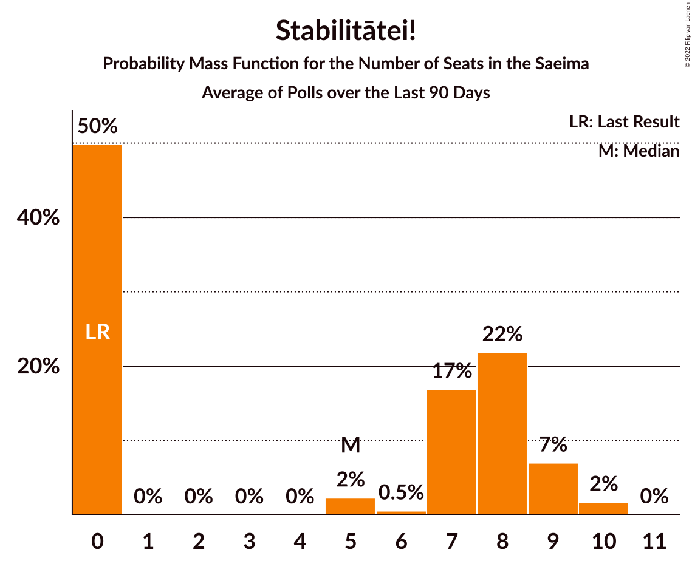

# Poll Average

<a href="#voting-intentions">Voting Intentions</a> | <a href="#seats">Seats</a> | <a href="#coalitions">Coalitions</a> | <a href="#technical-information">Technical Information</a>

## Summary

The table below lists the polls on which the average is based. They are the most recent polls (less than 90 days old) registered and analyzed so far.

| Period     | Polling firm/Commissioner(s) | SDPS | KPV | JKP | AP! | NA | ZZS | JV | LRA | LKS | P | NSL | VL | JS | LuK | LPV | R | S! | NST | SV |
|:----------:|:----------------------------:|:--:|:--:|:--:|:--:|:--:|:--:|:--:|:--:|:--:|:--:|:--:|:--:|:--:|:--:|:--:|:--:|:--:|:--:|:--:|
| 6 October 2018 | General Election | 19.8%   23 | 14.2%   16 | 13.6%   16 | 12.0%   13 | 11.0%   13 | 9.9%   11 | 6.7%   8 | 4.1%   0 | 3.2%   0 | 2.6%   0 | 0.8%   0 | 0.0%   0 | 0.0%   0 | 0.0%   0 | 0.0%   0 | 0.0%   0 | 0.0%   0 | 0.0%   0 | 0.0%   0 |
| N/A | Poll Average | 8–11%   11–14 | 0–1%   0 | 4–6%   0–7 | 6–9%   7–10 | 9–14%   11–17 | 6–11%   11–13 | 14–24%   17–27 | 7–10%   9–12 | 4–6%   0–8 | 6–10%   8–12 | N/A   N/A | N/A   N/A | N/A   N/A | 3–4%   0 | 3–6%   0 | 1–2%   0 | 5–7%   5–7 | N/A   N/A | 1–3%   0 |
| [4–6 September 2022](2022-09-06-FactumInteractive.html) | Factum Interactive | 8–11%   12–13 | 0–1%   0 | 4–6%   0–7 | 6–8%   7–9 | 9–12%   10–13 | 6–9%   10–11 | 20–24%   21–27 | 8–11%   10–12 | 4–6%   0–7 | 6–9%   8 | N/A   N/A | N/A   N/A | N/A   N/A | 2–4%   0 | 4–6%   0–6 | 1–2%   0 | 5–7%   6–7 | N/A   N/A | 1–2%   0 |
| [1–31 August 2022](2022-08-31-SKDS.html) | SKDS   Latvijas Televīzija | 8–11%   11–14 | N/A   N/A | 4–6%   0–7 | 7–9%   7–10 | 11–14%   13–17 | 9–12%   11–15 | 14–17%   17–20 | 7–9%   8–12 | 4–6%   0–8 | 8–10%   8–12 | N/A   N/A | N/A   N/A | N/A   N/A | 3–5%   0 | 3–4%   0 | N/A   N/A | 5–7%   0–8 | N/A   N/A | 2–3%   0 |
| 6 October 2018 | General Election | 19.8%   23 | 14.2%   16 | 13.6%   16 | 12.0%   13 | 11.0%   13 | 9.9%   11 | 6.7%   8 | 4.1%   0 | 3.2%   0 | 2.6%   0 | 0.8%   0 | 0.0%   0 | 0.0%   0 | 0.0%   0 | 0.0%   0 | 0.0%   0 | 0.0%   0 | 0.0%   0 | 0.0%   0 |

Only polls for which at least the sample size has been published are included in the table above.

**Legend:**
+ **Top half of each row:** Voting intentions (95% confidence interval)
+ **Bottom half of each row:** Seat projections for the Saeima (95% confidence interval)
+ **SDPS:** Sociāldemokrātiskā partija “Saskaņa”
+ **KPV:** Politiskā partija „KPV LV”
+ **JKP:** Jaunā konservatīvā partija
+ **AP!:** Attīstībai/Par!
+ **NA:** Nacionālā apvienība „Visu Latvijai!”–„Tēvzemei un Brīvībai/LNNK”
+ **ZZS:** Zaļo un Zemnieku savienība
+ **JV:** Jaunā VIENOTĪBA
+ **LRA:** Latvijas Reģionu Apvienība
+ **LKS:** Latvijas Krievu savienība
+ **P:** PROGRESĪVIE
+ **NSL:** No sirds Latvijai
+ **VL:** Vienoti Latvijai
+ **JS:** Jaunā Saskaņa
+ **LuK:** Likums un kārtība
+ **LPV:** Latvija pirmajā vietā
+ **R:** Republika
+ **S!:** Stabilitātei!
+ **NST:** Nacionālā Savienība Taisnīgums
+ **SV:** Suverēnā vara
+ **N/A (single party):** Party not included the published results
+ **N/A (entire row):** Calculation for this opinion poll not started yet

## Voting Intentions

### Confidence Intervals

| Party | Last Result | Median | 80% Confidence Interval | 90% Confidence Interval | 95% Confidence Interval | 99% Confidence Interval |
|:-----:|:-----------:|:------:|:-----------------------:|:-----------------------:|:-----------------------:|:-----------------------:|
| <a href="#sociāldemokrātiskā-partija-“saskaņa”">Sociāldemokrātiskā partija “Saskaņa”</a> | 19.8% | 9.3% | 8.3–10.3% |8.1–10.6% | 7.8–10.8% | 7.4–11.3% |
| <a href="#politiskā-partija-„kpv-lv”">Politiskā partija „KPV LV”</a> | 14.2% | 0.3% | 0.2–0.6% |0.1–0.6% | 0.1–0.7% | 0.1–0.9% |
| <a href="#jaunā-konservatīvā-partija">Jaunā konservatīvā partija</a> | 13.6% | 4.7% | 4.1–5.4% |3.9–5.7% | 3.8–5.9% | 3.5–6.2% |
| <a href="#attīstībai/par!">Attīstībai/Par!</a> | 12.0% | 7.5% | 6.4–8.5% |6.1–8.8% | 5.9–9.0% | 5.5–9.5% |
| <a href="#nacionālā-apvienība-„visu-latvijai!”–„tēvzemei-un-brīvībai/lnnk”">Nacionālā apvienība „Visu Latvijai!”–„Tēvzemei un Brīvībai/LNNK”</a> | 11.0% | 11.5% | 9.5–13.3% |9.2–13.6% | 8.9–13.9% | 8.4–14.5% |
| <a href="#zaļo-un-zemnieku-savienība">Zaļo un Zemnieku savienība</a> | 9.9% | 8.9% | 6.9–10.8% |6.6–11.1% | 6.4–11.3% | 6.0–11.9% |
| <a href="#jaunā-vienotība">Jaunā VIENOTĪBA</a> | 6.7% | 18.2% | 14.4–22.9% |14.1–23.4% | 13.8–23.8% | 13.3–24.6% |
| <a href="#latvijas-reģionu-apvienība">Latvijas Reģionu Apvienība</a> | 4.1% | 8.5% | 7.3–9.9% |7.0–10.2% | 6.8–10.5% | 6.5–11.1% |
| <a href="#latvijas-krievu-savienība">Latvijas Krievu savienība</a> | 3.2% | 4.9% | 4.2–5.8% |4.0–6.0% | 3.8–6.3% | 3.6–6.7% |
| <a href="#progresīvie">PROGRESĪVIE</a> | 2.6% | 8.1% | 6.8–9.4% |6.5–9.7% | 6.3–10.0% | 5.9–10.5% |
| <a href="#no-sirds-latvijai">No sirds Latvijai</a> | 0.8% | N/A | N/A |N/A | N/A | N/A |
| <a href="#vienoti-latvijai">Vienoti Latvijai</a> | 0.0% | N/A | N/A |N/A | N/A | N/A |
| <a href="#jaunā-saskaņa">Jaunā Saskaņa</a> | 0.0% | N/A | N/A |N/A | N/A | N/A |
| <a href="#likums-un-kārtība">Likums un kārtība</a> | 0.0% | 3.5% | 2.9–4.2% |2.7–4.4% | 2.6–4.5% | 2.3–4.9% |
| <a href="#latvija-pirmajā-vietā">Latvija pirmajā vietā</a> | 0.0% | 4.1% | 3.2–5.3% |3.0–5.6% | 2.9–5.8% | 2.6–6.3% |
| <a href="#republika">Republika</a> | 0.0% | 1.1% | 0.8–1.5% |0.7–1.6% | 0.6–1.7% | 0.5–2.0% |
| <a href="#stabilitātei!">Stabilitātei!</a> | 0.0% | 5.7% | 5.0–6.5% |4.8–6.8% | 4.6–7.0% | 4.3–7.5% |
| <a href="#nacionālā-savienība-taisnīgums">Nacionālā Savienība Taisnīgums</a> | 0.0% | N/A | N/A |N/A | N/A | N/A |
| <a href="#suverēnā-vara">Suverēnā vara</a> | 0.0% | 1.8% | 1.2–2.4% |1.1–2.6% | 1.0–2.8% | 0.8–3.0% |

### Sociāldemokrātiskā partija “Saskaņa”

*For a full overview of the results for this party, see the [Sociāldemokrātiskā partija “Saskaņa”](party-sociāldemokrātiskāpartija“saskaņa”.html) page.*

| Voting Intentions | Probability | Accumulated | Special Marks |
|:-----------------:|:-----------:|:-----------:|:-------------:|
| 5.5–6.5% | 0% | 100% |  |
| 6.5–7.5% | 0.9% | 100% |  |
| 7.5–8.5% | 15% | 99.1% |  |
| 8.5–9.5% | 46% | 85% | Median |
| 9.5–10.5% | 33% | 38% |  |
| 10.5–11.5% | 5% | 6% |  |
| 11.5–12.5% | 0.2% | 0.2% |  |
| 12.5–13.5% | 0% | 0% |  |
| 13.5–14.5% | 0% | 0% |  |
| 14.5–15.5% | 0% | 0% |  |
| 15.5–16.5% | 0% | 0% |  |
| 16.5–17.5% | 0% | 0% |  |
| 17.5–18.5% | 0% | 0% |  |
| 18.5–19.5% | 0% | 0% |  |
| 19.5–20.5% | 0% | 0% | Last Result |

### Politiskā partija „KPV LV”

*For a full overview of the results for this party, see the [Politiskā partija „KPV LV”](party-politiskāpartija„kpvlv”.html) page.*

| Voting Intentions | Probability | Accumulated | Special Marks |
|:-----------------:|:-----------:|:-----------:|:-------------:|
| 0.0–0.5% | 88% | 100% | Median |
| 0.5–1.5% | 12% | 12% |  |
| 1.5–2.5% | 0% | 0% |  |
| 2.5–3.5% | 0% | 0% |  |
| 3.5–4.5% | 0% | 0% |  |
| 4.5–5.5% | 0% | 0% |  |
| 5.5–6.5% | 0% | 0% |  |
| 6.5–7.5% | 0% | 0% |  |
| 7.5–8.5% | 0% | 0% |  |
| 8.5–9.5% | 0% | 0% |  |
| 9.5–10.5% | 0% | 0% |  |
| 10.5–11.5% | 0% | 0% |  |
| 11.5–12.5% | 0% | 0% |  |
| 12.5–13.5% | 0% | 0% |  |
| 13.5–14.5% | 0% | 0% | Last Result |

### Jaunā konservatīvā partija

*For a full overview of the results for this party, see the [Jaunā konservatīvā partija](party-jaunākonservatīvāpartija.html) page.*

| Voting Intentions | Probability | Accumulated | Special Marks |
|:-----------------:|:-----------:|:-----------:|:-------------:|
| 1.5–2.5% | 0% | 100% |  |
| 2.5–3.5% | 0.8% | 100% |  |
| 3.5–4.5% | 36% | 99.2% |  |
| 4.5–5.5% | 56% | 64% | Median |
| 5.5–6.5% | 7% | 7% |  |
| 6.5–7.5% | 0.1% | 0.1% |  |
| 7.5–8.5% | 0% | 0% |  |
| 8.5–9.5% | 0% | 0% |  |
| 9.5–10.5% | 0% | 0% |  |
| 10.5–11.5% | 0% | 0% |  |
| 11.5–12.5% | 0% | 0% |  |
| 12.5–13.5% | 0% | 0% |  |
| 13.5–14.5% | 0% | 0% | Last Result |

### Attīstībai/Par!

*For a full overview of the results for this party, see the [Attīstībai/Par!](party-attīstībaipar.html) page.*

| Voting Intentions | Probability | Accumulated | Special Marks |
|:-----------------:|:-----------:|:-----------:|:-------------:|
| 3.5–4.5% | 0% | 100% |  |
| 4.5–5.5% | 0.7% | 100% |  |
| 5.5–6.5% | 14% | 99.3% |  |
| 6.5–7.5% | 39% | 85% | Median |
| 7.5–8.5% | 37% | 46% |  |
| 8.5–9.5% | 9% | 9% |  |
| 9.5–10.5% | 0.4% | 0.4% |  |
| 10.5–11.5% | 0% | 0% |  |
| 11.5–12.5% | 0% | 0% | Last Result |

### Nacionālā apvienība „Visu Latvijai!”–„Tēvzemei un Brīvībai/LNNK”

*For a full overview of the results for this party, see the [Nacionālā apvienība „Visu Latvijai!”–„Tēvzemei un Brīvībai/LNNK”](party-nacionālāapvienība„visulatvijai”–„tēvzemeiunbrīvībailnnk”.html) page.*

| Voting Intentions | Probability | Accumulated | Special Marks |
|:-----------------:|:-----------:|:-----------:|:-------------:|
| 6.5–7.5% | 0% | 100% |  |
| 7.5–8.5% | 0.7% | 100% |  |
| 8.5–9.5% | 9% | 99.2% |  |
| 9.5–10.5% | 23% | 90% |  |
| 10.5–11.5% | 18% | 67% | Last Result, Median |
| 11.5–12.5% | 21% | 49% |  |
| 12.5–13.5% | 21% | 28% |  |
| 13.5–14.5% | 6% | 6% |  |
| 14.5–15.5% | 0.4% | 0.4% |  |
| 15.5–16.5% | 0% | 0% |  |

### Zaļo un Zemnieku savienība

*For a full overview of the results for this party, see the [Zaļo un Zemnieku savienība](party-zaļounzemniekusavienība.html) page.*

| Voting Intentions | Probability | Accumulated | Special Marks |
|:-----------------:|:-----------:|:-----------:|:-------------:|
| 4.5–5.5% | 0.1% | 100% |  |
| 5.5–6.5% | 4% | 99.9% |  |
| 6.5–7.5% | 22% | 96% |  |
| 7.5–8.5% | 21% | 74% |  |
| 8.5–9.5% | 13% | 53% | Median |
| 9.5–10.5% | 26% | 40% | Last Result |
| 10.5–11.5% | 13% | 14% |  |
| 11.5–12.5% | 1.3% | 1.3% |  |
| 12.5–13.5% | 0% | 0% |  |

### Jaunā VIENOTĪBA

*For a full overview of the results for this party, see the [Jaunā VIENOTĪBA](party-jaunāvienotība.html) page.*

| Voting Intentions | Probability | Accumulated | Special Marks |
|:-----------------:|:-----------:|:-----------:|:-------------:|
| 6.5–7.5% | 0% | 100% | Last Result |
| 7.5–8.5% | 0% | 100% |  |
| 8.5–9.5% | 0% | 100% |  |
| 9.5–10.5% | 0% | 100% |  |
| 10.5–11.5% | 0% | 100% |  |
| 11.5–12.5% | 0% | 100% |  |
| 12.5–13.5% | 1.3% | 100% |  |
| 13.5–14.5% | 11% | 98.7% |  |
| 14.5–15.5% | 22% | 88% |  |
| 15.5–16.5% | 13% | 65% |  |
| 16.5–17.5% | 2% | 52% |  |
| 17.5–18.5% | 0.2% | 50% | Median |
| 18.5–19.5% | 0.6% | 50% |  |
| 19.5–20.5% | 4% | 49% |  |
| 20.5–21.5% | 13% | 45% |  |
| 21.5–22.5% | 17% | 32% |  |
| 22.5–23.5% | 11% | 14% |  |
| 23.5–24.5% | 3% | 4% |  |
| 24.5–25.5% | 0.5% | 0.5% |  |
| 25.5–26.5% | 0% | 0% |  |

### Latvijas Reģionu Apvienība

*For a full overview of the results for this party, see the [Latvijas Reģionu Apvienība](party-latvijasreģionuapvienība.html) page.*

| Voting Intentions | Probability | Accumulated | Special Marks |
|:-----------------:|:-----------:|:-----------:|:-------------:|
| 3.5–4.5% | 0% | 100% | Last Result |
| 4.5–5.5% | 0% | 100% |  |
| 5.5–6.5% | 0.8% | 100% |  |
| 6.5–7.5% | 16% | 99.2% |  |
| 7.5–8.5% | 36% | 83% | Median |
| 8.5–9.5% | 30% | 47% |  |
| 9.5–10.5% | 14% | 17% |  |
| 10.5–11.5% | 2% | 2% |  |
| 11.5–12.5% | 0.1% | 0.1% |  |
| 12.5–13.5% | 0% | 0% |  |

### Latvijas Krievu savienība

*For a full overview of the results for this party, see the [Latvijas Krievu savienība](party-latvijaskrievusavienība.html) page.*

| Voting Intentions | Probability | Accumulated | Special Marks |
|:-----------------:|:-----------:|:-----------:|:-------------:|
| 1.5–2.5% | 0% | 100% |  |
| 2.5–3.5% | 0.4% | 100% | Last Result |
| 3.5–4.5% | 27% | 99.6% |  |
| 4.5–5.5% | 55% | 72% | Median |
| 5.5–6.5% | 16% | 17% |  |
| 6.5–7.5% | 1.0% | 1.0% |  |
| 7.5–8.5% | 0% | 0% |  |

### PROGRESĪVIE

*For a full overview of the results for this party, see the [PROGRESĪVIE](party-progresīvie.html) page.*

| Voting Intentions | Probability | Accumulated | Special Marks |
|:-----------------:|:-----------:|:-----------:|:-------------:|
| 2.5–3.5% | 0% | 100% | Last Result |
| 3.5–4.5% | 0% | 100% |  |
| 4.5–5.5% | 0.1% | 100% |  |
| 5.5–6.5% | 6% | 99.9% |  |
| 6.5–7.5% | 25% | 94% |  |
| 7.5–8.5% | 33% | 69% | Median |
| 8.5–9.5% | 29% | 36% |  |
| 9.5–10.5% | 7% | 7% |  |
| 10.5–11.5% | 0.4% | 0.4% |  |
| 11.5–12.5% | 0% | 0% |  |

### Likums un kārtība

*For a full overview of the results for this party, see the [Likums un kārtība](party-likumsunkārtība.html) page.*

| Voting Intentions | Probability | Accumulated | Special Marks |
|:-----------------:|:-----------:|:-----------:|:-------------:|
| 0.0–0.5% | 0% | 100% | Last Result |
| 0.5–1.5% | 0% | 100% |  |
| 1.5–2.5% | 2% | 100% |  |
| 2.5–3.5% | 50% | 98% |  |
| 3.5–4.5% | 46% | 48% | Median |
| 4.5–5.5% | 2% | 2% |  |
| 5.5–6.5% | 0% | 0% |  |

### Latvija pirmajā vietā

*For a full overview of the results for this party, see the [Latvija pirmajā vietā](party-latvijapirmajāvietā.html) page.*

| Voting Intentions | Probability | Accumulated | Special Marks |
|:-----------------:|:-----------:|:-----------:|:-------------:|
| 0.0–0.5% | 0% | 100% | Last Result |
| 0.5–1.5% | 0% | 100% |  |
| 1.5–2.5% | 0.2% | 100% |  |
| 2.5–3.5% | 25% | 99.8% |  |
| 3.5–4.5% | 40% | 75% | Median |
| 4.5–5.5% | 29% | 34% |  |
| 5.5–6.5% | 5% | 5% |  |
| 6.5–7.5% | 0.1% | 0.1% |  |
| 7.5–8.5% | 0% | 0% |  |

### Republika

*For a full overview of the results for this party, see the [Republika](party-republika.html) page.*

| Voting Intentions | Probability | Accumulated | Special Marks |
|:-----------------:|:-----------:|:-----------:|:-------------:|
| 0.0–0.5% | 0.6% | 100% | Last Result |
| 0.5–1.5% | 92% | 99.4% | Median |
| 1.5–2.5% | 8% | 8% |  |
| 2.5–3.5% | 0% | 0% |  |

### Stabilitātei!

*For a full overview of the results for this party, see the [Stabilitātei!](party-stabilitātei.html) page.*

| Voting Intentions | Probability | Accumulated | Special Marks |
|:-----------------:|:-----------:|:-----------:|:-------------:|
| 0.0–0.5% | 0% | 100% | Last Result |
| 0.5–1.5% | 0% | 100% |  |
| 1.5–2.5% | 0% | 100% |  |
| 2.5–3.5% | 0% | 100% |  |
| 3.5–4.5% | 2% | 100% |  |
| 4.5–5.5% | 38% | 98% |  |
| 5.5–6.5% | 51% | 60% | Median |
| 6.5–7.5% | 9% | 9% |  |
| 7.5–8.5% | 0.4% | 0.4% |  |
| 8.5–9.5% | 0% | 0% |  |

### Suverēnā vara

*For a full overview of the results for this party, see the [Suverēnā vara](party-suverēnāvara.html) page.*

| Voting Intentions | Probability | Accumulated | Special Marks |
|:-----------------:|:-----------:|:-----------:|:-------------:|
| 0.0–0.5% | 0% | 100% | Last Result |
| 0.5–1.5% | 32% | 100% |  |
| 1.5–2.5% | 62% | 68% | Median |
| 2.5–3.5% | 7% | 7% |  |
| 3.5–4.5% | 0% | 0% |  |

## Seats

### Confidence Intervals

| Party | Last Result | Median | 80% Confidence Interval | 90% Confidence Interval | 95% Confidence Interval | 99% Confidence Interval |
|:-----:|:-----------:|:------:|:-----------------------:|:-----------------------:|:-----------------------:|:-----------------------:|
| <a href="#sociāldemokrātiskā-partija-“saskaņa”">Sociāldemokrātiskā partija “Saskaņa”</a> | 23 | 13 | 13–14 |12–14 | 11–14 | 9–15 |
| <a href="#politiskā-partija-„kpv-lv”">Politiskā partija „KPV LV”</a> | 16 | 0 | 0 |0 | 0 | 0 |
| <a href="#jaunā-konservatīvā-partija">Jaunā konservatīvā partija</a> | 16 | 0 | 0–7 |0–7 | 0–7 | 0–7 |
| <a href="#attīstībai/par!">Attīstībai/Par!</a> | 13 | 9 | 7–9 |7–10 | 7–10 | 7–11 |
| <a href="#nacionālā-apvienība-„visu-latvijai!”–„tēvzemei-un-brīvībai/lnnk”">Nacionālā apvienība „Visu Latvijai!”–„Tēvzemei un Brīvībai/LNNK”</a> | 13 | 13 | 13–16 |13–16 | 11–17 | 10–17 |
| <a href="#zaļo-un-zemnieku-savienība">Zaļo un Zemnieku savienība</a> | 11 | 11 | 11 |11–12 | 11–13 | 6–16 |
| <a href="#jaunā-vienotība">Jaunā VIENOTĪBA</a> | 8 | 21 | 17–27 |17–27 | 17–27 | 17–27 |
| <a href="#latvijas-reģionu-apvienība">Latvijas Reģionu Apvienība</a> | 0 | 11 | 10–12 |10–12 | 9–12 | 7–13 |
| <a href="#latvijas-krievu-savienība">Latvijas Krievu savienība</a> | 0 | 0 | 0 |0–7 | 0–8 | 0–8 |
| <a href="#progresīvie">PROGRESĪVIE</a> | 0 | 8 | 8–11 |8–11 | 8–12 | 8–13 |
| <a href="#no-sirds-latvijai">No sirds Latvijai</a> | 0 | N/A | N/A |N/A | N/A | N/A |
| <a href="#vienoti-latvijai">Vienoti Latvijai</a> | 0 | N/A | N/A |N/A | N/A | N/A |
| <a href="#jaunā-saskaņa">Jaunā Saskaņa</a> | 0 | N/A | N/A |N/A | N/A | N/A |
| <a href="#likums-un-kārtība">Likums un kārtība</a> | 0 | 0 | 0 |0 | 0 | 0 |
| <a href="#latvija-pirmajā-vietā">Latvija pirmajā vietā</a> | 0 | 0 | 0 |0 | 0 | 0–6 |
| <a href="#republika">Republika</a> | 0 | 0 | 0 |0 | 0 | 0 |
| <a href="#stabilitātei!">Stabilitātei!</a> | 0 | 7 | 7 |6–7 | 5–7 | 0–9 |
| <a href="#nacionālā-savienība-taisnīgums">Nacionālā Savienība Taisnīgums</a> | 0 | N/A | N/A |N/A | N/A | N/A |
| <a href="#suverēnā-vara">Suverēnā vara</a> | 0 | 0 | 0 |0 | 0 | 0 |

### Sociāldemokrātiskā partija “Saskaņa”

*For a full overview of the results for this party, see the [Sociāldemokrātiskā partija “Saskaņa”](party-sociāldemokrātiskāpartija“saskaņa”.html) page.*

| Number of Seats | Probability | Accumulated | Special Marks |
|:---------------:|:-----------:|:-----------:|:-------------:|
| 9 | 0.5% | 100% |  |
| 10 | 2% | 99.5% |  |
| 11 | 0.9% | 98% |  |
| 12 | 5% | 97% |  |
| 13 | 50% | 92% | Median |
| 14 | 41% | 42% |  |
| 15 | 1.1% | 1.2% |  |
| 16 | 0.1% | 0.1% |  |
| 17 | 0% | 0% |  |
| 18 | 0% | 0% |  |
| 19 | 0% | 0% |  |
| 20 | 0% | 0% |  |
| 21 | 0% | 0% |  |
| 22 | 0% | 0% |  |
| 23 | 0% | 0% | Last Result |

### Politiskā partija „KPV LV”

*For a full overview of the results for this party, see the [Politiskā partija „KPV LV”](party-politiskāpartija„kpvlv”.html) page.*

| Number of Seats | Probability | Accumulated | Special Marks |
|:---------------:|:-----------:|:-----------:|:-------------:|
| 0 | 100% | 100% | Median |
| 1 | 0% | 0% |  |
| 2 | 0% | 0% |  |
| 3 | 0% | 0% |  |
| 4 | 0% | 0% |  |
| 5 | 0% | 0% |  |
| 6 | 0% | 0% |  |
| 7 | 0% | 0% |  |
| 8 | 0% | 0% |  |
| 9 | 0% | 0% |  |
| 10 | 0% | 0% |  |
| 11 | 0% | 0% |  |
| 12 | 0% | 0% |  |
| 13 | 0% | 0% |  |
| 14 | 0% | 0% |  |
| 15 | 0% | 0% |  |
| 16 | 0% | 0% | Last Result |

### Jaunā konservatīvā partija

*For a full overview of the results for this party, see the [Jaunā konservatīvā partija](party-jaunākonservatīvāpartija.html) page.*

| Number of Seats | Probability | Accumulated | Special Marks |
|:---------------:|:-----------:|:-----------:|:-------------:|
| 0 | 55% | 100% | Median |
| 1 | 0% | 45% |  |
| 2 | 0% | 45% |  |
| 3 | 0% | 45% |  |
| 4 | 0% | 45% |  |
| 5 | 0% | 45% |  |
| 6 | 1.2% | 45% |  |
| 7 | 44% | 44% |  |
| 8 | 0.1% | 0.1% |  |
| 9 | 0% | 0% |  |
| 10 | 0% | 0% |  |
| 11 | 0% | 0% |  |
| 12 | 0% | 0% |  |
| 13 | 0% | 0% |  |
| 14 | 0% | 0% |  |
| 15 | 0% | 0% |  |
| 16 | 0% | 0% | Last Result |

### Attīstībai/Par!

*For a full overview of the results for this party, see the [Attīstībai/Par!](party-attīstībaipar.html) page.*

| Number of Seats | Probability | Accumulated | Special Marks |
|:---------------:|:-----------:|:-----------:|:-------------:|
| 7 | 41% | 100% |  |
| 8 | 3% | 59% |  |
| 9 | 50% | 56% | Median |
| 10 | 5% | 6% |  |
| 11 | 0.4% | 0.9% |  |
| 12 | 0.1% | 0.5% |  |
| 13 | 0.4% | 0.4% | Last Result |
| 14 | 0% | 0% |  |

### Nacionālā apvienība „Visu Latvijai!”–„Tēvzemei un Brīvībai/LNNK”

*For a full overview of the results for this party, see the [Nacionālā apvienība „Visu Latvijai!”–„Tēvzemei un Brīvībai/LNNK”](party-nacionālāapvienība„visulatvijai”–„tēvzemeiunbrīvībailnnk”.html) page.*

| Number of Seats | Probability | Accumulated | Special Marks |
|:---------------:|:-----------:|:-----------:|:-------------:|
| 10 | 2% | 100% |  |
| 11 | 1.3% | 98% |  |
| 12 | 0.1% | 97% |  |
| 13 | 49% | 97% | Last Result, Median |
| 14 | 2% | 48% |  |
| 15 | 2% | 45% |  |
| 16 | 40% | 43% |  |
| 17 | 3% | 4% |  |
| 18 | 0.1% | 0.2% |  |
| 19 | 0% | 0.1% |  |
| 20 | 0.1% | 0.1% |  |
| 21 | 0% | 0% |  |

### Zaļo un Zemnieku savienība

*For a full overview of the results for this party, see the [Zaļo un Zemnieku savienība](party-zaļounzemniekusavienība.html) page.*

| Number of Seats | Probability | Accumulated | Special Marks |
|:---------------:|:-----------:|:-----------:|:-------------:|
| 6 | 0.6% | 100% |  |
| 7 | 0.1% | 99.4% |  |
| 8 | 0.5% | 99.3% |  |
| 9 | 0% | 98.8% |  |
| 10 | 0.2% | 98.8% |  |
| 11 | 90% | 98.6% | Last Result, Median |
| 12 | 5% | 8% |  |
| 13 | 1.2% | 4% |  |
| 14 | 0.1% | 2% |  |
| 15 | 1.0% | 2% |  |
| 16 | 0.9% | 1.2% |  |
| 17 | 0.3% | 0.3% |  |
| 18 | 0% | 0% |  |

### Jaunā VIENOTĪBA

*For a full overview of the results for this party, see the [Jaunā VIENOTĪBA](party-jaunāvienotība.html) page.*

| Number of Seats | Probability | Accumulated | Special Marks |
|:---------------:|:-----------:|:-----------:|:-------------:|
| 8 | 0% | 100% | Last Result |
| 9 | 0% | 100% |  |
| 10 | 0% | 100% |  |
| 11 | 0% | 100% |  |
| 12 | 0% | 100% |  |
| 13 | 0% | 100% |  |
| 14 | 0% | 100% |  |
| 15 | 0.1% | 100% |  |
| 16 | 0.2% | 99.9% |  |
| 17 | 37% | 99.8% |  |
| 18 | 4% | 62% |  |
| 19 | 7% | 58% |  |
| 20 | 0.4% | 51% |  |
| 21 | 2% | 51% | Median |
| 22 | 0.9% | 49% |  |
| 23 | 0.4% | 48% |  |
| 24 | 0.3% | 48% |  |
| 25 | 0.1% | 47% |  |
| 26 | 0.7% | 47% |  |
| 27 | 46% | 47% |  |
| 28 | 0.1% | 0.2% |  |
| 29 | 0.1% | 0.1% |  |
| 30 | 0% | 0% |  |

### Latvijas Reģionu Apvienība

*For a full overview of the results for this party, see the [Latvijas Reģionu Apvienība](party-latvijasreģionuapvienība.html) page.*

| Number of Seats | Probability | Accumulated | Special Marks |
|:---------------:|:-----------:|:-----------:|:-------------:|
| 0 | 0% | 100% | Last Result |
| 1 | 0% | 100% |  |
| 2 | 0% | 100% |  |
| 3 | 0% | 100% |  |
| 4 | 0% | 100% |  |
| 5 | 0% | 100% |  |
| 6 | 0% | 100% |  |
| 7 | 0.6% | 100% |  |
| 8 | 1.3% | 99.4% |  |
| 9 | 3% | 98% |  |
| 10 | 43% | 95% |  |
| 11 | 4% | 52% | Median |
| 12 | 47% | 48% |  |
| 13 | 0.5% | 0.5% |  |
| 14 | 0.1% | 0.1% |  |
| 15 | 0% | 0% |  |

### Latvijas Krievu savienība

*For a full overview of the results for this party, see the [Latvijas Krievu savienība](party-latvijaskrievusavienība.html) page.*

| Number of Seats | Probability | Accumulated | Special Marks |
|:---------------:|:-----------:|:-----------:|:-------------:|
| 0 | 94% | 100% | Last Result, Median |
| 1 | 0% | 6% |  |
| 2 | 0% | 6% |  |
| 3 | 0% | 6% |  |
| 4 | 0% | 6% |  |
| 5 | 0% | 6% |  |
| 6 | 0.1% | 6% |  |
| 7 | 1.3% | 6% |  |
| 8 | 5% | 5% |  |
| 9 | 0% | 0% |  |

### PROGRESĪVIE

*For a full overview of the results for this party, see the [PROGRESĪVIE](party-progresīvie.html) page.*

| Number of Seats | Probability | Accumulated | Special Marks |
|:---------------:|:-----------:|:-----------:|:-------------:|
| 0 | 0% | 100% | Last Result |
| 1 | 0% | 100% |  |
| 2 | 0% | 100% |  |
| 3 | 0% | 100% |  |
| 4 | 0% | 100% |  |
| 5 | 0% | 100% |  |
| 6 | 0% | 100% |  |
| 7 | 0.4% | 100% |  |
| 8 | 52% | 99.6% | Median |
| 9 | 2% | 48% |  |
| 10 | 2% | 45% |  |
| 11 | 40% | 44% |  |
| 12 | 3% | 4% |  |
| 13 | 0.7% | 0.9% |  |
| 14 | 0.1% | 0.2% |  |
| 15 | 0% | 0% |  |

### No sirds Latvijai

*For a full overview of the results for this party, see the [No sirds Latvijai](party-nosirdslatvijai.html) page.*

### Vienoti Latvijai

*For a full overview of the results for this party, see the [Vienoti Latvijai](party-vienotilatvijai.html) page.*

### Jaunā Saskaņa

*For a full overview of the results for this party, see the [Jaunā Saskaņa](party-jaunāsaskaņa.html) page.*

### Likums un kārtība

*For a full overview of the results for this party, see the [Likums un kārtība](party-likumsunkārtība.html) page.*

| Number of Seats | Probability | Accumulated | Special Marks |
|:---------------:|:-----------:|:-----------:|:-------------:|
| 0 | 100% | 100% | Last Result, Median |

### Latvija pirmajā vietā

*For a full overview of the results for this party, see the [Latvija pirmajā vietā](party-latvijapirmajāvietā.html) page.*

| Number of Seats | Probability | Accumulated | Special Marks |
|:---------------:|:-----------:|:-----------:|:-------------:|
| 0 | 98% | 100% | Last Result, Median |
| 1 | 0% | 2% |  |
| 2 | 0% | 2% |  |
| 3 | 0% | 2% |  |
| 4 | 0% | 2% |  |
| 5 | 0.2% | 2% |  |
| 6 | 2% | 2% |  |
| 7 | 0.1% | 0.1% |  |
| 8 | 0% | 0% |  |

### Republika

*For a full overview of the results for this party, see the [Republika](party-republika.html) page.*

| Number of Seats | Probability | Accumulated | Special Marks |
|:---------------:|:-----------:|:-----------:|:-------------:|
| 0 | 100% | 100% | Last Result, Median |

### Stabilitātei!

*For a full overview of the results for this party, see the [Stabilitātei!](party-stabilitātei.html) page.*

| Number of Seats | Probability | Accumulated | Special Marks |
|:---------------:|:-----------:|:-----------:|:-------------:|
| 0 | 2% | 100% | Last Result |
| 1 | 0% | 98% |  |
| 2 | 0% | 98% |  |
| 3 | 0% | 98% |  |
| 4 | 0% | 98% |  |
| 5 | 2% | 98% |  |
| 6 | 3% | 96% |  |
| 7 | 92% | 93% | Median |
| 8 | 0.8% | 2% |  |
| 9 | 0.8% | 1.2% |  |
| 10 | 0.4% | 0.4% |  |
| 11 | 0% | 0% |  |

### Nacionālā Savienība Taisnīgums

*For a full overview of the results for this party, see the [Nacionālā Savienība Taisnīgums](party-nacionālāsavienībataisnīgums.html) page.*

### Suverēnā vara

*For a full overview of the results for this party, see the [Suverēnā vara](party-suverēnāvara.html) page.*

| Number of Seats | Probability | Accumulated | Special Marks |
|:---------------:|:-----------:|:-----------:|:-------------:|
| 0 | 100% | 100% | Last Result, Median |

## Coalitions

### Confidence Intervals

| Coalition | Last Result | Median | Majority? | 80% Confidence Interval | 90% Confidence Interval | 95% Confidence Interval | 99% Confidence Interval |
|:---------:|:-----------:|:------:|:---------:|:-----------------------:|:-----------------------:|:-----------------------:|:-----------------------:|
| Jaunā konservatīvā partija – Attīstībai/Par! – Nacionālā apvienība „Visu Latvijai!”–„Tēvzemei un Brīvībai/LNNK” – Zaļo un Zemnieku savienība – Jaunā VIENOTĪBA | 61 | 60 | 99.9% | 58–60 | 56–60 | 55–61 | 53–63 |
| Attīstībai/Par! – Nacionālā apvienība „Visu Latvijai!”–„Tēvzemei un Brīvībai/LNNK” – Zaļo un Zemnieku savienība – Jaunā VIENOTĪBA | 45 | 58 | 98% | 51–60 | 51–60 | 51–60 | 49–61 |
| Jaunā konservatīvā partija – Nacionālā apvienība „Visu Latvijai!”–„Tēvzemei un Brīvībai/LNNK” – Zaļo un Zemnieku savienība – Jaunā VIENOTĪBA | 48 | 51 | 87% | 49–51 | 48–51 | 47–52 | 45–54 |
| Nacionālā apvienība „Visu Latvijai!”–„Tēvzemei un Brīvībai/LNNK” – Zaļo un Zemnieku savienība – Jaunā VIENOTĪBA | 32 | 48 | 47% | 44–51 | 43–51 | 43–51 | 42–52 |
| Jaunā konservatīvā partija – Attīstībai/Par! – Nacionālā apvienība „Visu Latvijai!”–„Tēvzemei un Brīvībai/LNNK” – Jaunā VIENOTĪBA | 50 | 48 | 2% | 46–49 | 45–49 | 43–50 | 42–52 |
| Politiskā partija „KPV LV” – Jaunā konservatīvā partija – Attīstībai/Par! – Nacionālā apvienība „Visu Latvijai!”–„Tēvzemei un Brīvībai/LNNK” – Jaunā VIENOTĪBA | 66 | 48 | 2% | 46–49 | 45–49 | 43–50 | 42–52 |
| Politiskā partija „KPV LV” – Attīstībai/Par! – Nacionālā apvienība „Visu Latvijai!”–„Tēvzemei un Brīvībai/LNNK” – Jaunā VIENOTĪBA | 50 | 45 | 0% | 40–49 | 40–49 | 40–49 | 38–49 |
| Jaunā konservatīvā partija – Attīstībai/Par! – Nacionālā apvienība „Visu Latvijai!”–„Tēvzemei un Brīvībai/LNNK” – Zaļo un Zemnieku savienība | 53 | 35 | 0% | 33–41 | 33–41 | 33–42 | 29–44 |
| Politiskā partija „KPV LV” – Jaunā konservatīvā partija – Nacionālā apvienība „Visu Latvijai!”–„Tēvzemei un Brīvībai/LNNK” – Jaunā VIENOTĪBA | 53 | 40 | 0% | 38–40 | 36–40 | 34–40 | 33–44 |
| Attīstībai/Par! – Nacionālā apvienība „Visu Latvijai!”–„Tēvzemei un Brīvībai/LNNK” – Zaļo un Zemnieku savienība | 37 | 33 | 0% | 33–35 | 32–38 | 28–39 | 26–41 |
| Politiskā partija „KPV LV” – Jaunā konservatīvā partija – Attīstībai/Par! – Jaunā VIENOTĪBA | 53 | 35 | 0% | 31–36 | 29–36 | 28–36 | 26–40 |
| Jaunā konservatīvā partija – Nacionālā apvienība „Visu Latvijai!”–„Tēvzemei un Brīvībai/LNNK” – Zaļo un Zemnieku savienība | 40 | 28 | 0% | 24–34 | 24–34 | 24–34 | 22–35 |
| Politiskā partija „KPV LV” – Jaunā konservatīvā partija – Attīstībai/Par! – Nacionālā apvienība „Visu Latvijai!”–„Tēvzemei un Brīvībai/LNNK” | 58 | 24 | 0% | 22–30 | 22–30 | 22–30 | 18–33 |
| Sociāldemokrātiskā partija “Saskaņa” – Jaunā konservatīvā partija – Attīstībai/Par! | 52 | 23 | 0% | 22–28 | 22–28 | 22–28 | 20–30 |
| Sociāldemokrātiskā partija “Saskaņa” – Politiskā partija „KPV LV” – Zaļo un Zemnieku savienība | 50 | 24 | 0% | 24–25 | 23–25 | 21–27 | 17–30 |
| Sociāldemokrātiskā partija “Saskaņa” – Attīstībai/Par! | 36 | 22 | 0% | 21–22 | 20–23 | 19–24 | 16–26 |
| Sociāldemokrātiskā partija “Saskaņa” – Politiskā partija „KPV LV” | 39 | 13 | 0% | 13–14 | 12–14 | 11–14 | 9–15 |

### Jaunā konservatīvā partija – Attīstībai/Par! – Nacionālā apvienība „Visu Latvijai!”–„Tēvzemei un Brīvībai/LNNK” – Zaļo un Zemnieku savienība – Jaunā VIENOTĪBA

| Number of Seats | Probability | Accumulated | Special Marks |
|:---------------:|:-----------:|:-----------:|:-------------:|
| 50 | 0% | 100% |  |
| 51 | 0.3% | 99.9% | Majority |
| 52 | 0% | 99.7% |  |
| 53 | 0.2% | 99.6% |  |
| 54 | 0.7% | 99.4% | Median |
| 55 | 2% | 98.8% |  |
| 56 | 3% | 97% |  |
| 57 | 1.4% | 94% |  |
| 58 | 39% | 93% |  |
| 59 | 3% | 53% |  |
| 60 | 47% | 50% |  |
| 61 | 2% | 3% | Last Result |
| 62 | 0.9% | 2% |  |
| 63 | 0.4% | 0.8% |  |
| 64 | 0.1% | 0.4% |  |
| 65 | 0.2% | 0.3% |  |
| 66 | 0% | 0% |  |

### Attīstībai/Par! – Nacionālā apvienība „Visu Latvijai!”–„Tēvzemei un Brīvībai/LNNK” – Zaļo un Zemnieku savienība – Jaunā VIENOTĪBA

| Number of Seats | Probability | Accumulated | Special Marks |
|:---------------:|:-----------:|:-----------:|:-------------:|
| 45 | 0% | 100% | Last Result |
| 46 | 0% | 100% |  |
| 47 | 0% | 100% |  |
| 48 | 0% | 100% |  |
| 49 | 2% | 99.9% |  |
| 50 | 0.2% | 98% |  |
| 51 | 38% | 98% | Majority |
| 52 | 2% | 59% |  |
| 53 | 1.3% | 58% |  |
| 54 | 1.0% | 56% | Median |
| 55 | 3% | 55% |  |
| 56 | 1.2% | 53% |  |
| 57 | 0.4% | 51% |  |
| 58 | 2% | 51% |  |
| 59 | 1.0% | 49% |  |
| 60 | 46% | 48% |  |
| 61 | 1.2% | 1.4% |  |
| 62 | 0% | 0.2% |  |
| 63 | 0.1% | 0.1% |  |
| 64 | 0% | 0.1% |  |
| 65 | 0% | 0.1% |  |
| 66 | 0% | 0% |  |

### Jaunā konservatīvā partija – Nacionālā apvienība „Visu Latvijai!”–„Tēvzemei un Brīvībai/LNNK” – Zaļo un Zemnieku savienība – Jaunā VIENOTĪBA

| Number of Seats | Probability | Accumulated | Special Marks |
|:---------------:|:-----------:|:-----------:|:-------------:|
| 43 | 0.3% | 100% |  |
| 44 | 0.1% | 99.6% |  |
| 45 | 0.7% | 99.5% | Median |
| 46 | 0.8% | 98.8% |  |
| 47 | 2% | 98% |  |
| 48 | 2% | 96% | Last Result |
| 49 | 5% | 94% |  |
| 50 | 2% | 89% |  |
| 51 | 84% | 87% | Majority |
| 52 | 3% | 3% |  |
| 53 | 0.2% | 0.8% |  |
| 54 | 0.3% | 0.6% |  |
| 55 | 0.2% | 0.3% |  |
| 56 | 0.1% | 0.1% |  |
| 57 | 0% | 0.1% |  |
| 58 | 0% | 0% |  |

### Nacionālā apvienība „Visu Latvijai!”–„Tēvzemei un Brīvībai/LNNK” – Zaļo un Zemnieku savienība – Jaunā VIENOTĪBA

| Number of Seats | Probability | Accumulated | Special Marks |
|:---------------:|:-----------:|:-----------:|:-------------:|
| 32 | 0% | 100% | Last Result |
| 33 | 0% | 100% |  |
| 34 | 0% | 100% |  |
| 35 | 0% | 100% |  |
| 36 | 0% | 100% |  |
| 37 | 0% | 100% |  |
| 38 | 0% | 100% |  |
| 39 | 0% | 100% |  |
| 40 | 0% | 100% |  |
| 41 | 0% | 99.9% |  |
| 42 | 2% | 99.9% |  |
| 43 | 3% | 98% |  |
| 44 | 37% | 95% |  |
| 45 | 3% | 57% | Median |
| 46 | 0.9% | 55% |  |
| 47 | 2% | 54% |  |
| 48 | 2% | 51% |  |
| 49 | 2% | 49% |  |
| 50 | 0.4% | 48% |  |
| 51 | 46% | 47% | Majority |
| 52 | 0.8% | 0.9% |  |
| 53 | 0% | 0.1% |  |
| 54 | 0% | 0.1% |  |
| 55 | 0.1% | 0.1% |  |
| 56 | 0% | 0% |  |

### Jaunā konservatīvā partija – Attīstībai/Par! – Nacionālā apvienība „Visu Latvijai!”–„Tēvzemei un Brīvībai/LNNK” – Jaunā VIENOTĪBA

| Number of Seats | Probability | Accumulated | Special Marks |
|:---------------:|:-----------:|:-----------:|:-------------:|
| 40 | 0.1% | 100% |  |
| 41 | 0.3% | 99.9% |  |
| 42 | 0.7% | 99.5% |  |
| 43 | 2% | 98.9% | Median |
| 44 | 0.9% | 97% |  |
| 45 | 3% | 96% |  |
| 46 | 4% | 93% |  |
| 47 | 38% | 89% |  |
| 48 | 2% | 51% |  |
| 49 | 47% | 49% |  |
| 50 | 0.8% | 3% | Last Result |
| 51 | 1.3% | 2% | Majority |
| 52 | 0.2% | 0.5% |  |
| 53 | 0.1% | 0.3% |  |
| 54 | 0.1% | 0.2% |  |
| 55 | 0% | 0.1% |  |
| 56 | 0% | 0.1% |  |
| 57 | 0% | 0% |  |

### Politiskā partija „KPV LV” – Jaunā konservatīvā partija – Attīstībai/Par! – Nacionālā apvienība „Visu Latvijai!”–„Tēvzemei un Brīvībai/LNNK” – Jaunā VIENOTĪBA

| Number of Seats | Probability | Accumulated | Special Marks |
|:---------------:|:-----------:|:-----------:|:-------------:|
| 40 | 0.1% | 100% |  |
| 41 | 0.3% | 99.9% |  |
| 42 | 0.7% | 99.5% |  |
| 43 | 2% | 98.9% | Median |
| 44 | 0.9% | 97% |  |
| 45 | 3% | 96% |  |
| 46 | 4% | 93% |  |
| 47 | 38% | 89% |  |
| 48 | 2% | 51% |  |
| 49 | 47% | 49% |  |
| 50 | 0.8% | 3% |  |
| 51 | 1.3% | 2% | Majority |
| 52 | 0.2% | 0.5% |  |
| 53 | 0.1% | 0.3% |  |
| 54 | 0.1% | 0.2% |  |
| 55 | 0% | 0.1% |  |
| 56 | 0% | 0.1% |  |
| 57 | 0% | 0% |  |
| 58 | 0% | 0% |  |
| 59 | 0% | 0% |  |
| 60 | 0% | 0% |  |
| 61 | 0% | 0% |  |
| 62 | 0% | 0% |  |
| 63 | 0% | 0% |  |
| 64 | 0% | 0% |  |
| 65 | 0% | 0% |  |
| 66 | 0% | 0% | Last Result |

### Politiskā partija „KPV LV” – Attīstībai/Par! – Nacionālā apvienība „Visu Latvijai!”–„Tēvzemei un Brīvībai/LNNK” – Jaunā VIENOTĪBA

| Number of Seats | Probability | Accumulated | Special Marks |
|:---------------:|:-----------:|:-----------:|:-------------:|
| 38 | 2% | 100% |  |
| 39 | 0.2% | 98% |  |
| 40 | 38% | 98% |  |
| 41 | 2% | 60% |  |
| 42 | 1.5% | 58% |  |
| 43 | 3% | 56% | Median |
| 44 | 2% | 53% |  |
| 45 | 1.3% | 51% |  |
| 46 | 3% | 50% |  |
| 47 | 0.6% | 47% |  |
| 48 | 0.5% | 47% |  |
| 49 | 46% | 46% |  |
| 50 | 0.2% | 0.2% | Last Result |
| 51 | 0% | 0% | Majority |

### Jaunā konservatīvā partija – Attīstībai/Par! – Nacionālā apvienība „Visu Latvijai!”–„Tēvzemei un Brīvībai/LNNK” – Zaļo un Zemnieku savienība

| Number of Seats | Probability | Accumulated | Special Marks |
|:---------------:|:-----------:|:-----------:|:-------------:|
| 26 | 0% | 100% |  |
| 27 | 0.3% | 99.9% |  |
| 28 | 0.1% | 99.7% |  |
| 29 | 0.5% | 99.6% |  |
| 30 | 0.2% | 99.2% |  |
| 31 | 0.2% | 99.0% |  |
| 32 | 0.2% | 98.8% |  |
| 33 | 46% | 98.6% | Median |
| 34 | 0.1% | 52% |  |
| 35 | 2% | 52% |  |
| 36 | 0.8% | 50% |  |
| 37 | 2% | 49% |  |
| 38 | 2% | 47% |  |
| 39 | 3% | 46% |  |
| 40 | 1.2% | 43% |  |
| 41 | 39% | 42% |  |
| 42 | 1.1% | 3% |  |
| 43 | 0.4% | 2% |  |
| 44 | 1.2% | 1.5% |  |
| 45 | 0.2% | 0.3% |  |
| 46 | 0.1% | 0.1% |  |
| 47 | 0% | 0% |  |
| 48 | 0% | 0% |  |
| 49 | 0% | 0% |  |
| 50 | 0% | 0% |  |
| 51 | 0% | 0% | Majority |
| 52 | 0% | 0% |  |
| 53 | 0% | 0% | Last Result |

### Politiskā partija „KPV LV” – Jaunā konservatīvā partija – Nacionālā apvienība „Visu Latvijai!”–„Tēvzemei un Brīvībai/LNNK” – Jaunā VIENOTĪBA

| Number of Seats | Probability | Accumulated | Special Marks |
|:---------------:|:-----------:|:-----------:|:-------------:|
| 31 | 0.1% | 100% |  |
| 32 | 0.4% | 99.9% |  |
| 33 | 1.4% | 99.5% |  |
| 34 | 1.0% | 98% | Median |
| 35 | 2% | 97% |  |
| 36 | 2% | 95% |  |
| 37 | 1.4% | 93% |  |
| 38 | 4% | 92% |  |
| 39 | 2% | 88% |  |
| 40 | 84% | 86% |  |
| 41 | 1.1% | 2% |  |
| 42 | 0.3% | 1.3% |  |
| 43 | 0.3% | 1.0% |  |
| 44 | 0.5% | 0.7% |  |
| 45 | 0.1% | 0.2% |  |
| 46 | 0% | 0.1% |  |
| 47 | 0% | 0.1% |  |
| 48 | 0% | 0% |  |
| 49 | 0% | 0% |  |
| 50 | 0% | 0% |  |
| 51 | 0% | 0% | Majority |
| 52 | 0% | 0% |  |
| 53 | 0% | 0% | Last Result |

### Attīstībai/Par! – Nacionālā apvienība „Visu Latvijai!”–„Tēvzemei un Brīvībai/LNNK” – Zaļo un Zemnieku savienība

| Number of Seats | Probability | Accumulated | Special Marks |
|:---------------:|:-----------:|:-----------:|:-------------:|
| 24 | 0.1% | 100% |  |
| 25 | 0% | 99.9% |  |
| 26 | 0.7% | 99.9% |  |
| 27 | 0.3% | 99.2% |  |
| 28 | 2% | 98.9% |  |
| 29 | 0.5% | 97% |  |
| 30 | 0.3% | 96% |  |
| 31 | 0.1% | 96% |  |
| 32 | 1.3% | 96% |  |
| 33 | 47% | 95% | Median |
| 34 | 38% | 48% |  |
| 35 | 1.4% | 10% |  |
| 36 | 0.9% | 9% |  |
| 37 | 3% | 8% | Last Result |
| 38 | 0.8% | 6% |  |
| 39 | 3% | 5% |  |
| 40 | 0.3% | 2% |  |
| 41 | 1.1% | 2% |  |
| 42 | 0.1% | 0.5% |  |
| 43 | 0.3% | 0.4% |  |
| 44 | 0% | 0% |  |

### Politiskā partija „KPV LV” – Jaunā konservatīvā partija – Attīstībai/Par! – Jaunā VIENOTĪBA

| Number of Seats | Probability | Accumulated | Special Marks |
|:---------------:|:-----------:|:-----------:|:-------------:|
| 26 | 1.1% | 100% |  |
| 27 | 1.0% | 98.9% |  |
| 28 | 2% | 98% |  |
| 29 | 2% | 96% |  |
| 30 | 0.3% | 94% | Median |
| 31 | 38% | 93% |  |
| 32 | 0.8% | 55% |  |
| 33 | 1.3% | 54% |  |
| 34 | 1.3% | 53% |  |
| 35 | 4% | 52% |  |
| 36 | 46% | 47% |  |
| 37 | 0.4% | 1.3% |  |
| 38 | 0.2% | 0.9% |  |
| 39 | 0% | 0.7% |  |
| 40 | 0.5% | 0.7% |  |
| 41 | 0.1% | 0.2% |  |
| 42 | 0% | 0.1% |  |
| 43 | 0.1% | 0.1% |  |
| 44 | 0% | 0% |  |
| 45 | 0% | 0% |  |
| 46 | 0% | 0% |  |
| 47 | 0% | 0% |  |
| 48 | 0% | 0% |  |
| 49 | 0% | 0% |  |
| 50 | 0% | 0% |  |
| 51 | 0% | 0% | Majority |
| 52 | 0% | 0% |  |
| 53 | 0% | 0% | Last Result |

### Jaunā konservatīvā partija – Nacionālā apvienība „Visu Latvijai!”–„Tēvzemei un Brīvībai/LNNK” – Zaļo un Zemnieku savienība

| Number of Seats | Probability | Accumulated | Special Marks |
|:---------------:|:-----------:|:-----------:|:-------------:|
| 19 | 0.2% | 100% |  |
| 20 | 0.1% | 99.7% |  |
| 21 | 0.1% | 99.7% |  |
| 22 | 0.5% | 99.6% |  |
| 23 | 0.1% | 99.0% |  |
| 24 | 46% | 98.9% | Median |
| 25 | 0.2% | 53% |  |
| 26 | 0.8% | 53% |  |
| 27 | 1.1% | 52% |  |
| 28 | 3% | 51% |  |
| 29 | 3% | 48% |  |
| 30 | 2% | 45% |  |
| 31 | 2% | 42% |  |
| 32 | 1.0% | 41% |  |
| 33 | 0.9% | 40% |  |
| 34 | 38% | 39% |  |
| 35 | 0.6% | 0.6% |  |
| 36 | 0.1% | 0.1% |  |
| 37 | 0% | 0% |  |
| 38 | 0% | 0% |  |
| 39 | 0% | 0% |  |
| 40 | 0% | 0% | Last Result |

### Politiskā partija „KPV LV” – Jaunā konservatīvā partija – Attīstībai/Par! – Nacionālā apvienība „Visu Latvijai!”–„Tēvzemei un Brīvībai/LNNK”

| Number of Seats | Probability | Accumulated | Special Marks |
|:---------------:|:-----------:|:-----------:|:-------------:|
| 18 | 0.5% | 100% |  |
| 19 | 0.2% | 99.5% |  |
| 20 | 0.2% | 99.3% |  |
| 21 | 0.4% | 99.2% |  |
| 22 | 46% | 98.7% | Median |
| 23 | 1.0% | 53% |  |
| 24 | 3% | 52% |  |
| 25 | 3% | 49% |  |
| 26 | 1.2% | 46% |  |
| 27 | 3% | 45% |  |
| 28 | 0.3% | 42% |  |
| 29 | 2% | 42% |  |
| 30 | 37% | 40% |  |
| 31 | 1.0% | 2% |  |
| 32 | 0.2% | 1.2% |  |
| 33 | 0.9% | 1.0% |  |
| 34 | 0.1% | 0.1% |  |
| 35 | 0.1% | 0.1% |  |
| 36 | 0% | 0% |  |
| 37 | 0% | 0% |  |
| 38 | 0% | 0% |  |
| 39 | 0% | 0% |  |
| 40 | 0% | 0% |  |
| 41 | 0% | 0% |  |
| 42 | 0% | 0% |  |
| 43 | 0% | 0% |  |
| 44 | 0% | 0% |  |
| 45 | 0% | 0% |  |
| 46 | 0% | 0% |  |
| 47 | 0% | 0% |  |
| 48 | 0% | 0% |  |
| 49 | 0% | 0% |  |
| 50 | 0% | 0% |  |
| 51 | 0% | 0% | Majority |
| 52 | 0% | 0% |  |
| 53 | 0% | 0% |  |
| 54 | 0% | 0% |  |
| 55 | 0% | 0% |  |
| 56 | 0% | 0% |  |
| 57 | 0% | 0% |  |
| 58 | 0% | 0% | Last Result |

### Sociāldemokrātiskā partija “Saskaņa” – Jaunā konservatīvā partija – Attīstībai/Par!

| Number of Seats | Probability | Accumulated | Special Marks |
|:---------------:|:-----------:|:-----------:|:-------------:|
| 17 | 0% | 100% |  |
| 18 | 0.1% | 99.9% |  |
| 19 | 0.1% | 99.8% |  |
| 20 | 0.4% | 99.7% |  |
| 21 | 2% | 99.3% |  |
| 22 | 47% | 98% | Median |
| 23 | 3% | 51% |  |
| 24 | 4% | 48% |  |
| 25 | 0.4% | 44% |  |
| 26 | 2% | 44% |  |
| 27 | 0.6% | 41% |  |
| 28 | 38% | 40% |  |
| 29 | 2% | 2% |  |
| 30 | 0.2% | 0.6% |  |
| 31 | 0.2% | 0.4% |  |
| 32 | 0.1% | 0.2% |  |
| 33 | 0% | 0.1% |  |
| 34 | 0% | 0.1% |  |
| 35 | 0.1% | 0.1% |  |
| 36 | 0% | 0% |  |
| 37 | 0% | 0% |  |
| 38 | 0% | 0% |  |
| 39 | 0% | 0% |  |
| 40 | 0% | 0% |  |
| 41 | 0% | 0% |  |
| 42 | 0% | 0% |  |
| 43 | 0% | 0% |  |
| 44 | 0% | 0% |  |
| 45 | 0% | 0% |  |
| 46 | 0% | 0% |  |
| 47 | 0% | 0% |  |
| 48 | 0% | 0% |  |
| 49 | 0% | 0% |  |
| 50 | 0% | 0% |  |
| 51 | 0% | 0% | Majority |
| 52 | 0% | 0% | Last Result |

### Sociāldemokrātiskā partija “Saskaņa” – Politiskā partija „KPV LV” – Zaļo un Zemnieku savienība

| Number of Seats | Probability | Accumulated | Special Marks |
|:---------------:|:-----------:|:-----------:|:-------------:|
| 16 | 0.2% | 100% |  |
| 17 | 0.5% | 99.8% |  |
| 18 | 0.1% | 99.3% |  |
| 19 | 0.4% | 99.3% |  |
| 20 | 0.2% | 98.9% |  |
| 21 | 1.3% | 98.7% |  |
| 22 | 0.2% | 97% |  |
| 23 | 5% | 97% |  |
| 24 | 47% | 92% | Median |
| 25 | 41% | 45% |  |
| 26 | 2% | 5% |  |
| 27 | 0.7% | 3% |  |
| 28 | 0.2% | 2% |  |
| 29 | 0.1% | 2% |  |
| 30 | 2% | 2% |  |
| 31 | 0.3% | 0.3% |  |
| 32 | 0% | 0% |  |
| 33 | 0% | 0% |  |
| 34 | 0% | 0% |  |
| 35 | 0% | 0% |  |
| 36 | 0% | 0% |  |
| 37 | 0% | 0% |  |
| 38 | 0% | 0% |  |
| 39 | 0% | 0% |  |
| 40 | 0% | 0% |  |
| 41 | 0% | 0% |  |
| 42 | 0% | 0% |  |
| 43 | 0% | 0% |  |
| 44 | 0% | 0% |  |
| 45 | 0% | 0% |  |
| 46 | 0% | 0% |  |
| 47 | 0% | 0% |  |
| 48 | 0% | 0% |  |
| 49 | 0% | 0% |  |
| 50 | 0% | 0% | Last Result |

### Sociāldemokrātiskā partija “Saskaņa” – Attīstībai/Par!

| Number of Seats | Probability | Accumulated | Special Marks |
|:---------------:|:-----------:|:-----------:|:-------------:|
| 16 | 0.5% | 100% |  |
| 17 | 0.3% | 99.5% |  |
| 18 | 1.2% | 99.2% |  |
| 19 | 3% | 98% |  |
| 20 | 0.6% | 95% |  |
| 21 | 40% | 95% |  |
| 22 | 49% | 55% | Median |
| 23 | 3% | 6% |  |
| 24 | 3% | 3% |  |
| 25 | 0.3% | 0.8% |  |
| 26 | 0.1% | 0.5% |  |
| 27 | 0.4% | 0.5% |  |
| 28 | 0.1% | 0.1% |  |
| 29 | 0% | 0% |  |
| 30 | 0% | 0% |  |
| 31 | 0% | 0% |  |
| 32 | 0% | 0% |  |
| 33 | 0% | 0% |  |
| 34 | 0% | 0% |  |
| 35 | 0% | 0% |  |
| 36 | 0% | 0% | Last Result |

### Sociāldemokrātiskā partija “Saskaņa” – Politiskā partija „KPV LV”

| Number of Seats | Probability | Accumulated | Special Marks |
|:---------------:|:-----------:|:-----------:|:-------------:|
| 9 | 0.5% | 100% |  |
| 10 | 2% | 99.5% |  |
| 11 | 0.9% | 98% |  |
| 12 | 5% | 97% |  |
| 13 | 50% | 92% | Median |
| 14 | 41% | 42% |  |
| 15 | 1.1% | 1.2% |  |
| 16 | 0.1% | 0.1% |  |
| 17 | 0% | 0% |  |
| 18 | 0% | 0% |  |
| 19 | 0% | 0% |  |
| 20 | 0% | 0% |  |
| 21 | 0% | 0% |  |
| 22 | 0% | 0% |  |
| 23 | 0% | 0% |  |
| 24 | 0% | 0% |  |
| 25 | 0% | 0% |  |
| 26 | 0% | 0% |  |
| 27 | 0% | 0% |  |
| 28 | 0% | 0% |  |
| 29 | 0% | 0% |  |
| 30 | 0% | 0% |  |
| 31 | 0% | 0% |  |
| 32 | 0% | 0% |  |
| 33 | 0% | 0% |  |
| 34 | 0% | 0% |  |
| 35 | 0% | 0% |  |
| 36 | 0% | 0% |  |
| 37 | 0% | 0% |  |
| 38 | 0% | 0% |  |
| 39 | 0% | 0% | Last Result |

## Technical Information

+ **Number of polls included in this average:** 2
+ **Lowest number of simulations done in a poll included in this average:** 1,048,576
+ **Total number of simulations done in the polls included in this average:** 2,097,152
+ **Error estimate:** 2.33%
