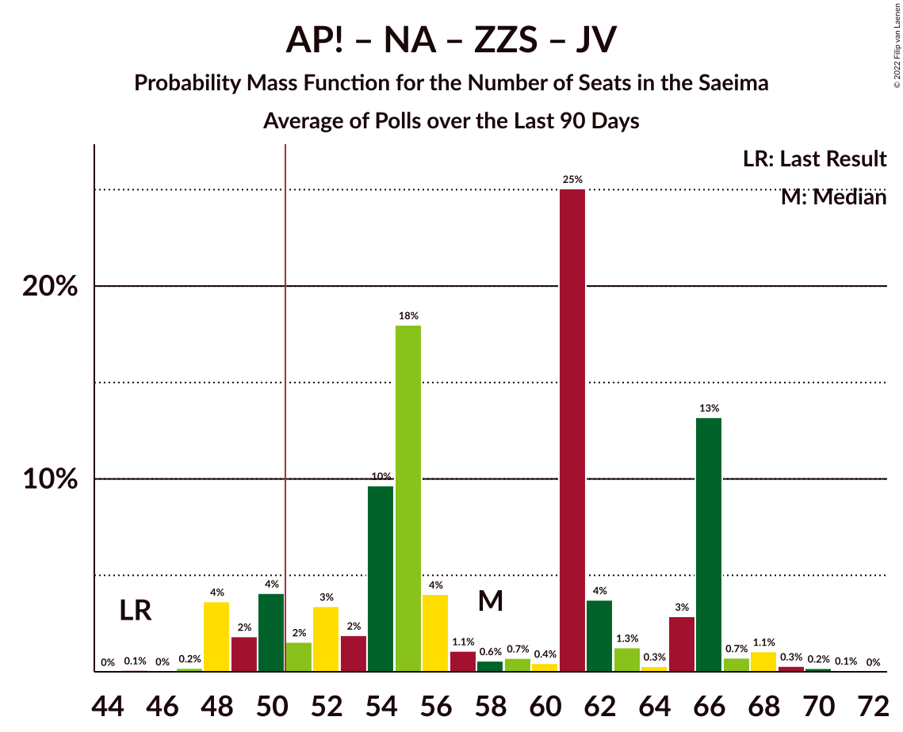

# Poll Average

<a href="#voting-intentions">Voting Intentions</a> | <a href="#seats">Seats</a> | <a href="#coalitions">Coalitions</a> | <a href="#technical-information">Technical Information</a>

## Summary

The table below lists the polls on which the average is based. They are the most recent polls (less than 90 days old) registered and analyzed so far.

| Period     | Polling firm/Commissioner(s) | SDPS | KPV | JKP | AP! | NA | ZZS | JV | LRA | LKS | P | NSL | VL | JS | LuK | LPV | R |
|:----------:|:----------------------------:|:--:|:--:|:--:|:--:|:--:|:--:|:--:|:--:|:--:|:--:|:--:|:--:|:--:|:--:|:--:|:--:|
| 6 October 2018 | General Election | 19.8%   23 | 14.2%   16 | 13.6%   16 | 12.0%   13 | 11.0%   13 | 9.9%   11 | 6.7%   8 | 4.1%   0 | 3.2%   0 | 2.6%   0 | 0.8%   0 | 0.0%   0 | 0.0%   0 | 0.0%   0 | 0.0%   0 | 0.0%   0 |
| N/A | Poll Average | 11–22%   16–29 | 0–3%   0 | 4–6%   0–7 | 8–16%   9–19 | 9–13%   11–16 | 8–15%   10–19 | 11–17%   12–21 | 3–6%   0–7 | 3–6%   0–8 | 4–8%   0–9 | N/A   N/A | N/A   N/A | N/A   N/A | 3–7%   0–10 | 4–6%   0–7 | 2–4%   0 |
| [1–31 October 2021](2021-10-31-SKDS.html) | SKDS   Latvijas Televīzija | 17–23%   21–31 | 1–3%   0 | 4–7%   0–7 | 7–11%   9–14 | 9–13%   11–17 | 11–15%   12–19 | 11–15%   12–19 | 4–6%   0–7 | 4–7%   0–8 | 4–7%   0–8 | N/A   N/A | N/A   N/A | N/A   N/A | 3–6%   0–7 | 4–6%   0–7 | 2–4%   0 |
| [1–31 October 2021](2021-10-31-FactumInteractive.html) | Factum Interactive | 11–14%   15–18 | 0–1%   0 | 4–6%   0–7 | 13–16%   15–19 | 10–13%   13–16 | 8–10%   9–13 | 14–18%   18–21 | 3–5%   0 | 3–4%   0 | 5–8%   7–9 | N/A   N/A | N/A   N/A | N/A   N/A | 5–8%   7–10 | 4–6%   0–7 | 2–3%   0 |
| 6 October 2018 | General Election | 19.8%   23 | 14.2%   16 | 13.6%   16 | 12.0%   13 | 11.0%   13 | 9.9%   11 | 6.7%   8 | 4.1%   0 | 3.2%   0 | 2.6%   0 | 0.8%   0 | 0.0%   0 | 0.0%   0 | 0.0%   0 | 0.0%   0 | 0.0%   0 |

Only polls for which at least the sample size has been published are included in the table above.

**Legend:**
+ **Top half of each row:** Voting intentions (95% confidence interval)
+ **Bottom half of each row:** Seat projections for the Saeima (95% confidence interval)
+ **SDPS:** Sociāldemokrātiskā partija “Saskaņa”
+ **KPV:** Politiskā partija „KPV LV”
+ **JKP:** Jaunā konservatīvā partija
+ **AP!:** Attīstībai/Par!
+ **NA:** Nacionālā apvienība „Visu Latvijai!”–„Tēvzemei un Brīvībai/LNNK”
+ **ZZS:** Zaļo un Zemnieku savienība
+ **JV:** Jaunā VIENOTĪBA
+ **LRA:** Latvijas Reģionu Apvienība
+ **LKS:** Latvijas Krievu savienība
+ **P:** PROGRESĪVIE
+ **NSL:** No sirds Latvijai
+ **VL:** Vienoti Latvijai
+ **JS:** Jaunā Saskaņa
+ **LuK:** Likums un kārtība
+ **LPV:** Latvija pirmajā vietā
+ **R:** Republika
+ **N/A (single party):** Party not included the published results
+ **N/A (entire row):** Calculation for this opinion poll not started yet

## Voting Intentions

### Confidence Intervals

| Party | Last Result | Median | 80% Confidence Interval | 90% Confidence Interval | 95% Confidence Interval | 99% Confidence Interval |
|:-----:|:-----------:|:------:|:-----------------------:|:-----------------------:|:-----------------------:|:-----------------------:|
| <a href="#sociāldemokrātiskā-partija-“saskaņa”">Sociāldemokrātiskā partija “Saskaņa”</a> | 19.8% | 15.5% | 12.0–21.2% |11.7–21.8% | 11.4–22.3% | 10.9–23.3% |
| <a href="#politiskā-partija-„kpv-lv”">Politiskā partija „KPV LV”</a> | 14.2% | 1.1% | 0.5–2.3% |0.4–2.5% | 0.4–2.8% | 0.3–3.2% |
| <a href="#jaunā-konservatīvā-partija">Jaunā konservatīvā partija</a> | 13.6% | 5.1% | 4.3–5.9% |4.0–6.2% | 3.8–6.4% | 3.4–7.0% |
| <a href="#attīstībai/par!">Attīstībai/Par!</a> | 12.0% | 12.1% | 8.5–14.8% |8.1–15.2% | 7.8–15.5% | 7.1–16.1% |
| <a href="#nacionālā-apvienība-„visu-latvijai!”–„tēvzemei-un-brīvībai/lnnk”">Nacionālā apvienība „Visu Latvijai!”–„Tēvzemei un Brīvībai/LNNK”</a> | 11.0% | 11.3% | 9.7–12.6% |9.3–12.9% | 9.0–13.2% | 8.3–13.8% |
| <a href="#zaļo-un-zemnieku-savienība">Zaļo un Zemnieku savienība</a> | 9.9% | 10.5% | 8.5–13.9% |8.2–14.4% | 8.0–14.9% | 7.6–15.8% |
| <a href="#jaunā-vienotība">Jaunā VIENOTĪBA</a> | 6.7% | 14.7% | 12.0–16.6% |11.5–17.0% | 11.1–17.3% | 10.4–17.9% |
| <a href="#latvijas-reģionu-apvienība">Latvijas Reģionu Apvienība</a> | 4.1% | 4.2% | 3.4–5.5% |3.3–5.9% | 3.1–6.2% | 2.9–6.8% |
| <a href="#latvijas-krievu-savienība">Latvijas Krievu savienība</a> | 3.2% | 4.1% | 3.2–5.8% |3.0–6.1% | 2.9–6.5% | 2.6–7.1% |
| <a href="#progresīvie">PROGRESĪVIE</a> | 2.6% | 6.0% | 4.7–7.0% |4.4–7.2% | 4.2–7.5% | 3.7–7.9% |
| <a href="#no-sirds-latvijai">No sirds Latvijai</a> | 0.8% | N/A | N/A |N/A | N/A | N/A |
| <a href="#vienoti-latvijai">Vienoti Latvijai</a> | 0.0% | N/A | N/A |N/A | N/A | N/A |
| <a href="#jaunā-saskaņa">Jaunā Saskaņa</a> | 0.0% | N/A | N/A |N/A | N/A | N/A |
| <a href="#likums-un-kārtība">Likums un kārtība</a> | 0.0% | 5.6% | 3.9–6.9% |3.7–7.2% | 3.4–7.4% | 3.0–7.8% |
| <a href="#latvija-pirmajā-vietā">Latvija pirmajā vietā</a> | 0.0% | 4.7% | 4.0–5.6% |3.8–5.9% | 3.6–6.2% | 3.3–6.8% |
| <a href="#republika">Republika</a> | 0.0% | 2.3% | 1.8–3.0% |1.7–3.2% | 1.6–3.5% | 1.4–3.9% |

### Sociāldemokrātiskā partija “Saskaņa”

*For a full overview of the results for this party, see the [Sociāldemokrātiskā partija “Saskaņa”](party-sociāldemokrātiskāpartija“saskaņa”.html) page.*

| Voting Intentions | Probability | Accumulated | Special Marks |
|:-----------------:|:-----------:|:-----------:|:-------------:|
| 8.5–9.5% | 0% | 100% |  |
| 9.5–10.5% | 0.1% | 100% |  |
| 10.5–11.5% | 4% | 99.9% |  |
| 11.5–12.5% | 19% | 96% |  |
| 12.5–13.5% | 21% | 78% |  |
| 13.5–14.5% | 6% | 56% |  |
| 14.5–15.5% | 0.4% | 50% | Median |
| 15.5–16.5% | 0.2% | 50% |  |
| 16.5–17.5% | 1.5% | 50% |  |
| 17.5–18.5% | 6% | 48% |  |
| 18.5–19.5% | 12% | 43% |  |
| 19.5–20.5% | 14% | 31% | Last Result |
| 20.5–21.5% | 10% | 17% |  |
| 21.5–22.5% | 5% | 7% |  |
| 22.5–23.5% | 1.4% | 2% |  |
| 23.5–24.5% | 0.3% | 0.3% |  |
| 24.5–25.5% | 0% | 0% |  |

### Politiskā partija „KPV LV”

*For a full overview of the results for this party, see the [Politiskā partija „KPV LV”](party-politiskāpartija„kpvlv”.html) page.*

| Voting Intentions | Probability | Accumulated | Special Marks |
|:-----------------:|:-----------:|:-----------:|:-------------:|
| 0.0–0.5% | 17% | 100% |  |
| 0.5–1.5% | 45% | 83% | Median |
| 1.5–2.5% | 33% | 38% |  |
| 2.5–3.5% | 5% | 5% |  |
| 3.5–4.5% | 0.1% | 0.1% |  |
| 4.5–5.5% | 0% | 0% |  |
| 5.5–6.5% | 0% | 0% |  |
| 6.5–7.5% | 0% | 0% |  |
| 7.5–8.5% | 0% | 0% |  |
| 8.5–9.5% | 0% | 0% |  |
| 9.5–10.5% | 0% | 0% |  |
| 10.5–11.5% | 0% | 0% |  |
| 11.5–12.5% | 0% | 0% |  |
| 12.5–13.5% | 0% | 0% |  |
| 13.5–14.5% | 0% | 0% | Last Result |

### Jaunā konservatīvā partija

*For a full overview of the results for this party, see the [Jaunā konservatīvā partija](party-jaunākonservatīvāpartija.html) page.*

| Voting Intentions | Probability | Accumulated | Special Marks |
|:-----------------:|:-----------:|:-----------:|:-------------:|
| 1.5–2.5% | 0% | 100% |  |
| 2.5–3.5% | 0.8% | 100% |  |
| 3.5–4.5% | 19% | 99.2% |  |
| 4.5–5.5% | 58% | 80% | Median |
| 5.5–6.5% | 20% | 22% |  |
| 6.5–7.5% | 2% | 2% |  |
| 7.5–8.5% | 0.1% | 0.1% |  |
| 8.5–9.5% | 0% | 0% |  |
| 9.5–10.5% | 0% | 0% |  |
| 10.5–11.5% | 0% | 0% |  |
| 11.5–12.5% | 0% | 0% |  |
| 12.5–13.5% | 0% | 0% |  |
| 13.5–14.5% | 0% | 0% | Last Result |

### Attīstībai/Par!

*For a full overview of the results for this party, see the [Attīstībai/Par!](party-attīstībaipar.html) page.*

| Voting Intentions | Probability | Accumulated | Special Marks |
|:-----------------:|:-----------:|:-----------:|:-------------:|
| 5.5–6.5% | 0.1% | 100% |  |
| 6.5–7.5% | 1.5% | 99.9% |  |
| 7.5–8.5% | 9% | 98% |  |
| 8.5–9.5% | 19% | 89% |  |
| 9.5–10.5% | 14% | 70% |  |
| 10.5–11.5% | 5% | 56% |  |
| 11.5–12.5% | 2% | 51% | Last Result, Median |
| 12.5–13.5% | 11% | 49% |  |
| 13.5–14.5% | 23% | 38% |  |
| 14.5–15.5% | 13% | 15% |  |
| 15.5–16.5% | 2% | 2% |  |
| 16.5–17.5% | 0.1% | 0.1% |  |
| 17.5–18.5% | 0% | 0% |  |

### Nacionālā apvienība „Visu Latvijai!”–„Tēvzemei un Brīvībai/LNNK”

*For a full overview of the results for this party, see the [Nacionālā apvienība „Visu Latvijai!”–„Tēvzemei un Brīvībai/LNNK”](party-nacionālāapvienība„visulatvijai”–„tēvzemeiunbrīvībailnnk”.html) page.*

| Voting Intentions | Probability | Accumulated | Special Marks |
|:-----------------:|:-----------:|:-----------:|:-------------:|
| 6.5–7.5% | 0% | 100% |  |
| 7.5–8.5% | 0.9% | 100% |  |
| 8.5–9.5% | 7% | 99.1% |  |
| 9.5–10.5% | 18% | 92% |  |
| 10.5–11.5% | 32% | 75% | Last Result, Median |
| 11.5–12.5% | 31% | 42% |  |
| 12.5–13.5% | 10% | 11% |  |
| 13.5–14.5% | 0.9% | 1.0% |  |
| 14.5–15.5% | 0% | 0% |  |

### Zaļo un Zemnieku savienība

*For a full overview of the results for this party, see the [Zaļo un Zemnieku savienība](party-zaļounzemniekusavienība.html) page.*

| Voting Intentions | Probability | Accumulated | Special Marks |
|:-----------------:|:-----------:|:-----------:|:-------------:|
| 5.5–6.5% | 0% | 100% |  |
| 6.5–7.5% | 0.5% | 100% |  |
| 7.5–8.5% | 12% | 99.5% |  |
| 8.5–9.5% | 28% | 88% |  |
| 9.5–10.5% | 10% | 60% | Last Result |
| 10.5–11.5% | 6% | 50% | Median |
| 11.5–12.5% | 13% | 44% |  |
| 12.5–13.5% | 17% | 31% |  |
| 13.5–14.5% | 10% | 15% |  |
| 14.5–15.5% | 3% | 4% |  |
| 15.5–16.5% | 0.7% | 0.8% |  |
| 16.5–17.5% | 0.1% | 0.1% |  |
| 17.5–18.5% | 0% | 0% |  |

### Jaunā VIENOTĪBA

*For a full overview of the results for this party, see the [Jaunā VIENOTĪBA](party-jaunāvienotība.html) page.*

| Voting Intentions | Probability | Accumulated | Special Marks |
|:-----------------:|:-----------:|:-----------:|:-------------:|
| 6.5–7.5% | 0% | 100% | Last Result |
| 7.5–8.5% | 0% | 100% |  |
| 8.5–9.5% | 0% | 100% |  |
| 9.5–10.5% | 0.7% | 100% |  |
| 10.5–11.5% | 5% | 99.2% |  |
| 11.5–12.5% | 13% | 94% |  |
| 12.5–13.5% | 17% | 81% |  |
| 13.5–14.5% | 13% | 64% |  |
| 14.5–15.5% | 18% | 52% | Median |
| 15.5–16.5% | 23% | 34% |  |
| 16.5–17.5% | 10% | 11% |  |
| 17.5–18.5% | 1.4% | 1.4% |  |
| 18.5–19.5% | 0.1% | 0.1% |  |
| 19.5–20.5% | 0% | 0% |  |

### Latvijas Reģionu Apvienība

*For a full overview of the results for this party, see the [Latvijas Reģionu Apvienība](party-latvijasreģionuapvienība.html) page.*

| Voting Intentions | Probability | Accumulated | Special Marks |
|:-----------------:|:-----------:|:-----------:|:-------------:|
| 1.5–2.5% | 0% | 100% |  |
| 2.5–3.5% | 14% | 100% |  |
| 3.5–4.5% | 49% | 86% | Last Result, Median |
| 4.5–5.5% | 27% | 36% |  |
| 5.5–6.5% | 9% | 10% |  |
| 6.5–7.5% | 1.0% | 1.0% |  |
| 7.5–8.5% | 0% | 0% |  |
| 8.5–9.5% | 0% | 0% |  |

### Latvijas Krievu savienība

*For a full overview of the results for this party, see the [Latvijas Krievu savienība](party-latvijaskrievusavienība.html) page.*

| Voting Intentions | Probability | Accumulated | Special Marks |
|:-----------------:|:-----------:|:-----------:|:-------------:|
| 0.5–1.5% | 0% | 100% |  |
| 1.5–2.5% | 0.3% | 100% |  |
| 2.5–3.5% | 27% | 99.7% | Last Result |
| 3.5–4.5% | 33% | 72% | Median |
| 4.5–5.5% | 25% | 39% |  |
| 5.5–6.5% | 12% | 14% |  |
| 6.5–7.5% | 2% | 2% |  |
| 7.5–8.5% | 0.1% | 0.1% |  |
| 8.5–9.5% | 0% | 0% |  |

### PROGRESĪVIE

*For a full overview of the results for this party, see the [PROGRESĪVIE](party-progresīvie.html) page.*

| Voting Intentions | Probability | Accumulated | Special Marks |
|:-----------------:|:-----------:|:-----------:|:-------------:|
| 1.5–2.5% | 0% | 100% |  |
| 2.5–3.5% | 0.2% | 100% | Last Result |
| 3.5–4.5% | 7% | 99.8% |  |
| 4.5–5.5% | 25% | 93% |  |
| 5.5–6.5% | 43% | 68% | Median |
| 6.5–7.5% | 23% | 25% |  |
| 7.5–8.5% | 2% | 2% |  |
| 8.5–9.5% | 0% | 0% |  |

### Likums un kārtība

*For a full overview of the results for this party, see the [Likums un kārtība](party-likumsunkārtība.html) page.*

| Voting Intentions | Probability | Accumulated | Special Marks |
|:-----------------:|:-----------:|:-----------:|:-------------:|
| 0.0–0.5% | 0% | 100% | Last Result |
| 0.5–1.5% | 0% | 100% |  |
| 1.5–2.5% | 0% | 100% |  |
| 2.5–3.5% | 4% | 100% |  |
| 3.5–4.5% | 22% | 96% |  |
| 4.5–5.5% | 22% | 74% |  |
| 5.5–6.5% | 31% | 52% | Median |
| 6.5–7.5% | 20% | 21% |  |
| 7.5–8.5% | 2% | 2% |  |
| 8.5–9.5% | 0% | 0% |  |

### Latvija pirmajā vietā

*For a full overview of the results for this party, see the [Latvija pirmajā vietā](party-latvijapirmajāvietā.html) page.*

| Voting Intentions | Probability | Accumulated | Special Marks |
|:-----------------:|:-----------:|:-----------:|:-------------:|
| 0.0–0.5% | 0% | 100% | Last Result |
| 0.5–1.5% | 0% | 100% |  |
| 1.5–2.5% | 0% | 100% |  |
| 2.5–3.5% | 2% | 100% |  |
| 3.5–4.5% | 41% | 98% |  |
| 4.5–5.5% | 46% | 57% | Median |
| 5.5–6.5% | 10% | 11% |  |
| 6.5–7.5% | 1.0% | 1.0% |  |
| 7.5–8.5% | 0% | 0% |  |
| 8.5–9.5% | 0% | 0% |  |

### Republika

*For a full overview of the results for this party, see the [Republika](party-republika.html) page.*

| Voting Intentions | Probability | Accumulated | Special Marks |
|:-----------------:|:-----------:|:-----------:|:-------------:|
| 0.0–0.5% | 0% | 100% | Last Result |
| 0.5–1.5% | 2% | 100% |  |
| 1.5–2.5% | 66% | 98% | Median |
| 2.5–3.5% | 30% | 32% |  |
| 3.5–4.5% | 2% | 2% |  |
| 4.5–5.5% | 0% | 0% |  |
| 5.5–6.5% | 0% | 0% |  |

## Seats

### Confidence Intervals

| Party | Last Result | Median | 80% Confidence Interval | 90% Confidence Interval | 95% Confidence Interval | 99% Confidence Interval |
|:-----:|:-----------:|:------:|:-----------------------:|:-----------------------:|:-----------------------:|:-----------------------:|
| <a href="#sociāldemokrātiskā-partija-“saskaņa”">Sociāldemokrātiskā partija “Saskaņa”</a> | 23 | 19 | 16–26 |16–29 | 16–29 | 15–31 |
| <a href="#politiskā-partija-„kpv-lv”">Politiskā partija „KPV LV”</a> | 16 | 0 | 0 |0 | 0 | 0 |
| <a href="#jaunā-konservatīvā-partija">Jaunā konservatīvā partija</a> | 16 | 0 | 0–7 |0–7 | 0–7 | 0–8 |
| <a href="#attīstībai/par!">Attīstībai/Par!</a> | 13 | 15 | 9–17 |9–19 | 9–19 | 8–20 |
| <a href="#nacionālā-apvienība-„visu-latvijai!”–„tēvzemei-un-brīvībai/lnnk”">Nacionālā apvienība „Visu Latvijai!”–„Tēvzemei un Brīvībai/LNNK”</a> | 13 | 13 | 11–16 |11–16 | 11–16 | 10–17 |
| <a href="#zaļo-un-zemnieku-savienība">Zaļo un Zemnieku savienība</a> | 11 | 12 | 10–16 |10–17 | 10–19 | 9–20 |
| <a href="#jaunā-vienotība">Jaunā VIENOTĪBA</a> | 8 | 18 | 15–20 |14–21 | 12–21 | 12–21 |
| <a href="#latvijas-reģionu-apvienība">Latvijas Reģionu Apvienība</a> | 0 | 0 | 0–6 |0–7 | 0–7 | 0–7 |
| <a href="#latvijas-krievu-savienība">Latvijas Krievu savienība</a> | 0 | 0 | 0–8 |0–8 | 0–8 | 0–9 |
| <a href="#progresīvie">PROGRESĪVIE</a> | 0 | 7 | 6–8 |0–9 | 0–9 | 0–9 |
| <a href="#no-sirds-latvijai">No sirds Latvijai</a> | 0 | N/A | N/A |N/A | N/A | N/A |
| <a href="#vienoti-latvijai">Vienoti Latvijai</a> | 0 | N/A | N/A |N/A | N/A | N/A |
| <a href="#jaunā-saskaņa">Jaunā Saskaņa</a> | 0 | N/A | N/A |N/A | N/A | N/A |
| <a href="#likums-un-kārtība">Likums un kārtība</a> | 0 | 7 | 0–9 |0–9 | 0–10 | 0–10 |
| <a href="#latvija-pirmajā-vietā">Latvija pirmajā vietā</a> | 0 | 0 | 0–6 |0–6 | 0–7 | 0–8 |
| <a href="#republika">Republika</a> | 0 | 0 | 0 |0 | 0 | 0 |

### Sociāldemokrātiskā partija “Saskaņa”

*For a full overview of the results for this party, see the [Sociāldemokrātiskā partija “Saskaņa”](party-sociāldemokrātiskāpartija“saskaņa”.html) page.*

| Number of Seats | Probability | Accumulated | Special Marks |
|:---------------:|:-----------:|:-----------:|:-------------:|
| 15 | 1.5% | 100% |  |
| 16 | 23% | 98.5% |  |
| 17 | 13% | 76% |  |
| 18 | 12% | 63% |  |
| 19 | 0.8% | 51% | Median |
| 20 | 1.0% | 50% |  |
| 21 | 0.7% | 49% |  |
| 22 | 6% | 48% |  |
| 23 | 20% | 42% | Last Result |
| 24 | 7% | 22% |  |
| 25 | 4% | 15% |  |
| 26 | 3% | 11% |  |
| 27 | 1.0% | 8% |  |
| 28 | 1.2% | 7% |  |
| 29 | 4% | 6% |  |
| 30 | 0.3% | 2% |  |
| 31 | 2% | 2% |  |
| 32 | 0.1% | 0.1% |  |
| 33 | 0% | 0% |  |

### Politiskā partija „KPV LV”

*For a full overview of the results for this party, see the [Politiskā partija „KPV LV”](party-politiskāpartija„kpvlv”.html) page.*

| Number of Seats | Probability | Accumulated | Special Marks |
|:---------------:|:-----------:|:-----------:|:-------------:|
| 0 | 100% | 100% | Median |
| 1 | 0% | 0% |  |
| 2 | 0% | 0% |  |
| 3 | 0% | 0% |  |
| 4 | 0% | 0% |  |
| 5 | 0% | 0% |  |
| 6 | 0% | 0% |  |
| 7 | 0% | 0% |  |
| 8 | 0% | 0% |  |
| 9 | 0% | 0% |  |
| 10 | 0% | 0% |  |
| 11 | 0% | 0% |  |
| 12 | 0% | 0% |  |
| 13 | 0% | 0% |  |
| 14 | 0% | 0% |  |
| 15 | 0% | 0% |  |
| 16 | 0% | 0% | Last Result |

### Jaunā konservatīvā partija

*For a full overview of the results for this party, see the [Jaunā konservatīvā partija](party-jaunākonservatīvāpartija.html) page.*

| Number of Seats | Probability | Accumulated | Special Marks |
|:---------------:|:-----------:|:-----------:|:-------------:|
| 0 | 52% | 100% | Median |
| 1 | 0% | 48% |  |
| 2 | 0% | 48% |  |
| 3 | 0% | 48% |  |
| 4 | 0% | 48% |  |
| 5 | 0% | 48% |  |
| 6 | 2% | 48% |  |
| 7 | 46% | 47% |  |
| 8 | 0.4% | 0.8% |  |
| 9 | 0.3% | 0.4% |  |
| 10 | 0.1% | 0.1% |  |
| 11 | 0% | 0% |  |
| 12 | 0% | 0% |  |
| 13 | 0% | 0% |  |
| 14 | 0% | 0% |  |
| 15 | 0% | 0% |  |
| 16 | 0% | 0% | Last Result |

### Attīstībai/Par!

*For a full overview of the results for this party, see the [Attīstībai/Par!](party-attīstībaipar.html) page.*

| Number of Seats | Probability | Accumulated | Special Marks |
|:---------------:|:-----------:|:-----------:|:-------------:|
| 7 | 0.2% | 100% |  |
| 8 | 0.5% | 99.8% |  |
| 9 | 14% | 99.3% |  |
| 10 | 7% | 85% |  |
| 11 | 4% | 78% |  |
| 12 | 2% | 74% |  |
| 13 | 0.7% | 73% | Last Result |
| 14 | 21% | 72% |  |
| 15 | 15% | 51% | Median |
| 16 | 15% | 36% |  |
| 17 | 12% | 21% |  |
| 18 | 2% | 8% |  |
| 19 | 6% | 7% |  |
| 20 | 0.4% | 0.5% |  |
| 21 | 0.1% | 0.1% |  |
| 22 | 0% | 0% |  |

### Nacionālā apvienība „Visu Latvijai!”–„Tēvzemei un Brīvībai/LNNK”

*For a full overview of the results for this party, see the [Nacionālā apvienība „Visu Latvijai!”–„Tēvzemei un Brīvībai/LNNK”](party-nacionālāapvienība„visulatvijai”–„tēvzemeiunbrīvībailnnk”.html) page.*

| Number of Seats | Probability | Accumulated | Special Marks |
|:---------------:|:-----------:|:-----------:|:-------------:|
| 9 | 0.1% | 100% |  |
| 10 | 0.8% | 99.8% |  |
| 11 | 10% | 99.1% |  |
| 12 | 22% | 89% |  |
| 13 | 24% | 67% | Last Result, Median |
| 14 | 14% | 43% |  |
| 15 | 14% | 29% |  |
| 16 | 13% | 15% |  |
| 17 | 2% | 2% |  |
| 18 | 0.1% | 0.1% |  |
| 19 | 0% | 0% |  |

### Zaļo un Zemnieku savienība

*For a full overview of the results for this party, see the [Zaļo un Zemnieku savienība](party-zaļounzemniekusavienība.html) page.*

| Number of Seats | Probability | Accumulated | Special Marks |
|:---------------:|:-----------:|:-----------:|:-------------:|
| 8 | 0.1% | 100% |  |
| 9 | 1.3% | 99.9% |  |
| 10 | 15% | 98.7% |  |
| 11 | 6% | 84% | Last Result |
| 12 | 28% | 78% | Median |
| 13 | 12% | 50% |  |
| 14 | 5% | 38% |  |
| 15 | 20% | 33% |  |
| 16 | 3% | 12% |  |
| 17 | 5% | 9% |  |
| 18 | 1.3% | 5% |  |
| 19 | 2% | 3% |  |
| 20 | 1.0% | 1.2% |  |
| 21 | 0.1% | 0.1% |  |
| 22 | 0.1% | 0.1% |  |
| 23 | 0% | 0% |  |

### Jaunā VIENOTĪBA

*For a full overview of the results for this party, see the [Jaunā VIENOTĪBA](party-jaunāvienotība.html) page.*

| Number of Seats | Probability | Accumulated | Special Marks |
|:---------------:|:-----------:|:-----------:|:-------------:|
| 8 | 0% | 100% | Last Result |
| 9 | 0% | 100% |  |
| 10 | 0% | 100% |  |
| 11 | 0.4% | 100% |  |
| 12 | 4% | 99.6% |  |
| 13 | 0.5% | 96% |  |
| 14 | 5% | 95% |  |
| 15 | 18% | 91% |  |
| 16 | 13% | 73% |  |
| 17 | 2% | 59% |  |
| 18 | 17% | 58% | Median |
| 19 | 19% | 41% |  |
| 20 | 13% | 22% |  |
| 21 | 9% | 9% |  |
| 22 | 0% | 0.4% |  |
| 23 | 0.3% | 0.4% |  |
| 24 | 0.1% | 0.1% |  |
| 25 | 0% | 0% |  |

### Latvijas Reģionu Apvienība

*For a full overview of the results for this party, see the [Latvijas Reģionu Apvienība](party-latvijasreģionuapvienība.html) page.*

| Number of Seats | Probability | Accumulated | Special Marks |
|:---------------:|:-----------:|:-----------:|:-------------:|
| 0 | 84% | 100% | Last Result, Median |
| 1 | 0% | 16% |  |
| 2 | 0% | 16% |  |
| 3 | 0% | 16% |  |
| 4 | 0% | 16% |  |
| 5 | 0% | 16% |  |
| 6 | 9% | 16% |  |
| 7 | 6% | 6% |  |
| 8 | 0.4% | 0.5% |  |
| 9 | 0.1% | 0.1% |  |
| 10 | 0% | 0% |  |

### Latvijas Krievu savienība

*For a full overview of the results for this party, see the [Latvijas Krievu savienība](party-latvijaskrievusavienība.html) page.*

| Number of Seats | Probability | Accumulated | Special Marks |
|:---------------:|:-----------:|:-----------:|:-------------:|
| 0 | 62% | 100% | Last Result, Median |
| 1 | 0% | 38% |  |
| 2 | 0% | 38% |  |
| 3 | 0% | 38% |  |
| 4 | 0% | 38% |  |
| 5 | 0.1% | 38% |  |
| 6 | 0.8% | 38% |  |
| 7 | 10% | 37% |  |
| 8 | 26% | 27% |  |
| 9 | 0.7% | 1.0% |  |
| 10 | 0.3% | 0.3% |  |
| 11 | 0% | 0% |  |

### PROGRESĪVIE

*For a full overview of the results for this party, see the [PROGRESĪVIE](party-progresīvie.html) page.*

| Number of Seats | Probability | Accumulated | Special Marks |
|:---------------:|:-----------:|:-----------:|:-------------:|
| 0 | 9% | 100% | Last Result |
| 1 | 0% | 91% |  |
| 2 | 0% | 91% |  |
| 3 | 0% | 91% |  |
| 4 | 0% | 91% |  |
| 5 | 0% | 91% |  |
| 6 | 2% | 91% |  |
| 7 | 67% | 89% | Median |
| 8 | 14% | 22% |  |
| 9 | 7% | 7% |  |
| 10 | 0.1% | 0.3% |  |
| 11 | 0.2% | 0.2% |  |
| 12 | 0% | 0% |  |

### No sirds Latvijai

*For a full overview of the results for this party, see the [No sirds Latvijai](party-nosirdslatvijai.html) page.*

### Vienoti Latvijai

*For a full overview of the results for this party, see the [Vienoti Latvijai](party-vienotilatvijai.html) page.*

### Jaunā Saskaņa

*For a full overview of the results for this party, see the [Jaunā Saskaņa](party-jaunāsaskaņa.html) page.*

### Likums un kārtība

*For a full overview of the results for this party, see the [Likums un kārtība](party-likumsunkārtība.html) page.*

| Number of Seats | Probability | Accumulated | Special Marks |
|:---------------:|:-----------:|:-----------:|:-------------:|
| 0 | 25% | 100% | Last Result |
| 1 | 0% | 75% |  |
| 2 | 0% | 75% |  |
| 3 | 0% | 75% |  |
| 4 | 0% | 75% |  |
| 5 | 3% | 75% |  |
| 6 | 20% | 71% |  |
| 7 | 33% | 52% | Median |
| 8 | 7% | 18% |  |
| 9 | 8% | 12% |  |
| 10 | 3% | 3% |  |
| 11 | 0.4% | 0.4% |  |
| 12 | 0% | 0% |  |

### Latvija pirmajā vietā

*For a full overview of the results for this party, see the [Latvija pirmajā vietā](party-latvijapirmajāvietā.html) page.*

| Number of Seats | Probability | Accumulated | Special Marks |
|:---------------:|:-----------:|:-----------:|:-------------:|
| 0 | 64% | 100% | Last Result, Median |
| 1 | 0% | 36% |  |
| 2 | 0% | 36% |  |
| 3 | 0% | 36% |  |
| 4 | 0% | 36% |  |
| 5 | 0.3% | 36% |  |
| 6 | 32% | 36% |  |
| 7 | 3% | 4% |  |
| 8 | 0.8% | 0.9% |  |
| 9 | 0% | 0.1% |  |
| 10 | 0.1% | 0.1% |  |
| 11 | 0% | 0% |  |

### Republika

*For a full overview of the results for this party, see the [Republika](party-republika.html) page.*

| Number of Seats | Probability | Accumulated | Special Marks |
|:---------------:|:-----------:|:-----------:|:-------------:|
| 0 | 100% | 100% | Last Result, Median |

## Coalitions

### Confidence Intervals

| Coalition | Last Result | Median | Majority? | 80% Confidence Interval | 90% Confidence Interval | 95% Confidence Interval | 99% Confidence Interval |
|:---------:|:-----------:|:------:|:---------:|:-----------------------:|:-----------------------:|:-----------------------:|:-----------------------:|
| Jaunā konservatīvā partija – Attīstībai/Par! – Nacionālā apvienība „Visu Latvijai!”–„Tēvzemei un Brīvībai/LNNK” – Zaļo un Zemnieku savienība – Jaunā VIENOTĪBA | 61 | 64 | 99.7% | 53–68 | 51–68 | 51–69 | 51–70 |
| Attīstībai/Par! – Nacionālā apvienība „Visu Latvijai!”–„Tēvzemei un Brīvībai/LNNK” – Zaļo un Zemnieku savienība – Jaunā VIENOTĪBA | 45 | 57 | 94% | 51–66 | 49–67 | 46–67 | 46–67 |
| Jaunā konservatīvā partija – Attīstībai/Par! – Nacionālā apvienība „Visu Latvijai!”–„Tēvzemei un Brīvībai/LNNK” – Jaunā VIENOTĪBA | 50 | 50 | 50% | 39–56 | 38–57 | 38–58 | 34–59 |
| Politiskā partija „KPV LV” – Jaunā konservatīvā partija – Attīstībai/Par! – Nacionālā apvienība „Visu Latvijai!”–„Tēvzemei un Brīvībai/LNNK” – Jaunā VIENOTĪBA | 66 | 50 | 50% | 39–56 | 38–57 | 38–58 | 34–59 |
| Politiskā partija „KPV LV” – Attīstībai/Par! – Nacionālā apvienība „Visu Latvijai!”–„Tēvzemei un Brīvībai/LNNK” – Jaunā VIENOTĪBA | 50 | 47 | 19% | 38–54 | 35–55 | 33–55 | 33–55 |
| Jaunā konservatīvā partija – Nacionālā apvienība „Visu Latvijai!”–„Tēvzemei un Brīvībai/LNNK” – Zaļo un Zemnieku savienība – Jaunā VIENOTĪBA | 48 | 49 | 26% | 42–52 | 41–52 | 41–53 | 41–55 |
| Nacionālā apvienība „Visu Latvijai!”–„Tēvzemei un Brīvībai/LNNK” – Zaļo un Zemnieku savienība – Jaunā VIENOTĪBA | 32 | 43 | 2% | 41–49 | 40–49 | 36–50 | 36–54 |
| Jaunā konservatīvā partija – Attīstībai/Par! – Nacionālā apvienība „Visu Latvijai!”–„Tēvzemei un Brīvībai/LNNK” – Zaļo un Zemnieku savienība | 53 | 45 | 1.4% | 38–50 | 37–50 | 35–50 | 35–52 |
| Attīstībai/Par! – Nacionālā apvienība „Visu Latvijai!”–„Tēvzemei un Brīvībai/LNNK” – Zaļo un Zemnieku savienība | 37 | 41 | 0.1% | 36–45 | 34–47 | 34–47 | 33–48 |
| Sociāldemokrātiskā partija “Saskaņa” – Politiskā partija „KPV LV” – Zaļo un Zemnieku savienība | 50 | 32 | 0.1% | 26–42 | 26–43 | 26–47 | 25–50 |
| Sociāldemokrātiskā partija “Saskaņa” – Jaunā konservatīvā partija – Attīstībai/Par! | 52 | 38 | 0% | 34–41 | 32–43 | 32–45 | 31–47 |
| Politiskā partija „KPV LV” – Jaunā konservatīvā partija – Attīstībai/Par! – Jaunā VIENOTĪBA | 53 | 36 | 0% | 26–41 | 25–43 | 25–44 | 23–44 |
| Sociāldemokrātiskā partija “Saskaņa” – Attīstībai/Par! | 36 | 34 | 0% | 31–38 | 31–40 | 31–43 | 29–45 |
| Politiskā partija „KPV LV” – Jaunā konservatīvā partija – Nacionālā apvienība „Visu Latvijai!”–„Tēvzemei un Brīvībai/LNNK” – Jaunā VIENOTĪBA | 53 | 36 | 0% | 27–40 | 27–41 | 27–41 | 25–42 |
| Politiskā partija „KPV LV” – Jaunā konservatīvā partija – Attīstībai/Par! – Nacionālā apvienība „Visu Latvijai!”–„Tēvzemei un Brīvībai/LNNK” | 58 | 32 | 0% | 23–38 | 22–38 | 21–38 | 20–39 |
| Jaunā konservatīvā partija – Nacionālā apvienība „Visu Latvijai!”–„Tēvzemei un Brīvībai/LNNK” – Zaļo un Zemnieku savienība | 40 | 30 | 0% | 26–34 | 26–36 | 25–36 | 23–39 |
| Sociāldemokrātiskā partija “Saskaņa” – Politiskā partija „KPV LV” | 39 | 19 | 0% | 16–26 | 16–29 | 16–29 | 15–31 |

### Jaunā konservatīvā partija – Attīstībai/Par! – Nacionālā apvienība „Visu Latvijai!”–„Tēvzemei un Brīvībai/LNNK” – Zaļo un Zemnieku savienība – Jaunā VIENOTĪBA

| Number of Seats | Probability | Accumulated | Special Marks |
|:---------------:|:-----------:|:-----------:|:-------------:|
| 47 | 0% | 100% |  |
| 48 | 0.1% | 99.9% |  |
| 49 | 0.1% | 99.8% |  |
| 50 | 0.1% | 99.8% |  |
| 51 | 5% | 99.7% | Majority |
| 52 | 3% | 95% |  |
| 53 | 3% | 91% |  |
| 54 | 1.1% | 88% |  |
| 55 | 3% | 87% |  |
| 56 | 16% | 84% |  |
| 57 | 3% | 68% |  |
| 58 | 0.9% | 65% | Median |
| 59 | 1.0% | 64% |  |
| 60 | 1.0% | 63% |  |
| 61 | 6% | 62% | Last Result |
| 62 | 3% | 56% |  |
| 63 | 2% | 53% |  |
| 64 | 15% | 51% |  |
| 65 | 4% | 36% |  |
| 66 | 8% | 32% |  |
| 67 | 7% | 24% |  |
| 68 | 14% | 17% |  |
| 69 | 1.4% | 3% |  |
| 70 | 2% | 2% |  |
| 71 | 0.1% | 0.3% |  |
| 72 | 0% | 0.2% |  |
| 73 | 0.1% | 0.2% |  |
| 74 | 0% | 0.1% |  |
| 75 | 0.1% | 0.1% |  |
| 76 | 0% | 0% |  |

### Attīstībai/Par! – Nacionālā apvienība „Visu Latvijai!”–„Tēvzemei un Brīvībai/LNNK” – Zaļo un Zemnieku savienība – Jaunā VIENOTĪBA

| Number of Seats | Probability | Accumulated | Special Marks |
|:---------------:|:-----------:|:-----------:|:-------------:|
| 45 | 0% | 100% | Last Result |
| 46 | 3% | 99.9% |  |
| 47 | 0.4% | 97% |  |
| 48 | 0.2% | 96% |  |
| 49 | 1.5% | 96% |  |
| 50 | 0.3% | 95% |  |
| 51 | 6% | 94% | Majority |
| 52 | 4% | 89% |  |
| 53 | 0.8% | 84% |  |
| 54 | 6% | 84% |  |
| 55 | 3% | 78% |  |
| 56 | 15% | 75% |  |
| 57 | 16% | 59% |  |
| 58 | 3% | 43% | Median |
| 59 | 0.8% | 40% |  |
| 60 | 1.3% | 39% |  |
| 61 | 14% | 38% |  |
| 62 | 3% | 24% |  |
| 63 | 3% | 20% |  |
| 64 | 0.6% | 17% |  |
| 65 | 2% | 16% |  |
| 66 | 8% | 14% |  |
| 67 | 6% | 6% |  |
| 68 | 0.1% | 0.3% |  |
| 69 | 0.1% | 0.2% |  |
| 70 | 0% | 0.1% |  |
| 71 | 0% | 0.1% |  |
| 72 | 0% | 0.1% |  |
| 73 | 0.1% | 0.1% |  |
| 74 | 0% | 0% |  |

### Jaunā konservatīvā partija – Attīstībai/Par! – Nacionālā apvienība „Visu Latvijai!”–„Tēvzemei un Brīvībai/LNNK” – Jaunā VIENOTĪBA

| Number of Seats | Probability | Accumulated | Special Marks |
|:---------------:|:-----------:|:-----------:|:-------------:|
| 32 | 0.1% | 100% |  |
| 33 | 0% | 99.9% |  |
| 34 | 1.2% | 99.8% |  |
| 35 | 0% | 98.6% |  |
| 36 | 0.2% | 98.6% |  |
| 37 | 0.9% | 98% |  |
| 38 | 7% | 98% |  |
| 39 | 1.3% | 91% |  |
| 40 | 4% | 89% |  |
| 41 | 15% | 86% |  |
| 42 | 4% | 70% |  |
| 43 | 4% | 67% |  |
| 44 | 1.2% | 63% |  |
| 45 | 2% | 62% |  |
| 46 | 6% | 60% | Median |
| 47 | 1.1% | 54% |  |
| 48 | 0.5% | 53% |  |
| 49 | 2% | 52% |  |
| 50 | 0.9% | 51% | Last Result |
| 51 | 0.8% | 50% | Majority |
| 52 | 2% | 49% |  |
| 53 | 2% | 47% |  |
| 54 | 22% | 46% |  |
| 55 | 7% | 24% |  |
| 56 | 11% | 17% |  |
| 57 | 3% | 6% |  |
| 58 | 2% | 3% |  |
| 59 | 0.9% | 0.9% |  |
| 60 | 0% | 0.1% |  |
| 61 | 0% | 0.1% |  |
| 62 | 0% | 0% |  |

### Politiskā partija „KPV LV” – Jaunā konservatīvā partija – Attīstībai/Par! – Nacionālā apvienība „Visu Latvijai!”–„Tēvzemei un Brīvībai/LNNK” – Jaunā VIENOTĪBA

| Number of Seats | Probability | Accumulated | Special Marks |
|:---------------:|:-----------:|:-----------:|:-------------:|
| 32 | 0.1% | 100% |  |
| 33 | 0% | 99.9% |  |
| 34 | 1.2% | 99.8% |  |
| 35 | 0% | 98.6% |  |
| 36 | 0.2% | 98.6% |  |
| 37 | 0.9% | 98% |  |
| 38 | 7% | 98% |  |
| 39 | 1.3% | 91% |  |
| 40 | 4% | 89% |  |
| 41 | 15% | 86% |  |
| 42 | 4% | 70% |  |
| 43 | 4% | 67% |  |
| 44 | 1.2% | 63% |  |
| 45 | 2% | 62% |  |
| 46 | 6% | 60% | Median |
| 47 | 1.1% | 54% |  |
| 48 | 0.5% | 53% |  |
| 49 | 2% | 52% |  |
| 50 | 0.9% | 51% |  |
| 51 | 0.8% | 50% | Majority |
| 52 | 2% | 49% |  |
| 53 | 2% | 47% |  |
| 54 | 22% | 46% |  |
| 55 | 7% | 24% |  |
| 56 | 11% | 17% |  |
| 57 | 3% | 6% |  |
| 58 | 2% | 3% |  |
| 59 | 0.9% | 0.9% |  |
| 60 | 0% | 0.1% |  |
| 61 | 0% | 0.1% |  |
| 62 | 0% | 0% |  |
| 63 | 0% | 0% |  |
| 64 | 0% | 0% |  |
| 65 | 0% | 0% |  |
| 66 | 0% | 0% | Last Result |

### Politiskā partija „KPV LV” – Attīstībai/Par! – Nacionālā apvienība „Visu Latvijai!”–„Tēvzemei un Brīvībai/LNNK” – Jaunā VIENOTĪBA

| Number of Seats | Probability | Accumulated | Special Marks |
|:---------------:|:-----------:|:-----------:|:-------------:|
| 29 | 0% | 100% |  |
| 30 | 0% | 99.9% |  |
| 31 | 0% | 99.9% |  |
| 32 | 0.2% | 99.9% |  |
| 33 | 3% | 99.7% |  |
| 34 | 1.3% | 97% |  |
| 35 | 0.6% | 95% |  |
| 36 | 1.2% | 95% |  |
| 37 | 1.1% | 93% |  |
| 38 | 9% | 92% |  |
| 39 | 6% | 83% |  |
| 40 | 0.6% | 76% |  |
| 41 | 16% | 76% |  |
| 42 | 4% | 60% |  |
| 43 | 3% | 56% |  |
| 44 | 0.3% | 53% |  |
| 45 | 0.3% | 53% |  |
| 46 | 1.2% | 52% | Median |
| 47 | 15% | 51% |  |
| 48 | 1.5% | 36% |  |
| 49 | 11% | 34% |  |
| 50 | 4% | 23% | Last Result |
| 51 | 3% | 19% | Majority |
| 52 | 2% | 16% |  |
| 53 | 1.4% | 14% |  |
| 54 | 7% | 13% |  |
| 55 | 6% | 6% |  |
| 56 | 0.4% | 0.5% |  |
| 57 | 0% | 0.1% |  |
| 58 | 0% | 0% |  |

### Jaunā konservatīvā partija – Nacionālā apvienība „Visu Latvijai!”–„Tēvzemei un Brīvībai/LNNK” – Zaļo un Zemnieku savienība – Jaunā VIENOTĪBA

| Number of Seats | Probability | Accumulated | Special Marks |
|:---------------:|:-----------:|:-----------:|:-------------:|
| 36 | 0% | 100% |  |
| 37 | 0% | 99.9% |  |
| 38 | 0.1% | 99.9% |  |
| 39 | 0% | 99.8% |  |
| 40 | 0.1% | 99.8% |  |
| 41 | 5% | 99.7% |  |
| 42 | 20% | 94% |  |
| 43 | 4% | 75% | Median |
| 44 | 1.3% | 70% |  |
| 45 | 1.3% | 69% |  |
| 46 | 2% | 68% |  |
| 47 | 4% | 66% |  |
| 48 | 11% | 62% | Last Result |
| 49 | 23% | 51% |  |
| 50 | 2% | 28% |  |
| 51 | 2% | 26% | Majority |
| 52 | 19% | 24% |  |
| 53 | 3% | 4% |  |
| 54 | 1.1% | 2% |  |
| 55 | 0.3% | 0.7% |  |
| 56 | 0.1% | 0.4% |  |
| 57 | 0.1% | 0.3% |  |
| 58 | 0% | 0.2% |  |
| 59 | 0% | 0.1% |  |
| 60 | 0% | 0.1% |  |
| 61 | 0.1% | 0.1% |  |
| 62 | 0% | 0% |  |

### Nacionālā apvienība „Visu Latvijai!”–„Tēvzemei un Brīvībai/LNNK” – Zaļo un Zemnieku savienība – Jaunā VIENOTĪBA

| Number of Seats | Probability | Accumulated | Special Marks |
|:---------------:|:-----------:|:-----------:|:-------------:|
| 32 | 0% | 100% | Last Result |
| 33 | 0% | 100% |  |
| 34 | 0% | 100% |  |
| 35 | 0.1% | 100% |  |
| 36 | 3% | 99.9% |  |
| 37 | 0.4% | 97% |  |
| 38 | 0.4% | 96% |  |
| 39 | 0.4% | 96% |  |
| 40 | 2% | 96% |  |
| 41 | 7% | 94% |  |
| 42 | 36% | 87% |  |
| 43 | 3% | 52% | Median |
| 44 | 3% | 49% |  |
| 45 | 20% | 46% |  |
| 46 | 4% | 26% |  |
| 47 | 3% | 22% |  |
| 48 | 9% | 20% |  |
| 49 | 8% | 10% |  |
| 50 | 0.3% | 3% |  |
| 51 | 0.8% | 2% | Majority |
| 52 | 0.7% | 2% |  |
| 53 | 0.3% | 0.9% |  |
| 54 | 0.5% | 0.6% |  |
| 55 | 0.1% | 0.1% |  |
| 56 | 0% | 0.1% |  |
| 57 | 0.1% | 0.1% |  |
| 58 | 0% | 0% |  |

### Jaunā konservatīvā partija – Attīstībai/Par! – Nacionālā apvienība „Visu Latvijai!”–„Tēvzemei un Brīvībai/LNNK” – Zaļo un Zemnieku savienība

| Number of Seats | Probability | Accumulated | Special Marks |
|:---------------:|:-----------:|:-----------:|:-------------:|
| 32 | 0% | 100% |  |
| 33 | 0.1% | 99.9% |  |
| 34 | 0.1% | 99.9% |  |
| 35 | 4% | 99.8% |  |
| 36 | 0.2% | 96% |  |
| 37 | 4% | 96% |  |
| 38 | 2% | 91% |  |
| 39 | 3% | 90% |  |
| 40 | 3% | 87% | Median |
| 41 | 19% | 84% |  |
| 42 | 0.8% | 64% |  |
| 43 | 2% | 64% |  |
| 44 | 5% | 62% |  |
| 45 | 28% | 57% |  |
| 46 | 1.4% | 29% |  |
| 47 | 8% | 28% |  |
| 48 | 4% | 20% |  |
| 49 | 2% | 16% |  |
| 50 | 13% | 14% |  |
| 51 | 0.9% | 1.4% | Majority |
| 52 | 0.2% | 0.6% |  |
| 53 | 0% | 0.3% | Last Result |
| 54 | 0.2% | 0.3% |  |
| 55 | 0% | 0.1% |  |
| 56 | 0% | 0.1% |  |
| 57 | 0.1% | 0.1% |  |
| 58 | 0% | 0% |  |

### Attīstībai/Par! – Nacionālā apvienība „Visu Latvijai!”–„Tēvzemei un Brīvībai/LNNK” – Zaļo un Zemnieku savienība

| Number of Seats | Probability | Accumulated | Special Marks |
|:---------------:|:-----------:|:-----------:|:-------------:|
| 31 | 0% | 100% |  |
| 32 | 0.1% | 99.9% |  |
| 33 | 2% | 99.9% |  |
| 34 | 4% | 98% |  |
| 35 | 4% | 94% |  |
| 36 | 0.9% | 90% |  |
| 37 | 5% | 89% | Last Result |
| 38 | 21% | 84% |  |
| 39 | 4% | 63% |  |
| 40 | 3% | 59% | Median |
| 41 | 20% | 57% |  |
| 42 | 2% | 37% |  |
| 43 | 14% | 35% |  |
| 44 | 5% | 21% |  |
| 45 | 8% | 16% |  |
| 46 | 0.4% | 8% |  |
| 47 | 6% | 7% |  |
| 48 | 0.8% | 1.3% |  |
| 49 | 0.1% | 0.4% |  |
| 50 | 0.3% | 0.4% |  |
| 51 | 0% | 0.1% | Majority |
| 52 | 0.1% | 0.1% |  |
| 53 | 0% | 0% |  |

### Sociāldemokrātiskā partija “Saskaņa” – Politiskā partija „KPV LV” – Zaļo un Zemnieku savienība

| Number of Seats | Probability | Accumulated | Special Marks |
|:---------------:|:-----------:|:-----------:|:-------------:|
| 23 | 0.1% | 100% |  |
| 24 | 0% | 99.9% |  |
| 25 | 0.7% | 99.9% |  |
| 26 | 15% | 99.2% |  |
| 27 | 0.8% | 84% |  |
| 28 | 12% | 83% |  |
| 29 | 9% | 71% |  |
| 30 | 12% | 63% |  |
| 31 | 0.4% | 51% | Median |
| 32 | 0.6% | 50% |  |
| 33 | 0.1% | 50% |  |
| 34 | 0.1% | 50% |  |
| 35 | 3% | 49% |  |
| 36 | 6% | 46% |  |
| 37 | 2% | 40% |  |
| 38 | 17% | 38% |  |
| 39 | 7% | 21% |  |
| 40 | 1.3% | 13% |  |
| 41 | 0.6% | 12% |  |
| 42 | 2% | 11% |  |
| 43 | 5% | 10% |  |
| 44 | 0.6% | 5% |  |
| 45 | 0.4% | 4% |  |
| 46 | 1.2% | 4% |  |
| 47 | 0.6% | 3% |  |
| 48 | 0.1% | 2% |  |
| 49 | 0.2% | 2% |  |
| 50 | 2% | 2% | Last Result |
| 51 | 0% | 0.1% | Majority |
| 52 | 0% | 0.1% |  |
| 53 | 0% | 0% |  |

### Sociāldemokrātiskā partija “Saskaņa” – Jaunā konservatīvā partija – Attīstībai/Par!

| Number of Seats | Probability | Accumulated | Special Marks |
|:---------------:|:-----------:|:-----------:|:-------------:|
| 30 | 0.4% | 100% |  |
| 31 | 1.4% | 99.6% |  |
| 32 | 4% | 98% |  |
| 33 | 0.8% | 94% |  |
| 34 | 9% | 93% | Median |
| 35 | 8% | 84% |  |
| 36 | 3% | 76% |  |
| 37 | 15% | 73% |  |
| 38 | 17% | 58% |  |
| 39 | 7% | 41% |  |
| 40 | 13% | 34% |  |
| 41 | 14% | 21% |  |
| 42 | 1.1% | 7% |  |
| 43 | 2% | 6% |  |
| 44 | 1.0% | 4% |  |
| 45 | 2% | 3% |  |
| 46 | 0.2% | 0.8% |  |
| 47 | 0.3% | 0.6% |  |
| 48 | 0.2% | 0.3% |  |
| 49 | 0.1% | 0.1% |  |
| 50 | 0% | 0.1% |  |
| 51 | 0% | 0% | Majority |
| 52 | 0% | 0% | Last Result |

### Politiskā partija „KPV LV” – Jaunā konservatīvā partija – Attīstībai/Par! – Jaunā VIENOTĪBA

| Number of Seats | Probability | Accumulated | Special Marks |
|:---------------:|:-----------:|:-----------:|:-------------:|
| 21 | 0.1% | 100% |  |
| 22 | 0.1% | 99.8% |  |
| 23 | 1.3% | 99.8% |  |
| 24 | 0.8% | 98% |  |
| 25 | 4% | 98% |  |
| 26 | 4% | 94% |  |
| 27 | 0.7% | 90% |  |
| 28 | 3% | 89% |  |
| 29 | 18% | 86% |  |
| 30 | 2% | 68% |  |
| 31 | 2% | 66% |  |
| 32 | 8% | 64% |  |
| 33 | 2% | 55% | Median |
| 34 | 2% | 53% |  |
| 35 | 0.8% | 52% |  |
| 36 | 1.5% | 51% |  |
| 37 | 1.4% | 50% |  |
| 38 | 7% | 48% |  |
| 39 | 7% | 41% |  |
| 40 | 0.8% | 34% |  |
| 41 | 25% | 33% |  |
| 42 | 2% | 8% |  |
| 43 | 3% | 6% |  |
| 44 | 3% | 3% |  |
| 45 | 0.2% | 0.2% |  |
| 46 | 0% | 0.1% |  |
| 47 | 0% | 0% |  |
| 48 | 0% | 0% |  |
| 49 | 0% | 0% |  |
| 50 | 0% | 0% |  |
| 51 | 0% | 0% | Majority |
| 52 | 0% | 0% |  |
| 53 | 0% | 0% | Last Result |

### Sociāldemokrātiskā partija “Saskaņa” – Attīstībai/Par!

| Number of Seats | Probability | Accumulated | Special Marks |
|:---------------:|:-----------:|:-----------:|:-------------:|
| 27 | 0.1% | 100% |  |
| 28 | 0.1% | 99.9% |  |
| 29 | 0.4% | 99.8% |  |
| 30 | 0.8% | 99.4% |  |
| 31 | 16% | 98.7% |  |
| 32 | 10% | 83% |  |
| 33 | 11% | 73% |  |
| 34 | 22% | 62% | Median |
| 35 | 8% | 39% |  |
| 36 | 4% | 31% | Last Result |
| 37 | 16% | 28% |  |
| 38 | 3% | 12% |  |
| 39 | 2% | 9% |  |
| 40 | 3% | 8% |  |
| 41 | 0.7% | 4% |  |
| 42 | 0.8% | 3% |  |
| 43 | 0.7% | 3% |  |
| 44 | 0% | 2% |  |
| 45 | 2% | 2% |  |
| 46 | 0% | 0% |  |

### Politiskā partija „KPV LV” – Jaunā konservatīvā partija – Nacionālā apvienība „Visu Latvijai!”–„Tēvzemei un Brīvībai/LNNK” – Jaunā VIENOTĪBA

| Number of Seats | Probability | Accumulated | Special Marks |
|:---------------:|:-----------:|:-----------:|:-------------:|
| 23 | 0.1% | 100% |  |
| 24 | 0.1% | 99.8% |  |
| 25 | 1.2% | 99.7% |  |
| 26 | 0.3% | 98.6% |  |
| 27 | 18% | 98% |  |
| 28 | 3% | 81% |  |
| 29 | 8% | 78% |  |
| 30 | 4% | 70% |  |
| 31 | 1.0% | 66% | Median |
| 32 | 2% | 65% |  |
| 33 | 3% | 63% |  |
| 34 | 2% | 60% |  |
| 35 | 4% | 58% |  |
| 36 | 7% | 54% |  |
| 37 | 12% | 47% |  |
| 38 | 2% | 34% |  |
| 39 | 15% | 32% |  |
| 40 | 11% | 17% |  |
| 41 | 4% | 6% |  |
| 42 | 1.0% | 1.2% |  |
| 43 | 0.1% | 0.3% |  |
| 44 | 0.1% | 0.1% |  |
| 45 | 0% | 0% |  |
| 46 | 0% | 0% |  |
| 47 | 0% | 0% |  |
| 48 | 0% | 0% |  |
| 49 | 0% | 0% |  |
| 50 | 0% | 0% |  |
| 51 | 0% | 0% | Majority |
| 52 | 0% | 0% |  |
| 53 | 0% | 0% | Last Result |

### Politiskā partija „KPV LV” – Jaunā konservatīvā partija – Attīstībai/Par! – Nacionālā apvienība „Visu Latvijai!”–„Tēvzemei un Brīvībai/LNNK”

| Number of Seats | Probability | Accumulated | Special Marks |
|:---------------:|:-----------:|:-----------:|:-------------:|
| 19 | 0.1% | 100% |  |
| 20 | 2% | 99.9% |  |
| 21 | 1.4% | 98% |  |
| 22 | 4% | 97% |  |
| 23 | 4% | 93% |  |
| 24 | 0.5% | 89% |  |
| 25 | 3% | 88% |  |
| 26 | 18% | 86% |  |
| 27 | 2% | 68% |  |
| 28 | 5% | 66% | Median |
| 29 | 2% | 61% |  |
| 30 | 6% | 59% |  |
| 31 | 3% | 54% |  |
| 32 | 3% | 51% |  |
| 33 | 7% | 48% |  |
| 34 | 0.3% | 40% |  |
| 35 | 20% | 40% |  |
| 36 | 3% | 20% |  |
| 37 | 2% | 17% |  |
| 38 | 13% | 14% |  |
| 39 | 1.0% | 1.1% |  |
| 40 | 0.1% | 0.1% |  |
| 41 | 0% | 0% |  |
| 42 | 0% | 0% |  |
| 43 | 0% | 0% |  |
| 44 | 0% | 0% |  |
| 45 | 0% | 0% |  |
| 46 | 0% | 0% |  |
| 47 | 0% | 0% |  |
| 48 | 0% | 0% |  |
| 49 | 0% | 0% |  |
| 50 | 0% | 0% |  |
| 51 | 0% | 0% | Majority |
| 52 | 0% | 0% |  |
| 53 | 0% | 0% |  |
| 54 | 0% | 0% |  |
| 55 | 0% | 0% |  |
| 56 | 0% | 0% |  |
| 57 | 0% | 0% |  |
| 58 | 0% | 0% | Last Result |

### Jaunā konservatīvā partija – Nacionālā apvienība „Visu Latvijai!”–„Tēvzemei un Brīvībai/LNNK” – Zaļo un Zemnieku savienība

| Number of Seats | Probability | Accumulated | Special Marks |
|:---------------:|:-----------:|:-----------:|:-------------:|
| 22 | 0.5% | 100% |  |
| 23 | 0.1% | 99.5% |  |
| 24 | 0.2% | 99.4% |  |
| 25 | 2% | 99.3% | Median |
| 26 | 9% | 97% |  |
| 27 | 17% | 88% |  |
| 28 | 16% | 71% |  |
| 29 | 2% | 55% |  |
| 30 | 17% | 53% |  |
| 31 | 7% | 36% |  |
| 32 | 3% | 29% |  |
| 33 | 5% | 26% |  |
| 34 | 12% | 21% |  |
| 35 | 1.5% | 9% |  |
| 36 | 7% | 8% |  |
| 37 | 0.4% | 1.1% |  |
| 38 | 0.2% | 0.7% |  |
| 39 | 0.2% | 0.5% |  |
| 40 | 0.2% | 0.4% | Last Result |
| 41 | 0% | 0.1% |  |
| 42 | 0% | 0.1% |  |
| 43 | 0.1% | 0.1% |  |
| 44 | 0% | 0% |  |

### Sociāldemokrātiskā partija “Saskaņa” – Politiskā partija „KPV LV”

| Number of Seats | Probability | Accumulated | Special Marks |
|:---------------:|:-----------:|:-----------:|:-------------:|
| 15 | 1.5% | 100% |  |
| 16 | 23% | 98.5% |  |
| 17 | 13% | 76% |  |
| 18 | 12% | 63% |  |
| 19 | 0.8% | 51% | Median |
| 20 | 1.0% | 50% |  |
| 21 | 0.7% | 49% |  |
| 22 | 6% | 48% |  |
| 23 | 20% | 42% |  |
| 24 | 7% | 22% |  |
| 25 | 4% | 15% |  |
| 26 | 3% | 11% |  |
| 27 | 1.0% | 8% |  |
| 28 | 1.2% | 7% |  |
| 29 | 4% | 6% |  |
| 30 | 0.3% | 2% |  |
| 31 | 2% | 2% |  |
| 32 | 0.1% | 0.1% |  |
| 33 | 0% | 0% |  |
| 34 | 0% | 0% |  |
| 35 | 0% | 0% |  |
| 36 | 0% | 0% |  |
| 37 | 0% | 0% |  |
| 38 | 0% | 0% |  |
| 39 | 0% | 0% | Last Result |

## Technical Information

+ **Number of polls included in this average:** 2
+ **Lowest number of simulations done in a poll included in this average:** 1,048,576
+ **Total number of simulations done in the polls included in this average:** 2,097,152
+ **Error estimate:** 2.58%
