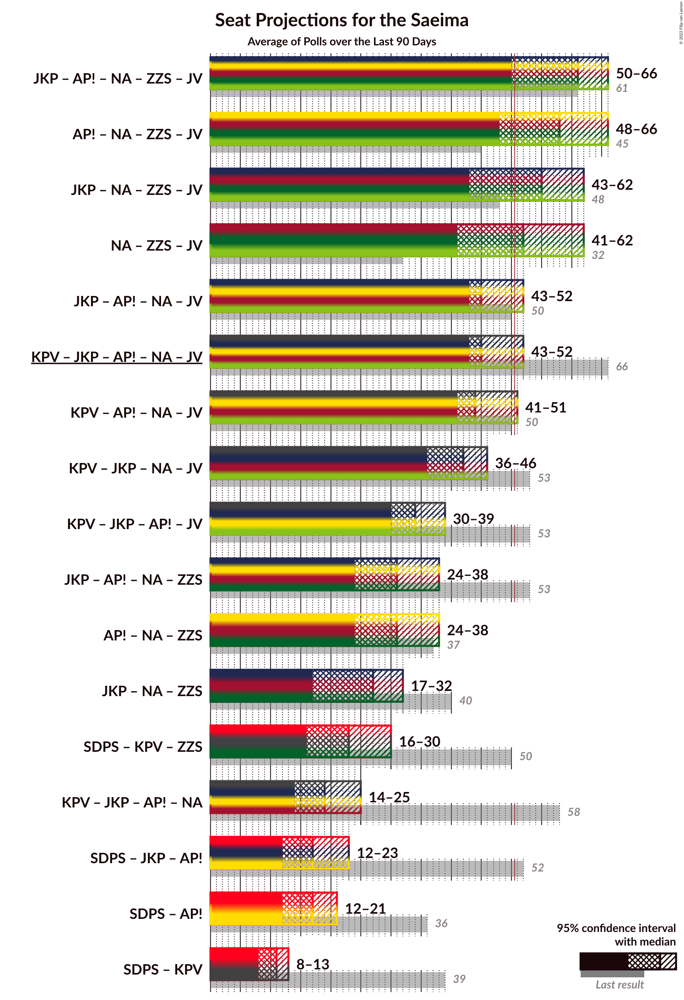
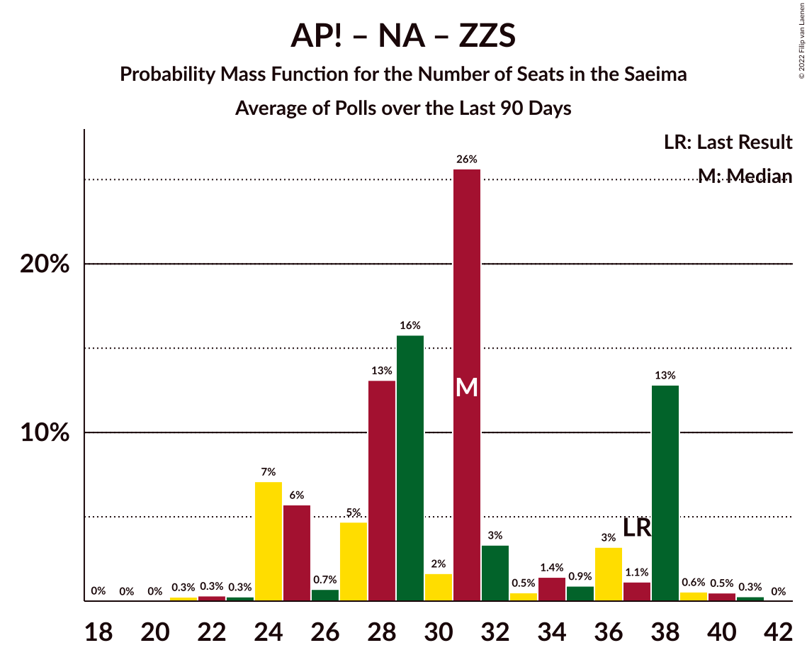

# Poll Average

<a href="#voting-intentions">Voting Intentions</a> | <a href="#seats">Seats</a> | <a href="#coalitions">Coalitions</a> | <a href="#technical-information">Technical Information</a>

## Summary

The table below lists the polls on which the average is based. They are the most recent polls (less than 90 days old) registered and analyzed so far.

| Period     | Polling firm/Commissioner(s) | SDPS | KPV | JKP | AP! | NA | ZZS | JV | LRA | LKS | P | NSL | VL | JS |
|:----------:|:----------------------------:|:--:|:--:|:--:|:--:|:--:|:--:|:--:|:--:|:--:|:--:|:--:|:--:|:--:|
| 6 October 2018 | General Election | 19.8%   23 | 14.2%   16 | 13.6%   16 | 12.0%   13 | 11.0%   13 | 9.9%   11 | 6.7%   8 | 4.1%   0 | 3.2%   0 | 2.6%   0 | 0.8%   0 | 0.0%   0 | 0.0%   0 |
| N/A | Poll Average | 17–30%   18–36 | 2–5%   0–6 | 8–14%   7–15 | 9–14%   8–16 | 9–13%   11–15 | 11–18%   12–20 | 9–14%   10–16 | 4–7%   0–7 | 2–5%   0 | 2–8%   0–8 | N/A   N/A | N/A   N/A | N/A   N/A |
| [1–31 March 2020](2020-03-31-SKDS.html) | SKDS   Latvijas Televīzija | 25–31%   26–36 | 3–6%   0–6 | 7–11%   7–13 | 9–13%   8–16 | 9–13%   11–16 | 14–19%   14–20 | 9–13%   9–14 | 4–7%   0–7 | 2–4%   0 | 2–4%   0 | N/A   N/A | N/A   N/A | N/A   N/A |
| [4–28 March 2020](2020-03-28-Factum.html) | Factum | 16–20%   18–23 | 1–3%   0 | 12–15%   13–16 | 12–15%   14–16 | 11–13%   11–14 | 11–13%   12–16 | 12–15%   12–17 | 4–6%   0–6 | 3–5%   0 | 6–8%   7–8 | N/A   N/A | N/A   N/A | N/A   N/A |
| 6 October 2018 | General Election | 19.8%   23 | 14.2%   16 | 13.6%   16 | 12.0%   13 | 11.0%   13 | 9.9%   11 | 6.7%   8 | 4.1%   0 | 3.2%   0 | 2.6%   0 | 0.8%   0 | 0.0%   0 | 0.0%   0 |

Only polls for which at least the sample size has been published are included in the table above.

**Legend:**
+ **Top half of each row:** Voting intentions (95% confidence interval)
+ **Bottom half of each row:** Seat projections for the Saeima (95% confidence interval)
+ **SDPS:** Sociāldemokrātiskā partija “Saskaņa”
+ **KPV:** Politiskā partija „KPV LV”
+ **JKP:** Jaunā konservatīvā partija
+ **AP!:** Attīstībai/Par!
+ **NA:** Nacionālā apvienība „Visu Latvijai!”–„Tēvzemei un Brīvībai/LNNK”
+ **ZZS:** Zaļo un Zemnieku savienība
+ **JV:** Jaunā VIENOTĪBA
+ **LRA:** Latvijas Reģionu Apvienība
+ **LKS:** Latvijas Krievu savienība
+ **P:** PROGRESĪVIE
+ **NSL:** No sirds Latvijai
+ **VL:** Vienoti Latvijai
+ **JS:** Jaunā Saskaņa
+ **N/A (single party):** Party not included the published results
+ **N/A (entire row):** Calculation for this opinion poll not started yet

## Voting Intentions

### Confidence Intervals

| Party | Last Result | Median | 80% Confidence Interval | 90% Confidence Interval | 95% Confidence Interval | 99% Confidence Interval |
|:-----:|:-----------:|:------:|:-----------------------:|:-----------------------:|:-----------------------:|:-----------------------:|
| <a href="#sociāldemokrātiskā-partija-“saskaņa”">Sociāldemokrātiskā partija “Saskaņa”</a> | 19.8% | 21.8% | 17.3–29.0% |16.9–29.7% | 16.6–30.2% | 16.1–31.3% |
| <a href="#politiskā-partija-„kpv-lv”">Politiskā partija „KPV LV”</a> | 14.2% | 2.8% | 1.8–4.7% |1.7–5.1% | 1.6–5.3% | 1.4–5.9% |
| <a href="#jaunā-konservatīvā-partija">Jaunā konservatīvā partija</a> | 13.6% | 11.4% | 8.3–13.6% |7.9–14.0% | 7.6–14.3% | 7.0–14.8% |
| <a href="#attīstībai/par!">Attīstībai/Par!</a> | 12.0% | 12.0% | 9.7–13.7% |9.3–14.0% | 9.0–14.3% | 8.4–14.8% |
| <a href="#nacionālā-apvienība-„visu-latvijai!”–„tēvzemei-un-brīvībai/lnnk”">Nacionālā apvienība „Visu Latvijai!”–„Tēvzemei un Brīvībai/LNNK”</a> | 11.0% | 11.6% | 10.1–12.8% |9.6–13.1% | 9.3–13.4% | 8.6–13.9% |
| <a href="#zaļo-un-zemnieku-savienība">Zaļo un Zemnieku savienība</a> | 9.9% | 13.6% | 11.4–17.2% |11.1–17.7% | 10.8–18.2% | 10.4–19.1% |
| <a href="#jaunā-vienotība">Jaunā VIENOTĪBA</a> | 6.7% | 12.2% | 10.1–13.7% |9.6–14.0% | 9.3–14.3% | 8.6–14.8% |
| <a href="#latvijas-reģionu-apvienība">Latvijas Reģionu Apvienība</a> | 4.1% | 5.2% | 4.5–6.2% |4.3–6.5% | 4.1–6.8% | 3.8–7.4% |
| <a href="#latvijas-krievu-savienība">Latvijas Krievu savienība</a> | 3.2% | 3.5% | 2.4–4.4% |2.2–4.6% | 2.0–4.8% | 1.7–5.2% |
| <a href="#progresīvie">PROGRESĪVIE</a> | 2.6% | 5.2% | 2.4–7.5% |2.2–7.8% | 2.0–8.0% | 1.7–8.5% |
| <a href="#no-sirds-latvijai">No sirds Latvijai</a> | 0.8% | N/A | N/A |N/A | N/A | N/A |
| <a href="#vienoti-latvijai">Vienoti Latvijai</a> | 0.0% | N/A | N/A |N/A | N/A | N/A |
| <a href="#jaunā-saskaņa">Jaunā Saskaņa</a> | 0.0% | N/A | N/A |N/A | N/A | N/A |

### Sociāldemokrātiskā partija “Saskaņa”

*For a full overview of the results for this party, see the [Sociāldemokrātiskā partija “Saskaņa”](party-sociāldemokrātiskāpartija“saskaņa”.html) page.*

| Voting Intentions | Probability | Accumulated | Special Marks |
|:-----------------:|:-----------:|:-----------:|:-------------:|
| 14.5–15.5% | 0.1% | 100% |  |
| 15.5–16.5% | 2% | 99.9% |  |
| 16.5–17.5% | 12% | 98% |  |
| 17.5–18.5% | 22% | 86% |  |
| 18.5–19.5% | 12% | 64% |  |
| 19.5–20.5% | 2% | 52% | Last Result |
| 20.5–21.5% | 0.1% | 50% |  |
| 21.5–22.5% | 0% | 50% | Median |
| 22.5–23.5% | 0.1% | 50% |  |
| 23.5–24.5% | 0.6% | 50% |  |
| 24.5–25.5% | 3% | 49% |  |
| 25.5–26.5% | 7% | 47% |  |
| 26.5–27.5% | 12% | 39% |  |
| 27.5–28.5% | 13% | 27% |  |
| 28.5–29.5% | 9% | 14% |  |
| 29.5–30.5% | 4% | 6% |  |
| 30.5–31.5% | 1.3% | 2% |  |
| 31.5–32.5% | 0.3% | 0.3% |  |
| 32.5–33.5% | 0% | 0% |  |

### Politiskā partija „KPV LV”

*For a full overview of the results for this party, see the [Politiskā partija „KPV LV”](party-politiskāpartija„kpvlv”.html) page.*

| Voting Intentions | Probability | Accumulated | Special Marks |
|:-----------------:|:-----------:|:-----------:|:-------------:|
| 0.0–0.5% | 0% | 100% |  |
| 0.5–1.5% | 2% | 100% |  |
| 1.5–2.5% | 44% | 98% |  |
| 2.5–3.5% | 12% | 53% | Median |
| 3.5–4.5% | 28% | 42% |  |
| 4.5–5.5% | 13% | 14% |  |
| 5.5–6.5% | 1.4% | 1.4% |  |
| 6.5–7.5% | 0% | 0% |  |
| 7.5–8.5% | 0% | 0% |  |
| 8.5–9.5% | 0% | 0% |  |
| 9.5–10.5% | 0% | 0% |  |
| 10.5–11.5% | 0% | 0% |  |
| 11.5–12.5% | 0% | 0% |  |
| 12.5–13.5% | 0% | 0% |  |
| 13.5–14.5% | 0% | 0% | Last Result |

### Jaunā konservatīvā partija

*For a full overview of the results for this party, see the [Jaunā konservatīvā partija](party-jaunākonservatīvāpartija.html) page.*

| Voting Intentions | Probability | Accumulated | Special Marks |
|:-----------------:|:-----------:|:-----------:|:-------------:|
| 4.5–5.5% | 0% | 100% |  |
| 5.5–6.5% | 0.1% | 100% |  |
| 6.5–7.5% | 2% | 99.9% |  |
| 7.5–8.5% | 13% | 98% |  |
| 8.5–9.5% | 20% | 85% |  |
| 9.5–10.5% | 11% | 65% |  |
| 10.5–11.5% | 4% | 53% | Median |
| 11.5–12.5% | 12% | 49% |  |
| 12.5–13.5% | 25% | 37% |  |
| 13.5–14.5% | 11% | 12% | Last Result |
| 14.5–15.5% | 1.1% | 1.2% |  |
| 15.5–16.5% | 0% | 0% |  |

### Attīstībai/Par!

*For a full overview of the results for this party, see the [Attīstībai/Par!](party-attīstībaipar.html) page.*

| Voting Intentions | Probability | Accumulated | Special Marks |
|:-----------------:|:-----------:|:-----------:|:-------------:|
| 6.5–7.5% | 0% | 100% |  |
| 7.5–8.5% | 0.8% | 100% |  |
| 8.5–9.5% | 7% | 99.1% |  |
| 9.5–10.5% | 17% | 92% |  |
| 10.5–11.5% | 18% | 76% |  |
| 11.5–12.5% | 19% | 58% | Last Result, Median |
| 12.5–13.5% | 26% | 38% |  |
| 13.5–14.5% | 11% | 12% |  |
| 14.5–15.5% | 1.2% | 1.2% |  |
| 15.5–16.5% | 0% | 0% |  |

### Nacionālā apvienība „Visu Latvijai!”–„Tēvzemei un Brīvībai/LNNK”

*For a full overview of the results for this party, see the [Nacionālā apvienība „Visu Latvijai!”–„Tēvzemei un Brīvībai/LNNK”](party-nacionālāapvienība„visulatvijai”–„tēvzemeiunbrīvībailnnk”.html) page.*

| Voting Intentions | Probability | Accumulated | Special Marks |
|:-----------------:|:-----------:|:-----------:|:-------------:|
| 6.5–7.5% | 0% | 100% |  |
| 7.5–8.5% | 0.4% | 100% |  |
| 8.5–9.5% | 4% | 99.6% |  |
| 9.5–10.5% | 15% | 96% |  |
| 10.5–11.5% | 31% | 81% | Last Result |
| 11.5–12.5% | 35% | 50% | Median |
| 12.5–13.5% | 14% | 15% |  |
| 13.5–14.5% | 1.4% | 1.4% |  |
| 14.5–15.5% | 0.1% | 0.1% |  |
| 15.5–16.5% | 0% | 0% |  |

### Zaļo un Zemnieku savienība

*For a full overview of the results for this party, see the [Zaļo un Zemnieku savienība](party-zaļounzemniekusavienība.html) page.*

| Voting Intentions | Probability | Accumulated | Special Marks |
|:-----------------:|:-----------:|:-----------:|:-------------:|
| 8.5–9.5% | 0% | 100% |  |
| 9.5–10.5% | 0.9% | 100% | Last Result |
| 10.5–11.5% | 12% | 99.1% |  |
| 11.5–12.5% | 25% | 87% |  |
| 12.5–13.5% | 11% | 62% |  |
| 13.5–14.5% | 5% | 50% | Median |
| 14.5–15.5% | 11% | 45% |  |
| 15.5–16.5% | 16% | 34% |  |
| 16.5–17.5% | 12% | 18% |  |
| 17.5–18.5% | 5% | 6% |  |
| 18.5–19.5% | 1.2% | 1.4% |  |
| 19.5–20.5% | 0.2% | 0.2% |  |
| 20.5–21.5% | 0% | 0% |  |

### Jaunā VIENOTĪBA

*For a full overview of the results for this party, see the [Jaunā VIENOTĪBA](party-jaunāvienotība.html) page.*

| Voting Intentions | Probability | Accumulated | Special Marks |
|:-----------------:|:-----------:|:-----------:|:-------------:|
| 6.5–7.5% | 0% | 100% | Last Result |
| 7.5–8.5% | 0.4% | 100% |  |
| 8.5–9.5% | 4% | 99.6% |  |
| 9.5–10.5% | 14% | 96% |  |
| 10.5–11.5% | 19% | 82% |  |
| 11.5–12.5% | 22% | 62% | Median |
| 12.5–13.5% | 28% | 40% |  |
| 13.5–14.5% | 11% | 12% |  |
| 14.5–15.5% | 1.2% | 1.2% |  |
| 15.5–16.5% | 0% | 0% |  |

### Latvijas Reģionu Apvienība

*For a full overview of the results for this party, see the [Latvijas Reģionu Apvienība](party-latvijasreģionuapvienība.html) page.*

| Voting Intentions | Probability | Accumulated | Special Marks |
|:-----------------:|:-----------:|:-----------:|:-------------:|
| 1.5–2.5% | 0% | 100% |  |
| 2.5–3.5% | 0.1% | 100% |  |
| 3.5–4.5% | 12% | 99.9% | Last Result |
| 4.5–5.5% | 56% | 88% | Median |
| 5.5–6.5% | 27% | 31% |  |
| 6.5–7.5% | 4% | 5% |  |
| 7.5–8.5% | 0.3% | 0.4% |  |
| 8.5–9.5% | 0% | 0% |  |

### Latvijas Krievu savienība

*For a full overview of the results for this party, see the [Latvijas Krievu savienība](party-latvijaskrievusavienība.html) page.*

| Voting Intentions | Probability | Accumulated | Special Marks |
|:-----------------:|:-----------:|:-----------:|:-------------:|
| 0.5–1.5% | 0.1% | 100% |  |
| 1.5–2.5% | 14% | 99.9% |  |
| 2.5–3.5% | 36% | 85% | Last Result |
| 3.5–4.5% | 43% | 50% | Median |
| 4.5–5.5% | 7% | 7% |  |
| 5.5–6.5% | 0.1% | 0.1% |  |
| 6.5–7.5% | 0% | 0% |  |

### PROGRESĪVIE

*For a full overview of the results for this party, see the [PROGRESĪVIE](party-progresīvie.html) page.*

| Voting Intentions | Probability | Accumulated | Special Marks |
|:-----------------:|:-----------:|:-----------:|:-------------:|
| 0.5–1.5% | 0.1% | 100% |  |
| 1.5–2.5% | 14% | 99.9% |  |
| 2.5–3.5% | 30% | 85% | Last Result |
| 3.5–4.5% | 6% | 56% |  |
| 4.5–5.5% | 0.3% | 50% | Median |
| 5.5–6.5% | 9% | 50% |  |
| 6.5–7.5% | 31% | 41% |  |
| 7.5–8.5% | 10% | 10% |  |
| 8.5–9.5% | 0.3% | 0.3% |  |
| 9.5–10.5% | 0% | 0% |  |

## Seats

### Confidence Intervals

| Party | Last Result | Median | 80% Confidence Interval | 90% Confidence Interval | 95% Confidence Interval | 99% Confidence Interval |
|:-----:|:-----------:|:------:|:-----------------------:|:-----------------------:|:-----------------------:|:-----------------------:|
| <a href="#sociāldemokrātiskā-partija-“saskaņa”">Sociāldemokrātiskā partija “Saskaņa”</a> | 23 | 24 | 20–31 |18–34 | 18–36 | 18–39 |
| <a href="#politiskā-partija-„kpv-lv”">Politiskā partija „KPV LV”</a> | 16 | 0 | 0–6 |0–6 | 0–6 | 0–6 |
| <a href="#jaunā-konservatīvā-partija">Jaunā konservatīvā partija</a> | 16 | 13 | 9–13 |9–14 | 7–15 | 7–17 |
| <a href="#attīstībai/par!">Attīstībai/Par!</a> | 13 | 14 | 9–15 |9–15 | 8–16 | 8–16 |
| <a href="#nacionālā-apvienība-„visu-latvijai!”–„tēvzemei-un-brīvībai/lnnk”">Nacionālā apvienība „Visu Latvijai!”–„Tēvzemei un Brīvībai/LNNK”</a> | 13 | 13 | 11–14 |11–14 | 11–15 | 7–16 |
| <a href="#zaļo-un-zemnieku-savienība">Zaļo un Zemnieku savienība</a> | 11 | 15 | 12–19 |12–20 | 12–20 | 11–21 |
| <a href="#jaunā-vienotība">Jaunā VIENOTĪBA</a> | 8 | 14 | 11–16 |11–16 | 10–16 | 9–17 |
| <a href="#latvijas-reģionu-apvienība">Latvijas Reģionu Apvienība</a> | 0 | 6 | 0–7 |0–7 | 0–7 | 0–9 |
| <a href="#latvijas-krievu-savienība">Latvijas Krievu savienība</a> | 0 | 0 | 0 |0 | 0 | 0–4 |
| <a href="#progresīvie">PROGRESĪVIE</a> | 0 | 6 | 0–8 |0–8 | 0–8 | 0–8 |
| <a href="#no-sirds-latvijai">No sirds Latvijai</a> | 0 | N/A | N/A |N/A | N/A | N/A |
| <a href="#vienoti-latvijai">Vienoti Latvijai</a> | 0 | N/A | N/A |N/A | N/A | N/A |
| <a href="#jaunā-saskaņa">Jaunā Saskaņa</a> | 0 | N/A | N/A |N/A | N/A | N/A |

### Sociāldemokrātiskā partija “Saskaņa”

*For a full overview of the results for this party, see the [Sociāldemokrātiskā partija “Saskaņa”](party-sociāldemokrātiskāpartija“saskaņa”.html) page.*

| Number of Seats | Probability | Accumulated | Special Marks |
|:---------------:|:-----------:|:-----------:|:-------------:|
| 17 | 0.4% | 100% |  |
| 18 | 6% | 99.6% |  |
| 19 | 3% | 93% |  |
| 20 | 6% | 91% |  |
| 21 | 24% | 85% |  |
| 22 | 4% | 61% |  |
| 23 | 7% | 57% | Last Result |
| 24 | 0.8% | 51% | Median |
| 25 | 0.6% | 50% |  |
| 26 | 1.0% | 49% |  |
| 27 | 17% | 48% |  |
| 28 | 2% | 31% |  |
| 29 | 1.2% | 29% |  |
| 30 | 0.6% | 27% |  |
| 31 | 19% | 27% |  |
| 32 | 0.1% | 7% |  |
| 33 | 2% | 7% |  |
| 34 | 2% | 6% |  |
| 35 | 0% | 4% |  |
| 36 | 3% | 4% |  |
| 37 | 0% | 0.8% |  |
| 38 | 0% | 0.7% |  |
| 39 | 0.7% | 0.7% |  |
| 40 | 0% | 0% |  |

### Politiskā partija „KPV LV”

*For a full overview of the results for this party, see the [Politiskā partija „KPV LV”](party-politiskāpartija„kpvlv”.html) page.*

| Number of Seats | Probability | Accumulated | Special Marks |
|:---------------:|:-----------:|:-----------:|:-------------:|
| 0 | 80% | 100% | Median |
| 1 | 0% | 20% |  |
| 2 | 0% | 20% |  |
| 3 | 0% | 20% |  |
| 4 | 0% | 20% |  |
| 5 | 1.1% | 20% |  |
| 6 | 19% | 19% |  |
| 7 | 0% | 0% |  |
| 8 | 0% | 0% |  |
| 9 | 0% | 0% |  |
| 10 | 0% | 0% |  |
| 11 | 0% | 0% |  |
| 12 | 0% | 0% |  |
| 13 | 0% | 0% |  |
| 14 | 0% | 0% |  |
| 15 | 0% | 0% |  |
| 16 | 0% | 0% | Last Result |

### Jaunā konservatīvā partija

*For a full overview of the results for this party, see the [Jaunā konservatīvā partija](party-jaunākonservatīvāpartija.html) page.*

| Number of Seats | Probability | Accumulated | Special Marks |
|:---------------:|:-----------:|:-----------:|:-------------:|
| 6 | 0.1% | 100% |  |
| 7 | 3% | 99.9% |  |
| 8 | 1.3% | 97% |  |
| 9 | 8% | 96% |  |
| 10 | 16% | 88% |  |
| 11 | 1.1% | 72% |  |
| 12 | 18% | 71% |  |
| 13 | 44% | 52% | Median |
| 14 | 5% | 9% |  |
| 15 | 2% | 4% |  |
| 16 | 1.0% | 2% | Last Result |
| 17 | 0.5% | 0.7% |  |
| 18 | 0.2% | 0.2% |  |
| 19 | 0% | 0% |  |

### Attīstībai/Par!

*For a full overview of the results for this party, see the [Attīstībai/Par!](party-attīstībaipar.html) page.*

| Number of Seats | Probability | Accumulated | Special Marks |
|:---------------:|:-----------:|:-----------:|:-------------:|
| 7 | 0.2% | 100% |  |
| 8 | 4% | 99.8% |  |
| 9 | 17% | 96% |  |
| 10 | 15% | 79% |  |
| 11 | 4% | 63% |  |
| 12 | 0.4% | 60% |  |
| 13 | 1.1% | 59% | Last Result |
| 14 | 21% | 58% | Median |
| 15 | 33% | 37% |  |
| 16 | 4% | 4% |  |
| 17 | 0% | 0% |  |

### Nacionālā apvienība „Visu Latvijai!”–„Tēvzemei un Brīvībai/LNNK”

*For a full overview of the results for this party, see the [Nacionālā apvienība „Visu Latvijai!”–„Tēvzemei un Brīvībai/LNNK”](party-nacionālāapvienība„visulatvijai”–„tēvzemeiunbrīvībailnnk”.html) page.*

| Number of Seats | Probability | Accumulated | Special Marks |
|:---------------:|:-----------:|:-----------:|:-------------:|
| 7 | 0.7% | 100% |  |
| 8 | 0.1% | 99.3% |  |
| 9 | 0% | 99.2% |  |
| 10 | 0.1% | 99.2% |  |
| 11 | 23% | 99.1% |  |
| 12 | 19% | 76% |  |
| 13 | 28% | 56% | Last Result, Median |
| 14 | 26% | 29% |  |
| 15 | 0.9% | 3% |  |
| 16 | 2% | 2% |  |
| 17 | 0% | 0% |  |

### Zaļo un Zemnieku savienība

*For a full overview of the results for this party, see the [Zaļo un Zemnieku savienība](party-zaļounzemniekusavienība.html) page.*

| Number of Seats | Probability | Accumulated | Special Marks |
|:---------------:|:-----------:|:-----------:|:-------------:|
| 11 | 1.2% | 100% | Last Result |
| 12 | 11% | 98.8% |  |
| 13 | 15% | 88% |  |
| 14 | 21% | 73% |  |
| 15 | 21% | 52% | Median |
| 16 | 5% | 31% |  |
| 17 | 3% | 26% |  |
| 18 | 1.2% | 23% |  |
| 19 | 16% | 22% |  |
| 20 | 5% | 6% |  |
| 21 | 1.2% | 1.2% |  |
| 22 | 0% | 0% |  |

### Jaunā VIENOTĪBA

*For a full overview of the results for this party, see the [Jaunā VIENOTĪBA](party-jaunāvienotība.html) page.*

| Number of Seats | Probability | Accumulated | Special Marks |
|:---------------:|:-----------:|:-----------:|:-------------:|
| 8 | 0% | 100% | Last Result |
| 9 | 2% | 100% |  |
| 10 | 2% | 98% |  |
| 11 | 25% | 96% |  |
| 12 | 8% | 71% |  |
| 13 | 8% | 63% |  |
| 14 | 26% | 55% | Median |
| 15 | 3% | 29% |  |
| 16 | 24% | 26% |  |
| 17 | 2% | 2% |  |
| 18 | 0% | 0% |  |

### Latvijas Reģionu Apvienība

*For a full overview of the results for this party, see the [Latvijas Reģionu Apvienība](party-latvijasreģionuapvienība.html) page.*

| Number of Seats | Probability | Accumulated | Special Marks |
|:---------------:|:-----------:|:-----------:|:-------------:|
| 0 | 38% | 100% | Last Result |
| 1 | 0% | 62% |  |
| 2 | 0% | 62% |  |
| 3 | 0% | 62% |  |
| 4 | 0% | 62% |  |
| 5 | 0% | 62% |  |
| 6 | 39% | 62% | Median |
| 7 | 22% | 23% |  |
| 8 | 0% | 0.6% |  |
| 9 | 0.6% | 0.6% |  |
| 10 | 0% | 0% |  |

### Latvijas Krievu savienība

*For a full overview of the results for this party, see the [Latvijas Krievu savienība](party-latvijaskrievusavienība.html) page.*

| Number of Seats | Probability | Accumulated | Special Marks |
|:---------------:|:-----------:|:-----------:|:-------------:|
| 0 | 99.4% | 100% | Last Result, Median |
| 1 | 0% | 0.6% |  |
| 2 | 0% | 0.6% |  |
| 3 | 0% | 0.6% |  |
| 4 | 0.3% | 0.6% |  |
| 5 | 0.1% | 0.3% |  |
| 6 | 0.2% | 0.2% |  |
| 7 | 0% | 0% |  |

### PROGRESĪVIE

*For a full overview of the results for this party, see the [PROGRESĪVIE](party-progresīvie.html) page.*

| Number of Seats | Probability | Accumulated | Special Marks |
|:---------------:|:-----------:|:-----------:|:-------------:|
| 0 | 50% | 100% | Last Result |
| 1 | 0% | 50% |  |
| 2 | 0% | 50% |  |
| 3 | 0% | 50% |  |
| 4 | 0% | 50% |  |
| 5 | 0% | 50% |  |
| 6 | 0.4% | 50% | Median |
| 7 | 20% | 50% |  |
| 8 | 30% | 30% |  |
| 9 | 0.4% | 0.4% |  |
| 10 | 0% | 0% |  |

### No sirds Latvijai

*For a full overview of the results for this party, see the [No sirds Latvijai](party-nosirdslatvijai.html) page.*

### Vienoti Latvijai

*For a full overview of the results for this party, see the [Vienoti Latvijai](party-vienotilatvijai.html) page.*

### Jaunā Saskaņa

*For a full overview of the results for this party, see the [Jaunā Saskaņa](party-jaunāsaskaņa.html) page.*

## Coalitions

### Confidence Intervals

| Coalition | Last Result | Median | Majority? | 80% Confidence Interval | 90% Confidence Interval | 95% Confidence Interval | 99% Confidence Interval |
|:---------:|:-----------:|:------:|:---------:|:-----------------------:|:-----------------------:|:-----------------------:|:-----------------------:|
| Jaunā konservatīvā partija – Attīstībai/Par! – Nacionālā apvienība „Visu Latvijai!”–„Tēvzemei un Brīvībai/LNNK” – Zaļo un Zemnieku savienība – Jaunā VIENOTĪBA | 61 | 67 | 100% | 56–71 | 56–72 | 56–73 | 56–73 |
| Jaunā konservatīvā partija – Nacionālā apvienība „Visu Latvijai!”–„Tēvzemei un Brīvībai/LNNK” – Zaļo un Zemnieku savienība – Jaunā VIENOTĪBA | 48 | 54 | 72% | 47–57 | 47–57 | 47–59 | 45–59 |
| Attīstībai/Par! – Nacionālā apvienība „Visu Latvijai!”–„Tēvzemei un Brīvībai/LNNK” – Zaļo un Zemnieku savienība – Jaunā VIENOTĪBA | 45 | 55 | 78% | 46–58 | 46–58 | 46–59 | 46–61 |
| Politiskā partija „KPV LV” – Jaunā konservatīvā partija – Attīstībai/Par! – Nacionālā apvienība „Visu Latvijai!”–„Tēvzemei un Brīvībai/LNNK” – Jaunā VIENOTĪBA | 66 | 52 | 53% | 47–58 | 45–58 | 43–59 | 41–59 |
| Jaunā konservatīvā partija – Attīstībai/Par! – Nacionālā apvienība „Visu Latvijai!”–„Tēvzemei un Brīvībai/LNNK” – Jaunā VIENOTĪBA | 50 | 52 | 52% | 41–58 | 41–58 | 41–59 | 41–59 |
| Jaunā konservatīvā partija – Attīstībai/Par! – Nacionālā apvienība „Visu Latvijai!”–„Tēvzemei un Brīvībai/LNNK” – Zaļo un Zemnieku savienība | 53 | 53 | 76% | 45–56 | 45–57 | 45–58 | 45–62 |
| Sociāldemokrātiskā partija “Saskaņa” – Jaunā konservatīvā partija – Attīstībai/Par! | 52 | 49 | 24% | 47–53 | 46–55 | 46–57 | 44–60 |
| Sociāldemokrātiskā partija “Saskaņa” – Politiskā partija „KPV LV” – Zaļo un Zemnieku savienība | 50 | 41 | 25% | 32–52 | 30–53 | 30–54 | 30–55 |
| Nacionālā apvienība „Visu Latvijai!”–„Tēvzemei un Brīvībai/LNNK” – Zaļo un Zemnieku savienība – Jaunā VIENOTĪBA | 32 | 42 | 0% | 37–45 | 37–45 | 37–47 | 36–50 |
| Attīstībai/Par! – Nacionālā apvienība „Visu Latvijai!”–„Tēvzemei un Brīvībai/LNNK” – Zaļo un Zemnieku savienība | 37 | 41 | 0% | 35–43 | 35–45 | 35–47 | 35–50 |
| Sociāldemokrātiskā partija “Saskaņa” – Attīstībai/Par! | 36 | 37 | 0% | 34–42 | 33–44 | 33–47 | 32–50 |
| Jaunā konservatīvā partija – Nacionālā apvienība „Visu Latvijai!”–„Tēvzemei un Brīvībai/LNNK” – Zaļo un Zemnieku savienība | 40 | 40 | 0% | 36–43 | 36–43 | 36–45 | 36–48 |
| Politiskā partija „KPV LV” – Attīstībai/Par! – Nacionālā apvienība „Visu Latvijai!”–„Tēvzemei un Brīvībai/LNNK” – Jaunā VIENOTĪBA | 50 | 40 | 0% | 36–44 | 35–45 | 34–45 | 32–45 |
| Politiskā partija „KPV LV” – Jaunā konservatīvā partija – Attīstībai/Par! – Jaunā VIENOTĪBA | 53 | 39 | 0% | 35–44 | 33–44 | 29–45 | 29–46 |
| Politiskā partija „KPV LV” – Jaunā konservatīvā partija – Nacionālā apvienība „Visu Latvijai!”–„Tēvzemei un Brīvībai/LNNK” – Jaunā VIENOTĪBA | 53 | 38 | 0% | 35–43 | 34–43 | 32–44 | 27–45 |
| Politiskā partija „KPV LV” – Jaunā konservatīvā partija – Attīstībai/Par! – Nacionālā apvienība „Visu Latvijai!”–„Tēvzemei un Brīvībai/LNNK” | 58 | 40 | 0% | 34–42 | 32–43 | 31–43 | 30–45 |
| Sociāldemokrātiskā partija “Saskaņa” – Politiskā partija „KPV LV” | 39 | 24 | 0% | 20–37 | 18–37 | 18–37 | 18–39 |

### Jaunā konservatīvā partija – Attīstībai/Par! – Nacionālā apvienība „Visu Latvijai!”–„Tēvzemei un Brīvībai/LNNK” – Zaļo un Zemnieku savienība – Jaunā VIENOTĪBA

| Number of Seats | Probability | Accumulated | Special Marks |
|:---------------:|:-----------:|:-----------:|:-------------:|
| 56 | 16% | 100% |  |
| 57 | 0% | 84% |  |
| 58 | 3% | 84% |  |
| 59 | 2% | 81% |  |
| 60 | 0% | 79% |  |
| 61 | 2% | 79% | Last Result |
| 62 | 2% | 77% |  |
| 63 | 0.7% | 74% |  |
| 64 | 2% | 74% |  |
| 65 | 4% | 71% |  |
| 66 | 6% | 68% |  |
| 67 | 19% | 61% |  |
| 68 | 8% | 42% |  |
| 69 | 4% | 34% | Median |
| 70 | 6% | 31% |  |
| 71 | 18% | 24% |  |
| 72 | 3% | 6% |  |
| 73 | 3% | 3% |  |
| 74 | 0% | 0.1% |  |
| 75 | 0% | 0% |  |

### Jaunā konservatīvā partija – Nacionālā apvienība „Visu Latvijai!”–„Tēvzemei un Brīvībai/LNNK” – Zaļo un Zemnieku savienība – Jaunā VIENOTĪBA

| Number of Seats | Probability | Accumulated | Special Marks |
|:---------------:|:-----------:|:-----------:|:-------------:|
| 45 | 2% | 100% |  |
| 46 | 0% | 98% |  |
| 47 | 17% | 98% |  |
| 48 | 0.1% | 81% | Last Result |
| 49 | 2% | 81% |  |
| 50 | 6% | 78% |  |
| 51 | 4% | 72% | Majority |
| 52 | 5% | 68% |  |
| 53 | 11% | 63% |  |
| 54 | 3% | 53% |  |
| 55 | 6% | 49% | Median |
| 56 | 20% | 43% |  |
| 57 | 19% | 24% |  |
| 58 | 2% | 5% |  |
| 59 | 3% | 3% |  |
| 60 | 0.1% | 0.1% |  |
| 61 | 0% | 0% |  |

### Attīstībai/Par! – Nacionālā apvienība „Visu Latvijai!”–„Tēvzemei un Brīvībai/LNNK” – Zaļo un Zemnieku savienība – Jaunā VIENOTĪBA

| Number of Seats | Probability | Accumulated | Special Marks |
|:---------------:|:-----------:|:-----------:|:-------------:|
| 45 | 0% | 100% | Last Result |
| 46 | 16% | 100% |  |
| 47 | 0% | 84% |  |
| 48 | 0.8% | 84% |  |
| 49 | 5% | 83% |  |
| 50 | 0.3% | 79% |  |
| 51 | 2% | 78% | Majority |
| 52 | 7% | 76% |  |
| 53 | 3% | 69% |  |
| 54 | 6% | 66% |  |
| 55 | 23% | 60% |  |
| 56 | 3% | 36% | Median |
| 57 | 9% | 34% |  |
| 58 | 21% | 25% |  |
| 59 | 2% | 4% |  |
| 60 | 0.1% | 2% |  |
| 61 | 2% | 2% |  |
| 62 | 0% | 0% |  |

### Politiskā partija „KPV LV” – Jaunā konservatīvā partija – Attīstībai/Par! – Nacionālā apvienība „Visu Latvijai!”–„Tēvzemei un Brīvībai/LNNK” – Jaunā VIENOTĪBA

| Number of Seats | Probability | Accumulated | Special Marks |
|:---------------:|:-----------:|:-----------:|:-------------:|
| 41 | 0.7% | 100% |  |
| 42 | 0.1% | 99.3% |  |
| 43 | 3% | 99.1% |  |
| 44 | 0% | 96% |  |
| 45 | 1.4% | 96% |  |
| 46 | 2% | 95% |  |
| 47 | 19% | 92% |  |
| 48 | 18% | 74% |  |
| 49 | 3% | 56% |  |
| 50 | 0.1% | 53% |  |
| 51 | 3% | 53% | Majority |
| 52 | 2% | 50% |  |
| 53 | 5% | 48% |  |
| 54 | 6% | 43% | Median |
| 55 | 2% | 37% |  |
| 56 | 7% | 35% |  |
| 57 | 18% | 28% |  |
| 58 | 7% | 10% |  |
| 59 | 3% | 3% |  |
| 60 | 0% | 0.1% |  |
| 61 | 0.1% | 0.1% |  |
| 62 | 0% | 0% |  |
| 63 | 0% | 0% |  |
| 64 | 0% | 0% |  |
| 65 | 0% | 0% |  |
| 66 | 0% | 0% | Last Result |

### Jaunā konservatīvā partija – Attīstībai/Par! – Nacionālā apvienība „Visu Latvijai!”–„Tēvzemei un Brīvībai/LNNK” – Jaunā VIENOTĪBA

| Number of Seats | Probability | Accumulated | Special Marks |
|:---------------:|:-----------:|:-----------:|:-------------:|
| 41 | 17% | 100% |  |
| 42 | 0.5% | 83% |  |
| 43 | 5% | 83% |  |
| 44 | 0.1% | 78% |  |
| 45 | 2% | 77% |  |
| 46 | 3% | 76% |  |
| 47 | 3% | 72% |  |
| 48 | 17% | 70% |  |
| 49 | 0.6% | 53% |  |
| 50 | 0% | 52% | Last Result |
| 51 | 2% | 52% | Majority |
| 52 | 2% | 50% |  |
| 53 | 5% | 48% |  |
| 54 | 6% | 43% | Median |
| 55 | 2% | 37% |  |
| 56 | 7% | 35% |  |
| 57 | 18% | 28% |  |
| 58 | 7% | 10% |  |
| 59 | 3% | 3% |  |
| 60 | 0% | 0.1% |  |
| 61 | 0.1% | 0.1% |  |
| 62 | 0% | 0% |  |

### Jaunā konservatīvā partija – Attīstībai/Par! – Nacionālā apvienība „Visu Latvijai!”–„Tēvzemei un Brīvībai/LNNK” – Zaļo un Zemnieku savienība

| Number of Seats | Probability | Accumulated | Special Marks |
|:---------------:|:-----------:|:-----------:|:-------------:|
| 43 | 0.3% | 100% |  |
| 44 | 0% | 99.7% |  |
| 45 | 16% | 99.7% |  |
| 46 | 3% | 84% |  |
| 47 | 0.1% | 81% |  |
| 48 | 0.5% | 81% |  |
| 49 | 0.4% | 80% |  |
| 50 | 4% | 80% |  |
| 51 | 2% | 76% | Majority |
| 52 | 3% | 74% |  |
| 53 | 23% | 70% | Last Result |
| 54 | 15% | 47% |  |
| 55 | 21% | 32% | Median |
| 56 | 6% | 11% |  |
| 57 | 2% | 5% |  |
| 58 | 0.7% | 3% |  |
| 59 | 0.2% | 2% |  |
| 60 | 0.2% | 2% |  |
| 61 | 0% | 2% |  |
| 62 | 2% | 2% |  |
| 63 | 0% | 0% |  |

### Sociāldemokrātiskā partija “Saskaņa” – Jaunā konservatīvā partija – Attīstībai/Par!

| Number of Seats | Probability | Accumulated | Special Marks |
|:---------------:|:-----------:|:-----------:|:-------------:|
| 44 | 1.3% | 100% |  |
| 45 | 0.7% | 98.6% |  |
| 46 | 6% | 98% |  |
| 47 | 6% | 92% |  |
| 48 | 6% | 86% |  |
| 49 | 36% | 80% |  |
| 50 | 20% | 44% |  |
| 51 | 8% | 24% | Median, Majority |
| 52 | 2% | 15% | Last Result |
| 53 | 5% | 13% |  |
| 54 | 1.4% | 8% |  |
| 55 | 3% | 6% |  |
| 56 | 0.8% | 3% |  |
| 57 | 0.6% | 3% |  |
| 58 | 0% | 2% |  |
| 59 | 1.3% | 2% |  |
| 60 | 0.7% | 0.7% |  |
| 61 | 0% | 0% |  |

### Sociāldemokrātiskā partija “Saskaņa” – Politiskā partija „KPV LV” – Zaļo un Zemnieku savienība

| Number of Seats | Probability | Accumulated | Special Marks |
|:---------------:|:-----------:|:-----------:|:-------------:|
| 28 | 0.3% | 100% |  |
| 29 | 0.1% | 99.7% |  |
| 30 | 6% | 99.6% |  |
| 31 | 0.9% | 93% |  |
| 32 | 3% | 92% |  |
| 33 | 4% | 90% |  |
| 34 | 10% | 86% |  |
| 35 | 18% | 76% |  |
| 36 | 5% | 58% |  |
| 37 | 0.2% | 53% |  |
| 38 | 1.3% | 53% |  |
| 39 | 2% | 52% | Median |
| 40 | 0% | 50% |  |
| 41 | 0% | 50% |  |
| 42 | 0.6% | 50% |  |
| 43 | 0% | 49% |  |
| 44 | 0% | 49% |  |
| 45 | 2% | 49% |  |
| 46 | 17% | 48% |  |
| 47 | 3% | 31% |  |
| 48 | 0.7% | 28% |  |
| 49 | 0.1% | 27% |  |
| 50 | 2% | 27% | Last Result |
| 51 | 3% | 25% | Majority |
| 52 | 16% | 22% |  |
| 53 | 1.4% | 6% |  |
| 54 | 3% | 4% |  |
| 55 | 0.9% | 1.3% |  |
| 56 | 0.1% | 0.4% |  |
| 57 | 0% | 0.3% |  |
| 58 | 0.3% | 0.3% |  |
| 59 | 0% | 0% |  |

### Nacionālā apvienība „Visu Latvijai!”–„Tēvzemei un Brīvībai/LNNK” – Zaļo un Zemnieku savienība – Jaunā VIENOTĪBA

| Number of Seats | Probability | Accumulated | Special Marks |
|:---------------:|:-----------:|:-----------:|:-------------:|
| 32 | 0% | 100% | Last Result |
| 33 | 0% | 100% |  |
| 34 | 0% | 100% |  |
| 35 | 0% | 100% |  |
| 36 | 2% | 100% |  |
| 37 | 16% | 98% |  |
| 38 | 7% | 82% |  |
| 39 | 5% | 75% |  |
| 40 | 14% | 70% |  |
| 41 | 6% | 56% |  |
| 42 | 7% | 50% | Median |
| 43 | 22% | 44% |  |
| 44 | 2% | 21% |  |
| 45 | 15% | 19% |  |
| 46 | 0.6% | 4% |  |
| 47 | 2% | 3% |  |
| 48 | 0% | 1.1% |  |
| 49 | 0.1% | 1.1% |  |
| 50 | 1.0% | 1.0% |  |
| 51 | 0% | 0% | Majority |

### Attīstībai/Par! – Nacionālā apvienība „Visu Latvijai!”–„Tēvzemei un Brīvībai/LNNK” – Zaļo un Zemnieku savienība

| Number of Seats | Probability | Accumulated | Special Marks |
|:---------------:|:-----------:|:-----------:|:-------------:|
| 35 | 16% | 100% |  |
| 36 | 0.5% | 84% |  |
| 37 | 5% | 84% | Last Result |
| 38 | 2% | 79% |  |
| 39 | 3% | 77% |  |
| 40 | 6% | 74% |  |
| 41 | 33% | 68% |  |
| 42 | 23% | 35% | Median |
| 43 | 4% | 12% |  |
| 44 | 1.4% | 8% |  |
| 45 | 2% | 7% |  |
| 46 | 1.0% | 4% |  |
| 47 | 1.4% | 3% |  |
| 48 | 0% | 2% |  |
| 49 | 0% | 2% |  |
| 50 | 2% | 2% |  |
| 51 | 0% | 0% | Majority |

### Sociāldemokrātiskā partija “Saskaņa” – Attīstībai/Par!

| Number of Seats | Probability | Accumulated | Special Marks |
|:---------------:|:-----------:|:-----------:|:-------------:|
| 30 | 0% | 100% |  |
| 31 | 0.4% | 99.9% |  |
| 32 | 0.6% | 99.6% |  |
| 33 | 7% | 98.9% |  |
| 34 | 4% | 92% |  |
| 35 | 8% | 87% |  |
| 36 | 20% | 79% | Last Result |
| 37 | 18% | 59% |  |
| 38 | 6% | 40% | Median |
| 39 | 1.2% | 34% |  |
| 40 | 16% | 33% |  |
| 41 | 2% | 16% |  |
| 42 | 5% | 14% |  |
| 43 | 2% | 9% |  |
| 44 | 4% | 8% |  |
| 45 | 0% | 4% |  |
| 46 | 0.3% | 4% |  |
| 47 | 2% | 4% |  |
| 48 | 0.6% | 2% |  |
| 49 | 0% | 1.3% |  |
| 50 | 1.3% | 1.3% |  |
| 51 | 0% | 0% | Majority |

### Jaunā konservatīvā partija – Nacionālā apvienība „Visu Latvijai!”–„Tēvzemei un Brīvībai/LNNK” – Zaļo un Zemnieku savienība

| Number of Seats | Probability | Accumulated | Special Marks |
|:---------------:|:-----------:|:-----------:|:-------------:|
| 34 | 0.1% | 100% |  |
| 35 | 0.2% | 99.9% |  |
| 36 | 21% | 99.8% |  |
| 37 | 0.7% | 78% |  |
| 38 | 5% | 78% |  |
| 39 | 16% | 73% |  |
| 40 | 28% | 57% | Last Result |
| 41 | 4% | 29% | Median |
| 42 | 4% | 25% |  |
| 43 | 17% | 21% |  |
| 44 | 2% | 5% |  |
| 45 | 0.9% | 3% |  |
| 46 | 0.1% | 2% |  |
| 47 | 0% | 2% |  |
| 48 | 2% | 2% |  |
| 49 | 0% | 0% |  |

### Politiskā partija „KPV LV” – Attīstībai/Par! – Nacionālā apvienība „Visu Latvijai!”–„Tēvzemei un Brīvībai/LNNK” – Jaunā VIENOTĪBA

| Number of Seats | Probability | Accumulated | Special Marks |
|:---------------:|:-----------:|:-----------:|:-------------:|
| 32 | 1.5% | 100% |  |
| 33 | 0% | 98.5% |  |
| 34 | 3% | 98.5% |  |
| 35 | 2% | 95% |  |
| 36 | 15% | 93% |  |
| 37 | 18% | 77% |  |
| 38 | 4% | 59% |  |
| 39 | 5% | 55% |  |
| 40 | 3% | 50% |  |
| 41 | 8% | 47% | Median |
| 42 | 5% | 39% |  |
| 43 | 8% | 34% |  |
| 44 | 18% | 25% |  |
| 45 | 8% | 8% |  |
| 46 | 0% | 0.1% |  |
| 47 | 0% | 0% |  |
| 48 | 0% | 0% |  |
| 49 | 0% | 0% |  |
| 50 | 0% | 0% | Last Result |

### Politiskā partija „KPV LV” – Jaunā konservatīvā partija – Attīstībai/Par! – Jaunā VIENOTĪBA

| Number of Seats | Probability | Accumulated | Special Marks |
|:---------------:|:-----------:|:-----------:|:-------------:|
| 29 | 3% | 100% |  |
| 30 | 0% | 97% |  |
| 31 | 0.1% | 97% |  |
| 32 | 1.4% | 97% |  |
| 33 | 2% | 95% |  |
| 34 | 2% | 93% |  |
| 35 | 5% | 92% |  |
| 36 | 33% | 87% |  |
| 37 | 2% | 53% |  |
| 38 | 0.3% | 51% |  |
| 39 | 3% | 51% |  |
| 40 | 5% | 48% |  |
| 41 | 5% | 43% | Median |
| 42 | 8% | 38% |  |
| 43 | 4% | 31% |  |
| 44 | 22% | 27% |  |
| 45 | 4% | 5% |  |
| 46 | 1.0% | 1.1% |  |
| 47 | 0.1% | 0.1% |  |
| 48 | 0% | 0% |  |
| 49 | 0% | 0% |  |
| 50 | 0% | 0% |  |
| 51 | 0% | 0% | Majority |
| 52 | 0% | 0% |  |
| 53 | 0% | 0% | Last Result |

### Politiskā partija „KPV LV” – Jaunā konservatīvā partija – Nacionālā apvienība „Visu Latvijai!”–„Tēvzemei un Brīvībai/LNNK” – Jaunā VIENOTĪBA

| Number of Seats | Probability | Accumulated | Special Marks |
|:---------------:|:-----------:|:-----------:|:-------------:|
| 27 | 0.7% | 100% |  |
| 28 | 0.1% | 99.3% |  |
| 29 | 0.1% | 99.2% |  |
| 30 | 1.5% | 99.1% |  |
| 31 | 0% | 98% |  |
| 32 | 0.6% | 98% |  |
| 33 | 2% | 97% |  |
| 34 | 0.6% | 96% |  |
| 35 | 6% | 95% |  |
| 36 | 1.2% | 89% |  |
| 37 | 6% | 88% |  |
| 38 | 34% | 82% |  |
| 39 | 3% | 48% |  |
| 40 | 8% | 44% | Median |
| 41 | 6% | 36% |  |
| 42 | 18% | 30% |  |
| 43 | 8% | 12% |  |
| 44 | 3% | 4% |  |
| 45 | 0.7% | 0.8% |  |
| 46 | 0.2% | 0.2% |  |
| 47 | 0% | 0% |  |
| 48 | 0% | 0% |  |
| 49 | 0% | 0% |  |
| 50 | 0% | 0% |  |
| 51 | 0% | 0% | Majority |
| 52 | 0% | 0% |  |
| 53 | 0% | 0% | Last Result |

### Politiskā partija „KPV LV” – Jaunā konservatīvā partija – Attīstībai/Par! – Nacionālā apvienība „Visu Latvijai!”–„Tēvzemei un Brīvībai/LNNK”

| Number of Seats | Probability | Accumulated | Special Marks |
|:---------------:|:-----------:|:-----------:|:-------------:|
| 28 | 0% | 100% |  |
| 29 | 0% | 99.9% |  |
| 30 | 0.7% | 99.9% |  |
| 31 | 4% | 99.2% |  |
| 32 | 1.0% | 96% |  |
| 33 | 0% | 95% |  |
| 34 | 17% | 95% |  |
| 35 | 0.7% | 78% |  |
| 36 | 19% | 77% |  |
| 37 | 2% | 58% |  |
| 38 | 1.1% | 56% |  |
| 39 | 4% | 55% |  |
| 40 | 11% | 51% | Median |
| 41 | 19% | 40% |  |
| 42 | 16% | 21% |  |
| 43 | 4% | 5% |  |
| 44 | 0.2% | 1.3% |  |
| 45 | 0.9% | 1.1% |  |
| 46 | 0% | 0.2% |  |
| 47 | 0.2% | 0.2% |  |
| 48 | 0% | 0% |  |
| 49 | 0% | 0% |  |
| 50 | 0% | 0% |  |
| 51 | 0% | 0% | Majority |
| 52 | 0% | 0% |  |
| 53 | 0% | 0% |  |
| 54 | 0% | 0% |  |
| 55 | 0% | 0% |  |
| 56 | 0% | 0% |  |
| 57 | 0% | 0% |  |
| 58 | 0% | 0% | Last Result |

### Sociāldemokrātiskā partija “Saskaņa” – Politiskā partija „KPV LV”

| Number of Seats | Probability | Accumulated | Special Marks |
|:---------------:|:-----------:|:-----------:|:-------------:|
| 17 | 0.4% | 100% |  |
| 18 | 6% | 99.6% |  |
| 19 | 3% | 93% |  |
| 20 | 6% | 91% |  |
| 21 | 24% | 85% |  |
| 22 | 4% | 61% |  |
| 23 | 7% | 57% |  |
| 24 | 0.8% | 51% | Median |
| 25 | 0.6% | 50% |  |
| 26 | 1.0% | 49% |  |
| 27 | 17% | 48% |  |
| 28 | 0% | 31% |  |
| 29 | 1.2% | 31% |  |
| 30 | 0.5% | 30% |  |
| 31 | 2% | 29% |  |
| 32 | 0.1% | 27% |  |
| 33 | 1.4% | 27% |  |
| 34 | 4% | 25% |  |
| 35 | 0% | 21% |  |
| 36 | 4% | 21% |  |
| 37 | 16% | 17% |  |
| 38 | 0% | 1.1% |  |
| 39 | 1.0% | 1.0% | Last Result |
| 40 | 0% | 0% |  |

## Technical Information

+ **Number of polls included in this average:** 2
+ **Lowest number of simulations done in a poll included in this average:** 16,384
+ **Total number of simulations done in the polls included in this average:** 147,456
+ **Error estimate:** 4.01%
