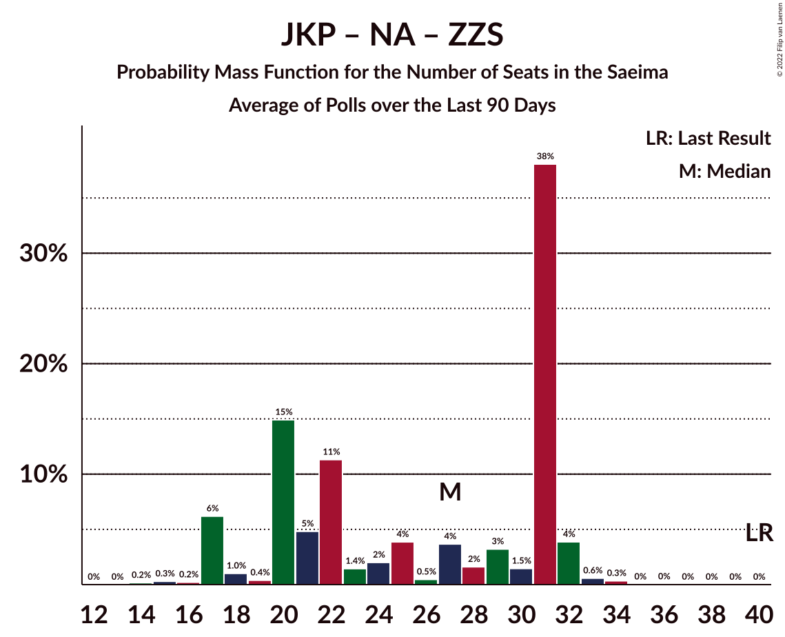

# Poll Average

<a href="#voting-intentions">Voting Intentions</a> | <a href="#seats">Seats</a> | <a href="#coalitions">Coalitions</a> | <a href="#technical-information">Technical Information</a>

## Summary

The table below lists the polls on which the average is based. They are the most recent polls (less than 90 days old) registered and analyzed so far.

| Period     | Polling firm/Commissioner(s) | SDPS | KPV | JKP | AP! | NA | ZZS | JV | LRA | LKS | P | NSL | VL | JS | LuK | LPV | R |
|:----------:|:----------------------------:|:--:|:--:|:--:|:--:|:--:|:--:|:--:|:--:|:--:|:--:|:--:|:--:|:--:|:--:|:--:|:--:|
| 6 October 2018 | General Election | 19.8%   23 | 14.2%   16 | 13.6%   16 | 12.0%   13 | 11.0%   13 | 9.9%   11 | 6.7%   8 | 4.1%   0 | 3.2%   0 | 2.6%   0 | 0.8%   0 | 0.0%   0 | 0.0%   0 | 0.0%   0 | 0.0%   0 | 0.0%   0 |
| N/A | Poll Average | 20–25%   21–28 | 0–2%   0 | 4–7%   0–7 | 7–11%   7–12 | 11–15%   11–17 | 11–15%   11–18 | 10–14%   11–16 | 4–6%   0–7 | 4–7%   0–8 | 5–8%   5–8 | N/A   N/A | N/A   N/A | N/A   N/A | 4–7%   0–8 | N/A   N/A | N/A   N/A |
| [1–31 August 2021](2021-08-31-SKDS.html) | SKDS   Latvijas Televīzija | 20–25%   21–28 | 0–2%   0 | 4–7%   0–7 | 7–11%   7–12 | 11–15%   11–17 | 11–15%   11–18 | 10–14%   11–16 | 4–7%   0–7 | 5–7%   0–8 | 5–8%   5–8 | N/A   N/A | N/A   N/A | N/A   N/A | 4–7%   0–8 | N/A   N/A | N/A   N/A |
| [27–31 August 2021](2021-08-31-FactumInteractive.html) | Factum Interactive | N/A   N/A | N/A   N/A | N/A   N/A | N/A   N/A | N/A   N/A | N/A   N/A | N/A   N/A | N/A   N/A | N/A   N/A | N/A   N/A | N/A   N/A | N/A   N/A | N/A   N/A | N/A   N/A | N/A   N/A | N/A   N/A |
| 6 October 2018 | General Election | 19.8%   23 | 14.2%   16 | 13.6%   16 | 12.0%   13 | 11.0%   13 | 9.9%   11 | 6.7%   8 | 4.1%   0 | 3.2%   0 | 2.6%   0 | 0.8%   0 | 0.0%   0 | 0.0%   0 | 0.0%   0 | 0.0%   0 | 0.0%   0 |

Only polls for which at least the sample size has been published are included in the table above.

**Legend:**
+ **Top half of each row:** Voting intentions (95% confidence interval)
+ **Bottom half of each row:** Seat projections for the Saeima (95% confidence interval)
+ **SDPS:** Sociāldemokrātiskā partija “Saskaņa”
+ **KPV:** Politiskā partija „KPV LV”
+ **JKP:** Jaunā konservatīvā partija
+ **AP!:** Attīstībai/Par!
+ **NA:** Nacionālā apvienība „Visu Latvijai!”–„Tēvzemei un Brīvībai/LNNK”
+ **ZZS:** Zaļo un Zemnieku savienība
+ **JV:** Jaunā VIENOTĪBA
+ **LRA:** Latvijas Reģionu Apvienība
+ **LKS:** Latvijas Krievu savienība
+ **P:** PROGRESĪVIE
+ **NSL:** No sirds Latvijai
+ **VL:** Vienoti Latvijai
+ **JS:** Jaunā Saskaņa
+ **LuK:** Likums un kārtība
+ **LPV:** Latvija pirmajā vietā
+ **R:** Republika
+ **N/A (single party):** Party not included the published results
+ **N/A (entire row):** Calculation for this opinion poll not started yet

## Voting Intentions

### Confidence Intervals

| Party | Last Result | Median | 80% Confidence Interval | 90% Confidence Interval | 95% Confidence Interval | 99% Confidence Interval |
|:-----:|:-----------:|:------:|:-----------------------:|:-----------------------:|:-----------------------:|:-----------------------:|
| <a href="#sociāldemokrātiskā-partija-“saskaņa”">Sociāldemokrātiskā partija “Saskaņa”</a> | 19.8% | 22.1% | 20.5–23.8% |20.0–24.3% | 19.7–24.7% | 18.9–25.5% |
| <a href="#politiskā-partija-„kpv-lv”">Politiskā partija „KPV LV”</a> | 14.2% | 0.8% | 0.5–1.2% |0.4–1.4% | 0.4–1.5% | 0.3–1.8% |
| <a href="#jaunā-konservatīvā-partija">Jaunā konservatīvā partija</a> | 13.6% | 5.6% | 4.7–6.5% |4.5–6.8% | 4.3–7.0% | 3.9–7.6% |
| <a href="#attīstībai/par!">Attīstībai/Par!</a> | 12.0% | 8.9% | 7.8–10.1% |7.5–10.4% | 7.3–10.8% | 6.8–11.4% |
| <a href="#nacionālā-apvienība-„visu-latvijai!”–„tēvzemei-un-brīvībai/lnnk”">Nacionālā apvienība „Visu Latvijai!”–„Tēvzemei un Brīvībai/LNNK”</a> | 11.0% | 12.6% | 11.3–13.9% |11.0–14.3% | 10.6–14.7% | 10.1–15.4% |
| <a href="#zaļo-un-zemnieku-savienība">Zaļo un Zemnieku savienība</a> | 9.9% | 13.0% | 11.7–14.3% |11.3–14.7% | 11.0–15.1% | 10.4–15.8% |
| <a href="#jaunā-vienotība">Jaunā VIENOTĪBA</a> | 6.7% | 11.9% | 10.6–13.2% |10.3–13.6% | 10.0–14.0% | 9.5–14.6% |
| <a href="#latvijas-reģionu-apvienība">Latvijas Reģionu Apvienība</a> | 4.1% | 5.1% | 4.2–6.0% |4.0–6.3% | 3.8–6.5% | 3.5–7.0% |
| <a href="#latvijas-krievu-savienība">Latvijas Krievu savienība</a> | 3.2% | 5.8% | 4.9–6.8% |4.7–7.1% | 4.5–7.4% | 4.2–7.9% |
| <a href="#progresīvie">PROGRESĪVIE</a> | 2.6% | 6.3% | 5.4–7.3% |5.2–7.6% | 4.9–7.9% | 4.6–8.5% |
| <a href="#no-sirds-latvijai">No sirds Latvijai</a> | 0.8% | N/A | N/A |N/A | N/A | N/A |
| <a href="#vienoti-latvijai">Vienoti Latvijai</a> | 0.0% | N/A | N/A |N/A | N/A | N/A |
| <a href="#jaunā-saskaņa">Jaunā Saskaņa</a> | 0.0% | N/A | N/A |N/A | N/A | N/A |
| <a href="#likums-un-kārtība">Likums un kārtība</a> | 0.0% | 5.6% | 4.8–6.6% |4.5–6.9% | 4.4–7.2% | 4.0–7.7% |
| <a href="#latvija-pirmajā-vietā">Latvija pirmajā vietā</a> | 0.0% | N/A | N/A |N/A | N/A | N/A |
| <a href="#republika">Republika</a> | 0.0% | N/A | N/A |N/A | N/A | N/A |

### Sociāldemokrātiskā partija “Saskaņa”

*For a full overview of the results for this party, see the [Sociāldemokrātiskā partija “Saskaņa”](party-sociāldemokrātiskāpartija“saskaņa”.html) page.*

| Voting Intentions | Probability | Accumulated | Special Marks |
|:-----------------:|:-----------:|:-----------:|:-------------:|
| 16.5–17.5% | 0% | 100% |  |
| 17.5–18.5% | 0.2% | 100% |  |
| 18.5–19.5% | 2% | 99.8% |  |
| 19.5–20.5% | 9% | 98% | Last Result |
| 20.5–21.5% | 22% | 89% |  |
| 21.5–22.5% | 30% | 67% | Median |
| 22.5–23.5% | 23% | 36% |  |
| 23.5–24.5% | 10% | 13% |  |
| 24.5–25.5% | 3% | 3% |  |
| 25.5–26.5% | 0.4% | 0.5% |  |
| 26.5–27.5% | 0% | 0% |  |
| 27.5–28.5% | 0% | 0% |  |

### Politiskā partija „KPV LV”

*For a full overview of the results for this party, see the [Politiskā partija „KPV LV”](party-politiskāpartija„kpvlv”.html) page.*

| Voting Intentions | Probability | Accumulated | Special Marks |
|:-----------------:|:-----------:|:-----------:|:-------------:|
| 0.0–0.5% | 12% | 100% |  |
| 0.5–1.5% | 86% | 88% | Median |
| 1.5–2.5% | 2% | 2% |  |
| 2.5–3.5% | 0% | 0% |  |
| 3.5–4.5% | 0% | 0% |  |
| 4.5–5.5% | 0% | 0% |  |
| 5.5–6.5% | 0% | 0% |  |
| 6.5–7.5% | 0% | 0% |  |
| 7.5–8.5% | 0% | 0% |  |
| 8.5–9.5% | 0% | 0% |  |
| 9.5–10.5% | 0% | 0% |  |
| 10.5–11.5% | 0% | 0% |  |
| 11.5–12.5% | 0% | 0% |  |
| 12.5–13.5% | 0% | 0% |  |
| 13.5–14.5% | 0% | 0% | Last Result |

### Jaunā konservatīvā partija

*For a full overview of the results for this party, see the [Jaunā konservatīvā partija](party-jaunākonservatīvāpartija.html) page.*

| Voting Intentions | Probability | Accumulated | Special Marks |
|:-----------------:|:-----------:|:-----------:|:-------------:|
| 2.5–3.5% | 0.1% | 100% |  |
| 3.5–4.5% | 7% | 99.9% |  |
| 4.5–5.5% | 43% | 93% |  |
| 5.5–6.5% | 41% | 50% | Median |
| 6.5–7.5% | 8% | 9% |  |
| 7.5–8.5% | 0.5% | 0.5% |  |
| 8.5–9.5% | 0% | 0% |  |
| 9.5–10.5% | 0% | 0% |  |
| 10.5–11.5% | 0% | 0% |  |
| 11.5–12.5% | 0% | 0% |  |
| 12.5–13.5% | 0% | 0% |  |
| 13.5–14.5% | 0% | 0% | Last Result |

### Attīstībai/Par!

*For a full overview of the results for this party, see the [Attīstībai/Par!](party-attīstībaipar.html) page.*

| Voting Intentions | Probability | Accumulated | Special Marks |
|:-----------------:|:-----------:|:-----------:|:-------------:|
| 4.5–5.5% | 0% | 100% |  |
| 5.5–6.5% | 0.2% | 100% |  |
| 6.5–7.5% | 5% | 99.8% |  |
| 7.5–8.5% | 29% | 95% |  |
| 8.5–9.5% | 42% | 66% | Median |
| 9.5–10.5% | 20% | 24% |  |
| 10.5–11.5% | 4% | 4% |  |
| 11.5–12.5% | 0.3% | 0.3% | Last Result |
| 12.5–13.5% | 0% | 0% |  |

### Nacionālā apvienība „Visu Latvijai!”–„Tēvzemei un Brīvībai/LNNK”

*For a full overview of the results for this party, see the [Nacionālā apvienība „Visu Latvijai!”–„Tēvzemei un Brīvībai/LNNK”](party-nacionālāapvienība„visulatvijai”–„tēvzemeiunbrīvībailnnk”.html) page.*

| Voting Intentions | Probability | Accumulated | Special Marks |
|:-----------------:|:-----------:|:-----------:|:-------------:|
| 8.5–9.5% | 0.1% | 100% |  |
| 9.5–10.5% | 2% | 99.9% |  |
| 10.5–11.5% | 14% | 98% | Last Result |
| 11.5–12.5% | 33% | 85% |  |
| 12.5–13.5% | 34% | 51% | Median |
| 13.5–14.5% | 14% | 18% |  |
| 14.5–15.5% | 3% | 3% |  |
| 15.5–16.5% | 0.3% | 0.3% |  |
| 16.5–17.5% | 0% | 0% |  |

### Zaļo un Zemnieku savienība

*For a full overview of the results for this party, see the [Zaļo un Zemnieku savienība](party-zaļounzemniekusavienība.html) page.*

| Voting Intentions | Probability | Accumulated | Special Marks |
|:-----------------:|:-----------:|:-----------:|:-------------:|
| 8.5–9.5% | 0% | 100% |  |
| 9.5–10.5% | 0.7% | 100% | Last Result |
| 10.5–11.5% | 7% | 99.3% |  |
| 11.5–12.5% | 26% | 92% |  |
| 12.5–13.5% | 37% | 66% | Median |
| 13.5–14.5% | 22% | 29% |  |
| 14.5–15.5% | 6% | 7% |  |
| 15.5–16.5% | 0.8% | 0.9% |  |
| 16.5–17.5% | 0.1% | 0.1% |  |
| 17.5–18.5% | 0% | 0% |  |

### Jaunā VIENOTĪBA

*For a full overview of the results for this party, see the [Jaunā VIENOTĪBA](party-jaunāvienotība.html) page.*

| Voting Intentions | Probability | Accumulated | Special Marks |
|:-----------------:|:-----------:|:-----------:|:-------------:|
| 6.5–7.5% | 0% | 100% | Last Result |
| 7.5–8.5% | 0% | 100% |  |
| 8.5–9.5% | 0.6% | 100% |  |
| 9.5–10.5% | 8% | 99.4% |  |
| 10.5–11.5% | 28% | 92% |  |
| 11.5–12.5% | 37% | 64% | Median |
| 12.5–13.5% | 21% | 26% |  |
| 13.5–14.5% | 5% | 6% |  |
| 14.5–15.5% | 0.6% | 0.6% |  |
| 15.5–16.5% | 0% | 0% |  |

### Latvijas Reģionu Apvienība

*For a full overview of the results for this party, see the [Latvijas Reģionu Apvienība](party-latvijasreģionuapvienība.html) page.*

| Voting Intentions | Probability | Accumulated | Special Marks |
|:-----------------:|:-----------:|:-----------:|:-------------:|
| 1.5–2.5% | 0% | 100% |  |
| 2.5–3.5% | 0.6% | 100% |  |
| 3.5–4.5% | 21% | 99.4% | Last Result |
| 4.5–5.5% | 54% | 78% | Median |
| 5.5–6.5% | 22% | 25% |  |
| 6.5–7.5% | 2% | 2% |  |
| 7.5–8.5% | 0.1% | 0.1% |  |
| 8.5–9.5% | 0% | 0% |  |

### Latvijas Krievu savienība

*For a full overview of the results for this party, see the [Latvijas Krievu savienība](party-latvijaskrievusavienība.html) page.*

| Voting Intentions | Probability | Accumulated | Special Marks |
|:-----------------:|:-----------:|:-----------:|:-------------:|
| 2.5–3.5% | 0% | 100% | Last Result |
| 3.5–4.5% | 3% | 100% |  |
| 4.5–5.5% | 31% | 97% |  |
| 5.5–6.5% | 49% | 66% | Median |
| 6.5–7.5% | 16% | 17% |  |
| 7.5–8.5% | 1.5% | 2% |  |
| 8.5–9.5% | 0% | 0% |  |
| 9.5–10.5% | 0% | 0% |  |

### PROGRESĪVIE

*For a full overview of the results for this party, see the [PROGRESĪVIE](party-progresīvie.html) page.*

| Voting Intentions | Probability | Accumulated | Special Marks |
|:-----------------:|:-----------:|:-----------:|:-------------:|
| 2.5–3.5% | 0% | 100% | Last Result |
| 3.5–4.5% | 0.5% | 100% |  |
| 4.5–5.5% | 14% | 99.5% |  |
| 5.5–6.5% | 48% | 86% | Median |
| 6.5–7.5% | 32% | 38% |  |
| 7.5–8.5% | 6% | 6% |  |
| 8.5–9.5% | 0.3% | 0.4% |  |
| 9.5–10.5% | 0% | 0% |  |

### Likums un kārtība

*For a full overview of the results for this party, see the [Likums un kārtība](party-likumsunkārtība.html) page.*

| Voting Intentions | Probability | Accumulated | Special Marks |
|:-----------------:|:-----------:|:-----------:|:-------------:|
| 0.0–0.5% | 0% | 100% | Last Result |
| 0.5–1.5% | 0% | 100% |  |
| 1.5–2.5% | 0% | 100% |  |
| 2.5–3.5% | 0% | 100% |  |
| 3.5–4.5% | 5% | 100% |  |
| 4.5–5.5% | 39% | 95% |  |
| 5.5–6.5% | 44% | 55% | Median |
| 6.5–7.5% | 10% | 11% |  |
| 7.5–8.5% | 0.8% | 0.8% |  |
| 8.5–9.5% | 0% | 0% |  |

## Seats

### Confidence Intervals

| Party | Last Result | Median | 80% Confidence Interval | 90% Confidence Interval | 95% Confidence Interval | 99% Confidence Interval |
|:-----:|:-----------:|:------:|:-----------------------:|:-----------------------:|:-----------------------:|:-----------------------:|
| <a href="#sociāldemokrātiskā-partija-“saskaņa”">Sociāldemokrātiskā partija “Saskaņa”</a> | 23 | 25 | 22–27 |22–27 | 21–28 | 20–30 |
| <a href="#politiskā-partija-„kpv-lv”">Politiskā partija „KPV LV”</a> | 16 | 0 | 0 |0 | 0 | 0 |
| <a href="#jaunā-konservatīvā-partija">Jaunā konservatīvā partija</a> | 16 | 6 | 0–7 |0–7 | 0–7 | 0–8 |
| <a href="#attīstībai/par!">Attīstībai/Par!</a> | 13 | 9 | 7–10 |7–11 | 7–12 | 7–14 |
| <a href="#nacionālā-apvienība-„visu-latvijai!”–„tēvzemei-un-brīvībai/lnnk”">Nacionālā apvienība „Visu Latvijai!”–„Tēvzemei un Brīvībai/LNNK”</a> | 13 | 14 | 12–15 |11–16 | 11–17 | 11–17 |
| <a href="#zaļo-un-zemnieku-savienība">Zaļo un Zemnieku savienība</a> | 11 | 15 | 13–16 |12–17 | 11–18 | 11–18 |
| <a href="#jaunā-vienotība">Jaunā VIENOTĪBA</a> | 8 | 13 | 11–15 |11–16 | 11–16 | 10–17 |
| <a href="#latvijas-reģionu-apvienība">Latvijas Reģionu Apvienība</a> | 0 | 6 | 0–6 |0–7 | 0–7 | 0–7 |
| <a href="#latvijas-krievu-savienība">Latvijas Krievu savienība</a> | 0 | 6 | 0–8 |0–8 | 0–8 | 0–9 |
| <a href="#progresīvie">PROGRESĪVIE</a> | 0 | 7 | 5–7 |5–8 | 5–8 | 0–8 |
| <a href="#no-sirds-latvijai">No sirds Latvijai</a> | 0 | N/A | N/A |N/A | N/A | N/A |
| <a href="#vienoti-latvijai">Vienoti Latvijai</a> | 0 | N/A | N/A |N/A | N/A | N/A |
| <a href="#jaunā-saskaņa">Jaunā Saskaņa</a> | 0 | N/A | N/A |N/A | N/A | N/A |
| <a href="#likums-un-kārtība">Likums un kārtība</a> | 0 | 6 | 0–7 |0–8 | 0–8 | 0–9 |
| <a href="#latvija-pirmajā-vietā">Latvija pirmajā vietā</a> | 0 | N/A | N/A |N/A | N/A | N/A |
| <a href="#republika">Republika</a> | 0 | N/A | N/A |N/A | N/A | N/A |

### Sociāldemokrātiskā partija “Saskaņa”

*For a full overview of the results for this party, see the [Sociāldemokrātiskā partija “Saskaņa”](party-sociāldemokrātiskāpartija“saskaņa”.html) page.*

| Number of Seats | Probability | Accumulated | Special Marks |
|:---------------:|:-----------:|:-----------:|:-------------:|
| 18 | 0.1% | 100% |  |
| 19 | 0.2% | 99.9% |  |
| 20 | 0.5% | 99.7% |  |
| 21 | 3% | 99.2% |  |
| 22 | 10% | 96% |  |
| 23 | 31% | 87% | Last Result |
| 24 | 5% | 56% |  |
| 25 | 9% | 51% | Median |
| 26 | 13% | 42% |  |
| 27 | 26% | 29% |  |
| 28 | 2% | 3% |  |
| 29 | 0.9% | 2% |  |
| 30 | 0.6% | 0.7% |  |
| 31 | 0% | 0.1% |  |
| 32 | 0% | 0% |  |

### Politiskā partija „KPV LV”

*For a full overview of the results for this party, see the [Politiskā partija „KPV LV”](party-politiskāpartija„kpvlv”.html) page.*

| Number of Seats | Probability | Accumulated | Special Marks |
|:---------------:|:-----------:|:-----------:|:-------------:|
| 0 | 100% | 100% | Median |
| 1 | 0% | 0% |  |
| 2 | 0% | 0% |  |
| 3 | 0% | 0% |  |
| 4 | 0% | 0% |  |
| 5 | 0% | 0% |  |
| 6 | 0% | 0% |  |
| 7 | 0% | 0% |  |
| 8 | 0% | 0% |  |
| 9 | 0% | 0% |  |
| 10 | 0% | 0% |  |
| 11 | 0% | 0% |  |
| 12 | 0% | 0% |  |
| 13 | 0% | 0% |  |
| 14 | 0% | 0% |  |
| 15 | 0% | 0% |  |
| 16 | 0% | 0% | Last Result |

### Jaunā konservatīvā partija

*For a full overview of the results for this party, see the [Jaunā konservatīvā partija](party-jaunākonservatīvāpartija.html) page.*

| Number of Seats | Probability | Accumulated | Special Marks |
|:---------------:|:-----------:|:-----------:|:-------------:|
| 0 | 34% | 100% |  |
| 1 | 0% | 66% |  |
| 2 | 0% | 66% |  |
| 3 | 0% | 66% |  |
| 4 | 0% | 66% |  |
| 5 | 0% | 66% |  |
| 6 | 17% | 66% | Median |
| 7 | 47% | 48% |  |
| 8 | 0.9% | 1.2% |  |
| 9 | 0.3% | 0.4% |  |
| 10 | 0% | 0% |  |
| 11 | 0% | 0% |  |
| 12 | 0% | 0% |  |
| 13 | 0% | 0% |  |
| 14 | 0% | 0% |  |
| 15 | 0% | 0% |  |
| 16 | 0% | 0% | Last Result |

### Attīstībai/Par!

*For a full overview of the results for this party, see the [Attīstībai/Par!](party-attīstībaipar.html) page.*

| Number of Seats | Probability | Accumulated | Special Marks |
|:---------------:|:-----------:|:-----------:|:-------------:|
| 6 | 0.1% | 100% |  |
| 7 | 22% | 99.9% |  |
| 8 | 23% | 78% |  |
| 9 | 22% | 55% | Median |
| 10 | 26% | 32% |  |
| 11 | 3% | 7% |  |
| 12 | 1.5% | 4% |  |
| 13 | 0.6% | 2% | Last Result |
| 14 | 2% | 2% |  |
| 15 | 0% | 0% |  |

### Nacionālā apvienība „Visu Latvijai!”–„Tēvzemei un Brīvībai/LNNK”

*For a full overview of the results for this party, see the [Nacionālā apvienība „Visu Latvijai!”–„Tēvzemei un Brīvībai/LNNK”](party-nacionālāapvienība„visulatvijai”–„tēvzemeiunbrīvībailnnk”.html) page.*

| Number of Seats | Probability | Accumulated | Special Marks |
|:---------------:|:-----------:|:-----------:|:-------------:|
| 11 | 10% | 100% |  |
| 12 | 7% | 90% |  |
| 13 | 23% | 84% | Last Result |
| 14 | 42% | 61% | Median |
| 15 | 11% | 19% |  |
| 16 | 5% | 8% |  |
| 17 | 2% | 3% |  |
| 18 | 0.2% | 0.4% |  |
| 19 | 0.2% | 0.2% |  |
| 20 | 0% | 0% |  |

### Zaļo un Zemnieku savienība

*For a full overview of the results for this party, see the [Zaļo un Zemnieku savienība](party-zaļounzemniekusavienība.html) page.*

| Number of Seats | Probability | Accumulated | Special Marks |
|:---------------:|:-----------:|:-----------:|:-------------:|
| 11 | 3% | 100% | Last Result |
| 12 | 6% | 97% |  |
| 13 | 27% | 91% |  |
| 14 | 9% | 64% |  |
| 15 | 33% | 56% | Median |
| 16 | 14% | 23% |  |
| 17 | 5% | 8% |  |
| 18 | 3% | 3% |  |
| 19 | 0.3% | 0.4% |  |
| 20 | 0% | 0.1% |  |
| 21 | 0% | 0% |  |

### Jaunā VIENOTĪBA

*For a full overview of the results for this party, see the [Jaunā VIENOTĪBA](party-jaunāvienotība.html) page.*

| Number of Seats | Probability | Accumulated | Special Marks |
|:---------------:|:-----------:|:-----------:|:-------------:|
| 8 | 0% | 100% | Last Result |
| 9 | 0.1% | 100% |  |
| 10 | 0.8% | 99.9% |  |
| 11 | 28% | 99.2% |  |
| 12 | 5% | 71% |  |
| 13 | 30% | 66% | Median |
| 14 | 5% | 36% |  |
| 15 | 24% | 31% |  |
| 16 | 4% | 6% |  |
| 17 | 2% | 2% |  |
| 18 | 0.2% | 0.2% |  |
| 19 | 0% | 0% |  |

### Latvijas Reģionu Apvienība

*For a full overview of the results for this party, see the [Latvijas Reģionu Apvienība](party-latvijasreģionuapvienība.html) page.*

| Number of Seats | Probability | Accumulated | Special Marks |
|:---------------:|:-----------:|:-----------:|:-------------:|
| 0 | 34% | 100% | Last Result |
| 1 | 0% | 66% |  |
| 2 | 0% | 66% |  |
| 3 | 0% | 66% |  |
| 4 | 0% | 66% |  |
| 5 | 0% | 66% |  |
| 6 | 59% | 66% | Median |
| 7 | 7% | 7% |  |
| 8 | 0.2% | 0.2% |  |
| 9 | 0% | 0% |  |

### Latvijas Krievu savienība

*For a full overview of the results for this party, see the [Latvijas Krievu savienība](party-latvijaskrievusavienība.html) page.*

| Number of Seats | Probability | Accumulated | Special Marks |
|:---------------:|:-----------:|:-----------:|:-------------:|
| 0 | 26% | 100% | Last Result |
| 1 | 0% | 74% |  |
| 2 | 0% | 74% |  |
| 3 | 0% | 74% |  |
| 4 | 0% | 74% |  |
| 5 | 14% | 74% |  |
| 6 | 10% | 60% | Median |
| 7 | 14% | 50% |  |
| 8 | 34% | 35% |  |
| 9 | 0.8% | 1.1% |  |
| 10 | 0.2% | 0.2% |  |
| 11 | 0% | 0% |  |

### PROGRESĪVIE

*For a full overview of the results for this party, see the [PROGRESĪVIE](party-progresīvie.html) page.*

| Number of Seats | Probability | Accumulated | Special Marks |
|:---------------:|:-----------:|:-----------:|:-------------:|
| 0 | 2% | 100% | Last Result |
| 1 | 0% | 98% |  |
| 2 | 0% | 98% |  |
| 3 | 0% | 98% |  |
| 4 | 0% | 98% |  |
| 5 | 16% | 98% |  |
| 6 | 3% | 82% |  |
| 7 | 70% | 79% | Median |
| 8 | 9% | 9% |  |
| 9 | 0.3% | 0.3% |  |
| 10 | 0% | 0.1% |  |
| 11 | 0% | 0% |  |

### No sirds Latvijai

*For a full overview of the results for this party, see the [No sirds Latvijai](party-nosirdslatvijai.html) page.*

### Vienoti Latvijai

*For a full overview of the results for this party, see the [Vienoti Latvijai](party-vienotilatvijai.html) page.*

### Jaunā Saskaņa

*For a full overview of the results for this party, see the [Jaunā Saskaņa](party-jaunāsaskaņa.html) page.*

### Likums un kārtība

*For a full overview of the results for this party, see the [Likums un kārtība](party-likumsunkārtība.html) page.*

| Number of Seats | Probability | Accumulated | Special Marks |
|:---------------:|:-----------:|:-----------:|:-------------:|
| 0 | 15% | 100% | Last Result |
| 1 | 0% | 85% |  |
| 2 | 0% | 85% |  |
| 3 | 0% | 85% |  |
| 4 | 0.3% | 85% |  |
| 5 | 10% | 84% |  |
| 6 | 62% | 74% | Median |
| 7 | 6% | 12% |  |
| 8 | 3% | 5% |  |
| 9 | 2% | 2% |  |
| 10 | 0.1% | 0.1% |  |
| 11 | 0% | 0% |  |

### Latvija pirmajā vietā

*For a full overview of the results for this party, see the [Latvija pirmajā vietā](party-latvijapirmajāvietā.html) page.*

### Republika

*For a full overview of the results for this party, see the [Republika](party-republika.html) page.*

## Coalitions

### Confidence Intervals

| Coalition | Last Result | Median | Majority? | 80% Confidence Interval | 90% Confidence Interval | 95% Confidence Interval | 99% Confidence Interval |
|:---------:|:-----------:|:------:|:---------:|:-----------------------:|:-----------------------:|:-----------------------:|:-----------------------:|
| Jaunā konservatīvā partija – Attīstībai/Par! – Nacionālā apvienība „Visu Latvijai!”–„Tēvzemei un Brīvībai/LNNK” – Zaļo un Zemnieku savienība – Jaunā VIENOTĪBA | 61 | 54 | 92% | 51–58 | 49–60 | 48–62 | 47–63 |
| Attīstībai/Par! – Nacionālā apvienība „Visu Latvijai!”–„Tēvzemei un Brīvībai/LNNK” – Zaļo un Zemnieku savienība – Jaunā VIENOTĪBA | 45 | 50 | 48% | 46–54 | 45–55 | 44–56 | 43–60 |
| Jaunā konservatīvā partija – Nacionālā apvienība „Visu Latvijai!”–„Tēvzemei un Brīvībai/LNNK” – Zaļo un Zemnieku savienība – Jaunā VIENOTĪBA | 48 | 45 | 7% | 42–50 | 41–51 | 39–51 | 38–54 |
| Jaunā konservatīvā partija – Attīstībai/Par! – Nacionālā apvienība „Visu Latvijai!”–„Tēvzemei un Brīvībai/LNNK” – Zaļo un Zemnieku savienība | 53 | 40 | 0.4% | 37–45 | 36–47 | 35–48 | 35–50 |
| Nacionālā apvienība „Visu Latvijai!”–„Tēvzemei un Brīvībai/LNNK” – Zaļo un Zemnieku savienība – Jaunā VIENOTĪBA | 32 | 41 | 0.1% | 38–44 | 37–45 | 36–46 | 35–49 |
| Jaunā konservatīvā partija – Attīstībai/Par! – Nacionālā apvienība „Visu Latvijai!”–„Tēvzemei un Brīvībai/LNNK” – Jaunā VIENOTĪBA | 50 | 40 | 0.2% | 37–43 | 36–45 | 35–46 | 33–49 |
| Politiskā partija „KPV LV” – Jaunā konservatīvā partija – Attīstībai/Par! – Nacionālā apvienība „Visu Latvijai!”–„Tēvzemei un Brīvībai/LNNK” – Jaunā VIENOTĪBA | 66 | 40 | 0.2% | 37–43 | 36–45 | 35–46 | 33–49 |
| Sociāldemokrātiskā partija “Saskaņa” – Jaunā konservatīvā partija – Attīstībai/Par! | 52 | 37 | 0% | 35–42 | 32–43 | 31–44 | 30–46 |
| Sociāldemokrātiskā partija “Saskaņa” – Politiskā partija „KPV LV” – Zaļo un Zemnieku savienība | 50 | 39 | 0% | 35–42 | 35–43 | 34–43 | 33–47 |
| Attīstībai/Par! – Nacionālā apvienība „Visu Latvijai!”–„Tēvzemei un Brīvībai/LNNK” – Zaļo un Zemnieku savienība | 37 | 37 | 0% | 33–40 | 33–41 | 32–43 | 31–45 |
| Politiskā partija „KPV LV” – Attīstībai/Par! – Nacionālā apvienība „Visu Latvijai!”–„Tēvzemei un Brīvībai/LNNK” – Jaunā VIENOTĪBA | 50 | 35 | 0% | 31–39 | 31–40 | 31–41 | 30–44 |
| Jaunā konservatīvā partija – Nacionālā apvienība „Visu Latvijai!”–„Tēvzemei un Brīvībai/LNNK” – Zaļo un Zemnieku savienība | 40 | 33 | 0% | 28–36 | 27–38 | 27–39 | 26–40 |
| Sociāldemokrātiskā partija “Saskaņa” – Attīstībai/Par! | 36 | 33 | 0% | 30–37 | 30–37 | 29–38 | 28–41 |
| Politiskā partija „KPV LV” – Jaunā konservatīvā partija – Nacionālā apvienība „Visu Latvijai!”–„Tēvzemei un Brīvībai/LNNK” – Jaunā VIENOTĪBA | 53 | 31 | 0% | 29–34 | 28–36 | 27–37 | 24–39 |
| Politiskā partija „KPV LV” – Jaunā konservatīvā partija – Attīstībai/Par! – Nacionālā apvienība „Visu Latvijai!”–„Tēvzemei un Brīvībai/LNNK” | 58 | 27 | 0% | 23–31 | 23–32 | 22–32 | 21–34 |
| Politiskā partija „KPV LV” – Jaunā konservatīvā partija – Attīstībai/Par! – Jaunā VIENOTĪBA | 53 | 27 | 0% | 24–30 | 21–30 | 20–32 | 19–34 |
| Sociāldemokrātiskā partija “Saskaņa” – Politiskā partija „KPV LV” | 39 | 25 | 0% | 22–27 | 22–27 | 21–28 | 20–30 |

### Jaunā konservatīvā partija – Attīstībai/Par! – Nacionālā apvienība „Visu Latvijai!”–„Tēvzemei un Brīvībai/LNNK” – Zaļo un Zemnieku savienība – Jaunā VIENOTĪBA

| Number of Seats | Probability | Accumulated | Special Marks |
|:---------------:|:-----------:|:-----------:|:-------------:|
| 45 | 0.1% | 100% |  |
| 46 | 0.1% | 99.9% |  |
| 47 | 2% | 99.8% |  |
| 48 | 0.4% | 98% |  |
| 49 | 2% | 97% |  |
| 50 | 3% | 95% |  |
| 51 | 6% | 92% | Majority |
| 52 | 8% | 86% |  |
| 53 | 17% | 78% |  |
| 54 | 24% | 62% |  |
| 55 | 9% | 37% |  |
| 56 | 6% | 29% |  |
| 57 | 3% | 23% | Median |
| 58 | 11% | 20% |  |
| 59 | 2% | 9% |  |
| 60 | 3% | 7% |  |
| 61 | 2% | 4% | Last Result |
| 62 | 0.8% | 3% |  |
| 63 | 1.3% | 2% |  |
| 64 | 0.1% | 0.4% |  |
| 65 | 0.1% | 0.3% |  |
| 66 | 0.1% | 0.2% |  |
| 67 | 0% | 0.1% |  |
| 68 | 0% | 0% |  |

### Attīstībai/Par! – Nacionālā apvienība „Visu Latvijai!”–„Tēvzemei un Brīvībai/LNNK” – Zaļo un Zemnieku savienība – Jaunā VIENOTĪBA

| Number of Seats | Probability | Accumulated | Special Marks |
|:---------------:|:-----------:|:-----------:|:-------------:|
| 41 | 0.1% | 100% |  |
| 42 | 0.1% | 99.9% |  |
| 43 | 2% | 99.8% |  |
| 44 | 2% | 98% |  |
| 45 | 3% | 96% | Last Result |
| 46 | 17% | 92% |  |
| 47 | 8% | 76% |  |
| 48 | 5% | 68% |  |
| 49 | 8% | 63% |  |
| 50 | 6% | 55% |  |
| 51 | 13% | 48% | Median, Majority |
| 52 | 7% | 35% |  |
| 53 | 3% | 28% |  |
| 54 | 20% | 25% |  |
| 55 | 1.4% | 5% |  |
| 56 | 2% | 4% |  |
| 57 | 0.5% | 2% |  |
| 58 | 0.6% | 2% |  |
| 59 | 0.4% | 1.0% |  |
| 60 | 0.2% | 0.6% |  |
| 61 | 0.1% | 0.4% |  |
| 62 | 0% | 0.4% |  |
| 63 | 0.3% | 0.3% |  |
| 64 | 0% | 0% |  |

### Jaunā konservatīvā partija – Nacionālā apvienība „Visu Latvijai!”–„Tēvzemei un Brīvībai/LNNK” – Zaļo un Zemnieku savienība – Jaunā VIENOTĪBA

| Number of Seats | Probability | Accumulated | Special Marks |
|:---------------:|:-----------:|:-----------:|:-------------:|
| 36 | 0.1% | 100% |  |
| 37 | 0.2% | 99.9% |  |
| 38 | 0.3% | 99.7% |  |
| 39 | 2% | 99.4% |  |
| 40 | 0.6% | 97% |  |
| 41 | 2% | 96% |  |
| 42 | 6% | 94% |  |
| 43 | 3% | 88% |  |
| 44 | 24% | 85% |  |
| 45 | 13% | 61% |  |
| 46 | 20% | 48% |  |
| 47 | 7% | 28% |  |
| 48 | 3% | 22% | Last Result, Median |
| 49 | 7% | 18% |  |
| 50 | 5% | 11% |  |
| 51 | 4% | 7% | Majority |
| 52 | 0.7% | 2% |  |
| 53 | 0.6% | 2% |  |
| 54 | 0.6% | 0.9% |  |
| 55 | 0.2% | 0.3% |  |
| 56 | 0% | 0.1% |  |
| 57 | 0% | 0% |  |

### Jaunā konservatīvā partija – Attīstībai/Par! – Nacionālā apvienība „Visu Latvijai!”–„Tēvzemei un Brīvībai/LNNK” – Zaļo un Zemnieku savienība

| Number of Seats | Probability | Accumulated | Special Marks |
|:---------------:|:-----------:|:-----------:|:-------------:|
| 33 | 0.1% | 100% |  |
| 34 | 0.1% | 99.9% |  |
| 35 | 4% | 99.8% |  |
| 36 | 3% | 96% |  |
| 37 | 3% | 93% |  |
| 38 | 5% | 90% |  |
| 39 | 19% | 85% |  |
| 40 | 16% | 66% |  |
| 41 | 6% | 50% |  |
| 42 | 7% | 44% |  |
| 43 | 10% | 37% |  |
| 44 | 8% | 27% | Median |
| 45 | 9% | 19% |  |
| 46 | 3% | 10% |  |
| 47 | 3% | 7% |  |
| 48 | 1.4% | 4% |  |
| 49 | 0.9% | 2% |  |
| 50 | 1.0% | 1.3% |  |
| 51 | 0.3% | 0.4% | Majority |
| 52 | 0% | 0.1% |  |
| 53 | 0.1% | 0.1% | Last Result |
| 54 | 0% | 0% |  |

### Nacionālā apvienība „Visu Latvijai!”–„Tēvzemei un Brīvībai/LNNK” – Zaļo un Zemnieku savienība – Jaunā VIENOTĪBA

| Number of Seats | Probability | Accumulated | Special Marks |
|:---------------:|:-----------:|:-----------:|:-------------:|
| 32 | 0% | 100% | Last Result |
| 33 | 0.1% | 100% |  |
| 34 | 0.2% | 99.9% |  |
| 35 | 1.4% | 99.7% |  |
| 36 | 3% | 98% |  |
| 37 | 3% | 96% |  |
| 38 | 10% | 93% |  |
| 39 | 23% | 84% |  |
| 40 | 6% | 61% |  |
| 41 | 7% | 55% |  |
| 42 | 11% | 48% | Median |
| 43 | 5% | 37% |  |
| 44 | 25% | 32% |  |
| 45 | 4% | 8% |  |
| 46 | 2% | 4% |  |
| 47 | 0.8% | 2% |  |
| 48 | 0.5% | 1.3% |  |
| 49 | 0.6% | 0.8% |  |
| 50 | 0.1% | 0.2% |  |
| 51 | 0% | 0.1% | Majority |
| 52 | 0.1% | 0.1% |  |
| 53 | 0% | 0% |  |

### Jaunā konservatīvā partija – Attīstībai/Par! – Nacionālā apvienība „Visu Latvijai!”–„Tēvzemei un Brīvībai/LNNK” – Jaunā VIENOTĪBA

| Number of Seats | Probability | Accumulated | Special Marks |
|:---------------:|:-----------:|:-----------:|:-------------:|
| 31 | 0.1% | 100% |  |
| 32 | 0.2% | 99.9% |  |
| 33 | 0.4% | 99.7% |  |
| 34 | 0.6% | 99.3% |  |
| 35 | 2% | 98.8% |  |
| 36 | 4% | 97% |  |
| 37 | 4% | 92% |  |
| 38 | 16% | 88% |  |
| 39 | 21% | 72% |  |
| 40 | 16% | 51% |  |
| 41 | 7% | 35% |  |
| 42 | 12% | 28% | Median |
| 43 | 6% | 15% |  |
| 44 | 4% | 10% |  |
| 45 | 3% | 6% |  |
| 46 | 0.8% | 3% |  |
| 47 | 0.6% | 2% |  |
| 48 | 0.9% | 1.4% |  |
| 49 | 0.4% | 0.6% |  |
| 50 | 0% | 0.2% | Last Result |
| 51 | 0.1% | 0.2% | Majority |
| 52 | 0.1% | 0.1% |  |
| 53 | 0% | 0% |  |

### Politiskā partija „KPV LV” – Jaunā konservatīvā partija – Attīstībai/Par! – Nacionālā apvienība „Visu Latvijai!”–„Tēvzemei un Brīvībai/LNNK” – Jaunā VIENOTĪBA

| Number of Seats | Probability | Accumulated | Special Marks |
|:---------------:|:-----------:|:-----------:|:-------------:|
| 31 | 0.1% | 100% |  |
| 32 | 0.2% | 99.9% |  |
| 33 | 0.4% | 99.7% |  |
| 34 | 0.6% | 99.3% |  |
| 35 | 2% | 98.8% |  |
| 36 | 4% | 97% |  |
| 37 | 4% | 92% |  |
| 38 | 16% | 88% |  |
| 39 | 21% | 72% |  |
| 40 | 16% | 51% |  |
| 41 | 7% | 35% |  |
| 42 | 12% | 28% | Median |
| 43 | 6% | 15% |  |
| 44 | 4% | 10% |  |
| 45 | 3% | 6% |  |
| 46 | 0.8% | 3% |  |
| 47 | 0.6% | 2% |  |
| 48 | 0.9% | 1.4% |  |
| 49 | 0.4% | 0.6% |  |
| 50 | 0% | 0.2% |  |
| 51 | 0.1% | 0.2% | Majority |
| 52 | 0.1% | 0.1% |  |
| 53 | 0% | 0% |  |
| 54 | 0% | 0% |  |
| 55 | 0% | 0% |  |
| 56 | 0% | 0% |  |
| 57 | 0% | 0% |  |
| 58 | 0% | 0% |  |
| 59 | 0% | 0% |  |
| 60 | 0% | 0% |  |
| 61 | 0% | 0% |  |
| 62 | 0% | 0% |  |
| 63 | 0% | 0% |  |
| 64 | 0% | 0% |  |
| 65 | 0% | 0% |  |
| 66 | 0% | 0% | Last Result |

### Sociāldemokrātiskā partija “Saskaņa” – Jaunā konservatīvā partija – Attīstībai/Par!

| Number of Seats | Probability | Accumulated | Special Marks |
|:---------------:|:-----------:|:-----------:|:-------------:|
| 30 | 1.0% | 100% |  |
| 31 | 3% | 99.0% |  |
| 32 | 2% | 96% |  |
| 33 | 0.9% | 94% |  |
| 34 | 0.6% | 93% |  |
| 35 | 10% | 93% |  |
| 36 | 2% | 83% |  |
| 37 | 35% | 81% |  |
| 38 | 10% | 45% |  |
| 39 | 10% | 35% |  |
| 40 | 8% | 25% | Median |
| 41 | 3% | 17% |  |
| 42 | 8% | 14% |  |
| 43 | 3% | 6% |  |
| 44 | 2% | 3% |  |
| 45 | 0.6% | 1.3% |  |
| 46 | 0.3% | 0.6% |  |
| 47 | 0.2% | 0.4% |  |
| 48 | 0.1% | 0.1% |  |
| 49 | 0% | 0% |  |
| 50 | 0% | 0% |  |
| 51 | 0% | 0% | Majority |
| 52 | 0% | 0% | Last Result |

### Sociāldemokrātiskā partija “Saskaņa” – Politiskā partija „KPV LV” – Zaļo un Zemnieku savienība

| Number of Seats | Probability | Accumulated | Special Marks |
|:---------------:|:-----------:|:-----------:|:-------------:|
| 31 | 0.1% | 100% |  |
| 32 | 0.3% | 99.9% |  |
| 33 | 0.3% | 99.6% |  |
| 34 | 3% | 99.3% |  |
| 35 | 10% | 97% |  |
| 36 | 8% | 87% |  |
| 37 | 6% | 79% |  |
| 38 | 15% | 73% |  |
| 39 | 15% | 58% |  |
| 40 | 8% | 43% | Median |
| 41 | 8% | 35% |  |
| 42 | 20% | 27% |  |
| 43 | 5% | 7% |  |
| 44 | 0.9% | 2% |  |
| 45 | 0.5% | 1.4% |  |
| 46 | 0.3% | 0.9% |  |
| 47 | 0.1% | 0.5% |  |
| 48 | 0.4% | 0.4% |  |
| 49 | 0% | 0% |  |
| 50 | 0% | 0% | Last Result |

### Attīstībai/Par! – Nacionālā apvienība „Visu Latvijai!”–„Tēvzemei un Brīvībai/LNNK” – Zaļo un Zemnieku savienība

| Number of Seats | Probability | Accumulated | Special Marks |
|:---------------:|:-----------:|:-----------:|:-------------:|
| 30 | 0.1% | 100% |  |
| 31 | 0.4% | 99.8% |  |
| 32 | 2% | 99.5% |  |
| 33 | 16% | 97% |  |
| 34 | 4% | 81% |  |
| 35 | 8% | 77% |  |
| 36 | 14% | 69% |  |
| 37 | 10% | 55% | Last Result |
| 38 | 12% | 45% | Median |
| 39 | 22% | 33% |  |
| 40 | 4% | 12% |  |
| 41 | 3% | 8% |  |
| 42 | 1.1% | 4% |  |
| 43 | 2% | 3% |  |
| 44 | 0.8% | 2% |  |
| 45 | 0.2% | 0.7% |  |
| 46 | 0.1% | 0.4% |  |
| 47 | 0.3% | 0.4% |  |
| 48 | 0% | 0% |  |

### Politiskā partija „KPV LV” – Attīstībai/Par! – Nacionālā apvienība „Visu Latvijai!”–„Tēvzemei un Brīvībai/LNNK” – Jaunā VIENOTĪBA

| Number of Seats | Probability | Accumulated | Special Marks |
|:---------------:|:-----------:|:-----------:|:-------------:|
| 29 | 0.2% | 100% |  |
| 30 | 2% | 99.8% |  |
| 31 | 10% | 98% |  |
| 32 | 6% | 88% |  |
| 33 | 12% | 82% |  |
| 34 | 10% | 70% |  |
| 35 | 12% | 60% |  |
| 36 | 8% | 49% | Median |
| 37 | 8% | 41% |  |
| 38 | 9% | 33% |  |
| 39 | 18% | 24% |  |
| 40 | 2% | 5% |  |
| 41 | 1.0% | 3% |  |
| 42 | 1.2% | 2% |  |
| 43 | 0.2% | 0.8% |  |
| 44 | 0.1% | 0.6% |  |
| 45 | 0.4% | 0.5% |  |
| 46 | 0% | 0% |  |
| 47 | 0% | 0% |  |
| 48 | 0% | 0% |  |
| 49 | 0% | 0% |  |
| 50 | 0% | 0% | Last Result |

### Jaunā konservatīvā partija – Nacionālā apvienība „Visu Latvijai!”–„Tēvzemei un Brīvībai/LNNK” – Zaļo un Zemnieku savienība

| Number of Seats | Probability | Accumulated | Special Marks |
|:---------------:|:-----------:|:-----------:|:-------------:|
| 25 | 0.2% | 100% |  |
| 26 | 0.4% | 99.8% |  |
| 27 | 7% | 99.4% |  |
| 28 | 3% | 92% |  |
| 29 | 17% | 89% |  |
| 30 | 4% | 72% |  |
| 31 | 3% | 68% |  |
| 32 | 3% | 64% |  |
| 33 | 21% | 61% |  |
| 34 | 13% | 40% |  |
| 35 | 8% | 27% | Median |
| 36 | 11% | 18% |  |
| 37 | 2% | 7% |  |
| 38 | 2% | 6% |  |
| 39 | 3% | 4% |  |
| 40 | 0.8% | 1.2% | Last Result |
| 41 | 0.4% | 0.4% |  |
| 42 | 0% | 0% |  |

### Sociāldemokrātiskā partija “Saskaņa” – Attīstībai/Par!

| Number of Seats | Probability | Accumulated | Special Marks |
|:---------------:|:-----------:|:-----------:|:-------------:|
| 26 | 0.1% | 100% |  |
| 27 | 0.1% | 99.9% |  |
| 28 | 2% | 99.8% |  |
| 29 | 0.8% | 98% |  |
| 30 | 16% | 97% |  |
| 31 | 12% | 81% |  |
| 32 | 15% | 69% |  |
| 33 | 6% | 54% |  |
| 34 | 6% | 48% | Median |
| 35 | 15% | 42% |  |
| 36 | 5% | 27% | Last Result |
| 37 | 18% | 21% |  |
| 38 | 1.1% | 3% |  |
| 39 | 0.4% | 2% |  |
| 40 | 1.0% | 2% |  |
| 41 | 0.2% | 0.6% |  |
| 42 | 0.1% | 0.5% |  |
| 43 | 0% | 0.4% |  |
| 44 | 0.4% | 0.4% |  |
| 45 | 0% | 0% |  |

### Politiskā partija „KPV LV” – Jaunā konservatīvā partija – Nacionālā apvienība „Visu Latvijai!”–„Tēvzemei un Brīvībai/LNNK” – Jaunā VIENOTĪBA

| Number of Seats | Probability | Accumulated | Special Marks |
|:---------------:|:-----------:|:-----------:|:-------------:|
| 23 | 0.3% | 100% |  |
| 24 | 0.4% | 99.6% |  |
| 25 | 0.6% | 99.2% |  |
| 26 | 0.5% | 98.7% |  |
| 27 | 3% | 98% |  |
| 28 | 3% | 95% |  |
| 29 | 26% | 92% |  |
| 30 | 4% | 66% |  |
| 31 | 15% | 62% |  |
| 32 | 19% | 47% |  |
| 33 | 14% | 28% | Median |
| 34 | 7% | 14% |  |
| 35 | 2% | 7% |  |
| 36 | 2% | 5% |  |
| 37 | 0.9% | 3% |  |
| 38 | 2% | 2% |  |
| 39 | 0.5% | 0.7% |  |
| 40 | 0.1% | 0.2% |  |
| 41 | 0% | 0% |  |
| 42 | 0% | 0% |  |
| 43 | 0% | 0% |  |
| 44 | 0% | 0% |  |
| 45 | 0% | 0% |  |
| 46 | 0% | 0% |  |
| 47 | 0% | 0% |  |
| 48 | 0% | 0% |  |
| 49 | 0% | 0% |  |
| 50 | 0% | 0% |  |
| 51 | 0% | 0% | Majority |
| 52 | 0% | 0% |  |
| 53 | 0% | 0% | Last Result |

### Politiskā partija „KPV LV” – Jaunā konservatīvā partija – Attīstībai/Par! – Nacionālā apvienība „Visu Latvijai!”–„Tēvzemei un Brīvībai/LNNK”

| Number of Seats | Probability | Accumulated | Special Marks |
|:---------------:|:-----------:|:-----------:|:-------------:|
| 19 | 0.1% | 100% |  |
| 20 | 0.1% | 99.9% |  |
| 21 | 0.4% | 99.8% |  |
| 22 | 3% | 99.4% |  |
| 23 | 9% | 97% |  |
| 24 | 18% | 88% |  |
| 25 | 12% | 70% |  |
| 26 | 3% | 58% |  |
| 27 | 12% | 55% |  |
| 28 | 8% | 43% |  |
| 29 | 15% | 35% | Median |
| 30 | 8% | 20% |  |
| 31 | 5% | 12% |  |
| 32 | 5% | 7% |  |
| 33 | 2% | 2% |  |
| 34 | 0.4% | 0.7% |  |
| 35 | 0.1% | 0.3% |  |
| 36 | 0.2% | 0.2% |  |
| 37 | 0.1% | 0.1% |  |
| 38 | 0% | 0% |  |
| 39 | 0% | 0% |  |
| 40 | 0% | 0% |  |
| 41 | 0% | 0% |  |
| 42 | 0% | 0% |  |
| 43 | 0% | 0% |  |
| 44 | 0% | 0% |  |
| 45 | 0% | 0% |  |
| 46 | 0% | 0% |  |
| 47 | 0% | 0% |  |
| 48 | 0% | 0% |  |
| 49 | 0% | 0% |  |
| 50 | 0% | 0% |  |
| 51 | 0% | 0% | Majority |
| 52 | 0% | 0% |  |
| 53 | 0% | 0% |  |
| 54 | 0% | 0% |  |
| 55 | 0% | 0% |  |
| 56 | 0% | 0% |  |
| 57 | 0% | 0% |  |
| 58 | 0% | 0% | Last Result |

### Politiskā partija „KPV LV” – Jaunā konservatīvā partija – Attīstībai/Par! – Jaunā VIENOTĪBA

| Number of Seats | Probability | Accumulated | Special Marks |
|:---------------:|:-----------:|:-----------:|:-------------:|
| 18 | 0.1% | 100% |  |
| 19 | 1.5% | 99.9% |  |
| 20 | 3% | 98% |  |
| 21 | 0.6% | 95% |  |
| 22 | 2% | 95% |  |
| 23 | 3% | 93% |  |
| 24 | 7% | 90% |  |
| 25 | 24% | 83% |  |
| 26 | 7% | 60% |  |
| 27 | 27% | 53% |  |
| 28 | 5% | 25% | Median |
| 29 | 10% | 20% |  |
| 30 | 5% | 10% |  |
| 31 | 2% | 5% |  |
| 32 | 1.2% | 3% |  |
| 33 | 0.7% | 2% |  |
| 34 | 0.8% | 1.1% |  |
| 35 | 0.1% | 0.2% |  |
| 36 | 0.1% | 0.1% |  |
| 37 | 0% | 0.1% |  |
| 38 | 0% | 0% |  |
| 39 | 0% | 0% |  |
| 40 | 0% | 0% |  |
| 41 | 0% | 0% |  |
| 42 | 0% | 0% |  |
| 43 | 0% | 0% |  |
| 44 | 0% | 0% |  |
| 45 | 0% | 0% |  |
| 46 | 0% | 0% |  |
| 47 | 0% | 0% |  |
| 48 | 0% | 0% |  |
| 49 | 0% | 0% |  |
| 50 | 0% | 0% |  |
| 51 | 0% | 0% | Majority |
| 52 | 0% | 0% |  |
| 53 | 0% | 0% | Last Result |

### Sociāldemokrātiskā partija “Saskaņa” – Politiskā partija „KPV LV”

| Number of Seats | Probability | Accumulated | Special Marks |
|:---------------:|:-----------:|:-----------:|:-------------:|
| 18 | 0.1% | 100% |  |
| 19 | 0.2% | 99.9% |  |
| 20 | 0.5% | 99.7% |  |
| 21 | 3% | 99.2% |  |
| 22 | 10% | 96% |  |
| 23 | 31% | 87% |  |
| 24 | 5% | 56% |  |
| 25 | 9% | 51% | Median |
| 26 | 13% | 42% |  |
| 27 | 26% | 29% |  |
| 28 | 2% | 3% |  |
| 29 | 0.9% | 2% |  |
| 30 | 0.6% | 0.7% |  |
| 31 | 0% | 0.1% |  |
| 32 | 0% | 0% |  |
| 33 | 0% | 0% |  |
| 34 | 0% | 0% |  |
| 35 | 0% | 0% |  |
| 36 | 0% | 0% |  |
| 37 | 0% | 0% |  |
| 38 | 0% | 0% |  |
| 39 | 0% | 0% | Last Result |

## Technical Information

+ **Number of polls included in this average:** 2
+ **Lowest number of simulations done in a poll included in this average:** 0
+ **Total number of simulations done in the polls included in this average:** 1,048,576
+ **Error estimate:** 2.36%
