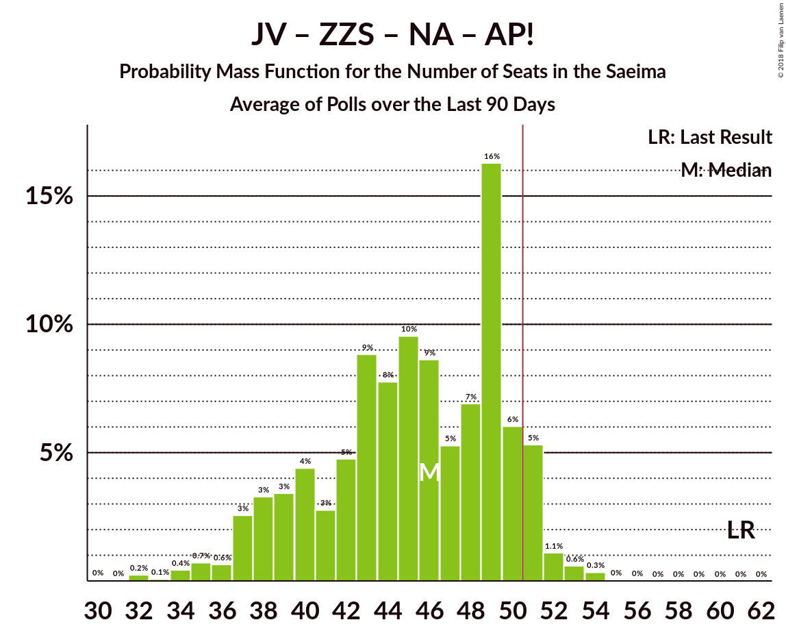
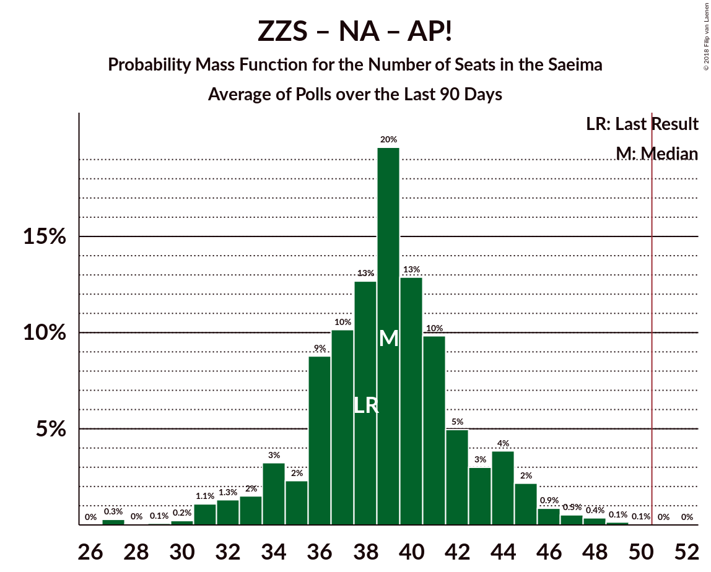

# Poll Average

<a href="#voting-intentions">Voting Intentions</a> | <a href="#seats">Seats</a> | <a href="#coalitions">Coalitions</a> | <a href="#technical-information">Technical Information</a>

## Summary

The table below lists the polls on which the average is based. They are the most recent polls (less than 90 days old) registered and analyzed so far.

| Period     | Polling firm/Commissioner(s) | SDPS | JV | ZZS | NA | NSL | LRA | LKS | VL | LA | JKP | KPV | PAR | AP! |
|:----------:|:----------------------------:|:--:|:--:|:--:|:--:|:--:|:--:|:--:|:--:|:--:|:--:|:--:|:--:|:--:|
| 4 October 2014 | General Election | 23.0%   24 | 21.9%   23 | 19.5%   21 | 16.6%   17 | 6.8%   7 | 6.7%   8 | 1.6%   0 | 1.2%   0 | 0.9%   0 | 0.7%   0 | 0.0%   0 | 0.0%   0 | 0.9%   0 |
| N/A | Poll Average | 18–36%   20–41 | 4–10%   0–12 | 11–20%   14–25 | 6–13%   6–14 | 0–4%   0 | 0–6%   0–7 | 0–5%   0 | N/A   N/A | N/A   N/A | 4–17%   0–19 | 10–18%   10–22 | N/A   N/A | 4–12%   0–14 |
| [17–23 September 2018](2018-09-23-FACTUM.html) | FACTUM | 18–21%   20–23 | 8–10%   8–10 | 11–14%   12–15 | 11–14%   12–14 | N/A   N/A | 2–4%   0 | 2–3%   0 | N/A   N/A | N/A   N/A | 15–18%   15–20 | 10–12%   10–14 | N/A   N/A | 10–12%   10–14 |
| [10–14 September 2018](2018-09-14-Norstat.html) | Norstat | 19–28%   22–33 | 3–9%   0–10 | 11–20%   14–24 | 6–13%   6–15 | N/A   N/A | 1–5%   0 | 2–6%   0–7 | N/A   N/A | N/A   N/A | 7–14%   8–16 | 10–18%   11–20 | N/A   N/A | 5–11%   0–13 |
| [8 August–12 September 2018](2018-09-12-KantarTNS.html) | Kantar TNS   Delfi | 23–30%   27–36 | 4–8%   0–9 | 15–20%   19–25 | 6–10%   6–12 | 0–1%   0 | 0–2%   0 | 0–2%   0 | N/A   N/A | N/A   N/A | 7–12%   8–15 | 14–19%   16–23 | N/A   N/A | 5–9%   0 |
| [1–23 August 2018](2018-08-23-SKDS.html) | SKDS   Latvijas Televīzija | 29–37%   34–43 | 6–10%   7–12 | 15–21%   19–26 | 7–12%   8–15 | 2–4%   0 | 3–6%   0–8 | 1–3%   0 | N/A   N/A | N/A   N/A | 3–6%   0–7 | 9–14%   11–17 | N/A   N/A | 3–7%   0 |
| 4 October 2014 | General Election | 23.0%   24 | 21.9%   23 | 19.5%   21 | 16.6%   17 | 6.8%   7 | 6.7%   8 | 1.6%   0 | 1.2%   0 | 0.9%   0 | 0.7%   0 | 0.0%   0 | 0.0%   0 | 0.9%   0 |

Only polls for which at least the sample size has been published are included in the table above.

**Legend:**
+ **Top half of each row:** Voting intentions (95% confidence interval)
+ **Bottom half of each row:** Seat projections for the Saeima (95% confidence interval)
+ **SDPS:** Sociāldemokrātiskā Partija “Saskaņa”
+ **JV:** Vienotība
+ **ZZS:** Zaļo un Zemnieku savienība
+ **NA:** Nacionālā apvienība „Visu Latvijai!”–„Tēvzemei un Brīvībai/LNNK”
+ **NSL:** No sirds Latvijai
+ **LRA:** Latvijas Reģionu apvienība
+ **LKS:** Latvijas Krievu savienība
+ **VL:** Vienoti Latvijai
+ **LA:** Latvijas attīstībai
+ **JKP:** Jaunā konservatīvā partija
+ **KPV:** KPV LV
+ **PAR:** Kustība Par!
+ **AP!:** Attīstībai–Par!
+ **N/A (single party):** Party not included the published results
+ **N/A (entire row):** Calculation for this opinion poll not started yet

## Voting Intentions

### Confidence Intervals

| Party | Last Result | Median | 80% Confidence Interval | 90% Confidence Interval | 95% Confidence Interval | 99% Confidence Interval |
|:-----:|:-----------:|:------:|:-----------------------:|:-----------------------:|:-----------------------:|:-----------------------:|
| <a href="#sociāldemokrātiskā-partija-“saskaņa”">Sociāldemokrātiskā Partija “Saskaņa”</a> | 23.0% | 25.0% | 18.9–33.7% |18.5–34.8% | 18.1–35.7% | 17.5–37.3% |
| <a href="#vienotība">Vienotība</a> | 21.9% | 7.2% | 4.8–9.4% |4.4–9.8% | 4.1–10.1% | 3.4–10.7% |
| <a href="#zaļo-un-zemnieku-savienība">Zaļo un Zemnieku savienība</a> | 19.5% | 16.1% | 11.9–19.0% |11.5–19.7% | 11.2–20.3% | 10.7–21.5% |
| <a href="#nacionālā-apvienība-„visu-latvijai!”–„tēvzemei-un-brīvībai/lnnk”">Nacionālā apvienība „Visu Latvijai!”–„Tēvzemei un Brīvībai/LNNK”</a> | 16.6% | 9.5% | 7.2–12.4% |6.7–12.8% | 6.3–13.1% | 5.6–13.8% |
| <a href="#no-sirds-latvijai">No sirds Latvijai</a> | 6.8% | 1.6% | 0.4–3.5% |0.4–3.8% | 0.3–4.1% | 0.2–4.7% |
| <a href="#latvijas-reģionu-apvienība">Latvijas Reģionu apvienība</a> | 6.7% | 2.9% | 0.7–4.8% |0.6–5.4% | 0.5–5.8% | 0.3–6.6% |
| <a href="#latvijas-krievu-savienība">Latvijas Krievu savienība</a> | 1.6% | 2.0% | 0.7–3.7% |0.6–4.4% | 0.5–4.9% | 0.3–6.0% |
| <a href="#vienoti-latvijai">Vienoti Latvijai</a> | 1.2% | N/A | N/A |N/A | N/A | N/A |
| <a href="#latvijas-attīstībai">Latvijas attīstībai</a> | 0.9% | N/A | N/A |N/A | N/A | N/A |
| <a href="#attīstībai–par!">Attīstībai–Par!</a> | 0.9% | 7.4% | 4.6–11.4% |4.2–11.7% | 3.8–12.0% | 3.3–12.6% |
| <a href="#jaunā-konservatīvā-partija">Jaunā konservatīvā partija</a> | 0.7% | 9.8% | 4.3–16.4% |3.9–16.8% | 3.5–17.2% | 3.0–17.8% |
| <a href="#kpv-lv">KPV LV</a> | 0.0% | 12.5% | 10.5–17.0% |10.1–17.8% | 9.8–18.4% | 9.0–19.6% |
| <a href="#kustība-par!">Kustība Par!</a> | 0.0% | N/A | N/A |N/A | N/A | N/A |

### Sociāldemokrātiskā Partija “Saskaņa”

*For a full overview of the results for this party, see the [Sociāldemokrātiskā Partija “Saskaņa”](party-sociāldemokrātiskāpartija“saskaņa”.html) page.*

| Voting Intentions | Probability | Accumulated | Special Marks |
|:-----------------:|:-----------:|:-----------:|:-------------:|
| 15.5–16.5% | 0% | 100% |  |
| 16.5–17.5% | 0.6% | 99.9% |  |
| 17.5–18.5% | 5% | 99.4% |  |
| 18.5–19.5% | 12% | 94% |  |
| 19.5–20.5% | 9% | 82% |  |
| 20.5–21.5% | 4% | 73% |  |
| 21.5–22.5% | 4% | 69% |  |
| 22.5–23.5% | 5% | 65% | Last Result |
| 23.5–24.5% | 6% | 60% |  |
| 24.5–25.5% | 8% | 54% | Median |
| 25.5–26.5% | 8% | 46% |  |
| 26.5–27.5% | 6% | 38% |  |
| 27.5–28.5% | 4% | 32% |  |
| 28.5–29.5% | 2% | 28% |  |
| 29.5–30.5% | 2% | 25% |  |
| 30.5–31.5% | 3% | 23% |  |
| 31.5–32.5% | 4% | 20% |  |
| 32.5–33.5% | 5% | 16% |  |
| 33.5–34.5% | 5% | 11% |  |
| 34.5–35.5% | 3% | 6% |  |
| 35.5–36.5% | 2% | 3% |  |
| 36.5–37.5% | 0.8% | 1.1% |  |
| 37.5–38.5% | 0.3% | 0.4% |  |
| 38.5–39.5% | 0.1% | 0.1% |  |
| 39.5–40.5% | 0% | 0% |  |

### Vienotība

*For a full overview of the results for this party, see the [Vienotība](party-vienotība.html) page.*

| Voting Intentions | Probability | Accumulated | Special Marks |
|:-----------------:|:-----------:|:-----------:|:-------------:|
| 1.5–2.5% | 0% | 100% |  |
| 2.5–3.5% | 0.8% | 100% |  |
| 3.5–4.5% | 6% | 99.2% |  |
| 4.5–5.5% | 16% | 94% |  |
| 5.5–6.5% | 18% | 78% |  |
| 6.5–7.5% | 15% | 59% | Median |
| 7.5–8.5% | 16% | 45% |  |
| 8.5–9.5% | 21% | 29% |  |
| 9.5–10.5% | 7% | 8% |  |
| 10.5–11.5% | 0.6% | 0.7% |  |
| 11.5–12.5% | 0.1% | 0.1% |  |
| 12.5–13.5% | 0% | 0% |  |
| 13.5–14.5% | 0% | 0% |  |
| 14.5–15.5% | 0% | 0% |  |
| 15.5–16.5% | 0% | 0% |  |
| 16.5–17.5% | 0% | 0% |  |
| 17.5–18.5% | 0% | 0% |  |
| 18.5–19.5% | 0% | 0% |  |
| 19.5–20.5% | 0% | 0% |  |
| 20.5–21.5% | 0% | 0% |  |
| 21.5–22.5% | 0% | 0% | Last Result |

### Zaļo un Zemnieku savienība

*For a full overview of the results for this party, see the [Zaļo un Zemnieku savienība](party-zaļounzemniekusavienība.html) page.*

| Voting Intentions | Probability | Accumulated | Special Marks |
|:-----------------:|:-----------:|:-----------:|:-------------:|
| 8.5–9.5% | 0% | 100% |  |
| 9.5–10.5% | 0.3% | 100% |  |
| 10.5–11.5% | 5% | 99.7% |  |
| 11.5–12.5% | 15% | 95% |  |
| 12.5–13.5% | 10% | 80% |  |
| 13.5–14.5% | 5% | 70% |  |
| 14.5–15.5% | 8% | 65% |  |
| 15.5–16.5% | 12% | 57% | Median |
| 16.5–17.5% | 15% | 44% |  |
| 17.5–18.5% | 14% | 29% |  |
| 18.5–19.5% | 9% | 15% |  |
| 19.5–20.5% | 4% | 6% | Last Result |
| 20.5–21.5% | 1.4% | 2% |  |
| 21.5–22.5% | 0.4% | 0.5% |  |
| 22.5–23.5% | 0.1% | 0.1% |  |
| 23.5–24.5% | 0% | 0% |  |

### Nacionālā apvienība „Visu Latvijai!”–„Tēvzemei un Brīvībai/LNNK”

*For a full overview of the results for this party, see the [Nacionālā apvienība „Visu Latvijai!”–„Tēvzemei un Brīvībai/LNNK”](party-nacionālāapvienība„visulatvijai”–„tēvzemeiunbrīvībailnnk”.html) page.*

| Voting Intentions | Probability | Accumulated | Special Marks |
|:-----------------:|:-----------:|:-----------:|:-------------:|
| 3.5–4.5% | 0% | 100% |  |
| 4.5–5.5% | 0.4% | 100% |  |
| 5.5–6.5% | 4% | 99.6% |  |
| 6.5–7.5% | 12% | 96% |  |
| 7.5–8.5% | 18% | 84% |  |
| 8.5–9.5% | 18% | 67% |  |
| 9.5–10.5% | 13% | 49% | Median |
| 10.5–11.5% | 11% | 36% |  |
| 11.5–12.5% | 16% | 25% |  |
| 12.5–13.5% | 8% | 8% |  |
| 13.5–14.5% | 0.8% | 0.9% |  |
| 14.5–15.5% | 0.1% | 0.1% |  |
| 15.5–16.5% | 0% | 0% |  |
| 16.5–17.5% | 0% | 0% | Last Result |

### No sirds Latvijai

*For a full overview of the results for this party, see the [No sirds Latvijai](party-nosirdslatvijai.html) page.*

| Voting Intentions | Probability | Accumulated | Special Marks |
|:-----------------:|:-----------:|:-----------:|:-------------:|
| 0.0–0.5% | 16% | 100% |  |
| 0.5–1.5% | 33% | 84% |  |
| 1.5–2.5% | 17% | 50% | Median |
| 2.5–3.5% | 25% | 34% |  |
| 3.5–4.5% | 8% | 8% |  |
| 4.5–5.5% | 0.8% | 0.8% |  |
| 5.5–6.5% | 0% | 0% |  |
| 6.5–7.5% | 0% | 0% | Last Result |

### Latvijas Reģionu apvienība

*For a full overview of the results for this party, see the [Latvijas Reģionu apvienība](party-latvijasreģionuapvienība.html) page.*

| Voting Intentions | Probability | Accumulated | Special Marks |
|:-----------------:|:-----------:|:-----------:|:-------------:|
| 0.0–0.5% | 4% | 100% |  |
| 0.5–1.5% | 21% | 96% |  |
| 1.5–2.5% | 12% | 74% |  |
| 2.5–3.5% | 33% | 62% | Median |
| 3.5–4.5% | 16% | 30% |  |
| 4.5–5.5% | 10% | 14% |  |
| 5.5–6.5% | 3% | 4% |  |
| 6.5–7.5% | 0.5% | 0.5% | Last Result |
| 7.5–8.5% | 0% | 0% |  |

### Latvijas Krievu savienība

*For a full overview of the results for this party, see the [Latvijas Krievu savienība](party-latvijaskrievusavienība.html) page.*

| Voting Intentions | Probability | Accumulated | Special Marks |
|:-----------------:|:-----------:|:-----------:|:-------------:|
| 0.0–0.5% | 4% | 100% |  |
| 0.5–1.5% | 26% | 96% |  |
| 1.5–2.5% | 44% | 70% | Last Result, Median |
| 2.5–3.5% | 15% | 26% |  |
| 3.5–4.5% | 7% | 11% |  |
| 4.5–5.5% | 3% | 4% |  |
| 5.5–6.5% | 0.8% | 1.0% |  |
| 6.5–7.5% | 0.2% | 0.2% |  |
| 7.5–8.5% | 0% | 0% |  |

### Attīstībai–Par!

*For a full overview of the results for this party, see the [Attīstībai–Par!](party-attīstībai–par.html) page.*

| Voting Intentions | Probability | Accumulated | Special Marks |
|:-----------------:|:-----------:|:-----------:|:-------------:|
| 0.5–1.5% | 0% | 100% | Last Result |
| 1.5–2.5% | 0% | 100% |  |
| 2.5–3.5% | 1.2% | 100% |  |
| 3.5–4.5% | 8% | 98.8% |  |
| 4.5–5.5% | 12% | 91% |  |
| 5.5–6.5% | 14% | 79% |  |
| 6.5–7.5% | 16% | 64% | Median |
| 7.5–8.5% | 12% | 48% |  |
| 8.5–9.5% | 6% | 36% |  |
| 9.5–10.5% | 7% | 29% |  |
| 10.5–11.5% | 15% | 22% |  |
| 11.5–12.5% | 7% | 7% |  |
| 12.5–13.5% | 0.6% | 0.6% |  |
| 13.5–14.5% | 0% | 0% |  |

### Jaunā konservatīvā partija

*For a full overview of the results for this party, see the [Jaunā konservatīvā partija](party-jaunākonservatīvāpartija.html) page.*

| Voting Intentions | Probability | Accumulated | Special Marks |
|:-----------------:|:-----------:|:-----------:|:-------------:|
| 0.5–1.5% | 0% | 100% | Last Result |
| 1.5–2.5% | 0.1% | 100% |  |
| 2.5–3.5% | 3% | 99.9% |  |
| 3.5–4.5% | 10% | 97% |  |
| 4.5–5.5% | 9% | 87% |  |
| 5.5–6.5% | 3% | 78% |  |
| 6.5–7.5% | 2% | 75% |  |
| 7.5–8.5% | 7% | 73% |  |
| 8.5–9.5% | 13% | 66% |  |
| 9.5–10.5% | 13% | 53% | Median |
| 10.5–11.5% | 8% | 41% |  |
| 11.5–12.5% | 4% | 32% |  |
| 12.5–13.5% | 2% | 28% |  |
| 13.5–14.5% | 1.2% | 26% |  |
| 14.5–15.5% | 5% | 25% |  |
| 15.5–16.5% | 12% | 20% |  |
| 16.5–17.5% | 7% | 8% |  |
| 17.5–18.5% | 1.0% | 1.0% |  |
| 18.5–19.5% | 0% | 0% |  |

### KPV LV

*For a full overview of the results for this party, see the [KPV LV](party-kpvlv.html) page.*

| Voting Intentions | Probability | Accumulated | Special Marks |
|:-----------------:|:-----------:|:-----------:|:-------------:|
| 0.0–0.5% | 0% | 100% | Last Result |
| 0.5–1.5% | 0% | 100% |  |
| 1.5–2.5% | 0% | 100% |  |
| 2.5–3.5% | 0% | 100% |  |
| 3.5–4.5% | 0% | 100% |  |
| 4.5–5.5% | 0% | 100% |  |
| 5.5–6.5% | 0% | 100% |  |
| 6.5–7.5% | 0% | 100% |  |
| 7.5–8.5% | 0.2% | 100% |  |
| 8.5–9.5% | 1.4% | 99.8% |  |
| 9.5–10.5% | 9% | 98% |  |
| 10.5–11.5% | 23% | 90% |  |
| 11.5–12.5% | 17% | 66% | Median |
| 12.5–13.5% | 10% | 49% |  |
| 13.5–14.5% | 8% | 39% |  |
| 14.5–15.5% | 8% | 31% |  |
| 15.5–16.5% | 9% | 23% |  |
| 16.5–17.5% | 7% | 14% |  |
| 17.5–18.5% | 4% | 6% |  |
| 18.5–19.5% | 2% | 2% |  |
| 19.5–20.5% | 0.4% | 0.5% |  |
| 20.5–21.5% | 0.1% | 0.1% |  |
| 21.5–22.5% | 0% | 0% |  |

## Seats

### Confidence Intervals

| Party | Last Result | Median | 80% Confidence Interval | 90% Confidence Interval | 95% Confidence Interval | 99% Confidence Interval |
|:-----:|:-----------:|:------:|:-----------------------:|:-----------------------:|:-----------------------:|:-----------------------:|
| <a href="#sociāldemokrātiskā-partija-“saskaņa”">Sociāldemokrātiskā Partija “Saskaņa”</a> | 24 | 29 | 21–39 |20–41 | 20–41 | 20–43 |
| <a href="#vienotība">Vienotība</a> | 23 | 8 | 0–10 |0–11 | 0–12 | 0–13 |
| <a href="#zaļo-un-zemnieku-savienība">Zaļo un Zemnieku savienība</a> | 21 | 20 | 14–24 |14–24 | 14–25 | 12–27 |
| <a href="#nacionālā-apvienība-„visu-latvijai!”–„tēvzemei-un-brīvībai/lnnk”">Nacionālā apvienība „Visu Latvijai!”–„Tēvzemei un Brīvībai/LNNK”</a> | 17 | 11 | 8–14 |7–14 | 6–14 | 6–16 |
| <a href="#no-sirds-latvijai">No sirds Latvijai</a> | 7 | 0 | 0 |0 | 0 | 0 |
| <a href="#latvijas-reģionu-apvienība">Latvijas Reģionu apvienība</a> | 8 | 0 | 0 |0–6 | 0–7 | 0–8 |
| <a href="#latvijas-krievu-savienība">Latvijas Krievu savienība</a> | 0 | 0 | 0 |0 | 0 | 0–7 |
| <a href="#vienoti-latvijai">Vienoti Latvijai</a> | 0 | N/A | N/A |N/A | N/A | N/A |
| <a href="#latvijas-attīstībai">Latvijas attīstībai</a> | 0 | N/A | N/A |N/A | N/A | N/A |
| <a href="#attīstībai–par!">Attīstībai–Par!</a> | 0 | 0 | 0–13 |0–13 | 0–14 | 0–14 |
| <a href="#jaunā-konservatīvā-partija">Jaunā konservatīvā partija</a> | 0 | 12 | 0–18 |0–19 | 0–19 | 0–20 |
| <a href="#kpv-lv">KPV LV</a> | 0 | 15 | 11–20 |10–21 | 10–22 | 10–24 |
| <a href="#kustība-par!">Kustība Par!</a> | 0 | N/A | N/A |N/A | N/A | N/A |

### Sociāldemokrātiskā Partija “Saskaņa”

*For a full overview of the results for this party, see the [Sociāldemokrātiskā Partija “Saskaņa”](party-sociāldemokrātiskāpartija“saskaņa”.html) page.*

| Number of Seats | Probability | Accumulated | Special Marks |
|:---------------:|:-----------:|:-----------:|:-------------:|
| 19 | 0.3% | 100% |  |
| 20 | 6% | 99.6% |  |
| 21 | 7% | 94% |  |
| 22 | 12% | 87% |  |
| 23 | 3% | 75% |  |
| 24 | 1.4% | 73% | Last Result |
| 25 | 2% | 71% |  |
| 26 | 5% | 70% |  |
| 27 | 6% | 64% |  |
| 28 | 2% | 58% |  |
| 29 | 10% | 56% | Median |
| 30 | 3% | 46% |  |
| 31 | 9% | 43% |  |
| 32 | 3% | 34% |  |
| 33 | 3% | 32% |  |
| 34 | 2% | 28% |  |
| 35 | 1.5% | 26% |  |
| 36 | 3% | 25% |  |
| 37 | 6% | 22% |  |
| 38 | 3% | 15% |  |
| 39 | 2% | 12% |  |
| 40 | 3% | 10% |  |
| 41 | 5% | 7% |  |
| 42 | 0.7% | 2% |  |
| 43 | 0.8% | 1.2% |  |
| 44 | 0.1% | 0.4% |  |
| 45 | 0% | 0.2% |  |
| 46 | 0.1% | 0.2% |  |
| 47 | 0.1% | 0.1% |  |
| 48 | 0% | 0% |  |

### Vienotība

*For a full overview of the results for this party, see the [Vienotība](party-vienotība.html) page.*

| Number of Seats | Probability | Accumulated | Special Marks |
|:---------------:|:-----------:|:-----------:|:-------------:|
| 0 | 12% | 100% |  |
| 1 | 0% | 88% |  |
| 2 | 0% | 88% |  |
| 3 | 0% | 88% |  |
| 4 | 0% | 88% |  |
| 5 | 0% | 88% |  |
| 6 | 0% | 88% |  |
| 7 | 30% | 88% |  |
| 8 | 14% | 59% | Median |
| 9 | 17% | 45% |  |
| 10 | 21% | 29% |  |
| 11 | 5% | 8% |  |
| 12 | 3% | 4% |  |
| 13 | 0.4% | 0.5% |  |
| 14 | 0.1% | 0.1% |  |
| 15 | 0% | 0% |  |
| 16 | 0% | 0% |  |
| 17 | 0% | 0% |  |
| 18 | 0% | 0% |  |
| 19 | 0% | 0% |  |
| 20 | 0% | 0% |  |
| 21 | 0% | 0% |  |
| 22 | 0% | 0% |  |
| 23 | 0% | 0% | Last Result |

### Zaļo un Zemnieku savienība

*For a full overview of the results for this party, see the [Zaļo un Zemnieku savienība](party-zaļounzemniekusavienība.html) page.*

| Number of Seats | Probability | Accumulated | Special Marks |
|:---------------:|:-----------:|:-----------:|:-------------:|
| 11 | 0.3% | 100% |  |
| 12 | 0.7% | 99.7% |  |
| 13 | 1.4% | 99.0% |  |
| 14 | 9% | 98% |  |
| 15 | 16% | 88% |  |
| 16 | 2% | 72% |  |
| 17 | 5% | 70% |  |
| 18 | 3% | 65% |  |
| 19 | 5% | 62% |  |
| 20 | 9% | 57% | Median |
| 21 | 8% | 48% | Last Result |
| 22 | 3% | 40% |  |
| 23 | 18% | 37% |  |
| 24 | 16% | 19% |  |
| 25 | 2% | 4% |  |
| 26 | 0.9% | 2% |  |
| 27 | 0.6% | 0.9% |  |
| 28 | 0.2% | 0.3% |  |
| 29 | 0.1% | 0.2% |  |
| 30 | 0.1% | 0.1% |  |
| 31 | 0% | 0% |  |

### Nacionālā apvienība „Visu Latvijai!”–„Tēvzemei un Brīvībai/LNNK”

*For a full overview of the results for this party, see the [Nacionālā apvienība „Visu Latvijai!”–„Tēvzemei un Brīvībai/LNNK”](party-nacionālāapvienība„visulatvijai”–„tēvzemeiunbrīvībailnnk”.html) page.*

| Number of Seats | Probability | Accumulated | Special Marks |
|:---------------:|:-----------:|:-----------:|:-------------:|
| 0 | 0.1% | 100% |  |
| 1 | 0% | 99.9% |  |
| 2 | 0% | 99.9% |  |
| 3 | 0% | 99.9% |  |
| 4 | 0% | 99.9% |  |
| 5 | 0% | 99.9% |  |
| 6 | 3% | 99.9% |  |
| 7 | 7% | 97% |  |
| 8 | 4% | 91% |  |
| 9 | 8% | 87% |  |
| 10 | 6% | 78% |  |
| 11 | 24% | 73% | Median |
| 12 | 13% | 49% |  |
| 13 | 25% | 35% |  |
| 14 | 8% | 11% |  |
| 15 | 2% | 2% |  |
| 16 | 0.3% | 0.6% |  |
| 17 | 0.1% | 0.2% | Last Result |
| 18 | 0.1% | 0.1% |  |
| 19 | 0% | 0% |  |

### No sirds Latvijai

*For a full overview of the results for this party, see the [No sirds Latvijai](party-nosirdslatvijai.html) page.*

| Number of Seats | Probability | Accumulated | Special Marks |
|:---------------:|:-----------:|:-----------:|:-------------:|
| 0 | 99.9% | 100% | Median |
| 1 | 0% | 0.1% |  |
| 2 | 0% | 0.1% |  |
| 3 | 0% | 0.1% |  |
| 4 | 0% | 0.1% |  |
| 5 | 0% | 0.1% |  |
| 6 | 0.1% | 0.1% |  |
| 7 | 0.1% | 0.1% | Last Result |
| 8 | 0% | 0% |  |

### Latvijas Reģionu apvienība

*For a full overview of the results for this party, see the [Latvijas Reģionu apvienība](party-latvijasreģionuapvienība.html) page.*

| Number of Seats | Probability | Accumulated | Special Marks |
|:---------------:|:-----------:|:-----------:|:-------------:|
| 0 | 94% | 100% | Median |
| 1 | 0% | 6% |  |
| 2 | 0% | 6% |  |
| 3 | 0% | 6% |  |
| 4 | 0% | 6% |  |
| 5 | 0% | 6% |  |
| 6 | 1.5% | 6% |  |
| 7 | 4% | 4% |  |
| 8 | 0.4% | 0.7% | Last Result |
| 9 | 0.3% | 0.3% |  |
| 10 | 0% | 0% |  |

### Latvijas Krievu savienība

*For a full overview of the results for this party, see the [Latvijas Krievu savienība](party-latvijaskrievusavienība.html) page.*

| Number of Seats | Probability | Accumulated | Special Marks |
|:---------------:|:-----------:|:-----------:|:-------------:|
| 0 | 98% | 100% | Last Result, Median |
| 1 | 0% | 2% |  |
| 2 | 0% | 2% |  |
| 3 | 0% | 2% |  |
| 4 | 0% | 2% |  |
| 5 | 0% | 2% |  |
| 6 | 0.4% | 2% |  |
| 7 | 1.3% | 1.4% |  |
| 8 | 0.1% | 0.1% |  |
| 9 | 0% | 0% |  |

### Attīstībai–Par!

*For a full overview of the results for this party, see the [Attīstībai–Par!](party-attīstībai–par.html) page.*

| Number of Seats | Probability | Accumulated | Special Marks |
|:---------------:|:-----------:|:-----------:|:-------------:|
| 0 | 51% | 100% | Last Result, Median |
| 1 | 0% | 49% |  |
| 2 | 0% | 49% |  |
| 3 | 0% | 49% |  |
| 4 | 0% | 49% |  |
| 5 | 0% | 49% |  |
| 6 | 0% | 49% |  |
| 7 | 5% | 49% |  |
| 8 | 4% | 45% |  |
| 9 | 4% | 41% |  |
| 10 | 7% | 37% |  |
| 11 | 6% | 30% |  |
| 12 | 12% | 24% |  |
| 13 | 9% | 12% |  |
| 14 | 3% | 4% |  |
| 15 | 0.3% | 0.4% |  |
| 16 | 0% | 0.1% |  |
| 17 | 0% | 0% |  |

### Jaunā konservatīvā partija

*For a full overview of the results for this party, see the [Jaunā konservatīvā partija](party-jaunākonservatīvāpartija.html) page.*

| Number of Seats | Probability | Accumulated | Special Marks |
|:---------------:|:-----------:|:-----------:|:-------------:|
| 0 | 19% | 100% | Last Result |
| 1 | 0% | 81% |  |
| 2 | 0% | 81% |  |
| 3 | 0% | 81% |  |
| 4 | 0% | 81% |  |
| 5 | 0% | 81% |  |
| 6 | 0% | 81% |  |
| 7 | 6% | 81% |  |
| 8 | 3% | 75% |  |
| 9 | 1.2% | 72% |  |
| 10 | 7% | 71% |  |
| 11 | 8% | 64% |  |
| 12 | 12% | 56% | Median |
| 13 | 9% | 44% |  |
| 14 | 4% | 35% |  |
| 15 | 7% | 31% |  |
| 16 | 3% | 24% |  |
| 17 | 3% | 22% |  |
| 18 | 12% | 19% |  |
| 19 | 6% | 7% |  |
| 20 | 0.7% | 0.8% |  |
| 21 | 0.1% | 0.2% |  |
| 22 | 0% | 0% |  |

### KPV LV

*For a full overview of the results for this party, see the [KPV LV](party-kpvlv.html) page.*

| Number of Seats | Probability | Accumulated | Special Marks |
|:---------------:|:-----------:|:-----------:|:-------------:|
| 0 | 0% | 100% | Last Result |
| 1 | 0% | 100% |  |
| 2 | 0% | 100% |  |
| 3 | 0% | 100% |  |
| 4 | 0% | 100% |  |
| 5 | 0% | 100% |  |
| 6 | 0% | 100% |  |
| 7 | 0% | 100% |  |
| 8 | 0% | 100% |  |
| 9 | 0.4% | 100% |  |
| 10 | 8% | 99.6% |  |
| 11 | 7% | 92% |  |
| 12 | 11% | 84% |  |
| 13 | 7% | 73% |  |
| 14 | 7% | 66% |  |
| 15 | 19% | 59% | Median |
| 16 | 8% | 41% |  |
| 17 | 4% | 33% |  |
| 18 | 13% | 28% |  |
| 19 | 5% | 15% |  |
| 20 | 3% | 10% |  |
| 21 | 2% | 7% |  |
| 22 | 2% | 4% |  |
| 23 | 2% | 2% |  |
| 24 | 0.4% | 0.6% |  |
| 25 | 0.2% | 0.2% |  |
| 26 | 0% | 0% |  |

## Coalitions

### Confidence Intervals

| Coalition | Last Result | Median | Majority? | 80% Confidence Interval | 90% Confidence Interval | 95% Confidence Interval | 99% Confidence Interval |
|:---------:|:-----------:|:------:|:---------:|:-----------------------:|:-----------------------:|:-----------------------:|:-----------------------:|
| Vienotība – Zaļo un Zemnieku savienība – Nacionālā apvienība „Visu Latvijai!”–„Tēvzemei un Brīvībai/LNNK” – Attīstībai–Par! – Jaunā konservatīvā partija | 61 | 53 | 60% | 44–68 | 43–69 | 41–69 | 39–70 |
| Zaļo un Zemnieku savienība – Nacionālā apvienība „Visu Latvijai!”–„Tēvzemei un Brīvībai/LNNK” – Attīstībai–Par! – Jaunā konservatīvā partija | 38 | 46 | 39% | 35–58 | 33–59 | 32–59 | 30–61 |
| Vienotība – Zaļo un Zemnieku savienība – Nacionālā apvienība „Visu Latvijai!”–„Tēvzemei un Brīvībai/LNNK” – Jaunā konservatīvā partija | 61 | 49 | 41% | 44–55 | 42–56 | 41–57 | 38–57 |
| Vienotība – Nacionālā apvienība „Visu Latvijai!”–„Tēvzemei un Brīvībai/LNNK” – Attīstībai–Par! – Jaunā konservatīvā partija | 40 | 31 | 24% | 21–53 | 20–54 | 19–54 | 17–56 |
| Sociāldemokrātiskā Partija “Saskaņa” – Attīstībai–Par! – Jaunā konservatīvā partija | 24 | 44 | 30% | 38–52 | 37–52 | 37–53 | 35–54 |
| Vienotība – Zaļo un Zemnieku savienība – Nacionālā apvienība „Visu Latvijai!”–„Tēvzemei un Brīvībai/LNNK” – Attīstībai–Par! | 61 | 44 | 6% | 37–50 | 35–51 | 34–51 | 31–53 |
| Zaļo un Zemnieku savienība – Nacionālā apvienība „Visu Latvijai!”–„Tēvzemei un Brīvībai/LNNK” – Jaunā konservatīvā partija | 38 | 43 | 0.4% | 35–47 | 33–47 | 32–48 | 30–50 |
| Vienotība – Zaļo un Zemnieku savienība – Nacionālā apvienība „Visu Latvijai!”–„Tēvzemei un Brīvībai/LNNK” | 61 | 38 | 0.2% | 33–44 | 31–47 | 30–48 | 27–49 |
| Zaļo un Zemnieku savienība – Nacionālā apvienība „Visu Latvijai!”–„Tēvzemei un Brīvībai/LNNK” – Attīstībai–Par! | 38 | 37 | 0% | 30–41 | 30–42 | 28–43 | 26–46 |
| Sociāldemokrātiskā Partija “Saskaņa” – Attīstībai–Par! | 24 | 34 | 0% | 29–40 | 29–41 | 29–41 | 27–43 |

### Vienotība – Zaļo un Zemnieku savienība – Nacionālā apvienība „Visu Latvijai!”–„Tēvzemei un Brīvībai/LNNK” – Attīstībai–Par! – Jaunā konservatīvā partija

| Number of Seats | Probability | Accumulated | Special Marks |
|:---------------:|:-----------:|:-----------:|:-------------:|
| 38 | 0.2% | 100% |  |
| 39 | 0.3% | 99.8% |  |
| 40 | 0.7% | 99.4% |  |
| 41 | 1.4% | 98.7% |  |
| 42 | 1.3% | 97% |  |
| 43 | 2% | 96% |  |
| 44 | 7% | 94% |  |
| 45 | 3% | 87% |  |
| 46 | 3% | 84% |  |
| 47 | 6% | 81% |  |
| 48 | 6% | 76% |  |
| 49 | 6% | 70% |  |
| 50 | 4% | 64% |  |
| 51 | 2% | 60% | Median, Majority |
| 52 | 2% | 58% |  |
| 53 | 10% | 56% |  |
| 54 | 3% | 47% |  |
| 55 | 2% | 44% |  |
| 56 | 3% | 42% |  |
| 57 | 3% | 39% |  |
| 58 | 4% | 36% |  |
| 59 | 2% | 32% |  |
| 60 | 2% | 30% |  |
| 61 | 1.0% | 28% | Last Result |
| 62 | 0.7% | 27% |  |
| 63 | 0.5% | 26% |  |
| 64 | 0.7% | 25% |  |
| 65 | 2% | 25% |  |
| 66 | 7% | 23% |  |
| 67 | 6% | 16% |  |
| 68 | 5% | 10% |  |
| 69 | 4% | 5% |  |
| 70 | 1.3% | 2% |  |
| 71 | 0.2% | 0.2% |  |
| 72 | 0% | 0% |  |

### Zaļo un Zemnieku savienība – Nacionālā apvienība „Visu Latvijai!”–„Tēvzemei un Brīvībai/LNNK” – Attīstībai–Par! – Jaunā konservatīvā partija

| Number of Seats | Probability | Accumulated | Special Marks |
|:---------------:|:-----------:|:-----------:|:-------------:|
| 28 | 0% | 100% |  |
| 29 | 0.2% | 99.9% |  |
| 30 | 0.4% | 99.7% |  |
| 31 | 0.8% | 99.3% |  |
| 32 | 3% | 98.6% |  |
| 33 | 0.8% | 96% |  |
| 34 | 2% | 95% |  |
| 35 | 5% | 93% |  |
| 36 | 2% | 88% |  |
| 37 | 5% | 86% |  |
| 38 | 3% | 81% | Last Result |
| 39 | 1.2% | 78% |  |
| 40 | 3% | 77% |  |
| 41 | 4% | 74% |  |
| 42 | 3% | 70% |  |
| 43 | 4% | 67% | Median |
| 44 | 1.4% | 63% |  |
| 45 | 2% | 61% |  |
| 46 | 9% | 59% |  |
| 47 | 3% | 50% |  |
| 48 | 3% | 47% |  |
| 49 | 2% | 43% |  |
| 50 | 2% | 42% |  |
| 51 | 4% | 39% | Majority |
| 52 | 2% | 35% |  |
| 53 | 2% | 34% |  |
| 54 | 1.3% | 32% |  |
| 55 | 2% | 30% |  |
| 56 | 5% | 28% |  |
| 57 | 9% | 24% |  |
| 58 | 6% | 15% |  |
| 59 | 6% | 9% |  |
| 60 | 2% | 2% |  |
| 61 | 0.4% | 0.5% |  |
| 62 | 0.1% | 0.1% |  |
| 63 | 0% | 0.1% |  |
| 64 | 0% | 0% |  |

### Vienotība – Zaļo un Zemnieku savienība – Nacionālā apvienība „Visu Latvijai!”–„Tēvzemei un Brīvībai/LNNK” – Jaunā konservatīvā partija

| Number of Seats | Probability | Accumulated | Special Marks |
|:---------------:|:-----------:|:-----------:|:-------------:|
| 35 | 0% | 100% |  |
| 36 | 0% | 99.9% |  |
| 37 | 0.1% | 99.9% |  |
| 38 | 0.3% | 99.8% |  |
| 39 | 0.6% | 99.4% |  |
| 40 | 0.9% | 98.8% |  |
| 41 | 2% | 98% |  |
| 42 | 2% | 96% |  |
| 43 | 3% | 94% |  |
| 44 | 9% | 91% |  |
| 45 | 5% | 82% |  |
| 46 | 6% | 77% |  |
| 47 | 9% | 71% |  |
| 48 | 7% | 63% |  |
| 49 | 8% | 56% |  |
| 50 | 7% | 48% |  |
| 51 | 4% | 41% | Median, Majority |
| 52 | 4% | 38% |  |
| 53 | 12% | 34% |  |
| 54 | 6% | 22% |  |
| 55 | 7% | 16% |  |
| 56 | 4% | 9% |  |
| 57 | 4% | 5% |  |
| 58 | 0.4% | 0.5% |  |
| 59 | 0.1% | 0.1% |  |
| 60 | 0% | 0% |  |
| 61 | 0% | 0% | Last Result |

### Vienotība – Nacionālā apvienība „Visu Latvijai!”–„Tēvzemei un Brīvībai/LNNK” – Attīstībai–Par! – Jaunā konservatīvā partija

| Number of Seats | Probability | Accumulated | Special Marks |
|:---------------:|:-----------:|:-----------:|:-------------:|
| 16 | 0.2% | 100% |  |
| 17 | 0.5% | 99.8% |  |
| 18 | 0.8% | 99.2% |  |
| 19 | 2% | 98% |  |
| 20 | 5% | 96% |  |
| 21 | 3% | 92% |  |
| 22 | 2% | 89% |  |
| 23 | 4% | 87% |  |
| 24 | 6% | 83% |  |
| 25 | 6% | 77% |  |
| 26 | 3% | 71% |  |
| 27 | 4% | 68% |  |
| 28 | 3% | 64% |  |
| 29 | 2% | 62% |  |
| 30 | 9% | 59% |  |
| 31 | 1.2% | 50% | Median |
| 32 | 1.1% | 49% |  |
| 33 | 1.1% | 48% |  |
| 34 | 0.7% | 47% |  |
| 35 | 1.3% | 46% |  |
| 36 | 2% | 45% |  |
| 37 | 4% | 43% |  |
| 38 | 3% | 39% |  |
| 39 | 3% | 36% |  |
| 40 | 2% | 33% | Last Result |
| 41 | 2% | 31% |  |
| 42 | 1.3% | 29% |  |
| 43 | 0.9% | 27% |  |
| 44 | 0.6% | 26% |  |
| 45 | 0.4% | 26% |  |
| 46 | 0.2% | 25% |  |
| 47 | 0.1% | 25% |  |
| 48 | 0.1% | 25% |  |
| 49 | 0.2% | 25% |  |
| 50 | 0.5% | 25% |  |
| 51 | 3% | 24% | Majority |
| 52 | 8% | 22% |  |
| 53 | 6% | 14% |  |
| 54 | 6% | 8% |  |
| 55 | 2% | 2% |  |
| 56 | 0.4% | 0.5% |  |
| 57 | 0.1% | 0.1% |  |
| 58 | 0% | 0% |  |

### Sociāldemokrātiskā Partija “Saskaņa” – Attīstībai–Par! – Jaunā konservatīvā partija

| Number of Seats | Probability | Accumulated | Special Marks |
|:---------------:|:-----------:|:-----------:|:-------------:|
| 24 | 0% | 100% | Last Result |
| 25 | 0% | 100% |  |
| 26 | 0% | 100% |  |
| 27 | 0% | 100% |  |
| 28 | 0% | 100% |  |
| 29 | 0% | 100% |  |
| 30 | 0% | 100% |  |
| 31 | 0% | 100% |  |
| 32 | 0% | 100% |  |
| 33 | 0.1% | 100% |  |
| 34 | 0.3% | 99.9% |  |
| 35 | 0.6% | 99.6% |  |
| 36 | 0.6% | 99.0% |  |
| 37 | 5% | 98% |  |
| 38 | 3% | 93% |  |
| 39 | 4% | 90% |  |
| 40 | 6% | 86% |  |
| 41 | 19% | 80% | Median |
| 42 | 5% | 61% |  |
| 43 | 5% | 56% |  |
| 44 | 11% | 51% |  |
| 45 | 2% | 41% |  |
| 46 | 1.3% | 39% |  |
| 47 | 1.3% | 37% |  |
| 48 | 2% | 36% |  |
| 49 | 2% | 34% |  |
| 50 | 2% | 33% |  |
| 51 | 14% | 30% | Majority |
| 52 | 13% | 17% |  |
| 53 | 3% | 4% |  |
| 54 | 0.7% | 0.9% |  |
| 55 | 0.2% | 0.2% |  |
| 56 | 0% | 0% |  |

### Vienotība – Zaļo un Zemnieku savienība – Nacionālā apvienība „Visu Latvijai!”–„Tēvzemei un Brīvībai/LNNK” – Attīstībai–Par!

| Number of Seats | Probability | Accumulated | Special Marks |
|:---------------:|:-----------:|:-----------:|:-------------:|
| 29 | 0.4% | 100% |  |
| 30 | 0% | 99.6% |  |
| 31 | 0.7% | 99.5% |  |
| 32 | 0.7% | 98.8% |  |
| 33 | 0.2% | 98% |  |
| 34 | 2% | 98% |  |
| 35 | 2% | 96% |  |
| 36 | 1.2% | 94% |  |
| 37 | 5% | 93% |  |
| 38 | 6% | 88% |  |
| 39 | 3% | 83% | Median |
| 40 | 3% | 80% |  |
| 41 | 12% | 77% |  |
| 42 | 4% | 65% |  |
| 43 | 5% | 61% |  |
| 44 | 10% | 56% |  |
| 45 | 5% | 46% |  |
| 46 | 4% | 41% |  |
| 47 | 5% | 37% |  |
| 48 | 8% | 32% |  |
| 49 | 8% | 23% |  |
| 50 | 8% | 15% |  |
| 51 | 4% | 6% | Majority |
| 52 | 2% | 2% |  |
| 53 | 0.4% | 0.6% |  |
| 54 | 0.1% | 0.2% |  |
| 55 | 0% | 0% |  |
| 56 | 0% | 0% |  |
| 57 | 0% | 0% |  |
| 58 | 0% | 0% |  |
| 59 | 0% | 0% |  |
| 60 | 0% | 0% |  |
| 61 | 0% | 0% | Last Result |

### Zaļo un Zemnieku savienība – Nacionālā apvienība „Visu Latvijai!”–„Tēvzemei un Brīvībai/LNNK” – Jaunā konservatīvā partija

| Number of Seats | Probability | Accumulated | Special Marks |
|:---------------:|:-----------:|:-----------:|:-------------:|
| 28 | 0% | 100% |  |
| 29 | 0.2% | 99.9% |  |
| 30 | 0.4% | 99.7% |  |
| 31 | 0.8% | 99.3% |  |
| 32 | 3% | 98.5% |  |
| 33 | 0.9% | 96% |  |
| 34 | 2% | 95% |  |
| 35 | 6% | 92% |  |
| 36 | 3% | 87% |  |
| 37 | 7% | 84% |  |
| 38 | 5% | 78% | Last Result |
| 39 | 3% | 73% |  |
| 40 | 5% | 70% |  |
| 41 | 7% | 65% |  |
| 42 | 5% | 58% |  |
| 43 | 9% | 53% | Median |
| 44 | 7% | 44% |  |
| 45 | 10% | 37% |  |
| 46 | 15% | 27% |  |
| 47 | 8% | 12% |  |
| 48 | 2% | 4% |  |
| 49 | 2% | 2% |  |
| 50 | 0.3% | 0.7% |  |
| 51 | 0.2% | 0.4% | Majority |
| 52 | 0.1% | 0.2% |  |
| 53 | 0% | 0.1% |  |
| 54 | 0% | 0.1% |  |
| 55 | 0% | 0% |  |

### Vienotība – Zaļo un Zemnieku savienība – Nacionālā apvienība „Visu Latvijai!”–„Tēvzemei un Brīvībai/LNNK”

| Number of Seats | Probability | Accumulated | Special Marks |
|:---------------:|:-----------:|:-----------:|:-------------:|
| 24 | 0% | 100% |  |
| 25 | 0.1% | 99.9% |  |
| 26 | 0.1% | 99.9% |  |
| 27 | 0.2% | 99.7% |  |
| 28 | 0.5% | 99.5% |  |
| 29 | 1.2% | 99.0% |  |
| 30 | 1.1% | 98% |  |
| 31 | 2% | 97% |  |
| 32 | 3% | 95% |  |
| 33 | 2% | 92% |  |
| 34 | 6% | 90% |  |
| 35 | 5% | 84% |  |
| 36 | 9% | 79% |  |
| 37 | 14% | 70% |  |
| 38 | 13% | 55% |  |
| 39 | 6% | 42% | Median |
| 40 | 5% | 36% |  |
| 41 | 11% | 32% |  |
| 42 | 2% | 21% |  |
| 43 | 2% | 18% |  |
| 44 | 7% | 16% |  |
| 45 | 2% | 9% |  |
| 46 | 2% | 7% |  |
| 47 | 2% | 6% |  |
| 48 | 2% | 4% |  |
| 49 | 0.6% | 1.0% |  |
| 50 | 0.3% | 0.5% |  |
| 51 | 0.1% | 0.2% | Majority |
| 52 | 0.1% | 0.1% |  |
| 53 | 0% | 0% |  |
| 54 | 0% | 0% |  |
| 55 | 0% | 0% |  |
| 56 | 0% | 0% |  |
| 57 | 0% | 0% |  |
| 58 | 0% | 0% |  |
| 59 | 0% | 0% |  |
| 60 | 0% | 0% |  |
| 61 | 0% | 0% | Last Result |

### Zaļo un Zemnieku savienība – Nacionālā apvienība „Visu Latvijai!”–„Tēvzemei un Brīvībai/LNNK” – Attīstībai–Par!

| Number of Seats | Probability | Accumulated | Special Marks |
|:---------------:|:-----------:|:-----------:|:-------------:|
| 25 | 0.1% | 100% |  |
| 26 | 0.4% | 99.9% |  |
| 27 | 0.9% | 99.5% |  |
| 28 | 1.2% | 98.6% |  |
| 29 | 2% | 97% |  |
| 30 | 7% | 96% |  |
| 31 | 6% | 89% | Median |
| 32 | 5% | 84% |  |
| 33 | 3% | 79% |  |
| 34 | 13% | 75% |  |
| 35 | 7% | 62% |  |
| 36 | 5% | 55% |  |
| 37 | 8% | 50% |  |
| 38 | 7% | 43% | Last Result |
| 39 | 9% | 36% |  |
| 40 | 11% | 26% |  |
| 41 | 6% | 15% |  |
| 42 | 4% | 9% |  |
| 43 | 3% | 5% |  |
| 44 | 0.8% | 2% |  |
| 45 | 0.5% | 2% |  |
| 46 | 0.7% | 1.0% |  |
| 47 | 0.1% | 0.4% |  |
| 48 | 0.1% | 0.2% |  |
| 49 | 0.1% | 0.1% |  |
| 50 | 0% | 0% |  |

### Sociāldemokrātiskā Partija “Saskaņa” – Attīstībai–Par!

| Number of Seats | Probability | Accumulated | Special Marks |
|:---------------:|:-----------:|:-----------:|:-------------:|
| 24 | 0% | 100% | Last Result |
| 25 | 0% | 100% |  |
| 26 | 0.2% | 100% |  |
| 27 | 1.0% | 99.8% |  |
| 28 | 0.4% | 98.8% |  |
| 29 | 11% | 98% | Median |
| 30 | 2% | 88% |  |
| 31 | 10% | 86% |  |
| 32 | 5% | 76% |  |
| 33 | 16% | 71% |  |
| 34 | 12% | 54% |  |
| 35 | 6% | 42% |  |
| 36 | 7% | 36% |  |
| 37 | 9% | 29% |  |
| 38 | 4% | 20% |  |
| 39 | 3% | 16% |  |
| 40 | 4% | 13% |  |
| 41 | 6% | 9% |  |
| 42 | 0.9% | 2% |  |
| 43 | 1.1% | 2% |  |
| 44 | 0.2% | 0.5% |  |
| 45 | 0.1% | 0.3% |  |
| 46 | 0.1% | 0.2% |  |
| 47 | 0.1% | 0.1% |  |
| 48 | 0% | 0% |  |

## Technical Information

+ **Number of polls included in this average:** 4
+ **Lowest number of simulations done in a poll included in this average:** 524,288
+ **Total number of simulations done in the polls included in this average:** 3,670,015
+ **Error estimate:** 3.81%
