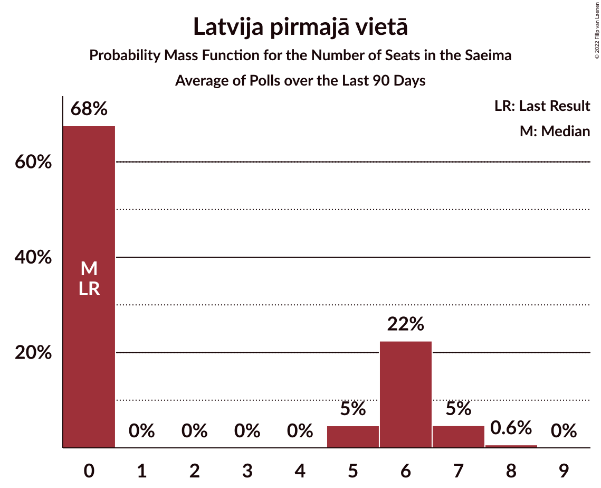
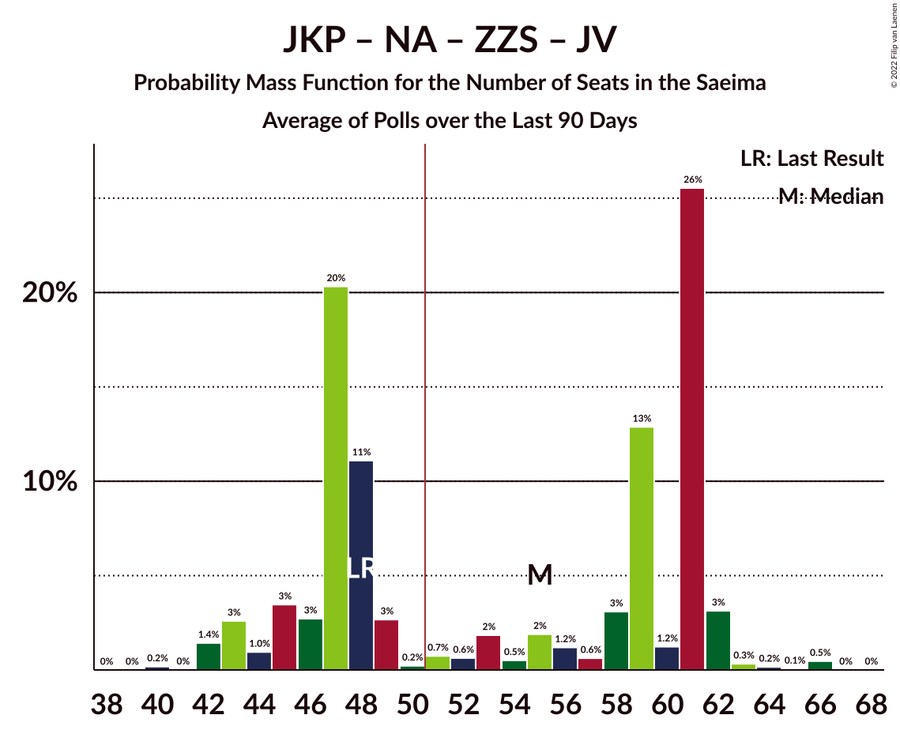

# Poll Average

<a href="#voting-intentions">Voting Intentions</a> | <a href="#seats">Seats</a> | <a href="#coalitions">Coalitions</a> | <a href="#technical-information">Technical Information</a>

## Summary

The table below lists the polls on which the average is based. They are the most recent polls (less than 90 days old) registered and analyzed so far.

| Period     | Polling firm/Commissioner(s) | SDPS | KPV | JKP | AP! | NA | ZZS | JV | LRA | LKS | P | NSL | VL | JS | LuK | LPV | R | S! | NST | SV |
|:----------:|:----------------------------:|:--:|:--:|:--:|:--:|:--:|:--:|:--:|:--:|:--:|:--:|:--:|:--:|:--:|:--:|:--:|:--:|:--:|:--:|:--:|
| 6 October 2018 | General Election | 19.8%   23 | 14.2%   16 | 13.6%   16 | 12.0%   13 | 11.0%   13 | 9.9%   11 | 6.7%   8 | 4.1%   0 | 3.2%   0 | 2.6%   0 | 0.8%   0 | 0.0%   0 | 0.0%   0 | 0.0%   0 | 0.0%   0 | 0.0%   0 | 0.0%   0 | 0.0%   0 | 0.0%   0 |
| N/A | Poll Average | 9–12%   13–16 | N/A   N/A | 6–8%   7–9 | 9–12%   10–14 | 11–14%   13–17 | 8–10%   11–12 | 16–20%   19–26 | 4–6%   0–6 | 3–5%   0 | 8–11%   10–13 | N/A   N/A | N/A   N/A | N/A   N/A | 3–5%   0 | 4–6%   0–7 | 1–2%   0 | 4–6%   0–7 | N/A   N/A | N/A   N/A |
| [6–10 July 2022](2022-07-10-FactumInteractive.html) | Factum Interactive | N/A   N/A | N/A   N/A | N/A   N/A | N/A   N/A | N/A   N/A | N/A   N/A | N/A   N/A | N/A   N/A | N/A   N/A | N/A   N/A | N/A   N/A | N/A   N/A | N/A   N/A | N/A   N/A | N/A   N/A | N/A   N/A | N/A   N/A | N/A   N/A | N/A   N/A |
| [1–30 June 2022](2022-06-30-SKDS.html) | SKDS   Latvijas Televīzija | 9–12%   13–16 | N/A   N/A | 6–8%   7–9 | 9–12%   10–14 | 11–14%   13–17 | 8–10%   11–12 | 16–20%   19–26 | 4–6%   0–6 | 3–5%   0 | 8–11%   10–13 | N/A   N/A | N/A   N/A | N/A   N/A | 3–5%   0 | 4–6%   0–7 | 1–2%   0 | 4–6%   0–7 | N/A   N/A | N/A   N/A |
| 6 October 2018 | General Election | 19.8%   23 | 14.2%   16 | 13.6%   16 | 12.0%   13 | 11.0%   13 | 9.9%   11 | 6.7%   8 | 4.1%   0 | 3.2%   0 | 2.6%   0 | 0.8%   0 | 0.0%   0 | 0.0%   0 | 0.0%   0 | 0.0%   0 | 0.0%   0 | 0.0%   0 | 0.0%   0 | 0.0%   0 |

Only polls for which at least the sample size has been published are included in the table above.

**Legend:**
+ **Top half of each row:** Voting intentions (95% confidence interval)
+ **Bottom half of each row:** Seat projections for the Saeima (95% confidence interval)
+ **SDPS:** Sociāldemokrātiskā partija “Saskaņa”
+ **KPV:** Politiskā partija „KPV LV”
+ **JKP:** Jaunā konservatīvā partija
+ **AP!:** Attīstībai/Par!
+ **NA:** Nacionālā apvienība „Visu Latvijai!”–„Tēvzemei un Brīvībai/LNNK”
+ **ZZS:** Zaļo un Zemnieku savienība
+ **JV:** Jaunā VIENOTĪBA
+ **LRA:** Latvijas Reģionu Apvienība
+ **LKS:** Latvijas Krievu savienība
+ **P:** PROGRESĪVIE
+ **NSL:** No sirds Latvijai
+ **VL:** Vienoti Latvijai
+ **JS:** Jaunā Saskaņa
+ **LuK:** Likums un kārtība
+ **LPV:** Latvija pirmajā vietā
+ **R:** Republika
+ **S!:** Stabilitātei!
+ **NST:** Nacionālā Savienība Taisnīgums
+ **SV:** Suverēnā vara
+ **N/A (single party):** Party not included the published results
+ **N/A (entire row):** Calculation for this opinion poll not started yet

## Voting Intentions

### Confidence Intervals

| Party | Last Result | Median | 80% Confidence Interval | 90% Confidence Interval | 95% Confidence Interval | 99% Confidence Interval |
|:-----:|:-----------:|:------:|:-----------------------:|:-----------------------:|:-----------------------:|:-----------------------:|
| <a href="#sociāldemokrātiskā-partija-“saskaņa”">Sociāldemokrātiskā partija “Saskaņa”</a> | 19.8% | 10.3% | 9.4–11.3% |9.2–11.6% | 9.0–11.8% | 8.6–12.3% |
| <a href="#politiskā-partija-„kpv-lv”">Politiskā partija „KPV LV”</a> | 14.2% | N/A | N/A |N/A | N/A | N/A |
| <a href="#jaunā-konservatīvā-partija">Jaunā konservatīvā partija</a> | 13.6% | 6.8% | 6.1–7.6% |5.9–7.9% | 5.7–8.1% | 5.4–8.5% |
| <a href="#attīstībai/par!">Attīstībai/Par!</a> | 12.0% | 10.1% | 9.2–11.0% |8.9–11.3% | 8.7–11.5% | 8.3–12.0% |
| <a href="#nacionālā-apvienība-„visu-latvijai!”–„tēvzemei-un-brīvībai/lnnk”">Nacionālā apvienība „Visu Latvijai!”–„Tēvzemei un Brīvībai/LNNK”</a> | 11.0% | 12.2% | 11.3–13.2% |11.0–13.5% | 10.8–13.8% | 10.3–14.3% |
| <a href="#zaļo-un-zemnieku-savienība">Zaļo un Zemnieku savienība</a> | 9.9% | 8.8% | 8.0–9.7% |7.8–10.0% | 7.6–10.2% | 7.2–10.7% |
| <a href="#jaunā-vienotība">Jaunā VIENOTĪBA</a> | 6.7% | 18.2% | 17.1–19.4% |16.8–19.8% | 16.5–20.1% | 16.0–20.7% |
| <a href="#latvijas-reģionu-apvienība">Latvijas Reģionu Apvienība</a> | 4.1% | 4.7% | 4.0–5.3% |3.9–5.5% | 3.7–5.7% | 3.5–6.0% |
| <a href="#latvijas-krievu-savienība">Latvijas Krievu savienība</a> | 3.2% | 3.9% | 3.4–4.5% |3.2–4.7% | 3.1–4.9% | 2.9–5.2% |
| <a href="#progresīvie">PROGRESĪVIE</a> | 2.6% | 9.4% | 8.6–10.4% |8.3–10.6% | 8.1–10.9% | 7.8–11.3% |
| <a href="#no-sirds-latvijai">No sirds Latvijai</a> | 0.8% | N/A | N/A |N/A | N/A | N/A |
| <a href="#vienoti-latvijai">Vienoti Latvijai</a> | 0.0% | N/A | N/A |N/A | N/A | N/A |
| <a href="#jaunā-saskaņa">Jaunā Saskaņa</a> | 0.0% | N/A | N/A |N/A | N/A | N/A |
| <a href="#likums-un-kārtība">Likums un kārtība</a> | 0.0% | 3.8% | 3.3–4.4% |3.1–4.6% | 3.0–4.8% | 2.8–5.1% |
| <a href="#latvija-pirmajā-vietā">Latvija pirmajā vietā</a> | 0.0% | 4.9% | 4.3–5.6% |4.1–5.8% | 4.0–6.0% | 3.7–6.4% |
| <a href="#republika">Republika</a> | 0.0% | 1.5% | 1.2–1.9% |1.1–2.1% | 1.0–2.2% | 0.9–2.4% |
| <a href="#stabilitātei!">Stabilitātei!</a> | 0.0% | 4.8% | 4.2–5.5% |4.0–5.7% | 3.9–5.9% | 3.6–6.2% |
| <a href="#nacionālā-savienība-taisnīgums">Nacionālā Savienība Taisnīgums</a> | 0.0% | N/A | N/A |N/A | N/A | N/A |
| <a href="#suverēnā-vara">Suverēnā vara</a> | 0.0% | N/A | N/A |N/A | N/A | N/A |

### Sociāldemokrātiskā partija “Saskaņa”

*For a full overview of the results for this party, see the [Sociāldemokrātiskā partija “Saskaņa”](party-sociāldemokrātiskāpartija“saskaņa”.html) page.*

| Voting Intentions | Probability | Accumulated | Special Marks |
|:-----------------:|:-----------:|:-----------:|:-------------:|
| 6.5–7.5% | 0% | 100% |  |
| 7.5–8.5% | 0.4% | 100% |  |
| 8.5–9.5% | 13% | 99.6% |  |
| 9.5–10.5% | 48% | 87% | Median |
| 10.5–11.5% | 33% | 38% |  |
| 11.5–12.5% | 5% | 5% |  |
| 12.5–13.5% | 0.2% | 0.2% |  |
| 13.5–14.5% | 0% | 0% |  |
| 14.5–15.5% | 0% | 0% |  |
| 15.5–16.5% | 0% | 0% |  |
| 16.5–17.5% | 0% | 0% |  |
| 17.5–18.5% | 0% | 0% |  |
| 18.5–19.5% | 0% | 0% |  |
| 19.5–20.5% | 0% | 0% | Last Result |

### Jaunā konservatīvā partija

*For a full overview of the results for this party, see the [Jaunā konservatīvā partija](party-jaunākonservatīvāpartija.html) page.*

| Voting Intentions | Probability | Accumulated | Special Marks |
|:-----------------:|:-----------:|:-----------:|:-------------:|
| 3.5–4.5% | 0% | 100% |  |
| 4.5–5.5% | 1.1% | 100% |  |
| 5.5–6.5% | 31% | 98.9% |  |
| 6.5–7.5% | 56% | 68% | Median |
| 7.5–8.5% | 12% | 12% |  |
| 8.5–9.5% | 0.3% | 0.3% |  |
| 9.5–10.5% | 0% | 0% |  |
| 10.5–11.5% | 0% | 0% |  |
| 11.5–12.5% | 0% | 0% |  |
| 12.5–13.5% | 0% | 0% |  |
| 13.5–14.5% | 0% | 0% | Last Result |

### Attīstībai/Par!

*For a full overview of the results for this party, see the [Attīstībai/Par!](party-attīstībaipar.html) page.*

| Voting Intentions | Probability | Accumulated | Special Marks |
|:-----------------:|:-----------:|:-----------:|:-------------:|
| 6.5–7.5% | 0% | 100% |  |
| 7.5–8.5% | 1.3% | 100% |  |
| 8.5–9.5% | 22% | 98.7% |  |
| 9.5–10.5% | 52% | 76% | Median |
| 10.5–11.5% | 23% | 25% |  |
| 11.5–12.5% | 2% | 2% | Last Result |
| 12.5–13.5% | 0.1% | 0.1% |  |
| 13.5–14.5% | 0% | 0% |  |

### Nacionālā apvienība „Visu Latvijai!”–„Tēvzemei un Brīvībai/LNNK”

*For a full overview of the results for this party, see the [Nacionālā apvienība „Visu Latvijai!”–„Tēvzemei un Brīvībai/LNNK”](party-nacionālāapvienība„visulatvijai”–„tēvzemeiunbrīvībailnnk”.html) page.*

| Voting Intentions | Probability | Accumulated | Special Marks |
|:-----------------:|:-----------:|:-----------:|:-------------:|
| 8.5–9.5% | 0% | 100% |  |
| 9.5–10.5% | 1.1% | 100% |  |
| 10.5–11.5% | 18% | 98.8% | Last Result |
| 11.5–12.5% | 47% | 81% | Median |
| 12.5–13.5% | 29% | 34% |  |
| 13.5–14.5% | 5% | 5% |  |
| 14.5–15.5% | 0.2% | 0.2% |  |
| 15.5–16.5% | 0% | 0% |  |

### Zaļo un Zemnieku savienība

*For a full overview of the results for this party, see the [Zaļo un Zemnieku savienība](party-zaļounzemniekusavienība.html) page.*

| Voting Intentions | Probability | Accumulated | Special Marks |
|:-----------------:|:-----------:|:-----------:|:-------------:|
| 5.5–6.5% | 0% | 100% |  |
| 6.5–7.5% | 2% | 100% |  |
| 7.5–8.5% | 31% | 98% |  |
| 8.5–9.5% | 52% | 67% | Median |
| 9.5–10.5% | 14% | 15% | Last Result |
| 10.5–11.5% | 0.7% | 0.8% |  |
| 11.5–12.5% | 0% | 0% |  |

### Jaunā VIENOTĪBA

*For a full overview of the results for this party, see the [Jaunā VIENOTĪBA](party-jaunāvienotība.html) page.*

| Voting Intentions | Probability | Accumulated | Special Marks |
|:-----------------:|:-----------:|:-----------:|:-------------:|
| 6.5–7.5% | 0% | 100% | Last Result |
| 7.5–8.5% | 0% | 100% |  |
| 8.5–9.5% | 0% | 100% |  |
| 9.5–10.5% | 0% | 100% |  |
| 10.5–11.5% | 0% | 100% |  |
| 11.5–12.5% | 0% | 100% |  |
| 12.5–13.5% | 0% | 100% |  |
| 13.5–14.5% | 0% | 100% |  |
| 14.5–15.5% | 0.1% | 100% |  |
| 15.5–16.5% | 3% | 99.9% |  |
| 16.5–17.5% | 19% | 97% |  |
| 17.5–18.5% | 41% | 78% | Median |
| 18.5–19.5% | 29% | 37% |  |
| 19.5–20.5% | 7% | 8% |  |
| 20.5–21.5% | 0.7% | 0.7% |  |
| 21.5–22.5% | 0% | 0% |  |

### Latvijas Reģionu Apvienība

*For a full overview of the results for this party, see the [Latvijas Reģionu Apvienība](party-latvijasreģionuapvienība.html) page.*

| Voting Intentions | Probability | Accumulated | Special Marks |
|:-----------------:|:-----------:|:-----------:|:-------------:|
| 1.5–2.5% | 0% | 100% |  |
| 2.5–3.5% | 0.8% | 100% |  |
| 3.5–4.5% | 41% | 99.2% | Last Result |
| 4.5–5.5% | 54% | 58% | Median |
| 5.5–6.5% | 4% | 4% |  |
| 6.5–7.5% | 0% | 0% |  |

### Latvijas Krievu savienība

*For a full overview of the results for this party, see the [Latvijas Krievu savienība](party-latvijaskrievusavienība.html) page.*

| Voting Intentions | Probability | Accumulated | Special Marks |
|:-----------------:|:-----------:|:-----------:|:-------------:|
| 1.5–2.5% | 0% | 100% |  |
| 2.5–3.5% | 19% | 100% | Last Result |
| 3.5–4.5% | 71% | 81% | Median |
| 4.5–5.5% | 10% | 10% |  |
| 5.5–6.5% | 0.1% | 0.1% |  |
| 6.5–7.5% | 0% | 0% |  |

### PROGRESĪVIE

*For a full overview of the results for this party, see the [PROGRESĪVIE](party-progresīvie.html) page.*

| Voting Intentions | Probability | Accumulated | Special Marks |
|:-----------------:|:-----------:|:-----------:|:-------------:|
| 2.5–3.5% | 0% | 100% | Last Result |
| 3.5–4.5% | 0% | 100% |  |
| 4.5–5.5% | 0% | 100% |  |
| 5.5–6.5% | 0% | 100% |  |
| 6.5–7.5% | 0.2% | 100% |  |
| 7.5–8.5% | 9% | 99.8% |  |
| 8.5–9.5% | 47% | 91% | Median |
| 9.5–10.5% | 38% | 44% |  |
| 10.5–11.5% | 6% | 6% |  |
| 11.5–12.5% | 0.2% | 0.2% |  |
| 12.5–13.5% | 0% | 0% |  |

### Likums un kārtība

*For a full overview of the results for this party, see the [Likums un kārtība](party-likumsunkārtība.html) page.*

| Voting Intentions | Probability | Accumulated | Special Marks |
|:-----------------:|:-----------:|:-----------:|:-------------:|
| 0.0–0.5% | 0% | 100% | Last Result |
| 0.5–1.5% | 0% | 100% |  |
| 1.5–2.5% | 0.1% | 100% |  |
| 2.5–3.5% | 27% | 99.9% |  |
| 3.5–4.5% | 67% | 73% | Median |
| 4.5–5.5% | 6% | 6% |  |
| 5.5–6.5% | 0% | 0% |  |

### Latvija pirmajā vietā

*For a full overview of the results for this party, see the [Latvija pirmajā vietā](party-latvijapirmajāvietā.html) page.*

| Voting Intentions | Probability | Accumulated | Special Marks |
|:-----------------:|:-----------:|:-----------:|:-------------:|
| 0.0–0.5% | 0% | 100% | Last Result |
| 0.5–1.5% | 0% | 100% |  |
| 1.5–2.5% | 0% | 100% |  |
| 2.5–3.5% | 0.1% | 100% |  |
| 3.5–4.5% | 22% | 99.9% |  |
| 4.5–5.5% | 65% | 78% | Median |
| 5.5–6.5% | 12% | 12% |  |
| 6.5–7.5% | 0.2% | 0.2% |  |
| 7.5–8.5% | 0% | 0% |  |

### Republika

*For a full overview of the results for this party, see the [Republika](party-republika.html) page.*

| Voting Intentions | Probability | Accumulated | Special Marks |
|:-----------------:|:-----------:|:-----------:|:-------------:|
| 0.0–0.5% | 0% | 100% | Last Result |
| 0.5–1.5% | 52% | 100% |  |
| 1.5–2.5% | 48% | 48% | Median |
| 2.5–3.5% | 0.2% | 0.2% |  |
| 3.5–4.5% | 0% | 0% |  |

### Stabilitātei!

*For a full overview of the results for this party, see the [Stabilitātei!](party-stabilitātei.html) page.*

| Voting Intentions | Probability | Accumulated | Special Marks |
|:-----------------:|:-----------:|:-----------:|:-------------:|
| 0.0–0.5% | 0% | 100% | Last Result |
| 0.5–1.5% | 0% | 100% |  |
| 1.5–2.5% | 0% | 100% |  |
| 2.5–3.5% | 0.3% | 100% |  |
| 3.5–4.5% | 29% | 99.7% |  |
| 4.5–5.5% | 62% | 71% | Median |
| 5.5–6.5% | 8% | 9% |  |
| 6.5–7.5% | 0.1% | 0.1% |  |
| 7.5–8.5% | 0% | 0% |  |

## Seats

### Confidence Intervals

| Party | Last Result | Median | 80% Confidence Interval | 90% Confidence Interval | 95% Confidence Interval | 99% Confidence Interval |
|:-----:|:-----------:|:------:|:-----------------------:|:-----------------------:|:-----------------------:|:-----------------------:|
| <a href="#sociāldemokrātiskā-partija-“saskaņa”">Sociāldemokrātiskā partija “Saskaņa”</a> | 23 | 14 | 13–15 |13–16 | 13–16 | 12–16 |
| <a href="#politiskā-partija-„kpv-lv”">Politiskā partija „KPV LV”</a> | 16 | N/A | N/A |N/A | N/A | N/A |
| <a href="#jaunā-konservatīvā-partija">Jaunā konservatīvā partija</a> | 16 | 7 | 7–9 |7–9 | 7–9 | 7–9 |
| <a href="#attīstībai/par!">Attīstībai/Par!</a> | 13 | 10 | 10–14 |10–14 | 10–14 | 9–15 |
| <a href="#nacionālā-apvienība-„visu-latvijai!”–„tēvzemei-un-brīvībai/lnnk”">Nacionālā apvienība „Visu Latvijai!”–„Tēvzemei un Brīvībai/LNNK”</a> | 13 | 14 | 13–16 |13–16 | 13–17 | 13–18 |
| <a href="#zaļo-un-zemnieku-savienība">Zaļo un Zemnieku savienība</a> | 11 | 11 | 11 |11 | 11–12 | 10–13 |
| <a href="#jaunā-vienotība">Jaunā VIENOTĪBA</a> | 8 | 22 | 21–24 |19–25 | 19–26 | 19–26 |
| <a href="#latvijas-reģionu-apvienība">Latvijas Reģionu Apvienība</a> | 0 | 6 | 0–6 |0–6 | 0–6 | 0–7 |
| <a href="#latvijas-krievu-savienība">Latvijas Krievu savienība</a> | 0 | 0 | 0 |0 | 0 | 0 |
| <a href="#progresīvie">PROGRESĪVIE</a> | 0 | 11 | 10–12 |10–13 | 10–13 | 8–13 |
| <a href="#no-sirds-latvijai">No sirds Latvijai</a> | 0 | N/A | N/A |N/A | N/A | N/A |
| <a href="#vienoti-latvijai">Vienoti Latvijai</a> | 0 | N/A | N/A |N/A | N/A | N/A |
| <a href="#jaunā-saskaņa">Jaunā Saskaņa</a> | 0 | N/A | N/A |N/A | N/A | N/A |
| <a href="#likums-un-kārtība">Likums un kārtība</a> | 0 | 0 | 0 |0 | 0 | 0 |
| <a href="#latvija-pirmajā-vietā">Latvija pirmajā vietā</a> | 0 | 5 | 0–6 |0–7 | 0–7 | 0–7 |
| <a href="#republika">Republika</a> | 0 | 0 | 0 |0 | 0 | 0 |
| <a href="#stabilitātei!">Stabilitātei!</a> | 0 | 0 | 0–6 |0–7 | 0–7 | 0–7 |
| <a href="#nacionālā-savienība-taisnīgums">Nacionālā Savienība Taisnīgums</a> | 0 | N/A | N/A |N/A | N/A | N/A |
| <a href="#suverēnā-vara">Suverēnā vara</a> | 0 | N/A | N/A |N/A | N/A | N/A |

### Sociāldemokrātiskā partija “Saskaņa”

*For a full overview of the results for this party, see the [Sociāldemokrātiskā partija “Saskaņa”](party-sociāldemokrātiskāpartija“saskaņa”.html) page.*

| Number of Seats | Probability | Accumulated | Special Marks |
|:---------------:|:-----------:|:-----------:|:-------------:|
| 10 | 0.1% | 100% |  |
| 11 | 0.1% | 99.9% |  |
| 12 | 0.9% | 99.7% |  |
| 13 | 21% | 98.8% |  |
| 14 | 65% | 78% | Median |
| 15 | 7% | 13% |  |
| 16 | 6% | 6% |  |
| 17 | 0.1% | 0.1% |  |
| 18 | 0% | 0% |  |
| 19 | 0% | 0% |  |
| 20 | 0% | 0% |  |
| 21 | 0% | 0% |  |
| 22 | 0% | 0% |  |
| 23 | 0% | 0% | Last Result |

### Politiskā partija „KPV LV”

*For a full overview of the results for this party, see the [Politiskā partija „KPV LV”](party-politiskāpartija„kpvlv”.html) page.*

### Jaunā konservatīvā partija

*For a full overview of the results for this party, see the [Jaunā konservatīvā partija](party-jaunākonservatīvāpartija.html) page.*

| Number of Seats | Probability | Accumulated | Special Marks |
|:---------------:|:-----------:|:-----------:|:-------------:|
| 7 | 84% | 100% | Median |
| 8 | 5% | 16% |  |
| 9 | 11% | 11% |  |
| 10 | 0% | 0% |  |
| 11 | 0% | 0% |  |
| 12 | 0% | 0% |  |
| 13 | 0% | 0% |  |
| 14 | 0% | 0% |  |
| 15 | 0% | 0% |  |
| 16 | 0% | 0% | Last Result |

### Attīstībai/Par!

*For a full overview of the results for this party, see the [Attīstībai/Par!](party-attīstībaipar.html) page.*

| Number of Seats | Probability | Accumulated | Special Marks |
|:---------------:|:-----------:|:-----------:|:-------------:|
| 9 | 0.9% | 100% |  |
| 10 | 68% | 99.1% | Median |
| 11 | 4% | 31% |  |
| 12 | 9% | 26% |  |
| 13 | 6% | 18% | Last Result |
| 14 | 11% | 12% |  |
| 15 | 0.9% | 0.9% |  |
| 16 | 0.1% | 0.1% |  |
| 17 | 0% | 0% |  |

### Nacionālā apvienība „Visu Latvijai!”–„Tēvzemei un Brīvībai/LNNK”

*For a full overview of the results for this party, see the [Nacionālā apvienība „Visu Latvijai!”–„Tēvzemei un Brīvībai/LNNK”](party-nacionālāapvienība„visulatvijai”–„tēvzemeiunbrīvībailnnk”.html) page.*

| Number of Seats | Probability | Accumulated | Special Marks |
|:---------------:|:-----------:|:-----------:|:-------------:|
| 12 | 0.1% | 100% |  |
| 13 | 21% | 99.9% | Last Result |
| 14 | 60% | 79% | Median |
| 15 | 1.3% | 19% |  |
| 16 | 14% | 17% |  |
| 17 | 3% | 3% |  |
| 18 | 0.6% | 0.6% |  |
| 19 | 0% | 0% |  |

### Zaļo un Zemnieku savienība

*For a full overview of the results for this party, see the [Zaļo un Zemnieku savienība](party-zaļounzemniekusavienība.html) page.*

| Number of Seats | Probability | Accumulated | Special Marks |
|:---------------:|:-----------:|:-----------:|:-------------:|
| 9 | 0.1% | 100% |  |
| 10 | 0.6% | 99.9% |  |
| 11 | 95% | 99.3% | Last Result, Median |
| 12 | 4% | 4% |  |
| 13 | 0.5% | 0.6% |  |
| 14 | 0% | 0% |  |

### Jaunā VIENOTĪBA

*For a full overview of the results for this party, see the [Jaunā VIENOTĪBA](party-jaunāvienotība.html) page.*

| Number of Seats | Probability | Accumulated | Special Marks |
|:---------------:|:-----------:|:-----------:|:-------------:|
| 8 | 0% | 100% | Last Result |
| 9 | 0% | 100% |  |
| 10 | 0% | 100% |  |
| 11 | 0% | 100% |  |
| 12 | 0% | 100% |  |
| 13 | 0% | 100% |  |
| 14 | 0% | 100% |  |
| 15 | 0% | 100% |  |
| 16 | 0% | 100% |  |
| 17 | 0% | 100% |  |
| 18 | 0.1% | 100% |  |
| 19 | 5% | 99.9% |  |
| 20 | 4% | 95% |  |
| 21 | 3% | 91% |  |
| 22 | 64% | 88% | Median |
| 23 | 3% | 24% |  |
| 24 | 14% | 21% |  |
| 25 | 5% | 8% |  |
| 26 | 3% | 3% |  |
| 27 | 0% | 0% |  |

### Latvijas Reģionu Apvienība

*For a full overview of the results for this party, see the [Latvijas Reģionu Apvienība](party-latvijasreģionuapvienība.html) page.*

| Number of Seats | Probability | Accumulated | Special Marks |
|:---------------:|:-----------:|:-----------:|:-------------:|
| 0 | 34% | 100% | Last Result |
| 1 | 0% | 66% |  |
| 2 | 0% | 66% |  |
| 3 | 0% | 66% |  |
| 4 | 0% | 66% |  |
| 5 | 0% | 66% |  |
| 6 | 65% | 66% | Median |
| 7 | 0.5% | 0.5% |  |
| 8 | 0% | 0% |  |

### Latvijas Krievu savienība

*For a full overview of the results for this party, see the [Latvijas Krievu savienība](party-latvijaskrievusavienība.html) page.*

| Number of Seats | Probability | Accumulated | Special Marks |
|:---------------:|:-----------:|:-----------:|:-------------:|
| 0 | 99.7% | 100% | Last Result, Median |
| 1 | 0% | 0.3% |  |
| 2 | 0% | 0.3% |  |
| 3 | 0% | 0.3% |  |
| 4 | 0% | 0.3% |  |
| 5 | 0% | 0.3% |  |
| 6 | 0.1% | 0.3% |  |
| 7 | 0.1% | 0.2% |  |
| 8 | 0.1% | 0.1% |  |
| 9 | 0% | 0% |  |

### PROGRESĪVIE

*For a full overview of the results for this party, see the [PROGRESĪVIE](party-progresīvie.html) page.*

| Number of Seats | Probability | Accumulated | Special Marks |
|:---------------:|:-----------:|:-----------:|:-------------:|
| 0 | 0% | 100% | Last Result |
| 1 | 0% | 100% |  |
| 2 | 0% | 100% |  |
| 3 | 0% | 100% |  |
| 4 | 0% | 100% |  |
| 5 | 0% | 100% |  |
| 6 | 0% | 100% |  |
| 7 | 0% | 100% |  |
| 8 | 1.0% | 100% |  |
| 9 | 0.8% | 99.0% |  |
| 10 | 13% | 98% |  |
| 11 | 75% | 85% | Median |
| 12 | 3% | 10% |  |
| 13 | 7% | 8% |  |
| 14 | 0.1% | 0.1% |  |
| 15 | 0% | 0% |  |

### No sirds Latvijai

*For a full overview of the results for this party, see the [No sirds Latvijai](party-nosirdslatvijai.html) page.*

### Vienoti Latvijai

*For a full overview of the results for this party, see the [Vienoti Latvijai](party-vienotilatvijai.html) page.*

### Jaunā Saskaņa

*For a full overview of the results for this party, see the [Jaunā Saskaņa](party-jaunāsaskaņa.html) page.*

### Likums un kārtība

*For a full overview of the results for this party, see the [Likums un kārtība](party-likumsunkārtība.html) page.*

| Number of Seats | Probability | Accumulated | Special Marks |
|:---------------:|:-----------:|:-----------:|:-------------:|
| 0 | 99.9% | 100% | Last Result, Median |
| 1 | 0% | 0.1% |  |
| 2 | 0% | 0.1% |  |
| 3 | 0% | 0.1% |  |
| 4 | 0% | 0.1% |  |
| 5 | 0.1% | 0.1% |  |
| 6 | 0% | 0% |  |

### Latvija pirmajā vietā

*For a full overview of the results for this party, see the [Latvija pirmajā vietā](party-latvijapirmajāvietā.html) page.*

| Number of Seats | Probability | Accumulated | Special Marks |
|:---------------:|:-----------:|:-----------:|:-------------:|
| 0 | 23% | 100% | Last Result |
| 1 | 0% | 77% |  |
| 2 | 0% | 77% |  |
| 3 | 0% | 77% |  |
| 4 | 0% | 77% |  |
| 5 | 61% | 77% | Median |
| 6 | 11% | 17% |  |
| 7 | 6% | 6% |  |
| 8 | 0.3% | 0.3% |  |
| 9 | 0% | 0% |  |

### Republika

*For a full overview of the results for this party, see the [Republika](party-republika.html) page.*

| Number of Seats | Probability | Accumulated | Special Marks |
|:---------------:|:-----------:|:-----------:|:-------------:|
| 0 | 100% | 100% | Last Result, Median |

### Stabilitātei!

*For a full overview of the results for this party, see the [Stabilitātei!](party-stabilitātei.html) page.*

| Number of Seats | Probability | Accumulated | Special Marks |
|:---------------:|:-----------:|:-----------:|:-------------:|
| 0 | 79% | 100% | Last Result, Median |
| 1 | 0% | 21% |  |
| 2 | 0% | 21% |  |
| 3 | 0% | 21% |  |
| 4 | 0% | 21% |  |
| 5 | 5% | 21% |  |
| 6 | 8% | 16% |  |
| 7 | 8% | 8% |  |
| 8 | 0.1% | 0.1% |  |
| 9 | 0% | 0% |  |

### Nacionālā Savienība Taisnīgums

*For a full overview of the results for this party, see the [Nacionālā Savienība Taisnīgums](party-nacionālāsavienībataisnīgums.html) page.*

### Suverēnā vara

*For a full overview of the results for this party, see the [Suverēnā vara](party-suverēnāvara.html) page.*

## Coalitions

### Confidence Intervals

| Coalition | Last Result | Median | Majority? | 80% Confidence Interval | 90% Confidence Interval | 95% Confidence Interval | 99% Confidence Interval |
|:---------:|:-----------:|:------:|:---------:|:-----------------------:|:-----------------------:|:-----------------------:|:-----------------------:|
| Jaunā konservatīvā partija – Attīstībai/Par! – Nacionālā apvienība „Visu Latvijai!”–„Tēvzemei un Brīvībai/LNNK” – Zaļo un Zemnieku savienība – Jaunā VIENOTĪBA | 61 | 64 | 100% | 64–70 | 64–72 | 60–74 | 60–75 |
| Attīstībai/Par! – Nacionālā apvienība „Visu Latvijai!”–„Tēvzemei un Brīvībai/LNNK” – Zaļo un Zemnieku savienība – Jaunā VIENOTĪBA | 45 | 57 | 100% | 57–63 | 56–65 | 53–66 | 53–66 |
| Jaunā konservatīvā partija – Attīstībai/Par! – Nacionālā apvienība „Visu Latvijai!”–„Tēvzemei un Brīvībai/LNNK” – Jaunā VIENOTĪBA | 50 | 53 | 96% | 53–59 | 53–61 | 49–63 | 49–63 |
| Politiskā partija „KPV LV” – Jaunā konservatīvā partija – Attīstībai/Par! – Nacionālā apvienība „Visu Latvijai!”–„Tēvzemei un Brīvībai/LNNK” – Jaunā VIENOTĪBA | 66 | 53 | 96% | 53–59 | 53–61 | 49–63 | 49–63 |
| Jaunā konservatīvā partija – Nacionālā apvienība „Visu Latvijai!”–„Tēvzemei un Brīvībai/LNNK” – Zaļo un Zemnieku savienība – Jaunā VIENOTĪBA | 48 | 54 | 96% | 53–58 | 53–59 | 50–61 | 50–61 |
| Politiskā partija „KPV LV” – Attīstībai/Par! – Nacionālā apvienība „Visu Latvijai!”–„Tēvzemei un Brīvībai/LNNK” – Jaunā VIENOTĪBA | 50 | 46 | 16% | 46–52 | 45–54 | 42–54 | 42–55 |
| Nacionālā apvienība „Visu Latvijai!”–„Tēvzemei un Brīvībai/LNNK” – Zaļo un Zemnieku savienība – Jaunā VIENOTĪBA | 32 | 47 | 16% | 45–51 | 44–52 | 43–52 | 43–53 |
| Politiskā partija „KPV LV” – Jaunā konservatīvā partija – Nacionālā apvienība „Visu Latvijai!”–„Tēvzemei un Brīvībai/LNNK” – Jaunā VIENOTĪBA | 53 | 43 | 0.2% | 42–47 | 42–48 | 39–50 | 39–50 |
| Jaunā konservatīvā partija – Attīstībai/Par! – Nacionālā apvienība „Visu Latvijai!”–„Tēvzemei un Brīvībai/LNNK” – Zaļo un Zemnieku savienība | 53 | 42 | 1.2% | 42–47 | 41–48 | 41–48 | 41–53 |
| Politiskā partija „KPV LV” – Jaunā konservatīvā partija – Attīstībai/Par! – Jaunā VIENOTĪBA | 53 | 39 | 0% | 39–44 | 39–45 | 36–47 | 36–48 |
| Attīstībai/Par! – Nacionālā apvienība „Visu Latvijai!”–„Tēvzemei un Brīvībai/LNNK” – Zaļo un Zemnieku savienība | 37 | 35 | 0% | 35–39 | 34–40 | 34–40 | 34–44 |
| Sociāldemokrātiskā partija “Saskaņa” – Jaunā konservatīvā partija – Attīstībai/Par! | 52 | 31 | 0% | 31–36 | 30–37 | 30–38 | 30–39 |
| Jaunā konservatīvā partija – Nacionālā apvienība „Visu Latvijai!”–„Tēvzemei un Brīvībai/LNNK” – Zaļo un Zemnieku savienība | 40 | 32 | 0% | 31–34 | 31–35 | 31–37 | 31–39 |
| Politiskā partija „KPV LV” – Jaunā konservatīvā partija – Attīstībai/Par! – Nacionālā apvienība „Visu Latvijai!”–„Tēvzemei un Brīvībai/LNNK” | 58 | 31 | 0% | 31–36 | 30–36 | 30–37 | 30–41 |
| Sociāldemokrātiskā partija “Saskaņa” – Attīstībai/Par! | 36 | 24 | 0% | 23–28 | 23–30 | 23–30 | 23–30 |
| Sociāldemokrātiskā partija “Saskaņa” – Politiskā partija „KPV LV” – Zaļo un Zemnieku savienība | 50 | 25 | 0% | 24–26 | 24–27 | 24–27 | 23–27 |
| Sociāldemokrātiskā partija “Saskaņa” – Politiskā partija „KPV LV” | 39 | 14 | 0% | 13–15 | 13–16 | 13–16 | 12–16 |

### Jaunā konservatīvā partija – Attīstībai/Par! – Nacionālā apvienība „Visu Latvijai!”–„Tēvzemei un Brīvībai/LNNK” – Zaļo un Zemnieku savienība – Jaunā VIENOTĪBA

| Number of Seats | Probability | Accumulated | Special Marks |
|:---------------:|:-----------:|:-----------:|:-------------:|
| 59 | 0% | 100% |  |
| 60 | 3% | 99.9% |  |
| 61 | 0.5% | 97% | Last Result |
| 62 | 0.1% | 96% |  |
| 63 | 0.3% | 96% |  |
| 64 | 58% | 96% | Median |
| 65 | 5% | 37% |  |
| 66 | 2% | 32% |  |
| 67 | 7% | 30% |  |
| 68 | 4% | 23% |  |
| 69 | 2% | 18% |  |
| 70 | 7% | 16% |  |
| 71 | 1.0% | 9% |  |
| 72 | 4% | 8% |  |
| 73 | 0.8% | 4% |  |
| 74 | 2% | 3% |  |
| 75 | 0.8% | 0.8% |  |
| 76 | 0% | 0% |  |

### Attīstībai/Par! – Nacionālā apvienība „Visu Latvijai!”–„Tēvzemei un Brīvībai/LNNK” – Zaļo un Zemnieku savienība – Jaunā VIENOTĪBA

| Number of Seats | Probability | Accumulated | Special Marks |
|:---------------:|:-----------:|:-----------:|:-------------:|
| 45 | 0% | 100% | Last Result |
| 46 | 0% | 100% |  |
| 47 | 0% | 100% |  |
| 48 | 0% | 100% |  |
| 49 | 0% | 100% |  |
| 50 | 0% | 100% |  |
| 51 | 0% | 100% | Majority |
| 52 | 0% | 99.9% |  |
| 53 | 3% | 99.9% |  |
| 54 | 0.5% | 97% |  |
| 55 | 0.7% | 96% |  |
| 56 | 0.4% | 95% |  |
| 57 | 58% | 95% | Median |
| 58 | 7% | 37% |  |
| 59 | 7% | 30% |  |
| 60 | 5% | 23% |  |
| 61 | 2% | 18% |  |
| 62 | 1.4% | 16% |  |
| 63 | 8% | 15% |  |
| 64 | 0.3% | 7% |  |
| 65 | 4% | 7% |  |
| 66 | 3% | 3% |  |
| 67 | 0% | 0% |  |

### Jaunā konservatīvā partija – Attīstībai/Par! – Nacionālā apvienība „Visu Latvijai!”–„Tēvzemei un Brīvībai/LNNK” – Jaunā VIENOTĪBA

| Number of Seats | Probability | Accumulated | Special Marks |
|:---------------:|:-----------:|:-----------:|:-------------:|
| 49 | 3% | 100% |  |
| 50 | 0.5% | 97% | Last Result |
| 51 | 0% | 96% | Majority |
| 52 | 0.2% | 96% |  |
| 53 | 59% | 96% | Median |
| 54 | 6% | 37% |  |
| 55 | 2% | 31% |  |
| 56 | 6% | 29% |  |
| 57 | 5% | 23% |  |
| 58 | 2% | 18% |  |
| 59 | 7% | 16% |  |
| 60 | 1.3% | 9% |  |
| 61 | 5% | 8% |  |
| 62 | 0.4% | 3% |  |
| 63 | 3% | 3% |  |
| 64 | 0% | 0% |  |

### Politiskā partija „KPV LV” – Jaunā konservatīvā partija – Attīstībai/Par! – Nacionālā apvienība „Visu Latvijai!”–„Tēvzemei un Brīvībai/LNNK” – Jaunā VIENOTĪBA

| Number of Seats | Probability | Accumulated | Special Marks |
|:---------------:|:-----------:|:-----------:|:-------------:|
| 49 | 3% | 100% |  |
| 50 | 0.5% | 97% |  |
| 51 | 0% | 96% | Majority |
| 52 | 0.2% | 96% |  |
| 53 | 59% | 96% | Median |
| 54 | 6% | 37% |  |
| 55 | 2% | 31% |  |
| 56 | 6% | 29% |  |
| 57 | 5% | 23% |  |
| 58 | 2% | 18% |  |
| 59 | 7% | 16% |  |
| 60 | 1.3% | 9% |  |
| 61 | 5% | 8% |  |
| 62 | 0.4% | 3% |  |
| 63 | 3% | 3% |  |
| 64 | 0% | 0% |  |
| 65 | 0% | 0% |  |
| 66 | 0% | 0% | Last Result |

### Jaunā konservatīvā partija – Nacionālā apvienība „Visu Latvijai!”–„Tēvzemei un Brīvībai/LNNK” – Zaļo un Zemnieku savienība – Jaunā VIENOTĪBA

| Number of Seats | Probability | Accumulated | Special Marks |
|:---------------:|:-----------:|:-----------:|:-------------:|
| 48 | 0% | 100% | Last Result |
| 49 | 0.1% | 100% |  |
| 50 | 3% | 99.9% |  |
| 51 | 0.2% | 96% | Majority |
| 52 | 1.2% | 96% |  |
| 53 | 6% | 95% |  |
| 54 | 61% | 89% | Median |
| 55 | 7% | 28% |  |
| 56 | 3% | 21% |  |
| 57 | 0.4% | 18% |  |
| 58 | 9% | 18% |  |
| 59 | 5% | 9% |  |
| 60 | 0.7% | 4% |  |
| 61 | 3% | 4% |  |
| 62 | 0% | 0.2% |  |
| 63 | 0.2% | 0.2% |  |
| 64 | 0% | 0% |  |

### Politiskā partija „KPV LV” – Attīstībai/Par! – Nacionālā apvienība „Visu Latvijai!”–„Tēvzemei un Brīvībai/LNNK” – Jaunā VIENOTĪBA

| Number of Seats | Probability | Accumulated | Special Marks |
|:---------------:|:-----------:|:-----------:|:-------------:|
| 42 | 3% | 100% |  |
| 43 | 0.4% | 97% |  |
| 44 | 0.9% | 96% |  |
| 45 | 0.4% | 95% |  |
| 46 | 58% | 95% | Median |
| 47 | 10% | 37% |  |
| 48 | 4% | 27% |  |
| 49 | 5% | 23% |  |
| 50 | 2% | 18% | Last Result |
| 51 | 1.4% | 16% | Majority |
| 52 | 8% | 15% |  |
| 53 | 0.8% | 7% |  |
| 54 | 4% | 6% |  |
| 55 | 2% | 2% |  |
| 56 | 0% | 0% |  |

### Nacionālā apvienība „Visu Latvijai!”–„Tēvzemei un Brīvībai/LNNK” – Zaļo un Zemnieku savienība – Jaunā VIENOTĪBA

| Number of Seats | Probability | Accumulated | Special Marks |
|:---------------:|:-----------:|:-----------:|:-------------:|
| 32 | 0% | 100% | Last Result |
| 33 | 0% | 100% |  |
| 34 | 0% | 100% |  |
| 35 | 0% | 100% |  |
| 36 | 0% | 100% |  |
| 37 | 0% | 100% |  |
| 38 | 0% | 100% |  |
| 39 | 0% | 100% |  |
| 40 | 0% | 100% |  |
| 41 | 0% | 100% |  |
| 42 | 0.1% | 99.9% |  |
| 43 | 4% | 99.8% |  |
| 44 | 2% | 96% |  |
| 45 | 4% | 94% |  |
| 46 | 5% | 90% |  |
| 47 | 58% | 85% | Median |
| 48 | 8% | 26% |  |
| 49 | 1.5% | 18% |  |
| 50 | 1.1% | 17% |  |
| 51 | 8% | 16% | Majority |
| 52 | 5% | 8% |  |
| 53 | 2% | 2% |  |
| 54 | 0.2% | 0.2% |  |
| 55 | 0% | 0% |  |

### Politiskā partija „KPV LV” – Jaunā konservatīvā partija – Nacionālā apvienība „Visu Latvijai!”–„Tēvzemei un Brīvībai/LNNK” – Jaunā VIENOTĪBA

| Number of Seats | Probability | Accumulated | Special Marks |
|:---------------:|:-----------:|:-----------:|:-------------:|
| 38 | 0.1% | 100% |  |
| 39 | 3% | 99.9% |  |
| 40 | 0.1% | 96% |  |
| 41 | 1.1% | 96% |  |
| 42 | 6% | 95% |  |
| 43 | 62% | 89% | Median |
| 44 | 7% | 27% |  |
| 45 | 2% | 20% |  |
| 46 | 0.5% | 18% |  |
| 47 | 9% | 17% |  |
| 48 | 5% | 9% |  |
| 49 | 0.7% | 4% |  |
| 50 | 3% | 3% |  |
| 51 | 0% | 0.2% | Majority |
| 52 | 0.2% | 0.2% |  |
| 53 | 0% | 0% | Last Result |

### Jaunā konservatīvā partija – Attīstībai/Par! – Nacionālā apvienība „Visu Latvijai!”–„Tēvzemei un Brīvībai/LNNK” – Zaļo un Zemnieku savienība

| Number of Seats | Probability | Accumulated | Special Marks |
|:---------------:|:-----------:|:-----------:|:-------------:|
| 39 | 0% | 100% |  |
| 40 | 0% | 99.9% |  |
| 41 | 9% | 99.9% |  |
| 42 | 58% | 91% | Median |
| 43 | 0.5% | 33% |  |
| 44 | 4% | 33% |  |
| 45 | 4% | 28% |  |
| 46 | 8% | 24% |  |
| 47 | 11% | 16% |  |
| 48 | 3% | 5% |  |
| 49 | 0.9% | 2% |  |
| 50 | 0.4% | 2% |  |
| 51 | 0.2% | 1.2% | Majority |
| 52 | 0.4% | 0.9% |  |
| 53 | 0.6% | 0.6% | Last Result |
| 54 | 0% | 0% |  |

### Politiskā partija „KPV LV” – Jaunā konservatīvā partija – Attīstībai/Par! – Jaunā VIENOTĪBA

| Number of Seats | Probability | Accumulated | Special Marks |
|:---------------:|:-----------:|:-----------:|:-------------:|
| 36 | 4% | 100% |  |
| 37 | 0.1% | 96% |  |
| 38 | 0.2% | 96% |  |
| 39 | 58% | 96% | Median |
| 40 | 3% | 38% |  |
| 41 | 6% | 35% |  |
| 42 | 4% | 29% |  |
| 43 | 14% | 25% |  |
| 44 | 3% | 12% |  |
| 45 | 5% | 8% |  |
| 46 | 0.3% | 4% |  |
| 47 | 2% | 3% |  |
| 48 | 0.7% | 0.8% |  |
| 49 | 0.1% | 0.1% |  |
| 50 | 0% | 0% |  |
| 51 | 0% | 0% | Majority |
| 52 | 0% | 0% |  |
| 53 | 0% | 0% | Last Result |

### Attīstībai/Par! – Nacionālā apvienība „Visu Latvijai!”–„Tēvzemei un Brīvībai/LNNK” – Zaļo un Zemnieku savienība

| Number of Seats | Probability | Accumulated | Special Marks |
|:---------------:|:-----------:|:-----------:|:-------------:|
| 32 | 0.1% | 100% |  |
| 33 | 0% | 99.9% |  |
| 34 | 9% | 99.9% |  |
| 35 | 59% | 91% | Median |
| 36 | 2% | 32% |  |
| 37 | 2% | 30% | Last Result |
| 38 | 12% | 28% |  |
| 39 | 8% | 16% |  |
| 40 | 6% | 8% |  |
| 41 | 0.6% | 2% |  |
| 42 | 0.3% | 1.3% |  |
| 43 | 0.3% | 1.0% |  |
| 44 | 0.7% | 0.7% |  |
| 45 | 0% | 0% |  |

### Sociāldemokrātiskā partija “Saskaņa” – Jaunā konservatīvā partija – Attīstībai/Par!

| Number of Seats | Probability | Accumulated | Special Marks |
|:---------------:|:-----------:|:-----------:|:-------------:|
| 27 | 0.1% | 100% |  |
| 28 | 0% | 99.9% |  |
| 29 | 0.1% | 99.9% |  |
| 30 | 9% | 99.8% |  |
| 31 | 58% | 90% | Median |
| 32 | 10% | 33% |  |
| 33 | 3% | 22% |  |
| 34 | 1.0% | 19% |  |
| 35 | 5% | 18% |  |
| 36 | 4% | 13% |  |
| 37 | 7% | 10% |  |
| 38 | 0.5% | 3% |  |
| 39 | 2% | 2% |  |
| 40 | 0% | 0% |  |
| 41 | 0% | 0% |  |
| 42 | 0% | 0% |  |
| 43 | 0% | 0% |  |
| 44 | 0% | 0% |  |
| 45 | 0% | 0% |  |
| 46 | 0% | 0% |  |
| 47 | 0% | 0% |  |
| 48 | 0% | 0% |  |
| 49 | 0% | 0% |  |
| 50 | 0% | 0% |  |
| 51 | 0% | 0% | Majority |
| 52 | 0% | 0% | Last Result |

### Jaunā konservatīvā partija – Nacionālā apvienība „Visu Latvijai!”–„Tēvzemei un Brīvībai/LNNK” – Zaļo un Zemnieku savienība

| Number of Seats | Probability | Accumulated | Special Marks |
|:---------------:|:-----------:|:-----------:|:-------------:|
| 29 | 0% | 100% |  |
| 30 | 0.1% | 99.9% |  |
| 31 | 13% | 99.8% |  |
| 32 | 58% | 87% | Median |
| 33 | 10% | 29% |  |
| 34 | 12% | 19% |  |
| 35 | 3% | 7% |  |
| 36 | 0.4% | 4% |  |
| 37 | 3% | 4% |  |
| 38 | 0% | 0.6% |  |
| 39 | 0.5% | 0.6% |  |
| 40 | 0% | 0% | Last Result |

### Politiskā partija „KPV LV” – Jaunā konservatīvā partija – Attīstībai/Par! – Nacionālā apvienība „Visu Latvijai!”–„Tēvzemei un Brīvībai/LNNK”

| Number of Seats | Probability | Accumulated | Special Marks |
|:---------------:|:-----------:|:-----------:|:-------------:|
| 29 | 0% | 100% |  |
| 30 | 9% | 99.9% |  |
| 31 | 58% | 91% | Median |
| 32 | 3% | 33% |  |
| 33 | 1.2% | 30% |  |
| 34 | 5% | 29% |  |
| 35 | 8% | 24% |  |
| 36 | 11% | 16% |  |
| 37 | 2% | 5% |  |
| 38 | 1.1% | 2% |  |
| 39 | 0.3% | 1.3% |  |
| 40 | 0.5% | 1.0% |  |
| 41 | 0.6% | 0.6% |  |
| 42 | 0% | 0% |  |
| 43 | 0% | 0% |  |
| 44 | 0% | 0% |  |
| 45 | 0% | 0% |  |
| 46 | 0% | 0% |  |
| 47 | 0% | 0% |  |
| 48 | 0% | 0% |  |
| 49 | 0% | 0% |  |
| 50 | 0% | 0% |  |
| 51 | 0% | 0% | Majority |
| 52 | 0% | 0% |  |
| 53 | 0% | 0% |  |
| 54 | 0% | 0% |  |
| 55 | 0% | 0% |  |
| 56 | 0% | 0% |  |
| 57 | 0% | 0% |  |
| 58 | 0% | 0% | Last Result |

### Sociāldemokrātiskā partija “Saskaņa” – Attīstībai/Par!

| Number of Seats | Probability | Accumulated | Special Marks |
|:---------------:|:-----------:|:-----------:|:-------------:|
| 20 | 0.1% | 100% |  |
| 21 | 0% | 99.9% |  |
| 22 | 0.2% | 99.9% |  |
| 23 | 11% | 99.7% |  |
| 24 | 60% | 89% | Median |
| 25 | 8% | 29% |  |
| 26 | 3% | 21% |  |
| 27 | 2% | 17% |  |
| 28 | 9% | 16% |  |
| 29 | 1.0% | 7% |  |
| 30 | 5% | 6% |  |
| 31 | 0.1% | 0.1% |  |
| 32 | 0% | 0% |  |
| 33 | 0% | 0% |  |
| 34 | 0% | 0% |  |
| 35 | 0% | 0% |  |
| 36 | 0% | 0% | Last Result |

### Sociāldemokrātiskā partija “Saskaņa” – Politiskā partija „KPV LV” – Zaļo un Zemnieku savienība

| Number of Seats | Probability | Accumulated | Special Marks |
|:---------------:|:-----------:|:-----------:|:-------------:|
| 21 | 0.1% | 100% |  |
| 22 | 0.2% | 99.9% |  |
| 23 | 1.3% | 99.7% |  |
| 24 | 19% | 98% |  |
| 25 | 65% | 80% | Median |
| 26 | 7% | 14% |  |
| 27 | 7% | 8% |  |
| 28 | 0.2% | 0.2% |  |
| 29 | 0% | 0% |  |
| 30 | 0% | 0% |  |
| 31 | 0% | 0% |  |
| 32 | 0% | 0% |  |
| 33 | 0% | 0% |  |
| 34 | 0% | 0% |  |
| 35 | 0% | 0% |  |
| 36 | 0% | 0% |  |
| 37 | 0% | 0% |  |
| 38 | 0% | 0% |  |
| 39 | 0% | 0% |  |
| 40 | 0% | 0% |  |
| 41 | 0% | 0% |  |
| 42 | 0% | 0% |  |
| 43 | 0% | 0% |  |
| 44 | 0% | 0% |  |
| 45 | 0% | 0% |  |
| 46 | 0% | 0% |  |
| 47 | 0% | 0% |  |
| 48 | 0% | 0% |  |
| 49 | 0% | 0% |  |
| 50 | 0% | 0% | Last Result |

### Sociāldemokrātiskā partija “Saskaņa” – Politiskā partija „KPV LV”

| Number of Seats | Probability | Accumulated | Special Marks |
|:---------------:|:-----------:|:-----------:|:-------------:|
| 10 | 0.1% | 100% |  |
| 11 | 0.1% | 99.9% |  |
| 12 | 0.9% | 99.7% |  |
| 13 | 21% | 98.8% |  |
| 14 | 65% | 78% | Median |
| 15 | 7% | 13% |  |
| 16 | 6% | 6% |  |
| 17 | 0.1% | 0.1% |  |
| 18 | 0% | 0% |  |
| 19 | 0% | 0% |  |
| 20 | 0% | 0% |  |
| 21 | 0% | 0% |  |
| 22 | 0% | 0% |  |
| 23 | 0% | 0% |  |
| 24 | 0% | 0% |  |
| 25 | 0% | 0% |  |
| 26 | 0% | 0% |  |
| 27 | 0% | 0% |  |
| 28 | 0% | 0% |  |
| 29 | 0% | 0% |  |
| 30 | 0% | 0% |  |
| 31 | 0% | 0% |  |
| 32 | 0% | 0% |  |
| 33 | 0% | 0% |  |
| 34 | 0% | 0% |  |
| 35 | 0% | 0% |  |
| 36 | 0% | 0% |  |
| 37 | 0% | 0% |  |
| 38 | 0% | 0% |  |
| 39 | 0% | 0% | Last Result |

## Technical Information

+ **Number of polls included in this average:** 2
+ **Lowest number of simulations done in a poll included in this average:** 0
+ **Total number of simulations done in the polls included in this average:** 1,048,576
+ **Error estimate:** 1.33%
