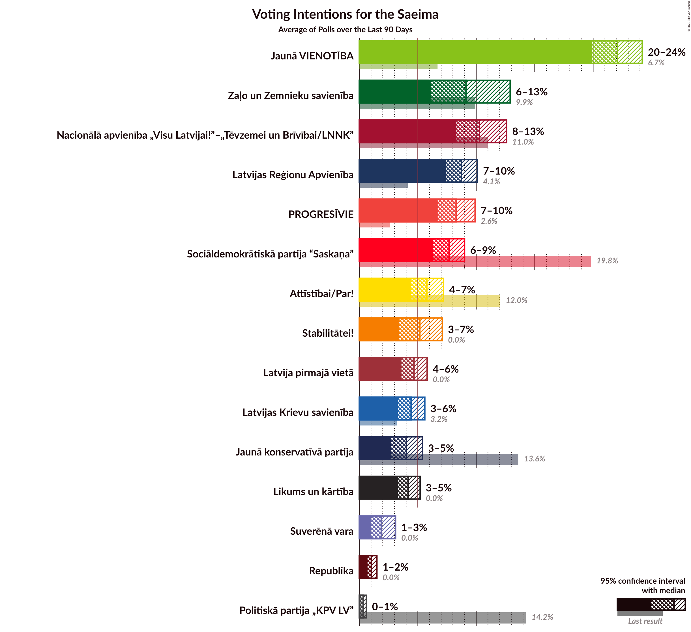

# Overview

The table below lists the most recent polls (less than 90 days old) registered and analyzed so far.

| Period     | Polling firm/Commissioner(s) | SDPS | KPV | JKP | AP! | NA | ZZS | JV | LRA | LKS | P | NSL | VL | JS |
|:----------:|:----------------------------:|:--:|:--:|:--:|:--:|:--:|:--:|:--:|:--:|:--:|:--:|:--:|:--:|:--:|
| 6 October 2018 | General Election | 19.8%   23 | 14.2%   16 | 13.6%   16 | 12.0%   13 | 11.0%   13 | 9.9%   11 | 6.7%   8 | 4.1%   0 | 3.2%   0 | 2.6%   0 | 0.8%   0 | 0.0%   0 | 0.0%   0 |
| N/A | [Poll Average](average.html) | 12–20%   15–24 | 1–5%   0–5 | 6–12%   7–14 | 11–20%   12–23 | 9–16%   10–18 | 7–19%   7–22 | 10–18%   11–21 | 3–7%   0–7 | 2–6%   0–7 | 4–9%   0–11 | N/A   N/A | N/A   N/A | N/A   N/A |
| [29 September–4 October 2020](2020-10-04-Factum.html) | Factum | 12–19%   15–23 | 1–4%   0 | 6–11%   7–14 | 14–21%   15–24 | 10–16%   11–20 | 7–12%   7–14 | 12–19%   14–22 | 3–6%   0–7 | 2–5%   0–6 | 5–10%   0–11 | N/A   N/A | N/A   N/A | N/A   N/A |
| [11–21 September 2020](2020-09-21-SKDS.html) | SKDS   Latvijas Televīzija | 15–20%   17–24 | 3–5%   0–5 | 9–13%   9–14 | 11–15%   12–17 | 9–13%   10–14 | 14–19%   16–22 | 9–13%   11–15 | 4–8%   0–8 | 3–6%   0–7 | 4–7%   0–7 | N/A   N/A | N/A   N/A | N/A   N/A |
| 6 October 2018 | General Election | 19.8%   23 | 14.2%   16 | 13.6%   16 | 12.0%   13 | 11.0%   13 | 9.9%   11 | 6.7%   8 | 4.1%   0 | 3.2%   0 | 2.6%   0 | 0.8%   0 | 0.0%   0 | 0.0%   0 |

Only polls for which at least the sample size has been published are included in the table above.

**Legend:**
+ **Top half of each row:** Voting intentions (95% confidence interval)
+ **Bottom half of each row:** Seat projections for the Saeima (95% confidence interval)
+ **SDPS:** Sociāldemokrātiskā partija “Saskaņa”
+ **KPV:** Politiskā partija „KPV LV”
+ **JKP:** Jaunā konservatīvā partija
+ **AP!:** Attīstībai/Par!
+ **NA:** Nacionālā apvienība „Visu Latvijai!”–„Tēvzemei un Brīvībai/LNNK”
+ **ZZS:** Zaļo un Zemnieku savienība
+ **JV:** Jaunā VIENOTĪBA
+ **LRA:** Latvijas Reģionu Apvienība
+ **LKS:** Latvijas Krievu savienība
+ **P:** PROGRESĪVIE
+ **NSL:** No sirds Latvijai
+ **VL:** Vienoti Latvijai
+ **JS:** Jaunā Saskaņa
+ **N/A (single party):** Party not included the published results
+ **N/A (entire row):** Calculation for this opinion poll not started yet

