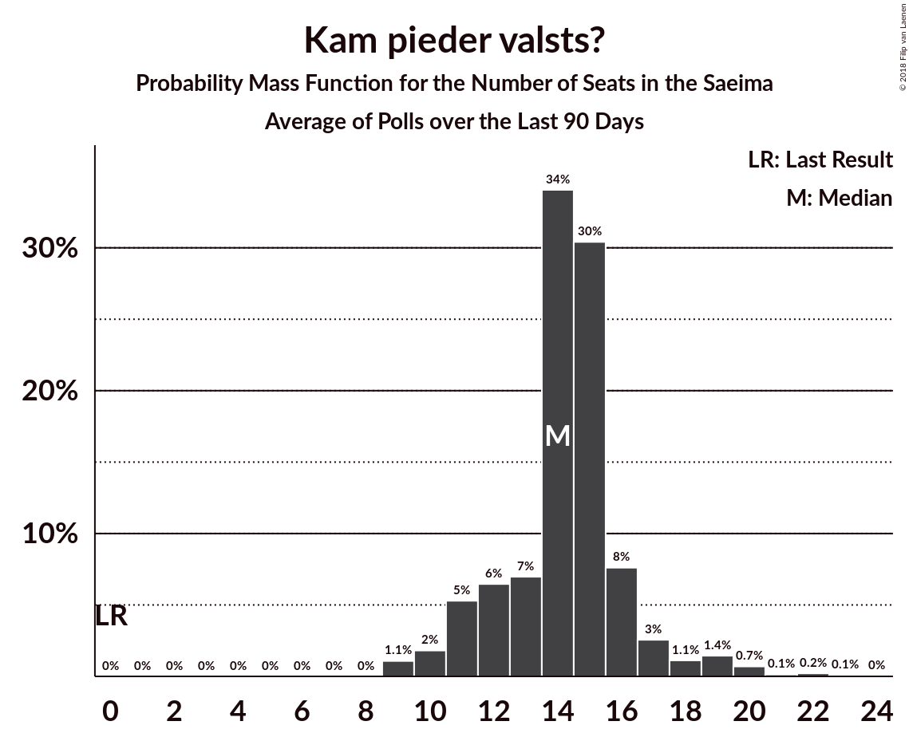

# Kam pieder valsts?

<a href="#voting-intentions">Voting Intentions</a> | <a href="#seats">Seats</a>

## Voting Intentions

Last result: **0.0%** (General Election of 4 October 2014)

### Confidence Intervals

| Period     | Polling firm/Commissioner(s) | Median | 80% Confidence Interval | 90% Confidence Interval | 95% Confidence Interval | 99% Confidence Interval |
|:----------:|:----------------:|:-----------:|:-----------------------:|:-----------------------:|:-----------------------:|:-----------------------:|
| N/A | [Poll Average](average.html) | 6.0% | 4.3–7.9% | 4.0–8.4% | 3.8–8.9% | 3.3–9.7% |
| [1–30 June 2018](2018-06-30-SKDS.html) | SKDS   Latvijas Televīzija | 7.0% | 5.8–8.4% | 5.5–8.9% | 5.2–9.2% | 4.7–10.0% |
| [1–31 May 2018](2018-05-31-SKDS.html) | SKDS   Latvijas Televīzija | 5.1% | 4.1–6.5% | 3.8–6.9% | 3.6–7.2% | 3.2–7.9% |
| [1–31 May 2018](2018-05-31-Norstat.html) | Norstat   TV3 Latvija | 4.9% | 4.0–6.1% | 3.7–6.4% | 3.5–6.7% | 3.2–7.4% |
| [1–30 April 2018](2018-04-30-SKDS.html) | SKDS   Latvijas Televīzija | 3.8% | 3.0–5.0% | 2.8–5.3% | 2.6–5.6% | 2.2–6.2% |
| [1–31 March 2018](2018-03-31-SKDS.html) | SKDS   Latvijas Televīzija | 3.3% | 2.5–4.5% | 2.3–4.8% | 2.1–5.2% | 1.8–5.8% |
| [1–28 February 2018](2018-02-28-SKDS.html) | SKDS   Latvijas Televīzija | 3.1% | 2.3–4.2% | 2.1–4.5% | 2.0–4.8% | 1.7–5.3% |
| [1–31 January 2018](2018-01-31-SKDS.html) | SKDS   Latvijas Televīzija | 3.5% | 2.7–4.7% | 2.5–5.0% | 2.3–5.3% | 1.9–5.9% |

### Probability Mass Function

The following table shows the probability mass function per percentage block of voting intentions for the [poll average](average.html) for Kam pieder valsts?.

| Voting Intentions | Probability | Accumulated | Special Marks |
|:-----------------:|:-----------:|:-----------:|:-------------:|
| 0.0–0.5% | 0% | 100% | Last Result |
| 0.5–1.5% | 0% | 100% |  |
| 1.5–2.5% | 0% | 100% |  |
| 2.5–3.5% | 1.3% | 100% |  |
| 3.5–4.5% | 14% | 98.7% |  |
| 4.5–5.5% | 25% | 85% |  |
| 5.5–6.5% | 23% | 60% | Median |
| 6.5–7.5% | 20% | 37% |  |
| 7.5–8.5% | 12% | 16% |  |
| 8.5–9.5% | 4% | 4% |  |
| 9.5–10.5% | 0.6% | 0.6% |  |
| 10.5–11.5% | 0.1% | 0.1% |  |
| 11.5–12.5% | 0% | 0% |  |

## Seats

Last result: **0** seats (General Election of 4 October 2014)

### Confidence Intervals

| Period     | Polling firm/Commissioner(s) | Median | 80% Confidence Interval | 90% Confidence Interval | 95% Confidence Interval | 99% Confidence Interval |
|:----------:|:----------------:|:------:|:-----------------------:|:-----------------------:|:-----------------------:|:-----------------------:|
| N/A | [Poll Average](average.html) | 7 | 0–9 | 0–9 | 0–10 | 0–11 |
| [1–30 June 2018](2018-06-30-SKDS.html) | SKDS   Latvijas Televīzija | 9 | 6–9 | 6–10 | 6–10 | 0–11 |
| [1–31 May 2018](2018-05-31-SKDS.html) | SKDS   Latvijas Televīzija | 0 | 0–8 | 0–9 | 0–9 | 0–9 |
| [1–31 May 2018](2018-05-31-Norstat.html) | Norstat   TV3 Latvija | 6 | 0–8 | 0–8 | 0–8 | 0–9 |
| [1–30 April 2018](2018-04-30-SKDS.html) | SKDS   Latvijas Televīzija | 0 | 0 | 0 | 0–6 | 0–7 |
| [1–31 March 2018](2018-03-31-SKDS.html) | SKDS   Latvijas Televīzija | 0 | 0 | 0 | 0 | 0–6 |
| [1–28 February 2018](2018-02-28-SKDS.html) | SKDS   Latvijas Televīzija | 0 | 0 | 0 | 0 | 0–6 |
| [1–31 January 2018](2018-01-31-SKDS.html) | SKDS   Latvijas Televīzija | 0 | 0 | 0 | 0–6 | 0–7 |

### Probability Mass Function

The following table shows the probability mass function per seat for the [poll average](average.html) for Kam pieder valsts?.

| Number of Seats | Probability | Accumulated | Special Marks |
|:---------------:|:-----------:|:-----------:|:-------------:|
| 0 | 25% | 100% | Last Result |
| 1 | 0% | 75% |  |
| 2 | 0% | 75% |  |
| 3 | 0% | 75% |  |
| 4 | 0% | 75% |  |
| 5 | 0% | 75% |  |
| 6 | 8% | 75% |  |
| 7 | 18% | 66% | Median |
| 8 | 19% | 48% |  |
| 9 | 26% | 29% |  |
| 10 | 2% | 3% |  |
| 11 | 0.7% | 0.8% |  |
| 12 | 0.1% | 0.1% |  |
| 13 | 0% | 0% |  |

