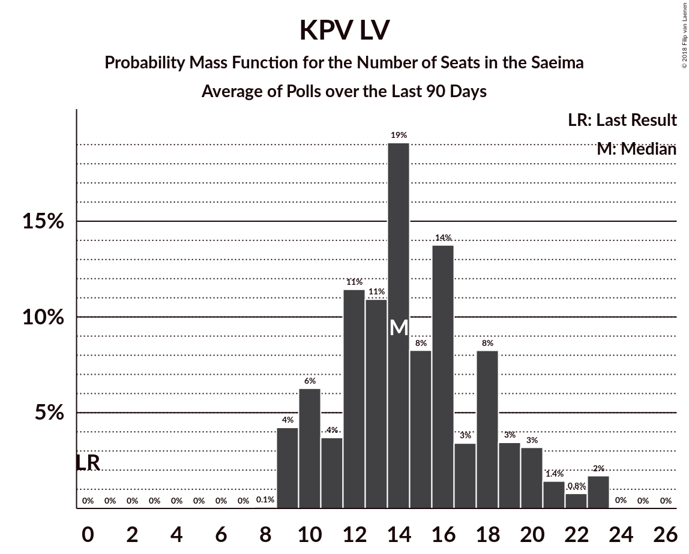

# KPV LV

<a href="#voting-intentions">Voting Intentions</a> | <a href="#seats">Seats</a>

## Voting Intentions

Last result: **0.0%** (General Election of 4 October 2014)

### Confidence Intervals

| Period     | Polling firm/Commissioner(s) | Median | 80% Confidence Interval | 90% Confidence Interval | 95% Confidence Interval | 99% Confidence Interval |
|:----------:|:----------------:|:-----------:|:-----------------------:|:-----------------------:|:-----------------------:|:-----------------------:|
| N/A | [Poll Average](average.html) | 11.8% | 9.7–16.7% | 9.1–17.5% | 8.6–18.1% | 7.8–19.3% |
| [17–23 September 2018](2018-09-23-FACTUM.html) | FACTUM | 11.1% | 10.3–12.0% | 10.1–12.3% | 9.9–12.5% | 9.6–12.9% |
| [8–18 September 2018](2018-09-18-SKDS.html) | SKDS   Latvijas Televīzija | 10.0% | 8.6–11.8% | 8.2–12.2% | 7.9–12.7% | 7.3–13.5% |
| [10–16 September 2018](2018-09-16-FACTUM.html) | FACTUM | 10.8% | 9.7–12.1% | 9.4–12.4% | 9.2–12.7% | 8.7–13.4% |
| [10–14 September 2018](2018-09-14-Norstat.html) | Norstat | 13.0% | 10.7–15.9% | 10.1–16.7% | 9.6–17.4% | 8.6–18.9% |
| [8 August–12 September 2018](2018-09-12-KantarTNS.html) | Kantar TNS   Delfi | 16.1% | 14.4–18.0% | 13.9–18.5% | 13.5–19.0% | 12.7–20.0% |
| [31 August–9 September 2018](2018-09-09-FACTUM.html) | FACTUM | 12.8% | 11.9–14.3% | 11.5–14.6% | 11.3–14.9% | 10.7–15.6% |
| [30 August–5 September 2018](2018-09-05-FACTUM.html) | FACTUM | 12.6% | 12.1–14.0% | 11.8–14.3% | 11.6–14.6% | 11.1–15.1% |
| [27 August–2 September 2018](2018-09-02-FACTUM.html) | FACTUM | 11.6% | 11.1–13.0% | 10.8–13.3% | 10.6–13.5% | 10.2–14.0% |
| [25–31 August 2018](2018-08-31-FACTUM.html) | FACTUM | 12.4% | 11.8–13.8% | 11.5–14.1% | 11.3–14.4% | 10.8–14.9% |
| [22–28 August 2018](2018-08-28-FACTUM.html) | FACTUM | 14.6% | 13.8–16.4% | 13.5–16.7% | 13.2–17.1% | 12.7–17.7% |
| [20–26 August 2018](2018-08-26-FACTUM.html) | FACTUM | 16.2% | 15.4–18.0% | 15.0–18.4% | 14.7–18.7% | 14.2–19.4% |
| [1–23 August 2018](2018-08-23-SKDS.html) | SKDS   Latvijas Televīzija | 11.5% | 10.1–13.5% | 9.6–14.0% | 9.3–14.5% | 8.6–15.4% |
| [13–19 August 2018](2018-08-19-FACTUM.html) | FACTUM | 15.6% | 14.8–17.3% | 14.4–17.6% | 14.2–18.0% | 13.6–18.6% |
| [17–23 July 2018](2018-07-23-FACTUM.html) | FACTUM | 14.3% | 13.6–16.0% | 13.3–16.3% | 13.0–16.6% | 12.5–17.2% |
| [1–30 June 2018](2018-06-30-SKDS.html) | SKDS   Latvijas Televīzija | 7.0% | 5.8–8.4% | 5.5–8.9% | 5.2–9.2% | 4.7–10.0% |
| [1–31 May 2018](2018-05-31-SKDS.html) | SKDS   Latvijas Televīzija | 5.1% | 4.1–6.5% | 3.8–6.9% | 3.6–7.2% | 3.2–7.9% |
| [1–31 May 2018](2018-05-31-Norstat.html) | Norstat   TV3 Latvija | 4.9% | 4.0–6.1% | 3.7–6.4% | 3.5–6.7% | 3.2–7.4% |
| [1–30 April 2018](2018-04-30-SKDS.html) | SKDS   Latvijas Televīzija | 3.8% | 3.0–5.0% | 2.8–5.3% | 2.6–5.6% | 2.2–6.2% |
| [1–31 March 2018](2018-03-31-SKDS.html) | SKDS   Latvijas Televīzija | 3.3% | 2.5–4.5% | 2.3–4.8% | 2.1–5.2% | 1.8–5.8% |
| [1–28 February 2018](2018-02-28-SKDS.html) | SKDS   Latvijas Televīzija | 3.1% | 2.3–4.2% | 2.1–4.5% | 2.0–4.8% | 1.7–5.3% |
| [1–31 January 2018](2018-01-31-SKDS.html) | SKDS   Latvijas Televīzija | 3.5% | 2.7–4.7% | 2.5–5.0% | 2.3–5.3% | 1.9–5.9% |

### Probability Mass Function

The following table shows the probability mass function per percentage block of voting intentions for the [poll average](average.html) for KPV LV.

| Voting Intentions | Probability | Accumulated | Special Marks |
|:-----------------:|:-----------:|:-----------:|:-------------:|
| 0.0–0.5% | 0% | 100% | Last Result |
| 0.5–1.5% | 0% | 100% |  |
| 1.5–2.5% | 0% | 100% |  |
| 2.5–3.5% | 0% | 100% |  |
| 3.5–4.5% | 0% | 100% |  |
| 4.5–5.5% | 0% | 100% |  |
| 5.5–6.5% | 0% | 100% |  |
| 6.5–7.5% | 0.3% | 100% |  |
| 7.5–8.5% | 2% | 99.7% |  |
| 8.5–9.5% | 6% | 98% |  |
| 9.5–10.5% | 14% | 91% |  |
| 10.5–11.5% | 23% | 78% |  |
| 11.5–12.5% | 13% | 55% | Median |
| 12.5–13.5% | 7% | 42% |  |
| 13.5–14.5% | 7% | 35% |  |
| 14.5–15.5% | 8% | 28% |  |
| 15.5–16.5% | 9% | 20% |  |
| 16.5–17.5% | 6% | 11% |  |
| 17.5–18.5% | 3% | 5% |  |
| 18.5–19.5% | 1.1% | 1.4% |  |
| 19.5–20.5% | 0.3% | 0.3% |  |
| 20.5–21.5% | 0% | 0.1% |  |
| 21.5–22.5% | 0% | 0% |  |

## Seats

Last result: **0** seats (General Election of 4 October 2014)

### Confidence Intervals

| Period     | Polling firm/Commissioner(s) | Median | 80% Confidence Interval | 90% Confidence Interval | 95% Confidence Interval | 99% Confidence Interval |
|:----------:|:----------------:|:------:|:-----------------------:|:-----------------------:|:-----------------------:|:-----------------------:|
| N/A | [Poll Average](average.html) | 14 | 11–19 | 10–20 | 9–22 | 9–23 |
| [17–23 September 2018](2018-09-23-FACTUM.html) | FACTUM | 12 | 12 | 10–12 | 10–14 | 10–14 |
| [8–18 September 2018](2018-09-18-SKDS.html) | SKDS   Latvijas Televīzija | 12 | 9–14 | 9–14 | 9–15 | 9–16 |
| [10–16 September 2018](2018-09-16-FACTUM.html) | FACTUM | 11 | 10–14 | 10–14 | 10–14 | 9–15 |
| [10–14 September 2018](2018-09-14-Norstat.html) | Norstat | 16 | 13–19 | 12–20 | 11–22 | 10–23 |
| [8 August–12 September 2018](2018-09-12-KantarTNS.html) | Kantar TNS   Delfi | 18 | 16–21 | 15–23 | 15–23 | 14–23 |
| [31 August–9 September 2018](2018-09-09-FACTUM.html) | FACTUM | 14 | 13–15 | 12–16 | 12–17 | 11–17 |
| [30 August–5 September 2018](2018-09-05-FACTUM.html) | FACTUM | 14 | 14–15 | 13–16 | 13–16 | 12–17 |
| [27 August–2 September 2018](2018-09-02-FACTUM.html) | FACTUM | 13 | 13–14 | 12–15 | 12–15 | 10–15 |
| [25–31 August 2018](2018-08-31-FACTUM.html) | FACTUM | 14 | 13–15 | 13–15 | 12–15 | 12–17 |
| [22–28 August 2018](2018-08-28-FACTUM.html) | FACTUM | 18 | 17–20 | 16–21 | 16–21 | 15–22 |
| [20–26 August 2018](2018-08-26-FACTUM.html) | FACTUM | 18 | 17–19 | 16–20 | 16–20 | 15–21 |
| [1–23 August 2018](2018-08-23-SKDS.html) | SKDS   Latvijas Televīzija | 15 | 12–16 | 11–17 | 11–17 | 9–17 |
| [13–19 August 2018](2018-08-19-FACTUM.html) | FACTUM | 18 | 17–19 | 16–20 | 16–20 | 15–20 |
| [17–23 July 2018](2018-07-23-FACTUM.html) | FACTUM | 16 | 14–17 | 14–17 | 13–18 | 13–19 |
| [1–30 June 2018](2018-06-30-SKDS.html) | SKDS   Latvijas Televīzija | 9 | 6–9 | 6–9 | 6–10 | 0–11 |
| [1–31 May 2018](2018-05-31-SKDS.html) | SKDS   Latvijas Televīzija | 0 | 0–8 | 0–9 | 0–9 | 0–9 |
| [1–31 May 2018](2018-05-31-Norstat.html) | Norstat   TV3 Latvija | 0 | 0–8 | 0–8 | 0–8 | 0–9 |
| [1–30 April 2018](2018-04-30-SKDS.html) | SKDS   Latvijas Televīzija | 0 | 0 | 0 | 0–6 | 0–7 |
| [1–31 March 2018](2018-03-31-SKDS.html) | SKDS   Latvijas Televīzija | 0 | 0 | 0 | 0 | 0–6 |
| [1–28 February 2018](2018-02-28-SKDS.html) | SKDS   Latvijas Televīzija | 0 | 0 | 0 | 0 | 0–6 |
| [1–31 January 2018](2018-01-31-SKDS.html) | SKDS   Latvijas Televīzija | 0 | 0 | 0 | 0–6 | 0–7 |

### Probability Mass Function

The following table shows the probability mass function per seat for the [poll average](average.html) for KPV LV.

| Number of Seats | Probability | Accumulated | Special Marks |
|:---------------:|:-----------:|:-----------:|:-------------:|
| 0 | 0% | 100% | Last Result |
| 1 | 0% | 100% |  |
| 2 | 0% | 100% |  |
| 3 | 0% | 100% |  |
| 4 | 0% | 100% |  |
| 5 | 0% | 100% |  |
| 6 | 0% | 100% |  |
| 7 | 0% | 100% |  |
| 8 | 0.1% | 100% |  |
| 9 | 3% | 99.9% |  |
| 10 | 6% | 96% |  |
| 11 | 4% | 90% |  |
| 12 | 27% | 86% |  |
| 13 | 3% | 59% |  |
| 14 | 13% | 56% | Median |
| 15 | 8% | 44% |  |
| 16 | 14% | 36% |  |
| 17 | 3% | 22% |  |
| 18 | 8% | 19% |  |
| 19 | 3% | 11% |  |
| 20 | 3% | 7% |  |
| 21 | 1.4% | 4% |  |
| 22 | 0.8% | 3% |  |
| 23 | 2% | 2% |  |
| 24 | 0% | 0.1% |  |
| 25 | 0% | 0% |  |

