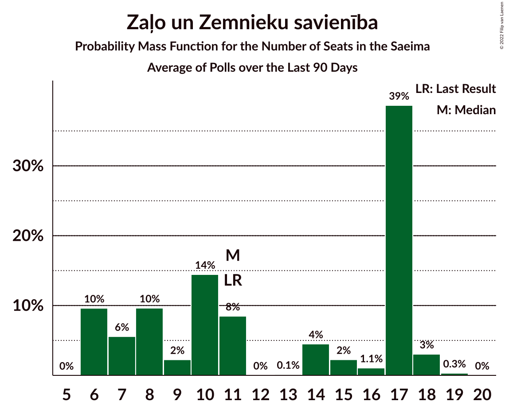

# Zaļo un Zemnieku savienība

<a href="#voting-intentions">Voting Intentions</a> | <a href="#seats">Seats</a>

## Voting Intentions

Last result: **9.9%** (General Election of 6 October 2018)

### Confidence Intervals

| Period     | Polling firm/Commissioner(s) | Median | 80% Confidence Interval | 90% Confidence Interval | 95% Confidence Interval | 99% Confidence Interval |
|:----------:|:----------------:|:-----------:|:-----------------------:|:-----------------------:|:-----------------------:|:-----------------------:|
| N/A | [Poll Average](average.html) | 14.1% | 12.6–16.7% | 12.3–17.2% | 12.0–17.7% | 11.6–18.6% |
| [1–17 December 2020](2020-12-17-Factum.html) | Factum | 13.1% | 12.3–14.1% | 12.0–14.3% | 11.8–14.5% | 11.4–15.0% |
| [11–30 November 2020](2020-11-30-Factum.html) | Factum | 12.1% | 10.8–13.7% | 10.4–14.1% | 10.0–14.5% | 9.4–15.3% |
| [26–30 October 2020](2020-10-30-Factum.html) | Factum | 10.6% | 9.3–12.0% | 9.0–12.4% | 8.7–12.8% | 8.1–13.5% |
| [9–20 October 2020](2020-10-20-SKDS.html) | SKDS   Latvijas Televīzija | 15.6% | 14.1–17.3% | 13.7–17.7% | 13.4–18.1% | 12.7–19.0% |
| [11–21 September 2020](2020-09-21-SKDS.html) | SKDS   Latvijas Televīzija | 16.6% | 15.0–18.2% | 14.6–18.7% | 14.3–19.1% | 13.5–20.0% |
| [1–31 August 2020](2020-08-31-SKDS.html) | SKDS   Latvijas Televīzija | 19.3% | 17.7–21.0% | 17.2–21.5% | 16.8–21.9% | 16.1–22.8% |
| [1–24 August 2020](2020-08-24-Factum.html) | Factum | 10.0% | 8.7–11.7% | 8.3–12.2% | 7.9–12.6% | 7.3–13.5% |
| [7–20 August 2020](2020-08-20-SKDS.html) | SKDS   Latvijas Televīzija | 19.0% | 17.4–20.8% | 16.9–21.3% | 16.6–21.7% | 15.8–22.6% |
| [1–31 July 2020](2020-07-31-SKDS.html) | SKDS   Latvijas Televīzija | 8.3% | 7.2–9.6% | 6.9–9.9% | 6.6–10.3% | 6.1–10.9% |
| [8–31 July 2020](2020-07-31-Factum.html) | Factum | 10.0% | 9.2–10.9% | 9.0–11.2% | 8.8–11.4% | 8.4–11.9% |
| [1–30 June 2020](2020-06-30-SKDS.html) | SKDS   Latvijas Televīzija | 17.2% | 15.1–19.6% | 14.5–20.3% | 14.0–20.9% | 13.0–22.1% |
| [1–30 June 2020](2020-06-30-Factum.html) | Factum | 10.8% | 9.8–11.9% | 9.6–12.2% | 9.3–12.5% | 8.9–13.0% |
| [23 May–2 June 2020](2020-06-02-SKDS.html) | SKDS   Latvijas Televīzija | 15.9% | 13.9–18.3% | 13.4–19.0% | 12.9–19.6% | 12.0–20.8% |
| [18–31 May 2020](2020-05-31-Factum.html) | Factum | 9.0% | 8.0–10.1% | 7.7–10.5% | 7.5–10.7% | 7.0–11.3% |
| [7–26 April 2020](2020-04-26-Factum.html) | Factum | 11.0% | 10.0–12.2% | 9.7–12.5% | 9.4–12.8% | 9.0–13.4% |
| [1–31 March 2020](2020-03-31-SKDS.html) | SKDS   Latvijas Televīzija | 16.1% | 14.6–17.7% | 14.2–18.2% | 13.8–18.6% | 13.1–19.4% |
| [4–28 March 2020](2020-03-28-Factum.html) | Factum | 12.0% | 11.1–13.0% | 10.8–13.2% | 10.6–13.5% | 10.2–14.0% |
| [24–28 February 2020](2020-02-28-Factum.html) | Factum | 13.0% | 11.6–14.7% | 11.2–15.2% | 10.9–15.6% | 10.2–16.4% |
| [7–18 February 2020](2020-02-18-SKDS.html) | SKDS   Latvijas Televīzija | 15.6% | 14.1–17.3% | 13.7–17.7% | 13.3–18.1% | 12.6–19.0% |
| [28 January–1 February 2020](2020-02-01-Factum.html) | Factum | 9.9% | 8.6–11.6% | 8.2–12.0% | 7.9–12.4% | 7.3–13.2% |
| [1–31 January 2020](2020-01-31-SKDS.html) | SKDS   Latvijas Televīzija | 15.0% | 13.4–17.0% | 12.9–17.5% | 12.5–18.0% | 11.8–18.9% |
| [18–31 December 2019](2019-12-31-Factum.html) | Factum | 10.0% | 8.9–11.2% | 8.6–11.5% | 8.4–11.8% | 7.9–12.5% |
| [30 November–12 December 2019](2019-12-12-SKDS.html) | SKDS   Latvijas Televīzija | 14.6% | 13.2–16.3% | 12.8–16.8% | 12.4–17.2% | 11.7–18.0% |
| [21–24 November 2019](2019-11-24-Factum.html) | Factum | 9.9% | 8.8–11.3% | 8.5–11.7% | 8.2–12.0% | 7.7–12.7% |
| [2–12 November 2019](2019-11-12-SKDS.html) | SKDS   Latvijas Televīzija | 13.7% | 12.3–15.3% | 11.9–15.7% | 11.6–16.1% | 10.9–16.9% |
| [15–22 October 2019](2019-10-22-Factum.html) | Factum | 11.0% | 9.3–12.9% | 8.9–13.5% | 8.5–14.0% | 7.8–15.0% |
| [5–16 October 2019](2019-10-16-SKDS.html) | SKDS   Latvijas Televīzija | 14.1% | 12.7–15.7% | 12.3–16.1% | 12.0–16.5% | 11.3–17.3% |
| [27–30 September 2019](2019-09-30-Factum.html) | Factum | 10.0% | 8.5–12.0% | 8.0–12.5% | 7.7–13.0% | 7.0–14.0% |
| [6–18 September 2019](2019-09-18-SKDS.html) | SKDS   Latvijas Televīzija | 13.6% | 12.2–15.1% | 11.8–15.6% | 11.5–16.0% | 10.8–16.7% |
| [1–31 August 2019](2019-08-31-SKDS.html) | SKDS   Latvijas Televīzija | 13.1% | 11.7–14.7% | 11.3–15.2% | 11.0–15.6% | 10.3–16.4% |
| [27–30 August 2019](2019-08-30-Factum.html) | Factum | 11.0% | 9.9–12.3% | 9.6–12.7% | 9.3–13.0% | 8.8–13.6% |
| [1–31 July 2019](2019-07-31-SKDS.html) | SKDS   Latvijas Televīzija | 13.1% | 11.7–14.7% | 11.3–15.2% | 11.0–15.6% | 10.3–16.4% |
| [22–29 July 2019](2019-07-29-Factum.html) | Factum | 9.9% | 8.8–11.2% | 8.5–11.6% | 8.2–11.9% | 7.7–12.6% |
| [26–30 June 2019](2019-06-30-Factum.html) | Factum | 9.0% | 7.8–10.3% | 7.5–10.7% | 7.2–11.1% | 6.7–11.8% |
| [7–17 June 2019](2019-06-17-SKDS.html) | SKDS   Latvijas Televīzija | 10.0% | N/A | N/A | N/A | N/A |
| [1–31 May 2019](2019-05-31-SKDS.html) | SKDS   Latvijas Televīzija | 13.6% | N/A | N/A | N/A | N/A |
| [1–28 May 2019](2019-05-28-Factum.html) | Factum | 8.0% | N/A | N/A | N/A | N/A |
| [1–21 May 2019](2019-05-21-BergResearch.html) | Berg Research   jauns.lv | 4.8% | N/A | N/A | N/A | N/A |
| [1–30 April 2019](2019-04-30-Factum.html) | Factum | 10.9% | N/A | N/A | N/A | N/A |
| [1–27 April 2019](2019-04-27-SKDS.html) | SKDS   Latvijas Televīzija | 10.9% | N/A | N/A | N/A | N/A |
| [12–22 April 2019](2019-04-22-LatvijasFakti.html) | Latvijas Fakti | 11.0% | N/A | N/A | N/A | N/A |
| [10–14 April 2019](2019-04-14-Factum.html) | Factum | 8.0% | N/A | N/A | N/A | N/A |
| [26 March–5 April 2019](2019-04-05-Factum.html) | Factum | 9.0% | N/A | N/A | N/A | N/A |
| [1–31 March 2019](2019-03-31-SKDS.html) | SKDS   Latvijas Televīzija | 12.8% | N/A | N/A | N/A | N/A |
| [1–31 March 2019](2019-03-31-Factum.html) | Factum | 10.1% | N/A | N/A | N/A | N/A |
| [3–18 March 2019](2019-03-18-LatvijasFakti.html) | Latvijas Fakti | 14.9% | N/A | N/A | N/A | N/A |
| [1–28 February 2019](2019-02-28-SKDS.html) | SKDS   Latvijas Televīzija | 8.9% | N/A | N/A | N/A | N/A |
| [11–23 January 2019](2019-01-23-SKDS.html) | SKDS   Latvijas Televīzija | 11.0% | N/A | N/A | N/A | N/A |
| [1–12 December 2018](2018-12-12-SKDS.html) | SKDS   Latvijas Televīzija | 9.2% | N/A | N/A | N/A | N/A |
| [3–15 November 2018](2018-11-15-SKDS.html) | SKDS   Latvijas Televīzija | 9.4% | N/A | N/A | N/A | N/A |
| [13–23 October 2018](2018-10-23-SKDS.html) | SKDS   Latvijas Televīzija | 7.2% | N/A | N/A | N/A | N/A |

### Probability Mass Function

The following table shows the probability mass function per percentage block of voting intentions for the [poll average](average.html) for Zaļo un Zemnieku savienība.

| Voting Intentions | Probability | Accumulated | Special Marks |
|:-----------------:|:-----------:|:-----------:|:-------------:|
| 9.5–10.5% | 0% | 100% | Last Result |
| 10.5–11.5% | 0.4% | 100% |  |
| 11.5–12.5% | 9% | 99.6% |  |
| 12.5–13.5% | 28% | 91% |  |
| 13.5–14.5% | 20% | 62% | Median |
| 14.5–15.5% | 15% | 42% |  |
| 15.5–16.5% | 15% | 27% |  |
| 16.5–17.5% | 8% | 12% |  |
| 17.5–18.5% | 3% | 3% |  |
| 18.5–19.5% | 0.5% | 0.6% |  |
| 19.5–20.5% | 0.1% | 0.1% |  |
| 20.5–21.5% | 0% | 0% |  |

## Seats

Last result: **11** seats (General Election of 6 October 2018)

### Confidence Intervals

| Period     | Polling firm/Commissioner(s) | Median | 80% Confidence Interval | 90% Confidence Interval | 95% Confidence Interval | 99% Confidence Interval |
|:----------:|:----------------:|:------:|:-----------------------:|:-----------------------:|:-----------------------:|:-----------------------:|
| N/A | [Poll Average](average.html) | 17 | 16–18 | 14–19 | 13–20 | 12–22 |
| [1–17 December 2020](2020-12-17-Factum.html) | Factum | 17 | 16–18 | 16–18 | 15–18 | 15–18 |
| [11–30 November 2020](2020-11-30-Factum.html) | Factum | 15 | 13–18 | 12–18 | 12–18 | 11–18 |
| [26–30 October 2020](2020-10-30-Factum.html) | Factum | 13 | 12–14 | 12–15 | 11–16 | 11–17 |
| [9–20 October 2020](2020-10-20-SKDS.html) | SKDS   Latvijas Televīzija | 17 | 14–19 | 13–20 | 12–22 | 12–22 |
| [11–21 September 2020](2020-09-21-SKDS.html) | SKDS   Latvijas Televīzija | 18 | 17–21 | 17–22 | 16–22 | 15–22 |
| [1–31 August 2020](2020-08-31-SKDS.html) | SKDS   Latvijas Televīzija | 22 | 20–23 | 18–23 | 17–23 | 17–24 |
| [1–24 August 2020](2020-08-24-Factum.html) | Factum | 12 | 11–14 | 11–15 | 10–16 | 9–18 |
| [7–20 August 2020](2020-08-20-SKDS.html) | SKDS   Latvijas Televīzija | 22 | 19–22 | 18–23 | 17–24 | 17–25 |
| [1–31 July 2020](2020-07-31-SKDS.html) | SKDS   Latvijas Televīzija | 20 | 17–22 | 17–23 | 17–23 | 15–26 |
| [8–31 July 2020](2020-07-31-Factum.html) | Factum | 12 | 11–13 | 11–14 | 11–14 | 11–15 |
| [1–30 June 2020](2020-06-30-SKDS.html) | SKDS   Latvijas Televīzija | 19 | 16–22 | 16–23 | 16–24 | 14–27 |
| [1–30 June 2020](2020-06-30-Factum.html) | Factum | 12 | 11–15 | 11–15 | 11–15 | 11–15 |
| [23 May–2 June 2020](2020-06-02-SKDS.html) | SKDS   Latvijas Televīzija | 17 | 16–22 | 14–22 | 14–23 | 13–24 |
| [18–31 May 2020](2020-05-31-Factum.html) | Factum | 11 | 11–12 | 10–13 | 10–13 | 8–14 |
| [7–26 April 2020](2020-04-26-Factum.html) | Factum | 12 | 11–13 | 11–14 | 11–14 | 11–15 |
| [1–31 March 2020](2020-03-31-SKDS.html) | SKDS   Latvijas Televīzija | 18 | 15–20 | 14–20 | 14–20 | 14–23 |
| [4–28 March 2020](2020-03-28-Factum.html) | Factum | 13 | 12–14 | 12–15 | 11–15 | 11–16 |
| [24–28 February 2020](2020-02-28-Factum.html) | Factum | 14 | 13–17 | 12–18 | 12–18 | 11–18 |
| [7–18 February 2020](2020-02-18-SKDS.html) | SKDS   Latvijas Televīzija | 17 | 15–19 | 15–20 | 15–20 | 14–22 |
| [28 January–1 February 2020](2020-02-01-Factum.html) | Factum | 11 | 11–13 | 10–14 | 9–14 | 7–15 |
| [1–31 January 2020](2020-01-31-SKDS.html) | SKDS   Latvijas Televīzija | 17 | 14–19 | 14–20 | 14–20 | 13–20 |
| [18–31 December 2019](2019-12-31-Factum.html) | Factum | 11 | 11–12 | 11–13 | 10–13 | 10–15 |
| [30 November–12 December 2019](2019-12-12-SKDS.html) | SKDS   Latvijas Televīzija | 17 | 17 | 16–17 | 15–17 | 14–19 |
| [21–24 November 2019](2019-11-24-Factum.html) | Factum | 11 | 11–14 | 11–14 | 10–14 | 9–15 |
| [2–12 November 2019](2019-11-12-SKDS.html) | SKDS   Latvijas Televīzija | 16 | 14–17 | 13–17 | 13–18 | 11–19 |
| [15–22 October 2019](2019-10-22-Factum.html) | Factum | 12 | 11–14 | 11–14 | 11–15 | 10–16 |
| [5–16 October 2019](2019-10-16-SKDS.html) | SKDS   Latvijas Televīzija | 17 | 14–17 | 13–19 | 13–20 | 12–21 |
| [27–30 September 2019](2019-09-30-Factum.html) | Factum | 11 | 11–13 | 10–13 | 10–14 | 9–15 |
| [6–18 September 2019](2019-09-18-SKDS.html) | SKDS   Latvijas Televīzija | 17 | 14–17 | 14–17 | 13–17 | 12–20 |
| [1–31 August 2019](2019-08-31-SKDS.html) | SKDS   Latvijas Televīzija | 19 | 17–19 | 12–19 | 12–19 | 11–19 |
| [27–30 August 2019](2019-08-30-Factum.html) | Factum | 16 | 16 | 11–16 | 11–16 | 11–17 |
| [1–31 July 2019](2019-07-31-SKDS.html) | SKDS   Latvijas Televīzija | 16 | 13–17 | 12–17 | 12–17 | 11–20 |
| [22–29 July 2019](2019-07-29-Factum.html) | Factum | 13 | 11–13 | 11–13 | 10–13 | 7–13 |
| [26–30 June 2019](2019-06-30-Factum.html) | Factum | 11 | 8–12 | 7–12 | 7–12 | 7–14 |
| [7–17 June 2019](2019-06-17-SKDS.html) | SKDS   Latvijas Televīzija |  |  |  |  |  |
| [1–31 May 2019](2019-05-31-SKDS.html) | SKDS   Latvijas Televīzija |  |  |  |  |  |
| [1–28 May 2019](2019-05-28-Factum.html) | Factum |  |  |  |  |  |
| [1–21 May 2019](2019-05-21-BergResearch.html) | Berg Research   jauns.lv |  |  |  |  |  |
| [1–30 April 2019](2019-04-30-Factum.html) | Factum |  |  |  |  |  |
| [1–27 April 2019](2019-04-27-SKDS.html) | SKDS   Latvijas Televīzija |  |  |  |  |  |
| [12–22 April 2019](2019-04-22-LatvijasFakti.html) | Latvijas Fakti |  |  |  |  |  |
| [10–14 April 2019](2019-04-14-Factum.html) | Factum |  |  |  |  |  |
| [26 March–5 April 2019](2019-04-05-Factum.html) | Factum |  |  |  |  |  |
| [1–31 March 2019](2019-03-31-SKDS.html) | SKDS   Latvijas Televīzija |  |  |  |  |  |
| [1–31 March 2019](2019-03-31-Factum.html) | Factum |  |  |  |  |  |
| [3–18 March 2019](2019-03-18-LatvijasFakti.html) | Latvijas Fakti |  |  |  |  |  |
| [1–28 February 2019](2019-02-28-SKDS.html) | SKDS   Latvijas Televīzija |  |  |  |  |  |
| [11–23 January 2019](2019-01-23-SKDS.html) | SKDS   Latvijas Televīzija |  |  |  |  |  |
| [1–12 December 2018](2018-12-12-SKDS.html) | SKDS   Latvijas Televīzija |  |  |  |  |  |
| [3–15 November 2018](2018-11-15-SKDS.html) | SKDS   Latvijas Televīzija |  |  |  |  |  |
| [13–23 October 2018](2018-10-23-SKDS.html) | SKDS   Latvijas Televīzija |  |  |  |  |  |

### Probability Mass Function

The following table shows the probability mass function per seat for the [poll average](average.html) for Zaļo un Zemnieku savienība.

| Number of Seats | Probability | Accumulated | Special Marks |
|:---------------:|:-----------:|:-----------:|:-------------:|
| 11 | 0% | 100% | Last Result |
| 12 | 1.3% | 100% |  |
| 13 | 2% | 98.7% |  |
| 14 | 2% | 97% |  |
| 15 | 3% | 94% |  |
| 16 | 31% | 91% |  |
| 17 | 24% | 60% | Median |
| 18 | 28% | 36% |  |
| 19 | 5% | 9% |  |
| 20 | 0.6% | 3% |  |
| 21 | 1.0% | 2% |  |
| 22 | 1.5% | 2% |  |
| 23 | 0% | 0% |  |

